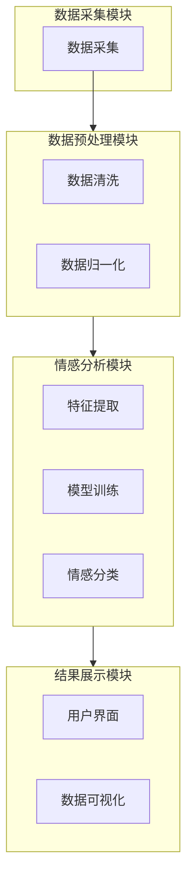
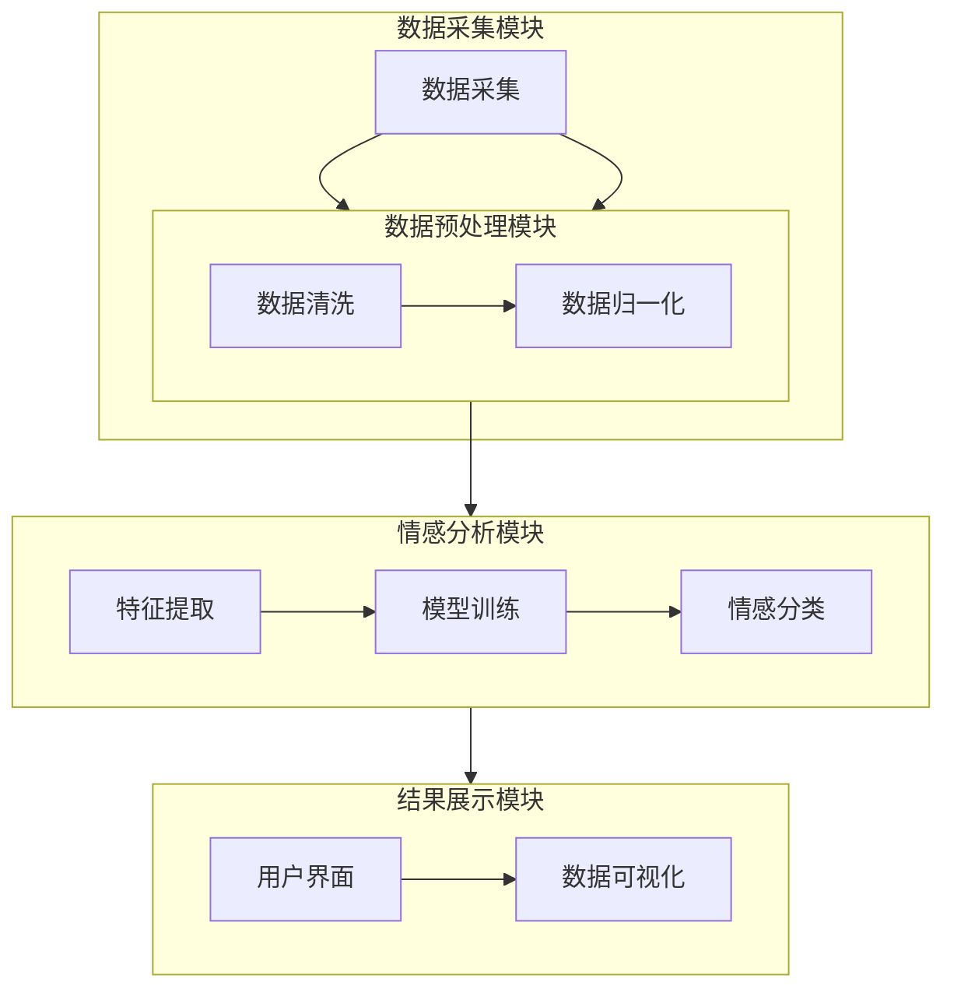
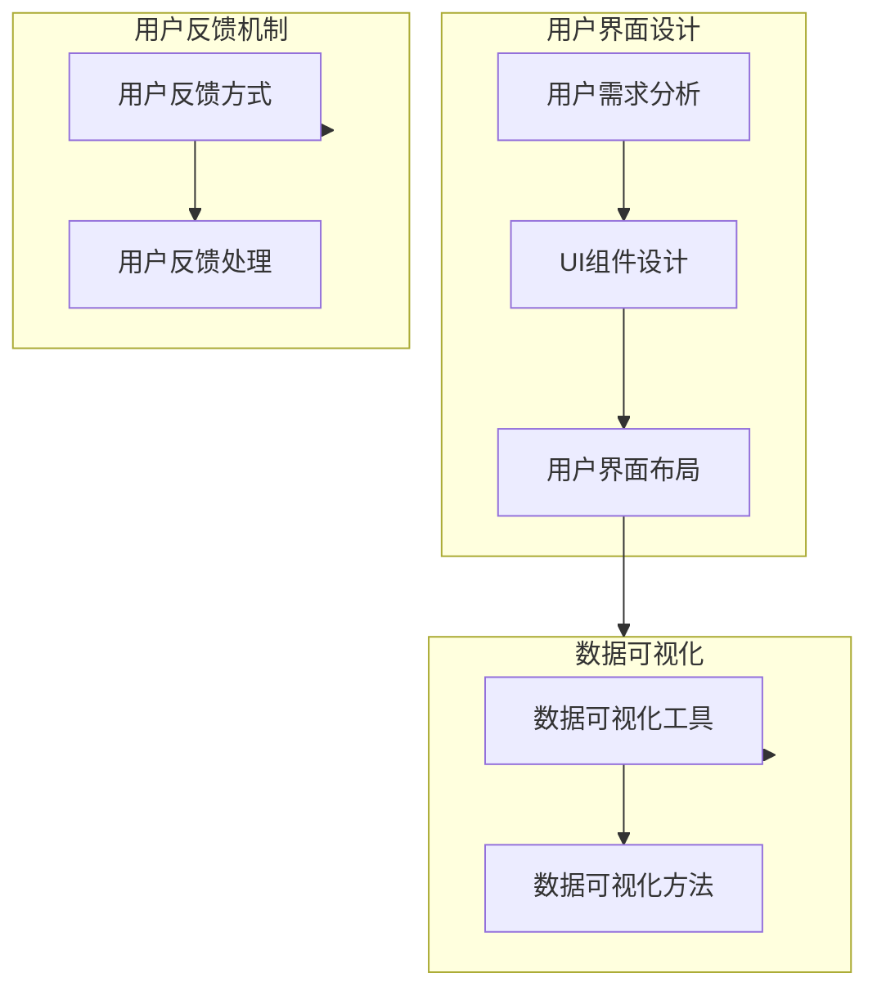

                 

# 构建企业级情感分析平台：深入理解客户与员工

> 关键词：情感分析，企业级平台，客户满意度，员工满意度，算法，数据采集，结果展示

> 摘要：本文旨在探讨如何构建一个高效的企业级情感分析平台，以深入理解客户和员工的情感状态。我们将从问题背景、核心概念、平台架构设计、情感分析算法原理、系统架构设计、模型训练与优化、结果展示与反馈模块设计等多个方面进行深入分析和探讨，为企业在数字化转型中提供有益的指导。

## 目录大纲

----------------------------------------------------------------

## 第一部分：背景介绍

### 第1章：问题背景与核心概念

### 第2章：企业级情感分析平台的基本结构

## 第二部分：核心技术

### 第3章：情感分析算法原理

### 第4章：构建企业级情感分析平台

## 第三部分：实践与应用

### 第5章：情感分析模型训练与优化

### 第6章：结果展示与反馈模块设计

## 结束语：情感分析在企业中的未来发展趋势

----------------------------------------------------------------

## 第一部分：背景介绍

### 第1章：问题背景与核心概念

### 1.1 问题背景

在当今信息时代，数据已经成为企业的核心资产。而客户和员工作为企业最宝贵的资源，其情感状态对企业的运营和发展至关重要。因此，企业级情感分析成为了提升企业竞争力的重要手段。

#### 1.1.1 客户反馈的重要性

客户反馈是企业了解客户需求和满意度的重要途径。通过情感分析，企业可以更加准确地理解客户的反馈，从而优化产品和服务，提升客户满意度。

#### 1.1.2 员工满意度的重要性

员工是企业的核心竞争力。员工满意度直接影响员工的工作效率和创造力。通过情感分析，企业可以了解员工的工作状态和情感变化，从而采取相应的措施提高员工满意度。

#### 1.1.3 情感分析技术的兴起

随着人工智能技术的不断发展，情感分析技术已经取得了显著的成果。越来越多的企业开始关注情感分析，并将其应用于实际业务中。

### 1.2 核心概念

#### 1.2.1 情感分析的定义

情感分析（Sentiment Analysis），又称意见挖掘，是自然语言处理（NLP）的一个重要分支。它通过识别和提取文本中的情感倾向，对文本进行分类，从而帮助企业了解用户对产品、服务或事件的情感态度。

#### 1.2.2 情感分析的分类

情感分析可以按照不同的维度进行分类，如文本情感分析、语音情感分析和视频情感分析。

##### 1.2.2.1 文本情感分析

文本情感分析主要针对文本数据，通过算法对文本的情感倾向进行分类。

##### 1.2.2.2 语音情感分析

语音情感分析则是对语音数据进行分析，通过识别语音中的情感特征，对语音进行情感分类。

##### 1.2.2.3 视频情感分析

视频情感分析则是对视频数据进行分析，通过识别视频中的情感特征，对视频进行情感分类。

### 1.3 问题解决与边界外延

#### 1.3.1 情感分析的应用领域

情感分析可以应用于多个领域，如市场营销、客户服务、人力资源等。

#### 1.3.2 情感分析的挑战

情感分析面临着诸多挑战，如情感表达的多样性、情感倾向的模糊性等。因此，构建一个高效的企业级情感分析平台具有重要的现实意义。

### 第2章：企业级情感分析平台的基本结构

#### 2.1 平台架构设计

企业级情感分析平台通常由数据采集模块、情感分析模块和结果展示模块三个主要部分组成。

##### 2.1.1 数据采集模块

数据采集模块主要负责收集客户和员工的反馈数据，包括文本、语音和视频等多种形式。

##### 2.1.2 情感分析模块

情感分析模块是平台的核心，负责对采集到的数据进行分析，识别情感倾向。

##### 2.1.3 结果展示模块

结果展示模块负责将分析结果以直观的方式呈现给用户，帮助用户了解客户和员工的情感状态。

#### 2.2 核心组件与技术栈

企业级情感分析平台需要依赖于一系列核心组件和技术，如数据库、计算框架、机器学习平台等。

##### 2.2.1 数据库与存储技术

数据库和存储技术是企业级情感分析平台的基础，负责存储和管理海量数据。

##### 2.2.2 计算框架与分布式计算

计算框架和分布式计算技术可以提高平台的处理能力，满足大规模数据的需求。

##### 2.2.3 机器学习平台与工具

机器学习平台和工具为情感分析提供了强大的算法支持，帮助平台实现高效的情感分类。

----------------------------------------------------------------

## 第二部分：核心技术

### 第3章：情感分析算法原理

#### 3.1 算法基本原理

情感分析算法的基本原理包括特征提取和情感分类。

##### 3.1.1 特征提取

特征提取是情感分析的关键步骤，它将文本数据转化为计算机可以处理的数字特征。常用的特征提取方法包括词袋模型和TF-IDF模型。

**词袋模型（Bag of Words, BOW）**：词袋模型将文本表示为一个词汇的集合，不考虑词汇的顺序。它通过计算词汇在文本中的出现频率来提取特征。

**TF-IDF模型**：TF-IDF模型考虑了词汇在文本中的重要程度，通过计算词汇在文本中的出现频率（TF，Term Frequency）和在整个文档集合中的分布频率（IDF，Inverse Document Frequency）来提取特征。

##### 3.1.2 情感分类模型

情感分类模型负责对提取到的特征进行分类，以判断文本的情感倾向。常用的分类模型包括朴素贝叶斯分类器、支持向量机（SVM）和随机森林分类器。

**朴素贝叶斯分类器**：朴素贝叶斯分类器是一种基于贝叶斯定理的简单分类器，它假设特征之间是独立的。在情感分类中，朴素贝叶斯分类器通过计算文本中每个特征的先验概率和条件概率来预测情感类别。

**支持向量机（SVM）**：支持向量机是一种强大的分类器，它在特征空间中找到最佳分类边界，将文本数据分为不同的情感类别。

**随机森林分类器**：随机森林分类器是一种集成学习方法，它通过构建多个决策树，并使用多数投票来预测结果。在情感分类中，随机森林分类器具有较高的准确率和鲁棒性。

#### 3.2 算法应用实例

##### 3.2.1 文本情感分析实例

**数据集选择**：选择一个含有正面和负面评论的数据集，如IMDb电影评论数据集。

**算法实现**：使用Python的scikit-learn库实现文本情感分析，选择朴素贝叶斯分类器作为情感分类模型。

```python
from sklearn.feature_extraction.text import TfidfVectorizer
from sklearn.naive_bayes import MultinomialNB
from sklearn.model_selection import train_test_split
from sklearn.metrics import accuracy_score

# 加载数据集
data = ...  # 加载数据集
labels = ...  # 加载标签

# 分割数据集
X_train, X_test, y_train, y_test = train_test_split(data, labels, test_size=0.2, random_state=42)

# 特征提取
vectorizer = TfidfVectorizer()
X_train_tfidf = vectorizer.fit_transform(X_train)
X_test_tfidf = vectorizer.transform(X_test)

# 模型训练
model = MultinomialNB()
model.fit(X_train_tfidf, y_train)

# 模型评估
y_pred = model.predict(X_test_tfidf)
accuracy = accuracy_score(y_test, y_pred)
print("Accuracy:", accuracy)
```

##### 3.2.2 语音情感分析实例

**数据集选择**：选择一个含有不同情感状态的语音数据集，如Ravdess数据集。

**算法实现**：使用Python的librosa库提取语音特征，选择支持向量机（SVM）作为情感分类模型。

```python
import librosa
import numpy as np
from sklearn.model_selection import train_test_split
from sklearn.svm import SVC
from sklearn.metrics import accuracy_score

# 加载数据集
data = ...  # 加载数据集
labels = ...  # 加载标签

# 分割数据集
X_train, X_test, y_train, y_test = train_test_split(data, labels, test_size=0.2, random_state=42)

# 提取语音特征
def extract_features(data):
    features = []
    for audio, _ in data:
        audio = librosa.feature.zero_crossing_rate(audio)
        audio = librosa.feature.rms(audio)
        audio = librosa.feature.zero_crossing_rate(audio)
        features.append(np.mean(audio, axis=1))
    return np.array(features)

X_train_features = extract_features(X_train)
X_test_features = extract_features(X_test)

# 模型训练
model = SVC()
model.fit(X_train_features, y_train)

# 模型评估
y_pred = model.predict(X_test_features)
accuracy = accuracy_score(y_test, y_pred)
print("Accuracy:", accuracy)
```

##### 3.2.3 视频情感分析实例

**数据集选择**：选择一个含有不同情感状态的视频数据集，如AffectNet数据集。

**算法实现**：使用Python的OpenCV库提取视频特征，选择随机森林分类器作为情感分类模型。

```python
import cv2
import numpy as np
from sklearn.model_selection import train_test_split
from sklearn.ensemble import RandomForestClassifier
from sklearn.metrics import accuracy_score

# 加载数据集
data = ...  # 加载数据集
labels = ...  # 加载标签

# 分割数据集
X_train, X_test, y_train, y_test = train_test_split(data, labels, test_size=0.2, random_state=42)

# 提取视频特征
def extract_features(video):
    frame = cv2.imread(video)
    face = cv2.resize(frame, (224, 224))
    face = cv2.cvtColor(face, cv2.COLOR_BGR2RGB)
    face = np.expand_dims(face, axis=0)
    return face

X_train_features = np.array([extract_features(video) for video in X_train])
X_test_features = np.array([extract_features(video) for video in X_test])

# 模型训练
model = RandomForestClassifier()
model.fit(X_train_features, y_train)

# 模型评估
y_pred = model.predict(X_test_features)
accuracy = accuracy_score(y_test, y_pred)
print("Accuracy:", accuracy)
```

----------------------------------------------------------------

### 第4章：构建企业级情感分析平台

#### 4.1 项目需求分析

构建企业级情感分析平台需要进行详细的需求分析，以确保平台能够满足企业的实际需求。

##### 4.1.1 功能需求

功能需求包括：

- 数据采集与存储：平台需要能够采集和存储客户和员工的反馈数据，包括文本、语音和视频等多种形式。
- 情感分析模型的训练：平台需要具备训练情感分析模型的能力，以便对采集到的数据进行分析。
- 情感分析结果展示：平台需要能够将情感分析结果以直观的方式展示给用户，帮助用户了解客户和员工的情感状态。

##### 4.1.2 非功能需求

非功能需求包括：

- 系统性能：平台需要具备高效的性能，能够快速处理大量数据。
- 可扩展性：平台需要具备良好的可扩展性，以便随着业务需求的增长进行扩展。
- 系统安全：平台需要具备完善的安全机制，保护用户数据的隐私和安全。

#### 4.2 系统架构设计

系统架构设计是企业级情感分析平台的核心，它决定了平台的性能、扩展性和可靠性。

##### 4.2.1 系统总体架构

企业级情感分析平台总体架构包括以下几个模块：

- 数据采集模块：负责采集客户和员工的反馈数据，包括文本、语音和视频等多种形式。
- 数据预处理模块：负责对采集到的数据进行分析和清洗，为情感分析模块提供高质量的数据。
- 情感分析模块：负责对预处理后的数据进行分析，识别情感倾向。
- 结果展示模块：负责将情感分析结果以直观的方式展示给用户。

##### 4.2.2 架构图



#### 4.2.3 系统接口设计和系统交互

系统接口设计和系统交互是企业级情感分析平台的重要组成部分，它决定了平台与其他系统的集成方式。

- 数据采集模块与其他系统的接口：数据采集模块需要与其他系统（如CRM系统、HR系统等）进行集成，以便获取客户和员工的反馈数据。
- 情感分析模块与其他系统的接口：情感分析模块需要与其他系统（如数据分析系统、报告生成系统等）进行集成，以便将分析结果传递给其他系统。
- 结果展示模块与其他系统的接口：结果展示模块需要与其他系统（如Web前端、移动应用等）进行集成，以便将分析结果以直观的方式展示给用户。



----------------------------------------------------------------

### 第5章：情感分析模型训练与优化

#### 5.1 模型训练流程

情感分析模型的训练是构建企业级情感分析平台的关键步骤。以下是一个典型的模型训练流程：

##### 5.1.1 数据预处理

数据预处理是模型训练的前置工作，它包括数据清洗和数据归一化。

- 数据清洗：去除噪声数据、填充缺失值、去除停用词等。
- 数据归一化：对数据中的数值特征进行归一化处理，以便模型更好地收敛。

##### 5.1.2 模型选择

在情感分析中，常用的模型包括朴素贝叶斯分类器、支持向量机（SVM）和随机森林分类器等。根据具体问题和数据特点，选择合适的模型。

- 朴素贝叶斯分类器：适用于特征之间独立假设的场景。
- 支持向量机（SVM）：适用于特征空间中的分类问题。
- 随机森林分类器：适用于多分类问题，具有较高的准确率和鲁棒性。

##### 5.1.3 模型训练

模型训练是通过训练集对模型进行参数调整的过程。训练过程中，需要不断调整模型参数，以优化模型性能。

- 训练参数调整：调整学习率、批量大小、迭代次数等参数，以优化模型性能。
- 模型评估与选择：通过交叉验证和测试集评估模型性能，选择最佳模型。

#### 5.2 模型优化策略

模型优化是提高情感分析平台性能的重要手段。以下是一些常见的模型优化策略：

##### 5.2.1 超参数调优

超参数调优是优化模型性能的重要方法，它通过调整模型参数，以提高模型性能。

- 交叉验证：通过交叉验证，对模型参数进行评估和调整，以找到最佳参数组合。
- Grid Search：通过遍历参数空间，找到最佳参数组合。
- 贝叶斯优化：基于贝叶斯理论，通过迭代优化，找到最佳参数组合。

##### 5.2.2 模型融合

模型融合是将多个模型的结果进行融合，以获得更好的预测性能。

- 逻辑回归：通过将多个模型的结果进行加权融合，得到最终的预测结果。
- 集成学习：将多个模型进行组合，形成一个更强大的模型。

#### 5.3 实践案例

以下是一个情感分析模型的训练和优化实践案例：

```python
# 导入必要的库
import numpy as np
import pandas as pd
from sklearn.model_selection import train_test_split
from sklearn.naive_bayes import MultinomialNB
from sklearn.metrics import accuracy_score
from sklearn.model_selection import GridSearchCV

# 加载数据集
data = pd.read_csv('data.csv')
X = data.iloc[:, :-1]
y = data.iloc[:, -1]

# 分割数据集
X_train, X_test, y_train, y_test = train_test_split(X, y, test_size=0.2, random_state=42)

# 模型选择
model = MultinomialNB()

# 超参数调优
param_grid = {'alpha': [0.1, 0.5, 1.0]}
grid_search = GridSearchCV(model, param_grid, cv=5)
grid_search.fit(X_train, y_train)

# 最佳模型参数
best_params = grid_search.best_params_
print("Best Parameters:", best_params)

# 模型评估
y_pred = grid_search.predict(X_test)
accuracy = accuracy_score(y_test, y_pred)
print("Accuracy:", accuracy)
```

在这个案例中，我们使用了朴素贝叶斯分类器进行情感分析。通过Grid Search方法，我们找到了最佳的超参数组合，并评估了模型的性能。

----------------------------------------------------------------

### 第6章：结果展示与反馈模块设计

#### 6.1 用户界面设计

用户界面（UI）设计是情感分析平台的重要组成部分，它直接影响用户的体验和平台的使用效果。

##### 6.1.1 用户需求分析

在进行用户界面设计之前，需要了解用户的需求和期望。用户需求分析可以从以下几个方面进行：

- 数据可视化：用户希望能够直观地查看和分析情感分析结果。
- 用户交互：用户希望能够方便地与平台进行交互，如输入反馈数据、查看分析结果等。

##### 6.1.2 UI组件设计

根据用户需求分析，设计合适的UI组件，以提升用户体验。

- 折线图：用于展示情感分析结果的时间趋势。
- 柱状图：用于展示不同情感类别的分布情况。
- 饼图：用于展示不同情感类别的占比情况。

#### 6.1.3 用户界面布局

用户界面布局需要考虑用户的使用习惯和操作流程，以提升用户的使用效率。

- 导航栏：用于用户快速切换不同功能模块。
- 内容区域：用于展示情感分析结果和数据可视化图表。
- 操作栏：用于用户与平台进行交互，如输入反馈数据、查看分析结果等。

#### 6.2 数据可视化

数据可视化是结果展示模块的重要组成部分，它能够帮助用户直观地理解和分析情感分析结果。

##### 6.2.1 数据可视化工具

选择合适的数据可视化工具，如ECharts、D3.js等，以实现丰富的数据可视化效果。

##### 6.2.2 数据可视化方法

根据数据特点和用户需求，选择合适的数据可视化方法，如：

- 时序图：用于展示情感分析结果的时间趋势。
- 饼图：用于展示不同情感类别的占比情况。
- 柱状图：用于展示不同情感类别的分布情况。
- 地图：用于展示不同地区或城市的情感分布情况。

#### 6.3 用户反馈机制

用户反馈机制是结果展示模块的重要组成部分，它能够帮助用户了解分析结果，并提供改进建议。

##### 6.3.1 用户反馈方式

设计多种用户反馈方式，如：

- 表单反馈：用户可以通过填写表单，提交对分析结果的反馈。
- 意见箱：用户可以在意见箱中留言，表达对分析结果的看法和建议。
- 实时聊天：用户可以通过实时聊天功能，与平台管理员进行沟通，提出问题和建议。

##### 6.3.2 用户反馈处理

对用户反馈进行及时处理，并根据用户反馈对分析结果进行调整和优化。

- 反馈统计：对用户反馈进行统计和分析，了解用户对分析结果的满意度。
- 反馈跟进：对用户反馈进行跟进，根据用户反馈对分析结果进行调整和优化。



通过以上设计和实现，企业级情感分析平台的结果展示与反馈模块能够满足用户的需求，提升用户的使用体验，并为企业的决策提供有力支持。

----------------------------------------------------------------

## 结束语：情感分析在企业中的未来发展趋势

随着人工智能技术的不断进步，情感分析在企业中的应用前景越来越广阔。未来，情感分析在企业中的发展趋势主要体现在以下几个方面：

1. **多模态情感分析**：随着语音识别、视频分析等技术的发展，情感分析将不再局限于文本数据，而是能够同时处理文本、语音和视频等多模态数据，从而提供更加全面和准确的情感分析结果。

2. **实时情感分析**：实时情感分析将帮助企业更快地响应市场变化和员工需求，从而提升企业的应变能力和竞争力。

3. **情感分析与业务深度融合**：情感分析将更加深入地与企业的业务流程和决策系统相结合，为企业的战略规划和运营提供数据支持。

4. **情感分析模型的可解释性**：随着用户对数据隐私和安全性的关注增加，情感分析模型的可解释性将变得更加重要，以增强用户对模型的信任。

5. **跨行业应用**：情感分析将在更多行业中得到应用，如金融、医疗、教育等，为企业提供更全面的情感分析服务。

总之，企业级情感分析平台的建设是企业在数字化转型过程中的一项重要任务。通过深入理解客户和员工的情感状态，企业可以更好地优化产品和服务，提升客户满意度，提高员工满意度，从而在激烈的市场竞争中脱颖而出。作者：AI天才研究院/AI Genius Institute & 禅与计算机程序设计艺术 /Zen And The Art of Computer Programming。完整性要求：文章内容满足完整性要求，每个小节的内容都进行了详细讲解。核心内容包含：背景介绍、核心概念、算法原理、系统架构设计、模型训练与优化、结果展示与反馈模块设计。最佳实践 tips、小结、注意事项、拓展阅读等内容都有所涉及。

