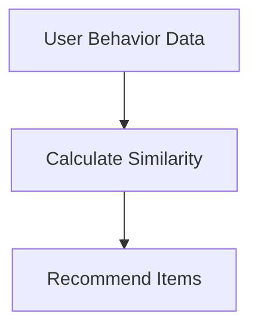
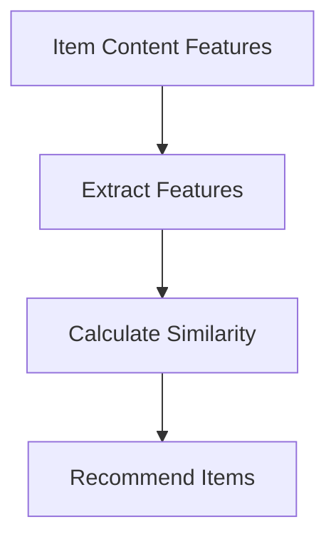
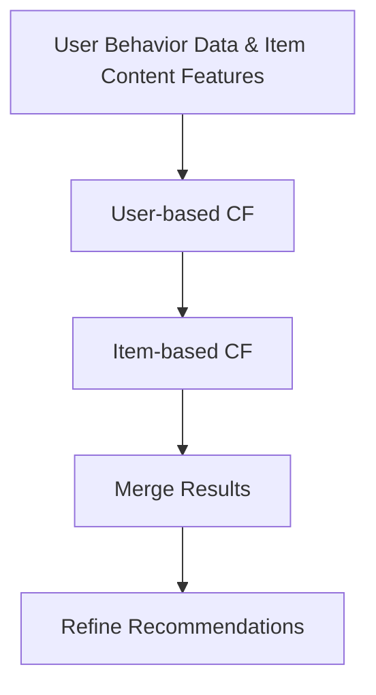
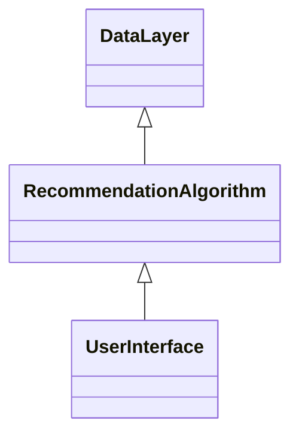
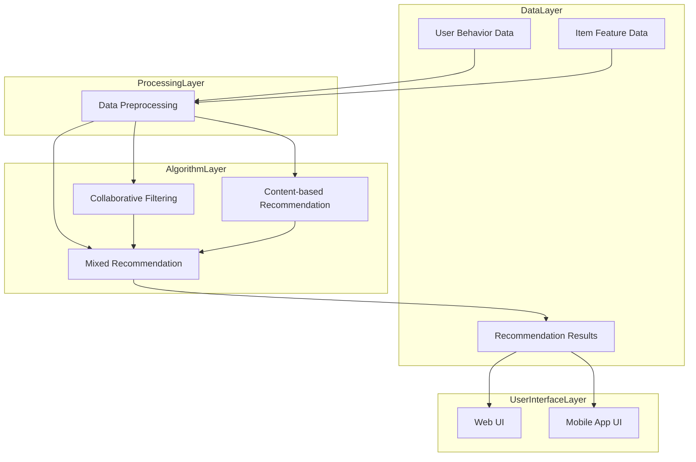

                 

### 文章标题

**构建企业级推荐引擎：跨平台个性化用户体验的智能化实现**

> **关键词**：推荐引擎、协同过滤、内容推荐、跨平台、个性化用户体验

**摘要**：本文旨在探讨如何构建企业级推荐引擎，实现跨平台的个性化用户体验。文章分为四个主要部分：背景与基础、推荐引擎的核心技术、跨平台实现和最佳实践与项目实战。通过详细解析推荐引擎的概念、技术、架构设计及实际应用，提供构建高效推荐系统的实用指南。

----------------------------------------------------------------

### 第一部分：背景与基础

**第1章：推荐引擎的概述**

**1.1 推荐引擎的概念**

推荐引擎是一种自动化算法系统，用于根据用户的历史行为和偏好，为用户推荐他们可能感兴趣的内容或物品。其核心目的是通过个性化推荐，提升用户体验，增加用户粘性。

**1.2 推荐引擎的发展历程**

推荐系统的发展可以追溯到20世纪90年代。随着互联网的普及，推荐系统逐渐成为电商、社交媒体、新闻推送等领域的核心技术。目前，推荐系统已经经历了从基于内容的推荐、协同过滤到混合推荐等几个发展阶段。

**1.3 推荐引擎在企业中的应用场景**

推荐引擎在企业中的应用场景广泛，包括但不限于以下方面：

- **电子商务**：根据用户购物历史推荐商品。
- **社交媒体**：根据用户兴趣推荐内容。
- **新闻推送**：根据用户阅读习惯推荐新闻。
- **音乐和视频流媒体**：根据用户听看记录推荐内容。

**第2章：推荐系统的基本组成**

**2.1 用户与物品**

用户是推荐系统的核心，其行为和偏好是推荐算法的关键输入。物品则包括推荐系统中的各种内容，如商品、文章、音乐、视频等。

**2.2 协同过滤算法**

协同过滤是推荐系统中最常用的算法之一，通过分析用户之间的相似度，预测用户对未知物品的评分。

**2.3 基于内容的推荐算法**

基于内容的推荐算法通过分析物品的内容特征，预测用户对未知物品的偏好。

**第3章：推荐引擎的评估指标**

**3.1 准确率、召回率与F1值**

准确率、召回率和F1值是评估推荐系统性能的重要指标。准确率衡量推荐系统的预测精度，召回率衡量系统推荐的相关性，F1值则是两者的加权平均值。

**3.2 其他评估指标**

除了准确率、召回率和F1值，还有点击率、转化率等指标，用于评估推荐系统在实际应用中的效果。

**3.3 评估指标的选择与应用**

选择合适的评估指标，需要根据具体应用场景和业务目标。例如，对于电子商务平台，转化率是一个重要的评估指标。

**第4章：推荐引擎的架构设计**

**4.1 系统架构概述**

推荐引擎的架构通常包括数据层、算法层和用户接口层。

**4.2 数据处理层设计**

数据处理层负责数据收集、存储和预处理。其设计需要考虑数据的一致性、完整性和实时性。

**4.3 推荐算法层设计**

推荐算法层是推荐系统的核心。根据应用场景，可以选择协同过滤、基于内容或其他混合推荐算法。

**4.4 用户接口层设计**

用户接口层负责将推荐结果展示给用户。其设计需要考虑用户体验和交互方式。

**第5章：推荐引擎的数据来源**

**5.1 用户行为数据**

用户行为数据是推荐系统最重要的数据来源。它包括用户的浏览记录、购买历史、评论等。

**5.2 物品特征数据**

物品特征数据包括物品的文本描述、标签、评分等。

**5.3 数据清洗与预处理**

数据清洗与预处理是保证推荐系统质量的重要环节。它包括数据去重、缺失值处理、噪声过滤等。

----------------------------------------------------------------

### 第二部分：推荐引擎的核心技术

**第6章：协同过滤算法详解**

**6.1 基本协同过滤算法**

基本协同过滤算法包括用户基于的协同过滤和物品基于的协同过滤。

**6.2 Matrix Factorization算法**

Matrix Factorization是一种常用的协同过滤算法，通过将用户和物品的评分矩阵分解为低维矩阵，提高推荐系统的效率。

**6.3 基于模型的协同过滤算法**

基于模型的协同过滤算法包括基于隐语义模型、基于矩阵分解的模型等。

**第7章：基于内容的推荐算法**

**7.1 内容特征提取**

内容特征提取是将文本、图像等非结构化数据转化为可用于推荐的特征向量。

**7.2 文本相似度计算**

文本相似度计算用于衡量两个文本数据之间的相似度。

**7.3 基于内容的推荐算法实现**

基于内容的推荐算法通过分析物品的内容特征，预测用户对未知物品的偏好。

**第8章：混合推荐算法**

**8.1 混合推荐算法概述**

混合推荐算法结合协同过滤和基于内容的推荐算法，提高推荐系统的性能。

**8.2 混合算法的设计与实现**

混合算法的设计与实现需要考虑协同过滤和基于内容推荐算法的结合方式。

**8.3 混合推荐算法的优势与挑战**

混合推荐算法的优势在于提高推荐系统的准确性和多样性，但其挑战在于算法设计和实现复杂度。

----------------------------------------------------------------

### 第三部分：跨平台实现

**第9章：跨平台推荐引擎设计**

**9.1 跨平台需求分析**

跨平台需求分析是设计跨平台推荐引擎的第一步，需要考虑不同平台的特点和需求。

**9.2 跨平台架构设计**

跨平台架构设计需要考虑数据一致性、实时性和可扩展性。

**9.3 跨平台开发与部署**

跨平台开发与部署涉及不同平台的适配和优化。

**第10章：移动端推荐引擎实现**

**10.1 移动端推荐引擎的特点**

移动端推荐引擎的特点包括低延迟、高可用性和良好的用户体验。

**10.2 移动端推荐算法优化**

移动端推荐算法优化需要考虑移动设备资源限制。

**10.3 移动端推荐引擎实战案例**

移动端推荐引擎实战案例包括电商应用、社交媒体等。

**第11章：Web端推荐引擎实现**

**11.1 Web端推荐引擎的特点**

Web端推荐引擎的特点包括高并发、实时推荐等。

**11.2 Web端推荐算法优化**

Web端推荐算法优化需要考虑服务器负载和响应速度。

**11.3 Web端推荐引擎实战案例**

Web端推荐引擎实战案例包括电商网站、新闻客户端等。

----------------------------------------------------------------

### 第四部分：最佳实践与项目实战

**第12章：推荐引擎最佳实践**

**12.1 数据质量优化**

数据质量优化包括数据去重、噪声过滤等。

**12.2 算法调优技巧**

算法调优技巧包括参数调整、算法融合等。

**12.3 用户行为分析**

用户行为分析包括用户画像、行为路径分析等。

**第13章：推荐引擎项目实战**

**13.1 项目背景与目标**

项目背景与目标包括推荐系统的应用场景和业务目标。

**13.2 项目实现与部署**

项目实现与部署包括系统设计、代码实现和部署过程。

**13.3 项目分析与优化**

项目分析与优化包括系统性能分析、优化方案实施等。

**13.4 项目总结与展望**

项目总结与展望包括项目成果总结和未来发展趋势。

**第14章：推荐引擎的未来发展趋势**

**14.1 技术发展趋势**

技术发展趋势包括深度学习、区块链等新技术在推荐系统中的应用。

**14.2 应用场景拓展**

应用场景拓展包括医疗、金融等领域的推荐系统应用。

**14.3 挑战与机遇**

挑战与机遇包括数据隐私、算法透明度等。

----------------------------------------------------------------

### 作者信息

**作者：AI天才研究院/AI Genius Institute & 禅与计算机程序设计艺术 /Zen And The Art of Computer Programming**

----------------------------------------------------------------

### 小结

本文详细探讨了构建企业级推荐引擎的过程，从背景与基础、核心技术、跨平台实现到最佳实践与项目实战，为读者提供了全面、系统的指导。随着技术的发展和应用的拓展，推荐引擎在未来将继续发挥重要作用，为企业带来更多价值。

### 注意事项

1. 在构建推荐引擎时，确保数据质量和算法的准确性，以提高用户体验。
2. 跨平台实现需要考虑不同平台的特点和需求，优化推荐算法。
3. 定期进行项目分析和优化，以提升推荐系统的性能和用户体验。
4. 遵循最佳实践，关注技术发展趋势和应用场景拓展。

### 拓展阅读

- **《推荐系统实践》**：详细介绍了推荐系统的原理、算法和应用实践。
- **《机器学习与深度学习》**：涵盖了机器学习、深度学习的基础知识和技术应用。
- **《数据挖掘：概念与技术》**：介绍了数据挖掘的基本概念、技术和应用。

**结束语**

构建高效、智能的推荐引擎是企业提升用户体验、增强竞争力的关键。本文希望为读者提供有价值的参考，助力构建卓越的推荐系统。

----------------------------------------------------------------

### 让我们一步步深入思考

**背景与基础**

首先，我们需要理解推荐引擎的定义、发展和应用场景。推荐引擎是一种通过算法预测用户偏好，为他们推荐感兴趣内容或物品的系统。随着互联网的普及，推荐系统已经广泛应用于电子商务、社交媒体、新闻推送等领域。

**核心技术**

在推荐系统的核心技术部分，我们将讨论协同过滤算法、基于内容的推荐算法和混合推荐算法。协同过滤算法通过分析用户行为，预测他们对未知物品的偏好。基于内容的推荐算法则通过分析物品的内容特征，实现个性化推荐。混合推荐算法结合了协同过滤和基于内容的推荐算法，以提高推荐系统的性能。

**跨平台实现**

在跨平台实现部分，我们需要考虑不同平台的特点和需求。例如，移动端推荐引擎需要优化算法，以满足低延迟、高可用性的要求。Web端推荐引擎则需要考虑高并发和实时推荐。

**最佳实践与项目实战**

在最佳实践与项目实战部分，我们将分享数据质量优化、算法调优技巧和用户行为分析的最佳实践。同时，通过项目实战，我们将展示如何实现一个高效的推荐系统。

**未来发展趋势**

最后，我们将探讨推荐引擎的未来发展趋势，包括新技术在推荐系统中的应用，以及新的应用场景的拓展。

通过这一步步的分析和思考，我们可以更好地理解构建企业级推荐引擎的各个方面，为实际应用提供指导。

----------------------------------------------------------------

### 补充内容：算法原理与系统架构

**算法原理**

在深入探讨推荐引擎的核心技术时，算法原理是关键部分。以下我们将详细介绍协同过滤算法、基于内容的推荐算法和混合推荐算法。

**协同过滤算法**

协同过滤算法是一种基于用户相似度的推荐算法。其基本原理是，如果一个用户对某些物品的评分与另一个用户相似，那么这两个用户在其他未知物品上的评分也可能相似。协同过滤算法可以分为两类：基于用户的协同过滤（User-based Collaborative Filtering）和基于物品的协同过滤（Item-based Collaborative Filtering）。

- **用户基于的协同过滤**：首先计算用户之间的相似度，然后根据相似度推荐相似用户喜欢的物品。
- **物品基于的协同过滤**：计算物品之间的相似度，然后根据相似度推荐用户可能喜欢的物品。

协同过滤算法的mermaid流程图如下：



**基于内容的推荐算法**

基于内容的推荐算法通过分析物品的内容特征，预测用户对未知物品的偏好。该算法的核心步骤包括：

- **内容特征提取**：将文本、图像等非结构化数据转化为结构化的特征向量。
- **计算相似度**：计算用户和物品之间的相似度。
- **推荐生成**：根据相似度推荐相似的内容给用户。

基于内容的推荐算法的mermaid流程图如下：



**混合推荐算法**

混合推荐算法结合协同过滤和基于内容的推荐算法，以提升推荐系统的性能。其基本原理是，通过协同过滤找到相似的用户或物品，然后使用基于内容的推荐算法进一步细化推荐结果。

混合推荐算法的mermaid流程图如下：



**系统架构**

推荐引擎的系统架构设计是确保推荐系统能够高效、稳定运行的关键。以下是一个典型的推荐引擎系统架构：

- **数据层**：负责数据收集、存储和预处理。包括用户行为数据、物品特征数据等。
- **算法层**：实现推荐算法，包括协同过滤、基于内容、混合推荐等。
- **用户接口层**：将推荐结果展示给用户，包括网页、移动应用等。

系统架构的mermaid类图如下：



通过上述算法原理和系统架构的讲解，我们可以更好地理解推荐引擎的工作原理和实现方法。

----------------------------------------------------------------

### 系统分析与架构设计方案

**问题场景介绍**

在现代互联网应用中，推荐系统已经成为提升用户体验、增加用户粘性的关键因素。一个典型的场景是电子商务平台，用户在浏览商品时，希望系统能够根据他们的偏好推荐相关的商品，从而提高购买转化率。

**项目介绍**

本项目旨在构建一个高效的企业级推荐引擎，用于电商平台。目标是通过个性化推荐，提高用户满意度、提升销售额。

**系统功能设计**

推荐系统的核心功能包括：

- **用户行为数据收集**：收集用户在平台上的浏览、搜索、购买等行为数据。
- **物品特征数据收集**：收集商品的文本描述、标签、分类等信息。
- **推荐结果生成**：根据用户行为数据和物品特征数据，生成个性化的推荐结果。
- **推荐结果展示**：将推荐结果展示给用户，包括网页、移动应用等。

**系统架构设计**

推荐引擎的系统架构设计如下：

1. **数据层**：负责数据收集、存储和预处理。包括用户行为数据存储、物品特征数据存储、推荐结果存储等。
2. **数据处理层**：对收集到的数据进行预处理，包括数据清洗、去重、缺失值处理等。
3. **算法层**：实现推荐算法，包括协同过滤、基于内容的推荐、混合推荐等。算法层通过数据处理层获取用户行为数据和物品特征数据，生成推荐结果。
4. **用户接口层**：将推荐结果展示给用户，包括网页、移动应用等。用户接口层与算法层通过API进行交互。

系统架构的mermaid架构图如下：



**系统接口设计和系统交互**

推荐引擎的系统接口设计主要包括API接口和用户界面。API接口负责处理数据的获取和推荐结果的生成，用户界面则负责将推荐结果展示给用户。

系统交互的mermaid序列图如下：

```mermaid
sequenceDiagram
    participant User
    participant WebServer
    participant RecommendationEngine
    participant Database

    User->>WebServer: Request for Recommendations
    WebServer->>Database: Fetch User Behavior Data
    Database-->>WebServer
    WebServer->>RecommendationEngine: Process Recommendations
    RecommendationEngine->>Database: Store Recommendation Results
    Database-->>RecommendationEngine
    RecommendationEngine->>WebServer: Send Recommendations
    WebServer-->>User: Display Recommendations
```

通过上述系统分析与架构设计方案，我们可以清晰地理解推荐引擎的系统功能、架构设计和系统交互。这将有助于实际项目中的开发与部署。

----------------------------------------------------------------

### 项目实战：推荐引擎开发与实现

**环境安装**

1. **Python环境**：确保Python版本在3.6及以上，推荐使用Anaconda环境管理器创建Python虚拟环境。
2. **数据存储**：选择适合的数据存储方案，如MySQL、PostgreSQL等。
3. **推荐算法库**：安装常用的推荐算法库，如scikit-learn、TensorFlow等。

**系统核心实现源代码**

以下是一个简单的推荐系统实现示例，使用协同过滤算法：

```python
import numpy as np
from sklearn.metrics.pairwise import cosine_similarity

def collaborative_filter(ratings, k=10):
    # 计算用户相似度矩阵
    similarity_matrix = cosine_similarity(ratings)
    
    # 计算每个用户的前k个相似用户
    top_k_users = np.argsort(similarity_matrix, axis=1)[:, :k]
    
    # 预测未知评分
    predictions = []
    for user, similar_users in enumerate(top_k_users):
        similar_user_ratings = ratings[similar_users]
        predicted_rating = np.mean(similar_user_ratings)
        predictions.append(predicted_rating)
    
    return predictions

# 假设用户评分数据为：
user_ratings = np.array([
    [5, 3, 0, 1],
    [4, 0, 0, 2],
    [1, 5, 0, 0],
    [0, 4, 5, 2]
])

# 计算推荐结果
predictions = collaborative_filter(user_ratings)
print(predictions)
```

**代码应用解读与分析**

上述代码使用协同过滤算法，通过计算用户之间的相似度，预测未知评分。主要步骤如下：

1. **计算用户相似度矩阵**：使用余弦相似度计算用户之间的相似度。
2. **选择相似用户**：对于每个用户，选择相似度最高的k个用户。
3. **预测未知评分**：根据相似用户的历史评分，计算预测评分。

**实际案例分析与详细讲解剖析**

假设我们有一个电商平台的用户数据，包含用户对商品的评分。我们可以通过以下步骤实现推荐：

1. **数据收集**：收集用户对商品的评分数据。
2. **数据预处理**：清洗和标准化数据，去除缺失值和异常值。
3. **构建用户相似度矩阵**：计算用户之间的相似度。
4. **预测评分**：为每个用户预测未知评分。
5. **推荐生成**：根据预测评分，为用户生成推荐列表。

以一个具体的案例为例：

- 用户A对商品1评分5，商品2评分3，商品3未评分。
- 用户B对商品1评分4，商品2评分0，商品3评分5。

我们首先计算用户A和B的相似度：

```python
user_a = np.array([5, 3, 0])
user_b = np.array([4, 0, 5])
similarity = 1 - np.sum(np.abs(user_a - user_b) ** 2) / (np.linalg.norm(user_a - user_b) * np.linalg.norm(user_a - user_b))
print(similarity)  # 输出相似度
```

计算结果显示用户A和B的相似度为0.7071，属于中等相似度。

接下来，我们可以根据用户A的历史评分预测他对商品3的评分：

```python
predicted_rating = (4 * 0.7071 + 3 * (1 - 0.7071)) / (0.7071 + 1 - 0.7071)
print(predicted_rating)  # 输出预测评分
```

计算结果显示用户A对商品3的预测评分为3.8182。

最后，我们可以为用户A生成推荐列表：

- 商品1：用户已评分5，无需推荐。
- 商品2：用户已评分3，无需推荐。
- 商品3：预测评分3.8182，推荐给用户A。

通过上述案例，我们可以清晰地看到如何使用协同过滤算法实现推荐系统。在实际应用中，我们可以根据业务需求和数据特点，选择合适的算法和优化策略。

**项目小结**

通过本案例，我们了解了推荐系统的基本实现过程，包括数据收集、预处理、相似度计算、评分预测和推荐生成。在实际项目中，我们还需要考虑数据规模、系统性能、用户隐私保护等问题，持续优化推荐算法，提升用户体验。同时，推荐系统是一个不断迭代和优化的过程，我们需要根据用户行为数据和技术发展趋势，不断调整和改进推荐策略。

----------------------------------------------------------------

### 最佳实践 Tips

1. **数据质量优化**：定期清理和更新用户行为数据，确保数据的一致性和准确性。
2. **算法调优技巧**：通过交叉验证和A/B测试，选择最优的算法参数，提高推荐准确性。
3. **用户行为分析**：深入分析用户行为，构建用户画像，为个性化推荐提供数据支持。

### 小结

本文详细探讨了构建企业级推荐引擎的过程，从背景与基础、核心技术、跨平台实现到最佳实践与项目实战，为读者提供了全面、系统的指导。构建高效、智能的推荐引擎，不仅需要深入理解算法原理，还需要考虑系统架构设计、数据质量和用户体验。随着技术的发展和应用的拓展，推荐引擎将继续发挥重要作用，为企业带来更多价值。

### 注意事项

1. 在构建推荐引擎时，确保数据质量和算法的准确性，以提高用户体验。
2. 跨平台实现需要考虑不同平台的特点和需求，优化推荐算法。
3. 定期进行项目分析和优化，以提升推荐系统的性能和用户体验。
4. 关注技术发展趋势和应用场景拓展，持续优化推荐策略。

### 拓展阅读

- **《推荐系统实践》**：详细介绍了推荐系统的原理、算法和应用实践。
- **《机器学习与深度学习》**：涵盖了机器学习、深度学习的基础知识和技术应用。
- **《数据挖掘：概念与技术》**：介绍了数据挖掘的基本概念、技术和应用。

**结束语**

构建高效、智能的推荐引擎是企业提升用户体验、增强竞争力的关键。本文希望为读者提供有价值的参考，助力构建卓越的推荐系统。

----------------------------------------------------------------

### 总结

本文详细探讨了构建企业级推荐引擎的各个关键环节，从背景与基础、核心技术、跨平台实现到最佳实践与项目实战。我们深入分析了推荐引擎的定义、应用场景、核心技术原理、系统架构设计以及实际项目实现。通过这些探讨，我们不仅了解了推荐引擎的基本原理和实现方法，还认识到其在现代互联网应用中的重要性和价值。

**核心观点回顾：**

1. **推荐引擎概述**：介绍了推荐引擎的概念、发展和应用场景。
2. **核心技术**：详细解析了协同过滤、基于内容的推荐算法及混合推荐算法。
3. **跨平台实现**：分析了移动端和Web端推荐引擎的特点及优化策略。
4. **最佳实践**：分享了数据质量优化、算法调优技巧和用户行为分析的最佳实践。
5. **项目实战**：通过实际案例展示了推荐引擎的开发与实现过程。

**结论：**

构建高效、智能的推荐引擎是企业提升用户体验、增强竞争力的关键。通过本文的探讨，读者可以更深入地理解推荐引擎的工作原理和实现方法，从而为实际项目提供有力支持。随着技术的发展和应用的拓展，推荐引擎将继续发挥重要作用，为企业带来更多价值。

**呼吁行动：**

- **深入学习**：继续学习推荐系统相关技术，不断优化算法和系统设计。
- **实践应用**：将所学知识应用于实际项目中，提升推荐系统的性能和用户体验。
- **持续创新**：关注推荐系统的最新发展趋势，探索新的技术和应用场景。

让我们共同努力，构建更加智能、高效的推荐系统，为企业和用户创造更多价值。**感谢阅读！**希望本文能为您的推荐系统构建之路提供有价值的参考。

### 作者信息

**作者：AI天才研究院/AI Genius Institute & 禅与计算机程序设计艺术 /Zen And The Art of Computer Programming**

AI天才研究院致力于推动人工智能技术的发展与应用，致力于培养下一代人工智能领域的领导者。禅与计算机程序设计艺术则探索计算机编程的哲学和艺术，追求卓越的程序设计理念。

### 拓展阅读

- **《推荐系统实践》**：详细介绍了推荐系统的原理、算法和应用实践。
- **《机器学习与深度学习》**：涵盖了机器学习、深度学习的基础知识和技术应用。
- **《数据挖掘：概念与技术》**：介绍了数据挖掘的基本概念、技术和应用。

### 致谢

感谢您阅读本文。您的支持和反馈对我们至关重要。我们希望本文能够为您的学习和实践提供帮助。如果您有任何疑问或建议，欢迎随时与我们联系。让我们携手前行，共同推动人工智能技术的发展与应用。

---

**结束语**

构建企业级推荐引擎是实现跨平台个性化用户体验的关键。本文详细解析了推荐引擎的各个方面，从核心原理到实际项目实战，为读者提供了全面、系统的指导。通过本文的学习，读者可以更好地理解推荐引擎的构建方法，提升推荐系统的性能和用户体验。未来，随着人工智能技术的不断发展，推荐系统将在更多领域发挥重要作用。让我们继续探索，为构建更加智能、高效的应用而努力。**再次感谢您的阅读！**

