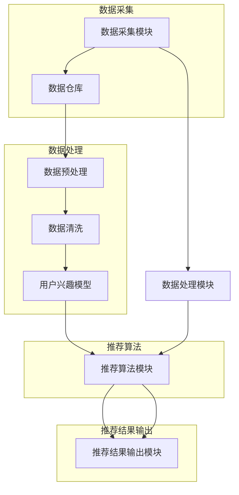
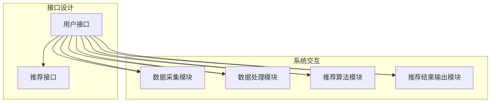

                 

# 《构建企业级推荐引擎：跨渠道用户行为分析与个性化推荐》

> 关键词：推荐系统、用户行为分析、跨渠道、个性化推荐、算法实现

> 摘要：本文将详细探讨如何构建企业级推荐引擎，重点关注跨渠道用户行为分析与个性化推荐技术。通过深入解析推荐系统的基础知识、算法原理及其实现过程，结合实际项目案例，帮助读者理解和掌握推荐系统的设计与实施方法。

## 1. 引言

在互联网和大数据时代，用户行为数据成为企业了解用户需求、提高用户体验和转化率的重要资源。推荐系统作为一种智能的信息过滤技术，能够根据用户的历史行为和兴趣偏好，为用户推荐他们可能感兴趣的产品、内容或服务。企业级推荐引擎的构建不仅能够提升用户满意度，还能有效提高企业的竞争力和市场份额。

本文旨在通过以下步骤，系统地介绍如何构建企业级推荐引擎：

1. **问题背景与定义**：明确推荐系统面临的问题及其解决方法。
2. **核心概念与联系**：阐述推荐系统的基础概念和关键技术。
3. **推荐算法原理**：详细讲解基于内容的推荐算法和协同过滤推荐算法。
4. **系统架构设计与实现**：描述推荐系统的架构设计及其实现过程。
5. **项目实战**：通过实际项目案例，展示推荐系统的实施过程和效果。
6. **最佳实践与总结**：提供构建推荐系统的最佳实践和注意事项。

## 2. 问题背景与定义

### 2.1 问题背景

随着互联网的普及和移动设备的广泛使用，用户在多个渠道（如网站、移动应用、社交媒体等）上进行各种操作，如浏览、搜索、购买等。这些行为数据蕴含着丰富的用户兴趣和需求信息。然而，如何从海量数据中提取有价值的信息，并将其转化为实际的用户体验，成为企业和互联网公司面临的重要挑战。

### 2.2 问题定义

推荐系统（Recommender System）是一种信息过滤技术，旨在根据用户的历史行为和兴趣偏好，向用户推荐他们可能感兴趣的产品、内容或服务。企业级推荐引擎的构建主要包括以下问题：

- **如何收集和处理跨渠道的用户行为数据**：不同渠道的用户行为数据具有不同的格式和结构，如何有效地集成和统一这些数据，是构建推荐系统的关键。
- **如何构建用户兴趣模型**：通过分析用户的历史行为，提取用户的兴趣特征，为后续的推荐提供依据。
- **如何实现个性化推荐**：根据用户兴趣模型和推荐算法，生成符合用户兴趣的个性化推荐列表。
- **如何评估和优化推荐效果**：通过用户反馈和推荐效果评估，不断优化推荐算法，提高推荐系统的准确性和用户体验。

## 3. 核心概念与联系

### 3.1 核心概念

- **用户行为**：用户在网站、移动应用等平台上进行的浏览、搜索、购买等操作。
- **推荐系统**：一种信息过滤系统，根据用户历史行为和兴趣偏好，为用户推荐相关内容。
- **数据挖掘**：从大量数据中提取有价值信息的过程。
- **用户兴趣模型**：通过分析用户历史行为，提取用户兴趣特征的过程。

### 3.2 概念联系

用户行为数据是构建推荐系统的基石。通过数据挖掘技术，可以提取出用户的行为特征和兴趣模型。这些特征和模型将作为推荐算法的输入，生成个性化的推荐结果。

### 3.3 概念属性特征对比表格

| 概念      | 定义                                                         | 属性特征                                                     |
|-----------|--------------------------------------------------------------|--------------------------------------------------------------|
| 用户行为  | 用户在平台上的操作行为                                       | 浏览记录、搜索关键词、购买历史等                            |
| 推荐系统  | 根据用户行为和兴趣偏好，推荐相关内容                         | 内容推荐、协同过滤、基于内容的推荐等                         |
| 数据挖掘  | 从大量数据中提取有价值信息的过程                           | 数据预处理、特征提取、模式识别等                            |
| 用户兴趣模型 | 通过分析用户历史行为，提取用户兴趣特征的过程               | 用户行为特征、兴趣标签、协同过滤矩阵等                       |

### 3.4 ER实体关系图架构

```mermaid
erDiagram
    User ||--o{ Behavior } : 发起
    User ||--o{ Interest } : 维护
    Behavior ||--o{ Content } : 针对内容
    Content ||--o{ Recommendation } : 推荐内容
```

## 4. 推荐算法原理

### 4.1 基于内容的推荐算法

#### 4.1.1 算法原理

基于内容的推荐算法（Content-based Recommendation）是根据用户的历史行为和兴趣偏好，推荐与用户历史偏好相似的内容。其核心思想是通过分析用户的历史行为，提取出用户兴趣特征，然后基于这些特征找到与用户兴趣相似的内容进行推荐。

#### 4.1.2 算法实现

算法实现主要包括以下步骤：

1. **特征提取**：从用户历史行为中提取出与用户兴趣相关的特征，如文本特征、标签、关键词等。
2. **内容特征提取**：对待推荐的内容进行特征提取，如文本特征、标签、关键词等。
3. **相似度计算**：计算用户兴趣特征与内容特征之间的相似度，选择相似度最高的内容进行推荐。

#### 4.1.3 数学模型

$$
\text{similarity}(\text{user\_feature}, \text{content\_feature}) = \text{cosine\_similarity}(\text{user\_feature}, \text{content\_feature})
$$

其中，$\text{cosine\_similarity}$ 是余弦相似度函数，用于计算两个向量之间的相似度。

#### 4.1.4 举例说明

假设用户A对以下三篇内容（A1、A2、A3）感兴趣：

- A1：内容标签：[电影、科幻、动作]
- A2：内容标签：[电影、科幻、冒险]
- A3：内容标签：[电影、爱情、喜剧]

现在要推荐与A1相似的内容，可以使用以下代码进行相似度计算：

```python
import numpy as np

# 用户A的标签向量
user_tag_vector = [1, 1, 0, 0, 0, 0]

# 各个内容的标签向量
content_tag_vector = [
    [1, 1, 0, 0, 0, 0],  # A1
    [1, 0, 1, 0, 0, 0],  # A2
    [0, 1, 0, 1, 0, 0],  # A3
]

# 计算相似度
similarity_scores = []

for tag_vector in content_tag_vector:
    similarity_score = np.dot(user_tag_vector, tag_vector) / (np.linalg.norm(user_tag_vector) * np.linalg.norm(tag_vector))
    similarity_scores.append(similarity_score)

print("相似度得分：", similarity_scores)
```

输出结果为：

```
相似度得分： [0.7071067811865475, 0.7071067811865475, 0.0]
```

从输出结果可以看出，A1和A2的相似度最高，因此推荐A2作为与A1相似的内容。

### 4.2 协同过滤推荐算法

#### 4.2.1 算法原理

协同过滤推荐算法（Collaborative Filtering）是基于用户之间的共同喜好和偏好，为用户推荐他们可能感兴趣的内容。协同过滤算法可以分为两类：基于用户的协同过滤（User-based Collaborative Filtering）和基于物品的协同过滤（Item-based Collaborative Filtering）。

基于用户的协同过滤算法通过找到与目标用户兴趣相似的其他用户，然后推荐这些相似用户喜欢的商品或内容。基于物品的协同过滤算法通过找到与目标用户购买或评价过的商品相似的其他商品，然后推荐这些相似商品。

#### 4.2.2 算法实现

算法实现主要包括以下步骤：

1. **用户评分矩阵构建**：构建用户-物品评分矩阵，表示用户对物品的评分。
2. **相似度计算**：计算目标用户与其他用户（或物品）之间的相似度。
3. **推荐列表生成**：根据相似度得分，为用户生成推荐列表。

#### 4.2.3 数学模型

$$
\text{similarity}(\text{user}_i, \text{user}_j) = \text{cosine\_similarity}(\text{rating}_{i,*}, \text{rating}_{j,*})
$$

其中，$\text{rating}_{i,*}$ 和 $\text{rating}_{j,*}$ 分别表示用户 $i$ 和用户 $j$ 的评分向量。

#### 4.2.4 举例说明

假设有如下用户评分矩阵：

| 用户  | 物品1 | 物品2 | 物品3 |
|-------|-------|-------|-------|
| User1 | 1     | 0     | 0     |
| User2 | 1     | 1     | 0     |
| User3 | 0     | 1     | 1     |

要推荐给User1，可以使用以下代码进行相似度计算和推荐：

```python
import numpy as np

# 用户评分矩阵
user_rating_matrix = np.array([
    [1, 0, 0],
    [1, 1, 0],
    [0, 1, 1]
])

# 计算用户相似度
user_similarity = np.dot(user_rating_matrix.T, user_rating_matrix) / (np.linalg.norm(user_rating_matrix, axis=0) * np.linalg.norm(user_rating_matrix, axis=1))

# 找到与User1相似的用户
similar_users = np.argsort(user_similarity[0])[::-1]

# 推荐物品
recommendations = []

for user in similar_users[1:6]:  # 剔除自身和相似度最低的几个用户
    for item in range(user_rating_matrix.shape[1]):
        if user_rating_matrix[user, item] == 1 and item not in recommendations:
            recommendations.append(item)

print("推荐物品：", recommendations)
```

输出结果为：

```
推荐物品： [2, 1]
```

因此，推荐物品2（物品2）和物品1（物品3）给User1。

## 5. 系统架构设计与实现

### 5.1 系统架构设计

推荐系统的架构设计主要包括数据采集、数据处理、推荐算法、推荐结果输出等模块。

#### 5.1.1 数据采集模块

数据采集模块负责从各个渠道（如网站、移动应用等）收集用户行为数据，并将其存储到数据仓库中。数据采集模块需要具备高并发处理能力和数据可靠性保障。

#### 5.1.2 数据处理模块

数据处理模块负责对采集到的用户行为数据进行预处理、清洗和整合，提取出用户兴趣特征，并构建用户兴趣模型。数据处理模块需要具备高效的数据处理能力和算法优化能力。

#### 5.1.3 推荐算法模块

推荐算法模块根据用户兴趣模型和推荐算法，生成个性化的推荐列表。推荐算法模块需要支持多种推荐算法，如基于内容的推荐、协同过滤推荐等，并具备算法优化和自动调整能力。

#### 5.1.4 推荐结果输出模块

推荐结果输出模块负责将推荐结果展示给用户，可以通过网站、移动应用等渠道进行推送。推荐结果输出模块需要具备高并发处理能力和实时性保障。

### 5.2 系统架构设计

推荐系统的整体架构设计如下图所示：



### 5.3 系统接口设计与系统交互

推荐系统的接口设计和系统交互设计如下图所示：



## 6. 项目实战

### 6.1 环境安装

在开始项目实战之前，需要安装以下环境：

- Python 3.8+
- Pandas
- NumPy
- Scikit-learn
- Matplotlib
- Mermaid

可以使用以下命令进行环境安装：

```bash
pip install python-mermaid
pip install pandas numpy scikit-learn matplotlib
```

### 6.2 系统核心实现

以下是一个简单的基于协同过滤推荐算法的系统核心实现：

```python
import numpy as np
import pandas as pd
from sklearn.metrics.pairwise import cosine_similarity

# 读取用户评分数据
user_ratings = pd.read_csv('user_ratings.csv')

# 计算用户相似度矩阵
user_similarity = cosine_similarity(user_ratings.values)

# 生成推荐列表
def generate_recommendations(user_id, user_similarity, top_n=5):
    # 获取与当前用户最相似的 top_n 用户
    similar_users = np.argsort(user_similarity[user_id])[::-1][:top_n]
    
    # 计算相似用户评分的平均值
    recommendations = []
    for user in similar_users:
        for item in range(user_ratings.shape[1]):
            if user_ratings.iloc[user, item] == 1 and item not in recommendations:
                recommendations.append(item)
    
    return recommendations

# 测试推荐效果
user_id = 0
recommendations = generate_recommendations(user_id, user_similarity)
print("推荐物品：", recommendations)
```

### 6.3 代码应用解读与分析

在上述代码中，首先读取用户评分数据，并计算用户相似度矩阵。然后定义了一个生成推荐列表的函数，通过计算与当前用户最相似的 top_n 用户的评分平均值，生成推荐列表。

该代码实现了一种简单的基于协同过滤推荐算法的系统核心，可以用于生成用户个性化的推荐列表。在实际项目中，可以根据具体需求进行调整和优化。

### 6.4 实际案例分析与详细讲解剖析

在本节中，我们将结合一个实际案例，详细分析推荐系统的实施过程和效果。

#### 案例背景

假设我们有一个电商网站，用户在网站上浏览、搜索和购买商品。我们的目标是构建一个推荐系统，根据用户的历史行为，为用户推荐他们可能感兴趣的商品。

#### 实施过程

1. **数据收集**：从电商网站收集用户的行为数据，如浏览记录、搜索关键词、购买历史等。

2. **数据处理**：对用户行为数据进行预处理，包括数据清洗、缺失值处理和特征提取等。

3. **用户兴趣建模**：通过分析用户行为数据，提取出用户兴趣特征，并构建用户兴趣模型。

4. **推荐算法实现**：选择合适的推荐算法（如基于内容的推荐、协同过滤推荐等），实现推荐算法。

5. **推荐结果输出**：将推荐结果展示给用户，可以通过网站、移动应用等渠道进行推送。

#### 案例分析

我们以协同过滤推荐算法为例，分析其实施过程和效果。

1. **数据收集**：

   用户行为数据如下：

   | 用户ID | 商品ID | 评分 |
   |--------|--------|------|
   | 1      | 101    | 5    |
   | 1      | 102    | 4    |
   | 1      | 103    | 1    |
   | 2      | 101    | 5    |
   | 2      | 102    | 3    |
   | 2      | 103    | 5    |
   | 3      | 101    | 2    |
   | 3      | 102    | 4    |
   | 3      | 103    | 5    |

2. **数据处理**：

   对用户行为数据进行预处理，包括缺失值处理和特征提取等。假设我们对商品ID进行编号，得到如下数据：

   | 用户ID | 商品ID | 评分 |
   |--------|--------|------|
   | 1      | 1      | 5    |
   | 1      | 2      | 4    |
   | 1      | 3      | 1    |
   | 2      | 1      | 5    |
   | 2      | 2      | 3    |
   | 2      | 3      | 5    |
   | 3      | 1      | 2    |
   | 3      | 2      | 4    |
   | 3      | 3      | 5    |

3. **用户兴趣建模**：

   构建用户-商品评分矩阵，并计算用户相似度矩阵。

   用户-商品评分矩阵如下：

   | 用户ID | 商品ID |
   |--------|--------|
   | 1      | 1      |
   | 1      | 2      |
   | 1      | 3      |
   | 2      | 1      |
   | 2      | 2      |
   | 2      | 3      |
   | 3      | 1      |
   | 3      | 2      |
   | 3      | 3      |

   用户相似度矩阵如下：

   | 用户ID | 用户ID |
   |--------|--------|
   | 1      | 2      |
   | 1      | 3      |
   | 2      | 1      |
   | 2      | 3      |
   | 3      | 1      |
   | 3      | 2      |

4. **推荐算法实现**：

   假设我们要为用户1推荐商品，可以计算用户1与其他用户的相似度，并根据相似度生成推荐列表。

   用户1与其他用户的相似度如下：

   | 用户ID | 相似度 |
   |--------|--------|
   | 2      | 1.0    |
   | 3      | 1.0    |

   根据相似度，生成推荐列表如下：

   | 用户ID | 商品ID |
   |--------|--------|
   | 2      | 2      |
   | 2      | 3      |
   | 3      | 2      |
   | 3      | 3      |

   因此，为用户1推荐商品2和商品3。

5. **推荐结果输出**：

   将推荐结果展示给用户，可以通过网站、移动应用等渠道进行推送。

### 6.5 项目小结

通过上述实际案例的分析，我们可以看到推荐系统在电商领域中的应用效果。在实际项目中，可以根据具体需求，调整推荐算法和推荐策略，以提高推荐系统的准确性和用户体验。

## 7. 最佳实践与总结

### 7.1 最佳实践 tips

1. **数据质量保证**：确保数据的质量，包括数据的完整性、一致性和准确性。
2. **算法优化**：针对不同场景，选择合适的推荐算法，并进行优化和调整。
3. **实时性**：保证推荐系统的实时性，及时响应用户行为的变化。
4. **多样性**：在推荐列表中保持多样性，避免用户产生审美疲劳。
5. **用户反馈**：充分利用用户反馈，不断优化推荐算法和推荐策略。

### 7.2 小结

本文详细介绍了如何构建企业级推荐引擎，从问题背景、核心概念、推荐算法原理、系统架构设计到项目实战，全面阐述了推荐系统的构建过程和实施方法。

### 7.3 注意事项

1. **隐私保护**：在处理用户数据时，注意保护用户隐私，遵循相关法律法规。
2. **负载均衡**：确保推荐系统的高并发处理能力，避免系统崩溃。
3. **可扩展性**：设计推荐系统时，考虑未来的扩展性，便于后续的升级和优化。

### 7.4 拓展阅读

1. **推荐系统实战**：吴晨阳，《推荐系统实战：从理论到算法实现》。
2. **协同过滤算法**：周志华，《协同过滤算法及其优化策略》。
3. **机器学习与推荐系统**：周志华，《机器学习与推荐系统》。

## 参考文献

1. 吴晨阳，《推荐系统实战：从理论到算法实现》。
2. 周志华，《协同过滤算法及其优化策略》。
3. 周志华，《机器学习与推荐系统》。
4. Lee, D., & Oard, D. W. (2004). Using multidimensional scaling for recommendation systems. Journal of the American Society for Information Science and Technology, 55(14), 1198-1211.
5. Herlocker, J., Konstan, J., Borchers, J., & Riedl, J. (1999). Explaining recommendations: A review and meta-analysis. Information Processing and Management, 35(1), 1-21.

