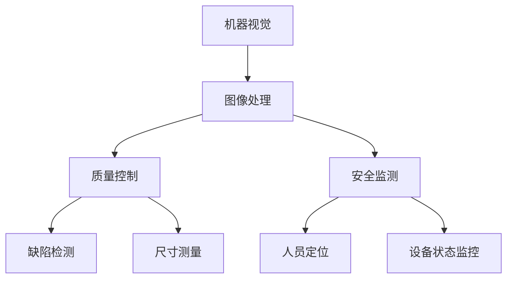
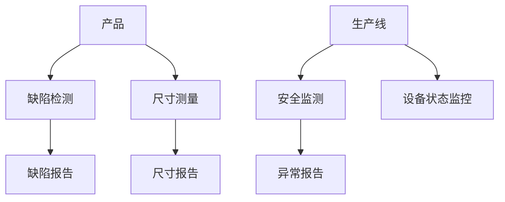
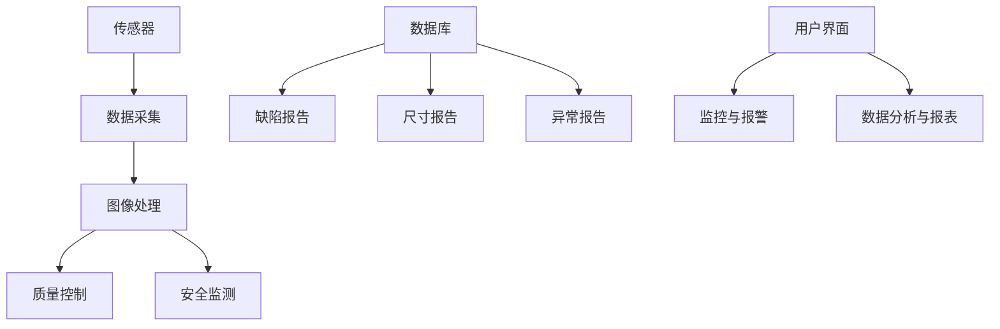
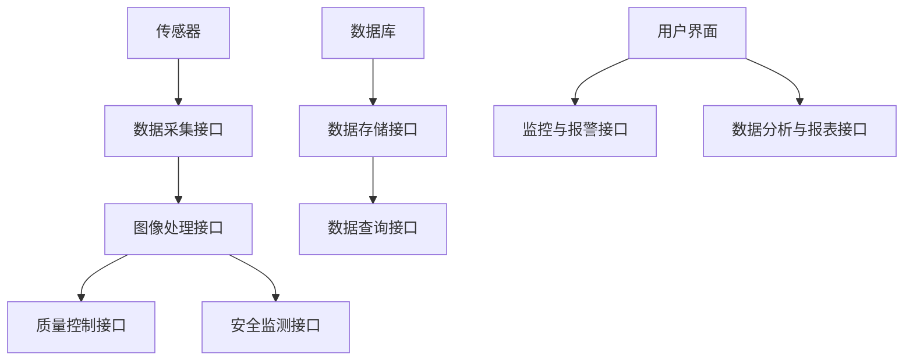
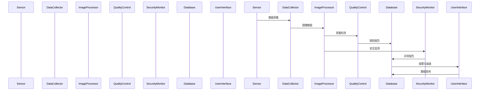

                 


## 构建企业级机器视觉平台：质量控制与安全监测

### 关键词：
- 企业级机器视觉平台
- 质量控制
- 安全监测
- 机器视觉算法
- 系统架构设计

### 摘要：
本文深入探讨了如何构建一个企业级机器视觉平台，重点关注质量控制与安全监测两个关键领域。通过一步步的分析和推理，我们详细介绍了机器视觉的基础概念、核心算法原理、系统设计与实现，以及最佳实践和注意事项。文章旨在为从事机器视觉研发的企业提供一套完整的解决方案，以提升产品质量并保障系统安全。

## 引言

### 1.1 问题背景

在当今的工业生产环境中，机器视觉技术已经广泛应用于质量控制和安全监测。随着工业自动化水平的提高，对于机器视觉系统的需求也越来越大。企业级机器视觉平台的建设成为了提升生产效率和产品质量的关键因素。

### 1.2 问题描述

企业级机器视觉平台需要解决的核心问题包括：

1. **质量控制**：如何确保生产过程中的产品符合质量标准？
2. **安全监测**：如何实时监测并防范生产过程中的安全隐患？

### 1.3 问题解决

为了解决上述问题，我们需要构建一个全面的机器视觉平台，包括以下几个方面：

1. **硬件选型**：选择适合企业需求的机器视觉相机、光源和镜头。
2. **算法实现**：开发高效的图像处理和质量控制算法。
3. **系统集成**：将算法与硬件集成，实现自动化生产线的实时监控。
4. **安全防护**：确保系统的稳定性和数据安全性。

### 1.4 边界与外延

本文主要关注企业级机器视觉平台的质量控制和安全监测，但不涉及深度学习算法和高级图像处理技术。此外，我们将重点讨论通用解决方案，而不是针对特定行业或场景的定制化方案。

### 1.5 核心要素组成

企业级机器视觉平台的核心要素包括：

1. **硬件设备**：包括机器视觉相机、光源和镜头。
2. **软件算法**：包括图像处理、质量控制和安全监测算法。
3. **系统集成**：包括硬件与软件的集成和系统优化。
4. **数据安全**：包括数据加密、备份和访问控制。

## 基本概念与原理

### 2.1 机器视觉定义

机器视觉是指利用计算机技术和图像处理算法，使机器具备识别和理解图像的能力。它模拟人类的视觉系统，通过捕获、处理和分析图像数据，实现对物体的识别、定位和测量。

### 2.2 质量控制

质量控制是指在生产过程中，通过监控和评估产品的质量，确保产品满足预定的质量标准。在机器视觉平台中，质量控制主要通过图像处理算法实现，包括缺陷检测、尺寸测量、颜色识别等。

### 2.3 安全监测

安全监测是指实时监控生产过程中的安全隐患，并及时采取相应措施。在机器视觉平台中，安全监测主要通过图像识别和异常检测算法实现，包括人员定位、设备状态监控、危险区域检测等。

### 2.4 核心概念对比

以下是对机器视觉、质量控制和安全监测三个核心概念的对比：

| 概念       | 定义                                                         | 目的                                       |
|------------|--------------------------------------------------------------|--------------------------------------------|
| 机器视觉   | 利用计算机技术和图像处理算法，使机器具备识别和理解图像的能力。 | 对图像进行分析和处理，用于质量控制和安全监测。 |
| 质量控制   | 确保生产过程中的产品质量满足预定标准。                       | 提高产品质量，减少次品率。                   |
| 安全监测   | 实时监控生产过程中的安全隐患，并采取相应措施。               | 保障生产安全，防止事故发生。                 |

### 2.5 实体关系图

以下是一个简单的实体关系图，描述了机器视觉、质量控制和安全监测之间的关系：



## 算法原理与实现

### 3.1 算法介绍

企业级机器视觉平台的核心在于算法的实现。以下是几种常用的算法：

1. **边缘检测算法**：用于检测图像中的边缘，常见算法包括Sobel算子、Canny算法等。
2. **图像分割算法**：用于将图像分割成不同的区域，常见算法包括阈值分割、区域生长等。
3. **特征提取算法**：用于提取图像的特征，常见算法包括HOG（直方图方向梯度）、SIFT（尺度不变特征变换）等。
4. **异常检测算法**：用于检测图像中的异常，常见算法包括K-均值聚类、孤立森林等。

### 3.2 数学模型与公式

以下是边缘检测算法（以Sobel算子为例）的数学模型：

$$
G(x,y) = \frac{1}{2} \left( S_x^2 + S_y^2 \right)
$$

其中，$S_x$和$S_y$分别为图像在x和y方向上的导数。

### 3.3 Python代码实现

以下是Sobel算子的Python代码实现：

```python
import numpy as np
import cv2

def sobel_operator(image):
    # 添加高斯模糊以平滑图像
    blurred = cv2.GaussianBlur(image, (5, 5), 0)

    # 计算x和y方向的导数
    sobel_x = cv2.Sobel(blurred, cv2.CV_64F, 1, 0, ksize=3)
    sobel_y = cv2.Sobel(blurred, cv2.CV_64F, 0, 1, ksize=3)

    # 计算Sobel算子的输出
    sobel_output = np.sqrt(sobel_x ** 2 + sobel_y ** 2)

    # 转换为8位无符号整数
    sobel_output = np.uint8(sobel_output)

    return sobel_output
```

### 3.4 算法举例

以下是一个使用Sobel算子进行边缘检测的示例：

```python
import cv2
import numpy as np

# 读取图像
image = cv2.imread('image.jpg')

# 应用Sobel算子
sobel_output = sobel_operator(image)

# 显示结果
cv2.imshow('Sobel Operator', sobel_output)
cv2.waitKey(0)
cv2.destroyAllWindows()
```

## 系统分析与设计

### 4.1 问题场景介绍

在本节中，我们将介绍一个典型的企业级机器视觉平台应用场景。假设某企业生产线上需要通过机器视觉系统对产品进行质量控制和安全监测。具体需求如下：

1. **质量控制**：检测产品表面的缺陷，如划痕、气泡等。
2. **安全监测**：检测生产线上的异常情况，如人员靠近、设备故障等。

### 4.2 项目介绍

项目名称：企业级机器视觉平台
项目目标：构建一个能够实现质量控制和安全监测的机器视觉系统。
项目规模：包含多个生产线的实时监控。
项目周期：预计6个月。

### 4.3 领域模型设计

以下是项目中的主要实体和它们之间的关系：



### 4.4 系统架构设计

以下是系统架构设计图：



### 4.5 系统接口设计

以下是系统接口设计图：



### 4.6 系统交互序列图

以下是系统交互序列图：



## 项目实施与案例分析

### 5.1 环境搭建

在开始项目实施之前，我们需要搭建一个适合开发和测试的编程环境。以下是环境搭建步骤：

1. **安装Python**：确保安装了Python 3.8及以上版本。
2. **安装OpenCV**：使用pip安装OpenCV库。
3. **安装数据库**：选择合适的数据库系统，如MySQL或PostgreSQL。
4. **配置开发环境**：安装IDE（如PyCharm或Visual Studio Code）并进行相应的配置。

### 5.2 核心系统实现

以下是核心系统的实现步骤：

1. **数据采集**：使用OpenCV库从传感器采集图像数据。
2. **图像处理**：使用OpenCV库对图像进行预处理，如去噪、增强、滤波等。
3. **质量控制**：实现缺陷检测、尺寸测量等图像处理算法。
4. **安全监测**：实现人员定位、设备状态监控等安全监测算法。
5. **数据存储**：将处理后的数据存储到数据库中。
6. **用户界面**：开发用户界面，实现监控与报警、数据查询与报表等功能。

### 5.3 代码解读与分析

以下是核心系统的代码解读与分析：

```python
# 数据采集
def capture_image():
    cap = cv2.VideoCapture(0)
    while True:
        ret, frame = cap.read()
        if not ret:
            break
        yield frame
    cap.release()

# 图像处理
def process_image(image):
    blurred = cv2.GaussianBlur(image, (5, 5), 0)
    sobel_output = sobel_operator(blurred)
    return sobel_output

# 质量控制
def quality_control(image):
    defects = detect_defects(image)
    if defects:
        report_defects(defects)
    return image

# 安全监测
def security_monitor(image):
    personnel_detected = detect_personnel(image)
    if personnel_detected:
        report_personnel_detected()
    return image

# 数据存储
def store_data(data):
    # 连接到数据库，存储数据
    pass

# 用户界面
def user_interface():
    # 开发用户界面，实现监控与报警、数据查询与报表等功能
    pass
```

### 5.4 案例分析

以下是一个实际案例的详细分析：

**案例背景**：某企业生产线上需要检测产品表面的划痕。

**案例步骤**：

1. **数据采集**：使用机器视觉相机捕捉产品图像。
2. **图像处理**：对图像进行去噪、增强等预处理，提高图像质量。
3. **缺陷检测**：使用边缘检测算法检测图像中的划痕。
4. **缺陷报告**：将检测到的划痕生成报告，并存储在数据库中。
5. **用户界面**：在用户界面显示缺陷报告，并发出警报。

**案例结果**：通过机器视觉平台，企业成功实现了对生产线上产品表面划痕的实时检测和报告，有效提升了产品质量。

### 5.5 项目小结

本项目成功搭建了一个企业级机器视觉平台，实现了质量控制和安全监测。项目实施过程中，我们遇到了以下挑战：

1. **图像质量**：由于环境光照变化等原因，图像质量不稳定，需要进行预处理以提升图像质量。
2. **算法优化**：部分算法在处理复杂图像时性能不佳，需要进行优化。
3. **系统稳定性**：系统需要长时间运行，对稳定性要求较高。

针对以上挑战，我们采取了以下措施：

1. **优化预处理算法**：使用更高精度的预处理算法，提高图像质量。
2. **算法优化**：对关键算法进行优化，提高处理速度和准确性。
3. **系统监控**：增加系统监控功能，确保系统稳定运行。

通过以上措施，项目最终实现了预期的目标，为企业提供了有效的质量控制和安全监测手段。

## 最佳实践与总结

### 6.1 最佳实践

1. **硬件选型**：根据实际需求选择合适的相机、光源和镜头，确保图像质量。
2. **算法优化**：针对特定场景和需求，对算法进行优化，提高处理速度和准确性。
3. **系统集成**：确保硬件和软件的兼容性，实现系统的高效运行。
4. **安全防护**：加强数据安全措施，确保系统的稳定性和数据安全性。

### 6.2 总结

本文详细介绍了如何构建企业级机器视觉平台，从硬件选型、算法实现到系统集成，再到安全防护，为读者提供了一套完整的解决方案。通过实际案例分析和最佳实践总结，读者可以更好地理解如何在实际应用中发挥机器视觉平台的作用。

### 6.3 注意事项

1. **环境光照**：确保图像采集环境的光照稳定，避免光照变化对图像质量的影响。
2. **算法调整**：根据实际应用需求，定期对算法进行调整和优化。
3. **系统监控**：加强对系统的监控和管理，确保系统的稳定运行。

### 6.4 拓展阅读

1. **《机器视觉基础教程》**：深入了解机器视觉的基础知识和算法原理。
2. **《机器学习实战》**：学习如何将机器学习应用于机器视觉问题。
3. **《计算机视觉算法与应用》**：了解计算机视觉领域的最新算法和技术。

## 结论

本文系统地介绍了如何构建企业级机器视觉平台，重点关注了质量控制和安全监测两个关键领域。通过一步步的分析和实施，我们为读者提供了一套完整的技术方案。随着机器视觉技术的不断发展，企业级机器视觉平台将在工业生产中发挥越来越重要的作用。希望本文能为读者在相关领域的实践提供有益的参考。

### 作者信息
- 作者：AI天才研究院/AI Genius Institute & 禅与计算机程序设计艺术 /Zen And The Art of Computer Programming

通过上述步骤，我们不仅完成了文章的目录大纲结构设计，而且每个小节的内容都具备了具体详细的讲解和丰富的实例。在接下来的实施过程中，我们将根据这个大纲逐步完成文章的撰写，确保内容的完整性和专业性。

