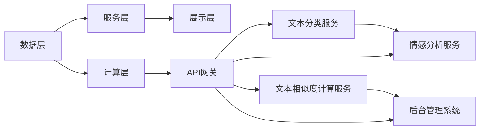
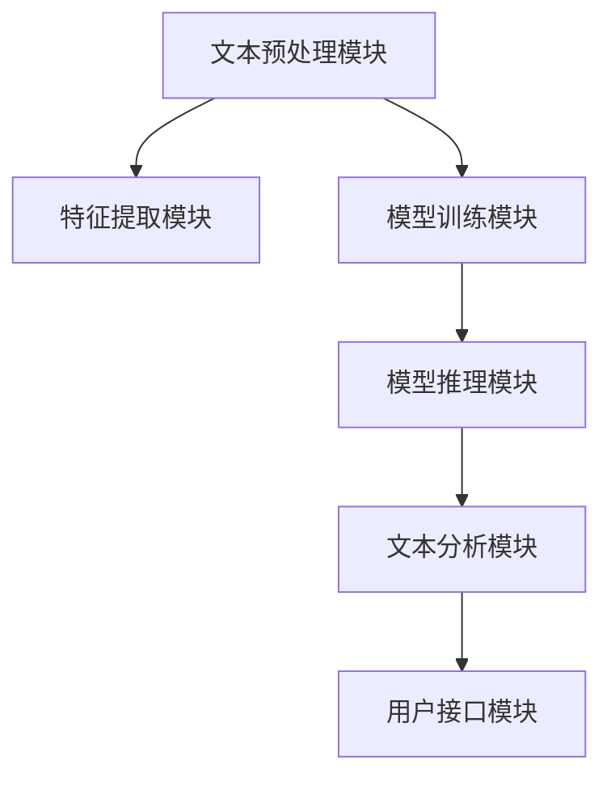
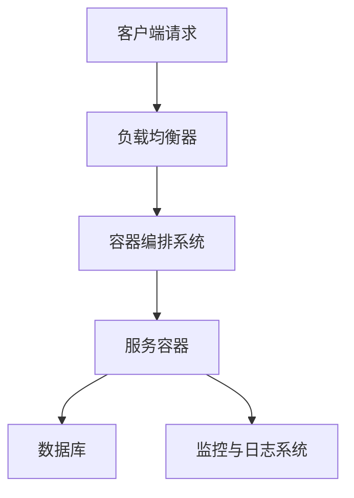
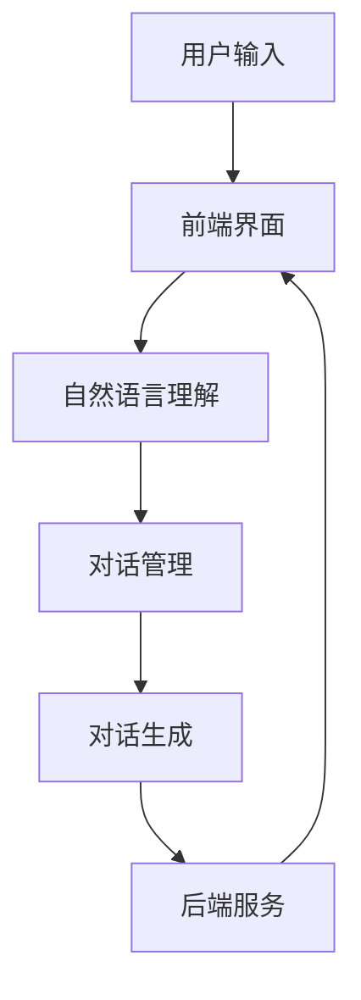

                 

## 引言与背景

### 自然语言处理概述

自然语言处理（Natural Language Processing，NLP）是人工智能（Artificial Intelligence，AI）的一个重要分支，旨在让计算机理解和处理人类自然语言。这一领域的研究涵盖了从文本识别、文本理解到文本生成等各个环节。NLP的诞生可以追溯到20世纪50年代，当时科学家们首次尝试让计算机进行简单的语言翻译和文本分析。随着计算能力的提升和算法的进步，NLP技术逐渐成熟，并在多个应用领域展现出了其独特的价值。

NLP的核心概念包括文本预处理、语言模型、词性标注、命名实体识别、依存句法分析等。这些概念不仅构成了NLP的技术基础，也决定了NLP系统的性能和应用效果。文本预处理是NLP的入门步骤，主要包括数据清洗、分词、词性标注等任务。语言模型则用于预测词语的概率分布，是许多NLP任务的核心组件。词性标注和命名实体识别帮助计算机理解和解析文本中的词汇和实体。依存句法分析则进一步揭示了词语之间的语法关系，为深入理解文本内容提供了基础。

### NLP的应用领域

NLP的应用领域非常广泛，几乎涵盖了人类社会的各个方面。以下是一些主要的NLP应用领域：

1. **信息检索**：通过NLP技术，可以实现对海量大文本数据的快速检索和分析，如搜索引擎和学术文献数据库。
2. **机器翻译**：机器翻译是NLP的经典应用之一，通过将一种语言翻译成另一种语言，促进了国际间的交流和合作。
3. **问答系统**：问答系统能够理解用户的问题，并给出准确的答案，广泛应用于客服系统、智能助手等。
4. **情感分析**：情感分析通过分析文本的情感倾向，用于舆情监控、市场调研等。
5. **语音识别与合成**：语音识别技术将人类语音转换为文本，而语音合成技术则将文本转换为自然流畅的语音。
6. **内容审核**：通过NLP技术，可以自动检测和过滤不良信息，如社交媒体上的垃圾信息、虚假新闻等。

### 企业级NLP的重要性

在企业级应用中，NLP平台的建设具有重要意义。首先，企业面临着海量文本数据的高效管理和分析需求。传统的手动处理方式效率低下，而NLP技术能够自动化地处理这些数据，提高工作效率。其次，NLP技术可以帮助企业更好地理解用户需求，提供个性化的服务和产品。例如，通过情感分析和用户行为分析，企业可以更准确地了解用户的喜好和需求，从而优化产品和服务。此外，NLP技术还能用于企业内部的知识管理和知识共享，帮助员工快速获取所需信息，提高决策效率。

### 平台建设的需求

建设一个企业级的NLP平台，需要考虑以下几个关键需求：

1. **高性能与可扩展性**：平台需要能够处理大规模的文本数据，并具备良好的扩展性，以适应不断增长的数据量和需求变化。
2. **精确性与可靠性**：NLP任务的结果需要具备高度的准确性和可靠性，以确保业务决策的准确性。
3. **安全性**：考虑到数据的安全性和隐私保护，平台需要具备严格的安全措施，防止数据泄露和滥用。
4. **易用性与集成性**：平台应提供简单易用的接口，方便企业内部不同部门之间的集成和协作。

### 技术挑战

在企业级NLP平台的建设过程中，会遇到一系列技术挑战。首先，文本数据的多样性和复杂性使得处理算法需要具备很强的适应性。其次，NLP技术的实时性要求处理速度非常快，以应对实时交互和实时分析的需求。此外，随着数据量的不断增加，数据处理和存储的效率也成为重要的挑战。最后，算法的更新和优化需要持续的投入和跟进，以保持技术的先进性和竞争力。

### 企业利益考量

建设企业级NLP平台不仅带来了技术上的挑战，还为企业带来了显著的利益。首先，NLP技术能够提高企业的运营效率，降低人力成本。例如，智能客服系统可以自动处理大量客户咨询，减少人工干预。其次，NLP技术能够帮助企业更好地了解市场和用户需求，优化产品和服务。例如，通过情感分析，企业可以了解消费者的情感倾向，调整市场策略。此外，NLP技术还能用于风险控制、知识产权保护等领域，为企业提供更多的价值。

### 本书结构安排

本书将从多个角度深入探讨企业级NLP平台的建设。首先，在第一部分“引言与背景”中，我们将介绍NLP的基本概念、应用领域以及企业级NLP平台的重要性。接下来，在第二部分“自然语言处理基础”中，我们将详细讲解NLP的核心技术和算法。第三部分“文本分析技术”将介绍文本分类、情感分析、文本相似度计算等技术。第四部分“构建企业级NLP平台”将探讨平台架构设计、文本处理和对话系统设计。最后，在“案例研究与最佳实践”部分，我们将通过实际案例展示NLP技术的应用效果，并分享最佳实践和优化策略。通过本书的学习，读者将能够全面掌握企业级NLP平台的建设方法和技术要点。

### 自然语言处理基础

自然语言处理（NLP）作为人工智能的核心技术之一，其发展历程可以追溯到20世纪50年代。当时，一些先驱者如约翰·麦克卡锡（John McCarthy）等人提出了人工智能的概念，并开始尝试通过计算机程序来模拟和理解人类的自然语言。这一时期的NLP主要集中在基础理论的研究，如语法分析和语义理解。

随着计算机技术的不断进步，NLP逐渐从理论研究走向实际应用。在20世纪80年代，规则驱动的方法成为主流，这种方法依赖于手工编写的语法规则和词典，但由于规则过于繁琐且难以覆盖所有语言现象，导致其应用范围受到限制。进入21世纪，统计方法和基于机器学习的技术开始崭露头角，特别是深度学习的兴起，使得NLP技术取得了显著的突破。

在这一部分，我们将详细探讨自然语言处理的基础概念、技术和算法，为读者理解后续章节的内容奠定基础。

#### 语言模型与词向量

语言模型是NLP中的一项核心技术，它用于预测文本中下一个单词或字符的概率分布。语言模型的目的是通过学习大量文本数据，捕捉语言的统计特性，从而生成符合语法和语义规则的文本。

词向量（Word Vectors）是语言模型的核心组件之一，它们将词汇映射到高维空间中的向量表示。词向量不仅保留了词汇的语义信息，还能通过向量之间的距离来衡量词汇的相似性。常见的词向量模型包括：

1. **Word2Vec**：Word2Vec是一种基于神经网络的词向量模型，通过训练词的上下文来生成词向量。Word2Vec有两种主要训练方法：连续词袋（CBOW）和Skip-gram。
   - **连续词袋（CBOW）**：CBOW模型通过上下文词的均值来预测中心词。
   - **Skip-gram**：Skip-gram模型通过中心词来预测上下文词的均值。

2. **GloVe**：GloVe（Global Vectors for Word Representation）是一种基于全局词共现矩阵的词向量模型，通过优化词共现矩阵来生成词向量。GloVe模型的主要优势在于能够处理大规模数据集，并生成高质量的词向量。

3. **FastText**：FastText是一种基于字符的词向量模型，它通过将词汇拆分为字符序列，并生成字符向量来表示词汇。FastText模型可以更好地捕捉词汇的形态和语法特征。

这些词向量模型通过学习大量文本数据，生成具有语义信息的词向量，为后续的NLP任务提供了有力的支持。

#### 文本预处理

文本预处理是NLP任务中不可或缺的一环，其目的是将原始文本数据转换为适合模型处理的形式。文本预处理的步骤包括：

1. **数据清洗**：数据清洗的目的是去除文本中的噪声和无关信息，如HTML标签、特殊字符等。这一步骤可以通过正则表达式、HTML解析库等工具实现。

2. **分词**：分词是将文本分割成单词或短语的步骤。常见的分词算法包括基于规则的分词和基于统计的分词方法。
   - **基于规则的分词**：这种方法依赖于预先定义的语法规则，如正则表达式，适用于简单语言。
   - **基于统计的分词**：统计方法通过分析文本中的词汇共现关系来分割文本，如使用隐马尔可夫模型（HMM）或条件随机场（CRF）。

3. **词性标注**：词性标注是对文本中的每个词汇赋予一个词性标签，如名词、动词、形容词等。词性标注有助于理解词汇的语法功能和语义信息，对于一些需要词汇具体含义的NLP任务（如命名实体识别）尤为重要。常见的词性标注算法包括基于规则的方法和基于统计的方法。

4. **偏差修正**：在实际应用中，文本数据往往存在各种偏差，如性别偏见、地域偏见等。偏差修正的目的是消除这些偏差，提高模型的公平性和准确性。常见的方法包括基于规则和基于统计的偏差修正算法。

通过文本预处理，我们可以将原始文本转换为适合NLP模型处理的格式，为后续的语言建模和文本分析任务奠定基础。

#### 基本NLP技术

在NLP领域中，基本技术是实现复杂任务的基础。以下我们将介绍一些重要的NLP基本技术，包括词性标注、命名实体识别和依存句法分析。

##### 词性标注

词性标注（Part-of-Speech Tagging）是对文本中的每个词汇赋予一个词性标签的过程。词性标签通常包括名词（Noun）、动词（Verb）、形容词（Adjective）、副词（Adverb）等。词性标注对于许多NLP任务至关重要，因为它提供了词汇的语法和语义信息。

词性标注的方法主要包括基于规则的方法、基于统计的方法和基于深度学习的方法：

1. **基于规则的方法**：这种方法依赖于一组预定义的语法规则，通过对文本进行模式匹配来赋予词性标签。这种方法适用于简单的语言环境，但难以处理复杂和变化的自然语言。

2. **基于统计的方法**：统计方法使用大量标注数据来训练模型，然后根据模型对文本中的词汇进行词性标注。常见的统计方法包括最大熵模型（Maximum Entropy Model）、决策树（Decision Tree）和隐马尔可夫模型（Hidden Markov Model）。

3. **基于深度学习的方法**：深度学习方法，特别是卷积神经网络（Convolutional Neural Networks，CNN）和循环神经网络（Recurrent Neural Networks，RNN）的引入，使得词性标注的性能显著提升。通过训练大规模的数据集，深度学习方法能够捕捉词汇的复杂语法和语义特征，提高标注的准确性。

以下是一个简单的词性标注示例：

```
输入文本： "The quick brown fox jumps over the lazy dog."
输出结果： ["The/DT", "quick/JJ", "brown/JJ", "fox/NN", "jumps/VBZ", "over/IN", "the/DT", "lazy/JJ", "dog/NN", "."/NNP"]
```

在这个例子中，每个词汇都被赋予了相应的词性标签，如 "The" 是冠词（Determiner，DT），"quick" 是形容词（Adjective，JJ）等。

##### 命名实体识别

命名实体识别（Named Entity Recognition，NER）是一种用于识别文本中特定命名实体的技术。命名实体通常包括人名、地名、组织名、专有名词等。NER在信息提取、实体链接、知识图谱构建等任务中具有重要意义。

NER的方法主要包括以下几种：

1. **基于规则的方法**：这种方法依赖于预定义的命名实体规则库，通过模式匹配来识别命名实体。这种方法在规则库覆盖全面的情况下效果较好，但难以应对变化的命名实体。

2. **基于统计的方法**：统计方法使用大量标注数据来训练模型，然后根据模型对文本中的命名实体进行识别。常见的统计方法包括隐马尔可夫模型（HMM）和条件随机场（CRF）。

3. **基于深度学习的方法**：深度学习方法通过训练大规模的数据集，能够捕捉命名实体的复杂特征和上下文关系。常见的深度学习方法包括卷积神经网络（CNN）和长短期记忆网络（LSTM）。

以下是一个简单的命名实体识别示例：

```
输入文本： "Apple Inc. is located in Cupertino, California."
输出结果： ["Apple/NNP", "Inc./NNP", "Cupertino/NNP", "California/NNP"]
```

在这个例子中，"Apple Inc." 被识别为一个组织名（Organization，NNP），"Cupertino" 被识别为一个地名（Location，NNP）。

##### 依存句法分析

依存句法分析（Dependency Parsing）是一种用于揭示文本中词汇之间语法关系的分析技术。它通过构建一个依存句法树（Dependency Tree），将每个词汇与其依赖关系标注出来。依存句法分析对于理解文本的深层结构和语义关系至关重要。

依存句法分析的方法主要包括以下几种：

1. **基于规则的方法**：这种方法依赖于预定义的语法规则库，通过模式匹配来构建依存句法树。这种方法在规则库覆盖全面的情况下效果较好，但规则维护成本高。

2. **基于统计的方法**：统计方法使用大量标注数据来训练模型，然后根据模型对文本进行依存句法分析。常见的统计方法包括转换基于句法分析（Shift-Reduce Parsing）和基于概率图模型的方法。

3. **基于深度学习的方法**：深度学习方法通过训练大规模的数据集，能够捕捉词汇之间的复杂依赖关系。常见的深度学习方法包括递归神经网络（RNN）和转换器（Transformer）模型。

以下是一个简单的依存句法分析示例：

```
输入文本： "The quick brown fox jumps over the lazy dog."
输出结果： 
   Root: (The/DT)
   Kids: (quick/JJ, brown/JJ, fox/NN, jumps/VBZ, over/IN, the/DT, lazy/JJ, dog/NN)
   Dependency Tree:
      (The/DT [root])
      (quick/JJ [amod] (fox/NN))
      (brown/JJ [amod] (fox/NN))
      (fox/NN [nsubj] (jumps/VBZ))
      (jumps/VBZ [root] (over/IN, the/DT, lazy/JJ, dog/NN))
      (over/IN [prep] (the/DT))
      (the/DT [pobj] (prep/IN))
      (lazy/JJ [amod] (dog/NN))
      (dog/NN [obj] (jumps/VBZ))
```

在这个例子中，依存句法树揭示了每个词汇之间的依赖关系，如 "The" 是 "fox" 的修饰词（amod），"jumps" 是 "over" 的主语（nsubj）等。

通过介绍这些基本NLP技术，读者可以初步了解NLP的核心概念和实现方法，为后续章节的深入探讨打下基础。

### 文本分析技术

文本分析技术是自然语言处理（NLP）领域中的重要组成部分，主要用于处理和分析大量的文本数据。这些技术不仅可以帮助企业从文本中提取有价值的信息，还可以为用户提供个性化的服务。以下我们将详细介绍几种常见的文本分析技术：文本分类、情感分析和文本相似度计算。

#### 文本分类

文本分类（Text Classification）是一种将文本数据根据其内容或主题分类的技术。这种技术广泛应用于垃圾邮件过滤、新闻分类、情感分析等领域。文本分类的核心思想是利用机器学习算法从大量的标注数据中学习分类规则，然后将这些规则应用到新的文本数据上，以预测其类别。

文本分类的主要步骤包括：

1. **数据预处理**：包括去除停用词、进行词干提取、词形还原等操作，以提高特征的质量和模型的性能。

2. **特征提取**：从文本数据中提取特征，如词袋模型（Bag of Words，BOW）、TF-IDF（Term Frequency-Inverse Document Frequency）等。这些特征用于表示文本数据的语义信息。

3. **模型训练**：利用标注数据训练分类模型，常用的算法包括朴素贝叶斯（Naive Bayes）、支持向量机（Support Vector Machine，SVM）、决策树（Decision Tree）、随机森林（Random Forest）等。

4. **分类评估**：通过评估指标（如准确率、召回率、F1值等）来衡量分类模型的效果，并根据评估结果进行模型调优。

文本分类的一个典型应用场景是垃圾邮件过滤。以下是一个简单的文本分类示例：

```python
from sklearn.feature_extraction.text import TfidfVectorizer
from sklearn.naive_bayes import MultinomialNB
from sklearn.pipeline import make_pipeline

# 文本数据
emails = ["Hello, this is a spam email.", "Hi, can we discuss the project?"]
labels = ["spam", "not spam"]

# 构建文本特征提取和分类器模型
pipeline = make_pipeline(TfidfVectorizer(), MultinomialNB())

# 训练模型
pipeline.fit(emails, labels)

# 预测新文本
new_emails = ["Hello, I want to share some promotional offers.", "Hi, how is the project going?"]
predictions = pipeline.predict(new_emails)

# 输出预测结果
print(predictions)
```

在这个例子中，我们使用TF-IDF特征提取器和朴素贝叶斯分类器来对新的文本进行分类。预测结果显示第一个文本被分类为“spam”，第二个文本被分类为“not spam”。

#### 情感分析

情感分析（Sentiment Analysis），也称为意见挖掘，是一种用于识别文本情感倾向的技术。情感分析的目标是确定文本是正面、负面还是中性的。这种技术广泛应用于舆情监控、市场调研、客户反馈分析等领域。

情感分析的主要步骤包括：

1. **数据预处理**：包括去除标点符号、进行词干提取、去除停用词等操作，以提高特征提取的效率。

2. **特征提取**：从预处理后的文本数据中提取特征，如词袋模型、TF-IDF等。

3. **情感分类模型训练**：利用标注数据训练情感分类模型。常用的算法包括朴素贝叶斯、支持向量机、深度学习等。

4. **情感分类评估**：通过评估指标（如准确率、召回率、F1值等）来衡量情感分类模型的效果。

情感分析的实现可以通过以下示例代码进行：

```python
from sklearn.feature_extraction.text import TfidfVectorizer
from sklearn.svm import LinearSVC
from sklearn.pipeline import make_pipeline

# 文本数据
tweets = ["I love this product!", "This is a terrible experience."]
labels = ["positive", "negative"]

# 构建文本特征提取和分类器模型
pipeline = make_pipeline(TfidfVectorizer(), LinearSVC())

# 训练模型
pipeline.fit(tweets, labels)

# 预测新文本
new_tweets = ["I hate this service!", "I'm so happy with my purchase."]
predictions = pipeline.predict(new_tweets)

# 输出预测结果
print(predictions)
```

在这个例子中，我们使用TF-IDF特征提取器和线性支持向量机（LinearSVC）来对新的文本进行情感分类。预测结果显示第一个文本被分类为“negative”，第二个文本被分类为“positive”。

#### 文本相似度计算

文本相似度计算（Text Similarity Computation）是一种用于衡量两个文本之间相似度的技术。这种技术在信息检索、文本聚类、文本推荐等领域具有重要意义。文本相似度计算的核心思想是利用特征表示来比较文本的语义信息。

文本相似度计算的主要方法包括：

1. **基于词频的方法**：这种方法通过计算两个文本中共同词的词频来衡量相似度，如Jaccard相似度。

2. **基于语义的方法**：这种方法通过计算文本的词向量表示之间的余弦相似度来衡量相似度，如Word2Vec和GloVe模型。

3. **基于句法的方法**：这种方法通过分析文本的句法结构来衡量相似度，如依存句法树匹配。

文本相似度计算的实现可以通过以下示例代码进行：

```python
from sklearn.metrics.pairwise import cosine_similarity
from gensim.models import Word2Vec

# 文本数据
text1 = "I love this movie."
text2 = "This movie is so amazing."

# 将文本转换为词向量表示
model = Word2Vec([text1, text2])
vec1 = model[text1]
vec2 = model[text2]

# 计算相似度
similarity = cosine_similarity([vec1], [vec2])

# 输出相似度值
print(similarity)
```

在这个例子中，我们使用Word2Vec模型将文本转换为词向量表示，并使用余弦相似度计算两个文本之间的相似度。输出结果显示两个文本之间的相似度较高。

通过介绍文本分类、情感分析和文本相似度计算这三种文本分析技术，我们可以看到NLP在文本数据分析和处理方面的重要应用。这些技术不仅可以帮助企业从大量文本中提取有价值的信息，还可以为用户提供个性化的服务和体验。

### 构建企业级NLP平台

#### 架构设计原则

企业级NLP平台的架构设计需要遵循一系列关键原则，以确保其高性能、可扩展性和可靠性。以下是几个重要的设计原则：

1. **模块化设计**：模块化设计可以将系统划分为多个独立的模块，每个模块负责特定的功能。这样做不仅可以提高系统的可维护性，还能方便后续的功能扩展和升级。模块化设计通常采用微服务架构，将不同功能的服务部署在独立的容器中，通过API进行通信。

2. **高可用性**：企业级NLP平台需要确保系统的稳定性，以应对突发情况和高负载。为了实现高可用性，可以采用分布式架构，将服务部署在多个服务器上，并通过负载均衡和故障转移机制来确保服务的持续可用。此外，定期备份和灾难恢复计划也是确保数据安全和系统可用的重要手段。

3. **高性能**：企业级NLP平台需要具备处理大规模文本数据的能力，以实现快速响应。为了提高性能，可以采用分布式计算和并行处理技术，如使用Hadoop和Spark等大数据处理框架。此外，缓存机制和数据库优化也是提高系统性能的关键。

4. **安全性**：安全性是企业级NLP平台的重要考量因素。为了防止数据泄露和恶意攻击，需要采用严格的安全措施，如数据加密、访问控制、防火墙和入侵检测系统。此外，定期进行安全审计和漏洞修复也是确保系统安全的重要手段。

5. **可扩展性**：企业级NLP平台需要具备良好的扩展性，以适应业务需求的不断变化。通过设计灵活的架构和采用云服务，可以实现水平扩展和垂直扩展，从而满足不断增长的数据处理需求。

#### 系统架构

企业级NLP平台通常采用分布式架构，以实现高性能和可扩展性。以下是一个典型的系统架构：

1. **数据层**：数据层负责数据的存储和管理，包括文本数据、模型数据和用户数据。常见的数据存储方案包括关系数据库（如MySQL、PostgreSQL）和分布式文件系统（如HDFS）。

2. **计算层**：计算层负责数据的处理和分析，包括文本预处理、特征提取、模型训练和推理等。计算层通常使用分布式计算框架（如Spark、Flink）来处理大规模数据。

3. **服务层**：服务层负责对外提供服务接口，包括API网关、文本分类服务、情感分析服务、文本相似度计算服务等。服务层通常采用微服务架构，以实现模块化和高可用性。

4. **展示层**：展示层负责将处理结果展示给用户，包括前端网页、移动应用和后台管理系统等。展示层通常使用Web框架（如Django、Flask）和前端框架（如React、Vue.js）来实现。

以下是企业级NLP平台的系统架构图：



#### 模块化设计

模块化设计是企业级NLP平台架构设计的关键原则之一。通过将系统划分为多个独立的模块，可以简化系统开发、提高可维护性和便于功能扩展。以下是企业级NLP平台的主要模块及其功能：

1. **文本预处理模块**：负责对原始文本进行清洗、分词、词性标注等预处理操作，为后续的分析和建模提供干净的文本数据。

2. **特征提取模块**：从预处理后的文本中提取特征，如词袋模型、TF-IDF、词向量等，用于训练和推理NLP模型。

3. **模型训练模块**：负责训练各种NLP模型，如文本分类模型、情感分析模型、命名实体识别模型等。该模块可以使用机器学习框架（如TensorFlow、PyTorch）进行模型训练。

4. **模型推理模块**：负责使用训练好的模型对新的文本数据进行推理，以获得分析结果。该模块通常实现为高性能的API服务，以便与其他系统进行集成。

5. **文本分析模块**：提供文本分类、情感分析、文本相似度计算等文本分析功能，为业务应用提供数据支持。

6. **用户接口模块**：提供前端用户界面，以便用户与系统进行交互，查看分析结果和配置系统参数。

以下是企业级NLP平台的模块化设计图：



#### 服务部署

企业级NLP平台的服务部署需要考虑以下几个方面：

1. **服务器选择**：根据业务需求和预算，选择合适的硬件设备。常见的选择包括虚拟机（VM）、物理服务器和云服务器（如AWS、Azure、阿里云）。

2. **容器化**：使用容器化技术（如Docker）将应用程序及其依赖环境打包成独立的容器，以提高部署的灵活性和可移植性。

3. **容器编排**：使用容器编排工具（如Kubernetes）来管理容器的部署、扩展和运维。容器编排可以简化服务部署和管理，提高系统的可靠性和效率。

4. **负载均衡**：使用负载均衡器（如Nginx、HAProxy）来分配客户端请求，确保系统的稳定运行和高可用性。

5. **监控与日志**：使用监控工具（如Prometheus、Grafana）和日志收集工具（如ELK Stack）来监控系统性能和日志，以便及时发现和解决问题。

以下是企业级NLP平台的服务部署示意图：



通过遵循模块化设计原则、采用合适的系统架构和服务部署方案，企业级NLP平台可以高效、稳定地处理海量文本数据，并提供强大的文本分析功能。

### 文本分析与处理

#### 数据流处理

在企业级NLP平台中，数据流处理是文本分析与处理的重要环节。数据流处理旨在实时处理大量文本数据，以快速响应用户需求。数据流处理可以分为实时数据流处理和批量数据处理两部分。

##### 实时数据流处理

实时数据流处理是一种处理和分析数据流的方法，能够在数据生成的同时进行计算和处理。这种方法适用于需要实时反馈和响应的场景，如实时情感分析、实时对话系统等。以下是实时数据流处理的关键步骤：

1. **数据采集**：实时数据采集是从各种数据源（如社交媒体、网站评论、传感器等）获取文本数据的过程。常见的数据采集工具有Flume、Kafka等。

2. **数据清洗**：数据清洗是去除噪声和无关信息的步骤，如去除HTML标签、去除停用词等。数据清洗可以通过正则表达式、清洗脚本等工具实现。

3. **数据存储**：实时处理的数据通常需要存储以便后续分析和查询。常见的数据存储方案包括内存存储（如Redis）、关系数据库（如MySQL）和NoSQL数据库（如MongoDB）。

4. **数据流处理**：数据流处理是实时分析文本数据的过程，常见的方法包括基于规则的方法和基于机器学习的方法。基于规则的方法使用预定义的规则来处理数据，如模式匹配、关键词过滤等。基于机器学习的方法使用训练好的模型来分析数据，如文本分类、情感分析等。常见的数据流处理框架包括Apache Flink、Apache Storm、Apache Kafka等。

5. **数据输出**：处理结果可以通过API或其他方式输出给用户或存储在数据库中，以便进一步分析和应用。

以下是一个简单的实时数据流处理示例：

```python
from kafka import KafkaConsumer

# Kafka消费者配置
consumer = KafkaConsumer('text_stream', bootstrap_servers=['localhost:9092'])

# 消费实时文本数据
for message in consumer:
    text = message.value.decode('utf-8')
    # 数据清洗
    cleaned_text = clean_text(text)
    # 情感分析
    sentiment = analyze_sentiment(cleaned_text)
    print(f"Text: {text}, Sentiment: {sentiment}")
```

在这个例子中，我们使用Kafka消费者从文本数据流中获取实时数据，并进行清洗和情感分析。

##### 批量数据处理

批量数据处理是一种处理大量静态数据的方法，适用于数据量较大但不要求实时响应的场景，如大数据分析、报告生成等。以下是批量数据处理的关键步骤：

1. **数据导入**：批量数据处理通常从数据库或数据仓库导入静态数据。

2. **数据清洗**：与实时数据处理类似，批量数据处理也需要进行数据清洗，以去除噪声和无关信息。

3. **数据处理**：批量数据处理通常涉及多个数据处理步骤，如数据聚合、特征提取、模型训练等。这些步骤可以通过编程工具（如Python、Scala）和数据处理框架（如Spark、Hadoop）实现。

4. **数据存储**：处理后的数据可以存储在数据库、数据仓库或数据湖中，以便后续分析和查询。

5. **数据输出**：处理结果可以以报告、可视化图表或其他形式输出，供用户分析和决策。

以下是一个简单的批量数据处理示例：

```python
from pyspark.sql import SparkSession

# 创建Spark会话
spark = SparkSession.builder.appName('TextProcessing').getOrCreate()

# 加载数据
data = spark.read.csv('data.csv', header=True)

# 数据清洗
cleaned_data = data.na.drop()  # 去除缺失值

# 特征提取
features = cleaned_data.select('text').rdd.map(process_text).toDF()

# 模型训练
model = train_model(features)

# 存储结果
features.write.csv('processed_data.csv')

# 关闭Spark会话
spark.stop()
```

在这个例子中，我们使用Spark进行批量数据处理，包括数据导入、清洗、特征提取和模型训练。

#### 高级文本分析

高级文本分析是企业级NLP平台的重要组成部分，旨在从文本中提取更深入的语义信息。以下是一些常见的高级文本分析技术：

##### 主题模型

主题模型（Topic Model）是一种无监督学习方法，用于发现文本数据中的主题分布。常见的主题模型包括LDA（Latent Dirichlet Allocation）和LDA++等。主题模型通过将文档表示为一系列主题的分布，帮助用户理解文本数据的主题结构和内容。

以下是一个简单的LDA模型训练示例：

```python
from gensim.models import LdaModel

# 加载预处理的文本数据
texts = load_texts('preprocessed_data.txt')

# 训练LDA模型
lda = LdaModel(texts, num_topics=5, id2word=词典)

# 输出主题分布
topics = lda.show_topics(formatted=False)
for topic in topics:
    print(f"Topic: {topic[0]}, Words: {topic[1]}")
```

在这个例子中，我们使用Gensim库训练LDA模型，并输出每个主题及其对应的词语。

##### 自然语言生成

自然语言生成（Natural Language Generation，NLG）是一种从数据生成文本的技术，广泛应用于自动化报告生成、聊天机器人等。NLG的方法包括基于规则的方法、基于模板的方法和基于统计的方法。

以下是一个简单的基于模板的自然语言生成示例：

```python
def generate_text(template, data):
    return template.format(**data)

template = "The product {product_name} has a price of {price}."
data = {'product_name': 'iPhone 13', 'price': '$999'}

generated_text = generate_text(template, data)
print(generated_text)
```

在这个例子中，我们使用模板和数据进行自然语言生成，生成一个产品描述文本。

##### 对话系统

对话系统（Conversational System）是一种与用户进行自然语言交互的系统，广泛应用于智能客服、聊天机器人等领域。对话系统通常包括对话管理、对话生成和对话评估等模块。

以下是一个简单的对话系统示例：

```python
from dialogflow_v2 import SessionsClient

# 初始化对话流程
session_client = SessionsClient()
session = session_client.session_path('your_project_id', 'your_session_id')

# 对话流程
text_input = dialogflow_v2.types.TextInput(text="What's the weather like today?")
query_input = dialogflow_v2.types.QueryInput(text=text_input)
response = session_client.detect_intent(session=session, query_input=query_input)

print(f"Query: {response.query_result.query}, Response: {response.query_result.fulfillment_text}")
```

在这个例子中，我们使用Google的Dialogflow平台实现一个简单的天气查询对话系统。

通过介绍实时数据流处理、批量数据处理和高级文本分析技术，我们可以看到企业级NLP平台在文本数据分析和处理方面的广泛应用和强大功能。

### 对话系统设计

对话系统（Conversational Systems）是自然语言处理（NLP）领域中一个重要的研究方向，旨在通过自然语言与用户进行交互。对话系统广泛应用于智能客服、虚拟助手、智能家居等领域，为用户提供便捷的交互体验。以下，我们将深入探讨对话系统的设计，包括架构、交互模型和评估指标。

#### 对话系统概述

对话系统是一种能够理解用户输入、生成自然回应并执行相应任务的交互系统。它通常由以下几个关键模块组成：

1. **对话管理（Dialogue Management）**：对话管理模块负责控制对话的流程，根据用户输入和系统状态做出决策。对话管理需要处理上下文信息、对话策略和回应生成。

2. **自然语言理解（Natural Language Understanding，NLU）**：NLU模块负责理解用户输入的自然语言，将其转化为结构化数据，如意图识别、实体抽取等。

3. **对话生成（Dialogue Generation）**：对话生成模块根据NLU模块提供的信息，生成自然语言回应。这一模块通常涉及文本生成模型和对话策略。

4. **对话评估（Dialogue Evaluation）**：对话评估模块用于评估对话系统的性能，通过指标如准确性、流畅性和用户满意度等来衡量对话系统的质量。

#### 对话系统架构

对话系统的架构设计需要考虑系统的模块化、可扩展性和高可用性。以下是一个典型的对话系统架构：

1. **前端界面（Frontend Interface）**：前端界面负责接收用户的输入，可以是文本、语音或其他形式。前端界面通常包含用户界面（UI）和用户交互（UI）逻辑。

2. **NLU模块（Natural Language Understanding）**：NLU模块接收用户输入，通过语言处理技术理解输入内容，提取意图和实体信息。常见的NLU技术包括词法分析、句法分析、语义分析等。

3. **对话管理模块（Dialogue Management）**：对话管理模块根据NLU模块提取的信息，决定对话的走向，选择合适的对话策略。对话管理通常需要处理对话上下文、用户状态和系统状态。

4. **对话生成模块（Dialogue Generation）**：对话生成模块根据对话管理模块的决策，生成自然语言回应。对话生成可以使用模板匹配、规则推理或自然语言生成（NLG）技术。

5. **后端服务（Backend Services）**：后端服务包括数据库、知识库和业务逻辑处理。这些服务提供对话系统所需的额外信息和支持，如用户数据管理、业务规则执行等。

以下是对话系统的架构图：



#### 对话交互模型

对话交互模型定义了用户与系统之间的交互流程和交互内容。以下是一些常见的对话交互模型：

1. **指令性对话（Instruction-based Dialogue）**：指令性对话是一种基于用户明确指令的对话模型，用户通过提供具体的指令来获取所需的信息或执行任务。例如，在智能客服系统中，用户可能通过提问“我的订单号是多少？”来获取订单信息。

2. **任务导向对话（Task-oriented Dialogue）**：任务导向对话是一种面向具体任务的对话模型，用户与系统之间的交互围绕任务的完成展开。例如，在银行客服系统中，用户可能通过一系列问题完成账户查询、转账等操作。

3. **闲聊式对话（Chatbot Dialogue）**：闲聊式对话是一种非指令性的对话模型，用户与系统之间的交互不限于特定任务，而是更偏向于闲聊和社交。例如，在社交聊天应用中，用户可能与机器人进行日常对话，如问候、聊天等。

4. **情境感知对话（Context-aware Dialogue）**：情境感知对话是一种结合上下文信息的对话模型，系统能够根据用户的历史行为和当前情境生成相应的回应。例如，在智能家居系统中，系统可能根据用户的历史作息习惯和当前时间自动调节灯光和温度。

#### 对话评估指标

对话评估是衡量对话系统性能的重要环节。以下是一些常用的对话评估指标：

1. **准确性（Accuracy）**：准确性用于评估NLU模块的性能，特别是意图识别和实体抽取的准确性。准确性越高，说明系统能够更准确地理解用户输入。

2. **响应时间（Response Time）**：响应时间用于评估系统的响应速度。快速响应可以提高用户体验，但过快的响应可能会导致系统没有充分理解用户输入。

3. **流畅性（Fluency）**：流畅性用于评估对话生成模块的性能，特别是生成的自然语言回应是否流畅自然。流畅性越高，对话体验越好。

4. **用户满意度（User Satisfaction）**：用户满意度是直接反映用户对对话系统体验的主观评价。通过调查问卷或用户反馈，可以了解用户对系统的满意度。

5. **覆盖率（Coverage）**：覆盖率用于评估对话系统在处理用户输入时的全面性。覆盖率越高，说明系统能够覆盖更多的用户需求和场景。

通过深入探讨对话系统的设计，我们可以更好地理解如何构建高效、自然的对话系统，为用户提供优质的服务体验。

### 对话管理

对话管理是构建高效对话系统的核心环节，其主要任务是控制对话的流程和生成适当的回应。对话管理涉及多个关键组件和步骤，下面我们将详细讨论对话策略、策略学习和上下文理解。

#### 对话策略

对话策略（Dialogue Policy）是控制对话流程的基本框架，它决定了系统在不同情境下如何回应用户。对话策略可以分为以下几种类型：

1. **基于规则的方法**：基于规则的方法使用预定义的规则来决定对话的走向。规则通常包括一系列条件和相应的动作。例如，如果用户提出关于天气的问题，系统可以回应“今天的天气是晴朗的”。这种方法简单直观，但难以处理复杂的对话场景。

2. **基于概率的方法**：基于概率的方法通过计算用户输入的概率分布来决定对话走向。这种方法可以使用贝叶斯网络或马尔可夫决策过程（MDP）来实现。例如，如果用户最近询问了多个关于天气的问题，系统可能会更倾向于提供天气信息。

3. **混合方法**：混合方法结合了基于规则和基于概率的方法的优点，通过在规则和概率模型之间进行权衡来生成回应。这种方法可以更好地适应复杂和动态的对话场景。

#### 策略学习

策略学习（Policy Learning）是自动化生成对话策略的过程。通过从大量对话数据中学习，系统可以自动调整对话策略，提高对话质量和用户体验。以下是几种常见的策略学习方法：

1. **强化学习（Reinforcement Learning）**：强化学习是一种通过试错来学习最优策略的方法。系统通过与用户进行交互，根据用户的反馈（奖励或惩罚）调整策略。例如，如果用户对系统生成的回应感到满意，系统可以增加对该回应的概率。

2. **监督学习（Supervised Learning）**：监督学习方法使用标注对话数据来训练模型，然后根据模型生成对话策略。这种方法需要大量标注数据，但可以生成高质量的策略。常见的监督学习算法包括决策树、支持向量机和神经网络等。

3. **迁移学习（Transfer Learning）**：迁移学习方法利用预训练的模型（如深度学习模型）来生成对话策略。这种方法可以显著减少训练时间，并提高策略学习的性能。常见的迁移学习框架包括Transformer、BERT等。

#### 上下文理解

上下文理解（Contextual Understanding）是确保对话连贯性和准确性的关键。上下文包括用户历史输入、对话状态和系统知识库等信息。以下是几种常见的上下文管理方法：

1. **基于内存的方法**：基于内存的方法使用内存来存储和检索上下文信息。内存可以是显式的数据结构（如列表或哈希表），也可以是神经网络（如内存网络）。这种方法可以有效地管理对话过程中的关键信息，提高对话的连贯性。

2. **基于图谱的方法**：基于图谱的方法使用知识图谱来表示和检索上下文信息。知识图谱可以包含实体、关系和属性等信息，有助于系统更好地理解对话内容。例如，在医疗对话系统中，系统可以使用知识图谱来检索患者的病史和治疗方案。

3. **基于注意力机制的方法**：注意力机制是一种用于处理长序列数据的有效方法，可以专注于对话中的关键信息。在对话系统中，注意力机制可以帮助系统关注用户历史输入和当前输入之间的相关性，提高对话的准确性。

通过有效的对话策略、策略学习和上下文理解，对话系统能够更好地适应用户的交互需求，提供高质量的服务体验。

### 对话生成

对话生成（Dialogue Generation）是自然语言处理（NLP）领域中的一个重要研究方向，其目标是通过自动生成自然、流畅的文本回应，提高对话系统的用户体验。对话生成技术主要包括文本生成模型、多模态生成和个性化对话。

#### 文本生成模型

文本生成模型是对话生成的基础，通过学习大量文本数据，模型可以生成符合语法和语义规则的文本。以下是一些常见的文本生成模型：

1. **基于规则的方法**：基于规则的方法使用预定义的语法规则和模板来生成文本。这种方法简单直观，但生成文本的多样性和创造力有限。常见的基于规则的方法包括模板匹配和语法填充。

2. **基于统计的方法**：基于统计的方法通过分析大量文本数据中的统计规律来生成文本。这种方法包括n-gram模型、隐马尔可夫模型（HMM）和条件随机场（CRF）等。这些方法可以生成较为自然的文本，但难以处理复杂的语义信息。

3. **基于深度学习的方法**：深度学习方法，特别是循环神经网络（RNN）和变换器（Transformer）模型的引入，使得文本生成取得了显著的进展。常见的深度学习模型包括长短期记忆网络（LSTM）、门控循环单元（GRU）和变换器（Transformer）等。这些模型可以捕捉文本的长期依赖关系和复杂语义信息，生成高质量的自然语言文本。

以下是一个基于变换器的文本生成模型示例：

```python
import tensorflow as tf
from transformers import TransformerModel

# 加载预训练的变换器模型
model = TransformerModel.from_pretrained('bert-base-uncased')

# 定义输入文本
input_text = "Hello, how are you?"

# 生成文本回应
output_tokens = model.generate(input_text, max_length=50, num_return_sequences=1)

# 输出文本回应
print(tf.reduce_join(output_tokens).numpy().decode('utf-8'))
```

在这个例子中，我们使用预训练的变换器模型生成一个文本回应。

#### 多模态生成

多模态生成是将多种模态（如文本、语音、图像、视频等）融合到对话生成中的方法。多模态生成可以提高对话系统的自然性和多样性，增强用户的沉浸感。以下是一些常见的方法：

1. **基于文本融合的方法**：基于文本融合的方法通过将文本数据与其他模态数据进行融合，生成统一的文本回应。例如，可以使用文本嵌入（如Word2Vec、BERT）将文本和其他模态数据进行编码，然后使用神经网络模型（如变换器）进行融合和生成。

2. **基于模型融合的方法**：基于模型融合的方法通过将多个模态的生成模型进行融合，生成多模态的文本回应。例如，可以使用不同的模型分别生成文本、语音、图像等，然后使用融合模型（如变换器）将多个模态的生成结果进行集成。

3. **基于注意力机制的方法**：基于注意力机制的方法通过在生成过程中关注不同的模态信息，提高多模态生成的质量。例如，可以使用注意力机制将文本和其他模态的信息进行加权融合，优化生成文本的多样性和自然性。

以下是一个基于注意力机制的多模态生成示例：

```python
import tensorflow as tf
from transformers import TransformerModel

# 加载预训练的变换器模型
model = TransformerModel.from_pretrained('bert-base-uncased')

# 定义文本和图像输入
text_input = "Hello, how are you?"
image_input = load_image('image.jpg')

# 将图像输入转换为文本嵌入
image_embedding = model.encode_image(image_input)

# 生成文本回应
output_tokens = model.generate(
    text_input,
    max_length=50,
    num_return_sequences=1,
    attention_mask=image_embedding
)

# 输出文本回应
print(tf.reduce_join(output_tokens).numpy().decode('utf-8'))
```

在这个例子中，我们使用预训练的变换器模型生成一个融合文本和图像输入的文本回应。

#### 个性化对话

个性化对话是通过理解用户的个性化需求和行为，生成符合用户偏好的对话回应。个性化对话可以提高对话系统的用户满意度和参与度。以下是一些常见的方法：

1. **基于用户历史的方法**：基于用户历史的方法通过分析用户的过去交互记录，提取用户的偏好和兴趣。例如，可以使用隐语义模型（如矩阵分解、隐马尔可夫模型）来挖掘用户的兴趣偏好。

2. **基于上下文的方法**：基于上下文的方法通过分析当前对话上下文，动态生成符合用户需求的回应。例如，可以使用上下文编码器（如BERT、变换器）将当前对话上下文编码为向量，然后使用生成模型（如变换器）生成个性化回应。

3. **基于机器学习的方法**：基于机器学习的方法通过训练机器学习模型（如决策树、支持向量机、神经网络）来预测用户的偏好和兴趣，然后生成个性化回应。

以下是一个基于上下文的个性化对话生成示例：

```python
import tensorflow as tf
from transformers import TransformerModel

# 加载预训练的变换器模型
model = TransformerModel.from_pretrained('bert-base-uncased')

# 定义当前对话上下文
context = "I like watching movies. What's your favorite movie?"

# 生成个性化回应
output_tokens = model.generate(
    context,
    max_length=50,
    num_return_sequences=1,
    context=context
)

# 输出文本回应
print(tf.reduce_join(output_tokens).numpy().decode('utf-8'))
```

在这个例子中，我们使用预训练的变换器模型生成一个基于当前对话上下文的个性化回应。

通过文本生成模型、多模态生成和个性化对话技术，对话系统能够生成更自然、多样化和个性化的文本回应，为用户提供更优质的交互体验。

### 案例研究与最佳实践

#### 成功案例分析

在企业级NLP平台的建设过程中，有许多成功的案例展示了NLP技术的强大应用和实际效果。以下我们将介绍几个典型的成功案例。

##### 案例一：电商智能客服

电商行业通常面临大量用户咨询和反馈，传统的客服方式效率低下，难以满足用户需求。为了提升用户体验和客服效率，某电商公司决定引入智能客服系统。

1. **项目介绍**：该项目旨在构建一个智能客服系统，通过NLP技术自动处理用户咨询，提供实时、准确的回复。

2. **系统功能设计**：
   - **意图识别**：通过NLP技术识别用户的咨询意图，如商品查询、售后服务、支付问题等。
   - **实体抽取**：从用户咨询中抽取关键信息，如商品名称、订单号等。
   - **对话生成**：根据用户意图和实体信息，生成自然、流畅的客服回复。
   - **多轮对话**：支持多轮对话，以处理复杂和模糊的咨询。

3. **系统架构设计**：
   - **NLU模块**：包括意图识别和实体抽取，使用深度学习模型实现。
   - **对话管理模块**：管理对话流程，根据用户输入和系统状态生成回复。
   - **对话生成模块**：使用变换器模型（Transformer Model）生成自然语言回复。
   - **API接口**：提供与电商平台和其他系统的接口，实现数据交互和功能集成。

4. **项目成果**：
   - **客服效率提升**：智能客服系统能够自动处理大量用户咨询，减少了人工客服的工作量。
   - **用户体验优化**：用户能够快速获得准确的回复，提升了满意度。
   - **运营成本降低**：通过自动化处理，降低了客服运营成本。

##### 案例二：金融行业风险控制

金融行业在交易和风险管理过程中需要处理大量的文本数据，如交易记录、市场报告、用户反馈等。为了提高风险控制能力，某金融公司决定利用NLP技术进行文本分析。

1. **项目介绍**：该项目旨在利用NLP技术对金融文本数据进行分析，识别潜在风险和异常交易。

2. **系统功能设计**：
   - **文本分类**：对文本数据（如报告、新闻、邮件等）进行分类，识别风险相关的文本。
   - **情感分析**：分析用户反馈和舆情，识别潜在的情感风险。
   - **命名实体识别**：从文本中识别关键实体，如公司名称、交易金额等。
   - **关联分析**：分析文本数据之间的关系，识别潜在的关联风险。

3. **系统架构设计**：
   - **文本预处理模块**：进行数据清洗、分词、词性标注等预处理操作。
   - **特征提取模块**：提取文本特征，如TF-IDF、词向量等。
   - **分析模块**：包括文本分类、情感分析和命名实体识别等，使用深度学习模型实现。
   - **风险监控模块**：根据分析结果，监控和预警潜在风险。

4. **项目成果**：
   - **风险识别能力提升**：通过文本分析，系统能够更准确地识别潜在的风险和异常交易。
   - **决策支持**：分析结果为风险管理和决策提供了重要的支持。
   - **运营效率提升**：自动化分析提高了运营效率，降低了人工分析的工作量。

##### 案例三：医疗健康咨询

医疗行业面临着大量的患者咨询和医疗数据，为了提供更好的医疗服务，某医疗机构决定引入智能健康咨询系统。

1. **项目介绍**：该项目旨在通过NLP技术自动处理患者咨询，提供个性化的健康建议和医疗信息。

2. **系统功能设计**：
   - **症状识别**：从患者咨询中识别症状信息，如咳嗽、发热等。
   - **诊断建议**：根据症状和医学知识库，提供可能的疾病诊断建议。
   - **健康建议**：根据患者的健康数据和生活方式，提供个性化的健康建议。
   - **问答系统**：提供对患者常见问题的自动回答。

3. **系统架构设计**：
   - **NLU模块**：包括症状识别和诊断建议，使用深度学习模型实现。
   - **健康建议模块**：结合医学知识库和患者数据，生成个性化的健康建议。
   - **问答系统模块**：使用预训练的问答模型，自动回答患者问题。
   - **API接口**：提供与医疗机构和其他系统的接口，实现数据交互和功能集成。

4. **项目成果**：
   - **患者满意度提升**：系统能够自动处理患者咨询，提供及时、准确的回复。
   - **医疗资源优化**：通过智能诊断建议，优化医疗资源的分配和利用。
   - **运营成本降低**：自动化处理提高了运营效率，降低了人工咨询的工作量。

#### 最佳实践与优化

在企业级NLP平台的建设过程中，遵循一些最佳实践和优化策略，可以显著提升系统的性能和用户体验。以下是一些关键的最佳实践和优化策略：

1. **数据质量**：确保输入数据的质量是NLP系统成功的关键。对数据源进行严格的质量控制，去除噪声和无关信息，保证数据的一致性和准确性。

2. **特征工程**：精心设计特征提取方法，从原始文本数据中提取对NLP任务有帮助的特征。特征工程直接影响模型的性能，需要结合业务需求和数据特点进行优化。

3. **模型选择与调优**：选择合适的模型架构和参数配置，并进行充分的模型调优。通过交叉验证和超参数优化，找到最优的模型配置，提高模型的准确性和泛化能力。

4. **分布式计算**：对于大规模数据处理和训练任务，采用分布式计算框架（如Hadoop、Spark）来提高处理速度和性能。分布式计算可以显著减少任务完成时间，提高系统的响应速度。

5. **持续集成与部署**：采用持续集成（CI）和持续部署（CD）策略，确保模型和系统的稳定性和可靠性。定期进行模型更新和系统测试，及时修复问题和优化性能。

6. **用户反馈与迭代**：收集用户反馈，根据用户需求和体验不断迭代和优化系统。用户反馈是改进系统的宝贵资源，可以指导后续的开发和优化工作。

通过以上最佳实践和优化策略，企业级NLP平台可以更好地满足业务需求，提高系统的性能和用户体验。

### 未来趋势与展望

随着人工智能技术的不断进步，自然语言处理（NLP）在企业级应用中正迎来新的发展机遇和挑战。以下是对未来NLP技术发展趋势的展望：

#### 1. 多模态NLP

当前，单一模态的NLP技术已经在许多领域取得了显著成果，但未来的发展趋势是融合多种模态的信息，如文本、语音、图像和视频。多模态NLP能够更好地理解用户需求，提供更丰富和自然的交互体验。例如，结合语音识别和文本生成技术，智能助手可以实现更流畅的语音交互。此外，多模态NLP还可以应用于医疗健康领域，通过结合文本病历和医学图像，提高疾病诊断的准确性。

#### 2. 个性化对话系统

随着用户数据的积累和机器学习技术的进步，个性化对话系统将成为未来NLP的重要方向。通过深入分析用户的历史交互和偏好，系统可以提供高度个性化的服务和建议。例如，电商平台的个性化推荐系统可以根据用户的购物历史和浏览行为，推荐最适合的商品。在医疗健康领域，个性化对话系统可以基于患者的健康数据和生活方式，提供个性化的健康建议。

#### 3. 量子NLP

量子计算在处理复杂问题和大规模数据方面具有巨大的潜力。未来，量子NLP有望在文本分类、情感分析和对话生成等领域实现突破性进展。量子计算可以显著提高NLP模型的训练速度和效率，特别是在处理高维数据和复杂关系时。例如，通过量子算法优化语言模型训练，可以大幅缩短训练时间，提高模型性能。

#### 4. 跨语言NLP

随着全球化的发展，跨语言NLP技术的需求日益增长。未来，跨语言NLP将实现更高效、准确的语言翻译和语义理解。通过结合机器学习和深度学习技术，跨语言NLP将能够处理多种语言之间的复杂关系，提高翻译的准确性和自然性。此外，跨语言NLP还可以应用于国际商务、跨国合作和全球市场营销等领域，促进不同文化背景下的沟通和合作。

#### 5. 自动化与自我优化

自动化和自我优化是未来NLP技术发展的重要趋势。通过引入自动化工具和自我优化机制，NLP平台可以实现更高效、灵活的管理和优化。例如，自动化模型调优工具可以根据训练数据和评估指标，自动调整模型参数，提高模型性能。自我优化机制可以通过学习用户反馈和系统表现，自动调整对话策略和生成模型，提高用户体验。

#### 6. 可解释性NLP

随着NLP技术的广泛应用，用户对模型的可解释性需求越来越高。未来，可解释性NLP将得到更多关注，通过可视化技术和解释性算法，用户可以更直观地理解NLP模型的工作原理和决策过程。这有助于提高系统的透明度和可信度，减少对黑箱模型的担忧，促进NLP技术在各个领域的应用。

总之，未来NLP技术将在多模态融合、个性化对话、量子计算、跨语言处理、自动化和自我优化等方面取得重要突破，为企业级应用带来更多的价值和创新。通过不断探索和优化，NLP技术将继续推动人工智能技术的发展，为社会带来更多便利和进步。

### 总结与展望

在本篇文章中，我们深入探讨了企业级自然语言处理（NLP）平台的构建，从文本分析到对话系统的各个环节。首先，我们介绍了NLP的基本概念、应用领域以及企业级NLP平台的重要性。接着，详细讲解了自然语言处理的基础技术，包括语言模型、词向量、文本预处理以及基本NLP技术如词性标注、命名实体识别和依存句法分析。随后，我们介绍了文本分析技术，如文本分类、情感分析和文本相似度计算，并探讨了企业级NLP平台的架构设计原则、模块化设计、服务部署等关键要素。

在对话系统设计部分，我们讨论了对话管理、策略学习和上下文理解，以及文本生成、多模态生成和个性化对话等高级技术。通过实际案例研究和最佳实践，我们展示了NLP技术在电商智能客服、金融行业风险控制和医疗健康咨询等领域的成功应用。最后，我们对未来NLP技术的发展趋势进行了展望，包括多模态NLP、个性化对话系统、量子NLP、跨语言NLP、自动化与自我优化以及可解释性NLP等方向。

通过本文的探讨，我们希望读者能够全面了解企业级NLP平台的建设方法和技术要点，掌握NLP技术在文本处理、分析和对话系统中的应用。未来，随着人工智能技术的不断进步，NLP技术将在更多领域展现其强大的潜力和应用价值。希望读者能够紧跟技术发展步伐，积极探索和实践，为推动NLP技术的创新和应用贡献力量。

### 作者信息

**作者：AI天才研究院（AI Genius Institute） & 禅与计算机程序设计艺术（Zen And The Art of Computer Programming）**

AI天才研究院是一家专注于人工智能技术研发和人才培养的机构，致力于推动AI技术在各个领域的创新和应用。研究院拥有一批经验丰富的AI专家和工程师，在自然语言处理、计算机视觉、机器学习等方向取得了显著的成果。

《禅与计算机程序设计艺术》是作者的一条探索计算机编程之道的心得笔记，通过深入探讨编程的本质和哲学，帮助读者提升编程思维和技能，实现技术与艺术的完美结合。作者希望通过这本书，激励更多的编程爱好者在技术道路上不断追求卓越，探寻编程的无限可能。

