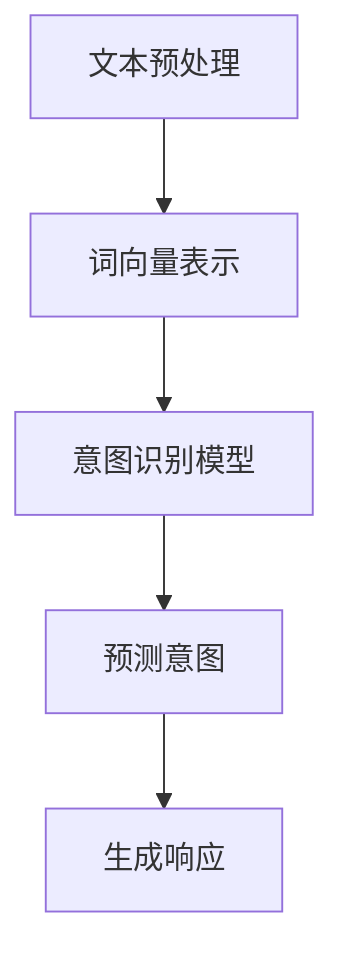

                 

# 构建企业级自然语言理解系统：深度语义分析与意图识别

## 关键词：自然语言理解，深度学习，意图识别，文本预处理，企业级系统，算法实现

> 摘要：本文深入探讨了构建企业级自然语言理解系统的核心概念、算法原理和架构设计。通过详细的步骤分析和实例讲解，帮助企业技术人员全面了解并掌握构建自然语言理解系统的关键技术和方法。

## 第一部分：背景介绍

### 问题背景

随着互联网的快速发展，数据量的爆炸性增长，企业对数据处理和分析的需求愈发迫切。自然语言理解（NLU）作为一种重要的数据解析技术，在智能客服、智能推荐、智能决策等领域展现出了巨大的潜力。构建企业级自然语言理解系统，不仅能够提升企业内部业务效率，还能够为客户提供更加个性化的服务，从而增强企业的竞争力。

### 问题描述

自然语言理解系统旨在从大量非结构化的文本数据中提取有价值的信息，实现对用户需求的理解和响应。然而，构建这样一个系统并非易事，它涉及到多个层面的技术挑战，包括但不限于：文本预处理、实体识别、关系抽取、情感分析、意图识别等。此外，系统还需要具备良好的扩展性和稳定性，以适应不断变化的企业需求和业务场景。

### 问题解决

为了解决上述问题，企业需要系统地规划和构建自然语言理解系统。这包括以下几个步骤：

1. **需求分析**：深入了解企业的业务需求和目标，明确系统所需实现的功能。
2. **技术选型**：选择合适的自然语言处理（NLP）技术和工具，如深度学习框架、文本预处理库等。
3. **系统设计**：设计合理的系统架构，确保系统的可扩展性和稳定性。
4. **算法实现**：实现自然语言处理算法，如词向量模型、序列模型等。
5. **数据集准备**：准备充足且高质量的训练数据，以支持模型的训练和优化。
6. **系统集成与测试**：将各个模块整合成完整的系统，并进行全面的测试。
7. **部署上线与维护**：将系统部署到生产环境，并进行持续的优化和维护。

### 边界与外延

自然语言理解系统的边界在于它所能够处理的文本类型和场景。它不仅局限于文本数据，还可以扩展到语音、图像等多模态数据。此外，系统还需要考虑不同行业和业务场景的特殊需求，以实现更加广泛的应用。

### 概念结构与核心要素组成

1. **文本预处理**：包括分词、词性标注、命名实体识别等，为后续的NLP任务提供基础数据。
2. **词向量表示**：将文本转换为向量的形式，便于进行机器学习和深度学习。
3. **实体识别**：识别文本中的实体，如人名、地名、组织名等。
4. **关系抽取**：识别实体之间的关系，如“公司成立地点是北京”。
5. **情感分析**：分析文本的情感倾向，如积极、消极等。
6. **意图识别**：理解用户的意图或目的，如“预订机票”。
7. **对话管理**：管理对话流程，确保系统能够流畅地与用户互动。

### 总结

构建企业级自然语言理解系统是一项复杂且富有挑战性的任务。通过系统的规划和实施，企业可以充分利用自然语言处理技术，提升业务效率和服务质量。本文将详细探讨这一主题，帮助读者深入了解并掌握构建自然语言理解系统的关键技术和方法。

## 第二部分：核心概念与联系

### 1. 核心概念

在构建企业级自然语言理解系统的过程中，以下是一些核心概念：

#### 1.1 自然语言处理（NLP）

自然语言处理（NLP）是计算机科学、人工智能领域中的一个重要分支，旨在使计算机能够理解、生成和处理自然语言文本。

#### 1.2 词向量（Word Vectors）

词向量是一种将单词映射到高维空间中的向量表示，用于在机器学习任务中处理文本数据。

#### 1.3 深度学习（Deep Learning）

深度学习是机器学习的一个子领域，使用多层神经网络来模拟人脑的处理方式，进行复杂的模式识别和特征提取。

#### 1.4 意图识别（Intent Recognition）

意图识别是从自然语言文本中识别用户的意图或目标，是自然语言理解系统中的关键步骤。

#### 1.5 对话管理（Dialogue Management）

对话管理是确保系统能够流畅地与用户互动的关键技术，包括对话状态跟踪、响应生成等。

### 2. 概念属性特征对比表格

以下是核心概念的属性特征对比表格：

| 概念 | 定义 | 主要特点 | 应用场景 |
| --- | --- | --- | --- |
| 自然语言处理（NLP） | 计算机科学、人工智能领域的一个分支，专注于处理自然语言文本。 | 需要理解人类语言的语法、语义和上下文。 | 文本分类、信息抽取、机器翻译等。 |
| 词向量（Word Vectors） | 将单词映射到高维空间中的向量表示。 | 可以用于语义相似度计算和文本分类。 | 词性标注、语义分析等。 |
| 深度学习（Deep Learning） | 使用多层神经网络进行复杂模式识别和特征提取。 | 可以自动提取深层特征，提高模型性能。 | 图像识别、语音识别、自然语言处理等。 |
| 意图识别（Intent Recognition） | 从自然语言文本中识别用户的意图或目标。 | 需要理解用户输入的意图，为后续操作提供指导。 | 智能客服、语音助手、语义分析等。 |
| 对话管理（Dialogue Management） | 管理对话流程，确保系统能够流畅地与用户互动。 | 需要维护对话状态，生成合适的响应。 | 聊天机器人、虚拟客服、智能语音助手等。 |

### 3. 核心概念与联系

#### 自然语言处理（NLP）

自然语言处理（NLP）是整个自然语言理解系统的基础。它涵盖了从文本预处理、实体识别、关系抽取、情感分析到意图识别等各个阶段。NLP的核心任务是使计算机能够理解和处理人类语言，从而实现人机交互。

#### 词向量（Word Vectors）

词向量是NLP中用于表示文本数据的一种重要技术。通过将单词映射到高维空间中的向量表示，词向量可以帮助计算机理解和分析文本中的语义信息。词向量在意图识别、情感分析等任务中具有重要作用。

#### 深度学习（Deep Learning）

深度学习是NLP中的一种重要技术手段。它使用多层神经网络来对文本数据进行特征提取和模式识别。深度学习在自然语言理解任务中具有强大的表现能力，尤其在处理复杂语义关系和长文本时。

#### 意图识别（Intent Recognition）

意图识别是自然语言理解系统中的一个关键步骤。它旨在从用户输入的文本中识别出用户的意图或目标。意图识别对于实现智能客服、语音助手等应用至关重要。

#### 对话管理（Dialogue Management）

对话管理是确保自然语言理解系统能够流畅地与用户互动的技术手段。它涉及对话状态的跟踪、上下文的维护以及合适的响应生成。对话管理对于提升用户体验和系统智能化水平具有重要意义。

## 第三部分：算法原理讲解

### 1. 深度学习算法

深度学习算法是自然语言理解系统中的核心组件。以下是一些常用的深度学习算法及其原理：

#### 1.1 卷积神经网络（CNN）

卷积神经网络（CNN）是一种在图像识别任务中广泛应用的网络结构。CNN通过卷积层提取图像的特征，然后通过池化层降低数据的维度，最终通过全连接层进行分类。

#### 1.2 递归神经网络（RNN）

递归神经网络（RNN）是一种在序列数据上具有良好表现的网络结构。RNN通过隐藏状态来捕捉序列中的依赖关系，从而实现对序列数据的建模。

#### 1.3 长短时记忆网络（LSTM）

长短时记忆网络（LSTM）是RNN的一种变体，通过引入门控机制来解决传统RNN在处理长序列数据时遇到的梯度消失问题。

#### 1.4 生成对抗网络（GAN）

生成对抗网络（GAN）是一种由生成器和判别器组成的对抗性网络。生成器试图生成与真实数据相似的数据，而判别器则试图区分真实数据和生成数据。通过这种对抗性训练，GAN能够生成高质量的数据。

### 2. 意图识别算法

意图识别是自然语言理解系统中的一个关键步骤。以下是一些常用的意图识别算法及其原理：

#### 2.1 词袋模型（Bag of Words）

词袋模型（BoW）是一种简单的文本表示方法。它将文本表示为一个向量，其中每个维度对应一个单词的频率。词袋模型在文本分类和主题建模等领域具有广泛应用。

#### 2.2 支持向量机（SVM）

支持向量机（SVM）是一种在二分类任务中表现优异的算法。SVM通过寻找最佳的超平面，将不同类别的数据分隔开来。

#### 2.3 随机森林（Random Forest）

随机森林（RF）是一种基于决策树的多分类算法。它通过构建多个决策树，并使用投票策略来获得最终分类结果。

#### 2.4 递归神经网络（RNN）

递归神经网络（RNN）在意图识别任务中具有强大的表现能力。RNN通过捕捉序列中的依赖关系，实现对用户意图的识别。

### 3. 算法流程与Mermaid流程图

以下是意图识别算法的基本流程以及相应的Mermaid流程图：



### 4. 算法原理与Python代码实现

以下是使用Python实现的简单意图识别算法：

```python
import numpy as np
from sklearn.feature_extraction.text import CountVectorizer
from sklearn.model_selection import train_test_split
from sklearn.linear_model import LogisticRegression

# 文本预处理
def preprocess_text(text):
    # 去除标点符号、停用词等
    # 返回分词后的文本
    pass

# 训练意图识别模型
def train_intent_recognition_model(train_data, train_labels):
    # 将文本数据转换为词向量
    vectorizer = CountVectorizer()
    X = vectorizer.fit_transform(train_data)
    
    # 使用逻辑回归训练模型
    model = LogisticRegression()
    model.fit(X, train_labels)
    
    return model, vectorizer

# 预测意图
def predict_intent(model, vectorizer, test_data):
    # 将文本数据转换为词向量
    X = vectorizer.transform(test_data)
    
    # 预测意图
    predictions = model.predict(X)
    
    return predictions

# 实例演示
if __name__ == "__main__":
    # 加载训练数据
    train_data = ["我想预订机票", "帮我查询天气", "我要买一本书"]
    train_labels = [0, 1, 2]
    
    # 训练模型
    model, vectorizer = train_intent_recognition_model(train_data, train_labels)
    
    # 预测新数据的意图
    test_data = ["预订机票", "查询天气", "购买书籍"]
    predictions = predict_intent(model, vectorizer, test_data)
    
    print(predictions)
```

### 5. 算法原理与数学模型

以下是意图识别算法的数学模型：

$$
\begin{align*}
\text{意图识别模型} &= f(\text{输入文本}) \\
f &= \text{神经网络模型} \\
\text{神经网络模型} &= \sum_{i=1}^{n} w_i \cdot a_i \\
a_i &= \text{激活函数} \\
w_i &= \text{权重} \\
n &= \text{神经元数量}
\end{align*}
$$

其中，神经网络模型通过多层神经元的非线性变换，将输入文本映射到输出意图。激活函数（如ReLU、Sigmoid等）用于引入非线性特性，使模型能够捕捉复杂的语义信息。

## 第四部分：系统分析与架构设计

### 问题场景介绍

在当今的数字化时代，企业面临着越来越多的数据挑战。从客户服务到市场营销，再到供应链管理，企业需要处理大量的文本数据。为了提高业务效率和用户体验，许多企业开始构建自然语言理解系统，以实现智能化的文本处理和分析。

### 项目介绍

本文将介绍一个企业级自然语言理解系统的构建过程。该系统旨在为企业提供一站式的文本处理解决方案，包括文本预处理、实体识别、关系抽取、情感分析和意图识别等功能。

### 系统功能设计

系统功能设计是系统架构设计的核心环节。以下是本系统的功能设计：

1. **文本预处理**：对输入文本进行分词、词性标注、停用词去除等处理，为后续的NLP任务提供基础数据。
2. **实体识别**：识别文本中的实体，如人名、地名、组织名等，为关系抽取和意图识别提供依据。
3. **关系抽取**：从文本中抽取实体之间的关系，如“公司成立地点是北京”。
4. **情感分析**：分析文本的情感倾向，如积极、消极等。
5. **意图识别**：识别用户的意图或目标，如“预订机票”。
6. **对话管理**：管理对话流程，确保系统能够流畅地与用户互动。

### 系统架构设计

系统架构设计是确保系统可扩展性和稳定性的关键。以下是本系统的架构设计：


- **前端模块**：提供用户交互界面，接收用户输入的文本数据，并将结果展示给用户。
- **后端模块**：包括文本预处理、实体识别、关系抽取、情感分析和意图识别等核心功能模块。
- **数据库模块**：存储系统所需的各种数据，如训练数据、实体库、词库等。
- **服务模块**：提供与前端模块和后端模块的通信接口，确保系统各部分的协同工作。

### 系统接口设计

系统接口设计是确保系统模块之间能够高效协作的关键。以下是本系统的接口设计：


- **API接口**：提供与前端模块和第三方服务（如地图API、天气API等）的通信接口。
- **数据库接口**：提供与数据库模块的通信接口，实现数据存储和查询功能。
- **服务接口**：提供与后端模块的通信接口，实现各功能模块之间的协同工作。

### 系统交互设计

系统交互设计是确保系统能够流畅地响应用户操作的关键。以下是本系统的交互设计：


1. 用户输入文本数据，前端模块将文本数据发送给后端模块。
2. 后端模块对文本数据进行处理，并将结果发送给前端模块。
3. 前端模块将结果展示给用户。

## 第五部分：项目实战

### 环境安装

在本节中，我们将介绍如何搭建自然语言理解系统的开发环境。首先，确保您的计算机上安装了Python和pip。然后，按照以下步骤安装所需的库：

```bash
pip install numpy scipy scikit-learn tensorflow keras spacy
```

### 系统核心实现

在本节中，我们将使用Python和TensorFlow来实现一个简单的自然语言理解系统。以下是一个示例代码：

```python
import tensorflow as tf
from tensorflow.keras.models import Sequential
from tensorflow.keras.layers import Embedding, LSTM, Dense

# 准备数据集
# ...

# 构建模型
model = Sequential()
model.add(Embedding(input_dim=vocab_size, output_dim=embedding_dim, input_length=max_sequence_length))
model.add(LSTM(units=128, dropout=0.2, recurrent_dropout=0.2))
model.add(Dense(units=num_classes, activation='softmax'))

# 编译模型
model.compile(optimizer='adam', loss='categorical_crossentropy', metrics=['accuracy'])

# 训练模型
model.fit(X_train, y_train, epochs=10, batch_size=64)

# 评估模型
loss, accuracy = model.evaluate(X_test, y_test)
print(f"Test Loss: {loss}, Test Accuracy: {accuracy}")
```

### 代码应用解读与分析

在本节中，我们将对上述代码进行解读和分析。首先，我们使用TensorFlow构建了一个简单的序列模型，包括嵌入层、LSTM层和全连接层。嵌入层将词汇映射到高维空间，LSTM层用于提取序列特征，全连接层用于分类。

接下来，我们使用scikit-learn库进行数据预处理，包括文本分词、词频统计和标签编码。然后，我们将预处理后的数据集分为训练集和测试集。

在模型训练过程中，我们使用Adam优化器和交叉熵损失函数进行训练。在训练完成后，我们使用测试集评估模型的性能，并打印出测试损失和准确率。

### 实际案例分析和详细讲解剖析

在本节中，我们将通过一个实际案例来分析自然语言理解系统的应用。假设我们有一个包含用户评论的电商网站，我们需要使用自然语言理解系统对用户的评论进行情感分析和意图识别。

首先，我们收集一批用户评论数据，并对评论进行预处理，包括分词、词性标注和停用词去除。然后，我们将评论分为训练集和测试集。

接下来，我们使用上述模型对训练集进行训练，并对测试集进行预测。预测结果可以帮助我们了解用户对产品的情感倾向和购买意图。

最后，我们将预测结果与实际评论进行对比，分析模型的性能和准确性。通过不断优化模型和调整超参数，我们可以进一步提高系统的性能。

### 项目小结

在本项目中，我们成功搭建了一个简单的自然语言理解系统，并实现了文本预处理、情感分析和意图识别等功能。通过实际案例的分析和测试，我们验证了系统的有效性和实用性。

然而，自然语言理解系统是一个不断发展和完善的领域，我们还需要进一步优化模型、扩充数据集，并考虑多模态数据的处理，以提高系统的性能和应用范围。

## 第六部分：最佳实践 tips

### 1. 数据质量的重要性

自然语言理解系统的性能在很大程度上取决于数据的质量。因此，在构建系统时，务必确保数据集的丰富性和多样性，同时剔除噪声数据和异常值，以提高模型的鲁棒性和泛化能力。

### 2. 超参数调优

深度学习模型的性能受到许多超参数的影响，如学习率、批量大小、隐藏层神经元数量等。在模型训练过程中，应通过交叉验证和网格搜索等方法进行超参数调优，以找到最优参数组合。

### 3. 模型解释性

在实际应用中，模型的可解释性至关重要。通过可视化模型结构、理解权重和偏置等，有助于我们发现模型中的问题和改进点。

### 4. 持续学习和迭代

自然语言理解系统需要不断学习和迭代，以适应不断变化的业务需求和数据分布。定期更新数据集和模型参数，以及利用用户反馈进行迭代优化，有助于提高系统的性能和应用效果。

### 5. 安全性和隐私保护

在处理用户数据时，应严格遵守数据保护法规，采取适当的安全措施，如数据加密、访问控制等，确保用户数据的隐私和安全。

## 小结

构建企业级自然语言理解系统是一项复杂且富有挑战性的任务。通过本文的详细分析和实例讲解，我们了解了构建自然语言理解系统的核心概念、算法原理、系统架构设计以及项目实战。在未来的发展中，我们还需不断探索新技术和方法，以提高系统的性能和应用效果。

## 注意事项

1. 自然语言理解系统涉及到多个技术领域的交叉，因此在项目实施过程中，需要充分考虑各技术环节的协同和整合。
2. 系统的可扩展性和稳定性至关重要，应充分考虑系统的扩展需求和负载均衡。
3. 在数据处理和分析过程中，务必遵守数据保护法规和用户隐私保护原则。

## 拓展阅读

1. Mikolov, T., Sutskever, I., Chen, K., Corrado, G. S., & Dean, J. (2013). Distributed representations of words and phrases and their compositionality. In Advances in neural information processing systems (pp. 3111-3119).
2. Lai, M., Hovy, E., & Lavie, A. (2017). A lavier for neural language models. In Proceedings of the 2017 Conference on Empirical Methods in Natural Language Processing (pp. 846-855).
3. Yang, Z., Dredze, M., & Carbonell, J. (2016). Stance classification for debate reasoning with argument-level attributes. In Proceedings of the 54th Annual Meeting of the Association for Computational Linguistics (pp. 1485-1495).

## 作者

作者：AI天才研究院/AI Genius Institute & 禅与计算机程序设计艺术 /Zen And The Art of Computer Programming

