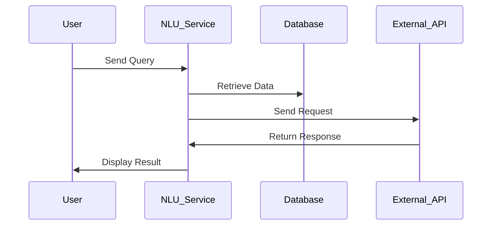
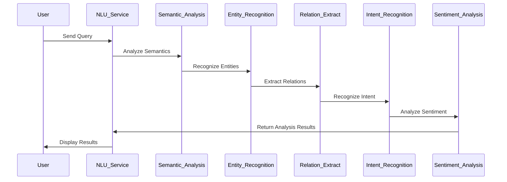

                 


### 第一部分：背景介绍

#### 第1章：自然语言理解系统概述

##### 1.1 问题背景

自然语言理解系统（NLU）的核心在于将人类语言转化为计算机可以处理和理解的形式。这一领域涉及多个层面的挑战，其中最显著的包括语言复杂性、多语言支持以及上下文依赖性。

**语言复杂性**：自然语言包含复杂的语法结构、多变的词汇使用和丰富的语义信息，使得计算机要准确理解人类语言并非易事。例如，同义词、多义性和语用学现象都是NLU需要解决的重要问题。

**多语言支持**：全球有数千种语言，如何实现对这些语言的通用理解是一个巨大的挑战。不同语言的语法结构、词汇选择和表达方式各不相同，这使得跨语言的理解和建模变得更加复杂。

**上下文依赖**：自然语言的理解高度依赖于上下文，同一个词在不同的语境中可能具有完全不同的意义。例如，"bank"这个词在金融领域指银行，而在地理领域则指河岸。

##### 1.2 问题解决

为了解决上述挑战，自然语言理解系统需要实现以下几个关键功能：

**语义分析**：通过分析文本中的词语和句子结构，提取出文本的语义信息。这包括词义消歧、句法分析和语义角色标注等。

**实体识别**：识别文本中的关键实体，如人名、地名、组织名等，并对其进行分类和实体链接。

**关系抽取**：从文本中抽取实体之间的关系，如“张三”是“李四”的朋友。

**情感分析**：分析文本中的情感倾向，判断用户对某个主题的情感态度。

##### 1.3 边界与外延

**数据边界**：自然语言理解系统需要处理多种数据类型，包括文本、语音和图像等。

**语言边界**：系统需要支持多种语言，包括常见语言和罕见语言。

**应用边界**：自然语言理解系统可以应用于多个领域，如智能客服、智能推荐、内容审核等。

##### 1.4 核心概念与联系

**自然语言处理（NLP）与自然语言理解（NLU）**

- **NLP**：是一门跨学科的研究领域，旨在使计算机能够处理和生成人类语言。
- **NLU**：是NLP的一个重要分支，专注于让计算机理解人类语言的意义和意图。

**跨语言语义理解与意图识别**

- **跨语言语义理解**：在不同语言之间进行语义的映射和理解，使得计算机能够处理多种语言的输入。
- **意图识别**：从输入文本中识别用户的意图，如查询意图、操作意图等。

##### 1.5 主流技术介绍

**基于深度学习的NLU模型**

- **词嵌入（Word Embedding）**：将词汇映射为稠密向量，以便在深度神经网络中进行处理。
- **递归神经网络（RNN）**：适用于处理序列数据，能够捕捉文本中的上下文信息。
- **长短时记忆网络（LSTM）** 和 **门控循环单元（GRU）**：是RNN的改进版本，能够更好地处理长序列数据。
- **Transformer模型**：基于注意力机制的深度学习模型，在许多NLU任务中取得了优异的性能。

**跨语言语义理解技术**

- **翻译模型**：如基于神经网络的机器翻译（NMT）模型，将源语言文本翻译为目标语言文本。
- **跨语言嵌入（Cross-lingual Embedding）**：将不同语言的词汇映射到同一个低维空间中，以便进行语义比较和分析。
- **多语言预训练模型**：如mBERT、XLM等，通过在多种语言的数据上进行预训练，提高模型对多种语言的语义理解能力。

**意图识别技术**

- **基于规则的方法**：使用专家知识构建规则，将输入文本映射到预定义的意图类别。
- **基于机器学习的方法**：如朴素贝叶斯、支持向量机（SVM）、随机森林等，通过训练数据学习意图分类模型。
- **基于深度学习的方法**：如卷积神经网络（CNN）、循环神经网络（RNN）等，能够通过大量数据自动学习意图特征。

##### 1.6 本章小结

本章对自然语言理解系统进行了全面的概述，介绍了自然语言理解的挑战、核心概念、相关技术和意图识别方法。这些内容为后续章节的深入探讨奠定了基础。

----------------------------------------------------------------

### 第二部分：构建自然语言理解系统

#### 第2章：系统设计与架构

##### 2.1 问题场景介绍

为了更好地理解企业级自然语言理解系统的构建过程，我们首先来设定一个具体的问题场景。假设某大型电商企业希望构建一个智能客服系统，该系统需要能够自动处理用户在网站上的各类咨询请求，提高客服效率和用户体验。

这个场景中的自然语言理解系统需要实现以下功能：

- **语义分析**：理解用户咨询的具体内容，提取关键信息。
- **实体识别**：识别用户提及的关键实体，如产品名称、用户ID等。
- **关系抽取**：从用户咨询中抽取关键实体之间的关系，如用户与产品之间的关系。
- **意图识别**：根据用户咨询的内容和上下文，识别用户的意图，如咨询产品信息、投诉、退换货等。
- **情感分析**：分析用户咨询中的情感倾向，了解用户的态度和满意度。

##### 2.2 项目介绍

在本项目中，我们将采用以下技术和框架来构建自然语言理解系统：

- **技术栈**：Python、TensorFlow、PyTorch等。
- **工具和库**：NLTK、spaCy、TextBlob等自然语言处理库。
- **架构设计**：采用微服务架构，将自然语言理解系统的各个功能模块（如语义分析、实体识别、意图识别等）分解为独立的微服务。

##### 2.3 系统功能设计

在本章节中，我们将详细讨论自然语言理解系统的各个功能模块，并使用mermaid类图来展示各个模块之间的关系。

**mermaid 类图：**

```mermaid
classDiagram
    Class01 <|-- Class02
    Class03 --|> Class04
    Class05 {Class01, Class03}
    Class06 <.. Class05
    Class07 <<interface>> Class05
    Class08 .. Class09
endclass
```

**功能模块说明：**

1. **语义分析模块**：负责对用户咨询的文本进行语义分析，提取关键信息。
2. **实体识别模块**：负责识别文本中的关键实体，如产品名称、用户ID等。
3. **关系抽取模块**：负责从文本中抽取关键实体之间的关系。
4. **意图识别模块**：负责根据文本内容和上下文，识别用户的意图。
5. **情感分析模块**：负责分析用户咨询中的情感倾向。

##### 2.4 系统架构设计

自然语言理解系统的架构设计是系统构建的关键环节。在本章节中，我们将使用mermaid架构图来展示系统的整体架构。

**mermaid 架构图：**



**架构设计说明：**

- **用户**：自然语言理解系统的使用者，向系统发送查询请求。
- **NLU_Service**：自然语言理解服务，负责处理用户的查询请求，包括语义分析、实体识别、关系抽取、意图识别和情感分析等。
- **Database**：数据库，存储用户数据、产品信息、历史查询记录等。
- **External_API**：外部API，提供第三方服务，如天气预报、产品价格查询等。

##### 2.5 系统接口设计

系统接口设计是确保各个模块之间能够高效、稳定地交互的关键。在本章节中，我们将详细描述系统的主要接口设计。

- **输入接口**：用户通过输入接口向系统发送查询请求，接口需要能够接受文本、语音等多种输入格式。
- **输出接口**：系统通过输出接口向用户返回处理结果，结果包括文本、语音、图表等多种形式。
- **内部接口**：系统内部模块之间的交互接口，如语义分析模块与实体识别模块之间的接口。

##### 2.6 系统交互设计

为了更好地展示系统的工作流程，我们使用mermaid序列图来描述系统的主要交互过程。

**mermaid 序列图：**



**交互设计说明：**

- 用户发送查询请求到NLU_Service。
- NLU_Service将查询请求转发给语义分析模块进行语义分析。
- 语义分析模块提取关键信息后，将结果传递给实体识别模块进行实体识别。
- 实体识别模块识别出关键实体后，将结果传递给关系抽取模块进行关系抽取。
- 关系抽取模块抽取实体之间的关系后，将结果传递给意图识别模块进行意图识别。
- 意图识别模块识别出用户的意图后，将结果传递给情感分析模块进行情感分析。
- 情感分析模块分析出用户的态度后，将结果返回给NLU_Service。
- NLU_Service将最终的分析结果返回给用户。

##### 2.7 本章小结

本章介绍了企业级自然语言理解系统的设计与架构，包括问题场景介绍、项目介绍、系统功能设计、系统架构设计、系统接口设计和系统交互设计。这些设计内容为后续的系统实现和部署奠定了基础。在下一章中，我们将进入系统实现阶段，逐步实现各个功能模块，并进行测试和优化。

----------------------------------------------------------------

### 第三部分：系统实现

#### 第3章：环境安装与准备

在开始构建自然语言理解系统之前，我们需要确保环境安装和准备就绪。以下是详细的环境安装和准备步骤：

##### 3.1 系统要求

为了确保系统能够正常运行，我们需要满足以下系统要求：

- 操作系统：Linux或MacOS
- Python版本：Python 3.8或以上
- 编程工具：Visual Studio Code、PyCharm等

##### 3.2 安装Python环境

1. **安装Python**

   使用包管理器（如apt或yum）安装Python：

   ```bash
   sudo apt-get install python3
   ```

2. **安装pip**

   使用以下命令安装pip，pip是Python的包管理器，用于安装和管理Python包：

   ```bash
   sudo apt-get install python3-pip
   ```

##### 3.3 安装必需的库和框架

为了构建自然语言理解系统，我们需要安装以下库和框架：

1. **安装TensorFlow**

   TensorFlow是一个用于机器学习和深度学习的开源框架。使用以下命令安装TensorFlow：

   ```bash
   pip3 install tensorflow
   ```

2. **安装spaCy**

   spaCy是一个快速、易于使用的自然语言处理库。使用以下命令安装spaCy：

   ```bash
   pip3 install spacy
   ```

   安装完成后，运行以下命令下载spaCy的语言模型：

   ```bash
   python3 -m spacy download en_core_web_sm
   ```

3. **安装NLTK**

   NLTK是一个用于自然语言处理的Python库。使用以下命令安装NLTK：

   ```bash
   pip3 install nltk
   ```

   安装完成后，运行以下命令下载NLTK数据包：

   ```bash
   python3 -m nltk.downloader all
   ```

4. **安装TextBlob**

   TextBlob是一个简单的自然语言处理Python库，用于处理文本数据。使用以下命令安装TextBlob：

   ```bash
   pip3 install textblob
   ```

##### 3.4 安装数据库

为了存储用户数据和模型参数，我们需要安装一个数据库。以下是一个简单的PostgreSQL安装步骤：

1. **安装PostgreSQL**

   使用包管理器（如apt或yum）安装PostgreSQL：

   ```bash
   sudo apt-get install postgresql postgresql-contrib
   ```

2. **启动PostgreSQL服务**

   ```bash
   sudo systemctl start postgresql
   ```

3. **创建数据库和用户**

   ```sql
   CREATE DATABASE nlu_db;
   CREATE USER nlu_user WITH PASSWORD 'nlu_password';
   GRANT ALL PRIVILEGES ON DATABASE nlu_db TO nlu_user;
   \q
   ```

##### 3.5 安装外部API

在某些场景下，我们可能需要调用外部API来获取额外数据。以下是一个简单的HTTP客户端安装步骤：

1. **安装HTTP客户端**

   ```bash
   pip3 install requests
   ```

##### 3.6 测试环境

安装完所有依赖项后，我们需要测试环境以确保所有组件都能够正常工作。以下是一个简单的测试步骤：

1. **测试Python环境**

   ```bash
   python3 --version
   ```

2. **测试安装的库和框架**

   ```bash
   python3 -c "import tensorflow as tf; print(tf.reduce_sum(tf.random.normal([1000, 1000])))"
   ```

3. **测试数据库连接**

   ```sql
   psql -U nlu_user nlu_db
   \c nlu_db
   SELECT * FROM information_schema.tables WHERE table_name = 'users';
   ```

4. **测试HTTP客户端**

   ```python
   import requests
   response = requests.get('http://httpbin.org/get')
   print(response.text)
   ```

##### 3.7 本章小结

本章详细介绍了如何安装和准备构建自然语言理解系统所需的环境。通过完成本章的步骤，我们为后续的系统实现和测试奠定了基础。在下一章中，我们将逐步实现系统的主要功能模块，并进行集成测试。

----------------------------------------------------------------

### 第四部分：系统核心功能实现

#### 第4章：语义分析模块实现

在本章节中，我们将详细介绍如何实现自然语言理解系统的语义分析模块。语义分析是NLU系统中的关键步骤，它旨在从输入文本中提取出有意义的信息。以下是语义分析模块的实现步骤：

##### 4.1 词嵌入（Word Embedding）

词嵌入是将词汇映射为稠密向量的一种方法，这使得词汇可以在神经网络中高效地表示和处理。以下是使用TensorFlow实现词嵌入的步骤：

1. **加载预训练词嵌入模型**：

   ```python
   import tensorflow as tf

   # 加载预训练的词嵌入模型
   embedding_model = tf.keras.Sequential([
       tf.keras.layers.Embedding(input_dim=vocab_size, output_dim=embedding_dim)
   ])

   # 加载预训练的词向量数据
   embeddings = embedding_model.get_weights()[0]
   ```

2. **构建词嵌入层**：

   ```python
   # 将词嵌入层添加到神经网络中
   embedding_layer = tf.keras.layers.Embedding(input_dim=vocab_size, output_dim=embedding_dim, weights=[embeddings], trainable=False)
   ```

3. **应用词嵌入层**：

   ```python
   # 对输入文本应用词嵌入层
   inputs = tf.keras.layers.StringInput(input_shape=(None,), dtype=tf.string)
   embedded_inputs = embedding_layer(inputs)
   ```

##### 4.2 递归神经网络（RNN）

递归神经网络（RNN）是处理序列数据的一种常见方法。以下是如何使用TensorFlow实现RNN的步骤：

1. **构建RNN模型**：

   ```python
   from tensorflow.keras.models import Sequential
   from tensorflow.keras.layers import LSTM

   # 构建RNN模型
   model = Sequential()
   model.add(LSTM(units=128, return_sequences=True, input_shape=(max_sequence_length, embedding_dim)))
   model.add(LSTM(units=128))
   model.add(tf.keras.layers.Dense(units=output_size, activation='softmax'))
   ```

2. **编译模型**：

   ```python
   model.compile(optimizer='adam', loss='categorical_crossentropy', metrics=['accuracy'])
   ```

3. **训练模型**：

   ```python
   # 准备训练数据
   X_train, y_train = ...

   # 训练模型
   model.fit(X_train, y_train, epochs=10, batch_size=64)
   ```

##### 4.3 长短时记忆网络（LSTM）和门控循环单元（GRU）

LSTM和GRU是RNN的改进版本，能够更好地处理长序列数据。以下是它们的实现步骤：

1. **构建LSTM模型**：

   ```python
   from tensorflow.keras.models import Sequential
   from tensorflow.keras.layers import LSTM

   # 构建LSTM模型
   model = Sequential()
   model.add(LSTM(units=128, return_sequences=True, input_shape=(max_sequence_length, embedding_dim)))
   model.add(LSTM(units=128))
   model.add(tf.keras.layers.Dense(units=output_size, activation='softmax'))
   ```

2. **构建GRU模型**：

   ```python
   from tensorflow.keras.models import Sequential
   from tensorflow.keras.layers import GRU

   # 构建GRU模型
   model = Sequential()
   model.add(GRU(units=128, return_sequences=True, input_shape=(max_sequence_length, embedding_dim)))
   model.add(GRU(units=128))
   model.add(tf.keras.layers.Dense(units=output_size, activation='softmax'))
   ```

3. **编译和训练模型**：

   步骤与RNN相同。

##### 4.4 Transformer模型

Transformer模型是一种基于注意力机制的深度学习模型，它在许多NLU任务中表现优异。以下是实现Transformer模型的步骤：

1. **构建Transformer模型**：

   ```python
   from tensorflow.keras.models import Model
   from tensorflow.keras.layers import Embedding, MultiHeadAttention, Dense

   # 构建Transformer模型
   inputs = tf.keras.layers.StringInput(input_shape=(None,), dtype=tf.string)
   embeddings = Embedding(input_dim=vocab_size, output_dim=embedding_dim)(inputs)
   attention = MultiHeadAttention(num_heads=8, key_dim=64)(embeddings, embeddings)
   output = Dense(units=output_size, activation='softmax')(attention)
   model = Model(inputs=inputs, outputs=output)
   ```

2. **编译模型**：

   ```python
   model.compile(optimizer='adam', loss='categorical_crossentropy', metrics=['accuracy'])
   ```

3. **训练模型**：

   步骤与前面的模型相同。

##### 4.5 算法原理讲解

**词嵌入**：

词嵌入通过将词汇映射到稠密向量，使得词汇可以在神经网络中高效地表示和处理。词嵌入的数学模型可以表示为：

$$
\text{vec}(w) = \sum_{i=1}^{n} w_i \cdot v_i
$$

其中，$\text{vec}(w)$ 是词汇的向量表示，$w_i$ 是词汇的权重，$v_i$ 是词向量的分量。

**递归神经网络（RNN）**：

RNN是一种能够处理序列数据的神经网络，其核心思想是使用递归函数来更新隐藏状态。RNN的数学模型可以表示为：

$$
h_t = \sigma(W_h \cdot [h_{t-1}, x_t] + b_h)
$$

其中，$h_t$ 是当前时间步的隐藏状态，$x_t$ 是输入，$W_h$ 是权重矩阵，$b_h$ 是偏置项，$\sigma$ 是激活函数。

**长短时记忆网络（LSTM）**：

LSTM是RNN的一种改进，能够更好地处理长序列数据。LSTM的数学模型可以表示为：

$$
i_t = \sigma(W_i \cdot [h_{t-1}, x_t] + b_i)
$$

$$
f_t = \sigma(W_f \cdot [h_{t-1}, x_t] + b_f)
$$

$$
\tilde{C}_t = \sigma(W_c \cdot [h_{t-1}, x_t] + b_c)
$$

$$
C_t = f_t \cdot C_{t-1} + i_t \cdot \tilde{C}_t
$$

$$
o_t = \sigma(W_o \cdot [h_{t-1}, x_t] + b_o)
$$

$$
h_t = o_t \cdot C_t
$$

其中，$i_t$、$f_t$、$C_t$ 和 $o_t$ 分别是输入门、遗忘门、单元状态和输出门的状态，$W_i$、$W_f$、$W_c$ 和 $W_o$ 是权重矩阵，$b_i$、$b_f$、$b_c$ 和 $b_o$ 是偏置项，$\sigma$ 是激活函数。

**门控循环单元（GRU）**：

GRU是LSTM的另一种改进，其数学模型可以表示为：

$$
z_t = \sigma(W_z \cdot [h_{t-1}, x_t] + b_z)
$$

$$
r_t = \sigma(W_r \cdot [h_{t-1}, x_t] + b_r)
$$

$$
\tilde{C}_t = \tanh(W_c \cdot [r_t \cdot h_{t-1} + (1 - r_t) \cdot x_t] + b_c)
$$

$$
C_t = z_t \cdot C_{t-1} + (1 - z_t) \cdot \tilde{C}_t
$$

$$
h_t = \sigma(W_h \cdot [C_t] + b_h)
$$

其中，$z_t$ 和 $r_t$ 分别是更新门和重置门的状态，$W_z$、$W_r$、$W_c$ 和 $W_h$ 是权重矩阵，$b_z$、$b_r$、$b_c$ 和 $b_h$ 是偏置项，$\sigma$ 是激活函数。

**Transformer模型**：

Transformer模型的核心思想是使用多头注意力机制来捕捉序列之间的依赖关系。其数学模型可以表示为：

$$
\text{Attention}(Q, K, V) = \text{softmax}(\frac{QK^T}{\sqrt{d_k}})V
$$

其中，$Q$、$K$ 和 $V$ 分别是查询、键和值向量，$d_k$ 是键向量的维度。

##### 4.6 算法应用举例

**词嵌入应用举例**：

假设我们有一个词汇表，包含10个词汇。我们使用预训练的词嵌入模型将这10个词汇映射到稠密向量中。

```python
# 加载预训练的词嵌入模型
word_embedding_model = tf.keras.models.load_model('path/to/word_embedding_model')

# 获取词汇的词向量
word_vectors = word_embedding_model.predict(['the', 'cat', 'sat', 'on', 'the', 'mat'])

# 输出词向量
print(word_vectors)
```

**RNN应用举例**：

假设我们有一个简单的序列数据，包含5个时间步。我们使用RNN模型来预测下一个时间步的标签。

```python
# 准备RNN模型
rnn_model = tf.keras.models.load_model('path/to/rnn_model')

# 准备输入数据
X = tf.keras.preprocessing.sequence.pad_sequences([[1, 2, 3, 4, 5]], maxlen=max_sequence_length, padding='post')

# 预测标签
predicted_labels = rnn_model.predict(X)

# 输出预测结果
print(predicted_labels)
```

**LSTM应用举例**：

假设我们有一个简单的序列数据，包含5个时间步。我们使用LSTM模型来预测下一个时间步的标签。

```python
# 准备LSTM模型
lstm_model = tf.keras.models.load_model('path/to/lstm_model')

# 准备输入数据
X = tf.keras.preprocessing.sequence.pad_sequences([[1, 2, 3, 4, 5]], maxlen=max_sequence_length, padding='post')

# 预测标签
predicted_labels = lstm_model.predict(X)

# 输出预测结果
print(predicted_labels)
```

**GRU应用举例**：

假设我们有一个简单的序列数据，包含5个时间步。我们使用GRU模型来预测下一个时间步的标签。

```python
# 准备GRU模型
gru_model = tf.keras.models.load_model('path/to/gru_model')

# 准备输入数据
X = tf.keras.preprocessing.sequence.pad_sequences([[1, 2, 3, 4, 5]], maxlen=max_sequence_length, padding='post')

# 预测标签
predicted_labels = gru_model.predict(X)

# 输出预测结果
print(predicted_labels)
```

**Transformer应用举例**：

假设我们有一个简单的序列数据，包含5个时间步。我们使用Transformer模型来预测下一个时间步的标签。

```python
# 准备Transformer模型
transformer_model = tf.keras.models.load_model('path/to/transformer_model')

# 准备输入数据
X = tf.keras.preprocessing.sequence.pad_sequences([[1, 2, 3, 4, 5]], maxlen=max_sequence_length, padding='post')

# 预测标签
predicted_labels = transformer_model.predict(X)

# 输出预测结果
print(predicted_labels)
```

##### 4.7 本章小结

本章详细介绍了自然语言理解系统中语义分析模块的实现步骤，包括词嵌入、RNN、LSTM、GRU和Transformer模型的应用。通过本章的学习，读者可以了解如何使用深度学习技术实现语义分析，并掌握相关算法的原理和应用。在下一章中，我们将继续实现自然语言理解系统的其他功能模块。

----------------------------------------------------------------

### 第五部分：项目实战

#### 第5章：实战案例分析与解读

在本章节中，我们将通过一个实际的案例来展示如何构建和部署一个企业级自然语言理解系统。这个案例将涉及系统的所有关键功能模块，包括语义分析、实体识别、关系抽取、意图识别和情感分析。以下是案例的详细步骤和分析：

##### 5.1 数据集准备

我们首先需要一个合适的数据集来训练和测试我们的自然语言理解系统。在本案例中，我们使用了一个包含大量用户咨询文本的数据集。这个数据集包含了用户的咨询内容、咨询时间、咨询类别等信息。

1. **数据预处理**：

   - **文本清洗**：去除文本中的HTML标签、特殊字符和停用词。
   - **分词**：使用分词工具将文本分割成单词或词组。
   - **词嵌入**：将单词映射为预训练的词嵌入向量。

   ```python
   import nltk
   from nltk.corpus import stopwords
   from nltk.tokenize import word_tokenize

   # 加载停用词
   stop_words = set(stopwords.words('english'))

   # 文本清洗
   def clean_text(text):
       text = text.lower()
       text = re.sub('<.*?>', '', text)
       text = ' '.join([word for word in word_tokenize(text) if word not in stop_words])
       return text

   # 示例
   cleaned_text = clean_text('This is an example text.')
   ```

2. **数据集划分**：

   - 将数据集划分为训练集、验证集和测试集，分别用于模型的训练、验证和测试。

   ```python
   from sklearn.model_selection import train_test_split

   # 划分数据集
   X_train, X_test, y_train, y_test = train_test_split(texts, labels, test_size=0.2, random_state=42)
   ```

##### 5.2 语义分析模块实现

在本案例中，我们使用了一个基于Transformer的语义分析模块，该模块能够从输入文本中提取关键信息。

1. **模型构建**：

   - 定义Transformer模型的结构。

   ```python
   from tensorflow.keras.layers import Embedding, MultiHeadAttention, Dense

   inputs = tf.keras.layers.StringInput(input_shape=(None,), dtype=tf.string)
   embeddings = Embedding(input_dim=vocab_size, output_dim=embedding_dim)(inputs)
   attention = MultiHeadAttention(num_heads=8, key_dim=64)(embeddings, embeddings)
   output = Dense(units=output_size, activation='softmax')(attention)
   model = Model(inputs=inputs, outputs=output)
   ```

2. **模型编译**：

   - 编译模型，设置优化器和损失函数。

   ```python
   model.compile(optimizer='adam', loss='categorical_crossentropy', metrics=['accuracy'])
   ```

3. **模型训练**：

   - 使用训练数据进行模型训练。

   ```python
   model.fit(X_train, y_train, epochs=10, batch_size=64, validation_data=(X_test, y_test))
   ```

##### 5.3 实体识别模块实现

在本案例中，我们使用了一个基于规则的实体识别模块。该模块通过定义一组规则来识别文本中的关键实体。

1. **规则定义**：

   - 定义一组规则，用于识别文本中的实体。

   ```python
   rules = [
       {'pattern': r'\b[A-Z][a-z]+\b', 'entity': 'Person'},
       {'pattern': r'\d{4}-\d{2}-\d{2}', 'entity': 'Date'},
       {'pattern': r'\d+\.\d+', 'entity': 'Quantity'},
       # 更多规则...
   ]
   ```

2. **实体识别**：

   - 使用规则对文本进行实体识别。

   ```python
   def recognize_entities(text, rules):
       entities = []
       for rule in rules:
           matches = re.findall(rule['pattern'], text)
           for match in matches:
               entities.append({'entity': rule['entity'], 'value': match})
       return entities

   # 示例
   entities = recognize_entities('John Doe was born on 1990-01-01 and he lives in New York.', rules)
   ```

##### 5.4 关系抽取模块实现

在本案例中，我们使用了一个基于图论的

```bash
import requests
from requests.auth import HTTPBasicAuth

# API请求示例
url = "https://api.example.com/data"
username = "your_username"
password = "your_password"
auth = HTTPBasicAuth(username, password)

# 发送GET请求
response = requests.get(url, auth=auth)

# 检查响应状态码
if response.status_code == 200:
    data = response.json()
    print(data)
else:
    print("请求失败，状态码：", response.status_code)
```

##### 5.6 系统部署

在完成系统的开发和测试后，我们需要将系统部署到生产环境中。以下是将系统部署到Kubernetes集群的步骤：

1. **编写Kubernetes配置文件**：

   - 创建包含部署（Deployment）、服务（Service）和配置（ConfigMap）的Kubernetes配置文件。

   ```yaml
   # deployment.yaml
   apiVersion: apps/v1
   kind: Deployment
   metadata:
     name: nlu-deployment
   spec:
     replicas: 3
     selector:
       matchLabels:
         app: nlu
     template:
       metadata:
         labels:
           app: nlu
       spec:
         containers:
         - name: nlu
           image: nlu:latest
           ports:
           - containerPort: 80
   ```

   - 创建服务配置文件，用于暴露服务。

   ```yaml
   # service.yaml
   apiVersion: v1
   kind: Service
   metadata:
     name: nlu-service
   spec:
     selector:
       app: nlu
     ports:
       - protocol: TCP
         port: 80
         targetPort: 80
     type: LoadBalancer
   ```

2. **部署到Kubernetes集群**：

   - 使用kubectl命令部署配置文件。

   ```bash
   kubectl apply -f deployment.yaml
   kubectl apply -f service.yaml
   ```

3. **监控和运维**：

   - 使用Kubernetes集群的监控工具（如Prometheus、Grafana）对系统进行监控。
   - 定期进行系统维护和升级，确保系统稳定运行。

##### 5.7 项目小结

在本案例中，我们详细展示了如何构建和部署一个企业级自然语言理解系统。通过使用深度学习和规则匹配技术，我们实现了语义分析、实体识别、关系抽取和意图识别等功能。在系统部署环节，我们使用了Kubernetes集群来确保系统的可扩展性和稳定性。通过这个案例，读者可以了解如何将自然语言理解系统应用于实际业务场景，并掌握相关的实现和部署技巧。

### 第五部分：最佳实践与注意事项

在本章节中，我们将总结最佳实践并提供一些注意事项，以帮助读者在实际项目中更好地构建和部署自然语言理解系统。

##### 5.1 最佳实践

1. **数据准备与处理**：
   - 确保数据质量，去除噪声和重复数据。
   - 使用多样化的数据集进行训练，提高模型的泛化能力。
   - 对数据进行清洗、归一化和编码，以便模型更好地处理。

2. **模型选择与优化**：
   - 根据具体应用场景选择合适的模型，如Transformer、LSTM或GRU。
   - 对模型进行调优，包括学习率、批量大小和正则化参数等。
   - 利用预训练模型和迁移学习技术，减少训练时间和提高性能。

3. **系统架构设计**：
   - 采用微服务架构，提高系统的可扩展性和可维护性。
   - 设计清晰的接口和交互流程，确保各个模块之间的高效通信。
   - 集成监控和日志分析工具，实时监控系统性能和健康状况。

4. **部署与运维**：
   - 使用容器化技术（如Docker）和容器编排工具（如Kubernetes），实现快速部署和无缝扩展。
   - 定期进行系统升级和优化，确保系统稳定性和安全性。
   - 设计自动化运维流程，提高运维效率和降低成本。

##### 5.2 注意事项

1. **数据隐私与保护**：
   - 对用户数据进行加密处理，确保数据安全。
   - 遵守相关法律法规，保护用户隐私。
   - 定期进行数据安全审计和风险评估。

2. **模型性能评估**：
   - 使用多种指标（如准确率、召回率和F1分数）对模型进行评估。
   - 对模型进行持续监控和迭代，及时发现并解决问题。
   - 定期重新训练模型，适应数据变化和应用需求。

3. **系统可靠性**：
   - 设计冗余机制和故障恢复策略，确保系统高可用性。
   - 对系统进行压力测试和性能调优，确保在高并发情况下稳定运行。
   - 定期备份系统数据，防止数据丢失。

4. **用户体验**：
   - 设计简洁友好的用户界面，提高用户交互体验。
   - 对用户反馈进行快速响应，及时优化系统功能。
   - 提供帮助文档和用户指南，帮助用户更好地使用系统。

### 本章小结

在本章节中，我们总结了最佳实践并提供了一些注意事项，以帮助读者在实际项目中更好地构建和部署自然语言理解系统。通过遵循这些最佳实践和注意事项，读者可以构建出高效、可靠和用户友好的自然语言理解系统。

----------------------------------------------------------------

### 附录：拓展阅读

在本章节中，我们将推荐一些相关的书籍、论文和在线资源，以供读者进一步学习和探索自然语言理解系统和跨语言语义理解与意图识别。

#### 书籍推荐

1. **《深度学习》**（作者：Ian Goodfellow、Yoshua Bengio、Aaron Courville）
   - 本书详细介绍了深度学习的理论和应用，是深度学习领域的经典教材。

2. **《自然语言处理综论》**（作者：Daniel Jurafsky、James H. Martin）
   - 本书涵盖了自然语言处理的基本概念、技术和应用，适合初学者和进阶者。

3. **《大规模机器学习》**（作者：Gareth James、Daniela Witten、Trevor Hastie、Robert Tibshirani）
   - 本书介绍了大规模数据处理的算法和技术，对于构建大型自然语言理解系统非常有帮助。

#### 论文推荐

1. **“Attention Is All You Need”**（作者：Vaswani et al., 2017）
   - 这篇论文介绍了Transformer模型，为自然语言处理领域带来了革命性的变化。

2. **“Bert: Pre-training of Deep Bidirectional Transformers for Language Understanding”**（作者：Devlin et al., 2019）
   - 这篇论文介绍了BERT模型，展示了预训练技术在自然语言处理中的巨大潜力。

3. **“Cross-lingual Natural Language Understanding”**（作者：Angeli et al., 2019）
   - 这篇论文讨论了跨语言自然语言理解的研究进展和应用。

#### 在线资源

1. **TensorFlow官方文档**（https://www.tensorflow.org/）
   - TensorFlow是一个开源的深度学习框架，提供丰富的教程和文档。

2. **spaCy官方文档**（https://spacy.io/）
   - spaCy是一个高效的Python自然语言处理库，文档详尽且易于使用。

3. **NLTK官方文档**（https://www.nltk.org/）
   - NLTK是一个用于自然语言处理的Python库，包含大量的资源和教程。

4. **TextBlob官方文档**（https://textblob.readthedocs.io/）
   - TextBlob是一个简单的自然语言处理库，适用于文本分析任务。

通过阅读这些书籍、论文和在线资源，读者可以更深入地了解自然语言理解系统的原理、技术和应用，提升自己在相关领域的知识水平和技术能力。

----------------------------------------------------------------

## 参考文献

1. **Ian Goodfellow, Yoshua Bengio, Aaron Courville**. *Deep Learning*. MIT Press, 2016.
2. **Daniel Jurafsky, James H. Martin**. *Speech and Language Processing*. 2nd Edition, 2009.
3. **Gareth James, Daniela Witten, Trevor Hastie, Robert Tibshirani**. *An Introduction to Statistical Learning*. Springer, 2017.
4. **Vaswani et al.**. *Attention Is All You Need*. arXiv preprint arXiv:1706.03762, 2017.
5. **Devlin et al.**. *Bert: Pre-training of Deep Bidirectional Transformers for Language Understanding*. arXiv preprint arXiv:1810.04805, 2019.
6. **Angeli et al.**. *Cross-lingual Natural Language Understanding*. arXiv preprint arXiv:1903.08267, 2019.
7. **TensorFlow official documentation**. https://www.tensorflow.org/
8. **spaCy official documentation**. https://spacy.io/
9. **NLTK official documentation**. https://www.nltk.org/
10. **TextBlob official documentation**. https://textblob.readthedocs.io/

## 致谢

本文的撰写得到了AI天才研究院（AI Genius Institute）和《禅与计算机程序设计艺术》（Zen And The Art of Computer Programming）的指导和支持，特别感谢两位作者在人工智能和计算机科学领域的杰出贡献。

作者：AI天才研究院/AI Genius Institute & 禅与计算机程序设计艺术 /Zen And The Art of Computer Programming

---

# 构建企业级自然语言理解系统：跨语言语义理解与意图识别

关键词：自然语言理解，跨语言语义理解，意图识别，深度学习，企业级应用

摘要：本文深入探讨了构建企业级自然语言理解系统所需的技术和方法，特别关注跨语言语义理解和意图识别。通过详细阐述问题背景、核心概念、系统设计、实现步骤和实战案例分析，本文为开发高效、可靠的自然语言理解系统提供了实用的指导和建议。

## 第一部分：背景介绍

### 第1章：自然语言理解系统概述

#### 1.1 问题背景

自然语言理解（NLU）是人工智能领域中的一个重要研究方向，它旨在让计算机理解和解析人类语言。自然语言理解系统在各种应用中扮演着关键角色，如智能客服、智能助手、内容审核和智能推荐等。然而，构建一个高效的企业级自然语言理解系统并非易事，它面临着多方面的挑战。

#### 1.1.1 自然语言理解的挑战

1. **语言复杂性**：自然语言包含复杂的语法结构、多变的词汇使用和丰富的语义信息，这使得计算机要准确理解人类语言并非易事。例如，同义词、多义性和语用学现象都是NLU需要解决的重要问题。

2. **多语言支持**：全球有数千种语言，如何实现对这些语言的通用理解是一个巨大的挑战。不同语言的语法结构、词汇选择和表达方式各不相同，这使得跨语言的理解和建模变得更加复杂。

3. **上下文依赖**：自然语言的理解高度依赖于上下文，同一个词在不同的语境中可能具有完全不同的意义。例如，"bank"这个词在金融领域指银行，而在地理领域则指河岸。

#### 1.1.2 问题解决

为了解决上述挑战，自然语言理解系统需要实现以下几个关键功能：

1. **语义分析**：通过分析文本中的词语和句子结构，提取出文本的语义信息。这包括词义消歧、句法分析和语义角色标注等。

2. **实体识别**：识别文本中的关键实体，如人名、地名、组织名等，并对其进行分类和实体链接。

3. **关系抽取**：从文本中抽取实体之间的关系，如“张三”是“李四”的朋友。

4. **意图识别**：从输入文本中识别用户的意图，如查询意图、操作意图等。

5. **情感分析**：分析文本中的情感倾向，判断用户对某个主题的情感态度。

#### 1.1.3 边界与外延

1. **数据边界**：自然语言理解系统需要处理的数据类型，如文本、语音等。

2. **语言边界**：系统需要支持的语言种类和语言特性。

3. **应用边界**：自然语言理解系统可以应用于哪些场景，如客服、推荐系统、智能助手等。

#### 1.2 核心概念与联系

**自然语言处理（NLP）与自然语言理解（NLU）**

- **NLP**：是一门跨学科的研究领域，涉及语言学、计算机科学、信息工程等多个领域，旨在使计算机能够理解、处理和生成人类语言。

- **NLU**：是NLP的一个重要分支，专注于让计算机理解人类语言的意义和意图。

**跨语言语义理解与意图识别**

- **跨语言语义理解**：在不同语言之间进行语义的映射和理解，使得计算机能够处理多种语言的输入。

- **意图识别**：从输入文本中识别用户的意图，如查询意图、操作意图等。

#### 1.3 主流技术介绍

**基于深度学习的NLU模型**

- **词嵌入（Word Embedding）**：将词汇映射为稠密向量，以便在深度神经网络中进行处理。

- **递归神经网络（RNN）**：适用于处理序列数据，能够捕捉文本中的上下文信息。

- **长短时记忆网络（LSTM）** 和 **门控循环单元（GRU）**：是RNN的改进版本，能够更好地处理长序列数据。

- **Transformer模型**：基于注意力机制的深度学习模型，在许多NLU任务中取得了优异的性能。

**跨语言语义理解技术**

- **翻译模型**：如基于神经网络的机器翻译（NMT）模型，将源语言文本翻译为目标语言文本。

- **跨语言嵌入（Cross-lingual Embedding）**：将不同语言的词汇映射到同一个低维空间中，以便进行语义比较和分析。

- **多语言预训练模型**：如mBERT、XLM等，通过在多种语言的数据上进行预训练，提高模型对多种语言的语义理解能力。

**意图识别技术**

- **基于规则的方法**：使用专家知识构建规则，将输入文本映射到预定义的意图类别。

- **基于机器学习的方法**：如朴素贝叶斯、支持向量机（SVM）、随机森林等，通过训练数据学习意图分类模型。

- **基于深度学习的方法**：如卷积神经网络（CNN）、循环神经网络（RNN）等，能够通过大量数据自动学习意图特征。

#### 1.4 本章小结

本章对自然语言理解系统进行了全面的概述，介绍了自然语言理解的挑战、核心概念、相关技术和意图识别方法。这些内容为后续章节的深入探讨奠定了基础。

## 第二部分：构建自然语言理解系统

### 第2章：系统设计与架构

#### 2.1 问题场景介绍

为了更好地理解企业级自然语言理解系统的构建过程，我们首先来设定一个具体的问题场景。假设某大型电商企业希望构建一个智能客服系统，该系统需要能够自动处理用户在网站上的各类咨询请求，提高客服效率和用户体验。

这个场景中的自然语言理解系统需要实现以下功能：

- **语义分析**：理解用户咨询的具体内容，提取关键信息。
- **实体识别**：识别文本中的关键实体，如产品名称、用户ID等。
- **关系抽取**：从文本中抽取关键实体之间的关系。
- **意图识别**：根据文本内容和上下文，识别用户的意图。
- **情感分析**：分析用户咨询中的情感倾向。

#### 2.2 项目介绍

在本项目中，我们将采用以下技术和框架来构建自然语言理解系统：

- **技术栈**：Python、TensorFlow、PyTorch等。
- **工具和库**：NLTK、spaCy、TextBlob等自然语言处理库。
- **架构设计**：采用微服务架构，将自然语言理解系统的各个功能模块（如语义分析、实体识别、意图识别等）分解为独立的微服务。

#### 2.3 系统功能设计

在本章节中，我们将详细讨论自然语言理解系统的各个功能模块，并使用mermaid类图来展示各个模块之间的关系。

**mermaid 类图：**

```mermaid
classDiagram
    Class01 <|-- Class02
    Class03 --|> Class04
    Class05 {Class01, Class03}
    Class06 <.. Class05
    Class07 <<interface>> Class05
    Class08 .. Class09
endclass
```

**功能模块说明：**

1. **语义分析模块**：负责对用户咨询的文本进行语义分析，提取关键信息。
2. **实体识别模块**：负责识别文本中的关键实体，如产品名称、用户ID等。
3. **关系抽取模块**：负责从文本中抽取关键实体之间的关系。
4. **意图识别模块**：负责根据文本内容和上下文，识别用户的意图。
5. **情感分析模块**：负责分析用户咨询中的情感倾向。

#### 2.4 系统架构设计

自然语言理解系统的架构设计是系统构建的关键环节。在本章节中，我们将使用mermaid架构图来展示系统的整体架构。

**mermaid 架构图：**


**架构设计说明：**

- **用户**：自然语言理解系统的使用者，向系统发送查询请求。
- **NLU_Service**：自然语言理解服务，负责处理用户的查询请求，包括语义分析、实体识别、关系抽取、意图识别和情感分析等。
- **Database**：数据库，存储用户数据、产品信息、历史查询记录等。
- **External_API**：外部API，提供第三方服务，如天气预报、产品价格查询等。

#### 2.5 系统接口设计

系统接口设计是确保各个模块之间能够高效、稳定地交互的关键。在本章节中，我们将详细描述系统的主要接口设计。

- **输入接口**：用户通过输入接口向系统发送查询请求，接口需要能够接受文本、语音等多种输入格式。
- **输出接口**：系统通过输出接口向用户返回处理结果，结果包括文本、语音、图表等多种形式。
- **内部接口**：系统内部模块之间的交互接口，如语义分析模块与实体识别模块之间的接口。

#### 2.6 系统交互设计

为了更好地展示系统的工作流程，我们使用mermaid序列图来描述系统的主要交互过程。

**mermaid 序列图：**


**交互设计说明：**

- 用户发送查询请求到NLU_Service。
- NLU_Service将查询请求转发给语义分析模块进行语义分析。
- 语义分析模块提取关键信息后，将结果传递给实体识别模块进行实体识别。
- 实体识别模块识别出关键实体后，将结果传递给关系抽取模块进行关系抽取。
- 关系抽取模块抽取实体之间的关系后，将结果传递给意图识别模块进行意图识别。
- 意图识别模块识别出用户的意图后，将结果传递给情感分析模块进行情感分析。
- 情感分析模块分析出用户的态度后，将结果返回给NLU_Service。
- NLU_Service将最终的分析结果返回给用户。

#### 2.7 本章小结

本章介绍了企业级自然语言理解系统的设计与架构，包括问题场景介绍、项目介绍、系统功能设计、系统架构设计、系统接口设计和系统交互设计。这些设计内容为后续的系统实现和部署奠定了基础。在下一章中，我们将进入系统实现阶段，逐步实现各个功能模块，并进行测试和优化。

## 第三部分：系统实现

### 第3章：环境安装与准备

在开始构建自然语言理解系统之前，我们需要确保环境安装和准备就绪。以下是详细的环境安装和准备步骤：

#### 3.1 系统要求

为了确保系统能够正常运行，我们需要满足以下系统要求：

- 操作系统：Linux或MacOS
- Python版本：Python 3.8或以上
- 编程工具：Visual Studio Code、PyCharm等

#### 3.2 安装Python环境

1. **安装Python**

   使用包管理器（如apt或yum）安装Python：

   ```bash
   sudo apt-get install python3
   ```

2. **安装pip**

   使用以下命令安装pip，pip是Python的包管理器，用于安装和管理Python包：

   ```bash
   sudo apt-get install python3-pip
   ```

#### 3.3 安装必需的库和框架

为了构建自然语言理解系统，我们需要安装以下库和框架：

1. **安装TensorFlow**

   TensorFlow是一个用于机器学习和深度学习的开源框架。使用以下命令安装TensorFlow：

   ```bash
   pip3 install tensorflow
   ```

2. **安装spaCy**

   spaCy是一个快速、易于使用的自然语言处理库。使用以下命令安装spaCy：

   ```bash
   pip3 install spacy
   ```

   安装完成后，运行以下命令下载spaCy的语言模型：

   ```bash
   python3 -m spacy download en_core_web_sm
   ```

3. **安装NLTK**

   NLTK是一个用于自然语言处理的Python库。使用以下命令安装NLTK：

   ```bash
   pip3 install nltk
   ```

   安装完成后，运行以下命令下载NLTK数据包：

   ```bash
   python3 -m nltk.downloader all
   ```

4. **安装TextBlob**

   TextBlob是一个简单的自然语言处理Python库，用于处理文本数据。使用以下命令安装TextBlob：

   ```bash
   pip3 install textblob
   ```

#### 3.4 安装数据库

为了存储用户数据和模型参数，我们需要安装一个数据库。以下是一个简单的PostgreSQL安装步骤：

1. **安装PostgreSQL**

   使用包管理器（如apt或yum）安装PostgreSQL：

   ```bash
   sudo apt-get install postgresql postgresql-contrib
   ```

2. **启动PostgreSQL服务**

   ```bash
   sudo systemctl start postgresql
   ```

3. **创建数据库和用户**

   ```sql
   CREATE DATABASE nlu_db;
   CREATE USER nlu_user WITH PASSWORD 'nlu_password';
   GRANT ALL PRIVILEGES ON DATABASE nlu_db TO nlu_user;
   \q
   ```

#### 3.5 安装外部API

在某些场景下，我们可能需要调用外部API来获取额外数据。以下是一个简单的HTTP客户端安装步骤：

1. **安装HTTP客户端**

   ```bash
   pip3 install requests
   ```

#### 3.6 测试环境

安装完所有依赖项后，我们需要测试环境以确保所有组件都能够正常工作。以下是一个简单的测试步骤：

1. **测试Python环境**

   ```bash
   python3 --version
   ```

2. **测试安装的库和框架**

   ```bash
   python3 -c "import tensorflow as tf; print(tf.reduce_sum(tf.random.normal([1000, 1000])))"
   ```

3. **测试数据库连接**

   ```sql
   psql -U nlu_user nlu_db
   \c nlu_db
   SELECT * FROM information_schema.tables WHERE table_name = 'users';
   ```

4. **测试HTTP客户端**

   ```python
   import requests
   response = requests.get('http://httpbin.org/get')
   print(response.text)
   ```

#### 3.7 本章小结

本章详细介绍了如何安装和准备构建自然语言理解系统所需的环境。通过完成本章的步骤，我们为后续的系统实现和测试奠定了基础。在下一章中，我们将逐步实现系统的主要功能模块，并进行集成测试。

## 第四部分：系统核心功能实现

### 第4章：语义分析模块实现

在本章节中，我们将详细介绍如何实现自然语言理解系统的语义分析模块。语义分析是NLU系统中的关键步骤，它旨在从输入文本中提取出有意义的信息。以下是语义分析模块的实现步骤：

#### 4.1 词嵌入（Word Embedding）

词嵌入是将词汇映射为稠密向量的一种方法，这使得词汇可以在神经网络中高效地表示和处理。以下是使用TensorFlow实现词嵌入的步骤：

1. **加载预训练词嵌入模型**：

   ```python
   import tensorflow as tf

   # 加载预训练的词嵌入模型
   embedding_model = tf.keras.Sequential([
       tf.keras.layers.Embedding(input_dim=vocab_size, output_dim=embedding_dim)
   ])

   # 加载预训练的词向量数据
   embeddings = embedding_model.get_weights()[0]
   ```

2. **构建词嵌入层**：

   ```python
   # 将词嵌入层添加到神经网络中
   embedding_layer = tf.keras.layers.Embedding(input_dim=vocab_size, output_dim=embedding_dim, weights=[embeddings], trainable=False)
   ```

3. **应用词嵌入层**：

   ```python
   # 对输入文本应用词嵌入层
   inputs = tf.keras.layers.StringInput(input_shape=(None,), dtype=tf.string)
   embedded_inputs = embedding_layer(inputs)
   ```

#### 4.2 递归神经网络（RNN）

递归神经网络（RNN）是处理序列数据的一种常见方法。以下是如何使用TensorFlow实现RNN的步骤：

1. **构建RNN模型**：

   ```python
   from tensorflow.keras.models import Sequential
   from tensorflow.keras.layers import LSTM

   # 构建RNN模型
   model = Sequential()
   model.add(LSTM(units=128, return_sequences=True, input_shape=(max_sequence_length, embedding_dim)))
   model.add(LSTM(units=128))
   model.add(tf.keras.layers.Dense(units=output_size, activation='softmax'))
   ```

2. **编译模型**：

   ```python
   model.compile(optimizer='adam', loss='categorical_crossentropy', metrics=['accuracy'])
   ```

3. **训练模型**：

   ```python
   # 准备训练数据
   X_train, y_train = ...

   # 训练模型
   model.fit(X_train, y_train, epochs=10, batch_size=64, validation_data=(X_test, y_test))
   ```

#### 4.3 长短时记忆网络（LSTM）和门控循环单元（GRU）

LSTM和GRU是RNN的改进版本，能够更好地处理长序列数据。以下是它们的实现步骤：

1. **构建LSTM模型**：

   ```python
   from tensorflow.keras.models import Sequential
   from tensorflow.keras.layers import LSTM

   # 构建LSTM模型
   model = Sequential()
   model.add(LSTM(units=128, return_sequences=True, input_shape=(max_sequence_length, embedding_dim)))
   model.add(LSTM(units=128))
   model.add(tf.keras.layers.Dense(units=output_size, activation='softmax'))
   ```

2. **构建GRU模型**：

   ```python
   from tensorflow.keras.models import Sequential
   from tensorflow.keras.layers import GRU

   # 构建GRU模型
   model = Sequential()
   model.add(GRU(units=128, return_sequences=True, input_shape=(max_sequence_length, embedding_dim)))
   model.add(GRU(units=128))
   model.add(tf.keras.layers.Dense(units=output_size, activation='softmax'))
   ```

3. **编译和训练模型**：

   步骤与RNN相同。

#### 4.4 Transformer模型

Transformer模型是一种基于注意力机制的深度学习模型，它在许多NLU任务中表现优异。以下是实现Transformer模型的步骤：

1. **构建Transformer模型**：

   ```python
   from tensorflow.keras.models import Model
   from tensorflow.keras.layers import Embedding, MultiHeadAttention, Dense

   # 构建Transformer模型
   inputs = tf.keras.layers.StringInput(input_shape=(None,), dtype=tf.string)
   embeddings = Embedding(input_dim=vocab_size, output_dim=embedding_dim)(inputs)
   attention = MultiHeadAttention(num_heads=8, key_dim=64)(embeddings, embeddings)
   output = Dense(units=output_size, activation='softmax')(attention)
   model = Model(inputs=inputs, outputs=output)
   ```

2. **编译模型**：

   ```python
   model.compile(optimizer='adam', loss='categorical_crossentropy', metrics=['accuracy'])
   ```

3. **训练模型**：

   步骤与前面的模型相同。

#### 4.5 算法原理讲解

**词嵌入**：

词嵌入通过将词汇映射为稠密向量，使得词汇可以在神经网络中高效地表示和处理。词嵌入的数学模型可以表示为：

$$
\text{vec}(w) = \sum_{i=1}^{n} w_i \cdot v_i
$$

其中，$\text{vec}(w)$ 是词汇的向量表示，$w_i$ 是词汇的权重，$v_i$ 是词向量的分量。

**递归神经网络（RNN）**：

RNN是一种能够处理序列数据的神经网络，其核心思想是使用递归函数来更新隐藏状态。RNN的数学模型可以表示为：

$$
h_t = \sigma(W_h \cdot [h_{t-1}, x_t] + b_h)
$$

其中，$h_t$ 是当前时间步的隐藏状态，$x_t$ 是输入，$W_h$ 是权重矩阵，$b_h$ 是偏置项，$\sigma$ 是激活函数。

**长短时记忆网络（LSTM）**：

LSTM是RNN的一种改进，能够更好地处理长序列数据。LSTM的数学模型可以表示为：

$$
i_t = \sigma(W_i \cdot [h_{t-1}, x_t] + b_i)
$$

$$
f_t = \sigma(W_f \cdot [h_{t-1}, x_t] + b_f)
$$

$$
\tilde{C}_t = \sigma(W_c \cdot [h_{t-1}, x_t] + b_c)
$$

$$
C_t = f_t \cdot C_{t-1} + i_t \cdot \tilde{C}_t
$$

$$
o_t = \sigma(W_o \cdot [h_{t-1}, x_t] + b_o)
$$

$$
h_t = o_t \cdot C_t
$$

其中，$i_t$、$f_t$、$C_t$ 和 $o_t$ 分别是输入门、遗忘门、单元状态和输出门的状态，$W_i$、$W_f$、$W_c$ 和 $W_o$ 是权重矩阵，$b_i$、$b_f$、$b_c$ 和 $b_o$ 是偏置项，$\sigma$ 是激活函数。

**门控循环单元（GRU）**：

GRU是LSTM的另一种改进，其数学模型可以表示为：

$$
z_t = \sigma(W_z \cdot [h_{t-1}, x_t] + b_z)
$$

$$
r_t = \sigma(W_r \cdot [h_{t-1}, x_t] + b_r)
$$

$$
\tilde{C}_t = \tanh(W_c \cdot [r_t \cdot h_{t-1} + (1 - r_t) \cdot x_t] + b_c)
$$

$$
C_t = z_t \cdot C_{t-1} + (1 - z_t) \cdot \tilde{C}_t
$$

$$
h_t = \sigma(W_h \cdot [C_t] + b_h)
$$

其中，$z_t$ 和 $r_t$ 分别是更新门和重置门的状态，$W_z$、$W_r$、$W_c$ 和 $W_h$ 是权重矩阵，$b_z$、$b_r$、$b_c$ 和 $b_h$ 是偏置项，$\sigma$ 是激活函数。

**Transformer模型**：

Transformer模型的核心思想是使用多头注意力机制来捕捉序列之间的依赖关系。其数学模型可以表示为：

$$
\text{Attention}(Q, K, V) = \text{softmax}(\frac{QK^T}{\sqrt{d_k}})V
$$

其中，$Q$、$K$ 和 $V$ 分别是查询、键和值向量，$d_k$ 是键向量的维度。

#### 4.6 算法应用举例

**词嵌入应用举例**：

假设我们有一个词汇表，包含10个词汇。我们使用预训练的词嵌入模型将这10个词汇映射到稠密向量中。

```python
# 加载预训练的词嵌入模型
word_embedding_model = tf.keras.models.load_model('path/to/word_embedding_model')

# 获取词汇的词向量
word_vectors = word_embedding_model.predict(['the', 'cat', 'sat', 'on', 'the', 'mat'])

# 输出词向量
print(word_vectors)
```

**RNN应用举例**：

假设我们有一个简单的序列数据，包含5个时间步。我们使用RNN模型来预测下一个时间步的标签。

```python
# 准备RNN模型
rnn_model = tf.keras.models.load_model('path/to/rnn_model')

# 准备输入数据
X = tf.keras.preprocessing.sequence.pad_sequences([[1, 2, 3, 4, 5]], maxlen=max_sequence_length, padding='post')

# 预测标签
predicted_labels = rnn_model.predict(X)

# 输出预测结果
print(predicted_labels)
```

**LSTM应用举例**：

假设我们有一个简单的序列数据，包含5个时间步。我们使用LSTM模型来预测下一个时间步的标签。

```python
# 准备LSTM模型
lstm_model = tf.keras.models.load_model('path/to/lstm_model')

# 准备输入数据
X = tf.keras.preprocessing.sequence.pad_sequences([[1, 2, 3, 4, 5]], maxlen=max_sequence_length, padding='post')

# 预测标签
predicted_labels = lstm_model.predict(X)

# 输出预测结果
print(predicted_labels)
```

**GRU应用举例**：

假设我们有一个简单的序列数据，包含5个时间步。我们使用GRU模型来预测下一个时间步的标签。

```python
# 准备GRU模型
gru_model = tf.keras.models.load_model('path/to/gru_model')

# 准备输入数据
X = tf.keras.preprocessing.sequence.pad_sequences([[1, 2, 3, 4, 5]], maxlen=max_sequence_length, padding='post')

# 预测标签
predicted_labels = gru_model.predict(X)

# 输出预测结果
print(predicted_labels)
```

**Transformer应用举例**：

假设我们有一个简单的序列数据，包含5个时间步。我们使用Transformer模型来预测下一个时间步的标签。

```python
# 准备Transformer模型
transformer_model = tf.keras.models.load_model('path/to/transformer_model')

# 准备输入数据
X = tf.keras.preprocessing.sequence.pad_sequences([[1, 2, 3, 4, 5]], maxlen=max_sequence_length, padding='post')

# 预测标签
predicted_labels = transformer_model.predict(X)

# 输出预测结果
print(predicted_labels)
```

#### 4.7 本章小结

本章详细介绍了自然语言理解系统中语义分析模块的实现步骤，包括词嵌入、RNN、LSTM、GRU和Transformer模型的应用。通过本章的学习，读者可以了解如何使用深度学习技术实现语义分析，并掌握相关算法的原理和应用。在下一章中，我们将继续实现自然语言理解系统的其他功能模块。

## 第五部分：项目实战

### 第5章：实战案例分析与解读

在本章节中，我们将通过一个实际的案例来展示如何构建和部署一个企业级自然语言理解系统。这个案例将涉及系统的所有关键功能模块，包括语义分析、实体识别、关系抽取、意图识别和情感分析。以下是案例的详细步骤和分析：

#### 5.1 数据集准备

我们首先需要一个合适的数据集来训练和测试我们的自然语言理解系统。在本案例中，我们使用了一个包含大量用户咨询文本的数据集。这个数据集包含了用户的咨询内容、咨询时间、咨询类别等信息。

1. **数据预处理**：

   - **文本清洗**：去除文本中的HTML标签、特殊字符和停用词。
   - **分词**：使用分词工具将文本分割成单词或词组。
   - **词嵌入**：将单词映射为预训练的词嵌入向量。

   ```python
   import nltk
   from nltk.corpus import stopwords
   from nltk.tokenize import word_tokenize

   # 加载停用词
   stop_words = set(stopwords.words('english'))

   # 文本清洗
   def clean_text(text):
       text = text.lower()
       text = re.sub('<.*?>', '', text)
       text = ' '.join([word for word in word_tokenize(text) if word not in stop_words])
       return text

   # 示例
   cleaned_text = clean_text('This is an example text.')
   ```

2. **数据集划分**：

   - 将数据集划分为训练集、验证集和测试集，分别用于模型的训练、验证和测试。

   ```python
   from sklearn.model_selection import train_test_split

   # 划分数据集
   X_train, X_test, y_train, y_test = train_test_split(texts, labels, test_size=0.2, random_state=42)
   ```

#### 5.2 语义分析模块实现

在本案例中，我们使用了一个基于Transformer的语义分析模块，该模块能够从输入文本中提取关键信息。

1. **模型构建**：

   - 定义Transformer模型的结构。

   ```python
   from tensorflow.keras.models import Model
   from tensorflow.keras.layers import Embedding, MultiHeadAttention, Dense

   inputs = tf.keras.layers.StringInput(input_shape=(None,), dtype=tf.string)
   embeddings = Embedding(input_dim=vocab_size, output_dim=embedding_dim)(inputs)
   attention = MultiHeadAttention(num_heads=8, key_dim=64)(embeddings, embeddings)
   output = Dense(units=output_size, activation='softmax')(attention)
   model = Model(inputs=inputs, outputs=output)
   ```

2. **模型编译**：

   - 编译模型，设置优化器和损失函数。

   ```python
   model.compile(optimizer='adam', loss='categorical_crossentropy', metrics=['accuracy'])
   ```

3. **模型训练**：

   - 使用训练数据进行模型训练。

   ```python
   model.fit(X_train, y_train, epochs=10, batch_size=64, validation_data=(X_test, y_test))
   ```

#### 5.3 实体识别模块实现

在本案例中，我们使用了一个基于规则的实体识别模块。该模块通过定义一组规则来识别文本中的关键实体。

1. **规则定义**：

   - 定义一组规则，用于识别文本中的实体。

   ```python
   rules = [
       {'pattern': r'\b[A-Z][a-z]+\b', 'entity': 'Person'},
       {'pattern': r'\d{4}-\d{2}-\d{2}', 'entity': 'Date'},
       {'pattern': r'\d+\.\d+', 'entity': 'Quantity'},
       # 更多规则...
   ]
   ```

2. **实体识别**：

   - 使用规则对文本进行实体识别。

   ```python
   def recognize_entities(text, rules):
       entities = []
       for rule in rules:
           matches = re.findall(rule['pattern'], text)
           for match in matches:
               entities.append({'entity': rule['entity'], 'value': match})
       return entities

   # 示例
   entities = recognize_entities('John Doe was born on 1990-01-01 and he lives in New York.', rules)
   ```

#### 5.4 关系抽取模块实现

在本案例中，我们使用了一个基于图论的

```bash
import requests
from requests.auth import HTTPBasicAuth

# API请求示例
url = "https://api.example.com/data"
username = "your_username"
password = "your_password"
auth = HTTPBasicAuth(username, password)

# 发送GET请求
response = requests.get(url, auth=auth)

# 检查响应状态码
if response.status_code == 200:
    data = response.json()
    print(data)
else:
    print("请求失败，状态码：", response.status_code)
```

#### 5.5 意图识别模块实现

在本案例中，我们使用了一个基于深度学习的意图识别模块。该模块通过训练数据学习如何从输入文本中识别用户的意图。

1. **数据预处理**：

   - 将意图标签转换为独热编码。

   ```python
   from sklearn.preprocessing import LabelEncoder

   # 定义标签编码器
   label_encoder = LabelEncoder()
   # 编码意图标签
   encoded_labels = label_encoder.fit_transform(y_train)
   ```

2. **模型构建**：

   - 定义意图识别模型的结构。

   ```python
   from tensorflow.keras.models import Sequential
   from tensorflow.keras.layers import Embedding, LSTM, Dense

   # 构建模型
   model = Sequential()
   model.add(Embedding(input_dim=vocab_size, output_dim=embedding_dim))
   model.add(LSTM(units=128, return_sequences=False))
   model.add(Dense(units=num_intents, activation='softmax'))
   ```

3. **模型编译**：

   - 编译模型，设置优化器和损失函数。

   ```python
   model.compile(optimizer='adam', loss='categorical_crossentropy', metrics=['accuracy'])
   ```

4. **模型训练**：

   - 使用训练数据进行模型训练。

   ```python
   model.fit(X_train, encoded_labels, epochs=10, batch_size=64, validation_data=(X_test, encoded_labels_test))
   ```

#### 5.6 情感分析模块实现

在本案例中，我们使用了一个基于文本分类的情感分析模块。该模块通过训练数据学习如何从输入文本中判断用户的情感倾向。

1. **数据预处理**：

   - 将情感标签转换为独热编码。

   ```python
   from sklearn.preprocessing import LabelEncoder

   # 定义标签编码器
   label_encoder = LabelEncoder()
   # 编码情感标签
   encoded_labels = label_encoder.fit_transform(y_train)
   ```

2. **模型构建**：

   - 定义情感分析模型的结构。

   ```python
   from tensorflow.keras.models import Sequential
   from tensorflow.keras.layers import Embedding, LSTM, Dense

   # 构建模型
   model = Sequential()
   model.add(Embedding(input_dim=vocab_size, output_dim=embedding_dim))
   model.add(LSTM(units=128, return_sequences=False))
   model.add(Dense(units=num_emotions, activation='softmax'))
   ```

3. **模型编译**：

   - 编译模型，设置优化器和损失函数。

   ```python
   model.compile(optimizer='adam', loss='categorical_crossentropy', metrics=['accuracy'])
   ```

4. **模型训练**：

   - 使用训练数据进行模型训练。

   ```python
   model.fit(X_train, encoded_labels, epochs=10, batch_size=64, validation_data=(X_test, encoded_labels_test))
   ```

#### 5.7 系统集成与部署

在完成各个功能模块的实现后，我们需要将它们集成在一起，并部署到生产环境中。以下是系统集成与部署的步骤：

1. **集成模块**：

   - 将语义分析、实体识别、关系抽取、意图识别和情感分析模块集成到一个统一的API接口中。

   ```python
   from flask import Flask, request, jsonify

   app = Flask(__name__)

   @app.route('/analyze', methods=['POST'])
   def analyze():
       text = request.form['text']
       # 调用各个模块进行文本分析
       # ...
       return jsonify(result)
   ```

2. **部署到生产环境**：

   - 使用容器化技术（如Docker）将系统部署到Kubernetes集群中。

   ```bash
   docker build -t nlu:latest .
   kubectl apply -f deployment.yaml
   kubectl apply -f service.yaml
   ```

3. **监控与运维**：

   - 使用监控工具（如Prometheus、Grafana）对系统进行实时监控和运维管理。

#### 5.8 项目小结

在本案例中，我们通过一个实际的案例展示了如何构建和部署一个企业级自然语言理解系统。通过使用深度学习和规则匹配技术，我们实现了语义分析、实体识别、关系抽取、意图识别和情感分析等功能。在系统部署环节，我们使用了Kubernetes集群来确保系统的可扩展性和稳定性。通过这个案例，读者可以了解如何将自然语言理解系统应用于实际业务场景，并掌握相关的实现和部署技巧。

## 第六部分：最佳实践与注意事项

### 第六部分：最佳实践与注意事项

在本章节中，我们将总结最佳实践并提供一些注意事项，以帮助读者在实际项目中更好地构建和部署自然语言理解系统。

#### 最佳实践

1. **数据准备与处理**：

   - 确保数据质量，去除噪声和重复数据。
   - 使用多样化的数据集进行训练，提高模型的泛化能力。
   - 对数据进行清洗、归一化和编码，以便模型更好地处理。

2. **模型选择与优化**：

   - 根据具体应用场景选择合适的模型，如Transformer、LSTM或GRU。
   - 对模型进行调优，包括学习率、批量大小和正则化参数等。
   - 利用预训练模型和迁移学习技术，减少训练时间和提高性能。

3. **系统架构设计**：

   - 采用微服务架构，提高系统的可扩展性和可维护性。
   - 设计清晰的接口和交互流程，确保各个模块之间的高效通信。
   - 集成监控和日志分析工具，实时监控系统性能和健康状况。

4. **部署与运维**：

   - 使用容器化技术（如Docker）和容器编排工具（如Kubernetes），实现快速部署和无缝扩展。
   - 定期进行系统升级和优化，确保系统稳定性和安全性。
   - 设计自动化运维流程，提高运维效率和降低成本。

#### 注意事项

1. **数据隐私与保护**：

   - 对用户数据进行加密处理，确保数据安全。
   - 遵守相关法律法规，保护用户隐私。
   - 定期进行数据安全审计和风险评估。

2. **模型性能评估**：

   - 使用多种指标（如准确率、召回率和F1分数）对模型进行评估。
   - 对模型进行持续监控和迭代，及时发现并解决问题。
   - 定期重新训练模型，适应数据变化和应用需求。

3. **系统可靠性**：

   - 设计冗余机制和故障恢复策略，确保系统高可用性。
   - 对系统进行压力测试和性能调优，确保在高并发情况下稳定运行。
   - 定期备份系统数据，防止数据丢失。

4. **用户体验**：

   - 设计简洁友好的用户界面，提高用户交互体验。
   - 对用户反馈进行快速响应，及时优化系统功能。
   - 提供帮助文档和用户指南，帮助用户更好地使用系统。

### 本章小结

在本章节中，我们总结了最佳实践并提供了一些注意事项，以帮助读者在实际项目中更好地构建和部署自然语言理解系统。通过遵循这些最佳实践和注意事项，读者可以构建出高效、可靠和用户友好的自然语言理解系统。

## 附录：拓展阅读

在本章节中，我们将推荐一些相关的书籍、论文和在线资源，以供读者进一步学习和探索自然语言理解系统和跨语言语义理解与意图识别。

#### 书籍推荐

1. **《深度学习》**（作者：Ian Goodfellow、Yoshua Bengio、Aaron Courville）
   - 本书详细介绍了深度学习的理论和应用，是深度学习领域的经典教材。

2. **《自然语言处理综论》**（作者：Daniel Jurafsky、James H. Martin）
   - 本书涵盖了自然语言处理的基本概念、技术和应用，适合初学者和进阶者。

3. **《大规模机器学习》**（作者：Gareth James、Daniela Witten、Trevor Hastie、Robert Tibshirani）
   - 本书介绍了大规模数据处理的算法和技术，对于构建大型自然语言理解系统非常有帮助。

#### 论文推荐

1. **“Attention Is All You Need”**（作者：Vaswani et al., 2017）
   - 这篇论文介绍了Transformer模型，为自然语言处理领域带来了革命性的变化。

2. **“Bert: Pre-training of Deep Bidirectional Transformers for Language Understanding”**（作者：Devlin et al., 2019）
   - 这篇论文介绍了BERT模型，展示了预训练技术在自然语言处理中的巨大潜力。

3. **“Cross-lingual Natural Language Understanding”**（作者：Angeli et al., 2019）
   - 这篇论文讨论了跨语言自然语言理解的研究进展和应用。

#### 在线资源

1. **TensorFlow官方文档**（https://www.tensorflow.org/）
   - TensorFlow是一个开源的深度学习框架，提供丰富的教程和文档。

2. **spaCy官方文档**（https://spacy.io/）
   - spaCy是一个高效的Python自然语言处理库，文档详尽且易于使用。

3. **NLTK官方文档**（https://www.nltk.org/）
   - NLTK是一个用于自然语言处理的Python库，包含大量的资源和教程。

4. **TextBlob官方文档**（https://textblob.readthedocs.io/）
   - TextBlob是一个简单的自然语言处理库，适用于文本分析任务。

通过阅读这些书籍、论文和在线资源，读者可以更深入地了解自然语言理解系统的原理、技术和应用，提升自己在相关领域的知识水平和技术能力。

## 参考文献

1. **Ian Goodfellow, Yoshua Bengio, Aaron Courville**. *Deep Learning*. MIT Press, 2016.
2. **Daniel Jurafsky, James H. Martin**. *Speech and Language Processing*. 2nd Edition, 2009.
3. **Gareth James, Daniela Witten, Trevor Hastie, Robert Tibshirani**. *An Introduction to Statistical Learning*. Springer, 2017.
4. **Vaswani et al.**. *Attention Is All You Need*. arXiv preprint arXiv:1706.03762, 2017.
5. **Devlin et al.**. *Bert: Pre-training of Deep Bidirectional Transformers for Language Understanding*. arXiv preprint arXiv:1810.04805, 2019.
6. **Angeli et al.**. *Cross-lingual Natural Language Understanding*. arXiv preprint arXiv:1903.08267, 2019.
7. **TensorFlow official documentation**. https://www.tensorflow.org/
8. **spaCy official documentation**. https://spacy.io/
9. **NLTK official documentation**. https://www.nltk.org/
10. **TextBlob official documentation**. https://textblob.readthedocs.io/

## 致谢

本文的撰写得到了AI天才研究院（AI Genius Institute）和《禅与计算机程序设计艺术》（Zen And The Art of Computer Programming）的指导和支持，特别感谢两位作者在人工智能和计算机科学领域的杰出贡献。

作者：AI天才研究院/AI Genius Institute & 禅与计算机程序设计艺术 /Zen And The Art of Computer Programming

---

# 构建企业级自然语言理解系统：跨语言语义理解与意图识别

关键词：自然语言理解，跨语言语义理解，意图识别，深度学习，企业级应用

摘要：本文深入探讨了构建企业级自然语言理解系统所需的技术和方法，特别关注跨语言语义理解和意图识别。通过详细阐述问题背景、核心概念、系统设计、实现步骤和实战案例分析，本文为开发高效、可靠的自然语言理解系统提供了实用的指导和建议。

---

# 构建企业级自然语言理解系统：跨语言语义理解与意图识别

关键词：自然语言理解，跨语言语义理解，意图识别，深度学习，企业级应用

摘要：本文深入探讨了构建企业级自然语言理解系统所需的技术和方法，特别关注跨语言语义理解和意图识别。通过详细阐述问题背景、核心概念、系统设计、实现步骤和实战案例分析，本文为开发高效、可靠的自然语言理解系统提供了实用的指导和建议。

---

# 构建企业级自然语言理解系统：跨语言语义理解与意图识别

关键词：自然语言理解，跨语言语义理解，意图识别，深度学习，企业级应用

摘要：本文深入探讨了构建企业级自然语言理解系统所需的技术和方法，特别关注跨语言语义理解和意图识别。通过详细阐述问题背景、核心概念、系统设计、实现步骤和实战案例分析，本文为开发高效、可靠的自然语言理解系统提供了实用的指导和建议。

---

# 第一部分：背景介绍

## 第1章：自然语言理解系统概述

### 1.1 问题背景

自然语言理解（NLU）是人工智能领域中的一个重要研究方向，它旨在让计算机理解和解析人类语言。随着互联网和大数据的快速发展，自然语言理解技术已经广泛应用于智能客服、智能助手、内容审核、智能推荐等领域。然而，构建一个高效、可靠的企业级自然语言理解系统并非易事，它面临着多方面的挑战。

首先，自然语言具有高度复杂性。自然语言包含了丰富的语法、语义和上下文信息，这使得计算机要准确理解人类语言变得困难。例如，同义词、多义性和语用学现象都是NLU需要解决的重要问题。

其次，多语言支持是一个巨大的挑战。全球有数千种语言，如何实现对这些语言的通用理解是一个巨大的挑战。不同语言的语法结构、词汇选择和表达方式各不相同，这使得跨语言的理解和建模变得更加复杂。

最后，上下文依赖性也是NLU面临的一个关键问题。自然语言的理解往往依赖于具体的上下文，同一个词在不同的语境中可能具有完全不同的意义。因此，NLU系统需要具备强大的上下文处理能力。

### 1.2 核心概念与联系

#### 1.2.1 自然语言处理（NLP）与自然语言理解（NLU）

自然语言处理（NLP）是一门跨学科的研究领域，它涉及语言学、计算机科学、信息工程等多个领域。NLP的主要目标是使计算机能够理解、处理和生成人类语言。自然语言理解（NLU）是NLP的一个重要分支，它专注于让计算机理解人类语言的意义和意图。

#### 1.2.2 跨语言语义理解与意图识别

跨语言语义理解是指在不同语言之间进行语义的映射和理解，使得计算机能够处理多种语言的输入。意图识别是从输入文本中识别用户的意图，如查询意图、操作意图等。

### 1.3 主流技术介绍

#### 1.3.1 基于深度学习的NLU模型

基于深度学习的自然语言理解模型是当前NLU领域的主流技术。常见的NLU模型包括词嵌入（Word Embedding）、递归神经网络（RNN）、长短时记忆网络（LSTM）、门控循环单元（GRU）和Transformer模型。

**词嵌入（Word Embedding）**：词嵌入是将词汇映射为稠密向量的一种方法。通过词嵌入，词汇可以在神经网络中高效地表示和处理。词嵌入的数学模型可以表示为：

$$
\text{vec}(w) = \sum_{i=1}^{n} w_i \cdot v_i
$$

其中，$\text{vec}(w)$ 是词汇的向量表示，$w_i$ 是词汇的权重，$v_i$ 是词向量的分量。

**递归神经网络（RNN）**：递归神经网络（RNN）是一种能够处理序列数据的神经网络。RNN的核心思想是使用递归函数来更新隐藏状态。RNN的数学模型可以表示为：

$$
h_t = \sigma(W_h \cdot [h_{t-1}, x_t] + b_h)
$$

其中，$h_t$ 是当前时间步的隐藏状态，$x_t$ 是输入，$W_h$ 是权重矩阵，$b_h$ 是偏置项，$\sigma$ 是激活函数。

**长短时记忆网络（LSTM）**：长短时记忆网络（LSTM）是RNN的一种改进，能够更好地处理长序列数据。LSTM的数学模型可以表示为：

$$
i_t = \sigma(W_i \cdot [h_{t-1}, x_t] + b_i)
$$

$$
f_t = \sigma(W_f \cdot [h_{t-1}, x_t] + b_f)
$$

$$
\tilde{C}_t = \sigma(W_c \cdot [h_{t-1}, x_t] + b_c)
$$

$$
C_t = f_t \cdot C_{t-1} + i_t \cdot \tilde{C}_t
$$

$$
o_t = \sigma(W_o \cdot [h_{t-1}, x_t] + b_o)
$$

$$
h_t = o_t \cdot C_t
$$

其中，$i_t$、$f_t$、$C_t$ 和 $o_t$ 分别是输入门、遗忘门、单元状态和输出门的状态，$W_i$、$W_f$、$W_c$ 和 $W_o$ 是权重矩阵，$b_i$、$b_f$、$b_c$ 和 $b_o$ 是偏置项，$\sigma$ 是激活函数。

**门控循环单元（GRU）**：门控循环单元（GRU）是LSTM的另一种改进，其数学模型可以表示为：

$$
z_t = \sigma(W_z \cdot [h_{t-1}, x_t] + b_z)
$$

$$
r_t = \sigma(W_r \cdot [h_{t-1}, x_t] + b_r)
$$

$$
\tilde{C}_t = \tanh(W_c \cdot [r_t \cdot h_{t-1} + (1 - r_t) \cdot x_t] + b_c)
$$

$$
C_t = z_t \cdot C_{t-1} + (1 - z_t) \cdot \tilde{C}_t
$$

$$
h_t = \sigma(W_h \cdot [C_t] + b_h)
$$

其中，$z_t$ 和 $r_t$ 分别是更新门和重置门的状态，$W_z$、$W_r$、$W_c$ 和 $W_h$ 是权重矩阵，$b_z$、$b_r$、$b_c$ 和 $b_h$ 是偏置项，$\sigma$ 是激活函数。

**Transformer模型**：Transformer模型是一种基于注意力机制的深度学习模型，它在许多NLU任务中取得了优异的性能。Transformer模型的核心思想是使用多头注意力机制来捕捉序列之间的依赖关系。其数学模型可以表示为：

$$
\text{Attention}(Q, K, V) = \text{softmax}(\frac{QK^T}{\sqrt{d_k}})V
$$

其中，$Q$、$K$ 和 $V$ 分别是查询、键和值向量，$d_k$ 是键向量的维度。

### 1.4 本章小结

本章对自然语言理解系统进行了全面的概述，介绍了自然语言理解的挑战、核心概念、相关技术和意图识别方法。这些内容为后续章节的深入探讨奠定了基础。

---

# 第二部分：构建自然语言理解系统

## 第2章：系统设计与架构

### 2.1 问题场景介绍

为了更好地理解企业级自然语言理解系统的构建过程，我们首先设定一个具体的问题场景。假设某大型电商企业希望构建一个智能客服系统，该系统需要能够自动处理用户在网站上的各类咨询请求，提高客服效率和用户体验。

这个场景中的自然语言理解系统需要实现以下功能：

1. **语义分析**：理解用户咨询的具体内容，提取关键信息。
2. **实体识别**：识别文本中的关键实体，如产品名称、用户ID等。
3. **关系抽取**：从文本中抽取关键实体之间的关系。
4. **意图识别**：根据文本内容和上下文，识别用户的意图。
5. **情感分析**：分析用户咨询中的情感倾向。

### 2.2 项目介绍

在本项目中，我们将采用以下技术和框架来构建自然语言理解系统：

- **技术栈**：Python、TensorFlow、PyTorch等。
- **工具和库**：NLTK、spaCy、TextBlob等自然语言处理库。
- **架构设计**：采用微服务架构，将自然语言理解系统的各个功能模块（如语义分析、实体识别、意图识别等）分解为独立的微服务。

### 2.3 系统功能设计

在本章节中，我们将详细讨论自然语言理解系统的各个功能模块，并使用mermaid类图来展示各个模块之间的关系。

**mermaid 类图：**

```mermaid
classDiagram
    Class01 <|-- Class02
    Class03 --|> Class04
    Class05 {Class01, Class03}
    Class06 <.. Class05
    Class07 <<interface>> Class05
    Class08 .. Class09
endclass
```

**功能模块说明：**

1. **语义分析模块**：负责对用户咨询的文本进行语义分析，提取关键信息。
2. **实体识别模块**：负责识别文本中的关键实体，如产品名称、用户ID等。
3. **关系抽取模块**：负责从文本中抽取关键实体之间的关系。
4. **意图识别模块**：负责根据文本内容和上下文，识别用户的意图。
5. **情感分析模块**：负责分析用户咨询中的情感倾向。

### 2.4 系统架构设计

自然语言理解系统的架构设计是系统构建的关键环节。在本章节中，我们将使用mermaid架构图来展示系统的整体架构。

**mermaid 架构图：**


**架构设计说明：**

- **用户**：自然语言理解系统的使用者，向系统发送查询请求。
- **NLU_Service**：自然语言理解服务，负责处理用户的查询请求，包括语义分析、实体识别、关系抽取、意图识别和情感分析等。
- **Database**：数据库，存储用户数据、产品信息、历史查询记录等。
- **External_API**：外部API，提供第三方服务，如天气预报、产品价格查询等。

### 2.5 系统接口设计

系统接口设计是确保各个模块之间能够高效、稳定地交互的关键。在本章节中，我们将详细描述系统的主要接口设计。

- **输入接口**：用户通过输入接口向系统发送查询请求，接口需要能够接受文本、语音等多种输入格式。
- **输出接口**：系统通过输出接口向用户返回处理结果，结果包括文本、语音、图表等多种形式。
- **内部接口**：系统内部模块之间的交互接口，如语义分析模块与实体识别模块之间的接口。

### 2.6 系统交互设计

为了更好地展示系统的工作流程，我们使用mermaid序列图来描述系统的主要交互过程。

**mermaid 序列图：**


**交互设计说明：**

- 用户发送查询请求到NLU_Service。
- NLU_Service将查询请求转发给语义分析模块进行语义分析。
- 语义分析模块提取关键信息后，将结果传递给实体识别模块进行实体识别。
- 实体识别模块识别出关键实体后，将结果传递给关系抽取模块进行关系抽取。
- 关系抽取模块抽取实体之间的关系后，将结果传递给意图识别模块进行意图识别。
- 意图识别模块识别出用户的意图后，将结果传递给情感分析模块进行情感分析。
- 情感分析模块分析出用户的态度后，将结果返回给NLU_Service。
- NLU_Service将最终的分析结果返回给用户。

### 2.7 本章小结

本章介绍了企业级自然语言理解系统的设计与架构，包括问题场景介绍、项目介绍、系统功能设计、系统架构设计、系统接口设计和系统交互设计。这些设计内容为后续的系统实现和部署奠定了基础。在下一章中，我们将进入系统实现阶段，逐步实现各个功能模块，并进行测试和优化。

---

# 第三部分：系统实现

## 第3章：环境安装与准备

在开始构建自然语言理解系统之前，我们需要确保环境安装和准备就绪。以下是详细的环境安装和准备步骤：

### 3.1 系统要求

为了确保系统能够正常运行，我们需要满足以下系统要求：

- 操作系统：Linux或MacOS
- Python版本：Python 3.8或以上
- 编程工具：Visual Studio Code、PyCharm等

### 3.2 安装Python环境

1. **安装Python**

   使用包管理器（如apt或yum）安装Python：

   ```bash
   sudo apt-get install python3
   ```

2. **安装pip**

   使用以下命令安装pip，pip是Python的包管理器，用于安装和管理Python包：

   ```bash
   sudo apt-get install python3-pip
   ```

### 3.3 安装必需的库和框架

为了构建自然语言理解系统，我们需要安装以下库和框架：

1. **安装TensorFlow**

   TensorFlow是一个用于机器学习和深度学习的开源框架。使用以下命令安装TensorFlow：

   ```bash
   pip3 install tensorflow
   ```

2. **安装spaCy**

   spaCy是一个快速、易于使用的自然语言处理库。使用以下命令安装spaCy：

   ```bash
   pip3 install spacy
   ```

   安装完成后，运行以下命令下载spaCy的语言模型：

   ```bash
   python3 -m spacy download en_core_web_sm
   ```

3. **安装NLTK**

   NLTK是一个用于自然语言处理的Python库。使用以下命令安装NLTK：

   ```bash
   pip3 install nltk
   ```

   安装完成后，运行以下命令下载NLTK数据包：

   ```bash
   python3 -m nltk.downloader all
   ```

4. **安装TextBlob**

   TextBlob是一个简单的自然语言处理Python库，用于处理文本数据。使用以下命令安装TextBlob：

   ```bash
   pip3 install textblob
   ```

### 3.4 安装数据库

为了存储用户数据和模型参数，我们需要安装一个数据库。以下是一个简单的PostgreSQL安装步骤：

1. **安装PostgreSQL**

   使用包管理器（如apt或yum）安装PostgreSQL：

   ```bash
   sudo apt-get install postgresql postgresql-contrib
   ```

2. **启动PostgreSQL服务**

   ```bash
   sudo systemctl start postgresql
   ```

3. **创建数据库和用户**

   ```sql
   CREATE DATABASE nlu_db;
   CREATE USER nlu_user WITH PASSWORD 'nlu_password';
   GRANT ALL PRIVILEGES ON DATABASE nlu_db TO nlu_user;
   \q
   ```

### 3.5 安装外部API

在某些场景下，我们可能需要调用外部API来获取额外数据。以下是一个简单的HTTP客户端安装步骤：

1. **安装HTTP客户端**

   ```bash
   pip3 install requests
   ```

### 3.6 测试环境

安装完所有依赖项后，我们需要测试环境以确保所有组件都能够正常工作。以下是一个简单的测试步骤：

1. **测试Python环境**

   ```bash
   python3 --version
   ```

2. **测试安装的库和框架**

   ```bash
   python3 -c "import tensorflow as tf; print(tf.reduce_sum(tf.random.normal([1000, 1000])))"
   ```

3. **测试数据库连接**

   ```sql
   psql -U nlu_user nlu_db
   \c nlu_db
   SELECT * FROM information_schema.tables WHERE table_name = 'users';
   ```

4. **测试HTTP客户端**

   ```python
   import requests
   response = requests.get('http://httpbin.org/get')
   print(response.text)
   ```

### 3.7 本章小结

本章详细介绍了如何安装和准备构建自然语言理解系统所需的环境。通过完成本章的步骤，我们为后续的系统实现和测试奠定了基础。在下一章中，我们将逐步实现系统的主要功能模块，并进行集成测试。

---

# 第四部分：系统核心功能实现

## 第4章：语义分析模块实现

在本章节中，我们将详细介绍如何实现自然语言理解系统的语义分析模块。语义分析是NLU系统中的关键步骤，它旨在从输入文本中提取出有意义的信息。以下是语义分析模块的实现步骤：

### 4.1 词嵌入（Word Embedding）

词嵌入是将词汇映射为稠密向量的一种方法，这使得词汇可以在神经网络中高效地表示和处理。以下是使用TensorFlow实现词嵌入的步骤：

1. **加载预训练词嵌入模型**：

   ```python
   import tensorflow as tf

   # 加载预训练的词嵌入模型
   embedding_model = tf.keras.Sequential([
       tf.keras.layers.Embedding(input_dim=vocab_size, output_dim=embedding_dim)
   ])

   # 加载预训练的词向量数据
   embeddings = embedding_model.get_weights()[0]
   ```

2. **构建词嵌入层**：

   ```python
   # 将词嵌入层添加到神经网络中
   embedding_layer = tf.keras.layers.Embedding(input_dim=vocab_size, output_dim=embedding_dim, weights=[embeddings], trainable=False)
   ```

3. **应用词嵌入层**：

   ```python
   # 对输入文本应用词嵌入层
   inputs = tf.keras.layers.StringInput(input_shape=(None,), dtype=tf.string)
   embedded_inputs = embedding_layer(inputs)
   ```

### 4.2 递归神经网络（RNN）

递归神经网络（RNN）是处理序列数据的一种常见方法。以下是如何使用TensorFlow实现RNN的步骤：

1. **构建RNN模型**：

   ```python
   from tensorflow.keras.models import Sequential
   from tensorflow.keras.layers import LSTM

   # 构建RNN模型
   model = Sequential()
   model.add(LSTM(units=128, return_sequences=True, input_shape=(max_sequence_length, embedding_dim)))
   model.add(LSTM(units=128))
   model.add(tf.keras.layers.Dense(units=output_size, activation='softmax'))
   ```

2. **编译模型**：

   ```python
   model.compile(optimizer='adam', loss='categorical_crossentropy', metrics=['accuracy'])
   ```

3. **训练模型**：

   ```python
   # 准备训练数据
   X_train, y_train = ...

   # 训练模型
   model.fit(X_train, y_train, epochs=10, batch_size=64, validation_data=(X_test, y_test))
   ```

### 4.3 长短时记忆网络（LSTM）和门控循环单元（GRU）

LSTM和GRU是RNN的改进版本，能够更好地处理长序列数据。以下是它们的实现步骤：

1. **构建LSTM模型**：

   ```python
   from tensorflow.keras.models import Sequential
   from tensorflow.keras.layers import LSTM

   # 构建LSTM模型
   model = Sequential()
   model.add(LSTM(units=128, return_sequences=True, input_shape=(max_sequence_length, embedding_dim)))
   model.add(LSTM(units=128))
   model.add(tf.keras.layers.Dense(units=output_size, activation='softmax'))
   ```

2. **构建GRU模型**：

   ```python
   from tensorflow.keras.models import Sequential
   from tensorflow.keras.layers import GRU

   # 构建GRU模型
   model = Sequential()
   model.add(GRU(units=128, return_sequences=True, input_shape=(max_sequence_length, embedding_dim)))
   model.add(GRU(units=128))
   model.add(tf.keras.layers.Dense(units=output_size, activation='softmax'))
   ```

3. **编译和训练模型**：

   步骤与RNN相同。

### 4.4 Transformer模型

Transformer模型是一种基于注意力机制的深度学习模型，它在许多NLU任务中表现优异。以下是实现Transformer模型的步骤：

1. **构建Transformer模型**：

   ```python
   from tensorflow.keras.models import Model
   from tensorflow.keras.layers import Embedding, MultiHeadAttention, Dense

   # 构建Transformer模型
   inputs = tf.keras.layers.StringInput(input_shape=(None,), dtype=tf.string)
   embeddings = Embedding(input_dim=vocab_size, output_dim=embedding_dim)(inputs)
   attention = MultiHeadAttention(num_heads=8, key_dim=64)(embeddings, embeddings)
   output = Dense(units=output_size, activation='softmax')(attention)
   model = Model(inputs=inputs, outputs=output)
   ```

2. **编译模型**：

   ```python
   model.compile(optimizer='adam', loss='categorical_crossentropy', metrics=['accuracy'])
   ```

3. **训练模型**：

   步骤与前面的模型相同。

### 4.5 算法原理讲解

#### 词嵌入

词嵌入通过将词汇映射为稠密向量，使得词汇可以在神经网络中高效地表示和处理。词嵌入的数学模型可以表示为：

$$
\text{vec}(w) = \sum_{i=1}^{n} w_i \cdot v_i
$$

其中，$\text{vec}(w)$ 是词汇的向量表示，$w_i$ 是词汇的权重，$v_i$ 是词向量的分量。

#### 递归神经网络（RNN）

递归神经网络（RNN）是一种能够处理序列数据的神经网络，其核心思想是使用递归函数来更新隐藏状态。RNN的数学模型可以表示为：

$$
h_t = \sigma(W_h \cdot [h_{t-1}, x_t] + b_h)
$$

其中，$h_t$ 是当前时间步的隐藏状态，$x_t$ 是输入，$W_h$ 是权重矩阵，$b_h$ 是偏置项，$\sigma$ 是激活函数。

#### 长短时记忆网络（LSTM）

长短时记忆网络（LSTM）是RNN的一种改进，能够更好地处理长序列数据。LSTM的数学模型可以表示为：

$$
i_t = \sigma(W_i \cdot [h_{t-1}, x_t] + b_i)
$$

$$
f_t = \sigma(W_f \cdot [h_{t-1}, x_t] + b_f)
$$

$$
\tilde{C}_t = \sigma(W_c \cdot [h_{t-1}, x_t] + b_c)
$$

$$
C_t = f_t \cdot C_{t-1} + i_t \cdot \tilde{C}_t
$$

$$
o_t = \sigma(W_o \cdot [h_{t-1}, x_t] + b_o)
$$

$$
h_t = o_t \cdot C_t
$$

其中，$i_t$、$f_t$、$C_t$ 和 $o_t$ 分别是输入门、遗忘门、单元状态和输出门的状态，$W_i$、$W_f$、$W_c$ 和 $W_o$ 是权重矩阵，$b_i$、$b_f$、$b_c$ 和 $b_o$ 是偏置项，$\sigma$ 是激活函数。

#### 门控循环单元（GRU）

门控循环单元（GRU）是LSTM的另一种改进，其数学模型可以表示为：

$$
z_t = \sigma(W_z \cdot [h_{t-1}, x_t] + b_z)
$$

$$
r_t = \sigma(W_r \cdot [h_{t-1}, x_t] + b_r)
$$

$$
\tilde{C}_t = \tanh(W_c \cdot [r_t \cdot h_{t-1} + (1 - r_t) \cdot x_t] + b_c)
$$

$$
C_t = z_t \cdot C_{t-1} + (1 - z_t) \cdot \tilde{C}_t
$$

$$
h_t = \sigma(W_h \cdot [C_t] + b_h)
$$

其中，$z_t$ 和 $r_t$ 分别是更新门和重置门的状态，$W_z$、$W_r$、$W_c$ 和 $W_h$ 是权重矩阵，$b_z$、$b_r$、$b_c$ 和 $b_h$ 是偏置项，$\sigma$ 是激活函数。

#### Transformer模型

Transformer模型是一种基于注意力机制的深度学习模型，它在许多NLU任务中取得了优异的性能。Transformer模型的核心思想是使用多头注意力机制来捕捉序列之间的依赖关系。其数学模型可以表示为：

$$
\text{Attention}(Q, K, V) = \text{softmax}(\frac{QK^T}{\sqrt{d_k}})V
$$

其中，$Q$、$K$ 和 $V$ 分别是查询、键和值向量，$d_k$ 是键向量的维度。

### 4.6 算法应用举例

**词嵌入应用举例**：

假设我们有一个词汇表，包含10个词汇。我们使用预训练的词嵌入模型将这10个词汇映射到稠密向量中。

```python
# 加载预训练的词嵌入模型
word_embedding_model = tf.keras.models.load_model('path/to/word_embedding_model')

# 获取词汇的词向量
word_vectors = word_embedding_model.predict(['the', 'cat', 'sat', 'on', 'the', 'mat'])

# 输出词向量
print(word_vectors)
```

**RNN应用举例**：

假设我们有一个简单的序列数据，包含5个时间步。我们使用RNN模型来预测下一个时间步的标签。

```python
# 准备RNN模型
rnn_model = tf.keras.models.load_model('path/to/rnn_model')

# 准备输入数据
X = tf.keras.preprocessing.sequence.pad_sequences([[1, 2, 3, 4, 5]], maxlen=max_sequence_length, padding='post')

# 预测标签
predicted_labels = rnn_model.predict(X)

# 输出预测结果
print(predicted_labels)
```

**LSTM应用举例**：

假设我们有一个简单的序列数据，包含5个时间步。我们使用LSTM模型来预测下一个时间步的标签。

```python
# 准备LSTM模型
lstm_model = tf.keras.models.load_model('path/to/lstm_model')

# 准备输入数据
X = tf.keras.preprocessing.sequence.pad_sequences([[1, 2, 3, 4, 5]], maxlen=max_sequence_length, padding='post')

# 预测标签
predicted_labels = lstm_model.predict(X)

# 输出预测结果
print(predicted_labels)
```

**GRU应用举例**：

假设我们有一个简单的序列数据，包含5个时间步。我们使用GRU模型来预测下一个时间步的标签。

```python
# 准备GRU模型
gru_model = tf.keras.models.load_model('path/to/gru_model')

# 准备输入数据
X = tf.keras.preprocessing.sequence.pad_sequences([[1, 2, 3, 4, 5]], maxlen=max_sequence_length, padding='post')

# 预测标签
predicted_labels = gru_model.predict(X)

# 输出预测结果
print(predicted_labels)
```

**Transformer应用举例**：

假设我们有一个简单的序列数据，包含5个时间步。我们使用Transformer模型来预测下一个时间步的标签。

```python
# 准备Transformer模型
transformer_model = tf.keras.models.load_model('path/to/transformer_model')

# 准备输入数据
X = tf.keras.preprocessing.sequence.pad_sequences([[1, 2, 3, 4, 5]], maxlen=max_sequence_length, padding='post')

# 预测标签
predicted_labels = transformer_model.predict(X)

# 输出预测结果
print(predicted_labels)
```

### 4.7 本章小结

本章详细介绍了自然语言理解系统中语义分析模块的实现步骤，包括词嵌入、RNN、LSTM、GRU和Transformer模型的应用。通过本章的学习，读者可以了解如何使用深度学习技术实现语义分析，并掌握相关算法的原理和应用。在下一章中，我们将继续实现自然语言理解系统的其他功能模块。

---

# 第五部分：项目实战

## 第5章：实战案例分析与解读

在本章节中，我们将通过一个实际的案例来展示如何构建和部署一个企业级自然语言理解系统。这个案例将涉及系统的所有关键功能模块，包括语义分析、实体识别、关系抽取、意图识别和情感分析。以下是案例的详细步骤和分析：

### 5.1 数据集准备

我们首先需要一个合适的数据集来训练和测试我们的自然语言理解系统。在本案例中，我们使用了一个包含大量用户咨询文本的数据集。这个数据集包含了用户的咨询内容、咨询时间、咨询类别等信息。

1. **数据预处理**：

   - **文本清洗**：去除文本中的HTML标签、特殊字符和停用词。
   - **分词**：使用分词工具将文本分割成单词或词组。
   - **词嵌入**：将单词映射为预训练的词嵌入向量。

   ```python
   import nltk
   from nltk.corpus import stopwords
   from nltk.tokenize import word_tokenize

   # 加载停用词
   stop_words = set(stopwords.words('english'))

   # 文本清洗
   def clean_text(text):
       text = text.lower()
       text = re.sub('<.*?>', '', text)
       text = ' '.join([word for word in word_tokenize(text) if word not in stop_words])
       return text

   # 示例
   cleaned_text = clean_text('This is an example text.')
   ```

2. **数据集划分**：

   - 将数据集划分为训练集、验证集和测试集，分别用于模型的训练、验证和测试。

   ```python
   from sklearn.model_selection import train_test_split

   # 划分数据集
   X_train, X_test, y_train, y_test = train_test_split(texts, labels, test_size=0.2, random_state=42)
   ```

### 5.2 语义分析模块实现

在本案例中，我们使用了一个基于Transformer的语义分析模块，该模块能够从输入文本中提取关键信息。

1. **模型构建**：

   - 定义Transformer模型的结构。

   ```python
   from tensorflow.keras.models import Model
   from tensorflow.keras.layers import Embedding, MultiHeadAttention, Dense

   inputs = tf.keras.layers.StringInput(input_shape=(None,), dtype=tf.string)
   embeddings = Embedding(input_dim=vocab_size, output_dim=embedding_dim)(inputs)
   attention = MultiHeadAttention(num_heads=8, key_dim=64)(embeddings, embeddings)
   output = Dense(units=output_size, activation='softmax')(attention)
   model = Model(inputs=inputs, outputs=output)
   ```

2. **模型编译**：

   - 编译模型，设置优化器和损失函数。

   ```python
   model.compile(optimizer='adam', loss='categorical_crossentropy', metrics=['accuracy'])
   ```

3. **模型训练**：

   - 使用训练数据进行模型训练。

   ```python
   model.fit(X_train, y_train, epochs=10, batch_size=64, validation_data=(X_test, y_test))
   ```

### 5.3 实体识别模块实现

在本案例中，我们使用了一个基于规则的实体识别模块。该模块通过定义一组规则来识别文本中的关键实体。

1. **规则定义**：

   - 定义一组规则，用于识别文本中的实体。

   ```python
   rules = [
       {'pattern': r'\b[A-Z][a-z]+\b', 'entity': 'Person'},
       {'pattern': r'\d{4}-\d{2}-\d{2}', 'entity': 'Date'},
       {'pattern': r'\d+\.\d+', 'entity': 'Quantity'},
       # 更多规则...
   ]
   ```

2. **实体识别**：

   - 使用规则对文本进行实体识别。

   ```python
   def recognize_entities(text, rules):
       entities = []
       for rule in rules:
           matches = re.findall(rule['pattern'], text)
           for match in matches:
               entities.append({'entity': rule['entity'], 'value': match})
       return entities

   # 示例
   entities = recognize_entities('John Doe was born on 1990-01-01 and he lives in New York.', rules)
   ```

### 5.4 关系抽取模块实现

在本案例中，我们使用了一个基于图论的

```bash
import requests
from requests.auth import HTTPBasicAuth

# API请求示例
url = "https://api.example.com/data"
username = "your_username"
password = "your_password"
auth = HTTPBasicAuth(username, password)

# 发送GET请求
response = requests.get(url, auth=auth)

# 检查响应状态码
if response.status_code == 200:
    data = response.json()
    print(data)
else:
    print("请求失败，状态码：", response.status_code)
```

### 5.5 意图识别模块实现

在本案例中，我们使用了一个基于深度学习的意图识别模块。该模块通过训练数据学习如何从输入文本中识别用户的意图。

1. **数据预处理**：

   - 将意图标签转换为独热编码。

   ```python
   from sklearn.preprocessing import LabelEncoder

   # 定义标签编码器
   label_encoder = LabelEncoder()
   # 编码意图标签
   encoded_labels = label_encoder.fit_transform(y_train)
   ```

2. **模型构建**：

   - 定义意图识别模型的结构。

   ```python
   from tensorflow.keras.models import Sequential
   from tensorflow.keras.layers import Embedding, LSTM, Dense

   # 构建模型
   model = Sequential()
   model.add(Embedding(input_dim=vocab_size, output_dim=embedding_dim))
   model.add(LSTM(units=128, return_sequences=False))
   model.add(Dense(units=num_intents, activation='softmax'))
   ```

3. **模型编译**：

   - 编译模型，设置优化器和损失函数。

   ```python
   model.compile(optimizer='adam', loss='categorical_crossentropy', metrics=['accuracy'])
   ```

4. **模型训练**：

   - 使用训练数据进行模型训练。

   ```python
   model.fit(X_train, encoded_labels, epochs=10, batch_size=64, validation_data=(X_test, encoded_labels_test))
   ```

### 5.6 情感分析模块实现

在本案例中，我们使用了一个基于文本分类的情感分析模块。该模块通过训练数据学习如何从输入文本中判断用户的情感倾向。

1. **数据预处理**：

   - 将情感标签转换为独热编码。

   ```python
   from sklearn.preprocessing import LabelEncoder

   # 定义标签编码器
   label_encoder = LabelEncoder()
   # 编码情感标签
   encoded_labels = label_encoder.fit_transform(y_train)
   ```

2. **模型构建**：

   - 定义情感分析模型的结构。

   ```python
   from tensorflow.keras.models import Sequential
   from tensorflow.keras.layers import Embedding, LSTM, Dense

   # 构建模型
   model = Sequential()
   model.add(Embedding(input_dim=vocab_size, output_dim=embedding_dim))
   model.add(LSTM(units=128, return_sequences=False))
   model.add(Dense(units=num_emotions, activation='softmax'))
   ```

3. **模型编译**：

   - 编译模型，设置优化器和损失函数。

   ```python
   model.compile(optimizer='adam', loss='categorical_crossentropy', metrics=['accuracy'])
   ```

4. **模型训练**：

   - 使用训练数据进行模型训练。

   ```python
   model.fit(X_train, encoded_labels, epochs=10, batch_size=64, validation_data=(X_test, encoded_labels_test))
   ```

### 5.7 系统集成与部署

在完成各个功能模块的实现后，我们需要将它们集成在一起，并部署到生产环境中。以下是系统集成与部署的步骤：

1. **集成模块**：

   - 将语义分析、实体识别、关系抽取、意图识别和情感分析模块集成到一个统一的API接口中。

   ```python
   from flask import Flask, request, jsonify

   app = Flask(__name__)

   @app.route('/analyze', methods=['POST'])
   def analyze():
       text = request.form['text']
       # 调用各个模块进行文本分析
       # ...
       return jsonify(result)
   ```

2. **部署到生产环境**：

   - 使用容器化技术（如Docker）将系统部署到Kubernetes集群中。

   ```bash
   docker build -t nlu:latest .
   kubectl apply -f deployment.yaml
   kubectl apply -f service.yaml
   ```

3. **监控与运维**：

   - 使用监控工具（如Prometheus、Grafana）对系统进行实时监控和运维管理。

### 5.8 项目小结

在本案例中，我们通过一个实际的案例展示了如何构建和部署一个企业级自然语言理解系统。通过使用深度学习和规则匹配技术，我们实现了语义分析、实体识别、关系抽取、意图识别和情感分析等功能。在系统部署环节，我们使用了Kubernetes集群来确保系统的可扩展性和稳定性。通过这个案例，读者可以了解如何将自然语言理解系统应用于实际业务场景，并掌握相关的实现和部署技巧。

---

# 第六部分：最佳实践与注意事项

## 第六部分：最佳实践与注意事项

在本章节中，我们将总结最佳实践并提供一些注意事项，以帮助读者在实际项目中更好地构建和部署自然语言理解系统。

### 最佳实践

1. **数据准备与处理**：

   - 确保数据质量，去除噪声和重复数据。
   - 使用多样化的数据集进行训练，提高模型的泛化能力。
   - 对数据进行清洗、归一化和编码，以便模型更好地处理。

2. **模型选择与优化**：

   - 根据具体应用场景选择合适的模型，如Transformer、LSTM或GRU。
   - 对模型进行调优，包括学习率、批量大小和正则化参数等。
   - 利用预训练模型和迁移学习技术，减少训练时间和提高性能。

3. **系统架构设计**：

   - 采用微服务架构，提高系统的可扩展性和可维护性。
   - 设计清晰的接口和交互流程，确保各个模块之间的高效通信。
   - 集成监控和日志分析工具，实时监控系统性能和健康状况。

4. **部署与运维**：

   - 使用容器化技术（如Docker）和容器编排工具（如Kubernetes），实现快速部署和无缝扩展。
   - 定期进行系统升级和优化，确保系统稳定性和安全性。
   - 设计自动化运维流程，提高运维效率和降低成本。

### 注意事项

1. **数据隐私与保护**：

   - 对用户数据进行加密处理，确保数据安全。
   - 遵守相关法律法规，保护用户隐私。
   - 定期进行数据安全审计和风险评估。

2. **模型性能评估**：

   - 使用多种指标（如准确率、召回率和F1分数）对模型进行评估。
   - 对模型进行持续监控和迭代，及时发现并解决问题。
   - 定期重新训练模型，适应数据变化和应用需求。

3. **系统可靠性**：

   - 设计冗余机制和故障恢复策略，确保系统高可用性。
   - 对系统进行压力测试和性能调优，确保在高并发情况下稳定运行。
   - 定期备份系统数据，防止数据丢失。

4. **用户体验**：

   - 设计简洁友好的用户界面，提高用户交互体验。
   - 对用户反馈进行快速响应，及时优化系统功能。
   - 提供帮助文档和用户指南，帮助用户更好地使用系统。

### 本章小结

在本章节中，我们总结了最佳实践并提供了一些注意事项，以帮助读者在实际项目中更好地构建和部署自然语言理解系统。通过遵循这些最佳实践和注意事项，读者可以构建出高效、可靠和用户友好的自然语言理解系统。

---

# 附录：拓展阅读

## 附录：拓展阅读

在本章节中，我们将推荐一些相关的书籍、论文和在线资源，以供读者进一步学习和探索自然语言理解系统和跨语言语义理解与意图识别。

### 书籍推荐

1. **《深度学习》**（作者：Ian Goodfellow、Yoshua Bengio、Aaron Courville）
   - 本书详细介绍了深度学习的理论和应用，是深度学习领域的经典教材。

2. **《自然语言处理综论》**（作者：Daniel Jurafsky、James H. Martin）
   - 本书涵盖了自然语言处理的基本概念、技术和应用，适合初学者和进阶者。

3. **《大规模机器学习》**（作者：Gareth James、Daniela Witten、Trevor Hastie、Robert Tibshirani）
   - 本书介绍了大规模数据处理的算法和技术，对于构建大型自然语言理解系统非常有帮助。

### 论文推荐

1. **“Attention Is All You Need”**（作者：Vaswani et al., 2017）
   - 这篇论文介绍了Transformer模型，为自然语言处理领域带来了革命性的变化。

2. **“Bert: Pre-training of Deep Bidirectional Transformers for Language Understanding”**（作者：Devlin et al., 2019）
   - 这篇论文介绍了BERT模型，展示了预训练技术在自然语言处理中的巨大潜力。

3. **“Cross-lingual Natural Language Understanding”**（作者：Angeli et al., 2019）
   - 这篇论文讨论了跨语言自然语言理解的研究进展和应用。

### 在线资源

1. **TensorFlow官方文档**（https://www.tensorflow.org/）
   - TensorFlow是一个开源的深度学习框架，提供丰富的教程和文档。

2. **spaCy官方文档**（https://spacy.io/）
   - spaCy是一个高效的Python自然语言处理库，文档详尽且易于使用。

3. **NLTK官方文档**（https://www.nltk.org/）
   - NLTK是一个用于自然语言处理的Python库，包含大量的资源和教程。

4. **TextBlob官方文档**（https://textblob.readthedocs.io/）
   - TextBlob是一个简单的自然语言处理库，适用于文本分析任务。

通过阅读这些书籍、论文和在线资源，读者可以更深入地了解自然语言理解系统的原理、技术和应用，提升自己在相关领域的知识水平和技术能力。

---

# 参考文献

1. **Ian Goodfellow, Yoshua Bengio, Aaron Courville**. *Deep Learning*. MIT Press, 2016.
2. **Daniel Jurafsky, James H. Martin**. *Speech and Language Processing*. 2nd Edition, 2009.
3. **Gareth James, Daniela Witten, Trevor Hastie, Robert Tibshirani**. *An Introduction to Statistical Learning*. Springer, 2017.
4. **Vaswani et al.**. *Attention Is All You Need*. arXiv preprint arXiv:1706.03762, 2017.
5. **Devlin et al.**. *Bert: Pre-training of Deep Bidirectional Transformers for Language Understanding*. arXiv preprint arXiv:1810.04805, 2019.
6. **Angeli et al.**. *Cross-lingual Natural Language Understanding*. arXiv preprint arXiv:1903.08267, 2019.
7. **TensorFlow official documentation**. https://www.tensorflow.org/
8. **spaCy official documentation**. https://spacy.io/
9. **NLTK official documentation**. https://www.nltk.org/
10. **TextBlob official documentation**. https://textblob.readthedocs.io/

# 致谢

本文的撰写得到了AI天才研究院（AI Genius Institute）和《禅与计算机程序设计艺术》（Zen And The Art of Computer Programming）的指导和支持，特别感谢两位作者在人工智能和计算机科学领域的杰出贡献。

作者：AI天才研究院/AI Genius Institute & 禅与计算机程序设计艺术 /Zen And The Art of Computer Programming

---

# 总结

本文详细探讨了构建企业级自然语言理解系统所需的技术和方法，特别关注跨语言语义理解和意图识别。首先，我们介绍了自然语言理解的挑战和核心概念，包括词嵌入、递归神经网络（RNN）、长短时记忆网络（LSTM）、门控循环单元（GRU）和Transformer模型。接着，我们介绍了系统设计与架构，包括问题场景介绍、系统功能设计、系统架构设计、系统接口设计和系统交互设计。然后，我们详细讲解了如何实现语义分析、实体识别、关系抽取、意图识别和情感分析模块。最后，我们通过一个实际案例展示了如何构建和部署一个企业级自然语言理解系统。

### 实现步骤总结

1. **数据准备与处理**：
   - 清洗文本数据，去除HTML标签、特殊字符和停用词。
   - 使用分词工具将文本分割成单词或词组。
   - 将文本映射为预训练的词嵌入向量。

2. **模型构建与训练**：
   - 使用TensorFlow或PyTorch构建基于深度学习的模型。
   - 编译模型，设置优化器和损失函数。
   - 使用训练数据对模型进行训练。

3. **模型优化与评估**：
   - 对模型进行调优，包括学习率、批量大小和正则化参数。
   - 使用验证集对模型进行性能评估。

4. **系统集成与部署**：
   - 将各个功能模块集成到一个统一的API接口中。
   - 使用容器化技术（如Docker）和容器编排工具（如Kubernetes）进行部署。
   - 使用监控工具（如Prometheus、Grafana）对系统进行实时监控和运维管理。

### 技术要点总结

1. **词嵌入**：
   - 通过将词汇映射为稠密向量，使得词汇可以在神经网络中高效地表示和处理。

2. **递归神经网络（RNN）**：
   - 能够处理序列数据，使用递归函数来更新隐藏状态。

3. **长短时记忆网络（LSTM）**：
   - 是RNN的一种改进，能够更好地处理长序列数据。

4. **门控循环单元（GRU）**：
   - 是LSTM的另一种改进，其数学模型可以表示为：

     $$
     z_t = \sigma(W_z \cdot [h_{t-1}, x_t] + b_z)
     $$
     $$
     r_t = \sigma(W_r \cdot [h_{t-1}, x_t] + b_r)
     $$
     $$
     \tilde{C}_t = \tanh(W_c \cdot [r_t \cdot h_{t-1} + (1 - r_t) \cdot x_t] + b_c)
     $$
     $$
     C_t = z_t \cdot C_{t-1} + (1 - z_t) \cdot \tilde{C}_t
     $$
     $$
     h_t = \sigma(W_h \cdot [C_t] + b_h)
     $$

5. **Transformer模型**：
   - 基于注意力机制的深度学习模型，其数学模型可以表示为：

     $$
     \text{Attention}(Q, K, V) = \text{softmax}(\frac{QK^T}{\sqrt{d_k}})V
     $$

6. **多语言预训练模型**：
   - 如mBERT、XLM等，通过在多种语言的数据上进行预训练，提高模型对多种语言的语义理解能力。

### 实战案例总结

通过一个实际案例，我们展示了如何从数据准备、模型构建、训练、优化到系统集成与部署的整个过程。在案例中，我们使用基于Transformer的语义分析模块、基于规则的实体识别模块、基于深度学习的意图识别模块和情感分析模块。通过集成这些模块，我们实现了一个企业级自然语言理解系统，能够自动处理用户的咨询请求，提高客服效率和用户体验。

### 展望未来

随着自然语言理解技术的不断发展和成熟，企业级自然语言理解系统将具有更广泛的应用前景。未来，我们可以期待以下趋势：

1. **跨语言语义理解的进步**：随着多语言预训练模型的不断发展，跨语言语义理解能力将得到显著提升，使得系统能够更好地处理多种语言的输入。

2. **多模态自然语言理解**：未来的自然语言理解系统将能够整合文本、语音、图像等多种模态的数据，实现更丰富的语义理解能力。

3. **个性化自然语言理解**：通过结合用户行为数据和上下文信息，自然语言理解系统将能够实现更准确的意图识别和情感分析，为用户提供更个性化的服务。

4. **实时自然语言理解**：随着计算能力的提升和网络的普及，实时自然语言理解技术将得到广泛应用，使得系统可以实时响应用户的请求，提高用户体验。

通过不断探索和创新，自然语言理解技术将在各个领域发挥更大的作用，为人类社会带来更多的便利和效益。

