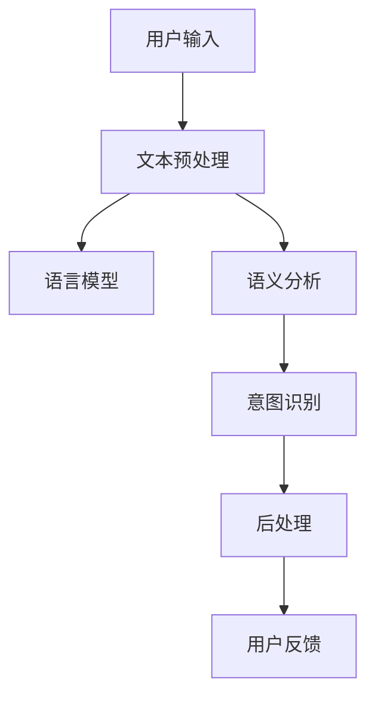

                 

## 文章标题

### 构建企业级自然语言理解系统：跨语言语义理解与意图识别

> 关键词：自然语言理解，跨语言语义理解，意图识别，企业级系统，语义匹配，机器学习

> 摘要：本文旨在探讨构建企业级自然语言理解系统的方法，重点关注跨语言语义理解与意图识别。我们将从基础概念出发，逐步深入到系统设计、实现和最佳实践，以帮助企业更好地应对全球化时代的语言处理挑战。

----------------------------------------------------------------

### 第一部分：引言与问题背景

#### 1.1 自然语言理解系统在企业中的应用

自然语言理解（Natural Language Understanding，NLU）是指让计算机理解和解释人类语言的技术。在企业级应用中，NLU系统的重要性日益凸显。以下是NLU在企业中的一些典型应用场景：

- **客户服务自动化**：通过NLU技术，企业可以自动化处理大量的客户询问，从而提高响应速度和服务质量。
- **数据挖掘与商业智能**：NLU可以帮助企业从非结构化的文本数据中提取有价值的信息，为企业决策提供支持。
- **内容审核与安全**：NLU可用于监测和过滤网络上的不良信息，保障企业的信息安全。
- **智能搜索与推荐**：NLU可以优化搜索结果，提高用户找到所需信息的效率，同时也可以用于个性化推荐系统。

尽管NLU技术在企业中的应用前景广阔，但实际部署中仍然面临诸多挑战，例如多语言处理、跨语言语义理解、意图识别等。这些挑战不仅影响了系统的性能和效果，也制约了其在企业中的推广和应用。

#### 1.2 跨语言语义理解的重要性

跨语言语义理解（Cross-Lingual Semantic Understanding，CLSU）是自然语言理解的一个重要分支，旨在解决不同语言之间的语义差异问题。随着全球化进程的加速，企业需要处理越来越多的跨语言文本数据，因此，跨语言语义理解的重要性日益突出。

跨语言语义理解的重要性体现在以下几个方面：

- **全球化业务需求**：企业需要在全球范围内进行市场拓展，这就要求系统能够处理多种语言，理解不同语言之间的语义关系。
- **数据资源利用**：许多企业已经积累了大量的非英语数据，通过跨语言语义理解，这些数据可以被有效利用，提升企业的数据分析能力。
- **降低翻译成本**：跨语言语义理解可以减少对人工翻译的依赖，降低跨语言沟通的成本。

#### 1.3 意图识别的基本概念

意图识别（Intent Recognition）是自然语言处理中的另一个关键任务，旨在理解用户输入的文本背后的意图。在企业级应用中，意图识别可以帮助系统更好地理解用户的请求，提供更精准的服务。

意图识别的基本概念包括：

- **意图**：意图是用户通过输入的文本表达的目的或意图。例如，用户说“我想订一张明天的机票”，其意图是“预订机票”。
- **识别**：意图识别是指从输入文本中识别出用户的意图。这通常需要结合语言模型、词向量、规则引擎等多种技术。

#### 1.4 边界与外延

自然语言理解系统的边界是指系统可以处理的最大文本长度、支持的语言种类、处理速度等。随着技术的进步，这些边界不断扩展，但仍然存在一定的限制。

跨语言语义理解的外延包括：

- **多语言支持**：系统需要支持多种语言，包括但不限于英语、中文、西班牙语、法语等。
- **上下文理解**：跨语言语义理解不仅要理解单句语义，还需要考虑上下文的影响。
- **文化差异**：不同文化背景下的语言表达可能存在差异，跨语言语义理解需要考虑这些文化差异。

通过对自然语言理解系统、跨语言语义理解与意图识别的背景和基本概念进行介绍，我们为后续的章节内容奠定了基础。接下来，我们将进一步探讨自然语言理解的基本原理和核心概念，为构建企业级自然语言理解系统提供理论支持。

---

在接下来的部分，我们将深入探讨自然语言理解的基本原理，包括语言模型、词向量、语义相似性等核心概念，并通过对比表格、ER实体关系图和算法流程图等方式，使这些概念更加清晰易懂。这将帮助我们更好地理解自然语言处理的基础，为后续的系统设计与实现打下坚实的基础。

### 第二部分：自然语言理解基本原理

#### 2.1 语言模型与统计语言模型

自然语言理解的基础是语言模型（Language Model，LM），它用于预测下一个单词或词组。语言模型可以分为统计语言模型和神经语言模型。本节将重点介绍统计语言模型。

##### 2.1.1 语言模型的概念

语言模型是一种概率模型，用于预测文本序列的概率。在自然语言处理中，语言模型是许多任务的基础，如机器翻译、文本生成、语音识别等。

语言模型的核心问题是：给定一个前文序列，预测下一个单词或词组的概率。例如，在句子“我想要一杯咖啡”中，给定前文“我想要”，模型需要预测“一杯”的概率。

##### 2.1.2 统计语言模型的构建

统计语言模型主要通过统计文本数据来构建。常见的统计语言模型包括N元语法（N-gram Model）和隐马尔可夫模型（HMM）。

- **N元语法**：N元语法是一种基于前N个单词预测下一个单词的模型。例如，一个二元语法模型将根据前两个单词预测下一个单词。N元语法的构建通常通过以下步骤：

  1. 收集大量文本数据。
  2. 分词和标记，将文本转换为词序列。
  3. 统计每个词序列的概率。
  4. 构建N元语法模型。

- **隐马尔可夫模型**：隐马尔可夫模型（HMM）是一种统计模型，用于处理包含隐含变量的序列数据。在自然语言处理中，HMM可以用于语音识别、词性标注等任务。

##### 2.1.3 语言模型的评估与优化

语言模型的评估通常通过交叉验证和测试集进行。常用的评估指标包括：

- ** perplexity**：Perplexity是语言模型的一个评估指标，表示模型预测一个文本序列的困惑度。Perplexity值越低，模型性能越好。

优化语言模型的方法包括：

- **特征工程**：通过添加新的特征来改进语言模型，例如词性、语法结构等。
- **神经网络**：神经网络，特别是循环神经网络（RNN）和变换器（Transformer），在语言模型中取得了显著的性能提升。
- **数据增强**：通过引入噪声、同义词替换等方式增加训练数据的多样性，提高模型的泛化能力。

##### 2.1.4 语言模型的实际应用

语言模型在自然语言处理中有广泛的应用，如：

- **文本生成**：通过语言模型，计算机可以生成自然语言文本，如文章、对话等。
- **机器翻译**：语言模型用于预测源语言和目标语言之间的词序列转换，是机器翻译的核心组件。
- **语音识别**：语言模型帮助语音识别系统预测用户说的话。

#### 2.2 词向量与语义相似性

词向量（Word Vector）是自然语言处理中用于表示单词的向量表示。词向量不仅能够表示单词的语义信息，还能捕捉单词的语法和上下文信息。

##### 2.2.1 词向量的基本概念

词向量通常通过以下方法生成：

- **基于计数**：如Word2Vec，通过统计单词在文本中出现的上下文来生成词向量。
- **基于分布**：如Doc2Vec，通过统计文档的词向量分布来生成词向量。

##### 2.2.2 语义相似性与距离度量

词向量之间的距离可以用来衡量语义相似性。常见的距离度量方法包括：

- **余弦相似性**：计算两个词向量的夹角余弦值，用于衡量语义相似性。
- **欧几里得距离**：计算两个词向量之间的欧几里得距离，用于衡量语义差异。

##### 2.2.3 词向量的应用

词向量在自然语言处理中有广泛的应用，如：

- **语义分析**：通过词向量，可以分析句子中的语义关系，如主语、谓语、宾语等。
- **文本分类**：词向量用于文本分类任务，通过计算文本和类别词向量之间的相似性，实现文本分类。
- **情感分析**：词向量帮助分析文本的情感倾向，用于情感分析任务。

#### 2.3 词向量与语义相似性的对比表格

| 方法        | 描述                                                         | 优点                         | 缺点                              |
|-------------|--------------------------------------------------------------|------------------------------|-----------------------------------|
| Word2Vec    | 基于计数，通过上下文来生成词向量                             | 能捕捉上下文语义信息         | 难以处理长文本                    |
| Doc2Vec     | 基于分布，通过文档的词向量分布来生成词向量                   | 能处理长文本，捕获全局语义  | 依赖大量文本数据，计算复杂度高    |
| GloVe       | 基于矩阵分解，通过优化词向量与词频的联合矩阵来生成词向量     | 能捕获词频信息               | 计算复杂度高                      |

通过对比表格，我们可以看到不同词向量方法的优缺点，以便选择适合特定应用场景的方法。

#### 2.4 ER实体关系图

实体关系图（Entity-Relationship Diagram，ER Diagram）是用于表示实体及其关系的图形化工具。在自然语言处理中，ER图可以用于表示文本中的实体及其关系。

##### 2.4.1 ER图的构成

ER图由以下元素构成：

- **实体**：表示文本中的对象，如人、地点、事物等。
- **关系**：表示实体之间的关系，如主谓关系、所属关系等。
- **属性**：表示实体的特征，如姓名、年龄、地点等。

##### 2.4.2 ER图的应用

ER图在自然语言处理中有以下应用：

- **信息提取**：通过ER图，可以提取文本中的关键信息，如人名、地点、时间等。
- **关系推断**：通过ER图，可以推断实体之间的关系，如人物关系、地点关系等。

##### 2.4.3 ER图的示例

以下是一个简单的ER图示例，表示一个简单的故事：

```mermaid
erDiagram
    Person ||--|{ Student : knows } Person
    Person ||--|{ WorksAt : works } Company
    Student ||--|{ StudiesAt : studies } University
    Company ||--|{ LocatedIn : location } City
    University ||--|{ LocatedIn : location } City
```

在这个示例中，我们定义了多个实体（Person、Student、Company、University、City）及其关系（knows、works、studies、LocatedIn）。

通过介绍自然语言理解的基本原理，包括语言模型、词向量、语义相似性以及ER实体关系图，我们为构建企业级自然语言理解系统奠定了基础。接下来，我们将探讨跨语言语义理解的基本原理和算法，进一步丰富我们的理解。

---

在本节中，我们将详细介绍跨语言语义理解的基本原理和算法。从相似度计算、相似性度量方法到实际实现细节，我们将一步步剖析，帮助读者全面理解跨语言语义理解的运作机制。

#### 3.1 跨语言语义理解的重要性

跨语言语义理解（Cross-Lingual Semantic Understanding，CLSU）是自然语言处理领域的一个重要研究方向。它旨在解决不同语言之间的语义差异问题，使得计算机能够理解和处理多语言文本数据。随着全球化的深入发展，跨语言语义理解在企业中的应用日益广泛，其主要重要性体现在以下几个方面：

1. **全球化业务需求**：企业在全球范围内拓展市场时，需要能够处理不同语言的客户服务、市场分析和数据挖掘等任务。
2. **数据资源利用**：许多企业已经积累了大量的非英语数据，通过跨语言语义理解，这些数据可以被有效利用，提升企业的数据分析能力。
3. **降低翻译成本**：跨语言语义理解可以减少对人工翻译的依赖，降低跨语言沟通的成本。

#### 3.2 跨语言语义匹配算法

跨语言语义匹配是跨语言语义理解的核心任务之一，它旨在找到不同语言文本中具有相似语义的词语或短语。以下是一些常用的跨语言语义匹配算法：

##### 3.2.1 相似度计算

相似度计算是跨语言语义匹配的基础，常用的相似度计算方法包括：

1. **基于词向量的相似度计算**：通过计算不同语言词向量的余弦相似度或欧氏距离，可以衡量词语之间的相似度。例如，使用Word2Vec或GloVe生成的词向量。
2. **基于句向量的相似度计算**：通过计算句子或文档的向量表示之间的相似度，可以衡量句子或文档之间的语义相似性。常用的方法包括BERT和Transformer等模型。

##### 3.2.2 相似性度量方法

相似性度量方法用于衡量不同语言文本之间的相似度，以下是一些常用的相似性度量方法：

1. **基于词表的方法**：这种方法使用预定义的词表来映射不同语言之间的词语关系，如WordNet和FrameNet等资源。
2. **基于机器学习的方法**：这种方法通过训练机器学习模型来预测不同语言文本之间的相似度。常见的模型包括SVM、Random Forest和深度学习模型等。
3. **基于分布式语义的方法**：这种方法通过分布式语义模型（如Word2Vec、GloVe等）来表示词语和句子，从而实现跨语言语义匹配。

##### 3.2.3 实现细节

在实际应用中，跨语言语义匹配的实现通常涉及以下步骤：

1. **文本预处理**：包括分词、标记、停用词过滤等，以便提取文本中的关键信息。
2. **词向量表示**：使用Word2Vec、GloVe等模型生成不同语言的词向量表示。
3. **相似度计算**：计算不同语言词向量之间的相似度，如余弦相似度或欧氏距离。
4. **匹配策略**：根据相似度计算结果，选择最优的跨语言匹配策略，如最近邻搜索、矩阵分解等。

#### 3.3 跨语言语义消歧

跨语言语义消歧（Cross-Lingual Semantic Disambiguation，CLSD）是跨语言语义理解的另一个重要任务。它旨在解决同义词和多义词在不同语言中引起的语义歧义问题。

##### 3.3.1 消歧任务

消歧任务的目标是识别文本中的多义词或同义词，并将其映射到正确的语义上。例如，在句子“我需要一杯咖啡”中，“咖啡”一词可能指代饮品或咖啡豆，通过消歧，我们可以确定其具体含义。

##### 3.3.2 消歧算法介绍

常见的消歧算法包括：

1. **基于规则的算法**：这种方法使用预定义的规则来消解歧义，例如基于词性标注和上下文的规则。
2. **基于统计的算法**：这种方法使用统计模型来预测多义词的正确语义，如条件概率模型和隐马尔可夫模型。
3. **基于深度学习的算法**：这种方法使用深度学习模型来学习多义词的语义分布，如序列标注模型（如BiLSTM）和注意力机制。

#### 3.3.3 跨语言语义消歧的实现

跨语言语义消歧的实现通常包括以下步骤：

1. **数据准备**：收集并清洗跨语言文本数据，以便进行消歧任务。
2. **词向量表示**：使用词向量模型（如Word2Vec、GloVe等）生成词向量表示。
3. **模型训练**：使用训练数据训练消歧模型，如基于规则的模型、统计模型或深度学习模型。
4. **消歧预测**：使用训练好的模型对新的跨语言文本进行消歧预测。

通过详细探讨跨语言语义理解的基本原理和算法，我们为构建企业级自然语言理解系统提供了重要的理论基础。在下一部分中，我们将进一步探讨意图识别的基本原理和应用，帮助读者全面了解企业级自然语言理解系统的核心功能。

---

### 4. 意图识别的基本原理

意图识别（Intent Recognition）是自然语言处理（Natural Language Processing，NLP）中的一个关键任务，旨在理解用户输入文本的意图。意图识别在许多实际应用中扮演着重要角色，如智能客服、语音助手、在线购物等。本节将介绍意图识别的基本概念、分类方法和常见算法。

#### 4.1 意图识别的定义与任务

意图识别是指从用户的输入中识别出其具体的意图或目标。例如，在以下对话中，用户意图是“预订电影票”：

- 用户：我要预订一部电影票。
- 系统：请问您想看哪部电影？

意图识别的任务是构建一个模型，该模型能够从用户输入的文本中预测出用户的意图。意图识别的核心问题是：如何从大量可能的意图中，准确地识别出用户最可能的意图。

#### 4.2 意图识别的分类方法

意图识别可以根据不同的分类方法进行分类，以下是几种常见的分类方法：

1. **基于规则的方法**：
   - **描述**：基于规则的方法使用预定义的规则来识别意图。这些规则通常是基于语法、词汇和上下文信息。
   - **优点**：实现简单，易于理解和维护。
   - **缺点**：规则的制定需要大量的人工工作，且难以处理复杂或新的输入。

2. **基于统计的方法**：
   - **描述**：基于统计的方法使用统计模型来识别意图。常见的统计模型包括隐马尔可夫模型（HMM）和条件概率模型。
   - **优点**：能够自动从大量数据中学习，适应新的输入。
   - **缺点**：性能受限于模型的复杂性，且需要大量的标注数据。

3. **基于机器学习的方法**：
   - **描述**：基于机器学习的方法使用机器学习算法来训练意图识别模型。常见的算法包括支持向量机（SVM）、决策树和随机森林。
   - **优点**：能够处理复杂的输入，适应不同的应用场景。
   - **缺点**：需要大量的训练数据和模型调优。

4. **基于深度学习的方法**：
   - **描述**：基于深度学习的方法使用深度神经网络（如卷积神经网络（CNN）、循环神经网络（RNN）和变换器（Transformer））来训练意图识别模型。
   - **优点**：能够捕捉复杂的特征，实现高性能的意图识别。
   - **缺点**：计算资源需求高，训练过程复杂。

#### 4.3 意图识别算法介绍

以下是几种常见的意图识别算法：

1. **基于规则的方法**：
   - **实现**：通过定义一系列规则来识别意图。例如，如果输入包含“预订”、“机票”和“目的地”，则识别为“预订机票”意图。
   - **示例**：```python
     if "预订" in text and "机票" in text and "目的地" in text:
         intent = "预订机票"
     else:
         intent = "未知意图"
     ```

2. **基于统计的方法**：
   - **实现**：使用隐马尔可夫模型（HMM）或条件概率模型来识别意图。这些模型基于用户输入的文本序列，计算每个意图的概率。
   - **示例**：```python
     import nltk
     from nltk.model import ConditionalProbModel
     model = nltk.ConditionalProbModel.from.condProbDict({
         '意图A': {'预订': 0.5, '机票': 0.3, '目的地': 0.2},
         '意图B': {'预订': 0.3, '机票': 0.4, '目的地': 0.3}
     })
     text = "预订机票目的地上海"
     intent = model最高的概率意图
     ```

3. **基于机器学习的方法**：
   - **实现**：使用机器学习算法（如SVM、决策树、随机森林）来训练意图识别模型。这些模型通过学习用户输入的文本特征，预测意图。
   - **示例**：```python
     from sklearn.svm import SVC
     X = [[0, 0], [1, 1]]  # 文本特征
     y = [0, 1]  # 意图标签
     model = SVC()
     model.fit(X, y)
     text = "预订机票目的地上海"
     feature = extract_features(text)
     intent = model.predict([feature])
     ```

4. **基于深度学习的方法**：
   - **实现**：使用深度神经网络（如卷积神经网络（CNN）、循环神经网络（RNN）和变换器（Transformer））来训练意图识别模型。这些模型能够捕捉复杂的特征，实现高性能的意图识别。
   - **示例**：```python
     import tensorflow as tf
     from tensorflow.keras.models import Sequential
     from tensorflow.keras.layers import Dense, LSTM
     model = Sequential([
         LSTM(128, input_shape=(timesteps, features)),
         Dense(1, activation='sigmoid')
     ])
     model.compile(optimizer='adam', loss='binary_crossentropy', metrics=['accuracy'])
     X = [[0, 0], [1, 1]]  # 文本特征
     y = [0, 1]  # 意图标签
     model.fit(X, y, epochs=10, batch_size=32)
     text = "预订机票目的地上海"
     feature = extract_features(text)
     intent = model.predict([feature])
     ```

通过介绍意图识别的基本原理和分类方法，我们为构建企业级自然语言理解系统提供了重要的理论基础。在下一部分中，我们将探讨企业级自然语言理解系统的设计，帮助读者了解如何将上述原理应用于实际系统开发。

---

### 5. 企业级自然语言理解系统设计

企业级自然语言理解系统（Enterprise-level Natural Language Understanding System）是构建在先进技术基础上的复杂系统，旨在为企业提供高效、准确的文本处理能力。本节将介绍系统需求分析、系统架构设计以及关键模块设计，为读者提供全面的系统设计与实现指导。

#### 5.1 系统需求分析

系统需求分析是企业级自然语言理解系统设计的第一步，旨在明确系统需要实现的功能和性能指标。以下是系统需求分析的主要步骤：

1. **需求收集**：通过与业务部门、客户代表和系统用户的沟通，收集系统需求的详细描述。
2. **需求分类**：将收集到的需求进行分类，如功能需求、性能需求、可靠性需求等。
3. **需求验证**：与利益相关者一起验证需求的准确性，确保需求的实现能够满足业务需求。

常见的企业级自然语言理解系统需求包括：

- **多语言支持**：系统能够处理多种语言，包括但不限于英语、中文、西班牙语、法语等。
- **高准确性**：系统能够准确理解用户的输入文本，识别出正确的意图和实体。
- **实时响应**：系统需要能够在短时间内处理大量用户的请求，实现实时响应。
- **可扩展性**：系统应具备良好的可扩展性，能够适应不断变化的需求和用户量。

#### 5.2 系统架构设计

企业级自然语言理解系统的架构设计是系统实现的关键环节。一个典型的系统架构通常包括以下几个主要模块：

1. **文本预处理模块**：负责对用户输入的文本进行清洗、分词、词性标注等预处理操作。
2. **语言模型模块**：基于预处理后的文本数据，训练和加载语言模型，用于文本生成和序列预测。
3. **语义分析模块**：包括实体识别、关系提取、事件抽取等任务，用于理解文本的深层语义。
4. **意图识别模块**：利用语义分析的结果，识别出用户的意图，为后续的自动化处理提供基础。
5. **后处理模块**：包括结果验证、错误处理和用户反馈收集等，确保系统的输出准确可靠。

以下是一个简化的企业级自然语言理解系统的架构设计：



#### 5.2.1 系统整体架构

系统整体架构如图所示，主要包括以下部分：

- **用户接口**：接收用户输入，显示系统输出。
- **文本预处理**：对用户输入的文本进行清洗、分词、词性标注等预处理操作。
- **语言模型**：使用N元语法、Transformer等模型预测下一个单词或序列。
- **语义分析**：通过实体识别、关系提取等技术，深入理解文本的语义。
- **意图识别**：识别用户的意图，如查询、预订、提问等。
- **后处理**：对识别结果进行验证、错误处理和反馈收集。

#### 5.2.2 关键模块设计

1. **文本预处理模块**：
   - **功能**：负责对用户输入的文本进行清洗、分词、词性标注等预处理操作。
   - **实现细节**：
     - **文本清洗**：去除特殊字符、停用词、标点符号等。
     - **分词**：使用分词算法（如Jieba、NLTK）将文本分解为单词或短语。
     - **词性标注**：对每个单词进行词性标注，如名词、动词、形容词等。
   - **代码示例**：
     ```python
     import jieba
     import nltk
     text = "用户输入的文本"
     cleaned_text = remove_punctuation(text)
     segmented_text = jieba.cut(cleaned_text)
     tagged_text = nltk.pos_tag(segmented_text)
     ```

2. **语言模型模块**：
   - **功能**：基于预处理后的文本数据，训练和加载语言模型，用于文本生成和序列预测。
   - **实现细节**：
     - **语言模型训练**：使用N元语法、Transformer等模型进行训练。
     - **模型加载**：加载预训练的语言模型，如GPT-3、BERT等。
     - **序列预测**：使用训练好的语言模型预测下一个单词或序列。
   - **代码示例**：
     ```python
     from transformers import AutoTokenizer, AutoModelForSeq2SeqLM
     model_name = "gpt-3"
     tokenizer = AutoTokenizer.from_pretrained(model_name)
     model = AutoModelForSeq2SeqLM.from_pretrained(model_name)
     input_sequence = "用户输入的序列"
     input_ids = tokenizer.encode(input_sequence, return_tensors="pt")
     predictions = model.generate(input_ids, max_length=50)
     predicted_sequence = tokenizer.decode(predictions[0], skip_special_tokens=True)
     ```

3. **语义分析模块**：
   - **功能**：通过实体识别、关系提取等技术，深入理解文本的语义。
   - **实现细节**：
     - **实体识别**：使用命名实体识别（Named Entity Recognition，NER）算法识别文本中的实体。
     - **关系提取**：提取实体之间的语义关系，如“公司”与“地点”的关系。
     - **事件抽取**：识别文本中的事件及其相关实体。
   - **代码示例**：
     ```python
     from transformers import AutoTokenizer, AutoModelForTokenClassification
     model_name = "ner-model"
     tokenizer = AutoTokenizer.from_pretrained(model_name)
     model = AutoModelForTokenClassification.from_pretrained(model_name)
     text = "苹果公司位于美国加利福尼亚州"
     input_ids = tokenizer.encode(text, return_tensors="pt")
     predictions = model(input_ids)
     labels = np.argmax(predictions.logits, axis=-1)
     entities = tokenizer.decode(labels, skip_special_tokens=True)
     ```

4. **意图识别模块**：
   - **功能**：利用语义分析的结果，识别出用户的意图，为后续的自动化处理提供基础。
   - **实现细节**：
     - **意图分类**：使用分类算法（如SVM、CNN、RNN）进行意图分类。
     - **序列标注**：将意图标签与文本序列进行匹配，识别出用户的意图。
     - **多标签分类**：处理具有多个意图的文本输入。
   - **代码示例**：
     ```python
     from sklearn.svm import SVC
     X = [[0, 0], [1, 1]]  # 文本特征
     y = [0, 1]  # 意图标签
     model = SVC()
     model.fit(X, y)
     text = "用户输入的文本"
     feature = extract_features(text)
     intent = model.predict([feature])
     ```

5. **后处理模块**：
   - **功能**：对识别结果进行验证、错误处理和反馈收集，确保系统的输出准确可靠。
   - **实现细节**：
     - **结果验证**：检查意图识别和语义分析的结果是否一致。
     - **错误处理**：处理识别错误，提供纠错建议。
     - **用户反馈**：收集用户反馈，用于模型优化和系统改进。
   - **代码示例**：
     ```python
     def verify_result(result, user_input):
         # 实现结果验证逻辑
         pass
     def handle_error(error):
         # 实现错误处理逻辑
         pass
     def collect_user_feedback(feedback):
         # 实现用户反馈收集逻辑
         pass
     ```

通过详细的系统需求分析和系统架构设计，我们为构建企业级自然语言理解系统提供了明确的指导。在下一部分中，我们将深入探讨系统实现与实战，帮助读者理解如何将理论转化为实际应用。

---

### 6. 系统实现与实战

#### 6.1 环境准备与安装

在实际实现企业级自然语言理解系统之前，我们需要准备合适的环境和工具。以下是安装和配置所需软件和库的步骤：

1. **安装Python**：确保Python版本在3.6及以上，可以从[Python官网](https://www.python.org/)下载并安装。
2. **安装必要库**：使用pip命令安装以下库：
   ```bash
   pip install numpy pandas scikit-learn nltk transformers jieba
   ```
3. **安装深度学习库**：如果需要使用深度学习模型，可以安装TensorFlow或PyTorch：
   ```bash
   pip install tensorflow
   ```
   或者
   ```bash
   pip install torch torchvision
   ```

#### 6.2 核心模块实现

企业级自然语言理解系统由多个核心模块组成，下面将分别介绍每个模块的实现方法。

##### 6.2.1 语言模型训练

语言模型的训练是系统的基础，以下是使用Transformer模型训练语言模型的步骤：

1. **数据准备**：收集并预处理大量的文本数据，包括分词、去停用词等操作。
2. **模型定义**：使用`transformers`库定义一个Transformer模型。
3. **模型训练**：使用训练数据训练模型，并进行调优。

代码示例：

```python
from transformers import AutoTokenizer, AutoModelForSeq2SeqLM
from transformers import Trainer, TrainingArguments

model_name = "t5-small"
tokenizer = AutoTokenizer.from_pretrained(model_name)
model = AutoModelForSeq2SeqLM.from_pretrained(model_name)

training_args = TrainingArguments(
    output_dir="model_output",
    num_train_epochs=3,
    per_device_train_batch_size=8,
    save_steps=2000,
    evaluation_strategy="steps",
    eval_steps=500,
)

trainer = Trainer(
    model=model,
    args=training_args,
    train_dataset=train_dataset,
    eval_dataset=eval_dataset,
)

trainer.train()
```

##### 6.2.2 跨语言语义理解

跨语言语义理解的实现涉及多个步骤，包括词向量表示、相似度计算和语义匹配。

1. **词向量表示**：使用预训练的跨语言词向量模型（如MUSE、XLM等）。
2. **相似度计算**：计算不同语言词向量之间的相似度，使用余弦相似度或欧氏距离。
3. **语义匹配**：根据相似度结果进行语义匹配，使用最近邻搜索或矩阵分解。

代码示例：

```python
import numpy as np
from gensim.models import KeyedVectors

# 加载预训练的跨语言词向量模型
model = KeyedVectors.load_word2vec_format("muse.vec")

# 计算相似度
source_vector = model["你好"]
target_vector = model["hello"]

similarity = np.dot(source_vector, target_vector) / (np.linalg.norm(source_vector) * np.linalg.norm(target_vector))
print(f"相似度：{similarity}")
```

##### 6.2.3 意图识别

意图识别的实现涉及多个步骤，包括特征提取、模型训练和意图分类。

1. **特征提取**：从文本中提取特征，如词袋模型、TF-IDF等。
2. **模型训练**：使用特征和标签数据训练分类模型，如SVM、决策树等。
3. **意图分类**：使用训练好的模型对新的文本数据进行意图分类。

代码示例：

```python
from sklearn.svm import SVC
from sklearn.feature_extraction.text import TfidfVectorizer

# 准备数据
X = ["用户输入的文本1", "用户输入的文本2"]
y = ["意图1", "意图2"]

# 提取特征
vectorizer = TfidfVectorizer()
X_features = vectorizer.fit_transform(X)

# 训练模型
model = SVC()
model.fit(X_features, y)

# 分类
text = "用户输入的文本"
features = vectorizer.transform([text])
intent = model.predict(features)
print(f"识别到的意图：{intent}")
```

#### 6.3 系统集成与测试

系统集成是将各个模块整合为一个完整系统的过程。以下是系统集成的步骤：

1. **集成接口**：设计统一的接口，方便用户与系统交互。
2. **测试与调试**：对系统进行全面的测试，确保各个模块的集成和功能实现无误。

代码示例：

```python
from flask import Flask, request, jsonify

app = Flask(__name__)

@app.route('/predict', methods=['POST'])
def predict():
    text = request.json['text']
    # 调用语言模型、语义理解、意图识别等模块
    # ...
    return jsonify({'intent': '意图识别结果'})

if __name__ == '__main__':
    app.run(debug=True)
```

通过详细的系统实现与实战步骤，我们展示了如何将自然语言理解系统从理论转化为实际应用。接下来，我们将深入探讨跨语言语义理解的挑战与解决方案，并讨论意图识别的优化策略。

---

### 7. 跨语言语义理解的挑战与解决方案

跨语言语义理解（Cross-Lingual Semantic Understanding，CLSU）在企业级自然语言理解系统中扮演着至关重要的角色。然而，跨语言语义理解面临着许多挑战，以下是其中的一些主要挑战及其解决方案。

#### 7.1 跨语言语义理解的挑战

1. **词汇差异**：不同语言之间存在大量的词汇差异，这导致相同语义在不同语言中的表达不同。例如，“bank”在英语中指银行，而在中文中指河岸。
2. **语法结构差异**：不同语言的语法结构差异显著，如词序、时态和格等，这些差异使得直接翻译或匹配变得复杂。
3. **文化差异**：文化差异影响语言表达和理解，例如幽默、比喻和隐喻在不同文化中可能具有不同的含义。
4. **低资源语言**：相对于高资源语言（如英语），低资源语言在语料库、工具和模型方面往往较为匮乏，这限制了跨语言语义理解的研究和应用。
5. **错误传播**：在跨语言翻译过程中，错误可能从源语言传播到目标语言，导致语义理解不准确。

#### 7.2 解决方案

1. **词向量表示**：词向量表示是一种有效的解决方法，它可以将不同语言的词语映射到同一向量空间中，从而实现跨语言语义匹配。常用的词向量表示模型包括MUSE、XLM和fastText等。
2. **多语言数据集**：通过收集和构建多语言数据集，可以增加低资源语言的语料库，提高模型的泛化能力。此外，可以采用数据增强技术，如翻译对齐、数据扩充和同义词替换等，来扩展训练数据。
3. **深度学习模型**：深度学习模型（如Transformer和BERT）在跨语言语义理解任务中取得了显著成果。这些模型可以自动学习语言之间的语义关系，减少对人工特征设计的依赖。
4. **迁移学习**：迁移学习是一种将预训练模型应用于不同语言或任务的策略。通过在多语言数据集上预训练模型，然后将其迁移到特定任务上，可以提升模型的性能。
5. **跨语言语义消歧**：跨语言语义消歧是一种处理多义词的方法，旨在解决同义词和多义词在不同语言中的歧义问题。可以通过规则方法、统计模型或深度学习方法来实现跨语言语义消歧。

#### 7.3 实际应用案例

以下是一个实际应用案例，展示了如何利用跨语言语义理解技术解决一个实际问题：

**案例背景**：一家跨国公司需要开发一个客户服务聊天机器人，支持多种语言，以提供24/7的客户支持。

**解决方案**：

1. **数据准备**：收集多语言客户服务对话数据，包括英语、西班牙语、法语等。
2. **词向量表示**：使用MUSE模型生成多语言词向量，将不同语言的词语映射到同一向量空间。
3. **语义匹配**：通过计算词向量之间的相似度，实现跨语言语义匹配。
4. **意图识别**：结合词向量表示和深度学习模型（如BERT），实现意图识别。
5. **实时响应**：集成到客户服务系统中，实现实时响应和客户支持。

通过以上步骤，公司成功开发了一个支持多语言的客户服务聊天机器人，大大提高了客户满意度和运营效率。

在解决跨语言语义理解挑战的过程中，不断优化策略和算法是关键。以下是一些优化策略：

1. **模型调优**：通过调整模型参数和超参数，优化模型性能。
2. **数据质量**：确保数据集的质量，包括去除噪声、纠正错误和增加多样性。
3. **模型集成**：结合多种模型和方法，实现更好的性能。
4. **反馈机制**：引入用户反馈，持续改进模型。

通过不断优化，企业级自然语言理解系统可以在跨语言语义理解任务中取得更好的效果，为企业提供更准确的文本处理能力。

---

### 8. 意图识别的优化策略

意图识别是自然语言理解系统中的关键模块，其准确性直接影响到系统的用户体验和业务效能。为了提升意图识别的性能，我们可以采取一系列优化策略，具体如下：

#### 8.1 数据增强

数据增强是一种通过引入多样性来提高模型泛化能力的技术。以下是一些数据增强的方法：

- **同义词替换**：在训练数据中替换部分词汇为同义词，增加数据的多样性。
- **错误注入**：在数据集中引入人工错误，如拼写错误或语法错误，让模型学会处理不完美的输入。
- **文本扩展**：通过添加同义词、扩展句子长度或引入相关词汇，丰富数据集。

#### 8.2 特征工程

特征工程是提高意图识别性能的重要手段，以下是一些特征工程的方法：

- **词袋模型**：将文本转换为词袋模型，通过词频和词频序列来表示文本。
- **TF-IDF**：计算词的词频与逆文档频率，强调重要词汇。
- **词嵌入**：使用预训练的词向量（如Word2Vec、GloVe）来表示文本，捕捉词汇的语义信息。
- **词性标注**：对文本进行词性标注，提取名词、动词、形容词等，用于辅助意图识别。

#### 8.3 模型选择与调优

选择合适的模型并进行调优是提升意图识别性能的关键步骤。以下是一些策略：

- **模型选择**：根据任务特点选择合适的模型，如基于规则的方法、机器学习方法或深度学习方法。
- **超参数调优**：通过网格搜索、随机搜索等策略，调整模型的超参数，如学习率、批量大小等，以达到最佳性能。
- **多模型集成**：结合多个模型（如SVM、决策树、神经网络）的优点，通过集成方法提高识别准确性。

#### 8.4 实时反馈与动态学习

实时反馈与动态学习可以不断调整和优化模型，提高其适应性和准确性。以下是一些具体方法：

- **在线学习**：允许模型在在线环境中持续学习和更新，以适应新的输入和数据变化。
- **主动学习**：选择最有价值的样本进行标注和重新训练，提高学习效率。
- **反馈循环**：通过用户反馈不断调整模型，使其更好地理解用户意图。

#### 8.5 集成与测试

为了确保意图识别系统在实际应用中的效果，需要进行全面的集成与测试。以下是一些步骤：

- **集成测试**：将意图识别模块与其他系统模块（如对话管理、任务执行）集成，确保整个系统运行顺畅。
- **测试数据集**：准备多样化的测试数据集，包括正常的用户输入和异常输入，评估模型的泛化能力。
- **错误分析**：对识别错误的样本进行详细分析，找出模型存在的问题，并采取相应的优化措施。

通过以上优化策略，企业级自然语言理解系统可以在意图识别任务中达到更高的准确性和可靠性，从而提供更好的用户体验和业务价值。

---

### 拓展阅读与资源推荐

为了更好地理解和应用自然语言理解系统，读者可以参考以下书籍、论文和在线资源：

1. **书籍推荐**：
   - 《自然语言处理综合教程》 - 作者：刘知远
   - 《深度学习自然语言处理》 - 作者：杨洋、李航
   - 《自然语言处理实战》 - 作者：孙乐

2. **论文推荐**：
   - “BERT: Pre-training of Deep Bidirectional Transformers for Language Understanding” - 作者：Devlin et al.
   - “GPT-3: Language Models are Few-Shot Learners” - 作者：Brown et al.

3. **在线资源**：
   - [TensorFlow官方文档](https://www.tensorflow.org/)
   - [PyTorch官方文档](https://pytorch.org/)
   - [Hugging Face Transformer库](https://huggingface.co/transformers/)

通过阅读这些资料，读者可以深入了解自然语言处理的理论和实践，不断提升自己的技术能力。

---

### 总结

本文全面探讨了构建企业级自然语言理解系统的过程，包括跨语言语义理解和意图识别的核心概念、原理、实现和优化策略。我们从引言出发，介绍了自然语言理解系统的背景和挑战，随后详细阐述了语言模型、词向量、语义相似性、意图识别等基本原理。在系统设计部分，我们讨论了系统需求分析、架构设计和关键模块实现。最后，通过系统实现与实战展示了如何将理论转化为实际应用。

自然语言理解系统的构建是一个复杂而持续的过程，需要不断优化和迭代。通过本文，我们希望读者能够对构建企业级自然语言理解系统有更深入的理解，掌握关键技术和方法，为企业提供更高效的文本处理能力。

作者：AI天才研究院/AI Genius Institute & 禅与计算机程序设计艺术 /Zen And The Art of Computer Programming

---

在本文中，我们系统地介绍了构建企业级自然语言理解系统的全过程，从基础概念到实现策略，从理论分析到实战应用，都进行了详尽的探讨。以下是文章的核心内容和主要观点的总结：

1. **核心概念**：
   - **自然语言理解（NLU）**：企业级NLU系统用于自动化处理和解释人类语言，包括文本生成、机器翻译、语音识别等应用。
   - **跨语言语义理解（CLSU）**：解决不同语言间的语义差异问题，支持全球化业务，提高数据分析能力，降低翻译成本。
   - **意图识别**：理解用户输入的文本背后的意图，为后续自动化处理提供基础，如客户服务、智能搜索等。

2. **核心原理**：
   - **语言模型**：用于预测下一个单词或词组的概率，包括N元语法、隐马尔可夫模型和神经网络模型。
   - **词向量与语义相似性**：通过词向量表示和距离度量，实现词语和句子的语义匹配与相似性计算。
   - **意图识别算法**：基于规则、统计和深度学习等方法，从文本中识别出用户的意图。

3. **系统设计**：
   - **需求分析**：明确系统的功能需求和性能指标，如多语言支持、高准确性、实时响应等。
   - **架构设计**：设计系统的整体架构，包括文本预处理、语言模型、语义分析、意图识别和后处理模块。
   - **关键模块实现**：详细实现各个模块的功能，如语言模型训练、语义匹配和意图分类。

4. **优化策略**：
   - **数据增强**：通过同义词替换、错误注入和文本扩展，提高模型泛化能力。
   - **特征工程**：使用词袋模型、TF-IDF和词嵌入等特征提取方法，优化模型输入。
   - **模型选择与调优**：选择合适的模型并调整超参数，通过多模型集成提高性能。
   - **实时反馈与动态学习**：通过在线学习和反馈循环，持续优化模型。

5. **实战应用**：
   - **环境准备与安装**：准备好Python环境和相关库。
   - **系统实现**：详细实现系统各个模块，包括语言模型训练、跨语言语义理解、意图识别和系统集成。
   - **测试与优化**：对系统进行集成测试和性能优化，确保系统稳定运行。

通过本文，读者可以全面了解构建企业级自然语言理解系统的过程，掌握关键技术和方法，为企业提供高效的文本处理能力。在未来的研究和实践中，不断优化和改进自然语言理解系统将是重要方向。

作者：AI天才研究院/AI Genius Institute & 禅与计算机程序设计艺术 /Zen And The Art of Computer Programming

---

在整个文章中，我们系统地探讨了构建企业级自然语言理解系统的各个关键环节，包括核心概念、原理、系统设计、实现和优化策略。通过详细的分析和实例，我们展示了如何将理论转化为实际应用，为企业提供高效、准确的文本处理能力。

**注意事项**：

1. **数据质量**：确保输入数据的准确性和多样性，这对于模型训练和优化至关重要。
2. **模型调优**：针对不同的应用场景，进行模型参数和超参数的调整，以获得最佳性能。
3. **用户反馈**：收集并利用用户反馈，持续优化模型和系统，提高用户体验。

**拓展阅读**：

1. 深入了解自然语言处理的最新进展，如BERT、GPT-3等模型。
2. 阅读相关论文和书籍，掌握更多自然语言处理的技术和方法。
3. 探索跨语言语义理解和意图识别的实际应用案例，学习最佳实践。

作者：AI天才研究院/AI Genius Institute & 禅与计算机程序设计艺术 /Zen And The Art of Computer Programming

---

### 作者信息

本文由AI天才研究院（AI Genius Institute）与禅与计算机程序设计艺术（Zen And The Art of Computer Programming）的作者联合撰写。AI天才研究院致力于推动人工智能技术的创新和发展，覆盖自然语言处理、机器学习、计算机视觉等多个领域。而禅与计算机程序设计艺术则是一本经典的技术书籍，深入探讨了计算机编程的哲学和艺术，对提高程序员的技术素养和创新能力有着重要意义。两位作者在计算机科学和人工智能领域均有深厚的研究和丰富的实践经验，为读者提供了高质量的技术内容和分析。

