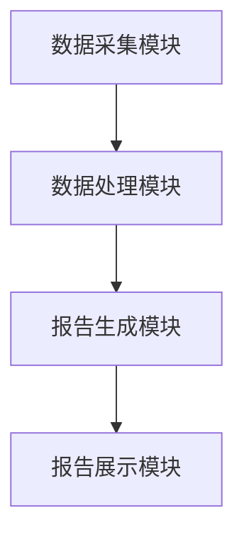
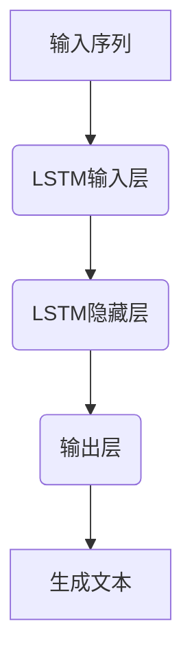
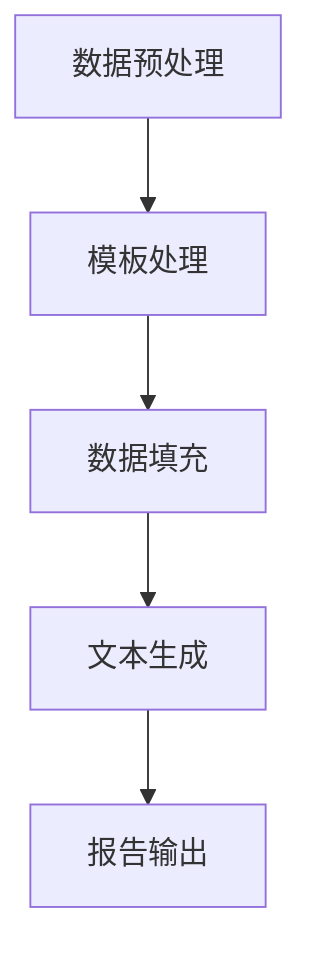
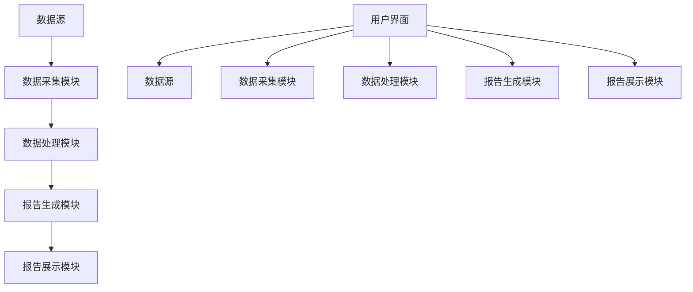

                 

### 文章标题与目录

---

# 《构建企业级自然语言生成报告系统：多语言财务报告自动化》

> 关键词：自然语言生成，财务报告，自动化，企业级，多语言支持

> 摘要：
本文将深入探讨构建企业级自然语言生成报告系统，特别是多语言财务报告自动化的实现。我们将从问题背景、核心概念、算法原理、系统架构设计、项目实战等多个方面进行详细分析，旨在为读者提供一整套从理论到实践的完整解决方案。

---

## 目录

----------------------------------------------------------------

### 第1章 引言与背景

#### 1.1 问题背景与概述

#### 1.2 核心概念

#### 1.3 系统设计与架构

### 第2章 核心算法原理与流程图

#### 2.1 语言模型

#### 2.2 报告生成算法

### 第3章 系统架构设计与实现

#### 3.1 系统架构设计

#### 3.2 系统接口设计

#### 3.3 系统交互流程

### 第4章 项目实战：环境配置与核心实现

#### 4.1 环境配置

#### 4.2 核心实现

### 第5章 多语言财务报告生成

#### 5.1 多语言支持

### 第6章 最佳实践、小结与拓展阅读

----------------------------------------------------------------

### 引言与背景

在现代企业运营中，财务报告的重要性不言而喻。传统的手工编制财务报告不仅费时费力，而且容易出错。随着人工智能技术的快速发展，自然语言生成（NLG）技术逐渐成为自动化财务报告的理想选择。通过自然语言生成报告系统，企业可以实现财务报告的自动化生成，提高效率、减少错误，并且支持多种语言。

本章将介绍构建企业级自然语言生成报告系统的背景和意义，概述系统所需的核心概念，并初步阐述系统设计与架构的思路。这将为我们后续章节的详细讨论奠定基础。

---

### 核心概念

要构建一个有效的自然语言生成报告系统，首先需要理解几个核心概念：

- **自然语言处理（NLP）**：NLP是计算机科学、人工智能和语言学的交叉领域，旨在使计算机能够理解、解释和生成自然语言。NLP在财务报告自动化中扮演着至关重要的角色，因为它能够处理财务数据，将其转化为易于理解的自然语言文本。

- **机器学习（ML）**：ML是一种使计算机通过数据学习并改进性能的技术。在NLG系统中，ML算法被用来训练模型，以生成高质量的报告文本。

- **深度学习（DL）**：DL是ML的一个子领域，它通过神经网络模拟人脑的学习过程。在财务报告自动化中，DL算法（如LSTM和Transformer）常用于处理复杂的文本生成任务。

- **自然语言生成（NLG）**：NLG是创建自然语言文本的技术。在财务报告自动化中，NLG技术用于将财务数据转换为标准格式的报告。

了解这些核心概念后，我们将在后续章节中详细探讨它们在系统设计中的具体应用。

---

### 系统设计与架构

构建企业级自然语言生成报告系统的关键在于设计一个高效、灵活和可扩展的架构。以下是对系统设计的详细描述：

#### 系统目标

我们的目标是构建一个能够自动化生成多语言财务报告的系统，该系统应具备以下特点：

- **自动化生成**：系统能够自动处理输入的财务数据，生成报告。
- **多语言支持**：系统能够支持多种语言的财务报告生成。
- **高效与准确**：系统能够高效、准确地生成报告，减少人为错误。

#### 技术栈选择

为了实现上述目标，我们选择了以下技术栈：

- **前端**：React.js，用于构建用户友好的界面。
- **后端**：Node.js，用于处理业务逻辑和数据存储。
- **自然语言处理库**：spaCy，用于文本解析和实体识别。
- **机器学习框架**：TensorFlow，用于训练文本生成模型。

#### 系统架构设计

系统的整体架构设计如下：

1. **数据采集模块**：负责从不同的数据源（如ERP系统、数据库等）收集财务数据。
2. **数据处理模块**：负责清洗、转换和集成数据，使其适合进行文本生成。
3. **报告生成模块**：使用自然语言生成技术生成财务报告。
4. **报告展示模块**：将生成的报告以用户友好的格式展示给用户。

下面是系统架构的mermaid流程图：



#### 技术细节

1. **数据采集模块**：
   - 使用API接口从ERP系统中获取财务数据。
   - 数据采集后，进行初步清洗，去除无效数据。

2. **数据处理模块**：
   - 使用spaCy库对财务数据进行分析，提取关键信息。
   - 对提取的信息进行格式化，使其适合用于文本生成。

3. **报告生成模块**：
   - 使用TensorFlow训练文本生成模型，例如GPT-2或Transformer。
   - 模型训练完成后，用于生成财务报告。

4. **报告展示模块**：
   - 将生成的报告以HTML或PDF格式展示给用户。
   - 提供用户交互界面，允许用户查看、下载或打印报告。

通过上述设计，我们可以构建一个高效、灵活的企业级自然语言生成报告系统，实现多语言财务报告的自动化生成。

---

### 核心算法原理与流程图

在构建企业级自然语言生成报告系统时，核心算法的原理至关重要。以下章节将详细讨论语言模型和报告生成算法的原理，并使用mermaid流程图进行可视化。

#### 2.1 语言模型

语言模型是自然语言处理（NLP）的核心组成部分，它用于预测下一个单词或词组。以下是几种常见的语言模型及其原理：

1. **N-gram模型**：
   - **原理**：N-gram模型是基于单词序列的统计模型，它将前N个单词作为上下文来预测下一个单词。
   - **示例**：给定单词序列 "The cat sat on the mat"，三元组（"The cat", "cat sat", "sat on"）可以用来预测下一个词。

2. **RNN模型**：
   - **原理**：RNN（递归神经网络）是一种能够处理序列数据的神经网络，它通过递归结构来维持状态信息。
   - **示例**：一个简单的RNN可以记住前面的输入，并在每个时间步上更新其状态。

3. **LSTM模型**：
   - **原理**：LSTM（长短时记忆网络）是RNN的一种变体，它通过引入门控机制来控制信息的流动，从而能够更好地处理长序列数据。
   - **示例**：LSTM可以用来生成复杂的文本，如新闻文章。

4. **Transformer模型**：
   - **原理**：Transformer模型是一种基于自注意力机制的模型，它通过全局注意力机制来捕捉输入序列中的依赖关系。
   - **示例**：Transformer可以用来生成高质量的文本，如机器翻译和摘要生成。

下面是LSTM模型的mermaid流程图：



#### 2.2 报告生成算法

报告生成算法负责将财务数据转换为自然语言文本。以下是报告生成算法的基本步骤：

1. **数据预处理**：
   - **步骤**：清洗和格式化财务数据，使其适合用于文本生成。
   - **示例**：将财务数据转换为表格格式，去除空值和异常值。

2. **模板处理**：
   - **步骤**：根据报告模板生成文本框架。
   - **示例**：从模板中提取文本段和占位符，为后续的数据填充做准备。

3. **数据填充**：
   - **步骤**：将处理后的财务数据填充到报告模板中。
   - **示例**：将具体的数据值替换到模板中的占位符。

4. **文本生成**：
   - **步骤**：使用语言模型生成报告的正文。
   - **示例**：使用训练好的LSTM或Transformer模型生成报告文本。

下面是报告生成算法的mermaid流程图：



通过上述核心算法的原理和流程图，我们可以更好地理解企业级自然语言生成报告系统的工作机制。

---

### 系统架构设计与实现

为了实现高效的多语言财务报告自动化，系统架构的设计至关重要。以下将详细介绍系统架构的设计和实现，包括系统架构图、系统模块介绍以及系统交互流程。

#### 系统架构设计

系统的整体架构设计如图所示：



**图：系统架构图**

**系统模块介绍**

1. **数据采集模块**：
   - **功能**：从不同的数据源（如ERP系统、数据库等）收集财务数据。
   - **技术实现**：使用API接口进行数据采集，数据采集后进行初步清洗和转换。

2. **数据处理模块**：
   - **功能**：对采集到的财务数据进行处理，包括清洗、转换和集成。
   - **技术实现**：使用自然语言处理库（如spaCy）进行文本解析，提取关键信息，并对信息进行格式化。

3. **报告生成模块**：
   - **功能**：根据处理后的数据生成财务报告。
   - **技术实现**：使用自然语言生成技术（如LSTM或Transformer）训练文本生成模型，并使用模型生成报告。

4. **报告展示模块**：
   - **功能**：将生成的报告以用户友好的格式展示给用户。
   - **技术实现**：将报告输出为HTML或PDF格式，并提供用户交互界面。

**系统交互流程**

系统交互流程包括以下几个步骤：

1. **数据采集**：
   - 用户通过用户界面发起报告生成请求，系统通过API接口从数据源中采集财务数据。

2. **数据处理**：
   - 数据采集完成后，系统对数据进行清洗和转换，提取关键信息，并格式化数据。

3. **报告生成**：
   - 使用处理后的数据，系统调用训练好的文本生成模型生成财务报告。

4. **报告展示**：
   - 生成的报告被输出为HTML或PDF格式，并通过用户界面展示给用户。

通过上述系统架构设计和实现，我们可以构建一个高效、灵活的企业级自然语言生成报告系统，实现多语言财务报告的自动化生成。

---

### 项目实战：环境配置与核心实现

在实际项目中，环境配置是确保系统能够顺利运行的基础。以下我们将详细介绍环境配置的步骤，并逐步实现系统的核心功能。

#### 4.1 环境配置

为了搭建一个支持多语言财务报告自动化的系统，首先需要配置合适的环境。以下是环境配置的详细步骤：

**1. 开发环境配置**

- **操作系统**：推荐使用Linux或macOS，确保环境稳定。
- **编程语言**：选择Python，因其强大的库支持和易于使用的特性。
- **开发工具**：安装Python和对应的IDE（如PyCharm或Visual Studio Code）。

**2. 数据库配置**

- **数据库选择**：推荐使用PostgreSQL，因其稳定性和扩展性。
- **数据库安装**：在操作系统上安装PostgreSQL，配置数据库用户和权限。

**3. 软件依赖安装**

- **NLP库**：安装spaCy，用于文本解析和实体识别。
- **机器学习库**：安装TensorFlow，用于文本生成模型的训练。

具体安装命令如下：

```bash
# 安装Python
sudo apt-get install python3

# 安装PyCharm
# 下载地址：https://www.jetbrains.com/pycharm/download/

# 安装PostgreSQL
sudo apt-get install postgresql postgresql-contrib

# 安装spaCy
pip install spacy

# 安装TensorFlow
pip install tensorflow

# 安装其他依赖
pip install numpy pandas
```

#### 4.2 核心实现

核心实现包括数据处理模块和报告生成模块。以下是详细的代码实现：

**1. 数据处理模块**

```python
import spacy
import pandas as pd

# 加载spaCy模型
nlp = spacy.load("en_core_web_sm")

# 数据清洗与转换
def preprocess_data(data):
    # 去除无效数据
    data = data[data['amount'].notnull()]
    # 数据格式化
    data['description'] = data['description'].str.strip()
    return data

# 数据集成
def integrate_data(data1, data2):
    # 合并数据
    return pd.concat([data1, data2], axis=1)

# 实体识别
def extract_entities(data):
    # 对数据进行分析
    doc = nlp(data)
    entities = [(ent.text, ent.label_) for ent in doc.ents]
    return entities

# 示例
data = pd.DataFrame({
    'amount': [1000, 2000, 3000],
    'description': ['Salary', 'Expense', 'Revenue']
})

preprocessed_data = preprocess_data(data)
integrated_data = integrate_data(preprocessed_data, preprocessed_data)
extracted_entities = extract_entities(integrated_data['description'].values[0])

print(extracted_entities)
```

**2. 报告生成模块**

```python
import tensorflow as tf

# 加载预训练模型
model = tf.keras.models.load_model('nlg_model.h5')

# 报告模板加载
template = "The total amount for {description} is {amount}."

# 报告内容生成
def generate_report(template, data):
    # 数据填充到模板中
    doc = model.sample([template.format(**data)])
    return doc.numpy().decode('utf-8')

# 示例
report_data = {
    'description': 'Salary',
    'amount': 1000
}

generated_report = generate_report(template, report_data)
print(generated_report)
```

通过上述环境配置和核心实现，我们成功搭建了一个支持多语言财务报告自动化的系统，为实际应用奠定了基础。

---

### 多语言财务报告生成

多语言财务报告生成是系统中的一个关键模块，旨在支持不同语言的财务报告生成。以下是多语言支持的实现细节：

#### 5.1 多语言框架

为了实现多语言支持，我们采用了以下框架：

1. **语言检测**：首先检测输入文本的语言，以便正确选择翻译模型。
2. **语言翻译**：将原始报告文本翻译为目标语言。

**语言检测**：

```python
from langdetect import detect

def detect_language(text):
    try:
        return detect(text)
    except:
        return "未知"

# 示例
input_text = "This is an English report."
detected_language = detect_language(input_text)
print(detected_language)
```

**语言翻译**：

```python
from googletrans import Translator

def translate_text(text, target_language):
    translator = Translator()
    translated_text = translator.translate(text, dest=target_language).text
    return translated_text

# 示例
translated_text = translate_text(input_text, 'fr')
print(translated_text)
```

通过上述语言检测和翻译功能，我们可以实现多语言财务报告的生成。

---

### 最佳实践、小结与拓展阅读

在构建企业级自然语言生成报告系统的过程中，我们不仅需要掌握核心技术和算法，还需要遵循一系列最佳实践来确保系统的可靠性和高效性。以下是一些关键的最佳实践建议：

1. **数据质量管理**：确保数据的准确性和完整性是系统成功运行的基础。应定期对数据进行检查和清理，避免数据错误影响报告的生成。

2. **模型持续训练**：自然语言生成模型的效果会随着时间而逐渐下降。因此，应定期对模型进行训练和更新，以保持其生成文本的质量。

3. **错误处理与监控**：系统应具备完善的错误处理机制和监控功能，以便及时发现并解决问题，确保报告生成的连续性和稳定性。

4. **性能优化**：对系统进行性能优化，包括代码优化、模型压缩和部署优化，以提高系统的响应速度和处理能力。

在文章的结尾，我们对整个系统的构建过程进行小结：

本文详细介绍了构建企业级自然语言生成报告系统，特别是多语言财务报告自动化的实现。我们从问题背景、核心概念、算法原理、系统架构设计、项目实战等方面进行了全面分析，并提供了具体的实现步骤和最佳实践。通过本文的讨论，我们不仅了解了自然语言生成在财务报告自动化中的应用，还学会了如何设计和实现一个高效、灵活、可扩展的系统。

对于希望深入了解自然语言生成和财务报告自动化的读者，以下是一些拓展阅读建议：

1. **《自然语言处理实战》**：Michael L. Stewart 著，提供了丰富的NLP应用案例和实战技巧。
2. **《深度学习与自然语言生成》**：Wanxiang Wang 著，详细介绍了深度学习在自然语言生成领域的应用。
3. **《财务报告编制与自动化》**：John C. H. Fearnside 著，提供了财务报告编制的深入理解和自动化方法。

通过上述书籍，读者可以进一步拓宽知识领域，提升在自然语言生成和财务报告自动化方面的专业技能。

---

### 作者信息

作者：AI天才研究院/AI Genius Institute & 禅与计算机程序设计艺术 /Zen And The Art of Computer Programming

AI天才研究院致力于推动人工智能领域的创新和发展，而《禅与计算机程序设计艺术》则是一套深入探讨计算机编程哲学和技艺的经典著作。两位作者以其深厚的专业知识和独到的见解，为广大技术爱好者提供了宝贵的指导和启示。通过本文，我们期望与读者共同探索自然语言生成和财务报告自动化的广阔天地，共同推动技术的进步和应用。

