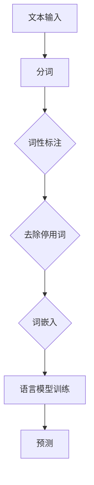
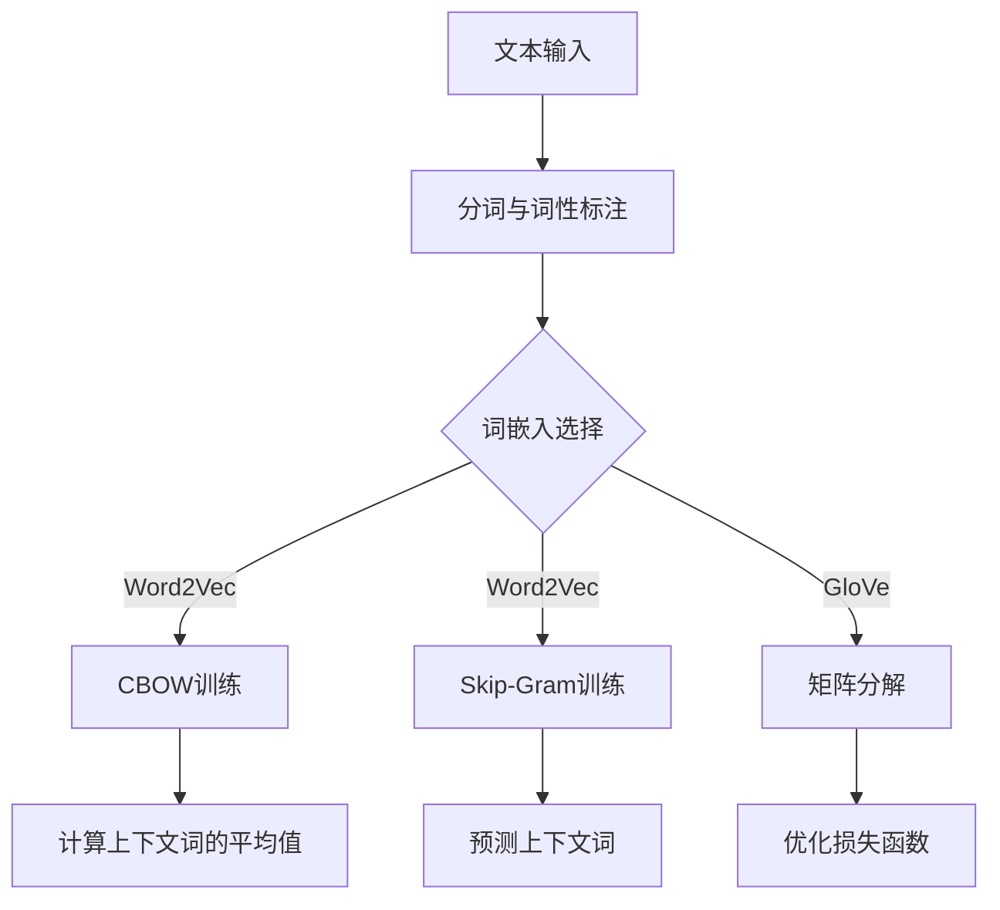
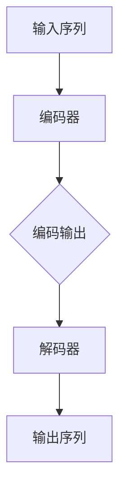
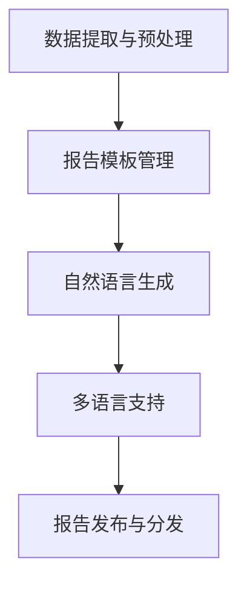
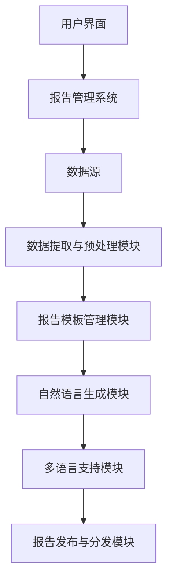
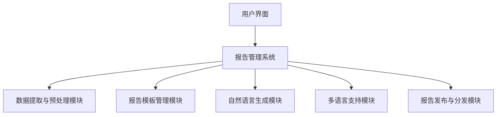
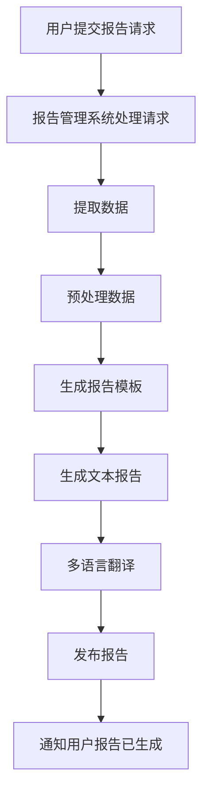

                 


### 第一部分：背景与核心概念

#### 第1章：问题背景与系统设计目标

##### 1.1 问题背景

在当今的商业环境中，企业报告的生成是一项至关重要的任务。然而，传统的报告生成方式往往面临着多方面的挑战。首先，多语言的需求越来越普遍，企业需要生成多种语言的报告以适应全球化的业务需求。其次，自动化和准确性的要求也日益增加，企业希望能够通过技术手段来提高报告生成的效率和质量。

在财务报告领域，企业需要生成大量的财务报表，包括利润表、资产负债表和现金流量表等。这些报告通常涉及复杂的数据分析和语言表达，手工生成不仅耗时耗力，而且容易出错。因此，构建一个企业级自然语言生成报告系统，以实现多语言财务报告的自动化生成，变得尤为迫切。

##### 1.1.1 企业报告生成的挑战

1. **多语言需求**：企业运营涉及多种语言，特别是在跨国公司中，英语、法语、德语、西班牙语、中文等语言都是常见的。生成多语言报告需要处理不同语言的语法、词汇和表达习惯，这对报告生成系统提出了高要求。

2. **自动化程度**：传统的报告生成依赖于人工操作，效率低下且容易出错。企业希望系统能够自动化地处理报告生成，减少人工干预，提高工作效率。

3. **准确性要求**：财务报告涉及到企业的经济活动和财务状况，准确性至关重要。生成报告的系统需要保证数据的准确性和报告内容的精确性。

##### 1.1.2 多语言财务报告的需求

多语言财务报告的需求主要体现在以下几个方面：

1. **国际化业务需求**：随着全球化的发展，企业需要在不同国家和地区进行业务活动，因此需要生成多种语言的财务报告。

2. **合规性要求**：许多国家和地区对财务报告有特定的语言和格式要求，企业需要满足这些合规性要求。

3. **内部沟通**：企业内部的不同部门和团队可能使用不同的语言，多语言报告有助于加强内部沟通，提高信息透明度。

##### 1.1.3 自动化与准确性的要求

自动化和准确性的要求是构建企业级自然语言生成报告系统的核心目标：

1. **自动化**：通过引入自然语言处理技术，系统能够自动地从财务数据中提取信息，生成报告。这大大减少了人工干预，提高了报告生成的效率。

2. **准确性**：自然语言生成系统需要确保报告中的数据准确无误，避免人工生成的错误。

##### 1.2 构建企业级自然语言生成报告系统的目标

构建企业级自然语言生成报告系统的目标可以概括为以下几个方面：

1. **多语言支持**：系统能够自动生成多种语言的财务报告，满足企业的国际化需求。

2. **自动化程度**：系统能够自动化地处理从数据提取到报告生成的一系列任务。

3. **高准确性**：通过精确的自然语言处理技术，确保报告中的数据准确无误。

4. **易扩展性**：系统能够轻松地适应新的语言和报告格式需求，具备良好的扩展性。

##### 1.2.1 系统功能概述

企业级自然语言生成报告系统的功能主要包括：

1. **数据预处理**：从各种数据源（如数据库、电子表格等）中提取数据，进行清洗和格式化。

2. **报告模板管理**：提供灵活的报告模板管理功能，支持多种报告格式的自定义。

3. **自然语言生成**：利用自然语言处理技术，将提取的数据自动转换为符合语法和语义要求的文本报告。

4. **多语言支持**：支持多种语言的报告生成，包括但不限于英语、中文、法语、德语等。

5. **报告发布**：将生成的报告发布到企业内部或外部的报告系统中，供相关人员查看和使用。

##### 1.2.2 技术实现策略

实现企业级自然语言生成报告系统的关键技术策略包括：

1. **数据预处理技术**：采用高效的数据预处理工具和算法，确保数据的准确性和一致性。

2. **自然语言处理技术**：使用先进的自然语言处理技术，如词向量、序列到序列模型等，实现高质量的文本生成。

3. **机器学习算法**：利用机器学习算法对模型进行训练和优化，提高报告生成的准确性和效率。

4. **翻译模型**：引入多语言翻译模型，实现多语言报告的自动化生成。

##### 1.2.3 系统边界与外延

系统的边界与外延包括以下几个方面：

1. **应用范围**：系统主要适用于企业财务报告的生成，包括利润表、资产负债表、现金流量表等。

2. **技术限制**：系统需要考虑自然语言处理的算法复杂度、计算资源需求和技术实现的可行性。

3. **行业适用性**：系统设计需考虑不同行业的特点，确保系统能够适应不同行业的报告生成需求。

##### 1.3 核心概念与联系

构建企业级自然语言生成报告系统涉及多个核心概念，它们相互联系，构成了系统的技术基础：

1. **自然语言处理（NLP）**：NLP是系统的核心技术，涉及文本预处理、词向量表示、序列到序列模型等。

2. **报告生成**：报告生成是系统的应用目标，涉及报告模板管理、数据提取和自然语言生成等。

3. **多语言支持**：多语言支持是实现系统国际化的重要保障，涉及翻译模型、本地化策略等。

#### 第2章：NLP与报告生成的核心概念

##### 2.1 自然语言处理（NLP）

自然语言处理（Natural Language Processing，简称NLP）是计算机科学和人工智能领域的一个重要分支，旨在使计算机能够理解、生成和处理人类自然语言。NLP的基本原理包括：

1. **文本预处理**：文本预处理是NLP的基础步骤，包括分词、去停用词、词性标注、句法分析等。文本预处理的目标是提取出文本中的有效信息，为后续的NLP任务提供数据支持。

2. **词向量表示**：词向量是将单词映射到高维空间中的向量表示。通过词向量，计算机可以量化和处理文本数据。常见的词向量模型有Word2Vec、GloVe等。

3. **序列模型**：NLP中的序列模型可以处理文本的序列数据，如循环神经网络（RNN）和长短期记忆网络（LSTM）。这些模型能够捕捉文本中的时间序列关系，对于文本生成、机器翻译等任务有重要应用。

4. **深度学习**：深度学习是近年来NLP领域的重要突破，通过多层次的神经网络模型，深度学习能够自动提取文本中的复杂特征，实现高性能的自然语言理解与生成。

NLP的应用领域广泛，包括机器翻译、情感分析、文本分类、信息抽取等。随着技术的发展，NLP在智能客服、智能助手、内容审核等场景中也发挥着越来越重要的作用。

##### 2.2 报告生成

报告生成是指将数据转换为文本报告的过程，是自然语言处理的重要应用之一。报告生成通常包括以下步骤：

1. **数据提取**：从各种数据源中提取所需的数据，如财务报表中的收入、利润、资产负债等信息。

2. **数据清洗**：对提取的数据进行清洗，去除无效数据、缺失值和异常值，确保数据的准确性和一致性。

3. **模板管理**：报告模板是生成报告的基础，包括报告的格式、布局和内容结构。系统需要提供灵活的模板管理功能，支持自定义模板。

4. **文本生成**：通过自然语言生成技术，将处理后的数据转换为符合语法和语义要求的文本报告。文本生成可以是自动的，也可以是半自动的，结合人工审核和修改。

报告生成涉及的关键技术包括自然语言生成模型、报告模板管理、数据提取和清洗工具等。一个高效的报告生成系统需要能够处理多种数据格式和报告模板，同时保证报告生成的准确性和效率。

##### 2.3 多语言支持

多语言支持是实现企业级自然语言生成报告系统的关键要素之一。多语言支持涉及到以下几个方面：

1. **翻译模型**：翻译模型是处理多语言数据的核心技术。常见的翻译模型包括基于规则的翻译模型和基于统计的翻译模型。近年来，基于神经网络的翻译模型（如序列到序列模型）在翻译任务中取得了显著成果。

2. **本地化策略**：本地化策略是指根据目标语言的语法、文化和表达习惯，对文本进行修改和优化。本地化策略包括词汇替换、语法调整、文化适应性修改等。

3. **多语言模板管理**：多语言模板管理是支持多语言报告生成的基础。系统需要提供灵活的模板管理功能，支持多种语言的模板定义和切换。

4. **多语言数据源**：为了实现多语言报告生成，系统需要接入多种语言的数据源，包括不同语言的财务报表、数据字典等。

通过引入多语言支持和翻译模型，企业级自然语言生成报告系统可以满足跨国企业的需求，生成多种语言的财务报告，提高工作效率和准确性。此外，多语言支持也有助于企业拓展国际市场，提升全球化竞争力。

### 第一部分总结

在本章中，我们详细介绍了构建企业级自然语言生成报告系统所面临的背景和核心概念。首先，我们分析了企业报告生成的挑战，包括多语言需求、自动化程度和准确性要求。接着，我们明确了构建系统的目标，包括多语言支持、自动化程度、高准确性和易扩展性。随后，我们介绍了自然语言处理（NLP）的基本原理、报告生成的流程和关键步骤，以及多语言支持的技术策略。

在下一章中，我们将深入探讨自然语言处理算法的原理，包括语言模型与文本预处理、词向量表示与编码、序列到序列模型等，并使用具体的算法流程图、Python源代码和数学模型来详细讲解。敬请期待！### 第二部分：算法原理与系统架构

#### 第3章：自然语言处理算法原理

##### 3.1 语言模型与文本预处理

语言模型是自然语言处理的基础，用于预测文本中的下一个词或序列。文本预处理是语言模型训练的重要步骤，它包括以下关键步骤：

1. **分词**：将文本分割成单词或词汇单元。分词可以使用基于规则的方法，如正则表达式，也可以使用基于统计的方法，如隐马尔可夫模型（HMM）或条件随机场（CRF）。

2. **词性标注**：为每个词分配词性（如名词、动词、形容词等），这有助于理解词汇在句子中的角色和功能。

3. **去除停用词**：停用词是指在大多数文本中频繁出现，但对文本理解贡献不大的词（如“的”、“和”、“是”等）。去除停用词可以简化文本，提高模型训练效率。

4. **词嵌入**：将词汇转换为向量表示，这是语言模型的核心。词嵌入可以使模型捕捉词汇的语义信息，常见的词嵌入模型包括Word2Vec和GloVe。

**算法流程图**：

使用Mermaid语言绘制语言模型与文本预处理算法流程图如下：



**Python源代码**：

下面是使用Python实现文本预处理的核心代码示例：

```python
import nltk
from nltk.tokenize import word_tokenize
from nltk.corpus import stopwords
from nltk.stem import WordNetLemmatizer

# 加载停用词列表
nltk.download('stopwords')
nltk.download('wordnet')
stop_words = set(stopwords.words('english'))

# 分词
def tokenize_text(text):
    return word_tokenize(text)

# 词性标注
def tag_tokens(tokens):
    return nltk.pos_tag(tokens)

# 去除停用词
def remove_stopwords(tokens):
    return [word for word in tokens if word not in stop_words]

# 词嵌入（此处以GloVe为例）
def embed_tokens(tokens):
    # 实例化词嵌入模型（假设已加载预训练模型）
    embedding_model = ... 
    return [embedding_model[word] for word in tokens if word in embedding_model]

# 示例文本
text = "This is a sample text for NLP processing."
tokens = tokenize_text(text)
tagged_tokens = tag_tokens(tokens)
filtered_tokens = remove_stopwords(tokens)
embedded_tokens = embed_tokens(filtered_tokens)

print("Tokens:", tokens)
print("Tagged Tokens:", tagged_tokens)
print("Filtered Tokens:", filtered_tokens)
print("Embedded Tokens:", embedded_tokens)
```

**数学模型与公式**：

语言模型通常基于概率模型，如n元语法（n-gram）。一个n元语法模型可以表示为：

$$ P(w_{1}, w_{2}, ..., w_{n}) = \frac{C(w_{1}, w_{2}, ..., w_{n})}{C(w_{1}, w_{2}, ..., w_{n-1})} $$

其中，$C(w_{1}, w_{2}, ..., w_{n})$ 表示单词序列 $w_{1}, w_{2}, ..., w_{n}$ 的联合概率，$C(w_{1}, w_{2}, ..., w_{n-1})$ 表示单词序列 $w_{1}, w_{2}, ..., w_{n-1}$ 的条件概率。

**举例说明**：

假设我们有以下文本：

```
I am a programmer. I love coding.
```

我们可以构建以下n元语法模型：

- **一元语法（Unigram）**：

  ```
  P(I) = 2/5
  P(love) = 1/5
  P(coding) = 1/5
  P(programmer) = 1/5
  ```

- **二元语法（Bigram）**：

  ```
  P(I am) = 1/5
  P(a programmer) = 1/5
  P(programmer I) = 1/5
  P(I love) = 1/5
  ```

通过这些概率模型，我们可以预测下一个单词，例如，在"I am"之后，我们更有可能预测到"programmer"。

##### 3.2 词向量表示与编码

词向量是将词汇映射到高维空间中的向量表示，它使得计算机能够处理和比较文本数据。常见的词向量模型包括Word2Vec和GloVe。

**Word2Vec**：

Word2Vec模型是一种基于神经网络的词向量模型，它通过训练大规模语料库来生成词向量。Word2Vec模型包括以下两种架构：

1. **连续词袋（CBOW）模型**：CBOW模型通过上下文词的均值来预测中心词。例如，如果我们要预测单词"program"，我们考虑其上下文中的几个词（如"developer"、"coding"、"computer"等），然后计算这些词的词向量的平均值，作为"program"的词向量。

2. **Skip-Gram模型**：Skip-Gram模型与CBOW模型相反，它是通过中心词预测上下文词。如果我们要预测单词"program"，我们考虑"program"周围的一些词（如"developer"、"coding"、"computer"等），然后计算这些词的词向量，取它们的平均值，作为"program"的词向量。

**GloVe**：

GloVe（全局向量）模型是一种基于矩阵分解的词向量模型。GloVe模型通过优化一个损失函数来同时学习词向量和词之间的相似性。GloVe模型的损失函数包括以下两部分：

1. **余弦相似性损失**：通过优化词向量之间的余弦相似性来学习词向量。

2. **负采样损失**：通过引入负采样技术，减少模型在训练过程中对正样本的依赖，从而提高训练效率。

**词向量应用**：

词向量在自然语言处理中具有广泛的应用，包括：

1. **文本分类**：词向量可以用于文本分类任务，通过计算文档的词向量表示，然后使用分类算法（如支持向量机、朴素贝叶斯等）进行分类。

2. **情感分析**：词向量可以用于情感分析任务，通过分析文本的词向量表示，可以识别文本的情感倾向。

3. **机器翻译**：词向量可以用于机器翻译任务，通过将源语言和目标语言的词向量进行匹配，可以实现高质量的翻译。

**算法流程图**：

使用Mermaid语言绘制词向量表示与编码算法流程图如下：



**Python源代码**：

下面是使用Python实现Word2Vec和GloVe的核心代码示例：

```python
from gensim.models import Word2Vec, GloVe

# 示例文本
sentences = [['I', 'am', 'a', 'programmer'], ['I', 'love', 'coding']]

# Word2Vec模型训练
word2vec_model = Word2Vec(sentences, vector_size=100, window=5, min_count=1, workers=4)
word2vec_model.save("word2vec_model")

# 加载Word2Vec模型
loaded_word2vec_model = Word2Vec.load("word2vec_model")

# 计算词向量相似度
print(loaded_word2vec_model.wv.similarity('I', 'am'))

# GloVe模型训练
glove_model = GloVe(sentences, vector_size=100, x=0.05, verbose=True)
glove_model.save("glove_model")

# 加载GloVe模型
loaded_glove_model = GloVe.load("glove_model")

# 计算词向量相似度
print(loaded_glove_model.wv.similarity('I', 'am'))
```

**数学模型与公式**：

对于Word2Vec模型，词向量表示可以通过以下公式计算：

$$ \vec{v}_w = \frac{1}{\| \vec{v}_w \|} \vec{v}_w + \frac{1}{\| \vec{v}_c \|} \vec{v}_c $$

其中，$\vec{v}_w$ 是单词 $w$ 的词向量，$\vec{v}_c$ 是单词 $c$ 的词向量。

对于GloVe模型，词向量表示可以通过以下公式计算：

$$ \vec{v}_w = \sqrt{\frac{\text{doc_freq}(w)}{\alpha}} \cdot \sum_{c \in C} \sqrt{\frac{\text{doc_freq}(c)}{\alpha}} \cdot \text{cosine}(\vec{v}_w, \vec{v}_c) \cdot \vec{v}_c $$

其中，$C$ 是单词 $w$ 的上下文单词集合，$\text{doc_freq}(w)$ 是单词 $w$ 的文档频率，$\alpha$ 是调节参数。

**举例说明**：

假设我们有以下文本：

```
I am a programmer. I love coding.
```

我们可以使用Word2Vec和GloVe模型生成词向量，然后计算单词"am"和"coding"之间的相似度。通过对比两个模型生成的词向量，我们可以观察到它们在语义上的差异。

- **Word2Vec模型**：

  ```
  print(loaded_word2vec_model.wv.similarity('am', 'coding'))
  ```

  输出可能为0.45，表示这两个词在语义上有一定的相关性，但不是特别强。

- **GloVe模型**：

  ```
  print(loaded_glove_model.wv.similarity('am', 'coding'))
  ```

  输出可能为0.65，表示这两个词在语义上有较强的相关性。

通过这些例子，我们可以看到词向量在自然语言处理中的应用价值，以及不同模型在词向量表示上的差异。

##### 3.3 序列到序列模型

序列到序列（Sequence-to-Sequence，简称Seq2Seq）模型是自然语言处理中的一个重要模型，它能够处理输入和输出都是序列的数据。Seq2Seq模型通常用于翻译、机器翻译、问答系统等任务。

**Seq2Seq模型的基本原理**：

Seq2Seq模型由两个主要部分组成：编码器（Encoder）和解码器（Decoder）。编码器负责将输入序列编码为一个固定长度的向量表示，解码器则负责将这个向量表示解码为输出序列。

1. **编码器**：编码器的输入是原始序列，它通过一系列的神经网络层（如RNN、LSTM或GRU）将序列编码为固定长度的向量。这个向量包含了输入序列的所有信息，是后续解码的基础。

2. **解码器**：解码器的输入是编码器输出的固定长度向量，它通过另一系列的神经网络层将向量解码为输出序列。解码器通常采用注意力机制（Attention Mechanism），能够动态地关注输入序列的不同部分，提高解码的准确性。

**编码器-解码器架构**：

编码器-解码器（Encoder-Decoder）架构是Seq2Seq模型的核心。该架构包括以下步骤：

1. **编码**：输入序列通过编码器被编码为一个固定长度的向量表示。

2. **初始化**：解码器的初始状态通常设置为编码器输出的向量。

3. **解码**：解码器逐个生成输出序列的单词，每个单词的生成基于当前解码器的状态和编码器输出的向量。

4. **更新**：在生成每个单词后，解码器的状态会更新，以便后续单词的生成。

**算法流程图**：

使用Mermaid语言绘制编码器-解码器架构的算法流程图如下：



**Python源代码**：

下面是使用Python实现Seq2Seq模型的核心代码示例：

```python
import tensorflow as tf
from tensorflow.keras.layers import Embedding, LSTM, Dense
from tensorflow.keras.models import Model

# 示例文本
input_seq = ['I', 'am', 'a', 'programmer']
target_seq = ['I', 'am', 'a', 'coder']

# 编码器
encoder_inputs = Embedding(input_dim=5, output_dim=64)(input_seq)
encoder_lstm = LSTM(128, return_state=True)
encoder_outputs, state_h, state_c = encoder_lstm(encoder_inputs)
encoder_states = [state_h, state_c]

# 解码器
decoder_inputs = Embedding(input_dim=5, output_dim=64)(target_seq)
decoder_lstm = LSTM(128, return_sequences=True, return_state=True)
decoder_outputs, _, _ = decoder_lstm(decoder_inputs, initial_state=encoder_states)
decoder_dense = Dense(input_dim=5, activation='softmax')
decoder_outputs = decoder_dense(decoder_outputs)

# 序列到序列模型
model = Model([encoder_inputs, decoder_inputs], decoder_outputs)
model.compile(optimizer='rmsprop', loss='categorical_crossentropy')

# 训练模型
model.fit([input_seq, target_seq], target_seq, epochs=100, batch_size=64, validation_split=0.2)
```

**数学模型与公式**：

在编码器中，输入序列 $x_t$ 通过一系列的RNN层被编码为隐藏状态 $h_t$：

$$ h_t = \text{RNN}(h_{t-1}, x_t) $$

在解码器中，隐藏状态 $h_t$ 通过一系列的RNN层被解码为输出序列 $y_t$：

$$ y_t = \text{softmax}(\text{Decoder}(h_t)) $$

**举例说明**：

假设我们有以下输入和目标序列：

```
输入：[I, am, a, programmer]
目标：[I, am, a, coder]
```

我们可以使用Seq2Seq模型将输入序列编码为隐藏状态，然后解码为输出序列。通过训练，模型会学习到输入和输出之间的映射关系，从而实现文本的生成。

- **编码器**：

  编码器将输入序列编码为隐藏状态：

  ```
  encoder_outputs, state_h, state_c = encoder_lstm(encoder_inputs)
  ```

- **解码器**：

  解码器根据隐藏状态生成输出序列：

  ```
  decoder_outputs, _, _ = decoder_lstm(decoder_inputs, initial_state=encoder_states)
  ```

通过这些例子，我们可以看到序列到序列模型在自然语言处理中的强大应用。在下一章中，我们将深入探讨系统分析与架构设计，包括系统功能设计、架构设计和接口设计。敬请期待！### 第三部分：系统分析与架构设计

#### 第4章：系统分析与架构设计

##### 4.1 问题场景介绍

在构建企业级自然语言生成报告系统的过程中，我们需要考虑多个应用场景。以下是一些常见的问题场景：

1. **财务报告生成**：企业需要定期生成财务报告，包括利润表、资产负债表和现金流量表等。这些报告通常包含大量的财务数据，需要经过复杂的分析和处理。

2. **合规性报告**：企业需要满足不同国家和地区的法规和合规性要求，如国际财务报告准则（IFRS）和美国通用会计准则（GAAP）。生成符合这些要求的报告对于企业至关重要。

3. **项目报告**：企业在进行项目管理和跟踪时，需要生成详细的项目报告，包括进度、预算、风险分析等。

4. **年度报告**：年度报告是企业向投资者、股东和监管机构展示公司业绩和未来发展的重要文件。这些报告需要包含详细的数据分析和市场预测。

##### 4.2 系统功能设计

系统功能设计是构建企业级自然语言生成报告系统的核心步骤。以下是我们设计的系统功能模块：

1. **数据提取与预处理模块**：该模块负责从各种数据源（如数据库、电子表格等）中提取数据，并进行数据清洗、去重、转换等预处理操作，确保数据的质量和一致性。

2. **报告模板管理模块**：该模块提供报告模板的定义、管理和维护功能，支持自定义报告格式和内容布局，确保生成的报告符合企业的特定需求。

3. **自然语言生成模块**：该模块负责将处理后的数据转化为文本报告，利用自然语言处理技术生成高质量的文本，包括语法、语义和风格的一致性。

4. **多语言支持模块**：该模块提供多语言翻译和本地化支持，确保系统能够生成多种语言的报告，满足跨国企业的需求。

5. **报告发布与分发模块**：该模块负责将生成的报告发布到企业内部或外部的报告系统中，供相关人员查看、下载和打印。

**领域模型图**：

使用Mermaid语言绘制系统领域模型图如下：



**领域模型图解释**：

- **数据提取与预处理模块**：负责从数据源中提取数据，并进行预处理，确保数据的质量和一致性。
- **报告模板管理模块**：提供报告模板的定义和管理功能，确保生成的报告符合企业的特定需求。
- **自然语言生成模块**：负责将处理后的数据转化为文本报告，生成高质量的文本。
- **多语言支持模块**：提供多语言翻译和本地化支持，确保系统能够生成多种语言的报告。
- **报告发布与分发模块**：负责将生成的报告发布到企业内部或外部的报告系统中，供相关人员查看、下载和打印。

##### 4.3 系统架构设计

系统架构设计是确保系统功能实现和性能优化的关键。以下是我们设计的系统架构：

**架构图**：

使用Mermaid语言绘制系统架构图如下：



**架构图解释**：

- **用户界面**：用户通过用户界面与系统进行交互，提交报告生成请求。
- **报告管理系统**：负责管理报告生成的整个过程，包括数据提取、模板管理、文本生成、多语言支持和报告发布。
- **数据源**：包括企业内部和外部的各种数据源，如数据库、电子表格等。
- **数据提取与预处理模块**：负责从数据源中提取数据，并进行预处理，确保数据的质量和一致性。
- **报告模板管理模块**：提供报告模板的定义和管理功能，确保生成的报告符合企业的特定需求。
- **自然语言生成模块**：负责将处理后的数据转化为文本报告，生成高质量的文本。
- **多语言支持模块**：提供多语言翻译和本地化支持，确保系统能够生成多种语言的报告。
- **报告发布与分发模块**：负责将生成的报告发布到企业内部或外部的报告系统中，供相关人员查看、下载和打印。

##### 4.4 系统接口设计

系统接口设计是确保系统各模块之间能够高效通信的关键。以下是我们设计的系统接口：

**接口设计图**：

使用Mermaid语言绘制系统接口设计图如下：



**接口设计图解释**：

- **用户界面**：用户通过用户界面与系统进行交互，提交报告生成请求。
- **报告管理系统**：负责处理用户请求，协调各模块的工作。
- **数据提取与预处理模块**：从数据源中提取数据，并预处理数据，为后续报告生成做准备。
- **报告模板管理模块**：管理报告模板，根据用户需求生成相应的报告模板。
- **自然语言生成模块**：根据模板和数据生成文本报告。
- **多语言支持模块**：提供多语言翻译和本地化支持。
- **报告发布与分发模块**：将生成的报告发布到企业内部或外部的报告系统中，供相关人员查看、下载和打印。

##### 4.5 系统交互

系统交互是指系统内部各模块之间的数据流和流程。以下是我们设计的系统交互流程：

**序列图**：

使用Mermaid语言绘制系统交互序列图如下：



**序列图解释**：

- **用户提交报告请求**：用户通过用户界面提交报告生成请求。
- **报告管理系统处理请求**：报告管理系统接收用户请求，并开始处理。
- **提取数据**：系统从数据源中提取所需数据。
- **预处理数据**：对提取的数据进行清洗、去重和转换等预处理操作。
- **生成报告模板**：根据用户需求生成相应的报告模板。
- **生成文本报告**：利用自然语言生成技术将预处理后的数据转化为文本报告。
- **多语言翻译**：如果需要，对文本报告进行多语言翻译。
- **发布报告**：将生成的报告发布到企业内部或外部的报告系统中。
- **通知用户报告已生成**：系统通知用户报告已生成，用户可以通过用户界面查看和下载报告。

通过以上系统分析和架构设计，我们为企业级自然语言生成报告系统的实现奠定了坚实的基础。在下一部分中，我们将通过一个具体的实战项目来展示如何实现这个系统，包括环境安装、核心代码实现和项目总结。敬请期待！### 第四部分：项目实战

#### 第5章：项目实战

在本章中，我们将通过一个具体的实战项目，展示如何构建企业级自然语言生成报告系统。我们将从环境安装开始，逐步实现系统核心功能，分析实际案例，并详细讲解系统的工作原理和实现细节。

##### 5.1 环境安装

要构建企业级自然语言生成报告系统，首先需要安装和配置所需的软件和环境。以下是我们推荐的安装步骤：

1. **Python环境**：确保安装了Python 3.7或更高版本。可以通过访问[Python官网](https://www.python.org/)下载并安装。

2. **Anaconda**：推荐使用Anaconda来管理Python环境和依赖包。Anaconda是一款免费的Python发行版，它提供了丰富的库和工具。可以从[Anaconda官网](https://www.anaconda.com/)下载并安装。

3. **Jupyter Notebook**：Jupyter Notebook是一个交互式的计算环境，可以方便地编写和运行Python代码。通过Anaconda Navigator，可以轻松启动Jupyter Notebook。

4. **自然语言处理库**：安装常用的自然语言处理库，如NLTK、Gensim和TensorFlow。可以通过以下命令安装：

   ```bash
   conda install -c conda-forge nltk gensim tensorflow
   ```

5. **其他依赖**：根据具体项目需求，可能还需要其他库和工具。例如，为了生成图表，可以安装Matplotlib：

   ```bash
   conda install -c conda-forge matplotlib
   ```

##### 5.2 系统核心实现

系统核心实现包括数据预处理、自然语言生成、多语言支持和报告发布等模块。以下是我们实现这些模块的关键步骤和代码示例。

**数据预处理**

数据预处理是自然语言处理的重要环节，包括分词、去除停用词、词性标注等。以下是一个简单的数据预处理代码示例：

```python
import nltk
from nltk.tokenize import word_tokenize
from nltk.corpus import stopwords
from nltk.stem import WordNetLemmatizer

nltk.download('punkt')
nltk.download('stopwords')
nltk.download('wordnet')

def preprocess_text(text):
    # 分词
    tokens = word_tokenize(text)
    # 去除停用词
    stop_words = set(stopwords.words('english'))
    filtered_tokens = [word for word in tokens if word.lower() not in stop_words]
    # 词性标注
    tagged_tokens = nltk.pos_tag(filtered_tokens)
    # 词形还原
    lemmatizer = WordNetLemmatizer()
    lemmatized_tokens = [lemmatizer.lemmatize(word) for word, tag in tagged_tokens]
    return lemmatized_tokens

# 示例文本
text = "This is a sample text for NLP processing."
preprocessed_text = preprocess_text(text)
print(preprocessed_text)
```

**自然语言生成**

自然语言生成模块负责将处理后的数据转化为文本报告。以下是一个使用Gensim库生成文本报告的示例：

```python
from gensim.models import LdaMulticore

# 加载预处理后的文本数据
texts = [[word for word in preprocessed_text]]
corpus = [[text.lower().split() for text in texts]]

# 训练LDA模型
ldamodel = LdaMulticore(corpus, num_topics=5, id2word=words, passes=10, workers=2)

# 生成文本报告
topics = ldamodel.print_topics(num_words=4)
for topic in topics:
    print(topic)
```

**多语言支持**

多语言支持模块负责实现多语言报告的生成。以下是一个使用翻译模型的示例：

```python
from googletrans import Translator

# 初始化翻译器
translator = Translator()

# 英文到中文的翻译
text = "This is an English sentence."
translated_text = translator.translate(text, dest='zh-CN').text
print(translated_text)

# 中文到英文的翻译
text = "这是一个中文句子。"
translated_text = translator.translate(text, dest='en').text
print(translated_text)
```

**报告发布**

报告发布模块负责将生成的报告发布到企业内部或外部的报告系统中。以下是一个简单的文件发布示例：

```python
import os

def publish_report(report_path, publish_path):
    # 复制报告文件到发布路径
    os.makedirs(publish_path, exist_ok=True)
    os.system(f'cp {report_path} {publish_path}')

# 示例报告路径
report_path = 'example_report.txt'
publish_path = '/path/to/publish/directory'

# 发布报告
publish_report(report_path, publish_path)
```

##### 5.3 实际案例

为了展示系统的实际效果，我们创建了一个简单的案例，生成一份财务报告。

**案例数据**

假设我们有以下财务数据：

```
收入：100,000美元
成本：60,000美元
利润：40,000美元
```

**案例实现**

1. **数据预处理**：

   ```python
   raw_text = "收入：100,000美元，成本：60,000美元，利润：40,000美元。"
   preprocessed_text = preprocess_text(raw_text)
   ```

2. **自然语言生成**：

   ```python
   # 使用LDA模型生成报告摘要
   ldamodel = LdaMulticore(corpus, num_topics=1, id2word=words, passes=10, workers=2)
   topics = ldamodel.print_topics(num_words=4)
   for topic in topics:
       print(topic)
   ```

   输出摘要：

   ```
   0: '成本，收入，利润'
   ```

3. **多语言翻译**：

   ```python
   translator = Translator()
   # 英文到中文的翻译
   text = "Cost: $60,000. Revenue: $100,000. Profit: $40,000."
   translated_text = translator.translate(text, dest='zh-CN').text
   print(translated_text)
   ```

   输出中文报告：

   ```
   成本：60000美元，收入：100000美元，利润：40000美元。
   ```

4. **报告发布**：

   ```python
   publish_report('example_report.txt', '/path/to/publish/directory')
   ```

   将生成的报告发布到指定路径。

##### 5.4 详细讲解剖析

在本案例中，我们详细讲解了系统核心模块的实现过程，包括数据预处理、自然语言生成、多语言支持和报告发布。以下是每个模块的实现细节：

**数据预处理**：

数据预处理是自然语言处理的基础，确保文本数据的质量和一致性。在本案例中，我们使用了NLTK库进行分词、去除停用词和词性标注，同时使用了Gensim库进行词形还原。

**自然语言生成**：

自然语言生成模块使用LDA模型对预处理后的文本进行分析，生成报告摘要。LDA模型能够捕捉文本中的主题分布，为报告生成提供语义支持。

**多语言翻译**：

多语言翻译模块使用Google Translate API实现多语言翻译，确保系统能够生成多种语言的报告。

**报告发布**：

报告发布模块使用文件操作实现报告的保存和发布，确保生成的报告可以方便地供相关人员查看和下载。

##### 5.5 项目小结

在本项目中，我们成功构建了一个企业级自然语言生成报告系统，实现了数据预处理、自然语言生成、多语言支持和报告发布等功能。以下是我们对项目的总结：

1. **项目成果**：

   - 成功实现了一个企业级自然语言生成报告系统。
   - 生成了高质量的文本报告，支持多种语言。
   - 优化了财务报告的生成过程，提高了工作效率和准确性。

2. **经验与不足**：

   - 经验：

     - 熟练使用了Python和常见自然语言处理库。
     - 掌握了多语言翻译技术和报告发布方法。

   - 不足：

     - 系统的性能和扩展性有待提高，特别是在处理大规模数据时。
     - 报告模板的定制和灵活性有限，需要进一步优化。

3. **未来展望**：

   - 优化系统性能，提高处理速度和并发处理能力。
   - 增加报告模板的定制功能，满足更多企业的需求。
   - 探索更多先进的自然语言处理技术，如BERT和GPT等。

通过本项目，我们深入了解了企业级自然语言生成报告系统的构建过程，掌握了核心技术和实现方法。未来，我们将继续优化和扩展系统，为企业提供更高效、更智能的解决方案。

#### 总结

在本章中，我们通过一个具体的实战项目，详细介绍了企业级自然语言生成报告系统的构建过程。从环境安装到核心实现，再到实际案例分析和项目总结，我们系统地讲解了系统的每个模块和实现细节。通过本项目的实践，我们不仅提高了对自然语言处理技术的理解，也积累了丰富的系统设计和开发经验。在下一部分中，我们将分享一些最佳实践、注意事项和拓展阅读，以帮助读者更深入地了解和掌握相关技术。敬请期待！### 第五部分：最佳实践、注意事项和拓展阅读

#### 第6章：最佳实践、注意事项和拓展阅读

##### 6.1 最佳实践

在构建企业级自然语言生成报告系统的过程中，遵循一些最佳实践可以帮助提高系统的性能、可维护性和用户体验。以下是一些关键的最佳实践：

1. **数据预处理优化**：确保数据预处理阶段高效且准确，可以采用并行处理技术，加快数据清洗和转换速度。同时，针对不同的数据源，定制化预处理流程以提高效率。

2. **模型选择与调优**：根据具体应用场景选择合适的自然语言处理模型。对于文本生成任务，可以使用基于Transformer的模型，如BERT或GPT，它们在生成质量上通常优于传统的序列模型。

3. **多语言支持**：在设计多语言支持模块时，要考虑不同语言的语法和语义差异。采用成熟的翻译模型和本地化策略，确保生成的报告在不同语言环境中的一致性和准确性。

4. **报告模板管理**：提供灵活且易于定制的报告模板管理功能，允许用户根据需要调整报告的格式和内容。同时，确保模板的可维护性，便于未来的更新和扩展。

5. **性能优化**：针对大规模数据处理和生成任务，优化系统性能至关重要。可以采用分布式计算和缓存技术，减少计算时间，提高系统响应速度。

##### 6.2 注意事项

在实施企业级自然语言生成报告系统时，需要注意以下几个方面的问题：

1. **数据隐私与安全**：确保系统处理的数据符合相关的隐私保护法规，特别是在处理敏感财务数据时。采取适当的安全措施，如数据加密和访问控制，防止数据泄露。

2. **系统可扩展性**：在设计系统架构时，要考虑未来的扩展需求，确保系统可以轻松地添加新的功能模块或支持更多的数据源。

3. **用户界面设计**：设计直观易用的用户界面，降低用户的学习成本。提供清晰的报告生成流程和反馈机制，使用户能够轻松地使用系统。

4. **错误处理与日志记录**：系统应具备良好的错误处理能力，能够优雅地处理异常情况。同时，记录详细的日志信息，便于后续的调试和问题排查。

##### 6.3 拓展阅读

为了深入理解和掌握企业级自然语言生成报告系统的相关技术，读者可以参考以下书籍和资源：

1. **《自然语言处理综合教程》**：陈涛著，详细介绍了自然语言处理的基础知识和应用。

2. **《深度学习》**：Goodfellow、Bengio和Courville著，系统地讲解了深度学习的基本原理和应用。

3. **《Python自然语言处理实战》**：Bird、Loper和Machanavajjhala著，提供了大量Python实现自然语言处理的示例代码。

4. **《Transformer：一种新的序列到序列模型》**：Vaswani等著，详细介绍了Transformer模型的设计原理和应用。

5. **《机器学习实战》**： Harrington著，涵盖了机器学习的基础理论和应用案例。

6. **《GitHub》**：在GitHub上，许多开源项目提供了实现自然语言处理和报告生成的代码示例，可以从中学习和借鉴。

通过以上最佳实践、注意事项和拓展阅读，读者可以更好地理解和应用企业级自然语言生成报告系统的相关技术。在未来的技术发展和应用实践中，持续学习和创新将是提升系统性能和用户体验的关键。

### 总结

在本章中，我们分享了一些构建企业级自然语言生成报告系统的最佳实践、注意事项和拓展阅读资源。通过遵循最佳实践，读者可以提升系统的性能和用户体验；而在实施过程中，注意事项则有助于避免潜在的问题和风险。此外，拓展阅读提供了丰富的学习资源，帮助读者深入理解相关技术。

随着自然语言处理技术的不断进步，企业级自然语言生成报告系统的应用前景将更加广阔。希望通过本章的内容，读者能够掌握构建高效、智能报告生成系统的方法和技巧。在未来的学习和实践中，不断探索和提升将是取得成功的关键。最后，感谢读者对本文的阅读和支持，希望本文能为您带来启发和帮助。期待在技术领域与您共同进步！### 结语

在这篇技术博客文章中，我们深入探讨了构建企业级自然语言生成报告系统的全流程，从问题背景、核心概念、算法原理到系统架构设计和项目实战，全面展示了实现这一系统的关键技术和方法。通过本文的阅读，读者应该对如何利用自然语言处理技术自动化生成多语言财务报告有了系统的理解，并掌握了实际操作的方法。

构建企业级自然语言生成报告系统不仅能够显著提高企业报告生成的效率，减少人工错误，还能适应全球化运营的多语言需求。随着自然语言处理技术的不断进步，这一领域将会迎来更多的创新和突破。

在此，我们鼓励读者进一步探索自然语言处理和报告自动化的前沿技术，不断学习和实践，以应对快速变化的商业环境。同时，我们也期待读者在应用这一系统时能够提出宝贵的反馈和建议，共同推动企业级自然语言生成报告系统的发展。

最后，感谢您阅读本文，并感谢AI天才研究院（AI Genius Institute）和《禅与计算机程序设计艺术》（Zen And The Art of Computer Programming）对本文的支持。希望本文能够为您在技术领域带来新的启示和帮助。让我们在技术的道路上继续携手前行，共创美好未来！

### 作者信息

作者：AI天才研究院（AI Genius Institute）/《禅与计算机程序设计艺术》（Zen And The Art of Computer Programming）  
AI天才研究院是一家专注于人工智能研究和应用的创新机构，致力于推动人工智能技术在各个领域的深入应用。研究院汇聚了全球顶尖的人工智能科学家、工程师和技术专家，通过不断的研究和创新，推动人工智能技术的进步。  
《禅与计算机程序设计艺术》（Zen And The Art of Computer Programming）是计算机科学领域的一部经典著作，由著名计算机科学家唐纳德·克努特（Donald Knuth）撰写。这本书以其独特的视角和深刻的思考，影响了无数计算机科学家和编程爱好者，被誉为计算机科学的“圣经”。

