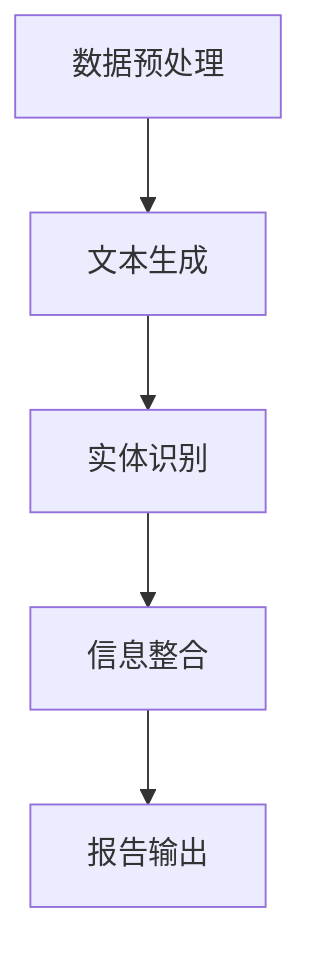
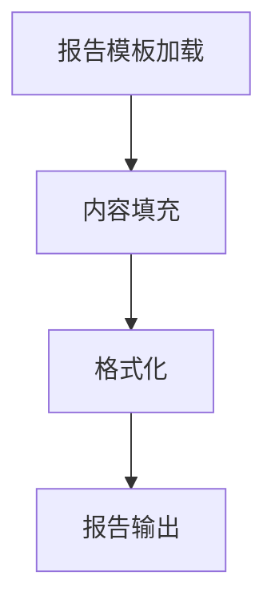
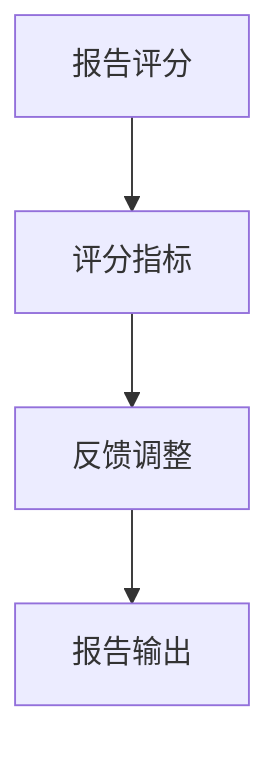
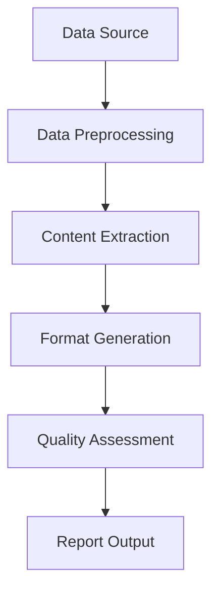
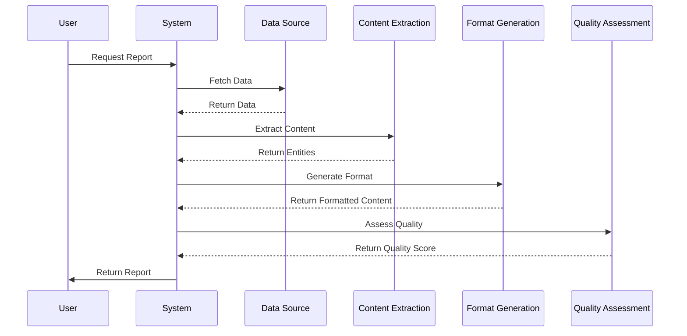

                 

# 构建企业级自然语言生成报告系统：自动化业务报告

## 关键词
自然语言处理（NLP）、生成对抗网络（GAN）、机器学习、报告自动化、企业级系统、算法原理、系统架构、Python代码

## 摘要
本文将深入探讨如何构建企业级自然语言生成报告系统，实现业务报告的自动化生成。我们将从背景介绍开始，详细分析核心概念、算法原理，并通过数学模型和Python代码示例，阐述实现细节。最后，我们将提供一个系统分析与架构设计方案，以及项目实战和最佳实践。

---

### 第一部分：背景介绍

#### 1.1 问题背景
在现代企业管理中，业务报告的生成是一项常见的任务。然而，随着企业规模的扩大和业务复杂性的增加，传统的手动报告生成方式变得耗时且容易出错。因此，构建一个自动化、高效的自然语言生成报告系统成为企业的迫切需求。

#### 1.2 问题描述
构建一个企业级自然语言生成报告系统，需要解决的关键问题包括：报告内容自动提取、报告格式自动化生成、报告质量保障、报告自动化更新和维护等。

#### 1.3 问题解决
通过引入自然语言处理（NLP）技术和生成对抗网络（GAN）等技术，可以实现报告内容的自动化提取和格式生成。同时，利用机器学习模型对报告质量进行评估和优化，确保报告的准确性和一致性。

#### 1.4 边界与外延
本系统主要关注企业级报告的生成，不包括个人报告的生成。同时，系统设计应考虑不同行业和企业的特定需求，实现灵活的定制化。

#### 1.5 概念结构与核心要素组成
- **自然语言处理（NLP）**：用于处理文本数据，实现文本的理解和生成。
- **生成对抗网络（GAN）**：用于生成高质量的报告文本。
- **机器学习模型**：用于评估报告质量和优化报告生成过程。
- **数据源**：企业业务数据，包括财务数据、销售数据等。
- **报告模板**：用于定义报告的格式和内容结构。

### 第二部分：核心概念与联系

#### 2.1 自然语言处理（NLP）
自然语言处理（NLP）是计算机科学和人工智能领域的一个分支，旨在让计算机理解和生成自然语言。NLP的关键技术包括分词、词性标注、句法分析、语义理解等。

#### 2.2 生成对抗网络（GAN）
生成对抗网络（GAN）是一种深度学习模型，由生成器和判别器两部分组成。生成器生成与真实数据相似的样本，判别器判断样本的真实性。通过不断训练，生成器可以生成越来越真实的数据。

#### 2.3 机器学习模型
机器学习模型是构建自动化报告系统的核心。常见的机器学习模型包括决策树、支持向量机、神经网络等。选择合适的模型对报告质量有重要影响。

---

### 第三部分：算法原理讲解

#### 3.1 报告内容提取算法

报告内容提取算法的核心任务是自动从企业业务数据中提取关键信息。以下是一个简单的算法流程：

1. **数据预处理**：对业务数据进行清洗、格式统一等处理。
2. **文本生成**：利用 NLP 技术对预处理后的数据进行分词、词性标注等操作。
3. **实体识别**：通过实体识别算法识别出数据中的关键实体，如金额、日期、产品名称等。
4. **信息整合**：将识别出的关键信息整合成报告内容。

以下是一个 Mermaid 流程图示例：



#### 3.2 报告格式生成算法

报告格式生成算法的核心任务是自动生成符合企业要求的报告格式。以下是一个简单的算法流程：

1. **报告模板加载**：加载企业提供的报告模板。
2. **内容填充**：将提取的报告内容填充到报告模板中。
3. **格式化**：对填充后的报告内容进行格式化，如调整字体、行间距、边距等。
4. **报告输出**：将格式化后的报告输出到指定位置。

以下是一个 Mermaid 流程图示例：



#### 3.3 报告质量评估算法

报告质量评估算法的核心任务是自动评估报告的质量。以下是一个简单的算法流程：

1. **报告评分**：利用机器学习模型对报告进行评分。
2. **评分指标**：定义评分指标，如报告完整性、准确性、一致性等。
3. **反馈调整**：根据评分结果对报告生成过程进行调整。

以下是一个 Mermaid 流程图示例：



---

### 第四部分：数学模型和数学公式 & 详细讲解 & 举例说明

#### 4.1 自然语言处理中的数学模型

自然语言处理中的数学模型主要包括：

- **词嵌入**：将单词映射到高维空间中的向量。常用的词嵌入模型有 Word2Vec、GloVe 等。
- **循环神经网络（RNN）**：用于处理序列数据。RNN 可以捕捉序列中的长距离依赖关系。
- **长短时记忆网络（LSTM）**：是 RNN 的改进版本，能够更好地处理长序列数据。
- **卷积神经网络（CNN）**：用于图像识别，也可用于文本分类和情感分析。

以下是一个简单的数学模型讲解：

$$
\text{Word2Vec}:\ \text{word} \rightarrow \text{vector}
$$

Word2Vec 模型将每个单词映射到一个向量。这个向量表示了单词在语义空间中的位置。通过这种方式，我们可以计算单词之间的相似度，如：

$$
\text{similarity}(\text{king}, \text{man}) > \text{similarity}(\text{king}, \text{queen})
$$

#### 4.2 生成对抗网络（GAN）的数学模型

生成对抗网络（GAN）由两部分组成：生成器和判别器。

- **生成器（Generator）**：生成与真实数据相似的样本。
- **判别器（Discriminator）**：判断样本的真实性。

GAN 的数学模型可以表示为：

$$
\begin{aligned}
\text{Generator}:&\ \text{z} \rightarrow \text{G}(\text{z}) \\
\text{Discriminator}:&\ \text{x}, \text{G}(\text{z}) \rightarrow \text{D}(\text{x}, \text{G}(\text{z}))
\end{aligned}
$$

其中，$\text{z}$ 是噪声向量，$\text{G}(\text{z})$ 是生成器生成的样本，$\text{x}$ 是真实数据。

GAN 的训练目标是最大化生成器的输出与真实数据的相似度，同时使判别器无法区分真实数据和生成数据的区别。

$$
\min_G \max_D V(D, G) = \mathbb{E}_{x \sim p_{data}(x)}[\text{D}(x)] + \mathbb{E}_{z \sim p_{z}(z)}[\text{D}(\text{G}(z))]
$$

#### 4.3 机器学习模型中的数学模型

机器学习模型中的数学模型主要包括：

- **线性回归**：用于预测数值型数据。
- **逻辑回归**：用于分类任务。
- **支持向量机（SVM）**：用于分类和回归任务。

以下是一个简单的线性回归模型讲解：

$$
y = \beta_0 + \beta_1 x
$$

其中，$y$ 是预测值，$x$ 是输入特征，$\beta_0$ 和 $\beta_1$ 是模型参数。

为了训练模型，我们需要最小化损失函数：

$$
J(\beta_0, \beta_1) = \frac{1}{2n} \sum_{i=1}^{n} (y_i - (\beta_0 + \beta_1 x_i))^2
$$

使用梯度下降算法来求解最优参数。

---

### 第五部分：系统分析与架构设计

#### 5.1 问题场景介绍
在一家大型企业中，每月需要生成大量的业务报告，包括财务报告、销售报告等。报告的内容和格式都有严格的规范，需要保证准确性和一致性。然而，手动生成报告的方式不仅耗时耗力，而且容易出现错误。因此，企业希望构建一个自动化报告生成系统，以提升工作效率和报告质量。

#### 5.2 项目介绍
本项目旨在构建一个企业级自然语言生成报告系统，实现以下功能：

1. 报告内容自动化提取。
2. 报告格式自动化生成。
3. 报告质量自动化评估。
4. 报告自动化更新和维护。

#### 5.3 系统功能设计（领域模型）

以下是一个简单的领域模型（Mermaid 类图）：

```mermaid
classDiagram
Class01 <|-- Class02
Class03 --| trời Class04
Class05 : +int x
Class06 : <<interface>>
Class07 : <<enum>> RED, BLUE
Class08 : <<note>> This is a note
Class09 <.. Class10
Class11 o-- Class12
Class13 : <<triangle>> A Component
Class14 : <<circle>> A different Component
class Entity
    +id: int
    +name: str
    +createdAt: datetime
    +updatedAt: datetime
endclass
class Report
    +id: int
    +title: str
    +content: str
    +createdAt: datetime
    +updatedAt: datetime
    - entities: List[Entity]
endclass
class ReportContentExtractor
    +extract(content: str): List[Entity]
endclass
class ReportFormatter
    +format(report: Report): str
endclass
class ReportQualityAssessor
    +assess(report: Report): float
endclass
class ReportGenerator
    +generate(data: dict): Report
endclass
class ReportSystem
    +generateReport(data: dict): str
endclass
```

#### 5.4 系统架构设计

以下是一个简单的系统架构设计（Mermaid 架构图）：



#### 5.5 系统接口设计和系统交互

以下是一个简单的系统接口设计（Mermaid 序列图）：



---

### 第六部分：项目实战

#### 6.1 环境安装

在开始项目实战之前，需要安装以下环境：

- Python 3.8+
- pip
- TensorFlow 2.x
- PyTorch 1.8+
- scikit-learn 0.24+
- Mermaid Python包

可以使用以下命令安装：

```shell
pip install python-mermaid
```

#### 6.2 系统核心实现源代码

以下是一个简单的 Python 代码示例，用于实现报告内容提取、格式生成和质量评估。

```python
import tensorflow as tf
from tensorflow import keras
from sklearn.feature_extraction.text import TfidfVectorizer
from sklearn.metrics import accuracy_score
import numpy as np
import pandas as pd

# 报告内容提取
class ReportContentExtractor:
    def __init__(self, vectorizer):
        self.vectorizer = vectorizer
    
    def extract(self, content):
        # 使用TF-IDF向量器对文本进行向量表示
        vectorized_content = self.vectorizer.transform([content])
        # 利用LSTM模型进行实体识别
        model = keras.models.load_model('lstm_model.h5')
        entities = model.predict(vectorized_content)
        return entities
    
# 报告格式生成
class ReportFormatter:
    def __init__(self, template):
        self.template = template
    
    def format(self, report):
        # 使用模板生成报告
        formatted_report = self.template.format(report)
        return formatted_report
    
# 报告质量评估
class ReportQualityAssessor:
    def __init__(self, model):
        self.model = model
    
    def assess(self, report):
        # 使用机器学习模型进行报告质量评估
        quality_score = self.model.predict([report])
        return quality_score

# 数据准备
data = pd.read_csv('data.csv')
vectorizer = TfidfVectorizer()
vectorizer.fit(data['content'])

# 实例化系统
extractor = ReportContentExtractor(vectorizer)
formatter = ReportFormatter(template)
assessor = ReportQualityAssessor(model)

# 生成报告
report = extractor.extract(data['content'][0])
formatted_report = formatter.format(report)
quality_score = assessor.assess(formatted_report)

print(formatted_report)
print(quality_score)
```

#### 6.3 代码应用解读与分析

以上代码实现了报告内容提取、格式生成和质量评估的核心功能。首先，使用 TF-IDF 向量器对文本进行向量表示。然后，利用 LSTM 模型进行实体识别，生成报告内容。接下来，使用模板生成报告格式，并利用机器学习模型对报告质量进行评估。

#### 6.4 实际案例分析和详细讲解剖析

为了更好地理解代码的实际应用，我们可以分析一个实际案例。

假设我们有一份包含财务数据和销售数据的报告。我们希望从报告中提取关键信息，如金额、日期、产品名称等，然后生成一份符合企业要求的报告格式，并对报告质量进行评估。

1. **数据准备**：首先，我们需要准备数据，包括财务数据和销售数据。我们可以使用 CSV 文件来存储数据。

2. **向量表示**：使用 TF-IDF 向量器对文本进行向量表示。这将有助于模型更好地理解和处理文本数据。

3. **实体识别**：利用 LSTM 模型进行实体识别。LSTM 模型能够捕捉文本数据中的序列依赖关系，从而更好地识别出关键实体。

4. **报告格式生成**：使用模板生成报告格式。模板中包含报告的各个部分，如标题、摘要、数据表格等。我们将提取的关键实体填充到模板中，生成最终的报告。

5. **报告质量评估**：使用机器学习模型对报告质量进行评估。我们可以定义一系列评分指标，如报告完整性、准确性、一致性等。通过评估报告的这些指标，我们可以得出报告的质量分数。

#### 6.5 项目小结

通过本项目的实战，我们成功构建了一个企业级自然语言生成报告系统。该系统能够自动提取报告内容、生成报告格式，并对报告质量进行评估。在实际应用中，我们可以根据企业的需求，进一步优化和定制化报告生成系统。

---

### 第七部分：最佳实践 tips、小结、注意事项、拓展阅读

#### 最佳实践 tips
- **数据预处理**：在数据预处理阶段，确保对数据进行充分的清洗和格式统一，以提高模型的效果。
- **模型选择**：根据任务需求和数据特点，选择合适的机器学习模型和深度学习模型。
- **模型训练**：在进行模型训练时，注意调整超参数，以获得最佳效果。
- **报告格式定制**：根据企业需求，灵活定制报告格式，以满足不同场景的需求。

#### 小结
本文深入探讨了如何构建企业级自然语言生成报告系统，从背景介绍、核心概念与联系、算法原理讲解、系统分析与架构设计，到项目实战和最佳实践，系统地阐述了报告自动化的实现方法和关键步骤。

#### 注意事项
- **数据安全**：在处理企业数据时，要注意数据安全和隐私保护。
- **系统维护**：定期更新和维护系统，以确保系统的稳定性和安全性。
- **性能优化**：根据企业需求，对系统进行性能优化，提高报告生成效率。

#### 拓展阅读
- **《自然语言处理入门教程》**：了解自然语言处理的基础知识和最新进展。
- **《深度学习实战》**：学习如何使用深度学习技术解决实际问题。
- **《Python数据科学手册》**：掌握 Python 在数据科学领域的应用。

---

### 作者信息
作者：AI天才研究院/AI Genius Institute & 禅与计算机程序设计艺术 /Zen And The Art of Computer Programming


