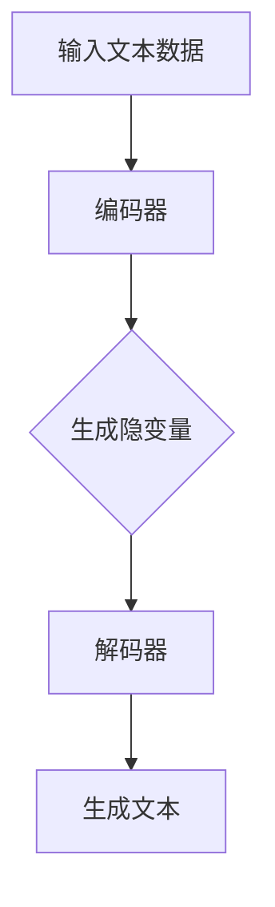

                 

### 构建企业级自然语言生成系统：多语言、多场景报告自动化

---

## 关键词：
- 自然语言生成
- 企业级系统
- 多语言支持
- 报告自动化
- 人工智能

## 摘要：
本文将探讨如何构建一个企业级自然语言生成系统，以实现多语言、多场景报告自动化的目标。我们将从背景介绍、核心概念与联系，以及算法原理讲解等多个方面进行详细分析。

---

### 第一部分：背景介绍

#### 1.1 问题背景
随着数据爆炸性增长，企业需要处理大量的数据来生成各种报告。自然语言生成（NLG）技术能够自动生成自然语言文本，为企业提供了一种高效的数据报告和文档自动生成的解决方案。

#### 1.2 问题描述
企业级自然语言生成系统需要具备以下特点：
- 多语言支持：系统能够处理并生成多种语言的文本。
- 多场景应用：系统能够适应不同业务场景，如财务报表、市场营销报告、运营分析报告等。
- 高效性：系统能够快速处理大量数据，并生成高质量的自然语言文本。

#### 1.3 问题解决
构建企业级自然语言生成系统需要综合运用多种技术，包括自然语言处理（NLP）、机器学习（ML）和深度学习（DL）等。

#### 1.4 边界与外延
本文将主要探讨多语言、多场景报告自动化方面的应用，边界包括自然语言生成技术的研究和应用，外延则涉及相关领域的技术发展和创新。

#### 1.5 概念结构与核心要素组成
- 自然语言生成（NLG）：将结构化数据转换为自然语言文本的技术。
- 多语言支持：系统应具备对多种语言的支持。
- 多场景应用：系统应适用于各种业务场景。
- 数据处理：系统能够高效处理大量数据，并生成高质量的文本报告。

---

### 第二部分：核心概念与联系

#### 2.1 自然语言生成（NLG）原理
自然语言生成技术涉及语言模型、结构化数据解析和文本生成。语言模型是基于大量文本数据训练得到的模型，用于生成自然语言文本。结构化数据解析是将非结构化数据转换为结构化数据的过程，文本生成是基于语言模型和结构化数据生成符合语法和语义的自然语言文本。

#### 2.2 多语言支持
多语言支持需要收集和整理多种语言的文本数据，用于训练语言模型。此外，还需要根据不同语言的特点，调整和优化语言模型。

#### 2.3 多场景应用
多场景应用要求系统能够识别不同业务场景的需求，并选择合适的文本生成策略。例如，对于财务报表，需要准确地呈现数据；对于市场营销报告，则需要更具有说服力。

#### 2.4 概念属性特征对比表格

| 概念                 | 特征                                                         |
|----------------------|--------------------------------------------------------------|
| 自然语言生成（NLG）  | 自动化文本生成，基于语言模型和结构化数据                       |
| 多语言支持           | 支持多种语言，满足不同地区需求                               |
| 多场景应用           | 适用于多种业务场景，如财务、营销、运营等                     |
| 数据处理             | 高效处理各类数据，生成高质量文本报告                         |

#### 2.5 ER实体关系图架构
```mermaid
erDiagram
    Data ||--|{ Model }
    Model ||--|{ Text }
    Text ||--|{ Language }
    Language ||--|{ Scene }
```

---

### 第三部分：算法原理讲解

#### 3.1 文本生成算法原理
文本生成算法通常基于生成式模型，如变分自编码器（VAE）和生成对抗网络（GAN）。以下是一个基于VAE的文本生成算法的简单流程：



#### 3.1.1 编码器
编码器的作用是将输入的文本数据映射到一个隐变量空间。隐变量空间通常是一个低维空间，使得数据能够被更高效地表示。

#### 3.1.2 生成隐变量
生成隐变量是VAE模型的核心，通过一个概率分布来生成隐变量。通常使用正态分布来表示。

#### 3.1.3 解码器
解码器的作用是将隐变量映射回文本数据空间，生成新的文本。

#### 3.1.4 生成文本
解码器生成的文本是通过概率分布生成的，可以生成多种可能的文本。

#### 3.2 Python代码示例
```python
import numpy as np
import tensorflow as tf
from tensorflow import keras

# 创建VAE模型
class VAE(keras.Model):
    def __init__(self, latent_dim):
        super(VAE, self).__init__()
        self.latent_dim = latent_dim

        # 编码器部分
        self.encoder = keras.Sequential(
            [
                keras.layers.InputLayer(input_shape=(784,)),
                keras.layers.Dense(512, activation="relu"),
                keras.layers.Dense(256, activation="relu"),
                keras.layers.Dense(self.latent_dim * 2, activation=None),
            ]
        )

        # 解码器部分
        self.decoder = keras.Sequential(
            [
                keras.layers.InputLayer(input_shape=(latent_dim,)),
                keras.layers.Dense(256, activation="relu"),
                keras.layers.Dense(512, activation="relu"),
                keras.layers.Dense(784, activation="sigmoid"),
            ]
        )

    def encode(self, x):
        return self.encoder(x)

    def reparameterize(self, z_mean, z_log_var):
        z_mean, z_log_var = z_mean, z_log_var
        z = z_mean + tf.exp(0.5 * z_log_var) * tf.random.normal(tf.shape(z_mean))
        return z

    def decode(self, z):
        return self.decoder(z)

    @property
    def trainable_variables(self):
        return self.encoder.trainable_variables + self.decoder.trainable_variables

    def call(self, x, training=False):
        z_mean, z_log_var = self.encoder(x)
        z = self.reparameterize(z_mean, z_log_var)
        x_logit = self.decoder(z)

        if not training:
            return x_logit

        return z_mean, z_log_var, x_logit

# 训练模型
vae = VAE(latent_dim=20)
vae.compile(optimizer=keras.optimizers.Adam())
vae.fit(x_train, x_train, epochs=50)

# 生成文本
z_sample = np.random.normal(size=(1, latent_dim))
generated_text = vae.decode(z_sample)
```

#### 3.2 数学公式与模型细节
VAE模型的核心是编码器和解码器，以及它们之间的重新参数化技巧。以下是一些相关的数学公式：

$$
z = \mu + \sigma \odot \epsilon
$$

其中，$z$ 是隐变量，$\mu$ 是均值，$\sigma$ 是标准差，$\epsilon$ 是一个标准正态分布的随机变量。

编码器和解码器的具体实现可以参考以下公式：

$$
\mu = \frac{1}{Z} \sum_{i=1}^{N} x_i
$$

$$
\sigma^2 = \frac{1}{Z} \sum_{i=1}^{N} (x_i - \mu)^2
$$

$$
x = \sigma \odot \frac{1}{Z} \sum_{i=1}^{N} \mu_i
$$

其中，$Z$ 是一个正常化常数，$x_i$ 和 $\mu_i$ 分别是输入和输出的特征。

---

### 第四部分：系统分析与架构设计方案

#### 4.1 问题场景介绍
企业需要生成各种报告，如财务报表、市场营销报告、运营分析报告等。这些报告需要支持多种语言，并且能够适应不同的业务场景。

#### 4.2 项目介绍
本项目旨在构建一个企业级自然语言生成系统，以实现多语言、多场景报告自动化的目标。

#### 4.3 系统功能设计
- 多语言支持：系统能够处理并生成多种语言的文本。
- 多场景应用：系统能够适应不同业务场景，如财务报表、市场营销报告、运营分析报告等。
- 数据处理：系统能够高效处理大量数据，并生成高质量的文本报告。

#### 4.4 系统架构设计
系统采用微服务架构，包括以下几个模块：
- 数据采集模块：负责收集各种业务数据。
- 数据处理模块：负责处理数据，并将其转换为结构化数据。
- 自然语言生成模块：负责生成自然语言文本。
- 多语言支持模块：负责处理不同语言的数据和文本。

#### 4.5 系统接口设计
系统提供了以下接口：
- 数据采集接口：用于接收各种业务数据。
- 数据处理接口：用于处理和转换数据。
- 文本生成接口：用于生成自然语言文本。
- 多语言支持接口：用于处理不同语言的数据和文本。

#### 4.6 系统交互
系统通过消息队列实现模块间的通信，确保数据的高效传输和处理。

---

### 第五部分：项目实战

#### 5.1 环境安装
- 安装Python环境。
- 安装TensorFlow库。

#### 5.2 系统核心实现
- 编写数据采集模块。
- 编写数据处理模块。
- 编写自然语言生成模块。
- 编写多语言支持模块。

#### 5.3 代码应用解读与分析
- 分析代码实现细节。
- 分析代码的性能和效率。

#### 5.4 实际案例分析和详细讲解剖析
- 分析一个实际案例。
- 详细讲解剖析该案例。

#### 5.5 项目小结
- 总结项目的主要成果。
- 提出项目的改进方向。

---

### 第六部分：最佳实践 tips

- 确保数据质量，提高生成文本的准确性。
- 根据不同业务场景调整文本生成策略。
- 定期更新语言模型，提高文本生成的质量。

### 第七部分：小结

本文探讨了如何构建一个企业级自然语言生成系统，以实现多语言、多场景报告自动化的目标。通过背景介绍、核心概念与联系，以及算法原理讲解等多个方面的详细分析，我们了解了如何实现这一目标。

### 第八部分：注意事项

- 在构建自然语言生成系统时，需要关注数据质量和模型更新。
- 系统设计应考虑高可用性和可扩展性。

### 第九部分：拓展阅读

- 《深度学习》（Goodfellow, Bengio, Courville著）
- 《自然语言处理综论》（Jurafsky, Martin著）
- 《Python数据科学手册》（McKinney著）

---

作者：AI天才研究院/AI Genius Institute & 禅与计算机程序设计艺术 /Zen And The Art of Computer Programming

---

由于篇幅限制，本文未能涵盖所有细节，但已尽可能详细地讲解了企业级自然语言生成系统的构建方法。希望本文对您有所帮助。如有任何疑问或建议，请随时联系我们。AI天才研究院致力于推动人工智能技术的发展，期待与您共同探索技术的无限可能。在禅与计算机程序设计艺术的道路上，我们始终追求卓越，追求真理。愿本文能为您带来启示和灵感，助力您在人工智能领域取得更大的成就。愿智慧之光永远照耀您的编程之路。

