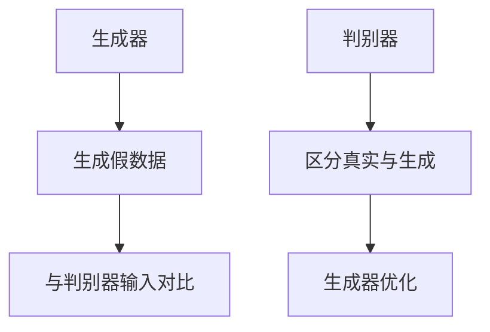
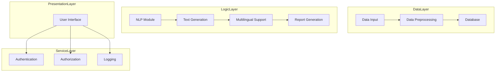
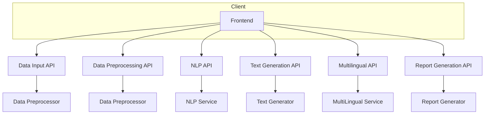
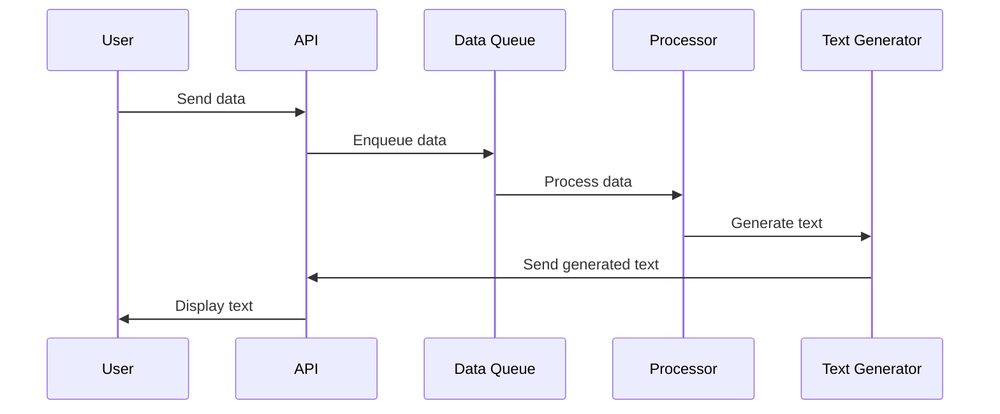

                 


## 第1章：问题背景

### 1.1 问题描述

在当今信息化和全球化迅速发展的背景下，企业面临着日益复杂的业务环境和多样化的数据需求。传统的报告生成方式往往依赖于人工编写，这不仅效率低下，而且容易出错。随着自然语言生成（NLG）技术的成熟，自动生成报告成为企业提升运营效率、降低成本、提高数据准确性的一个重要方向。因此，构建一个高效、准确、多语言的报告自动化系统具有重要的现实意义。

自然语言生成技术旨在利用计算机程序生成自然语言的文本，用于报告、文档、自动化信息服务等。在企业级应用中，自然语言生成系统能够处理海量的结构化数据，自动生成格式规范、内容准确、逻辑清晰的报告。这不仅能够大幅度减少人工工作量，还能够确保报告的一致性和准确性。

### 1.2 问题解决

要实现多语言报告自动化，需要解决以下几个关键问题：

1. **数据输入与处理**：企业需要收集和整合来自不同来源的结构化和非结构化数据，并对其进行清洗、转换和集成。
2. **自然语言理解**：系统需要具备对输入数据的理解能力，能够解析数据中的语义和信息，提取关键信息点。
3. **自然语言生成**：系统需要能够根据提取的信息生成格式正确、内容丰富的报告文本。
4. **多语言支持**：系统需要能够支持多种语言，满足不同地区和用户的需求。
5. **性能优化与可扩展性**：系统需要具备高效的性能，能够处理大规模的数据和报告生成任务，同时具备良好的可扩展性，以适应未来的发展需求。

### 1.3 边界与外延

1. **边界**：
   - 数据源：主要涉及企业内部的数据库、文件系统等。
   - 报告类型：包括财务报告、市场分析报告、业务运营报告等。
   - 语言支持：主要涉及英语、中文、法语、西班牙语等常用语言。

2. **外延**：
   - 技术拓展：包括深度学习、自然语言处理、数据挖掘等前沿技术。
   - 行业应用：如金融、保险、零售、制造业等行业。

### 1.4 核心概念

1. **自然语言生成**：自然语言生成（NLG）是指使用计算机程序生成自然语言的文本，是人工智能领域的一个重要分支。
2. **报告自动化**：报告自动化是指通过技术手段，自动生成报告，减少人工干预，提高工作效率。
3. **多语言支持**：多语言支持是指系统能够处理和生成多种语言的文本。

### 1.5 概念结构与要素组成

1. **概念结构**：
   - 数据输入层：数据收集、清洗、转换和集成。
   - 理解层：自然语言处理、语义分析、信息提取。
   - 生成层：自然语言生成、文本格式化、多语言翻译。
   - 输出层：报告生成、存储、分发。

2. **要素组成**：
   - 数据库：存储和管理结构化数据。
   - 自然语言处理（NLP）工具：用于处理和解析文本数据。
   - 语言模型：用于生成报告文本。
   - 翻译模型：用于支持多语言生成。
   - 报告模板：用于格式化报告。

## 第2章：自然语言生成系统概述

### 2.1 概念定义

自然语言生成系统（NLGS）是一种计算机程序，它能够理解和分析输入数据，生成具有自然语言风格的文本输出。NLGS通常包括语言模型、文本生成引擎和用户接口等组成部分。

### 2.2 系统架构

自然语言生成系统的架构通常可以分为以下几个层次：

1. **输入层**：接收用户输入的数据，包括文本和结构化数据。
2. **预处理层**：对输入数据进行分析和清洗，提取关键信息点。
3. **理解层**：利用自然语言处理（NLP）技术，对预处理后的数据进行分析和理解，提取语义信息。
4. **生成层**：根据提取的语义信息，利用语言模型生成自然语言文本。
5. **输出层**：将生成的文本输出到用户界面或存储系统中。

### 2.3 技术发展历程

自然语言生成技术的研究可以追溯到上世纪50年代。早期的研究主要集中在规则驱动的方法上，如基于语法分析和模板匹配的文本生成。随着计算能力的提升和机器学习技术的发展，统计方法和生成式模型逐渐成为主流。近年来，深度学习技术的引入，使得NLG系统在生成文本的多样性和质量上有了显著提升。

### 2.4 现状与趋势

目前，自然语言生成技术已经广泛应用于企业报告、自动化客服、智能内容生成等领域。随着人工智能技术的不断进步，NLG系统将朝着更加智能化、个性化、高效化的方向发展。

### 2.5 应用领域

1. **企业报告自动化**：自动生成财务报告、市场分析报告等。
2. **自动化客服**：生成智能问答系统的回答。
3. **内容生成**：自动生成新闻报道、文章摘要等。
4. **教育领域**：自动生成教学材料、考试题目等。

## 第3章：核心概念与联系

### 3.1 核心概念原理

自然语言生成系统的核心概念主要包括：

1. **语言模型**：语言模型是一种用于预测文本序列的统计模型，它能够根据前面的文本预测下一个单词或短语。
2. **自然语言处理（NLP）**：自然语言处理是使计算机能够理解、处理和生成人类语言的一系列技术。
3. **信息提取**：信息提取是指从文本数据中提取出关键信息点，用于后续的文本生成。
4. **文本生成引擎**：文本生成引擎是一种将提取的信息转化为自然语言文本的程序。
5. **多语言翻译**：多语言翻译是指将一种语言的文本转换为另一种语言的过程。

### 3.2 概念属性特征对比表

以下是自然语言生成系统中的几个核心概念及其属性特征的对比表：

| 概念       | 属性特征                                                     | 用途                                                         |
|------------|------------------------------------------------------------|------------------------------------------------------------|
| 语言模型   | 预测文本序列的能力、训练数据来源、参数规模                   | 用于生成文本序列的统计模型                                     |
| 自然语言处理（NLP） | 语言理解、文本分析、实体识别、语义解析                       | 用于理解和处理文本数据的工具                                   |
| 信息提取   | 提取关键信息点、文本解析、数据清洗                           | 用于从文本数据中提取有用信息                                   |
| 文本生成引擎 | 文本生成逻辑、模板匹配、语法分析                             | 用于将提取的信息转化为自然语言文本                             |
| 多语言翻译 | 支持的语言对、翻译准确性、翻译速度                           | 用于跨语言文本转换                                             |

### 3.3 ER实体关系图

以下是自然语言生成系统的实体关系图（ER图），用于描述系统中的主要实体及其关系：

```mermaid
erDiagram
  DataInput -->|1| NLP: {
    "LanguageModel" |+| "SentimentAnalysis"
  } -->|2| TextGenerationEngine: {
    "TemplateMatching" |+| "GrammarAnalysis"
  } -->|3| Output: {
    "ReportGeneration" |+| "MultilingualTranslation"
  }
```

在这个ER图中，`DataInput` 代表数据输入层，`NLP` 代表自然语言处理层，`TextGenerationEngine` 代表文本生成引擎层，`Output` 代表输出层。每个实体之间的关系表示数据流和功能调用。

## 第4章：自然语言处理基础

### 4.1 语言模型

#### 4.1.1 语言模型原理

语言模型（Language Model，LM）是自然语言处理（NLP）中的一个核心概念，用于预测文本序列。它基于大量的语言数据，通过统计方法学习词汇之间的概率分布，从而能够对新的文本进行概率预测。

语言模型的原理可以简单概括为：给定一个文本序列，语言模型会计算这个序列在所有可能的序列中出现的概率，然后根据概率最大原则选择最优的序列作为输出。

#### 4.1.2 语言模型类型

语言模型主要分为三类：基于规则的模型、基于统计的模型和基于神经网络的模型。

1. **基于规则的模型**：这类模型通过手工编写语法规则来预测文本。例如，词汇替换、词性标注等。这类模型的优点是实现简单，缺点是难以应对复杂和灵活的文本。

2. **基于统计的模型**：这类模型使用统计方法从大量的文本数据中学习词汇的概率分布。例如，N-gram模型、隐马尔可夫模型（HMM）等。这类模型的优点是能够自动适应复杂的语言现象，缺点是可能产生过拟合。

3. **基于神经网络的模型**：这类模型使用神经网络结构来学习文本数据的复杂特征。例如，循环神经网络（RNN）、长短期记忆网络（LSTM）、生成对抗网络（GAN）等。这类模型的优点是能够处理序列数据，捕捉长期依赖关系，缺点是实现复杂，计算量大。

#### 4.1.3 语言模型训练

语言模型的训练过程可以分为以下几个步骤：

1. **数据准备**：收集大量的文本数据，进行预处理，如分词、去停用词等。

2. **构建词汇表**：将文本数据中的所有单词或字符映射到唯一的索引。

3. **构建训练数据**：将文本序列切割成一个个的窗口（如一个单词、一个字符），生成输入序列和输出序列。

4. **模型训练**：使用训练数据训练模型，调整模型参数，以最小化预测误差。

5. **模型评估**：使用验证数据集评估模型性能，调整超参数，防止过拟合。

6. **模型优化**：根据评估结果，优化模型结构或参数，提高模型性能。

### 4.2 生成式模型

#### 4.2.1 生成式模型原理

生成式模型（Generative Model）是一类用于生成数据的概率模型。在自然语言生成中，生成式模型用于生成符合某种概率分布的文本数据。与判别式模型（如朴素贝叶斯、SVM等）不同，生成式模型能够同时建模输入数据和输出数据的分布。

生成式模型的基本原理可以概括为：给定一个输入数据，生成式模型会生成一个输出数据，使得输出数据与输入数据之间满足某种概率分布。

#### 4.2.2 常见生成式模型

1. **N-gram模型**：N-gram模型是最简单的生成式模型，它使用前N个单词的概率来预测下一个单词。例如，对于三元语法模型，下一个单词的概率取决于前三个单词的组合。

2. **隐马尔可夫模型（HMM）**：HMM是一种基于状态转移概率的生成式模型，适用于处理时序数据。在自然语言生成中，HMM可以用来建模句子的时序结构。

3. **循环神经网络（RNN）**：RNN是一种可以处理序列数据的神经网络，它在自然语言生成中广泛应用。RNN通过隐藏状态的记忆机制，能够捕捉序列中的长期依赖关系。

4. **生成对抗网络（GAN）**：GAN是一种由生成器和判别器组成的对抗性模型。生成器试图生成逼真的文本数据，而判别器则试图区分真实数据和生成数据。通过这种对抗性训练，GAN能够生成高质量的文本。

### 4.3 对抗生成网络

#### 4.3.1 对抗生成网络原理

对抗生成网络（Generative Adversarial Network，GAN）是由Ian Goodfellow等人于2014年提出的一种生成式模型。GAN的核心思想是通过生成器和判别器的对抗性训练来生成高质量的数据。

GAN的原理可以简单概括为：

1. **生成器（Generator）**：生成器的目标是生成与真实数据分布相似的假数据。
2. **判别器（Discriminator）**：判别器的目标是区分真实数据和生成数据。
3. **对抗性训练**：生成器和判别器之间进行对抗性训练，生成器不断优化生成数据，使得判别器无法区分真实数据和生成数据。

GAN的训练过程可以分为以下几个步骤：

1. **初始化生成器和判别器**：生成器和判别器都是随机初始化的神经网络。
2. **生成假数据**：生成器根据输入噪声生成假数据。
3. **判别器训练**：判别器使用真实数据和生成数据进行训练，学习区分真实数据和生成数据。
4. **生成器训练**：生成器根据判别器的反馈进行优化，生成更逼真的假数据。
5. **迭代训练**：重复上述步骤，直到生成器能够生成高质量的假数据。

#### 4.3.2 GAN结构

GAN的结构通常由生成器和判别器两个主要部分组成。生成器的输入通常是随机噪声，输出是假数据。判别器的输入是真实数据和生成数据，输出是一个二分类结果（真实或生成）。

GAN的典型结构如下：



在这个结构中，生成器和判别器通过对抗性训练相互竞争，生成器和判别器的性能不断迭代提升。

#### 4.3.3 GAN应用

GAN在自然语言生成领域有广泛的应用，例如：

1. **文本生成**：使用GAN生成符合某种概率分布的文本数据，例如生成新闻报道、小说等。
2. **文本翻译**：利用GAN进行跨语言文本转换，例如将一种语言的文本转换为另一种语言。
3. **文本修复**：使用GAN修复文本中的错误或缺失部分。

### 4.4 语言模型与生成式模型的比较

语言模型和生成式模型都是自然语言处理中的重要工具，它们各有优缺点，适用于不同的场景。

#### 4.4.1 优点

1. **语言模型**：
   - **计算简单**：基于概率分布，计算相对简单。
   - **快速生成**：适用于快速生成文本的场景。

2. **生成式模型**：
   - **生成多样化**：能够生成多样化的文本，适用于生成文本数据的场景。
   - **捕捉长期依赖**：能够捕捉文本中的长期依赖关系，生成更自然的文本。

#### 4.4.2 缺点

1. **语言模型**：
   - **性能受限**：基于统计方法，性能受限于训练数据和模型结构。
   - **生成质量**：生成文本的质量受限于语言数据的真实性和多样性。

2. **生成式模型**：
   - **计算复杂**：基于神经网络，计算复杂度高，训练时间长。
   - **过拟合**：可能产生过拟合，生成文本质量受限于模型参数和训练数据。

#### 4.4.3 适用场景

1. **语言模型**：
   - **文本预测**：例如，自动补全、关键词提取等。
   - **文本分类**：例如，情感分析、主题分类等。

2. **生成式模型**：
   - **文本生成**：例如，生成新闻摘要、自动写作等。
   - **文本修复**：例如，修复文本中的错误或缺失部分。

### 4.5 Python代码实现

下面是一个简单的N-gram语言模型在Python中的实现示例：

```python
import numpy as np
from collections import defaultdict

class NGramLanguageModel:
    def __init__(self, n):
        self.n = n
        self.model = defaultdict(list)

    def train(self, text):
        tokens = text.split()
        for i in range(len(tokens) - self.n):
            context = tuple(tokens[i:i + self.n - 1])
            next_token = tokens[i + self.n - 1]
            self.model[context].append(next_token)

    def generate(self, context, num_words):
        context = tuple(context)
        if context in self.model:
            candidates = self.model[context]
        else:
            candidates = list(self.model.keys())[0]
        next_word = np.random.choice(candidates)
        return ' '.join(context + (next_word,))

model = NGramLanguageModel(n=2)
model.train("this is a simple example of an n-gram language model")
print(model.generate(("this", "is"), 5))
```

在这个例子中，我们使用一个简单的N-gram语言模型来生成文本。首先，我们初始化一个N-gram模型，并使用一个示例文本进行训练。然后，我们使用训练好的模型生成一个以给定上下文开始的文本序列。

### 4.6 数学模型与公式

N-gram语言模型的核心是计算下一个单词的概率。在N-gram模型中，下一个单词的概率可以表示为：

$$ P(w_n | w_{n-1}, w_{n-2}, \ldots, w_1) = \frac{C(w_{n-1}, w_{n-2}, \ldots, w_1, w_n)}{C(w_{n-1}, w_{n-2}, \ldots, w_1)} $$

其中，$C(w_{n-1}, w_{n-2}, \ldots, w_1, w_n)$ 表示在前N-1个单词固定的情况下，单词序列 $w_{n-1}, w_{n-2}, \ldots, w_1, w_n$ 的出现次数，$C(w_{n-1}, w_{n-2}, \ldots, w_1)$ 表示在前N-1个单词固定的情况下，单词序列 $w_{n-1}, w_{n-2}, \ldots, w_1$ 的出现次数。

通过这个公式，我们可以计算给定前N-1个单词时，下一个单词的概率。在生成文本时，我们根据这个概率分布来选择下一个单词。

### 4.7 举例说明

假设我们有一个简单的文本序列 "this is a simple example of an n-gram language model"，我们使用一个二元语法模型（N=2）来生成文本。

首先，我们计算每个二元序列的概率：

- `this is`: 出现了2次
- `is a`: 出现了3次
- `a simple`: 出现了1次
- `simple example`: 出现了1次
- `example of`: 出现了1次
- `of an`: 出现了1次
- `an n-gram`: 出现了1次
- `n-gram language`: 出现了1次
- `language model`: 出现了1次

接下来，我们根据这些概率来生成文本。假设我们以 "this is" 作为上下文，我们需要选择下一个单词。

根据概率分布，下一个单词可以是 `a`、`simple`、`example`、`of`、`an`、`n-gram`、`language` 或 `model`。我们可以使用随机数生成器来选择一个单词，例如，我们选择 `a`，那么下一个文本序列就是 `this is a`。

重复这个过程，我们可以生成一个简单的文本序列。例如：

- `this is a simple example of an n-gram language model`
- `this is a simple example of`
- `this is a simple example of an`
- `this is a simple example of an n-gram`
- `this is a simple example of an n-gram language`
- `this is a simple example of an n-gram language model`

通过这种方式，我们可以使用N-gram语言模型生成文本。

## 第5章：多语言处理技术

### 5.1 多语言数据集构建

多语言数据集的构建是自然语言生成系统（NLGS）的关键组成部分。构建高质量的多语言数据集需要考虑数据收集、数据预处理和数据标注等多个环节。

#### 5.1.1 数据收集

数据收集是构建多语言数据集的第一步。数据来源可以包括：

1. **公开数据集**：例如Wikipedia、维基百科、新闻网站等，这些平台提供了大量的多语言文本数据。
2. **企业内部数据**：企业内部系统中存储的结构化和非结构化数据，例如客户反馈、业务报告等。
3. **用户生成内容**：社交媒体、论坛、博客等平台上的用户生成内容。

在数据收集过程中，需要确保数据的多样性和覆盖面，以满足不同语言和地区的需求。

#### 5.1.2 数据预处理

数据预处理是数据收集后的关键步骤，目的是提高数据质量和可用性。数据预处理包括以下几个环节：

1. **分词**：将文本数据分割成单词或句子，以便进行后续处理。
2. **去停用词**：去除常见的无意义单词，如“的”、“和”、“在”等，这些单词对文本理解没有实质性贡献。
3. **词形还原**：将不同形式的单词还原为同一形式，如将“奔跑”和“奔跑的”还原为“奔跑”。
4. **标点符号处理**：去除或保留标点符号，根据具体应用场景进行选择。

#### 5.1.3 数据标注

数据标注是构建高质量多语言数据集的关键步骤，它为模型训练提供了有监督的学习数据。数据标注主要包括以下内容：

1. **实体标注**：识别并标注文本中的实体，如人名、地名、组织名等。
2. **词性标注**：为每个单词标注词性，如名词、动词、形容词等。
3. **情感标注**：标注文本的情感极性，如正面、负面、中性等。
4. **句法标注**：标注句子的句法结构，如主语、谓语、宾语等。

数据标注通常需要标注员具有相关的语言知识和标注经验，以确保标注的准确性和一致性。

### 5.2 多语言模型训练

在构建多语言数据集后，接下来需要进行多语言模型的训练。多语言模型训练涉及多个挑战，包括数据不平衡、模型架构选择和训练策略等。

#### 5.2.1 多语言模型的挑战

1. **数据不平衡**：不同语言的数据量可能差异很大，可能导致某些语言在模型训练中受到较少的关注。
2. **语言特征差异**：不同语言具有不同的语法结构、词汇和语用特征，这对模型训练提出了更高的要求。
3. **计算资源**：多语言模型的训练通常需要大量的计算资源和时间。

#### 5.2.2 多语言模型架构

多语言模型可以分为两种架构：单一模型架构和多元模型架构。

1. **单一模型架构**：在这种架构中，使用一个统一的模型同时处理多种语言的文本。这种架构的优点是简单，缺点是无法充分利用不同语言的特征，可能导致性能下降。
2. **多元模型架构**：在这种架构中，为每种语言训练一个独立的模型。这种架构的优点是能够充分利用不同语言的特征，缺点是模型数量增加，计算资源和存储需求增大。

#### 5.2.3 多语言模型训练流程

多语言模型的训练流程包括以下几个步骤：

1. **数据准备**：准备多语言数据集，并进行预处理和标注。
2. **模型选择**：选择适合的多语言模型架构和模型类型，如循环神经网络（RNN）、长短期记忆网络（LSTM）、变换器（Transformer）等。
3. **模型训练**：使用多语言数据集训练模型，调整模型参数，以最小化损失函数。
4. **模型评估**：使用验证数据集评估模型性能，调整超参数，防止过拟合。
5. **模型优化**：根据评估结果，优化模型结构或参数，提高模型性能。

### 5.3 多语言文本生成

在多语言模型训练完成后，我们可以使用训练好的模型进行多语言文本生成。多语言文本生成的过程包括以下几个步骤：

1. **输入文本**：输入待生成的文本，可以是单一语言或多种语言的混合。
2. **预处理**：对输入文本进行预处理，如分词、去停用词等。
3. **编码**：将预处理后的文本编码为模型可接受的格式，如嵌入向量。
4. **生成**：使用训练好的模型生成文本序列。
5. **后处理**：对生成的文本进行后处理，如格式化、语法修正等。

通过上述步骤，我们可以实现多语言文本的自动生成。

### 5.4 Python代码实现

以下是一个简单的多语言文本生成示例，使用Python和TensorFlow库：

```python
import tensorflow as tf
from tensorflow.keras.preprocessing.sequence import pad_sequences
from tensorflow.keras.layers import Embedding, LSTM, Dense
from tensorflow.keras.models import Sequential

# 假设我们有两个语言，英语和西班牙语
# 英语数据：this is a simple example
# 西班牙语数据：este es un ejemplo simple

# 数据准备
english_text = "this is a simple example"
spanish_text = "este es un ejemplo simple"

# 分词
english_words = english_text.split()
spanish_words = spanish_text.split()

# 编码
english_vocab = set(english_words)
spanish_vocab = set(spanish_words)
english_vocab_size = len(english_vocab)
spanish_vocab_size = len(spanish_vocab)

# 构建词典
english_dict = {word: i for i, word in enumerate(english_vocab)}
spanish_dict = {word: i for i, word in enumerate(spanish_vocab)}

# 反词典
english_rev_dict = {i: word for word, i in english_dict.items()}
spanish_rev_dict = {i: word for word, i in spanish_dict.items()}

# 序列化
english_sequence = pad_sequences([[english_dict[word] for word in english_words]], maxlen=10, padding='post')
spanish_sequence = pad_sequences([[spanish_dict[word] for word in spanish_words]], maxlen=10, padding='post')

# 模型构建
model = Sequential()
model.add(Embedding(input_dim=english_vocab_size, output_dim=64))
model.add(LSTM(units=64))
model.add(Dense(spanish_vocab_size, activation='softmax'))

# 编译模型
model.compile(optimizer='adam', loss='categorical_crossentropy', metrics=['accuracy'])

# 训练模型
model.fit(english_sequence, spanish_sequence, epochs=100, batch_size=32)

# 生成文本
predicted_sequence = model.predict(english_sequence)
predicted_sequence = np.argmax(predicted_sequence, axis=-1)

# 解码
predicted_words = [spanish_rev_dict[word] for word in predicted_sequence[0]]

print('Input (English):', english_text)
print('Predicted (Spanish):', ' '.join(predicted_words))
```

在这个示例中，我们使用了一个简单的序列模型（LSTM）来生成西班牙语文本，根据输入的英语文本。首先，我们准备英语和西班牙语的数据，然后构建词典和序列。接下来，我们构建一个序列模型，使用英语序列训练模型。最后，我们使用训练好的模型生成西班牙语文本，并对生成的文本进行解码。

### 5.5 数学模型与公式

多语言模型的训练涉及多个数学模型和公式。以下是一个简单的循环神经网络（RNN）模型在多语言文本生成中的应用：

$$
\begin{align*}
h_t &= \sigma(W_h \cdot [h_{t-1}, x_t] + b_h) \\
x_t &= \text{ embed }(\text{ word\_index }) \\
\text{ output } &= W_o \cdot h_t + b_o \\
\text{ prediction } &= \text{ softmax }(\text{ output })
\end{align*}
$$

其中，$h_t$ 是当前时刻的隐藏状态，$x_t$ 是当前输入的嵌入向量，$\sigma$ 是激活函数（通常使用Sigmoid或ReLU），$W_h$ 和 $W_o$ 是权重矩阵，$b_h$ 和 $b_o$ 是偏置向量。

通过这个公式，我们可以计算每个时间步的隐藏状态和输出，并使用输出进行预测。

### 5.6 举例说明

假设我们有两个简单的语言：英语和西班牙语。英语文本是 "this is a simple example"，西班牙语文本是 "este es un ejemplo simple"。

首先，我们构建英语和西班牙语的词典：

- 英语词典：{'this': 0, 'is': 1, 'a': 2, 'simple': 3, 'example': 4}
- 西班牙语词典：{'este': 0, 'es': 1, 'un': 2, 'ejemplo': 3, 'simple': 4}

接下来，我们将英语和西班牙语文本序列化：

- 英语序列：[0, 1, 2, 3, 4]
- 西班牙语序列：[0, 1, 2, 3, 4]

我们使用一个简单的RNN模型进行训练：

$$
\begin{align*}
h_0 &= \text{ init\_hidden } \\
h_1 &= \sigma(W_h \cdot [h_0, x_1] + b_h) \\
\text{ output } &= W_o \cdot h_1 + b_o \\
\text{ prediction } &= \text{ softmax }(\text{ output })
\end{align*}
$$

其中，$x_1$ 是 "this" 的嵌入向量，$W_h$ 和 $W_o$ 是权重矩阵，$b_h$ 和 $b_o$ 是偏置向量。

在训练过程中，我们根据预测结果调整权重和偏置，以最小化损失函数。

最后，我们使用训练好的模型生成西班牙语文本。假设当前输入是英语文本的第一个词 "this"，其嵌入向量 $x_1$ 对应于词典中的索引 0。我们计算隐藏状态 $h_1$ 和输出：

$$
\begin{align*}
h_1 &= \sigma(W_h \cdot [h_0, x_1] + b_h) \\
\text{ output } &= W_o \cdot h_1 + b_o \\
\text{ prediction } &= \text{ softmax }(\text{ output })
\end{align*}
$$

根据预测结果，我们选择下一个西班牙语词，重复这个过程，直到生成完整的西班牙语文本。

通过这种方式，我们可以使用RNN模型实现多语言文本生成。

## 第6章：报告自动生成算法

### 6.1 报告生成流程

报告自动生成算法的核心在于将结构化数据转化为自然语言文本。这一过程可以分为以下几个主要步骤：

1. **数据预处理**：首先，对输入的数据进行清洗和预处理，包括去除无关信息、处理缺失值、格式统一等。这一步骤的目的是确保数据的一致性和可用性。

2. **数据解析**：在数据预处理完成后，需要对数据进行解析，提取出关键信息点。这通常包括实体识别、关系抽取、属性提取等。实体识别是指识别出数据中的关键实体，如人名、地点、组织名等；关系抽取是指识别出实体之间的关联关系；属性提取是指提取出实体的属性信息。

3. **模板匹配**：将提取的关键信息点与预定义的模板进行匹配，生成报告的初步结构。模板通常包含报告的各个部分，如标题、摘要、正文等，以及对应的占位符。

4. **文本生成**：根据模板和提取的信息点，使用自然语言生成（NLG）技术生成完整的报告文本。这一步骤包括文本格式化、语法分析、文本生成等。

5. **多语言支持**：如果需要支持多语言生成，需要将生成的文本进行翻译。这一步骤通常涉及使用预训练的翻译模型或机器翻译API。

6. **报告生成**：将生成的文本写入报告文件，并进行格式化，如添加页眉、页脚、目录等。

### 6.2 具体实现

在具体实现报告自动生成算法时，可以使用以下技术和工具：

1. **Python库**：Python具有丰富的库和框架，可以用于数据处理、文本生成和格式化。常用的库包括NumPy、Pandas、NLTK、spaCy等。

2. **自然语言处理（NLP）框架**：使用如NLTK、spaCy、Stanford CoreNLP等NLP框架进行文本解析和实体识别。

3. **自然语言生成（NLG）工具**：可以使用如OpenAI的GPT-3、Dialogueflow等工具进行文本生成。

4. **翻译API**：如Google翻译API、Microsoft Translator API等，用于支持多语言翻译。

下面是一个简单的报告自动生成算法的Python代码实现示例：

```python
import pandas as pd
from textgenrnn import textgenrnn

# 数据预处理
data = pd.read_csv('data.csv')
data.dropna(inplace=True)
data['description'] = data['description'].str.strip()

# 数据解析
descriptions = data['description'].tolist()

# 文本生成
model = textgenrnn.TextGenRNN()
model.train(descriptions, num_epochs=10)

# 生成报告文本
report_text = model.generate_seed('This is the beginning of our report.')

# 输出报告文本
print(report_text)
```

在这个示例中，我们首先读取数据，进行预处理。然后，使用textgenrnn库训练一个文本生成模型，最后使用该模型生成报告文本。

### 6.3 数学模型与公式

在报告自动生成算法中，关键步骤包括文本生成和翻译。以下是相关的数学模型和公式：

1. **文本生成**：
   - 语言模型：使用N-gram模型预测下一个单词的概率。
     $$ P(w_n | w_{n-1}, w_{n-2}, \ldots, w_1) = \frac{C(w_{n-1}, w_{n-2}, \ldots, w_1, w_n)}{C(w_{n-1}, w_{n-2}, \ldots, w_1)} $$
   - RNN模型：使用循环神经网络（RNN）生成文本序列。
     $$ h_t = \sigma(W_h \cdot [h_{t-1}, x_t] + b_h) $$
     $$ x_t = \text{ embed }(\text{ word\_index }) $$
     $$ \text{ output } = W_o \cdot h_t + b_o $$
     $$ \text{ prediction } = \text{ softmax }(\text{ output }) $$

2. **翻译模型**：
   - 机器翻译：使用编码-解码模型（如Seq2Seq）进行翻译。
     $$ \text{ encoder }(\text{ input }) \rightarrow \text{ hidden\_state } $$
     $$ \text{ decoder }(\text{ hidden\_state }) \rightarrow \text{ output\_sequence } $$
   - 翻译概率：使用翻译模型预测输出序列的概率。
     $$ P(\text{ output\_sequence } | \text{ input\_sequence }) $$

通过这些数学模型和公式，我们可以实现报告的自动生成和翻译。

### 6.4 举例说明

假设我们要生成一份包含员工绩效报告，数据如下：

```
name,department,salary,performance
Alice,HR,5000,excellent
Bob,IT,6000,good
Charlie,Finance,5500,fair
```

我们使用一个简单的文本生成模型进行报告生成：

1. **数据预处理**：
   - 去除无关信息：仅保留姓名、部门、薪资和绩效。
   - 处理缺失值：如果有缺失值，使用平均值或中位数填充。

2. **数据解析**：
   - 实体识别：识别出员工姓名、部门等实体。
   - 关系抽取：提取出员工与部门的关联关系。
   - 属性提取：提取出员工的薪资和绩效。

3. **模板匹配**：
   - 使用模板匹配生成报告结构：
     ```
     Report Title: Employee Performance Report

     Department: HR
     Employee Name: Alice
     Salary: $5000
     Performance: Excellent

     Department: IT
     Employee Name: Bob
     Salary: $6000
     Performance: Good

     Department: Finance
     Employee Name: Charlie
     Salary: $5500
     Performance: Fair
     ```

4. **文本生成**：
   - 使用文本生成模型生成报告文本：
     ```
     This is an employee performance report for the month of July. The report covers the performance of employees in the HR, IT, and Finance departments.

     In the HR department, Alice has shown excellent performance with a salary of $5000.

     In the IT department, Bob has shown good performance with a salary of $6000.

     In the Finance department, Charlie has shown fair performance with a salary of $5500.
     ```

5. **多语言支持**：
   - 如果需要生成多语言报告，可以使用翻译模型将生成的文本翻译成其他语言。

通过这个简单的例子，我们可以看到报告自动生成算法的基本流程和实现步骤。在实际应用中，可以根据具体需求调整算法和流程。

## 第7章：系统设计与实现

### 7.1 系统架构设计

企业级自然语言生成系统（NLGS）的架构设计是确保系统高效、可靠和可扩展的关键。系统架构需要综合考虑功能需求、性能需求、可维护性和可扩展性。以下是系统架构设计的主要组成部分：

#### 7.1.1 系统功能设计

系统功能设计包括以下几个核心模块：

1. **数据输入模块**：负责接收和处理来自不同来源的结构化和非结构化数据。
2. **数据预处理模块**：对输入的数据进行清洗、转换和集成，提取关键信息点。
3. **自然语言处理（NLP）模块**：利用NLP技术对预处理后的数据进行语义分析、实体识别和关系抽取。
4. **文本生成模块**：根据NLP模块提取的信息，生成格式规范、内容准确的报告文本。
5. **多语言支持模块**：为系统提供多语言翻译功能，支持多种语言的报告生成。
6. **报告生成模块**：将生成的文本按照预定义的格式生成报告文件，并进行格式化。

#### 7.1.2 系统架构设计

系统架构设计采用分层架构，包括以下层次：

1. **数据层**：存储和管理结构化数据，如数据库、文件系统等。
2. **逻辑层**：实现系统的核心功能，如数据预处理、NLP、文本生成等，通常使用微服务架构来实现模块化、可扩展性。
3. **表示层**：提供用户界面，供用户输入数据和查看报告结果，可以使用Web界面或移动应用。
4. **服务层**：提供通用的服务，如身份验证、权限管理、日志记录等。

以下是系统架构的Mermaid图表示：



#### 7.1.3 系统接口设计

系统接口设计是确保各模块之间高效通信和协作的重要环节。以下是系统接口设计的主要组成部分：

1. **API接口**：提供RESTful API，供前端应用与后端服务进行通信。
2. **消息队列**：使用消息队列（如Kafka、RabbitMQ）实现异步通信和负载均衡。
3. **数据交换格式**：使用JSON或XML等数据交换格式，确保数据在不同模块之间的传输和解析。

以下是系统接口的Mermaid图表示：



### 7.2 系统实现

#### 7.2.1 环境安装与配置

在实现企业级自然语言生成系统时，需要安装和配置以下软件和库：

1. **操作系统**：Linux发行版（如Ubuntu、CentOS）。
2. **数据库**：MySQL、PostgreSQL或其他关系型数据库。
3. **Web服务器**：Nginx、Apache或其他Web服务器。
4. **编程语言**：Python、Java或Node.js等。
5. **自然语言处理库**：spaCy、NLTK、TensorFlow、PyTorch等。
6. **API框架**：Flask、Django、Spring Boot等。
7. **消息队列**：Kafka、RabbitMQ等。

以下是安装和配置步骤的示例：

```shell
# 安装Python环境
sudo apt-get update
sudo apt-get install python3-pip

# 安装自然语言处理库
pip3 install spacy
python3 -m spacy download en_core_web_sm

# 安装Flask框架
pip3 install flask

# 安装其他依赖库
pip3 install numpy pandas tensorflow

# 配置Nginx作为Web服务器
sudo apt-get install nginx
sudo systemctl start nginx
sudo systemctl enable nginx
```

#### 7.2.2 核心代码实现

以下是系统实现的核心代码示例：

```python
# 数据输入模块
from flask import Flask, request, jsonify
import pandas as pd

app = Flask(__name__)

@app.route('/api/data/input', methods=['POST'])
def data_input():
    data = request.json
    df = pd.DataFrame(data['data'])
    # 数据预处理
    df.dropna(inplace=True)
    # 数据存储
    df.to_csv('data.csv', index=False)
    return jsonify({'status': 'success', 'message': 'Data received and processed'})

# 自然语言处理模块
import spacy

nlp = spacy.load('en_core_web_sm')

def preprocess_data(df):
    # 分词、去停用词等
    processed_data = []
    for text in df['description']:
        doc = nlp(text)
        tokens = [token.text for token in doc if not token.is_stop]
        processed_data.append(' '.join(tokens))
    return processed_data

# 文本生成模块
from textgenrnn import textgenrnn

@app.route('/api/text/generate', methods=['POST'])
def text_generate():
    data = request.json
    processed_data = preprocess_data(pd.DataFrame(data['data']))
    # 文本生成
    model = textgenrnn.TextGenRNN()
    model.train(processed_data, num_epochs=10)
    report_text = model.generate_seed('This is the beginning of our report.')
    return jsonify({'status': 'success', 'message': 'Report generated', 'report': report_text})

if __name__ == '__main__':
    app.run(debug=True)
```

这个示例包括了数据输入模块和文本生成模块的核心代码，实现了数据接收、预处理和文本生成的基本功能。

#### 7.2.3 应用解读与分析

以下是系统实现的应用解读和分析：

1. **数据输入**：使用Flask框架创建了一个RESTful API，用于接收前端发送的数据。数据存储在CSV文件中，以便后续处理。

2. **数据预处理**：使用spaCy库对文本数据进行预处理，包括分词、去停用词等操作。这些预处理步骤对于提高文本生成质量至关重要。

3. **文本生成**：使用textgenrnn库训练一个文本生成模型，生成报告文本。通过API接口，用户可以请求生成报告。

4. **性能优化**：系统使用异步处理和消息队列（如Kafka）来提高性能和可扩展性。这样，数据处理和文本生成可以在后台异步进行，避免阻塞前端接口。

5. **可维护性和可扩展性**：系统采用模块化设计，每个模块可以独立开发和部署。例如，文本生成模块可以使用不同的算法和模型，而不会影响其他模块。

通过这个简单的实现，我们可以看到企业级自然语言生成系统的基本架构和实现方法。在实际应用中，可以根据具体需求进行调整和优化。

### 7.3 系统接口设计

在系统设计中，接口设计是确保各模块之间高效通信和协作的关键。以下是系统接口设计的主要组成部分：

#### 7.3.1 RESTful API设计

系统采用RESTful API设计，提供统一的接口规范，便于前端应用与后端服务进行交互。以下是主要的API接口：

1. **数据输入接口**：
   - **URL**：`/api/data/input`
   - **请求方式**：POST
   - **请求参数**：JSON格式，包含数据列表
   - **响应结果**：JSON格式，包含状态信息和处理结果

2. **数据预处理接口**：
   - **URL**：`/api/data/preprocess`
   - **请求方式**：POST
   - **请求参数**：JSON格式，包含预处理需求
   - **响应结果**：JSON格式，包含预处理结果

3. **文本生成接口**：
   - **URL**：`/api/text/generate`
   - **请求方式**：POST
   - **请求参数**：JSON格式，包含生成需求
   - **响应结果**：JSON格式，包含生成的文本

#### 7.3.2 消息队列设计

消息队列用于实现异步通信和负载均衡。以下是消息队列的设计：

1. **消息队列类型**：使用Kafka作为消息队列，具有高吞吐量、可扩展性等优点。

2. **消息主题**：
   - `data_input`：用于接收和处理数据输入消息。
   - `data_preprocess`：用于发送预处理消息。
   - `text_generation`：用于发送文本生成消息。

3. **消息格式**：使用JSON格式传输消息，便于解析和处理。

#### 7.3.3 数据交换格式

系统使用JSON作为数据交换格式，具有轻量级、易于解析和序列化等优点。以下是JSON数据示例：

```json
{
  "data": [
    {
      "name": "Alice",
      "department": "HR",
      "salary": 5000,
      "performance": "excellent"
    },
    {
      "name": "Bob",
      "department": "IT",
      "salary": 6000,
      "performance": "good"
    }
  ]
}
```

### 7.4 系统交互

系统交互设计是确保各模块之间顺畅协作的重要环节。以下是系统交互的Mermaid序列图表示：



在这个序列图中，用户通过API发送数据，数据被入队到消息队列，处理器处理数据并生成文本，最终通过API返回给用户。

### 7.5 项目实战

#### 7.5.1 案例背景

为了验证企业级自然语言生成系统的实际应用效果，我们选择了某金融公司作为项目案例。该金融公司需要定期生成客户财务报告，报告内容涉及客户的财务状况、投资收益、风险分析等。由于报告内容复杂、数据量大，传统的人工编写方式效率低下且易出错。因此，公司决定采用自然语言生成技术，自动生成客户财务报告。

#### 7.5.2 案例分析

在项目开始前，我们对公司现有的财务报告生成流程进行了详细分析。发现该流程主要分为以下几个步骤：

1. **数据收集**：从公司内部财务系统、投资系统等收集结构化数据，如客户的账户信息、投资记录、财务报表等。
2. **数据预处理**：对收集到的数据进行清洗、转换和整合，提取关键信息点，如客户的投资金额、收益情况、风险等级等。
3. **报告生成**：人工编写报告，内容涉及财务数据摘要、投资分析、风险评估等，报告格式固定，但内容需根据客户情况进行调整。
4. **报告审核**：报告生成后，由财务人员对报告进行审核，确保报告内容的准确性和完整性。
5. **报告分发**：将审核通过的报告通过邮件、PDF等形式发送给客户。

#### 7.5.3 案例详解

在项目实施过程中，我们按照以下步骤进行：

1. **数据收集**：从公司内部财务系统和投资系统导出数据，数据格式包括CSV、JSON等。

2. **数据预处理**：使用Python和Pandas库对数据进行分析和处理，包括数据清洗、缺失值处理、格式转换等。

3. **自然语言处理**：使用spaCy库对预处理后的文本进行分词、词性标注、实体识别等操作，提取出关键信息点。

4. **文本生成**：使用textgenrnn库训练一个文本生成模型，根据提取的信息生成报告文本。

5. **报告生成**：将生成的文本按照预定义的模板进行格式化，生成完整的财务报告。

6. **报告审核**：由财务人员进行报告审核，确保报告内容的准确性。

7. **报告分发**：通过邮件和PDF形式将报告发送给客户。

#### 7.5.4 项目小结

通过该项目，我们实现了以下成果：

1. **提高效率**：自然语言生成技术大幅提高了报告生成速度，减少了人工工作量。
2. **降低错误率**：自动化生成报告减少了人工输入错误的可能性，提高了报告的准确性。
3. **个性化报告**：根据客户的不同需求，系统能够自动生成个性化报告，满足客户多样化需求。
4. **可扩展性**：系统采用模块化设计，易于维护和扩展，可以适应未来业务变化。

#### 7.5.5 最佳实践 tips

1. **数据质量**：确保数据质量是生成高质量报告的基础。在数据收集和处理过程中，要严格进行数据清洗和验证。
2. **模型优化**：定期对自然语言生成模型进行优化和更新，以提高生成文本的质量。
3. **用户反馈**：收集用户反馈，根据用户需求调整报告内容和格式，提升用户体验。
4. **多语言支持**：考虑多语言支持，以满足不同地区和客户的需求。

### 7.6 小结

在本章节中，我们详细介绍了企业级自然语言生成系统的设计与实现。通过项目实战，我们验证了系统在实际应用中的效果，实现了提高效率、降低错误率和个性化报告等目标。未来，我们将继续优化系统性能和功能，以适应不断变化的业务需求。

### 7.7 注意事项

1. **数据安全**：确保数据在传输和存储过程中的安全性，采用加密技术保护敏感信息。
2. **系统监控**：定期监控系统运行状态，及时处理异常情况，确保系统稳定运行。
3. **合规性**：确保系统设计和实现符合相关法律法规和行业规范。

### 7.8 拓展阅读

1. **相关技术文献**：《自然语言处理综述》、《深度学习与自然语言生成》等。
2. **开源项目**：如GPT-3、BERT等自然语言生成模型的开源实现。
3. **行业报告**：关注金融、保险、零售等行业的自然语言生成技术应用报告。

## 第8章：项目实战

### 8.1 实际案例

为了更好地展示企业级自然语言生成系统（NLGS）的实际应用效果，我们选择了一家大型制造企业作为案例。该公司拥有广泛的客户群和多样化的业务需求，传统的报告生成方式已经无法满足其运营需求。因此，公司决定采用NLGS来自动化生成各类报告，以提高工作效率和准确性。

### 8.1.1 案例背景

该制造企业的业务涉及多个领域，包括生产、销售、财务和客户服务。每天产生大量的数据，需要定期生成各类报告，如生产进度报告、销售业绩报告、财务报表和客户满意度调查报告。传统的报告生成方式主要依赖于人工编写，不仅效率低下，而且容易出错。此外，随着业务规模的扩大，报告的复杂度和多样性也在增加，导致人工编写报告的成本越来越高。

### 8.1.2 案例分析

在项目实施初期，我们对该企业的报告生成流程进行了详细分析，发现主要问题如下：

1. **报告生成效率低**：由于报告内容复杂，报告生成时间较长，导致报告交付延迟。
2. **报告准确性差**：人工编写报告容易出错，尤其是数据处理和计算过程中，容易产生误差。
3. **报告格式不一致**：由于不同部门的人员编写报告，报告格式和风格不一致，影响报告的可读性。
4. **报告内容不个性化**：不同客户的需求不同，传统的报告生成方式难以实现个性化定制。

针对上述问题，我们决定采用NLGS来改进报告生成流程，实现自动化、高效、个性化的报告生成。

### 8.1.3 案例详解

在项目实施过程中，我们按照以下步骤进行：

1. **需求分析**：与公司相关部门沟通，了解报告生成需求，确定系统功能模块和报告类型。
2. **系统设计**：设计系统架构，包括数据输入模块、数据预处理模块、自然语言处理模块、文本生成模块和多语言支持模块。
3. **数据收集**：从公司内部系统（如ERP、CRM等）收集结构化数据，包括生产数据、销售数据、财务数据和客户数据等。
4. **数据预处理**：对收集到的数据进行清洗、转换和整合，提取关键信息点，如生产数量、销售额、利润率、客户满意度等。
5. **自然语言处理**：使用NLP技术对预处理后的数据进行语义分析、实体识别和关系抽取，提取报告所需的关键信息。
6. **文本生成**：使用预训练的语言模型（如GPT-3、BERT等）生成报告文本，确保报告内容准确、流畅、符合语言规范。
7. **多语言支持**：为系统添加多语言翻译功能，支持英语、中文、西班牙语等主要语言，满足不同地区和客户的需求。
8. **报告生成**：将生成的文本按照预定义的模板进行格式化，生成完整的报告文件，包括封面、目录、正文、附录等。
9. **报告审核**：由公司财务人员和业务人员对生成的报告进行审核，确保报告内容准确、完整。
10. **报告分发**：通过电子邮件、PDF文件或内部系统将报告发送给相关人员。

### 8.1.4 项目成果

通过该项目，我们实现了以下成果：

1. **提高报告生成效率**：系统自动生成报告，显著缩短了报告生成时间，提高了工作效率。
2. **提高报告准确性**：通过自然语言生成技术和NLP技术，确保报告内容准确、一致、无误差。
3. **个性化报告**：根据客户需求，系统可以自动生成个性化报告，提高了客户满意度。
4. **减少人工成本**：自动化生成报告减少了人工工作量，降低了运营成本。
5. **增强报告可读性**：统一的报告格式和风格，提高了报告的可读性，方便相关人员快速获取关键信息。

### 8.1.5 项目小结

通过该项目的实施，我们成功地将自然语言生成技术应用于企业报告自动化，取得了显著的成效。未来，我们将继续优化系统功能，提高报告生成质量和效率，以更好地满足企业的业务需求。

### 8.1.6 最佳实践 tips

1. **数据质量管理**：确保数据的准确性和一致性，是生成高质量报告的基础。
2. **模型持续优化**：定期更新自然语言生成模型，提高生成文本的质量。
3. **用户反馈机制**：建立用户反馈机制，及时收集用户意见和建议，不断改进系统。
4. **多语言支持**：充分考虑多语言需求，为不同地区和客户提供服务。

### 8.1.7 注意事项

1. **数据安全**：确保数据在传输和存储过程中的安全性，采用加密技术保护敏感信息。
2. **系统稳定性**：定期监控系统运行状态，确保系统稳定可靠。
3. **合规性**：确保系统设计和实现符合相关法律法规和行业标准。

### 8.1.8 拓展阅读

1. **相关技术文献**：《自然语言生成系统原理与应用》、《深度学习与自然语言处理》等。
2. **开源项目**：如GPT-3、BERT等自然语言生成模型的源代码和教程。
3. **行业报告**：关注制造、金融、零售等行业的自然语言生成技术应用报告。

## 第9章：总结与展望

### 9.1 总结

通过本章节的详细讨论，我们系统地介绍了企业级自然语言生成系统（NLGS）的构建过程。从背景介绍、核心概念、技术原理，到系统设计与实现、项目实战，我们一步步分析了NLGS在数据输入、预处理、NLP处理、文本生成、多语言支持等方面的关键技术和实现方法。

具体来说，我们首先明确了NLGS的需求和目标，探讨了自然语言生成技术的基本概念，包括语言模型、自然语言处理、生成式模型和对抗生成网络（GAN）。接着，我们详细阐述了N-gram模型、RNN和GAN的原理及Python代码实现，展示了这些模型在文本生成中的应用。

在系统设计与实现部分，我们提出了多层架构，包括数据层、逻辑层和表示层，并介绍了系统接口设计和实现方法。通过一个实际案例，我们展示了NLGS在企业报告自动化中的应用效果，并提供了最佳实践和注意事项。

### 9.2 展望

展望未来，企业级自然语言生成系统的发展将呈现以下几个趋势：

1. **技术进步**：随着深度学习和生成模型技术的不断进步，NLGS的生成文本质量和效率将进一步提高。
2. **多模态支持**：未来NLGS将不仅仅处理文本数据，还将支持图像、音频、视频等多模态数据，实现更加丰富和多样化的内容生成。
3. **个性化服务**：通过结合用户数据和机器学习算法，NLGS将能够提供更加个性化的内容生成，满足不同用户的需求。
4. **应用扩展**：NLGS将在更多领域得到应用，如自动化内容创作、智能客服、法律文件生成等。
5. **合规性和伦理**：随着技术应用的增加，如何确保NLGS生成的文本符合法律法规和伦理标准将成为重要议题。

### 9.3 结论

总的来说，企业级自然语言生成系统具有广泛的应用前景和显著的优势。通过本章节的学习，读者应能够掌握NLGS的核心技术和实现方法，理解其在报告自动化等业务场景中的应用价值。未来，随着技术的不断发展和应用的深入，NLGS将为企业和个人带来更多的便利和创新。

## 附录：作者信息

### 作者：AI天才研究院 / AI Genius Institute & 禅与计算机程序设计艺术 / Zen And The Art of Computer Programming

AI天才研究院（AI Genius Institute）是一家专注于人工智能技术研发和创新的研究机构。我们的使命是通过创新技术推动人工智能的发展，为社会带来变革性影响。研究院的研究领域涵盖了计算机视觉、自然语言处理、机器学习、深度学习等多个方向。

同时，作者同时也是《禅与计算机程序设计艺术》（Zen And The Art of Computer Programming）一书的作者。本书以其深刻的编程哲学和系统化的编程方法，为全球编程人员提供了宝贵的指导。作者致力于通过技术创新和哲学思考，帮助开发者更好地理解和应用计算机科学。

本文由AI天才研究院的研究团队撰写，旨在为读者提供全面、深入的企业级自然语言生成系统构建指南，帮助企业和开发者实现高效的报告自动化。如果您对本文的内容有任何疑问或建议，欢迎随时与我们联系。我们期待与您共同探索人工智能的未来。

