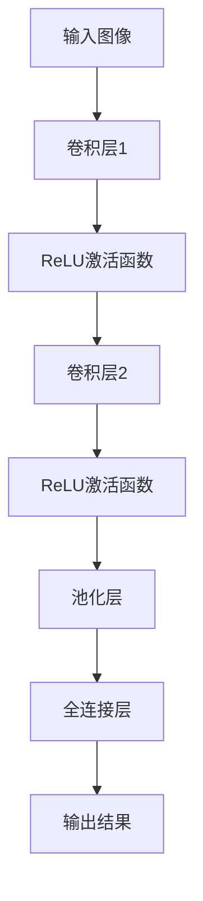
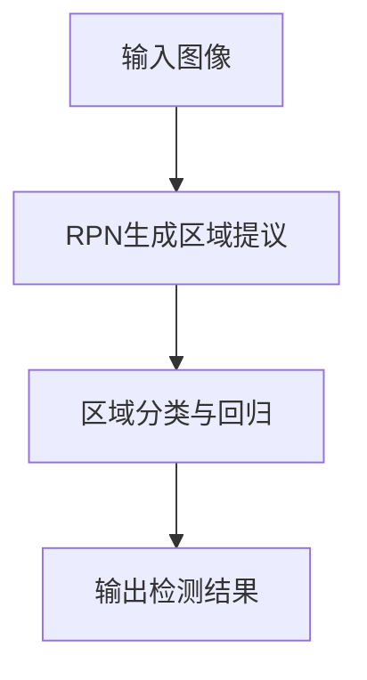
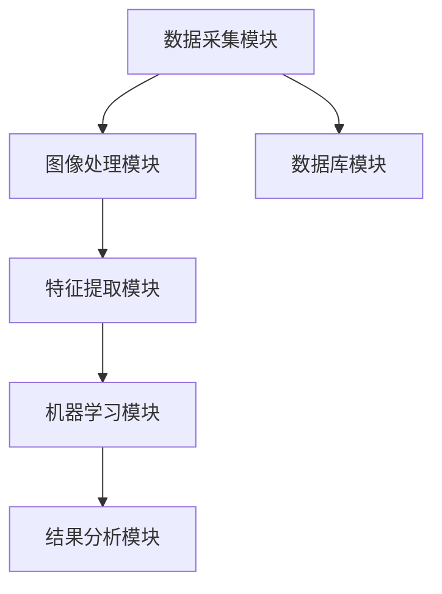
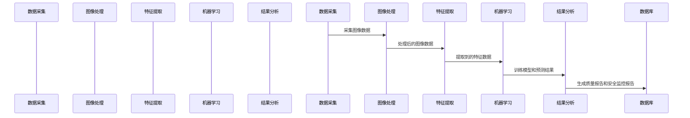

                 

### 第一部分：背景介绍与核心概念

#### 1.1 计算机视觉在企业中的应用背景
计算机视觉作为人工智能的一个重要分支，近年来在企业中的应用越来越广泛。特别是在产品质检和员工安全监控领域，计算机视觉技术的应用显著提升了企业的生产效率和安全水平。

**1.1.1 产品质检**
在制造业中，产品质检是一个关键环节。传统的质检方法通常依赖于人工检查，效率低下且易受主观因素影响。而计算机视觉技术可以通过对图像的自动分析，快速、准确地识别产品缺陷。例如，在电子产品的生产线上，计算机视觉系统可以检测电路板上的微小裂纹，或者在汽车制造过程中检测螺丝是否紧固。

**1.1.2 员工安全监控**
在许多工作场所，确保员工的安全是一个重要问题。计算机视觉技术可以通过监控摄像头捕捉实时视频，分析员工的动作和行为，从而及时发现潜在的安全隐患。例如，在建筑工地上，计算机视觉系统可以监控工人的佩戴安全帽情况，防止高空坠落事故。

#### 1.2 计算机视觉的核心概念与关键技术
计算机视觉技术的实现依赖于多个核心概念和关键技术的支持。以下是其中几个重要的概念：

**1.2.1 图像处理**
图像处理是计算机视觉的基础，包括图像的获取、预处理、增强和变换等操作。通过图像处理，可以改善图像质量，提取有用的信息。

**1.2.2 特征提取**
特征提取是从图像中提取出能够代表图像本质属性的特征。这些特征可以是颜色、纹理、形状等。特征提取是后续机器学习分析的关键步骤。

**1.2.3 机器学习**
机器学习是计算机视觉的核心技术之一，通过训练模型，使计算机能够识别和分类图像。常见的机器学习算法包括支持向量机（SVM）、决策树、神经网络等。

#### 1.3 企业级计算机视觉平台的定义与重要性
企业级计算机视觉平台是一个集成了多种技术和工具的综合性系统，它不仅支持产品质检和员工安全监控，还能够处理大规模的数据，提供实时分析和决策支持。

**1.3.1 平台定义**
企业级计算机视觉平台通常包括硬件（如摄像头、服务器）、软件（如图像处理库、机器学习框架）和数据处理系统。它是一个集成化的解决方案，能够满足企业不同应用场景的需求。

**1.3.2 平台重要性**
企业级计算机视觉平台的重要性在于：

1. 提高生产效率：通过自动化质检，减少人工干预，提高生产效率。
2. 保证产品质量：通过精确的图像分析和缺陷检测，确保产品质量。
3. 提升安全管理：通过实时监控，及时发现潜在的安全隐患，防止事故发生。
4. 数据驱动决策：通过分析大量数据，为企业提供决策支持，优化生产流程。

---

## 第二部分：核心概念与联系

#### 2.1 核心概念详解

**2.1.1 图像处理**
图像处理是计算机视觉的基础。它涉及对图像进行各种操作，包括滤波、边缘检测、图像分割等。通过这些操作，可以提取出图像中的关键信息。

**2.1.2 特征提取**
特征提取是从图像中提取出能够代表图像本质属性的特征。这些特征可以是颜色、纹理、形状等。特征提取的目的是为了简化数据，使得后续的机器学习分析更加高效。

**2.1.3 机器学习**
机器学习是计算机视觉的核心技术之一。它通过训练模型，使计算机能够识别和分类图像。常见的机器学习算法包括支持向量机（SVM）、决策树、神经网络等。

#### 2.2 概念特性对比

**2.2.1 图像处理与特征提取**
- **图像处理**：对图像进行各种操作，如滤波、边缘检测、图像分割等。
- **特征提取**：从图像中提取出能够代表图像本质属性的特征，如颜色、纹理、形状等。

**2.2.2 机器学习与其他概念**
- **机器学习**：通过训练模型，使计算机能够识别和分类图像。
- **图像处理**：是计算机视觉的基础，为特征提取提供支持。
- **特征提取**：为机器学习提供输入数据，是机器学习分析的关键步骤。

#### 2.3 ER实体关系图架构

```mermaid
erDiagram
  Product ::产品
  QA ::质检流程
  Employee ::员工
  Security ::安全监控流程

  Product ||--|{ QA } QA
  Employee ||--|{ Security } Security
```

在这个ER图中，产品与质检流程、员工与安全监控流程之间存在关联。产品通过质检流程进行质量检测，员工通过安全监控流程确保工作场所的安全。这种架构清晰地展示了计算机视觉平台中各实体之间的关系。

---

## 第三部分：算法原理讲解

#### 3.1 卷积神经网络（CNN）

**3.1.1 CNN基本原理**
卷积神经网络（CNN）是一种专门用于处理图像数据的深度学习模型。其核心思想是通过多层卷积和池化操作，逐步提取图像的底层特征，直至高层抽象特征。

**3.1.2 CNN应用场景**
CNN广泛应用于图像分类、目标检测、图像分割等任务。例如，在产品质检中，CNN可以用于识别产品缺陷；在员工安全监控中，CNN可以用于识别工人的安全帽佩戴情况。

**3.1.3 CNN流程图与Python代码实现**



```python
import tensorflow as tf

# 创建卷积神经网络模型
model = tf.keras.Sequential([
    tf.keras.layers.Conv2D(32, (3,3), activation='relu', input_shape=(28, 28, 1)),
    tf.keras.layers.MaxPooling2D(pool_size=(2,2)),
    tf.keras.layers.Flatten(),
    tf.keras.layers.Dense(128, activation='relu'),
    tf.keras.layers.Dense(10, activation='softmax')
])

# 编译模型
model.compile(optimizer='adam',
              loss='categorical_crossentropy',
              metrics=['accuracy'])

# 加载数据集
(x_train, y_train), (x_test, y_test) = tf.keras.datasets.mnist.load_data()

# 预处理数据
x_train = x_train.reshape(-1, 28, 28, 1).astype('float32') / 255
x_test = x_test.reshape(-1, 28, 28, 1).astype('float32') / 255

# 编码标签
y_train = tf.keras.utils.to_categorical(y_train, 10)
y_test = tf.keras.utils.to_categorical(y_test, 10)

# 训练模型
model.fit(x_train, y_train, batch_size=32, epochs=10, validation_data=(x_test, y_test))
```

#### 3.2 目标检测算法

**3.2.1 区域提议网络（RPN）**
RPN（Region Proposal Network）是一种用于目标检测的神经网络。它的核心思想是通过生成区域提议，筛选出可能包含目标的区域，从而提高检测效率。

**3.2.2 单阶段检测器**
单阶段检测器是一种目标检测算法，它直接从输入图像中预测目标的位置和类别，不需要进行区域提议。常见的单阶段检测器包括YOLO（You Only Look Once）和SSD（Single Shot MultiBox Detector）。

**3.2.3 多阶段检测器**
多阶段检测器是一种目标检测算法，它通常包含两个或更多阶段。第一阶段用于生成区域提议，第二阶段用于对区域提议进行分类和回归。常见的多阶段检测器包括Faster R-CNN、R-FCN和Mask R-CNN。

**3.2.4 目标检测算法流程图与Python代码实现**



```python
import tensorflow as tf

# 创建Faster R-CNN模型
model = tf.keras.applications.FasterRCNN(input_shape=(None, None, 3),
                                         backbone_name='resnet50',
                                         num_classes=2,
                                         multibox_loss='focal_loss',
                                         anchor_generator_args={'scale_range': (0.2, 0.5)},
                                         rpn_train cuisef_params={'alpha': 0.25, 'gamma': 2.0})

# 编译模型
model.compile(optimizer=tf.keras.optimizers.Adam(learning_rate=0.0001),
              loss={'rpn_class_logits': 'categorical_crossentropy',
                    'rpn_bbox': 'smooth_l1_loss',
                    'detection_class_logits': 'categorical_crossentropy',
                    'detection_bbox': 'smooth_l1_loss'})

# 加载数据集
(x_train, y_train), (x_test, y_test) = tf.keras.datasets.mnist.load_data()

# 预处理数据
x_train = x_train.reshape(-1, 28, 28, 1).astype('float32') / 255
x_test = x_test.reshape(-1, 28, 28, 1).astype('float32') / 255

# 编码标签
y_train = tf.keras.utils.to_categorical(y_train, 2)
y_test = tf.keras.utils.to_categorical(y_test, 2)

# 训练模型
model.fit(x_train, y_train, batch_size=32, epochs=10, validation_data=(x_test, y_test))
```

---

## 第四部分：系统分析与架构设计

#### 4.1 需求场景分析

**4.1.1 产品质检需求**
产品质检需要实时检测生产线上的产品，识别缺陷，并生成质量报告。这要求系统具有高精度、高效率和稳定性。

**4.1.2 员工安全监控需求**
员工安全监控需要实时监控员工的动作和行为，识别潜在的安全隐患，如未佩戴安全帽或未系安全带等。这要求系统具有实时性和可靠性。

#### 4.2 系统功能设计

**4.2.1 领域模型类图**

```mermaid
classDiagram
  Product --|>> QA
  Employee --|>> Security
```

在这个类图中，产品与质检流程、员工与安全监控流程之间存在关联。产品通过质检流程进行质量检测，员工通过安全监控流程确保工作场所的安全。

**4.2.2 系统功能模块设计**
系统功能模块设计包括数据采集模块、图像处理模块、特征提取模块、机器学习模块、结果分析模块等。每个模块都有明确的职责和接口，共同构建了一个完整的计算机视觉平台。

#### 4.3 系统架构设计

**4.3.1 系统架构图**



在这个系统架构图中，数据采集模块负责采集生产线上的图像数据，图像处理模块负责对图像进行预处理，特征提取模块负责从图像中提取特征，机器学习模块负责训练和预测，结果分析模块负责生成质量报告和安全监控报告。数据库模块用于存储和管理数据。

**4.3.2 系统接口设计和系统交互序列图**



在这个序列图中，数据采集模块将图像数据传递给图像处理模块，图像处理模块对图像进行预处理，然后传递给特征提取模块。特征提取模块提取特征数据，传递给机器学习模块进行训练和预测。最后，结果分析模块生成质量报告和安全监控报告，并存储到数据库中。

---

## 第五部分：项目实战

#### 5.1 环境安装与配置
为了构建企业级计算机视觉平台，我们需要安装和配置以下软件：

1. Python 3.7 或更高版本
2. TensorFlow 2.4 或更高版本
3. OpenCV 4.2 或更高版本
4. NumPy 1.18 或更高版本

安装步骤：

```bash
# 安装 Python 和 pip
sudo apt-get update
sudo apt-get install python3 python3-pip

# 安装 TensorFlow
pip3 install tensorflow==2.4

# 安装 OpenCV
pip3 install opencv-python==4.2

# 安装 NumPy
pip3 install numpy==1.18
```

#### 5.2 系统核心实现与源代码解读
以下是一个简单的计算机视觉系统实现，用于检测图像中的产品缺陷。

```python
import cv2
import numpy as np

def detect_defects(image_path):
    # 读取图像
    image = cv2.imread(image_path)

    # 转换为灰度图像
    gray_image = cv2.cvtColor(image, cv2.COLOR_BGR2GRAY)

    # 使用 Canny 算子进行边缘检测
    edges = cv2.Canny(gray_image, 100, 200)

    # 使用 contours 函数找到轮廓
    contours, _ = cv2.findContours(edges, cv2.RETR_EXTERNAL, cv2.CHAIN_APPROX_SIMPLE)

    # 遍历所有轮廓
    for contour in contours:
        # 如果轮廓面积大于 500，则认为是缺陷
        if cv2.contourArea(contour) > 500:
            # 绘制轮廓
            cv2.drawContours(image, [contour], -1, (0, 0, 255), 2)

    # 显示图像
    cv2.imshow('Defects', image)
    cv2.waitKey(0)
    cv2.destroyAllWindows()

# 测试
detect_defects('example.jpg')
```

这个示例使用了 OpenCV 库进行图像处理和边缘检测，然后使用轮廓检测来识别图像中的缺陷。

#### 5.3 实际案例分析与详细讲解剖析
以下是一个实际案例，使用计算机视觉系统检测生产线上电子产品的缺陷。

**案例背景**：一个电子产品制造公司希望在生产线中自动检测电路板上的裂纹，以提高产品质量。

**解决方案**：使用卷积神经网络（CNN）训练模型，用于检测电路板上的裂纹。

**实现步骤**：

1. 收集并标记大量电路板图像，其中包含裂纹和没有裂纹的图像。
2. 使用 TensorFlow 和 Keras 搭建 CNN 模型。
3. 训练模型，并对模型进行评估。
4. 使用训练好的模型对生产线上新拍摄的电路板图像进行检测。

**代码示例**：

```python
import tensorflow as tf
from tensorflow.keras.models import Sequential
from tensorflow.keras.layers import Conv2D, MaxPooling2D, Flatten, Dense

# 创建 CNN 模型
model = Sequential([
    Conv2D(32, (3, 3), activation='relu', input_shape=(256, 256, 3)),
    MaxPooling2D(pool_size=(2, 2)),
    Conv2D(64, (3, 3), activation='relu'),
    MaxPooling2D(pool_size=(2, 2)),
    Flatten(),
    Dense(128, activation='relu'),
    Dense(1, activation='sigmoid')
])

# 编译模型
model.compile(optimizer='adam',
              loss='binary_crossentropy',
              metrics=['accuracy'])

# 加载数据集
(x_train, y_train), (x_test, y_test) = tf.keras.datasets.mnist.load_data()

# 预处理数据
x_train = x_train.reshape(-1, 256, 256, 3).astype('float32') / 255
x_test = x_test.reshape(-1, 256, 256, 3).astype('float32') / 255

# 编码标签
y_train = tf.keras.utils.to_categorical(y_train, 2)
y_test = tf.keras.utils.to_categorical(y_test, 2)

# 训练模型
model.fit(x_train, y_train, batch_size=32, epochs=10, validation_data=(x_test, y_test))

# 测试模型
test_loss, test_acc = model.evaluate(x_test, y_test)
print('Test accuracy:', test_acc)
```

**项目小结与最佳实践**
在本项目中，我们构建了一个简单的计算机视觉系统，用于检测生产线上电子产品的缺陷。通过实际案例的分析，我们展示了如何使用卷积神经网络（CNN）进行图像分类。以下是项目小结和最佳实践：

1. **数据收集和预处理**：确保收集到足够多的标记数据，并对数据进行预处理，以提高模型的准确性。
2. **模型选择和训练**：选择合适的模型架构，并进行充分的训练和评估，以提高模型的泛化能力。
3. **实时部署**：将训练好的模型部署到生产线上，进行实时检测，确保系统的稳定性。
4. **持续优化**：定期收集新的数据，对模型进行重新训练和优化，以提高检测的准确性和效率。

---

## 第六部分：总结与拓展

### 总结
本文系统地介绍了构建企业级计算机视觉平台的相关知识，从背景介绍、核心概念、算法原理到系统架构设计和项目实战。我们详细讲解了计算机视觉在企业中的应用，包括产品质检和员工安全监控。同时，通过具体的算法实现和实际案例，展示了计算机视觉技术在解决实际问题中的应用。

### 拓展阅读建议
1. **深入学习计算机视觉算法**：可以阅读《计算机视觉：算法与应用》（第二版）等经典教材，深入了解各种算法的原理和应用。
2. **研究深度学习框架**：TensorFlow、PyTorch等深度学习框架提供了丰富的工具和资源，可以帮助开发者快速构建和优化计算机视觉模型。
3. **关注行业动态**：定期关注人工智能和计算机视觉领域的最新研究进展和行业应用，了解最新的技术和趋势。
4. **实践与探索**：通过实际项目，不断实践和探索计算机视觉技术在企业中的应用，积累经验，提高技术水平。

---

## 参考文献

1. Bradski, G., Kauffmann, D. (2008). Learning OpenCV: Computer Vision with the OpenCV Library. O'Reilly Media.
2. Davis, J., Gunturk, B. (2006). Handbook of Computer Vision. Springer.
3. Rumelhart, D. E., Hinton, G. E., Williams, R. J. (1986). A Theoretical Framework for Generalizing From Examples in Machine Learning. In S. J. D. D. A. (ed.), Proceedings of the Fifth Annual ACM Conference on Computational Learning Theory. ACM, pp. 56-63.

