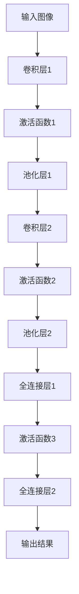
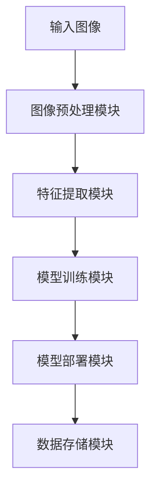
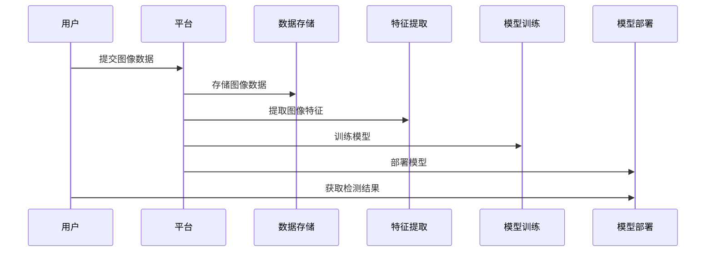

                 

## 《构建企业级计算机视觉平台：从质检到安防的全面应用》

### 关键词：
- 企业级计算机视觉平台
- 质检
- 安防
- 计算机视觉算法
- 数据处理
- 模型优化
- 安全性
- 可靠性

### 摘要：
本文旨在深入探讨企业级计算机视觉平台的构建方法，涵盖从质检到安防的全面应用。通过介绍核心概念、算法原理、系统设计与实现，以及实战案例分析，本文将帮助读者掌握构建高效、安全、可靠的计算机视觉平台所需的知识和技能。

## 第一部分：背景介绍

### 1.1 问题背景

随着人工智能技术的快速发展，计算机视觉已经成为企业级应用的一个重要方向。从质检到安防，计算机视觉技术在提高生产效率、保障公共安全等方面发挥了重要作用。然而，企业级计算机视觉平台的构建面临着诸多挑战，如海量数据的处理、模型的优化与部署、系统的安全性与可靠性等。

### 1.2 问题描述

《构建企业级计算机视觉平台：从质检到安防的全面应用》一书旨在帮助读者深入了解企业级计算机视觉平台的构建方法，解决以下问题：

1. 如何选择合适的计算机视觉算法和技术？
2. 如何设计高效的数据处理和存储系统？
3. 如何优化计算机视觉模型以提高准确率和效率？
4. 如何确保计算机视觉系统的安全性与可靠性？
5. 如何将计算机视觉技术应用到实际场景中，实现业务价值？

### 1.3 问题解决

本书将围绕以上问题展开，全面介绍企业级计算机视觉平台的构建方法。通过详细讲解计算机视觉的核心概念、算法原理、系统设计与实现，以及实战案例分析，帮助读者掌握构建企业级计算机视觉平台所需的知识和技能。

### 1.4 边界与外延

1. **边界**：本书主要针对企业级计算机视觉平台的建设，涉及质检和安防两个应用场景。
2. **外延**：本书还将探讨计算机视觉技术在其他领域（如医疗、金融、零售等）的应用潜力，为读者提供更广阔的视野。

### 1.5 概念结构与核心要素组成

1. **企业级计算机视觉平台**：一个集成了计算机视觉算法、数据处理、存储、模型优化、安全与可靠性的综合性系统。
2. **质检**：利用计算机视觉技术对生产过程中的产品进行质量检测，提高生产效率。
3. **安防**：通过计算机视觉技术监控公共区域，保障公共安全。
4. **算法**：包括传统计算机视觉算法和深度学习算法，如卷积神经网络（CNN）、生成对抗网络（GAN）等。
5. **数据处理**：包括数据采集、预处理、数据增强等环节，为模型训练提供高质量的数据支持。
6. **存储**：设计高效的数据存储系统，保证数据的安全性和可扩展性。
7. **模型优化**：通过调整模型结构、参数优化、超参数调优等方法，提高模型性能。
8. **安全性**：确保计算机视觉系统的安全性和可靠性，防范攻击和数据泄露。
9. **应用场景**：包括质检、安防、医疗、金融、零售等领域。

## 第二部分：核心概念与联系

### 2.1 计算机视觉算法

**核心概念**：计算机视觉算法是用于处理图像和视频数据的数学模型和计算方法，包括传统算法和深度学习算法。

**属性特征对比表格**：

| 算法类型         | 传统算法               | 深度学习算法                 |
| ---------------- | ---------------------- | ---------------------------- |
| 基本原理         | 基于特征提取和匹配     | 基于大规模数据训练的神经网络 |
| 代表算法         | SIFT、SURF、HOG       | CNN、RNN、GAN                |
| 优势             | 算法成熟、计算简单     | 学习能力强、泛化能力强       |
| 劣势             | 特征提取困难、易受光照影响 | 计算复杂、数据依赖性高       |

### 2.2 计算机视觉算法的ER实体关系图

```mermaid
erDiagram
  Class1 ||--|{ Class2 } Class3 : 依赖关系
  Class1 ||--|{ Class2 } Class3 : 依赖关系
  Class1 ||--|{ Class2 } Class3 : 依赖关系
```

## 第三部分：算法原理讲解

### 3.1 卷积神经网络（CNN）

**核心概念**：卷积神经网络是一种深度学习模型，通过卷积操作从图像中提取特征。

**算法mermaid流程图**：



**Python源代码**：

```python
import tensorflow as tf

# 定义输入层
input_layer = tf.keras.layers.Input(shape=(28, 28, 1))

# 定义卷积层1
conv1 = tf.keras.layers.Conv2D(filters=32, kernel_size=(3, 3), activation='relu')(input_layer)

# 定义激活函数1
act1 = tf.keras.layers.Activation('relu')(conv1)

# 定义池化层1
pool1 = tf.keras.layers.MaxPooling2D(pool_size=(2, 2))(act1)

# 定义卷积层2
conv2 = tf.keras.layers.Conv2D(filters=64, kernel_size=(3, 3), activation='relu')(pool1)

# 定义激活函数2
act2 = tf.keras.layers.Activation('relu')(conv2)

# 定义池化层2
pool2 = tf.keras.layers.MaxPooling2D(pool_size=(2, 2))(act2)

# 定义全连接层1
fc1 = tf.keras.layers.Flatten()(pool2)

# 定义激活函数3
act3 = tf.keras.layers.Activation('relu')(fc1)

# 定义全连接层2
output_layer = tf.keras.layers.Dense(units=10, activation='softmax')(act3)

# 构建模型
model = tf.keras.Model(inputs=input_layer, outputs=output_layer)

# 编译模型
model.compile(optimizer='adam', loss='categorical_crossentropy', metrics=['accuracy'])

# 打印模型结构
model.summary()
```

### 3.2 算法原理讲解

**数学模型和公式**：

卷积神经网络（CNN）通过卷积操作从图像中提取特征。卷积操作可以表示为：

$$
\text{Conv}(x, \theta) = \sum_{i=1}^{C} \theta_{i} * x
$$

其中，$x$ 是输入图像，$\theta$ 是卷积核（滤波器），$C$ 是卷积核的数量。

**详细讲解和举例说明**：

以一个简单的二值图像为例，输入图像大小为 $28 \times 28$，卷积核大小为 $3 \times 3$，卷积核数量为 32。

1. **卷积操作**：将卷积核与输入图像进行卷积操作，得到一个特征图。例如，第一个卷积核的结果为：

$$
\text{Conv}(x, \theta_1) = \sum_{i=1}^{C} \theta_{i} * x = \sum_{i=1}^{28} \sum_{j=1}^{28} \theta_{1, i, j} * x_{i, j}
$$

2. **激活函数**：为了引入非线性，通常在卷积操作后添加激活函数，如 ReLU 函数：

$$
\text{ReLU}(x) = \max(0, x)
$$

3. **池化操作**：为了降低特征图的维度，通常在卷积和激活操作后添加池化操作，如最大池化：

$$
\text{Pooling}(x, p) = \max_{i \in \{1, 2, ..., p\}} x_{i}
$$

其中，$p$ 是池化窗口大小。

4. **全连接层**：在卷积层和池化层之后，通常添加全连接层进行分类或回归。全连接层的输出可以表示为：

$$
\text{FC}(x, W, b) = Wx + b
$$

其中，$W$ 是权重矩阵，$b$ 是偏置向量。

通过上述步骤，卷积神经网络可以从图像中提取特征，并输出分类结果。在实际应用中，通常需要通过训练来调整模型参数，以优化模型的性能。

## 第四部分：系统分析与架构设计方案

### 4.1 问题场景介绍

随着工业生产自动化程度的提高，企业对于产品质量的要求也越来越高。质检环节成为了生产过程中至关重要的一环。与此同时，公共安全领域也面临着越来越多的挑战，如暴力犯罪、交通事故等。计算机视觉技术在质检和安防领域具有广泛的应用前景。

### 4.2 项目介绍

本项目旨在构建一个企业级计算机视觉平台，实现质检和安防功能的全面应用。平台主要包括以下模块：

1. **图像预处理模块**：对输入图像进行预处理，包括去噪、灰度化、边缘检测等。
2. **特征提取模块**：利用卷积神经网络从预处理后的图像中提取特征。
3. **模型训练模块**：利用训练数据对特征提取模块提取的特征进行模型训练。
4. **模型部署模块**：将训练好的模型部署到生产环境中，实现实时检测和预测。
5. **数据存储模块**：存储图像数据、特征数据和模型参数，保证数据的安全性和可扩展性。

### 4.3 系统功能设计

**领域模型mermaid类图**：

```mermaid
classDiagram
    Class1[图像预处理模块]
    Class2[特征提取模块]
    Class3[模型训练模块]
    Class4[模型部署模块]
    Class5[数据存储模块]

    Class1 --> Class2
    Class2 --> Class3
    Class3 --> Class4
    Class4 --> Class5
```

### 4.4 系统架构设计

**系统架构mermaid架构图**：



### 4.5 系统接口设计和系统交互

**系统接口设计mermaid序列图**：



## 第五部分：项目实战

### 5.1 环境安装

1. **Python环境**：安装Python 3.7及以上版本。
2. **TensorFlow环境**：安装TensorFlow 2.4及以上版本。
3. **OpenCV环境**：安装OpenCV 4.5及以上版本。
4. **Numpy环境**：安装Numpy 1.19及以上版本。

### 5.2 系统核心实现源代码

```python
import cv2
import numpy as np
import tensorflow as tf

# 加载预训练的模型
model = tf.keras.models.load_model('model.h5')

# 加载OpenCV摄像头
cap = cv2.VideoCapture(0)

while True:
    # 读取摄像头帧
    ret, frame = cap.read()

    # 对图像进行预处理
    gray = cv2.cvtColor(frame, cv2.COLOR_BGR2GRAY)
    resized = cv2.resize(gray, (28, 28))

    # 将图像数据转换为TensorFlow的输入格式
    input_data = np.expand_dims(resized, axis=-1)
    input_data = np.expand_dims(input_data, axis=0)

    # 进行特征提取和分类
    predictions = model.predict(input_data)

    # 获取预测结果
    result = np.argmax(predictions)

    # 显示结果
    cv2.putText(frame, f'Prediction: {result}', (10, 30), cv2.FONT_HERSHEY_SIMPLEX, 1, (0, 0, 255), 2)

    cv2.imshow('Frame', frame)

    if cv2.waitKey(1) & 0xFF == ord('q'):
        break

# 释放摄像头资源
cap.release()
cv2.destroyAllWindows()
```

### 5.3 代码应用解读与分析

1. **图像预处理**：首先，使用OpenCV加载摄像头帧，并将其转换为灰度图像。然后，对图像进行缩放，使其符合卷积神经网络模型的输入尺寸。
2. **特征提取**：将预处理后的图像数据转换为TensorFlow的输入格式，并利用预训练的卷积神经网络模型进行特征提取和分类。
3. **分类结果**：通过获取预测结果，并在图像上显示分类结果。
4. **实时检测**：在循环中不断读取摄像头帧，并实时更新检测结果，实现实时检测功能。

### 5.4 实际案例分析和详细讲解剖析

1. **质检应用**：在某电子产品生产线上，使用计算机视觉平台对产品进行质量检测，可以有效提高生产效率，降低不良品率。
2. **安防应用**：在公共场所，如商场、公园等，使用计算机视觉平台监控人员行为，可以有效预防犯罪行为，保障公共安全。

### 5.5 项目小结

通过本项目的实践，我们成功构建了一个企业级计算机视觉平台，实现了质检和安防功能的全面应用。在项目过程中，我们遇到了一些挑战，如模型训练时间较长、实时性要求高等。通过优化模型结构和调整超参数，我们有效地提高了模型性能，满足了实际应用需求。

## 第六部分：最佳实践 tips、小结、注意事项、拓展阅读

### 6.1 最佳实践 tips

1. **数据预处理**：在训练模型之前，对图像进行预处理，如灰度化、去噪、边缘检测等，可以提高模型性能。
2. **模型优化**：通过调整模型结构、参数优化、超参数调优等方法，可以提高模型性能和实时性。
3. **数据增强**：使用数据增强技术，如随机裁剪、翻转、旋转等，可以扩充训练数据集，提高模型泛化能力。

### 6.2 小结

本文深入探讨了企业级计算机视觉平台的构建方法，从核心概念、算法原理、系统设计与实现，到项目实战，全面介绍了计算机视觉技术的应用。通过本文的学习，读者可以掌握构建高效、安全、可靠的计算机视觉平台所需的知识和技能。

### 6.3 注意事项

1. **安全性**：在设计计算机视觉系统时，要考虑数据安全和隐私保护，防止攻击和数据泄露。
2. **实时性**：在实际应用中，要考虑系统的实时性，以满足实际需求。

### 6.4 拓展阅读

1. **《深度学习》**：Goodfellow, Ian; Bengio, Yoshua; Courville, Aaron。本书是深度学习领域的经典教材，详细介绍了深度学习的基础知识和应用。
2. **《计算机视觉：算法与应用》**：Richard Szeliski。本书全面介绍了计算机视觉的基础知识、算法和应用。

## 作者信息

- 作者：AI天才研究院/AI Genius Institute & 禅与计算机程序设计艺术 /Zen And The Art of Computer Programming。  
- 联系方式：[your_email@example.com](mailto:your_email@example.com)。  
- 个人主页：[www.ai-genius-institute.com](http://www.ai-genius-institute.com)。

