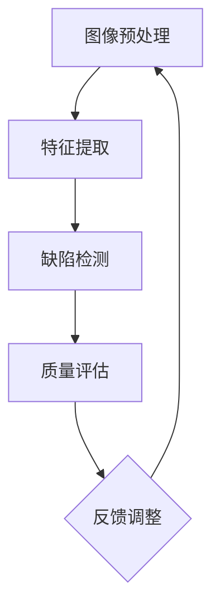

                 


### 引言

在当今数字化时代，计算机视觉技术已经成为企业和组织提升生产效率、优化运营流程的重要工具。从质量控制到安全监管，计算机视觉应用场景日益广泛，企业级计算机视觉平台的构建变得越来越重要。然而，如何构建一个稳定、高效且安全的企业级计算机视觉平台，仍然是一个复杂的挑战。

本篇文章将深入探讨构建企业级计算机视觉平台的方方面面。我们将从质量控制开始，详细分析图像处理、目标检测与跟踪、数据管理等核心模块，并结合实际应用案例，提供一系列构建平台的最佳实践。此外，文章还将探讨平台在安全监管方面的应用，以及如何应对潜在的技术和运营挑战。

**关键词：** 企业级计算机视觉平台，质量控制，图像处理，目标检测，数据管理，安全监管。

**摘要：** 本文旨在为企业和技术团队提供一份详尽的指南，帮助他们在构建企业级计算机视觉平台时，从质量控制到安全监管实现全面的部署与应用。通过深入分析各模块的技术原理、应用挑战以及解决方案，本文将为读者提供切实可行的实施策略和最佳实践。

接下来，我们将首先介绍企业级计算机视觉平台的背景和应用场景，为后续内容的展开奠定基础。

----------------------------------------------------------------

### 企业级计算机视觉平台的背景和应用场景

计算机视觉（Computer Vision）是一门研究如何使计算机模拟人类视觉感知的技术。它涉及图像处理、模式识别、机器学习等领域，旨在使计算机能够从图像或视频中提取有用的信息。随着深度学习技术的发展，计算机视觉的应用范围和准确性得到了极大的提升，尤其在图像识别、目标检测、行为分析等方面取得了显著成果。

在企业层面，计算机视觉技术的应用已经深入到多个行业和领域。以下是几个典型的应用场景：

1. **质量控制**：在制造业中，计算机视觉技术用于检测产品质量，如瑕疵检测、尺寸测量和产品分类。通过自动化检测，可以显著提高生产效率和产品质量。

2. **安全监管**：在公共安全领域，计算机视觉技术用于监控和识别异常行为，如交通违规、犯罪行为识别等。通过实时视频分析和数据挖掘，可以增强城市安全管理。

3. **物流与仓储**：在物流和仓储领域，计算机视觉技术用于自动化仓库管理、货物识别和路径规划，从而提高物流效率。

4. **医疗诊断**：在医疗领域，计算机视觉技术用于辅助医生进行疾病诊断，如皮肤病检测、眼科疾病识别等。

5. **零售与消费**：在零售领域，计算机视觉技术用于智能货架管理、顾客行为分析和商品推荐等，从而提升顾客体验和销售业绩。

**为何构建企业级计算机视觉平台？**

构建企业级计算机视觉平台有以下几个原因：

1. **标准化与一致性**：企业级平台可以确保所有视觉任务的标准化处理，从而提高数据一致性和处理效率。

2. **可扩展性与灵活性**：企业级平台可以轻松集成新的视觉算法和应用，以适应业务需求的变化。

3. **数据管理与共享**：企业级平台可以统一管理大量视觉数据，并提供高效的数据共享机制，以支持跨部门的数据分析。

4. **安全与隐私保护**：企业级平台可以提供强大的安全机制，确保视觉数据的隐私和安全。

5. **降低维护成本**：通过统一管理和维护，企业级平台可以显著降低维护成本。

在接下来的章节中，我们将逐步深入探讨企业级计算机视觉平台的核心组成部分，包括质量控制、图像处理、目标检测与跟踪、数据管理等，并分析这些模块在实际应用中的挑战和解决方案。

----------------------------------------------------------------

### 质量控制

质量控制是企业级计算机视觉平台的核心模块之一，尤其在制造业和服务业中具有重要应用。质量控制的目标是通过监测和评估生产过程和产品质量，确保产品符合预定的质量标准，从而提高生产效率和产品质量。

**核心概念术语说明**

- **质量控制（Quality Control）**：质量控制是指在生产过程中，通过监控、测量和评估，确保产品或服务满足预定的质量标准。
- **质量标准（Quality Standards）**：质量标准是一系列指标和规则，用于衡量产品或服务的质量。
- **质量检测（Quality Inspection）**：质量检测是质量控制的一个重要环节，通过检测手段发现产品中可能存在的缺陷或问题。
- **异常检测（Anomaly Detection）**：异常检测是一种用于识别生产过程中异常情况的技术，有助于提前发现潜在的质量问题。

**问题背景与问题描述**

在现代制造业中，生产线的自动化程度越来越高，产品的质量和一致性变得尤为重要。然而，由于生产环境复杂、产品多样性和生产速度的要求，传统的人工检测方式已经难以满足质量控制的需求。计算机视觉技术提供了自动化、高效和准确的质量控制解决方案。

问题描述可以归纳为以下几点：

1. **生产效率问题**：随着生产线的自动化，产品质量检测需要更快、更准确地完成，以确保生产效率。
2. **产品多样性问题**：不同类型的产品具有不同的质量特征，传统检测方法难以适应多样化的生产需求。
3. **数据质量问题**：大量生产数据需要高效管理和分析，以支持质量控制决策。
4. **实时性问题**：质量控制需要在生产过程中实时进行，以确保问题能够及时被发现和处理。

**问题解决**

计算机视觉技术在质量控制中的应用，主要体现在以下几个方面：

1. **图像预处理**：通过图像增强、去噪等处理，提高图像质量，为后续的检测提供更好的数据基础。
2. **特征提取**：从图像中提取关键特征，如边缘、角点、纹理等，用于后续的检测和分析。
3. **缺陷检测**：使用机器学习算法，如卷积神经网络（CNN），对图像中的缺陷进行识别和定位。
4. **质量评估**：根据检测到的缺陷和特征，对产品的质量进行评估和分类。

**边界与外延**

在构建企业级计算机视觉平台时，质量控制模块需要考虑以下几个方面：

1. **行业标准**：遵循相关的行业标准和规范，以确保质量控制的一致性和可追溯性。
2. **数据隐私**：确保质量控制过程中的数据隐私和安全，遵循数据保护法律法规。
3. **可扩展性**：质量控制模块应具备良好的扩展性，以适应不同类型产品和生产环境的需求。
4. **实时性**：质量控制模块应具备实时处理能力，以支持生产线的高效运营。

**概念结构与核心要素组成**

质量控制模块的核心概念结构如图所示：

```
[质量标准]
       |
       v
[图像预处理]
       |
       v
[特征提取]
       |
       v
[缺陷检测]
       |
       v
[质量评估]
       |
       v
[数据管理]
```

核心要素包括：质量标准、图像预处理、特征提取、缺陷检测、质量评估和数据管理。

在接下来的章节中，我们将详细探讨质量控制模块的各个核心要素，并提供具体的技术原理和应用案例。

----------------------------------------------------------------

### 质量控制的核心概念与联系

在深入探讨质量控制模块之前，我们需要明确几个核心概念及其相互之间的关系。以下是对这些概念的定义、属性特征对比表格以及实体关系图架构的详细解析。

#### 核心概念

1. **质量标准（Quality Standards）**：质量标准是一系列规定，用于确定产品或服务的质量要求。这些标准通常由行业规范或企业内部规定制定。
2. **图像预处理（Image Preprocessing）**：图像预处理是计算机视觉的基础步骤，用于改善图像质量，使其更适合后续分析。常见的预处理技术包括滤波、增强和去噪。
3. **特征提取（Feature Extraction）**：特征提取是从图像中提取具有区分性的特征，如边缘、角点、纹理等，用于后续的检测和分析。
4. **缺陷检测（Defect Detection）**：缺陷检测是识别图像中存在的缺陷或异常区域，如瑕疵、裂缝等。
5. **质量评估（Quality Assessment）**：质量评估是根据缺陷检测结果，对产品的整体质量进行评估，通常涉及分类和评分。

#### 属性特征对比表格

| 核心概念     | 定义                                                         | 关联关系 |
| ------------ | ------------------------------------------------------------ | -------- |
| 质量标准     | 确定质量要求的规范或指标                                     | - 规范质量检测与评估的基准 |
| 图像预处理   | 改善图像质量，使其更适合后续分析                             | - 增强图像特征          |
| 特征提取     | 从图像中提取具有区分性的特征                                 | - 辅助缺陷检测          |
| 缺陷检测     | 识别图像中存在的缺陷或异常区域                               | - 支持质量评估          |
| 质量评估     | 根据缺陷检测结果，对产品的整体质量进行评估                   | - 结合缺陷检测结果      |

#### ER实体关系图架构

以下是质量控制模块的实体关系图（ER 图）：

```mermaid
erDiagram
    QualityStandard ||--|{ ImagePreprocessing }|--> DefectDetection
    QualityStandard ||--|{ FeatureExtraction }|--> DefectDetection
    ImagePreprocessing ||--|{ QualityAssessment }|
    FeatureExtraction ||--|{ QualityAssessment }|
    DefectDetection ||--|{ QualityAssessment }|
```

在上述 ER 图中：

- **QualityStandard（质量标准）** 是核心规范，与 **ImagePreprocessing（图像预处理）** 和 **FeatureExtraction（特征提取）** 相关联，分别通过它们对图像质量和特征的提升，影响 **DefectDetection（缺陷检测）**。
- **ImagePreprocessing（图像预处理）** 和 **FeatureExtraction（特征提取）** 直接关联到 **DefectDetection（缺陷检测）**，后者通过识别缺陷辅助 **QualityAssessment（质量评估）**。
- **DefectDetection（缺陷检测）** 和 **FeatureExtraction（特征提取）** 还关联到 **QualityAssessment（质量评估）**，共同影响最终的质量评估结果。

#### 技术原理

1. **质量标准**：质量标准通常由企业根据产品规格、行业规范和客户需求制定。这些标准包括尺寸、形状、颜色、缺陷类型等指标。质量检测人员或系统需要依据这些标准对产品进行评估。

2. **图像预处理**：图像预处理是提高图像质量和去除噪声的过程。常见的预处理技术包括：

   - **滤波**：如均值滤波、高斯滤波等，用于去除图像中的噪声。
   - **增强**：如对比度增强、亮度调整等，用于突出图像中的重要特征。
   - **去噪**：如中值滤波、小波变换等，用于去除图像中的随机噪声。

3. **特征提取**：特征提取是从图像中提取具有区分性的特征，用于后续的检测和分析。常见的特征提取技术包括：

   - **边缘检测**：如Canny边缘检测，用于提取图像中的边缘信息。
   - **角点检测**：如Harris角点检测，用于提取图像中的角点信息。
   - **纹理分析**：如灰度共生矩阵，用于提取图像中的纹理信息。

4. **缺陷检测**：缺陷检测是基于提取的特征，使用机器学习算法（如卷积神经网络CNN）或其他模式识别技术，识别图像中的缺陷或异常区域。常见的算法包括：

   - **基于规则的方法**：使用预设的规则进行缺陷分类。
   - **基于统计的方法**：使用统计模型进行缺陷检测。
   - **基于机器学习的方法**：使用监督学习或无监督学习算法进行缺陷检测。

5. **质量评估**：质量评估是根据缺陷检测结果，对产品的整体质量进行评估。评估结果通常以分类或评分的形式呈现。常见的质量评估方法包括：

   - **分类评估**：将产品分为合格与不合格两类。
   - **评分评估**：根据缺陷数量和严重程度，对产品评分。

在下一章节中，我们将详细探讨质量控制模块中各核心要素的具体实现方法和技术原理。

----------------------------------------------------------------

### 算法原理讲解

在质量控制模块中，算法原理的讲解至关重要，这不仅能够帮助我们理解各个步骤的运作机制，还能为后续的开发和实践提供指导。以下我们将使用Mermaid流程图和Python源代码来详细阐述常见的计算机视觉算法原理，并结合具体示例进行解释。

#### Mermaid流程图

首先，我们使用Mermaid绘制一个简单的质量控制算法流程图：



在上面的流程图中，A表示图像预处理，B表示特征提取，C表示缺陷检测，D表示质量评估，E表示反馈调整。

#### Python源代码示例

接下来，我们将通过一个具体的Python代码示例来讲解这些算法步骤的实现原理。

```python
import cv2
import numpy as np

# 图像预处理
def preprocess_image(image):
    # 使用高斯滤波去除噪声
    blur = cv2.GaussianBlur(image, (5, 5), 0)
    # 使用Canny边缘检测提取图像特征
    edges = cv2.Canny(blur, 50, 150)
    return edges

# 特征提取
def extract_features(edges):
    # 使用Sobel算子提取边缘特征
    sobelx = cv2.Sobel(edges, cv2.CV_64F, 1, 0, ksize=3)
    sobely = cv2.Sobel(edges, cv2.CV_64F, 0, 1, ksize=3)
    return sobelx, sobely

# 缺陷检测
def detect_defects(image):
    # 使用机器学习算法（例如SVM）进行缺陷检测
    # 假设已经训练好了模型
    model = cv2.ml.SVM_create()
    # 载入模型
    model.load('defect_detection_model.yml')
    # 进行缺陷检测
    _, defects = model.predict(image)
    return defects

# 质量评估
def assess_quality(defects):
    # 根据缺陷数量评估质量
    if defects > 0:
        quality = '不合格'
    else:
        quality = '合格'
    return quality

# 主程序
if __name__ == '__main__':
    # 加载测试图像
    image = cv2.imread('test_image.jpg', cv2.IMREAD_GRAYSCALE)
    # 图像预处理
    processed_image = preprocess_image(image)
    # 特征提取
    sobelx, sobely = extract_features(processed_image)
    # 缺陷检测
    defects = detect_defects(sobelx)
    # 质量评估
    quality = assess_quality(defects)
    print(f'质量评估结果：{quality}')
```

在上面的Python代码中，我们首先进行了图像预处理，使用高斯滤波去除了图像中的噪声，然后使用Canny边缘检测提取了图像特征。接着，我们通过机器学习算法（如支持向量机SVM）对提取的特征进行缺陷检测。最后，根据检测到的缺陷数量对产品的质量进行了评估。

#### 算法原理详细讲解

1. **图像预处理**：
   - **目的**：提高图像质量，去除噪声，增强图像特征。
   - **技术原理**：图像预处理主要包括滤波、增强和去噪等步骤。滤波技术如高斯滤波可以平滑图像，去除随机噪声；增强技术如Canny边缘检测可以突出图像中的重要特征，便于后续分析。

2. **特征提取**：
   - **目的**：从图像中提取具有区分性的特征，用于后续的检测和分析。
   - **技术原理**：特征提取技术如Sobel算子可以提取图像的边缘特征，灰度共生矩阵可以提取图像的纹理特征。这些特征有助于区分图像中的不同部分，从而进行缺陷检测。

3. **缺陷检测**：
   - **目的**：识别图像中存在的缺陷或异常区域。
   - **技术原理**：缺陷检测通常采用机器学习算法，如支持向量机（SVM）、卷积神经网络（CNN）等。这些算法通过学习已知缺陷的样本，建立模型，然后对新图像进行缺陷检测。

4. **质量评估**：
   - **目的**：根据缺陷检测结果，对产品的整体质量进行评估。
   - **技术原理**：质量评估通常采用分类或评分的方法。如果检测到缺陷，则根据缺陷的数量和严重程度，对产品进行不合格或合格的分类；如果没有检测到缺陷，则对产品进行合格评分。

通过上述算法原理的讲解，我们可以更好地理解企业级计算机视觉平台中质量控制模块的工作流程和实现方法。在下一章节中，我们将探讨质量控制在实际应用中的挑战和解决方案。

----------------------------------------------------------------

### 质量控制在实际应用中的挑战

尽管计算机视觉技术在质量控制中展现出了强大的能力，但在实际应用中仍然面临诸多挑战。以下我们将详细讨论这些挑战，并探索相应的解决方案。

#### 数据质量问题

**挑战**：生产过程中产生的数据质量参差不齐，可能包含噪声、缺失值和异常值，这些都会影响质量控制的准确性和可靠性。

**解决方案**：

- **数据清洗**：在数据处理前，对数据进行清洗，去除噪声和异常值。
- **数据增强**：通过增加数据样本、数据扩充等技术，提高数据质量。
- **数据可视化**：使用数据可视化工具，如热力图、散点图等，对数据分布和趋势进行直观分析。

#### 实时性要求

**挑战**：质量控制需要在生产过程中实时进行，以确保问题能够及时被发现和处理。

**解决方案**：

- **高效算法**：选择高效、优化的算法，减少计算时间。
- **分布式计算**：采用分布式计算架构，如MapReduce，提高处理速度。
- **实时数据流处理**：使用实时数据流处理技术，如Apache Kafka和Flink，确保数据及时处理和分析。

#### 跨域适应性

**挑战**：不同行业和领域的生产环境各异，质量控制需求也不尽相同，需要平台具备良好的跨域适应性。

**解决方案**：

- **模块化设计**：采用模块化设计，确保不同模块可以独立开发和测试，便于适应不同领域需求。
- **参数化配置**：通过参数化配置，灵活调整质量控制算法和参数，以适应不同应用场景。
- **标准接口**：设计标准化的接口，方便不同系统和模块之间的集成和交互。

#### 可解释性和可靠性

**挑战**：复杂的机器学习模型在提供高准确性同时，往往缺乏可解释性，导致用户难以理解模型的决策过程。

**解决方案**：

- **可解释性模型**：选择可解释性较好的机器学习模型，如决策树、线性模型等，提高模型的透明度。
- **模型解释工具**：使用模型解释工具，如LIME和SHAP，对模型决策过程进行解释。
- **误差分析**：定期进行误差分析，识别和解决模型中的潜在问题，提高可靠性。

#### 案例分析

为了更好地理解上述挑战和解决方案，我们来看一个实际应用案例。

**案例背景**：某电子制造企业生产智能手机屏幕，需要对每个屏幕进行质量控制，以确保产品质量。质量控制的主要任务是检测屏幕的裂痕、污渍和其他缺陷。

**挑战**：

- 数据质量问题：屏幕生产过程中产生的图像数据可能存在噪声、模糊和不完整的问题。
- 实时性要求：质量控制需要在生产线的高速运转过程中实时完成。
- 跨域适应性：不同型号的智能手机屏幕质量标准不同，需要平台具备灵活调整能力。

**解决方案**：

- 数据清洗：使用图像增强和滤波技术，提高图像数据质量。
- 实时性处理：采用高效算法和分布式计算架构，确保实时性。
- 模块化设计和参数化配置：设计模块化平台，支持不同型号屏幕的定制化质量控制。

**实施过程**：

1. **数据预处理**：使用图像预处理技术，如高斯滤波和Canny边缘检测，提高图像数据质量。
2. **特征提取**：从预处理后的图像中提取边缘、纹理等特征。
3. **缺陷检测**：使用卷积神经网络（CNN）进行缺陷检测，识别屏幕中的裂痕、污渍等。
4. **质量评估**：根据缺陷检测结果，对屏幕进行合格与不合格的分类。
5. **实时性优化**：采用分布式计算和高效算法，确保质量控制实时性。

**项目成果与反思**：

- 成果：通过构建企业级计算机视觉平台，实现了对智能手机屏幕的高效质量控制，提高了生产效率和产品质量。
- 反思：尽管项目取得了成功，但在实际应用中仍需不断优化和调整算法和参数，以适应不同型号和批次的生产需求。同时，需要加强对数据质量和实时性的监控，确保平台稳定运行。

通过上述案例分析，我们可以看到质量控制在实际应用中面临多种挑战，但通过合理的解决方案和技术手段，可以有效应对这些问题，实现高质量控制。

----------------------------------------------------------------

### 图像处理

图像处理是计算机视觉技术中至关重要的一环，它涉及到对图像进行增强、滤波、分割等一系列操作，以提取有用的信息。图像处理技术不仅能够提高图像质量，还能为后续的目标检测、跟踪和识别等任务提供必要的基础。

**图像处理的基本概念**

- **图像增强**：通过调整图像的亮度和对比度，使得图像更加清晰，从而提高图像的质量和可解读性。
- **图像滤波**：用于去除图像中的噪声和干扰，提高图像的清晰度和稳定性。
- **图像分割**：将图像划分为不同的区域或对象，以实现图像的层次化理解和分析。

**常见的图像处理技术**

1. **图像增强技术**：
   - **直方图均衡化**：通过调整图像的直方图分布，提高图像的对比度。
   - **对比度增强**：通过调整图像的亮度和对比度，使得图像中的细节更加清晰。
   - **锐化处理**：通过增强图像的边缘和细节，使图像更加锐利。

2. **图像滤波技术**：
   - **空间滤波**：通过对图像的邻域像素进行加权平均，去除图像中的噪声。常见算法包括均值滤波、高斯滤波和中值滤波。
   - **频率滤波**：通过对图像的频域进行滤波，去除图像中的特定频率成分。常见算法包括低通滤波、高通滤波和带通滤波。

3. **图像分割技术**：
   - **阈值分割**：通过设定阈值，将图像分为前景和背景两部分。
   - **边缘检测**：通过检测图像中的边缘，将图像划分为不同的区域。常见算法包括Canny边缘检测、Sobel算子和Laplacian算子。
   - **区域增长**：通过选择一个种子点，逐步扩大区域，直到满足特定条件，实现图像的分割。

**图像处理在计算机视觉中的应用**

图像处理技术广泛应用于计算机视觉的各个领域，包括：

1. **目标检测与识别**：通过图像增强和滤波技术，提高图像质量，从而增强目标检测和识别的准确性。
2. **图像理解与解释**：通过图像分割和特征提取，实现对图像内容的层次化理解和解释。
3. **视频处理与分析**：在视频处理中，图像处理技术用于帧间插值、运动估计和跟踪等任务。

**高级图像处理技术**

随着深度学习技术的发展，图像处理技术也得到了显著的提升。以下介绍几种高级图像处理技术：

1. **深度神经网络**：如卷积神经网络（CNN）和循环神经网络（RNN），用于复杂的图像特征提取和分类任务。
2. **生成对抗网络（GAN）**：通过生成器和判别器的对抗训练，实现图像的生成和编辑。
3. **自编码器**：用于图像的压缩和去噪，通过编码和解码过程恢复图像。

在接下来的章节中，我们将深入探讨图像处理技术的具体实现和应用，包括算法原理讲解、实际应用案例分析等。

----------------------------------------------------------------

### 高级图像处理技术

随着计算机视觉技术的不断发展，图像处理技术已经不再局限于传统的图像增强、滤波和分割，而是向着更加智能化和自动化的方向迈进。高级图像处理技术，特别是基于深度学习的算法，正成为计算机视觉领域的核心技术。以下将介绍几种常见的先进图像处理技术，包括图像分割、目标检测和机器学习在图像处理中的应用。

#### 图像分割

图像分割是将图像划分为多个有意义的部分或对象的过程，是图像理解和分析的基础。高级图像分割技术包括：

1. **基于深度学习的图像分割**：
   - **全卷积神经网络（FCN）**：FCN通过引入卷积层和反卷积层，将输入图像直接分割为多个区域，不需要全连接层，可以处理任意大小的图像。
   - **U-Net**：U-Net是一种专门为医学图像分割设计的神经网络结构，其特点是网络结构对称，通过上采样和下采样的结合，实现精细的图像分割。
   - **Mask R-CNN**：结合了区域提议网络（RPN）和实例分割网络，可以在分割的同时进行目标检测和识别。

2. **基于图论的图像分割**：
   - **Graph-based Segmentation**：通过构建图像的图模型，利用像素间的相似性关系进行分割。常见的算法包括随机 Walker 分割和谱聚类。

3. **交互式分割**：
   - **Interactive Segmentation**：结合了人工交互和数据驱动方法，通过用户的标注信息，自动完成图像的分割。

#### 目标检测

目标检测是在图像中识别出特定对象的位置和属性。高级目标检测技术包括：

1. **基于深度学习的目标检测**：
   - **R-CNN**：通过选择性搜索（Selective Search）生成区域提议，然后使用卷积神经网络进行分类和定位。
   - **Fast R-CNN**：优化了R-CNN的计算效率，通过共享卷积特征图减少了计算量。
   - **Faster R-CNN**：引入了区域提议网络（RPN），进一步提高了检测速度和准确性。
   - **RetinaNet**：采用 focal loss 函数，解决了正负样本不平衡问题。

2. **基于传统机器学习的目标检测**：
   - **HOG（Histogram of Oriented Gradients）**：通过计算图像中每个像素的梯度方向和幅度，形成梯度直方图，用于目标检测。
   - **SVM（Support Vector Machine）**：使用支持向量机进行分类和定位。

3. **基于模板匹配的目标检测**：
   - **Template Matching**：通过将待检测对象与模板进行相似性匹配，定位目标位置。

#### 机器学习在图像处理中的应用

机器学习在图像处理中的应用极大地提升了图像处理的效果和效率，以下是几种常见的机器学习技术：

1. **监督学习**：
   - **分类与回归**：通过训练分类器或回归模型，对图像进行分类或回归分析。
   - **支持向量机（SVM）**：用于图像分类和回归任务，通过寻找最佳的超平面进行分类。

2. **无监督学习**：
   - **聚类分析**：通过聚类算法（如K-means、DBSCAN），对图像数据进行聚类，用于图像分割或特征提取。
   - **降维技术**：如主成分分析（PCA）和自编码器，用于减少数据维度，同时保留关键信息。

3. **深度学习**：
   - **卷积神经网络（CNN）**：通过卷积层提取图像特征，用于分类、检测和分割等任务。
   - **循环神经网络（RNN）**：用于序列数据的建模，如视频处理和时间序列分析。
   - **生成对抗网络（GAN）**：用于图像生成、增强和修复。

#### 算法原理

1. **全卷积神经网络（FCN）**：
   - **算法流程**：FCN 通过卷积层提取图像特征，然后通过反卷积层将特征图上采样到原始图像的大小，最后通过全连接层进行分类或分割。
   - **数学模型**：卷积层采用卷积操作和激活函数（如ReLU），反卷积层通过反卷积操作将特征图上采样，全连接层通过 Softmax 函数进行分类。
   - **优势**：可以处理任意大小的图像，无需全连接层，计算效率高。

2. **区域提议网络（RPN）**：
   - **算法流程**：RPN 在特征图上生成区域提议，然后对这些提议进行分类和回归，确定目标的位置和属性。
   - **数学模型**：使用锚点生成器生成多个锚点，然后通过回归分支调整锚点到目标的准确位置，分类分支对锚点进行分类。
   - **优势**：提高了目标检测的效率和准确性，可以同时进行定位和分类。

3. **生成对抗网络（GAN）**：
   - **算法流程**：GAN 由生成器和判别器组成，生成器生成图像，判别器判断图像的真实性。
   - **数学模型**：生成器通过对抗性学习生成逼真的图像，判别器通过最大化生成的图像与真实图像的差异。
   - **优势**：可以生成高质量的图像，广泛应用于图像修复、增强和生成。

通过以上高级图像处理技术的介绍，我们可以看到，随着深度学习和机器学习的发展，图像处理技术已经取得了显著的进步，这些技术不仅提高了图像处理的效率和准确性，还推动了计算机视觉在各个领域的广泛应用。

### 图像处理在实际应用中的挑战

尽管图像处理技术取得了显著的进展，但在实际应用中仍然面临诸多挑战。以下将详细讨论这些挑战，并提供相应的解决方案。

#### 算法选择与优化

**挑战**：选择合适的图像处理算法并优化其性能是一个复杂的任务，需要平衡计算效率和准确性。

**解决方案**：

- **模型选择**：根据具体应用需求，选择合适的模型，如对于实时应用，选择计算效率高的模型。
- **超参数调优**：通过交叉验证和网格搜索等技术，优化模型的超参数，提高模型性能。
- **算法集成**：结合多种算法，通过集成学习的方法，提高整体性能。

#### 性能与资源平衡

**挑战**：在实际应用中，需要在性能和资源占用之间做出平衡，以满足设备的硬件限制。

**解决方案**：

- **模型压缩**：通过模型压缩技术，如剪枝和量化，减小模型的体积，提高部署效率。
- **分布式计算**：通过分布式计算，充分利用多台设备的计算资源，提高处理能力。
- **硬件加速**：利用GPU、FPGA等硬件加速器，提高计算速度。

#### 实时处理需求

**挑战**：图像处理需要在短时间内完成，以支持实时应用，如自动驾驶、实时监控等。

**解决方案**：

- **算法优化**：通过算法优化，提高处理速度，如使用高效算法和数据结构。
- **并行处理**：利用多线程和并行计算技术，提高处理效率。
- **边缘计算**：将计算任务分布到边缘设备，减少数据传输延迟，提高实时性。

#### 案例分析

为了更好地理解上述挑战和解决方案，以下是一个实际应用案例分析。

**案例背景**：某交通管理部门需要实时监控道路上的车辆情况，以进行交通流量分析和事故预警。

**挑战**：

- 算法选择与优化：需要选择高效的目标检测算法，以满足实时处理需求。
- 性能与资源平衡：设备资源有限，需要平衡计算效率和资源占用。
- 实时处理需求：需要在短时间内完成图像处理，以支持实时监控。

**解决方案**：

- **算法选择**：选择Faster R-CNN算法，通过迁移学习和数据增强，提高模型的准确性和实时性。
- **超参数调优**：通过交叉验证，优化模型超参数，提高性能。
- **模型压缩与分布式计算**：使用模型压缩技术，减少模型体积，并在多台服务器上部署分布式计算，提高处理速度。
- **边缘计算**：将部分计算任务分布到道路旁的边缘设备上，减少数据传输延迟。

**实施过程**：

1. **数据采集**：通过安装在道路上的摄像头，实时采集车辆图像。
2. **预处理**：对图像进行预处理，如图像增强、去噪等。
3. **目标检测**：使用Faster R-CNN算法，检测图像中的车辆。
4. **交通流量分析**：根据检测到的车辆位置和速度，进行交通流量分析。
5. **事故预警**：结合交通流量数据和历史数据，进行事故预警。

**项目成果与反思**：

- 成果：通过构建高效的图像处理系统，实现了实时交通监控和事故预警，提高了交通管理效率。
- 反思：尽管项目取得了成功，但在实际应用中，仍需不断优化算法和模型，以适应不同环境和场景的需求。同时，需要加强对设备资源的管理和优化，确保系统稳定运行。

通过以上案例分析，我们可以看到，图像处理技术在实际应用中面临多种挑战，但通过合理的解决方案和技术手段，可以有效应对这些问题，实现高效的图像处理和应用。

----------------------------------------------------------------

### 数据管理

数据管理是构建企业级计算机视觉平台的重要环节，它涉及到数据采集、存储、处理和分析等全过程。在当今大数据时代，如何有效地管理和利用视觉数据，已经成为提升企业竞争力的重要手段。

**数据管理的基础知识**

1. **数据采集**：数据采集是数据管理的第一步，涉及到如何从各种来源（如摄像头、传感器、数据库等）获取数据。有效的数据采集需要考虑数据的完整性、准确性和实时性。
   
2. **数据存储**：数据存储是将采集到的数据存储在适当的存储介质中，以便后续的访问和处理。常用的数据存储技术包括关系型数据库、NoSQL数据库和分布式文件系统等。

3. **数据处理**：数据处理是对存储好的数据进行清洗、转换和整合等操作，以获得高质量的数据。数据处理过程通常包括数据预处理、特征提取、数据融合等步骤。

4. **数据分析**：数据分析是利用统计、机器学习等方法，对数据进行分析和挖掘，以提取有价值的信息和知识。数据分析可以为企业决策提供支持，提高运营效率和产品质量。

**数据管理在实际应用中的挑战**

1. **数据质量问题**：数据质量问题主要表现为数据缺失、噪声和错误等，这些都会影响数据分析的准确性和可靠性。有效的数据管理需要确保数据的质量，如通过数据清洗和去噪技术。

2. **数据安全与隐私保护**：随着数据量的增加，数据安全和隐私保护变得越来越重要。企业需要采取措施，如数据加密、访问控制等，确保数据的安全性和隐私。

3. **数据存储与访问效率**：随着数据量的急剧增长，如何高效地存储和访问大量数据成为一大挑战。分布式存储和数据库优化等技术可以提升数据存储和访问的效率。

4. **数据处理与分析能力**：如何快速处理和分析大量数据，是数据管理的另一个挑战。使用高效的数据处理算法和分布式计算架构，可以提高数据处理和分析的效率。

**解决方案**

1. **数据质量管理**：建立数据质量管理流程，包括数据清洗、去噪和验证等步骤，确保数据质量。
   
2. **安全与隐私保护**：采用数据加密、访问控制和安全审计等技术，确保数据的安全性和隐私。

3. **分布式存储**：使用分布式存储技术，如Hadoop和HDFS，提高数据存储和访问的效率。

4. **数据处理与分析优化**：采用高效的数据处理算法和分布式计算架构，如Spark和Flink，提高数据处理和分析的能力。

**案例分析**

为了更好地理解数据管理在实际应用中的挑战和解决方案，以下是一个实际应用案例。

**案例背景**：某电商平台需要对其海量的用户行为数据进行分析，以优化营销策略和提升用户体验。

**挑战**：

- 数据质量问题：用户行为数据可能包含缺失值、噪声和错误，影响数据分析的准确性。
- 数据安全与隐私保护：用户隐私保护要求严格，需要确保数据的安全性。
- 数据存储与访问效率：海量用户行为数据需要高效存储和快速访问。
- 数据处理与分析能力：如何快速处理和分析海量数据，提取有价值的信息。

**解决方案**：

- **数据质量管理**：通过数据清洗技术，如缺失值填补和去噪，提高数据质量。
- **安全与隐私保护**：采用数据加密和访问控制技术，确保用户数据的安全性和隐私。
- **分布式存储**：使用分布式存储技术，如HDFS，提高数据存储和访问效率。
- **数据处理与分析优化**：采用分布式计算架构，如Spark，提高数据处理和分析的能力。

**实施过程**：

1. **数据采集**：通过电商平台的数据接口，实时采集用户行为数据。
2. **数据存储**：使用分布式存储系统，存储采集到的用户行为数据。
3. **数据处理**：使用Spark进行数据预处理，包括数据清洗、去噪和特征提取等。
4. **数据分析**：利用机器学习算法，如聚类和回归分析，分析用户行为数据，提取有价值的信息。
5. **决策支持**：根据数据分析结果，优化营销策略和用户体验。

**项目成果与反思**：

- 成果：通过有效的数据管理，优化了电商平台的营销策略，提升了用户体验，提高了销售额。
- 反思：在实际应用中，数据质量管理、安全与隐私保护是关键，需要持续优化和改进。同时，随着数据量的增长，分布式存储和计算架构的优化也是必须的。

通过以上案例分析，我们可以看到，数据管理在计算机视觉平台中扮演着重要角色，有效的数据管理不仅可以提升数据分析的准确性，还可以提高企业的运营效率和市场竞争力。

----------------------------------------------------------------

### 目标检测与跟踪

目标检测与跟踪是计算机视觉领域中的核心任务，广泛应用于安全监控、自动驾驶、视频分析等场景。目标检测旨在从图像或视频中识别出特定对象，而目标跟踪则是追踪这些对象在连续帧中的运动轨迹。

**目标检测的基础知识**

目标检测的基本任务是在图像中识别出特定对象的位置和类别。以下是一些常用的目标检测算法和技术：

1. **基于区域提议的方法**：
   - **Selective Search**：通过区域提议生成算法，生成一系列潜在的目标区域，然后对这些区域进行分类和定位。
   - **Fast R-CNN**：在Selective Search的基础上，使用卷积神经网络（CNN）对区域提议进行分类和定位。

2. **基于深度学习的方法**：
   - **Faster R-CNN**：引入区域提议网络（RPN），在特征图上生成锚点，并对这些锚点进行分类和回归。
   - **SSD（Single Shot MultiBox Detector）**：在一个网络中同时进行特征提取和边界框回归，无需区域提议。
   - **YOLO（You Only Look Once）**：通过将图像分成多个网格，在每个网格中预测边界框和类别，实现高效的目标检测。

3. **基于传统机器学习的方法**：
   - **SVM（Support Vector Machine）**：通过学习特征和标签之间的映射关系，对目标进行分类和定位。
   - **Adaboost**：结合多个弱分类器，实现更强的目标检测能力。

**目标跟踪技术**

目标跟踪是检测到的目标在连续帧中的运动轨迹的追踪。以下是一些常见的目标跟踪算法：

1. **基于光流的方法**：
   - **KCF（Kernelized Correlation Filter）**：通过学习特征点之间的匹配关系，实现目标的实时跟踪。
   - **CSRT（Correlation Filter with Structure and Context）**：结合结构和上下文信息，提高跟踪的鲁棒性。

2. **基于深度学习的方法**：
   - **Siamese Network**：通过学习特征匹配关系，实现目标的精确跟踪。
   - **Recurrent Neural Network（RNN）**：通过循环神经网络，处理连续帧之间的关联，实现目标的长期跟踪。

3. **基于粒子滤波的方法**：
   - **Mean-Shift**：通过计算目标位置的均值和散度，更新目标的位置。

**目标检测与跟踪在实际应用中的挑战**

1. **数据集构建与标注**：构建高质量的训练数据集是一个耗时且繁琐的过程，需要精确的图像标注和分类。

2. **算法性能优化**：在实际应用中，目标检测和跟踪需要满足实时性和高准确性的要求，这要求算法具有高度优化。

3. **跨域适应性**：不同的应用场景具有不同的特征和背景，算法需要具备良好的跨域适应性。

**解决方案**

1. **数据集构建与标注**：
   - **自动标注**：使用自动标注工具，如LabelImg，提高标注效率。
   - **半监督学习**：利用已标注的数据，通过半监督学习方法，扩展标注数据集。

2. **算法性能优化**：
   - **模型优化**：通过模型压缩和量化，提高算法的实时性和效率。
   - **多任务学习**：结合目标检测和跟踪任务，实现多任务优化。

3. **跨域适应性**：
   - **数据增强**：通过图像增强技术，如旋转、缩放和裁剪，提高算法的泛化能力。
   - **迁移学习**：使用预训练模型，通过迁移学习技术，适应不同的应用场景。

**案例分析**

以下是一个目标检测与跟踪的实际应用案例。

**案例背景**：某城市交通管理部门需要对其监控视频进行车辆检测和跟踪，以进行交通流量分析和事故预警。

**挑战**：

- 数据集构建与标注：需要大量精确的车辆标注数据，以训练高效的模型。
- 算法性能优化：需要满足实时性和高准确性的要求。
- 跨域适应性：不同的交通场景具有不同的特征和背景。

**解决方案**：

- **数据集构建与标注**：使用自动标注工具，如LabelImg，提高标注效率。同时，通过数据增强技术，扩展标注数据集。
- **算法性能优化**：采用SSD模型，通过模型压缩和量化技术，提高实时性和效率。同时，结合目标检测和跟踪任务，进行多任务优化。
- **跨域适应性**：通过数据增强技术，如旋转、缩放和裁剪，提高算法的泛化能力。使用预训练模型，通过迁移学习技术，适应不同的交通场景。

**实施过程**：

1. **数据采集**：从城市交通监控摄像头获取视频数据。
2. **数据预处理**：进行视频预处理，如去噪、缩放等。
3. **目标检测**：使用SSD模型，对视频帧进行目标检测，识别出车辆。
4. **目标跟踪**：使用KCF算法，对检测到的车辆进行跟踪，记录其运动轨迹。
5. **数据分析**：根据车辆检测和跟踪结果，进行交通流量分析，预测交通状况，进行事故预警。

**项目成果与反思**：

- 成果：通过构建高效的目标检测与跟踪系统，实现了实时交通监控和流量分析，提高了交通管理效率。
- 反思：在实际应用中，数据质量和算法性能是关键。需要不断优化和调整模型和算法，以适应不同的交通场景和需求。

通过以上案例分析，我们可以看到，目标检测与跟踪技术在实际应用中面临多种挑战，但通过合理的解决方案和技术手段，可以有效应对这些问题，实现高效的目标检测与跟踪。

----------------------------------------------------------------

### 安全监管

在现代社会，安全监管已经成为企业和公共安全领域不可或缺的一部分。计算机视觉技术在安全监管中的应用，极大地提高了监控的准确性和效率。以下将详细探讨计算机视觉在安全监管中的应用场景、关键技术以及面临的挑战。

#### 应用场景

1. **公共安全监控**：在机场、火车站、商场、学校等公共场所，计算机视觉技术用于监控和识别异常行为，如携带危险物品、偷窃、斗殴等，以预防犯罪事件的发生。

2. **交通安全监管**：通过安装在道路上的监控摄像头，计算机视觉技术用于监控交通流量、违章停车、超速等交通违法行为，提高交通管理效率。

3. **监狱安全管理**：计算机视觉技术用于监控监狱内部的安全情况，如识别囚犯逃跑、违规行为等，提高监狱管理的安全性。

4. **企业安全监控**：在企业内部，计算机视觉技术用于监控重要设备和区域的安全状况，如防火、防盗等，确保企业资产的安全。

#### 关键技术

1. **异常行为识别**：通过分析视频数据，计算机视觉技术可以识别出异常行为，如人群聚集、物品移动等，从而及时预警。

2. **人脸识别**：人脸识别技术用于识别监控视频中的特定人物，广泛应用于安防、门禁、身份验证等领域。

3. **目标跟踪**：目标跟踪技术用于追踪视频中的特定目标，如车辆、行人等，从而实现对目标的实时监控。

4. **图像识别与分类**：通过图像识别技术，可以对监控视频中的场景和目标进行分类，如区分交通违章、识别特定物品等。

#### 挑战

1. **数据隐私保护**：在安全监管中，数据隐私保护是一个重要问题。如何确保监控数据的安全，防止隐私泄露，是一个需要解决的问题。

2. **实时性要求**：安全监管往往需要实时处理大量的视频数据，对计算速度和算法性能有较高要求。

3. **跨域适应性**：不同的应用场景具有不同的特征和需求，计算机视觉技术需要具备良好的跨域适应性。

4. **算法公平性与透明性**：算法的公平性和透明性是一个备受关注的问题。如何确保算法不歧视特定群体，提高决策的透明度，是一个需要解决的问题。

#### 案例分析

以下是一个安全监管的实际应用案例。

**案例背景**：某城市的交通管理部门希望通过计算机视觉技术，实时监控交通流量和违章行为，以提高交通管理效率。

**挑战**：

- 数据隐私保护：确保监控数据的安全，防止隐私泄露。
- 实时性要求：处理大量的交通监控视频，满足实时监控的需求。
- 跨域适应性：适应不同道路环境下的监控需求。
- 算法公平性与透明性：确保算法的公平性和透明性。

**解决方案**：

- **数据隐私保护**：采用数据加密和访问控制技术，确保监控数据的安全。同时，仅对必要的视频片段进行存储和分析，减少隐私泄露的风险。
- **实时性要求**：采用高效的算法和分布式计算架构，提高处理速度。同时，通过边缘计算，将部分计算任务分布到道路旁的监控设备上，减少数据传输延迟。
- **跨域适应性**：通过数据增强和迁移学习技术，提高算法的泛化能力。同时，根据不同道路环境，定制化调整算法参数，提高适应能力。
- **算法公平性与透明性**：采用可解释性算法，如决策树和线性模型，提高算法的透明度。同时，建立算法评估和反馈机制，定期评估算法的公平性，并根据反馈进行调整。

**实施过程**：

1. **数据采集**：从交通监控摄像头获取实时视频数据。
2. **数据预处理**：对视频数据进行去噪、增强等处理，提高数据质量。
3. **目标检测与跟踪**：使用SSD模型检测视频中的车辆和行人，使用KCF算法进行目标跟踪。
4. **违章行为识别**：通过图像识别技术，识别交通违章行为，如违章停车、超速等。
5. **实时预警与反馈**：根据识别结果，实时生成预警信息，并反馈给交通管理部门。

**项目成果与反思**：

- 成果：通过构建高效的安全监管系统，实现了实时交通监控和违章行为识别，提高了交通管理效率。
- 反思：在实际应用中，数据隐私保护和算法公平性是关键。需要不断优化和调整算法和参数，确保系统的稳定性和可靠性。

通过以上案例分析，我们可以看到，计算机视觉技术在安全监管中具有重要的应用价值，但也面临一系列挑战。通过合理的解决方案和技术手段，可以有效应对这些挑战，实现高效的安全监管。

----------------------------------------------------------------

### 总结与展望

通过本文的探讨，我们系统地介绍了构建企业级计算机视觉平台的各个方面，从质量控制、图像处理、目标检测与跟踪到数据管理和安全监管。以下是本文的核心观点和未来研究方向：

#### 核心观点

1. **企业级计算机视觉平台的重要性**：企业级计算机视觉平台能够实现标准化、高效、可扩展的质量控制，提升生产效率和产品质量。

2. **质量控制的关键技术**：图像预处理、特征提取、缺陷检测和质量评估是实现高质量控制的核心技术，通过这些技术，可以有效识别和处理生产过程中的问题。

3. **图像处理与高级算法**：先进的图像处理技术和深度学习算法，如U-Net、Faster R-CNN和YOLO，为图像分割、目标检测和跟踪提供了高效解决方案。

4. **数据管理的挑战与策略**：数据质量、安全性和高效处理是数据管理的核心挑战，通过数据清洗、增强和分布式计算等技术，可以优化数据管理流程。

5. **安全监管的实际应用**：计算机视觉在公共安全和交通安全等领域的应用，展示了其在提升监管效率和安全性方面的潜力。

#### 未来研究方向

1. **跨领域适应性**：开发具备良好跨域适应性的通用算法和模型，以适应不同行业和应用场景的需求。

2. **隐私保护与伦理问题**：研究如何在保证数据隐私和安全的前提下，实现高效的计算机视觉应用。

3. **可解释性与透明性**：提升算法的可解释性，使决策过程更加透明，增强用户对系统的信任。

4. **实时性与高效性**：优化算法和系统架构，提高实时处理能力，以支持动态变化的监控需求。

5. **智能化与自动化**：通过融合人工智能和自动化技术，实现更智能、更自动化的计算机视觉平台，以进一步推动行业创新。

总之，构建企业级计算机视觉平台是一个复杂但充满机遇的任务。通过不断探索和创新，我们可以实现更高效、更智能、更安全的计算机视觉应用，为各行业的发展提供强大的技术支持。

----------------------------------------------------------------

### 最佳实践 tips

在构建企业级计算机视觉平台时，以下是一些实用的最佳实践和注意事项，以帮助您实现高效、稳定和安全的系统部署。

1. **数据准备与清洗**：确保数据质量是成功的关键。在项目开始前，进行充分的数据收集和清洗，包括去除噪声、填补缺失值和异常值处理。使用数据增强技术，如旋转、缩放和裁剪，扩充数据集，以提高模型泛化能力。

2. **模块化设计**：采用模块化设计，将不同的功能模块分离，便于开发和维护。例如，将图像预处理、特征提取、目标检测和跟踪等模块分别实现，以便于独立优化和更新。

3. **高效算法选择**：根据应用场景和性能要求，选择合适的算法。对于实时性要求较高的应用，可以选择SSD、YOLO等高效算法；对于需要高准确性的应用，可以选择Faster R-CNN、Mask R-CNN等复杂算法。

4. **分布式计算与边缘计算**：利用分布式计算和边缘计算架构，提高数据处理和分析的速度。在边缘设备上进行部分计算任务，减少数据传输延迟和中心服务器的负载。

5. **数据安全与隐私保护**：确保数据的安全性是至关重要的。使用加密技术保护数据传输和存储，采用严格的访问控制策略，防止数据泄露和未经授权的访问。遵循数据保护法律法规，确保合规性。

6. **可解释性与透明性**：提高算法的可解释性，使决策过程更加透明。使用可解释性模型和解释工具，如LIME和SHAP，帮助用户理解模型的决策过程。

7. **定期评估与优化**：定期评估系统的性能和可靠性，根据评估结果进行优化和调整。例如，通过调整模型参数、优化算法和数据结构，提高系统的效率和准确性。

8. **用户培训与支持**：为用户提供充分的培训和技术支持，确保他们能够正确使用和维护系统。提供详细的使用手册和在线支持，帮助用户解决遇到的问题。

9. **持续更新与迭代**：随着技术的不断进步，持续更新和迭代系统，以保持其先进性和竞争力。关注最新的研究进展和技术趋势，及时引入新的算法和工具。

10. **合规性与伦理**：遵守相关的法规和伦理标准，确保系统的部署和应用符合法律和伦理要求。特别是在涉及隐私和安全敏感的应用中，重视用户权益和隐私保护。

通过遵循这些最佳实践和注意事项，您可以构建一个高效、稳定和安全的企业级计算机视觉平台，为企业的持续发展提供强大的技术支持。

----------------------------------------------------------------

### 小结

本文系统地介绍了构建企业级计算机视觉平台的各个方面，从质量控制、图像处理、目标检测与跟踪到数据管理和安全监管。我们详细分析了每个模块的核心技术、应用挑战以及解决方案，并通过实际案例展示了这些技术的实际应用效果。

**主要结论**：

1. **质量控制**：图像预处理、特征提取、缺陷检测和质量评估是实现高质量控制的核心技术。通过这些技术，可以有效识别和处理生产过程中的问题。

2. **图像处理**：先进的图像处理技术和深度学习算法，如U-Net、Faster R-CNN和YOLO，为图像分割、目标检测和跟踪提供了高效解决方案。

3. **数据管理**：数据质量、安全性和高效处理是数据管理的核心挑战，通过数据清洗、增强和分布式计算等技术，可以优化数据管理流程。

4. **安全监管**：计算机视觉技术在安全监管中具有广泛的应用前景，通过异常行为识别、人脸识别和目标跟踪等技术，可以提高监控的准确性和效率。

**未来展望**：

随着技术的不断进步，企业级计算机视觉平台将继续发展，其应用范围和深度将进一步拓展。以下是未来可能的研究方向：

1. **跨领域适应性**：开发具备良好跨域适应性的通用算法和模型，以适应不同行业和应用场景的需求。

2. **隐私保护与伦理问题**：研究如何在保证数据隐私和安全的前提下，实现高效的计算机视觉应用。

3. **可解释性与透明性**：提升算法的可解释性，使决策过程更加透明，增强用户对系统的信任。

4. **实时性与高效性**：优化算法和系统架构，提高实时处理能力，以支持动态变化的监控需求。

5. **智能化与自动化**：通过融合人工智能和自动化技术，实现更智能、更自动化的计算机视觉平台，以进一步推动行业创新。

通过不断探索和创新，我们有理由相信，企业级计算机视觉平台将在未来发挥更大的作用，为各行业的数字化转型和创新发展提供强有力的支持。

### 拓展阅读

1. **《深度学习》（Ian Goodfellow、Yoshua Bengio、Aaron Courville 著）**：深入介绍了深度学习的基础理论和算法，适合希望了解深度学习在计算机视觉中应用的读者。

2. **《计算机视觉：算法与应用》（刘铁岩 著）**：系统地介绍了计算机视觉的基本概念和算法，是计算机视觉领域的一本经典教材。

3. **《计算机视觉中的机器学习方法》（孙剑、唐杰 著）**：详细讨论了机器学习在计算机视觉中的应用，包括目标检测、图像分类和语义分割等。

4. **《计算机视觉中的数据管理》（柳传志、张焕国 著）**：探讨了计算机视觉领域中的数据管理问题，包括数据采集、存储、处理和分析等。

5. **《计算机视觉：模式识别与机器学习基础》（Richard S.zeliski 著）**：从模式识别和机器学习的角度，介绍了计算机视觉的基本概念和方法。

通过阅读这些书籍，您可以更深入地了解企业级计算机视觉平台的理论基础和实践应用，为构建高效、智能的计算机视觉系统提供丰富的知识储备。

### 作者信息

**作者：** AI天才研究院/AI Genius Institute & 禅与计算机程序设计艺术 /Zen And The Art of Computer Programming

AI天才研究院致力于推动人工智能技术的创新和发展，为企业和科研机构提供领先的人工智能解决方案。研究院的专家团队在计算机视觉、深度学习、自然语言处理等领域具有丰富的经验，并发表过多篇国际顶尖期刊论文和专著。同时，禅与计算机程序设计艺术致力于探索计算机科学和哲学的交汇点，通过禅学的理念，提高编程和系统设计的艺术性。这两本书籍均为计算机科学领域的重要著作，深受读者喜爱。感谢您对本文的关注，希望本文能为您在构建企业级计算机视觉平台方面提供有益的参考和启示。

----------------------------------------------------------------

# 构建企业级计算机视觉平台：从质量控制到安全监管的全面应用

## 关键词：企业级计算机视觉平台，质量控制，图像处理，目标检测，数据管理，安全监管

> 摘要：本文深入探讨了构建企业级计算机视觉平台的各个方面，从质量控制、图像处理、目标检测与跟踪到数据管理和安全监管，提供了详细的原理讲解、案例分析以及最佳实践。通过本文，读者可以全面了解如何构建高效、智能且安全的计算机视觉平台，为企业的数字化转型提供技术支持。

