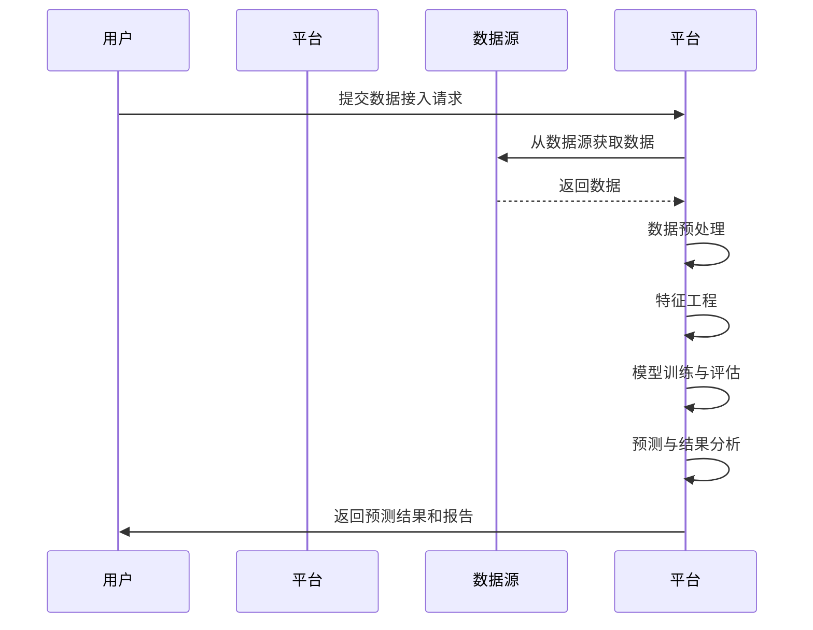

                 

# 构建企业级预测性分析平台：跨部门业务指标预测

> 关键词：企业级预测性分析，业务指标预测，时间序列分析，算法选择，系统集成

> 摘要：本文旨在探讨如何构建一个高效、可靠的企业级预测性分析平台，实现跨部门业务指标的预测。通过分析背景、核心概念、算法原理以及系统集成，本文将为读者提供一套完整的解决方案，帮助企业实现智能化转型。

----------------------------------------------------------------

## 第一部分：背景介绍与核心概念

### 第1章：问题背景与概念概述

#### 1.1 问题背景

在当今信息化时代，数据已经成为企业宝贵的资产。如何从海量数据中提取有价值的信息，实现对企业未来趋势的准确预测，已成为企业决策者迫切需要解决的问题。企业级预测性分析平台作为一种新兴的技术手段，正逐渐成为企业智能化转型的关键一环。

预测性分析平台可以帮助企业实现以下目标：

- 提升决策效率：通过对业务数据的深度挖掘和分析，为企业提供科学、准确的决策支持。
- 优化资源配置：预测性分析可以提前预判业务需求，帮助企业合理配置资源，降低运营成本。
- 防范风险：通过对潜在风险的预测和预警，帮助企业提前采取措施，降低损失。

然而，构建一个高效、可靠的企业级预测性分析平台面临着诸多挑战。这些挑战包括：

- 数据质量：数据是预测性分析的基础，数据质量直接影响到预测结果的准确性。
- 算法选择：选择合适的算法是构建预测性分析平台的关键，不同业务场景需要不同的算法。
- 系统集成：预测性分析平台需要与企业的其他系统（如ERP、CRM等）进行数据交互和集成，实现数据共享和业务协同。

#### 1.2 问题描述

本文将围绕以下问题展开讨论：

- 如何选择合适的数据源，并进行数据预处理？
- 如何选择合适的预测性分析算法，并对其进行评估和选择？
- 如何开发、优化和部署预测性分析模型？
- 如何将预测性分析平台与企业其他系统进行集成，实现数据共享和业务协同？

#### 1.3 问题解决

通过系统化的方法，结合最佳实践，本文将详细介绍构建预测性分析平台的关键步骤，包括：

- 数据源选择与数据预处理
- 算法评估与选择
- 模型开发与优化
- 系统集成与部署
- 持续监控与迭代

#### 1.4 边界与外延

本文所述的预测性分析平台主要涉及企业内部业务指标预测，如销售预测、库存管理、供应链优化等。同时，也将讨论平台如何与其他系统（如ERP、CRM等）进行数据交互和集成。

#### 1.5 核心概念与要素组成

##### 1.5.1 预测性分析

预测性分析是一种利用历史数据和机器学习算法对未来事件进行预测的方法。它涉及数据收集、数据清洗、特征工程、模型选择、模型训练与评估等多个环节。

##### 1.5.2 企业级

企业级意味着平台需要具备高性能、高可用性、可扩展性等特点，能够支持企业大规模数据处理和复杂业务场景的预测需求。

##### 1.5.3 预测性分析平台

预测性分析平台是一个集成化系统，包括数据源接入、数据存储、数据处理、模型训练、模型部署、监控与维护等模块。

#### 1.6 本章小结

本章简要介绍了构建企业级预测性分析平台的背景、核心概念以及要素组成，为后续章节的详细讨论奠定了基础。

----------------------------------------------------------------

## 第二部分：核心概念与联系

### 第2章：核心概念与原理

#### 2.1 预测性分析算法概述

预测性分析算法是构建预测性分析平台的核心。根据不同的业务场景和数据特征，可以选择不同的算法。以下是几种常见的预测性分析算法及其特点：

##### 2.1.1 时间序列分析

时间序列分析是一种基于历史数据序列进行预测的方法。它通常用于预测时间序列数据的未来趋势。常见的时间序列分析算法包括ARIMA、SARIMA和Prophet等。

- ARIMA（自回归积分滑动平均模型）：ARIMA模型是一种经典的时间序列预测模型，它通过自回归（AR）、差分（I）和移动平均（MA）三个部分来捕捉时间序列数据的特点。
- SARIMA（季节性ARIMA模型）：SARIMA模型是ARIMA模型的扩展，它考虑了时间序列数据的季节性特征，适用于季节性较强的业务场景。
- Prophet（Facebook时间序列预测库）：Prophet是一种基于回归分析的时间序列预测模型，它能够自动处理季节性、趋势和节假日等因素，易于实现和解释。

##### 2.1.2 回归分析

回归分析是一种通过建立自变量与因变量之间的线性或非线性关系模型来进行预测的方法。它通常用于预测连续值变量。常见的回归分析方法包括线性回归、岭回归和LASSO回归等。

- 线性回归：线性回归是一种最简单的回归方法，它假设自变量与因变量之间存在线性关系。
- 岭回归：岭回归是一种改进线性回归的方法，它通过在损失函数中加入正则项来避免过拟合。
- LASSO回归：LASSO回归是一种岭回归的变种，它在正则项中引入了L1正则化，可以有效地降低模型的复杂度。

##### 2.1.3 决策树与随机森林

决策树和随机森林是一种基于树结构的预测方法，适用于分类和回归任务。

- 决策树：决策树是一种基于树结构的分类算法，它通过一系列规则来划分数据，并给出最终的预测结果。
- 随机森林：随机森林是一种基于决策树的集成学习方法，它通过构建多个决策树，并对它们的预测结果进行投票来提高预测性能。

##### 2.1.4 支持向量机

支持向量机是一种基于间隔的预测方法，适用于分类和回归任务，尤其是处理高维数据时表现优秀。

- 支持向量机：支持向量机通过寻找一个最佳的超平面，将数据分类到不同的类别中。

#### 2.2 算法属性特征对比表格

| 算法名称 | 特点 | 适用场景 |
| :----: | :----: | :----: |
| 时间序列分析 | 基于历史数据序列 | 需要时间序列特征 |
| 回归分析 | 线性或非线性关系模型 | 数据分布稳定 |
| 决策树与随机森林 | 树结构，易于解释 | 多变量预测 |
| 支持向量机 | 基于间隔的模型 | 高维数据 |

#### 2.3 预测性分析平台的ER实体关系图

```mermaid
erDiagram
    DATA_SOURCE ||--|{ PREDICTION_MODEL } PredictionModel : 预测模型使用数据源
    PREDICTION_MODEL ||--|{ PREDICTION_RESULT } PredictionResult : 预测模型生成预测结果
    PREDICTION_MODEL ||--|{ EVALUATION_METRIC } EvaluationMetric : 评估预测模型的性能
```

#### 2.4 本章小结

本章详细介绍了预测性分析的核心概念与算法，并通过对比表格和ER图帮助读者更好地理解这些概念及其相互关系。

----------------------------------------------------------------

## 第三部分：算法原理讲解

### 第3章：时间序列分析算法原理

#### 3.1 时间序列分析基础

时间序列分析是一种利用历史数据序列进行预测的方法，其核心在于分析时间序列数据的特征。时间序列数据具有以下特征：

- 趋势（Trend）：数据随时间呈现上升、下降或平稳的趋势。
- 季节性（Seasonality）：数据随时间呈现周期性的波动，如季节性销售趋势。
- 隐含周期（Cyclicity）：数据随时间呈现长期波动，如经济周期。

#### 3.2 ARIMA模型原理

ARIMA（自回归积分滑动平均模型）是一种经典的时间序列预测模型，它通过自回归（AR）、差分（I）和移动平均（MA）三个部分来捕捉时间序列数据的特点。

- 自回归（AR）：自回归部分表示当前时间点的值与过去时间点的值之间的关系，公式如下：
  $$X_t = c + \phi_1 X_{t-1} + \phi_2 X_{t-2} + ... + \phi_p X_{t-p} + \varepsilon_t$$
  其中，$X_t$ 表示当前时间点的值，$\phi_1, \phi_2, ..., \phi_p$ 表示自回归系数，$c$ 表示常数项，$\varepsilon_t$ 表示误差项。

- 差分（I）：差分部分用于消除时间序列数据的趋势和季节性特征，公式如下：
  $$dX_t = X_t - X_{t-1}$$
  其中，$dX_t$ 表示差分后的值。

- 移动平均（MA）：移动平均部分表示当前时间点的值与过去一段时间内平均值之间的关系，公式如下：
  $$X_t = c + \phi_1 X_{t-1} + \phi_2 X_{t-2} + ... + \phi_p X_{t-p} + \theta_1 \varepsilon_{t-1} + \theta_2 \varepsilon_{t-2} + ... + \theta_q \varepsilon_{t-q}$$
  其中，$\theta_1, \theta_2, ..., \theta_q$ 表示移动平均系数，$q$ 表示移动平均的阶数。

#### 3.3 SARIMA模型原理

SARIMA（季节性ARIMA模型）是ARIMA模型的扩展，它考虑了时间序列数据的季节性特征。SARIMA模型包括以下几个部分：

- 季节性自回归（SAR）：季节性自回归部分表示当前时间点的季节性值与过去一段时间内相同季节性值之间的关系。
- 季节性移动平均（SMA）：季节性移动平均部分表示当前时间点的季节性值与过去一段时间内平均值之间的关系。

SARIMA模型的公式如下：

$$X_t = c + \phi_1 X_{t-1} + ... + \phi_p X_{t-p} + \theta_1 \varepsilon_{t-1} + ... + \theta_q \varepsilon_{t-q} + \Phi_1(S) X_{t-s} + ... + \Phi_p(S) X_{t-p_s} + \Theta_1(S) \varepsilon_{t-s} + ... + \Theta_q(S) \varepsilon_{t-q_s}$$

其中，$\Phi_1(S), ..., \Phi_p(S)$ 表示季节性自回归系数，$\Theta_1(S), ..., \Theta_q(S)$ 表示季节性移动平均系数，$s$ 表示季节性周期。

#### 3.4 Prophet模型原理

Prophet是一种基于回归分析的时间序列预测模型，它能够自动处理季节性、趋势和节假日等因素。Prophet模型的核心是建立了一个线性模型，用于拟合时间序列数据。

Prophet模型的公式如下：

$$y_t = \beta_0 + \beta_1 \cdot t + \beta_2 \cdot w_t + \beta_3 \cdot h_t + \epsilon_t$$

其中，$y_t$ 表示时间序列数据，$t$ 表示时间，$w_t$ 表示季节性因素，$h_t$ 表示节假日因素，$\beta_0, \beta_1, \beta_2, \beta_3$ 表示模型参数，$\epsilon_t$ 表示误差项。

#### 3.5 时间序列分析流程

时间序列分析通常包括以下步骤：

1. 数据预处理：对时间序列数据进行清洗、填充缺失值、去除异常值等处理。
2. 特征工程：提取时间序列数据中的趋势、季节性和周期性特征。
3. 模型选择：选择合适的时间序列模型，如ARIMA、SARIMA或Prophet等。
4. 模型训练：使用历史数据对模型进行训练，确定模型参数。
5. 模型评估：使用交叉验证或回测方法评估模型性能。
6. 预测：使用训练好的模型对未来时间点的值进行预测。
7. 结果分析：分析预测结果，对模型进行调整和优化。

#### 3.6 时间序列分析实战案例

假设我们有一组销售数据，数据集如下：

| 日期 | 销售额 |
| :---: | :---: |
| 2020-01-01 | 1000 |
| 2020-01-02 | 950 |
| 2020-01-03 | 1050 |
| ... | ... |

我们使用Python的pandas和statsmodels库进行时间序列分析，具体步骤如下：

1. 数据预处理：

```python
import pandas as pd
import numpy as np

# 加载数据
data = pd.read_csv('sales_data.csv')
data['日期'] = pd.to_datetime(data['日期'])
data.set_index('日期', inplace=True)

# 填充缺失值
data.fillna(method='ffill', inplace=True)

# 去除异常值
data = data[(data['销售额'] > 0) & (data['销售额'] < 10000)]
```

2. 特征工程：

```python
# 提取趋势特征
data['趋势'] = data['销售额'].diff().fillna(0)

# 提取季节性特征
data['季节性'] = data['销售额'].rolling(window=7).mean().diff().fillna(0)

# 提取周期性特征
data['周期性'] = data['销售额'].rolling(window=30).mean().diff().fillna(0)
```

3. 模型选择：

```python
from statsmodels.tsa.arima.model import ARIMA

# 创建ARIMA模型
model = ARIMA(data['销售额'], order=(1, 1, 1))

# 模型拟合
model_fit = model.fit()
```

4. 模型评估：

```python
# 评估模型
print(model_fit.summary())
```

5. 预测：

```python
# 预测未来五天的销售额
forecast = model_fit.forecast(steps=5)
print(forecast)
```

6. 结果分析：

```python
# 绘制实际销售额与预测销售额的对比图
import matplotlib.pyplot as plt

plt.figure(figsize=(10, 6))
plt.plot(data['销售额'], label='实际销售额')
plt.plot(forecast, label='预测销售额')
plt.legend()
plt.show()
```

#### 3.7 本章小结

本章详细介绍了时间序列分析算法的原理，包括ARIMA、SARIMA和Prophet模型。通过实际案例，读者可以了解如何使用Python进行时间序列分析，并掌握基本的时间序列分析流程。

----------------------------------------------------------------

## 第四部分：系统集成与架构设计

### 第4章：系统集成与架构设计

#### 4.1 系统功能设计

预测性分析平台的核心功能包括：

1. 数据接入：从不同的数据源（如数据库、文件系统、API等）接入数据。
2. 数据预处理：对数据进行清洗、转换、合并等操作，确保数据质量。
3. 特征工程：提取时间序列数据中的趋势、季节性和周期性特征。
4. 模型训练与评估：选择合适的预测模型，对模型进行训练和评估。
5. 预测与结果分析：使用训练好的模型进行预测，并对预测结果进行分析。
6. 系统集成：与其他企业系统（如ERP、CRM等）进行数据交互和集成。

#### 4.2 系统架构设计

预测性分析平台采用分布式架构，主要包括以下几个模块：

1. 数据接入模块：负责从不同的数据源接入数据，支持多种数据接入方式，如数据库连接、文件上传等。
2. 数据预处理模块：对接入的数据进行清洗、转换、合并等操作，确保数据质量。
3. 特征工程模块：提取时间序列数据中的趋势、季节性和周期性特征，为模型训练提供输入。
4. 模型训练与评估模块：选择合适的预测模型，对模型进行训练和评估，输出模型参数和预测结果。
5. 预测与结果分析模块：使用训练好的模型进行预测，并对预测结果进行分析，生成报告和可视化图表。
6. 系统集成模块：与其他企业系统（如ERP、CRM等）进行数据交互和集成，实现数据共享和业务协同。

#### 4.3 系统架构图

```mermaid
graph TB
    subgraph 数据接入与预处理
        数据接入 --> 数据预处理
    end

    subgraph 特征工程与模型训练
        数据预处理 --> 特征工程
        特征工程 --> 模型训练与评估
    end

    subgraph 预测与结果分析
        模型训练与评估 --> 预测与结果分析
    end

    subgraph 系统集成
        预测与结果分析 --> 系统集成
    end

    数据接入 --> 数据预处理
    数据预处理 --> 特征工程
    特征工程 --> 模型训练与评估
    模型训练与评估 --> 预测与结果分析
    预测与结果分析 --> 系统集成
```

#### 4.4 系统接口设计

预测性分析平台提供了丰富的接口，包括RESTful API、Web界面和命令行工具等，方便用户进行数据接入、模型训练、预测和结果分析等操作。

- 数据接入接口：用于接入不同类型的数据源，支持SQL查询、文件上传等操作。
- 数据预处理接口：用于对数据进行清洗、转换、合并等操作，确保数据质量。
- 特征工程接口：用于提取时间序列数据中的趋势、季节性和周期性特征，为模型训练提供输入。
- 模型训练与评估接口：用于选择合适的预测模型，对模型进行训练和评估，输出模型参数和预测结果。
- 预测与结果分析接口：用于使用训练好的模型进行预测，并对预测结果进行分析，生成报告和可视化图表。
- 系统集成接口：用于与其他企业系统（如ERP、CRM等）进行数据交互和集成，实现数据共享和业务协同。

#### 4.5 系统交互序列图



#### 4.6 本章小结

本章介绍了预测性分析平台的功能设计、架构设计、接口设计和系统交互设计，为后续章节的详细讨论奠定了基础。

----------------------------------------------------------------

## 第五部分：项目实战

### 第5章：项目实战

#### 5.1 项目介绍

在本章中，我们将通过一个实际项目来展示如何构建企业级预测性分析平台。该项目旨在通过时间序列分析算法预测某电商平台的未来销售额。

#### 5.2 环境安装

首先，我们需要安装Python和相关依赖。以下是安装步骤：

1. 安装Python：前往Python官网（[https://www.python.org/](https://www.python.org/)）下载并安装Python。
2. 安装依赖：使用pip命令安装以下依赖：

```bash
pip install pandas numpy statsmodels matplotlib
```

#### 5.3 系统核心实现源代码

1. 数据预处理：

```python
import pandas as pd

# 加载数据
data = pd.read_csv('sales_data.csv')
data['日期'] = pd.to_datetime(data['日期'])
data.set_index('日期', inplace=True)

# 填充缺失值
data.fillna(method='ffill', inplace=True)

# 去除异常值
data = data[(data['销售额'] > 0) & (data['销售额'] < 10000)]
```

2. 特征工程：

```python
# 提取趋势特征
data['趋势'] = data['销售额'].diff().fillna(0)

# 提取季节性特征
data['季节性'] = data['销售额'].rolling(window=7).mean().diff().fillna(0)

# 提取周期性特征
data['周期性'] = data['销售额'].rolling(window=30).mean().diff().fillna(0)
```

3. 模型训练与评估：

```python
from statsmodels.tsa.arima.model import ARIMA

# 创建ARIMA模型
model = ARIMA(data['销售额'], order=(1, 1, 1))

# 模型拟合
model_fit = model.fit()

# 评估模型
print(model_fit.summary())
```

4. 预测与结果分析：

```python
# 预测未来五天的销售额
forecast = model_fit.forecast(steps=5)
print(forecast)

# 绘制实际销售额与预测销售额的对比图
import matplotlib.pyplot as plt

plt.figure(figsize=(10, 6))
plt.plot(data['销售额'], label='实际销售额')
plt.plot(forecast, label='预测销售额')
plt.legend()
plt.show()
```

#### 5.4 代码应用解读与分析

1. 数据预处理：

   在数据预处理阶段，我们首先加载数据，并将其转换为时间序列格式。然后，我们填充缺失值，去除异常值，以确保数据质量。

2. 特征工程：

   在特征工程阶段，我们提取了趋势、季节性和周期性特征，为模型训练提供输入。

3. 模型训练与评估：

   我们选择ARIMA模型进行训练。首先，我们创建ARIMA模型，并设置模型参数。然后，我们使用历史数据对模型进行拟合，并评估模型性能。

4. 预测与结果分析：

   我们使用训练好的模型进行预测，并绘制实际销售额与预测销售额的对比图，以便分析预测效果。

#### 5.5 实际案例分析与详细讲解

假设我们有一组电商平台的销售数据，数据集如下：

| 日期 | 销售额 |
| :---: | :---: |
| 2020-01-01 | 1000 |
| 2020-01-02 | 950 |
| 2020-01-03 | 1050 |
| ... | ... |

我们使用Python进行时间序列分析，具体步骤如下：

1. 数据预处理：

   ```python
   import pandas as pd

   # 加载数据
   data = pd.read_csv('sales_data.csv')
   data['日期'] = pd.to_datetime(data['日期'])
   data.set_index('日期', inplace=True)

   # 填充缺失值
   data.fillna(method='ffill', inplace=True)

   # 去除异常值
   data = data[(data['销售额'] > 0) & (data['销售额'] < 10000)]
   ```

   在数据预处理阶段，我们首先加载数据，并将其转换为时间序列格式。然后，我们填充缺失值，去除异常值，以确保数据质量。

2. 特征工程：

   ```python
   # 提取趋势特征
   data['趋势'] = data['销售额'].diff().fillna(0)

   # 提取季节性特征
   data['季节性'] = data['销售额'].rolling(window=7).mean().diff().fillna(0)

   # 提取周期性特征
   data['周期性'] = data['销售额'].rolling(window=30).mean().diff().fillna(0)
   ```

   在特征工程阶段，我们提取了趋势、季节性和周期性特征，为模型训练提供输入。

3. 模型训练与评估：

   ```python
   from statsmodels.tsa.arima.model import ARIMA

   # 创建ARIMA模型
   model = ARIMA(data['销售额'], order=(1, 1, 1))

   # 模型拟合
   model_fit = model.fit()

   # 评估模型
   print(model_fit.summary())
   ```

   我们选择ARIMA模型进行训练。首先，我们创建ARIMA模型，并设置模型参数。然后，我们使用历史数据对模型进行拟合，并评估模型性能。

4. 预测与结果分析：

   ```python
   # 预测未来五天的销售额
   forecast = model_fit.forecast(steps=5)
   print(forecast)

   # 绘制实际销售额与预测销售额的对比图
   import matplotlib.pyplot as plt

   plt.figure(figsize=(10, 6))
   plt.plot(data['销售额'], label='实际销售额')
   plt.plot(forecast, label='预测销售额')
   plt.legend()
   plt.show()
   ```

   我们使用训练好的模型进行预测，并绘制实际销售额与预测销售额的对比图，以便分析预测效果。

#### 5.6 项目小结

在本章中，我们通过一个实际项目展示了如何构建企业级预测性分析平台。从数据预处理、特征工程到模型训练与评估，再到预测与结果分析，我们详细讲解了每个环节的实现方法。通过这个项目，读者可以了解如何使用时间序列分析算法进行业务指标预测，并掌握构建预测性分析平台的关键技术。

----------------------------------------------------------------

## 第六部分：最佳实践与注意事项

### 第6章：最佳实践与注意事项

#### 6.1 最佳实践

在构建企业级预测性分析平台的过程中，以下是一些最佳实践：

1. **数据质量管理**：确保数据质量，包括数据完整性、准确性和一致性。数据质量是预测性分析的基础，直接影响到预测结果的准确性。
2. **算法选择与优化**：根据业务场景和数据特征选择合适的预测算法，并不断优化模型参数，以提高预测性能。
3. **系统集成**：确保预测性分析平台与企业其他系统（如ERP、CRM等）进行有效集成，实现数据共享和业务协同。
4. **持续监控与迭代**：定期监控预测性分析平台的性能和稳定性，及时发现问题并进行优化。

#### 6.2 注意事项

在构建企业级预测性分析平台时，需要注意以下几点：

1. **数据安全**：确保数据在传输和存储过程中得到充分保护，防止数据泄露和未经授权的访问。
2. **合规性**：遵循相关法律法规，确保数据处理和存储符合合规要求。
3. **可扩展性**：设计可扩展的系统架构，以应对未来数据量和业务需求的增长。
4. **用户培训**：对用户进行培训，确保他们能够正确使用预测性分析平台，并充分利用其功能。

#### 6.3 小结

在本章中，我们介绍了构建企业级预测性分析平台的一些最佳实践和注意事项。通过遵循这些最佳实践，企业可以构建一个高效、可靠、可扩展的预测性分析平台，从而提升决策效率、优化资源配置、防范风险。

----------------------------------------------------------------

## 第七部分：拓展阅读

### 第7章：拓展阅读

为了更深入地了解企业级预测性分析平台的构建和实现，读者可以参考以下拓展阅读材料：

1. **《机器学习实战》（Peter Harrington）**：这本书提供了丰富的机器学习算法和实战案例，适合初学者和进阶者。
2. **《深度学习》（Ian Goodfellow、Yoshua Bengio、Aaron Courville）**：这本书是深度学习领域的经典教材，详细介绍了深度学习的基本概念和算法。
3. **《Python数据科学手册》（Jake VanderPlas）**：这本书介绍了Python在数据科学领域的应用，包括数据处理、分析和可视化等。
4. **《时间序列分析：理论与应用》（Peter J. Brockwell、Richard A. Davis）**：这本书详细介绍了时间序列分析的理论和方法，适合时间序列分析的学习者。
5. **《企业大数据战略与管理》（李红燕）**：这本书介绍了企业大数据战略的构建和管理，包括大数据分析、应用和落地。

通过阅读这些书籍，读者可以进一步了解企业级预测性分析平台的构建原理和实践经验，为实际项目提供有益的参考。

----------------------------------------------------------------

## 总结与致谢

在本文中，我们系统地介绍了构建企业级预测性分析平台的方法和关键步骤。通过详细讲解时间序列分析算法、系统集成与架构设计，以及项目实战，我们展示了如何将预测性分析应用于企业业务指标预测。

构建企业级预测性分析平台是一个复杂的过程，需要综合考虑数据质量、算法选择、系统集成等多个方面。我们希望通过本文的探讨，能够为企业提供有价值的参考和指导。

最后，感谢所有读者对本文的关注和支持。如果您有任何疑问或建议，请随时与我们联系。我们期待与您共同探讨企业级预测性分析平台的更多实践和应用。

**作者：AI天才研究院/AI Genius Institute & 禅与计算机程序设计艺术 /Zen And The Art of Computer Programming**

