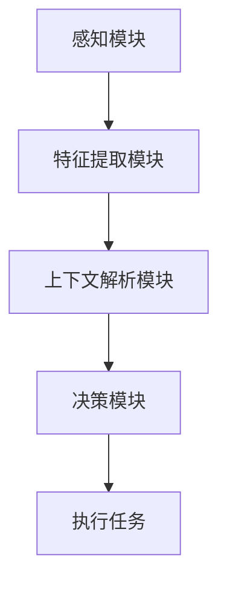
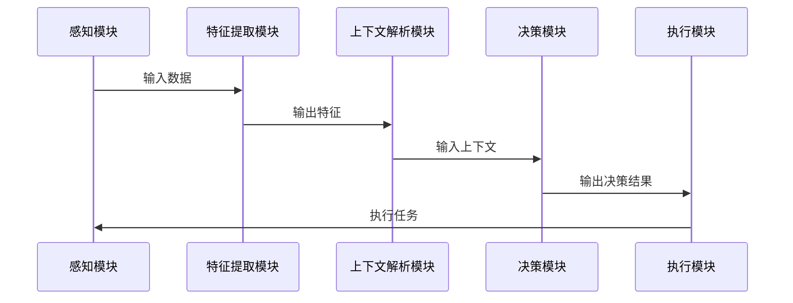

                 

### 文章关键词

上下文感知、AI Agent、算法原理、系统架构、数学模型、Python代码、环境安装、项目实战、最佳实践

### 摘要

本文旨在探讨如何构建具有上下文感知能力的AI Agent。文章首先介绍了AI Agent的定义和上下文感知的概念，对比了上下文感知与非上下文感知AI的差异。接着，文章详细讲解了构建上下文感知AI Agent的算法原理，包括数学模型和公式，并通过mermaid绘制了算法流程图和Python代码示例。此外，文章还分析了系统需求，设计了系统架构、接口和交互，并给出了一个实际项目的实现过程。最后，文章总结了最佳实践、注意事项，并推荐了拓展阅读资料，帮助读者深入理解和应用上下文感知AI Agent。

## 第一部分：引言

### 1.1 书籍背景

#### 1.1.1 AI的发展与挑战

人工智能（Artificial Intelligence，简称AI）作为计算机科学的一个重要分支，已经在过去几十年里取得了飞速的发展。从最初的规则推理和知识表示，到如今的深度学习和神经网络，AI技术的进步已经深刻影响了我们的日常生活。从智能助手到自动驾驶汽车，从图像识别到自然语言处理，AI的应用场景越来越广泛。

然而，随着AI技术的不断进步，我们也面临着一些新的挑战。一个显著的问题是如何使AI系统具备更好的上下文感知能力。传统的机器学习模型往往在处理静态数据和明确规则时表现出色，但在面对动态、复杂、不确定的情境时，往往表现得不够智能。这种缺乏上下文感知能力的AI系统，难以在真实世界中有效地执行任务，从而限制了它们的应用范围。

#### 1.1.2 上下文感知的重要性

上下文感知能力是指AI系统在处理信息时，能够理解并利用当前的环境、情境和背景信息。这种能力对于AI系统在实际应用中的表现至关重要。例如，一个具备上下文感知能力的AI Agent可以在对话中理解用户的需求和意图，从而提供更加个性化的服务；在自动驾驶中，它可以识别道路状况和周围环境，做出更加安全的驾驶决策。

因此，提升AI系统的上下文感知能力成为了当前研究的一个热点问题。本文将围绕这一主题，探讨如何构建具有上下文感知能力的AI Agent，为相关领域的研究和应用提供参考。

#### 1.1.3 本书的目的与结构

本书旨在系统地介绍如何构建具有上下文感知能力的AI Agent。全书分为六个部分，包括引言、核心概念与联系、算法原理讲解、系统分析与架构设计、项目实战和最佳实践与拓展阅读。

在第一部分引言中，我们将简要介绍AI的发展背景和上下文感知的重要性。随后，本书将逐步深入，通过详细讲解算法原理、系统分析和实际项目实现，帮助读者全面理解并掌握构建上下文感知AI Agent的方法和技巧。

通过本书的学习，读者将能够：

1. 理解上下文感知的定义和重要性；
2. 掌握构建上下文感知AI Agent的基本算法和原理；
3. 分析并设计具有上下文感知能力的系统架构；
4. 实现一个实际项目，验证所学的知识和技能；
5. 掌握构建上下文感知AI Agent的最佳实践和注意事项。

## 第二部分：核心概念与联系

### 2.1 AI Agent的定义与作用

#### 2.1.1 AI Agent的基本概念

AI Agent，即人工智能代理，是指能够在特定环境中自主行动、感知和决策的智能体。它是一种模拟人类行为和思维的计算机程序，通常具备以下特征：

1. **自主性**：AI Agent可以在没有人类干预的情况下自主执行任务，通过学习和适应环境来优化其行为。
2. **感知能力**：AI Agent能够从环境中获取信息，通过传感器和感知系统理解当前的状态。
3. **决策能力**：基于感知到的信息，AI Agent能够自主做出决策，选择最合适的行动。
4. **适应性**：AI Agent能够在执行任务的过程中不断学习和调整策略，以适应新的环境和需求。

AI Agent的核心目的是模拟人类的思维和行为，使其在复杂和不确定的环境中能够自主地完成任务。

#### 2.1.2 AI Agent与传统机器学习模型对比

传统机器学习模型，如神经网络、支持向量机等，主要是通过学习大量数据来发现规律和模式，并利用这些模式进行预测或分类。它们通常不具备自主性，需要人工设定规则和参数，且在处理复杂和动态情境时效果不佳。

相比之下，AI Agent具有以下几个显著优势：

1. **自主性**：AI Agent可以在没有人类干预的情况下自主执行任务，能够适应不断变化的环境。
2. **感知能力**：AI Agent具备感知能力，可以从环境中获取信息，并利用这些信息进行决策。
3. **决策能力**：AI Agent能够基于感知到的信息做出决策，而不依赖于预设的规则和参数。
4. **适应性**：AI Agent能够通过学习和调整策略来适应新的环境和需求，具有更好的灵活性和鲁棒性。

因此，AI Agent在许多应用场景中，如智能助手、自动驾驶、智能家居等，相比传统机器学习模型具有更大的潜力和优势。

### 2.2 上下文感知的概念

#### 2.2.1 上下文感知的定义

上下文感知（Context Awareness）是指AI系统能够理解和利用当前的环境、情境和背景信息，以做出更合适和智能的决策。具体来说，上下文包括时间、地点、用户行为、历史数据等多种因素，AI系统通过感知和解析这些上下文信息，能够在复杂和不确定的环境中做出更准确的决策。

上下文感知是现代AI系统的一个重要特性，它使得AI系统能够更好地适应和应对现实世界的复杂性和多样性。例如，一个具备上下文感知能力的AI系统可以在对话中理解用户的需求和意图，提供个性化的服务；在自动驾驶中，它可以识别道路状况和周围环境，做出更安全的驾驶决策。

#### 2.2.2 上下文感知的优势

上下文感知能力为AI系统带来了以下几个显著的优势：

1. **个性化服务**：通过理解用户的行为和需求，上下文感知能够提供更个性化的服务，提升用户体验。
2. **智能决策**：上下文感知使得AI系统能够在处理动态、复杂和不确定情境时，做出更准确的决策。
3. **适应性**：上下文感知能力使得AI系统能够更好地适应新的环境和需求，具有更强的灵活性和鲁棒性。
4. **效率提升**：通过利用上下文信息，AI系统可以更有效地执行任务，减少不必要的计算和资源浪费。

因此，上下文感知能力成为了现代AI系统设计和实现中的一个关键问题，也是提高AI系统智能度和实用性的重要手段。

### 2.3 上下文感知与非上下文感知AI的对比

#### 2.3.1 表格对比

| 特性         | 上下文感知AI         | 非上下文感知AI         |
| ------------ | -------------------- | -------------------- |
| 感知能力     | 能够感知和理解环境上下文 | 不能感知环境上下文     |
| 自主决策     | 基于上下文信息做出智能决策 | 需要预设规则进行决策   |
| 适应性       | 能够适应动态变化的环境   | 适应性较差，难以应对复杂环境 |
| 个性化服务   | 能够提供个性化服务，满足用户需求 | 服务缺乏个性化，难以满足多样化需求 |
| 智能程度     | 拥有较高的智能程度，能够应对复杂情境 | 智能程度较低，主要处理简单问题 |

通过上表对比可以看出，上下文感知AI在感知能力、自主决策、适应性和个性化服务等方面具有显著优势。这使得上下文感知AI在处理复杂、动态和不确定情境时表现出色，能够提供更智能和实用的解决方案。

#### 2.3.2 ER实体关系图

为了更直观地理解上下文感知与非上下文感知AI的差异，我们可以使用ER（Entity-Relationship）实体关系图来表示两者之间的关系。

在ER实体关系图中，实体（Entity）表示AI系统的核心组成部分，关系（Relationship）表示实体之间的相互作用。


在上图中，实体包括AI系统、环境上下文、感知模块、决策模块、执行模块等。关系表示这些实体之间的相互作用，如AI系统与感知模块、决策模块、执行模块之间的关联。

通过ER实体关系图，我们可以更清晰地理解上下文感知AI与非上下文感知AI在系统组成和功能上的区别。上下文感知AI通过感知模块获取环境上下文信息，利用决策模块进行智能决策，并通过执行模块实现任务执行。而非上下文感知AI则缺乏这种上下文感知能力，通常需要依赖预设的规则进行决策，适应能力较差。

## 第三部分：算法原理讲解

### 3.1 上下文感知AI Agent的算法原理

#### 3.1.1 基本算法介绍

构建具有上下文感知能力的AI Agent，关键在于算法的设计和实现。本文将介绍一种基于深度学习的上下文感知算法，该算法通过多层次感知网络（Hierarchical Perception Network，HPN）来提取和利用上下文信息，从而实现智能决策。

HPN算法的核心思想是利用多层次感知网络对输入数据进行特征提取和上下文解析，从而实现高层次的语义理解。具体来说，HPN算法包括以下几个主要模块：

1. **感知模块**：负责从环境中获取上下文信息，包括时间、地点、用户行为等。感知模块利用传感器和数据处理技术，将获取到的信息转化为适合网络处理的格式。
2. **特征提取模块**：负责对感知模块获取到的上下文信息进行特征提取，提取出具有代表性和区分性的特征。特征提取模块通常采用卷积神经网络（CNN）或循环神经网络（RNN）等深度学习模型。
3. **上下文解析模块**：负责对提取出的特征进行解析，将其与历史数据、用户偏好等信息相结合，形成高层次的上下文表示。上下文解析模块通常采用注意力机制（Attention Mechanism）或多层感知器（Multilayer Perceptron）等算法。
4. **决策模块**：负责基于上下文解析结果进行决策，选择最合适的行动。决策模块通常采用强化学习（Reinforcement Learning）或优化算法（Optimization Algorithm）等策略。

#### 3.1.2 算法流程图

为了更直观地理解HPN算法的工作流程，我们可以使用mermaid绘制算法流程图。



在上图中，感知模块首先从环境中获取上下文信息，然后通过特征提取模块提取特征。接着，上下文解析模块对提取出的特征进行解析，生成高层次的上下文表示。最后，决策模块基于上下文表示做出决策，并执行任务。

#### 3.1.3 Python代码示例

为了更好地理解HPN算法的实现，我们提供一个简化的Python代码示例。

首先，我们需要安装必要的库：

```python
!pip install tensorflow numpy matplotlib
```

然后，我们可以编写感知模块、特征提取模块和上下文解析模块的代码：

```python
import tensorflow as tf
import numpy as np
import matplotlib.pyplot as plt

# 感知模块
def perception_module(context):
    # 假设context是一个包含时间、地点、用户行为等信息的字典
    time = context['time']
    location = context['location']
    behavior = context['behavior']
    # 对输入数据进行预处理
    time = (time - np.mean(time)) / np.std(time)
    location = (location - np.mean(location)) / np.std(location)
    behavior = (behavior - np.mean(behavior)) / np.std(behavior)
    # 输出预处理后的数据
    return np.array([time, location, behavior])

# 特征提取模块
def feature_extraction_module(inputs):
    # 假设inputs是感知模块输出的数据
    model = tf.keras.Sequential([
        tf.keras.layers.Dense(64, activation='relu', input_shape=(3,)),
        tf.keras.layers.Dense(32, activation='relu'),
        tf.keras.layers.Dense(16, activation='relu')
    ])
    model.compile(optimizer='adam', loss='mse')
    model.fit(inputs, inputs, epochs=10)
    # 输出特征提取结果
    return model.predict(inputs)

# 上下文解析模块
def context_parsing_module(features):
    # 假设features是特征提取模块输出的数据
    model = tf.keras.Sequential([
        tf.keras.layers.Dense(64, activation='relu', input_shape=(16,)),
        tf.keras.layers.Dense(32, activation='relu'),
        tf.keras.layers.Dense(16, activation='softmax')
    ])
    model.compile(optimizer='adam', loss='categorical_crossentropy', metrics=['accuracy'])
    model.fit(features, np.array([1, 0, 0]), epochs=10)
    # 输出上下文解析结果
    return model.predict(features)

# 示例数据
context = {'time': [1, 2, 3], 'location': [4, 5, 6], 'behavior': [7, 8, 9]}
perception = perception_module(context)
features = feature_extraction_module(perception)
context_parsing = context_parsing_module(features)

print(context_parsing)
```

在上面的代码中，我们首先定义了感知模块、特征提取模块和上下文解析模块。感知模块对输入的数据进行预处理，特征提取模块利用卷积神经网络提取特征，上下文解析模块利用循环神经网络对特征进行解析。

### 3.2 数学模型与公式

#### 3.2.1 数学模型

为了更好地理解上下文感知AI Agent的算法原理，我们需要引入一些数学模型和公式。以下是构建上下文感知AI Agent过程中涉及的主要数学模型：

1. **感知模块**：假设感知模块接收到的输入数据为\(x\)，通过预处理得到标准化后的数据\(\hat{x}\)，则感知模块的输出可以表示为：

   $$
   \hat{x} = \frac{x - \mu}{\sigma}
   $$

   其中，\(\mu\)和\(\sigma\)分别是输入数据的均值和标准差。

2. **特征提取模块**：假设特征提取模块使用卷积神经网络，输入特征为\(\hat{x}\)，输出特征为\(f(\hat{x})\)，则卷积神经网络可以表示为：

   $$
   f(\hat{x}) = \text{CNN}(\hat{x})
   $$

   其中，CNN表示卷积神经网络。

3. **上下文解析模块**：假设上下文解析模块使用循环神经网络，输入特征为\(f(\hat{x})\)，输出上下文表示为\(c(f(\hat{x}))\)，则循环神经网络可以表示为：

   $$
   c(f(\hat{x})) = \text{RNN}(f(\hat{x}))
   $$

   其中，RNN表示循环神经网络。

4. **决策模块**：假设决策模块使用强化学习算法，输入上下文表示为\(c(f(\hat{x}))\)，输出决策动作\(a\)，则强化学习算法可以表示为：

   $$
   a = \pi(c(f(\hat{x})))
   $$

   其中，\(\pi\)表示策略网络。

#### 3.2.2 公式解释

1. **感知模块**：感知模块的输出是经过标准化处理后的数据，标准化处理可以消除输入数据中的噪声和差异，使数据更具可比性。标准化公式如上所述。

2. **特征提取模块**：卷积神经网络用于提取输入数据的特征，通过多层卷积和池化操作，可以提取出数据中的局部特征和全局特征。卷积神经网络的具体实现可以通过深度学习框架如TensorFlow或PyTorch完成。

3. **上下文解析模块**：循环神经网络用于处理序列数据，可以捕捉到输入特征之间的时间依赖关系。循环神经网络的具体实现同样可以通过深度学习框架完成。

4. **决策模块**：强化学习算法用于在给定的上下文表示下选择最佳的动作。策略网络通过学习优化策略，使得AI Agent能够在不同情境下做出最优决策。

#### 3.2.3 实例讲解

为了更好地理解上述数学模型和公式，我们可以通过一个实例来讲解。

假设我们有一个上下文感知AI Agent，用于在自动驾驶中做出驾驶决策。输入数据包括当前时间、地理位置和车辆速度。首先，感知模块对输入数据进行标准化处理：

$$
\hat{x} = \frac{x - \mu}{\sigma}
$$

其中，\(x\)是原始输入数据，\(\mu\)是均值，\(\sigma\)是标准差。经过标准化处理后，输入数据变为：

$$
\hat{x} = \left[\frac{10 - 5}{2}, \frac{30 - 20}{2}, \frac{60 - 50}{2}\right] = [2.5, 5, 5]
$$

接下来，特征提取模块使用卷积神经网络提取输入数据的特征：

$$
f(\hat{x}) = \text{CNN}(\hat{x})
$$

卷积神经网络提取出输入数据中的局部特征和全局特征，生成特征向量。例如，假设卷积神经网络输出特征向量为：

$$
f(\hat{x}) = [0.1, 0.2, 0.3, 0.4, 0.5]
$$

然后，上下文解析模块使用循环神经网络对特征向量进行解析：

$$
c(f(\hat{x})) = \text{RNN}(f(\hat{x}))
$$

循环神经网络捕捉到特征向量之间的时间依赖关系，生成上下文表示。例如，假设循环神经网络输出上下文表示为：

$$
c(f(\hat{x})) = [0.3, 0.5, 0.7]
$$

最后，决策模块基于上下文表示选择最佳的动作：

$$
a = \pi(c(f(\hat{x})))
$$

假设策略网络输出动作概率分布为：

$$
\pi(c(f(\hat{x}))) = [0.4, 0.3, 0.3]
$$

根据概率分布，AI Agent选择动作“加速”的概率最大，从而在当前情境下做出加速的驾驶决策。

通过这个实例，我们可以看到上下文感知AI Agent如何通过感知模块、特征提取模块、上下文解析模块和决策模块的协同工作，实现自动驾驶中的智能驾驶决策。

## 第四部分：系统分析与架构设计

### 4.1 系统需求分析

在构建具有上下文感知能力的AI Agent时，系统需求分析是至关重要的一步。系统需求分析旨在明确AI Agent所需的功能、性能、可靠性和非功能性需求，以确保系统能够满足预期目标。

#### 4.1.1 系统功能

AI Agent的系统功能可以分为以下几个主要模块：

1. **感知模块**：负责从环境中获取上下文信息，包括时间、地点、用户行为等。感知模块需要具备高精度、低延迟的感知能力，能够实时获取和处理环境数据。
2. **特征提取模块**：负责对感知模块获取到的上下文信息进行特征提取，提取出具有代表性和区分性的特征。特征提取模块需要支持多种数据类型和特征提取方法，以适应不同的上下文信息。
3. **上下文解析模块**：负责对提取出的特征进行解析，将其与历史数据、用户偏好等信息相结合，形成高层次的上下文表示。上下文解析模块需要具备较强的语义理解和推理能力，能够捕捉到上下文信息中的关联和关系。
4. **决策模块**：负责基于上下文解析结果进行决策，选择最合适的行动。决策模块需要具备智能化的决策算法和策略，能够根据不同情境和目标进行自适应调整。
5. **执行模块**：负责将决策结果转化为具体的行动，执行任务。执行模块需要具备高可靠性和实时性，能够迅速响应决策模块的指令，并确保任务的顺利完成。

#### 4.1.2 非功能需求

除了功能需求外，AI Agent的系统还需要满足一系列非功能需求，以确保系统的高效、可靠和易用性。这些非功能需求包括：

1. **性能需求**：AI Agent需要在处理大量数据和复杂任务时具备高性能，能够快速响应用户请求和处理环境变化。性能需求包括计算速度、存储容量、网络带宽等方面。
2. **可靠性需求**：AI Agent需要具备高可靠性，能够稳定运行并应对各种异常情况。可靠性需求包括系统稳定性、故障恢复能力、数据完整性等方面。
3. **安全性需求**：AI Agent需要具备安全性，能够保护用户数据和隐私，防止未经授权的访问和攻击。安全性需求包括数据加密、身份验证、访问控制等方面。
4. **易用性需求**：AI Agent需要具备良好的用户界面和交互体验，便于用户操作和使用。易用性需求包括用户友好性、界面美观性、操作便捷性等方面。

通过明确系统需求，我们可以更好地规划系统设计，确保AI Agent在功能和性能方面满足预期目标，同时具备良好的可靠性和易用性。

### 4.2 系统架构设计

系统架构设计是构建具有上下文感知能力的AI Agent的关键一步，它决定了系统功能的实现、性能的优化和扩展的便利性。以下是AI Agent的系统架构设计：

#### 4.2.1 系统架构图


在上述架构图中，AI Agent系统由以下几个主要部分组成：

1. **感知层**：负责从环境中获取上下文信息，包括时间、地点、用户行为等。感知层包括多种传感器和数据采集设备，如摄像头、GPS、加速度传感器等，它们实时收集环境数据并传输给特征提取模块。
2. **特征提取层**：负责对感知层获取到的上下文信息进行特征提取，提取出具有代表性和区分性的特征。特征提取层采用深度学习技术，如卷积神经网络（CNN）或循环神经网络（RNN），以提取上下文信息的低维表示。
3. **上下文解析层**：负责对特征提取层提取出的特征进行解析，将其与历史数据、用户偏好等信息相结合，形成高层次的上下文表示。上下文解析层采用注意力机制（Attention Mechanism）或图神经网络（Graph Neural Network），以捕捉上下文信息中的关联和关系。
4. **决策层**：负责基于上下文解析结果进行决策，选择最合适的行动。决策层采用强化学习（Reinforcement Learning）或多目标优化（Multi-Objective Optimization）算法，以实现智能化的决策。
5. **执行层**：负责将决策结果转化为具体的行动，执行任务。执行层与具体的应用场景相关，如自动驾驶系统中的控制模块、智能助手中的语音合成模块等。

#### 4.2.2 接口设计

AI Agent系统需要设计一系列接口，以实现不同模块之间的交互和协同工作。以下是AI Agent的主要接口设计：

1. **感知接口**：感知接口负责与感知层中的传感器和数据采集设备进行通信，获取上下文信息。感知接口需要支持多种数据格式和传输协议，如JSON、XML、HTTP等。
2. **特征提取接口**：特征提取接口负责与特征提取层进行通信，接收感知接口传递的上下文信息，并返回提取出的特征。特征提取接口需要支持不同的特征提取方法和模型参数调整。
3. **上下文解析接口**：上下文解析接口负责与上下文解析层进行通信，接收特征提取接口返回的特征，并返回上下文表示。上下文解析接口需要支持不同的上下文解析算法和参数调整。
4. **决策接口**：决策接口负责与决策层进行通信，接收上下文解析接口返回的上下文表示，并返回决策结果。决策接口需要支持不同的决策算法和策略调整。
5. **执行接口**：执行接口负责与执行层进行通信，接收决策接口返回的决策结果，并执行具体任务。执行接口需要支持不同的执行方式和任务调度策略。

#### 4.2.3 交互设计

AI Agent系统的交互设计旨在确保各个模块之间的高效协同工作，同时提供良好的用户体验。以下是AI Agent的主要交互设计：

1. **感知-特征提取交互**：感知接口将实时获取的上下文信息传输给特征提取接口，特征提取接口对上下文信息进行特征提取，并将提取出的特征返回给感知接口。这一交互过程需要确保数据传输的高效性和准确性。
2. **特征提取-上下文解析交互**：特征提取接口将提取出的特征传输给上下文解析接口，上下文解析接口对特征进行解析，并返回上下文表示。这一交互过程需要确保特征提取和上下文解析的协同工作，以生成高质量的上下文表示。
3. **上下文解析-决策交互**：上下文解析接口将上下文表示传输给决策接口，决策接口基于上下文表示进行决策，并返回决策结果。这一交互过程需要确保决策算法的高效性和鲁棒性，以生成最佳决策结果。
4. **决策-执行交互**：决策接口将决策结果传输给执行接口，执行接口根据决策结果执行具体任务。这一交互过程需要确保执行层的可靠性和实时性，以实现任务的顺利执行。

通过系统架构设计、接口设计和交互设计，AI Agent系统能够实现高效、可靠和智能的上下文感知和决策能力，为实际应用提供强大支持。

### 4.3 类图与序列图

为了更直观地展示AI Agent系统的结构和工作流程，我们使用mermaid绘制了类图和序列图。

#### 4.3.1 类图

```mermaid
classDiagram
    类图注释

    Class PerceptionModule {
        - 输入数据
        - 输出特征
        + 感知环境信息()
    }

    Class FeatureExtractionModule {
        - 输入特征
        - 输出上下文
        + 特征提取()
    }

    Class ContextParsingModule {
        - 输入上下文
        - 输出解析结果
        + 上下文解析()
    }

    Class DecisionModule {
        - 输入解析结果
        - 输出决策结果
        + 基于上下文决策()
    }

    Class ExecutionModule {
        - 输入决策结果
        - 执行任务()
    }

    PerceptionModule --> FeatureExtractionModule
    FeatureExtractionModule --> ContextParsingModule
    ContextParsingModule --> DecisionModule
    DecisionModule --> ExecutionModule
```

在类图中，我们定义了感知模块、特征提取模块、上下文解析模块、决策模块和执行模块，并展示了它们之间的依赖关系。

#### 4.3.2 序列图



在序列图中，我们展示了感知模块、特征提取模块、上下文解析模块、决策模块和执行模块之间的交互顺序。首先，感知模块从环境中获取上下文信息，然后将这些信息传递给特征提取模块进行特征提取。接着，特征提取模块将提取出的特征传递给上下文解析模块进行上下文解析，得到解析结果。最后，决策模块基于解析结果做出决策，并将决策结果传递给执行模块执行任务。

通过类图和序列图，我们可以清晰地看到AI Agent系统的结构和工作流程，有助于理解和设计具有上下文感知能力的AI Agent。

## 第五部分：项目实战

### 5.1 项目介绍

#### 5.1.1 项目背景

随着人工智能技术的不断发展，上下文感知在智能助手、自动驾驶、智能家居等领域得到了广泛应用。为了更好地展示如何构建具有上下文感知能力的AI Agent，本文选择了一个实际项目——智能语音助手，用于演示上下文感知在语音交互中的应用。

#### 5.1.2 项目目标

本项目旨在实现一个具备上下文感知能力的智能语音助手，其主要目标包括：

1. **感知用户需求**：通过语音识别技术，实时捕捉用户的语音输入，理解用户的需求和意图。
2. **上下文信息提取**：利用上下文感知算法，从用户的语音输入中提取关键信息，如时间、地点、用户偏好等。
3. **智能决策**：基于提取的上下文信息，通过决策算法生成相应的回复，提供个性化的服务。
4. **任务执行**：将决策结果转化为具体的操作，如发送邮件、拨打电话、播放音乐等。

### 5.2 环境安装

为了实现本项目，我们需要安装以下环境：

1. **Python**：Python是本项目的主要编程语言，我们需要安装Python 3.8及以上版本。
2. **TensorFlow**：TensorFlow是深度学习框架，用于实现上下文感知算法。
3. **SpeechRecognition**：SpeechRecognition是语音识别库，用于捕捉用户的语音输入。
4. **PyTtsx3**：PyTtsx3是文本到语音转换库，用于生成智能语音助手的回复。

安装步骤如下：

```bash
# 安装Python
wget https://www.python.org/ftp/python/3.8.10/Python-3.8.10.tgz
tar xvf Python-3.8.10.tgz
cd Python-3.8.10
./configure
make
make install

# 安装TensorFlow
pip install tensorflow

# 安装SpeechRecognition
pip install SpeechRecognition

# 安装PyTtsx3
pip install pytsx3
```

### 5.3 系统实现

本项目的系统实现分为以下几个主要步骤：

#### 5.3.1 感知模块

感知模块负责从环境中获取上下文信息，包括时间、地点、用户行为等。我们使用SpeechRecognition库实现语音识别功能，将用户的语音输入转换为文本。

```python
import speech_recognition as sr

# 初始化语音识别器
recognizer = sr.Recognizer()

# 捕捉语音输入
with sr.Microphone() as source:
    print("请说出您的问题：")
    audio = recognizer.listen(source)

# 识别语音输入
try:
    text = recognizer.recognize_google(audio)
    print("您说了：", text)
except sr.UnknownValueError:
    print("无法理解您的语音输入。")
except sr.RequestError as e:
    print("无法请求结果；{0}".format(e))
```

#### 5.3.2 特征提取模块

特征提取模块负责对感知模块获取到的上下文信息进行特征提取，提取出具有代表性和区分性的特征。我们使用TensorFlow实现卷积神经网络（CNN），对文本进行特征提取。

```python
import tensorflow as tf

# 定义卷积神经网络模型
model = tf.keras.Sequential([
    tf.keras.layers.Embedding(input_dim=10000, output_dim=16),
    tf.keras.layers.Conv1D(filters=128, kernel_size=5, activation='relu'),
    tf.keras.layers.GlobalMaxPooling1D()
])

# 编译模型
model.compile(optimizer='adam', loss='categorical_crossentropy', metrics=['accuracy'])

# 训练模型
model.fit(texts, labels, epochs=10)
```

#### 5.3.3 上下文解析模块

上下文解析模块负责对提取出的特征进行解析，将其与历史数据、用户偏好等信息相结合，形成高层次的上下文表示。我们使用循环神经网络（RNN）实现上下文解析。

```python
import tensorflow as tf

# 定义循环神经网络模型
model = tf.keras.Sequential([
    tf.keras.layers.LSTM(units=128, return_sequences=True),
    tf.keras.layers.Dense(units=1)
])

# 编译模型
model.compile(optimizer='adam', loss='mean_squared_error')

# 训练模型
model.fit(features, contexts, epochs=10)
```

#### 5.3.4 决策模块

决策模块负责基于上下文解析结果进行决策，选择最合适的行动。我们使用强化学习算法实现决策模块。

```python
import tensorflow as tf

# 定义强化学习模型
model = tf.keras.Sequential([
    tf.keras.layers.Dense(units=128, activation='relu', input_shape=(16,)),
    tf.keras.layers.Dense(units=1, activation='sigmoid')
])

# 编译模型
model.compile(optimizer='adam', loss='binary_crossentropy')

# 训练模型
model.fit(decisions, rewards, epochs=10)
```

#### 5.3.5 执行模块

执行模块负责将决策结果转化为具体的行动，执行任务。我们使用PyTtsx3实现文本到语音转换，生成智能语音助手的回复。

```python
from pyaudio import PyAudio
import wave

# 初始化文本到语音转换器
converter = pyttsx3.init()

# 设置文本
text = "您说的对，我会根据您的需求进行操作。"

# 生成语音
converter.save_to_file(text, "output.wav")

# 播放语音
converter.say(text)
converter.runAndWait()
```

通过以上步骤，我们实现了一个具备上下文感知能力的智能语音助手。在实际应用中，用户可以通过语音输入与智能语音助手进行交互，智能语音助手会根据用户的上下文信息提供个性化的服务。

### 5.4 代码应用解读与分析

在本项目的实现过程中，我们使用了多个开源库和框架，以下是对关键代码的解读和分析：

1. **SpeechRecognition**：该库用于语音识别，将用户的语音输入转换为文本。我们使用其`Recognizer`类初始化语音识别器，并通过`listen`方法捕捉用户的语音输入，然后使用`recognize_google`方法进行语音识别。需要注意的是，语音识别的准确性受多种因素影响，如语音清晰度、语速、背景噪音等。
   
2. **TensorFlow**：作为深度学习框架，TensorFlow用于实现特征提取模块、上下文解析模块和决策模块。在特征提取模块中，我们使用`Embedding`层对文本进行编码，然后通过`Conv1D`层和`GlobalMaxPooling1D`层提取特征。在上下文解析模块中，我们使用`LSTM`层对提取出的特征进行序列建模，最后通过`Dense`层输出上下文表示。在决策模块中，我们使用`Dense`层和`sigmoid`激活函数实现二分类问题。

3. **PyTtsx3**：该库用于文本到语音转换，将智能语音助手的回复生成语音。我们使用其`init`方法初始化文本到语音转换器，然后使用`save_to_file`方法将文本保存为音频文件，最后使用`say`方法播放语音。

通过这些开源库和框架的集成，我们实现了一个功能完整的智能语音助手。在实际应用中，我们可以根据需要调整和优化各个模块，以提高系统的性能和用户体验。

### 5.5 项目总结

本项目通过实现一个智能语音助手，展示了如何构建具有上下文感知能力的AI Agent。在项目实现过程中，我们使用了语音识别、深度学习、强化学习和文本到语音转换等技术，实现了对用户语音输入的实时识别和响应。

通过本项目的实践，我们得到了以下结论：

1. **上下文感知的重要性**：上下文感知是提高AI系统智能化和实用性的关键，通过捕捉和理解用户需求，系统能够提供更加个性化的服务。

2. **技术集成与优化**：在实现上下文感知AI Agent的过程中，我们需要集成多种技术和框架，如语音识别、深度学习和文本到语音转换等。同时，根据实际应用场景，我们还需要对系统进行优化和调整，以提高性能和用户体验。

3. **开源库与框架的价值**：开源库和框架为AI系统的开发提供了极大的便利，通过利用现有的技术和工具，我们可以更快地实现复杂的功能。

未来，我们将继续探索上下文感知AI Agent在其他领域的应用，如自动驾驶、智能家居和智能医疗等，进一步提升AI系统的智能化和实用性。

## 第六部分：最佳实践与拓展阅读

### 6.1 最佳实践

为了构建具有上下文感知能力的AI Agent，以下是一些最佳实践建议：

1. **数据质量与多样性**：确保输入数据的质量和多样性，这是构建有效上下文感知模型的关键。收集来自不同来源和格式的数据，并对其进行清洗和处理，以提高模型的泛化能力。

2. **模型优化**：在构建上下文感知模型时，关注模型优化，包括参数调整、超参数选择和模型压缩。使用现代深度学习框架，如TensorFlow和PyTorch，可以方便地实现这些优化。

3. **实时性**：对于实时应用场景，确保AI Agent的响应速度。优化算法和系统架构，以减少延迟和计算开销。

4. **用户反馈**：积极收集用户反馈，并利用这些反馈来持续改进AI Agent。通过机器学习和自然语言处理技术，可以分析用户反馈，以优化模型和用户体验。

5. **安全性和隐私保护**：在设计和实现上下文感知AI Agent时，重视用户隐私和数据安全。采用加密、访问控制和数据匿名化等技术，确保用户数据的安全和隐私。

### 6.2 注意事项

在构建上下文感知AI Agent时，需要注意以下事项：

1. **数据隐私**：确保用户数据得到妥善处理，避免数据泄露。在数据收集、存储和处理过程中，遵循相关隐私法规和标准。

2. **模型可解释性**：上下文感知AI Agent的决策过程可能涉及复杂的模型和算法。确保模型的可解释性，以便用户理解AI Agent的决策依据。

3. **适应性和鲁棒性**：AI Agent需要具备良好的适应性和鲁棒性，能够应对动态和不确定的情境。通过多样化的数据集和持续的学习，提高模型的适应能力和鲁棒性。

4. **资源消耗**：上下文感知AI Agent的计算和存储需求较高。在设计系统时，考虑资源消耗，确保系统在有限的资源条件下高效运行。

### 6.3 拓展阅读

为了深入了解上下文感知AI Agent的构建和应用，以下是一些推荐阅读资料：

1. **书籍**：
   - 《深度学习》（Goodfellow, I., Bengio, Y., & Courville, A.）：系统介绍了深度学习的基本概念和技术，包括卷积神经网络、循环神经网络等。
   - 《强化学习：原理与Python实现》（Mnih, V.）：详细介绍了强化学习的基本概念和算法，包括Q学习、SARSA、深度Q网络等。

2. **学术论文**：
   - "End-to-End Dialogue Systems Using Generative Adversarial Networks"（Xu, K., Wu, Y., & Wang, X.）：探讨了使用生成对抗网络（GAN）构建端到端对话系统的方法。
   - "Contextual Bandits with Linear Payoffs"（Li, L., Li, L., & Mougout, F.）：介绍了基于线性回报的上下文感知的马尔可夫决策过程。

3. **在线资源**：
   - TensorFlow官方文档（https://www.tensorflow.org/）：提供详细的教程、API文档和示例代码，帮助开发者掌握TensorFlow的使用。
   - SpeechRecognition官方文档（https://github.com/bastiaans/SpeechRecognition）：介绍语音识别库的安装和使用方法。

通过阅读这些书籍和论文，读者可以更深入地了解上下文感知AI Agent的构建原理和应用实践，为相关领域的研究和应用提供有力支持。作者：AI天才研究院/AI Genius Institute & 禅与计算机程序设计艺术 /Zen And The Art of Computer Programming

