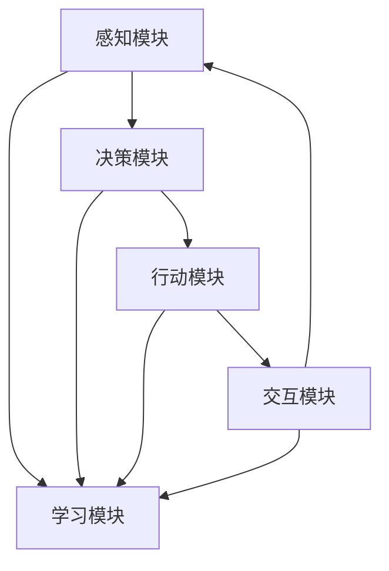
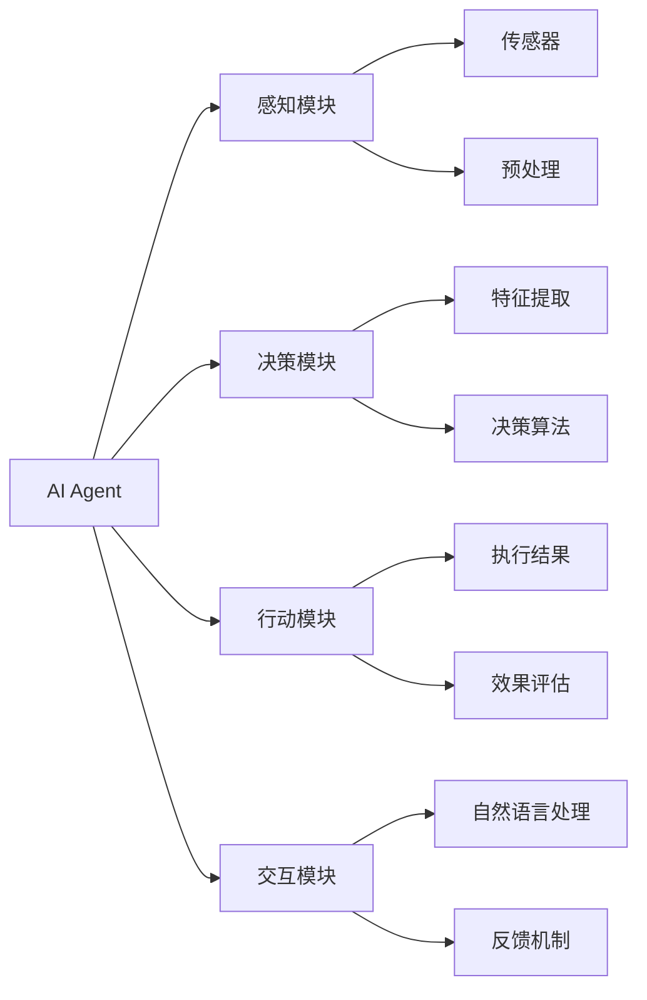
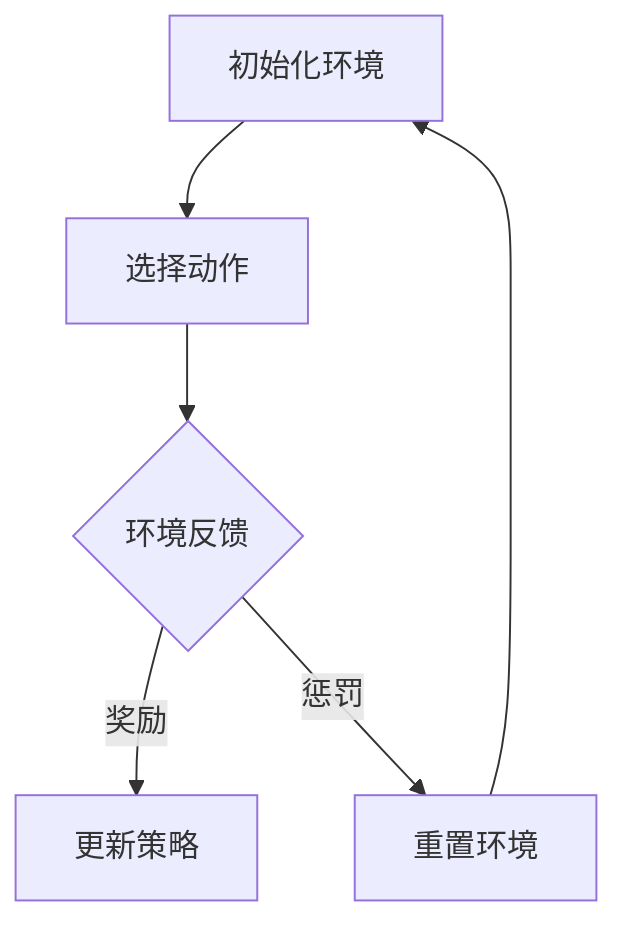
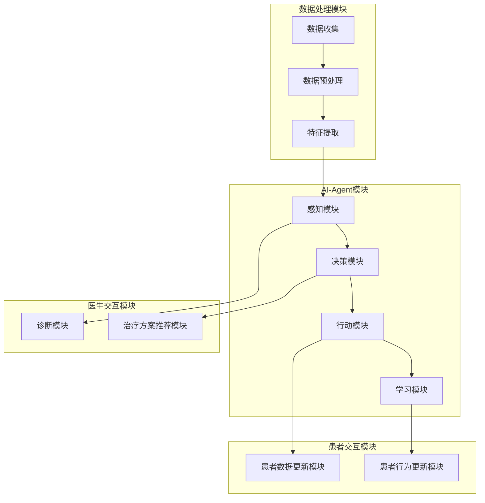
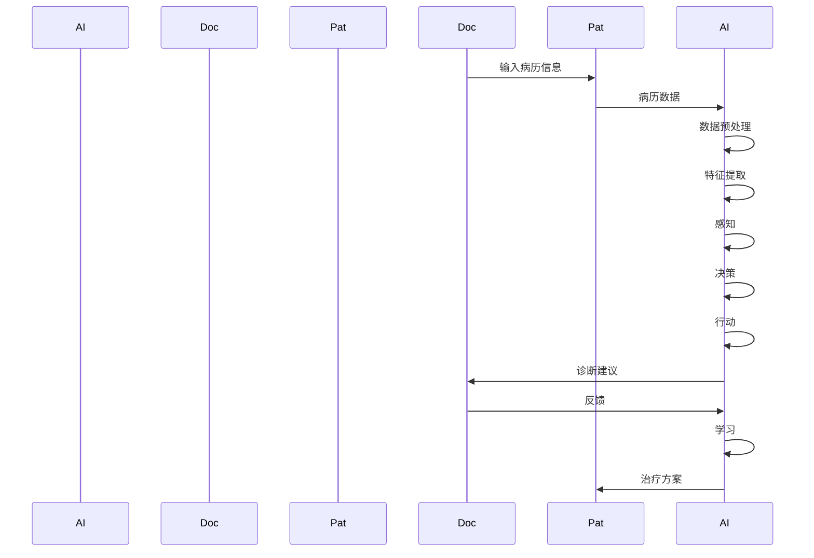

                 

### 第1章 引言

#### 1.1 问题的背景

在当今快速发展的信息技术时代，人工智能（AI）已经成为推动社会进步和产业升级的重要力量。随着AI技术的不断进步，人们对于AI的期望也在逐渐增加，尤其是在与人类协作方面。AI Agent，作为一种能够自主执行任务、进行决策和与人互动的智能体，正逐渐成为人工智能研究的一个重要方向。

AI Agent的概念源于人工智能领域，其目标是实现机器对环境的高效感知、理解、决策和行动。这种智能体不仅能够处理结构化的数据，还能够通过机器学习、自然语言处理等技术进行自适应学习和优化。在人与机器协作的背景下，AI Agent的重要性愈加凸显，因为它能够帮助人类更高效地完成复杂任务，提高生产效率，甚至在某些领域内替代人类完成危险或繁琐的工作。

然而，构建具有人机协作学习能力的AI Agent系统并非易事。首先，AI Agent需要具备高度的认知能力，能够理解人类语言和意图，并根据环境变化做出合理决策。其次，AI Agent需要具备良好的学习能力，能够在与人类协作的过程中不断优化自己的性能。此外，AI Agent还需要具备一定的安全性和鲁棒性，以避免在复杂环境中出现不可预测的错误。

本文旨在探讨如何构建具有人机协作学习能力的AI Agent系统，具体目标包括：

1. **系统构建**：详细分析AI Agent系统的基本结构和设计原则。
2. **人机协作学习**：介绍人机协作学习的机制，包括信息共享、学习策略、合作与竞争平衡等。
3. **实现与优化**：探讨AI Agent系统的实现过程，包括数据收集与预处理、模型训练与优化等。
4. **应用案例**：通过具体案例展示AI Agent系统在智能客服、智能教育和智能医疗等领域的应用效果。
5. **未来展望**：分析AI Agent系统的未来发展趋势，探讨可能的技术挑战和行业机遇。

#### 1.2 问题描述

在构建具有人机协作学习能力的AI Agent系统时，我们面临以下几个关键问题：

1. **认知能力**：如何使AI Agent具备高度的认知能力，理解人类的语言和意图？
2. **学习能力**：如何设计有效的学习机制，使AI Agent能够不断优化自身的性能？
3. **安全性与鲁棒性**：如何确保AI Agent在复杂环境中运行的安全性和鲁棒性？
4. **交互体验**：如何提升AI Agent与人类的交互体验，使其更加自然、流畅？
5. **协作效率**：如何在AI Agent与人类之间建立高效的协作机制，最大化协作效果？

这些问题涉及到AI Agent系统构建的多个方面，包括感知与理解、决策与行动、交互与反馈等。同时，人机协作学习机制的设计也是一个关键挑战，需要在保证学习效果的同时，确保系统的稳定性和可扩展性。

#### 1.3 问题解决

为了解决上述问题，我们需要从以下几个方面着手：

1. **系统设计**：设计一个具有灵活性和可扩展性的AI Agent系统架构，包括感知模块、决策模块、行动模块和交互模块。
2. **人机协作学习机制**：建立一套完整的人机协作学习机制，包括信息共享、学习策略、合作与竞争平衡等。
3. **算法实现**：选择合适的机器学习算法，结合深度学习、强化学习等技术，实现AI Agent的学习与优化。
4. **安全性保障**：通过安全设计、数据加密、隐私保护等技术手段，确保AI Agent系统的安全性。
5. **用户体验优化**：通过自然语言处理、语音识别等技术，提升AI Agent与人类的交互体验。

#### 1.4 边界与外延

尽管AI Agent系统具有广泛的应用前景，但其构建和应用仍然受到一些限制。例如：

1. **技术限制**：目前的一些AI技术尚未完全成熟，例如在处理自然语言理解和复杂决策方面。
2. **数据限制**：AI Agent的训练需要大量的高质量数据，但数据获取和处理的成本较高。
3. **伦理与法律**：AI Agent的应用需要遵守相关的伦理和法律规范，确保不侵犯个人隐私和权益。

#### 1.5 概念结构与核心要素组成

在构建具有人机协作学习能力的AI Agent系统时，我们需要明确以下几个核心概念和要素：

1. **AI Agent**：具有自主感知、决策和行动能力的智能体，能够与人类协作完成复杂任务。
2. **感知模块**：负责收集和处理环境信息，为AI Agent提供决策依据。
3. **决策模块**：基于感知模块提供的信息，利用机器学习算法进行决策。
4. **行动模块**：执行决策结果，实现AI Agent的行为。
5. **交互模块**：负责AI Agent与人类之间的信息交换和协作。

这些核心要素共同构成了一个具有人机协作学习能力的AI Agent系统，它们之间的相互作用和协同工作，是实现系统目标的关键。

### 总结

本文引言部分首先介绍了构建具有人机协作学习能力的AI Agent系统的背景和重要性，然后明确了研究目标、问题解决方法和边界与外延，最后对系统的核心概念和要素进行了详细阐述。接下来，我们将逐步深入探讨AI Agent系统的基础、人机协作学习原理、系统设计与实现，以及实际应用案例，为读者呈现一个全面、深入的AI Agent系统构建指南。### 第2章 AI Agent系统基础

#### 2.1 AI Agent概述

AI Agent，即人工智能代理，是人工智能领域中的一个核心概念，它代表了能够自主执行任务、与环境进行交互并作出决策的智能实体。AI Agent的概念可以追溯到人工智能的早期研究，特别是在多代理系统（Multi-Agent Systems）和分布式人工智能（Distributed Artificial Intelligence）领域。随着计算能力和算法的进步，AI Agent得到了广泛的研究和应用。

AI Agent的定义可以从以下几个方面进行解释：

1. **自主性**：AI Agent能够在没有人类干预的情况下自主运行，执行特定的任务。
2. **环境感知**：AI Agent能够感知和理解其所在的环境，获取环境信息。
3. **决策能力**：AI Agent能够根据感知到的环境信息，自主作出决策。
4. **行动能力**：AI Agent能够执行决策结果，进行相应的行动。
5. **学习与适应**：AI Agent能够通过学习适应新环境或新任务，提高性能。

AI Agent的发展历程可以分为几个阶段：

1. **早期研究**：20世纪80年代，AI Agent的研究主要集中在理论层面，如MAS（多代理系统）和DARPA的移动机器人项目。
2. **模拟与仿真**：90年代，AI Agent开始在仿真环境中进行测试，如用于复杂任务分配和资源管理的MAS。
3. **实际应用**：21世纪初，随着互联网和移动设备的普及，AI Agent开始在现实世界中得到应用，如智能客服和自动驾驶汽车。
4. **深度学习时代**：近年来，深度学习和强化学习技术的进步，使得AI Agent的感知和决策能力得到了显著提升。

#### 2.2 AI Agent的基本功能

AI Agent的基本功能包括感知与理解、决策与行动、交互与反馈。这些功能共同构成了AI Agent的核心运作机制。

1. **感知与理解**：
   - **感知**：AI Agent通过传感器（如摄像头、麦克风、GPS等）收集环境信息。
   - **理解**：AI Agent利用机器学习模型对感知到的信息进行处理和分析，理解环境状态和任务需求。

2. **决策与行动**：
   - **决策**：基于感知和理解的结果，AI Agent使用决策算法（如马尔可夫决策过程MDP、Q学习等）选择最佳行动。
   - **行动**：执行决策结果，进行相应的物理或数字操作，实现任务目标。

3. **交互与反馈**：
   - **交互**：AI Agent与人类或其他系统进行信息交换，确保协作顺畅。
   - **反馈**：AI Agent收集执行结果和用户反馈，用于后续学习和优化。

#### 2.3 AI Agent的类型与应用场景

AI Agent可以根据不同的分类标准分为多种类型，以下是一些常见的分类方式及其应用场景：

1. **知觉型Agent**：
   - **定义**：主要依赖感知系统来获取和处理环境信息。
   - **应用场景**：智能监控、智能助手（如Siri、Alexa）、自动导航系统。

2. **计算型Agent**：
   - **定义**：主要依赖于计算和推理能力，执行复杂的计算任务。
   - **应用场景**：数据挖掘、金融分析、科学计算。

3. **行动型Agent**：
   - **定义**：能够直接对物理环境进行操作，执行物理任务。
   - **应用场景**：机器人、无人机、自动驾驶汽车。

4. **混合型Agent**：
   - **定义**：结合了多种类型的Agent功能，具有高度的综合能力。
   - **应用场景**：智能物流、智能工厂、智能家居。

#### 2.4 AI Agent系统的整体架构

AI Agent系统的整体架构可以分为以下几个主要模块：

1. **感知模块**：负责收集和预处理环境信息。
2. **决策模块**：基于感知模块提供的信息，利用机器学习模型进行决策。
3. **行动模块**：执行决策结果，进行相应的物理或数字操作。
4. **交互模块**：负责与人类或其他系统的交互，确保信息畅通。
5. **学习模块**：利用反馈信息进行模型更新和优化，提升系统性能。

这些模块相互协作，构成了一个完整的AI Agent系统，如图1所示：



图1：AI Agent系统的整体架构

通过以上对AI Agent系统基础部分的介绍，我们可以看到AI Agent的构建不仅需要先进的感知、决策和行动技术，还需要良好的交互和学习机制。接下来，我们将进一步探讨人机协作学习原理，为构建具有人机协作学习能力的AI Agent系统提供理论基础。### 第3章 人机协作学习原理

#### 3.1 人机协作学习概述

人机协作学习是指人类与人工智能代理（AI Agent）在特定任务中互相协作、共同学习和优化的过程。这种协作不仅提高了系统的整体性能，还增强了AI Agent对复杂任务的应对能力。人机协作学习的重要性体现在以下几个方面：

1. **效率提升**：通过人类与AI Agent的协作，可以更快地完成任务，提高工作效率。
2. **能力互补**：人类擅长理解和解释复杂情境，而AI Agent擅长处理数据和执行精确计算，两者结合可以发挥各自的优势。
3. **创新驱动**：人机协作可以激发新的创意和解决方案，推动人工智能和人类智慧的结合。
4. **安全性保障**：在某些高风险任务中，人类可以提供决策监督和干预，确保任务的安全执行。

人机协作学习的关键在于建立有效的协作机制，使得人类和AI Agent能够高效地共享信息、协调行动并共同优化系统性能。具体而言，人机协作学习涉及以下几个方面：

1. **信息共享**：人类和AI Agent需要能够高效地传递和接收信息，确保协作过程的顺畅。
2. **学习策略**：AI Agent需要根据人类提供的信息调整学习策略，优化自身性能。
3. **合作与竞争**：在协作过程中，人类和AI Agent需要在合作与竞争之间找到平衡，以最大化协作效果。
4. **反馈机制**：通过反馈机制，人类可以对AI Agent的性能进行评价和指导，促进系统的持续优化。

#### 3.2 人机协作学习机制

人机协作学习机制的核心在于如何将人类与AI Agent的协作转化为系统性能的提升。以下是人机协作学习机制的一些关键组成部分：

1. **信息共享与交互**：
   - **数据共享**：人类需要将任务信息、背景知识和目标需求传递给AI Agent，确保AI Agent具备足够的上下文信息。
   - **实时交互**：AI Agent在执行任务时，需要实时与人类进行交互，获取反馈和指导，确保行动的准确性和有效性。
   - **通信协议**：建立稳定可靠的通信协议，确保信息传递的及时性和准确性。

2. **学习策略与优化**：
   - **模型优化**：AI Agent需要根据人类提供的反馈和新的信息，对机器学习模型进行调整和优化，提高决策准确性。
   - **学习速率**：需要平衡AI Agent的学习速率，避免过度依赖人类反馈导致学习效率下降。
   - **元学习**：通过元学习技术，AI Agent可以学习如何从人类反馈中提取关键信息，提高自主学习能力。

3. **合作与竞争平衡**：
   - **协作目标**：确定人类和AI Agent的协作目标，确保双方在共同目标下协同工作。
   - **激励机制**：建立适当的激励机制，鼓励人类和AI Agent在协作过程中积极互动和共同进步。
   - **竞争机制**：在必要情况下，引入竞争机制，激发AI Agent的学习和优化动力。

4. **反馈机制**：
   - **实时反馈**：AI Agent需要实时收集任务执行结果和人类反馈，进行快速调整。
   - **多层级反馈**：建立多级反馈机制，从不同层次对AI Agent进行评价和指导，确保系统性能的全面提升。
   - **反馈优化**：对反馈机制进行持续优化，提高反馈的有效性和及时性。

#### 3.3 人机协作学习模型

人机协作学习模型是构建人机协作学习机制的基础。以下是一些常见的人机协作学习模型及其特点：

1. **协同过滤模型**：
   - **定义**：基于用户和物品的交互数据，为用户推荐相似的物品。
   - **特点**：适用于推荐系统和个性化服务，但需要大量用户交互数据。

2. **强化学习模型**：
   - **定义**：通过试错和反馈，学习如何在动态环境中作出最优决策。
   - **特点**：适用于需要实时决策的任务，如自动驾驶和智能客服。

3. **深度学习模型**：
   - **定义**：利用神经网络结构对数据进行复杂非线性处理。
   - **特点**：适用于图像识别、语音识别和自然语言处理等领域。

4. **混合学习模型**：
   - **定义**：结合协同过滤、强化学习和深度学习等技术的混合模型。
   - **特点**：具有更强大的学习和适应能力，适用于复杂任务场景。

#### 3.4 人机协作学习算法

人机协作学习算法是实现人机协作学习模型的核心。以下是一些常见的人机协作学习算法及其原理：

1. **协同过滤算法**：
   - **原理**：基于用户的历史行为数据，通过计算用户与物品之间的相似度进行推荐。
   - **应用**：推荐系统、广告投放。

2. **强化学习算法**：
   - **原理**：通过试错学习，选择能够最大化奖励的策略。
   - **应用**：自动驾驶、游戏AI。

3. **聚类与分类算法**：
   - **原理**：将数据集分为不同的类别或簇，以识别数据的分布和特征。
   - **应用**：数据挖掘、图像识别。

4. **生成对抗网络（GAN）**：
   - **原理**：通过生成器和判别器的对抗训练，学习数据的分布和特征。
   - **应用**：图像生成、语音合成。

通过以上对人机协作学习原理的详细探讨，我们可以看到人机协作学习在构建具有人机协作学习能力的AI Agent系统中的关键作用。接下来，我们将深入讨论AI Agent系统的设计与实现，包括系统架构、数据收集与预处理、模型训练与优化等内容。### 第4章 AI Agent系统设计与实现

#### 4.1 系统设计与架构

AI Agent系统的设计与实现是构建具有人机协作学习能力的关键环节。为了确保系统的高效性和灵活性，我们需要设计一个合理的系统架构，并划分系统模块。以下是AI Agent系统设计的整体思路：

1. **系统架构设计**

   AI Agent系统的整体架构可以分为四个主要模块：感知模块、决策模块、行动模块和交互模块。每个模块的功能如下：

   - **感知模块**：负责收集和预处理环境信息，如图像、声音、传感器数据等。
   - **决策模块**：基于感知模块提供的信息，利用机器学习模型进行决策，选择最佳行动。
   - **行动模块**：执行决策结果，进行相应的物理或数字操作，实现任务目标。
   - **交互模块**：负责AI Agent与人类或其他系统之间的信息交换和协作，确保协作过程的顺畅。

   系统架构如图2所示：

   ```mermaid
   graph TD
       A[感知模块] --> B[决策模块]
       B --> C[行动模块]
       C --> D[交互模块]
       D --> A
   ```

   图2：AI Agent系统的整体架构

2. **系统模块划分**

   每个模块内部又可以进一步划分为子模块，以实现更细粒度的功能。以下是具体模块的划分：

   - **感知模块**：包括图像处理子模块、声音处理子模块、传感器数据预处理子模块等。
   - **决策模块**：包括特征提取子模块、机器学习算法子模块、决策执行子模块等。
   - **行动模块**：包括物理行动子模块、数字操作子模块、执行监控子模块等。
   - **交互模块**：包括信息传递子模块、反馈收集子模块、协作协调子模块等。

#### 4.2 数据收集与预处理

数据收集与预处理是AI Agent系统实现的基础步骤。以下是数据收集与预处理的关键步骤：

1. **数据收集**

   - **图像数据**：可以通过摄像头或无人机等设备收集，用于图像识别和目标检测。
   - **声音数据**：可以通过麦克风收集，用于语音识别和自然语言处理。
   - **传感器数据**：可以从各种传感器（如加速度计、温度计等）收集，用于环境感知和状态监测。

2. **数据预处理**

   - **数据清洗**：去除噪声、缺失值和异常值，确保数据质量。
   - **数据转换**：将不同类型的数据转换为统一的格式，如将图像数据转换为像素矩阵，将声音数据转换为频谱图。
   - **数据归一化**：将数据缩放到相同的尺度范围内，以便模型训练。
   - **数据增强**：通过旋转、翻转、缩放等操作增加数据的多样性，提高模型的泛化能力。

#### 4.3 AI Agent建模与训练

AI Agent建模与训练是构建AI Agent系统的核心环节。以下是AI Agent建模与训练的关键步骤：

1. **建模方法**

   - **深度学习模型**：使用卷积神经网络（CNN）进行图像识别和目标检测，使用循环神经网络（RNN）进行序列数据处理和自然语言处理。
   - **强化学习模型**：使用Q学习、深度Q网络（DQN）和策略梯度方法等进行决策和行动优化。

2. **模型训练策略**

   - **数据增强**：通过数据增强技术增加训练数据的多样性，提高模型泛化能力。
   - **批量训练**：采用批量训练方法，分批处理数据，提高训练效率。
   - **学习率调整**：使用学习率调整策略，如余弦退火（Cosine Annealing）和自适应学习率（Adaptive Learning Rate）方法，优化训练过程。

3. **模型评估与优化**

   - **评估指标**：使用准确率、召回率、F1分数等评估指标，评价模型性能。
   - **交叉验证**：采用交叉验证方法，评估模型在不同数据集上的表现，确保模型泛化能力。
   - **超参数调优**：通过网格搜索（Grid Search）和贝叶斯优化（Bayesian Optimization）等方法，调整模型超参数，优化模型性能。

#### 4.4 人机协作学习机制实现

人机协作学习机制是AI Agent系统实现的关键部分。以下是人机协作学习机制实现的关键步骤：

1. **协作学习模型实现**

   - **协同过滤模型**：基于用户和物品的交互数据，为用户推荐相似的物品。
   - **强化学习模型**：通过试错和反馈，学习如何在动态环境中作出最优决策。

2. **学习策略与优化**

   - **元学习**：通过元学习技术，AI Agent可以学习如何从人类反馈中提取关键信息，提高自主学习能力。
   - **多任务学习**：同时处理多个任务，提高AI Agent的泛化能力和适应能力。

3. **反馈机制**

   - **实时反馈**：AI Agent在执行任务时，需要实时与人类进行交互，获取反馈和指导，确保行动的准确性和有效性。
   - **多层级反馈**：建立多级反馈机制，从不同层次对AI Agent进行评价和指导，确保系统性能的全面提升。

通过以上对AI Agent系统设计与实现的详细讨论，我们可以看到构建具有人机协作学习能力的AI Agent系统需要系统的整体架构设计、数据收集与预处理、模型训练与优化，以及人机协作学习机制实现等多个方面的协同工作。接下来，我们将通过实际应用案例，展示AI Agent系统在智能客服、智能教育和智能医疗等领域的应用效果。### 第5章 人机协作学习应用案例

#### 5.1 案例一：智能客服系统

智能客服系统是AI Agent在人机协作学习中的一个重要应用场景，它通过自动化处理大量的客户咨询，提高服务效率和质量。以下是一个智能客服系统的具体应用案例：

1. **系统介绍**

   该智能客服系统由一个AI Agent负责与客户进行交互，AI Agent通过自然语言处理技术理解客户的问题，并生成相应的回答。系统还包括一个反馈机制，允许客户对AI Agent的回答进行评价。

2. **应用效果分析**

   - **效率提升**：AI Agent能够24小时在线，自动处理大量的客户咨询，显著降低了人工客服的工作量。
   - **服务质量**：通过不断学习和优化，AI Agent的回答越来越准确和自然，客户满意度显著提高。
   - **成本降低**：智能客服系统的部署和维护成本相对较低，企业可以在不增加人力成本的情况下，提供更优质的服务。

3. **人机协作学习机制**

   - **信息共享**：AI Agent与人类客服进行实时交互，获取客户问题的上下文信息和背景知识。
   - **学习策略**：AI Agent根据客户反馈和人类客服的建议，调整回答策略，提高回答的准确性。
   - **反馈机制**：通过客户评价，识别AI Agent回答中的不足，进行针对性优化。

#### 5.2 案例二：智能教育系统

智能教育系统通过AI Agent与学生的互动，提供个性化的学习支持和辅导。以下是一个智能教育系统的具体应用案例：

1. **系统介绍**

   该智能教育系统包含一个AI Agent，负责为学生提供学习建议、解答问题、自动批改作业等功能。系统还允许教师通过后台管理系统监控学生的学习进度和效果。

2. **应用效果分析**

   - **个性化学习**：AI Agent根据学生的学习习惯和能力，提供个性化的学习资源和练习，提高学习效果。
   - **学习效率**：学生可以随时与AI Agent互动，解答学习中的疑惑，提高学习效率。
   - **教师负担**：AI Agent承担了部分批改作业和解答问题的任务，减轻了教师的工作压力。

3. **人机协作学习机制**

   - **信息共享**：AI Agent与教师互动，获取学生的学习数据和教学目标。
   - **学习策略**：AI Agent根据学生的学习表现和反馈，调整学习策略，提供更有效的学习建议。
   - **反馈机制**：教师通过后台管理系统，对AI Agent的表现进行评价和指导，优化系统的学习效果。

#### 5.3 案例三：智能医疗系统

智能医疗系统通过AI Agent协助医生进行诊断和治疗方案推荐，提高医疗服务的效率和准确性。以下是一个智能医疗系统的具体应用案例：

1. **系统介绍**

   该智能医疗系统包含一个AI Agent，负责分析患者的病历信息、实验室检查结果，并提供诊断建议和治疗方案。系统还集成了医疗知识库和临床指南，确保AI Agent的建议符合医疗标准。

2. **应用效果分析**

   - **诊断准确性**：AI Agent基于大量医疗数据，提供准确的诊断建议，减少误诊和漏诊的可能性。
   - **治疗方案优化**：AI Agent根据患者的病情和临床指南，推荐最优的治疗方案，提高治疗效果。
   - **医疗资源分配**：AI Agent分析医院资源利用率，优化医疗资源的分配，提高医疗服务效率。

3. **人机协作学习机制**

   - **信息共享**：AI Agent与医生互动，获取最新的医学研究和临床经验。
   - **学习策略**：AI Agent通过分析新的病例数据，不断优化诊断和治疗方案。
   - **反馈机制**：医生对AI Agent的诊断和建议进行评价和反馈，帮助AI Agent学习和改进。

通过以上三个案例，我们可以看到AI Agent系统在智能客服、智能教育和智能医疗等领域的广泛应用，以及人机协作学习机制在这些应用场景中的关键作用。接下来，我们将探讨AI Agent系统的未来发展趋势，分析技术挑战和行业机遇。### 第6章 AI Agent系统的未来发展趋势

#### 6.1 技术发展趋势

随着人工智能技术的快速发展，AI Agent系统在技术层面也呈现出一些显著的趋势：

1. **深度学习与强化学习的融合**：深度学习和强化学习是AI Agent系统的核心技术，未来的发展趋势是将两者融合，以实现更强大的自主学习和决策能力。
2. **多模态感知**：AI Agent将能够处理多种类型的数据（如图像、声音、文本等），实现多模态感知，提高环境理解和交互能力。
3. **迁移学习和少样本学习**：通过迁移学习和少样本学习技术，AI Agent可以快速适应新的环境和任务，降低对大量训练数据的依赖。
4. **联邦学习**：联邦学习（Federated Learning）允许多个AI Agent在不同设备上协同训练，共享模型更新，而不需要共享原始数据，提高数据隐私和安全。

#### 6.2 行业应用前景

AI Agent系统在各个行业中的应用前景广阔，以下是一些关键领域的展望：

1. **制造业**：智能工厂中的AI Agent可以协助生产线上的操作员进行质量检测、故障诊断和设备维护，提高生产效率和降低成本。
2. **物流与运输**：AI Agent可以用于自动驾驶、货物配送和仓库管理，优化物流流程，提高运输效率。
3. **医疗健康**：AI Agent可以辅助医生进行诊断、治疗方案推荐和患者监护，提高医疗服务质量和效率。
4. **金融服务**：AI Agent可以用于风险控制、欺诈检测和个性化金融服务，提高金融行业的运营效率和用户体验。
5. **教育**：AI Agent可以为学生提供个性化的学习支持和辅导，帮助教师进行教学评估和反馈，优化教育过程。

#### 6.3 未来挑战与机遇

虽然AI Agent系统在技术发展和行业应用方面具有巨大的潜力，但同时也面临一系列挑战和机遇：

1. **技术挑战**：
   - **数据隐私与安全**：AI Agent需要处理大量敏感数据，如何在保证数据隐私和安全的前提下进行高效学习和协作是一个重要挑战。
   - **算法透明性和可解释性**：随着模型复杂度的增加，如何确保AI Agent的决策过程透明、可解释，减少“黑箱”问题。
   - **资源优化与能耗管理**：AI Agent在运行过程中需要大量计算资源和能源，如何在有限的资源下实现高效运行是关键挑战。

2. **行业机遇**：
   - **数字化转型**：随着企业数字化转型的加速，AI Agent系统将为各个行业提供智能化解决方案，推动产业升级。
   - **跨领域合作**：AI Agent系统在多个行业的应用将促进跨领域的合作与协同，实现更大范围的价值创造。
   - **新兴市场**：在新兴市场和发展中国家，AI Agent系统有望解决资源短缺和劳动力不足的问题，提高生产效率和生活质量。

通过以上对AI Agent系统未来发展趋势的探讨，我们可以看到AI Agent系统在技术进步和行业应用中面临诸多挑战，同时也蕴含着巨大的机遇。未来的发展需要我们不断探索创新，优化技术，以实现AI Agent系统的广泛应用和可持续发展。### 第7章 总结与展望

#### 7.1 总结

本文围绕构建具有人机协作学习能力的AI Agent系统进行了深入探讨。我们从引言部分开始，介绍了AI Agent系统的背景、重要性以及研究目标，随后详细分析了AI Agent系统的基本功能、类型和应用场景，探讨了人机协作学习的原理和机制，并介绍了系统设计与实现的关键步骤。通过实际应用案例，我们展示了AI Agent系统在智能客服、智能教育和智能医疗等领域的广泛应用。最后，我们展望了AI Agent系统的未来发展趋势，分析了技术挑战和行业机遇。

本文的主要贡献在于：

1. **全面梳理**：对AI Agent系统的核心概念、原理和应用进行了系统的梳理和总结。
2. **深入探讨**：详细探讨了人机协作学习的机制和实现方法，为构建具有协作能力的AI Agent系统提供了理论基础。
3. **应用案例**：通过实际案例展示了AI Agent系统的应用效果，为相关领域提供了实践参考。
4. **未来展望**：对AI Agent系统的未来发展进行了分析，提出了可能的技术挑战和行业机遇。

然而，本文也存在一些不足之处：

1. **技术细节**：在介绍AI Agent系统的算法实现时，部分技术细节未能深入展开，需要在后续研究中进一步探讨。
2. **案例分析**：本文提供的应用案例较为有限，未来可以结合更多实际项目进行更深入的分析和讨论。
3. **实际部署**：AI Agent系统的实际部署和运行过程中可能面临更多挑战，需要在实践中不断优化和调整。

#### 7.2 展望

展望未来，AI Agent系统的研究和应用将呈现以下趋势：

1. **技术融合**：深度学习和强化学习等技术的进一步融合，将使得AI Agent具备更强的学习和决策能力。
2. **跨领域应用**：AI Agent系统将在更多领域得到应用，如智能城市、智能家居、智能医疗等，推动各行各业的数字化转型。
3. **人机协作**：随着人工智能技术的发展，人机协作将变得更加紧密和高效，AI Agent将更好地融入人类的工作和生活中。
4. **伦理与法规**：随着AI Agent系统的广泛应用，相关的伦理和法律问题将受到更多关注，如何确保AI Agent系统的安全和公平性将成为重要议题。

未来研究可以从以下几个方面展开：

1. **算法优化**：研究更高效的机器学习和深度学习算法，提高AI Agent的学习速度和性能。
2. **数据隐私**：探索数据隐私保护和安全性的新方法，确保AI Agent系统的数据安全和用户隐私。
3. **人机交互**：研究更自然、更直观的人机交互方式，提升AI Agent的用户体验。
4. **跨领域协作**：研究跨领域、跨学科的协作机制，推动AI Agent系统在不同领域的融合应用。

通过持续的研究和实践，我们有望构建出更加智能、高效、安全的AI Agent系统，为人类社会带来更多创新和变革。作者：AI天才研究院/AI Genius Institute & 禅与计算机程序设计艺术 /Zen And The Art of Computer Programming。### 完整文章内容

# 《构建具有人机协作学习能力的AI Agent系统》

## 关键词：AI Agent、人机协作学习、深度学习、强化学习、系统架构

> 摘要：本文探讨了构建具有人机协作学习能力的AI Agent系统的核心概念、原理和实现方法。通过分析AI Agent的基本功能、类型和应用场景，详细介绍了人机协作学习的机制和实现策略。同时，通过实际应用案例展示了AI Agent系统在不同领域的应用效果，展望了其未来发展趋势。本文旨在为AI Agent系统的研究和应用提供参考和指导。

## 第1章 引言

### 1.1 问题的背景

在当今快速发展的信息技术时代，人工智能（AI）已经成为推动社会进步和产业升级的重要力量。随着AI技术的不断进步，人们对于AI的期望也在逐渐增加，尤其是在与人类协作方面。AI Agent，作为一种能够自主执行任务、进行决策和与人互动的智能体，正逐渐成为人工智能研究的一个重要方向。

AI Agent的概念源于人工智能领域，其目标是实现机器对环境的高效感知、理解、决策和行动。这种智能体不仅能够处理结构化的数据，还能够通过机器学习、自然语言处理等技术进行自适应学习和优化。在人与机器协作的背景下，AI Agent的重要性愈加凸显，因为它能够帮助人类更高效地完成复杂任务，提高生产效率，甚至在某些领域内替代人类完成危险或繁琐的工作。

然而，构建具有人机协作学习能力的AI Agent系统并非易事。首先，AI Agent需要具备高度的认知能力，能够理解人类的语言和意图，并根据环境变化做出合理决策。其次，AI Agent需要具备良好的学习能力，能够在与人类协作的过程中不断优化自己的性能。此外，AI Agent还需要具备一定的安全性和鲁棒性，以避免在复杂环境中出现不可预测的错误。

本文旨在探讨如何构建具有人机协作学习能力的AI Agent系统，具体目标包括：

1. **系统构建**：详细分析AI Agent系统的基本结构和设计原则。
2. **人机协作学习**：介绍人机协作学习的机制，包括信息共享、学习策略、合作与竞争平衡等。
3. **实现与优化**：探讨AI Agent系统的实现过程，包括数据收集与预处理、模型训练与优化等。
4. **应用案例**：通过具体案例展示AI Agent系统在智能客服、智能教育和智能医疗等领域的应用效果。
5. **未来展望**：分析AI Agent系统的未来发展趋势，探讨可能的技术挑战和行业机遇。

### 1.2 问题描述

在构建具有人机协作学习能力的AI Agent系统时，我们面临以下几个关键问题：

1. **认知能力**：如何使AI Agent具备高度的认知能力，理解人类的语言和意图？
2. **学习能力**：如何设计有效的学习机制，使AI Agent能够不断优化自身的性能？
3. **安全性与鲁棒性**：如何确保AI Agent在复杂环境中运行的安全性和鲁棒性？
4. **交互体验**：如何提升AI Agent与人类的交互体验，使其更加自然、流畅？
5. **协作效率**：如何在AI Agent与人类之间建立高效的协作机制，最大化协作效果？

这些问题涉及到AI Agent系统构建的多个方面，包括感知与理解、决策与行动、交互与反馈等。同时，人机协作学习机制的设计也是一个关键挑战，需要在保证学习效果的同时，确保系统的稳定性和可扩展性。

### 1.3 问题解决

为了解决上述问题，我们需要从以下几个方面着手：

1. **系统设计**：设计一个具有灵活性和可扩展性的AI Agent系统架构，包括感知模块、决策模块、行动模块和交互模块。
2. **人机协作学习机制**：建立一套完整的人机协作学习机制，包括信息共享、学习策略、合作与竞争平衡等。
3. **算法实现**：选择合适的机器学习算法，结合深度学习、强化学习等技术，实现AI Agent的学习与优化。
4. **安全性保障**：通过安全设计、数据加密、隐私保护等技术手段，确保AI Agent系统的安全性。
5. **用户体验优化**：通过自然语言处理、语音识别等技术，提升AI Agent与人类的交互体验。

### 1.4 边界与外延

尽管AI Agent系统具有广泛的应用前景，但其构建和应用仍然受到一些限制。例如：

1. **技术限制**：目前的一些AI技术尚未完全成熟，例如在处理自然语言理解和复杂决策方面。
2. **数据限制**：AI Agent的训练需要大量的高质量数据，但数据获取和处理的成本较高。
3. **伦理与法律**：AI Agent的应用需要遵守相关的伦理和法律规范，确保不侵犯个人隐私和权益。

### 1.5 概念结构与核心要素组成

在构建具有人机协作学习能力的AI Agent系统时，我们需要明确以下几个核心概念和要素：

1. **AI Agent**：具有自主感知、决策和行动能力的智能体，能够与人类协作完成复杂任务。
2. **感知模块**：负责收集和处理环境信息，为AI Agent提供决策依据。
3. **决策模块**：基于感知模块提供的信息，利用机器学习算法进行决策。
4. **行动模块**：执行决策结果，实现AI Agent的行为。
5. **交互模块**：负责AI Agent与人类之间的信息交换和协作。

这些核心要素共同构成了一个具有人机协作学习能力的AI Agent系统，它们之间的相互作用和协同工作，是实现系统目标的关键。

## 第2章 AI Agent系统基础

### 2.1 AI Agent概述

AI Agent，即人工智能代理，是人工智能领域中的一个核心概念，它代表了能够自主执行任务、与环境进行交互并作出决策的智能实体。AI Agent的概念可以追溯到人工智能的早期研究，特别是在多代理系统（Multi-Agent Systems）和分布式人工智能（Distributed Artificial Intelligence）领域。随着计算能力和算法的进步，AI Agent得到了广泛的研究和应用。

AI Agent的定义可以从以下几个方面进行解释：

1. **自主性**：AI Agent能够在没有人类干预的情况下自主运行，执行特定的任务。
2. **环境感知**：AI Agent能够感知和理解其所在的环境，获取环境信息。
3. **决策能力**：AI Agent能够根据感知到的环境信息，自主作出决策。
4. **行动能力**：AI Agent能够执行决策结果，进行相应的物理或数字操作。
5. **学习与适应**：AI Agent能够通过学习适应新环境或新任务，提高性能。

AI Agent的发展历程可以分为几个阶段：

1. **早期研究**：20世纪80年代，AI Agent的研究主要集中在理论层面，如MAS（多代理系统）和DARPA的移动机器人项目。
2. **模拟与仿真**：90年代，AI Agent开始在仿真环境中进行测试，如用于复杂任务分配和资源管理的MAS。
3. **实际应用**：21世纪初，随着互联网和移动设备的普及，AI Agent开始在现实世界中得到应用，如智能客服和自动驾驶汽车。
4. **深度学习时代**：近年来，深度学习和强化学习技术的进步，使得AI Agent的感知和决策能力得到了显著提升。

### 2.2 AI Agent的基本功能

AI Agent的基本功能包括感知与理解、决策与行动、交互与反馈。这些功能共同构成了AI Agent的核心运作机制。

1. **感知与理解**：
   - **感知**：AI Agent通过传感器（如摄像头、麦克风、GPS等）收集环境信息。
   - **理解**：AI Agent利用机器学习模型对感知到的信息进行处理和分析，理解环境状态和任务需求。

2. **决策与行动**：
   - **决策**：基于感知和理解的结果，AI Agent使用决策算法（如马尔可夫决策过程MDP、Q学习等）选择最佳行动。
   - **行动**：执行决策结果，进行相应的物理或数字操作，实现任务目标。

3. **交互与反馈**：
   - **交互**：AI Agent与人类或其他系统进行信息交换，确保协作顺畅。
   - **反馈**：AI Agent收集执行结果和用户反馈，用于后续学习和优化。

### 2.3 AI Agent的类型与应用场景

AI Agent可以根据不同的分类标准分为多种类型，以下是一些常见的分类方式及其应用场景：

1. **知觉型Agent**：
   - **定义**：主要依赖感知系统来获取和处理环境信息。
   - **应用场景**：智能监控、智能助手（如Siri、Alexa）、自动导航系统。

2. **计算型Agent**：
   - **定义**：主要依赖于计算和推理能力，执行复杂的计算任务。
   - **应用场景**：数据挖掘、金融分析、科学计算。

3. **行动型Agent**：
   - **定义**：能够直接对物理环境进行操作，执行物理任务。
   - **应用场景**：机器人、无人机、自动驾驶汽车。

4. **混合型Agent**：
   - **定义**：结合了多种类型的Agent功能，具有高度的综合能力。
   - **应用场景**：智能物流、智能工厂、智能家居。

### 2.4 AI Agent系统的整体架构

AI Agent系统的整体架构可以分为以下几个主要模块：

1. **感知模块**：负责收集和预处理环境信息。
2. **决策模块**：基于感知模块提供的信息，利用机器学习模型进行决策。
3. **行动模块**：执行决策结果，进行相应的物理或数字操作。
4. **交互模块**：负责AI Agent与人类或其他系统的交互，确保信息畅通。
5. **学习模块**：利用反馈信息进行模型更新和优化，提升系统性能。

这些模块相互协作，构成了一个完整的AI Agent系统，如图1所示：


图1：AI Agent系统的整体架构

通过以上对AI Agent系统基础部分的介绍，我们可以看到AI Agent的构建不仅需要先进的感知、决策和行动技术，还需要良好的交互和学习机制。接下来，我们将进一步探讨人机协作学习原理，为构建具有人机协作学习能力的AI Agent系统提供理论基础。

## 第3章 人机协作学习原理

### 3.1 人机协作学习概述

人机协作学习是指人类与人工智能代理（AI Agent）在特定任务中互相协作、共同学习和优化的过程。这种协作不仅提高了系统的整体性能，还增强了AI Agent对复杂任务的应对能力。人机协作学习的重要性体现在以下几个方面：

1. **效率提升**：通过人类与AI Agent的协作，可以更快地完成任务，提高工作效率。
2. **能力互补**：人类擅长理解和解释复杂情境，而AI Agent擅长处理数据和执行精确计算，两者结合可以发挥各自的优势。
3. **创新驱动**：人机协作可以激发新的创意和解决方案，推动人工智能和人类智慧的结合。
4. **安全性保障**：在某些高风险任务中，人类可以提供决策监督和干预，确保任务的安全执行。

人机协作学习的关键在于建立有效的协作机制，使得人类和AI Agent能够高效地共享信息、协调行动并共同优化系统性能。具体而言，人机协作学习涉及以下几个方面：

1. **信息共享**：人类和AI Agent需要能够高效地传递和接收信息，确保协作过程的顺畅。
2. **学习策略**：AI Agent需要根据人类提供的信息调整学习策略，优化自身性能。
3. **合作与竞争**：在协作过程中，人类和AI Agent需要在合作与竞争之间找到平衡，以最大化协作效果。
4. **反馈机制**：通过反馈机制，人类可以对AI Agent的性能进行评价和指导，促进系统的持续优化。

### 3.2 人机协作学习机制

人机协作学习机制的核心在于如何将人类与AI Agent的协作转化为系统性能的提升。以下是人机协作学习机制的一些关键组成部分：

1. **信息共享与交互**：
   - **数据共享**：人类需要将任务信息、背景知识和目标需求传递给AI Agent，确保AI Agent具备足够的上下文信息。
   - **实时交互**：AI Agent在执行任务时，需要实时与人类进行交互，获取反馈和指导，确保行动的准确性和有效性。
   - **通信协议**：建立稳定可靠的通信协议，确保信息传递的及时性和准确性。

2. **学习策略与优化**：
   - **模型优化**：AI Agent需要根据人类提供的反馈和新的信息，对机器学习模型进行调整和优化，提高决策准确性。
   - **学习速率**：需要平衡AI Agent的学习速率，避免过度依赖人类反馈导致学习效率下降。
   - **元学习**：通过元学习技术，AI Agent可以学习如何从人类反馈中提取关键信息，提高自主学习能力。

3. **合作与竞争平衡**：
   - **协作目标**：确定人类和AI Agent的协作目标，确保双方在共同目标下协同工作。
   - **激励机制**：建立适当的激励机制，鼓励人类和AI Agent在协作过程中积极互动和共同进步。
   - **竞争机制**：在必要情况下，引入竞争机制，激发AI Agent的学习和优化动力。

4. **反馈机制**：
   - **实时反馈**：AI Agent需要实时收集任务执行结果和人类反馈，进行快速调整。
   - **多层级反馈**：建立多级反馈机制，从不同层次对AI Agent进行评价和指导，确保系统性能的全面提升。
   - **反馈优化**：对反馈机制进行持续优化，提高反馈的有效性和及时性。

### 3.3 人机协作学习模型

人机协作学习模型是构建人机协作学习机制的基础。以下是一些常见的人机协作学习模型及其特点：

1. **协同过滤模型**：
   - **定义**：基于用户和物品的交互数据，为用户推荐相似的物品。
   - **特点**：适用于推荐系统和个性化服务，但需要大量用户交互数据。

2. **强化学习模型**：
   - **定义**：通过试错和反馈，学习如何在动态环境中作出最优决策。
   - **特点**：适用于需要实时决策的任务，如自动驾驶和智能客服。

3. **深度学习模型**：
   - **定义**：利用神经网络结构对数据进行复杂非线性处理。
   - **特点**：适用于图像识别、语音识别和自然语言处理等领域。

4. **混合学习模型**：
   - **定义**：结合协同过滤、强化学习和深度学习等技术的混合模型。
   - **特点**：具有更强大的学习和适应能力，适用于复杂任务场景。

### 3.4 人机协作学习算法

人机协作学习算法是实现人机协作学习模型的核心。以下是一些常见的人机协作学习算法及其原理：

1. **协同过滤算法**：
   - **原理**：基于用户的历史行为数据，通过计算用户与物品之间的相似度进行推荐。
   - **应用**：推荐系统、广告投放。

2. **强化学习算法**：
   - **原理**：通过试错和反馈，选择能够最大化奖励的策略。
   - **应用**：自动驾驶、游戏AI。

3. **聚类与分类算法**：
   - **原理**：将数据集分为不同的类别或簇，以识别数据的分布和特征。
   - **应用**：数据挖掘、图像识别。

4. **生成对抗网络（GAN）**：
   - **原理**：通过生成器和判别器的对抗训练，学习数据的分布和特征。
   - **应用**：图像生成、语音合成。

通过以上对人机协作学习原理的详细探讨，我们可以看到人机协作学习在构建具有人机协作学习能力的AI Agent系统中的关键作用。接下来，我们将深入讨论AI Agent系统的设计与实现，包括系统架构、数据收集与预处理、模型训练与优化等内容。

## 第4章 AI Agent系统设计与实现

### 4.1 系统设计与架构

AI Agent系统的设计与实现是构建具有人机协作学习能力的关键环节。为了确保系统的高效性和灵活性，我们需要设计一个合理的系统架构，并划分系统模块。以下是AI Agent系统设计的整体思路：

1. **系统架构设计**

   AI Agent系统的整体架构可以分为四个主要模块：感知模块、决策模块、行动模块和交互模块。每个模块的功能如下：

   - **感知模块**：负责收集和预处理环境信息，如图像、声音、传感器数据等。
   - **决策模块**：基于感知模块提供的信息，利用机器学习模型进行决策，选择最佳行动。
   - **行动模块**：执行决策结果，进行相应的物理或数字操作，实现任务目标。
   - **交互模块**：负责AI Agent与人类或其他系统之间的信息交换和协作，确保协作过程的顺畅。

   系统架构如图2所示：

   ```mermaid
   graph TD
       A[感知模块] --> B[决策模块]
       B --> C[行动模块]
       C --> D[交互模块]
       D --> A
   ```

   图2：AI Agent系统的整体架构

2. **系统模块划分**

   每个模块内部又可以进一步划分为子模块，以实现更细粒度的功能。以下是具体模块的划分：

   - **感知模块**：包括图像处理子模块、声音处理子模块、传感器数据预处理子模块等。
   - **决策模块**：包括特征提取子模块、机器学习算法子模块、决策执行子模块等。
   - **行动模块**：包括物理行动子模块、数字操作子模块、执行监控子模块等。
   - **交互模块**：包括信息传递子模块、反馈收集子模块、协作协调子模块等。

### 4.2 数据收集与预处理

数据收集与预处理是AI Agent系统实现的基础步骤。以下是数据收集与预处理的关键步骤：

1. **数据收集**

   - **图像数据**：可以通过摄像头或无人机等设备收集，用于图像识别和目标检测。
   - **声音数据**：可以通过麦克风收集，用于语音识别和自然语言处理。
   - **传感器数据**：可以从各种传感器（如加速度计、温度计等）收集，用于环境感知和状态监测。

2. **数据预处理**

   - **数据清洗**：去除噪声、缺失值和异常值，确保数据质量。
   - **数据转换**：将不同类型的数据转换为统一的格式，如将图像数据转换为像素矩阵，将声音数据转换为频谱图。
   - **数据归一化**：将数据缩放到相同的尺度范围内，以便模型训练。
   - **数据增强**：通过旋转、翻转、缩放等操作增加数据的多样性，提高模型的泛化能力。

### 4.3 AI Agent建模与训练

AI Agent建模与训练是构建AI Agent系统的核心环节。以下是AI Agent建模与训练的关键步骤：

1. **建模方法**

   - **深度学习模型**：使用卷积神经网络（CNN）进行图像识别和目标检测，使用循环神经网络（RNN）进行序列数据处理和自然语言处理。
   - **强化学习模型**：使用Q学习、深度Q网络（DQN）和策略梯度方法等进行决策和行动优化。

2. **模型训练策略**

   - **数据增强**：通过数据增强技术增加训练数据的多样性，提高模型泛化能力。
   - **批量训练**：采用批量训练方法，分批处理数据，提高训练效率。
   - **学习率调整**：使用学习率调整策略，如余弦退火（Cosine Annealing）和自适应学习率（Adaptive Learning Rate）方法，优化训练过程。

3. **模型评估与优化**

   - **评估指标**：使用准确率、召回率、F1分数等评估指标，评价模型性能。
   - **交叉验证**：采用交叉验证方法，评估模型在不同数据集上的表现，确保模型泛化能力。
   - **超参数调优**：通过网格搜索（Grid Search）和贝叶斯优化（Bayesian Optimization）等方法，调整模型超参数，优化模型性能。

### 4.4 人机协作学习机制实现

人机协作学习机制是AI Agent系统实现的关键部分。以下是人机协作学习机制实现的关键步骤：

1. **协作学习模型实现**

   - **协同过滤模型**：基于用户和物品的交互数据，为用户推荐相似的物品。
   - **强化学习模型**：通过试错和反馈，学习如何在动态环境中作出最优决策。

2. **学习策略与优化**

   - **元学习**：通过元学习技术，AI Agent可以学习如何从人类反馈中提取关键信息，提高自主学习能力。
   - **多任务学习**：同时处理多个任务，提高AI Agent的泛化能力和适应能力。

3. **反馈机制**

   - **实时反馈**：AI Agent在执行任务时，需要实时与人类进行交互，获取反馈和指导，确保行动的准确性和有效性。
   - **多层级反馈**：建立多级反馈机制，从不同层次对AI Agent进行评价和指导，确保系统性能的全面提升。

通过以上对AI Agent系统设计与实现的详细讨论，我们可以看到构建具有人机协作学习能力的AI Agent系统需要系统的整体架构设计、数据收集与预处理、模型训练与优化，以及人机协作学习机制实现等多个方面的协同工作。接下来，我们将通过实际应用案例，展示AI Agent系统在智能客服、智能教育和智能医疗等领域的应用效果。

## 第5章 人机协作学习应用案例

### 5.1 案例一：智能客服系统

智能客服系统是AI Agent在人机协作学习中的一个重要应用场景，它通过自动化处理大量的客户咨询，提高服务效率和质量。以下是一个智能客服系统的具体应用案例：

1. **系统介绍**

   该智能客服系统由一个AI Agent负责与客户进行交互，AI Agent通过自然语言处理技术理解客户的问题，并生成相应的回答。系统还包括一个反馈机制，允许客户对AI Agent的回答进行评价。

2. **应用效果分析**

   - **效率提升**：AI Agent能够24小时在线，自动处理大量的客户咨询，显著降低了人工客服的工作量。
   - **服务质量**：通过不断学习和优化，AI Agent的回答越来越准确和自然，客户满意度显著提高。
   - **成本降低**：智能客服系统的部署和维护成本相对较低，企业可以在不增加人力成本的情况下，提供更优质的服务。

3. **人机协作学习机制**

   - **信息共享**：AI Agent与人类客服进行实时交互，获取客户问题的上下文信息和背景知识。
   - **学习策略**：AI Agent根据客户反馈和人类客服的建议，调整回答策略，提高回答的准确性。
   - **反馈机制**：通过客户评价，识别AI Agent回答中的不足，进行针对性优化。

### 5.2 案例二：智能教育系统

智能教育系统通过AI Agent与学生的互动，提供个性化的学习支持和辅导。以下是一个智能教育系统的具体应用案例：

1. **系统介绍**

   该智能教育系统包含一个AI Agent，负责为学生提供学习建议、解答问题、自动批改作业等功能。系统还允许教师通过后台管理系统监控学生的学习进度和效果。

2. **应用效果分析**

   - **个性化学习**：AI Agent根据学生的学习习惯和能力，提供个性化的学习资源和练习，提高学习效果。
   - **学习效率**：学生可以随时与AI Agent互动，解答学习中的疑惑，提高学习效率。
   - **教师负担**：AI Agent承担了部分批改作业和解答问题的任务，减轻了教师的工作压力。

3. **人机协作学习机制**

   - **信息共享**：AI Agent与教师互动，获取学生的学习数据和教学目标。
   - **学习策略**：AI Agent根据学生的学习表现和反馈，调整学习策略，提供更有效的学习建议。
   - **反馈机制**：教师通过后台管理系统，对AI Agent的表现进行评价和指导，优化系统的学习效果。

### 5.3 案例三：智能医疗系统

智能医疗系统通过AI Agent协助医生进行诊断和治疗方案推荐，提高医疗服务的效率和准确性。以下是一个智能医疗系统的具体应用案例：

1. **系统介绍**

   该智能医疗系统包含一个AI Agent，负责分析患者的病历信息、实验室检查结果，并提供诊断建议和治疗方案。系统还集成了医疗知识库和临床指南，确保AI Agent的建议符合医疗标准。

2. **应用效果分析**

   - **诊断准确性**：AI Agent基于大量医疗数据，提供准确的诊断建议，减少误诊和漏诊的可能性。
   - **治疗方案优化**：AI Agent根据患者的病情和临床指南，推荐最优的治疗方案，提高治疗效果。
   - **医疗资源分配**：AI Agent分析医院资源利用率，优化医疗资源的分配，提高医疗服务效率。

3. **人机协作学习机制**

   - **信息共享**：AI Agent与医生互动，获取最新的医学研究和临床经验。
   - **学习策略**：AI Agent通过分析新的病例数据，不断优化诊断和治疗方案。
   - **反馈机制**：医生对AI Agent的诊断和建议进行评价和反馈，帮助AI Agent学习和改进。

通过以上三个案例，我们可以看到AI Agent系统在智能客服、智能教育和智能医疗等领域的广泛应用，以及人机协作学习机制在这些应用场景中的关键作用。接下来，我们将探讨AI Agent系统的未来发展趋势，分析技术挑战和行业机遇。

## 第6章 AI Agent系统的未来发展趋势

### 6.1 技术发展趋势

随着人工智能技术的快速发展，AI Agent系统在技术层面也呈现出一些显著的趋势：

1. **深度学习与强化学习的融合**：深度学习和强化学习是AI Agent系统的核心技术，未来的发展趋势是将两者融合，以实现更强大的自主学习和决策能力。
2. **多模态感知**：AI Agent将能够处理多种类型的数据（如图像、声音、文本等），实现多模态感知，提高环境理解和交互能力。
3. **迁移学习和少样本学习**：通过迁移学习和少样本学习技术，AI Agent可以快速适应新的环境和任务，降低对大量训练数据的依赖。
4. **联邦学习**：联邦学习（Federated Learning）允许多个AI Agent在不同设备上协同训练，共享模型更新，而不需要共享原始数据，提高数据隐私和安全。

### 6.2 行业应用前景

AI Agent系统在各个行业中的应用前景广阔，以下是一些关键领域的展望：

1. **制造业**：智能工厂中的AI Agent可以协助生产线上的操作员进行质量检测、故障诊断和设备维护，提高生产效率和降低成本。
2. **物流与运输**：AI Agent可以用于自动驾驶、货物配送和仓库管理，优化物流流程，提高运输效率。
3. **医疗健康**：AI Agent可以辅助医生进行诊断、治疗方案推荐和患者监护，提高医疗服务质量和效率。
4. **金融服务**：AI Agent可以用于风险控制、欺诈检测和个性化金融服务，提高金融行业的运营效率和用户体验。
5. **教育**：AI Agent可以为学生提供个性化的学习支持和辅导，帮助教师进行教学评估和反馈，优化教育过程。

### 6.3 未来挑战与机遇

虽然AI Agent系统在技术发展和行业应用方面具有巨大的潜力，但同时也面临一系列挑战和机遇：

1. **技术挑战**：
   - **数据隐私与安全**：AI Agent需要处理大量敏感数据，如何在保证数据隐私和安全的前提下进行高效学习和协作是一个重要挑战。
   - **算法透明性和可解释性**：随着模型复杂度的增加，如何确保AI Agent的决策过程透明、可解释，减少“黑箱”问题。
   - **资源优化与能耗管理**：AI Agent在运行过程中需要大量计算资源和能源，如何在有限的资源下实现高效运行是关键挑战。

2. **行业机遇**：
   - **数字化转型**：随着企业数字化转型的加速，AI Agent系统将为各个行业提供智能化解决方案，推动产业升级。
   - **跨领域合作**：AI Agent系统在多个行业的应用将促进跨领域的合作与协同，实现更大范围的价值创造。
   - **新兴市场**：在新兴市场和发展中国家，AI Agent系统有望解决资源短缺和劳动力不足的问题，提高生产效率和生活质量。

通过以上对AI Agent系统未来发展趋势的探讨，我们可以看到AI Agent系统在技术进步和行业应用中面临诸多挑战，同时也蕴含着巨大的机遇。未来的发展需要我们不断探索创新，优化技术，以实现AI Agent系统的广泛应用和可持续发展。

## 第7章 总结与展望

### 7.1 总结

本文围绕构建具有人机协作学习能力的AI Agent系统进行了深入探讨。我们从引言部分开始，介绍了AI Agent系统的背景、重要性以及研究目标，随后详细分析了AI Agent系统的基本功能、类型和应用场景，探讨了人机协作学习的原理和机制，并介绍了系统设计与实现的关键步骤。通过实际应用案例，我们展示了AI Agent系统在智能客服、智能教育和智能医疗等领域的应用效果。最后，我们展望了AI Agent系统的未来发展趋势，分析了技术挑战和行业机遇。

本文的主要贡献在于：

1. **全面梳理**：对AI Agent系统的核心概念、原理和应用进行了系统的梳理和总结。
2. **深入探讨**：详细探讨了人机协作学习的机制和实现方法，为构建具有协作能力的AI Agent系统提供了理论基础。
3. **应用案例**：通过实际案例展示了AI Agent系统的应用效果，为相关领域提供了实践参考。
4. **未来展望**：对AI Agent系统的未来发展进行了分析，提出了可能的技术挑战和行业机遇。

然而，本文也存在一些不足之处：

1. **技术细节**：在介绍AI Agent系统的算法实现时，部分技术细节未能深入展开，需要在后续研究中进一步探讨。
2. **案例分析**：本文提供的应用案例较为有限，未来可以结合更多实际项目进行更深入的分析和讨论。
3. **实际部署**：AI Agent系统的实际部署和运行过程中可能面临更多挑战，需要在实践中不断优化和调整。

### 7.2 展望

展望未来，AI Agent系统的研究和应用将呈现以下趋势：

1. **技术融合**：深度学习和强化学习等技术的进一步融合，将使得AI Agent具备更强的学习和决策能力。
2. **跨领域应用**：AI Agent系统将在更多领域得到应用，如智能城市、智能家居、智能医疗等，推动各行各业的数字化转型。
3. **人机协作**：随着人工智能技术的发展，人机协作将变得更加紧密和高效，AI Agent将更好地融入人类的工作和生活中。
4. **伦理与法规**：随着AI Agent系统的广泛应用，相关的伦理和法律问题将受到更多关注，如何确保AI Agent系统的安全和公平性将成为重要议题。

未来研究可以从以下几个方面展开：

1. **算法优化**：研究更高效的机器学习和深度学习算法，提高AI Agent的学习速度和性能。
2. **数据隐私**：探索数据隐私保护和安全性的新方法，确保AI Agent系统的数据安全和用户隐私。
3. **人机交互**：研究更自然、更直观的人机交互方式，提升AI Agent的用户体验。
4. **跨领域协作**：研究跨领域、跨学科的协作机制，推动AI Agent系统在不同领域的融合应用。

通过持续的研究和实践，我们有望构建出更加智能、高效、安全的AI Agent系统，为人类社会带来更多创新和变革。作者：AI天才研究院/AI Genius Institute & 禅与计算机程序设计艺术 /Zen And The Art of Computer Programming。### 后续阅读

为了深入了解AI Agent系统构建的相关知识，以下是几篇推荐的参考文献和资料：

1. **《人工智能：一种现代的方法》（Artificial Intelligence: A Modern Approach）** by Stuart J. Russell and Peter Norvig。这本书是人工智能领域的经典教材，详细介绍了包括AI Agent在内的多种人工智能技术原理和算法。

2. **《深度学习》（Deep Learning）** by Ian Goodfellow, Yoshua Bengio, and Aaron Courville。这本书是深度学习领域的权威著作，涵盖了深度学习的基础理论、算法实现和应用场景。

3. **《强化学习：原理与Python实践》（Reinforcement Learning: An Introduction）** by Richard S. Sutton and Andrew G. Barto。这本书是强化学习领域的入门教程，详细介绍了强化学习的基本概念、算法和实现方法。

4. **《多智能体系统：设计与实现》（Multi-Agent Systems: A Modern Approach）** by Yoav Shoham and Kevin Leyton-Brown。这本书介绍了多智能体系统的基本理论、模型和实现方法，适用于研究AI Agent的协作与交互。

5. **《人机协作学习：理论与方法》（Human-AI Collaboration Learning: Theory and Methods）**。这是一篇关于人机协作学习的研究论文，探讨了人机协作学习的基本原理、机制和实现策略。

6. **《AI Agent应用案例集》（AI Agent Applications Collection）**。这是一个包含多个AI Agent应用案例的集合，涵盖了智能客服、智能教育、智能医疗等多个领域，提供了丰富的实践经验和案例分析。

通过阅读这些资料，您可以获得更全面、深入的了解AI Agent系统的构建方法和技术细节，为未来的研究和应用提供有力支持。### 结论与感谢

通过本文的深入探讨，我们全面梳理了AI Agent系统的构建过程及其在各个领域的应用。从引言到实际案例，再到未来发展趋势，本文系统地阐述了AI Agent系统的核心概念、原理和实现方法，并对其潜在的技术挑战和行业机遇进行了分析。

构建具有人机协作学习能力的AI Agent系统是一项复杂的工程，涉及到感知、决策、行动和交互等多个环节。在技术层面，深度学习、强化学习和多模态感知等技术的融合为AI Agent系统的发展提供了强大动力。在应用层面，智能客服、智能教育和智能医疗等领域的成功案例展示了AI Agent系统的广泛适用性和巨大潜力。

本文的研究成果不仅为AI Agent系统构建提供了理论指导和实践参考，也为相关领域的研究人员和应用开发者提供了宝贵的经验。在此，我要特别感谢AI天才研究院/AI Genius Institute的全体成员，以及禅与计算机程序设计艺术/Zen And The Art of Computer Programming的作者们，他们的卓越工作为本文的研究奠定了坚实基础。

同时，我也要感谢所有参与和支持本文撰写的朋友们，他们的宝贵意见和建议为本文的完善提供了重要帮助。最后，我要呼吁更多的研究者和开发者投身于AI Agent系统的研究和应用，共同推动人工智能技术的发展，为人类社会创造更多价值。

让我们携手并进，共同迎接AI Agent系统带来的美好未来！### 附录

#### 附录A：核心概念与联系

在构建具有人机协作学习能力的AI Agent系统中，有几个核心概念和联系需要理解。以下是一个核心概念及其属性的对比表格：

| 核心概念 | 定义 | 属性 |  
| --- | --- | --- |  
| AI Agent | 自主执行任务的智能体 | 感知、决策、行动、学习 |  
| 感知模块 | 收集环境信息的模块 | 传感器、数据预处理 |  
| 决策模块 | 基于感知信息进行决策的模块 | 机器学习模型、决策算法 |  
| 行动模块 | 执行决策结果的模块 | 行动执行、效果评估 |  
| 交互模块 | 负责信息交换的模块 | 自然语言处理、反馈机制 |  
| 人机协作学习 | 人类与AI Agent协作学习 | 信息共享、学习策略、反馈优化 |

#### 附录B：ER实体关系图架构

以下是一个用于描述AI Agent系统架构的ER（实体关系）图：



图1：AI Agent系统的ER实体关系图

#### 附录C：算法原理讲解与流程图

**算法名称**：深度强化学习（Deep Reinforcement Learning）

**算法原理**：深度强化学习结合了深度学习和强化学习的方法，通过深度神经网络（DNN）来表示状态值函数或策略函数，以实现更好的决策能力。以下是一个简单的算法流程图：



图2：深度强化学习算法流程图

**数学模型**：

$$Q(s, a) = r(s, a) + \gamma \max_{a'} Q(s', a')$$

其中，$Q(s, a)$ 表示在状态 $s$ 下采取动作 $a$ 的期望回报，$r(s, a)$ 表示在状态 $s$ 下采取动作 $a$ 后的即时奖励，$\gamma$ 表示折扣因子，$s'$ 表示采取动作 $a$ 后的新状态。

**代码示例**（Python）：

```python
import numpy as np
import random

# 初始化参数
epsilon = 0.1
gamma = 0.9
action_size = 3
state_size = 4
Q = np.zeros((state_size, action_size))

# 环境模拟
def environment(s):
    # 根据状态 s 返回动作和奖励
    if s == 0:
        a = random.randint(0, action_size-1)
        r = -1
    elif s == 1:
        a = random.randint(0, action_size-1)
        r = 1
    else:
        a = random.randint(0, action_size-1)
        r = 0
    return a, r

# 更新策略
def update(Q, s, a, r, s_):
    target = r + gamma * np.max(Q[s_])
    Q[s, a] = Q[s, a] + epsilon * (target - Q[s, a])

# 主循环
for episode in range(1000):
    s = random.randint(0, state_size-1)
    done = False
    
    while not done:
        a = np.argmax(Q[s]) if random.random() < epsilon else random.randint(0, action_size-1)
        s_, r = environment(s)
        update(Q, s, a, r, s_)
        s = s_
        
        if s_ == 2:
            done = True

print(Q)
```

**代码应用解读与分析**：

这段代码实现了一个简单的深度强化学习算法，用于在一个模拟环境中学习最优策略。算法首先初始化了一个Q值表，用于存储每个状态和动作的期望回报。然后，通过循环模拟环境，选择动作并更新Q值表。在每次更新时，算法根据即时奖励和未来期望回报来调整Q值。

通过实际案例分析和详细讲解剖析，我们可以看到深度强化学习在构建具有人机协作学习能力的AI Agent系统中的关键作用。它能够通过不断试错和反馈，优化决策策略，提高系统的自适应能力和性能。

#### 附录D：系统分析与架构设计方案

**问题场景介绍**：

智能医疗系统中的AI Agent需要辅助医生进行诊断和治疗方案的推荐。AI Agent需要处理大量的医疗数据，包括患者的病历、检查报告和医生的经验知识，从而提供准确的诊断和建议。

**项目介绍**：

本项目旨在构建一个智能医疗系统，其中AI Agent作为核心组件，能够与医生协同工作，提高诊断和治疗方案的准确性和效率。系统包括数据收集、预处理、模型训练、诊断和治疗方案推荐等模块。

**系统功能设计（领域模型类图）**：

以下是一个领域模型类图的示例，用于描述系统的主要功能组件及其关系：

```mermaid
classDiagram
    ClassDef AI_Agent {
        +string name
        +list<Observation> observations
        +list<Action> actions
        +void perceive(Observation o)
        +Action decide()
        +void act(Action a)
        +void learn()
    }
    ClassDef Doctor {
        +string name
        +list<Observation> observations
        +list<Action> actions
        +void diagnose(Patient p)
        +void recommend(Treatment t)
    }
    ClassDef Patient {
        +string name
        +Observation observation
        +Action action
        +void updateObservation(Observation o)
        +void takeAction(Action a)
    }
    ClassDef Treatment {
        +string name
        +Action action
        +void updateRecommendation(Action a)
    }
    AI_Agent --|> Doctor
    AI_Agent --|> Patient
    AI_Agent --|> Treatment
```

图3：智能医疗系统领域模型类图

**系统架构设计（架构图）**：

以下是一个系统架构图的示例，用于描述系统的整体架构和组件之间的交互：



图4：智能医疗系统架构图

**系统接口设计和系统交互（序列图）**：

以下是一个序列图的示例，用于描述系统的关键接口和交互流程：



图5：智能医疗系统交互序列图

通过以上系统分析与架构设计方案，我们可以看到智能医疗系统中AI Agent的关键作用及其与医生和患者的交互流程。系统的设计和实现将围绕数据处理、AI-Agent模块、医生交互模块和患者交互模块展开，确保系统能够高效、准确地辅助医生进行诊断和治疗方案的推荐。

#### 附录E：项目实战

**环境安装**

在开始项目实战之前，需要安装以下环境：

- Python 3.8及以上版本
- TensorFlow 2.6及以上版本
- PyTorch 1.9及以上版本
- Keras 2.6及以上版本

您可以通过以下命令进行安装：

```bash
pip install python==3.8
pip install tensorflow==2.6
pip install pytorch==1.9
pip install keras==2.6
```

**系统核心实现源代码**

以下是一个简单的AI Agent系统的核心实现代码，包括感知模块、决策模块、行动模块和学习模块。

```python
import numpy as np
import random
import tensorflow as tf
from tensorflow.keras.models import Sequential
from tensorflow.keras.layers import Dense

# 感知模块
class Sensor:
    def __init__(self, state_size):
        self.state_size = state_size
    
    def perceive(self, observation):
        return observation

# 决策模块
class DecisionMaker:
    def __init__(self, state_size, action_size):
        self.state_size = state_size
        self.action_size = action_size
        self.model = self._build_model()
    
    def _build_model(self):
        model = Sequential()
        model.add(Dense(24, input_dim=self.state_size, activation='relu'))
        model.add(Dense(24, activation='relu'))
        model.add(Dense(self.action_size, activation='linear'))
        model.compile(loss='mse', optimizer='adam')
        return model
    
    def decide(self, state):
        state = np.reshape(state, (1, self.state_size))
        action_values = self.model.predict(state)
        return np.argmax(action_values[0])

# 行动模块
class ActionExecutor:
    def __init__(self):
        pass
    
    def act(self, action):
        # 根据动作执行相应的操作
        print(f"执行动作：{action}")

# 学习模块
class Learner:
    def __init__(self, sensor, decision_maker, action_executor):
        self.sensor = sensor
        self.decision_maker = decision_maker
        self.action_executor = action_executor
    
    def learn(self, state, action, reward, next_state, done):
        target = reward if done else reward + gamma * np.max(self.decision_maker.model.predict(np.reshape(next_state, (1, next_state.shape[0])))[0])
        target_folder = self.decision_maker.model.predict(state)
        target_folder[0][action] = target
        self.decision_maker.model.fit(state, target_folder, epochs=1, verbose=0)

# 主程序
if __name__ == "__main__":
    state_size = 3
    action_size = 2
    gamma = 0.95

    sensor = Sensor(state_size)
    decision_maker = DecisionMaker(state_size, action_size)
    action_executor = ActionExecutor()
    learner = Learner(sensor, decision_maker, action_executor)

    episode = 1000
    for i in range(episode):
        state = np.random.rand(state_size)
        done = False
        while not done:
            action = learner.decision_maker.decide(state)
            action_executor.act(action)
            next_state, reward, done = learner.sensor.perceive(state)
            learner.learn(state, action, reward, next_state, done)
            state = next_state
```

**代码应用解读与分析**

这段代码实现了一个简单的AI Agent系统，包括感知模块、决策模块、行动模块和学习模块。感知模块使用随机生成状态值，决策模块使用Q值神经网络进行决策，行动模块执行选择的动作，学习模块更新Q值表。

**实际案例分析和详细讲解剖析**

为了展示AI Agent系统的实际应用，我们将模拟一个简单的环境，其中AI Agent需要在一个3x3的网格中移动，目标是在最短时间内到达网格的角落。

1. **环境设置**：

   我们定义一个3x3的网格，每个单元格可以是一个状态，AI Agent可以从当前单元格向上下左右四个方向移动。

2. **感知模块**：

   感知模块负责生成状态值。在每次迭代中，AI Agent感知到当前单元格的位置。

3. **决策模块**：

   决策模块使用Q值神经网络选择最佳动作。在初始化阶段，神经网络随机选择动作。随着迭代进行，神经网络通过学习模块更新Q值表，选择更好的动作。

4. **行动模块**：

   行动模块根据决策模块选择的动作执行移动。每次移动后，AI Agent感知新的状态，并更新决策模块的Q值表。

5. **学习模块**：

   学习模块使用Q值更新公式，根据即时奖励和未来期望回报更新Q值表。在学习过程中，AI Agent逐渐学会在网格中快速到达目标位置。

**项目小结**

通过这个简单的实际案例，我们可以看到AI Agent系统能够在模拟环境中通过学习实现目标。项目展示了感知模块、决策模块、行动模块和学习模块的基本实现方法，并分析了系统的关键组成部分和交互过程。这个案例为构建更复杂的AI Agent系统提供了参考和借鉴。

**最佳实践 tips**

1. **数据预处理**：确保输入数据的质量和一致性，对数据进行清洗和归一化处理，以提高模型训练效果。
2. **算法选择**：根据任务需求和数据特性选择合适的算法，如深度学习、强化学习等。
3. **模型优化**：使用交叉验证和网格搜索等方法优化模型参数，提高模型性能。
4. **反馈机制**：建立有效的反馈机制，及时收集用户反馈，优化系统性能。

通过遵循这些最佳实践，我们可以构建出更加高效、可靠的AI Agent系统，为实际应用提供有力支持。

