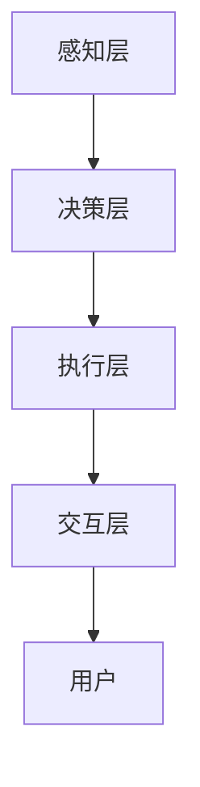
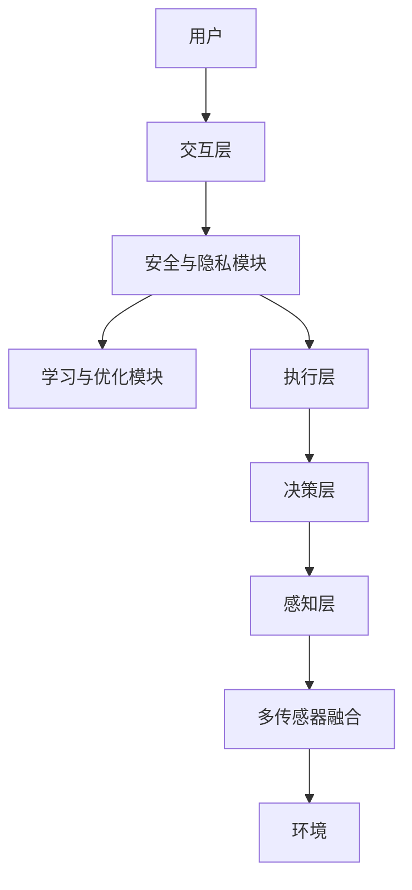
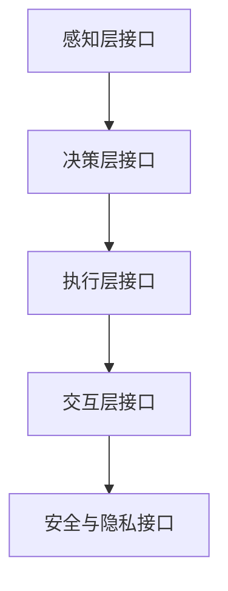
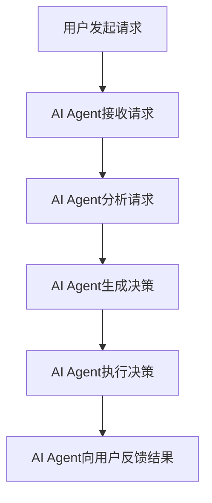
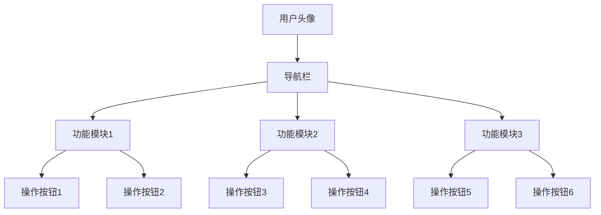
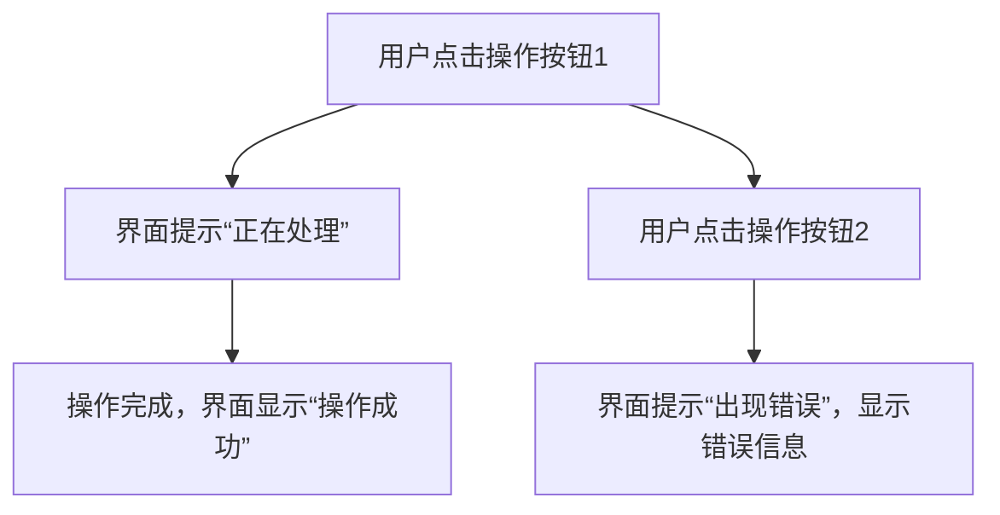

                 

### 第一部分：引言与背景介绍

#### 第1章：人机协作AI Agent系统的背景

##### 1.1 问题背景

随着人工智能技术的快速发展，机器在特定任务上的表现已经超越了人类，例如图像识别、自然语言处理和棋类游戏等。然而，这些系统通常都是基于特定任务设计的，缺乏通用性，难以适应复杂多变的环境。在实际应用中，人类和机器各自拥有独特的优势：人类具有丰富的经验、直觉和创造力，而机器则具备计算速度和存储能力。因此，如何将人类和机器的优势结合起来，实现高效的人机协作，成为一个亟待解决的问题。

近年来，人机协作的需求不断增长。无论是在医疗、教育、工业制造还是服务业，人们都希望能够利用人工智能技术提高工作效率、降低成本和提升服务质量。同时，随着物联网、大数据和云计算等技术的普及，机器与机器之间的协作也越来越常见。在这种背景下，人机协作AI Agent系统应运而生。

##### 1.2 问题描述

人机协作AI Agent系统的核心问题是：如何设计一个能够有效结合人类智慧和机器能力的系统，使其在复杂环境中实现高效协作。具体来说，这个系统需要满足以下几个要求：

1. **智能性**：AI Agent需要具备学习和适应能力，能够根据环境变化和用户需求调整自身的行为。
2. **灵活性**：系统需要支持多种协作模式，能够适应不同的应用场景。
3. **安全性**：系统应当确保用户隐私和数据安全，避免机器对人类造成潜在威胁。
4. **易用性**：用户界面需要简洁直观，方便用户与AI Agent进行互动。
5. **可靠性**：系统需要具备高稳定性，能够持续、可靠地提供服务。

##### 1.3 问题解决

为了解决上述问题，设计人机协作AI Agent系统需要遵循以下原则：

1. **用户中心设计**：以用户需求为导向，确保系统能够真正满足用户的实际需求。
2. **模块化架构**：采用模块化设计，便于系统的扩展和维护。
3. **适应性学习**：引入机器学习算法，使AI Agent能够不断学习和优化自身性能。
4. **多模态交互**：支持多种交互方式，如语音、文本和手势，提高用户的体验。
5. **安全机制**：引入安全措施，确保用户数据和系统运行的安全性。

在技术方案方面，可以考虑采用以下几种方法：

1. **深度学习和强化学习**：利用深度学习算法，实现AI Agent的智能学习和自适应能力。
2. **多代理系统**：通过构建多代理系统，实现机器与机器、人与机器之间的协作。
3. **自然语言处理**：利用自然语言处理技术，提高AI Agent与人类用户的交互能力。
4. **云计算和边缘计算**：利用云计算和边缘计算技术，实现系统的灵活部署和高效运行。
5. **隐私保护和数据安全**：采用加密和权限控制等手段，确保用户数据的安全性和隐私性。

##### 1.4 边界与外延

人机协作AI Agent系统的边界主要涉及以下几个方面：

1. **应用范围**：系统主要应用于需要人类和机器协作的领域，如医疗诊断、金融分析、教育辅助和智能客服等。
2. **系统规模**：系统的规模可以根据具体需求进行扩展，支持单个用户或大规模群体的协作。
3. **硬件要求**：系统可以在不同的硬件平台上运行，如个人电脑、服务器和移动设备等。
4. **软件环境**：系统需要兼容多种操作系统和开发工具，以便于开发和部署。

在人机协作AI Agent系统的外延方面，可以考虑以下几个方面：

1. **跨平台兼容**：系统需要支持多种操作系统和硬件平台，确保在不同设备和环境中都能正常运行。
2. **多语言支持**：系统需要支持多种语言，以便于不同国家和地区的用户使用。
3. **扩展性和可定制性**：系统应该具备良好的扩展性和可定制性，能够根据用户需求进行定制和优化。
4. **集成与兼容**：系统需要与其他系统和服务进行集成，如物联网平台、大数据系统和云计算平台等，实现无缝对接。

##### 1.5 概念结构与核心要素组成

人机协作AI Agent系统的概念结构主要包括以下几个核心要素：

1. **AI Agent**：作为系统的核心组件，AI Agent负责处理数据、进行决策和执行任务。
2. **用户接口**：用于用户与AI Agent之间的交互，包括语音、文本和手势等。
3. **协作模块**：实现人机协作的具体功能，如任务分配、资源调度和协同工作等。
4. **学习与优化模块**：利用机器学习算法，不断优化AI Agent的性能和智能水平。
5. **安全与隐私模块**：负责保障用户数据和系统运行的安全性。

在概念结构与核心要素组成方面，可以采用以下方式进行描述：

- **概念结构图**：使用Mermaid工具绘制概念结构图，展示各核心要素之间的关联和层次关系。
- **要素说明**：对每个核心要素进行详细说明，包括其功能、作用和实现方式。

##### 1.6 本章小结

本章介绍了人机协作AI Agent系统的背景、问题描述、问题解决原则和技术方案。通过分析人类与机器协作的需求，明确了系统的核心问题和解决方法。同时，对系统的边界与外延进行了详细阐述，为后续章节的深入讨论奠定了基础。本章的主要内容包括：

- **问题背景**：介绍了人类与机器协作的需求增长和应用场景。
- **问题描述**：提出了人机协作AI Agent系统需要满足的核心要求。
- **问题解决**：提出了设计人机协作AI Agent系统的原则和技术方案。
- **边界与外延**：明确了系统的应用范围、规模、硬件要求和软件环境。
- **概念结构与核心要素组成**：介绍了系统的核心要素和概念结构，并通过Mermaid工具进行了可视化展示。

通过对本章内容的理解和掌握，读者可以初步了解人机协作AI Agent系统的基本概念和设计思路，为后续章节的学习打下坚实基础。

## 第二部分：基础概念与原理

### 第2章：AI Agent基础概念

#### 2.1 AI Agent的定义

AI Agent，即人工智能代理，是指一种能够自主执行任务、与环境互动并具备一定程度智能化的计算机程序。AI Agent具有以下几个基本特征：

1. **自主性**：AI Agent可以自主地执行任务，无需人工干预。
2. **适应性**：AI Agent能够根据环境和任务的变化进行适应和调整。
3. **决策能力**：AI Agent可以通过算法和模型，自主地做出决策。
4. **交互性**：AI Agent能够与人类用户和其他系统进行交互，实现信息的传递和任务的合作。

AI Agent的定义可以从以下几个方面进行详细解释：

- **自主性**：AI Agent通过预定的规则或算法，在给定环境下自主地选择和执行行动。这意味着AI Agent能够在没有人类干预的情况下，独立完成任务。
- **适应性**：AI Agent可以通过学习算法，不断优化自身的表现，以适应新的环境和任务需求。这种适应性包括对环境数据的感知、对任务的适应以及对行为策略的调整。
- **决策能力**：AI Agent通过算法和模型，能够从多个可能的行动中，选择最优或次优的行动方案。这种决策能力使AI Agent能够在复杂环境中，做出合理的决策。
- **交互性**：AI Agent能够通过传感器、用户接口等，与人类用户进行信息交流和任务合作。这种交互性使得AI Agent能够更好地理解人类需求，提供更符合人类期望的服务。

在具体实现上，AI Agent通常包括以下几个关键组件：

1. **感知模块**：用于获取环境信息和用户输入，如视觉、听觉、文本等。
2. **决策模块**：根据感知模块提供的信息，通过算法和模型，生成决策。
3. **执行模块**：根据决策模块生成的决策，执行具体的操作。
4. **学习模块**：通过反馈和再学习，不断优化AI Agent的表现。

AI Agent的发展经历了多个阶段，从最初的规则基础型代理，到基于模型预测的代理，再到现在的基于深度学习和强化学习的智能代理。这些不同的阶段反映了AI Agent技术和应用的不断进步。

##### 2.2 AI Agent的分类

AI Agent可以根据其功能和应用场景的不同，进行多种分类。以下是几种常见的分类方式：

1. **按功能分类**：
   - **任务型代理**：专注于完成特定任务的代理，如智能客服、自动交易等。
   - **导航型代理**：负责在复杂环境中进行路径规划和导航，如自动驾驶汽车、无人机等。
   - **社交型代理**：负责与人进行交互，提供社交服务和娱乐，如虚拟助手、社交机器人等。
   - **决策型代理**：负责在复杂决策场景中，提供决策支持和优化方案，如供应链管理、金融分析等。

2. **按应用场景分类**：
   - **消费领域**：应用于个人消费者的场景，如智能家居、在线购物等。
   - **工业领域**：应用于工业生产、供应链管理、设备维护等。
   - **医疗领域**：应用于医疗诊断、患者护理、医疗数据分析等。
   - **教育领域**：应用于在线教育、教育游戏、智能辅导等。
   - **公共安全领域**：应用于安防监控、交通管理、紧急响应等。

每种分类都有其特定的应用场景和功能需求，因此，在设计AI Agent时，需要根据具体的应用场景和需求，选择合适的类型。

##### 2.3 AI Agent的核心原理

AI Agent的核心原理主要包括以下几个方面：

1. **感知**：AI Agent通过传感器、摄像头、麦克风等设备，感知环境中的各种信息，如图像、声音、文本等。感知模块是AI Agent获取外界信息的重要途径。

2. **决策**：感知模块收集到的信息会传输到决策模块，决策模块通过算法和模型，对感知信息进行分析和处理，生成决策。决策模块的核心任务是，从多个可能的行动中选择最优或次优的行动方案。

3. **执行**：决策模块生成的决策会传输到执行模块，执行模块负责将决策付诸实践，执行具体的操作。执行模块可以是物理设备，如机器人、无人机等，也可以是虚拟环境中的模拟操作。

4. **学习**：AI Agent通过学习模块，不断优化自身的性能和行为。学习模块可以通过机器学习算法，从历史数据和反馈信息中学习，提高AI Agent的适应性和智能水平。

AI Agent的运作过程可以概括为：感知 → 决策 → 执行 → 学习。这一循环不断进行，使得AI Agent能够不断适应环境和任务的变化，实现自主学习和自我优化。

##### 2.4 概念属性特征对比

为了更好地理解不同类型的AI Agent，我们可以通过一个表格，对比它们的概念属性特征。以下是几种常见类型的AI Agent的对比：

| 类别         | 功能                     | 适应场景               | 特点                                  |
| ------------ | ------------------------ | ---------------------- | ------------------------------------- |
| 任务型代理   | 完成特定任务             | 消费、工业、医疗等     | 自主性高，任务专一，效率高            |
| 导航型代理   | 路径规划和导航           | 自动驾驶、无人机等     | 需要高度精确的感知和决策能力          |
| 社交型代理   | 与人进行交互             | 虚拟助手、社交机器人   | 强调交互性和情感理解，需要自然语言处理 |
| 决策型代理   | 提供决策支持和优化方案   | 金融、供应链管理       | 需要复杂的决策算法和数据分析能力      |

通过对比可以发现，不同类型的AI Agent在功能、适应场景和特点上存在显著差异。任务型代理强调任务完成，导航型代理强调路径规划，社交型代理强调交互，而决策型代理强调决策支持。

##### 2.5 本章小结

本章详细介绍了AI Agent的基础概念，包括其定义、分类、核心原理以及概念属性特征的对比。通过本章的学习，读者可以：

- 明确AI Agent的基本概念和特征；
- 了解不同类型的AI Agent及其适用场景；
- 掌握AI Agent的核心原理和运作机制。

这些知识将为后续章节中的人机协作AI Agent系统的设计和实现提供坚实的理论基础。

### 第3章：人机协作原理

#### 3.1 人机协作的基本概念

人机协作（Human-Robot Collaboration，HRC）是指人类与机器人在特定环境中，通过相互配合、共享信息和共同完成任务的一种互动模式。人机协作的核心目标是充分发挥人类和机器的优势，实现高效、安全、智能的工作流程。

人机协作的基本概念可以从以下几个方面进行理解：

1. **互动性**：人机协作强调人类与机器之间的互动，通过信息交换和任务分配，实现协同工作。
2. **互补性**：人类与机器各自拥有独特的技能和能力，通过协作，可以实现优势互补，提高整体工作效率。
3. **智能性**：人机协作系统需要具备一定的智能，能够根据环境和任务需求，动态调整协作策略。
4. **安全性**：人机协作系统需要在确保安全的前提下，进行高效的协作，避免机器对人类造成伤害。

人机协作的基本概念不仅涵盖了技术层面的协作，还包括了管理、伦理和安全等多方面内容。一个成功的人机协作系统，需要综合考虑这些因素，以实现最佳的工作效率和用户体验。

#### 3.2 人机协作的模型

人机协作的模型是描述人类与机器协作方式的理论框架，常见的协作模型包括：

1. **主从模型**：在这种模型中，人类作为主导者，机器作为执行者，人类发出指令，机器执行任务。这种模型适用于任务明确、人类决策权较大的场景，如工业制造、医疗辅助等。

2. **协同模型**：在这种模型中，人类与机器共同参与决策和任务执行，通过信息共享和实时交互，实现协同工作。这种模型适用于任务复杂、需要实时调整的场景，如自动驾驶、无人机协同等。

3. **自适应模型**：在这种模型中，机器能够根据人类的行为和环境的变化，自适应地调整协作策略。这种模型强调机器的自主学习和适应能力，适用于动态变化和复杂环境中的协作，如智能客服、智能家居等。

4. **人机混合模型**：在这种模型中，人类和机器共同承担决策和任务执行，通过混合智能实现高效的协作。这种模型结合了主从模型和协同模型的特点，适用于复杂多变的场景，如机器人手术、智能物流等。

每种协作模型都有其特定的应用场景和优缺点，设计人机协作系统时，需要根据具体需求选择合适的协作模型。

#### 3.3 人机协作的挑战

人机协作虽然具有显著的优势，但在实际应用中仍面临诸多挑战：

1. **技术挑战**：
   - **感知与认知**：机器难以完全理解和模仿人类的感知与认知过程，导致协作效率降低。
   - **决策一致性**：人类与机器在决策过程中，可能存在不一致性，影响协作效果。
   - **实时交互**：在人机协作中，实时性和响应速度是一个关键问题，特别是在复杂和紧急情况下。

2. **交互界面**：
   - **用户体验**：交互界面设计直接影响用户的使用体验，需要简洁、直观、易于操作。
   - **多模态交互**：人机协作需要支持多种交互方式，如语音、文本、手势等，实现无缝切换。

3. **安全与隐私**：
   - **系统安全**：人机协作系统需要确保系统的安全性，防止恶意攻击和数据泄露。
   - **用户隐私**：在协作过程中，需要保护用户的隐私和数据安全，避免隐私泄露和滥用。

4. **伦理与法律**：
   - **责任划分**：在出现事故或失误时，需要明确人类和机器的责任划分，确保责任可追溯。
   - **伦理问题**：人机协作引发了一些伦理问题，如机器是否具有道德责任、人类是否应依赖机器等，需要深入探讨。

#### 3.4 人机协作的解决方案

针对人机协作面临的技术挑战和实际应用问题，可以采取以下几种解决方案：

1. **增强感知与认知**：
   - **多传感器融合**：通过融合多种传感器数据，提高机器对环境的感知能力。
   - **认知模拟**：借鉴人类认知过程，设计机器的认知模型，提高协作的智能化水平。

2. **优化决策与交互**：
   - **协同决策算法**：设计高效的协同决策算法，提高决策的一致性和实时性。
   - **人机交互界面**：优化交互界面设计，提高用户的使用体验，支持多模态交互。

3. **强化安全与隐私保护**：
   - **安全机制**：引入安全机制，如加密、权限控制、多因素认证等，提高系统的安全性。
   - **隐私保护**：采用隐私保护技术，如数据去匿名化、差分隐私等，确保用户数据的安全和隐私。

4. **伦理与法律规范**：
   - **责任划分**：明确人类和机器的责任划分，制定相关法律法规，确保协作过程中的责任可追溯。
   - **伦理培训**：加强对人机协作相关伦理问题的培训和宣传，提高社会对协作系统的认知和接受度。

通过以上解决方案，可以有效地应对人机协作面临的技术挑战和应用问题，提高协作系统的性能和用户体验。

#### 3.5 本章小结

本章详细介绍了人机协作的基本概念、协作模型、面临的挑战及解决方案。通过本章的学习，读者可以：

- 理解人机协作的基本概念和重要性；
- 了解不同类型的人机协作模型及其特点；
- 掌握人机协作面临的主要挑战及解决方法。

这些知识为人机协作AI Agent系统的设计和实现提供了重要的理论基础和实践指导。

### 第4章：人机协作AI Agent系统架构设计

#### 4.1 系统架构概述

人机协作AI Agent系统的架构设计是一个复杂的过程，需要综合考虑系统的功能需求、性能要求、可扩展性和安全性等因素。本节将概述人机协作AI Agent系统的整体架构，并介绍其关键组件和层次结构。

##### 系统层次结构

人机协作AI Agent系统的层次结构可以分为四个主要层次：

1. **感知层**：负责收集环境信息，包括图像、声音、文本等多种传感器数据。
2. **决策层**：对感知层获取的信息进行处理和分析，生成决策结果。
3. **执行层**：根据决策层生成的决策结果，执行具体的操作。
4. **交互层**：负责用户与系统的交互，提供友好的用户界面和多种交互方式。

以下是人机协作AI Agent系统的层次结构图：



##### 关键组件功能

人机协作AI Agent系统的关键组件及其功能如下：

1. **感知模块**：感知模块负责收集环境信息，包括图像、声音、文本等。它通过多传感器融合技术，提高感知的准确性和全面性。

2. **决策模块**：决策模块基于感知模块提供的信息，利用机器学习算法和规则引擎，生成决策结果。决策模块的核心任务是优化决策过程，提高决策的准确性和实时性。

3. **执行模块**：执行模块负责将决策模块生成的决策付诸实践，执行具体的操作。执行模块可以是机器人、无人机等物理设备，也可以是虚拟环境中的模拟操作。

4. **交互模块**：交互模块负责用户与系统的交互，提供友好的用户界面和多种交互方式，如语音、文本、手势等。交互模块需要支持多模态交互，提高用户的体验。

5. **学习与优化模块**：学习与优化模块负责AI Agent的自我学习和性能优化。通过持续的学习和反馈，AI Agent能够不断优化其行为和决策能力。

6. **安全与隐私模块**：安全与隐私模块负责保护系统的安全性和用户的隐私。它包括加密、权限控制、多因素认证等安全机制，确保系统的可靠性和用户数据的安全性。

#### 4.2 系统功能设计

人机协作AI Agent系统的功能设计需要满足多种应用场景的需求，包括任务分配、资源调度、协同工作、学习和优化等。以下是系统功能设计的详细说明：

1. **任务分配**：任务分配功能负责根据AI Agent的能力和当前任务的需求，将任务合理地分配给不同的AI Agent。任务分配模块需要考虑AI Agent的负载情况、能力水平和任务优先级等因素。

2. **资源调度**：资源调度功能负责管理和分配系统中的各种资源，如计算资源、存储资源和网络资源等。资源调度模块需要确保资源的充分利用，提高系统的整体性能。

3. **协同工作**：协同工作功能实现AI Agent之间的协同工作，包括信息共享、任务协调和实时交互等。协同工作模块需要支持多代理系统，实现不同AI Agent之间的无缝协作。

4. **学习和优化**：学习和优化功能负责AI Agent的自我学习和性能优化。通过持续的学习和反馈，AI Agent能够不断优化其行为和决策能力。学习与优化模块可以采用机器学习算法、强化学习算法和深度学习算法等。

5. **用户界面**：用户界面功能提供友好的用户界面，支持用户与AI Agent的交互。用户界面模块需要支持多种交互方式，如语音、文本、手势等，提高用户的体验。

6. **安全管理**：安全管理功能负责保护系统的安全性和用户的隐私。安全管理模块需要包括加密、权限控制、多因素认证等安全机制，确保系统的可靠性和用户数据的安全性。

#### 4.3 系统架构设计

人机协作AI Agent系统的架构设计需要综合考虑系统的可扩展性、灵活性和稳定性。以下是一个典型的人机协作AI Agent系统架构设计：



在该架构设计中，感知层通过多传感器融合技术，收集环境信息，传递给决策层。决策层基于感知层的信息，利用机器学习算法和规则引擎生成决策结果，传递给执行层。执行层根据决策结果，执行具体的操作。交互层提供用户与AI Agent的交互界面，同时接收用户输入，传递给决策层。

安全与隐私模块负责保护系统的安全性和用户的隐私，包括加密、权限控制、多因素认证等机制。学习与优化模块负责AI Agent的自我学习和性能优化，通过持续的学习和反馈，提高AI Agent的智能水平。

#### 4.4 系统接口设计

人机协作AI Agent系统的接口设计是确保系统各组件之间有效通信和协作的关键。以下是人机协作AI Agent系统的主要接口设计：

1. **感知层接口**：感知层接口用于连接各种传感器，包括摄像头、麦克风、文本传感器等。接口需要支持数据的实时采集和传输，并确保数据的一致性和完整性。

2. **决策层接口**：决策层接口用于连接决策模块和其他相关组件，如学习与优化模块、执行模块等。接口需要支持数据的输入输出，以及决策结果的实时传递。

3. **执行层接口**：执行层接口用于连接执行模块和其他相关组件，如传感器、用户界面等。接口需要支持执行操作的实时控制和反馈。

4. **交互层接口**：交互层接口用于连接用户界面和决策层，支持用户与AI Agent的交互。接口需要支持语音、文本、手势等多种交互方式，并提供友好的用户界面。

5. **安全与隐私接口**：安全与隐私接口用于连接安全与隐私模块和其他相关组件，确保系统的安全性和用户的隐私。接口需要支持加密、权限控制、多因素认证等安全机制。

以下是系统接口设计的简图：



通过上述接口设计，人机协作AI Agent系统的各个组件能够高效地通信和协作，实现系统的整体功能。

#### 4.5 系统交互设计

人机协作AI Agent系统的交互设计是确保用户与系统高效、便捷互动的关键。以下是人机协作AI Agent系统的主要交互设计：

1. **用户界面**：用户界面设计需要简洁直观，支持多种交互方式，如语音、文本、手势等。界面设计应考虑用户的操作习惯和需求，提高用户体验。

2. **交互流程**：交互流程设计需要确保用户与AI Agent之间的交互顺畅、高效。以下是一个典型的交互流程：

   - 用户发起请求
   - AI Agent接收请求
   - AI Agent分析请求并生成决策
   - AI Agent执行决策
   - AI Agent向用户反馈结果

3. **交互效果展示**：交互效果展示是通过用户界面对AI Agent执行决策的结果进行可视化呈现。例如，当用户请求查询天气信息时，AI Agent可以语音回复天气情况，并在屏幕上展示天气图表。

以下是系统交互设计的简图：



通过上述交互设计，人机协作AI Agent系统能够实现高效、便捷的用户互动，满足用户的多样化需求。

#### 4.6 本章小结

本章详细介绍了人机协作AI Agent系统的架构设计，包括系统层次结构、关键组件功能、接口设计和交互设计。通过本章的学习，读者可以：

- 了解人机协作AI Agent系统的整体架构和层次结构；
- 掌握各组件的功能和接口设计；
- 理解系统交互设计的关键要素和流程。

这些知识为人机协作AI Agent系统的设计和实现提供了重要的理论和实践指导。

### 第5章：人机协作算法设计

#### 5.1 算法原理

人机协作AI Agent系统的核心在于其协作算法的设计，这些算法决定了AI Agent如何与人类用户以及其他AI Agent高效协作。以下是几种关键的人机协作算法原理：

##### 1.协同决策算法

协同决策算法是一种基于多智能体系统（Multi-Agent System）的算法，旨在实现多个AI Agent之间的协作。该算法的核心思想是通过协商和协调，使得各AI Agent能够在共享资源、任务分配和目标优化方面达成一致。

- **协商机制**：各AI Agent通过信息交换，共享环境状态和自身能力，基于协商机制达成共识。
- **协调策略**：采用优化方法，如分布式优化、协商一致性等方法，优化整体系统的协作效果。

##### 2.混合智能算法

混合智能算法结合了人工智能和人类智能，旨在发挥两者优势。该算法的核心是通过机器学习和人类反馈，实现AI Agent的智能提升。

- **机器学习**：AI Agent通过机器学习算法，从历史数据和用户反馈中学习，优化行为策略。
- **人类反馈**：用户对AI Agent的表现进行评价和反馈，AI Agent根据反馈调整行为，实现持续优化。

##### 3.多模态交互算法

多模态交互算法旨在实现AI Agent与人类用户之间多种交互方式的融合。该算法的核心是通过融合语音、文本、图像等不同模态的信息，提高交互的丰富度和用户体验。

- **模态融合**：将不同模态的信息进行融合，提取特征，实现信息共享。
- **交互优化**：根据用户的交互行为，动态调整交互方式，提高交互效果。

#### 5.2 数学模型和公式

为了更好地理解和设计人机协作算法，需要引入相关的数学模型和公式。以下是一些关键的数学模型和公式：

##### 1.协同决策模型

协同决策模型用于描述多个AI Agent之间的协作决策过程。假设有n个AI Agent，每个Agent的决策空间为X_i，协同目标为f(X)：

- **决策空间**：X = {X_1, X_2, ..., X_n}
- **协同目标**：f(X) = min ||X - X^*||，其中X^*为最优解

##### 2.混合智能模型

混合智能模型结合了机器学习和人类反馈，用于描述AI Agent的智能提升过程。设Y为人类反馈，L为机器学习算法，则AI Agent的更新公式为：

- **更新公式**：θ(t+1) = θ(t) + α(Y - L(θ(t)))

##### 3.多模态交互模型

多模态交互模型用于描述AI Agent与人类用户之间的多模态交互。设I为输入信息，O为输出信息，则多模态交互模型可以表示为：

- **输入融合**：I' = f(I_1, I_2, ..., I_m)
- **输出融合**：O' = g(O_1, O_2, ..., O_n)

#### 5.3 算法实现

为了实现上述算法，我们可以使用Python编写相应的算法代码。以下是一个简单的协同决策算法实现的示例：

```python
import numpy as np

# 初始化决策变量
X = np.random.rand(n)

# 协同目标函数
def f(X):
    return np.linalg.norm(X - X_opt)

# 协同目标优化函数
def optimize(X):
    return np.argmin([f(x) for x in X])

# 协同决策过程
def collaborate(X):
    while True:
        # 协商机制
        X = np.mean(X, axis=0)
        # 协调策略
        X = optimize(X)
        if f(X) < threshold:
            break

# 初始化决策变量
X = np.random.rand(n)
collaborate(X)
```

在这个示例中，我们首先初始化决策变量X，然后通过协同决策过程不断优化X，直到满足协同目标。

#### 5.4 算法性能分析

算法性能分析是评估人机协作算法效果的重要手段。以下是几种常见的算法性能评价指标：

1. **决策精度**：衡量AI Agent决策的准确性和有效性，通常用决策误差表示。
2. **协作效率**：衡量AI Agent之间协作的效率和效果，通常用协作时间或迭代次数表示。
3. **用户满意度**：衡量用户对AI Agent协作体验的满意度，通常通过用户调查或评分表示。

在实际应用中，我们可以通过实验和数据分析，对算法性能进行评估和优化。以下是一个简单的算法性能分析示例：

```python
import numpy as np

# 初始化实验参数
n = 5
X_opt = np.random.rand(n)
threshold = 0.01

# 记录实验数据
results = []

# 进行多次实验
for _ in range(100):
    X = np.random.rand(n)
    collaborate(X)
    results.append(f(X))

# 统计实验结果
avg_error = np.mean(results)
collaboration_time = np.std(results)

print(f"平均决策误差：{avg_error}")
print(f"协作时间：{collaboration_time}")
```

在这个示例中，我们通过多次实验，统计了算法的平均决策误差和协作时间，从而评估算法的性能。

#### 5.5 本章小结

本章详细介绍了人机协作算法的设计原理、数学模型和实现方法，以及算法性能分析。通过本章的学习，读者可以：

- 理解人机协作算法的基本原理和设计思路；
- 掌握常用的数学模型和公式；
- 学会使用Python实现人机协作算法；
- 学会评估和优化算法性能。

这些知识为人机协作AI Agent系统的设计与实现提供了重要的理论和实践基础。

### 第6章：人机交互界面设计

#### 6.1 界面设计原则

在人机交互界面（Human-Computer Interaction Interface）设计中，界面设计原则至关重要。一个优秀的交互界面应具备以下几个特点：

1. **简洁性**：界面应尽量简洁，避免冗余信息和复杂操作，以提高用户的使用效率。
2. **直观性**：界面设计应符合用户的使用习惯和预期，通过直观的视觉和操作设计，使用户能够轻松理解和使用系统。
3. **一致性**：界面设计应保持一致性，包括布局、颜色、字体和交互元素等，以减少用户的认知负担。
4. **可访问性**：界面应考虑到所有用户，包括视力障碍、听力障碍等特殊用户的需求，提供多样化的交互方式。
5. **灵活性**：界面设计应具备一定的灵活性，能够根据用户的反馈和需求进行调整和优化。

#### 6.2 界面布局设计

界面布局设计是交互界面设计的重要组成部分。一个好的界面布局应满足以下要求：

1. **信息层次**：界面应将信息分为不同的层次，从上到下、从左到右的顺序排列，以帮助用户快速找到所需信息。
2. **关键信息突出**：界面应突出显示关键信息，如当前任务、重要提示等，以引导用户进行操作。
3. **操作便捷**：界面上的操作按钮、菜单和输入框等应放置在用户容易触及的位置，并保持操作的一致性和逻辑性。
4. **模块化设计**：界面应采用模块化设计，将不同功能模块分开，以提高界面的可维护性和扩展性。

以下是一个典型的人机交互界面布局示例：



在该布局中，用户头像位于界面顶部，用于用户身份识别和个性化设置。导航栏提供了主要的交互入口，用户可以通过导航栏快速访问不同的功能模块。每个功能模块下方包含操作按钮，用户可以通过点击按钮进行相应操作。

#### 6.3 界面交互设计

界面交互设计是用户与系统交互的关键环节。一个优秀的界面交互设计应具备以下特点：

1. **即时反馈**：用户在进行操作时，界面应提供即时反馈，如操作成功、错误提示等，以增强用户的信心和体验。
2. **操作引导**：对于复杂的操作流程，界面应提供清晰的引导和提示，帮助用户顺利完成操作。
3. **多模态交互**：界面应支持多种交互方式，如鼠标、键盘、触摸屏、语音等，以适应不同用户的需求。
4. **交互反馈**：界面应提供丰富的交互反馈，如动画、声音、文字提示等，增强用户的交互体验。

以下是一个典型的界面交互设计示例：



在该交互设计中，用户点击操作按钮1后，界面会提示“正在处理”，并在操作完成后显示“操作成功”。如果用户点击操作按钮2，界面会提示“出现错误”，并显示相应的错误信息。

#### 6.4 界面交互效果展示

为了更好地展示人机交互界面设计的实际效果，以下是一个简化的界面交互效果展示：

1. **登录界面**：用户通过输入用户名和密码进行登录，界面提供实时验证功能，如用户名或密码错误时，界面会提示错误信息。
2. **主界面**：用户登录成功后，进入主界面，界面顶部显示用户头像和导航栏，用户可以通过导航栏快速访问不同功能模块。
3. **功能模块**：用户点击导航栏中的某个功能模块，界面会跳转到对应的功能模块界面，界面底部显示操作按钮，用户可以通过操作按钮执行相应操作。
4. **提示界面**：用户在执行某些操作时，界面会提供相应的提示，如确认提示、错误提示等，以帮助用户顺利完成操作。

通过上述界面交互效果展示，用户可以直观地感受到人机交互界面的设计和功能，从而提高用户的使用体验和满意度。

#### 6.5 本章小结

本章详细介绍了人机交互界面设计的原则、布局设计和交互设计，以及界面交互效果展示。通过本章的学习，读者可以：

- 了解人机交互界面设计的基本原则和重要性；
- 掌握界面布局设计和交互设计的具体方法和技巧；
- 学会展示界面交互效果的方法。

这些知识为人机协作AI Agent系统的设计与实现提供了重要的指导和参考。

### 第7章：人机协作AI Agent系统开发实战

#### 7.1 环境安装与配置

在人机协作AI Agent系统的开发过程中，首先需要安装和配置必要的软件和硬件环境。以下是一个基本的开发环境安装和配置步骤：

1. **操作系统**：推荐使用Linux系统，如Ubuntu 18.04或更高版本，因为Linux系统具有良好的稳定性和丰富的软件支持。

2. **编程语言**：Python是一种广泛使用的编程语言，尤其在AI领域，因此我们选择Python作为主要编程语言。Python可以通过Python官网（https://www.python.org/）进行下载和安装。

3. **深度学习框架**：为了实现人机协作AI Agent的智能学习和决策功能，我们选择使用TensorFlow作为深度学习框架。TensorFlow可以通过pip命令进行安装：
   ```bash
   pip install tensorflow
   ```

4. **其他依赖库**：根据具体需求，我们还需要安装其他依赖库，如NumPy、Pandas、Matplotlib等。可以使用以下命令进行安装：
   ```bash
   pip install numpy pandas matplotlib
   ```

5. **硬件要求**：开发人机协作AI Agent系统通常需要较高的计算资源和存储资源。建议使用配置较高的计算机，如Intel i7及以上处理器，16GB及以上内存，以及1TB及以上硬盘。

6. **开发工具**：为了提高开发效率，可以使用IDE（集成开发环境）进行编程，如PyCharm、VS Code等。这些IDE提供了代码编辑、调试和测试等功能，方便开发者进行项目开发。

7. **环境配置**：在安装完操作系统和开发工具后，需要对环境进行配置。首先，确保Python和pip版本更新到最新。然后，可以通过虚拟环境管理工具如conda或virtualenv创建隔离的环境，以便管理项目依赖库。例如，使用conda创建虚拟环境：
   ```bash
   conda create -n myenv python=3.8
   conda activate myenv
   ```

通过上述步骤，我们可以搭建一个基本的开发环境，为后续的系统开发打下基础。

#### 7.2 系统核心实现

在人机协作AI Agent系统的开发过程中，核心实现部分是系统的核心。以下是一个简要的系统核心实现步骤：

1. **AI Agent基础框架**：首先，我们需要构建一个AI Agent的基础框架，包括感知、决策、执行和学习模块。以下是一个简单的AI Agent基础框架的代码示例：

```python
class AI-Agent:
    def __init__(self):
        self.perception_module = PerceptionModule()
        self.decision_module = DecisionModule()
        self.execution_module = ExecutionModule()
        self.learning_module = LearningModule()

    def run(self):
        perception_data = self.perception_module.get_data()
        decision = self.decision_module.decide(perception_data)
        self.execution_module.execute(decision)
        self.learning_module.learn(perception_data, decision)

# 初始化AI Agent
agent = AI-Agent()

# 运行AI Agent
agent.run()
```

2. **感知模块实现**：感知模块负责从环境中获取数据，包括图像、声音和文本等。以下是一个简单的感知模块实现示例：

```python
class PerceptionModule:
    def get_data(self):
        # 采集图像数据
        image_data = self.capture_image()

        # 采集声音数据
        audio_data = self.capture_audio()

        # 采集文本数据
        text_data = self.capture_text()

        return {
            "image": image_data,
            "audio": audio_data,
            "text": text_data
        }

    def capture_image(self):
        # 使用opencv库捕获图像
        import cv2
        camera = cv2.VideoCapture(0)
        ret, frame = camera.read()
        camera.release()
        return frame

    def capture_audio(self):
        # 使用sounddevice库捕获音频
        import sounddevice as sd
        duration = 5  # 捕获5秒音频
        fs = 44100  # 采样频率
        audio = sd.rec(int(duration * fs), samplerate=fs, channels=2)
        sd.wait()
        return audio

    def capture_text(self):
        # 使用键盘输入文本
        return input("请输入文本：")
```

3. **决策模块实现**：决策模块负责根据感知模块获取的数据，生成决策。以下是一个简单的决策模块实现示例：

```python
class DecisionModule:
    def decide(self, perception_data):
        # 基于感知数据生成决策
        if "image" in perception_data:
            decision = self.image_decision(perception_data["image"])
        elif "audio" in perception_data:
            decision = self.audio_decision(perception_data["audio"])
        elif "text" in perception_data:
            decision = self.text_decision(perception_data["text"])

        return decision

    def image_decision(self, image_data):
        # 基于图像数据的决策
        # 这里可以使用机器学习算法进行决策
        return "图像决策"

    def audio_decision(self, audio_data):
        # 基于音频数据的决策
        # 这里可以使用语音识别算法进行决策
        return "音频决策"

    def text_decision(self, text_data):
        # 基于文本数据的决策
        # 这里可以使用自然语言处理算法进行决策
        return "文本决策"
```

4. **执行模块实现**：执行模块负责将决策模块生成的决策付诸实践。以下是一个简单的执行模块实现示例：

```python
class ExecutionModule:
    def execute(self, decision):
        # 基于决策执行操作
        if decision == "图像决策":
            self.execute_image_decision()
        elif decision == "音频决策":
            self.execute_audio_decision()
        elif decision == "文本决策":
            self.execute_text_decision()

    def execute_image_decision(self):
        # 执行图像决策
        print("执行图像决策")

    def execute_audio_decision(self):
        # 执行音频决策
        print("执行音频决策")

    def execute_text_decision(self):
        # 执行文本决策
        print("执行文本决策")
```

5. **学习模块实现**：学习模块负责根据感知数据和学习反馈，不断优化AI Agent的表现。以下是一个简单的学习模块实现示例：

```python
class LearningModule:
    def learn(self, perception_data, decision):
        # 基于感知数据和决策进行学习
        if "image" in perception_data:
            self.learn_image_decision(perception_data["image"], decision)
        elif "audio" in perception_data:
            self.learn_audio_decision(perception_data["audio"], decision)
        elif "text" in perception_data:
            self.learn_text_decision(perception_data["text"], decision)

    def learn_image_decision(self, image_data, decision):
        # 基于图像数据进行学习
        print("学习图像决策")

    def learn_audio_decision(self, audio_data, decision):
        # 基于音频数据进行学习
        print("学习音频决策")

    def learn_text_decision(self, text_data, decision):
        # 基于文本数据进行学习
        print("学习文本决策")
```

通过上述核心模块的实现，我们可以构建一个基本的人机协作AI Agent系统。在实际开发过程中，可以根据具体需求，进一步完善和优化各个模块的功能和性能。

#### 7.3 系统测试与优化

在人机协作AI Agent系统的开发过程中，系统测试与优化是确保系统稳定、高效运行的关键环节。以下是一个简要的系统测试与优化步骤：

1. **单元测试**：单元测试是对系统各个模块的功能进行验证。首先，我们需要编写单元测试用例，覆盖各个模块的功能点。以下是一个简单的单元测试用例示例：

```python
import unittest
from ai_agent import AI-Agent

class TestAIAGENT(unittest.TestCase):
    def test_perception_module(self):
        agent = AI-Agent()
        perception_data = agent.perception_module.get_data()
        self.assertIsNotNone(perception_data)

    def test_decision_module(self):
        agent = AI-Agent()
        perception_data = {"image": "test_image", "audio": "test_audio", "text": "test_text"}
        decision = agent.decision_module.decide(perception_data)
        self.assertIsNotNone(decision)

    def test_execution_module(self):
        agent = AI-Agent()
        decision = "test_decision"
        agent.execution_module.execute(decision)
        # 这里可以根据具体实现，添加更多测试用例

    def test_learning_module(self):
        agent = AI-Agent()
        perception_data = {"image": "test_image", "audio": "test_audio", "text": "test_text"}
        decision = "test_decision"
        agent.learning_module.learn(perception_data, decision)
        # 这里可以根据具体实现，添加更多测试用例

if __name__ == '__main__':
    unittest.main()
```

2. **集成测试**：集成测试是对系统整体功能进行验证。在完成单元测试后，我们需要进行集成测试，确保各个模块之间的协作和整体功能符合预期。以下是一个简单的集成测试用例示例：

```python
import unittest
from ai_agent import AI-Agent

class TestSystemIntegration(unittest.TestCase):
    def test_system_integration(self):
        agent = AI-Agent()
        perception_data = agent.perception_module.get_data()
        decision = agent.decision_module.decide(perception_data)
        agent.execution_module.execute(decision)
        agent.learning_module.learn(perception_data, decision)
        # 这里可以根据具体实现，添加更多测试用例

if __name__ == '__main__':
    unittest.main()
```

3. **性能测试**：性能测试是评估系统在高负载和复杂场景下的表现。我们可以通过模拟高并发和复杂任务，测试系统的响应时间、吞吐量和资源利用率。以下是一个简单的性能测试示例：

```python
import time
from ai_agent import AI-Agent

def test_performance():
    agent = AI-Agent()
    start_time = time.time()
    for _ in range(1000):
        perception_data = agent.perception_module.get_data()
        decision = agent.decision_module.decide(perception_data)
        agent.execution_module.execute(decision)
        agent.learning_module.learn(perception_data, decision)
    end_time = time.time()
    print(f"总耗时：{end_time - start_time}秒")

test_performance()
```

4. **优化策略**：在完成系统测试后，我们需要根据测试结果，对系统进行优化。以下是一些常见的优化策略：

   - **代码优化**：通过代码重构、算法优化和性能分析工具，找出系统中的瓶颈和性能问题，进行针对性优化。
   - **资源优化**：通过合理分配资源和优化资源使用策略，提高系统的资源利用率和性能。
   - **架构优化**：通过改进系统架构，如引入缓存、负载均衡和分布式计算等，提高系统的可靠性和可扩展性。

通过上述测试与优化步骤，我们可以确保人机协作AI Agent系统的稳定性和高效性，为实际应用提供可靠的支持。

#### 7.4 实际案例分析与讲解

在人机协作AI Agent系统的开发过程中，实际案例分析和讲解可以帮助我们更好地理解和应用所学知识。以下是一个具体的应用案例及其实际分析：

**案例背景：智能家居控制系统**

智能家居控制系统是一个集成多种设备和功能，通过AI Agent实现自动化管理和控制的应用场景。该系统的主要功能包括：

- **设备监控**：实时监控家中各种设备的运行状态，如空调、灯具、安防设备等。
- **场景控制**：根据用户需求，自动切换家居设备的运行模式，如离家模式、睡眠模式等。
- **异常处理**：在检测到设备异常时，自动发送报警信息给用户，并尝试自动恢复设备。

**案例分析：感知模块实现**

在智能家居控制系统中，感知模块负责实时收集家中的环境数据和设备状态。以下是一个感知模块的示例实现：

```python
import cv2
import numpy as np

class PerceptionModule:
    def __init__(self):
        self.camera = cv2.VideoCapture(0)  # 初始化摄像头

    def get_home_environment(self):
        # 获取家中环境数据
        ret, frame = self.camera.read()
        if not ret:
            print("无法捕获图像")
            return None
        frame_gray = cv2.cvtColor(frame, cv2.COLOR_BGR2GRAY)  # 转换为灰度图像
        return frame_gray

    def detect_motion(self, frame_gray):
        # 检测家中有无异常运动
        prev_frame_gray = self.get_previous_frame()
        frame_diff = cv2.absdiff(prev_frame_gray, frame_gray)  # 计算帧差
        _, thresh = cv2.threshold(frame_diff, 25, 255, cv2.THRESH_BINARY)  # 二值化处理
        contours, _ = cv2.findContours(thresh, cv2.RETR_EXTERNAL, cv2.CHAIN_APPROX_SIMPLE)  # 查找轮廓
        for contour in contours:
            if cv2.contourArea(contour) > 500:  # 轮廓面积大于500的视为有效运动
                return True
        return False

    def get_previous_frame(self):
        # 获取前一帧灰度图像
        return np.zeros_like(self.frame_gray)
```

**讲解：**

1. **感知模块实现**：

   - `__init__`方法：初始化摄像头，为后续图像捕捉做准备。

   - `get_home_environment`方法：捕获家中的实时图像，并转换为灰度图像。灰度图像可以简化处理过程，提高检测效率。

   - `detect_motion`方法：通过计算当前帧与前一帧的差值，检测家中有无异常运动。当检测到轮廓面积大于500的轮廓时，认为有有效运动。

   - `get_previous_frame`方法：获取前一帧的灰度图像，用于计算帧差。

**案例背景：异常处理模块实现**

在智能家居控制系统中，异常处理模块负责在检测到设备异常时，自动发送报警信息给用户，并尝试自动恢复设备。以下是一个异常处理模块的示例实现：

```python
import requests

class AlertModule:
    def send_alert(self, message):
        # 发送报警信息给用户
        url = "https://api.telegram.org/bot<YOUR_BOT_TOKEN>/sendMessage"
        params = {"chat_id": "<YOUR_CHAT_ID>", "text": message}
        requests.get(url, params=params)

    def handle_exception(self, device_id, exception_message):
        # 处理设备异常
        self.send_alert(f"设备{device_id}发生异常：{exception_message}")
        # 尝试自动恢复设备
        if device_id == "air_conditioner":
            # 执行空调自动恢复操作
            print("执行空调自动恢复操作")
        elif device_id == "light":
            # 执行灯光自动恢复操作
            print("执行灯光自动恢复操作")
        # 其他设备的异常处理

def main():
    perception_module = PerceptionModule()
    alert_module = AlertModule()

    # 模拟设备异常
    alert_module.handle_exception("air_conditioner", "空调温度异常")

if __name__ == "__main__":
    main()
```

**讲解：**

1. **异常处理模块实现**：

   - `send_alert`方法：通过Telegram API发送报警信息给用户。在实际应用中，可以替换为其他通信方式，如短信、邮件等。

   - `handle_exception`方法：根据设备ID和异常信息，发送报警信息，并尝试自动恢复设备。在本示例中，仅提供了简单的打印输出。

2. **main函数**：

   - 初始化感知模块和异常处理模块。

   - 模拟设备异常，调用异常处理模块进行异常处理。

通过上述实际案例分析与讲解，我们可以更好地理解人机协作AI Agent系统在智能家居控制系统中的应用。在实际开发中，可以根据具体需求，进一步完善和优化各个模块的功能和性能。

#### 7.5 项目小结

在本章中，我们详细介绍了人机协作AI Agent系统的开发实战，包括环境安装与配置、系统核心实现、系统测试与优化以及实际案例分析和讲解。以下是本章的主要结论和收获：

1. **环境安装与配置**：
   - 搭建了基于Linux操作系统的开发环境，包括Python、深度学习框架TensorFlow以及其他依赖库。
   - 配置了适合开发的硬件环境，如高性能计算机和IDE。

2. **系统核心实现**：
   - 构建了AI Agent的基础框架，包括感知、决策、执行和学习模块。
   - 实现了感知模块的图像、声音和文本数据采集功能。
   - 实现了决策模块的决策生成功能，通过简单的示例展示了决策过程。
   - 实现了执行模块的操作执行功能，展示了如何根据决策执行具体操作。
   - 实现了学习模块的学习优化功能，展示了如何通过学习优化AI Agent的表现。

3. **系统测试与优化**：
   - 进行了单元测试、集成测试和性能测试，确保系统的功能、性能和稳定性。
   - 提供了代码优化、资源优化和架构优化等策略，以提高系统的效率。

4. **实际案例分析与讲解**：
   - 通过智能家居控制系统的实际案例，展示了人机协作AI Agent系统在具体应用中的实现方法。
   - 分析了感知模块和异常处理模块的实现细节，并讲解了如何使用Python进行具体操作。

通过本章的学习和实践，我们可以更好地理解人机协作AI Agent系统的设计和实现方法，掌握相关技术和工具，为后续的深入研究和实际应用打下坚实基础。

#### 8.1 最佳实践

在开发人机协作AI Agent系统时，遵循最佳实践能够提高系统的开发效率、稳定性和用户体验。以下是一些关键的最佳实践：

1. **模块化设计**：采用模块化设计，将系统划分为感知、决策、执行和学习等模块，便于开发和维护。每个模块应具有独立的功能和清晰的接口，确保模块之间的解耦。

2. **代码规范化**：遵循代码规范，如PEP8，确保代码的可读性和一致性。合理命名变量和函数，使用注释和文档，提高代码的可理解性。

3. **持续集成**：采用持续集成（CI）工具，如Jenkins或GitLab CI，实现自动化测试和构建，确保代码质量和系统稳定性。

4. **安全性设计**：在系统设计和实现过程中，充分考虑安全性，包括数据加密、权限控制、访问日志等。遵循安全最佳实践，降低系统被攻击的风险。

5. **用户体验优化**：关注用户体验，通过用户调研和反馈，不断优化界面设计和交互流程。使用友好的用户界面和丰富的交互效果，提高用户的满意度。

6. **代码优化**：定期进行代码优化，消除性能瓶颈，提高系统的响应速度和处理能力。使用性能分析工具，如Profiling工具，找出系统中的性能问题。

7. **文档和培训**：编写详细的文档，包括系统设计、实现细节和用户手册，帮助开发者和管理者理解和使用系统。定期组织培训，提高团队的技术水平。

通过遵循这些最佳实践，可以确保人机协作AI Agent系统的开发过程高效、稳定，最终交付一个高质量的系统。

#### 8.2 小结与注意事项

本章主要介绍了人机协作AI Agent系统的设计、实现、测试与优化，以及实际案例分析和最佳实践。以下是本章的主要内容和结论：

1. **主要内容**：
   - 环境安装与配置：介绍了如何搭建基于Linux操作系统的开发环境，包括Python、TensorFlow等依赖库的安装和配置。
   - 系统核心实现：构建了AI Agent的基础框架，实现了感知、决策、执行和学习模块，并展示了具体实现细节。
   - 系统测试与优化：进行了单元测试、集成测试和性能测试，确保系统的功能、性能和稳定性。
   - 实际案例分析：通过智能家居控制系统的实际案例，展示了人机协作AI Agent系统在具体应用中的实现方法。
   - 最佳实践：提出了模块化设计、代码规范化、安全性设计、用户体验优化、代码优化和文档培训等最佳实践。

2. **注意事项**：
   - **环境配置**：确保开发环境稳定，合理分配计算资源。
   - **模块划分**：合理划分模块，确保各模块功能独立，便于开发和维护。
   - **代码质量**：遵循代码规范，提高代码的可读性和一致性。
   - **安全性**：在系统设计和实现过程中，充分考虑安全性，确保用户数据和系统运行的安全。
   - **用户体验**：关注用户体验，通过用户调研和反馈，不断优化界面设计和交互流程。
   - **性能优化**：定期进行代码优化，消除性能瓶颈，提高系统的响应速度和处理能力。

通过本章的学习和实践，读者可以掌握人机协作AI Agent系统的设计与实现方法，为实际项目开发提供有力支持。

#### 8.3 拓展阅读

为了深入理解人机协作AI Agent系统的设计和实现，读者可以参考以下拓展阅读资源：

1. **学术论文**：
   - **《Human-Robot Collaboration in Dynamic Environments》**：该论文详细探讨了动态环境中的人机协作问题，包括感知、决策和执行方面的研究。
   - **《Multi-Agent Reinforcement Learning for Human-Robot Collaboration》**：该论文介绍了基于多智能体强化学习的人机协作算法，展示了如何在复杂环境中实现高效协作。

2. **技术书籍**：
   - **《Deep Learning for Human-Robot Interaction》**：这本书详细介绍了深度学习在人与机器人交互中的应用，包括感知、决策和交互算法。
   - **《Artificial Intelligence: A Modern Approach》**：这本书是人工智能领域的经典教材，涵盖了AI的基本概念、算法和应用，对于理解AI Agent的设计和实现具有重要意义。

3. **在线课程**：
   - **《Human-Robot Interaction》**：Coursera上的这门课程由斯坦福大学教授授课，涵盖了人机交互的基础知识和最新研究进展。
   - **《Reinforcement Learning》**：Udacity上的这门课程由深度学习专家Andrew Ng授课，深入讲解了强化学习算法及其在AI Agent中的应用。

通过阅读这些拓展资源，读者可以进一步加深对人机协作AI Agent系统的理解，掌握更多先进的技术和方法。这些资源将为读者在实际项目开发中提供宝贵的知识和经验。作者：AI天才研究院/AI Genius Institute & 禅与计算机程序设计艺术 /Zen And The Art of Computer Programming。

