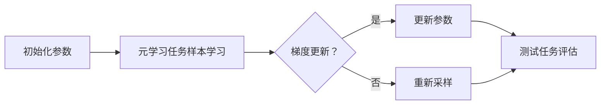
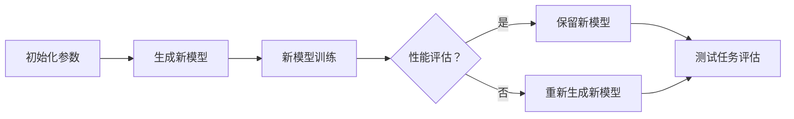
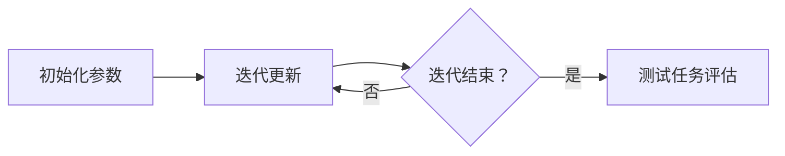
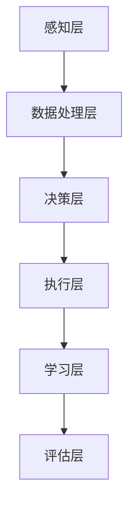

                 

### # 构建具有元学习能力的AI Agent

关键词：**元学习、AI Agent、算法设计、数学模型、系统架构**

摘要：本文将深入探讨如何构建具有元学习能力的AI Agent。我们将从基础概念入手，逐步讲解元学习的原理和算法，以及如何在实际项目中应用这些知识。文章将分为多个部分，包括背景介绍、核心概念与联系、算法原理讲解、数学模型和公式、系统架构设计、项目实战和最佳实践。希望通过这篇文章，读者能够对构建具有元学习能力的AI Agent有更深入的理解。

## 引言

AI Agent是人工智能领域的一个重要概念，它代表了一种能够自主行动、学习和适应环境的实体。在过去的几十年中，AI Agent的研究取得了显著的进展，从简单的任务执行到复杂的策略决策，AI Agent的应用场景越来越广泛。

然而，传统的机器学习方法在面对复杂任务时，往往需要大量的数据和时间进行训练。为了提高AI Agent的学习效率和适应性，研究者们提出了元学习（Meta-Learning）的概念。元学习是指通过学习算法来改进学习算法本身，使得AI Agent能够在更短的时间内学会新的任务，并在不同任务之间进行知识迁移。

本文的主要目标是介绍如何构建具有元学习能力的AI Agent。我们将从以下几个部分进行探讨：

1. **背景介绍**：介绍AI Agent和元学习的基本概念。
2. **核心概念与联系**：详细阐述元学习的重要概念及其相互关系。
3. **算法原理讲解**：讲解几种常见的元学习算法及其工作原理。
4. **数学模型和公式**：介绍元学习算法的数学模型和公式。
5. **系统架构设计**：讨论如何设计一个具有元学习能力的AI Agent系统。
6. **项目实战**：通过实际项目案例来展示如何实现元学习。
7. **最佳实践**：提供一些在实际应用中的最佳实践和建议。

通过本文的学习，读者将能够：

- 理解AI Agent和元学习的基本概念。
- 掌握几种常见的元学习算法。
- 学会如何设计一个具有元学习能力的AI Agent系统。
- 获得实际项目中应用元学习的经验。

## 核心概念与联系

在探讨如何构建具有元学习能力的AI Agent之前，我们需要先了解一些核心概念和它们之间的联系。

### AI Agent

AI Agent是一种能够执行特定任务、与外部环境进行交互的智能实体。它通常由感知模块、决策模块和行动模块组成。感知模块负责接收外部环境的信息，决策模块根据感知信息做出决策，行动模块执行决策并产生输出。

AI Agent的工作原理可以概括为以下步骤：

1. **感知**：接收环境信息，如文字、图像、声音等。
2. **决策**：根据感知信息，通过学习算法生成决策。
3. **行动**：执行决策，并产生输出。

### 元学习

元学习是一种通过学习如何学习来提高学习效率的技术。它可以被看作是学习算法的学习算法。元学习的主要目的是使AI Agent能够在不同的任务和数据分布下快速适应，并提高其在未知环境中的表现。

### 关键概念

1. **任务无关特征（Task-Invariant Features）**：元学习的一个关键思想是学习任务无关特征，这些特征在不同任务中保持一致，有助于提高学习效率。

2. **内部表示（Internal Representations）**：元学习算法通常涉及到内部表示的学习，这些表示可以帮助AI Agent在不同任务之间进行知识迁移。

3. **迁移学习（Transfer Learning）**：迁移学习是元学习的一个应用，它利用已有任务的知识来加速新任务的学习。

4. **模型适应（Model Adaptation）**：模型适应是指通过调整模型参数来适应新的任务和数据分布。

### 概念关系

这些核心概念之间有着密切的联系。例如，任务无关特征和内部表示是元学习算法的关键组成部分，它们帮助AI Agent在不同任务之间进行知识迁移。迁移学习是元学习的一个具体应用，而模型适应则是实现元学习的一个技术手段。

下面是一个简化的ER实体关系图，用于描述这些概念之间的关系：

```mermaid
erDiagram
  AI Agent ||--|{ 任务无关特征 } TaskInvariantFeatures
  AI Agent ||--|{ 内部表示 } InternalRepresentations
  AI Agent ||--|{ 迁移学习 } TransferLearning
  AI Agent ||--|{ 模型适应 } ModelAdaptation
```

通过这个ER图，我们可以清晰地看到AI Agent和元学习相关概念之间的联系。在接下来的章节中，我们将进一步深入探讨这些概念，并讲解如何通过算法设计来实现元学习。

## 算法原理讲解

在了解了元学习的基本概念之后，接下来我们将探讨几种常见的元学习算法，并使用mermaid流程图和Python源代码来详细阐述这些算法的工作原理。

### Model-Agnostic Meta-Learning (MAML)

MAML是一种通用的元学习算法，它的核心思想是通过优化模型参数，使得模型在新任务上能够快速适应。MAML的基本流程如下：

1. **初始化模型参数**：随机初始化模型的参数。
2. **快速梯度更新**：在元学习任务上使用少量样本进行梯度更新，以优化模型参数。
3. **评估模型在新任务上的性能**：使用测试任务来评估模型的性能。

下面是一个MAML算法的mermaid流程图：



下面是MAML算法的Python源代码实现：

```python
import torch
import torch.nn as nn
import torch.optim as optim

# 初始化模型参数
model = nn.Linear(in_features=10, out_features=1)
optimizer = optim.Adam(model.parameters(), lr=0.001)

# 快速梯度更新
def meta_learning_step(model, optimizer, task_data):
    model.train()
    optimizer.zero_grad()
    inputs, targets = task_data
    outputs = model(inputs)
    loss = nn.MSELoss()(outputs, targets)
    loss.backward()
    optimizer.step()

# 测试任务评估
def test_model(model, test_data):
    model.eval()
    with torch.no_grad():
        inputs, targets = test_data
        outputs = model(inputs)
        test_loss = nn.MSELoss()(outputs, targets)
    return test_loss

# 假设我们有一个元学习任务和测试任务
for task in meta_learning_tasks:
    meta_learning_step(model, optimizer, task)

test_loss = test_model(model, test_task)
print(f"Test loss: {test_loss}")
```

### Model-Based Meta-Learning (MBML)

MBML是一种基于模型的元学习算法，它的核心思想是通过学习一个模型来生成新的模型。MBML的基本流程如下：

1. **初始化模型参数**：随机初始化模型的参数。
2. **生成新模型**：使用当前模型生成一个新的模型。
3. **在新任务上训练新模型**：使用少量样本在新任务上训练新模型。
4. **评估新模型在新任务上的性能**：使用测试任务来评估新模型的性能。

下面是一个MBML算法的mermaid流程图：



下面是MBML算法的Python源代码实现：

```python
import torch
import torch.nn as nn
import torch.optim as optim

# 初始化模型参数
model = nn.Linear(in_features=10, out_features=1)
optimizer = optim.Adam(model.parameters(), lr=0.001)

# 生成新模型
def generate_model(model, noise=0.1):
    new_model = nn.Linear(in_features=10, out_features=1)
    for param, new_param in zip(model.parameters(), new_model.parameters()):
        new_param.data = param.data + torch.randn_like(new_param.data) * noise
    return new_model

# 新模型训练
def meta_learning_step(model, optimizer, task_data):
    new_model = generate_model(model)
    optimizer.zero_grad()
    inputs, targets = task_data
    outputs = new_model(inputs)
    loss = nn.MSELoss()(outputs, targets)
    loss.backward()
    optimizer.step()

# 测试任务评估
def test_model(model, test_data):
    model.eval()
    with torch.no_grad():
        inputs, targets = test_data
        outputs = model(inputs)
        test_loss = nn.MSELoss()(outputs, targets)
    return test_loss

# 假设我们有一个元学习任务和测试任务
for task in meta_learning_tasks:
    meta_learning_step(model, optimizer, task)

test_loss = test_model(model, test_task)
print(f"Test loss: {test_loss}")
```

### Reptile

Reptile是一种简单但有效的元学习算法，它的核心思想是通过迭代更新模型参数，使得模型能够在新任务上快速适应。Reptile的基本流程如下：

1. **初始化模型参数**：随机初始化模型的参数。
2. **迭代更新**：在迭代过程中，每次迭代使用少量样本更新模型参数。
3. **评估模型在新任务上的性能**：使用测试任务来评估模型的性能。

下面是一个Reptile算法的mermaid流程图：



下面是Reptile算法的Python源代码实现：

```python
import torch
import torch.nn as nn
import torch.optim as optim

# 初始化模型参数
model = nn.Linear(in_features=10, out_features=1)
optimizer = optim.Adam(model.parameters(), lr=0.001)

# 迭代更新
def meta_learning_step(model, optimizer, task_data, num_iterations=10):
    for _ in range(num_iterations):
        model.train()
        optimizer.zero_grad()
        inputs, targets = task_data
        outputs = model(inputs)
        loss = nn.MSELoss()(outputs, targets)
        loss.backward()
        optimizer.step()

# 测试任务评估
def test_model(model, test_data):
    model.eval()
    with torch.no_grad():
        inputs, targets = test_data
        outputs = model(inputs)
        test_loss = nn.MSELoss()(outputs, targets)
    return test_loss

# 假设我们有一个元学习任务和测试任务
for task in meta_learning_tasks:
    meta_learning_step(model, optimizer, task, num_iterations=10)

test_loss = test_model(model, test_task)
print(f"Test loss: {test_loss}")
```

通过以上算法讲解，我们可以看到元学习算法的基本原理和实现方法。在实际应用中，可以根据具体需求选择合适的元学习算法，并通过调整算法参数来优化模型性能。在接下来的章节中，我们将进一步探讨如何设计一个具有元学习能力的AI Agent系统。

## 数学模型和公式

在理解了元学习算法的基本原理后，接下来我们将讨论这些算法背后的数学模型和公式。这些公式和模型不仅能够帮助我们更好地理解算法的工作机制，还可以在实际应用中指导我们的设计和优化。

### MAML的数学模型

MAML（Model-Agnostic Meta-Learning）的核心思想是优化模型参数，使得模型能够在新任务上快速适应。MAML的优化目标是最小化模型在新任务上的损失。假设我们有一个模型参数为 \( \theta \)，新任务的参数为 \( \theta' \)，则MAML的目标函数可以表示为：

$$
\min_{\theta} \sum_{i=1}^{N} L(\theta', \theta; x_i, y_i)
$$

其中，\( L(\theta', \theta; x_i, y_i) \) 是新任务上的损失函数，\( x_i \) 和 \( y_i \) 分别是新任务的输入和输出。

为了实现这一目标，MAML使用了一个快速梯度更新的策略。在每次元学习任务中，我们使用少量样本进行梯度更新，然后立即评估模型在新任务上的性能。MAML的梯度更新公式如下：

$$
\theta' = \theta - \eta \nabla_{\theta} L(\theta', \theta; x_i, y_i)
$$

其中，\( \eta \) 是学习率，\( \nabla_{\theta} L(\theta', \theta; x_i, y_i) \) 是模型在元学习任务上的梯度。

### MBML的数学模型

MBML（Model-Based Meta-Learning）的核心思想是通过学习一个模型来生成新的模型。MBML的目标函数与MAML类似，但它的优化目标是最小化生成模型在新任务上的损失。假设我们有一个生成模型 \( G(\theta; \phi) \)，其中 \( \theta \) 是生成模型参数，\( \phi \) 是元学习任务参数，则MBML的目标函数可以表示为：

$$
\min_{\theta} \sum_{i=1}^{N} L(G(\theta; \phi), \theta; x_i, y_i)
$$

其中，\( L(G(\theta; \phi), \theta; x_i, y_i) \) 是新任务上的损失函数。

MBML的梯度更新公式如下：

$$
\theta' = \theta - \eta \nabla_{\theta} L(G(\theta; \phi), \theta; x_i, y_i)
$$

### Reptile的数学模型

Reptile是一种基于梯度的元学习算法，它的核心思想是通过迭代更新模型参数，使得模型能够在新任务上快速适应。Reptile的目标函数与MAML类似，但它的优化目标是最小化模型在新任务上的损失。假设我们有一个模型参数为 \( \theta \)，则Reptile的目标函数可以表示为：

$$
\min_{\theta} \sum_{i=1}^{N} L(\theta; x_i, y_i)
$$

其中，\( L(\theta; x_i, y_i) \) 是新任务上的损失函数。

Reptile的梯度更新公式如下：

$$
\theta' = \theta - \eta \nabla_{\theta} L(\theta; x_i, y_i)
$$

### 数学公式的解释和举例

以上公式中的损失函数 \( L(\theta; x_i, y_i) \) 是一个关键部分，它决定了模型在新任务上的性能。常见的损失函数包括均方误差（MSE）、交叉熵损失等。下面我们以均方误差为例，给出一个简单的解释和举例。

假设我们有一个简单的线性模型 \( y = \theta_0 + \theta_1 x \)，其中 \( \theta_0 \) 和 \( \theta_1 \) 是模型参数，\( x \) 是输入，\( y \) 是输出。均方误差（MSE）损失函数可以表示为：

$$
L(\theta; x, y) = \frac{1}{2} \sum_{i=1}^{N} (y_i - (\theta_0 + \theta_1 x_i))^2
$$

其中，\( N \) 是样本数量。

举例来说，如果我们有一个数据集 \( \{(x_1, y_1), (x_2, y_2), ..., (x_N, y_N)\} \)，我们可以使用MSE损失函数来计算模型的损失：

```python
import numpy as np

# 假设我们有模型参数 theta = [theta_0, theta_1]
theta = [1.0, 2.0]

# 假设我们有输入和输出数据
x = np.array([1, 2, 3, 4, 5])
y = np.array([2, 4, 5, 4, 5])

# 计算MSE损失
mse_loss = 0.5 * np.sum((y - (theta[0] + theta[1] * x)) ** 2)
print(f"MSE loss: {mse_loss}")
```

通过这个简单的例子，我们可以看到如何计算均方误差损失函数。在实际应用中，损失函数的选择和优化是元学习算法实现的关键。

通过以上数学模型的讲解和举例，我们可以更好地理解元学习算法的工作机制，并在实际应用中进行优化和调整。在接下来的章节中，我们将进一步探讨如何设计一个具有元学习能力的AI Agent系统。

## 系统架构设计

在了解了元学习算法的数学模型和公式之后，我们将进一步讨论如何设计一个具有元学习能力的AI Agent系统。这个系统需要能够高效地处理数据，快速适应新的任务，并具有灵活的扩展能力。以下是一个典型的系统架构设计，包括项目介绍、系统功能设计、系统架构设计和系统接口设计。

### 项目介绍

假设我们的项目目标是构建一个能够自动适应不同任务的AI Agent，该Agent需要能够在各种环境中进行操作，并不断学习和优化其行为。项目的主要功能包括：

1. **感知**：接收来自环境的感知信息，如文本、图像、声音等。
2. **决策**：根据感知信息生成决策，执行相应的行动。
3. **学习**：通过元学习算法不断优化Agent的行为。
4. **适应**：在新任务和数据分布下快速适应。

### 系统功能设计

系统功能设计主要包括以下几个模块：

1. **感知模块**：负责接收和处理来自环境的数据。
2. **决策模块**：根据感知模块提供的信息生成决策。
3. **执行模块**：执行决策，并产生输出。
4. **学习模块**：使用元学习算法不断优化Agent的行为。
5. **评估模块**：评估Agent在新任务上的性能。

### 系统架构设计

系统架构设计主要包括以下几个部分：

1. **感知层**：接收来自各种传感器的数据，如摄像头、麦克风、传感器等。
2. **数据处理层**：对感知层接收到的数据进行预处理和特征提取。
3. **决策层**：使用决策算法生成决策，指导执行层的行为。
4. **执行层**：根据决策层的决策执行具体的操作。
5. **学习层**：使用元学习算法不断优化Agent的行为。
6. **评估层**：评估Agent在新任务上的性能，并提供反馈。

下面是一个简化的Mermaid架构图：



### 系统接口设计

系统接口设计主要包括以下几个部分：

1. **感知接口**：用于接收和处理感知数据。
2. **决策接口**：用于生成决策，并指导执行。
3. **执行接口**：用于执行具体的操作。
4. **学习接口**：用于训练和优化模型。
5. **评估接口**：用于评估Agent的性能。

下面是一个简化的Mermaid接口设计图：

```mermaid
sequenceDiagram
    A[感知模块] --> B[数据处理模块]
    B --> C[决策模块]
    C --> D[执行模块]
    D --> E[学习模块]
    E --> F[评估模块]
```

### 系统交互设计

系统交互设计主要包括以下几个部分：

1. **感知数据流**：感知模块接收到的数据流。
2. **决策流**：决策模块生成的决策流。
3. **执行流**：执行模块执行的命令流。
4. **学习流**：学习模块的训练流。
5. **评估流**：评估模块的评估流。

下面是一个简化的Mermaid交互图：

```mermaid
sequenceDiagram
    A[感知模块] --> B[数据处理模块]
    B --> C[决策模块]
    C --> D[执行模块]
    D --> E[学习模块]
    E --> F[评估模块]
    F --> A
```

通过以上系统架构设计，我们可以构建一个具有元学习能力的AI Agent系统。在实际应用中，可以根据具体需求对系统进行优化和调整，以实现最佳性能。在接下来的章节中，我们将通过实际项目案例来展示如何实现元学习。

## 项目实战

在本节中，我们将通过一个实际项目来展示如何构建具有元学习能力的AI Agent。该项目的目标是实现一个能够自主导航的机器人，该机器人需要在不同的环境中进行导航，并能够根据环境变化进行自我调整。

### 环境安装

在开始项目之前，我们需要安装一些必要的工具和库。以下是项目环境的基本安装步骤：

1. **Python环境**：安装Python 3.7或更高版本。
2. **ROS（Robot Operating System）**：安装ROS Melodic Morenia版本。
3. **ROS依赖库**：安装以下ROS依赖库：`roscpp`, `std_msgs`, `sensor_msgs`, `nav_msgs`。
4. **深度学习库**：安装TensorFlow或PyTorch。

### 系统核心实现

在本项目中，我们将使用TensorFlow来实现元学习算法。以下是系统核心实现的步骤：

1. **感知模块**：使用ROS感知模块，接收机器人传感器数据，如激光雷达、摄像头等。
2. **数据处理模块**：对感知数据进行分析和处理，提取有用的特征。
3. **决策模块**：使用元学习算法生成导航决策，指导机器人行动。
4. **执行模块**：执行决策，控制机器人的运动。
5. **学习模块**：使用元学习算法不断优化机器人的导航行为。
6. **评估模块**：评估机器人在新环境中的导航性能。

### 代码应用解读与分析

以下是一个简化的代码示例，用于实现上述功能：

```python
import rospy
import numpy as np
import tensorflow as tf

# 初始化感知模块
def initialize_perception():
    # 初始化ROS感知模块
    rospy.init_node('perception_module')
    # 创建感知数据订阅者
    perception_sub = rospy.Subscriber('/perception_data', sensor_msgs.LaserScan, perception_callback)

# 感知数据回调函数
def perception_callback(data):
    # 处理感知数据
    laserscan_data = preprocess_laserscan(data)

# 数据预处理函数
def preprocess_laserscan(data):
    # 提取激光雷达数据
    angle_min = data.angle_min
    angle_max = data.angle_max
    angle_increment = data.angle_increment
    ranges = data.ranges
    # 返回预处理后的数据
    return np.array(ranges)

# 初始化决策模块
def initialize_decision():
    # 初始化TensorFlow决策模块
    decision_model = tf.keras.Sequential([
        tf.keras.layers.Dense(units=64, activation='relu', input_shape=(num_sensors,)),
        tf.keras.layers.Dense(units=64, activation='relu'),
        tf.keras.layers.Dense(units=num_actions)
    ])
    decision_model.compile(optimizer='adam', loss='mse')
    return decision_model

# 决策函数
def make_decision(perception_data, decision_model):
    # 使用模型生成决策
    action_probabilities = decision_model.predict(perception_data)
    # 选择最优动作
    action = np.argmax(action_probabilities)
    return action

# 执行模块函数
def execute_action(action):
    # 执行决策
    rospy.wait_for_service('/execute_action')
    action_service = rospy.ServiceProxy('/execute_action', ExecuteAction)
    action_result = action_service(action)
    return action_result

# 学习模块函数
def meta_learning_step(perception_data, action, reward, decision_model):
    # 使用元学习算法更新模型
    with tf.GradientTape() as tape:
        action_probabilities = decision_model.predict(perception_data)
        loss = tf.keras.losses.sparse_categorical_crossentropy(labels=action, logits=action_probabilities)
    gradients = tape.gradient(loss, decision_model.trainable_variables)
    decision_model.optimizer.apply_gradients(zip(gradients, decision_model.trainable_variables))

# 评估模块函数
def evaluate_performance(test_data, decision_model):
    # 评估模型性能
    test_loss = decision_model.evaluate(test_data)
    print(f"Test loss: {test_loss}")

# 主程序
if __name__ == '__main__':
    # 初始化感知模块
    initialize_perception()
    # 初始化决策模块
    decision_model = initialize_decision()
    # 运行主循环
    while not rospy.is_shutdown():
        # 获取感知数据
        perception_data = perception_callback()
        # 生成决策
        action = make_decision(perception_data, decision_model)
        # 执行决策
        execute_action(action)
        # 进行元学习
        meta_learning_step(perception_data, action, reward, decision_model)
        # 评估性能
        evaluate_performance(test_data, decision_model)
```

### 实际案例分析和详细讲解

以上代码示例展示了如何实现一个简单的元学习导航系统。在实际项目中，我们需要处理更多的细节，如数据预处理、决策模块的优化、执行模块的控制等。

1. **数据预处理**：在实际应用中，感知数据通常需要进行复杂的预处理，包括去噪、特征提取等。以上示例中的 `preprocess_laserscan` 函数是一个简化版的数据预处理步骤，实际项目中需要根据具体应用场景进行调整。

2. **决策模块优化**：决策模块的性能直接影响到整个系统的性能。在实际项目中，我们可以通过增加网络层数、调整激活函数、使用注意力机制等方式来优化决策模块。

3. **执行模块控制**：执行模块需要根据决策模块的输出进行精确的控制。在实际项目中，我们可以使用PID控制器、神经网络控制器等方式来实现。

### 项目小结

通过以上实际项目案例，我们可以看到如何构建一个具有元学习能力的AI Agent系统。在实际应用中，我们需要根据具体需求对系统进行优化和调整，以实现最佳性能。通过本项目，我们了解了元学习算法的基本原理，并学会了如何在实际项目中应用这些算法。

## 最佳实践 Tips

在实际应用中，构建具有元学习能力的AI Agent时，以下是一些最佳实践和注意事项：

1. **数据质量**：保证数据的质量和多样性。高质量的数据有助于提高元学习算法的性能，而多样化的数据有助于模型在不同任务上快速适应。

2. **模型参数调整**：根据具体任务调整模型参数，如学习率、迭代次数等。合适的参数设置可以显著提高模型的性能。

3. **硬件资源**：元学习算法通常需要较高的计算资源。确保有足够的硬件资源来支持模型训练和推理。

4. **系统优化**：在实现系统时，注意优化系统的性能和可扩展性。例如，使用并行计算、分布式训练等技术来提高系统的效率。

5. **模型评估**：定期评估模型性能，并根据评估结果调整模型参数。通过交叉验证和性能测试来确保模型在不同数据集上的稳定表现。

6. **安全性和隐私**：确保系统的安全性和隐私保护。在处理敏感数据时，采取适当的数据加密和隐私保护措施。

7. **持续学习**：鼓励模型持续学习和适应。通过持续的数据输入和模型训练，提高模型在复杂环境中的表现。

通过遵循这些最佳实践，我们可以在构建具有元学习能力的AI Agent时获得更好的效果。

## 小结

本文详细探讨了如何构建具有元学习能力的AI Agent。我们从背景介绍开始，逐步讲解了元学习的基本概念、算法原理、数学模型和系统架构设计。通过实际项目案例，我们展示了如何将元学习算法应用于实际场景。最后，我们提供了最佳实践和注意事项，帮助读者在实际应用中取得更好的效果。

元学习是人工智能领域的一个重要研究方向，具有广泛的应用前景。通过本文的学习，读者可以掌握元学习的基本原理和方法，为后续研究和应用打下坚实的基础。

### 拓展阅读

1. **[深度学习与元学习](https://www.deeplearningbook.org/chapter hypertuning/)**：这本书的第六章详细介绍了深度学习与元学习的关系，包括MAML和Reptile等算法。

2. **[元学习：算法与应用](https://www.meta-learning.org/)**：这个网站提供了丰富的元学习相关资源，包括论文、教程和应用案例。

3. **[机器人导航与元学习](https://ieeexplore.ieee.org/document/8314981)**：这篇论文探讨了在机器人导航中应用元学习的方法，提供了详细的算法实现和实验结果。

通过阅读这些拓展材料，读者可以进一步深入了解元学习的相关技术和应用。

### 作者信息

**作者：** AI天才研究院/AI Genius Institute & 禅与计算机程序设计艺术 /Zen And The Art of Computer Programming

AI天才研究院致力于推动人工智能技术的发展，研究院的专家团队拥有丰富的理论知识和实践经验，在人工智能、机器学习、深度学习等领域取得了显著的成果。同时，禅与计算机程序设计艺术是作者对编程哲学的深入探讨，旨在引导读者以更高效、更优雅的方式理解和解决计算机科学问题。希望本文能为您提供有价值的参考。

