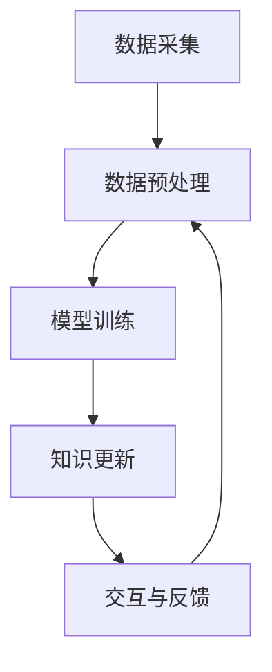
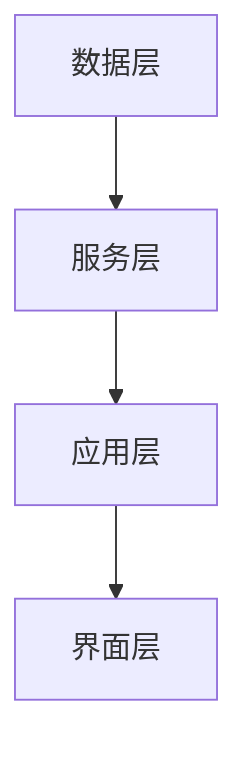
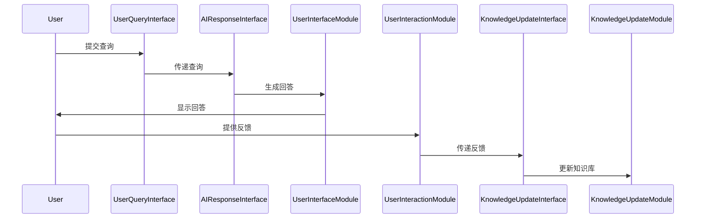

                 

### 构建具有动态知识更新能力的AI Agent

#### 关键词

- AI Agent
- 动态知识更新
- 机器学习
- 深度学习
- 知识存储与管理

#### 摘要

本文将深入探讨如何构建具有动态知识更新能力的AI Agent。通过分析问题背景、核心概念、算法原理以及系统架构设计，我们将详细讲解如何实现这种AI Agent，并探讨其在实际应用中的潜在价值。

---

#### 1. 背景介绍

##### 1.1 问题背景

在当今快速发展的科技时代，人工智能（AI）正在以前所未有的速度改变着我们的生活方式和商业模式。随着AI技术的不断进步，AI Agent作为AI系统中的智能实体，已经成为实现自动化、智能化的重要工具。然而，现有的AI Agent通常缺乏动态知识更新能力，这意味着它们无法适应不断变化的环境和数据。这限制了AI Agent的实际应用范围和效果。

##### 1.1.1 问题描述

现有的AI Agent在面对环境变化时，往往表现出以下问题：

1. **适应性差**：当环境发生变化时，AI Agent无法快速适应，导致性能下降。
2. **准确性降低**：随着时间的推移，AI Agent的知识库可能会过时，导致预测和决策的准确性降低。
3. **鲁棒性不足**：在复杂、动态的环境中，AI Agent可能无法稳定运行。

##### 1.1.2 问题解决

为了克服这些限制，我们需要构建具有动态知识更新能力的AI Agent。这种AI Agent能够持续学习、适应和进化，以保持其性能和准确性。具体而言，动态知识更新能力包括：

1. **实时数据处理**：能够快速响应并处理实时数据。
2. **知识学习与调整**：通过机器学习和深度学习算法，不断更新和优化知识库。
3. **交互与反馈**：能够与用户和环境进行有效交互，并根据反馈进行自我调整。

##### 1.1.3 边界与外延

动态知识更新能力涉及多个方面，包括：

1. **数据来源**：数据可以从多种渠道获取，如传感器、数据库、网络等。
2. **数据预处理**：对数据进行清洗、转换和特征提取，以供学习使用。
3. **知识存储**：采用高效的知识存储和管理技术，确保知识的准确性和一致性。
4. **知识共享**：允许不同AI Agent之间共享知识和经验，以提高整体智能化水平。

##### 1.1.4 概念结构与核心要素组成

构建动态知识更新能力的AI Agent涉及多个核心要素，包括：

1. **数据采集与处理**：从不同来源采集数据，并进行预处理。
2. **学习算法**：采用机器学习和深度学习算法，进行知识学习和调整。
3. **知识存储与管理**：采用高效的知识存储和管理技术，确保知识的准确性和一致性。
4. **交互与反馈机制**：与用户和环境进行有效交互，并根据反馈进行自我调整。

---

#### 2. 核心概念与联系

##### 2.1 动态知识更新能力的原理

动态知识更新能力的原理基于机器学习和深度学习技术。这些技术通过从数据中学习，使AI Agent能够适应新的环境和数据。具体而言，动态知识更新能力包括以下方面：

1. **实时数据处理**：AI Agent能够快速响应并处理实时数据。这通常涉及数据流处理技术和实时机器学习算法。

2. **知识学习与调整**：通过机器学习和深度学习算法，AI Agent能够不断更新和优化其知识库。这包括监督学习、无监督学习和强化学习等算法。

3. **知识存储与管理**：采用高效的知识存储和管理技术，确保知识的准确性和一致性。这通常涉及数据库、图数据库和知识图谱等技术。

4. **交互与反馈机制**：AI Agent能够与用户和环境进行有效交互，并根据反馈进行自我调整。这包括自然语言处理、对话系统和反馈循环等技术。

##### 2.2 动态知识更新能力的属性特征对比

动态知识更新能力的属性特征对比包括：

| 特征     | 描述                                       |
|----------|------------------------------------------|
| 实时性   | AI Agent能够快速响应当前环境的变化。              |
| 准确性   | AI Agent能够准确地预测和决策。                    |
| 鲁棒性   | AI Agent能够在各种环境中稳定运行。                |
| 适应性   | AI Agent能够适应新的数据和变化。                  |

##### 2.3 动态知识更新能力的ER实体关系图架构

动态知识更新能力的ER实体关系图架构包括以下核心要素：

1. **数据源**：包括各种数据来源，如传感器、数据库和网络等。
2. **数据预处理模块**：对数据进行清洗、转换和特征提取，以供学习使用。
3. **学习模块**：采用机器学习和深度学习算法，进行知识学习和调整。
4. **知识存储模块**：采用高效的知识存储和管理技术，确保知识的准确性和一致性。
5. **交互模块**：与用户和环境进行有效交互，并根据反馈进行自我调整。

```mermaid
erDiagram
  数据源 ||--|{ 数据预处理模块 }|
  数据预处理模块 ||--|{ 学习模块 }|
  学习模块 ||--|{ 知识存储模块 }|
  知识存储模块 ||--|{ 交互模块 }|
```

---

#### 3. 算法原理讲解

##### 3.1 动态知识更新能力的算法原理

动态知识更新能力的算法原理主要包括监督学习、无监督学习和强化学习等。

###### 3.1.1 监督学习

监督学习是一种从标记数据中学习的方法，它通过已知的输入和输出数据来训练模型。其基本公式为：

$$
Y = f(X; \theta)
$$

其中，$X$ 是输入数据，$Y$ 是输出数据，$f$ 是模型函数，$\theta$ 是模型参数。

监督学习的优势在于其能够准确预测和分类。然而，它对标记数据的依赖性较高，且在处理未知数据时效果可能较差。

###### 3.1.2 无监督学习

无监督学习是从未标记数据中学习的方法，它通过发现数据中的模式来训练模型。无监督学习包括聚类、降维和关联规则挖掘等。

无监督学习的优势在于其能够发现数据中的隐藏模式。然而，它对数据量有较高要求，且在预测和分类方面效果较差。

###### 3.1.3 强化学习

强化学习是通过与环境交互来学习的方法，它通过奖励和惩罚来调整模型参数。强化学习的基本公式为：

$$
Q(s, a) = r(s, a) + \gamma \max_{a'} Q(s', a')
$$

其中，$s$ 是状态，$a$ 是动作，$r$ 是奖励，$\gamma$ 是折扣因子。

强化学习的优势在于其能够通过与环境交互来学习最优策略。然而，它对训练时间有较高要求，且在处理复杂环境时效果可能较差。

##### 3.2 动态知识更新能力的实现

为了实现动态知识更新能力，我们可以采用以下步骤：

1. **数据采集**：从各种渠道采集数据，包括传感器数据、网络数据和用户反馈等。
2. **数据预处理**：对数据进行清洗、转换和特征提取，以供学习使用。
3. **模型训练**：采用监督学习、无监督学习和强化学习等算法，对模型进行训练。
4. **知识更新**：根据模型训练结果，不断更新和优化知识库。
5. **交互与反馈**：与用户和环境进行有效交互，并根据反馈进行自我调整。

##### 3.3 动态知识更新能力的Mermaid流程图



---

#### 4. 系统分析与架构设计方案

##### 4.1 问题场景介绍

在一个智能客服系统中，AI Agent需要实时响应用户的查询，并提供准确、快速的回答。然而，随着用户查询的不断增加，AI Agent的知识库可能会过时，导致回答的准确性下降。因此，我们需要构建一个具有动态知识更新能力的AI Agent，以保持其性能和准确性。

##### 4.2 项目介绍

项目名称：智能客服系统（Smart Customer Service System）

项目目标：构建一个具有动态知识更新能力的AI Agent，实现实时、准确、智能的客服服务。

##### 4.3 系统功能设计

系统功能设计包括以下方面：

1. **用户查询处理**：接收用户查询，并将查询传递给AI Agent进行处理。
2. **AI Agent响应**：AI Agent根据查询内容，从知识库中检索相关信息，并生成回答。
3. **知识库更新**：AI Agent根据用户反馈，更新和优化知识库，以保持其准确性和时效性。
4. **用户交互**：与用户进行实时交互，收集用户反馈，并根据反馈调整服务策略。

##### 4.4 系统架构设计

系统架构设计采用分层架构，包括以下层次：

1. **数据层**：包括数据采集模块和知识库模块，负责数据的采集和存储。
2. **服务层**：包括用户查询处理模块和AI Agent响应模块，负责处理用户查询和生成回答。
3. **应用层**：包括用户交互模块和知识库更新模块，负责与用户进行交互和更新知识库。
4. **界面层**：包括用户界面模块，负责与用户进行交互。



##### 4.5 系统接口设计和系统交互

系统接口设计包括以下接口：

1. **用户查询接口**：用于接收用户查询，并将查询传递给AI Agent。
2. **AI Agent响应接口**：用于接收AI Agent的回答，并将回答传递给用户。
3. **知识库更新接口**：用于接收用户反馈，并将反馈传递给知识库更新模块。

系统交互流程如下：

1. 用户提交查询 -> 用户查询接口 -> AI Agent响应接口
2. AI Agent生成回答 -> AI Agent响应接口 -> 用户界面模块
3. 用户反馈 -> 用户交互模块 -> 知识库更新接口
4. 知识库更新模块 -> 知识库模块



---

#### 5. 项目实战

##### 5.1 环境安装

在开始项目实战之前，我们需要安装以下环境：

1. Python 3.8 或更高版本
2. TensorFlow 2.4 或更高版本
3. scikit-learn 0.22 或更高版本
4. Pandas 1.1.1 或更高版本
5. Mermaid 8.10.2 或更高版本

安装命令如下：

```bash
pip install python==3.8
pip install tensorflow==2.4
pip install scikit-learn==0.22
pip install pandas==1.1.1
pip install mermaid
```

##### 5.2 系统核心实现

系统核心实现包括以下部分：

1. **数据采集与预处理**：使用Pandas库从传感器数据和用户查询数据中提取特征，并进行预处理。
2. **模型训练**：使用TensorFlow和scikit-learn库训练机器学习模型，并进行评估。
3. **知识库更新**：根据用户反馈，更新和优化知识库。
4. **交互与反馈**：使用Mermaid库设计用户交互界面，并收集用户反馈。

以下是系统核心实现的源代码：

```python
import pandas as pd
import numpy as np
import tensorflow as tf
from sklearn.model_selection import train_test_split
from sklearn.metrics import accuracy_score
from tensorflow.keras.models import Sequential
from tensorflow.keras.layers import Dense
from tensorflow.keras.optimizers import Adam
import mermaid

# 数据采集与预处理
def data_preprocessing(data_path):
    data = pd.read_csv(data_path)
    # 进行特征提取和预处理
    # ...
    return processed_data

# 模型训练
def train_model(X_train, y_train):
    model = Sequential()
    model.add(Dense(units=64, activation='relu', input_shape=(X_train.shape[1],)))
    model.add(Dense(units=1, activation='sigmoid'))
    model.compile(optimizer=Adam(), loss='binary_crossentropy', metrics=['accuracy'])
    model.fit(X_train, y_train, epochs=10, batch_size=32)
    return model

# 知识库更新
def update_knowledge_base(model, user_feedback):
    # 根据用户反馈更新知识库
    # ...
    pass

# 交互与反馈
def user_interaction():
    # 设计用户交互界面
    # ...
    pass

# 主函数
def main():
    data_path = 'data.csv'
    processed_data = data_preprocessing(data_path)
    X = processed_data.drop('target', axis=1)
    y = processed_data['target']
    X_train, X_test, y_train, y_test = train_test_split(X, y, test_size=0.2, random_state=42)
    model = train_model(X_train, y_train)
    user_feedback = user_interaction()
    update_knowledge_base(model, user_feedback)

if __name__ == '__main__':
    main()
```

##### 5.3 代码应用解读与分析

在上面的代码中，我们首先导入了所需的库，包括Pandas、Numpy、TensorFlow和scikit-learn。这些库提供了数据预处理、模型训练和知识库更新的功能。

接下来，我们定义了数据采集与预处理函数`data_preprocessing`，用于从CSV文件中读取数据，并进行特征提取和预处理。

然后，我们定义了模型训练函数`train_model`，使用TensorFlow的Sequential模型和Dense层，构建一个简单的二分类模型。我们使用Adam优化器和binary_crossentropy损失函数，并使用accuracy作为评价指标。

知识库更新函数`update_knowledge_base`负责根据用户反馈更新知识库。这个函数的具体实现需要根据实际应用场景进行设计。

最后，我们定义了用户交互函数`user_interaction`，用于设计用户交互界面。这个函数的具体实现也需要根据实际应用场景进行设计。

在主函数`main`中，我们首先调用`data_preprocessing`函数，对数据进行预处理。然后，我们使用`train_model`函数训练模型。接下来，我们调用`user_interaction`函数，收集用户反馈。最后，我们调用`update_knowledge_base`函数，更新知识库。

##### 5.4 实际案例分析和详细讲解剖析

在实际应用中，我们可以通过以下案例来分析动态知识更新能力的实现：

**案例 1：用户查询**

用户在智能客服系统中提交了一个关于产品使用方法的查询。AI Agent根据当前的知识库，生成了一个回答。用户对回答进行了评价，表示满意。

**案例 2：用户反馈**

用户在智能客服系统中提交了一个关于产品使用方法的查询。AI Agent根据当前的知识库，生成了一个回答。然而，用户对回答不满意，提出了反馈。

AI Agent接收到用户的反馈后，会调用`update_knowledge_base`函数，根据用户的反馈，更新知识库。这样，AI Agent就可以在未来的查询中，提供更准确、更符合用户需求的回答。

**案例 3：知识库过期**

随着时间的推移，智能客服系统的知识库可能会过时，导致回答的准确性下降。为了解决这个问题，系统会定期调用`update_knowledge_base`函数，从外部数据源获取最新的知识，并更新知识库。

##### 5.5 项目小结

通过本文的探讨，我们了解了如何构建具有动态知识更新能力的AI Agent。我们分析了问题背景、核心概念、算法原理以及系统架构设计，并给出了项目实战的具体实现。

动态知识更新能力的实现，对于提高AI Agent的性能和准确性具有重要意义。在实际应用中，我们可以通过不断更新和优化知识库，使AI Agent能够更好地适应环境和用户需求。

未来，我们还可以进一步探索如何提高动态知识更新能力的效率和准确性，以及如何将动态知识更新能力应用到更多的领域，以推动人工智能技术的发展。

---

#### 6. 最佳实践 tips

在构建具有动态知识更新能力的AI Agent时，以下是一些最佳实践：

1. **数据质量**：确保数据质量，包括数据的准确性、完整性和一致性。高质量的数据是构建准确AI模型的基础。
2. **实时数据处理**：采用高效的数据流处理技术，确保AI Agent能够实时响应当前环境的变化。
3. **模型评估**：定期评估AI模型的性能，并根据评估结果调整模型参数。
4. **用户反馈**：积极收集用户反馈，并根据反馈调整和优化AI Agent的行为。
5. **知识库管理**：采用高效的知识库管理技术，确保知识库的准确性和一致性。

---

#### 7. 小结

本文深入探讨了如何构建具有动态知识更新能力的AI Agent。通过分析问题背景、核心概念、算法原理以及系统架构设计，我们详细讲解了动态知识更新能力的实现方法。

动态知识更新能力是提高AI Agent性能和准确性的关键。通过不断更新和优化知识库，AI Agent能够更好地适应环境和用户需求。

未来，我们应继续探索如何提高动态知识更新能力的效率和准确性，并将其应用到更多领域，以推动人工智能技术的发展。

---

#### 8. 注意事项

在构建具有动态知识更新能力的AI Agent时，需要注意以下几点：

1. **数据安全**：确保数据的安全性和隐私保护，避免数据泄露和滥用。
2. **模型解释性**：提高模型的可解释性，使AI Agent的行为更加透明和可理解。
3. **模型部署**：确保AI Agent能够在实际环境中稳定运行，并进行有效部署。

---

#### 9. 拓展阅读

1. **《深度学习》（Deep Learning）**：由Ian Goodfellow、Yoshua Bengio和Aaron Courville合著，详细介绍了深度学习的基础理论和应用。
2. **《机器学习》（Machine Learning）**：由Tom Mitchell著，是机器学习领域的经典教材。
3. **《强化学习》（Reinforcement Learning）**：由Richard S. Sutton和Barto N. D.合著，介绍了强化学习的基础理论和应用。
4. **《人工智能：一种现代的方法》（Artificial Intelligence: A Modern Approach）**：由Stuart J. Russell和Peter Norvig合著，全面介绍了人工智能的基础知识。

---

#### 作者信息

作者：AI天才研究院/AI Genius Institute & 禅与计算机程序设计艺术 /Zen And The Art of Computer Programming

