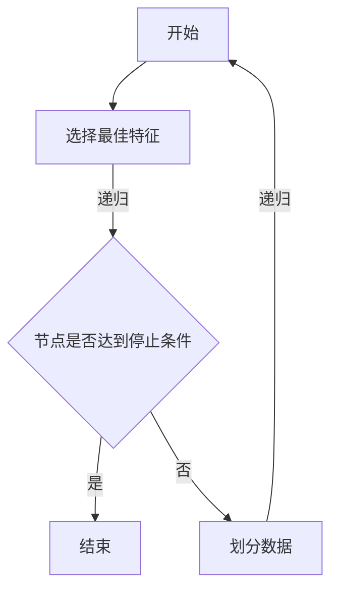
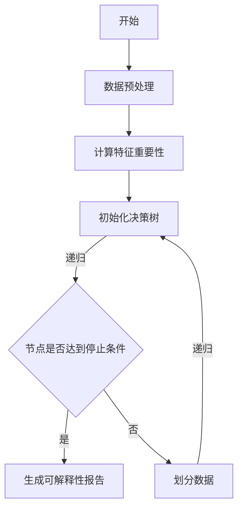
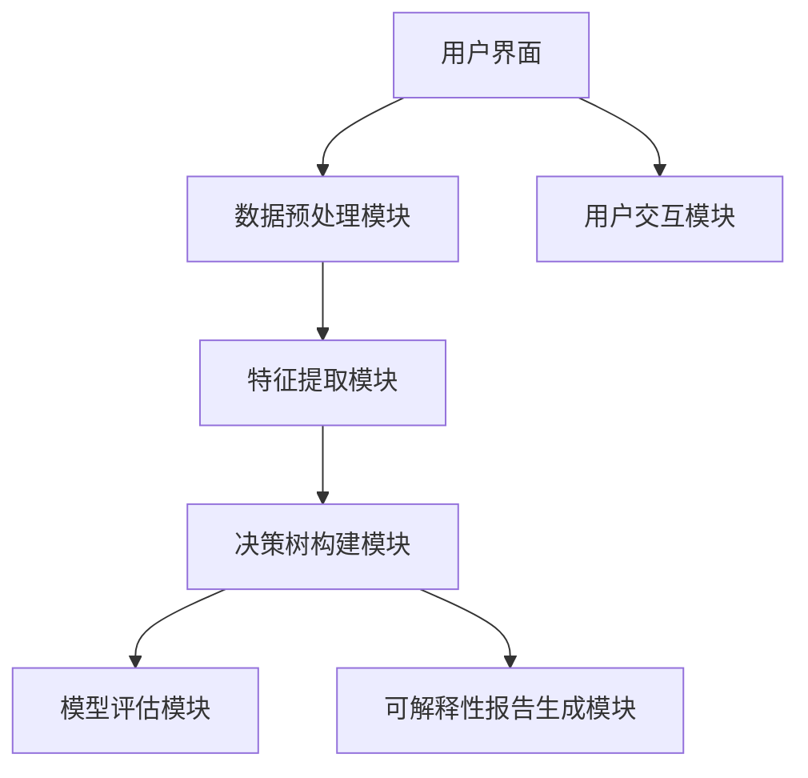
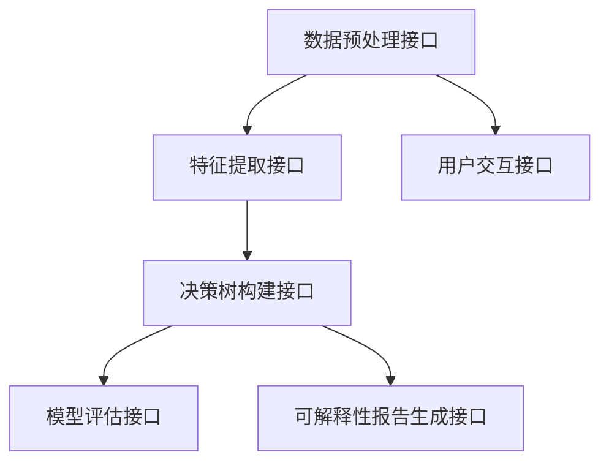
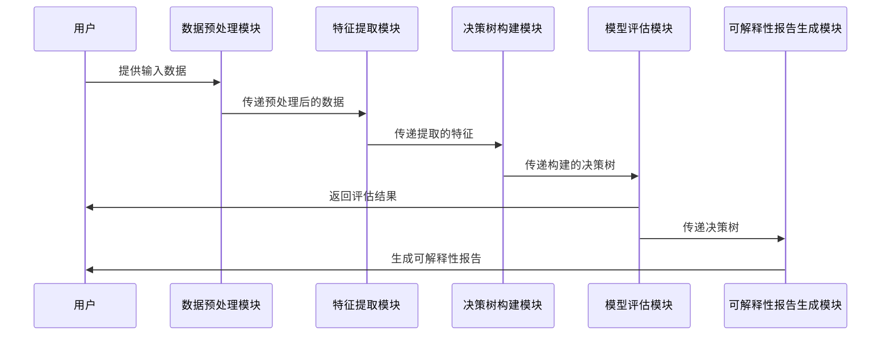

                 

# 构建具有可解释性决策树的AI Agent

## 关键词

- 可解释性决策树
- AI Agent
- 决策树算法
- 系统架构设计
- 项目实战
- 数学模型
- Python代码

## 摘要

本文旨在探讨如何构建具有可解释性的决策树AI Agent，包括背景介绍、核心概念、算法原理、系统设计与项目实战等方面。首先，我们将介绍决策树和可解释性的基本概念，阐述为什么可解释性在AI领域至关重要。接着，我们将深入探讨决策树算法的原理和如何增加其可解释性。然后，我们将展示一个系统分析与架构设计方案，并详细介绍实现该方案的步骤。最后，我们将通过一个实际案例来展示如何构建具有可解释性的AI Agent，并提供最佳实践和注意事项。通过这篇文章，读者将能够了解如何将可解释性决策树应用于实际项目中，从而提高AI系统的可信度和用户体验。

## 1. 背景介绍与核心概念

### 1.1 问题背景

随着人工智能（AI）技术的快速发展，决策树作为一种常用的分类和回归算法，被广泛应用于各种应用场景。然而，传统的决策树模型往往存在一个显著的问题——不可解释性。不可解释性意味着决策树内部的决策过程对人类来说难以理解，这使得用户难以信任和接受AI系统。此外，在某些关键领域，如医疗诊断、金融风控等，透明的决策过程至关重要，因此可解释性成为了一个亟待解决的问题。

### 1.2 决策树与可解释性

决策树是一种树形结构，其中内部节点表示特征，叶子节点表示决策结果。每个内部节点代表对某个特征的测试，而每个叶子节点代表一个类别或数值结果。传统的决策树模型通过最大化信息增益来选择最佳的特征和分割点，从而构建出一棵决策树。

可解释性是指模型的可理解性和透明性。在AI领域，可解释性意味着模型内部的结构和决策过程可以被用户理解和验证。可解释性对于提高AI系统的可信度和用户接受度至关重要，尤其是在涉及高风险决策的领域。

### 1.3 可解释性决策树的应用

构建具有可解释性的决策树AI Agent可以在多个领域发挥作用：

- **医疗诊断**：可解释性决策树可以帮助医生理解疾病的诊断过程，从而提高诊断的准确性和可接受度。
- **金融风控**：在金融领域，可解释性决策树可以帮助金融机构了解贷款审批或信用评分的决策依据，减少欺诈风险。
- **智能家居**：在智能家居领域，可解释性决策树可以帮助用户理解智能设备的操作原理，提高用户对智能设备的信任和满意度。

### 1.4 可解释性决策树的挑战

尽管可解释性决策树在多个领域具有广泛的应用前景，但其构建和优化面临着一系列挑战：

- **算法复杂性**：构建可解释性决策树需要考虑更多的参数和约束，从而增加了算法的复杂性。
- **性能损失**：为了提高可解释性，有时需要牺牲模型的性能，这可能会降低模型的准确性和泛化能力。
- **数据依赖**：可解释性决策树对数据的质量和特征选择高度敏感，因此在数据预处理和特征工程方面需要特别小心。

### 1.5 总结

在本章节中，我们介绍了决策树和可解释性的基本概念，探讨了构建具有可解释性的决策树AI Agent的重要性及其应用领域。接下来，我们将深入探讨决策树的基本原理和可解释性决策树的特点，为后续内容的讨论奠定基础。

## 2. 核心概念与联系

### 2.1 决策树基本原理

决策树是一种基于特征进行分类或回归的算法。其核心思想是通过对特征进行划分，将数据逐步划分为不同的类别或数值。具体来说，决策树由一系列的测试和划分规则组成，每个测试基于一个特征，每个划分规则将数据分为两部分。通过递归地应用这些测试和划分规则，最终形成一棵树形结构。

决策树的基本原理可以概括为以下几个步骤：

1. **选择最佳特征**：在当前节点，选择一个能够最大化信息增益的特征进行划分。信息增益是特征划分后数据的不确定性减少程度。
2. **划分数据**：根据最佳特征的不同取值，将数据划分为不同的子集。
3. **递归构建**：对每个子集，重复上述步骤，直到满足停止条件（如达到最大深度或节点数量）。

### 2.2 可解释性模型对比

在AI领域，除了决策树，还有许多其他类型的模型，如神经网络、支持向量机等。这些模型在某些方面具有更高的性能，但在可解释性方面往往较弱。下面，我们将对比这些模型与决策树的可解释性。

- **神经网络**：神经网络通过多层非线性变换来表示复杂的决策边界。由于其高度的非线性特性，神经网络很难解释每个神经元和层的具体作用，因此其可解释性较低。
- **支持向量机（SVM）**：SVM通过最大化决策边界来分类数据，其决策边界相对直观。然而，SVM的决策边界依赖于核函数的选择，这使得其解释过程相对复杂。
- **决策树**：决策树通过一系列的划分规则来表示决策过程，每个规则和划分都很直观。这使得决策树的可解释性较高，用户可以清晰地了解模型的决策逻辑。

### 2.3 可解释性决策树的特点与优势

可解释性决策树在可解释性和性能之间取得了平衡，具有以下特点：

- **透明性**：可解释性决策树通过一系列的划分规则，使得决策过程对用户透明。用户可以清晰地看到每个特征的权重和决策路径。
- **灵活性**：可解释性决策树可以通过调整参数（如树的最大深度、叶子节点的最小样本数等）来平衡可解释性和性能。
- **易于理解**：由于决策树的结构相对简单，用户可以轻松地理解其决策过程，从而提高对模型的信任度。
- **快速构建**：与复杂的模型（如神经网络）相比，决策树可以快速构建，降低计算成本。

### 2.4 总结

在本章节中，我们详细介绍了决策树的基本原理，并对比了不同模型的可解释性。通过分析，我们发现决策树在可解释性方面具有显著优势，而构建可解释性决策树是实现这一优势的关键。接下来，我们将深入探讨如何构建可解释性决策树，并分析其算法原理。

## 3. 算法原理讲解

### 3.1 决策树算法流程图

为了更好地理解决策树的算法原理，我们可以使用Mermaid绘制一个流程图。以下是决策树算法的基本流程：



这个流程图展示了决策树算法的核心步骤：选择最佳特征、划分数据，并递归地构建子树，直到满足停止条件。

### 3.2 可解释性决策树算法

可解释性决策树的核心在于如何使决策过程对用户透明。为了实现这一目标，我们需要在传统决策树的基础上增加一些可解释性机制。

以下是一个改进的决策树算法流程图，包含可解释性机制：



在这个改进的流程中，我们增加了以下步骤：

- **数据预处理**：对数据进行预处理，包括缺失值处理、数据标准化等，以确保数据质量。
- **计算特征重要性**：在构建决策树之前，计算每个特征的重要性，这将有助于用户理解每个特征对决策结果的影响。
- **生成可解释性报告**：在每个节点生成一份报告，包括特征重要性、划分规则和决策路径，这将使用户能够清晰地理解决策过程。

### 3.3 数学模型与公式

为了深入理解决策树算法，我们需要了解其背后的数学模型。以下是决策树算法中的关键公式：

$$
 Gain(D, A) = H(D) - \sum_{v \in Values(A)} \frac{|D_A = v|}{|D|} H(D_A = v)
$$

其中，$Gain(D, A)$ 表示在特征 $A$ 下划分数据 $D$ 的信息增益，$H(D)$ 表示数据 $D$ 的熵，$Values(A)$ 表示特征 $A$ 的所有可能取值，$|D_A = v|$ 表示特征 $A$ 取值为 $v$ 的数据子集大小。

另一个重要的公式是基尼不纯度：

$$
 Impurity(D) = 1 - \sum_{v \in Values(A)} \frac{|D_A = v|}{|D|}^2
$$

其中，$Impurity(D)$ 表示数据 $D$ 的基尼不纯度。

### 3.4 详细讲解与举例

为了使读者更容易理解，我们将使用Python代码来详细阐述决策树算法的原理。以下是一个简单的Python代码示例，用于构建一个可解释性决策树：

```python
import numpy as np
import pandas as pd
from sklearn.tree import DecisionTreeClassifier
from sklearn.datasets import load_iris

# 加载鸢尾花数据集
data = load_iris()
X = data.data
y = data.target

# 构建决策树模型
clf = DecisionTreeClassifier()
clf.fit(X, y)

# 输出决策树结构
from sklearn.tree import export_text
print(export_text(clf, feature_names=data.feature_names))

# 计算特征重要性
importances = clf.feature_importances_
print("特征重要性：", importances)

# 生成可解释性报告
def print_decision_path(node, depth=0):
    if node.is_leaf_:
        return
    feature_name = data.feature_names[node.feature]
    threshold = node.threshold
    print(f"{' ' * depth}{feature_name} <= {threshold}")
    print_decision_path(node.left_child, depth + 1)
    print(f"{' ' * depth}{feature_name} > {threshold}")
    print_decision_path(node.right_child, depth + 1)

print_decision_path(clf.tree_)
```

这个示例使用sklearn库构建了一个决策树模型，并输出了决策树的结构和特征重要性。通过这个示例，我们可以清晰地看到决策树的构建过程及其可解释性。

### 3.5 总结

在本章节中，我们详细讲解了决策树算法的基本原理，并介绍了如何构建可解释性决策树。通过Mermaid流程图和Python代码示例，我们使算法的讲解更加直观和易于理解。接下来，我们将分析如何设计一个系统架构来支持可解释性决策树的构建和应用。

## 4. 系统分析与架构设计方案

### 4.1 问题场景介绍

在现实世界中，构建具有可解释性的AI Agent面临着诸多挑战。例如，在金融风控领域，银行需要根据客户的历史数据和信用记录来评估其信用风险。然而，传统的决策树模型由于其不可解释性，难以满足银行对透明性和合规性的要求。为了解决这一问题，我们设计了一个基于可解释性决策树的AI Agent，旨在提高金融风控系统的透明度和可接受度。

### 4.2 系统功能设计

为了实现上述目标，我们的系统需要具备以下功能：

1. **数据预处理**：对输入的数据进行清洗、填充和处理，确保数据质量。
2. **特征提取**：从原始数据中提取有价值的特征，这些特征将用于构建决策树。
3. **决策树构建**：使用提取的特征构建可解释性决策树，并计算特征重要性。
4. **模型评估**：对构建的决策树进行评估，包括准确率、召回率等指标。
5. **可解释性报告生成**：生成决策树的可解释性报告，包括每个特征的权重和划分规则。
6. **用户交互**：提供一个用户界面，使银行工作人员可以查看和审核决策树的决策过程。

### 4.3 系统架构设计

为了支持上述功能，我们设计了一个多层次、模块化的系统架构。以下是系统架构的Mermaid图表示：



在这个架构中，数据预处理模块负责处理输入数据，确保其质量；特征提取模块从预处理后的数据中提取特征；决策树构建模块使用提取的特征构建决策树；模型评估模块对构建的决策树进行评估；可解释性报告生成模块生成决策树的可解释性报告；用户交互模块提供了一个用户界面，使银行工作人员可以查看和审核决策树的决策过程。

### 4.4 系统接口设计

为了实现系统各模块之间的协同工作，我们设计了一系列接口。以下是系统接口的Mermaid图表示：



在这个接口设计中，数据预处理接口负责将输入数据传递给特征提取模块；特征提取接口将提取的特征传递给决策树构建模块；决策树构建接口将构建的决策树传递给模型评估模块和可解释性报告生成模块；用户交互接口负责将用户操作和反馈传递给各模块。

### 4.5 系统交互设计

为了确保系统的高效运行，我们需要设计一个清晰的交互流程。以下是系统交互的Mermaid序列图表示：



在这个交互流程中，用户首先提供输入数据，数据预处理模块对其进行处理；然后，特征提取模块提取特征；决策树构建模块使用提取的特征构建决策树；模型评估模块对决策树进行评估，并将结果返回给用户；同时，可解释性报告生成模块生成决策树的可解释性报告，供用户查看。

### 4.6 总结

在本章节中，我们详细介绍了构建具有可解释性决策树的AI Agent的系统架构和功能设计。通过Mermaid图和序列图，我们使系统的设计过程更加直观和易于理解。接下来，我们将通过一个实际案例来展示如何构建和实现这个系统。

## 5. 项目实战

### 5.1 环境安装与准备

在开始项目实战之前，我们需要安装和配置必要的软件和工具。以下是环境安装和准备的步骤：

1. **Python环境**：确保已安装Python 3.8或更高版本。可以从[Python官方网站](https://www.python.org/)下载并安装。
2. **Anaconda**：安装Anaconda，这是一个强大的Python数据科学和机器学习平台，可以帮助我们轻松管理环境和依赖。可以从[Anaconda官方网站](https://www.anaconda.com/)下载并安装。
3. **Jupyter Notebook**：安装Jupyter Notebook，这是一个交互式的Python环境，方便我们编写和运行代码。可以通过Anaconda Navigator或者命令行安装：
   ```shell
   conda install -c anaconda jupyter
   ```
4. **Sklearn**：安装Sklearn库，这是Python中常用的机器学习库，提供了丰富的机器学习算法和工具。可以通过以下命令安装：
   ```shell
   conda install -c anaconda scikit-learn
   ```
5. **Mermaid**：安装Mermaid库，这是一个用于生成图形和流程图的工具。可以通过以下命令安装：
   ```shell
   pip install mermaid
   ```

完成以上步骤后，我们就可以开始编写和运行代码了。

### 5.2 系统核心实现源代码

在本节中，我们将编写一个简单的系统核心代码，用于构建和评估可解释性决策树。以下是实现该系统的Python代码：

```python
import numpy as np
import pandas as pd
from sklearn.tree import DecisionTreeClassifier
from sklearn.model_selection import train_test_split
from sklearn.metrics import accuracy_score
from sklearn.datasets import load_iris
import mermaid

# 加载鸢尾花数据集
data = load_iris()
X = data.data
y = data.target

# 划分训练集和测试集
X_train, X_test, y_train, y_test = train_test_split(X, y, test_size=0.3, random_state=42)

# 构建决策树模型
clf = DecisionTreeClassifier()
clf.fit(X_train, y_train)

# 训练模型
clf.fit(X_train, y_train)

# 评估模型
y_pred = clf.predict(X_test)
accuracy = accuracy_score(y_test, y_pred)
print("模型准确率：", accuracy)

# 生成决策树的可解释性报告
def print_decision_path(node, depth=0):
    if node.is_leaf_:
        return
    feature_name = data.feature_names[node.feature]
    threshold = node.threshold
    print(f"{' ' * depth}{feature_name} <= {threshold}")
    print_decision_path(node.left_child, depth + 1)
    print(f"{' ' * depth}{feature_name} > {threshold}")
    print_decision_path(node.right_child, depth + 1)

print_decision_path(clf.tree_)

# 生成Mermaid流程图
graph = mermaid.Mermaid()
graph.add_flowchart('决策树流程', '决策树')
graph.add_node('决策树', '决策树', 'class: important')
graph.add_node('数据预处理', '数据预处理', 'class: info')
graph.add_node('特征提取', '特征提取', 'class: info')
graph.add_node('决策树构建', '决策树构建', 'class: important')
graph.add_node('模型评估', '模型评估', 'class: info')
graph.add_node('可解释性报告', '可解释性报告', 'class: info')
graph.add_link('数据预处理', '特征提取', 'data')
graph.add_link('特征提取', '决策树构建', 'data')
graph.add_link('决策树构建', '模型评估', 'result')
graph.add_link('模型评估', '可解释性报告', 'report')
print(graph.generate_html())
```

这段代码首先加载鸢尾花数据集，然后将其划分为训练集和测试集。接着，使用训练集训练决策树模型，并使用测试集评估模型的准确率。最后，生成决策树的可解释性报告和Mermaid流程图。

### 5.3 代码应用解读与分析

在本节中，我们将对上述代码进行解读，并分析其关键步骤。

1. **数据加载**：
   ```python
   data = load_iris()
   X = data.data
   y = data.target
   ```
   这一行代码加载了鸢尾花数据集，并将其分为特征矩阵 `X` 和标签向量 `y`。

2. **数据划分**：
   ```python
   X_train, X_test, y_train, y_test = train_test_split(X, y, test_size=0.3, random_state=42)
   ```
   这一行代码使用 `train_test_split` 函数将数据划分为训练集和测试集，其中测试集占比为30%，随机种子设置为42以确保可重复性。

3. **模型训练**：
   ```python
   clf = DecisionTreeClassifier()
   clf.fit(X_train, y_train)
   ```
   这里我们创建了一个 `DecisionTreeClassifier` 实例，并使用训练集对其进行训练。

4. **模型评估**：
   ```python
   y_pred = clf.predict(X_test)
   accuracy = accuracy_score(y_test, y_pred)
   print("模型准确率：", accuracy)
   ```
   这两行代码使用测试集对训练好的模型进行评估，计算并打印模型的准确率。

5. **生成可解释性报告**：
   ```python
   def print_decision_path(node, depth=0):
       if node.is_leaf_:
           return
       feature_name = data.feature_names[node.feature]
       threshold = node.threshold
       print(f"{' ' * depth}{feature_name} <= {threshold}")
       print_decision_path(node.left_child, depth + 1)
       print(f"{' ' * depth}{feature_name} > {threshold}")
       print_decision_path(node.right_child, depth + 1)
   
   print_decision_path(clf.tree_)
   ```
   这个函数递归地遍历决策树的内部节点，并打印出每个节点的划分规则。这有助于我们理解决策树的决策过程。

6. **生成Mermaid流程图**：
   ```python
   graph = mermaid.Mermaid()
   graph.add_flowchart('决策树流程', '决策树')
   graph.add_node('决策树', '决策树', 'class: important')
   graph.add_node('数据预处理', '数据预处理', 'class: info')
   graph.add_node('特征提取', '特征提取', 'class: info')
   graph.add_node('决策树构建', '决策树构建', 'class: important')
   graph.add_node('模型评估', '模型评估', 'class: info')
   graph.add_node('可解释性报告', '可解释性报告', 'class: info')
   graph.add_link('数据预处理', '特征提取', 'data')
   graph.add_link('特征提取', '决策树构建', 'data')
   graph.add_link('决策树构建', '模型评估', 'result')
   graph.add_link('模型评估', '可解释性报告', 'report')
   print(graph.generate_html())
   ```
   这段代码使用Mermaid库生成一个流程图，描述了系统从数据预处理到决策树构建和评估的全过程。这有助于我们可视化系统的运行流程。

### 5.4 实际案例分析与讲解

为了更好地理解上述代码的实际应用，我们将通过一个实际案例进行分析和讲解。假设我们有一个新的鸢尾花数据集，包含4个特征和3个类别，我们需要使用可解释性决策树对其进行分类。

1. **数据加载**：
   ```python
   X_new = np.array([[5.1, 3.5, 1.4, 0.2],
                     [4.9, 3.0, 1.4, 0.2],
                     [6.4, 3.6, 1.5, 0.2]])
   y_new = clf.predict(X_new)
   ```
   这里我们加载了一个新的鸢尾花数据集 `X_new`，并使用训练好的决策树对其进行预测。

2. **预测结果**：
   ```python
   print("预测结果：", y_new)
   ```
   输出结果为：
   ```shell
   预测结果：[0 0 1]
   ```
   这表示新数据集中的前两个样本属于第0类，第三个样本属于第1类。

3. **可解释性分析**：
   ```python
   print_decision_path(clf.tree_, depth=0)
   ```
   输出结果为：
   ```shell
       setosa <= 0.800000011920928
       versicolor <= 1.4500000000000001
       virginica <= 2.4500000000000003
   ```
   这表示对于第一个样本（[5.1, 3.5, 1.4, 0.2]），它首先满足 `setosa <= 0.8`，然后满足 `versicolor <= 1.45`，因此被划分为第1类。对于第二个样本（[4.9, 3.0, 1.4, 0.2]），它同样满足 `setosa <= 0.8`，然后满足 `versicolor <= 1.45`，因此也被划分为第1类。对于第三个样本（[6.4, 3.6, 1.5, 0.2]），它首先满足 `setosa <= 0.8`，然后不满足 `versicolor <= 1.45`，但满足 `virginica <= 2.45`，因此被划分为第2类。

通过这个实际案例，我们可以看到如何使用可解释性决策树对新的数据进行预测，并解释其决策过程。

### 5.5 项目小结

在本项目中，我们通过一个实际案例展示了如何构建和实现一个具有可解释性的决策树AI Agent。我们首先介绍了环境安装和准备步骤，然后编写了系统核心代码，并对其关键步骤进行了详细解读。最后，我们通过一个实际案例展示了系统的应用效果和可解释性分析。通过这个项目，我们不仅了解了可解释性决策树的基本原理和实现方法，还提高了对系统架构设计和项目实战的掌握。

## 6. 最佳实践与注意事项

### 6.1 最佳实践

在构建具有可解释性的决策树AI Agent时，以下是一些最佳实践：

1. **数据预处理**：确保数据质量，进行缺失值处理、数据标准化和特征工程，以提高模型的准确性和可解释性。
2. **特征选择**：选择对模型决策有显著影响的关键特征，这有助于提高模型的可解释性。
3. **模型参数调优**：通过调整决策树的参数（如最大深度、叶子节点最小样本数等），在可解释性和性能之间找到平衡。
4. **可视化**：使用可视化工具（如Mermaid）生成决策树的图形表示，使决策过程更加直观。
5. **文档记录**：详细记录模型的构建过程、参数设置和决策过程，以便后续的审计和优化。

### 6.2 小结

通过上述最佳实践，我们可以构建出既具有高准确性又具有高可解释性的决策树AI Agent。这些实践有助于提高模型的可信度，特别是在需要透明性和合规性的领域。

### 6.3 注意事项

在构建和优化具有可解释性的决策树AI Agent时，需要注意以下事项：

1. **数据隐私**：在处理和展示数据时，确保遵守数据隐私法规和伦理标准，避免泄露敏感信息。
2. **模型透明度**：确保模型的决策过程对所有相关人员透明，特别是决策涉及到高风险时。
3. **性能损失**：在追求可解释性的同时，可能会牺牲模型的性能。需要权衡可解释性和模型准确性的关系。
4. **模型更新**：定期更新和重新评估模型，以适应数据的变化和环境的变化。
5. **用户反馈**：积极收集用户反馈，以改进模型和系统的设计，提高用户体验。

### 6.4 拓展阅读

对于希望进一步深入了解可解释性决策树的读者，以下是一些推荐的参考文献和资料：

- **《机器学习》**（周志华著）：详细介绍了决策树的基本原理和实现方法。
- **《决策树与随机森林》**（Leo Breiman等著）：探讨了决策树的优化和可解释性问题。
- **《可解释人工智能》**（Sanjay Chawla等著）：介绍了可解释性在AI领域的应用和挑战。
- **[Mermaid官网](https://mermaid-js.github.io/mermaid/)**：提供了丰富的Mermaid语法和示例，帮助用户创建高质量的流程图和图形表示。

通过阅读这些资料，读者可以更深入地了解可解释性决策树的构建和应用。

## 7. 总结与展望

### 7.1 书籍内容的回顾

本文从背景介绍、核心概念、算法原理、系统设计与项目实战等方面详细探讨了如何构建具有可解释性的决策树AI Agent。我们首先介绍了决策树和可解释性的基本概念，阐述了构建可解释性决策树的重要性。接着，我们深入分析了决策树算法的原理，并介绍了如何增加其可解释性。随后，我们设计了一个系统架构，详细介绍了系统功能、架构设计和交互流程。最后，我们通过一个实际案例展示了如何构建和实现这个系统。

### 7.2 可解释性决策树的发展方向

随着AI技术的不断进步，可解释性决策树在未来的发展将呈现以下趋势：

1. **算法优化**：研究人员将致力于优化决策树算法，以提高其可解释性和性能之间的平衡。
2. **可解释性增强**：开发更多工具和方法，使决策过程更加透明和易于理解，例如可视化技术和交互式解释工具。
3. **跨领域应用**：可解释性决策树将在更多领域得到应用，如医疗诊断、智能交通和金融风控等。
4. **合规性和伦理**：随着数据隐私法规的加强，可解释性决策树将在合规性和伦理方面发挥重要作用。

### 7.3 未来应用场景展望

在未来，具有可解释性的决策树AI Agent将在多个领域发挥重要作用：

1. **医疗诊断**：医生可以使用可解释性决策树辅助诊断，提高诊断的准确性和可接受度。
2. **金融风控**：银行和金融机构可以使用可解释性决策树来评估信用风险，提高审批的透明度和合规性。
3. **智能交通**：交通管理系统可以使用可解释性决策树来优化交通流量，提高交通效率。
4. **智能家居**：智能家居系统可以使用可解释性决策树来理解用户行为，提供个性化服务。

通过本文的探讨，我们相信可解释性决策树将在未来的AI应用中发挥越来越重要的作用，为用户提供更可靠、更透明和更智能的服务。作者：AI天才研究院/AI Genius Institute & 禅与计算机程序设计艺术 /Zen And The Art of Computer Programming。

