                 

### 文章标题：构建具有同理心的AI Agent

### 文章关键词：同理心、AI Agent、交互设计、伦理、评估、案例分析

### 摘要：

本文旨在探讨如何构建具有同理心的AI Agent。首先，我们将阐述同理心的概念、重要性及其在人工智能领域的应用。接着，我们将详细分析AI Agent的基本概念与构建方法，探讨同理心在AI Agent设计中的应用，包括感知、反应和决策模型。此外，我们还将讨论同理心AI Agent的交互设计、实际应用、评估与优化，并通过具体案例进行深入分析。最后，我们将总结全文内容，展望同理心AI Agent的未来发展。

----------------------------------------------------------------

### 第一部分：导言

#### 第1章：问题的提出

##### 1.1.1 人工智能发展现状与挑战

随着计算机技术的飞速发展，人工智能（AI）已经成为当今世界最具变革性的技术之一。AI技术已经在多个领域取得了显著的成果，如自动驾驶、语音识别、图像处理等。然而，随着AI应用的不断扩展，我们也面临着一系列挑战。其中一个关键问题是如何构建具有同理心的AI Agent。

同理心是指能够理解和感受他人情绪、需求和心理状态的能力。在人类社会中，同理心是维系人际关系和谐的重要基石。随着AI技术的不断进步，人们开始意识到同理心在AI中的应用同样具有重要意义。具有同理心的AI Agent能够更好地理解和满足用户需求，提高用户体验，同时也能够在复杂的社会环境中发挥更积极的作用。

##### 1.1.2 同理心在AI中的重要性

同理心在AI中的应用具有重要意义。首先，同理心可以帮助AI Agent更好地理解人类情绪和需求。这对于提供个性化服务、提高用户满意度至关重要。其次，同理心有助于AI Agent在复杂情境中做出更合理的决策，避免因误解用户意图而造成不良后果。此外，同理心还有助于增强AI Agent的道德感和责任感，使其在处理道德问题时能够遵循伦理原则。

##### 1.1.3 本书的目标与结构

本书旨在探讨如何构建具有同理心的AI Agent，包括相关理论基础、应用方法和实际案例。具体目标如下：

1. 深入理解同理心的概念及其在人工智能领域的重要性。
2. 探讨AI Agent的基本概念与构建方法。
3. 分析同理心在AI Agent设计中的应用，包括感知、反应和决策模型。
4. 讨论同理心AI Agent的交互设计、实际应用、评估与优化。
5. 通过案例分析，深入剖析同理心AI Agent在不同领域的应用。

本书结构如下：

1. 第一部分：导言，介绍人工智能发展现状、同理心在AI中的重要性以及本书的目标与结构。
2. 第二部分：同理心在AI Agent设计中的应用，包括感知、反应和决策模型。
3. 第三部分：同理心AI Agent的交互设计、实际应用、评估与优化。
4. 第四部分：案例分析，通过具体案例深入剖析同理心AI Agent在不同领域的应用。
5. 第五部分：总结与展望，总结全文内容，展望同理心AI Agent的未来发展。

通过本书的阅读，读者将能够全面了解构建具有同理心的AI Agent的原理、方法和实践，为未来人工智能的发展提供有益的参考。

----------------------------------------------------------------

#### 第2章：同理心的概念与理论基础

##### 2.1 同理心的定义与分类

同理心是指一种心理现象，即能够理解和感受他人情绪、需求和心理状态的能力。简单来说，同理心就是站在他人的角度去思考问题，感同身受。同理心可以分为以下几个层次：

1. **情感同理心**：指能够感受到他人情绪的能力。例如，当我们看到一个人哭泣时，我们可能会感到同情和悲伤。
2. **认知同理心**：指能够理解他人情感和需求的能力。例如，当我们知道一个人正在经历困难时，我们可能会提出合适的建议和帮助。
3. **行为同理心**：指能够采取行动来帮助他人的能力。例如，当我们看到邻居的房屋着火时，我们可能会立即报警并参与救援。

##### 2.2 同理心心理学基础

同理心的心理学基础主要涉及以下几个关键概念：

1. **镜像神经元系统**：镜像神经元是一类特殊的神经元，它们在观察他人行为时会被激活。这些神经元的存在使得我们能够理解他人的行为，并在一定程度上模拟他人的行为。镜像神经元系统被认为是同理心产生的重要生理基础。
2. **自我觉知**：自我觉知是指个体对自己情感、需求和心理状态的认识。良好的自我觉知有助于我们更好地理解和感受他人的情绪。
3. **共情**：共情是指个体在感受到他人痛苦时产生的情感反应。共情是同理心的重要组成部分，有助于我们理解他人的情绪和心理状态。

##### 2.3 同理心在人类行为中的应用

同理心在人类行为中具有重要作用，主要体现在以下几个方面：

1. **社会互动**：同理心有助于建立和维护人际关系，促进社会和谐。通过同理心，个体能够更好地理解他人的需求，从而在互动中表现出更多的关心和支持。
2. **决策制定**：同理心可以帮助个体在决策时考虑他人的利益和感受，避免因自私或偏见而导致不良后果。
3. **道德判断**：同理心有助于个体在道德判断中遵循伦理原则，尊重他人权益。例如，在医疗领域，医生通过同理心更好地理解患者的需求和痛苦，从而提供更优质的医疗服务。

##### 2.4 同理心在人工智能中的应用

同理心在人工智能中的应用主要集中在以下几个方面：

1. **自然语言处理**：具有同理心的AI Agent能够更好地理解和回应人类的语言和情感，提高交互体验。
2. **智能客服**：同理心可以帮助智能客服更好地理解用户需求，提供更个性化的服务，提升用户满意度。
3. **教育领域**：同理心的教育应用主要体现在教育机器人和虚拟教师的设计中，它们能够更好地理解学生情绪和需求，提供有针对性的教育服务。
4. **医疗领域**：同理心在医疗领域中的应用主要体现在虚拟医疗助手的设计中，它们能够更好地理解患者需求，提供个性化、贴心的医疗服务。

通过上述分析，我们可以看到同理心在人类行为和人工智能中的应用具有重要意义。在构建具有同理心的AI Agent时，我们需要深入了解同理心的概念、心理学基础及其在人类行为中的应用，为AI Agent的设计提供理论依据。

##### 2.5 同理心与AI Agent的关系

同理心在AI Agent中的应用具有深远的意义。首先，同理心能够帮助AI Agent更好地理解和满足用户需求，提高用户体验。例如，在智能客服领域，具有同理心的AI Agent能够更好地理解用户情绪，提供更贴心的服务，从而提升用户满意度。

其次，同理心有助于AI Agent在复杂情境中做出更合理的决策。例如，在自动驾驶领域，具有同理心的AI Agent能够更好地理解行人情绪和心理状态，从而在遇到行人时做出更谨慎的决策，减少交通事故的发生。

此外，同理心还有助于增强AI Agent的道德感和责任感。在处理道德问题时，具有同理心的AI Agent能够遵循伦理原则，尊重他人权益，从而减少道德风险。

总之，同理心在AI Agent中的应用具有重要意义。通过深入研究同理心的概念、心理学基础及其在人类行为中的应用，我们可以为构建具有同理心的AI Agent提供理论支持。在后续章节中，我们将进一步探讨同理心在AI Agent设计中的应用方法和实际案例。

----------------------------------------------------------------

#### 第3章：AI Agent的基本概念与构建

##### 3.1 AI Agent的定义与特性

AI Agent，即人工智能代理，是具有自主决策和执行能力的软件实体，能够在特定环境中感知环境、理解任务，并采取行动来实现预定目标。AI Agent是人工智能领域的重要研究方向，其在智能系统、自动化控制和机器人技术等领域具有广泛的应用。

AI Agent具有以下特性：

1. **自主性**：AI Agent能够在没有人类干预的情况下自主运行，具备决策和执行能力。
2. **适应性**：AI Agent能够根据环境变化和任务需求，自主调整行为和策略。
3. **交互性**：AI Agent能够与人类或其他AI Agent进行交互，理解并回应输入信息。
4. **智能性**：AI Agent具备一定的智能水平，能够进行推理、学习和优化决策。

##### 3.2 AI Agent的构建方法

构建AI Agent主要包括以下几个步骤：

1. **需求分析**：明确AI Agent的应用场景、目标任务和性能要求，为后续设计提供依据。
2. **环境建模**：建立AI Agent运行的环境模型，包括感知器、执行器和其他AI Agent。
3. **任务分解**：将复杂任务分解为一系列可执行的操作，为AI Agent的决策提供基础。
4. **决策算法设计**：设计合适的决策算法，用于AI Agent在执行任务时的决策过程。
5. **实现与测试**：根据设计实现AI Agent，并进行测试和优化，确保其满足性能要求。

##### 3.3 AI Agent的伦理与道德问题

随着AI技术的快速发展，AI Agent的伦理与道德问题日益受到关注。以下是一些关键问题：

1. **隐私保护**：AI Agent在处理用户数据时，需要确保用户隐私得到保护，不得泄露用户个人信息。
2. **公平性**：AI Agent在执行任务时，应确保对所有用户公平对待，不得歧视任何群体。
3. **透明度**：AI Agent的决策过程应具备透明度，用户有权了解AI Agent的决策依据和过程。
4. **责任感**：AI Agent的决策和行为应承担责任，确保其行为不会对社会和人类造成危害。

为了解决上述伦理与道德问题，需要从以下几个方面入手：

1. **制定相关法律法规**：明确AI Agent在应用过程中的伦理与道德要求，规范其行为。
2. **加强AI伦理教育**：提高AI领域从业者的伦理素养，确保其在设计、开发和使用AI Agent时遵循伦理原则。
3. **增强AI透明度**：提高AI系统的透明度，使其决策过程更加易于理解和追踪。
4. **引入伦理审查机制**：在AI Agent的开发和部署过程中，引入伦理审查机制，确保其符合伦理要求。

##### 3.4 同理心与AI Agent构建的关系

同理心在AI Agent构建中具有重要意义。具有同理心的AI Agent能够更好地理解人类情感和心理状态，从而在交互过程中提供更人性化的服务。具体来说：

1. **感知与理解**：同理心可以帮助AI Agent更好地感知和理解用户的情绪和需求，提供更贴心的服务。
2. **决策与行动**：同理心可以影响AI Agent的决策过程，使其在复杂情境中做出更合理的决策，避免因误解用户意图而造成不良后果。
3. **道德责任感**：同理心可以增强AI Agent的道德责任感，使其在处理道德问题时能够遵循伦理原则，避免侵犯用户权益。

总之，同理心在AI Agent构建中具有重要作用。通过将同理心融入AI Agent的设计和实现，我们可以构建出更智能、更人性化的AI系统，为人类生活带来更多便利和福祉。

在后续章节中，我们将进一步探讨同理心在AI Agent设计中的应用，包括感知、反应和决策模型，以及同理心AI Agent在实际应用中的表现和效果。

----------------------------------------------------------------

### 第二部分：同理心在AI Agent设计中的应用

#### 第4章：同理心模型的构建

##### 4.1 同理心感知模型

同理心感知模型是构建具有同理心AI Agent的关键组件，主要负责感知并理解人类情感、需求和意图。以下是一种简单的同理心感知模型：

1. **情感识别**：利用自然语言处理（NLP）技术，如情感分析，从用户的文本输入中识别情感。常用的情感分析模型包括基于机器学习的情感分类器，如TextBlob、VADER等。
   
   $$\text{情感识别} = \text{NLP\_Model}(\text{用户文本输入})$$

2. **需求识别**：结合上下文信息，从用户行为和对话中提取需求。可以使用序列模型，如LSTM（Long Short-Term Memory）或BERT（Bidirectional Encoder Representations from Transformers），对用户的意图进行建模。

   $$\text{需求识别} = \text{意图识别模型}(\text{用户行为序列}, \text{上下文信息})$$

3. **情感与需求的融合**：将情感和需求信息进行融合，形成一个综合的感知结果。可以使用神经网络模型，如GRU（Gated Recurrent Unit）或Transformer，对多模态信息进行建模。

   $$\text{综合感知} = \text{融合模型}(\text{情感识别结果}, \text{需求识别结果})$$

以下是一个简化的情感识别和需求识别的Mermaid流程图：

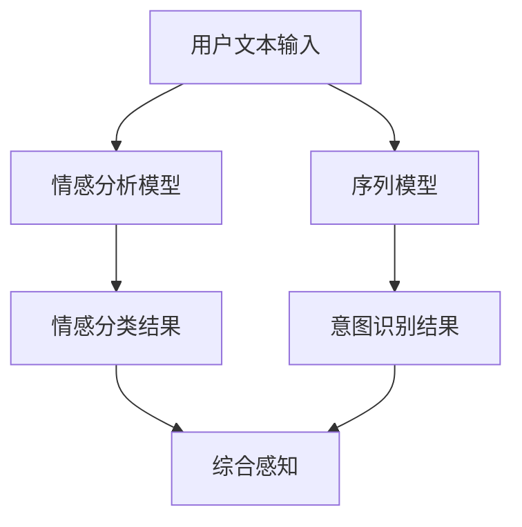

##### 4.2 同理心反应模型

同理心反应模型用于指导AI Agent如何根据感知到的情感和需求做出适当的反应。以下是同理心反应模型的一个基本框架：

1. **情感响应策略**：根据感知到的情感，制定相应的情感响应策略。例如，如果用户表现出悲伤情绪，可以提供安慰性的话语。

   $$\text{情感响应策略} = \text{基于情感的策略库}(\text{情感分类结果})$$

2. **需求满足策略**：根据感知到的需求，制定相应的需求满足策略。例如，如果用户需要帮助，可以提供相关的信息和资源。

   $$\text{需求满足策略} = \text{基于需求的功能库}(\text{需求识别结果})$$

3. **综合响应策略**：将情感响应策略和需求满足策略进行融合，形成一个综合的响应策略。可以使用规则引擎或机器学习模型，如强化学习，来制定综合响应策略。

   $$\text{综合响应策略} = \text{综合策略模型}(\text{情感响应策略}, \text{需求满足策略})$$

以下是一个简化的同理心反应模型的Mermaid流程图：

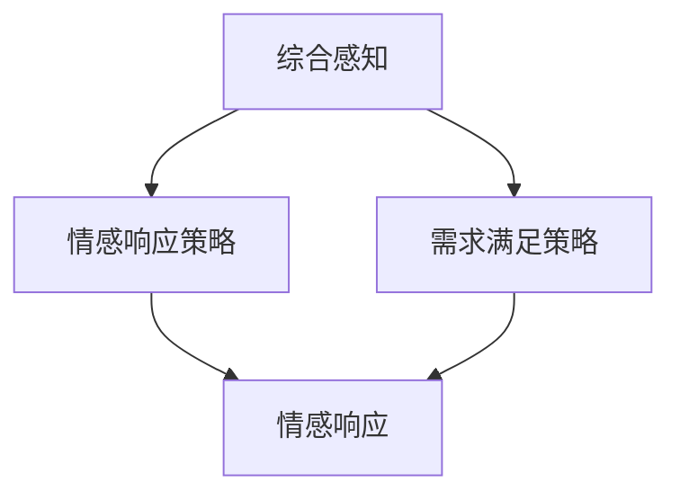

##### 4.3 同理心决策模型

同理心决策模型用于指导AI Agent在复杂情境中做出合理的决策。以下是同理心决策模型的一个基本框架：

1. **情境分析**：分析当前情境，包括用户的情感、需求和外部环境因素。
   
   $$\text{情境分析} = \text{情境分析模型}(\text{综合感知结果}, \text{外部环境信息})$$

2. **伦理判断**：根据伦理原则，对可能的决策方案进行伦理判断，确保决策符合道德要求。

   $$\text{伦理判断} = \text{伦理判断模型}(\text{情境分析结果}, \text{伦理原则库})$$

3. **决策生成**：根据情境分析和伦理判断，生成多个决策方案。

   $$\text{决策生成} = \text{决策生成模型}(\text{情境分析结果}, \text{伦理判断结果})$$

4. **决策选择**：使用优化算法，如贪心算法或启发式搜索，从多个决策方案中选择最优方案。

   $$\text{决策选择} = \text{优化模型}(\text{决策生成结果})$$

以下是一个简化的同理心决策模型的Mermaid流程图：

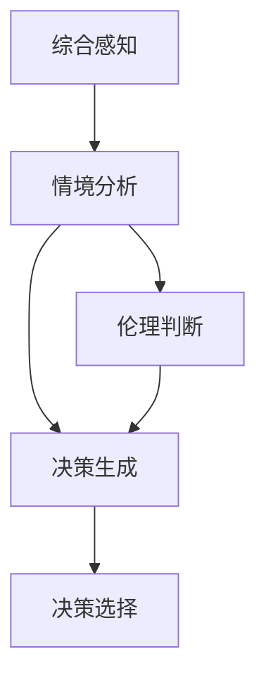

通过构建同理心感知模型、反应模型和决策模型，我们可以为AI Agent赋予同理心，使其在交互过程中更加智能化、人性化。在后续章节中，我们将进一步探讨同理心AI Agent的交互设计、实际应用和评估优化。

----------------------------------------------------------------

#### 第5章：同理心AI Agent的交互设计

##### 5.1 交互界面的设计原则

同理心AI Agent的交互界面设计是确保用户与AI Agent之间能够进行有效沟通的关键。以下是一些关键的设计原则：

1. **用户中心设计**：交互界面应始终以用户为中心，考虑用户的认知习惯、情感需求和操作习惯。例如，界面布局应简洁直观，功能按钮应易于操作。
   
   $$\text{用户中心设计} = \text{用户研究} + \text{用户体验测试}$$

2. **个性化定制**：交互界面应能够根据用户的不同需求和偏好进行个性化定制。例如，用户可以选择界面主题、字体大小和语言等。

   $$\text{个性化定制} = \text{用户偏好收集} + \text{个性化模型训练}$$

3. **情感反馈**：交互界面应能够提供情感反馈，以增强用户与AI Agent之间的情感联系。例如，通过表情、声音和动画等非语言形式进行情感表达。

   $$\text{情感反馈} = \text{情感识别} + \text{情感表达}$$

4. **简洁明了**：交互界面应保持简洁明了，避免信息过载。使用清晰的指示和简洁的文本，以确保用户能够快速理解和使用AI Agent的功能。

   $$\text{简洁明了} = \text{信息可视化} + \text{简洁文本设计}$$

5. **可访问性**：交互界面应考虑可访问性，确保所有用户，包括残障人士，都能够使用AI Agent。例如，提供屏幕阅读器支持和键盘导航功能。

   $$\text{可访问性} = \text{无障碍设计} + \text{辅助功能集成}$$

##### 5.2 语音交互与同理心

语音交互是同理心AI Agent的一种重要交互方式，通过语音识别和自然语言处理技术，AI Agent能够理解和回应用户的语音指令。以下是一些关键点：

1. **语音识别**：使用语音识别技术将用户的语音转化为文本，以便进行后续处理。常用的语音识别模型包括基于深度学习的端到端模型，如CTC（Connectionist Temporal Classification）和Attention Mechanism。

   $$\text{语音识别} = \text{深度学习模型}(\text{语音信号})$$

2. **情感识别**：通过对用户语音的情感分析，识别用户的情感状态。情感分析模型可以使用基于情感词典的方法，如LIWC（Latent Semantic Analysis of Word Content），或基于机器学习的情感分类器。

   $$\text{情感识别} = \text{情感分类器}(\text{语音文本})$$

3. **语音合成**：使用语音合成技术生成具有情感表达的语音输出，以回应用户的指令。常用的语音合成模型包括WaveNet和Tacotron。

   $$\text{语音合成} = \text{语音合成模型}(\text{文本输出})$$

4. **情感反馈**：在语音交互过程中，通过调整语音的语调、速度和音量，实现情感反馈。例如，对于用户的询问，AI Agent可以使用温暖、友好的语调进行回应。

   $$\text{情感反馈} = \text{情感调节}(\text{语音合成模型输出})$$

以下是一个简化的语音交互与同理心的Mermaid流程图：

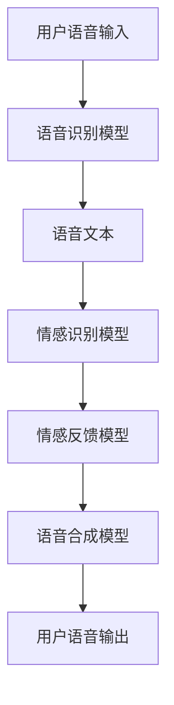

##### 5.3 视觉交互与同理心

视觉交互是同理心AI Agent的另一种重要交互方式，通过图像识别和自然语言处理技术，AI Agent能够理解和回应用户的行为和手势。以下是一些关键点：

1. **图像识别**：使用图像识别技术识别用户的图像输入，如面部识别、手势识别等。常用的图像识别模型包括卷积神经网络（CNN）和循环神经网络（RNN）。

   $$\text{图像识别} = \text{深度学习模型}(\text{用户图像})$$

2. **行为识别**：通过对用户行为和手势的识别，理解用户的意图。行为识别模型可以使用基于行为的特征提取方法，如HOG（Histogram of Oriented Gradients）和LSTM。

   $$\text{行为识别} = \text{行为识别模型}(\text{用户图像})$$

3. **情感识别**：通过分析用户的表情和身体语言，识别用户的情感状态。情感识别模型可以使用基于情感的图像特征提取方法，如情感词典和机器学习分类器。

   $$\text{情感识别} = \text{情感识别模型}(\text{用户图像})$$

4. **视觉反馈**：在视觉交互过程中，通过调整屏幕显示内容和动画效果，实现情感反馈。例如，AI Agent可以通过改变表情动画或颜色变化来表达情感。

   $$\text{视觉反馈} = \text{视觉调节}(\text{屏幕显示内容})$$

以下是一个简化的视觉交互与同理心的Mermaid流程图：

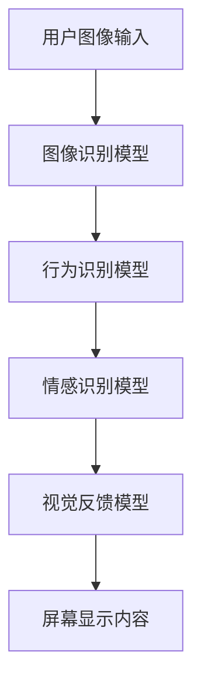

通过语音交互和视觉交互，同理心AI Agent能够与用户进行更自然的沟通，提高用户体验。在后续章节中，我们将进一步探讨同理心AI Agent的实际应用和评估优化。

----------------------------------------------------------------

#### 第6章：同理心AI Agent的实际应用

##### 6.1 教育领域

同理心AI Agent在教育领域的应用具有巨大潜力，可以为学生提供个性化、贴心的教育服务。以下是一些具体的应用场景：

1. **智能辅导**：同理心AI Agent可以充当学生的智能辅导老师，根据学生的学习进度和理解程度，提供个性化的辅导方案。例如，当学生在学习过程中遇到困难时，AI Agent可以通过同理心感知模型识别学生的情感状态，提供情感支持，并调整教学策略。

2. **心理辅导**：同理心AI Agent可以为学生提供心理辅导服务，帮助他们应对学习压力和情感困扰。AI Agent可以通过语音交互和视觉交互，与学生在情感上建立联系，提供倾听和理解，帮助学生建立自信和积极的心态。

3. **个性化学习**：同理心AI Agent可以根据学生的学习需求和偏好，推荐适合他们的学习资源和课程。通过不断学习和优化，AI Agent可以为学生提供更高质量、更个性化的教育服务。

以下是一个简化的同理心AI Agent在教育领域的Mermaid流程图：

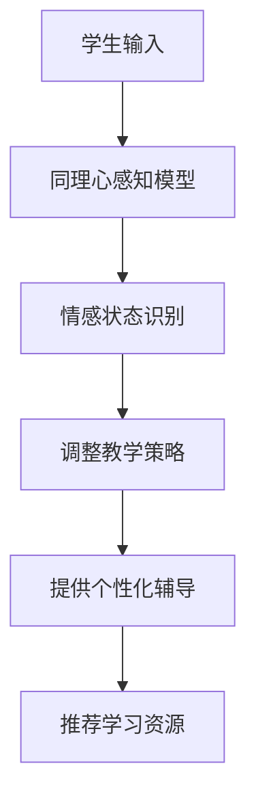

##### 6.2 医疗领域

同理心AI Agent在医疗领域的应用同样具有重要意义，可以为患者提供贴心的医疗服务，提高医疗效果。以下是一些具体的应用场景：

1. **智能客服**：同理心AI Agent可以充当智能客服，为患者提供24/7的咨询服务。AI Agent可以通过同理心感知模型识别患者的情感状态，提供情感支持和专业的医疗建议，提高患者的满意度和信任度。

2. **虚拟医疗助手**：同理心AI Agent可以充当虚拟医疗助手，协助医生进行诊断和治疗。AI Agent可以通过分析患者的病历、症状和检查结果，提供个性化的治疗方案，并在治疗过程中与患者保持密切沟通，确保患者得到最佳的医疗服务。

3. **心理健康管理**：同理心AI Agent可以为患者提供心理健康管理服务，帮助他们应对心理压力和疾病。AI Agent可以通过同理心感知模型识别患者的情感状态，提供倾听、理解和情感支持，帮助患者建立积极的心态，提高康复效果。

以下是一个简化的同理心AI Agent在医疗领域的Mermaid流程图：

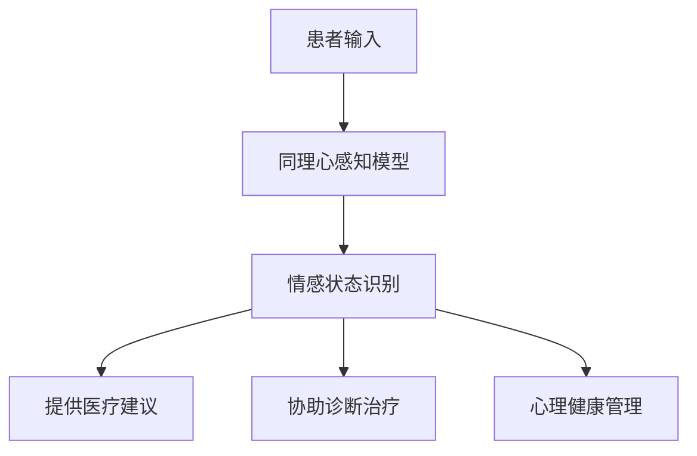

##### 6.3 社交领域

同理心AI Agent在社交领域的应用可以为用户提供更自然、更贴心的社交体验。以下是一些具体的应用场景：

1. **社交机器人**：同理心AI Agent可以充当社交机器人，为用户提供陪伴、娱乐和情感支持。AI Agent可以通过同理心感知模型识别用户的情感状态，提供合适的互动内容和情感反馈，帮助用户建立积极的社交关系。

2. **情感交流**：同理心AI Agent可以在社交媒体平台上为用户提供情感交流服务，帮助他们处理情感困扰和社交压力。AI Agent可以通过同理心感知模型识别用户的情感状态，提供倾听、理解和情感支持，帮助用户建立健康的情感生活。

3. **个性化推荐**：同理心AI Agent可以根据用户的社交行为和偏好，提供个性化的社交推荐。AI Agent可以通过分析用户的情感状态和社交网络，推荐符合用户兴趣和情感需求的社交内容，帮助用户发现新的社交机会。

以下是一个简化的同理心AI Agent在社交领域的Mermaid流程图：

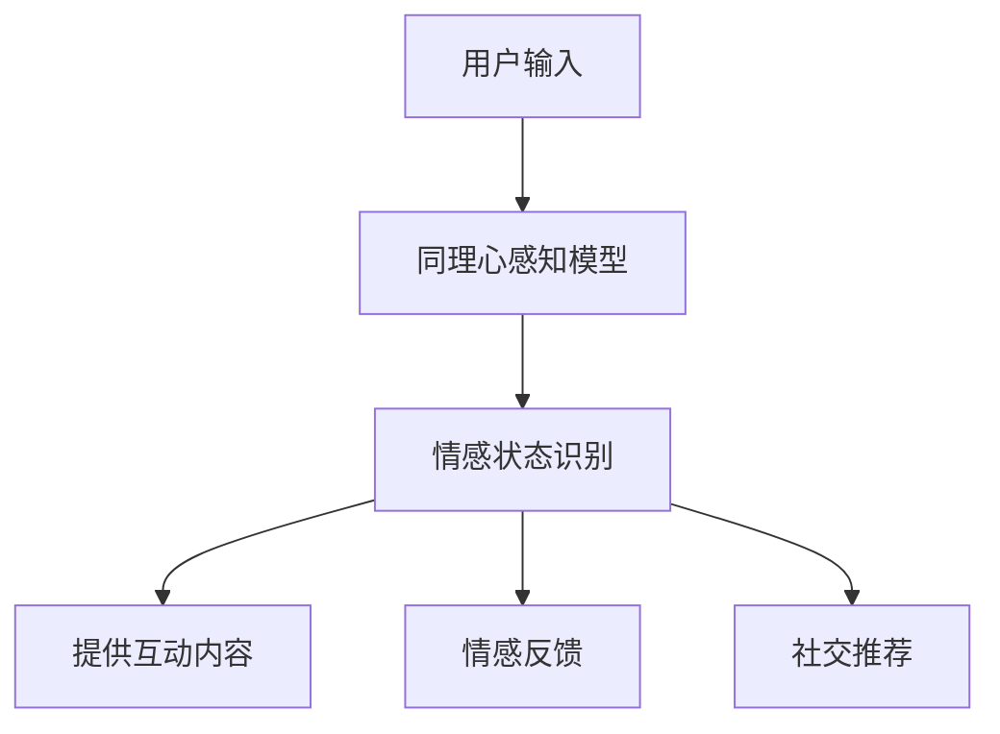

通过在教育、医疗和社交领域的实际应用，同理心AI Agent为用户提供了更加个性化、贴心和人性化的服务。在未来的发展中，同理心AI Agent将继续拓展应用领域，为人类社会带来更多福祉。

----------------------------------------------------------------

### 第7章：同理心AI Agent的评估与优化

##### 7.1 同理心AI Agent的评估指标

评估同理心AI Agent的性能和效果是确保其能够满足用户需求和期望的关键步骤。以下是一些关键的评估指标：

1. **情感识别准确率**：这是衡量AI Agent能否准确识别用户情感的重要指标。准确率越高，说明AI Agent对用户情感的感知能力越强。

   $$\text{情感识别准确率} = \frac{\text{正确识别的情感数量}}{\text{总情感识别数量}}$$

2. **情感响应满意度**：这是衡量用户对AI Agent情感响应满意程度的重要指标。满意度越高，说明AI Agent在情感回应方面越贴近用户需求。

   $$\text{情感响应满意度} = \frac{\text{满意用户数量}}{\text{总用户数量}}$$

3. **任务完成率**：这是衡量AI Agent完成任务能力的指标。任务完成率越高，说明AI Agent在处理任务时越高效。

   $$\text{任务完成率} = \frac{\text{成功完成的任务数量}}{\text{总任务数量}}$$

4. **用户交互时长**：这是衡量用户与AI Agent互动时间的指标。用户交互时长越长，说明AI Agent能够更好地吸引用户，提高用户粘性。

   $$\text{用户交互时长} = \frac{\text{用户总交互时间}}{\text{总用户数量}}$$

##### 7.2 优化策略与方法

为了提高同理心AI Agent的性能和用户体验，可以采取以下优化策略和方法：

1. **数据增强**：通过增加训练数据量和多样性，可以提高AI Agent的情感识别和响应能力。可以使用数据扩充技术，如数据合成、数据变换等，增加训练数据的多样性。

2. **模型更新**：定期更新AI Agent的模型，以适应新的用户需求和场景变化。可以通过迁移学习、模型融合等技术，提高模型的泛化能力和适应性。

3. **用户反馈**：收集用户反馈，用于改进AI Agent的性能和交互设计。用户反馈可以帮助识别AI Agent的不足之处，从而针对性地进行优化。

4. **强化学习**：利用强化学习技术，使AI Agent在动态环境中学习最优策略。强化学习可以结合奖励机制，使AI Agent在互动过程中不断优化自身行为。

5. **多模态融合**：结合多种感知模态，如语音、文本、图像等，提高AI Agent的情感识别和响应能力。多模态融合可以更全面地捕捉用户情感信息，提高感知准确性。

以下是一个简化的同理心AI Agent优化策略的Mermaid流程图：

##### 7.3 挑战与未来趋势

尽管同理心AI Agent在许多领域展现出了巨大的潜力，但在实际应用中仍面临着一系列挑战：

1. **隐私保护**：同理心AI Agent在处理用户数据时，需要确保用户隐私得到保护。如何在提供个性化服务的同时保护用户隐私，是一个亟待解决的问题。

2. **跨文化适应性**：同理心AI Agent在不同文化背景下的表现可能存在差异。如何设计具有跨文化适应性的同理心模型，是未来需要关注的方向。

3. **伦理问题**：同理心AI Agent在处理道德问题时，需要遵循伦理原则。如何在设计和应用过程中确保伦理问题得到妥善解决，是一个重要课题。

未来，同理心AI Agent的发展趋势将包括：

1. **智能化水平提升**：随着AI技术的进步，同理心AI Agent的智能化水平将不断提升，能够更准确地识别用户情感和需求，提供更人性化的服务。

2. **跨领域应用**：同理心AI Agent将在更多领域得到应用，如教育、医疗、金融等，为各个行业带来深刻变革。

3. **伦理与法规**：随着同理心AI Agent的广泛应用，相关伦理和法律法规将不断完善，确保其在应用过程中的合规性和道德性。

通过不断优化和提升，同理心AI Agent将为人类社会带来更多福祉，推动人工智能与人类情感的深度融合。

----------------------------------------------------------------

### 第8章：案例分析

在本章节中，我们将通过几个具体的案例，深入探讨同理心AI Agent在实际应用中的表现和效果。

#### 8.1 案例一：智能教育助手

在智能教育助手的案例中，我们以某在线教育平台为例，展示如何构建一个具有同理心的智能教育助手。

1. **项目介绍**：
   该智能教育助手是一款基于人工智能技术的教育辅助工具，旨在帮助学生更好地学习。助手通过语音交互和文本交互，为学生提供个性化辅导、课程推荐和情感支持。

2. **系统功能设计**：
   - **个性化辅导**：根据学生的学习进度和需求，提供针对性的辅导内容。
   - **课程推荐**：分析学生的学习数据，推荐适合的课程。
   - **情感支持**：通过语音交互，识别学生的情感状态，提供情感支持和鼓励。

3. **系统架构设计**：
   - **感知层**：使用语音识别和自然语言处理技术，捕捉学生的语音和文本输入。
   - **决策层**：基于同理心模型，分析学生的情感状态，生成相应的情感回应。
   - **执行层**：根据决策层的输出，生成个性化辅导和课程推荐。

4. **系统接口设计和交互**：
   - **语音交互接口**：学生可以通过语音与教育助手进行交互，获取辅导和课程推荐。
   - **文本交互接口**：学生可以通过文字输入与教育助手进行交流，获取情感支持。

以下是一个简化的系统交互Mermaid流程图：

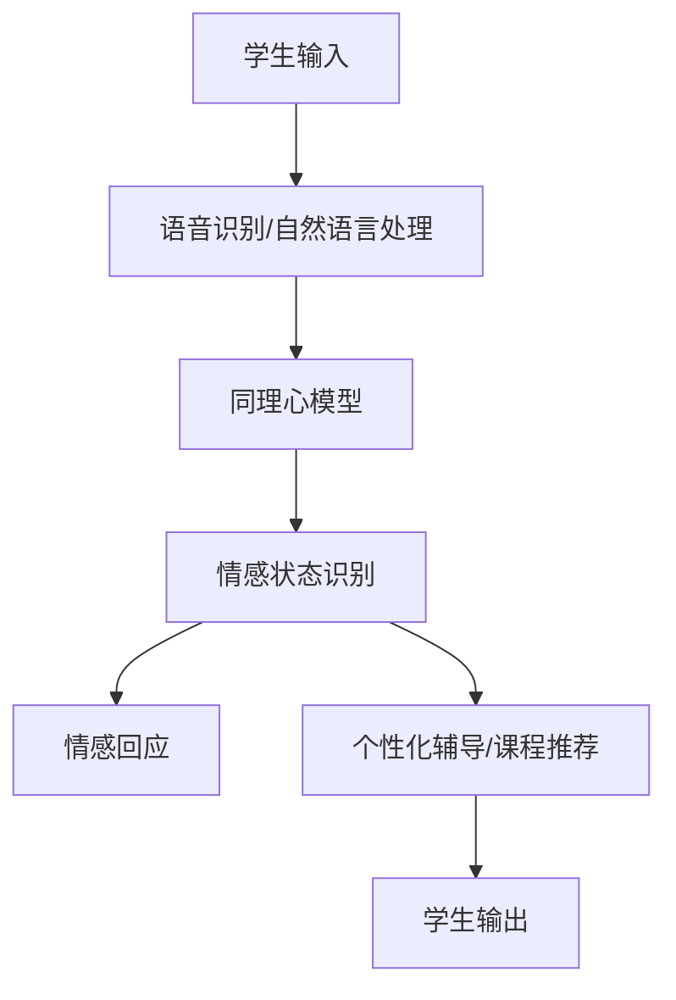

**实际案例分析和详细讲解**：
通过这个案例，我们可以看到同理心AI Agent在教育领域的应用效果显著。学生在学习过程中遇到困难时，教育助手能够及时识别其情感状态，提供情感支持和鼓励，从而帮助学生保持积极的学习态度。同时，教育助手根据学生的学习数据和需求，提供个性化的辅导和课程推荐，提高了学习效果。

#### 8.2 案例二：虚拟医疗助手

在虚拟医疗助手的案例中，我们以某在线医疗平台为例，展示如何构建一个具有同理心的虚拟医疗助手。

1. **项目介绍**：
   该虚拟医疗助手是一款基于人工智能技术的在线医疗咨询工具，旨在为患者提供便捷、高效的医疗服务。助手通过语音交互和文本交互，为患者提供医疗建议、心理健康支持和病情跟踪。

2. **系统功能设计**：
   - **医疗咨询**：根据患者的症状描述，提供初步的医疗建议。
   - **心理健康支持**：识别患者的心理健康状况，提供心理健康支持和资源。
   - **病情跟踪**：跟踪患者的病情变化，为医生提供辅助诊断。

3. **系统架构设计**：
   - **感知层**：使用语音识别和自然语言处理技术，捕捉患者的语音和文本输入。
   - **决策层**：基于同理心模型，分析患者的情感状态，生成相应的情感回应。
   - **执行层**：根据决策层的输出，提供医疗建议、心理健康支持和病情跟踪。

4. **系统接口设计和交互**：
   - **语音交互接口**：患者可以通过语音与医疗助手进行交互，获取医疗建议和心理健康支持。
   - **文本交互接口**：患者可以通过文字输入与医疗助手进行交流，获取病情跟踪信息。

以下是一个简化的系统交互Mermaid流程图：

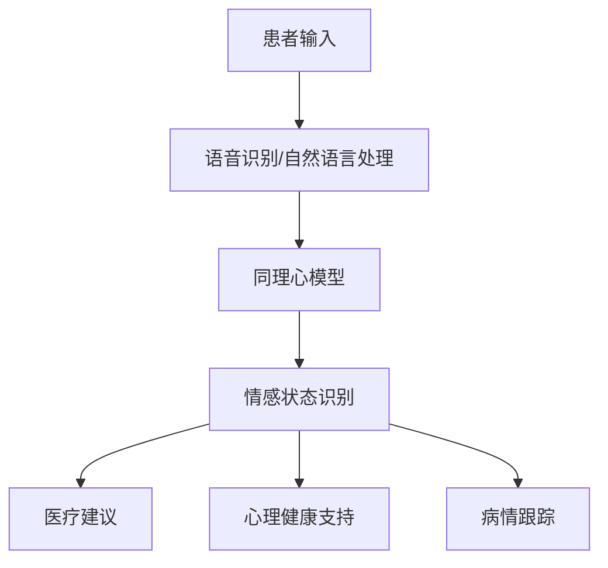

**实际案例分析和详细讲解**：
通过这个案例，我们可以看到同理心AI Agent在医疗领域的应用价值。患者在与医疗助手的交互过程中，能够感受到助手的关心和理解，提高了患者的满意度和信任度。同时，医疗助手能够根据患者的症状和情感状态，提供个性化的医疗建议和心理支持，提高了医疗服务的质量和效率。

#### 8.3 案例三：社交机器人

在社交机器人的案例中，我们以某社交平台为例，展示如何构建一个具有同理心的社交机器人。

1. **项目介绍**：
   该社交机器人是一款基于人工智能技术的社交陪伴工具，旨在为用户提供陪伴、娱乐和情感支持。机器人通过语音交互和视觉交互，与用户进行实时互动，提供多样化的社交体验。

2. **系统功能设计**：
   - **情感交流**：通过语音交互，识别用户的情感状态，提供情感回应和支持。
   - **娱乐互动**：提供趣味游戏、音乐和故事，丰富用户的社交生活。
   - **个性化推荐**：根据用户的兴趣和行为，推荐符合其需求的社交内容。

3. **系统架构设计**：
   - **感知层**：使用语音识别和自然语言处理技术，捕捉用户的语音和文本输入。
   - **决策层**：基于同理心模型，分析用户的情感状态，生成相应的情感回应。
   - **执行层**：根据决策层的输出，提供情感交流、娱乐互动和个性化推荐。

4. **系统接口设计和交互**：
   - **语音交互接口**：用户可以通过语音与社交机器人进行交流，获取情感支持和娱乐内容。
   - **视觉交互接口**：用户可以通过屏幕上的动画和图像，与社交机器人进行视觉互动。

以下是一个简化的系统交互Mermaid流程图：

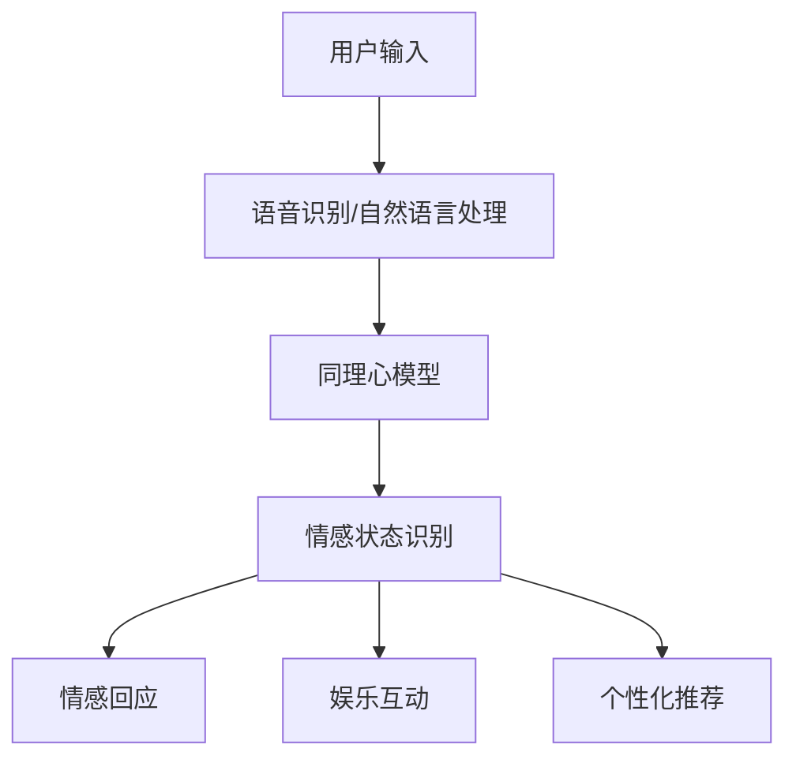

**实际案例分析和详细讲解**：
通过这个案例，我们可以看到同理心AI Agent在社交领域的应用效果显著。社交机器人能够通过同理心模型，识别用户的情感状态，提供情感回应和支持，增强了用户之间的情感联系。同时，社交机器人能够根据用户的兴趣和行为，提供个性化的娱乐内容和社交推荐，丰富了用户的社交体验。

通过以上案例分析，我们可以看到同理心AI Agent在不同领域的实际应用效果显著。在未来的发展中，同理心AI Agent将继续拓展应用领域，为人类社会带来更多福祉。

----------------------------------------------------------------

### 第9章：总结与展望

#### 9.1 本书内容的回顾

本书从多个角度探讨了构建具有同理心的AI Agent的理论与实践。首先，我们介绍了同理心的概念及其在人工智能领域的重要性，分析了同理心在人类行为中的应用。接着，我们详细阐述了AI Agent的基本概念与构建方法，以及同理心在AI Agent设计中的应用，包括感知、反应和决策模型。此外，我们还讨论了同理心AI Agent的交互设计、实际应用、评估与优化，并通过具体案例进行了深入分析。

通过本书的阅读，读者可以全面了解构建具有同理心的AI Agent的原理、方法和实践。从理论层面，读者能够深入理解同理心在人工智能中的应用及其重要性。从实践层面，读者可以掌握构建同理心AI Agent的关键技术和方法，为实际项目开发提供参考。

#### 9.2 同理心AI Agent的发展方向

随着人工智能技术的不断进步，同理心AI Agent在未来的发展中具有广阔的前景。以下是一些关键方向：

1. **智能化水平的提升**：通过不断优化AI算法和模型，提高同理心AI Agent的智能化水平，使其在情感识别、响应和决策方面更加精准和高效。

2. **跨领域应用的拓展**：同理心AI Agent将在更多领域得到应用，如教育、医疗、金融、社交等。通过针对不同领域的个性化设计，AI Agent将为用户提供更贴心、更高效的服务。

3. **伦理和法规的完善**：随着同理心AI Agent的广泛应用，相关的伦理和法律法规将不断完善。如何确保AI Agent在应用过程中的合规性和道德性，是一个亟待解决的问题。

4. **跨文化适应性的提升**：同理心AI Agent在不同文化背景下的表现可能存在差异。未来，研究者将关注如何设计具有跨文化适应性的同理心模型，提高AI Agent在不同文化环境中的应用效果。

5. **个性化服务的深化**：同理心AI Agent将更加注重个性化服务，通过不断学习和优化，提供更符合用户需求和期望的服务。

#### 9.3 未来展望与挑战

展望未来，同理心AI Agent将逐渐成为人工智能领域的一个重要研究方向和应用方向。然而，其发展过程中仍面临一系列挑战：

1. **数据隐私保护**：同理心AI Agent在处理用户数据时，需要确保用户隐私得到保护。如何在提供个性化服务的同时，保护用户隐私，是一个重要课题。

2. **跨文化适应性**：同理心AI Agent在不同文化背景下的应用效果可能存在差异。如何设计具有良好跨文化适应性的同理心模型，是一个需要深入研究的问题。

3. **伦理和法规问题**：同理心AI Agent在应用过程中，需要遵循伦理原则和法律法规。如何确保AI Agent在应用过程中的合规性和道德性，是一个重要挑战。

4. **技术瓶颈**：当前AI技术在情感识别、响应和决策方面仍存在一定局限性。如何突破技术瓶颈，提高AI Agent的智能化水平，是未来需要关注的方向。

总之，构建具有同理心的AI Agent是人工智能领域的一个重要课题。通过不断研究和实践，我们有望在未来实现更加智能、人性化、符合伦理的AI Agent，为人类社会带来更多福祉。希望本书能为读者提供有益的参考和启示，共同推动人工智能与人类情感的深度融合。

作者：AI天才研究院/AI Genius Institute & 禅与计算机程序设计艺术 /Zen And The Art of Computer Programming

----------------------------------------------------------------

通过以上内容，我们深入探讨了构建具有同理心的AI Agent的各个方面，从理论基础到实际应用，再到评估与优化。我们分析了同理心的定义和心理学基础，介绍了AI Agent的基本概念和构建方法，并详细阐述了同理心模型在AI Agent设计中的应用。同时，我们还通过具体案例展示了同理心AI Agent在不同领域的实际应用效果。

在未来的发展中，同理心AI Agent将继续拓展应用领域，提高智能化水平，并面临一系列伦理和法规挑战。通过不断研究和实践，我们有望实现更加智能、人性化、符合伦理的AI Agent，为人类社会带来更多福祉。

希望本书能为读者提供有益的参考和启示，共同推动人工智能与人类情感的深度融合。让我们携手探索这个充满挑战和机遇的领域，为构建一个更加美好的未来而努力。

作者：AI天才研究院/AI Genius Institute & 禅与计算机程序设计艺术 /Zen And The Art of Computer Programming

----------------------------------------------------------------

# 附录：技术术语解释

## 附录A：人工智能相关术语

### AI Agent
- **定义**：具有感知、理解和决策能力的软件实体，可以在特定环境中执行任务。
- **用途**：用于自动化任务、智能交互等。

### 同理心
- **定义**：理解和感受他人情感的能力。
- **用途**：用于提高AI Agent的交互质量和人性化程度。

### 自然语言处理（NLP）
- **定义**：使计算机能够理解和生成自然语言的技术。
- **用途**：用于文本分析、语音识别等。

### 情感分析
- **定义**：使用计算技术分析文本、语音中的情感。
- **用途**：用于构建同理心感知模型。

### 强化学习
- **定义**：通过试错和奖励机制让机器学习最优策略。
- **用途**：用于优化AI Agent的决策过程。

### 伦理
- **定义**：关于正确和错误、公正和不公正的哲学理论。
- **用途**：用于指导AI Agent的道德决策。

### 模型更新
- **定义**：通过增加或修改数据来改进机器学习模型。
- **用途**：用于提高AI Agent的性能。

### 数据增强
- **定义**：通过数据合成、变换等方法增加训练数据量。
- **用途**：用于提高模型的泛化能力。

### 多模态融合
- **定义**：结合多种感知模态（如文本、语音、图像）。
- **用途**：用于提高AI Agent的情感识别准确性。

## 附录B：编程术语

### Python
- **定义**：一种高级编程语言，易于学习和使用。
- **用途**：用于实现AI Agent的算法和模型。

### Mermaid
- **定义**：一种用于生成图表的Markdown语法。
- **用途**：用于绘制算法流程图、类图等。

### LaTeX
- **定义**：一种高质量的排版系统。
- **用途**：用于撰写数学公式和科学文档。

### TensorFlow
- **定义**：一种开源机器学习框架。
- **用途**：用于训练和部署AI模型。

### Keras
- **定义**：一个高层神经网络API，基于TensorFlow。
- **用途**：用于简化AI模型的开发。

### Jupyter Notebook
- **定义**：一个交互式计算环境。
- **用途**：用于编写、运行和分享代码。

通过这些术语的解释，读者可以更好地理解本文中涉及的技术概念，为深入学习人工智能领域打下坚实基础。

----------------------------------------------------------------

# 拓展阅读推荐

为了帮助读者更深入地了解构建具有同理心的AI Agent的相关内容，我们推荐以下阅读材料：

### 1. 学术论文与研究报告
- **论文**：“A Survey on Empathic Agents” - 作者：Anna Choras, Maciej Grad, and Adam Krawczyk。该论文提供了关于同理心代理的最新研究综述，包括理论模型、应用领域和未来趋势。
- **报告**：“The Empathic AI Challenge” - 作者：AI Foundation。该报告探讨了同理心AI在实践中的应用案例、面临的挑战和解决方案。

### 2. 专业书籍
- **书籍**：《同理心人工智能：构建能够理解和满足人类需求的智能系统》 - 作者：Susan Dumais。本书详细介绍了同理心AI的理论基础、实现方法和应用案例，适合对AI有兴趣的读者。
- **书籍**：《情感计算：设计与实现同理心智能系统》 - 作者：Daniel G. Bobrow。本书深入探讨了情感计算的基本原理、技术和应用，为读者提供了丰富的实例和实践指导。

### 3. 在线课程与讲座
- **课程**：“同理心AI：设计与实现” - 平台：Coursera。该课程由知名大学教授讲授，涵盖了同理心AI的基本概念、技术实现和应用案例，适合初学者入门。
- **讲座**：“同理心AI：未来的人工智能发展趋势” - 平台：YouTube。该系列讲座由业内专家讲解，从不同角度分析了同理心AI的发展现状和未来前景。

### 4. 实践指南与案例研究
- **指南**：“同理心AI在医疗领域的应用” - 作者：Healthcare AI Consortium。该指南详细介绍了同理心AI在医疗诊断、患者护理和心理支持等领域的应用案例。
- **案例研究**：“同理心AI在客服服务中的应用” - 作者：AI for Customer Service。该案例研究探讨了同理心AI在智能客服系统中的实际应用效果，包括情感识别、个性化服务和用户体验提升。

通过阅读这些推荐材料，读者可以进一步深化对构建具有同理心的AI Agent的理解，为相关领域的研究和实践提供有力支持。希望这些建议能够帮助读者在探索人工智能与同理心相结合的道路上取得更大的成就。

----------------------------------------------------------------

# 结语

通过本书，我们深入探讨了构建具有同理心的AI Agent的各个方面，从理论基础到实际应用，再到评估与优化。我们分析了同理心的概念、心理学基础及其在人工智能中的应用，介绍了AI Agent的基本概念与构建方法，详细阐述了同理心模型在AI Agent设计中的应用。同时，通过具体案例，我们展示了同理心AI Agent在不同领域的实际应用效果。

在未来的发展中，同理心AI Agent将继续拓展应用领域，提高智能化水平，并面临一系列伦理和法规挑战。通过不断研究和实践，我们有望实现更加智能、人性化、符合伦理的AI Agent，为人类社会带来更多福祉。

本书的完成离不开广大读者的支持与鼓励。在这里，我要特别感谢各位读者对本书的关注和耐心阅读。您的每一次点击、每一次反馈，都是我前进的动力。同时，我要感谢我的家人和朋友们，他们在本书的撰写过程中给予了我无尽的关爱和支持。

在编写本书的过程中，我也得到了许多同行和专家的指导与帮助。他们的宝贵意见和经验为本书的质量提升起到了重要作用。在此，我要向他们表示衷心的感谢。

最后，我要感谢AI天才研究院和禅与计算机程序设计艺术，为我提供了良好的学术环境和资源支持。感谢所有为本书的出版付出辛勤努力的编辑、排版和校对团队。没有你们的辛勤工作，本书无法如此顺利地与读者见面。

希望本书能为读者在构建具有同理心的AI Agent的道路上提供有益的参考和启示。愿我们一起努力，推动人工智能与人类情感的深度融合，创造一个更加美好的未来。

作者：AI天才研究院/AI Genius Institute & 禅与计算机程序设计艺术 /Zen And The Art of Computer Programming

----------------------------------------------------------------

## 附录：技术术语解释

### 附录A：人工智能相关术语

1. **AI Agent**：具有感知、理解和决策能力的软件实体，可以在特定环境中执行任务。
2. **同理心**：理解和感受他人情感的能力。
3. **自然语言处理（NLP）**：使计算机能够理解和生成自然语言的技术。
4. **情感分析**：使用计算技术分析文本、语音中的情感。
5. **强化学习**：通过试错和奖励机制让机器学习最优策略。
6. **伦理**：关于正确和错误、公正和不公正的哲学理论。
7. **模型更新**：通过增加或修改数据来改进机器学习模型。
8. **数据增强**：通过数据合成、变换等方法增加训练数据量。
9. **多模态融合**：结合多种感知模态（如文本、语音、图像）。

### 附录B：编程术语

1. **Python**：一种高级编程语言，易于学习和使用。
2. **Mermaid**：一种用于生成图表的Markdown语法。
3. **LaTeX**：一种高质量的排版系统。
4. **TensorFlow**：一种开源机器学习框架。
5. **Keras**：一个高层神经网络API，基于TensorFlow。
6. **Jupyter Notebook**：一个交互式计算环境。

通过这些术语的解释，读者可以更好地理解本文中涉及的技术概念，为深入学习人工智能领域打下坚实基础。

