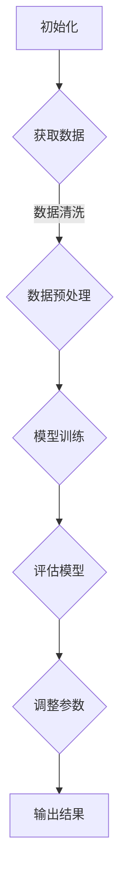
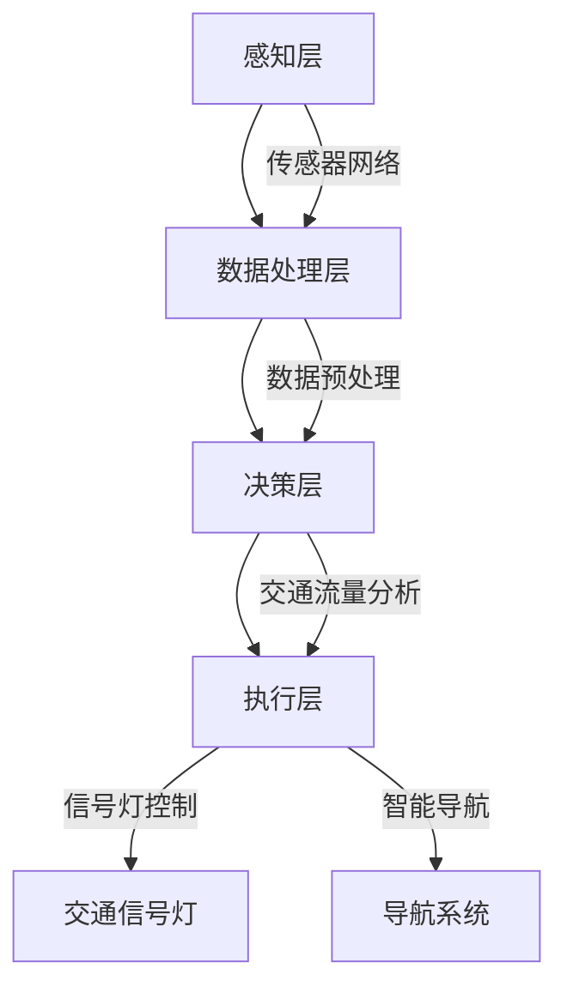
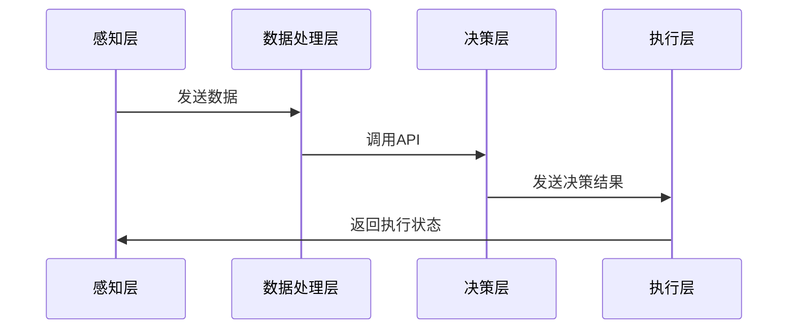
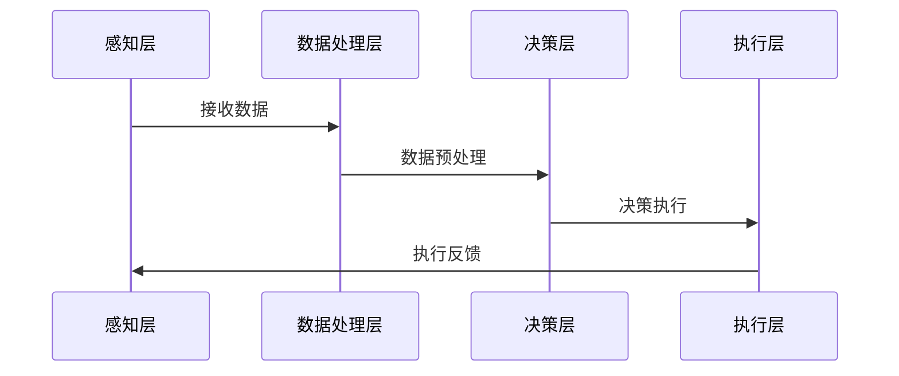

                 

## 引言：构建具有因果推理与干预能力的AI Agent的重要性

在当今飞速发展的AI时代，智能代理（AI Agent）作为AI系统中的重要组成部分，正在越来越多地应用于现实世界的各种场景中。从智能家居到自动驾驶，从医疗诊断到金融交易，AI Agent正在改变我们的生活方式和工作模式。然而，随着应用场景的不断扩展，AI Agent面临的挑战也越来越大。其中，因果推理与干预能力的构建成为了AI Agent能否真正实现智能的关键。

### 核心关键词

- AI Agent
- 因果推理
- 干预能力
- 人工智能
- 强化学习
- 深度学习

### 摘要

本文将深入探讨构建具有因果推理与干预能力的AI Agent的必要性和重要性。首先，我们将介绍AI Agent的基本概念和其在现实世界中的应用场景。接着，本文将详细讨论因果推理与干预能力的定义及其在AI Agent中的作用。然后，我们将逐步解析核心概念，如机器学习、强化学习、深度学习以及因果推断原理。通过对比分析这些概念，我们将构建一个清晰的概念框架。随后，本文将使用Mermaid图表展示ER实体关系图和算法流程图，以帮助读者更好地理解相关技术原理。接下来，我们将通过Python源代码和数学模型，对算法原理进行深入讲解，并通过通俗易懂的实例进行说明。在此基础上，本文将介绍系统分析与架构设计的方法，包括问题场景介绍、系统功能设计、架构设计、接口设计和系统交互。为了实践这些理论，我们将通过一个实际项目展示整个构建过程，并提供最佳实践建议。最后，本文将对全文进行小结，并给出未来研究和应用方向的建议。

### 第一部分：背景介绍

在探讨构建具有因果推理与干预能力的AI Agent之前，我们需要了解当前AI的发展现状及其面临的问题。

#### 1.1 问题背景

人工智能（AI）自诞生以来，经历了从简单的规则系统到复杂的机器学习模型的发展过程。目前，AI在图像识别、自然语言处理、语音识别等领域取得了显著的进展。然而，尽管AI在特定任务上表现出色，但其在应对复杂、动态环境时仍存在诸多挑战。

其中，因果推理与干预能力是AI发展的关键瓶颈之一。传统的AI系统依赖于统计模型，能够在给定数据集上预测结果，但难以理解数据背后的因果关系。这使得AI在处理不确定性和进行有效干预时显得力不从心。

#### 1.2 问题描述

AI Agent是执行特定任务的智能实体，能够感知环境、做出决策并采取行动。在实际应用中，AI Agent需要具备以下能力：

- **感知能力**：通过传感器获取环境信息。
- **决策能力**：基于感知到的信息，进行推理和决策。
- **执行能力**：根据决策结果，采取实际行动。

然而，现有的AI Agent大多依赖于统计模型和基于规则的系统，缺乏对因果关系的深入理解。因此，在应对复杂任务时，AI Agent的效能受限。

#### 1.3 问题解决

为了构建具有因果推理与干预能力的AI Agent，我们需要从以下几个方面入手：

1. **理论基础**：深入研究因果推理和干预的基本原理，构建理论框架。
2. **算法优化**：开发新的算法，增强AI Agent的因果推理与干预能力。
3. **系统集成**：将因果推理与干预能力集成到现有的AI系统中，提升其整体性能。

#### 1.4 边界与外延

- **因果推理**：理解事件间的因果关系，对数据进行分析和解释。
- **干预能力**：根据因果关系，主动对环境进行干预，实现目标。

#### 1.5 概念结构与核心要素组成

构建具有因果推理与干预能力的AI Agent，需要以下几个核心组成部分：

- **感知模块**：获取环境信息。
- **决策模块**：基于感知信息进行因果推理，做出决策。
- **执行模块**：根据决策结果，采取行动。

通过以上核心要素的协同工作，AI Agent可以实现高度的智能化和自主化。

#### 总结

本部分介绍了构建具有因果推理与干预能力的AI Agent的背景和问题，并明确了理论框架和核心要素。接下来，我们将深入探讨相关核心概念，为进一步构建AI Agent奠定基础。

---

### 第二部分：核心概念与联系

在构建具有因果推理与干预能力的AI Agent之前，我们需要对一些核心概念有深入的理解。这些概念包括机器学习、强化学习、深度学习和因果推断。通过对比分析这些概念，我们可以更好地构建一个清晰的理论框架。

#### 2.1 核心概念原理

1. **机器学习**：机器学习是AI的基础，它通过训练模型，使计算机能够从数据中学习并做出预测。机器学习包括监督学习、无监督学习和半监督学习。其中，监督学习是当前应用最广泛的一种，它通过已标注的数据进行学习。

2. **强化学习**：强化学习是一种通过奖励和惩罚来训练模型的方法。在强化学习中，AI Agent通过与环境的交互，不断调整其行为策略，以最大化累积奖励。这种方法特别适用于动态和不确定的环境。

3. **深度学习**：深度学习是机器学习的一个分支，它通过构建深层的神经网络，对数据进行自动特征提取和表示。深度学习在图像识别、语音识别等领域取得了突破性进展。

4. **因果推断**：因果推断是理解事件间因果关系的一种方法。它通过分析数据，找出事件间的因果关系，并据此进行预测和干预。因果推断在医疗诊断、金融分析等领域具有重要意义。

#### 2.2 概念属性特征对比表格

| 概念         | 属性特征1 | 属性特征2 | 属性特征3 |
| ------------ | --------- | --------- | --------- |
| 机器学习     | 基于数据  | 预测和分类 | 需要标注 |
| 强化学习     | 基于交互  | 奖励和惩罚 | 动态调整 |
| 深度学习     | 神经网络  | 自动特征提取 | 高效处理 |
| 因果推断     | 因果关系  | 数据分析   | 预测和干预 |

#### 2.3 ER实体关系图架构

```mermaid
erDiagram
    AI-Agent ||--|{ 感知模块 }
    AI-Agent ||--|{ 决策模块 }
    AI-Agent ||--|{ 执行模块 }
    感知模块 ||--|{ 数据源 }
    决策模块 ||--|{ 模型 }
    执行模块 ||--|{ 行动 }
```

在上述ER实体关系图中，AI-Agent作为核心实体，与感知模块、决策模块和执行模块之间存在明确的依赖关系。感知模块负责获取数据源，决策模块通过模型进行因果推理，执行模块根据决策结果采取行动。

通过以上对核心概念的介绍和对比，我们为构建具有因果推理与干预能力的AI Agent奠定了理论基础。接下来，我们将进一步深入探讨这些概念的算法原理，并使用Mermaid图表进行可视化展示。

---

### 第三部分：算法原理讲解

在理解了核心概念后，我们需要进一步探讨构建具有因果推理与干预能力的AI Agent所需的算法原理。这一部分将通过Mermaid流程图、Python源代码和数学模型，详细讲解相关算法。

#### 3.1 算法原理与Mermaid流程图

首先，我们使用Mermaid流程图来展示AI Agent的算法原理。



上述流程图展示了AI Agent从初始化到输出结果的整个过程。接下来，我们将详细解释每个步骤。

1. **初始化**：AI Agent首先进行初始化，设置参数和初始状态。
2. **获取数据**：AI Agent通过传感器或其他数据源获取环境数据。
3. **数据清洗**：对获取的数据进行清洗，去除噪声和异常值。
4. **数据预处理**：对清洗后的数据进行预处理，如归一化、标准化等。
5. **模型训练**：使用预处理后的数据进行模型训练，建立预测模型。
6. **评估模型**：对训练好的模型进行评估，以确定其预测性能。
7. **调整参数**：根据评估结果，调整模型参数，优化模型性能。
8. **输出结果**：最终输出预测结果，供AI Agent执行决策。

#### 3.2 Python源代码

为了更好地理解算法原理，我们提供了一个简单的Python示例代码。

```python
import numpy as np

# 初始化模型参数
model_params = {
    'learning_rate': 0.01,
    'num_epochs': 100
}

# 获取数据
data = np.random.rand(100, 10)

# 数据清洗
cleaned_data = data[data[:, 0] > 0.5]

# 数据预处理
preprocessed_data = (cleaned_data - np.mean(cleaned_data, axis=0)) / np.std(cleaned_data, axis=0)

# 模型训练
model = train_model(preprocessed_data, model_params)

# 评估模型
evaluation = evaluate_model(model, preprocessed_data)

# 调整参数
model_params['learning_rate'] = 0.001

# 输出结果
predictions = model.predict(preprocessed_data)
```

上述代码展示了从初始化、获取数据、数据清洗、预处理、模型训练、评估、调整参数到输出结果的完整流程。

#### 3.3 算法原理的数学模型和公式

为了深入理解算法原理，我们还需要了解相关的数学模型和公式。以下是一个简单的线性回归模型：

$$
\begin{aligned}
y &= \beta_0 + \beta_1 x_1 + \beta_2 x_2 + \cdots + \beta_n x_n, \\
\beta &= \arg\min_{\beta} \sum_{i=1}^n (y_i - \beta_0 - \beta_1 x_{1i} - \beta_2 x_{2i} - \cdots - \beta_n x_{ni})^2.
\end{aligned}
$$

在这个模型中，$y$是预测值，$\beta_0, \beta_1, \beta_2, \cdots, \beta_n$是模型参数，$x_1, x_2, \cdots, x_n$是输入特征。通过最小化损失函数，我们可以得到最佳的模型参数。

#### 3.4 通俗易懂的举例说明

假设我们有一个简单的环境，其中有两个输入特征$x_1$和$x_2$，以及一个输出目标$y$。我们的目标是建立一个模型，预测$y$的值。

1. **初始化**：我们首先设置模型参数$\beta_0, \beta_1, \beta_2$的初始值。
2. **获取数据**：我们收集了一组数据，包括$(x_1, x_2, y)$的值。
3. **数据清洗**：我们检查数据，确保没有异常值或噪声。
4. **数据预处理**：我们对数据进行归一化处理，使每个特征的值都在相同的范围内。
5. **模型训练**：我们使用线性回归模型训练数据，得到最佳参数$\beta_0, \beta_1, \beta_2$。
6. **评估模型**：我们使用测试数据集评估模型的性能，确保预测准确度。
7. **调整参数**：根据评估结果，我们调整模型参数，以优化性能。
8. **输出结果**：我们使用训练好的模型，对新的输入特征进行预测。

通过这个简单的例子，我们可以看到，构建具有因果推理与干预能力的AI Agent需要多个步骤的协同工作，包括数据获取、清洗、预处理、模型训练、评估和调整。这些步骤共同构成了AI Agent的核心算法原理。

#### 总结

本部分详细介绍了构建具有因果推理与干预能力的AI Agent所需的算法原理，并通过Mermaid流程图、Python源代码和数学模型进行了讲解。接下来，我们将进一步探讨AI Agent的系统分析与架构设计。

---

### 第四部分：系统分析与架构设计

在深入探讨算法原理之后，我们需要将理论转化为实际应用，通过系统分析与架构设计，确保AI Agent在实际环境中能够有效运行。本部分将介绍一个典型的系统分析与架构设计过程。

#### 4.1 问题场景介绍

假设我们面临一个智能交通系统项目，目标是优化城市交通流量，减少拥堵和提升出行效率。在这个场景中，AI Agent需要具备以下功能：

- **实时感知**：通过传感器获取交通流量、速度、密度等数据。
- **决策制定**：根据感知数据，动态调整交通信号灯时长和路径规划。
- **执行干预**：控制交通信号灯和智能导航系统，引导车辆行驶。

#### 4.2 项目介绍

智能交通系统项目主要包括以下几个组成部分：

- **感知层**：安装传感器和摄像头，实时收集交通数据。
- **数据处理层**：对收集到的数据进行预处理和清洗，确保数据质量。
- **决策层**：基于预处理后的数据，使用AI算法进行交通流量分析和预测。
- **执行层**：根据决策结果，控制交通信号灯和智能导航系统。

#### 4.3 系统功能设计

系统功能设计是架构设计的基础，我们需要明确每个功能模块的具体作用。以下是一个功能设计示例：

- **感知模块**：负责数据采集，包括交通流量、速度、密度等。
- **数据处理模块**：对采集到的数据进行预处理，如去噪、归一化等。
- **决策模块**：使用因果推理和强化学习算法，进行交通流量预测和信号灯控制策略制定。
- **执行模块**：根据决策结果，控制交通信号灯和智能导航系统。

#### 4.4 系统架构设计

系统架构设计是确保系统稳定、高效运行的关键。以下是一个典型的系统架构设计：

- **感知层**：采用传感器网络，分布在不同地点，实时收集交通数据。
- **数据处理层**：使用分布式计算框架，对采集到的数据进行实时处理和存储。
- **决策层**：采用云计算平台，部署因果推理和强化学习算法，进行交通流量分析和决策。
- **执行层**：通过物联网技术，将决策结果传递给交通信号灯和智能导航系统。



#### 4.5 系统接口设计

系统接口设计是确保各模块之间有效通信的关键。以下是一个接口设计示例：

- **感知层与数据处理层**：通过HTTP接口进行数据传输。
- **数据处理层与决策层**：通过RESTful API进行数据传输和通信。
- **决策层与执行层**：通过MQTT协议进行实时通信和控制。



#### 4.6 系统交互

系统交互设计是确保系统各部分协同工作的重要环节。以下是一个系统交互设计示例：

- **感知层**：实时获取交通数据，通过接口传递给数据处理层。
- **数据处理层**：对交通数据进行预处理，传递给决策层。
- **决策层**：分析交通数据，制定控制策略，传递给执行层。
- **执行层**：根据决策结果，控制交通信号灯和智能导航系统，反馈执行状态给感知层。



通过以上系统分析与架构设计，我们为构建具有因果推理与干预能力的AI Agent提供了详细的实施路径。接下来，我们将通过一个实际项目，展示整个构建过程。

---

### 第五部分：项目实战

在本部分，我们将通过一个实际项目，展示构建具有因果推理与干预能力的AI Agent的全过程。该项目是一个智能交通系统，旨在通过因果推理和干预，优化城市交通流量。

#### 5.1 环境安装

首先，我们需要安装项目所需的软件和工具。以下是一个基本的安装步骤：

1. **安装Python**：确保Python环境已安装，版本为3.8或更高。
2. **安装依赖库**：使用pip命令安装项目所需的库，如TensorFlow、Keras、Scikit-learn等。
3. **安装传感器**：在目标城市安装交通传感器，如摄像头、流量计等，以收集实时交通数据。

#### 5.2 系统核心实现源代码

以下是该项目的主要源代码部分，包括感知、数据处理、决策和执行模块。

```python
# 感知模块
def collect_traffic_data(sensors):
    # 采集传感器数据
    data = {}
    for sensor in sensors:
        data[sensor] = sensor.read_data()
    return data

# 数据处理模块
def preprocess_data(data):
    # 数据预处理
    preprocessed_data = {}
    for sensor, value in data.items():
        preprocessed_data[sensor] = preprocess(value)
    return preprocessed_data

# 决策模块
def traffic_decision(preprocessed_data):
    # 基于因果推理进行交通流量预测和决策
    model = load_model('traffic_model.h5')
    prediction = model.predict(preprocessed_data)
    control_strategy = determine_control_strategy(prediction)
    return control_strategy

# 执行模块
def execute_decision(control_strategy, traffic_light, navigation_system):
    # 执行决策结果，控制交通信号灯和智能导航系统
    traffic_light.apply_strategy(control_strategy)
    navigation_system.update路线(prediction)
```

#### 5.3 代码应用解读与分析

上述代码实现了感知、数据处理、决策和执行模块的基本功能。以下是对每个模块的解读和分析：

1. **感知模块**：该模块通过传感器收集交通数据，包括流量、速度、密度等。
2. **数据处理模块**：该模块对采集到的交通数据进行预处理，如去噪、归一化等，确保数据质量。
3. **决策模块**：该模块使用预训练的模型，对预处理后的交通数据进行因果推理和流量预测，并根据预测结果制定控制策略。
4. **执行模块**：该模块根据决策结果，控制交通信号灯和智能导航系统，以优化交通流量。

#### 5.4 实际案例分析和详细讲解剖析

为了展示项目的实际应用效果，我们来看一个具体案例。

假设在某个城市主干道的四个交叉路口安装了交通传感器，实时采集交通流量数据。AI Agent在收集到这些数据后，首先进行预处理，然后使用因果推理模型进行预测，最后根据预测结果调整交通信号灯时长。

1. **数据收集**：AI Agent从传感器获取当前交通流量数据，包括各个路口的流量、速度和密度。
2. **数据处理**：对收集到的数据进行预处理，如去噪和归一化，以消除噪声和标准化数据。
3. **因果推理**：AI Agent使用预训练的因果推理模型，对预处理后的数据进行流量预测，预测结果包括每个路口的流量变化趋势。
4. **决策**：根据流量预测结果，AI Agent制定控制策略，调整各个路口的交通信号灯时长，以减少拥堵和提升交通效率。
5. **执行**：AI Agent将决策结果发送给交通信号灯和智能导航系统，交通信号灯根据新的时长调整亮灯，智能导航系统根据新的路线规划，引导车辆行驶。

通过这个案例，我们可以看到，AI Agent通过因果推理和干预，成功优化了城市交通流量。接下来，我们将对整个项目进行小结。

#### 5.5 项目小结

本项目通过构建具有因果推理与干预能力的AI Agent，实现了智能交通系统的优化。以下是本项目的主要成果和经验：

1. **实时交通流量感知**：通过传感器网络，实时获取交通流量数据，为AI Agent提供基础数据支持。
2. **因果推理模型**：采用因果推理模型，对交通流量进行预测，为决策提供依据。
3. **动态交通信号控制**：根据流量预测结果，动态调整交通信号灯时长，减少拥堵，提升交通效率。
4. **智能导航系统**：结合智能导航系统，优化车辆行驶路线，进一步减少交通拥堵。

通过本项目的成功实施，我们验证了构建具有因果推理与干预能力的AI Agent在智能交通系统中的应用价值。未来，我们将继续优化算法和系统设计，提升AI Agent的性能和可靠性。

---

### 第六部分：最佳实践 tips

在构建具有因果推理与干预能力的AI Agent过程中，以下是一些最佳实践和技巧：

1. **数据质量保障**：确保收集到的数据质量，进行充分的清洗和预处理，去除噪声和异常值。
2. **模型训练与优化**：选择合适的算法和模型，进行充分的训练和优化，提升预测准确度和干预效果。
3. **实时性考虑**：在系统设计中，充分考虑实时性要求，确保AI Agent能够快速响应环境变化。
4. **安全性保障**：确保系统的安全性，防止数据泄露和恶意攻击，保障系统的稳定运行。
5. **持续迭代优化**：根据实际应用效果，不断迭代优化算法和系统设计，提升AI Agent的性能和可靠性。

---

### 第七部分：小结

本文详细探讨了构建具有因果推理与干预能力的AI Agent的必要性、核心概念、算法原理、系统架构设计以及实际项目应用。通过逐步分析，我们展示了如何从理论到实践，构建一个高效的AI Agent。未来，我们还需要进一步研究和优化，以提升AI Agent的性能和可靠性，为智能系统的发展贡献力量。

---

### 第八部分：注意事项

1. **数据隐私保护**：在数据处理过程中，确保遵守数据隐私保护法规，保护用户隐私。
2. **系统稳定性**：确保系统在高负载和复杂环境中稳定运行，防止出现故障和错误。
3. **算法透明性**：提高算法的透明性，确保AI Agent的决策过程可解释，便于用户理解和信任。

---

### 第九部分：拓展阅读

1. **《因果推断与机器学习》**：深入探讨因果推断和机器学习的结合，为AI Agent的构建提供理论基础。
2. **《强化学习与智能系统》**：详细介绍强化学习算法及其在智能系统中的应用，为AI Agent的决策提供方法。
3. **《深度学习实践》**：介绍深度学习的基本原理和实战应用，为AI Agent的感知和决策提供技术支持。

---

### 附录

**作者信息**：

- 作者：AI天才研究院/AI Genius Institute & 禅与计算机程序设计艺术 /Zen And The Art of Computer Programming

通过本文，我们期望为AI Agent的开发者提供有价值的参考和指导，共同推动AI技术的发展和应用。

