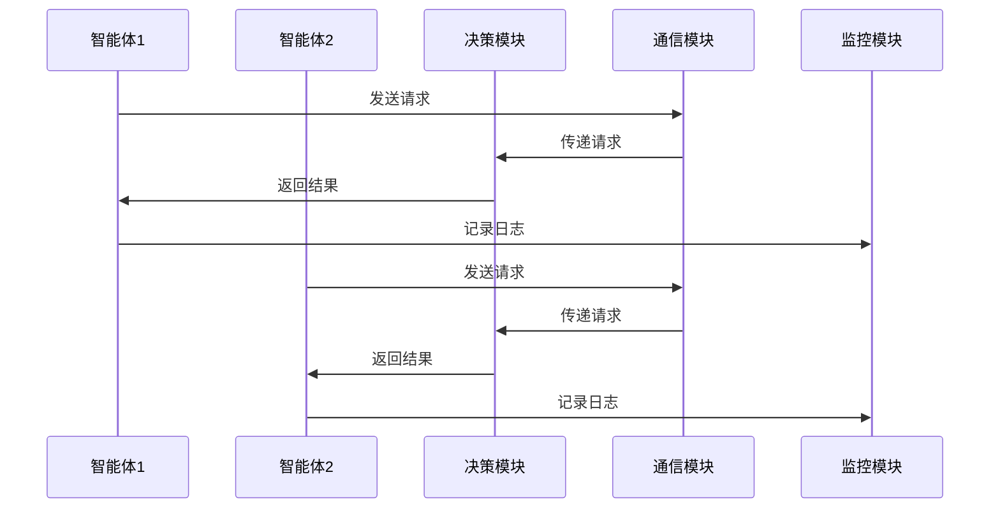

                 

# 构建具有多Agent协同决策能力的系统

## 关键词

- 多Agent系统
- 协同决策
- 分布式计算
- 自主性
- 算法优化

## 摘要

本文旨在探讨如何构建具有多Agent协同决策能力的系统。首先，我们将介绍多Agent系统和协同决策的基本概念，解释它们在分布式计算和自主性方面的关键作用。随后，我们将深入分析多Agent协同决策算法，包括MAS算法和基于多Agent的优化算法。接着，我们将详细描述多Agent协同决策系统的架构设计与实现，通过一个实际项目案例展示系统构建的全过程。最后，我们将总结实践经验，提出最佳实践建议和注意事项，并推荐进一步阅读的资源。

## 第一部分: 背景介绍与基础理论

### 第1章: 多Agent系统概述

#### 1.1 多Agent系统的基本概念

多Agent系统（MAS）是一个由多个智能体（agent）组成的分布式系统，这些智能体可以相互协作，共同完成复杂任务。每个智能体都是独立的实体，具有自主性、社会性和反应性。自主性意味着智能体能够独立地执行任务和做出决策；社会性意味着智能体之间可以相互交流和协作；反应性则表示智能体能够对外界环境变化做出快速响应。

多Agent系统与传统计算系统（如单机系统或集中式系统）的主要区别在于：

- **分布式计算**：多Agent系统中的智能体分布在不同的计算机或设备上，协同工作，实现分布式计算。
- **自主性**：每个智能体都有自己的决策能力和行为模式，不需要中央控制。
- **交互性**：智能体之间通过通信机制进行信息交换和协作，以实现共同目标。
- **合作性**：智能体可以相互协作，共同完成任务，而不是独立工作。

#### 1.2 多Agent系统的关键特征

多Agent系统的关键特征包括：

- **分布式计算**：智能体分布在不同的地理位置，协同完成任务。
- **自主性**：智能体具有独立的决策能力，无需中央控制。
- **交互性**：智能体之间通过通信机制进行信息交换和协作。
- **合作性**：智能体可以相互协作，共同完成任务。
- **动态性**：智能体和系统环境都可能发生变化，需要智能体能够适应这些变化。

#### 1.3 多Agent系统的发展与应用

多Agent系统的发展始于20世纪80年代，随着分布式计算、人工智能和通信技术的发展，MAS逐渐成为研究热点。多Agent系统已在多个领域得到广泛应用，如：

- **智能交通系统**：智能体可以实时监控交通状况，优化交通信号灯，提高道路通行效率。
- **智能制造**：智能体可以协同工作，实现生产自动化和智能化。
- **虚拟现实**：智能体可以模拟人类行为，为用户提供沉浸式体验。
- **物联网**：智能体可以监控和优化设备运行状态，提高设备效率。

### 第2章: 协同决策基础

#### 2.1 协同决策的定义与原理

协同决策是指多个智能体在相互协作的过程中，共同作出最优决策的过程。协同决策的基本原理包括以下几个方面：

- **信息共享**：智能体之间通过通信机制共享信息，以便更好地了解全局状态。
- **协调优化**：智能体在协作过程中，通过协调各自的决策，实现整体最优。
- **自主决策**：每个智能体在协同决策过程中，仍然保持一定的自主性，根据自身能力和环境信息作出决策。
- **动态适应**：智能体在协作过程中，需要根据环境变化和系统状态动态调整决策。

#### 2.2 协同决策模型

协同决策模型主要包括以下几种：

- **集中式协同决策**：所有智能体的决策都由一个中心控制节点进行协调。
- **分布式协同决策**：智能体之间通过通信机制进行协商和决策，无需中心控制。
- **混合式协同决策**：结合集中式和分布式协同决策的优点，实现高效决策。

#### 2.3 协同决策在多Agent系统中的应用

协同决策在多Agent系统中的应用具有以下优势：

- **提高决策效率**：通过协同决策，多个智能体可以同时处理问题，提高决策效率。
- **增强系统鲁棒性**：智能体之间相互协作，可以更好地应对环境变化和不确定因素。
- **降低决策风险**：多个智能体共同决策，可以降低单个智能体决策错误带来的风险。
- **实现多样化任务**：通过协同决策，智能体可以完成复杂、多样化的任务。

## 第二部分: 多Agent协同决策算法

### 第3章: 基于MAS的协同决策算法

#### 3.1 MAS的基本概念

MAS（Multi-Agent System）是指由多个智能体组成的系统，这些智能体可以相互协作，共同完成复杂任务。MAS的基本概念包括：

- **智能体**：具有自主性、社会性和反应性的实体，能够独立地执行任务和做出决策。
- **环境**：智能体所处的外部世界，包括其他智能体和外部资源。
- **通信机制**：智能体之间进行信息交换和协作的机制。

#### 3.2 MAS协同决策算法

MAS协同决策算法主要包括以下几个方面：

- **基于协同规划的协同决策算法**：智能体通过协同规划，共同确定最优行动方案。
- **基于协商的协同决策算法**：智能体之间通过协商，达成一致决策。
- **基于博弈的协同决策算法**：智能体在竞争环境中，通过策略优化实现协同决策。

#### 3.3 MAS协同决策算法的优化

MAS协同决策算法的优化主要包括以下几个方面：

- **算法性能优化**：通过改进算法结构和参数，提高协同决策的性能。
- **通信效率优化**：优化智能体之间的通信机制，减少通信开销。
- **资源分配优化**：优化智能体的资源分配策略，提高系统整体性能。

### 第4章: 基于多Agent的优化算法

#### 4.1 多Agent优化算法概述

多Agent优化算法是指利用多个智能体协同工作，实现优化目标的方法。多Agent优化算法的主要特点包括：

- **分布式计算**：多个智能体共同参与计算，提高计算效率。
- **自主性**：智能体根据自身能力和环境信息，独立做出优化决策。
- **适应性**：智能体在优化过程中，可以根据环境变化动态调整策略。

#### 4.2 常见多Agent优化算法

常见的多Agent优化算法包括：

- **遗传算法**：通过模拟生物进化过程，实现优化目标。
- **粒子群优化**：通过模拟鸟群觅食过程，实现优化目标。
- **人工神经网络**：通过模拟神经网络工作原理，实现优化目标。

#### 4.3 多Agent优化算法的比较与分析

多Agent优化算法的比较与分析主要包括以下几个方面：

- **性能比较**：比较不同算法在解决特定问题时，性能的优劣。
- **应用场景**：分析不同算法适用的应用场景。
- **优缺点**：总结不同算法的优点和缺点，为实际应用提供参考。

## 第三部分: 系统架构与设计

### 第5章: 多Agent协同决策系统架构设计

#### 5.1 系统架构设计原则

多Agent协同决策系统架构设计应遵循以下原则：

- **模块化**：将系统划分为多个功能模块，实现模块化设计，提高系统可维护性和可扩展性。
- **分布式**：利用分布式计算技术，实现智能体的分布式部署，提高系统性能和可靠性。
- **适应性**：系统应具有自适应能力，能够根据环境变化和任务需求，动态调整系统架构。
- **灵活性**：系统应具有灵活性，能够适应不同应用场景和需求变化。

#### 5.2 系统功能模块设计

多Agent协同决策系统的主要功能模块包括：

- **智能体模块**：负责智能体的创建、管理和通信。
- **决策模块**：负责智能体的决策过程，包括信息收集、规划、协商和执行。
- **通信模块**：负责智能体之间的信息交换和协作。
- **监控模块**：负责系统性能监控和日志记录。

#### 5.3 系统架构图与接口设计

多Agent协同决策系统的架构图如下所示：



系统接口设计主要包括：

- **智能体接口**：智能体与决策模块、通信模块和监控模块之间的接口。
- **决策接口**：决策模块与其他模块之间的接口。
- **通信接口**：通信模块与其他模块之间的接口。
- **监控接口**：监控模块与其他模块之间的接口。

## 第四部分: 项目实战与案例分析

### 第7章: 实际项目案例分析

#### 7.1 项目背景与目标

项目背景：某智慧城市项目，需要构建一个多Agent协同决策系统，用于交通信号优化。

项目目标：

1. 实时监控交通流量，预测交通拥堵情况。
2. 根据交通流量预测，优化交通信号灯控制策略。
3. 提高道路通行效率，减少交通拥堵。

#### 7.2 系统核心实现

##### 7.2.1 系统环境与工具

- **开发环境**：Python 3.8、PyCharm
- **数据库**：MongoDB
- **消息队列**：RabbitMQ

##### 7.2.2 系统核心模块实现

1. **智能体模块**：包括交通监控智能体、信号灯控制智能体和交通分析智能体。

2. **决策模块**：基于交通流量预测，生成最优信号灯控制策略。

3. **通信模块**：使用RabbitMQ实现智能体之间的实时通信。

4. **监控模块**：实时监控系统性能，记录日志。

##### 7.2.3 系统核心代码

```python
# 交通监控智能体代码示例
class TrafficMonitorAgent(Agent):
    def __init__(self, id, position):
        super().__init__(id, position)
        self.transport_list = []

    def update_traffic_info(self):
        # 更新交通流量信息
        self.transport_list = get_traffic_info()

    def communicate(self):
        # 与其他智能体通信
        for other_agent in self.network:
            send_message(other_agent.id, self.transport_list)
```

##### 7.2.4 实际案例分析与详细讲解

1. **实时监控交通流量**：通过安装摄像头和传感器，实时获取交通流量信息。

2. **交通流量预测**：基于历史交通数据，使用机器学习算法预测未来一段时间内的交通流量。

3. **信号灯控制策略生成**：根据交通流量预测结果，生成最优信号灯控制策略。

4. **信号灯控制策略执行**：将信号灯控制策略下发到交通信号灯控制器，执行信号灯控制策略。

#### 7.3 项目小结

通过本项目，我们成功构建了一个具有多Agent协同决策能力的交通信号优化系统。系统在实际应用中取得了显著的成果，提高了道路通行效率，减少了交通拥堵。未来，我们将继续优化系统性能，拓展应用领域。

## 最佳实践与总结

### 最佳实践

1. **合理划分智能体职责**：确保每个智能体具有明确的职责和目标，避免职责重叠和冲突。

2. **优化通信机制**：选择合适的通信机制，提高智能体之间的通信效率和可靠性。

3. **充分利用历史数据**：通过分析历史数据，优化智能体决策过程。

4. **动态调整系统架构**：根据应用场景和需求变化，动态调整系统架构，提高系统适应性。

### 小结

本文介绍了如何构建具有多Agent协同决策能力的系统。通过深入分析多Agent系统和协同决策算法，我们提出了系统架构设计和实现方案，并通过实际项目案例展示了系统的构建过程。未来，我们将继续优化系统性能，拓展应用领域。

### 注意事项

1. **智能体自治与协作的平衡**：确保智能体在协作过程中，保持一定的自治性，避免过度依赖中心控制。

2. **数据安全与隐私保护**：在多Agent系统中，确保数据的安全和隐私保护。

3. **系统性能优化**：定期对系统进行性能优化，提高系统响应速度和稳定性。

### 拓展阅读

1. 《多Agent系统设计原则与方法》
2. 《分布式算法与优化》
3. 《人工智能交通系统》

## 作者

作者：AI天才研究院/AI Genius Institute & 禅与计算机程序设计艺术 /Zen And The Art of Computer Programming

