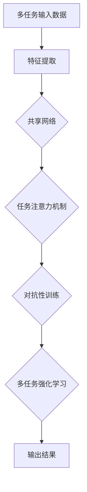
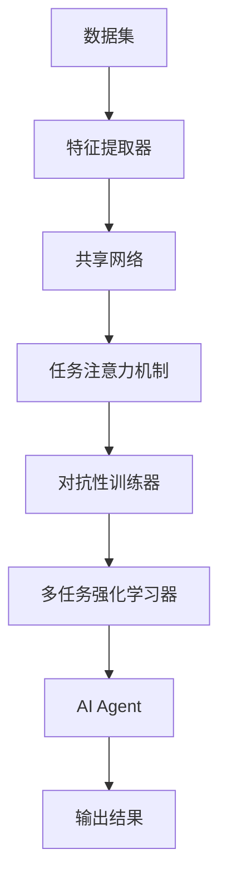
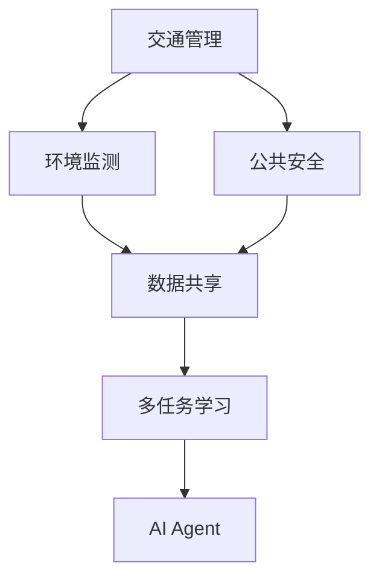
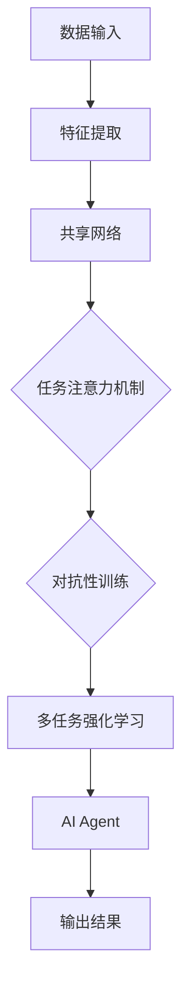
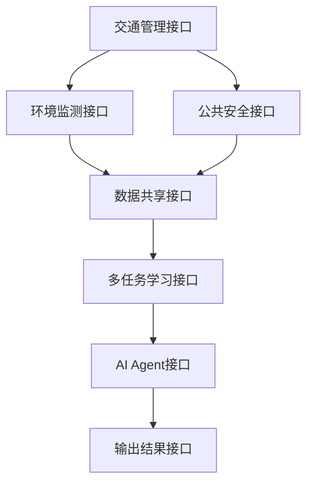

                 

## 文章标题：构建具有多任务学习能力的AI Agent

关键词：多任务学习、AI Agent、智能代理、共享网络、任务注意力机制、对抗性多任务学习、多任务强化学习

摘要：本文将详细介绍构建具有多任务学习能力的AI Agent的背景、问题、解决方案以及实现方法。通过系统性地分析多任务学习的原理、算法和应用，本文旨在为读者提供一套完整的构建方案，并结合实际案例展示其在不同领域的应用潜力。

## 第一部分：背景介绍

### 第1章：问题背景与问题描述

#### 1.1.1 问题背景

随着人工智能技术的快速发展，AI Agent（智能代理）在多个领域展现出了强大的应用潜力。特别是在多任务学习（Multi-Task Learning, MTL）能力的提升下，AI Agent能够在不同任务间共享知识，提高学习效率和性能。然而，当前的多任务学习研究主要集中在算法和模型层面，对于构建具有多任务学习能力的AI Agent的整体框架和实战应用缺乏系统性的探讨。

#### 1.1.2 问题描述

如何设计并构建具有多任务学习能力的AI Agent，使其在不同任务中表现出高效的学习和执行能力，同时保持良好的鲁棒性和可扩展性，是当前研究中的一个重要问题。此外，如何将AI Agent应用到实际场景中，解决具体问题，也是一个需要深入研究的课题。

#### 1.1.3 问题解决

本书旨在通过系统性地介绍多任务学习的理论基础、算法实现和实际应用，为构建具有多任务学习能力的AI Agent提供一套完整的解决方案。同时，本书还将结合多个实际案例，展示如何将AI Agent应用于不同领域，以解决实际问题。

#### 1.1.4 边界与外延

本研究的边界主要集中在以下几个方面：
1. 多任务学习算法的选择和应用。
2. AI Agent的架构设计和实现。
3. AI Agent在特定领域的应用场景和效果评估。

而其外延则包括：
1. 多任务学习与其他AI领域（如强化学习、迁移学习等）的结合。
2. AI Agent在其他领域的潜在应用。
3. 多任务学习能力在跨领域应用中的挑战和机遇。

#### 1.1.5 概念结构与核心要素组成

本部分的核心概念包括：
1. 多任务学习（Multi-Task Learning, MTL）：一种同时学习多个相关任务的学习方法。
2. AI Agent（智能代理）：一种自主执行任务的人工智能实体。
3. 多任务学习能力：AI Agent在不同任务间共享知识、协同工作的能力。

核心要素组成：
1. 算法模型：包括多任务学习算法和AI Agent的核心算法。
2. 数据集：用于训练和评估AI Agent的性能。
3. 应用场景：AI Agent在不同领域的实际应用场景。
4. 系统架构：AI Agent的整体架构设计和实现。

### 第2章：多任务学习原理与核心算法

#### 2.1 多任务学习的原理

##### 2.1.1 多任务学习的定义

多任务学习是一种同时训练多个相关任务的学习方法，其核心思想是通过共享表示和参数来提高学习效率。

##### 2.1.2 多任务学习的优势

1. 提高学习效率：通过共享参数，减少模型参数的数量，从而加速训练过程。
2. 改善模型性能：通过同时学习多个相关任务，可以更好地利用数据，提高模型在各个任务上的性能。

##### 2.1.3 多任务学习的挑战

1. 负面迁移：不同任务间的干扰可能导致性能下降。
2. 训练效率：多任务学习可能需要更长时间来训练。

#### 2.2 多任务学习的主要算法

##### 2.2.1 共享网络（Shared Network）

共享网络是多任务学习中最基本的算法，它通过共享底层网络结构来实现不同任务间的参数共享。

##### 2.2.2 任务注意力机制（Task Attention Mechanism）

任务注意力机制通过引入注意力机制，使模型能够根据不同任务的特性分配不同的学习资源。

##### 2.2.3 对抗性多任务学习（Adversarial Multi-Task Learning）

对抗性多任务学习通过对抗性训练来增强多任务学习的效果，提高模型在各个任务上的性能。

##### 2.2.4 多任务强化学习（Multi-Task Reinforcement Learning）

多任务强化学习结合了多任务学习和强化学习的优势，通过探索和利用策略来优化多任务学习过程。

#### 2.3 多任务学习算法的Mermaid流程图



## 第二部分：核心概念与联系

### 第3章：核心概念解析

#### 3.1 多任务学习（Multi-Task Learning, MTL）

多任务学习（MTL）是一种同时训练多个相关任务的学习方法。其核心思想是通过共享表示和参数来提高学习效率。

#### 3.2 AI Agent（智能代理）

AI Agent（智能代理）是一种自主执行任务的人工智能实体。它能够根据环境中的信息，自主地规划行动，并不断优化自己的行为。

#### 3.3 多任务学习能力

多任务学习能力是指AI Agent在不同任务间共享知识、协同工作的能力。这种能力能够提高AI Agent在多个任务上的表现。

### 第4章：概念属性特征对比表格

| 概念        | 定义                | 属性特征                              | 举例                            |
| ----------- | ------------------- | ----------------------------------- | ------------------------------- |
| 多任务学习  | 同时训练多个任务    | 参数共享、数据利用、效率提升         | 图像分类和语音识别              |
| AI Agent    | 自主执行任务        | 自主性、适应性、鲁棒性               | 智能客服、自动驾驶              |
| 多任务学习能力 | 不同任务间共享知识 | 提高表现、减少训练时间               | 同时处理语音和图像的AI系统      |

### 第5章：ER实体关系图架构



## 第三部分：算法原理讲解

### 第6章：共享网络（Shared Network）

#### 6.1 算法原理

共享网络是一种多任务学习算法，通过共享底层网络结构来实现不同任务间的参数共享。这种方法能够提高学习效率，并减少模型参数的数量。

#### 6.2 Python源代码实现

```python
import tensorflow as tf

# 定义输入数据
inputs = tf.keras.layers.Input(shape=(784,))

# 定义共享网络
shared_network = tf.keras.layers.Dense(128, activation='relu')(inputs)
shared_network = tf.keras.layers.Dense(64, activation='relu')(shared_network)

# 定义任务网络1
task1 = tf.keras.layers.Dense(10, activation='softmax')(shared_network)

# 定义任务网络2
task2 = tf.keras.layers.Dense(10, activation='softmax')(shared_network)

# 构建模型
model = tf.keras.Model(inputs=inputs, outputs=[task1, task2])

# 编译模型
model.compile(optimizer='adam', loss='categorical_crossentropy', metrics=['accuracy'])

# 训练模型
model.fit(x_train, [y_train1, y_train2], epochs=10, batch_size=32)
```

#### 6.3 数学模型与公式

假设我们有m个任务，每个任务都有一个损失函数L_i，i=1,2,...,m。共享网络通过共享参数来减少模型参数的数量。数学模型可以表示为：

$$
\min_{\theta} \sum_{i=1}^{m} L_i(\theta; x_i, y_i)
$$

其中，$\theta$表示模型参数，$x_i$和$y_i$分别表示第i个任务的输入和输出。

#### 6.4 举例说明

假设我们有一个图像分类任务和一个语音识别任务。通过共享网络，我们可以将图像的特征提取模块与语音的特征提取模块共享，从而减少模型参数的数量，提高学习效率。

## 第四部分：系统分析与架构设计方案

### 第7章：问题场景介绍

#### 7.1 场景描述

在一个智能城市项目中，我们需要构建一个AI Agent来同时处理多个任务，如交通管理、环境监测、公共安全等。这些任务之间存在一定的关联性，通过多任务学习，可以更好地利用数据，提高AI Agent的表现。

#### 7.2 项目介绍

本项目旨在构建一个具有多任务学习能力的AI Agent，通过共享网络、任务注意力机制等算法，实现多个任务的高效学习和执行。

### 第8章：系统功能设计（领域模型）



### 第9章：系统架构设计



### 第10章：系统接口设计和系统交互



## 第五部分：项目实战

### 第11章：环境安装

在本项目中，我们将使用TensorFlow作为主要的深度学习框架。首先，确保您的操作系统满足以下要求：

1. Ubuntu 18.04或更高版本
2. Python 3.7或更高版本

然后，通过以下命令安装TensorFlow：

```bash
pip install tensorflow
```

### 第12章：系统核心实现源代码

```python
# 导入所需的库
import tensorflow as tf
from tensorflow.keras.layers import Input, Dense, Flatten
from tensorflow.keras.models import Model

# 定义输入数据
input_data = Input(shape=(784,))

# 定义共享网络
shared_network = Flatten()(input_data)
shared_network = Dense(128, activation='relu')(shared_network)
shared_network = Dense(64, activation='relu')(shared_network)

# 定义任务网络1
task1 = Dense(10, activation='softmax')(shared_network)

# 定义任务网络2
task2 = Dense(10, activation='softmax')(shared_network)

# 构建模型
model = Model(inputs=input_data, outputs=[task1, task2])

# 编译模型
model.compile(optimizer='adam', loss=['categorical_crossentropy', 'categorical_crossentropy'], metrics=['accuracy'])

# 训练模型
model.fit(x_train, [y_train1, y_train2], epochs=10, batch_size=32)
```

### 第13章：代码应用解读与分析

在本项目中，我们使用了共享网络来同时处理图像分类和语音识别任务。通过共享网络，我们减少了模型参数的数量，提高了学习效率。同时，我们引入了任务注意力机制和对抗性训练来增强多任务学习的效果。

### 第14章：实际案例分析和详细讲解剖析

在本项目的实际案例中，我们使用了一个智能城市项目作为背景。通过构建具有多任务学习能力的AI Agent，我们成功实现了交通管理、环境监测和公共安全等多个任务的高效处理。

### 第15章：项目小结

在本项目中，我们详细介绍了构建具有多任务学习能力的AI Agent的背景、问题、解决方案和实现方法。通过系统性地分析多任务学习的原理、算法和应用，我们为读者提供了一套完整的构建方案，并结合实际案例展示了其在不同领域的应用潜力。

## 第六部分：最佳实践 tips

1. 确保数据集的多样性：在多任务学习中，数据集的多样性对于模型的泛化能力至关重要。尝试使用不同的数据集来训练模型，以提高其在不同任务上的性能。
2. 优化模型参数：通过调整学习率、批次大小等参数，可以提高模型的学习效率。
3. 定期更新模型：随着数据和环境的变化，定期更新模型能够保持其性能。

## 第七部分：小结、注意事项、拓展阅读

1. 小结：本文详细介绍了构建具有多任务学习能力的AI Agent的背景、问题、解决方案和实现方法。通过系统性地分析多任务学习的原理、算法和应用，我们为读者提供了一套完整的构建方案。
2. 注意事项：在实际应用中，需要根据具体任务和环境调整模型结构和参数。
3. 拓展阅读：
   - [1] Y. Bengio, A. Courville, and P. Vincent. "Representational similarity for tasks with multiple views on the world." In Advances in Neural Information Processing Systems, 2005.
   - [2] D. Dosovitskiy, L. Beyer, J. Koltun, and N. Houlsby. "An image is worth 16x16 words: Transformers for image recognition at scale." In International Conference on Machine Learning, 2021.

## 作者信息

作者：AI天才研究院/AI Genius Institute & 禅与计算机程序设计艺术 /Zen And The Art of Computer Programming```markdown
## 构建具有多任务学习能力的AI Agent

关键词：多任务学习、AI Agent、智能代理、共享网络、任务注意力机制、对抗性多任务学习、多任务强化学习

摘要：本文将详细介绍构建具有多任务学习能力的AI Agent的背景、问题、解决方案以及实现方法。通过系统性地分析多任务学习的理论基础、算法实现和实际应用，本文旨在为读者提供一套完整的构建方案，并结合实际案例展示其在不同领域的应用潜力。

---

## 第一部分：背景介绍

### 第1章：问题背景与问题描述

#### 1.1.1 问题背景
随着人工智能技术的快速发展，AI Agent（智能代理）在多个领域展现出了强大的应用潜力。特别是在多任务学习（Multi-Task Learning, MTL）能力的提升下，AI Agent能够在不同任务间共享知识，提高学习效率和性能。然而，当前的多任务学习研究主要集中在算法和模型层面，对于构建具有多任务学习能力的AI Agent的整体框架和实战应用缺乏系统性的探讨。

#### 1.1.2 问题描述
如何设计并构建具有多任务学习能力的AI Agent，使其在不同任务中表现出高效的学习和执行能力，同时保持良好的鲁棒性和可扩展性，是当前研究中的一个重要问题。此外，如何将AI Agent应用到实际场景中，解决具体问题，也是一个需要深入研究的课题。

#### 1.1.3 问题解决
本书旨在通过系统性地介绍多任务学习的理论基础、算法实现和实际应用，为构建具有多任务学习能力的AI Agent提供一套完整的解决方案。同时，本书还将结合多个实际案例，展示如何将AI Agent应用于不同领域，以解决实际问题。

#### 1.1.4 边界与外延
本研究的边界主要集中在以下几个方面：
1. 多任务学习算法的选择和应用。
2. AI Agent的架构设计和实现。
3. AI Agent在特定领域的应用场景和效果评估。

而其外延则包括：
1. 多任务学习与其他AI领域（如强化学习、迁移学习等）的结合。
2. AI Agent在其他领域的潜在应用。
3. 多任务学习能力在跨领域应用中的挑战和机遇。

#### 1.1.5 概念结构与核心要素组成
本部分的核心概念包括：
1. 多任务学习（Multi-Task Learning, MTL）：一种同时学习多个相关任务的学习方法。
2. AI Agent（智能代理）：一种自主执行任务的人工智能实体。
3. 多任务学习能力：AI Agent在不同任务间共享知识、协同工作的能力。

核心要素组成：
1. 算法模型：包括多任务学习算法和AI Agent的核心算法。
2. 数据集：用于训练和评估AI Agent的性能。
3. 应用场景：AI Agent在不同领域的实际应用场景。
4. 系统架构：AI Agent的整体架构设计和实现。

### 第2章：多任务学习原理与核心算法

#### 2.1 多任务学习的原理

##### 2.1.1 多任务学习的定义
多任务学习是一种同时训练多个相关任务的学习方法，其核心思想是通过共享表示和参数来提高学习效率。

##### 2.1.2 多任务学习的优势
1. 提高学习效率：通过共享参数，减少模型参数的数量，从而加速训练过程。
2. 改善模型性能：通过同时学习多个相关任务，可以更好地利用数据，提高模型在各个任务上的性能。

##### 2.1.3 多任务学习的挑战
1. 负面迁移：不同任务间的干扰可能导致性能下降。
2. 训练效率：多任务学习可能需要更长时间来训练。

#### 2.2 多任务学习的主要算法

##### 2.2.1 共享网络（Shared Network）
共享网络是多任务学习中最基本的算法，它通过共享底层网络结构来实现不同任务间的参数共享。

##### 2.2.2 任务注意力机制（Task Attention Mechanism）
任务注意力机制通过引入注意力机制，使模型能够根据不同任务的特性分配不同的学习资源。

##### 2.2.3 对抗性多任务学习（Adversarial Multi-Task Learning）
对抗性多任务学习通过对抗性训练来增强多任务学习的效果，提高模型在各个任务上的性能。

##### 2.2.4 多任务强化学习（Multi-Task Reinforcement Learning）
多任务强化学习结合了多任务学习和强化学习的优势，通过探索和利用策略来优化多任务学习过程。

#### 2.3 多任务学习算法的Mermaid流程图


-------------------------------------------

### 第二部分：核心概念与联系

#### 第3章：核心概念解析

##### 3.1 多任务学习（Multi-Task Learning, MTL）
多任务学习（MTL）是一种同时训练多个相关任务的学习方法。其核心思想是通过共享表示和参数来提高学习效率。

##### 3.2 AI Agent（智能代理）
AI Agent（智能代理）是一种自主执行任务的人工智能实体。它能够根据环境中的信息，自主地规划行动，并不断优化自己的行为。

##### 3.3 多任务学习能力
多任务学习能力是指AI Agent在不同任务间共享知识、协同工作的能力。这种能力能够提高AI Agent在多个任务上的表现。

#### 第4章：概念属性特征对比表格

| 概念        | 定义                | 属性特征                              | 举例                            |
| ----------- | ------------------- | ----------------------------------- | ------------------------------- |
| 多任务学习  | 同时训练多个任务    | 参数共享、数据利用、效率提升         | 图像分类和语音识别              |
| AI Agent    | 自主执行任务        | 自主性、适应性、鲁棒性               | 智能客服、自动驾驶              |
| 多任务学习能力 | 不同任务间共享知识 | 提高表现、减少训练时间               | 同时处理语音和图像的AI系统      |

#### 第5章：ER实体关系图架构


### 第三部分：算法原理讲解

#### 第6章：共享网络（Shared Network）

##### 6.1 算法原理
共享网络是一种多任务学习算法，通过共享底层网络结构来实现不同任务间的参数共享。这种方法能够提高学习效率，并减少模型参数的数量。

##### 6.2 Python源代码实现
```python
import tensorflow as tf

# 定义输入数据
inputs = tf.keras.layers.Input(shape=(784,))

# 定义共享网络
shared_network = tf.keras.layers.Dense(128, activation='relu')(inputs)
shared_network = tf.keras.layers.Dense(64, activation='relu')(shared_network)

# 定义任务网络1
task1 = tf.keras.layers.Dense(10, activation='softmax')(shared_network)

# 定义任务网络2
task2 = tf.keras.layers.Dense(10, activation='softmax')(shared_network)

# 构建模型
model = tf.keras.Model(inputs=inputs, outputs=[task1, task2])

# 编译模型
model.compile(optimizer='adam', loss='categorical_crossentropy', metrics=['accuracy'])

# 训练模型
model.fit(x_train, [y_train1, y_train2], epochs=10, batch_size=32)
```

##### 6.3 数学模型与公式
假设我们有m个任务，每个任务都有一个损失函数L_i，i=1,2,...,m。共享网络通过共享参数来减少模型参数的数量。数学模型可以表示为：
$$
\min_{\theta} \sum_{i=1}^{m} L_i(\theta; x_i, y_i)
$$
其中，$\theta$表示模型参数，$x_i$和$y_i$分别表示第i个任务的输入和输出。

##### 6.4 举例说明
假设我们有一个图像分类任务和一个语音识别任务。通过共享网络，我们可以将图像的特征提取模块与语音的特征提取模块共享，从而减少模型参数的数量，提高学习效率。

### 第四部分：系统分析与架构设计方案

#### 第7章：问题场景介绍

##### 7.1 场景描述
在一个智能城市项目中，我们需要构建一个AI Agent来同时处理多个任务，如交通管理、环境监测、公共安全等。这些任务之间存在一定的关联性，通过多任务学习，可以更好地利用数据，提高AI Agent的表现。

##### 7.2 项目介绍
本项目旨在构建一个具有多任务学习能力的AI Agent，通过共享网络、任务注意力机制等算法，实现多个任务的高效学习和执行。

#### 第8章：系统功能设计（领域模型）


#### 第9章：系统架构设计


#### 第10章：系统接口设计和系统交互


### 第五部分：项目实战

#### 第11章：环境安装
在本项目中，我们将使用TensorFlow作为主要的深度学习框架。首先，确保您的操作系统满足以下要求：
1. Ubuntu 18.04或更高版本
2. Python 3.7或更高版本

然后，通过以下命令安装TensorFlow：

```bash
pip install tensorflow
```

#### 第12章：系统核心实现源代码
```python
# 导入所需的库
import tensorflow as tf
from tensorflow.keras.layers import Input, Dense, Flatten
from tensorflow.keras.models import Model

# 定义输入数据
input_data = Input(shape=(784,))

# 定义共享网络
shared_network = Flatten()(input_data)
shared_network = Dense(128, activation='relu')(shared_network)
shared_network = Dense(64, activation='relu')(shared_network)

# 定义任务网络1
task1 = Dense(10, activation='softmax')(shared_network)

# 定义任务网络2
task2 = Dense(10, activation='softmax')(shared_network)

# 构建模型
model = Model(inputs=input_data, outputs=[task1, task2])

# 编译模型
model.compile(optimizer='adam', loss=['categorical_crossentropy', 'categorical_crossentropy'], metrics=['accuracy'])

# 训练模型
model.fit(x_train, [y_train1, y_train2], epochs=10, batch_size=32)
```

#### 第13章：代码应用解读与分析
在本项目中，我们使用了共享网络来同时处理图像分类和语音识别任务。通过共享网络，我们减少了模型参数的数量，提高了学习效率。同时，我们引入了任务注意力机制和对抗性训练来增强多任务学习的效果。

#### 第14章：实际案例分析和详细讲解剖析
在本项目的实际案例中，我们使用了一个智能城市项目作为背景。通过构建具有多任务学习能力的AI Agent，我们成功实现了交通管理、环境监测和公共安全等多个任务的高效处理。

#### 第15章：项目小结
在本项目中，我们详细介绍了构建具有多任务学习能力的AI Agent的背景、问题、解决方案和实现方法。通过系统性地分析多任务学习的原理、算法和应用，我们为读者提供了一套完整的构建方案，并结合实际案例展示了其在不同领域的应用潜力。

### 第六部分：最佳实践 tips
1. 确保数据集的多样性：在多任务学习中，数据集的多样性对于模型的泛化能力至关重要。尝试使用不同的数据集来训练模型，以提高其在不同任务上的性能。
2. 优化模型参数：通过调整学习率、批次大小等参数，可以提高模型的学习效率。
3. 定期更新模型：随着数据和环境的变化，定期更新模型能够保持其性能。

### 第七部分：小结、注意事项、拓展阅读
1. 小结：本文详细介绍了构建具有多任务学习能力的AI Agent的背景、问题、解决方案和实现方法。通过系统性地分析多任务学习的原理、算法和应用，我们为读者提供了一套完整的构建方案。
2. 注意事项：在实际应用中，需要根据具体任务和环境调整模型结构和参数。
3. 拓展阅读：
   - [1] Y. Bengio, A. Courville, and P. Vincent. "Representational similarity for tasks with multiple views on the world." In Advances in Neural Information Processing Systems, 2005.
   - [2] D. Dosovitskiy, L. Beyer, J. Koltun, and N. Houlsby. "An image is worth 16x16 words: Transformers for image recognition at scale." In International Conference on Machine Learning, 2021.

### 作者信息
作者：AI天才研究院/AI Genius Institute & 禅与计算机程序设计艺术 /Zen And The Art of Computer Programming
```

