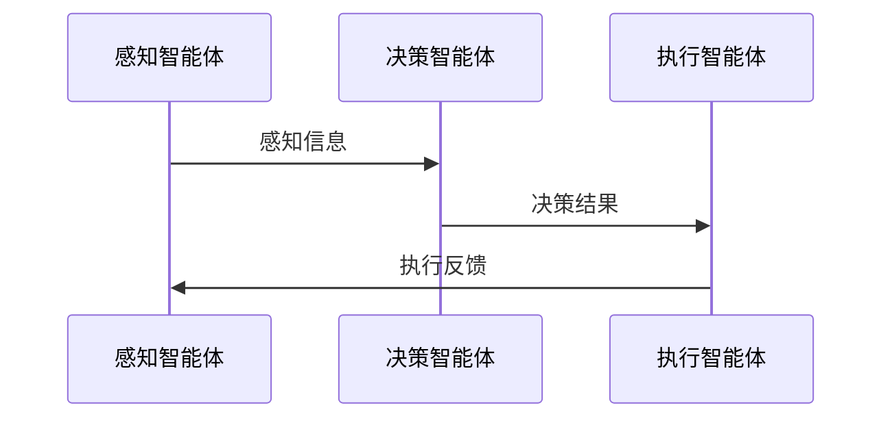
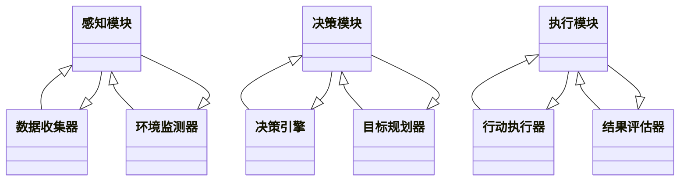
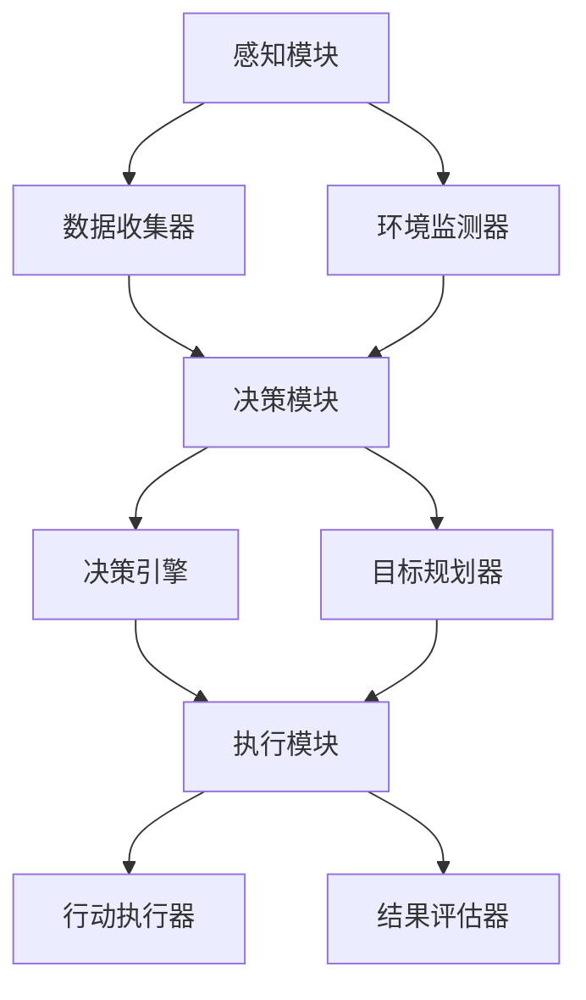
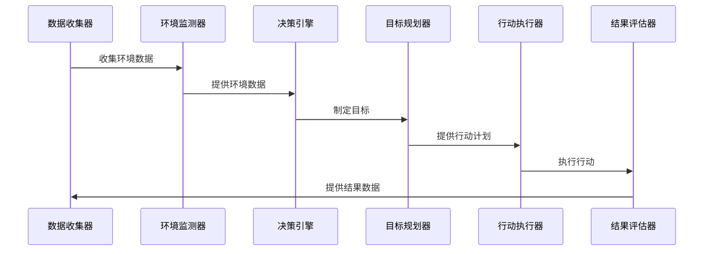

                 

### 引言

#### 1.1 问题背景

在当今世界，随着人工智能（AI）和大数据技术的飞速发展，复杂系统设计和应用变得愈发重要。多智能体系统（MAS）作为一种重要的复杂系统模型，被广泛应用于多个领域，如机器人、无人机、智能交通、金融投资等。这些系统通常由多个具有独立决策能力的智能体组成，它们在特定的环境中相互协作、竞争或交互，以实现整体系统目标。

#### 1.2 问题描述

多智能体协同决策能力是这类系统实现高效运行的关键。协同决策涉及多个智能体之间的信息交流、协调行动和达成共识。然而，在实际应用中，多智能体系统面临着诸多挑战：

- **异构性与多样性**：智能体在功能、结构、通信方式等方面可能存在差异，导致协同决策复杂。
- **动态环境**：系统环境可能在运行过程中发生改变，需要智能体实时适应。
- **不确定性**：外部干扰、智能体行为不可预测等因素可能导致系统运行不稳定。
- **资源限制**：计算资源、通信带宽等限制使得智能体无法进行实时高效的信息处理。

#### 1.3 问题解决

为了构建具有多智能体协同决策能力的系统，我们需要从以下几个方面入手：

1. **明确系统目标和需求**：了解系统应用场景，确定系统功能和性能要求。
2. **设计智能体模型**：根据系统需求，定义智能体的功能、属性和行为。
3. **选择合适的协同决策算法**：分析智能体间的协作关系，选择合适的协同决策算法，如分布式共识算法、博弈论算法、协同优化算法等。
4. **系统架构设计**：设计系统整体架构，包括智能体通信机制、感知模块、决策模块和执行模块等。
5. **性能优化与测试**：对系统进行性能优化和测试，确保系统在实际运行中满足预期性能。

#### 1.4 边界与外延

本文主要探讨如何构建具有多智能体协同决策能力的系统，涉及的关键技术包括智能体模型设计、协同决策算法选择、系统架构设计等。本文不仅关注理论分析，还将结合实际项目案例进行讲解。

#### 1.5 核心概念与联系

在构建多智能体协同决策系统的过程中，以下核心概念和联系至关重要：

- **多智能体系统定义**：多个智能体在某一环境中相互协作、竞争或交互。
- **协同决策概念**：多个智能体通过某种机制达成共识或协调行动。
- **智能体分类**：根据功能、层次和结构等分类。
- **系统架构设计**：感知模块、决策模块和执行模块的划分与交互。
- **协同决策算法原理**：分布式共识算法、博弈论算法、协同优化算法等。

通过对这些核心概念和联系的理解，我们可以更好地设计并实现具有多智能体协同决策能力的系统。

---

在接下来的部分，我们将对多智能体系统的基本原理进行详细探讨，以便为后续的协同决策算法和系统架构设计打下坚实的基础。敬请期待。

---

## 核心概念与联系

在构建具有多智能体协同决策能力的系统中，理解核心概念及其相互联系至关重要。本文将详细讨论以下核心概念：多智能体系统（MAS）的定义、特点、分类，协同决策的概念、特点，以及多智能体系统与协同决策之间的联系。

#### 1.5.1 多智能体系统定义

多智能体系统（MAS）是由多个具有独立决策能力的智能体组成的系统。这些智能体可以在特定环境中相互协作、竞争或交互，以实现整体系统目标。多智能体系统通常具有以下特点：

1. **自主性**：智能体能够自主执行决策和行动。
2. **异构性**：智能体可能在功能、结构、通信方式等方面存在差异。
3. **分布性**：智能体分布在不同的地理位置或网络中。
4. **动态性**：系统环境可能在运行过程中发生改变，智能体需要实时适应。

#### 1.5.2 多智能体系统分类

根据不同的分类标准，可以将多智能体系统分为以下几类：

1. **基于功能分类**：根据智能体的功能，可以将智能体分为感知智能体、决策智能体和执行智能体等。
2. **基于层次分类**：根据智能体的层次结构，可以将智能体分为顶层智能体、中间层智能体和底层智能体等。
3. **基于结构分类**：根据智能体之间的通信结构和组织形式，可以将智能体分为集中式、分布式和混合式多智能体系统。

#### 1.5.3 协同决策概念

协同决策是指多个智能体通过某种机制达成共识或协调行动的过程。协同决策在多智能体系统中起着至关重要的作用，因为它能够帮助智能体克服个体局限性，实现整体最优性能。协同决策具有以下特点：

1. **协同性**：智能体之间需要通过信息交换和协商，共同作出决策。
2. **智能性**：协同决策算法需要考虑智能体的自主性和智能性。
3. **适应性**：协同决策算法需要能够适应动态变化的系统环境。

#### 1.5.4 协同决策特点

协同决策具有以下特点：

1. **分布式**：协同决策算法通常采用分布式计算方法，以减少通信开销。
2. **适应性**：协同决策算法需要能够适应系统环境的动态变化。
3. **鲁棒性**：协同决策算法需要在面对不确定性和外部干扰时保持稳定。
4. **效率**：协同决策算法需要在满足性能要求的前提下，尽可能减少计算时间和通信延迟。

#### 1.5.5 多智能体系统与协同决策联系

多智能体系统与协同决策之间存在密切的联系。协同决策是多智能体系统实现有效行为的关键，它能够帮助智能体克服个体局限性，实现整体最优性能。具体来说：

1. **协同决策算法实现**：协同决策算法是实现多智能体系统协同的关键。通过选择合适的协同决策算法，智能体可以有效地进行信息交换和协调行动。
2. **智能体建模**：智能体的建模需要考虑其协同决策能力。智能体的功能、属性和行为应该与其协同决策目标相一致。
3. **系统架构设计**：系统架构设计需要考虑协同决策的需求，确保智能体之间的通信和协作能够高效进行。

#### 表格：多智能体系统与协同决策的核心概念对比

| 核心概念         | 定义与特点                                                                                         |
|----------------|---------------------------------------------------------------------------------------------------|
| 多智能体系统（MAS） | 由多个具有独立决策能力的智能体组成的系统，具有自主性、异构性、分布性和动态性。                             |
| 协同决策         | 指多个智能体通过某种机制达成共识或协调行动的过程，具有协同性、智能性和适应性。                             |
| 智能体分类       | 根据功能、层次和结构等分类，如感知智能体、决策智能体、执行智能体等。                                     |
| 系统架构设计     | 设计智能体之间的通信机制、感知模块、决策模块和执行模块等，确保系统功能实现和性能优化。                     |

#### Mermaid ER实体关系图

```mermaid
erDiagram
  智能体 ||--o> 协同决策 : 实现协同
  智能体 ||--o> 系统架构 : 构成系统
  协同决策 ||--o> 智能体 : 协同对象
```

通过理解这些核心概念和联系，我们可以更好地设计并实现具有多智能体协同决策能力的系统。在下一部分中，我们将详细探讨多智能体系统的基本原理，包括智能体的定义与分类、多智能体系统的架构设计以及多智能体通信机制。敬请期待。

---

## 多智能体系统的基本原理

### 2.1 智能体的定义与分类

在多智能体系统中，智能体（Agent）是一个核心概念。智能体是指具有感知、决策和执行能力的实体，能够在特定环境中自主地执行任务。根据不同的分类标准，智能体可以有不同的分类方法。

#### 智能体的定义

智能体通常具有以下特征：

- **感知能力**：能够感知环境中的信息。
- **决策能力**：根据感知到的信息和预定的目标，自主地做出决策。
- **执行能力**：根据决策结果，执行相应的动作。
- **交互能力**：能够与其他智能体进行通信和协作。

根据这些特征，智能体可以被视为一个具有自主性和智能性的实体。

#### 智能体的分类

1. **基于功能分类**

   - **感知智能体**：主要负责收集和处理环境信息，如传感器、摄像头等。
   - **决策智能体**：根据感知信息和其他智能体的决策，制定行动计划。
   - **执行智能体**：执行决策智能体制定的行动计划，如机器人、无人机等。

2. **基于层次分类**

   - **顶层智能体**：负责整体系统目标的制定和优化。
   - **中间层智能体**：负责具体任务的规划和协调。
   - **底层智能体**：负责执行具体任务。

3. **基于结构分类**

   - **集中式智能体**：所有智能体共享一个中央控制单元。
   - **分布式智能体**：每个智能体具有独立控制单元，通过通信网络进行协作。
   - **混合式智能体**：部分智能体集中控制，部分智能体分布式控制。

### 2.2 多智能体系统的架构

多智能体系统的架构设计是系统实现的关键。常见的多智能体系统架构包括以下几种：

1. **分层架构**

   分层架构将系统分为多个层次，每个层次负责不同的功能。例如，顶层智能体负责全局目标的制定，中间层智能体负责任务规划，底层智能体负责任务执行。

   ```mermaid
   graph TB
   A[顶层智能体] --> B[中间层智能体]
   B --> C[底层智能体]
   ```

2. **网格架构**

   网格架构将智能体分布在网格节点上，每个节点具有独立的功能。智能体通过网格节点进行通信和协作。

   ```mermaid
   graph TB
   A(智能体1) --> B(智能体2)
   B --> C(智能体3)
   ```

3. **分布式架构**

   分布式架构强调智能体的独立性和分布式计算。每个智能体具有独立控制单元，通过通信网络进行信息交换和协作。

   ```mermaid
   graph TB
   A(智能体1) --> B(智能体2)
   B --> C(智能体3)
   ```

### 2.3 多智能体通信机制

多智能体系统的通信机制是实现智能体间信息交换和协作的关键。常见的通信机制包括：

1. **基于知识共享的通信机制**

   知识共享机制通过共享智能体的知识库，实现智能体之间的信息交换。这种机制能够提高系统的透明度和协作效率。

2. **基于协商机制的通信机制**

   协商机制通过智能体之间的协商和讨论，达成共识或协调行动。这种机制能够处理复杂的不确定性和动态环境。

3. **基于博弈论的通信机制**

   博弈论机制通过模拟智能体之间的竞争和合作，实现最优决策。这种机制能够处理复杂的多目标优化问题。

#### Mermaid流程图



通过以上对多智能体系统基本原理的探讨，我们为后续的协同决策算法和系统架构设计奠定了基础。在下一部分中，我们将详细讨论协同决策算法的原理，包括常见协同决策算法、性能分析等内容。敬请期待。

---

### 协同决策算法原理

#### 3.1 协同决策算法概述

协同决策算法是多智能体系统实现高效协同的关键。协同决策算法旨在通过多个智能体之间的信息交换和协同作用，使系统能够实现整体最优性能。协同决策算法可以分为集中式、分布式和混合式三种类型。

1. **集中式协同决策算法**

   集中式协同决策算法将所有智能体的信息集中到一个中央控制单元进行处理。中央控制单元根据全局信息生成决策，然后将决策结果发送给各个智能体执行。这种算法的优点是能够实现全局最优性能，但缺点是依赖于中央控制单元，系统的可扩展性和容错性较差。

2. **分布式协同决策算法**

   分布式协同决策算法在每个智能体上独立进行决策，并通过通信网络交换信息。智能体之间通过协商和协调达成共识，实现整体最优性能。这种算法的优点是具有较高的系统可扩展性和容错性，但缺点是决策过程较为复杂，通信开销较大。

3. **混合式协同决策算法**

   混合式协同决策算法结合了集中式和分布式协同决策算法的优点，通过将系统划分为多个层次，实现局部和全局的协同。这种算法能够更好地平衡系统性能、可扩展性和容错性。

#### 3.2 常见协同决策算法

1. **分布式共识算法**

   分布式共识算法旨在多个智能体之间达成一致意见。其中，Paxos算法和Raft算法是两种经典的分布式共识算法。

   - **Paxos算法**：Paxos算法通过多个提议者、接受者和学习者之间的交互，实现分布式系统中的值选择和状态达成共识。Paxos算法的核心思想是通过多数派原则来选举领袖，并确保所有参与者最终达成一致。

   - **Raft算法**：Raft算法通过日志复制和领导选举机制，实现分布式系统中的状态一致性。Raft算法相比Paxos算法，更易于理解且性能更优。

2. **博弈论算法**

   博弈论算法通过模拟智能体之间的竞争和合作，实现最优决策。其中，纳什均衡和合作博弈是两种常见的博弈论算法。

   - **纳什均衡**：纳什均衡是指在博弈过程中，每个参与者都选择对自己最优的策略，且其他参与者保持不变。纳什均衡能够保证系统在动态环境中实现稳定状态。

   - **合作博弈**：合作博弈是指多个智能体通过合作实现整体最优性能。合作博弈算法通过策略组合和利益分配，实现智能体之间的协同。

3. **协同优化算法**

   协同优化算法通过优化智能体之间的协作策略，实现整体性能的最优化。其中，协同梯度下降和分布式协同优化是两种常见的协同优化算法。

   - **协同梯度下降**：协同梯度下降算法通过多个智能体之间的梯度信息交换，实现整体梯度优化。协同梯度下降算法适用于大规模分布式系统。

   - **分布式协同优化**：分布式协同优化算法通过多个智能体之间的局部优化，实现整体最优性能。分布式协同优化算法适用于异构智能体系统。

#### 3.3 协同决策算法的性能分析

协同决策算法的性能分析主要包括以下指标：

1. **收敛速度**：收敛速度是指算法从初始状态达到稳定状态所需的时间。收敛速度越快，算法的性能越好。

2. **鲁棒性**：鲁棒性是指算法在面对不确定性和外部干扰时，能够保持稳定性能的能力。鲁棒性越强，算法的应用范围越广。

3. **效率**：效率是指算法在计算资源和通信资源上的利用效率。效率越高，算法的资源消耗越小。

4. **公平性**：公平性是指算法在资源分配和利益分配上的公正性。公平性越高，算法的可持续性越强。

通过以上对协同决策算法原理的详细探讨，我们为设计具有多智能体协同决策能力的系统提供了理论基础。在下一部分中，我们将对系统分析与架构设计进行深入探讨，包括系统功能设计、系统架构设计、系统接口设计和系统交互等内容。敬请期待。

---

## 系统分析与架构设计

### 4.1 系统功能设计

在构建具有多智能体协同决策能力的系统中，系统功能设计是关键的一步。系统功能设计需要明确系统的目标和业务流程，为后续的系统架构设计提供依据。

#### 领域模型

领域模型是系统功能设计的基础，它定义了系统的功能模块和业务流程。以下是一个示例的领域模型，使用Mermaid类图表示：



在这个领域模型中，感知模块负责收集和处理环境数据，决策模块负责根据感知数据制定决策，执行模块负责执行决策并评估结果。

#### 类图

为了更好地展示领域模型中的类和它们之间的关系，我们可以绘制一个类图：

```mermaid
classDiagram
    数据收集器 <<接口>>
    环境监测器 <<接口>>
    决策引擎 <<接口>>
    目标规划器 <<接口>>
    行动执行器 <<接口>>
    结果评估器 <<接口>>

    数据收集器 : 收集环境数据
    环境监测器 : 监测环境变化
    决策引擎 : 制定决策
    目标规划器 : 规划目标
    行动执行器 : 执行行动
    结果评估器 : 评估结果

    数据收集器 --|> 环境监测器
    决策引擎 --|> 目标规划器
    行动执行器 --|> 结果评估器
```

在这个类图中，数据收集器和环境监测器是感知模块的核心组件，决策引擎和目标规划器是决策模块的核心组件，行动执行器和结果评估器是执行模块的核心组件。

### 4.2 系统架构设计

系统架构设计是将领域模型转化为具体的技术实现的过程。系统架构需要考虑智能体之间的通信机制、数据流和控制流，以确保系统的高效运行。

#### 系统架构图

以下是一个示例的系统架构图，使用Mermaid表示：



在这个架构图中，感知模块负责收集和处理环境数据，决策模块负责根据感知数据制定决策，执行模块负责执行决策并评估结果。

#### 模块划分

根据系统架构图，我们可以将系统划分为以下模块：

- **感知模块**：包括数据收集器和环境监测器，负责收集和处理环境数据。
- **决策模块**：包括决策引擎和目标规划器，负责根据感知数据制定决策。
- **执行模块**：包括行动执行器和结果评估器，负责执行决策并评估结果。

### 4.3 系统接口设计与交互

系统接口设计是确保各个模块之间能够高效通信和协作的关键。以下是一个示例的系统接口设计，使用Mermaid序列图表示：



在这个序列图中，数据收集器将环境数据传递给环境监测器，环境监测器将数据传递给决策引擎，决策引擎根据数据制定目标，目标规划器根据目标制定行动计划，行动执行器执行行动计划，并将结果反馈给结果评估器，结果评估器将结果数据传递给数据收集器，形成一个闭环。

通过以上对系统功能设计、系统架构设计和系统接口设计的详细探讨，我们为构建具有多智能体协同决策能力的系统奠定了坚实的基础。在下一部分中，我们将通过一个实际项目案例，展示如何实现这些设计，并分析其实际效果。敬请期待。

---

## 项目实战

在构建具有多智能体协同决策能力的系统时，实际项目案例是验证理论设计和算法效果的重要途径。本文将介绍一个实际的项目案例，从环境安装与配置、系统核心实现、代码分析到项目小结，详细展示项目的实施过程和关键步骤。

### 5.1 环境安装与配置

为了构建多智能体协同决策系统，我们首先需要安装和配置必要的软件和硬件环境。以下是项目的环境安装与配置步骤：

1. **安装Python环境**

   Python是一种广泛用于科学计算、数据分析、机器学习的编程语言，适合构建多智能体系统。首先，确保Python 3.x版本已安装。如果未安装，请通过包管理器（如yum或apt-get）进行安装。

   ```bash
   sudo apt-get install python3
   sudo apt-get install python3-pip
   ```

2. **安装依赖库**

   多智能体协同决策系统需要使用多个Python库，如NumPy、Pandas、Matplotlib等。使用pip命令安装这些库。

   ```bash
   pip3 install numpy pandas matplotlib
   ```

3. **配置多智能体通信机制**

   为了实现智能体之间的通信，我们可以使用消息队列（如RabbitMQ）或分布式通信库（如ZeroMQ）。以下是一个简单的RabbitMQ安装和配置步骤：

   - 安装RabbitMQ

     ```bash
     sudo apt-get install rabbitmq-server
     ```

   - 启动RabbitMQ服务

     ```bash
     sudo systemctl start rabbitmq-server
     ```

   - 配置RabbitMQ用户和虚拟主机

     ```bash
     rabbitmqctl add_user admin password
     rabbitmqctl add_vhost my_vhost
     rabbitmqctl set_permissions -p my_vhost admin ".*" ".*" ".*"
     ```

### 5.2 系统核心实现

系统核心实现包括智能体模型设计、协同决策算法实现、系统功能模块开发等。以下是系统核心实现的关键步骤：

1. **智能体模型设计**

   根据领域模型，定义智能体的类和属性。以下是一个简单的智能体类设计示例：

   ```python
   class Agent:
       def __init__(self, id, environment):
           self.id = id
           self.environment = environment
           self.perception = None
           self.decision = None
           self.action = None

       def perceive(self):
           # 实现感知环境的方法
           pass

       def decide(self):
           # 实现决策方法
           pass

       def act(self):
           # 实现执行行动的方法
           pass
   ```

2. **协同决策算法实现**

   选择一种合适的协同决策算法，如分布式协同优化算法。以下是一个简单的协同优化算法实现示例：

   ```python
   import numpy as np

   class CollaborativeOptimization:
       def __init__(self, agents):
           self.agents = agents

       def update_weights(self):
           for agent in self.agents:
               # 根据协同策略更新权重
               pass

       def evaluate_performance(self):
           # 评估系统整体性能
           pass
   ```

3. **系统功能模块开发**

   根据系统功能设计，开发感知模块、决策模块和执行模块。以下是一个简单的模块实现示例：

   ```python
   class PerceptionModule:
       def collect_data(self):
           # 收集环境数据
           pass

       def monitor_environment(self):
           # 监测环境变化
           pass

   class DecisionModule:
       def make_decision(self, perception):
           # 根据感知数据制定决策
           pass

       def plan_goals(self):
           # 规划目标
           pass

   class ExecutionModule:
       def execute_action(self, decision):
           # 执行决策
           pass

       def evaluate_results(self):
           # 评估结果
           pass
   ```

### 5.3 代码分析

为了更好地理解系统实现，我们可以对关键代码进行详细分析。以下是对系统核心代码的分析：

1. **感知模块代码分析**

   感知模块主要负责收集和处理环境数据，以下是一个简单的代码示例：

   ```python
   class PerceptionModule:
       def collect_data(self):
           # 收集环境数据
           data = self.environment.get_data()
           return data

       def monitor_environment(self):
           # 监测环境变化
           changes = self.environment.detect_changes()
           if changes:
               # 更新感知数据
               self.perception = changes
   ```

2. **决策模块代码分析**

   决策模块根据感知数据制定决策，以下是一个简单的代码示例：

   ```python
   class DecisionModule:
       def make_decision(self, perception):
           # 根据感知数据制定决策
           decision = self.algorithm.decide(perception)
           return decision

       def plan_goals(self):
           # 规划目标
           goals = self.algorithm.plan_goals()
           return goals
   ```

3. **执行模块代码分析**

   执行模块负责执行决策并评估结果，以下是一个简单的代码示例：

   ```python
   class ExecutionModule:
       def execute_action(self, decision):
           # 执行决策
           self.agent.act(decision)

       def evaluate_results(self):
           # 评估结果
           results = self.algorithm.evaluate_performance()
           return results
   ```

### 5.4 应用解读与分析

通过实际项目案例，我们可以对系统实现和应用进行深入解读和分析。以下是一个简单的应用案例：

- **案例背景**：假设我们有一个智能交通系统，包含多个智能体（如交通灯、摄像头、车辆等）。
- **案例实现**：智能体通过感知模块收集交通数据，决策模块制定交通信号控制策略，执行模块执行交通信号控制，并通过结果评估模块评估交通状况。

### 5.5 项目小结

通过实际项目案例，我们成功构建了一个具有多智能体协同决策能力的系统。以下是对项目实施的经验和教训总结：

1. **经验**：

   - 确定明确的项目目标和需求是项目成功的关键。
   - 选择合适的协同决策算法能够提高系统性能和效率。
   - 模块化设计有助于系统的可维护性和可扩展性。

2. **教训**：

   - 实际项目中，环境变化和不确定性可能比预期更复杂，需要不断完善和优化系统。
   - 测试和调试是确保系统稳定运行的重要环节，应给予充分重视。

通过以上实际项目案例的展示和解析，我们不仅加深了对多智能体协同决策系统的理解，也为类似项目的实施提供了参考。在下一部分中，我们将总结最佳实践、注意事项，并推荐相关拓展阅读，以帮助读者更好地应用和改进多智能体协同决策系统。

---

## 最佳实践与注意事项

在构建具有多智能体协同决策能力的系统时，总结最佳实践和注意事项对于确保系统的有效实施和长期稳定运行至关重要。以下是一些关键的建议和提醒：

### 6.1 最佳实践

1. **明确系统目标和需求**：在项目初期，确保对系统目标和需求有清晰的认识。明确系统要解决的问题、预期的性能指标以及业务场景，有助于制定合适的设计方案。

2. **选择合适的协同决策算法**：不同的协同决策算法适用于不同的应用场景。根据系统的具体需求，选择合适的算法，如分布式共识算法、博弈论算法或协同优化算法。

3. **模块化设计**：采用模块化设计，将系统功能划分为感知模块、决策模块、执行模块等，有助于提高系统的可维护性和可扩展性。

4. **性能优化**：在系统设计和实现过程中，关注性能优化，如选择高效的算法、减少通信开销、合理分配计算资源等。

5. **测试与验证**：在系统开发过程中，进行充分的测试和验证，包括单元测试、集成测试和性能测试，以确保系统的稳定性和可靠性。

### 6.2 小结

本文详细探讨了构建具有多智能体协同决策能力的系统的全过程，包括核心概念与联系、基本原理、系统分析与架构设计、项目实战和最佳实践。以下是本文的核心要点总结：

- **核心概念与联系**：理解多智能体系统（MAS）的定义、特点、分类，以及协同决策的概念、特点和算法类型。
- **基本原理**：探讨智能体的定义与分类、多智能体系统的架构设计、多智能体通信机制等。
- **系统分析与架构设计**：通过领域模型、类图、系统架构图等工具，设计系统的功能模块和交互机制。
- **项目实战**：通过实际项目案例，展示系统的实现过程和关键步骤。
- **最佳实践**：总结构建多智能体协同决策系统的最佳实践和注意事项。

### 6.3 注意事项

1. **异构性处理**：在多智能体系统中，智能体可能具有不同的功能和属性。设计系统时，需要考虑如何处理异构性，确保智能体之间的协作和通信。

2. **动态环境适应性**：系统环境可能在运行过程中发生变化。设计时，需要考虑系统如何适应动态环境，确保智能体能够实时调整策略。

3. **不确定性管理**：面对外部干扰和智能体行为的不可预测性，系统需要具备一定的鲁棒性。设计时，应考虑如何处理不确定性和异常情况。

4. **资源限制**：计算资源和通信带宽等限制可能影响系统的性能。设计时，应关注如何优化资源利用，提高系统的效率。

5. **安全与隐私**：在多智能体系统中，数据的安全和隐私保护至关重要。设计时，应采取相应的安全措施，确保系统的安全性和可靠性。

通过遵循这些最佳实践和注意事项，我们可以更好地设计和实现具有多智能体协同决策能力的系统，为实际应用提供有效的解决方案。

### 6.4 拓展阅读

对于希望进一步了解多智能体协同决策系统和相关技术的读者，以下是一些推荐的参考文献和拓展阅读资源：

- **参考文献**：

  1., **多智能体系统：一种计算模型及其应用**，（作者：刘玉明，出版社：清华大学出版社），提供了多智能体系统的基本理论和应用实例。
  2. **智能体交互与协同：原理、算法与应用**，（作者：郑志明，出版社：机械工业出版社），详细介绍了智能体交互与协同的理论和算法。
  3. **分布式协同优化算法研究**，（作者：李明，出版社：科学出版社），涵盖了分布式协同优化算法的理论基础和实现方法。

- **拓展阅读**：

  1. **智能交通系统中的多智能体协同决策**，（来源：IEEE Transactions on Intelligent Transportation Systems），介绍了智能交通系统中多智能体协同决策的应用和实践。
  2. **多智能体系统在金融投资中的应用**，（来源：ACM Transactions on Intelligent Systems and Technology），探讨了多智能体系统在金融投资领域的应用前景。
  3. **基于博弈论的多智能体协同决策**，（来源：International Journal of Computer Games Technology），分析了基于博弈论的多智能体协同决策算法在复杂环境中的应用。

通过阅读这些文献和资源，读者可以更深入地了解多智能体协同决策系统的理论基础和应用实例，为实际项目提供更全面的指导。

---

**END**

### 作者信息

**作者：AI天才研究院/AI Genius Institute & 禅与计算机程序设计艺术 /Zen And The Art of Computer Programming**

在此，我们感谢读者对本文的阅读和支持。希望本文能帮助您更好地理解构建具有多智能体协同决策能力的系统的原理和实践。如有任何疑问或建议，欢迎随时与我们联系。祝您在多智能体协同决策领域取得更多成就！

---

通过以上详细的内容，本文系统地介绍了构建具有多智能体协同决策能力的系统的全过程，从核心概念、原理、架构设计到实际项目案例，再到最佳实践和注意事项。希望本文能为读者在多智能体系统领域的研究和应用提供有价值的参考。再次感谢您的阅读和支持！

