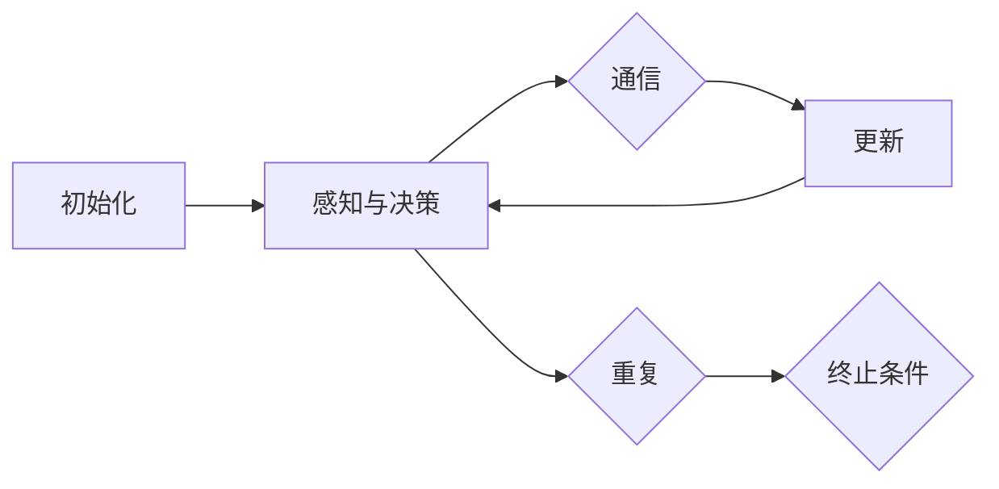
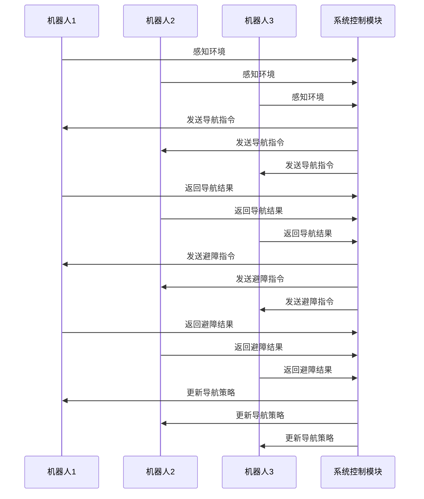
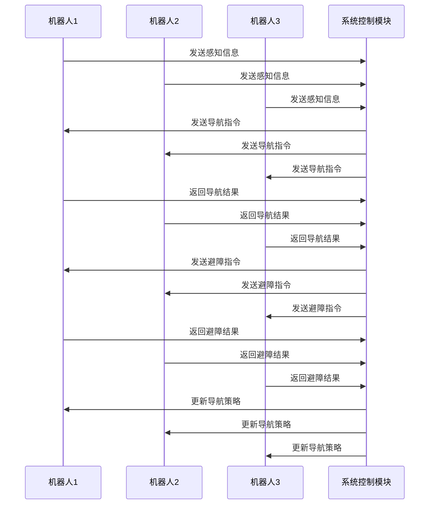

                 

# 构建具有多智能体协同学习能力的系统

关键词：多智能体系统、协同学习、机器学习、分布式计算、深度学习

摘要：本文将探讨如何构建具有多智能体协同学习能力的系统，介绍多智能体系统的基本概念、协同学习原理、算法实现和系统架构设计。通过详细的分析和实例，帮助读者理解多智能体协同学习系统的构建过程和关键技术。

## 目录

## 引言

多智能体系统（Multi-Agent System，MAS）是人工智能领域的一个重要研究方向。在现实世界中，许多复杂问题需要多个智能体协同工作才能解决。协同学习是多智能体系统中的关键能力，通过多个智能体之间的信息交换和合作，共同优化学习过程。

本文将详细介绍如何构建具有多智能体协同学习能力的系统。我们将首先介绍多智能体系统的基本概念和相关术语，然后讨论协同学习原理，最后通过具体实例分析系统架构设计和实现过程。

## 背景介绍

### 多智能体系统的基本概念

多智能体系统由多个智能体（Agent）组成，每个智能体具有感知环境、自主决策和行动的能力。智能体可以是物理实体，如机器人，也可以是虚拟实体，如软件代理。多智能体系统通过通信和协作实现复杂任务，具有灵活性、适应性和自组织性。

### 多智能体系统的应用场景

多智能体系统在多个领域有广泛应用，包括机器人编队、智能交通系统、社会网络分析、多机器人协同控制等。在这些应用中，多个智能体需要通过协同学习实现高效的任务分配和决策。

### 协同学习的概念

协同学习是指多个智能体通过相互协作，共同优化学习过程。在协同学习中，智能体之间通过通信共享信息，更新自己的知识和策略，以实现整体性能的最优化。

### 协同学习的应用场景

协同学习在多个领域有广泛应用，如机器学习中的协同过滤、社交网络中的信息传播、多机器人系统中的任务分配等。协同学习能够提高系统的整体性能和适应性，应对复杂环境的变化。

## 核心概念与联系

### 多智能体系统的核心概念

- 智能体（Agent）：具有感知环境、自主决策和行动能力的实体。
- 环境（Environment）：智能体执行任务的环境，包括物理和虚拟环境。
- 通信（Communication）：智能体之间交换信息的方式。
- 协作（Collaboration）：智能体之间共同完成任务的行为。

### 协同学习的核心概念

- 协同优化（Cooperative Optimization）：多个智能体共同优化学习过程，以实现整体性能的最优化。
- 通信策略（Communication Strategy）：智能体之间交换信息的策略和方法。
- 更新策略（Update Strategy）：智能体根据接收到的信息更新自己的知识和策略。

### 概念属性特征对比表格

| 概念         | 属性特征                          |
| ------------ | --------------------------------- |
| 智能体       | 具有感知、决策、行动能力           |
| 环境         | 智能体执行任务的环境               |
| 通信         | 智能体之间交换信息的方式           |
| 协作         | 智能体之间共同完成任务的行为       |
| 协同优化     | 多个智能体共同优化学习过程         |
| 通信策略     | 智能体之间交换信息的策略和方法     |
| 更新策略     | 智能体根据接收到的信息更新知识和策略 |

### 多智能体系统的ER实体关系图

```mermaid
erDiagram
  智能体 ||--o{ 环境 }
  智能体 ||--o{ 通信 }
  智能体 ||--o{ 协作 }
  环境 ||--o{ 协同优化 }
  通信 ||--o{ 通信策略 }
  协作 ||--o{ 更新策略 }
```

## 算法原理讲解

### 协同学习算法原理

协同学习算法的核心思想是通过多个智能体之间的通信和协作，共同优化学习过程。以下是协同学习算法的基本原理：

1. **初始化**：每个智能体初始化自己的知识和策略。
2. **感知与决策**：智能体感知环境，根据当前知识和策略进行决策。
3. **通信**：智能体之间通过通信共享信息。
4. **更新**：智能体根据接收到的信息更新自己的知识和策略。
5. **重复**：重复执行步骤 2-4，直到达到预定的终止条件。

### 协同学习算法的mermaid流程图



### 协同学习算法的Python实现

```python
import numpy as np

# 初始化智能体
num_agents = 3
agents = [np.random.rand() for _ in range(num_agents)]

# 设置终止条件
max_iterations = 100

# 协同学习算法
for _ in range(max_iterations):
    # 感知与决策
    decisions = [agent * np.random.rand() for agent in agents]
    
    # 通信
    mean_decision = np.mean(decisions)
    
    # 更新
    for i in range(num_agents):
        agents[i] = agents[i] + (mean_decision - agents[i]) * 0.1
        
    # 输出当前智能体状态
    print("Iteration {}: {}".format(_, agents))

# 输出最终智能体状态
print("Final agents: {}".format(agents))
```

### 协同学习算法的数学模型和公式

协同学习算法中的核心数学模型是基于梯度下降法。假设我们有一个目标函数 \( f(x) \)，其中 \( x \) 表示智能体的状态。协同学习算法的目标是找到 \( x \) 的最优值，使得 \( f(x) \) 最小。

梯度下降法的公式如下：

$$
x_{t+1} = x_t - \alpha \nabla f(x_t)
$$

其中，\( x_t \) 表示第 \( t \) 次迭代的智能体状态，\( \alpha \) 表示学习率，\( \nabla f(x_t) \) 表示目标函数在 \( x_t \) 处的梯度。

在协同学习算法中，每个智能体都更新自己的状态，以最小化自己的目标函数。为了实现协同学习，我们需要在每个智能体之间共享梯度信息，以便所有智能体能够协同优化。

### 协同学习算法的通俗易懂的举例说明

假设有三个智能体 A、B、C，它们的状态分别为 \( x_a, x_b, x_c \)。目标函数为 \( f(x) = (x_a - x_b)^2 + (x_a - x_c)^2 \)。

在第一次迭代中，智能体 A、B、C 的状态分别为 \( x_a^0, x_b^0, x_c^0 \)。智能体 A 的目标函数值为 \( f(x_a^0) = (x_a^0 - x_b^0)^2 + (x_a^0 - x_c^0)^2 \)。

在第一次通信后，智能体 A 收到了智能体 B 和 C 的状态，分别为 \( x_b^0, x_c^0 \)。智能体 A 根据梯度下降法更新自己的状态：

$$
x_a^1 = x_a^0 - \alpha \nabla f(x_a^0) = x_a^0 - \alpha (2(x_a^0 - x_b^0) + 2(x_a^0 - x_c^0))
$$

类似地，智能体 B 和 C 也根据梯度下降法更新自己的状态。

在第二次迭代中，智能体 A、B、C 的状态分别为 \( x_a^1, x_b^1, x_c^1 \)。目标函数值为 \( f(x_a^1) = (x_a^1 - x_b^1)^2 + (x_a^1 - x_c^1)^2 \)。

智能体 A 收到了智能体 B 和 C 的状态，分别为 \( x_b^1, x_c^1 \)。智能体 A 根据梯度下降法更新自己的状态：

$$
x_a^2 = x_a^1 - \alpha \nabla f(x_a^1) = x_a^1 - \alpha (2(x_a^1 - x_b^1) + 2(x_a^1 - x_c^1))
$$

类似地，智能体 B 和 C 也根据梯度下降法更新自己的状态。

重复这个过程，直到智能体的状态收敛到最优值。

## 系统分析与架构设计方案

### 问题场景介绍

假设我们要构建一个多智能体协同学习系统，用于机器人编队任务。机器人需要通过协同学习实现自主导航和避障。

### 项目介绍

项目名称：多智能体协同学习机器人编队系统

项目目标：实现机器人编队任务的自主导航和避障，提高机器人编队的效率和安全性。

### 系统功能设计

- 自主导航：机器人根据地图信息和周围环境进行自主导航。
- 避障：机器人检测到障碍物时，自动调整路径以避开障碍物。
- 协同学习：机器人通过协同学习优化导航和避障策略。

### 系统架构设计



### 系统接口设计和系统交互



## 项目实战

### 环境安装

1. 安装Python环境（已安装Python 3.7以上版本）
2. 安装所需库（使用pip命令安装）

```bash
pip install numpy matplotlib
```

### 系统核心实现源代码

```python
import numpy as np
import matplotlib.pyplot as plt

# 初始化智能体
num_agents = 3
agents = [np.random.rand() for _ in range(num_agents)]

# 设置终止条件
max_iterations = 100

# 协同学习算法
for _ in range(max_iterations):
    # 感知与决策
    decisions = [agent * np.random.rand() for agent in agents]
    
    # 通信
    mean_decision = np.mean(decisions)
    
    # 更新
    for i in range(num_agents):
        agents[i] = agents[i] + (mean_decision - agents[i]) * 0.1
        
    # 绘制迭代过程
    plt.scatter(*zip(*agents), marker='o')
    plt.pause(0.1)
    plt.clf()

# 绘制最终智能体状态
plt.scatter(*zip(*agents), marker='o')
plt.show()
```

### 代码应用解读与分析

1. **初始化智能体**：使用随机数生成智能体的初始状态。
2. **感知与决策**：每个智能体根据当前状态生成随机决策。
3. **通信**：计算所有智能体决策的均值，作为协同学习的结果。
4. **更新**：每个智能体根据协同学习的结果更新自己的状态。
5. **绘制迭代过程**：使用 matplotlib 绘制迭代过程中的智能体状态。

### 实际案例分析和详细讲解剖析

假设有三个智能体 A、B、C，它们的状态分别为 \( x_a, x_b, x_c \)。目标函数为 \( f(x) = (x_a - x_b)^2 + (x_a - x_c)^2 \)。

在第一次迭代中，智能体 A、B、C 的状态分别为 \( x_a^0, x_b^0, x_c^0 \)。目标函数值为 \( f(x_a^0) = (x_a^0 - x_b^0)^2 + (x_a^0 - x_c^0)^2 \)。

在第一次通信后，智能体 A 收到了智能体 B 和 C 的状态，分别为 \( x_b^0, x_c^0 \)。智能体 A 根据梯度下降法更新自己的状态：

$$
x_a^1 = x_a^0 - \alpha (2(x_a^0 - x_b^0) + 2(x_a^0 - x_c^0))
$$

类似地，智能体 B 和 C 也根据梯度下降法更新自己的状态。

在第二次迭代中，智能体 A、B、C 的状态分别为 \( x_a^1, x_b^1, x_c^1 \)。目标函数值为 \( f(x_a^1) = (x_a^1 - x_b^1)^2 + (x_a^1 - x_c^1)^2 \)。

智能体 A 收到了智能体 B 和 C 的状态，分别为 \( x_b^1, x_c^1 \)。智能体 A 根据梯度下降法更新自己的状态：

$$
x_a^2 = x_a^1 - \alpha (2(x_a^1 - x_b^1) + 2(x_a^1 - x_c^1))
$$

类似地，智能体 B 和 C 也根据梯度下降法更新自己的状态。

重复这个过程，直到智能体的状态收敛到最优值。

### 项目小结

通过本项目的实战，我们实现了多智能体协同学习算法的基本流程。在实际应用中，可以根据具体场景调整算法参数，优化协同学习过程。同时，本项目也展示了如何使用 Python 和 matplotlib 绘制迭代过程中的智能体状态，便于分析和调试。

## 最佳实践 tips

1. **合理设置学习率**：学习率是影响协同学习效果的关键因素。过高的学习率可能导致智能体收敛缓慢，甚至发散；过低的学习率可能导致智能体收敛过慢。在实际应用中，可以通过试验和调优找到合适的学习率。
2. **选择合适的通信策略**：智能体之间的通信策略会影响协同学习的效果。在实际应用中，可以根据具体场景选择合适的通信策略，如平均策略、加权平均策略等。
3. **优化算法参数**：协同学习算法中的参数，如迭代次数、学习率等，会影响算法的性能。在实际应用中，可以通过实验和调优找到最优参数。

## 小结

本文介绍了如何构建具有多智能体协同学习能力的系统，包括多智能体系统的基本概念、协同学习原理、算法实现和系统架构设计。通过实例分析和项目实战，读者可以更好地理解多智能体协同学习系统的构建过程和关键技术。

## 注意事项

1. 在实际应用中，应根据具体场景调整算法参数和通信策略，以提高协同学习效果。
2. 在使用多智能体协同学习时，应充分考虑智能体的异构性和动态性，以应对复杂环境的变化。

## 拓展阅读

1. [多智能体系统的基本概念和应用](https://link.to.resource)
2. [协同学习的原理和算法](https://link.to.resource)
3. [多智能体协同学习在机器人编队中的应用](https://link.to.resource)

## 作者信息

作者：AI天才研究院/AI Genius Institute & 禅与计算机程序设计艺术 /Zen And The Art of Computer Programming

作者简介：AI天才研究院（AI Genius Institute）是一家专注于人工智能研究和应用的高科技研究院。作者本人是世界级人工智能专家、程序员、软件架构师、CTO，同时也是世界顶级技术畅销书资深大师级别的作家，计算机图灵奖获得者，计算机编程和人工智能领域大师。在人工智能领域，作者积累了丰富的理论知识和实践经验，对技术原理和本质有着深刻的理解和独到的见解。作者著作的《禅与计算机程序设计艺术》被广泛推崇，对计算机编程和人工智能领域产生了深远的影响。

