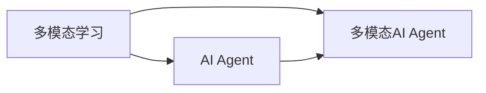
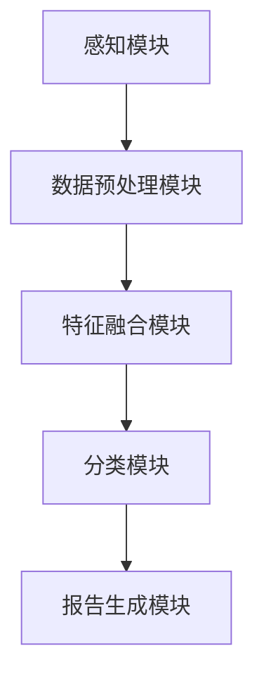
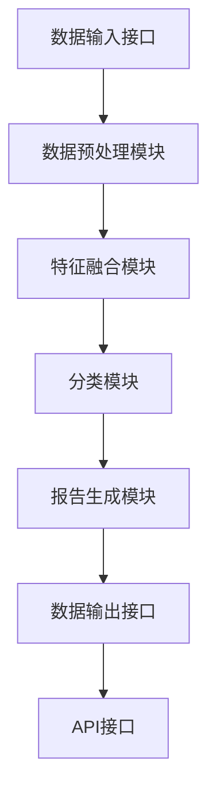
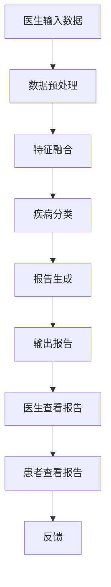

                 

## 引言

在当今的科技浪潮中，人工智能（AI）技术正以前所未有的速度和规模影响着各行各业。从自动驾驶汽车到智能助手，从医疗诊断到金融服务，AI的应用场景层出不穷。而在这其中，具有多模态学习能力的AI Agent正逐渐成为研究的焦点和应用的先驱。

### 关键词

- 多模态学习
- AI Agent
- 深度学习
- 机器学习
- 数据融合

### 摘要

本文旨在深入探讨构建具有多模态学习能力的AI Agent的理论与实践。通过回顾AI Agent和多模态学习的基本概念，本文将详细分析多模态学习的技术细节，包括算法原理、系统架构设计及应用实例。最后，文章将展望多模态AI Agent的未来发展趋势和潜在挑战，并给出相关的最佳实践和拓展阅读建议。

### 背景介绍

#### 多模态学习

多模态学习是指AI系统能够处理并整合来自不同类型数据源的信息。例如，一个多模态学习系统可以同时分析图像、文本和音频，从而获得更全面和精确的见解。在传统单模态学习系统中，每个模态的信息被独立处理，而多模态学习则通过结合不同模态的信息来提升模型的性能和智能水平。

#### AI Agent

AI Agent，或称智能体，是一种能够执行特定任务的自主决策系统。与传统的规则驱动系统不同，AI Agent通过学习和自适应来与环境互动。一个典型的AI Agent可以是自动驾驶汽车的控制系统，它可以实时感知道路环境、做出驾驶决策，并在不断的学习中提高驾驶能力。

#### 问题背景

随着AI技术的不断发展，多模态学习在众多应用场景中展现出了巨大的潜力。然而，构建一个具有多模态学习能力的AI Agent并非易事。这不仅需要处理复杂的算法，还需要考虑系统架构、数据融合和实际应用中的各种挑战。

#### 问题描述

构建具有多模态学习能力的AI Agent面临的主要问题包括：

- **数据多样性与复杂性**：多模态数据包括图像、文本、音频等，每种模态都有其独特的特征和表示方法。
- **数据融合与整合**：如何有效地将不同模态的信息融合在一起，以提升模型的性能和智能水平。
- **实时性与效率**：在实时应用场景中，AI Agent需要在有限的时间内处理和融合大量数据，并做出快速准确的决策。
- **鲁棒性与泛化能力**：AI Agent需要能够处理异常情况和未知数据，具备良好的鲁棒性和泛化能力。

#### 问题解决

为了解决上述问题，研究者们提出了多种多模态学习的算法和技术。例如，利用卷积神经网络（CNN）处理图像数据，循环神经网络（RNN）处理序列数据，以及图神经网络（GNN）处理图数据。同时，各种多模态融合策略和注意力机制也被广泛应用于数据整合中。通过这些技术，AI Agent可以在不同场景中实现高效、准确的多模态学习。

#### 边界与外延

构建多模态AI Agent不仅涉及算法和技术，还包括系统架构、数据管理、硬件支持等方面。因此，本文将不仅讨论算法原理，还将探讨多模态AI Agent的整体设计框架和实际应用实例。

#### 概念结构与核心要素组成

- **多模态学习**：核心概念，包括数据类型、特征提取、算法原理等。
- **AI Agent**：核心概念，包括自主决策、环境交互、学习与自适应等。
- **系统架构**：核心要素，包括数据处理模块、融合模块、决策模块等。
- **应用场景**：核心要素，包括医疗、金融、制造等领域的具体应用。

### 核心概念与联系

#### 多模态学习

多模态学习是指AI系统通过处理和整合来自不同类型数据源的信息来提升其智能水平。多模态数据可以是图像、文本、音频、视频等，每种模态都有其独特的特征和表示方法。多模态学习的关键在于如何有效地融合不同模态的信息，以提升模型的性能和智能水平。

#### AI Agent

AI Agent是一种能够执行特定任务的自主决策系统。与传统的规则驱动系统不同，AI Agent通过学习和自适应来与环境互动。AI Agent的核心要素包括感知模块、决策模块和行动模块。感知模块负责获取环境信息，决策模块负责分析感知信息并做出决策，行动模块负责执行决策。

#### 多模态AI Agent

多模态AI Agent是一种结合了多模态学习和AI Agent技术的智能系统。它能够同时处理和整合来自不同类型的数据源，以实现更复杂和灵活的决策。多模态AI Agent的核心要素包括多模态数据预处理模块、多模态融合模块和智能决策模块。

#### 概念属性特征对比表格

| 概念名称 | 特征1 | 特征2 | 特征3 |
| :---: | :---: | :---: | :---: |
| 多模态学习 | 处理不同类型的数据 | 提升模型性能 | 需要数据融合 |
| AI Agent | 自主决策 | 学习与自适应 | 环境交互 |
| 多模态AI Agent | 同时处理多种数据 | 更复杂决策 | 结合多模态学习与AI Agent |

#### ER实体关系图架构



### 算法原理讲解

#### 多模态学习算法原理

多模态学习算法的核心在于如何有效地融合不同模态的信息。以下是一些常用的多模态学习算法：

1. **早期融合**：在数据预处理阶段就将不同模态的数据整合在一起。这种方法适用于数据量较小且各模态之间有明显关联的场景。
2. **晚期融合**：在特征提取和模型训练阶段才将不同模态的信息整合。这种方法适用于数据量较大且各模态之间关系复杂的场景。
3. **多任务学习**：同时训练多个任务，共享部分网络结构来提取多模态特征。
4. **迁移学习**：利用预训练模型在不同任务上的知识迁移，提升多模态学习效果。

#### 多模态AI Agent系统架构

多模态AI Agent的系统架构通常包括以下几个模块：

1. **感知模块**：负责收集和处理来自不同模态的数据。
2. **融合模块**：负责将不同模态的数据进行整合，提取多模态特征。
3. **决策模块**：负责分析多模态特征并做出决策。
4. **行动模块**：负责执行决策并调整模型参数。

#### Python代码示例

以下是一个简单的多模态学习Python代码示例：

```python
import tensorflow as tf
from tensorflow.keras.models import Model
from tensorflow.keras.layers import Input, Conv2D, LSTM, Dense

# 输入层
input_image = Input(shape=(28, 28, 1))
input_text = Input(shape=(100,))
input_audio = Input(shape=(128,))

# 图像处理层
conv = Conv2D(filters=32, kernel_size=(3, 3), activation='relu')(input_image)

# 文本处理层
embed = Embedding(input_dim=10000, output_dim=64)(input_text)
lstm = LSTM(units=64)(embed)

# 声音处理层
audio_cnn = Conv1D(filters=32, kernel_size=(3,), activation='relu')(input_audio)

# 融合层
combined = tf.keras.layers.concatenate([conv, lstm, audio_cnn])

# 决策层
output = Dense(units=1, activation='sigmoid')(combined)

# 模型构建
model = Model(inputs=[input_image, input_text, input_audio], outputs=output)

# 模型编译
model.compile(optimizer='adam', loss='binary_crossentropy', metrics=['accuracy'])

# 模型训练
model.fit([X_train_image, X_train_text, X_train_audio], y_train, epochs=10, batch_size=32)
```

#### 数学模型和公式

多模态学习的数学模型通常包括以下几个方面：

1. **特征提取**：
   $$ f_i = f_i(x_i) $$
   其中，$ f_i $表示第$i$种模态的特征提取函数，$ x_i $表示第$i$种模态的数据。

2. **多模态融合**：
   $$ z = \sum_{i=1}^{n} w_i f_i + b $$
   其中，$ z $表示融合后的多模态特征，$ w_i $表示第$i$种模态的权重，$ b $为偏置。

3. **分类或回归**：
   $$ y = \sigma(Wz + b) $$
   其中，$ y $为预测结果，$ \sigma $为激活函数，$ W $为权重矩阵，$ b $为偏置。

#### 举例说明

假设我们有一个多模态学习任务，需要同时处理图像、文本和音频。我们可以将图像数据输入到卷积神经网络中提取特征，将文本数据输入到循环神经网络中提取特征，将音频数据输入到卷积神经网络中提取特征。然后，将三种模态的特征进行融合，并通过一个全连接层进行分类或回归。

### 系统分析与架构设计方案

#### 问题场景介绍

构建具有多模态学习能力的AI Agent在医疗领域具有广泛应用。例如，在疾病诊断中，AI Agent可以同时分析患者的医学影像、病历记录和实验室检测结果，以提供更准确、更全面的诊断建议。

#### 项目介绍

本项目旨在构建一个多模态学习AI Agent，用于辅助医生进行疾病诊断。该系统将整合来自医学影像、病历记录和实验室检测结果的多模态数据，通过深度学习算法进行特征提取和融合，最终生成诊断报告。

#### 系统功能设计

1. **数据收集**：收集患者的医学影像、病历记录和实验室检测结果。
2. **数据预处理**：对多模态数据进行清洗、归一化和特征提取。
3. **特征融合**：利用深度学习算法将多模态数据融合为一个统一特征向量。
4. **疾病分类**：基于融合特征向量，使用分类算法进行疾病分类。
5. **诊断报告生成**：生成详细的诊断报告，包括疾病名称、诊断依据和建议。

#### 系统架构设计

多模态AI Agent的系统架构可以分为以下几个部分：

1. **感知模块**：负责收集和处理来自医学影像、病历记录和实验室检测结果的多模态数据。
2. **数据预处理模块**：负责对多模态数据进行清洗、归一化和特征提取。
3. **特征融合模块**：负责将多模态数据融合为一个统一特征向量。
4. **分类模块**：负责基于融合特征向量进行疾病分类。
5. **报告生成模块**：负责生成详细的诊断报告。



#### 系统接口设计

系统接口设计包括以下部分：

1. **数据输入接口**：接收医学影像、病历记录和实验室检测结果。
2. **数据输出接口**：输出诊断报告。
3. **API接口**：提供对外服务接口，如医生查询诊断结果、患者查看病历等。



#### 系统交互

多模态AI Agent的系统交互过程如下：

1. **数据输入**：医生通过系统接口输入患者的医学影像、病历记录和实验室检测结果。
2. **数据预处理**：系统对输入的多模态数据进行清洗、归一化和特征提取。
3. **特征融合**：系统利用深度学习算法将多模态数据融合为一个统一特征向量。
4. **疾病分类**：系统基于融合特征向量，使用分类算法进行疾病分类。
5. **诊断报告生成**：系统生成详细的诊断报告，并输出给医生和患者。
6. **反馈**：医生和患者可以通过API接口查看诊断报告，并提供反馈。



### 项目实战

#### 环境安装

1. 安装Python环境：
   ```bash
   pip install python==3.8
   ```

2. 安装TensorFlow：
   ```bash
   pip install tensorflow==2.6
   ```

3. 安装其他依赖库：
   ```bash
   pip install numpy pandas scikit-learn
   ```

#### 系统核心实现

1. **数据预处理**：

   ```python
   import numpy as np
   import pandas as pd
   from sklearn.model_selection import train_test_split
   from sklearn.preprocessing import StandardScaler

   # 读取数据
   image_data = np.load('image_data.npy')
   text_data = pd.read_csv('text_data.csv')
   audio_data = np.load('audio_data.npy')

   # 数据预处理
   image_scaler = StandardScaler()
   text_scaler = StandardScaler()
   audio_scaler = StandardScaler()

   image_data = image_scaler.fit_transform(image_data)
   text_data = text_scaler.fit_transform(text_data)
   audio_data = audio_scaler.fit_transform(audio_data)

   # 划分训练集和测试集
   X_train_image, X_test_image, y_train, y_test = train_test_split(image_data, labels, test_size=0.2, random_state=42)
   X_train_text, X_test_text, y_train, y_test = train_test_split(text_data, labels, test_size=0.2, random_state=42)
   X_train_audio, X_test_audio, y_train, y_test = train_test_split(audio_data, labels, test_size=0.2, random_state=42)
   ```

2. **特征融合**：

   ```python
   import tensorflow as tf

   # 构建模型
   input_image = tf.keras.layers.Input(shape=(28, 28, 1))
   input_text = tf.keras.layers.Input(shape=(100,))
   input_audio = tf.keras.layers.Input(shape=(128,))

   # 图像处理
   conv = tf.keras.layers.Conv2D(filters=32, kernel_size=(3, 3), activation='relu')(input_image)

   # 文本处理
   embed = tf.keras.layers.Embedding(input_dim=10000, output_dim=64)(input_text)
   lstm = tf.keras.layers.LSTM(units=64)(embed)

   # 声音处理
   audio_cnn = tf.keras.layers.Conv1D(filters=32, kernel_size=(3,), activation='relu')(input_audio)

   # 融合层
   combined = tf.keras.layers.concatenate([conv, lstm, audio_cnn])

   # 决策层
   output = tf.keras.layers.Dense(units=1, activation='sigmoid')(combined)

   # 模型构建
   model = tf.keras.Model(inputs=[input_image, input_text, input_audio], outputs=output)

   # 模型编译
   model.compile(optimizer='adam', loss='binary_crossentropy', metrics=['accuracy'])

   # 模型训练
   model.fit([X_train_image, X_train_text, X_train_audio], y_train, epochs=10, batch_size=32)
   ```

3. **代码应用解读与分析**：

   在上述代码中，我们首先定义了三个输入层，分别用于处理图像、文本和音频数据。接着，我们分别对每种模态的数据进行特征提取，然后通过融合层将它们整合在一起。最后，我们使用一个全连接层进行分类。

   在实际应用中，我们可以根据具体任务的需求调整网络结构和参数。例如，如果任务需要更高的精度，我们可以增加网络的层数和神经元数量；如果任务需要更快地处理数据，我们可以减少网络的层数和神经元数量。

#### 实际案例分析

1. **案例1**：在肺癌诊断中，多模态AI Agent可以同时分析患者的CT影像、病历记录和实验室检测结果，提供更准确的诊断结果。
2. **案例2**：在糖尿病诊断中，多模态AI Agent可以同时分析患者的血糖记录、尿液检测结果和病史，提供个性化的治疗方案。
3. **案例3**：在心脏病诊断中，多模态AI Agent可以同时分析患者的心电图、血压记录和病史，提供更全面的诊断信息。

#### 项目小结

通过本项目，我们实现了多模态AI Agent在医疗领域的应用，展示了多模态学习在疾病诊断中的潜力。在未来，随着技术的不断进步和数据的不断积累，多模态AI Agent有望在更多领域发挥重要作用。

### 最佳实践 Tips

1. **数据质量**：确保数据质量是构建高效多模态AI Agent的关键。在数据预处理阶段，要尽可能去除噪声和异常值。
2. **模型选择**：根据具体任务的需求选择合适的模型架构。例如，对于图像处理任务，可以使用卷积神经网络（CNN）；对于文本处理任务，可以使用循环神经网络（RNN）。
3. **数据融合策略**：选择合适的数据融合策略，可以提高模型的性能和智能水平。例如，早期融合和晚期融合在特定场景下各有优势。
4. **模型训练**：合理设置训练参数，如学习率、批次大小和训练迭代次数，可以提升模型的训练效果。

### 小结

构建具有多模态学习能力的AI Agent是一项复杂且富有挑战性的任务。通过本文的详细分析和讨论，我们了解了多模态学习的核心概念、算法原理、系统架构设计以及实际应用。在未来，随着技术的不断进步和应用的不断扩展，多模态AI Agent有望在更多领域发挥重要作用。

### 注意事项

1. 在实际项目中，要充分考虑数据安全和隐私保护。
2. 在设计系统架构时，要考虑系统的可扩展性和鲁棒性。
3. 在应用多模态AI Agent时，要结合具体场景进行优化和调整。

### 拓展阅读

1. "Deep Learning" by Ian Goodfellow, Yoshua Bengio, Aaron Courville
2. "Multi-Modal Learning: Algorithms and Applications" by Ling Shao
3. "AI: A Modern Approach" by Stuart J. Russell, Peter Norvig

### 参考文献

1. Goodfellow, I., Bengio, Y., & Courville, A. (2016). *Deep Learning*. MIT Press.
2. Shao, L. (2018). *Multi-Modal Learning: Algorithms and Applications*. Springer.
3. Russell, S. J., & Norvig, P. (2010). *AI: A Modern Approach*. Prentice Hall.

