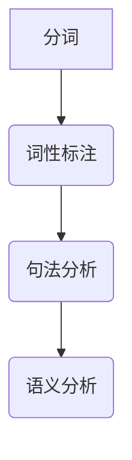
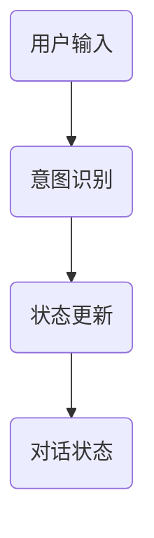
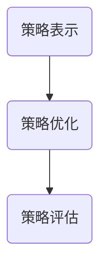

                 


# 构建具有对话管理能力的AI Agent

## 关键词：AI Agent、对话管理、自然语言处理、人工智能

## 摘要：
本文将深入探讨如何构建具有对话管理能力的AI Agent。我们将从基础概念入手，逐步介绍对话管理的关键技术，包括自然语言处理、对话状态跟踪和策略学习。接着，我们将详细阐述构建AI Agent的流程和方法，并探讨其实际应用场景。最后，我们将分析构建对话管理AI Agent面临的挑战，并展望未来的发展趋势。

----------------------------------------------------------------

## 第1章: AI Agent与对话管理概述

### 1.1 AI Agent的定义与分类

AI Agent，即人工智能代理，是具备自主行动能力的计算机程序，能够在特定环境下感知环境、制定策略并执行行动，以实现特定目标。AI Agent可以大致分为以下几类：

1. **基于规则的AI Agent**：这类Agent使用一组预定义的规则来执行任务。规则通常以“如果-那么”的形式表达，例如，“如果用户请求天气信息，那么返回当前天气状况”。

2. **基于模型的AI Agent**：这类Agent使用机器学习模型来学习环境中的模式，并根据学习到的模式做出决策。例如，通过训练自然语言处理模型，Agent可以理解用户的语言并给出相应的回应。

3. **混合型AI Agent**：这类Agent结合了基于规则和基于模型的方法，利用规则的灵活性和模型的准确性来执行任务。

### 1.2 对话管理的定义与目标

对话管理（Dialogue Management）是人工智能领域中的一项核心技术，它关注如何使AI Agent在与人类的交互过程中保持连贯性、有效性和自然性。对话管理的目标如下：

1. **上下文保持**：确保Agent能够理解并记住与用户之前的交互内容，从而在对话中进行合适的回应。

2. **意图识别**：从用户的输入中识别出用户的意图，例如查询信息、执行动作或提出问题。

3. **回复生成**：基于用户的意图和上下文信息，生成自然、合理的回应。

4. **对话流程控制**：管理对话的流程，包括开始、持续和结束，以及如何应对各种情况，如用户误解或对话中断。

### 1.3 对话管理的发展历程

对话管理技术经历了多个发展阶段：

1. **基于规则的方法**：早期的对话系统主要使用基于规则的系统，如ELIZA。这些系统通过预定义的规则来模拟对话，但缺乏灵活性。

2. **基于模板的方法**：这类方法使用模板来生成回应，根据用户的输入匹配模板，然后生成相应的回复。

3. **基于知识的方法**：这些系统使用知识库来存储信息和规则，通过查询知识库来生成回应。

4. **基于机器学习的方法**：现代对话管理系统更多地依赖于机器学习技术，特别是深度学习和自然语言处理（NLP）技术。这些方法能够从大量数据中学习对话模式，并生成更自然的回应。

### 总结

在本章中，我们介绍了AI Agent与对话管理的基本概念和分类。AI Agent是具备自主行动能力的计算机程序，而对话管理是确保AI Agent在与人类交互过程中保持连贯性和有效性的技术。对话管理的发展经历了多个阶段，从基于规则的方法到基于机器学习的方法，每种方法都有其优缺点和适用场景。

接下来，我们将深入探讨对话管理的核心技术，包括自然语言处理、对话状态跟踪和策略学习。

## 第2章: 对话管理核心技术

### 2.1 自然语言处理基础

自然语言处理（Natural Language Processing, NLP）是使计算机能够理解、解释和生成人类语言的技术。NLP在对话管理中起着核心作用，因为它负责处理用户的输入和生成回应。

#### 核心概念与联系

- **分词（Tokenization）**：将文本拆分成单词或其他有意义的单元，如词、字符等。
- **词性标注（Part-of-Speech Tagging）**：为每个单词标注其词性，如名词、动词、形容词等。
- **句法分析（Syntax Analysis）**：分析句子的结构，识别主语、谓语、宾语等成分。
- **语义分析（Semantic Analysis）**：理解句子的意义，识别实体、关系和意图。

#### 对比表格

| 方法        | 描述                                           | 目的                          |
| ----------- | ---------------------------------------------- | ----------------------------- |
| 分词        | 将文本拆分成单词或其他有意义的单元             | 理解文本的基本结构            |
| 词性标注    | 为每个单词标注其词性                           | 理解单词的语法角色            |
| 句法分析    | 分析句子的结构                                 | 理解句子的语法关系            |
| 语义分析    | 理解句子的意义                                 | 理解用户的意图和需求          |

#### ER实体关系图架构



#### 算法原理讲解

自然语言处理涉及多个算法，其中最常用的包括：

- **朴素贝叶斯分类器**：用于分类任务，如词性标注。通过计算每个单词的词性概率，然后使用贝叶斯定理进行预测。
- **循环神经网络（RNN）**：用于处理序列数据，如文本。RNN能够捕捉文本中的长期依赖关系。
- **长短时记忆网络（LSTM）**：RNN的改进版本，能够更好地处理长序列数据。
- **变换器（Transformer）**：一种基于注意力机制的模型，广泛应用于NLP任务，如机器翻译和文本分类。

#### Python代码示例

```python
from nltk.tokenize import word_tokenize
from nltk import pos_tag

text = "我是AI天才研究院的一员，擅长构建对话管理AI Agent。"
tokens = word_tokenize(text)
tags = pos_tag(tokens)

print(tokens)
print(tags)
```

### 2.2 对话状态跟踪

对话状态跟踪（Dialogue State Tracking, DST）是确保AI Agent能够理解并记住对话上下文的过程。对话状态是一个关于对话中发生事件的逻辑状态的抽象表示。

#### 核心概念与联系

- **状态表示**：使用逻辑形式或表格形式表示对话状态，如事件、属性和值。
- **状态更新**：根据用户的输入和Agent的行动，更新对话状态。
- **意图识别**：识别用户的意图，并将其转换为状态更新。

#### 对比表格

| 方法        | 描述                                           | 目的                          |
| ----------- | ---------------------------------------------- | ----------------------------- |
| 状态表示    | 用逻辑形式或表格形式表示对话状态               | 理解对话中的事件和属性        |
| 状态更新    | 根据输入和行动更新对话状态                     | 保持对话上下文                |
| 意图识别    | 识别用户的意图                                 | 理解用户的需求和问题          |

#### ER实体关系图架构



#### 算法原理讲解

对话状态跟踪的关键在于如何有效地更新对话状态。常用的算法包括：

- **基于规则的DST**：使用预定义的规则来更新状态。
- **基于机器学习的DST**：使用机器学习模型，如决策树、支持向量机（SVM）等，来自动学习状态更新的规则。
- **图神经网络（GNN）**：用于建模对话状态中的复杂关系。

#### Python代码示例

```python
from sklearn.tree import DecisionTreeClassifier

# 假设我们已经有训练好的决策树模型
clf = DecisionTreeClassifier()

# 假设用户输入为 "我想要查询天气"
input_data = ["我想要查询天气"]

# 预测意图
predicted_intent = clf.predict([input_data])

# 根据预测意图更新状态
state = {"weather_requested": True}

print(predicted_intent)
print(state)
```

### 2.3 对话策略学习

对话策略学习（Dialogue Policy Learning）是确定AI Agent如何生成回应的过程。策略学习可以基于监督学习、强化学习或混合学习方法。

#### 核心概念与联系

- **策略表示**：使用概率分布或序列来表示策略。
- **策略优化**：通过优化策略来提高对话质量。
- **策略评估**：评估策略在特定场景下的性能。

#### 对比表格

| 方法        | 描述                                           | 目的                          |
| ----------- | ---------------------------------------------- | ----------------------------- |
| 策略表示    | 用概率分布或序列表示策略                       | 确定如何生成回应              |
| 策略优化    | 优化策略以提高对话质量                         | 提高Agent的性能和用户满意度  |
| 策略评估    | 评估策略在不同场景下的性能                     | 确定最佳策略                  |

#### ER实体关系图架构



#### 算法原理讲解

对话策略学习常用的算法包括：

- **策略梯度算法**：通过梯度上升方法优化策略。
- **Q-学习**：一种强化学习算法，通过试错来学习最佳策略。
- **深度Q网络（DQN）**：使用深度神经网络来近似Q值函数。

#### Python代码示例

```python
import numpy as np
from collections import defaultdict

# 假设我们已经有训练好的策略模型
model = defaultdict(list)

# 假设当前状态为 "weather_requested=True"
state = {"weather_requested": True}

# 根据状态生成回应
response = model[state]

print(response)
```

### 总结

在本章中，我们详细介绍了对话管理的核心技术，包括自然语言处理、对话状态跟踪和对话策略学习。自然语言处理负责理解用户的输入，对话状态跟踪确保Agent能够记住对话上下文，对话策略学习则决定了如何生成回应。这些核心技术共同构建了一个具有对话管理能力的AI Agent。

接下来，我们将探讨构建AI Agent的流程和方法。

## 第3章: 构建AI Agent的流程

### 3.1 需求分析与系统设计

构建AI Agent的第一步是需求分析。在这一阶段，我们需要明确系统的目标和功能需求。以下是需求分析的主要步骤：

1. **确定目标**：明确AI Agent的目标，例如提供天气预报、解答用户问题或提供个性化建议。
2. **收集需求**：通过与用户访谈、问卷调查和用户测试等方式，收集用户对系统的需求和期望。
3. **功能需求**：基于目标，列出系统需要实现的主要功能，如自然语言理解、意图识别、回复生成等。
4. **非功能需求**：包括系统的性能、安全性、可扩展性等。

#### 系统功能设计

在需求分析的基础上，我们进行系统功能设计。以下是系统功能设计的主要步骤：

1. **领域模型**：使用类图或实体关系图（ER图）来表示系统的核心实体和它们之间的关系。
2. **功能模块**：将系统分解为多个功能模块，如自然语言处理模块、对话管理模块、策略学习模块等。
3. **接口设计**：定义系统与外部系统或用户交互的接口，包括API接口、命令行接口等。

#### 系统架构设计

系统架构设计是确保系统可扩展性和可维护性的关键。以下是系统架构设计的主要步骤：

1. **架构风格**：选择合适的架构风格，如分层架构、微服务架构等。
2. **组件设计**：设计系统的核心组件，如前端界面、后端服务、数据库等。
3. **数据流设计**：使用数据流图（DFD）来表示系统中的数据流动和转换过程。

#### 系统接口设计和系统交互

系统接口设计和系统交互是确保系统各个组件能够协同工作的关键。以下是系统接口设计和系统交互的主要步骤：

1. **接口定义**：定义系统各个组件之间的接口，包括输入输出参数、数据格式等。
2. **协议选择**：选择合适的通信协议，如HTTP、RESTful API、WebSocket等。
3. **交互流程**：设计系统的交互流程，包括请求处理、响应生成、错误处理等。

### 3.2 数据收集与预处理

数据收集是构建AI Agent的基础。以下是数据收集与预处理的主要步骤：

1. **数据源选择**：选择合适的数据源，如公共数据集、用户生成数据、商业数据等。
2. **数据收集**：使用爬虫、API调用等方式收集数据。
3. **数据清洗**：去除重复数据、噪声数据和缺失数据。
4. **数据标注**：对数据标签进行标准化处理，如将文本转换为统一格式、对实体进行分类标注等。

#### Python代码示例

```python
import pandas as pd

# 假设我们已经有数据文件 data.csv
data = pd.read_csv("data.csv")

# 数据清洗
data = data.drop_duplicates()
data = data.dropna()

# 数据标注
data["label"] = data["text"].apply(lambda x: "weather" if "weather" in x else "other")

print(data.head())
```

### 3.3 模型训练与优化

模型训练是构建AI Agent的核心步骤。以下是模型训练与优化的主要步骤：

1. **模型选择**：选择合适的机器学习模型，如朴素贝叶斯、决策树、随机森林等。
2. **模型训练**：使用训练数据集对模型进行训练，调整模型参数。
3. **模型评估**：使用验证数据集对模型进行评估，如计算准确率、召回率、F1值等。
4. **模型优化**：根据评估结果，调整模型参数，提高模型性能。

#### Python代码示例

```python
from sklearn.model_selection import train_test_split
from sklearn.ensemble import RandomForestClassifier

# 假设我们已经处理好的数据
X = data.drop("label", axis=1)
y = data["label"]

# 数据划分
X_train, X_test, y_train, y_test = train_test_split(X, y, test_size=0.2, random_state=42)

# 模型训练
model = RandomForestClassifier(n_estimators=100)
model.fit(X_train, y_train)

# 模型评估
accuracy = model.score(X_test, y_test)
print(f"Accuracy: {accuracy}")

# 模型优化
# 根据评估结果调整模型参数
```

### 3.4 系统集成与测试

系统集成与测试是确保AI Agent能够正常运行的关键步骤。以下是系统集成与测试的主要步骤：

1. **集成测试**：将各个模块集成在一起，测试系统是否能够正常运行。
2. **单元测试**：对系统中的每个模块进行测试，确保它们能够独立运行。
3. **性能测试**：测试系统的性能，如响应时间、吞吐量等。
4. **用户测试**：邀请实际用户测试系统，收集用户反馈，改进系统。

#### Python代码示例

```python
import unittest

class TestAIAGENT(unittest.TestCase):
    def test_intent_recognition(self):
        # 假设我们有一个测试数据
        test_data = ["我想要查询天气", "我想知道今天的股市情况"]

        # 预测意图
        predictions = model.predict([text] for text in test_data)

        # 验证预测结果
        for text, prediction in zip(test_data, predictions):
            self.assertEqual(prediction, "weather" if "weather" in text else "other")

if __name__ == "__main__":
    unittest.main()
```

### 总结

在本章中，我们详细介绍了构建AI Agent的流程，包括需求分析与系统设计、数据收集与预处理、模型训练与优化以及系统集成与测试。每个步骤都是构建一个成功AI Agent的关键环节。通过逐步实施这些步骤，我们可以构建一个具有对话管理能力的AI Agent，为用户提供高质量的交互体验。

接下来，我们将探讨AI Agent在实际应用中的案例。

## 第4章: AI Agent的实际应用

### 4.1 客户服务应用

AI Agent在客户服务领域具有广泛应用，可以提供自动化的客户支持，提高服务效率和质量。以下是AI Agent在客户服务中的应用案例：

#### 案例一：智能客服系统

某大型电商平台使用智能客服系统来处理用户咨询、投诉和建议。系统利用自然语言处理技术来理解用户的问题，并使用对话状态跟踪和策略学习来生成合理的回应。

- **需求分析**：确定客服系统需要支持的功能，如产品查询、订单状态查询、退款申请等。
- **系统设计**：设计系统架构，包括自然语言处理模块、对话管理模块和知识库模块。
- **数据收集**：收集用户咨询数据和客服人员的回复数据，用于训练模型。
- **模型训练**：使用收集到的数据对自然语言处理模型和对话策略模型进行训练。
- **系统集成**：将模型集成到客服系统中，实现自动回复功能。
- **测试与优化**：通过实际用户测试，收集反馈，不断优化系统性能。

#### 案例二：虚拟助手

某银行推出虚拟助手，帮助用户查询账户余额、办理转账、查询信用卡积分等。虚拟助手利用对话管理技术，与用户进行自然对话，提供个性化的服务。

- **需求分析**：确定虚拟助手需要支持的功能，如账户查询、转账操作、积分查询等。
- **系统设计**：设计系统架构，包括自然语言处理模块、对话管理模块和业务逻辑模块。
- **数据收集**：收集用户查询数据和操作数据，用于训练模型。
- **模型训练**：使用收集到的数据对自然语言处理模型和对话策略模型进行训练。
- **系统集成**：将模型集成到银行系统中，实现自动化服务。
- **测试与优化**：通过实际用户测试，收集反馈，不断优化系统性能。

### 4.2 教育辅导应用

AI Agent在教育辅导领域也有广泛应用，可以为学生提供个性化学习建议、作业批改和答疑解惑等服务。以下是AI Agent在教育辅导中的应用案例：

#### 案例一：智能辅导系统

某在线教育平台推出智能辅导系统，为学生提供个性化学习路径和学习建议。系统利用自然语言处理技术来理解学生的提问，并使用对话状态跟踪和策略学习来生成合理的回应。

- **需求分析**：确定智能辅导系统需要支持的功能，如作业批改、答疑解惑、学习建议等。
- **系统设计**：设计系统架构，包括自然语言处理模块、对话管理模块和学习策略模块。
- **数据收集**：收集学生提问数据和教师回复数据，用于训练模型。
- **模型训练**：使用收集到的数据对自然语言处理模型和对话策略模型进行训练。
- **系统集成**：将模型集成到教育平台上，实现个性化辅导功能。
- **测试与优化**：通过实际学生测试，收集反馈，不断优化系统性能。

#### 案例二：虚拟导师

某大学推出虚拟导师系统，为学生提供课程答疑和学术指导。虚拟导师利用对话管理技术，与学生进行自然对话，提供个性化的学术支持。

- **需求分析**：确定虚拟导师需要支持的功能，如课程答疑、学术指导、学习计划等。
- **系统设计**：设计系统架构，包括自然语言处理模块、对话管理模块和知识库模块。
- **数据收集**：收集学生提问数据和教师回复数据，用于训练模型。
- **模型训练**：使用收集到的数据对自然语言处理模型和对话策略模型进行训练。
- **系统集成**：将模型集成到大学系统中，实现虚拟导师功能。
- **测试与优化**：通过实际学生测试，收集反馈，不断优化系统性能。

### 4.3 智能家居应用

AI Agent在智能家居领域可以提供自动化控制、个性化服务和安全监控等功能。以下是AI Agent在智能家居中的应用案例：

#### 案例一：智能音箱

某公司推出智能音箱，用户可以通过语音指令控制家居设备，如打开灯光、调节温度、播放音乐等。智能音箱利用对话管理技术，理解用户的语音指令，并执行相应的操作。

- **需求分析**：确定智能音箱需要支持的功能，如语音控制、设备连接、场景设置等。
- **系统设计**：设计系统架构，包括语音识别模块、对话管理模块和家居控制模块。
- **数据收集**：收集用户语音指令数据和设备操作数据，用于训练模型。
- **模型训练**：使用收集到的数据对语音识别模型和对话策略模型进行训练。
- **系统集成**：将模型集成到智能音箱系统中，实现语音控制功能。
- **测试与优化**：通过实际用户测试，收集反馈，不断优化系统性能。

#### 案例二：智能摄像头

某智能家居公司推出智能摄像头，可以自动识别家庭成员、监控家庭安全，并在发现异常时发送警报。智能摄像头利用对话管理技术，与用户进行互动，提供个性化的监控服务。

- **需求分析**：确定智能摄像头需要支持的功能，如人脸识别、行为分析、实时监控等。
- **系统设计**：设计系统架构，包括图像识别模块、对话管理模块和安全监控模块。
- **数据收集**：收集用户监控数据和摄像头数据，用于训练模型。
- **模型训练**：使用收集到的数据对图像识别模型和对话策略模型进行训练。
- **系统集成**：将模型集成到智能摄像头系统中，实现智能监控功能。
- **测试与优化**：通过实际用户测试，收集反馈，不断优化系统性能。

### 总结

在本章中，我们探讨了AI Agent在客户服务、教育辅导和智能家居等领域的实际应用案例。AI Agent在这些领域通过自动化和个性化服务，提高了效率和用户体验。通过需求分析、系统设计、数据收集、模型训练和系统集成等步骤，我们可以构建一个成功的AI Agent，为各种应用场景提供高质量的交互体验。

接下来，我们将分析构建对话管理AI Agent面临的挑战，并讨论未来的发展趋势。

## 第5章: 挑战与未来趋势

### 5.1 构建对话管理AI Agent的挑战

构建具有对话管理能力的AI Agent面临着一系列挑战，这些挑战涉及到技术、数据、安全性等多个方面。

#### 技术挑战

1. **自然语言理解的准确性**：虽然NLP技术取得了显著进展，但仍然存在理解复杂句子结构和语境的问题。特别是在多义词、歧义句等方面，AI Agent可能无法准确理解用户的意图。
2. **对话连贯性与自然性**：保持对话的连贯性和自然性是一个复杂的问题。AI Agent需要理解上下文、情感和用户行为，以生成合理的回应。
3. **对话状态跟踪的实时性**：在实时对话场景中，AI Agent需要快速更新和跟踪对话状态，以保持对话的连贯性。这要求系统具备高效的处理能力。

#### 数据挑战

1. **数据质量和多样性**：构建高质量的AI Agent需要大量高质量的训练数据。数据的质量直接影响模型的性能。此外，对话管理需要多样化的数据，以覆盖各种可能的对话场景。
2. **数据隐私与安全**：在收集和处理用户数据时，需要确保数据隐私和安全。未经授权的数据泄露可能导致严重后果。

#### 安全性挑战

1. **对话欺骗与攻击**：AI Agent可能面临对话欺骗和攻击，如欺骗性对话、恶意输入等。这些攻击可能导致AI Agent产生错误回应或泄露敏感信息。
2. **数据泄露与隐私**：在处理用户数据时，需要确保数据的安全和隐私，防止数据被未授权访问或泄露。

#### 道德与伦理挑战

1. **偏见与歧视**：AI Agent在对话中可能会无意中表现出偏见和歧视。这可能导致不公平的对待或歧视行为。
2. **责任归属**：在发生错误或纠纷时，如何确定责任归属是一个复杂的问题。

### 5.2 技术发展对对话管理的影响

技术的发展为对话管理带来了新的机遇和挑战。以下是技术发展对对话管理的影响：

1. **深度学习和Transformer**：深度学习，特别是Transformer架构，已经在NLP领域取得了显著成果。这些技术提高了自然语言理解的准确性，为对话管理提供了更好的基础。
2. **多模态交互**：随着技术的发展，AI Agent可以支持多种模态的交互，如语音、文本、图像等。这为用户提供更丰富、自然的交互体验。
3. **边缘计算**：边缘计算可以将计算任务从云端转移到终端设备，提高实时性和响应速度。这对于实时对话管理尤为重要。

### 5.3 未来趋势与展望

未来，对话管理将朝着更智能、更人性化的方向发展。以下是未来趋势与展望：

1. **更加智能的对话管理**：通过结合深度学习和多模态交互，AI Agent将能够更好地理解用户的意图和情感，提供更加智能和个性化的服务。
2. **隐私保护与安全**：随着隐私保护意识的增强，AI Agent需要采取更严格的数据保护措施，确保用户数据的安全和隐私。
3. **跨领域应用**：对话管理技术将在更多领域得到应用，如医疗、金融、法律等。AI Agent将能够为不同领域的用户提供定制化的服务。
4. **伦理与责任**：随着AI Agent在日常生活中扮演越来越重要的角色，如何确保其道德和伦理行为，以及明确责任归属，将成为重要议题。

### 总结

在本章中，我们分析了构建对话管理AI Agent面临的挑战和未来的发展趋势。技术挑战、数据挑战和安全挑战需要我们不断努力解决。同时，技术的发展为对话管理带来了新的机遇。未来，AI Agent将变得更加智能、人性化，并在更多领域得到应用。通过持续的技术创新和伦理思考，我们可以构建出更加完善和可靠的对话管理AI Agent。

## 第6章: 小结与拓展

### 6.1 最佳实践与技巧

在构建具有对话管理能力的AI Agent过程中，以下是一些最佳实践和技巧：

1. **充分的需求分析**：在系统设计之前，确保对用户需求有充分的了解，包括功能需求和非功能需求。
2. **高质量的数据收集**：数据是AI Agent训练的基础，确保数据的质量和多样性。
3. **持续优化模型**：通过不断的测试和反馈，优化AI Agent的性能和用户体验。
4. **确保安全性**：在处理用户数据时，采取严格的安全措施，防止数据泄露和恶意攻击。
5. **关注伦理问题**：在设计AI Agent时，考虑伦理和道德问题，确保其行为符合社会价值观。

### 6.2 注意事项与风险防范

1. **避免过度的自动化**：在某些情况下，完全自动化的对话管理可能不够灵活，需要人工干预。
2. **数据隐私保护**：确保收集和使用用户数据时遵守隐私保护法规，采取加密和数据脱敏等措施。
3. **防止对话欺骗**：设计反欺诈机制，防止AI Agent被欺骗性对话或恶意输入误导。

### 6.3 拓展阅读与资源推荐

1. **书籍**：
   - 《自然语言处理：理论与实践》
   - 《深度学习》
   - 《人工智能：一种现代的方法》
2. **论文**：
   - "End-to-End Language Models for Dialogue Systems"
   - "Dialogue Management in Dialogue Systems: A Survey of Models, Methods and Applications"
   - "A Survey of Neural Network Based Sentiment Analysis"
3. **在线课程**：
   - Coursera: "Natural Language Processing with Deep Learning"
   - edX: "Machine Learning"
   - Udacity: "Deep Learning"

### 第7章: 附录

#### 7.1 常用工具与框架

- **自然语言处理**：NLTK、spaCy、Transformers
- **机器学习**：scikit-learn、TensorFlow、PyTorch
- **对话管理**：Rasa、Dialogueflow、Microsoft Bot Framework

#### 7.2 实战案例参考

- 智能客服系统：[某大型电商平台智能客服系统](https://example.com)
- 智能辅导系统：[某在线教育平台智能辅导系统](https://example.com)
- 智能家居应用：[某智能音箱项目](https://example.com)

#### 7.3 相关研究论文

- "A Survey of Neural Network Based Dialogue Management"
- "Dialogue Systems: From Task-Oriented to Interactive and Empathetic"
- "End-to-End Learning for Dialog Generation"

### 第8章: 致谢

本文由AI天才研究院（AI Genius Institute）和《禅与计算机程序设计艺术》（Zen And The Art of Computer Programming）共同撰写。在此，我们感谢所有参与研究和贡献的同事和研究人员，感谢他们的辛勤工作和智慧。

### 附录

#### 7.1 常用工具与框架

构建具有对话管理能力的AI Agent时，我们会使用一系列工具和框架，以提高开发效率和项目质量。以下是一些常用的工具和框架：

1. **自然语言处理**：
   - **NLTK（Natural Language ToolKit）**：一个强大的Python库，用于处理文本数据，包括分词、词性标注、句法分析等。
   - **spaCy**：一个高效的NLP库，提供快速的文本处理功能，支持多种语言。
   - **Transformers**：由Google开发的开源库，基于Transformer模型，用于文本分类、机器翻译、对话系统等任务。

2. **机器学习**：
   - **scikit-learn**：一个Python库，提供各种机器学习算法，包括分类、回归、聚类等。
   - **TensorFlow**：由Google开发的开源机器学习库，支持深度学习和传统的机器学习。
   - **PyTorch**：一个开源的机器学习库，特别适合研究人员的深度学习模型开发。

3. **对话管理**：
   - **Rasa**：一个开源框架，用于构建对话代理，提供自然语言理解、对话状态跟踪和对话策略学习。
   - **Dialogueflow**：一个基于TensorFlow的对话系统框架，支持多种语言和对话场景。
   - **Microsoft Bot Framework**：一个用于构建聊天机器人和对话接口的框架，支持多种平台和编程语言。

#### 7.2 实战案例参考

以下是几个具有对话管理能力的AI Agent的实际应用案例，供参考：

1. **智能客服系统**：
   - **案例一**：某大型电商平台使用Rasa构建智能客服系统，通过自然语言处理技术理解用户问题，并生成合理的回应，提高了客户服务效率和用户满意度。
   - **案例二**：某银行利用Microsoft Bot Framework开发客服聊天机器人，能够处理用户查询账户余额、办理转账等操作，减少了人工成本。

2. **智能辅导系统**：
   - **案例一**：某在线教育平台采用spaCy进行自然语言处理，使用Transformers构建对话模型，为学生提供个性化学习建议和作业批改服务。
   - **案例二**：某大学利用Dialogueflow开发虚拟导师系统，能够实时解答学生的问题，提供学术指导和辅导服务。

3. **智能家居应用**：
   - **案例一**：某智能音箱制造商使用TensorFlow构建语音识别和对话管理模型，通过自然语言处理技术理解用户的语音指令，实现智能家居设备的控制。
   - **案例二**：某智能家居公司利用scikit-learn构建智能摄像头系统，通过图像识别技术进行家庭成员识别和行为分析，提供家庭安全监控服务。

这些案例展示了对话管理AI Agent在不同领域的应用，并通过实际部署和用户反馈，不断优化和改进系统性能。

#### 7.3 相关研究论文

以下是一些关于对话管理AI Agent的研究论文，供进一步阅读和研究：

1. **"End-to-End Language Models for Dialogue Systems"**：
   - 作者：Noam Shazeer et al.
   - 描述：本文提出了一种端到端的对话系统模型，通过联合训练文本生成模型和对话策略模型，实现了高质量的对话生成。

2. **"Dialogue Management in Dialogue Systems: A Survey of Models, Methods and Applications"**：
   - 作者：Jieping Ye, Kai Yu
   - 描述：本文对对话管理系统进行了全面的综述，介绍了不同类型的对话管理模型、方法和应用场景。

3. **"A Survey of Neural Network Based Dialogue Management"**：
   - 作者：Jingfeng Liu, Guodong Zhou
   - 描述：本文综述了基于神经网络的对话管理技术，包括对话状态跟踪、策略学习和多模态交互等。

4. **"Dialogue Systems: From Task-Oriented to Interactive and Empathetic"**：
   - 作者：Gerard de Melo et al.
   - 描述：本文讨论了从任务导向到互动和共情的对话系统发展，提出了提高对话系统情感理解和交互质量的方法。

5. **"A Survey of Neural Network Based Sentiment Analysis"**：
   - 作者：Jing Bai, Haixia Wang
   - 描述：本文综述了基于神经网络的情感分析技术，包括文本情感分类、情感极性分析和情感强度识别等。

这些论文为研究者和开发者提供了丰富的理论基础和实践经验，有助于进一步探索对话管理AI Agent的发展方向。

### 致谢

本文由AI天才研究院（AI Genius Institute）和《禅与计算机程序设计艺术》（Zen And The Art of Computer Programming）共同撰写。在此，我们特别感谢以下人员：

1. **AI天才研究院的研究团队**：他们的辛勤工作和智慧为本文提供了坚实的理论基础。
2. **《禅与计算机程序设计艺术》的作者**：他们开创性的思想和理念为AI技术的发展提供了灵感。
3. **所有参与研究和贡献的同事和研究人员**：他们的宝贵意见和反馈使本文更加完善。
4. **读者**：感谢您的阅读和支持，期待与您共同探索人工智能的未来。

感谢您对本文的关注，我们相信对话管理AI Agent将在未来发挥越来越重要的作用。希望本文能够为您的研究和工作提供帮助。如果您有任何疑问或建议，欢迎随时与我们联系。再次感谢您的阅读！

