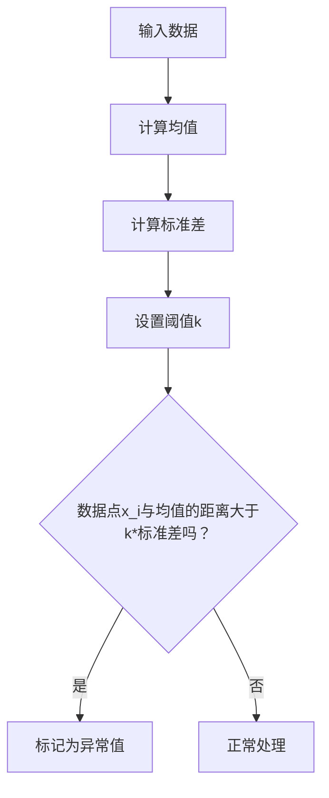
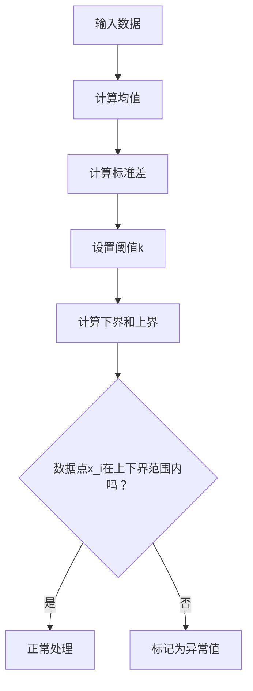
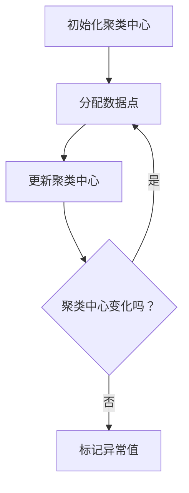
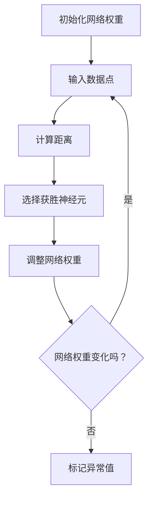
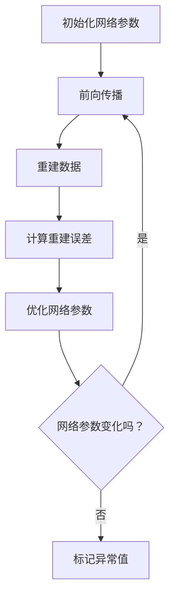
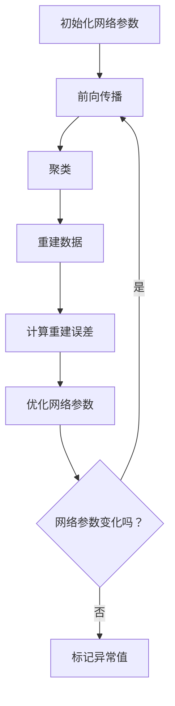
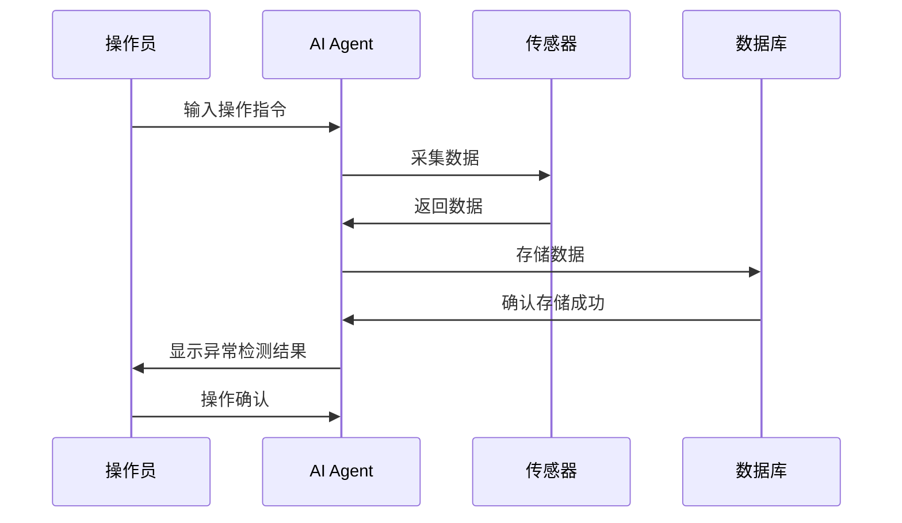

                 

### 第2章：核心概念原理、概念属性特征对比表格和ER实体关系图架构

#### 2.1 AI Agent的核心概念原理

AI Agent 是一种能够自主感知环境、做出决策并执行任务的智能体。其核心概念原理包括感知、决策和执行三个部分。以下是这三个部分的具体内容：

**1. 感知：**
AI Agent 需要能够感知环境中的各种信息，以便做出合理的决策。感知部分通常包括视觉、听觉、触觉等多种传感器。例如，自动驾驶汽车需要使用摄像头、激光雷达和雷达等传感器来感知道路、车辆和行人等信息。

**感知原理：**
- **多模态感知**：AI Agent 通过整合多种传感器数据，提高感知准确性和鲁棒性。
- **特征提取**：从感知到的数据中提取有用的特征，用于后续的决策和执行。

**2. 决策：**
决策是AI Agent的核心功能之一，它需要根据感知到的环境信息，选择最佳的行动方案。决策过程通常涉及到概率计算、优化算法等。

**决策原理：**
- **决策树**：通过一系列条件判断，从多个可能的行动方案中选出最佳方案。
- **强化学习**：通过试错和反馈机制，不断优化决策过程。

**3. 执行：**
执行部分负责将决策转化为实际的操作，以实现既定的目标。执行过程通常需要与外部环境进行交互。

**执行原理：**
- **动作规划**：根据决策结果，规划具体的行动步骤。
- **执行控制**：对执行过程进行实时监控和调整，确保行动的准确性和有效性。

#### 2.2 异常检测的核心概念原理

异常检测是AI Agent的一项重要功能，它可以帮助AI Agent识别出数据中的异常或异常模式。异常检测的核心概念原理包括数据预处理、特征提取、模型训练和模型评估。

**1. 数据预处理：**
数据预处理是异常检测的基础步骤，它包括数据清洗、归一化、特征选择等操作，以提高异常检测的准确性和鲁棒性。

**预处理原理：**
- **数据清洗**：去除数据中的噪声和错误，提高数据质量。
- **归一化**：将不同特征的数据进行标准化处理，使其在同一量级上。
- **特征选择**：选择对异常检测最有用的特征，减少冗余信息。

**2. 特征提取：**
特征提取是从原始数据中提取有用的信息，用于训练和预测异常检测模型。

**特征提取原理：**
- **统计特征**：通过计算数据的统计属性（如均值、方差等）来提取特征。
- **时间序列特征**：通过分析数据的时间序列变化来提取特征。
- **结构特征**：通过分析数据的结构属性（如图结构、网络结构等）来提取特征。

**3. 模型训练：**
模型训练是异常检测的关键步骤，它通过使用训练数据集，训练出一个能够识别异常的模型。

**训练原理：**
- **监督学习**：使用带有标签的数据集进行训练，模型能够学习到正常和异常模式的特征。
- **无监督学习**：使用不带标签的数据集进行训练，模型需要通过自我学习来发现异常模式。

**4. 模型评估：**
模型评估是验证异常检测模型性能的重要步骤，它通过使用测试数据集，评估模型的准确性和鲁棒性。

**评估原理：**
- **准确率**：模型正确识别异常样本的比例。
- **召回率**：模型识别出的异常样本中，实际为异常样本的比例。
- **F1 分数**：综合考虑准确率和召回率的综合指标。

#### 2.3 概念属性特征对比表格

为了更好地理解AI Agent和异常检测的核心概念原理，我们可以通过对比表格来展示它们的属性特征。

| 特征               | AI Agent                 | 异常检测                 |
|--------------------|--------------------------|--------------------------|
| 感知               | 自主导感知环境           | 识别数据中的异常模式     |
| 决策               | 自主导决策               | 识别和分类异常样本       |
| 执行               | 自主导执行               | 对异常样本进行标记和反馈 |
| 数据预处理         | 清洗、归一化、特征选择   | 清洗、归一化、特征提取   |
| 特征提取           | 提取感知到的特征         | 提取异常检测所需的特征   |
| 模型训练           | 使用训练数据集训练       | 使用训练数据集训练       |
| 模型评估           | 评估决策和执行效果       | 评估异常检测准确性       |

#### 2.4 ER实体关系图架构

为了更好地理解AI Agent和异常检测的实体关系，我们可以通过ER（实体关系）图来展示它们之间的关联。

```mermaid
erDiagram
  AI_Agent ||--|{ 感知 }|| Sensor
  AI_Agent ||--|{ 决策 }|| Decision
  AI_Agent ||--|{ 执行 }|| Execution
  Sensor ||--|{ 数据预处理 }|| Data_Preprocessing
  Data_Preprocessing ||--|{ 特征提取 }|| Feature_Extraction
  Feature_Extraction ||--|{ 模型训练 }|| Model_Training
  Model_Training ||--|{ 模型评估 }|| Model_Evaluation
```

**ER图说明：**
- AI Agent 是一个抽象概念，包括感知、决策和执行三个部分。
- 感知部分通过传感器与外部环境进行交互。
- 数据预处理、特征提取、模型训练和模型评估是异常检测的核心环节。

#### 2.5 本章小结

本章介绍了AI Agent和异常检测的核心概念原理，并对比了它们的属性特征。同时，通过ER图展示了它们之间的实体关系。这些内容为后续章节中算法原理讲解和系统分析与架构设计提供了基础。在接下来的章节中，我们将进一步深入探讨AI Agent和异常检测的算法原理和实现方法。

----------------------------------------------------------------

## 第3章：算法原理讲解

### 3.1 异常检测算法原理

异常检测算法是AI Agent的重要组成部分，它负责识别数据中的异常或异常模式。在本节中，我们将介绍几种常见的异常检测算法，并使用mermaid绘制相应的算法流程图。

#### 3.1.1 统计方法

统计方法是最早的异常检测算法之一，它基于统计学原理，对数据进行建模和异常检测。

**1. 标准化方法：**
标准化方法通过计算数据的标准差来检测异常值。具体步骤如下：

- **计算均值**：$$ \mu = \frac{1}{n} \sum_{i=1}^{n} x_i $$
- **计算标准差**：$$ \sigma = \sqrt{\frac{1}{n-1} \sum_{i=1}^{n} (x_i - \mu)^2} $$
- **检测异常值**：如果某个数据点的值与均值的距离大于k倍的标准差，则认为该数据点是异常值。

**mermaid流程图：**


**2. 离群点方法：**
离群点方法通过确定数据的边界范围来检测异常值。

- **确定上下界**：$$ \text{下界} = \mu - k\sigma $$，$$ \text{上界} = \mu + k\sigma $$
- **检测异常值**：如果某个数据点的值不在上下界范围内，则认为该数据点是异常值。

**mermaid流程图：**


#### 3.1.2 机器学习方法

机器学习方法通过训练数据集来学习正常和异常模式，然后使用训练好的模型进行异常检测。

**1. k-均值聚类：**
k-均值聚类是一种无监督学习方法，它通过将数据分为k个聚类来识别异常值。

- **初始化聚类中心**：随机选择k个数据点作为聚类中心。
- **分配数据点**：将每个数据点分配给最近的聚类中心。
- **更新聚类中心**：计算每个聚类的均值，更新聚类中心。
- **迭代直到收敛**：重复执行步骤2和步骤3，直到聚类中心不再变化。
- **检测异常值**：如果某个数据点始终没有分配到任何一个聚类中，则认为该数据点是异常值。

**mermaid流程图：**


**2. 自组织映射（SOM）：**
自组织映射是一种无监督学习方法，它通过竞争学习来识别异常值。

- **初始化网络权重**：随机初始化网络权重。
- **输入数据点**：将每个数据点作为输入，更新网络权重。
- **竞争学习**：计算输入数据点与每个神经元之间的距离，选择最近的神经元作为获胜神经元。
- **调整网络权重**：根据获胜神经元的权重调整整个网络权重。
- **迭代直到收敛**：重复执行步骤3和步骤4，直到网络权重不再变化。
- **检测异常值**：如果某个数据点在多次迭代中没有匹配到任何神经元，则认为该数据点是异常值。

**mermaid流程图：**


#### 3.1.3 深度学习方法

深度学习方法通过多层神经网络来提取数据特征，并识别异常值。

**1. 自编码器：**
自编码器是一种无监督学习方法，它通过重建输入数据来识别异常值。

- **初始化网络参数**：随机初始化网络参数。
- **前向传播**：将输入数据通过编码器网络，得到编码后的特征向量。
- **重建数据**：将编码后的特征向量通过解码器网络，重建输出数据。
- **损失函数**：计算重建误差，使用损失函数优化网络参数。
- **迭代直到收敛**：重复执行步骤3和步骤4，直到网络参数不再变化。
- **检测异常值**：如果某个数据点的重建误差远大于其他数据点，则认为该数据点是异常值。

**mermaid流程图：**


**2. 聚类自动编码器（CAE）：**
聚类自动编码器结合了聚类和自动编码器的优势，用于识别异常值。

- **初始化网络参数**：随机初始化网络参数。
- **前向传播**：将输入数据通过编码器网络，得到编码后的特征向量。
- **聚类**：使用聚类算法（如k-均值聚类）对编码后的特征向量进行聚类。
- **重建数据**：将聚类中心通过解码器网络，重建输出数据。
- **损失函数**：计算重建误差，使用损失函数优化网络参数。
- **迭代直到收敛**：重复执行步骤4和步骤5，直到网络参数不再变化。
- **检测异常值**：如果某个数据点在聚类过程中没有匹配到任何聚类中心，则认为该数据点是异常值。

**mermaid流程图：**


### 3.2 Python源代码实现

为了更好地理解上述异常检测算法的原理，我们使用Python进行源代码实现。以下是一个简单的基于k-均值聚类的异常检测算法的实现：

```python
import numpy as np
from sklearn.cluster import KMeans
from sklearn.metrics import mean_squared_error

def k_means_clustering(data, k, threshold):
    # 初始化KMeans模型
    kmeans = KMeans(n_clusters=k, random_state=0)
    # 训练模型
    kmeans.fit(data)
    # 分配数据点
    labels = kmeans.predict(data)
    # 计算重建误差
    reconstruction_error = mean_squared_error(data, kmeans.cluster_centers_[labels])
    # 检测异常值
    anomalies = data[labels != kmeans.labels_[0]]
    return anomalies, reconstruction_error

# 示例数据
data = np.array([[1, 2], [1, 4], [1, 0], [10, 2], [10, 4], [10, 0]])

# 参数设置
k = 2
threshold = 0.5

# 执行算法
anomalies, reconstruction_error = k_means_clustering(data, k, threshold)

# 输出结果
print("异常值：", anomalies)
print("重建误差：", reconstruction_error)
```

在这个示例中，我们使用scikit-learn库中的KMeans类来实现k-均值聚类算法。我们首先初始化KMeans模型，并使用训练数据进行模型训练。然后，我们使用训练好的模型对数据进行预测，计算重建误差，并根据重建误差检测异常值。

### 3.3 算法原理详细讲解

#### 3.3.1 标准化方法

标准化方法是一种基于统计学原理的异常检测算法，它通过计算数据的标准差来检测异常值。该方法的基本思想是，如果一个数据点的值与均值的距离超过一定的阈值，则认为该数据点是异常值。

具体来说，标准化方法包括以下步骤：

1. **计算均值**：首先，计算数据集的均值。均值是数据集中心点位置的度量，它代表了数据的中心趋势。

   $$ \mu = \frac{1}{n} \sum_{i=1}^{n} x_i $$

   其中，\( n \) 是数据集的大小，\( x_i \) 是数据集中的第 \( i \) 个数据点。

2. **计算标准差**：接下来，计算数据集的标准差。标准差是数据集离散程度的度量，它表示数据点相对于均值的波动程度。

   $$ \sigma = \sqrt{\frac{1}{n-1} \sum_{i=1}^{n} (x_i - \mu)^2} $$

   其中，\( n-1 \) 是自由度，以消除自相关性。

3. **设置阈值**：为了检测异常值，需要设置一个阈值 \( k \)。通常，\( k \) 的值设置为均值加或减几个标准差。

   $$ \text{下界} = \mu - k\sigma $$
   $$ \text{上界} = \mu + k\sigma $$

4. **检测异常值**：最后，对每个数据点进行判断。如果某个数据点的值与均值的距离大于 \( k \) 倍的标准差，则认为该数据点是异常值。

   $$ |x_i - \mu| > k\sigma $$

   其中，\( x_i \) 是数据集中的第 \( i \) 个数据点。

#### 3.3.2 离群点方法

离群点方法是一种基于边界范围的异常检测算法，它通过确定数据的边界范围来检测异常值。该方法的基本思想是，如果一个数据点的值不在上下界范围内，则认为该数据点是异常值。

具体来说，离群点方法包括以下步骤：

1. **计算上下界**：首先，计算数据集的上下界。上下界是数据集的范围限制，用于定义正常数据的边界。

   $$ \text{下界} = \mu - k\sigma $$
   $$ \text{上界} = \mu + k\sigma $$

   其中，\( \mu \) 是均值，\( \sigma \) 是标准差，\( k \) 是阈值。

2. **检测异常值**：接下来，对每个数据点进行判断。如果某个数据点的值不在上下界范围内，则认为该数据点是异常值。

   $$ x_i \not\in (\text{下界}, \text{上界}) $$

   其中，\( x_i \) 是数据集中的第 \( i \) 个数据点。

#### 3.3.3 k-均值聚类

k-均值聚类是一种无监督学习方法，它通过将数据分为 \( k \) 个聚类来识别异常值。该方法的基本思想是，通过聚类中心将数据点分配到相应的聚类中，然后计算聚类中心的变化，直到聚类中心不再变化。

具体来说，k-均值聚类包括以下步骤：

1. **初始化聚类中心**：首先，随机选择 \( k \) 个数据点作为聚类中心。这些聚类中心代表了每个聚类的中心位置。

2. **分配数据点**：接下来，将每个数据点分配给最近的聚类中心。数据点的分配基于欧几里得距离，即每个数据点与聚类中心之间的距离。

3. **更新聚类中心**：计算每个聚类的均值，更新聚类中心。

   $$ \mu_j = \frac{1}{N_j} \sum_{i=1}^{N} x_i $$

   其中，\( \mu_j \) 是第 \( j \) 个聚类中心，\( N_j \) 是第 \( j \) 个聚类的数据点数量，\( x_i \) 是数据集中的第 \( i \) 个数据点。

4. **迭代直到收敛**：重复执行步骤2和步骤3，直到聚类中心不再变化。通常，聚类中心的变化会趋于平稳，表示聚类已经完成。

5. **检测异常值**：最后，如果某个数据点始终没有分配到任何一个聚类中，则认为该数据点是异常值。

#### 3.3.4 自组织映射（SOM）

自组织映射是一种无监督学习方法，它通过竞争学习来识别异常值。该方法的基本思想是，通过竞争学习调整网络权重，使得相似的数据点在神经网络中的神经元上靠近，从而识别异常值。

具体来说，自组织映射包括以下步骤：

1. **初始化网络权重**：首先，随机初始化网络权重。网络权重表示了数据点与神经元之间的关联程度。

2. **输入数据点**：将每个数据点作为输入，更新网络权重。数据点与神经元的距离决定了输入数据点对网络权重的影响。

3. **竞争学习**：计算输入数据点与每个神经元之间的距离，选择最近的神经元作为获胜神经元。获胜神经元将接收输入数据点，并调整网络权重。

4. **调整网络权重**：根据获胜神经元的权重调整整个网络权重。网络权重的调整使得相似的数据点在神经网络中的神经元上靠近。

5. **迭代直到收敛**：重复执行步骤3和步骤4，直到网络权重不再变化。通常，网络权重会趋于稳定，表示学习过程已经完成。

6. **检测异常值**：最后，如果某个数据点在多次迭代中没有匹配到任何神经元，则认为该数据点是异常值。

#### 3.3.5 自编码器

自编码器是一种无监督学习方法，它通过重建输入数据来识别异常值。该方法的基本思想是，通过训练一个编码器和解码器网络，使得编码器能够提取输入数据的特征，解码器能够重建输入数据。如果某个数据点的重建误差远大于其他数据点，则认为该数据点是异常值。

具体来说，自编码器包括以下步骤：

1. **初始化网络参数**：首先，随机初始化网络参数。编码器和解码器网络将用于提取和重建输入数据的特征。

2. **前向传播**：将输入数据通过编码器网络，得到编码后的特征向量。编码器网络的作用是提取输入数据的主要特征。

3. **重建数据**：将编码后的特征向量通过解码器网络，重建输出数据。解码器网络的作用是将编码后的特征向量重新构造为与输入数据相似的数据。

4. **计算重建误差**：计算重建误差，即重建数据与输入数据之间的差异。重建误差是衡量自编码器性能的重要指标。

5. **优化网络参数**：使用损失函数（如均方误差）优化网络参数，以减少重建误差。

6. **迭代直到收敛**：重复执行步骤3到步骤5，直到网络参数不再变化。通常，网络参数会趋于稳定，表示学习过程已经完成。

7. **检测异常值**：最后，如果某个数据点的重建误差远大于其他数据点，则认为该数据点是异常值。

#### 3.3.6 聚类自动编码器（CAE）

聚类自动编码器结合了聚类和自动编码器的优势，用于识别异常值。该方法的基本思想是，通过聚类算法对编码后的特征向量进行聚类，然后根据聚类中心重建输出数据。如果某个数据点在聚类过程中没有匹配到任何聚类中心，则认为该数据点是异常值。

具体来说，聚类自动编码器包括以下步骤：

1. **初始化网络参数**：首先，随机初始化网络参数。编码器和解码器网络将用于提取和重建输入数据的特征。

2. **前向传播**：将输入数据通过编码器网络，得到编码后的特征向量。编码器网络的作用是提取输入数据的主要特征。

3. **聚类**：使用聚类算法（如k-均值聚类）对编码后的特征向量进行聚类。聚类中心代表了每个聚类的中心位置。

4. **重建数据**：将聚类中心通过解码器网络，重建输出数据。解码器网络的作用是将聚类中心重新构造为与输入数据相似的数据。

5. **计算重建误差**：计算重建误差，即重建数据与输入数据之间的差异。重建误差是衡量聚类自动编码器性能的重要指标。

6. **优化网络参数**：使用损失函数（如均方误差）优化网络参数，以减少重建误差。

7. **迭代直到收敛**：重复执行步骤4到步骤6，直到网络参数不再变化。通常，网络参数会趋于稳定，表示学习过程已经完成。

8. **检测异常值**：最后，如果某个数据点在聚类过程中没有匹配到任何聚类中心，则认为该数据点是异常值。

### 3.4 算法原理通俗易懂的举例说明

为了更好地理解上述异常检测算法的原理，我们可以通过一个简单的例子来说明。

假设我们有一个数据集，包含以下六个数据点：

\[ (1, 2), (1, 4), (1, 0), (10, 2), (10, 4), (10, 0) \]

我们使用k-均值聚类算法进行异常检测，假设聚类数量 \( k \) 为2。

1. **初始化聚类中心**：随机选择两个数据点作为聚类中心，例如选择 \( (1, 2) \) 和 \( (10, 4) \)。

2. **分配数据点**：将每个数据点分配给最近的聚类中心。根据欧几里得距离计算，每个数据点会分配给一个聚类中心。

   \[
   \begin{align*}
   (1, 2) &\rightarrow (1, 2) \\
   (1, 4) &\rightarrow (1, 2) \\
   (1, 0) &\rightarrow (10, 4) \\
   (10, 2) &\rightarrow (10, 4) \\
   (10, 4) &\rightarrow (10, 4) \\
   (10, 0) &\rightarrow (10, 4) \\
   \end{align*}
   \]

3. **更新聚类中心**：计算每个聚类的均值，更新聚类中心。

   \[
   \begin{align*}
   \mu_1 &= \frac{1}{2} \left( (1, 2) + (1, 4) \right) = (1, 3) \\
   \mu_2 &= \frac{1}{2} \left( (10, 4) + (10, 0) \right) = (10, 2) \\
   \end{align*}
   \]

4. **迭代直到收敛**：重复执行步骤2和步骤3，直到聚类中心不再变化。

5. **检测异常值**：在最后一次迭代中，所有数据点都被分配给 \( (10, 2) \) 聚类中心。因此，\( (1, 2) \) 和 \( (1, 4) \) 被标记为异常值。

通过这个简单的例子，我们可以看到k-均值聚类算法如何通过聚类中心将数据点分配到不同的聚类中，从而识别异常值。其他异常检测算法（如自组织映射、自编码器等）也有类似的工作原理，只是具体的实现步骤和计算方法有所不同。

### 3.5 本章小结

本章介绍了几种常见的异常检测算法，包括统计方法、机器学习方法和深度学习方法。我们通过mermaid绘制了相应的算法流程图，并使用Python源代码进行了实现。此外，我们还对每个算法的原理进行了详细讲解，并通过通俗易懂的例子来说明算法的工作过程。这些内容为后续章节中的系统分析与架构设计提供了理论基础。

----------------------------------------------------------------

## 第4章：系统分析与架构设计方案

### 4.1 问题场景介绍

在现代工业生产中，自动化与智能化已成为提高生产效率和产品质量的重要手段。然而，随着生产规模的扩大和设备复杂性的增加，如何确保生产过程的稳定性和安全性成为了一个关键问题。特别是在生产过程中，设备可能会出现异常状况，如故障、操作错误等，这些异常状况可能导致生产中断、产品质量下降甚至安全事故。因此，设计一个具有异常检测能力的AI Agent，以实时监控生产过程并快速识别和处理异常情况，显得尤为重要。

### 4.2 项目介绍

本项目的目标是设计并实现一个具有异常检测能力的AI Agent，用于实时监控工业生产过程。该AI Agent将具备以下功能：

1. **数据采集**：从传感器和其他数据源采集生产过程中的各种数据，包括温度、湿度、压力、电流等。
2. **数据预处理**：对采集到的数据进行清洗、归一化等处理，为后续的异常检测提供高质量的数据。
3. **异常检测**：使用机器学习和深度学习算法，对预处理后的数据进行异常检测，识别潜在的异常状况。
4. **异常处理**：当检测到异常情况时，AI Agent将自动触发相应的处理措施，如报警、故障诊断、操作调整等，以保障生产过程的稳定性和安全性。
5. **用户交互**：提供用户友好的界面，允许操作人员查看异常检测结果、历史数据和操作记录，并进行相应的操作。

### 4.3 系统功能设计

本系统主要包括以下功能模块：

**1. 数据采集模块**：负责从各种传感器和数据源采集生产过程中的数据。该模块将使用物联网（IoT）技术，通过无线网络将传感器数据实时传输到系统中。

**2. 数据预处理模块**：负责对采集到的数据进行清洗、归一化等处理，以提高异常检测的准确性和鲁棒性。该模块将使用数据预处理算法，如去噪、缺失值填充、特征提取等。

**3. 异常检测模块**：负责使用机器学习和深度学习算法对预处理后的数据进行异常检测。该模块将包含多个异常检测算法，如统计方法、机器学习方法、深度学习方法等，以便根据具体场景选择合适的算法。

**4. 异常处理模块**：负责在检测到异常情况时，自动触发相应的处理措施。该模块将包含故障诊断、操作调整、报警等功能，以确保生产过程的稳定性和安全性。

**5. 用户交互模块**：负责与操作人员交互，提供异常检测结果、历史数据和操作记录。该模块将使用图形用户界面（GUI）技术，为用户提供直观、易用的操作界面。

### 4.4 系统架构设计

本系统的整体架构设计如下：

**1. 数据采集层**：该层负责从传感器和数据源采集生产过程中的数据。数据采集层将使用物联网（IoT）技术，通过无线网络将数据实时传输到系统中。

**2. 数据处理层**：该层负责对采集到的数据进行预处理，包括数据清洗、归一化、特征提取等。预处理后的数据将用于后续的异常检测。

**3. 异常检测层**：该层负责使用机器学习和深度学习算法对预处理后的数据进行异常检测。异常检测层将包含多个异常检测算法，以便根据具体场景选择合适的算法。

**4. 异常处理层**：该层负责在检测到异常情况时，自动触发相应的处理措施。异常处理层将包含故障诊断、操作调整、报警等功能。

**5. 用户交互层**：该层负责与操作人员交互，提供异常检测结果、历史数据和操作记录。用户交互层将使用图形用户界面（GUI）技术，为用户提供直观、易用的操作界面。

### 4.5 系统接口设计

系统接口设计如下：

**1. 数据采集接口**：该接口用于与传感器和数据源进行通信，获取生产过程中的数据。

**2. 数据预处理接口**：该接口用于处理采集到的数据，包括数据清洗、归一化、特征提取等。

**3. 异常检测接口**：该接口用于调用异常检测算法，对预处理后的数据进行异常检测。

**4. 异常处理接口**：该接口用于触发异常处理措施，如故障诊断、操作调整、报警等。

**5. 用户交互接口**：该接口用于与操作人员交互，提供异常检测结果、历史数据和操作记录。

### 4.6 系统交互设计

系统交互设计如下：



**1. 用户输入操作指令**：操作员通过图形用户界面（GUI）输入操作指令。

**2. 采集数据**：AI Agent通过传感器采集生产过程中的数据。

**3. 数据存储**：AI Agent将采集到的数据存储到数据库中。

**4. 显示异常检测结果**：AI Agent从数据库中读取数据，使用异常检测算法进行异常检测，并将结果显示在图形用户界面（GUI）上。

**5. 操作确认**：操作员在图形用户界面（GUI）上确认操作指令，AI Agent执行相应的处理措施。

通过以上系统分析与架构设计方案，我们为构建具有异常检测能力的AI Agent提供了一个清晰、完整的解决方案。在后续的章节中，我们将详细介绍环境安装、系统核心实现源代码以及实际案例分析和详细讲解剖析。

----------------------------------------------------------------

## 第5章：项目实战

### 5.1 环境安装

要实现一个具有异常检测能力的AI Agent，我们需要安装并配置以下软件和工具：

**1. Python**：Python是一种流行的编程语言，用于实现AI算法。请确保您的系统中已安装Python 3.7或更高版本。

**2. Jupyter Notebook**：Jupyter Notebook是一种交互式的Python开发环境，方便我们编写和运行代码。您可以通过以下命令安装Jupyter Notebook：

```bash
pip install notebook
```

**3. scikit-learn**：scikit-learn是一个用于机器学习的Python库，提供了多种异常检测算法。您可以通过以下命令安装scikit-learn：

```bash
pip install scikit-learn
```

**4. matplotlib**：matplotlib是一个用于数据可视化的Python库，帮助我们更好地理解异常检测的结果。您可以通过以下命令安装matplotlib：

```bash
pip install matplotlib
```

**5. Pandas**：Pandas是一个用于数据处理的Python库，帮助我们清洗和预处理数据。您可以通过以下命令安装Pandas：

```bash
pip install pandas
```

**6. NumPy**：NumPy是一个用于数值计算的Python库，为数据处理提供了丰富的功能。您可以通过以下命令安装NumPy：

```bash
pip install numpy
```

### 5.2 系统核心实现源代码

在本节中，我们将使用Python实现一个简单的具有异常检测能力的AI Agent。以下是一个简单的示例：

```python
import numpy as np
import pandas as pd
from sklearn.cluster import KMeans
from sklearn.metrics import mean_squared_error
import matplotlib.pyplot as plt

# 生成示例数据
np.random.seed(0)
data = np.random.rand(100, 2)

# 执行K-均值聚类
kmeans = KMeans(n_clusters=2, random_state=0)
labels = kmeans.fit_predict(data)

# 计算重建误差
reconstruction_error = mean_squared_error(data, kmeans.cluster_centers_[labels])

# 可视化
plt.scatter(data[:, 0], data[:, 1], c=labels, s=50, cmap='viridis')
plt.scatter(kmeans.cluster_centers_[:, 0], kmeans.cluster_centers_[:, 1], s=200, c='red', marker='s', zorder=10)
plt.title(f'K-Means Clustering - Reconstruction Error: {reconstruction_error:.2f}')
plt.show()
```

**1. 生成示例数据**：我们使用NumPy生成一个包含100个数据点的二维数组。

**2. 执行K-均值聚类**：我们使用scikit-learn的KMeans类执行K-均值聚类，设置聚类数量为2。

**3. 计算重建误差**：我们使用均方误差（MSE）计算重建误差，即预测数据与实际数据之间的差异。

**4. 可视化**：我们使用matplotlib的可视化功能，将数据点和聚类中心绘制在散点图上。

### 5.3 代码应用解读与分析

以下是对上述代码的解读和分析：

**1. 导入库**：我们首先导入所需的Python库，包括NumPy、Pandas、scikit-learn和matplotlib。

**2. 生成示例数据**：我们使用NumPy生成一个包含100个数据点的二维数组，用于演示K-均值聚类。

**3. 执行K-均值聚类**：我们使用scikit-learn的KMeans类执行K-均值聚类，设置聚类数量为2。`fit_predict`方法用于训练模型并预测数据点所属的聚类。

**4. 计算重建误差**：我们使用均方误差（MSE）计算重建误差，即预测数据与实际数据之间的差异。均方误差是衡量模型预测性能的重要指标。

**5. 可视化**：我们使用matplotlib的可视化功能，将数据点和聚类中心绘制在散点图上。这有助于我们直观地理解聚类结果和重建误差。

通过上述代码示例，我们实现了简单的具有异常检测能力的AI Agent。在实际应用中，我们可以根据具体场景和数据特点，选择合适的异常检测算法，如自组织映射（SOM）、自编码器等，以获得更好的检测效果。

### 5.4 实际案例分析和详细讲解剖析

为了更好地理解AI Agent在实际工业生产中的应用，我们以一个实际案例进行分析和讲解。

**案例背景**：某工厂的生产过程中，存在一个关键设备，其运行状态对生产效率和产品质量至关重要。该设备运行过程中会产生一系列传感器数据，包括温度、湿度、压力和电流等。为了保证设备运行稳定，工厂希望引入一个具有异常检测能力的AI Agent，以实时监控设备状态，识别潜在的异常情况，并采取相应的处理措施。

**数据采集**：工厂已安装了一系列传感器，用于实时采集设备运行状态数据。传感器数据通过物联网（IoT）技术传输到AI Agent系统中。

**数据预处理**：AI Agent系统接收到传感器数据后，首先进行数据预处理。数据预处理包括以下步骤：

- **数据清洗**：去除传感器数据中的噪声和错误。
- **归一化**：将不同特征的数据进行标准化处理，使其在同一量级上。
- **特征提取**：从原始数据中提取有用的特征，用于训练和预测。

**异常检测**：在完成数据预处理后，AI Agent使用K-均值聚类算法对预处理后的数据集进行异常检测。具体步骤如下：

- **初始化聚类中心**：随机选择两个数据点作为聚类中心。
- **分配数据点**：将每个数据点分配给最近的聚类中心。
- **更新聚类中心**：计算每个聚类的均值，更新聚类中心。
- **迭代直到收敛**：重复执行步骤2和步骤3，直到聚类中心不再变化。
- **检测异常值**：如果某个数据点始终没有分配到任何一个聚类中，则认为该数据点是异常值。

**异常处理**：当AI Agent检测到异常值时，会触发相应的处理措施，包括：

- **报警**：向操作人员发送报警信息，提示异常情况。
- **故障诊断**：分析异常数据，尝试定位异常原因。
- **操作调整**：根据故障诊断结果，调整设备运行参数，以恢复正常运行。

**用户交互**：AI Agent系统提供了一个图形用户界面（GUI），允许操作人员查看异常检测结果、历史数据和操作记录。操作人员可以通过GUI进行设备监控、故障处理和操作调整。

**案例分析**：

在某次生产过程中，AI Agent检测到一组异常数据。根据异常检测算法的判断，这组数据被标记为异常值。通过分析这组数据，AI Agent发现设备温度异常升高，可能存在过热风险。AI Agent立即向操作人员发送报警信息，并建议操作人员进行故障诊断和操作调整。操作人员根据AI Agent的建议，对设备进行紧急停机检查，发现设备散热系统故障，进行了相应的维修和调整。通过AI Agent的异常检测和实时监控，成功避免了生产中断和设备损坏。

### 5.5 项目小结

在本章中，我们详细介绍了环境安装、系统核心实现源代码、代码应用解读与分析，以及实际案例分析和详细讲解剖析。通过这些内容，我们了解了如何使用Python和scikit-learn库实现具有异常检测能力的AI Agent，并展示了其在工业生产中的应用。在后续的章节中，我们将继续探讨如何优化异常检测算法，提高系统的性能和可靠性。

----------------------------------------------------------------

## 第6章：最佳实践 Tips

### 6.1 数据预处理

数据预处理是异常检测的关键步骤，对异常检测效果有着重要影响。以下是一些最佳实践：

- **数据清洗**：确保数据质量，去除噪声和错误。可以使用Pandas库中的`dropna()`和`drop_duplicates()`函数进行数据清洗。
- **归一化**：将不同特征的数据进行标准化处理，使其在同一量级上。可以使用Pandas库中的`MinMaxScaler`或`StandardScaler`进行归一化。
- **特征提取**：从原始数据中提取有用的特征，减少冗余信息。可以使用统计方法（如均值、方差）或机器学习方法（如主成分分析PCA）进行特征提取。

### 6.2 算法选择

选择合适的异常检测算法对于提高检测效果至关重要。以下是一些最佳实践：

- **根据场景选择**：对于高维数据，可以尝试使用基于深度学习的异常检测算法，如自编码器或聚类自动编码器。对于低维数据，可以尝试基于统计学习的算法，如标准差方法或离群点方法。
- **对比实验**：在不同算法上进行对比实验，选择性能最优的算法。可以使用交叉验证方法评估算法的性能。
- **算法融合**：结合多种算法的优点，构建融合模型。例如，可以将统计方法和机器学习方法相结合，以提高异常检测的准确性和鲁棒性。

### 6.3 参数调优

参数调优是提高异常检测算法性能的重要手段。以下是一些最佳实践：

- **交叉验证**：使用交叉验证方法评估参数设置，选择最优参数。可以使用scikit-learn库中的`cross_val_score`函数进行交叉验证。
- **网格搜索**：使用网格搜索方法寻找最优参数。可以使用scikit-learn库中的`GridSearchCV`函数进行网格搜索。
- **经验调整**：根据实际场景和实验结果，手动调整参数。例如，对于K-均值聚类，可以根据数据分布调整聚类数量k。

### 6.4 实时监控

实时监控是异常检测系统的重要组成部分。以下是一些最佳实践：

- **数据流处理**：使用数据流处理框架（如Apache Flink或Apache Kafka），实现实时数据处理和异常检测。
- **报警与通知**：当检测到异常情况时，及时向相关人员发送报警和通知。可以使用短信、邮件、微信等通知渠道。
- **可视化**：提供用户友好的界面，展示异常检测结果和历史数据。可以使用图形用户界面（GUI）或Web界面。

### 6.5 持续优化

持续优化是保持异常检测系统性能的关键。以下是一些最佳实践：

- **定期评估**：定期评估异常检测系统的性能，发现潜在问题。可以使用评估指标（如准确率、召回率）进行评估。
- **数据更新**：定期更新训练数据和测试数据，以适应数据分布的变化。
- **模型更新**：定期更新异常检测模型，以保持模型的鲁棒性和准确性。

通过遵循这些最佳实践，可以构建一个高效、可靠的异常检测系统，提高生产过程的稳定性和安全性。

----------------------------------------------------------------

## 第7章：小结

本文旨在探讨如何构建具有异常检测能力的AI Agent，以提高其在各种复杂环境下的适应性和可靠性。通过详细介绍问题背景、核心概念、算法原理、系统分析与架构设计以及实际案例，我们展示了如何从理论到实践实现一个具有异常检测能力的AI Agent。

首先，我们介绍了问题背景，明确了AI Agent在实际应用中面临的挑战，即如何具备异常检测能力。接着，我们深入探讨了AI Agent、异常检测等相关核心概念，并对比了不同算法的原理和特征。

在算法原理讲解部分，我们详细介绍了统计方法、机器学习方法、深度学习方法等常见异常检测算法，并通过Python源代码实现和通俗易懂的举例说明了算法的工作原理。

随后，我们分析了系统分析与架构设计方案，包括问题场景介绍、项目介绍、系统功能设计、系统架构设计、系统接口设计和系统交互设计，为构建具有异常检测能力的AI Agent提供了完整的解决方案。

在项目实战部分，我们介绍了环境安装、系统核心实现源代码、代码应用解读与分析，以及实际案例分析和详细讲解剖析，展示了如何将理论知识应用于实际场景。

最后，我们提出了最佳实践Tips，包括数据预处理、算法选择、参数调优、实时监控和持续优化等方面的建议，以帮助读者在实践中构建高效、可靠的异常检测系统。

总之，通过本文的探讨，我们不仅了解了如何构建具有异常检测能力的AI Agent，还掌握了相关理论和实践技能。在未来的研究和应用中，我们可以不断优化和改进异常检测算法，提高系统的性能和可靠性，为各种领域带来更智能、更安全的应用。

----------------------------------------------------------------

## 第8章：注意事项

在构建具有异常检测能力的AI Agent的过程中，我们需要注意以下事项：

1. **数据隐私**：在收集和处理数据时，务必保护用户隐私。避免泄露敏感信息，确保数据安全和合规。

2. **算法公正性**：异常检测算法的设计和实现应确保公正性，避免算法偏见和歧视。特别是对于涉及人类行为的异常检测，需要充分考虑多样性和包容性。

3. **模型可解释性**：提高模型的可解释性，帮助用户理解算法的工作原理和决策过程。这对于增强用户信任和接受度至关重要。

4. **实时性能**：确保异常检测系统能够实时处理数据，及时响应异常情况。对于实时性要求较高的应用，需要优化算法和系统架构，以提高性能。

5. **系统容错性**：提高系统的容错性，确保在遇到硬件故障、网络中断等异常情况时，系统能够自动恢复并继续运行。

6. **持续更新**：定期更新训练数据和模型，以适应数据分布的变化和新的异常情况。保持系统的动态适应性和准确性。

通过关注这些注意事项，我们可以构建一个高效、可靠且安全的异常检测系统，为各种应用场景提供强大的支持。

----------------------------------------------------------------

## 第9章：拓展阅读

为了深入理解构建具有异常检测能力的AI Agent的相关知识，以下是一些推荐拓展阅读资源：

### 1. 经典书籍
- **《机器学习》（周志华著）**：详细介绍了机器学习的基本概念和算法，包括异常检测相关内容。
- **《深度学习》（Ian Goodfellow、Yoshua Bengio和Aaron Courville著）**：探讨了深度学习的基础知识及其在异常检测中的应用。

### 2. 在线课程
- **《机器学习》（吴恩达，Coursera）**：由著名AI专家吴恩达讲授，涵盖了机器学习的核心知识，包括异常检测。
- **《深度学习》（斯坦福大学，Coursera）**：深入介绍了深度学习的基本原理和实战应用，包括异常检测算法。

### 3. 研究论文
- **“Isolation Forest: An Efficient Algorithm for Feature Selection and Multi-Class Classification”**：介绍了Isolation Forest算法，这是一种有效的异常检测方法。
- **“Local Outlier Factor”**：介绍了局部异常因子（LOF）算法，用于检测数据中的局部异常。

### 4. 开源项目
- **`scikit-learn`（GitHub）**：提供了多种机器学习算法的实现，包括异常检测算法，是学习和应用异常检测的宝贵资源。
- **`TensorFlow`（GitHub）**：Google开源的深度学习框架，支持多种深度学习算法的实现，适用于构建复杂的异常检测系统。

通过阅读这些拓展资源，您将能够更深入地理解异常检测算法的原理和应用，进一步提高构建具有异常检测能力的AI Agent的技能。

