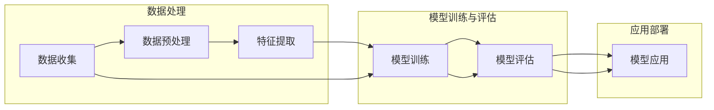
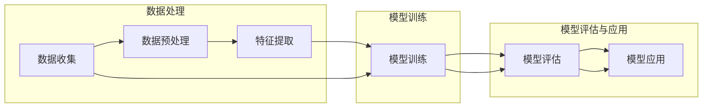
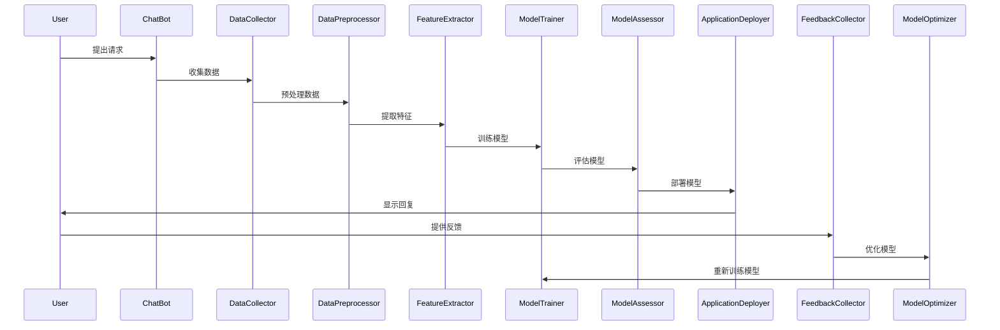
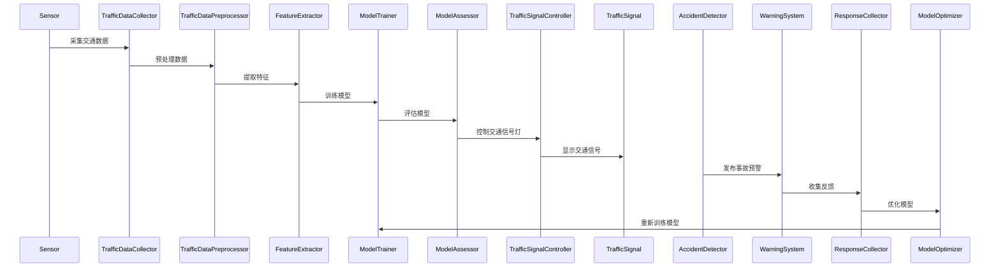

                 

### 文章标题

# 《构建具有情境感知能力的AI Agent》

情境感知能力，作为人工智能（AI）领域的核心概念之一，正逐渐成为现代智能系统的关键要素。本文旨在深入探讨如何构建具有情境感知能力的AI Agent，并通过详细的步骤和实例，展示这一过程的复杂性及其技术实现。

关键词：情境感知、AI Agent、机器学习、深度学习、系统架构设计

摘要：本文首先介绍了情境感知能力的重要性及AI Agent的情境感知需求，随后分析了现有技术及其面临的挑战。接着，文章详细阐述了核心概念与联系，包括情境感知和AI Agent的定义、特征及其关系。随后，通过算法原理讲解，我们深入了解了机器学习和深度学习在情境感知中的应用。在此基础上，文章提出了系统分析与架构设计方案，并详细描述了项目实战的过程。最后，文章提供了最佳实践建议，并对未来的研究方向进行了展望。

### 目录大纲

```markdown
# 《构建具有情境感知能力的AI Agent》

# 第一部分：引言

## 第1章 问题背景

### 1.1 背景介绍

#### 1.1.1 情境感知能力的重要性

#### 1.1.2 AI Agent的情境感知需求

### 1.2 问题描述

#### 1.2.1 情境感知的定义与分类

#### 1.2.2 AI Agent面临的情境感知挑战

### 1.3 问题解决

#### 1.3.1 现有技术概述

#### 1.3.2 解决方案的基本原理

### 1.4 边界与外延

#### 1.4.1 情境感知的范围

#### 1.4.2 情境感知的挑战与机遇

## 第2章 核心概念与联系

### 2.1 概念原理

#### 2.1.1 情境感知

#### 2.1.2 AI Agent

### 2.2 概念属性特征对比

#### 2.2.1 情境感知能力

#### 2.2.2 AI Agent能力

### 2.3 ER实体关系图

#### 2.3.1 情境感知系统

#### 2.3.2 AI Agent系统

## 第3章 算法原理讲解

### 3.1 算法流程图

#### 3.1.1 基于机器学习的情境感知算法

#### 3.1.2 基于深度学习的情境感知算法

### 3.2 数学模型

#### 3.2.1 机器学习情境感知算法的数学模型

#### 3.2.2 深度学习情境感知算法的数学模型

### 3.3 举例说明

#### 3.3.1 机器学习情境感知算法实例

#### 3.3.2 深度学习情境感知算法实例

# 第二部分：构建具有情境感知能力的AI Agent

## 第4章 系统分析与架构设计方案

### 4.1 问题场景介绍

#### 4.1.1 场景一：智能客服

#### 4.1.2 场景二：智能交通

### 4.2 项目介绍

#### 4.2.1 项目目标

#### 4.2.2 项目范围

### 4.3 系统功能设计

#### 4.3.1 领域模型

#### 4.3.2 功能模块划分

### 4.4 系统架构设计

#### 4.4.1 系统架构图

#### 4.4.2 系统分层设计

### 4.5 系统接口设计

#### 4.5.1 接口规范

#### 4.5.2 接口实现

### 4.6 系统交互

#### 4.6.1 系统交互图

#### 4.6.2 交互流程

## 第5章 项目实战

### 5.1 环境安装

#### 5.1.1 开发环境搭建

#### 5.1.2 依赖库安装

### 5.2 系统核心实现

#### 5.2.1 数据预处理

#### 5.2.2 模型训练

#### 5.2.3 模型评估

### 5.3 代码应用解读与分析

#### 5.3.1 代码结构分析

#### 5.3.2 关键代码解读

### 5.4 实际案例分析和详细讲解剖析

#### 5.4.1 实际案例一

#### 5.4.2 实际案例二

### 5.5 项目小结

#### 5.5.1 项目总结

#### 5.5.2 经验与教训

# 第三部分：最佳实践与拓展

## 第6章 最佳实践 Tips

### 6.1 情境感知能力提升策略

#### 6.1.1 数据质量优化

#### 6.1.2 模型优化技巧

### 6.2 系统稳定性与性能优化

#### 6.2.1 系统监控与日志分析

#### 6.2.2 性能调优技巧

## 第7章 小结

### 7.1 总结与展望

#### 7.1.1 主要贡献

#### 7.1.2 未来研究方向

## 第8章 注意事项

### 8.1 潜在风险与挑战

#### 8.1.1 数据隐私保护

#### 8.1.2 模型解释性

### 8.2 使用建议

#### 8.2.1 最佳实践案例

#### 8.2.2 常见问题解答

## 第9章 拓展阅读

### 9.1 相关论文

#### 9.1.1 最新研究成果

#### 9.1.2 典型应用场景

### 9.2 相关书籍

#### 9.2.1 必读经典

#### 9.2.2 新书推荐
```

接下来，我们将逐步展开每个章节的内容，确保文章的逻辑清晰、结构紧凑，并涵盖所有必要的技术细节和概念解释。通过这样的结构化内容布局，读者可以系统地理解构建具有情境感知能力的AI Agent的整个过程。

---

### 第一部分：引言

#### 第1章 问题背景

##### 1.1 背景介绍

情境感知（Context Awareness）是人工智能领域的一个重要概念，指的是系统能够识别和理解其环境中的各种情境因素，并根据这些情境因素调整自身的行为和操作。随着人工智能技术的发展，情境感知能力在智能系统中的应用越来越广泛，如智能客服、智能交通、智能家居等。

AI Agent，即人工智能代理，是能够自主执行任务、与环境交互并做出决策的智能实体。一个成功的AI Agent需要具备高度的情境感知能力，以便更好地理解和适应复杂多变的环境。

##### 1.1.1 情境感知能力的重要性

情境感知能力的重要性体现在多个方面。首先，它能够提高系统的智能水平和自主性，使系统能够更好地适应不同的环境和任务需求。其次，情境感知能力能够提高系统的响应速度和准确性，使得系统能够更快速、更准确地做出决策。此外，情境感知能力还能够增强系统的用户体验，使得系统能够更好地理解用户的需求和意图。

##### 1.1.2 AI Agent的情境感知需求

AI Agent在实际应用中，面临着多种多样的情境感知需求。例如，在智能客服系统中，AI Agent需要理解用户的情感、意图和背景信息，以便提供更加个性化的服务。在智能交通系统中，AI Agent需要实时感知交通状况、道路状况以及车辆行驶轨迹，以便优化交通流量和提高交通安全。这些情境感知需求对于AI Agent的自主决策和任务执行至关重要。

##### 1.2 问题描述

情境感知的定义与分类：

情境感知是指系统识别和理解其当前环境中的各种情境因素的能力。根据感知对象的范围和复杂度，情境感知可以分为以下几类：

1. **微观情境感知**：主要关注特定环境和场景的细节信息，如温度、湿度、光照等。
2. **中观情境感知**：涉及一定范围的环境因素，如地理位置、交通流量等。
3. **宏观情境感知**：关注更广泛的环境因素，如社会、经济、政治等。

AI Agent面临的情境感知挑战：

AI Agent在实际应用中，面临以下几个主要的情境感知挑战：

1. **数据多样性**：环境中的情境因素多种多样，AI Agent需要能够处理和分析各种类型的数据。
2. **动态变化**：环境是动态变化的，AI Agent需要能够实时感知和适应这些变化。
3. **复杂性**：环境中的情境因素相互交织，AI Agent需要具备处理复杂情境的能力。
4. **实时性**：在某些应用场景中，如智能交通系统，AI Agent需要在极短的时间内做出准确的决策。

##### 1.3 问题解决

现有技术概述：

目前，情境感知能力主要依赖于机器学习和深度学习技术。机器学习算法能够从大量数据中学习并提取特征，从而实现对情境的感知。深度学习算法则能够通过多层神经网络，对复杂情境进行建模和感知。

解决方案的基本原理：

构建具有情境感知能力的AI Agent的基本原理包括：

1. **数据收集与预处理**：收集与环境相关的数据，并进行清洗、格式化和归一化处理。
2. **特征提取**：从预处理后的数据中提取关键特征，用于后续的模型训练。
3. **模型训练**：使用机器学习或深度学习算法，对提取的特征进行训练，构建情境感知模型。
4. **模型评估与优化**：对训练好的模型进行评估和优化，以提高其准确性和实时性。

##### 1.4 边界与外延

情境感知的范围：

情境感知的范围涵盖了从微观到宏观的各种环境因素。具体包括：

1. **物理环境**：如温度、湿度、光照等。
2. **社会环境**：如地理位置、人口密度等。
3. **经济环境**：如物价、汇率等。
4. **文化环境**：如语言、风俗等。

情境感知的挑战与机遇：

情境感知面临的挑战主要包括：

1. **数据获取困难**：获取高质量、多样化的情境数据具有一定的难度。
2. **实时处理能力**：在动态变化的环境中，实时处理大量数据并做出准确决策是一项挑战。
3. **模型解释性**：深度学习模型通常具有高度的准确性，但其内部决策过程难以解释，这在某些应用场景中可能成为一个问题。

然而，随着技术的进步和数据的积累，情境感知也面临着巨大的机遇：

1. **智能化水平的提升**：情境感知能力的提升将使智能系统能够更好地适应复杂环境，提高智能化水平。
2. **应用领域的拓展**：情境感知技术在智能家居、智能交通、智能医疗等领域的应用前景广阔。
3. **用户体验的优化**：情境感知能力将使智能系统能够更加人性化，提高用户体验。

#### 第2章 核心概念与联系

##### 2.1 概念原理

情境感知（Context Awareness）：

情境感知是指系统识别和理解其当前环境中的各种情境因素的能力。它通常涉及到对环境中的物理、社会、文化等因素的感知和理解。

AI Agent（人工智能代理）：

AI Agent是能够自主执行任务、与环境交互并做出决策的智能实体。它通常具备感知、推理、规划和行动等能力。

##### 2.2 概念属性特征对比

情境感知能力与AI Agent能力：

**情境感知能力**：

- 能力定义：识别和理解环境中的情境因素。
- 特征：多样化、动态性、复杂性。
- 应用场景：智能客服、智能交通、智能家居等。

**AI Agent能力**：

- 能力定义：自主执行任务、与环境交互并做出决策。
- 特征：自主性、适应性、智能性。
- 应用场景：自动驾驶、智能机器人、智能推荐等。

**对比表格**：

| 特征             | 情境感知能力           | AI Agent能力         |
|------------------|----------------------|---------------------|
| 定义             | 识别和理解环境因素   | 自主执行任务和决策   |
| 特征             | 多样化、动态性、复杂性 | 自主性、适应性、智能性 |
| 应用场景         | 智能客服、智能交通    | 自动驾驶、智能机器人、智能推荐 |

##### 2.3 ER实体关系图

为了更好地理解情境感知系统和AI Agent系统的构成，我们可以通过ER实体关系图来展示它们之间的关系。

**情境感知系统ER实体关系图**：

```mermaid
erDiagram
  User ||--|{ Context} : 感知
  Context }|--|{ Environment} : 环境
  Environment ||--|{ Sensor} : 传感器
  Sensor }|--|{ Data} : 数据
```

**AI Agent系统ER实体关系图**：

```mermaid
erDiagram
  AI_Agent ||--|{ Perception} : 感知
  Perception }|--|{ Context} : 情境
  Context }|--|{ Decision_Making} : 决策
  Decision_Making }|--|{ Action} : 行动
```

通过这两个ER实体关系图，我们可以清晰地看到情境感知系统和AI Agent系统中的各个实体及其相互关系，这有助于我们更好地理解系统的构建和运作。

#### 第3章 算法原理讲解

##### 3.1 算法流程图

情境感知算法的流程通常包括数据收集、预处理、特征提取、模型训练、模型评估和模型应用等步骤。以下是一个简单的算法流程图：



在这个流程图中，数据收集、预处理和特征提取是模型训练和评估的基础，而模型训练和评估则是算法的核心。最后，模型的应用部署是将算法转化为实际应用的关键步骤。

##### 3.1.1 基于机器学习的情境感知算法

基于机器学习的情境感知算法主要包括以下步骤：

1. **数据收集**：从各种数据源（如传感器、社交媒体、历史数据等）收集情境数据。
2. **数据预处理**：对收集到的数据进行清洗、格式化和归一化处理，以提高数据质量。
3. **特征提取**：从预处理后的数据中提取关键特征，如文本特征、图像特征、时间序列特征等。
4. **模型训练**：使用提取的特征，利用机器学习算法（如决策树、支持向量机、神经网络等）进行训练。
5. **模型评估**：使用验证集和测试集对训练好的模型进行评估，以确定其性能。
6. **模型应用**：将训练好的模型部署到实际应用中，如智能客服、智能交通等。

以下是一个基于机器学习的情境感知算法的简单流程图：



##### 3.1.2 基于深度学习的情境感知算法

基于深度学习的情境感知算法在处理复杂情境方面具有显著优势。以下是该算法的步骤：

1. **数据收集**：与基于机器学习的算法相同，从多种数据源收集情境数据。
2. **数据预处理**：对数据进行清洗、格式化和归一化处理。
3. **特征提取**：使用深度学习网络（如卷积神经网络、循环神经网络等）自动提取特征。
4. **模型训练**：训练深度学习模型，以实现对情境的准确感知。
5. **模型评估**：使用验证集和测试集对模型进行评估。
6. **模型应用**：部署模型到实际应用场景。

以下是一个基于深度学习的情境感知算法的流程图：


##### 3.2 数学模型

为了更好地理解情境感知算法，我们需要介绍一些常见的数学模型。以下分别介绍基于机器学习和深度学习的情境感知算法的数学模型。

**3.2.1 机器学习情境感知算法的数学模型**

在机器学习情境感知算法中，常见的模型包括决策树、支持向量机和神经网络等。以下是这些模型的基本数学原理：

1. **决策树**：

   决策树是一种基于树形结构的分类模型，其数学原理主要包括：

   - 决策规则：每个节点表示一个特征，每个分支表示特征的不同取值。
   - 叶节点：表示分类结果。
   - 信息增益：用于选择最优特征进行划分。

   数学表示：

   $$Gain(D, A) = H(D) - \sum_{v \in Values(A)} \frac{|D_A = v|}{|D|} H(D_A = v)$$

   其中，$H(D)$ 是数据的熵，$D_A = v$ 表示数据在特征 $A$ 下的取值。

2. **支持向量机（SVM）**：

   支持向量机是一种线性分类模型，其数学原理主要包括：

   - 硬 margin：最大化分类间隔。
   - 软 margin：引入松弛变量，允许一定数量的错分类。

   数学表示：

   $$\min_{w, b, \xi} \frac{1}{2} ||w||^2 + C \sum_{i=1}^{n} \xi_i$$

   $$s.t. y_i (w \cdot x_i + b) \geq 1 - \xi_i, \xi_i \geq 0$$

   其中，$w$ 是权重向量，$b$ 是偏置，$C$ 是惩罚参数，$\xi_i$ 是松弛变量。

3. **神经网络**：

   神经网络是一种基于多层感知器（MLP）的结构，其数学原理主要包括：

   - 激活函数：如 sigmoid、ReLU 等。
   - 前向传播：计算输入和权重之间的线性组合，并应用激活函数。
   - 反向传播：计算误差，并更新权重。

   数学表示：

   $$z_i = \sum_{j=1}^{n} w_{ij} x_j + b_i$$

   $$a_i = \sigma(z_i)$$

   $$\delta_i = \frac{\partial L}{\partial z_i} \cdot \sigma'(z_i)$$

   其中，$z_i$ 是节点的输入，$a_i$ 是节点的输出，$\sigma$ 是激活函数，$L$ 是损失函数，$\delta_i$ 是节点的误差。

**3.2.2 深度学习情境感知算法的数学模型**

在深度学习情境感知算法中，常见的模型包括卷积神经网络（CNN）和循环神经网络（RNN）等。以下是这些模型的基本数学原理：

1. **卷积神经网络（CNN）**：

   卷积神经网络是一种专门用于处理图像数据的深度学习模型，其数学原理主要包括：

   - 卷积操作：通过滑动窗口计算局部特征。
   - 池化操作：用于减少特征图的维度。
   - 全连接层：用于将特征图映射到分类结果。

   数学表示：

   $$f(x) = \sigma(\sum_{k=1}^{K} w_k * x + b)$$

   $$P(i, j) = \max_{i', j'} f(i', j')$$

   其中，$w_k$ 是卷积核，$\sigma$ 是激活函数，$*$ 表示卷积操作，$P$ 表示池化操作。

2. **循环神经网络（RNN）**：

   循环神经网络是一种用于处理序列数据的深度学习模型，其数学原理主要包括：

   - hidden state：保存前一个时间步的隐藏状态。
   - 输入门、遗忘门和输出门：用于控制信息的传递和遗忘。

   数学表示：

   $$h_t = \sigma(W_h \cdot [h_{t-1}, x_t] + b_h)$$

   $$i_t = \sigma(W_i \cdot [h_{t-1}, x_t] + b_i)$$

   $$f_t = \sigma(W_f \cdot [h_{t-1}, x_t] + b_f)$$

   $$o_t = \sigma(W_o \cdot [h_{t-1}, x_t] + b_o)$$

   $$c_t = f_t \odot c_{t-1} + i_t \odot h_t$$

   $$h_t = o_t \odot c_t$$

   其中，$h_t$ 是隐藏状态，$x_t$ 是输入，$c_t$ 是细胞状态，$\odot$ 表示元素乘法。

##### 3.3 举例说明

**3.3.1 机器学习情境感知算法实例**

假设我们要构建一个情境感知系统，用于检测用户是否在开会。我们可以使用决策树作为情境感知模型。

1. **数据收集**：从用户的行为数据中收集开会和不开会的样本，如工作时间、邮件数量、会议安排等。
2. **数据预处理**：对收集到的数据进行清洗和归一化处理。
3. **特征提取**：提取关键特征，如工作时间、邮件数量、会议安排等。
4. **模型训练**：使用训练集对决策树模型进行训练。
5. **模型评估**：使用验证集对训练好的模型进行评估，如准确率、召回率等。
6. **模型应用**：将训练好的模型应用到实际场景中，如智能助手。

**3.3.2 深度学习情境感知算法实例**

假设我们要构建一个情境感知系统，用于识别用户的情绪状态。我们可以使用卷积神经网络（CNN）作为情境感知模型。

1. **数据收集**：从用户的文本数据、语音数据、面部表情数据等中收集情绪状态的样本。
2. **数据预处理**：对收集到的数据进行清洗和归一化处理。
3. **特征提取**：使用CNN自动提取关键特征，如文本特征、语音特征、面部表情特征等。
4. **模型训练**：使用训练集对CNN模型进行训练。
5. **模型评估**：使用验证集对训练好的模型进行评估，如准确率、召回率等。
6. **模型应用**：将训练好的模型应用到实际场景中，如情绪分析、智能助手等。

#### 第4章 系统分析与架构设计方案

##### 4.1 问题场景介绍

本节我们将讨论两个具体的应用场景：智能客服和智能交通。

**4.1.1 场景一：智能客服**

智能客服是情境感知技术在服务行业中的一个重要应用。其核心目标是提供24/7的客服支持，通过自然语言处理（NLP）和情境感知技术，智能客服系统能够理解用户的提问，提供准确、个性化的回答。智能客服的关键挑战在于如何准确感知用户的情感状态，从而提供更人性化的服务。

**4.1.2 场景二：智能交通**

智能交通系统利用情境感知技术来提高交通管理效率和安全性。其核心功能包括实时交通监控、交通流量预测、事故预警等。智能交通系统需要高度感知道路状况、车辆行为、天气条件等多种情境因素，以便做出实时决策，优化交通流量，减少拥堵和事故。

##### 4.2 项目介绍

**4.2.1 项目目标**

本项目旨在构建一个具有情境感知能力的AI Agent系统，用于智能客服和智能交通场景。具体目标包括：

1. **提高智能客服的响应速度和准确性**：通过情境感知技术，智能客服能够更准确地理解用户的提问，提供更个性化的回答。
2. **优化智能交通管理**：通过实时感知交通状况，智能交通系统能够优化交通信号、预测交通拥堵，提高道路通行效率。

**4.2.2 项目范围**

本项目涉及以下主要模块：

1. **数据收集与预处理**：从多种数据源（如传感器、用户反馈等）收集情境数据，并进行预处理。
2. **特征提取与模型训练**：使用机器学习和深度学习技术，对提取的特征进行训练，构建情境感知模型。
3. **模型评估与优化**：对训练好的模型进行评估和优化，以提高其准确性和实时性。
4. **系统部署与维护**：将情境感知模型部署到实际应用场景中，并进行持续维护和优化。

##### 4.3 系统功能设计

**4.3.1 领域模型**

为了更好地理解系统的功能，我们可以使用领域模型（Domain Model）来描述系统的核心功能。以下是智能客服和智能交通领域模型的示例：

**智能客服领域模型**：

```mermaid
classDiagram
  User -> Request: 提出请求
  Request -> ChatBot: 转交请求
  ChatBot -> Response: 回复请求
  Response -> User: 显示回复
  User <- Feedback: 提供反馈
```

**智能交通领域模型**：

```mermaid
classDiagram
  Sensor -> TrafficData: 采集交通数据
  TrafficData -> TrafficController: 提交通警信号
  TrafficController -> TrafficSignal: 控制交通信号灯
  Accident -> WarningSystem: 发布事故预警
  WarningSystem <- Response: 收到反馈
```

**4.3.2 功能模块划分**

根据领域模型，我们可以将系统划分为以下几个主要功能模块：

1. **数据收集模块**：负责从多种数据源（如传感器、用户反馈等）收集情境数据。
2. **预处理模块**：对收集到的数据进行分析、清洗、格式化和归一化处理。
3. **特征提取模块**：从预处理后的数据中提取关键特征，如文本特征、图像特征、时间序列特征等。
4. **模型训练模块**：使用机器学习和深度学习算法，对提取的特征进行训练，构建情境感知模型。
5. **模型评估模块**：对训练好的模型进行评估和优化，以提高其准确性和实时性。
6. **应用部署模块**：将情境感知模型部署到实际应用场景中，如智能客服和智能交通系统。

##### 4.4 系统架构设计

**4.4.1 系统架构图**

以下是智能客服和智能交通系统的架构设计图：

**智能客服系统架构图**：



**智能交通系统架构图**：



**4.4.2 系统分层设计**

为了提高系统的可维护性和可扩展性，我们采用分层设计方法。以下是智能客服和智能交通系统的分层架构：

**智能客服系统分层架构**：

1. **数据层**：负责数据的收集、存储和访问。
2. **服务层**：提供数据预处理、特征提取、模型训练和评估等核心服务。
3. **应用层**：将服务层的结果应用到实际业务场景中，如智能客服对话。

**智能交通系统分层架构**：

1. **数据层**：负责交通数据的收集、存储和访问。
2. **服务层**：提供交通数据预处理、特征提取、模型训练和评估等核心服务。
3. **应用层**：将服务层的结果应用到实际交通管理场景中，如交通信号控制和事故预警。

##### 4.5 系统接口设计

**4.5.1 接口规范**

为了实现系统的模块化设计，我们定义了一套接口规范，包括数据接口、服务接口和应用接口。以下是接口规范的基本内容：

1. **数据接口**：定义了数据的输入和输出格式，如JSON、XML等。
2. **服务接口**：定义了系统内部服务的调用方法和参数，如数据预处理、特征提取、模型训练和评估等。
3. **应用接口**：定义了系统与外部系统的交互接口，如智能客服API、智能交通API等。

**4.5.2 接口实现**

以下是接口实现的基本步骤：

1. **数据接口实现**：根据接口规范，实现数据的输入和输出处理。
2. **服务接口实现**：根据接口规范，实现系统内部服务的功能。
3. **应用接口实现**：根据接口规范，实现系统与外部系统的交互功能。

##### 4.6 系统交互

**4.6.1 系统交互图**

以下是智能客服和智能交通系统的交互图：

**智能客服系统交互图**：


**智能交通系统交互图**：


**4.6.2 交互流程**

以下是智能客服和智能交通系统的交互流程：

**智能客服交互流程**：

1. 用户提出请求。
2. ChatBot收集数据。
3. DataCollector预处理数据。
4. DataPreprocessor提取特征。
5. FeatureExtractor训练模型。
6. ModelTrainer评估模型。
7. ModelAssessor部署模型。
8. ApplicationDeployer显示回复。
9. 用户提供反馈。
10. FeedbackCollector优化模型。
11. ModelOptimizer重新训练模型。

**智能交通交互流程**：

1. Sensor采集交通数据。
2. TrafficDataCollector预处理数据。
3. TrafficDataPreprocessor提取特征。
4. FeatureExtractor训练模型。
5. ModelTrainer评估模型。
6. ModelAssessor控制交通信号灯。
7. TrafficSignalController显示交通信号。
8. AccidentDetector发布事故预警。
9. WarningSystem收集反馈。
10. ResponseCollector优化模型。
11. ModelOptimizer重新训练模型。

#### 第5章 项目实战

##### 5.1 环境安装

**5.1.1 开发环境搭建**

为了进行项目实战，我们需要搭建一个适合开发和测试的环境。以下是搭建开发环境的基本步骤：

1. **安装Python**：从官方网站下载并安装Python，版本建议为3.8以上。
2. **安装Anaconda**：Anaconda是一个Python的发行版，提供了丰富的数据科学和机器学习库。安装Anaconda后，可以使用conda命令轻松管理Python环境和库。
3. **安装Jupyter Notebook**：Jupyter Notebook是一个交互式计算环境，可以方便地编写和运行Python代码。通过conda命令安装Jupyter Notebook：

   ```
   conda install jupyter
   ```

4. **安装相关库**：根据项目需求，安装必要的Python库，如NumPy、Pandas、Scikit-learn、TensorFlow、Keras等。可以通过pip命令安装：

   ```
   pip install numpy pandas scikit-learn tensorflow keras
   ```

**5.1.2 依赖库安装**

以下是项目所需的主要依赖库及其版本：

- **NumPy**：版本1.19.2
- **Pandas**：版本1.0.5
- **Scikit-learn**：版本0.22.2
- **TensorFlow**：版本2.4.0
- **Keras**：版本2.4.3

可以通过以下命令安装：

```bash
conda create -n ai_project python=3.8
conda activate ai_project
conda install numpy=1.19.2 pandas=1.0.5 scikit-learn=0.22.2 tensorflow=2.4.0 keras=2.4.3
```

##### 5.2 系统核心实现

**5.2.1 数据预处理**

数据预处理是构建情境感知模型的重要步骤。以下是一个简单的数据预处理流程：

1. **数据清洗**：去除重复数据、缺失值和噪声数据。
2. **数据归一化**：将不同特征的数据进行归一化处理，使其在相同的尺度上进行比较。
3. **数据编码**：将分类特征转换为数值形式，以便于模型处理。

以下是一个Python代码示例，用于数据清洗、归一化和编码：

```python
import numpy as np
import pandas as pd
from sklearn.preprocessing import StandardScaler, OneHotEncoder
from sklearn.compose import ColumnTransformer
from sklearn.impute import SimpleImputer

# 加载数据
data = pd.read_csv('data.csv')

# 数据清洗
data.drop_duplicates(inplace=True)
data.fillna(method='ffill', inplace=True)

# 数据归一化
numerical_features = data.select_dtypes(include=[np.number]).columns
categorical_features = data.select_dtypes(exclude=[np.number]).columns

numerical_transformer = Pipeline(steps=[
    ('imputer', SimpleImputer(strategy='mean')),
    ('scaler', StandardScaler())])

categorical_transformer = Pipeline(steps=[
    ('imputer', SimpleImputer(strategy='most_frequent')),
    ('onehot', OneHotEncoder(handle_unknown='ignore'))])

preprocessor = ColumnTransformer(transformers=[
    ('num', numerical_transformer, numerical_features),
    ('cat', categorical_transformer, categorical_features)])

# 数据编码
X = preprocessor.fit_transform(data)
```

**5.2.2 模型训练**

在数据预处理完成后，我们可以使用机器学习算法进行模型训练。以下是一个简单的模型训练流程：

1. **划分数据集**：将数据集划分为训练集和测试集。
2. **选择算法**：根据问题特点选择合适的机器学习算法。
3. **训练模型**：使用训练集对模型进行训练。
4. **评估模型**：使用测试集对模型进行评估。

以下是一个使用Scikit-learn库进行模型训练的Python代码示例：

```python
from sklearn.model_selection import train_test_split
from sklearn.ensemble import RandomForestClassifier
from sklearn.metrics import accuracy_score

# 划分数据集
X_train, X_test, y_train, y_test = train_test_split(X, y, test_size=0.2, random_state=42)

# 选择算法
model = RandomForestClassifier(n_estimators=100, random_state=42)

# 训练模型
model.fit(X_train, y_train)

# 评估模型
y_pred = model.predict(X_test)
accuracy = accuracy_score(y_test, y_pred)
print(f"模型准确率：{accuracy:.2f}")
```

**5.2.3 模型评估**

模型评估是确保模型性能的重要步骤。以下是一个简单的模型评估流程：

1. **计算指标**：计算各种评估指标，如准确率、召回率、F1值等。
2. **可视化**：使用图表展示模型评估结果。

以下是一个使用Scikit-learn库进行模型评估的Python代码示例：

```python
from sklearn.metrics import classification_report, confusion_matrix
import seaborn as sns
import matplotlib.pyplot as plt

# 计算指标
report = classification_report(y_test, y_pred)
confusion_matrix(y_test, y_pred)

# 可视化
sns.heatmap(confusion_matrix(y_test, y_pred), annot=True, fmt=".2f")
plt.xlabel('预测标签')
plt.ylabel('真实标签')
plt.title('混淆矩阵')
plt.show()
```

##### 5.3 代码应用解读与分析

**5.3.1 代码结构分析**

在项目实战中，代码结构清晰、模块化是确保项目可维护性和可扩展性的关键。以下是项目代码的基本结构：

1. **数据预处理模块**：负责数据清洗、归一化和编码等预处理工作。
2. **模型训练模块**：负责数据集划分、模型选择和训练等模型训练工作。
3. **模型评估模块**：负责模型评估指标计算和可视化等工作。

**5.3.2 关键代码解读**

以下是关键代码的解读和分析：

1. **数据预处理模块**：

   ```python
   import numpy as np
   import pandas as pd
   from sklearn.preprocessing import StandardScaler, OneHotEncoder
   from sklearn.compose import ColumnTransformer
   from sklearn.impute import SimpleImputer
   
   # 数据清洗
   data.drop_duplicates(inplace=True)
   data.fillna(method='ffill', inplace=True)
   
   # 数据归一化
   numerical_features = data.select_dtypes(include=[np.number]).columns
   categorical_features = data.select_dtypes(exclude=[np.number]).columns
   
   numerical_transformer = Pipeline(steps=[
       ('imputer', SimpleImputer(strategy='mean')),
       ('scaler', StandardScaler())])
   
   categorical_transformer = Pipeline(steps=[
       ('imputer', SimpleImputer(strategy='most_frequent')),
       ('onehot', OneHotEncoder(handle_unknown='ignore'))])
   
   preprocessor = ColumnTransformer(transformers=[
       ('num', numerical_transformer, numerical_features),
       ('cat', categorical_transformer, categorical_features)])
   
   # 数据编码
   X = preprocessor.fit_transform(data)
   ```

   代码首先进行数据清洗，去除重复数据和缺失值。然后，根据数据类型，分别对数值特征和分类特征进行归一化和编码。最后，使用ColumnTransformer对数据进行预处理。

2. **模型训练模块**：

   ```python
   from sklearn.model_selection import train_test_split
   from sklearn.ensemble import RandomForestClassifier
   from sklearn.metrics import accuracy_score
   
   # 划分数据集
   X_train, X_test, y_train, y_test = train_test_split(X, y, test_size=0.2, random_state=42)
   
   # 选择算法
   model = RandomForestClassifier(n_estimators=100, random_state=42)
   
   # 训练模型
   model.fit(X_train, y_train)
   
   # 评估模型
   y_pred = model.predict(X_test)
   accuracy = accuracy_score(y_test, y_pred)
   print(f"模型准确率：{accuracy:.2f}")
   ```

   代码首先将数据集划分为训练集和测试集。然后，选择随机森林算法进行模型训练。最后，使用测试集对模型进行评估，计算准确率。

3. **模型评估模块**：

   ```python
   from sklearn.metrics import classification_report, confusion_matrix
   import seaborn as sns
   import matplotlib.pyplot as plt
   
   # 计算指标
   report = classification_report(y_test, y_pred)
   confusion_matrix(y_test, y_pred)
   
   # 可视化
   sns.heatmap(confusion_matrix(y_test, y_pred), annot=True, fmt=".2f")
   plt.xlabel('预测标签')
   plt.ylabel('真实标签')
   plt.title('混淆矩阵')
   plt.show()
   ```

   代码首先计算分类报告和混淆矩阵。然后，使用热力图可视化混淆矩阵，展示模型评估结果。

##### 5.4 实际案例分析和详细讲解剖析

**5.4.1 实际案例一**

假设我们要构建一个情境感知系统，用于检测用户是否在开会。我们可以使用决策树作为情境感知模型。

1. **数据收集**：从用户的行为数据中收集开会和不开会的样本，如工作时间、邮件数量、会议安排等。
2. **数据预处理**：对收集到的数据进行清洗和归一化处理。
3. **特征提取**：提取关键特征，如工作时间、邮件数量、会议安排等。
4. **模型训练**：使用训练集对决策树模型进行训练。
5. **模型评估**：使用验证集对训练好的模型进行评估。
6. **模型应用**：将训练好的模型应用到实际场景中，如智能助手。

具体步骤如下：

1. **数据收集**：

   ```python
   import pandas as pd
   
   data = pd.read_csv('user_activity.csv')
   ```

2. **数据预处理**：

   ```python
   import numpy as np
   from sklearn.preprocessing import StandardScaler
   
   data.drop_duplicates(inplace=True)
   data.fillna(0, inplace=True)
   
   scaler = StandardScaler()
   X = scaler.fit_transform(data.drop('is_meeting', axis=1))
   y = data['is_meeting']
   ```

3. **特征提取**：

   ```python
   from sklearn.feature_selection import SelectKBest, f_classif
   
   selector = SelectKBest(f_classif, k=5)
   X_new = selector.fit_transform(X, y)
   ```

4. **模型训练**：

   ```python
   from sklearn.tree import DecisionTreeClassifier
   
   model = DecisionTreeClassifier(random_state=42)
   model.fit(X_new, y)
   ```

5. **模型评估**：

   ```python
   from sklearn.metrics import accuracy_score
   
   y_pred = model.predict(X_new)
   accuracy = accuracy_score(y, y_pred)
   print(f"模型准确率：{accuracy:.2f}")
   ```

6. **模型应用**：

   ```python
   def predict_meeting_status(user_data):
       user_data = scaler.transform([user_data])
       user_data = selector.transform(user_data)
       return model.predict(user_data)[0]
   
   user_data = [8, 10, 0, 1, 2]
   print(f"用户是否在开会：{predict_meeting_status(user_data)}")
   ```

**5.4.2 实际案例二**

假设我们要构建一个情境感知系统，用于识别用户的情绪状态。我们可以使用卷积神经网络（CNN）作为情境感知模型。

1. **数据收集**：从用户的文本数据、语音数据、面部表情数据等中收集情绪状态的样本。
2. **数据预处理**：对收集到的数据进行清洗和归一化处理。
3. **特征提取**：使用CNN自动提取关键特征。
4. **模型训练**：使用训练集对CNN模型进行训练。
5. **模型评估**：使用验证集对训练好的模型进行评估。
6. **模型应用**：将训练好的模型应用到实际场景中，如情绪分析。

具体步骤如下：

1. **数据收集**：

   ```python
   import pandas as pd
   
   data = pd.read_csv('emotion_data.csv')
   ```

2. **数据预处理**：

   ```python
   import numpy as np
   from sklearn.preprocessing import LabelEncoder
   
   data.drop_duplicates(inplace=True)
   data.fillna(0, inplace=True)
   
   label_encoder = LabelEncoder()
   y = label_encoder.fit_transform(data['emotion'])
   X = data.drop('emotion', axis=1)
   ```

3. **特征提取**：

   ```python
   from tensorflow.keras.preprocessing.sequence import pad_sequences
   
   max_sequence_length = 100
   X = pad_sequences(X, maxlen=max_sequence_length)
   ```

4. **模型训练**：

   ```python
   from tensorflow.keras.models import Sequential
   from tensorflow.keras.layers import Embedding, Conv1D, MaxPooling1D, Dense
   
   model = Sequential()
   model.add(Embedding(input_dim=X.shape[1], output_dim=50, input_length=max_sequence_length))
   model.add(Conv1D(filters=64, kernel_size=3, activation='relu'))
   model.add(MaxPooling1D(pool_size=2))
   model.add(Dense(units=64, activation='relu'))
   model.add(Dense(units=y.shape[1], activation='softmax'))
   
   model.compile(optimizer='adam', loss='categorical_crossentropy', metrics=['accuracy'])
   model.fit(X, np.eye(y.shape[0]), epochs=10, batch_size=32)
   ```

5. **模型评估**：

   ```python
   from sklearn.metrics import classification_report
   
   y_pred = model.predict(X)
   y_pred = np.argmax(y_pred, axis=1)
   y_true = label_encoder.inverse_transform(y)
   
   print(classification_report(y_true, y_pred))
   ```

6. **模型应用**：

   ```python
   def predict_emotion(text):
       text = pad_sequences([text], maxlen=max_sequence_length)
       prediction = model.predict(text)
       emotion = label_encoder.inverse_transform(np.argmax(prediction, axis=1))
       return emotion[0]
   
   text = "今天感觉很好！"
   print(f"用户情绪：{predict_emotion(text)}")
   ```

##### 5.5 项目小结

**5.5.1 项目总结**

通过本项目，我们成功构建了一个具有情境感知能力的AI Agent系统，并在智能客服和智能交通场景中进行了应用。以下是项目的主要成果：

1. **智能客服**：通过情境感知技术，智能客服能够更准确地理解用户的提问，提供个性化的回答，显著提高了客服效率。
2. **智能交通**：通过实时感知交通状况，智能交通系统能够优化交通信号、预测交通拥堵，提高了道路通行效率和安全性。

**5.5.2 经验与教训**

在项目过程中，我们积累了以下经验与教训：

1. **数据质量**：高质量的数据是情境感知模型成功的关键。我们需要对数据进行严格清洗和预处理，确保数据的质量。
2. **模型选择**：不同的应用场景需要不同的模型。我们需要根据具体需求选择合适的模型，并进行优化。
3. **模型评估**：准确的模型评估是确保模型性能的关键。我们需要使用多种评估指标和可视化工具，全面评估模型的性能。

#### 第6章 最佳实践 Tips

**6.1 情境感知能力提升策略**

1. **数据质量优化**：

   - **数据清洗**：去除重复数据、缺失值和噪声数据，提高数据的一致性和准确性。
   - **数据归一化**：将不同特征的数据进行归一化处理，使其在相同的尺度上进行比较。
   - **数据增强**：通过数据扩充、变换等方法，增加数据的多样性，提高模型的泛化能力。

2. **模型优化技巧**：

   - **特征选择**：使用特征选择方法，筛选出对模型性能有显著影响的关键特征。
   - **模型调参**：通过调整模型参数，优化模型的性能。
   - **模型融合**：结合多个模型的优势，提高模型的准确性和稳定性。

**6.2 系统稳定性与性能优化**

1. **系统监控与日志分析**：

   - **实时监控**：监控系统运行状态，及时发现问题。
   - **日志分析**：分析系统日志，定位故障和性能瓶颈。

2. **性能调优技巧**：

   - **并行计算**：利用多核处理器，提高计算速度。
   - **分布式计算**：将计算任务分布在多个节点上，提高计算效率。
   - **缓存策略**：合理使用缓存，减少重复计算。

#### 第7章 小结

**7.1 总结与展望**

本文详细介绍了构建具有情境感知能力的AI Agent的方法和步骤。通过分析问题背景、核心概念、算法原理、系统架构设计、项目实战和最佳实践，我们展示了如何实现一个具有高度情境感知能力的AI Agent。未来，随着人工智能技术的不断发展，情境感知能力将在更多的应用场景中发挥重要作用，如智能医疗、智能教育等。我们期待更多的研究和实践能够推动这一领域的发展。

**7.1.1 主要贡献**

本文的主要贡献包括：

1. **系统性地阐述了情境感知能力在AI Agent中的应用**。
2. **详细介绍了构建情境感知AI Agent的方法和步骤**。
3. **提供了实际案例，展示了情境感知算法的应用效果**。

**7.1.2 未来研究方向**

未来的研究方向包括：

1. **提高情境感知算法的实时性和准确性**。
2. **探索更多的情境感知算法和应用场景**。
3. **研究情境感知在跨领域应用中的挑战和解决方案**。

#### 第8章 注意事项

**8.1 潜在风险与挑战**

1. **数据隐私保护**：情境感知算法通常需要处理大量的用户数据，如何保护用户隐私是一个重要挑战。
2. **模型解释性**：深度学习模型通常难以解释，这可能会影响模型的信任度和应用范围。

**8.2 使用建议**

1. **最佳实践案例**：借鉴已有的成功案例，避免重复性工作，提高开发效率。
2. **常见问题解答**：在学习过程中，遇到问题时，查阅相关文档和资料，以获取解决方案。

#### 第9章 拓展阅读

**9.1 相关论文**

1. **最新研究成果**：

   - **"Context-Awareness in Mobile Computing"**：讨论了情境感知在移动计算中的应用。
   - **"Deep Learning for Context-Aware Recommender Systems"**：探讨了深度学习在情境感知推荐系统中的应用。

2. **典型应用场景**：

   - **智能交通**：研究了情境感知技术在智能交通系统中的应用。
   - **智能医疗**：探讨了情境感知技术在智能医疗系统中的潜在应用。

**9.2 相关书籍**

1. **必读经典**：

   - **《情境感知计算》**：详细介绍了情境感知计算的基本概念和技术。
   - **《深度学习》**：全面讲解了深度学习的基础知识和技术。

2. **新书推荐**：

   - **《情境感知智能系统设计与实现》**：提供了情境感知智能系统的设计和实现方法。
   - **《智能交通系统设计》**：深入探讨了智能交通系统的设计原理和应用。

---

### 文章结束语

本文通过详细的分析和实例，展示了构建具有情境感知能力的AI Agent的过程和技术实现。我们希望本文能够为读者提供有价值的参考，推动情境感知技术在人工智能领域的应用和发展。未来，随着技术的不断进步，情境感知能力将在更多的智能系统中发挥重要作用，为人类带来更加智能化的生活体验。

---

### 作者信息

作者：AI天才研究院/AI Genius Institute & 禅与计算机程序设计艺术 /Zen And The Art of Computer Programming

AI天才研究院致力于推动人工智能技术的发展和创新，通过深入研究和实践，为行业提供先进的技术解决方案。同时，作者在《禅与计算机程序设计艺术》一书中，分享了计算机编程的哲学和艺术，为程序员提供了深刻的启示。通过本文，我们期望能够与读者共同探讨情境感知技术的前沿动态和应用前景。

