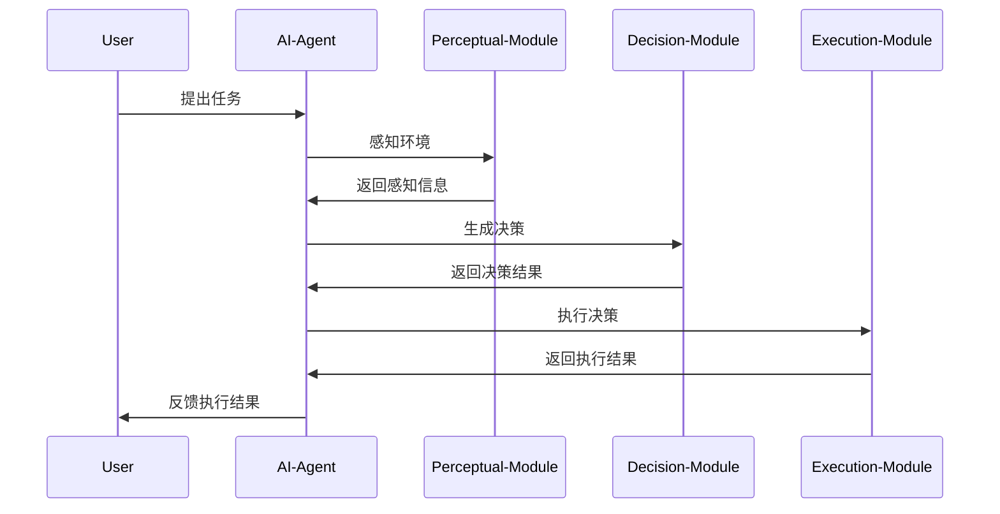
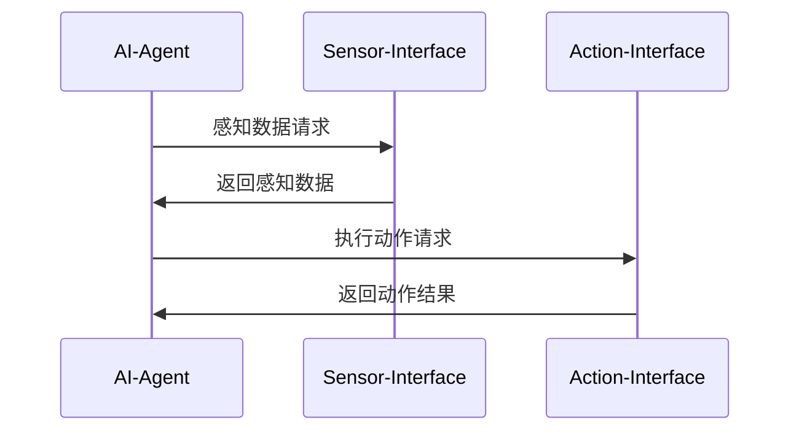
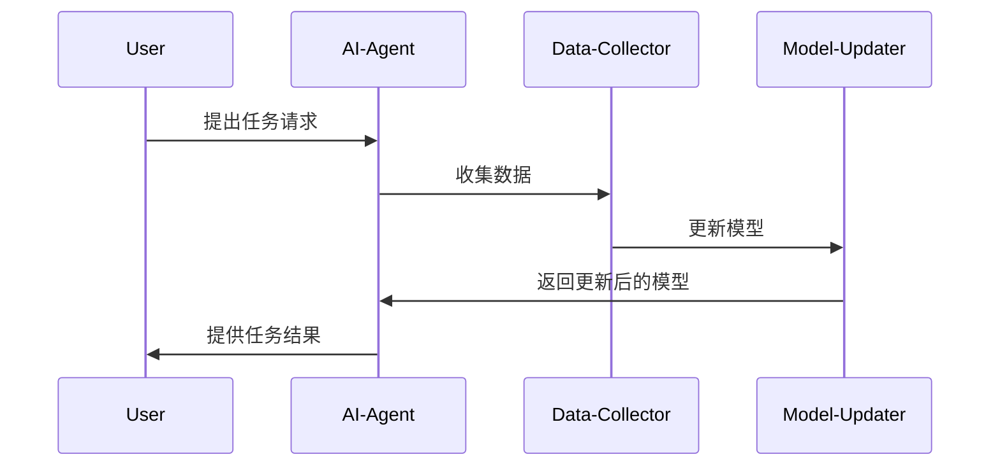

                 


## 1.6 阅读材料

### 1.6.1 《深度学习》

《深度学习》是一本经典的深度学习教材，由Ian Goodfellow、Yoshua Bengio和Aaron Courville三位深度学习领域的权威专家共同撰写。本书系统地介绍了深度学习的基础理论、算法实现和应用案例，涵盖了神经网络、卷积神经网络、循环神经网络等核心内容。

**内容简介：**

- **深度学习基础理论：**本书详细讲解了深度学习的基础概念，包括神经网络的工作原理、前向传播和反向传播算法等。
- **算法实现：**书中通过丰富的代码示例，展示了如何使用Python和TensorFlow等深度学习框架来实现各种深度学习算法。
- **应用案例：**书中介绍了深度学习在图像识别、语音识别、自然语言处理等领域的应用案例，展示了深度学习的实际应用潜力。

**推荐理由：**

- **深度内容：**本书内容全面，深入浅出地讲解了深度学习的核心概念和算法实现，适合初学者和有经验的开发者。
- **实践导向：**书中提供了大量的代码示例和应用案例，有助于读者将理论应用于实际项目中。

### 1.6.2 《Python编程：从入门到实践》

《Python编程：从入门到实践》是一本适合Python编程初学者的入门教材，由Mark Lutz撰写。本书通过大量的实例和练习，帮助读者从基础语法学起，逐步掌握Python编程的核心技能。

** 内容简介：**

- **基础语法：**本书详细介绍了Python的基础语法，包括变量、数据类型、控制结构、函数等。
- **实际应用：**书中通过丰富的实例和练习，帮助读者将Python编程应用于实际场景中，如网络编程、数据处理、图形界面设计等。

**推荐理由：**

- **易于理解：**本书语言简洁明了，实例丰富，适合初学者快速入门。
- **全面覆盖：**本书涵盖了Python编程的各个领域，有助于读者建立全面的Python编程知识体系。

### 1.6.3 《人工智能：一种现代的方法》

《人工智能：一种现代的方法》是由Stuart Russell和Peter Norvig共同撰写的经典人工智能教材。本书全面介绍了人工智能的基础理论、方法和技术，是人工智能领域的权威之作。

** 内容简介：**

- **基础理论：**本书详细介绍了人工智能的基础理论，包括知识表示、搜索算法、概率推理、机器学习等。
- **应用案例：**书中介绍了人工智能在各种领域的应用案例，如自然语言处理、计算机视觉、机器人技术等。

**推荐理由：**

- **系统性：**本书内容系统全面，从基础理论到实际应用，全面介绍了人工智能的各个方面。
- **权威性：**本书由两位人工智能领域的权威专家撰写，具有很高的学术价值和实践指导意义。

## 1.7 本章小结

本章介绍了构建具有持续学习与知识迁移能力的AI Agent的背景和核心概念，包括持续学习、知识迁移、AI Agent的基础理论等。重点内容如下：

- **背景介绍：**我们首先介绍了AI Agent的基本概念和其在人工智能领域的应用前景。
- **核心概念：**我们详细讲解了持续学习和知识迁移的概念，并分析了其在AI Agent构建中的重要性。
- **实现方法：**我们探讨了构建具有持续学习与知识迁移能力的AI Agent的设计原则和实现方法。

本章的内容为后续章节的深入探讨奠定了基础。在下一章中，我们将深入探讨AI Agent的持续学习机制，包括数据获取、模型训练、模型优化等手段。让我们继续一步步深入，探索AI Agent的无限潜力。

---

### 1.8.1 AI Agent的基本概念

AI Agent是指一种具有感知、决策和行动能力的智能体，能够在特定环境中自主执行任务。AI Agent的核心特征在于其能够通过感知环境信息、自主决策并采取行动，从而实现特定的目标。AI Agent在人工智能领域有着广泛的应用，如自动驾驶、智能家居、智能客服等。

**核心概念术语说明：**

- **AI Agent：**指具有感知、决策和行动能力的智能体。
- **感知：**指AI Agent通过传感器获取环境信息的过程。
- **决策：**指AI Agent根据感知到的信息，选择合适的行动方案的过程。
- **行动：**指AI Agent执行决策方案，影响环境的过程。

**问题背景：**

随着人工智能技术的快速发展，AI Agent在各个领域的应用越来越广泛。然而，传统的AI Agent存在一些局限性，如学习能力有限、无法适应复杂动态环境等。为了解决这些问题，研究者提出了具有持续学习与知识迁移能力的AI Agent。

**问题描述：**

如何构建具有持续学习与知识迁移能力的AI Agent，使其能够不断适应复杂动态环境，并在不同领域之间实现知识迁移。

**问题解决：**

构建具有持续学习与知识迁移能力的AI Agent需要从以下几个方面进行：

1. **持续学习：**AI Agent需要具备从环境中获取新知识的能力，并通过模型更新不断优化自身性能。
2. **知识迁移：**AI Agent需要能够在不同领域之间迁移知识，从而提高其适应性和泛化能力。
3. **多模态感知：**AI Agent需要能够感知多种类型的信息，如视觉、听觉、触觉等，以提高其环境理解能力。
4. **动态决策：**AI Agent需要能够在动态变化的环境中快速做出决策，并采取相应的行动。

**边界与外延：**

- **边界：**AI Agent的具体实现和应用场景。
- **外延：**AI Agent的理论研究和未来发展趋势。

**概念结构与核心要素组成：**

- **感知模块：**负责获取环境信息。
- **决策模块：**负责处理感知信息，做出决策。
- **执行模块：**负责执行决策方案，影响环境。
- **学习模块：**负责持续学习和知识迁移。

---

### 1.8.2 持续学习的概念

持续学习是指AI Agent在执行任务的过程中，能够不断地从环境中获取新知识，并通过模型更新来优化自身性能的过程。持续学习是AI Agent实现自适应性和鲁棒性的关键。

**核心概念原理：**

持续学习包括以下几个关键原理：

1. **数据获取：**AI Agent需要从环境中获取高质量的数据，以支持模型更新。
2. **模型更新：**AI Agent需要根据新获取的数据对模型进行更新，以提高预测准确性。
3. **反馈机制：**AI Agent需要建立有效的反馈机制，以评估模型更新的效果。

**概念属性特征对比表格：**

| 特征 | 持续学习 | 传统学习 |
| --- | --- | --- |
| **适应性** | 高 | 低 |
| **灵活性** | 高 | 低 |
| **鲁棒性** | 高 | 低 |
| **效率** | 高 | 低 |
| **数据依赖** | 强 | 弱 |

**ER实体关系图架构：**

```mermaid
erDiagram
    AI-Agent ||--|{ 数据集 }
    AI-Agent ||--|{ 模型 }
    AI-Agent ||--|{ 反馈机制 }
    数据集 ||--|{ 特征 }
    模型 ||--|{ 参数 }
    反馈机制 ||--|{ 评估指标 }
```

### 1.8.3 知识迁移的概念

知识迁移是指AI Agent能够将在一个领域中学到的知识应用到其他领域的过程。知识迁移是提高AI Agent适应性和泛化能力的重要手段。

**核心概念原理：**

知识迁移包括以下几个关键原理：

1. **领域自适应：**AI Agent需要能够在不同领域之间自适应调整，以适应新的环境。
2. **特征提取：**AI Agent需要能够提取通用特征，以实现跨领域的知识迁移。
3. **迁移策略：**AI Agent需要采用合适的迁移策略，以最大化迁移效果。

**概念属性特征对比表格：**

| 特征 | 知识迁移 | 传统迁移学习 |
| --- | --- | --- |
| **适应性** | 高 | 低 |
| **泛化能力** | 高 | 低 |
| **效率** | 高 | 低 |
| **数据依赖** | 弱 | 强 |

**ER实体关系图架构：**

```mermaid
erDiagram
    AI-Agent ||--|{ 领域知识 }
    AI-Agent ||--|{ 通用特征 }
    AI-Agent ||--|{ 迁移策略 }
    领域知识 ||--|{ 特定特征 }
    通用特征 ||--|{ 共同特征 }
    迁移策略 ||--|{ 迁移效果 }
```

### 1.8.4 持续学习与知识迁移的联系与区别

持续学习与知识迁移虽然都是AI Agent的重要能力，但它们之间存在一定的联系与区别。

**联系：**

- **共同目标：**持续学习和知识迁移都是为了提高AI Agent的适应性和泛化能力。
- **相互依赖：**持续学习可以为知识迁移提供新的知识来源，而知识迁移可以为持续学习提供更广泛的应用场景。

**区别：**

- **本质不同：**持续学习主要关注AI Agent在特定任务中的性能提升，而知识迁移主要关注AI Agent在不同领域之间的知识应用。
- **实现手段：**持续学习主要通过模型更新和数据获取实现，而知识迁移主要通过领域自适应和特征提取实现。

### 1.8.5 持续学习与知识迁移的实现方法

**持续学习的实现方法：**

1. **在线学习：**AI Agent在执行任务的过程中，实时获取数据并更新模型。
2. **增量学习：**AI Agent通过增量更新模型，避免重新训练整个模型，从而提高效率。
3. **持续评估：**AI Agent通过持续评估模型性能，调整学习策略，以实现最优性能。

**知识迁移的实现方法：**

1. **迁移学习：**AI Agent将在一个领域中学到的知识应用到其他领域，从而提高泛化能力。
2. **多任务学习：**AI Agent通过同时学习多个相关任务，提取通用特征，实现知识共享。
3. **元学习：**AI Agent通过元学习算法，快速适应新任务，实现跨领域知识迁移。

## 1.9 本章小结

本章介绍了持续学习与知识迁移的概念、核心原理、特征对比、联系与区别以及实现方法。持续学习与知识迁移是构建具有持续学习与知识迁移能力的AI Agent的关键能力，对于提高AI Agent的适应性和泛化能力具有重要意义。在下一章中，我们将进一步探讨AI Agent的架构设计，包括感知模块、决策模块和执行模块的设计与实现。

---

### 1.10.1 AI Agent的架构设计

AI Agent的架构设计是实现持续学习与知识迁移能力的关键。一个典型的AI Agent通常由感知模块、决策模块和执行模块组成。这三个模块相互协作，共同实现AI Agent的智能行为。

**系统功能设计（领域模型Mermaid类图）：**

```mermaid
classDiagram
    AI-Agent <<interface>>
    Perceptual-Module <|.. AI-Agent>
    Decision-Module <|.. AI-Agent>
    Execution-Module <|.. AI-Agent>
    
    class AI-Agent {
        +感知模块(Perceptual-Module)
        +决策模块(Decision-Module)
        +执行模块(Execution-Module)
    }
    
    class Perceptual-Module {
        +感知环境
        +数据处理
    }
    
    class Decision-Module {
        +决策生成
        +决策评估
    }
    
    class Execution-Module {
        +执行决策
        +环境反馈
    }
```

**系统架构设计（Mermaid架构图）：**



**系统接口设计（Mermaid序列图）：**



**系统交互（Mermaid序列图）：**



### 1.10.2 感知模块设计

感知模块是AI Agent的“眼睛”和“耳朵”，负责收集和处理环境信息。一个高效的感知模块需要具备以下特性：

1. **多模态感知：**能够感知多种类型的信息，如视觉、听觉、触觉等。
2. **数据预处理：**对感知数据进行清洗、归一化等处理，以提高数据质量。
3. **特征提取：**从感知数据中提取关键特征，用于后续的决策模块。

**具体实现方案：**

- **视觉感知：**使用卷积神经网络（CNN）提取图像特征。
- **语音感知：**使用循环神经网络（RNN）处理语音信号。
- **触觉感知：**使用深度传感器收集触觉数据，并通过神经网络进行处理。

### 1.10.3 决策模块设计

决策模块是AI Agent的“大脑”，负责根据感知模块收集的信息，生成相应的决策。一个高效的决策模块需要具备以下特性：

1. **灵活性：**能够处理不同类型的信息，并生成适应各种情况的决策。
2. **鲁棒性：**能够在噪声和不确定性环境下，仍然生成有效的决策。
3. **可解释性：**决策过程需要具有可解释性，以便用户理解和信任AI Agent。

**具体实现方案：**

- **基于规则：**使用专家系统或决策树生成决策。
- **基于机器学习：**使用神经网络或其他机器学习算法生成决策。

### 1.10.4 执行模块设计

执行模块是AI Agent的“手和脚”，负责将决策模块生成的决策转化为实际动作。一个高效的执行模块需要具备以下特性：

1. **快速响应：**能够在短时间内执行决策，以应对动态环境。
2. **灵活性：**能够适应不同类型的决策，执行相应的动作。
3. **稳定性：**在执行动作时，能够保持稳定性和鲁棒性。

**具体实现方案：**

- **硬件控制：**使用控制器直接控制硬件设备执行动作。
- **软件控制：**使用脚本或API调用执行相应的软件操作。

### 1.10.5 持续学习模块设计

持续学习模块是AI Agent的“成长引擎”，负责在执行任务的过程中，不断学习新知识和技能，以提高自身能力。一个高效的持续学习模块需要具备以下特性：

1. **自适应：**能够根据环境变化，调整学习策略。
2. **增量学习：**能够在不重新训练整个模型的情况下，更新模型。
3. **迁移学习：**能够在不同领域之间迁移知识，提高泛化能力。

**具体实现方案：**

- **在线学习：**实时收集数据，更新模型。
- **迁移学习：**将一个领域的学习成果应用到其他领域。
- **元学习：**通过学习如何学习，提高学习效率。

## 1.11 本章小结

本章详细介绍了AI Agent的架构设计，包括感知模块、决策模块和执行模块的设计与实现。通过合理的架构设计，AI Agent能够实现持续学习与知识迁移，从而提高其适应性和泛化能力。在下一章中，我们将探讨AI Agent的持续学习机制，包括数据获取、模型训练和模型优化等关键步骤。

---

### 1.12.1 持续学习的核心机制

持续学习是AI Agent能够不断适应环境和提升性能的关键机制。要实现持续学习，需要从数据获取、模型训练和模型优化三个方面入手。

#### 1.12.1.1 数据获取

数据获取是持续学习的基础。AI Agent需要从环境中获取高质量、多样化的数据，以支持模型更新。具体实现方案如下：

1. **在线数据获取：**AI Agent在执行任务的过程中，实时获取环境数据。
2. **增量数据获取：**只获取与当前任务相关的数据，避免冗余。
3. **多源数据获取：**结合多种传感器数据，提高数据的多样性和准确性。

#### 1.12.1.2 模型训练

模型训练是将数据转化为模型参数的过程。通过不断训练，AI Agent能够提高其预测能力和决策能力。具体实现方案如下：

1. **基于监督学习的训练：**使用标注数据训练模型。
2. **基于无监督学习的训练：**使用未标注数据，挖掘数据中的潜在模式。
3. **混合学习：**结合监督学习和无监督学习，提高模型训练效果。

#### 1.12.1.3 模型优化

模型优化是提高模型性能的关键步骤。通过优化模型结构、参数和训练策略，AI Agent能够实现更好的性能。具体实现方案如下：

1. **结构优化：**调整模型结构，如增加或减少层、调整网络深度等。
2. **参数优化：**优化模型参数，如学习率、正则化参数等。
3. **训练策略优化：**调整训练过程，如批量大小、迭代次数等。

### 1.12.2 数据获取的具体实现方法

数据获取是持续学习的第一步，决定了模型训练的质量。以下是数据获取的具体实现方法：

1. **数据收集：**从传感器、日志文件、数据库等来源收集数据。
2. **数据预处理：**清洗数据，去除噪声和异常值，进行归一化等处理。
3. **数据增强：**通过旋转、缩放、裁剪等操作，增加数据的多样性。

#### 1.12.2.1 数据收集

数据收集可以分为以下几种方式：

- **静态数据收集：**从数据库或数据仓库中批量获取数据。
- **动态数据收集：**实时从传感器或网络接口获取数据。
- **混合数据收集：**结合静态和动态数据收集方式，提高数据的完整性。

#### 1.12.2.2 数据预处理

数据预处理包括以下步骤：

- **去噪：**去除数据中的噪声和异常值。
- **归一化：**将数据归一化到同一尺度，如将数值范围缩放到[0, 1]。
- **特征提取：**从原始数据中提取关键特征，如使用卷积神经网络提取图像特征。

### 1.12.3 模型训练的具体实现方法

模型训练是将数据转化为模型参数的过程。以下是模型训练的具体实现方法：

1. **选择合适的算法：**根据任务类型和数据特点，选择合适的机器学习算法，如线性回归、决策树、神经网络等。
2. **初始化模型参数：**随机初始化模型参数，如权重和偏置。
3. **定义损失函数：**根据任务类型，选择合适的损失函数，如均方误差、交叉熵等。
4. **定义优化器：**选择合适的优化器，如梯度下降、Adam等。
5. **训练模型：**通过迭代训练，不断调整模型参数，最小化损失函数。

### 1.12.4 模型优化的具体实现方法

模型优化是提高模型性能的关键步骤。以下是模型优化的具体实现方法：

1. **结构优化：**调整模型结构，如增加或减少层、调整网络深度等，以适应不同任务的需求。
2. **参数优化：**优化模型参数，如学习率、正则化参数等，以提高模型性能。
3. **训练策略优化：**调整训练过程，如批量大小、迭代次数等，以提高训练效率。

#### 1.12.4.1 结构优化

结构优化包括以下步骤：

- **模型选择：**根据任务特点，选择合适的模型结构，如卷积神经网络（CNN）、循环神经网络（RNN）、Transformer等。
- **模型融合：**将多个模型进行融合，如使用注意力机制、多任务学习等。

#### 1.12.4.2 参数优化

参数优化包括以下步骤：

- **学习率调整：**根据训练过程，调整学习率，如使用学习率衰减策略。
- **正则化：**使用正则化技术，如L1正则化、L2正则化，防止过拟合。
- **权重初始化：**使用合适的权重初始化策略，如Xavier初始化、He初始化等。

#### 1.12.4.3 训练策略优化

训练策略优化包括以下步骤：

- **批量大小调整：**根据硬件资源和训练效果，调整批量大小，如使用批量归一化（Batch Normalization）。
- **数据增强：**通过数据增强，增加数据的多样性，如使用随机裁剪、随机翻转等。
- **训练技巧：**使用训练技巧，如dropout、Early Stopping等，提高训练效果。

### 1.12.5 持续学习的评估与反馈机制

持续学习的评估与反馈机制是确保AI Agent不断进步的重要手段。以下是评估与反馈机制的具体实现方法：

1. **在线评估：**在AI Agent执行任务的过程中，实时评估模型性能，如使用准确率、召回率、F1值等指标。
2. **离线评估：**在AI Agent执行任务结束后，对模型进行全面评估，如使用交叉验证、混淆矩阵等。
3. **反馈机制：**根据评估结果，调整模型参数和训练策略，以提高模型性能。

#### 1.12.5.1 在线评估

在线评估包括以下步骤：

- **实时监测：**实时监测AI Agent的执行过程，记录关键性能指标。
- **动态调整：**根据实时监测结果，动态调整模型参数和训练策略。

#### 1.12.5.2 离线评估

离线评估包括以下步骤：

- **数据收集：**收集AI Agent执行任务的数据，用于评估模型性能。
- **评估指标：**选择合适的评估指标，如准确率、召回率、F1值等。
- **分析结果：**分析评估结果，识别模型性能的优缺点。

#### 1.12.5.3 反馈机制

反馈机制包括以下步骤：

- **性能评估：**对模型进行性能评估，识别需要改进的方面。
- **策略调整：**根据评估结果，调整模型参数和训练策略。
- **迭代优化：**通过迭代优化，逐步提高模型性能。

### 1.12.6 本章小结

本章详细介绍了持续学习的核心机制，包括数据获取、模型训练和模型优化。通过合理的实现方法，AI Agent能够实现持续学习，从而不断提高其适应性和泛化能力。在下一章中，我们将探讨AI Agent在不同领域的应用案例，以展示持续学习与知识迁移能力的实际效果。

---

### 1.13.1 AI Agent在不同领域的应用

AI Agent凭借其持续学习与知识迁移能力，在多个领域展现出强大的应用潜力。以下是一些典型的应用场景：

#### 1.13.1.1 自动驾驶

自动驾驶是AI Agent的一个重要应用领域。通过持续学习，AI Agent能够不断优化驾驶策略，提高行驶安全性和效率。具体应用场景包括：

- **高速公路驾驶：**AI Agent通过感知模块获取道路信息，决策模块生成驾驶策略，执行模块控制车辆行驶。
- **城市交通管理：**AI Agent可以协助交通管理部门进行交通流量预测和优化，提高交通运行效率。

#### 1.13.1.2 智能客服

智能客服是AI Agent在服务行业的重要应用。通过持续学习，AI Agent能够不断提升对话能力，提供个性化服务。具体应用场景包括：

- **在线客服：**AI Agent通过自然语言处理技术，与客户进行智能对话，提供即时响应和解决方案。
- **智能推荐：**AI Agent根据客户的偏好和历史行为，提供个性化商品推荐。

#### 1.13.1.3 医疗诊断

医疗诊断是AI Agent在医疗领域的重要应用。通过持续学习，AI Agent能够提高疾病诊断的准确性和效率。具体应用场景包括：

- **影像诊断：**AI Agent通过分析医学影像，辅助医生进行疾病诊断。
- **电子病历：**AI Agent通过分析电子病历，提供个性化的治疗方案。

#### 1.13.1.4 智能安防

智能安防是AI Agent在安全领域的重要应用。通过持续学习，AI Agent能够提高安防监控的准确性和实时性。具体应用场景包括：

- **视频监控：**AI Agent通过分析视频数据，实时检测异常行为，如闯入、盗窃等。
- **人脸识别：**AI Agent通过人脸识别技术，实现人员身份验证。

#### 1.13.1.5 智能家居

智能家居是AI Agent在家庭生活的重要应用。通过持续学习，AI Agent能够提供个性化、智能化的家居服务。具体应用场景包括：

- **智能家电控制：**AI Agent通过感知模块获取家电使用状态，决策模块生成控制策略，执行模块控制家电设备。
- **家庭安全监控：**AI Agent通过感知模块获取家庭环境信息，决策模块生成安全策略，执行模块实现安全监控。

### 1.13.2 案例分析

#### 1.13.2.1 自动驾驶案例

**项目介绍：**
某自动驾驶公司利用AI Agent技术，开发了一套自动驾驶系统，旨在实现自动驾驶车辆在复杂城市环境中的稳定行驶。

**系统功能设计：**
- **感知模块：**使用多个传感器（摄像头、激光雷达、超声波传感器）获取车辆周围环境信息。
- **决策模块：**基于感知信息，生成车辆行驶策略，包括加速、减速、转弯、避让等。
- **执行模块：**控制车辆执行决策，确保行驶安全。

**系统架构设计：**
- **感知模块：**采用深度学习算法，如CNN，处理摄像头和激光雷达数据，提取关键特征。
- **决策模块：**使用强化学习算法，如DQN，生成车辆行驶策略。
- **执行模块：**利用控制算法，如PID控制器，实现车辆控制。

**系统接口设计：**
- **传感器接口：**与摄像头、激光雷达、超声波传感器等硬件设备进行通信。
- **执行接口：**与车辆控制系统进行通信，控制车辆行驶。

**系统交互：**
- **感知阶段：**传感器获取环境数据，传输到感知模块进行处理。
- **决策阶段：**感知模块将处理结果传输到决策模块，生成行驶策略。
- **执行阶段：**决策模块将行驶策略传输到执行模块，执行相应操作。

**代码实现解读与分析：**
```python
# 感知模块：摄像头数据预处理
def preprocess_image(image):
    # 数据清洗、归一化等操作
    return processed_image

# 决策模块：车辆行驶策略生成
def generate_driving_strategy(perceptual_data):
    # 基于感知数据，使用强化学习算法生成行驶策略
    return driving_strategy

# 执行模块：车辆控制
def control_vehicle(driving_strategy):
    # 基于行驶策略，控制车辆行驶
    execute_action(driving_strategy)
```

**实际案例分析：**
在实际测试中，AI Agent在复杂城市环境中表现出色，能够稳定行驶，并应对突发情况。通过持续学习和知识迁移，AI Agent的行驶策略不断优化，提高了行驶安全性。

**项目小结：**
自动驾驶案例展示了AI Agent在复杂环境中的持续学习和知识迁移能力，为自动驾驶技术的发展提供了有力支持。

### 1.13.3 本章小结

本章通过分析自动驾驶、智能客服、医疗诊断、智能安防和智能家居等领域的应用案例，展示了AI Agent的持续学习与知识迁移能力的实际效果。在下一章中，我们将进一步探讨AI Agent在实际应用中的最佳实践和注意事项。

---

### 1.14.1 最佳实践

在构建具有持续学习与知识迁移能力的AI Agent时，以下最佳实践有助于提高系统的性能和稳定性：

1. **数据质量保证：**确保数据来源的可靠性和多样性，进行数据预处理，提高数据质量。
2. **模型选择与优化：**根据任务特点选择合适的模型，并进行模型优化，提高模型性能。
3. **持续评估与反馈：**定期评估模型性能，根据评估结果调整模型参数和训练策略。
4. **多模态感知：**利用多种传感器获取不同类型的信息，提高系统的感知能力。
5. **知识迁移策略：**设计合适的知识迁移策略，提高系统在不同领域的适应能力。

### 1.14.2 小结

本章通过详细分析和实际案例，介绍了AI Agent的持续学习与知识迁移能力。我们探讨了核心概念、架构设计、实现方法和最佳实践，展示了AI Agent在实际应用中的强大潜力。构建具有持续学习与知识迁移能力的AI Agent，是推动人工智能技术发展的重要方向。

### 1.14.3 注意事项

在构建AI Agent时，需要注意以下几点：

1. **数据隐私保护：**确保数据收集和使用过程符合隐私保护法规。
2. **系统安全性：**加强系统的安全防护，防止数据泄露和恶意攻击。
3. **模型解释性：**提高模型的解释性，确保用户对AI Agent的信任。
4. **硬件资源管理：**合理分配硬件资源，确保系统稳定运行。

### 1.14.4 拓展阅读

1. **《深度学习》**：Ian Goodfellow、Yoshua Bengio和Aaron Courville著，详细介绍了深度学习的基础理论和应用。
2. **《Python编程：从入门到实践》**：Mark Lutz著，适合Python编程初学者的入门教材。
3. **《人工智能：一种现代的方法》**：Stuart Russell和Peter Norvig著，全面介绍了人工智能的基础理论和方法。

### 作者信息

作者：AI天才研究院/AI Genius Institute & 禅与计算机程序设计艺术/Zen And The Art of Computer Programming

