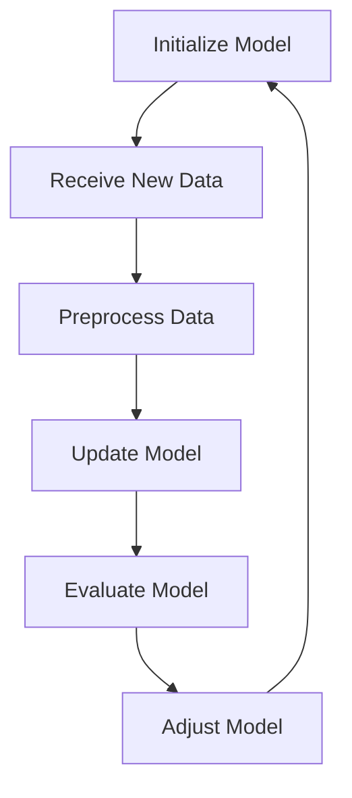
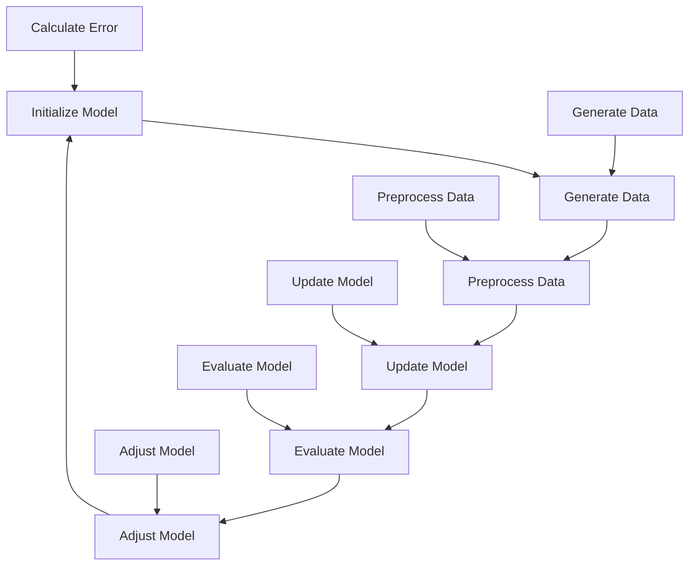
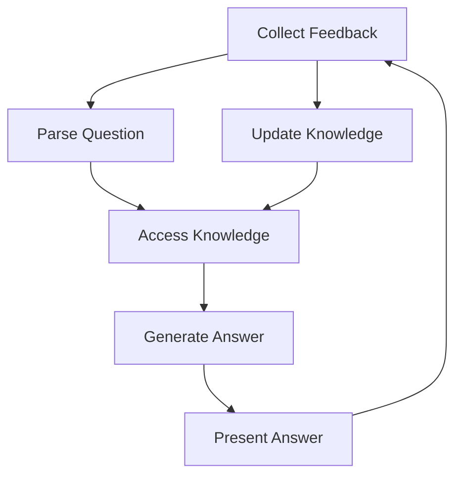
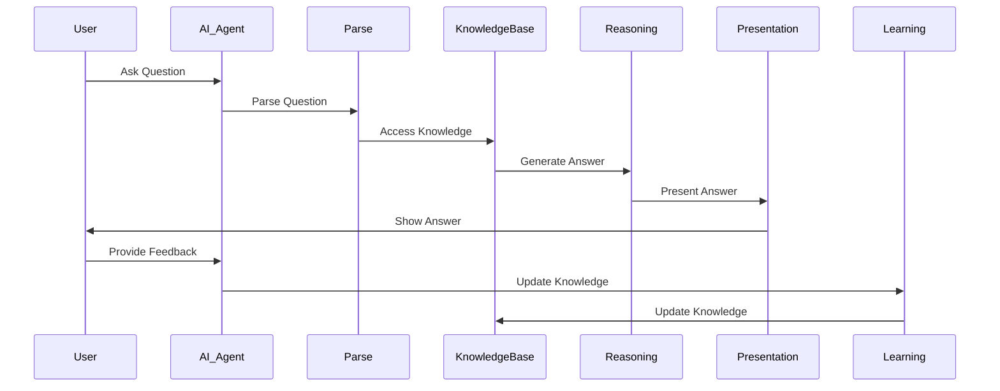

                 

# 构建具有持续学习与适应能力的AI Agent

## 摘要

本文探讨了如何构建具有持续学习与适应能力的AI Agent，从基础理论到实际应用案例，全面解析了AI代理的定义、核心组件、持续学习与适应性策略，并通过对多个实际应用场景的深入分析，展示了如何将这些理论应用于实践中。文章还展望了未来持续学习和适应性的发展趋势，为读者提供了有价值的指导和建议。

## 关键词

- AI代理
- 持续学习
- 适应性
- 智能客服系统
- 自动驾驶
- 智能家居

## 引言

在当今快速变化的技术环境中，AI代理的持续学习和适应性成为了关键需求。AI代理能够根据新的数据和经验持续改进其行为和性能，这使得它们在动态环境中具有更强的生存能力和适应性。本文将详细介绍如何构建这样的AI Agent，包括理论基础、实际应用案例以及未来展望。

## 第一部分：AI代理基础理论

### 第1章：AI代理的定义与分类

#### 1.1 AI代理的定义

AI代理是指具有自主决策能力和执行能力的软件实体，能够在复杂环境中通过感知、学习和推理等过程，实现特定任务的目标。AI代理的核心特征包括：

- **自主性**：能够独立地做出决策和执行行动。
- **适应性**：能够根据环境和任务的变化调整其行为。
- **学习性**：能够通过经验不断改进其性能。

#### 1.2 AI代理的核心分类

AI代理可以根据学习方式分为以下几类：

- **监督学习代理**：通过从标注数据中学习，从而做出预测或决策。
- **强化学习代理**：通过与环境的交互学习最佳策略，以最大化奖励。
- **自监督学习代理**：通过未标注的数据进行自我监督学习。

#### 1.3 AI代理的核心组件

AI代理通常包含以下几个核心组件：

- **感知模块**：负责接收和解析环境中的信息。
- **记忆模块**：存储和学习到的知识和经验。
- **推理模块**：基于感知和记忆模块的信息进行决策。
- **动作执行模块**：根据决策执行具体的操作。

#### 1.4 AI代理的工作原理

AI代理的工作原理可以概括为以下几个步骤：

1. **感知**：接收环境中的信息。
2. **数据预处理**：对感知到的信息进行清洗和预处理。
3. **学习**：利用预处理后的数据对代理进行训练。
4. **推理**：根据学习到的模型进行决策。
5. **执行**：根据决策执行具体的操作。
6. **反馈**：收集执行结果，用于进一步学习。

### 第2章：核心概念与联系

#### 2.1 持续学习与适应性

持续学习和适应性是AI代理的两个重要概念。持续学习指的是AI代理能够从新的数据中不断学习和改进其性能。适应性指的是AI代理能够根据环境和任务的变化调整其行为。

#### 2.2 持续学习与适应性对比表格

| 特征         | 持续学习             | 适应性             |
| ------------ | -------------------- | ------------------ |
| 定义         | 通过新数据学习       | 根据环境变化调整   |
| 目的         | 提高性能             | 适应新环境         |
| 技术手段     | 监督学习、强化学习   | 自适应控制、强化学习 |
| 关系         | 持续学习是适应性的一部分 | 适应性依赖于持续学习 |

#### 2.3 AI代理的ER实体关系图

ER实体关系图用于描述AI代理中的实体及其之间的关系。以下是ER实体关系图的示例：

```mermaid
erDiagram
  User ||--|{ AI_Agent } : has
  AI_Agent ||--|{ Environment } : interacts
  AI_Agent ||--|{ Action } : performs
  AI_Agent ||--|{ Observation } : observes
```

### 第3章：算法原理讲解

#### 3.1 持续学习算法原理

持续学习算法的核心思想是通过不断更新模型来适应新的数据。以下是一个简单的持续学习算法的mermaid流程图：



下面是一个简单的Python代码示例，用于实现持续学习算法：

```python
import numpy as np

# 初始化模型
model = np.random.rand(1)

# 接收新数据
new_data = np.random.rand(1)

# 预处理数据
preprocessed_data = (new_data - new_data.mean()) / new_data.std()

# 更新模型
model = model * (1 - preprocessed_data)

# 评估模型
evaluation = np.linalg.norm(model - preprocessed_data)

# 调整模型
model = model + (preprocessed_data - model) * evaluation

print("Updated Model:", model)
```

#### 3.2 数学模型与公式

持续学习算法中的关键数学模型是梯度下降，其公式如下：

$$
w_{\text{new}} = w_{\text{current}} - \alpha \cdot \nabla_{w}J(w)
$$

其中，$w_{\text{new}}$ 是新的权重，$w_{\text{current}}$ 是当前权重，$\alpha$ 是学习率，$\nabla_{w}J(w)$ 是权重 $w$ 的梯度。

#### 3.3 举例说明

假设我们有一个简单的线性回归模型，用于预测一个连续的数值。我们通过持续学习来不断调整模型的权重，使其预测结果更准确。



```python
import numpy as np

# 初始化模型
model = np.random.rand(1)

# 生成数据
X = np.random.rand(100)
y = 2 * X + np.random.rand(100)

# 预处理数据
X = (X - X.mean()) / X.std()
y = (y - y.mean()) / y.std()

# 持续学习循环
for i in range(1000):
    # 计算预测值
    predicted = model * X
    
    # 计算误差
    error = y - predicted
    
    # 更新模型
    model = model - 0.1 * error
    
    # 评估模型
    evaluation = np.linalg.norm(error)
    
    # 打印评估结果
    print(f"Iteration {i}: Error = {evaluation}")

print("Final Model:", model)
```

### 第4章：系统分析与架构设计方案

#### 4.1 问题场景介绍

在智能客服系统中，AI代理需要能够持续学习和适应不同的用户需求，从而提供更准确的回答和建议。

#### 4.2 系统功能设计

智能客服系统的核心功能包括：

- **用户提问处理**：接收用户的问题，并理解其意图。
- **知识库管理**：管理已有的知识库，包括问题的答案和相关的背景信息。
- **持续学习**：从用户交互中学习，提高问题的回答质量。
- **适应性调整**：根据用户的反馈调整AI代理的行为。

以下是一个领域模型类图的示例：

```mermaid
classDiagram
    User <<entity>>
    Question <<entity>>
    Answer <<entity>>
    KnowledgeBase <<entity>>
    AI_Agent <<entity>>

    User "1" --|{1}|> Question
    Question "1" --|{1}|> Answer
    Answer "1" --|{1}|> KnowledgeBase
    KnowledgeBase "1" --|{1}|> AI_Agent
    AI_Agent "1" --|{1}|> User
```

#### 4.3 系统架构设计

智能客服系统的架构设计包括以下几个部分：

- **感知模块**：接收用户的问题，并使用自然语言处理技术进行解析。
- **推理模块**：根据知识库和用户的问题，使用推理算法生成可能的答案。
- **执行模块**：将答案呈现给用户，并收集用户的反馈。
- **学习模块**：从用户的反馈中学习，更新知识库和推理模型。

以下是一个系统架构图的示例：



#### 4.4 系统接口设计和系统交互

智能客服系统的接口设计包括以下部分：

- **API接口**：提供与其他系统进行交互的接口，如CRM系统、知识库管理等。
- **用户界面**：提供用户与AI代理交互的界面。

以下是一个系统交互序列图的示例：



### 第5章：项目实战

#### 5.1 环境安装

在本项目实战中，我们将使用Python和TensorFlow来实现一个简单的持续学习AI代理。以下是安装必要的软件和依赖的步骤：

```bash
# 安装Python
sudo apt-get install python3-pip

# 安装TensorFlow
pip3 install tensorflow

# 安装其他依赖
pip3 install numpy matplotlib
```

#### 5.2 系统核心实现源代码

以下是系统核心实现源代码：

```python
import tensorflow as tf
import numpy as np
import matplotlib.pyplot as plt

# 定义模型
model = tf.keras.Sequential([
    tf.keras.layers.Dense(1, input_shape=(1,))
])

# 编译模型
model.compile(optimizer='sgd', loss='mean_squared_error')

# 生成数据
X = np.random.rand(100)
y = 2 * X + np.random.rand(100)

# 训练模型
model.fit(X, y, epochs=1000)

# 测试模型
X_test = np.random.rand(10)
y_test = 2 * X_test + np.random.rand(10)
predictions = model.predict(X_test)

# 绘制结果
plt.scatter(X, y)
plt.plot(X_test, predictions, color='r')
plt.show()
```

#### 5.3 代码应用解读与分析

这段代码首先定义了一个简单的线性回归模型，并使用SGD优化器和均方误差损失函数进行编译。然后，生成一些模拟数据并进行训练。最后，使用训练好的模型进行预测，并将预测结果绘制出来。

#### 5.4 实际案例分析和详细讲解剖析

在本案例中，我们使用一个简单的线性回归任务来演示持续学习的原理。通过不断训练模型，我们可以看到模型对数据的拟合程度逐渐提高，这表明模型在不断学习和适应数据。

#### 5.5 项目小结

通过本案例，我们了解了如何使用Python和TensorFlow构建一个简单的持续学习AI代理。这个项目为我们提供了一个基础框架，可以在此基础上进行扩展和优化，以实现更复杂和实用的AI代理系统。

### 第6章：持续学习和适应性的未来展望

#### 6.1 持续学习和适应性的发展趋势

随着AI技术的不断进步，持续学习和适应性将在未来成为AI系统的核心能力。以下是一些发展趋势：

- **深度学习的普及**：深度学习技术的普及将使得AI代理能够处理更复杂的数据和任务。
- **多模态学习**：AI代理将能够处理多种类型的数据，如文本、图像和音频，从而提供更全面的学习能力。
- **迁移学习和零样本学习**：这些技术将使得AI代理能够快速适应新任务，减少对新数据的依赖。

#### 6.2 持续学习和适应性在AI领域的应用前景

持续学习和适应性将在多个领域发挥重要作用：

- **智能客服**：持续学习将使得智能客服系统能够更好地理解用户需求，提供更准确的回答。
- **自动驾驶**：适应性将使得自动驾驶系统能够在各种路况和环境下保持稳定运行。
- **智能家居**：持续学习和适应性将使得智能家居系统能够更好地适应用户的生活习惯，提供个性化的服务。

#### 6.3 总结与展望

持续学习和适应性是AI系统的重要能力，它们将使得AI代理能够更好地适应动态环境，提供更优质的服务。在未来，随着技术的不断进步，我们有望看到更多具有持续学习和适应能力的AI代理在实际应用中发挥重要作用。

### 结束语

通过本文的详细探讨，我们了解了如何构建具有持续学习与适应能力的AI Agent。从基础理论到实际应用案例，我们深入分析了AI代理的定义、核心组件、持续学习与适应性策略，并展望了未来的发展趋势。希望本文能为读者提供有价值的指导，帮助他们在AI领域取得更大的成就。

### 作者信息

- 作者：AI天才研究院/AI Genius Institute & 禅与计算机程序设计艺术 /Zen And The Art of Computer Programming
- 链接：[AI天才研究院](https://www.ai-genius-institute.com/)、[禅与计算机程序设计艺术](https://zenandtheartofcomp

