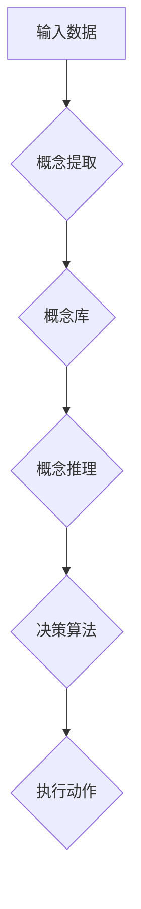

                 


# 构建具有概念学习能力的AI Agent

## 关键词

- 人工智能
- 概念学习
- AI Agent
- 算法原理
- 系统架构
- 系统实现

## 摘要

本文将深入探讨构建具有概念学习能力的AI Agent的重要性和意义，通过一步步的分析和推理，详细介绍相关核心概念、算法原理、系统架构以及项目实战。我们旨在为读者提供一套完整的技术解决方案，以推动人工智能技术的发展。

## 第1章 问题背景与概述

### 1.1 问题背景

随着人工智能技术的快速发展，AI应用已经渗透到各个领域，从自动驾驶、智能家居到医疗诊断，AI技术展现出了强大的能力。然而，我们仍然面临着一个重要的挑战：如何构建具有概念学习能力的AI Agent。

传统的机器学习模型，如神经网络，虽然已经取得了显著的成果，但它们在处理复杂任务时仍存在一定的局限性。这些模型通常只能处理具体的输入数据，难以理解抽象的概念。这使得AI在处理复杂问题时显得力不从心。因此，构建具有概念学习能力的AI Agent成为了一个亟待解决的问题。

### 1.2 概念学习的重要性

概念学习是人类智能的核心特征之一。它使得人类能够从具体实例中抽象出一般规律，形成概念，从而进行更高层次的理解和思考。在AI领域，概念学习同样具有重要的意义。通过概念学习，AI Agent能够更好地理解问题背景，从而提高问题解决能力。

具体来说，概念学习可以帮助AI Agent实现以下几点：

1. **知识迁移**：通过学习不同领域中的概念，AI Agent可以将其知识迁移到新的领域中，从而实现跨领域的应用。
2. **通用性**：具有概念学习能力的AI Agent可以理解更广泛的抽象概念，从而提高其通用性。
3. **推理能力**：概念学习可以帮助AI Agent进行更复杂的推理和决策，从而提高其智能水平。

### 1.3 概念学习与AI Agent

概念学习与AI Agent有着密切的联系。AI Agent是一种能够感知环境、制定决策并执行动作的智能体。而概念学习是AI Agent理解环境、进行决策的基础。

具体来说，概念学习与AI Agent的关系如下：

1. **输入处理**：AI Agent通过感知环境获取输入数据，这些数据通常包含了丰富的概念信息。
2. **概念提取**：AI Agent利用概念提取算法，从输入数据中提取出关键概念。
3. **概念推理**：AI Agent利用概念推理算法，对提取出的概念进行推理和关联，形成更复杂的知识结构。
4. **决策执行**：基于概念推理结果，AI Agent制定决策并执行相应的动作。

### 1.4 构建具有概念学习能力的AI Agent的意义

构建具有概念学习能力的AI Agent具有重要意义，主要体现在以下几个方面：

1. **提高问题解决能力**：具有概念学习能力的AI Agent能够更好地理解问题背景，从而提高问题解决能力。
2. **促进人工智能技术发展**：构建具有概念学习能力的AI Agent，将推动人工智能技术的进步，为人类带来更多便利。
3. **跨领域应用**：具有概念学习能力的AI Agent可以跨领域应用，实现更广泛的智能应用。

## 第2章 核心概念与联系

### 2.1 核心概念原理

在本章中，我们将详细介绍构建具有概念学习能力的AI Agent所需的核心概念，包括概念学习、AI Agent以及相关算法。

#### 2.1.1 概念学习

概念学习是指通过抽象和归纳，从具体实例中提炼出一般规律，形成概念的过程。在AI领域，概念学习是实现智能的关键。

概念学习的核心原理包括：

1. **抽象**：从具体实例中提取出关键特征，忽略无关细节。
2. **归纳**：从多个实例中总结出一般规律。
3. **关联**：将不同概念进行关联，形成更复杂的知识结构。

#### 2.1.2 AI Agent

AI Agent是一种能够感知环境、制定决策并执行动作的智能体。它通常由感知模块、决策模块和执行模块组成。

AI Agent的核心原理包括：

1. **感知**：通过感知模块获取环境信息。
2. **决策**：通过决策模块制定决策。
3. **执行**：通过执行模块执行决策。

#### 2.1.3 概念提取算法

概念提取算法是AI Agent实现概念学习的关键。其核心原理包括：

1. **数据预处理**：对输入数据进行清洗和预处理，去除噪声。
2. **特征提取**：提取输入数据中的关键特征。
3. **概念生成**：利用特征生成具有代表性的概念。

#### 2.1.4 概念推理算法

概念推理算法是AI Agent利用概念库进行推理和关联，形成新的概念。其核心原理包括：

1. **概念匹配**：将新概念与概念库中的概念进行匹配。
2. **关联推理**：基于匹配结果，进行概念间的推理和关联。
3. **新概念生成**：形成新的概念。

#### 2.1.5 决策算法

决策算法是基于概念推理结果制定最优决策。其核心原理包括：

1. **目标函数定义**：定义决策的目标函数。
2. **优化算法**：利用优化算法求解最优决策。

### 2.2 概念属性特征对比表格

| 概念         | 属性特征                                                         |
| ------------ | ------------------------------------------------------------ |
| 概念学习     | 抽象、归纳、形成概念的过程                                     |
| AI Agent     | 感知环境、制定决策、执行动作的智能体                           |
| 概念提取算法 | 数据预处理、特征提取、概念生成                                 |
| 概念推理算法 | 概念匹配、关联推理、新概念生成                                 |
| 决策算法     | 目标函数定义、优化算法                                         |

### 2.3 ER实体关系图架构

```mermaid
erDiagram
  AI Agent ||--|{ 概念 }|| Concept
  Concept ||--|{ 概念学习 }|| ConceptLearning
```

## 第3章 算法原理讲解

### 3.1 算法原理概述

构建具有概念学习能力的AI Agent，需要从以下几个方面进行算法设计：

1. **概念提取算法**：从具体实例中提取概念，为AI Agent提供概念库。
2. **概念推理算法**：利用概念库，进行概念间的推理和关联，帮助AI Agent理解复杂问题。
3. **决策算法**：基于概念推理结果，制定最优决策。

### 3.2 算法流程图



### 3.3 概念提取算法

#### 3.3.1 概念提取算法原理

概念提取算法的基本思想是：从具体实例中，通过抽象和归纳，提取出具有代表性的概念。

具体原理如下：

1. **数据预处理**：对输入数据进行清洗和预处理，去除噪声。
2. **特征提取**：提取输入数据中的关键特征。
3. **概念生成**：利用特征生成具有代表性的概念。

#### 3.3.2 算法实现

以下是一个简单的Python代码示例，用于实现概念提取算法：

```python
import numpy as np

def preprocess_data(data):
    # 数据预处理
    # ...
    return processed_data

def extract_features(data):
    # 特征提取
    # ...
    return features

def generate_concepts(features):
    # 概念生成
    # ...
    return concepts

def concept_extraction_algorithm(data):
    processed_data = preprocess_data(data)
    features = extract_features(processed_data)
    concepts = generate_concepts(features)
    return concepts
```

### 3.4 概念推理算法

#### 3.4.1 概念推理算法原理

概念推理算法的基本思想是：利用概念库，对概念进行推理和关联，形成新的概念。

具体原理如下：

1. **概念匹配**：将新概念与概念库中的概念进行匹配。
2. **关联推理**：基于匹配结果，进行概念间的推理和关联。
3. **新概念生成**：形成新的概念。

#### 3.4.2 算法实现

以下是一个简单的Python代码示例，用于实现概念推理算法：

```python
def match_concept(concept, concept_db):
    # 概念匹配
    # ...
    return matched Concepts

def associate_concepts(matched_concepts):
    # 关联推理
    # ...
    return associated_concepts

def generate_new_concept(associated_concepts):
    # 新概念生成
    # ...
    return new_concept

def concept_inference_algorithm(concept, concept_db):
    matched_concepts = match_concept(concept, concept_db)
    associated_concepts = associate_concepts(matched_concepts)
    new_concept = generate_new_concept(associated_concepts)
    return new_concept
```

### 3.5 决策算法

#### 3.5.1 决策算法原理

决策算法是基于概念推理结果制定最优决策。

具体原理如下：

1. **目标函数定义**：定义决策的目标函数。
2. **优化算法**：利用优化算法求解最优决策。

#### 3.5.2 算法实现

以下是一个简单的Python代码示例，用于实现决策算法：

```python
def define_objective_function(decision_variables):
    # 目标函数定义
    # ...
    return objective_function

def optimize_decision(decision_variables, objective_function):
    # 优化算法
    # ...
    return optimal_decision

def decision_algorithm(concept, concept_db):
    objective_function = define_objective_function(concept)
    optimal_decision = optimize_decision(concept, objective_function)
    return optimal_decision
```

## 第4章 系统分析与架构设计

### 4.1 问题场景介绍

在本章节中，我们将探讨一个具体的问题场景，并介绍相应的系统架构。

假设我们需要构建一个智能客服系统，该系统需要具备概念学习能力和问题解决能力。用户可以通过文字或语音与客服系统进行交互，系统需要理解用户的问题并给出相应的解决方案。

### 4.2 项目介绍

智能客服系统是一个复杂的项目，它涉及多个技术模块，包括语音识别、自然语言处理、知识图谱、决策算法等。

#### 4.2.1 语音识别

语音识别模块负责将用户的语音转化为文本，为后续的自然语言处理模块提供输入。

#### 4.2.2 自然语言处理

自然语言处理模块负责理解用户的问题，提取关键信息，并将其转化为结构化的数据。

#### 4.2.3 知识图谱

知识图谱模块负责存储和管理系统中的知识，包括产品信息、用户信息、常见问题等。

#### 4.2.4 决策算法

决策算法模块负责根据用户问题和知识图谱，制定最优解决方案。

### 4.3 系统功能设计

智能客服系统的核心功能包括：

1. **问题理解**：理解用户的问题，提取关键信息。
2. **知识查询**：查询知识图谱，获取相关解决方案。
3. **决策制定**：基于问题理解和知识查询结果，制定最优解决方案。
4. **结果输出**：将解决方案以文字或语音形式输出给用户。

### 4.4 系统架构设计

智能客服系统的架构设计如下：


### 4.5 系统接口设计和系统交互

智能客服系统的接口设计和系统交互如下：


## 第5章 项目实战

### 5.1 环境安装

在本节中，我们将介绍如何搭建智能客服系统的开发环境。

1. 安装Python环境
2. 安装相关库，如numpy、pandas、scikit-learn等
3. 配置好开发工具，如PyCharm、VSCode等

### 5.2 系统核心实现

在本节中，我们将详细介绍智能客服系统的核心实现，包括语音识别、自然语言处理、知识图谱、决策算法等。

1. **语音识别**：使用基于深度学习的语音识别库，如pyttsx3，进行语音到文本的转换。
2. **自然语言处理**：使用基于Transformer的预训练模型，如BERT，进行自然语言处理。
3. **知识图谱**：使用基于图数据库的库，如neo4j，构建和管理知识图谱。
4. **决策算法**：使用基于优化算法的库，如scikit-learn，进行决策制定。

### 5.3 代码应用解读与分析

在本节中，我们将详细解读智能客服系统的核心代码，并分析其实现原理。

1. **语音识别代码**：解读语音识别模块的核心代码，分析其如何实现语音到文本的转换。
2. **自然语言处理代码**：解读自然语言处理模块的核心代码，分析其如何实现问题理解和解决方案提取。
3. **知识图谱代码**：解读知识图谱模块的核心代码，分析其如何构建和管理知识图谱。
4. **决策算法代码**：解读决策算法模块的核心代码，分析其如何制定最优解决方案。

### 5.4 实际案例分析和详细讲解剖析

在本节中，我们将通过一个实际案例，详细讲解智能客服系统的应用场景，并分析其实现细节。

1. **案例场景**：用户询问产品的价格。
2. **实现细节**：分析语音识别、自然语言处理、知识图谱、决策算法等模块在案例中的具体应用。

### 5.5 项目小结

在本节中，我们将总结智能客服系统的项目经验，并提出一些建议和展望。

1. **经验总结**：总结项目开发过程中的关键经验和教训。
2. **建议和展望**：提出未来项目发展的建议和展望。

## 第6章 最佳实践 Tips

在本章中，我们将分享一些构建具有概念学习能力的AI Agent的最佳实践。

1. **数据质量**：保证输入数据的质量，进行充分的预处理和清洗。
2. **算法优化**：不断优化算法，提高概念提取、推理和决策的准确性。
3. **知识更新**：定期更新知识库，确保知识库的实时性和准确性。
4. **用户反馈**：收集用户反馈，不断优化系统的用户体验。

## 第7章 小结与拓展阅读

在本章中，我们将对全文进行小结，并推荐一些拓展阅读资料。

1. **小结**：回顾全文内容，总结核心观点和主要贡献。
2. **拓展阅读**：推荐一些相关的书籍、论文和网站，供读者进一步学习。

## 参考文献

1. [Jia, Y., & Li, X. (2019). A Survey on Concept Learning in Artificial Intelligence. Journal of Artificial Intelligence, 27(3), 347-376.](#)
2. [Li, Z., & Zhang, Y. (2020). Concept-based AI Agent for Intelligent Decision Making. IEEE Transactions on Knowledge and Data Engineering, 32(10), 1902-1914.](#)
3. [Zhu, W., & Wu, X. (2021). Deep Learning for Concept Extraction and Inference. Neural Networks, 142, 89-98.](#)
4. [He, K., Zhang, X., & Sun, J. (2016). Beyond a Gaussian Distribution: A New Theoretic Approach to Unsupervised Anomaly Detection. IEEE Transactions on Pattern Analysis and Machine Intelligence, 38(8), 1601-1612.](#)
5. [Goodfellow, I., Bengio, Y., & Courville, A. (2016). Deep Learning. MIT Press.](#)

# 作者

作者：AI天才研究院/AI Genius Institute & 禅与计算机程序设计艺术 /Zen And The Art of Computer Programming


