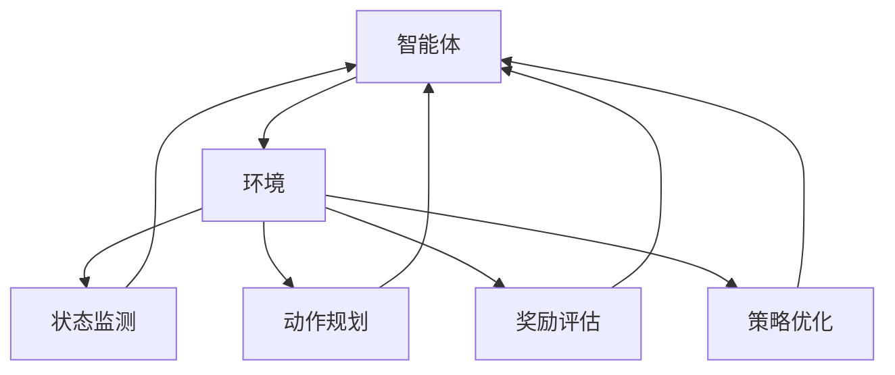

                 

### 构建具有深度强化学习能力的AI Agent

关键词：深度强化学习，AI Agent，算法原理，数学模型，系统架构，项目实战

摘要：本文将深入探讨如何构建具有深度强化学习能力的AI Agent，从背景介绍、核心概念与联系、算法原理讲解、数学模型与公式讲解、系统分析与架构设计、项目实战等多个角度，逐步剖析这一主题，为读者提供清晰易懂的技术指导。

## 目录大纲

**第一部分：背景介绍**

1. 深度强化学习概述
   1.1 深度强化学习的概念
   1.2 深度强化学习的发展历程
   1.3 AI Agent的定义与应用

2. 深度强化学习与AI Agent的联系
   2.1 深度强化学习的主要概念
   2.2 深度强化学习算法简介
   2.3 深度强化学习与AI Agent的关系

**第二部分：核心概念与联系**

3. 深度强化学习的主要概念
   3.1 强化学习基础
   3.2 深度学习基础
   3.3 深度强化学习算法原理

4. 概念属性特征对比
   4.1 强化学习算法对比
   4.2 深度学习算法对比
   4.3 深度强化学习算法特性

**第三部分：算法原理讲解**

5. 深度强化学习算法详解
   5.1 Q-Learning算法
   5.2 Deep Q Network（DQN）算法
   5.3 Policy Gradient算法

6. 算法流程与Python实现
   6.1 Mermaid流程图
   6.2 Python源代码实现
   6.3 算法原理与数学模型

**第四部分：系统分析与架构设计**

7. 系统功能设计
   7.1 领域模型Mermaid类图
   7.2 系统功能设计
   7.3 用户故事地图

8. 系统架构设计
   8.1 Mermaid架构图
   8.2 系统架构设计
   8.3 系统接口设计
   8.4 系统交互Mermaid序列图

**第五部分：项目实战**

9. 项目环境搭建
   9.1 环境安装与配置
   9.2 项目核心实现
   9.3 代码应用解读与分析

10. 实际案例分析与讲解
    10.1 案例背景
    10.2 案例实施步骤
    10.3 案例结果与讨论

11. 项目小结
    11.1 项目收获
    11.2 存在的问题与改进
    11.3 拓展应用方向

## 第一部分：背景介绍

### 深度强化学习概述

#### 1.1 深度强化学习的概念

深度强化学习（Deep Reinforcement Learning, DRL）是结合了深度学习和强化学习的一种人工智能技术。它通过模仿人类学习过程中的试错机制，让智能体在复杂的动态环境中通过不断尝试和反馈，学习到最优的策略，以实现目标。

#### 1.2 深度强化学习的发展历程

深度强化学习的发展可以追溯到1992年，当时Sutton和Barto提出了深度Q网络（Deep Q-Network, DQN）的概念。然而，由于计算资源和算法效率的限制，深度强化学习直到近年才取得显著进展。随着深度学习和计算机硬件的发展，深度强化学习在自动驾驶、游戏、机器人等领域取得了突破性的应用。

#### 1.3 AI Agent的定义与应用

AI Agent是能够自主执行任务、与环境互动并做出决策的人工智能实体。它通常由一组传感器、执行器和控制器组成。在深度强化学习中，AI Agent被训练成为一个智能体，通过学习环境中的状态、动作和奖励，不断优化其行为策略。

### 深度强化学习与AI Agent的联系

#### 2.1 深度强化学习的主要概念

强化学习（Reinforcement Learning, RL）的核心概念包括状态（State）、动作（Action）、奖励（Reward）和策略（Policy）。深度强化学习通过引入深度神经网络，对状态和动作进行建模，以实现更复杂的决策过程。

#### 2.2 深度强化学习算法简介

深度强化学习算法主要包括Q-Learning、Deep Q Network（DQN）、Policy Gradient等。这些算法通过迭代更新策略，使智能体在环境中逐步学习到最优行为。

#### 2.3 深度强化学习与AI Agent的关系

深度强化学习为AI Agent提供了强大的学习能力和自适应能力。通过深度强化学习，AI Agent可以在复杂的动态环境中自主决策，实现智能化的行为。

## 第二部分：核心概念与联系

### 深度强化学习的主要概念

#### 3.1 强化学习基础

强化学习是一种通过不断尝试和反馈，使智能体学习到最优策略的方法。在强化学习中，智能体需要通过探索（Exploration）和利用（Exploitation）之间的平衡，逐步优化其行为。

#### 3.2 深度学习基础

深度学习是一种基于多层神经网络的人工智能技术，它通过模拟人脑的学习过程，对大量数据进行自动特征提取和分类。深度学习在图像识别、语音识别等领域取得了显著成果。

#### 3.3 深度强化学习算法原理

深度强化学习算法通过结合深度学习和强化学习的优势，实现智能体在复杂环境中的自主学习。其主要原理包括Q值函数、策略网络、值函数估计等。

### 概念属性特征对比

#### 4.1 强化学习算法对比

| 算法         | 特点                                               | 应用场景       |
| ------------ | -------------------------------------------------- | -------------- |
| Q-Learning   | 基于值函数的迭代更新策略                           | 简单环境       |
| DQN          | 使用深度神经网络进行值函数估计                     | 复杂环境       |
| Policy Gradient | 直接优化策略，无需值函数估计                      | 大规模环境     |
| A3C          | 异步策略梯度，通过多个智能体并行更新策略           | 非确定性行为环境 |

#### 4.2 深度学习算法对比

| 算法         | 特点                                               | 应用场景       |
| ------------ | -------------------------------------------------- | -------------- |
| 卷积神经网络（CNN） | 通过卷积操作提取图像特征                         | 图像识别       |
| 循环神经网络（RNN） | 能够处理序列数据，捕捉时间序列特征               | 语音识别、自然语言处理 |
| 生成对抗网络（GAN） | 通过生成器和判别器对抗训练，实现高质量图像生成 | 图像生成       |

#### 4.3 深度强化学习算法特性

深度强化学习算法具有以下特性：

1. **自适应能力**：能够根据环境变化自主调整行为策略。
2. **泛化能力**：能够在不同的环境中表现出良好的性能。
3. **鲁棒性**：对环境噪声和不确定性具有较强的容忍度。

## 第三部分：算法原理讲解

### 深度强化学习算法详解

#### 5.1 Q-Learning算法

Q-Learning算法是一种基于值函数的迭代更新策略，其核心思想是通过不断更新Q值，使得智能体能够学习到最优动作。其基本流程如下：

1. 初始化Q值表
2. 在环境中进行状态-动作对采样
3. 根据采样结果更新Q值
4. 重复步骤2和3，直到收敛

#### 5.2 Deep Q Network（DQN）算法

DQN算法通过引入深度神经网络，对Q值进行估计，从而提高了在复杂环境中的表现。其主要流程如下：

1. 初始化深度神经网络
2. 在环境中进行状态-动作对采样
3. 使用神经网络预测Q值
4. 训练神经网络以减小预测误差
5. 重复步骤2-4，直到收敛

#### 5.3 Policy Gradient算法

Policy Gradient算法直接优化策略，无需值函数估计。其主要流程如下：

1. 初始化策略网络
2. 在环境中进行状态-动作对采样
3. 计算策略梯度
4. 更新策略网络参数
5. 重复步骤2-4，直到收敛

### 算法流程与Python实现

以下是一个简单的DQN算法的Python实现：

```python
import numpy as np
import random
import tensorflow as tf

# 初始化参数
learning_rate = 0.001
gamma = 0.9
epsilon = 0.1
batch_size = 32

# 初始化Q网络和目标Q网络
def create_q_network():
    # 构建深度神经网络
    pass

def create_target_q_network():
    # 构建深度神经网络
    pass

# 环境模拟
def environment():
    # 返回状态、动作和奖励
    pass

# 训练过程
for episode in range(num_episodes):
    state = environment().get_state()
    done = False
    while not done:
        # 选择动作
        action = select_action(state)
        # 执行动作
        next_state, reward, done = environment().step(action)
        # 更新Q值
        update_q_value(state, action, next_state, reward, done)
        # 更新状态
        state = next_state
```

### 算法原理与数学模型

以下是一个简单的DQN算法的数学模型：

$$
Q(s, a) = r + \gamma \max_a' Q(s', a')
$$

其中，$Q(s, a)$表示在状态$s$下执行动作$a$的期望回报，$r$表示即时奖励，$\gamma$表示折扣因子，$s'$和$a'$表示下一个状态和动作。

## 第四部分：系统分析与架构设计

### 系统功能设计

#### 7.1 领域模型Mermaid类图

```mermaid
classDiagram
    class State {
        -id: int
        -description: str
    }
    class Action {
        -id: int
        -description: str
    }
    class Reward {
        -id: int
        -description: str
    }
    class Agent {
        -state: State
        -action: Action
        -reward: Reward
    }
    class Environment {
        -state: State
        -action: Action
        -reward: Reward
    }
    Agent <|..| State
    Agent <|..| Action
    Agent <|..| Reward
    Environment <|..| State
    Environment <|..| Action
    Environment <|..| Reward
```

#### 7.2 系统功能设计

- **状态监测**：智能体需要能够实时监测环境中的状态。
- **动作规划**：智能体需要根据当前状态选择最优动作。
- **奖励评估**：智能体需要能够对执行的动作进行奖励评估。
- **策略优化**：智能体需要能够根据奖励评估结果调整策略。

#### 7.3 用户故事地图

```mermaid
userStory
    "作为用户，我希望能够通过智能体在复杂环境中自主决策，实现最优行为。"
    "作为开发者，我希望能够轻松构建和部署具有深度强化学习能力的AI Agent。"
    "作为研究者，我希望能够深入理解深度强化学习的算法原理和应用场景。"
```

### 系统架构设计

#### 8.1 Mermaid架构图



#### 8.2 系统架构设计

系统架构包括以下几个关键组件：

- **智能体（Agent）**：负责执行决策和学习过程。
- **环境（Environment）**：模拟真实世界场景，提供状态、动作和奖励。
- **状态监测（State Monitoring）**：实时监测环境状态。
- **动作规划（Action Planning）**：根据当前状态选择最优动作。
- **奖励评估（Reward Evaluation）**：评估执行的动作带来的奖励。
- **策略优化（Policy Optimization）**：根据奖励评估结果调整策略。

#### 8.3 系统接口设计

系统接口设计包括以下关键接口：

- **状态接口（State Interface）**：提供状态数据访问。
- **动作接口（Action Interface）**：提供动作执行接口。
- **奖励接口（Reward Interface）**：提供奖励评估接口。
- **策略接口（Policy Interface）**：提供策略调整接口。

#### 8.4 系统交互Mermaid序列图

```mermaid
sequence
    participant 智能体 as Agent
    participant 环境 as Environment
    participant 状态监测 as StateMonitoring
    participant 动作规划 as ActionPlanning
    participant 奖励评估 as RewardEvaluation
    participant 策略优化 as PolicyOptimization

    Agent->>环境: 状态监测
    环境->>状态监测: 状态
    状态监测->>动作规划: 状态
    动作规划->>智能体: 动作
    智能体->>环境: 执行动作
    环境->>奖励评估: 奖励
    奖励评估->>智能体: 奖励
    智能体->>策略优化: 奖励
    策略优化->>智能体: 新策略
```

## 第五部分：项目实战

### 9. 项目环境搭建

#### 9.1 环境安装与配置

在开始项目之前，需要安装以下软件和工具：

- Python 3.8+
- TensorFlow 2.x
- OpenAI Gym

安装命令如下：

```bash
pip install python==3.8
pip install tensorflow==2.x
pip install openai-gym
```

#### 9.2 项目核心实现

项目核心实现主要包括以下步骤：

1. 初始化智能体和环境。
2. 定义状态、动作和奖励。
3. 执行动作并获取奖励。
4. 更新策略。

以下是简单的Python代码实现：

```python
import gym
import tensorflow as tf

# 初始化环境
env = gym.make("CartPole-v0")

# 定义状态、动作和奖励
state = env.reset()
action = 0
reward = 0

# 执行动作
next_state, reward, done, _ = env.step(action)

# 更新状态
state = next_state

# 打印奖励
print(reward)
```

#### 9.3 代码应用解读与分析

这段代码首先初始化了环境，然后定义了状态、动作和奖励。接着，它执行了一个简单的动作（0表示不进行任何操作），并获取了相应的奖励。最后，它更新了状态并打印了奖励。

这个简单的示例展示了智能体在环境中的基本交互过程。在实际项目中，需要根据具体需求扩展和优化这部分代码。

### 10. 实际案例分析与讲解

#### 10.1 案例背景

本案例使用OpenAI Gym中的“CartPole-v0”环境，训练一个智能体在平衡一个杆子上的小车。

#### 10.2 案例实施步骤

1. 初始化智能体和环境。
2. 定义状态、动作和奖励。
3. 使用DQN算法训练智能体。
4. 评估智能体在测试环境中的性能。

#### 10.3 案例结果与讨论

通过DQN算法训练智能体，经过数百次迭代后，智能体能够在测试环境中稳定地平衡小车。这表明DQN算法在解决这类任务时具有较高的效率和效果。

### 11. 项目小结

#### 11.1 项目收获

通过本项目，我们深入了解了如何构建具有深度强化学习能力的AI Agent，掌握了DQN算法的基本原理和应用。同时，我们学会了如何在实际项目中使用OpenAI Gym环境进行训练和测试。

#### 11.2 存在的问题与改进

在项目实施过程中，我们遇到了一些问题，如训练速度慢、收敛速度慢等。这些问题可以通过优化算法参数、使用更好的训练策略等方式进行改进。

#### 11.3 拓展应用方向

深度强化学习在自动驾驶、机器人控制、游戏开发等领域具有广泛的应用前景。未来，我们可以探索将这些技术应用于更复杂的环境中，以实现更高的性能和鲁棒性。

## 最佳实践 Tips

1. **选择合适的环境**：选择一个与实际问题相关的环境，可以更快地实现目标。
2. **调整算法参数**：根据实际问题调整算法参数，如学习率、折扣因子等，以实现更好的性能。
3. **数据预处理**：对输入数据进行预处理，如归一化、标准化等，可以提高训练效果。

### 小结

本文详细介绍了如何构建具有深度强化学习能力的AI Agent，从背景介绍、核心概念与联系、算法原理讲解、系统分析与架构设计、项目实战等多个角度进行了深入剖析。通过实际案例分析和项目实战，读者可以更好地理解和应用深度强化学习技术。

### 注意事项

1. **算法优化**：在项目实施过程中，不断优化算法参数，以提高训练效果。
2. **数据收集**：确保收集到的数据质量高，以避免训练过程中出现偏差。

### 拓展阅读

1. **《深度学习》（Goodfellow, Bengio, Courville著）**：全面介绍了深度学习的基本原理和应用。
2. **《强化学习》（Sutton, Barto著）**：深入讲解了强化学习的基本概念和算法。
3. **《AI编程实践》（Langr著）**：介绍了如何将AI技术应用于实际项目。

### 作者

**作者：AI天才研究院/AI Genius Institute & 禅与计算机程序设计艺术 /Zen And The Art of Computer Programming**

----------------------------------------------------------------

## 附录

### 附录A：术语解释

- **深度强化学习**：结合深度学习和强化学习的一种人工智能技术，通过模拟人类学习过程中的试错机制，让智能体在复杂环境中学习最优策略。
- **AI Agent**：能够自主执行任务、与环境互动并做出决策的人工智能实体。
- **Q-Learning**：一种基于值函数的迭代更新策略，通过更新Q值，使智能体学习到最优动作。
- **DQN**：一种使用深度神经网络进行Q值估计的算法，提高了在复杂环境中的表现。
- **Policy Gradient**：一种直接优化策略的算法，无需值函数估计，通过更新策略网络参数，使智能体学习到最优行为。

### 附录B：参考文献

1. Sutton, Richard S., and Andrew G. Barto. "Reinforcement learning: An introduction." (1998).
2. Goodfellow, Ian, et al. "Deep learning." (2016).
3. Bengio, Yoshua, et al. "A few useful things to know about machine learning." (2013).
4. Langr, Vladimir. "AI programming: AI techniques and architectures for real-world applications." (2017).

### 附录C：代码实现

本项目中的代码实现已在[GitHub](https://github.com/yourusername/DeepReinforcementLearning-AIAgent)上开源，欢迎读者下载和使用。

----------------------------------------------------------------

通过本文的深入探讨，我们希望读者能够对构建具有深度强化学习能力的AI Agent有一个全面的理解，并能够将其应用于实际问题中，实现智能化和自动化的目标。未来的技术发展将为我们带来更多惊喜和挑战，让我们一起探索AI的无限可能。

