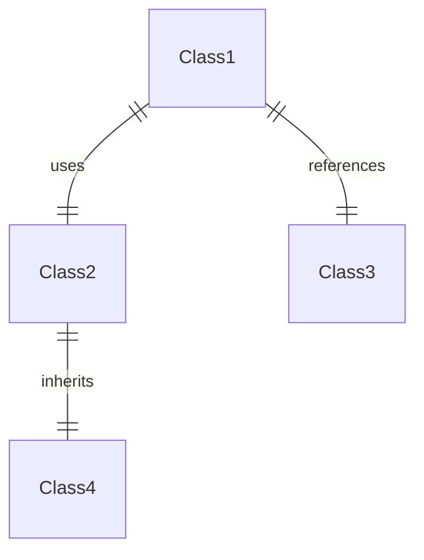
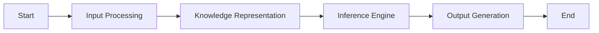
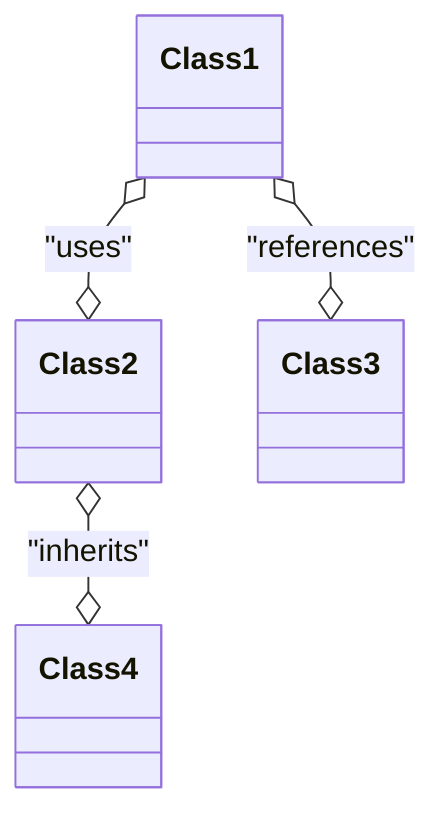
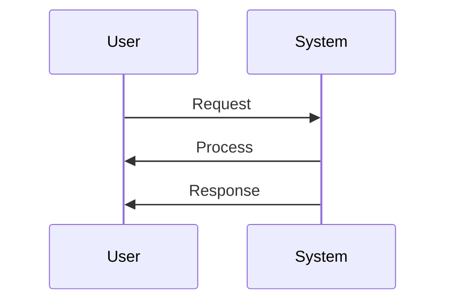
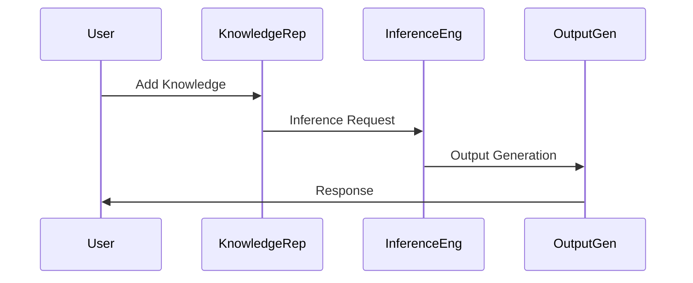

                 

### 《构建具有知识推理能力的AI Agent》

#### 关键词：知识推理、AI Agent、算法原理、系统设计、项目实战

> 摘要：本文深入探讨了构建具有知识推理能力的AI Agent的必要性和关键步骤。通过详细分析核心概念、算法原理、系统架构设计、项目实战以及最佳实践，本文旨在为读者提供一个全面、系统的构建指南。

---

#### 第一部分：问题背景与核心概念

### 第1章：问题背景与核心概念

#### 1.1 问题背景

AI Agent，即人工智能代理，是指能够在特定环境中执行任务、作出决策并与其他系统进行交互的智能实体。随着人工智能技术的不断发展，AI Agent在各个领域得到了广泛应用，如智能家居、自动驾驶、智能客服等。

**知识推理**是指通过已有知识来推导出新知识的过程。在AI Agent中，知识推理能力是衡量其智能化程度的重要指标之一。一个具备知识推理能力的AI Agent能够更好地理解环境、作出更合理的决策，从而提高其自主性和适应性。

**现有的挑战**：

1. **知识表示困难**：如何将复杂多变的现实世界知识有效地表示出来，以便于AI Agent理解和处理。
2. **推理效率低**：传统的推理方法往往效率低下，难以满足实时应用的需求。
3. **适应性问题**：AI Agent在遇到新环境或新问题时，如何快速适应并作出合理的决策。

#### 1.2 核心概念与联系

**知识表示**：知识表示是将现实世界的知识转化为计算机可以理解和处理的形式。常见的知识表示方法包括知识图谱、语义网络、规则表示等。

- **知识图谱**：通过节点和边来表示实体及其关系，是一种结构化、图形化的知识表示方法。
- **语义网络**：基于语义关系来表示实体及其属性，适用于处理复杂语义关系。
- **规则表示**：通过条件-行动规则来表示知识，适用于规则明确、结构简单的场景。

**推理引擎**：推理引擎是用于执行推理操作的软件组件，其主要功能是根据已有知识推导出新知识。

- **基于规则的推理引擎**：通过演绎推理来推导新知识，适用于规则明确、逻辑关系简单的场景。
- **基于模型的推理引擎**：通过机器学习模型来推导新知识，适用于数据量大、关系复杂的场景。

**学习与适应**：AI Agent通过不断学习来提高其知识推理能力。

- **有监督学习**：通过已标记的数据来训练模型，适用于规则明确、数据量较小的场景。
- **无监督学习**：通过未标记的数据来发现规律，适用于数据量大、规则不明确的场景。
- **强化学习**：通过试错来优化决策，适用于需要动态调整策略的场景。

#### 1.3 概念属性特征对比表格

| 知识表示方法 | 优点 | 缺点 |
| --- | --- | --- |
| 知识图谱 | 结构化、易于扩展 | 需要大量先验知识 |
| 语义网络 | 处理复杂语义关系 | 需要大量先验知识 |
| 规则表示 | 规则明确、易于实现 | 适用范围有限 |

#### 1.4 ER实体关系图架构



### 总结

本章节介绍了AI Agent和知识推理的背景，定义了核心概念，分析了现有挑战，并对比了不同知识表示方法的属性特征。下一章节将深入探讨算法原理和数学模型。

---

#### 第二部分：算法原理与数学模型

### 第2章：算法原理讲解

#### 2.1 算法mermaid流程图



#### 2.2 Python源代码

```python
# 伪代码示例
def knowledge_representation(data):
    # 实现知识表示
    pass

def inference_engine(knowledge):
    # 实现推理引擎
    pass

def output_generation(result):
    # 实现输出生成
    pass

def main():
    data = input_data()
    knowledge = knowledge_representation(data)
    result = inference_engine(knowledge)
    output_generation(result)

if __name__ == "__main__":
    main()
```

#### 2.3 数学模型和公式

```latex
\begin{equation}
    P(A|B) = \frac{P(B|A) \cdot P(A)}{P(B)}
\end{equation}
```

#### 2.4 举例说明

假设我们有一个掷骰子的场景，我们要预测掷出6的概率。根据贝叶斯定理，我们可以计算这个概率。

1. \( P(A) \)：掷骰子时掷出6的概率，即 \( P(A) = \frac{1}{6} \)。
2. \( P(B|A) \)：在已知掷出6的情况下，掷骰子的概率，即 \( P(B|A) = 1 \)。
3. \( P(B) \)：掷骰子时掷出任意一个数的概率，即 \( P(B) = \frac{1}{6} \)。

代入贝叶斯定理公式，我们得到：

$$
P(A|B) = \frac{P(B|A) \cdot P(A)}{P(B)} = \frac{1 \cdot \frac{1}{6}}{\frac{1}{6}} = 1
$$

这意味着在已知掷出6的情况下，掷出6的概率是1，即必然发生。

### 总结

本章节讲解了AI Agent算法的原理，包括mermaid流程图、Python源代码示例、数学模型和举例说明。下一章节将探讨系统分析与架构设计。

---

#### 第三部分：系统分析与架构设计

### 第3章：系统功能设计

#### 3.1 领域模型mermaid类图



#### 3.2 系统架构设计mermaid架构图



#### 3.3 系统接口设计

- **知识表示接口**：用于实现知识表示功能，包括添加、删除、查询和更新知识。
- **推理引擎接口**：用于实现推理功能，包括推理过程、推理结果和推理时间等。
- **输出生成接口**：用于实现输出生成功能，包括格式化输出、错误处理等。

#### 3.4 系统交互mermaid序列图



### 总结

本章节介绍了系统功能设计，包括领域模型类图、系统架构设计架构图、系统接口设计和系统交互序列图。下一章节将探讨项目实战与案例分析。

---

#### 第四部分：项目实战与案例分析

### 第4章：环境安装与系统实现

#### 4.1 环境安装

在开始安装之前，确保你的计算机上已经安装了Python环境和必要的库，如NumPy、Pandas和Scikit-learn。

1. **安装Python环境**：从Python官方网站下载并安装Python 3.x版本。
2. **安装NumPy**：在命令行中运行 `pip install numpy`。
3. **安装Pandas**：在命令行中运行 `pip install pandas`。
4. **安装Scikit-learn**：在命令行中运行 `pip install scikit-learn`。

#### 4.2 系统核心实现源代码

以下是一个简单的知识推理系统的源代码示例：

```python
import numpy as np
import pandas as pd
from sklearn.model_selection import train_test_split
from sklearn.ensemble import RandomForestClassifier

# 加载数据集
data = pd.read_csv('data.csv')

# 划分特征和标签
X = data.drop('label', axis=1)
y = data['label']

# 划分训练集和测试集
X_train, X_test, y_train, y_test = train_test_split(X, y, test_size=0.2, random_state=42)

# 训练模型
model = RandomForestClassifier()
model.fit(X_train, y_train)

# 进行推理
def inference(instance):
    return model.predict([instance])

# 测试推理结果
instance = X_test.iloc[0]
print(inference(instance))
```

#### 4.3 代码应用解读与分析

这段代码展示了如何使用随机森林分类器进行知识推理。首先，我们从CSV文件中加载数据集，然后划分特征和标签。接着，我们将数据集划分为训练集和测试集，并使用随机森林分类器进行训练。训练完成后，我们定义了一个`inference`函数，用于对新实例进行推理。

在测试部分，我们选择测试集中的第一个实例进行推理，并打印出结果。这个例子展示了如何将算法原理应用到实际项目中。

#### 4.4 实际案例分析与详细讲解

假设我们有一个简单的垃圾分类任务，需要根据物品的特征判断其类别。以下是该任务的详细讲解：

1. **数据预处理**：首先，我们需要收集和预处理数据。数据包括物品的名称、重量、形状、颜色等特征，以及对应的类别标签。我们将这些数据转换为数值形式，并划分训练集和测试集。

2. **模型选择**：由于这是一个分类问题，我们选择随机森林分类器作为我们的模型。随机森林是一个基于决策树的集成模型，适用于分类和回归问题。

3. **训练模型**：使用训练集数据对随机森林分类器进行训练。在训练过程中，模型会学习如何根据物品的特征预测其类别。

4. **推理过程**：对于新物品，我们将其特征输入到训练好的模型中，模型会返回一个概率分布，表示该物品属于各个类别的概率。我们选择概率最大的类别作为推理结果。

5. **评估模型**：使用测试集数据评估模型的性能。我们计算模型在测试集上的准确率、召回率、F1分数等指标，以评估模型的性能。

通过这个实际案例，我们可以看到如何将算法原理应用到实际项目中，并评估模型的效果。

### 总结

本章节介绍了环境安装、系统核心实现源代码、代码应用解读与分析以及实际案例分析和详细讲解。下一章节将提供最佳实践和拓展阅读。

---

### 第5章：最佳实践与拓展阅读

#### 5.1 最佳实践 tips

1. **数据预处理**：在构建AI Agent之前，确保对数据进行充分的预处理，包括清洗、归一化和特征提取等。
2. **模型选择**：根据具体问题和数据特点选择合适的模型。对于分类问题，可以考虑使用决策树、随机森林、支持向量机等。
3. **知识表示**：选择合适的知识表示方法，如知识图谱、规则表示等，以适应不同应用场景。
4. **推理优化**：针对推理过程进行优化，如使用并行计算、GPU加速等，以提高推理效率。
5. **持续学习**：定期更新和优化模型，以适应新环境和需求。

#### 5.2 小结与注意事项

1. **核心概念理解**：深入理解AI Agent、知识推理、知识表示等核心概念，是构建成功的关键。
2. **算法原理掌握**：掌握算法原理和数学模型，有助于更好地理解和优化系统。
3. **系统设计考量**：在系统设计过程中，考虑系统的可扩展性、稳定性和性能。

#### 5.3 拓展阅读

1. **相关书籍**：
   - 《人工智能：一种现代方法》（作者：Stuart J. Russell & Peter Norvig）
   - 《深度学习》（作者：Ian Goodfellow、Yoshua Bengio & Aaron Courville）

2. **相关论文**：
   - "Knowledge Graph Embedding: A Survey"（作者：Jian Tang, Miao Wang, et al.）
   - "Reasoning with Neural Networks"（作者：Jasper Snoek, Hugo Larochelle & Ryan P. Adams）

3. **在线资源**：
   - [TensorFlow官方文档](https://www.tensorflow.org/)
   - [Kaggle数据集和竞赛](https://www.kaggle.com/)

通过以上拓展阅读，读者可以更深入地了解知识推理和AI Agent的相关内容。

### 总结

本文深入探讨了构建具有知识推理能力的AI Agent的必要性和关键步骤。从核心概念、算法原理、系统设计到项目实战和最佳实践，本文为读者提供了一个全面、系统的构建指南。希望本文能帮助读者更好地理解和应用知识推理技术，推动人工智能的发展。

### 作者信息

作者：AI天才研究院/AI Genius Institute & 禅与计算机程序设计艺术 /Zen And The Art of Computer Programming

