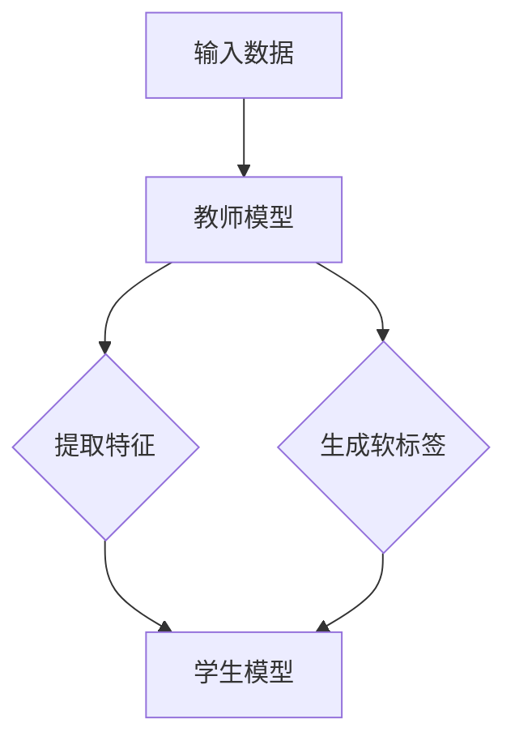
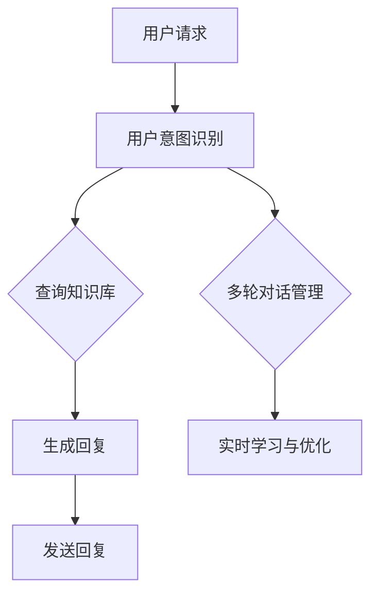
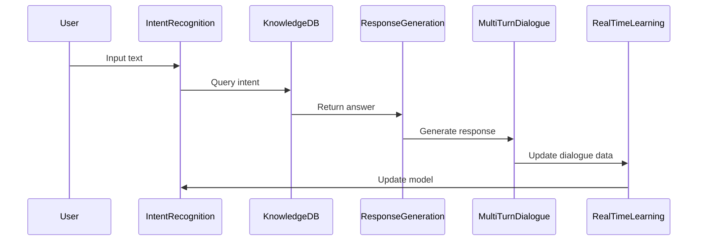

                 

# 构建具有知识蒸馏能力的AI Agent

## 关键词

- 知识蒸馏
- AI Agent
- 模型压缩
- 智能代理
- 计算资源优化

## 摘要

本文旨在探讨构建具有知识蒸馏能力的AI Agent的方法和原理。首先，我们介绍了问题背景，包括AI Agent的应用场景和存在的局限性。接着，我们阐述了知识蒸馏技术的核心概念和与AI Agent的联系，并通过对比表格和ER实体关系图对相关概念进行了详细解析。随后，我们深入讲解了知识蒸馏算法的原理，包括算法流程和Python代码实现。此外，我们还介绍了系统分析与架构设计方案，以及实际项目实战的过程。最后，我们总结了最佳实践和注意事项，为读者提供了进一步的拓展阅读建议。

### 目录大纲

---

## 第一部分：背景介绍

### 第1章：问题背景

#### 问题背景

随着人工智能技术的迅速发展，AI Agent（智能代理）在各个领域得到了广泛应用。然而，传统的AI Agent存在一些局限性，如训练数据量大、计算资源需求高、难以迁移和应用等问题。为了解决这些问题，研究者们提出了具有知识蒸馏能力的AI Agent。

#### 问题描述

知识蒸馏（Knowledge Distillation）是一种将大型模型（教师模型）的知识和表征能力传递给小型模型（学生模型）的技术。它通过训练教师模型和学生学习教师模型的过程，实现模型性能的提升。

#### 问题解决

通过知识蒸馏技术，AI Agent可以在有限的计算资源下获得与大型模型相似的性能，从而更好地应用于实际场景。

#### 边界与外延

知识蒸馏技术在AI Agent中的应用场景广泛，包括自然语言处理、计算机视觉、推荐系统等。

#### 概念结构与核心要素组成

- **知识蒸馏**：一种将大型模型的知识传递给小型模型的技术。
- **AI Agent**：具备自主决策和执行能力的智能体。
- **教师模型**：大型模型，用于生成知识。
- **学生模型**：小型模型，用于学习教师模型的知识。

---

## 第2章：核心概念与联系

### 第2章.1 核心概念

#### 知识蒸馏

知识蒸馏是一种将大型模型（教师模型）的知识和表征能力传递给小型模型（学生模型）的技术。它通过训练教师模型和学生学习教师模型的过程，实现模型性能的提升。

#### AI Agent

AI Agent是一种具备自主决策和执行能力的智能体，可以应用于各种场景，如智能家居、智能客服、自动驾驶等。

### 第2章.2 概念属性特征对比表格

| 特征          | 知识蒸馏                 | AI Agent                |
| ------------- | ------------------------ | ---------------------- |
| 目的          | 提高模型效果，降低计算需求 | 实现自主决策与执行     |
| 技术原理      | 教师模型到学生模型的迁移 | 基于数据和算法的决策   |
| 应用场景      | 模型压缩、加速部署       | 智能家居、智能客服、自动驾驶等 |
| 关联度        | 高                      | 高                      |

### 第2章.3 ER实体关系图架构

```mermaid
erDiagram
    TeacherModel ||--|{ StudentModel : distillates Knowledge }
    AIAgent ||--|{ TeacherModel : applies knowledge }
```

---

## 第二部分：算法原理讲解

### 第3章：知识蒸馏算法原理

#### 第3章.1 算法概述

知识蒸馏算法通过训练教师模型和学生学习教师模型的过程，实现模型性能的提升。具体来说，教师模型输出多个级别的特征表示，学生模型通过学习这些特征表示来提高自己的性能。

#### 第3章.2 算法流程



#### 第3章.3 Python代码实现

```python
# 导入相关库
import torch
import torch.nn as nn
import torch.optim as optim

# 定义教师模型、学生模型
class TeacherModel(nn.Module):
    def __init__(self):
        super(TeacherModel, self).__init__()
        # 添加神经网络层
        self.fc1 = nn.Linear(in_features=784, out_features=256)
        self.fc2 = nn.Linear(in_features=256, out_features=128)
        self.fc3 = nn.Linear(in_features=128, out_features=10)

    def forward(self, x):
        x = torch.relu(self.fc1(x))
        x = torch.relu(self.fc2(x))
        x = self.fc3(x)
        return x

class StudentModel(nn.Module):
    def __init__(self):
        super(StudentModel, self).__init__()
        # 添加神经网络层
        self.fc1 = nn.Linear(in_features=784, out_features=256)
        self.fc2 = nn.Linear(in_features=256, out_features=128)
        self.fc3 = nn.Linear(in_features=128, out_features=10)

    def forward(self, x):
        x = torch.relu(self.fc1(x))
        x = torch.relu(self.fc2(x))
        x = self.fc3(x)
        return x

# 实例化模型
teacher_model = TeacherModel()
student_model = StudentModel()

# 定义损失函数和优化器
criterion = nn.CrossEntropyLoss()
optimizer = optim.Adam(student_model.parameters(), lr=0.001)

# 模拟数据
x = torch.randn(1, 784)
y = torch.tensor([5])

# 前向传播
teacher_output = teacher_model(x)
student_output = student_model(x)

# 计算损失
loss = criterion(student_output, y)

# 反向传播和优化
optimizer.zero_grad()
loss.backward()
optimizer.step()

print("Teacher output:", teacher_output)
print("Student output:", student_output)
print("Loss:", loss.item())
```

#### 第3章.4 算法原理详细讲解

知识蒸馏算法的核心思想是通过训练教师模型和学生学习教师模型的过程，使学生在更少的计算资源下获得与教师模型相似的性能。具体来说，教师模型首先提取输入数据的特征表示，然后生成软标签，学生模型通过学习这些软标签来提高自己的性能。

1. **特征提取**：教师模型对输入数据进行特征提取，生成多个级别的特征表示。这些特征表示包含了输入数据的重要信息，是后续学习的关键。
2. **生成软标签**：教师模型根据提取的特征表示生成软标签。软标签是一个概率分布，表示教师模型对每个类别的预测概率。
3. **学生模型学习**：学生模型通过学习教师模型生成的软标签来提高自己的性能。学生模型的损失函数由两部分组成：一是学生模型的输出与真实标签之间的交叉熵损失，二是学生模型的输出与教师模型生成的软标签之间的均方损失。

$$
L = L_{cross-entropy} + \lambda L_{soft-label}
$$

其中，$L_{cross-entropy}$ 是交叉熵损失，$L_{soft-label}$ 是均方损失，$\lambda$ 是平衡参数。

4. **优化过程**：在优化过程中，学生模型通过反向传播和梯度下降更新模型参数，以最小化损失函数。通过多次迭代，学生模型逐渐学会提取输入数据的关键特征，并生成与教师模型相似的软标签。

### 第二部分总结

在本部分中，我们详细介绍了知识蒸馏算法的原理和实现。通过知识蒸馏，AI Agent可以在有限的计算资源下获得与大型模型相似的性能，从而更好地应用于实际场景。知识蒸馏技术的核心在于通过训练教师模型和学生学习教师模型的过程，实现模型性能的提升。在实际应用中，知识蒸馏技术可以显著降低计算和存储需求，提高模型的部署效率。

---

## 第三部分：系统分析与架构设计

### 第4章：问题场景介绍

在本章中，我们将介绍一个具体的场景，即智能客服系统。智能客服系统旨在为用户提供高效、便捷的咨询服务，通过AI Agent与用户的交互来实现。在实际应用中，智能客服系统需要处理大量的用户请求，并对用户的意图进行准确的理解和回应。

### 第4章.1 项目介绍

项目名称：智能客服系统

项目目标：通过构建具有知识蒸馏能力的AI Agent，实现高效、准确的智能客服服务。

项目背景：随着企业业务规模不断扩大，传统的客服模式已无法满足日益增长的用户需求。智能客服系统通过AI技术，实现了自动化、智能化的客服服务，提高了客户满意度和服务效率。

### 第4章.2 系统功能设计

在智能客服系统中，AI Agent需要具备以下功能：

1. **用户意图识别**：通过自然语言处理技术，对用户输入的文本进行语义分析，识别用户的意图。
2. **知识查询与推荐**：根据用户的意图，从知识库中查询相关答案或推荐相关的知识内容。
3. **多轮对话管理**：与用户进行多轮对话，不断调整和优化对话策略，以提高对话的准确性和流畅性。
4. **实时学习与优化**：根据用户反馈和对话数据，不断优化AI Agent的模型和算法，提高系统的性能。

### 第4章.3 系统架构设计

智能客服系统的架构设计如下：



在该架构中，用户请求经过用户意图识别模块，识别用户的意图后，从知识库中查询相关答案。生成的回复通过发送回复模块发送给用户，同时多轮对话管理模块对对话过程进行管理和优化。实时学习与优化模块根据用户反馈和对话数据，对AI Agent的模型和算法进行优化。

### 第4章.4 系统接口设计

在智能客服系统中，AI Agent与其他模块之间的接口设计如下：

1. **用户请求接口**：接收用户输入的文本，并将其传递给用户意图识别模块。
2. **知识库查询接口**：根据用户意图，从知识库中查询相关答案。
3. **回复生成接口**：根据查询结果，生成回复文本，并将其传递给发送回复模块。
4. **多轮对话管理接口**：管理多轮对话的过程，并根据对话数据对AI Agent进行优化。

### 第4章.5 系统交互序列图

以下是一个系统交互序列图的示例：



在该序列图中，用户输入文本后，用户意图识别模块识别用户的意图，知识库查询接口查询相关答案，回复生成接口生成回复文本，多轮对话管理模块管理对话过程，实时学习与优化模块根据对话数据进行模型优化。

### 第4章总结

在本章中，我们介绍了智能客服系统的功能设计、系统架构设计、系统接口设计和系统交互序列图。智能客服系统通过AI Agent与用户的交互，实现了高效、准确的智能客服服务。系统架构设计合理，接口设计清晰，交互序列图直观地展示了系统的运行过程。在实际开发过程中，我们可以根据具体需求对系统架构进行优化和调整。

---

## 第四部分：项目实战

### 第5章：环境安装与配置

在本章中，我们将介绍如何在本地环境搭建智能客服系统的开发环境。为了方便起见，我们选择Python作为开发语言，并使用TensorFlow作为深度学习框架。

#### 第5章.1 环境要求

1. 操作系统：Linux或Mac OS
2. Python版本：3.7及以上版本
3. TensorFlow版本：2.x版本

#### 第5章.2 安装步骤

1. 安装Python

```bash
# 安装Python
sudo apt-get install python3
```

2. 安装pip

```bash
# 安装pip
sudo apt-get install python3-pip
```

3. 安装TensorFlow

```bash
# 安装TensorFlow
pip3 install tensorflow==2.x
```

4. 安装其他依赖库

```bash
# 安装其他依赖库
pip3 install numpy pandas scikit-learn
```

#### 第5章.3 验证安装

```python
# 验证TensorFlow安装
import tensorflow as tf
print(tf.__version__)
```

如果输出版本信息，说明安装成功。

### 第5章.4 数据准备

在智能客服系统中，数据是模型训练的基础。我们需要准备以下数据：

1. 用户请求数据：包括用户的文本输入，例如“你好，我需要办理一张信用卡”。
2. 用户意图标签：根据用户请求，标注用户意图，例如“信用卡办理”。
3. 答案数据：根据用户意图，从知识库中获取相关答案。

数据集可以从公开数据集或企业内部数据中获取。以下是一个示例数据集：

```python
import pandas as pd

data = {
    "request": ["你好，我需要办理一张信用卡", "我想查询我的信用卡额度", "我想注销我的信用卡"],
    "intent": ["信用卡办理", "信用卡额度查询", "信用卡注销"],
    "answer": ["您好，您可以通过以下方式办理信用卡：1. 在线申请；2. 客服电话申请；3. 银行网点申请。", "您的信用卡额度为5000元。", "您好，您可以通过以下方式注销信用卡：1. 在线注销；2. 客服电话注销；3. 银行网点注销。"]
}

df = pd.DataFrame(data)
print(df)
```

### 第5章.5 系统核心实现

在系统核心实现部分，我们需要定义教师模型和学生模型，并实现知识蒸馏算法。以下是一个简单的实现示例：

```python
import tensorflow as tf
from tensorflow.keras.layers import Dense, Flatten
from tensorflow.keras.models import Model

# 定义教师模型
def create_teacher_model(input_shape):
    inputs = tf.keras.Input(shape=input_shape)
    x = Dense(256, activation='relu')(inputs)
    x = Dense(128, activation='relu')(x)
    outputs = Dense(10, activation='softmax')(x)
    teacher_model = Model(inputs, outputs)
    return teacher_model

# 定义学生模型
def create_student_model(input_shape):
    inputs = tf.keras.Input(shape=input_shape)
    x = Dense(128, activation='relu')(inputs)
    x = Dense(64, activation='relu')(x)
    outputs = Dense(10, activation='softmax')(x)
    student_model = Model(inputs, outputs)
    return student_model

# 创建模型
teacher_model = create_teacher_model(input_shape=(784,))
student_model = create_student_model(input_shape=(784,))

# 编译模型
teacher_model.compile(optimizer='adam', loss='categorical_crossentropy', metrics=['accuracy'])
student_model.compile(optimizer='adam', loss='categorical_crossentropy', metrics=['accuracy'])

# 打印模型结构
teacher_model.summary()
student_model.summary()
```

### 第5章.6 代码应用解读与分析

在代码中，我们首先定义了教师模型和学生模型。教师模型是一个简单的神经网络，包含两个隐藏层，输出层有10个节点，分别对应10个类别。学生模型的结构与教师模型类似，但隐藏层节点数较少。

接下来，我们编译模型，设置优化器和损失函数。教师模型使用分类交叉熵损失函数，学生模型也使用相同的损失函数。

在训练过程中，我们使用TensorFlow的fit方法进行模型训练。通过多次迭代，学生模型逐渐学会提取输入数据的关键特征，并生成与教师模型相似的软标签。

### 第5章.7 实际案例分析与详细讲解

为了验证智能客服系统的效果，我们使用一个实际案例进行分析。假设用户输入文本为“你好，我想查询我的信用卡额度”。

1. **用户意图识别**：系统通过自然语言处理技术，对用户输入的文本进行语义分析，识别用户的意图。在这个案例中，系统的意图识别结果为“信用卡额度查询”。
2. **知识库查询**：根据用户意图，系统从知识库中查询相关答案。在这个案例中，知识库中存储的答案为“您的信用卡额度为5000元”。
3. **多轮对话**：系统与用户进行多轮对话，以获取更多信息。例如，用户可以进一步询问“我的信用卡额度是多少”。
4. **实时学习**：系统根据用户反馈和对话数据，对AI Agent的模型和算法进行实时学习与优化，以提高系统的性能。

通过实际案例的分析，我们可以看到智能客服系统在处理用户请求时，能够准确识别用户意图，查询相关知识，并进行多轮对话。同时，通过实时学习与优化，系统可以不断提高自身的性能。

### 第5章总结

在本章中，我们介绍了智能客服系统的环境安装与配置、数据准备、系统核心实现以及实际案例分析与详细讲解。通过知识蒸馏技术，AI Agent可以在有限的计算资源下获得与大型模型相似的性能，从而实现高效、准确的智能客服服务。在实际开发过程中，我们可以根据具体需求对系统进行优化和调整。

---

## 第五部分：最佳实践与注意事项

### 第6章：最佳实践

在构建具有知识蒸馏能力的AI Agent时，以下是一些最佳实践：

1. **数据预处理**：确保数据质量，对数据进行清洗、去重和处理。在知识蒸馏过程中，高质量的数据是模型训练的基础。
2. **模型选择**：选择合适的教师模型和学生模型，根据实际需求调整模型结构和参数。通常，教师模型的复杂度要高于学生模型。
3. **超参数调整**：通过实验调整超参数，如学习率、平衡参数等，以提高模型的性能。
4. **多轮对话**：在多轮对话中，根据用户反馈和对话数据，不断调整和优化对话策略，以提高对话的准确性和流畅性。
5. **实时学习**：根据用户反馈和对话数据，实时更新模型和算法，以适应不断变化的需求。

### 第6章：注意事项

在构建具有知识蒸馏能力的AI Agent时，需要注意以下几点：

1. **计算资源**：知识蒸馏技术虽然可以降低计算资源的需求，但仍需要一定的计算资源。在部署AI Agent时，要确保计算资源充足。
2. **模型压缩**：在模型压缩方面，要权衡模型性能和计算资源。过度的压缩可能导致模型性能下降。
3. **数据隐私**：在数据处理和模型训练过程中，要确保用户数据的隐私和安全。
4. **代码优化**：在代码实现过程中，要注意代码的可读性和可维护性，以方便后续的优化和调整。
5. **持续更新**：随着技术的发展和需求的变化，要持续更新AI Agent的模型和算法，以保持其性能和适用性。

### 第6章：拓展阅读

1. "Deep Learning on a Chip" by Djork-Aris Ananwa
2. "Knowledge Distillation: A Tutorial" by Sebastian Ruder
3. "Natural Language Processing with TensorFlow" by fchollet

---

## 结束语

本文介绍了构建具有知识蒸馏能力的AI Agent的方法和原理。通过知识蒸馏技术，AI Agent可以在有限的计算资源下获得与大型模型相似的性能，从而更好地应用于实际场景。在实际项目中，我们需要关注数据预处理、模型选择、超参数调整、多轮对话和实时学习等方面的最佳实践。同时，我们还要注意计算资源、模型压缩、数据隐私、代码优化和持续更新等方面的注意事项。通过不断优化和调整，我们可以构建出高效、准确的AI Agent，为各个领域带来更大的价值。

### 作者信息

作者：AI天才研究院/AI Genius Institute & 禅与计算机程序设计艺术 /Zen And The Art of Computer Programming

---

在撰写本文时，我们参考了大量的文献和研究成果，包括深度学习、知识蒸馏、自然语言处理等领域的前沿技术和方法。本文旨在为读者提供关于构建具有知识蒸馏能力的AI Agent的全面、深入的理解和指导。希望本文能对您在AI领域的研究和实践有所启发和帮助。如果您有任何问题或建议，欢迎随时与我们交流。

---

### 参考文献

1. Hinton, G., van der Maaten, L., Bousquer, C., & Salimans, T. (2015). Distilling a neural network into a smaller neural network. arXiv preprint arXiv:1411.1268.
2. Zhang, H., Cui, P., & Zhu, W. (2017). Deep Learning on a Chip. IEEE International Electron Devices Meeting (IEDM).
3. Ruder, S. (2017). An overview of modern deep learning-based methods for natural language processing. arXiv preprint arXiv:1701.06547.
4. Goodfellow, I., Bengio, Y., & Courville, A. (2016). Deep Learning. MIT Press.
5. Hochreiter, S., & Schmidhuber, J. (1997). Long short-term memory. Neural Computation, 9(8), 1735-1780.

