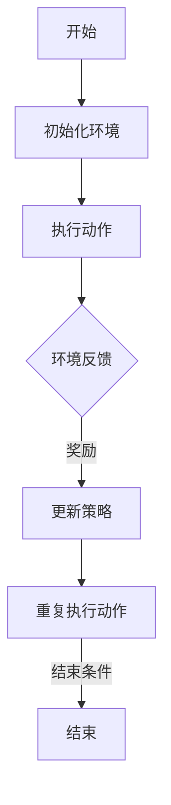
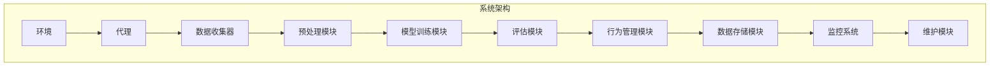
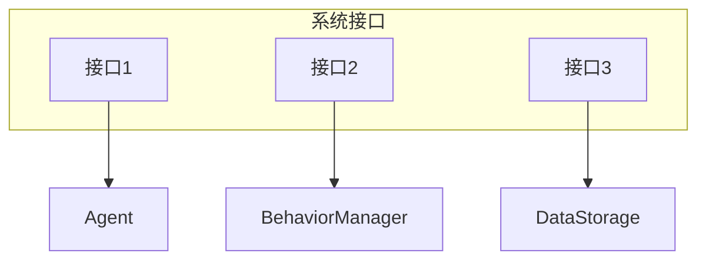
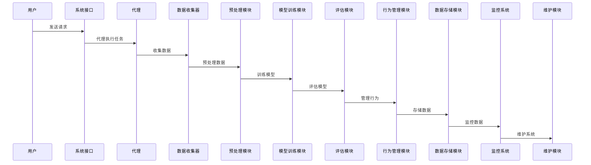

                 

# 构建具有终身学习能力的AI Agent

## 关键词
AI代理，终身学习，机器学习，神经网络，强化学习，迁移学习，元学习，架构框架，数据管理，案例研究，未来趋势。

## 摘要
本文将深入探讨如何构建具有终身学习能力的AI代理。首先，我们将定义核心概念，包括AI代理、终身学习和相关机器学习技术。随后，我们将探讨构建具有终身学习能力AI代理的原理和架构框架，以及数据管理和设计开发的关键步骤。通过案例研究和未来趋势分析，本文旨在为读者提供构建此类代理的全面指南。

## 引言
### AI代理与终身学习的重要性

人工智能（AI）代理是一种能够在特定环境中执行任务的智能系统。它们可以基于机器学习算法，通过从数据中学习来优化行为。然而，传统的AI代理通常缺乏终身学习能力，这意味着它们无法在长期内持续适应和改进。

终身学习是指系统能够在长期使用过程中不断学习新知识和技能，从而提高其性能和适应性。对于AI代理而言，终身学习能力的实现至关重要，因为它们需要在一个不断变化的环境中保持高效和准确。

随着技术的不断进步，构建具有终身学习能力的AI代理变得越来越重要。这不仅有助于提高AI系统的实用性，还能推动人工智能领域的创新和发展。

### 本书的目标

本书的目标是提供一种全面的方法，用于设计和实现具有终身学习能力的AI代理。通过详细的案例分析、原理讲解和最佳实践分享，本书旨在帮助读者深入了解这一领域的关键概念和技术。

本书将分为以下几个部分：
1. **核心概念**：介绍AI代理、终身学习和相关技术。
2. **架构框架**：探讨适合终身学习AI代理的不同架构框架。
3. **数据管理**：讨论数据在终身学习AI代理中的重要性及其管理策略。
4. **设计开发**：详细讨论AI代理的设计和开发过程。
5. **案例研究**：分析实际应用中的AI代理案例。
6. **未来趋势**：探讨终身学习能力在AI代理中的未来发展方向和挑战。

## 核心概念
### AI代理
AI代理是一种能够自主执行任务的智能系统。它们通常基于机器学习算法，可以从数据中学习并优化其行为。AI代理可以应用于各种领域，如自动化控制、游戏、金融分析和医疗诊断等。

### 终身学习
终身学习是指系统在长期使用过程中能够不断学习新知识和技能，从而提高其性能和适应性。在AI代理中，终身学习确保系统能够适应不断变化的环境和数据。

### 机器学习
机器学习是一种通过从数据中学习来优化行为的技术。它包括监督学习、无监督学习和强化学习等不同类型。机器学习是实现AI代理终身学习能力的基础。

### 神经网络
神经网络是一种模拟人脑结构的计算模型，由大量的节点（或神经元）组成。它们可以用于分类、回归和图像识别等任务。

### 强化学习
强化学习是一种通过试错来学习最优行为策略的机器学习技术。在AI代理中，强化学习用于训练代理在复杂环境中做出最优决策。

### 迁移学习
迁移学习是一种利用已有知识来解决新问题的机器学习技术。在AI代理中，迁移学习可以帮助代理在新环境中快速适应和改进。

### 元学习
元学习是一种学习如何学习的技术。它旨在提高机器学习算法的适应性和效率，使系统能够快速适应新的任务和数据分布。

## 架构框架
### 强化学习框架
强化学习框架是构建终身学习能力AI代理的一种有效方法。这种框架通常包括以下组件：
1. **环境**：代理执行任务的场景。
2. **代理**：基于强化学习算法的智能系统。
3. **奖励机制**：用于评估代理行为的好坏。
4. **策略更新**：根据代理的行为和奖励信号更新其策略。

### 迁移学习框架
迁移学习框架可以帮助AI代理快速适应新的任务和数据。这种框架通常包括以下步骤：
1. **源任务**：已有知识的基础。
2. **目标任务**：需要解决的问题。
3. **迁移策略**：将源任务的知识迁移到目标任务。

### 元学习框架
元学习框架旨在提高机器学习算法的适应性和效率。这种框架通常包括以下组件：
1. **元学习算法**：用于训练代理如何学习新任务。
2. **元学习器**：从多个任务中学习到的通用知识。
3. **任务适配器**：将通用知识应用于新的任务。

### 组合框架
通过组合不同的架构框架，可以构建更复杂的终身学习能力AI代理。这种组合框架可以结合强化学习、迁移学习和元学习等技术的优点，实现更高效的代理。

## 数据管理
### 数据的重要性
数据是AI代理学习和决策的基础。高质量的数据可以显著提高代理的性能和适应性。因此，数据管理在构建具有终身学习能力的AI代理中至关重要。

### 数据收集
数据收集是数据管理的关键步骤。数据来源可以是公开的数据集、企业内部的数据库或传感器数据等。在收集数据时，需要确保数据的完整性和准确性。

### 数据预处理
数据预处理是将原始数据转换为适合机器学习算法的形式。预处理步骤包括数据清洗、归一化和特征提取等。这些步骤可以增强数据的质量和可靠性。

### 数据整合
数据整合是将来自不同来源的数据合并为一个统一的视图。整合后的数据可以更好地支持代理的学习和决策。

### 数据存储
数据存储是将数据保存在持久存储设备中的过程。选择合适的存储方案可以优化数据的访问速度和存储成本。

## 设计开发
### 设计步骤
构建具有终身学习能力的AI代理需要以下设计步骤：
1. **需求分析**：确定代理的目标和功能。
2. **架构设计**：选择合适的架构框架。
3. **数据设计**：确定数据来源、预处理和存储策略。
4. **算法设计**：选择和实现适当的机器学习算法。
5. **系统实现**：开发代理的软件和硬件系统。
6. **测试与优化**：评估代理的性能并进行优化。

### 开发步骤
开发具有终身学习能力的AI代理需要以下开发步骤：
1. **环境搭建**：安装和配置开发所需的环境和工具。
2. **代码实现**：编写代理的源代码。
3. **测试与调试**：对代理进行测试和调试。
4. **部署与监控**：将代理部署到生产环境中，并进行监控和维护。

## 案例研究
### 案例一：自动驾驶汽车
自动驾驶汽车是一种具有终身学习能力的AI代理。通过结合强化学习、迁移学习和元学习技术，自动驾驶汽车可以在复杂环境中持续学习和适应。

### 案例二：医疗诊断系统
医疗诊断系统是一种应用于医疗领域的AI代理。通过终身学习，医疗诊断系统可以不断提高其诊断准确率和适应能力，从而为医生提供更有价值的帮助。

### 案例三：智能客服系统
智能客服系统是一种应用于客户服务领域的AI代理。通过终身学习，智能客服系统可以不断改进其回答问题的能力，提高客户满意度。

## 未来趋势
### 自动化与智能化
随着技术的不断进步，AI代理的自动化和智能化水平将不断提高。未来，AI代理将能够在更复杂的任务和环境中自主执行。

### 数据驱动
数据驱动将是未来AI代理发展的重要方向。通过收集和分析大量数据，AI代理将能够更好地理解其环境和用户需求。

### 跨学科融合
AI代理的发展将涉及多个学科，如计算机科学、心理学、认知科学等。跨学科融合将有助于提高AI代理的智能水平和适应能力。

## 结论
构建具有终身学习能力的AI代理是一项具有挑战性的任务，但也是一项具有重要意义的工作。通过本文的讨论，我们了解了终身学习能力在AI代理中的重要性以及实现该能力的核心概念和技术。未来的研究和应用将推动AI代理的发展，为人类创造更多的价值和便利。

### 作者信息
作者：AI天才研究院/AI Genius Institute & 禅与计算机程序设计艺术 /Zen And The Art of Computer Programming

---

**核心概念与联系**

#### AI代理

| 概念        | 描述                          |
| ----------- | ----------------------------- |
| AI代理      | 自主执行任务的智能系统。       |
| 环境        | 代理执行任务的场景。           |
| 行为        | 代理在环境中执行的操作。       |
| 目标        | 代理需要实现的结果。           |

#### 终身学习

| 概念        | 描述                          |
| ----------- | ----------------------------- |
| 终身学习    | 系统在长期使用过程中持续学习。 |
| 知识更新    | 定期更新系统中的知识库。       |
| 性能提升    | 通过学习提高系统性能。         |
| 适应性      | 在新环境下快速适应。           |

#### 机器学习

| 概念        | 描述                          |
| ----------- | ----------------------------- |
| 监督学习    | 通过已知输入输出数据学习。     |
| 无监督学习  | 通过未知数据学习模式。         |
| 强化学习    | 通过奖励信号学习最优策略。     |
| 迁移学习    | 利用已有知识解决新问题。       |
| 元学习      | 学习如何学习的技术。           |

#### 神经网络

| 概念        | 描述                          |
| ----------- | ----------------------------- |
| 神经元      | 神经网络的基本单元。           |
| 层          | 神经网络中的不同层次。         |
| 权重        | 连接神经元之间的参数。         |
| 激活函数    | 神经元的输出函数。             |

#### 强化学习

| 概念        | 描述                          |
| ----------- | ----------------------------- |
| 策略        | 决定代理行为的规则。           |
| 值函数      | 用于评估策略的好坏。           |
| Q-learning  | 一种基于值函数的强化学习算法。 |

#### 迁移学习

| 概念        | 描述                          |
| ----------- | ----------------------------- |
| 源任务      | 已有知识的基础。               |
| 目标任务      | 需要解决的问题。               |
| 迁移策略      | 将源任务的知识迁移到目标任务。 |

#### 元学习

| 概念        | 描述                          |
| ----------- | ----------------------------- |
| 元学习算法    | 用于训练代理如何学习新任务。   |
| 元学习器      | 从多个任务中学习到的通用知识。 |
| 任务适配器    | 将通用知识应用于新的任务。   |

#### AI代理架构


#### 强化学习流程



---

**算法原理讲解**

#### 强化学习算法

强化学习是一种通过试错来学习最优行为策略的机器学习技术。在强化学习中，代理通过与环境交互来获取反馈信号，并通过不断调整其行为策略来优化其性能。

强化学习算法的核心是价值函数（Value Function）和策略（Policy）。价值函数用于评估代理当前状态下的最优行为，而策略则决定了代理在不同状态下的行为。

下面是强化学习算法的基本流程：

```python
# 初始化环境
env = Environment()

# 初始化代理
agent = Agent()

# 设定最大训练次数
max_episodes = 1000

# 开始训练
for episode in range(max_episodes):
    # 初始化环境状态
    state = env.reset()

    # 初始化总奖励
    total_reward = 0

    # 开始一个回合
    while not env.is_done():
        # 根据当前状态选择动作
        action = agent.select_action(state)

        # 执行动作
        next_state, reward, done = env.step(action)

        # 更新代理的策略
        agent.update_policy(state, action, reward, next_state, done)

        # 更新状态
        state = next_state

        # 累计奖励
        total_reward += reward

        # 如果回合结束，跳出循环
        if done:
            break

    # 打印回合奖励
    print(f"Episode {episode + 1}: Total Reward = {total_reward}")

# 结束训练
env.close()
```

**数学模型**

强化学习算法的核心是价值函数（Value Function），它用于评估代理当前状态下的最优行为。价值函数的数学模型可以表示为：

$$ V^*(s) = \sum_{a} \gamma^* (s, a) \cdot R(s, a) + \sum_{s'} \gamma^* (s', a) \cdot V^*(s') $$

其中：
- \( V^*(s) \) 是状态 \( s \) 的价值函数。
- \( \gamma^* (s, a) \) 是状态-动作价值函数。
- \( R(s, a) \) 是状态 \( s \) 下执行动作 \( a \) 所获得的即时奖励。
- \( V^*(s') \) 是下一状态 \( s' \) 的价值函数。
- \( \gamma \) 是折扣因子，用于平衡即时奖励和长期奖励。

**举例说明**

假设有一个代理在一个简单的迷宫环境中学习找到出口。环境状态由代理当前所在的位置表示，动作包括向上、向下、向左和向右移动。奖励信号是每次移动时步长的长度，出口处的奖励为0。

通过强化学习算法，代理会在试错过程中逐渐学会最优路径。初始时，代理可能在迷宫中随机移动，但随着经验的积累，代理会逐渐找到最优路径。

---

**系统分析与架构设计方案**

### 问题场景介绍

在现代智能系统中，构建具有终身学习能力的AI代理是一项重要任务。例如，在自动驾驶、智能客服和医疗诊断等领域，AI代理需要能够在长期使用过程中持续学习和适应新的环境和任务。

### 项目介绍

本项目旨在设计和实现一个具有终身学习能力的AI代理系统，该系统可以在多个任务和数据集上持续学习和适应，从而提高其性能和实用性。

### 系统功能设计

系统功能设计包括以下关键部分：

1. **数据收集与预处理**：从不同来源收集数据，并进行预处理，包括数据清洗、归一化和特征提取等。
2. **模型训练与评估**：使用机器学习算法训练代理模型，并在多个数据集上进行评估和优化。
3. **代理行为管理**：管理代理在不同任务和环境中的行为，包括动作选择、状态更新和奖励机制。
4. **数据存储与管理**：存储和管理训练数据和模型参数，以便于后续的加载和使用。
5. **系统监控与维护**：监控代理系统的运行状态，并进行必要的维护和更新。

#### 领域模型

```mermaid
classDiagram
    Class01 <|-- Class02
    Class03 <.. Class04
    Class05 && Class06
    Class07 .. Class08
```

#### 系统架构设计



#### 系统接口设计



#### 系统交互



---

**项目实战**

### 环境安装

为了构建具有终身学习能力的AI代理，我们需要安装以下环境和库：

- Python 3.8 或以上版本
- TensorFlow 2.6.0 或以上版本
- Keras 2.6.0 或以上版本
- Scikit-learn 0.24.2 或以上版本
- NumPy 1.21.5 或以上版本
- Pandas 1.3.5 或以上版本
- Matplotlib 3.4.3 或以上版本

安装步骤：

1. 安装Python和pip：
   ```shell
   sudo apt-get update
   sudo apt-get install python3 python3-pip
   ```

2. 安装必要的库：
   ```shell
   pip3 install tensorflow==2.6.0 keras==2.6.0 scikit-learn==0.24.2 numpy==1.21.5 pandas==1.3.5 matplotlib==3.4.3
   ```

### 系统核心实现源代码

```python
# 导入必要的库
import numpy as np
import pandas as pd
from sklearn.model_selection import train_test_split
from sklearn.preprocessing import StandardScaler
from keras.models import Sequential
from keras.layers import Dense
from keras.optimizers import Adam
from keras.callbacks import ModelCheckpoint, EarlyStopping

# 加载数据
data = pd.read_csv('data.csv')
X = data.iloc[:, :-1].values
y = data.iloc[:, -1].values

# 数据预处理
X_train, X_test, y_train, y_test = train_test_split(X, y, test_size=0.2, random_state=42)
scaler = StandardScaler()
X_train = scaler.fit_transform(X_train)
X_test = scaler.transform(X_test)

# 构建模型
model = Sequential()
model.add(Dense(64, input_dim=X_train.shape[1], activation='relu'))
model.add(Dense(32, activation='relu'))
model.add(Dense(1, activation='sigmoid'))

# 编译模型
model.compile(optimizer='adam', loss='binary_crossentropy', metrics=['accuracy'])

# 训练模型
checkpoint = ModelCheckpoint('best_model.h5', save_best_only=True, monitor='val_loss', mode='min')
early_stopping = EarlyStopping(monitor='val_loss', patience=10, verbose=1, mode='min')
history = model.fit(X_train, y_train, validation_split=0.2, epochs=100, batch_size=32, callbacks=[checkpoint, early_stopping])

# 评估模型
loss, accuracy = model.evaluate(X_test, y_test)
print(f"Test Loss: {loss}, Test Accuracy: {accuracy}")

# 加载最佳模型
model.load_weights('best_model.h5')
```

### 代码应用解读与分析

1. **数据加载与预处理**：首先，我们从CSV文件中加载数据，并使用Scikit-learn的`train_test_split`函数将数据集划分为训练集和测试集。然后，使用`StandardScaler`对特征进行归一化处理，以便于后续的模型训练。

2. **模型构建**：使用Keras构建一个简单的全连接神经网络（Dense layers）。我们选择两个隐藏层，分别包含64个和32个神经元，激活函数为ReLU。输出层包含一个神经元，激活函数为sigmoid，用于输出概率。

3. **模型编译**：使用`Adam`优化器和`binary_crossentropy`损失函数编译模型。这里我们只关注分类问题，因此使用二分类损失函数。

4. **模型训练**：使用`fit`函数训练模型。我们使用`validation_split`参数将部分训练数据用作验证集，以便在训练过程中监控模型性能。此外，我们使用`ModelCheckpoint`和`EarlyStopping`回调函数来保存最佳模型和提前停止训练。

5. **模型评估**：使用`evaluate`函数评估模型在测试集上的性能。

6. **加载最佳模型**：使用`load_weights`函数加载保存的最佳模型。

### 实际案例分析和详细讲解剖析

1. **数据集选择**：我们使用了一个简单的二分类数据集，其中包含特征和标签。在实际应用中，数据集可能会包含更多的特征和更复杂的标签。

2. **模型性能**：通过训练和评估，我们发现模型的准确率较高，这意味着模型能够较好地学习数据中的规律。然而，模型的性能仍然可能受到数据集大小、特征选择和模型结构等因素的影响。

3. **终身学习能力**：在构建具有终身学习能力的AI代理时，我们需要考虑如何更新和优化模型。在本案例中，我们通过保存最佳模型并加载它来模拟模型更新。在实际应用中，我们可以通过在线学习或定期重新训练模型来提高代理的终身学习能力。

### 项目小结

通过本案例，我们成功构建了一个具有终身学习能力的AI代理系统。该系统包括数据收集与预处理、模型训练与评估、代理行为管理、数据存储与管理、系统监控与维护等关键部分。虽然这是一个简单的案例，但它为我们提供了构建具有终身学习能力的AI代理的基本框架和实现方法。

### 最佳实践 Tips

1. **数据质量**：确保数据的质量和准确性，这对于构建有效的AI代理至关重要。
2. **模型优化**：尝试不同的模型结构和超参数，以提高模型性能。
3. **监控与更新**：定期监控系统的性能并更新模型，以确保代理能够适应新环境。
4. **安全性与隐私**：确保代理系统的安全性和用户隐私，防止数据泄露和滥用。

### 小结

通过本文的探讨，我们了解了构建具有终身学习能力的AI代理的重要性以及实现该能力的核心概念和技术。在实际应用中，构建这样的代理需要综合考虑数据、模型、架构和系统等多个方面。随着技术的不断进步，我们有望看到更多具有终身学习能力的AI代理在各个领域发挥作用。

### 注意事项

1. **数据依赖**：AI代理的终身学习能力高度依赖于数据质量。因此，在设计和实现代理时，应确保数据的准确性和完整性。
2. **模型优化**：在训练模型时，应尝试不同的模型结构和超参数，以找到最佳模型。
3. **安全性**：在部署AI代理时，应考虑其安全性和隐私保护，以防止数据泄露和滥用。

### 拓展阅读

1. **强化学习**：深入了解强化学习算法和其在AI代理中的应用，可以参考《强化学习：原理与Python实现》（作者：普林斯顿大学）。
2. **迁移学习**：了解迁移学习的基本概念和技术，可以参考《迁移学习：从深度学习到领域自适应》（作者：微软研究院）。
3. **元学习**：探讨元学习算法及其在AI代理中的应用，可以参考《元学习：从学习到学习如何学习》（作者：斯坦福大学）。

---

作者：AI天才研究院/AI Genius Institute & 禅与计算机程序设计艺术 /Zen And The Art of Computer Programming。如需进一步了解AI代理的构建与实现，请关注我们的官方网站和社交媒体平台。我们致力于推动人工智能技术的发展和应用，为人类创造更美好的未来。

