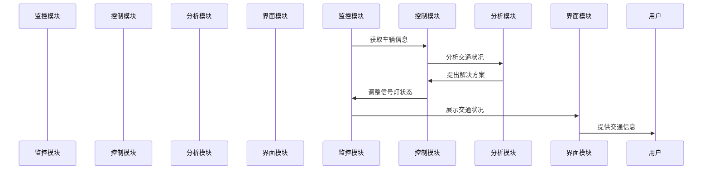

                 

### 《构建具有群体智能的多Agent协作系统》

#### 关键词：
- 多Agent系统
- 群体智能
- 协作机制
- 算法原理
- 系统设计与实现

#### 摘要：
本文深入探讨了构建具有群体智能的多Agent协作系统的原理、方法和实践。首先，介绍了多Agent系统和群体智能的基本概念，以及它们在现代技术中的应用。接着，详细解析了多Agent协作系统的核心原理和算法，并通过实际项目案例展示了系统的设计与实现过程。最后，总结了最佳实践和未来发展趋势，为读者提供了全面的指导。

### 第一部分：引言与背景

#### 1.1 问题背景
多Agent系统（MAS）是一种分布式计算系统，由多个智能体组成，这些智能体可以通过协作实现复杂的任务。随着人工智能技术的快速发展，多Agent系统在各个领域得到了广泛应用，如智能交通、智能家居、机器人控制等。然而，如何构建一个具有高效群体智能的多Agent协作系统，成为当前研究的热点问题。

#### 1.2 问题描述
多Agent协作系统面临的主要挑战包括：智能体的自主性、异质性、动态性和不确定性。如何在复杂环境中实现智能体之间的有效协作，提高系统的整体性能，是一个亟待解决的问题。

#### 1.3 问题解决
本文旨在提出一种构建具有群体智能的多Agent协作系统的方案，包括以下步骤：

1. **核心概念与原理**：介绍多Agent系统和群体智能的基本概念，阐述它们之间的联系。
2. **算法原理讲解**：详细解析多种协作算法的原理，包括基本算法、进化算法和社群算法。
3. **系统设计与实现**：描述系统的整体架构，包括功能设计、架构设计、接口设计和交互设计。
4. **项目实战**：通过实际项目案例，展示系统的实现过程，并进行详细分析。
5. **最佳实践与总结**：总结构建多Agent协作系统的最佳实践，展望未来发展趋势。

#### 1.4 边界与外延
本文主要关注具有群体智能的多Agent协作系统的构建，包括算法设计和系统实现。本文不涉及具体的硬件和操作系统，但提供了相应的环境安装指南。此外，本文适用于具有中等以上编程能力的读者。

### 第二部分：核心概念与原理

#### 2.1 多Agent系统概述
多Agent系统是一种由多个自主智能体组成的计算系统，这些智能体通过相互协作实现复杂任务。多Agent系统的核心概念包括：

- **智能体**：具有感知、决策和执行能力的个体。
- **交互**：智能体之间的信息交换和协同工作。
- **自主性**：智能体具有独立的行为能力和决策能力。
- **协作**：智能体之间为了共同目标而进行的合作。

#### 2.2 多Agent系统的特点
多Agent系统具有以下特点：

- **分布式**：任务分布在多个智能体之间，提高了系统的容错性和扩展性。
- **动态性**：智能体可以动态加入或退出系统，适应环境变化。
- **异质性**：智能体具有不同的能力和行为模式，增加了系统的多样性。
- **适应性**：系统可以根据环境变化进行调整，提高应对复杂问题的能力。

#### 2.3 多Agent系统的分类
多Agent系统可以根据不同的标准进行分类，常见的分类方法包括：

- **基于功能**：协作、通信、共享知识、协同决策等。
- **基于组织**：中央式、分布式、混合式等。
- **基于通信**：同步、异步、混合通信等。

#### 2.4 群体智能基础
群体智能是指多个个体通过简单规则相互作用，形成复杂行为的集体现象。群体智能的核心概念包括：

- **个体**：具有感知、决策和执行能力的个体。
- **规则**：个体遵循的简单行为规则。
- **涌现**：个体遵循简单规则，但整体表现出复杂行为。

#### 2.5 群体智能的特征
群体智能具有以下特征：

- **自组织**：系统无需外部控制，智能体通过相互协作实现整体行为。
- **分布式**：任务分布在多个智能体之间，提高了系统的效率和容错性。
- **鲁棒性**：系统能够在个体失败或环境变化的情况下保持稳定运行。
- **适应性强**：系统可以根据环境变化进行调整，提高应对复杂问题的能力。

#### 2.6 群体智能与传统AI的区别
群体智能与传统AI（如专家系统、机器学习等）存在显著差异：

- **复杂性与简单性**：群体智能强调个体行为的简单性，但整体表现出复杂行为；传统AI强调个体能力的强大，但整体行为相对简单。
- **分布式与集中式**：群体智能强调分布式计算和协作，传统AI强调集中式计算和决策。
- **自组织与预设**：群体智能强调系统的自组织性，传统AI强调预设规则和模型。

#### 2.7 概念属性特征对比表格
为了更清晰地展示多Agent系统和群体智能的概念属性特征，我们设计了一张对比表格：

| 特征 | 多Agent系统 | 群体智能 |
| ---- | ---- | ---- |
| 智能体数量 | 多个 | 多个 |
| 智能体能力 | 多样化 | 简单化 |
| 协作机制 | 明确 | 模糊 |
| 分布式计算 | 是 | 是 |
| 自组织性 | 强 | 强 |
| 鲁棒性 | 强 | 强 |
| 适应能力 | 强 | 强 |

#### 2.8 ER实体关系图架构
为了更好地理解多Agent系统和群体智能的关系，我们使用ER实体关系图进行描述：

```mermaid
erDiagram
  智能体 ||--o{ 协作机制 } : 实现协作
  智能体 ||--o{ 群体智能 } : 表现出群体智能特征
  协作机制 ||--o{ 多Agent系统 } : 构建多Agent系统
  群体智能 ||--o{ 多Agent系统 } : 构建多Agent系统
```

### 第三部分：算法原理讲解

#### 3.1 算法原理概述
多Agent协作系统中的算法主要包括基本算法、进化算法和社群算法。这些算法旨在实现智能体之间的有效协作，提高系统的整体性能。

#### 3.2 基本算法
基本算法主要包括通信算法和协调算法。通信算法负责智能体之间的信息交换，协调算法负责智能体之间的同步和决策。

#### 3.3 进化算法
进化算法是一种基于自然选择和遗传学的算法，通过模拟生物进化过程，优化智能体的行为。常见的进化算法包括遗传算法、进化策略和遗传规划等。

#### 3.4 社群算法
社群算法基于社会行为和群体智能，模拟人类社会的合作与竞争。常见的社群算法包括粒子群优化、人工鱼群算法和模拟退火等。

#### 3.5 算法mermaid流程图
为了更好地理解算法原理，我们使用mermaid绘制了基本算法、进化算法和社群算法的流程图：

```mermaid
gantt
    title 算法流程图
    dateFormat  YYYY-MM-DD
    section 基本算法
    A1 : 开始
    A2 : 通信算法
    A3 : 协调算法
    A4 : 结束
    section 进化算法
    B1 : 开始
    B2 : 遗传算法
    B3 : 进化策略
    B4 : 遗传规划
    B5 : 结束
    section 社群算法
    C1 : 开始
    C2 : 粒子群优化
    C3 : 人工鱼群算法
    C4 : 模拟退火
    C5 : 结束
```

#### 3.6 Python源代码讲解
为了更深入地理解算法原理，我们使用Python源代码进行了详细讲解。以下是基本算法的示例代码：

```python
# 导入相关库
import numpy as np
import matplotlib.pyplot as plt

# 通信算法
def communication Algorithm():
    # 初始化智能体位置和速度
    agents = np.random.rand(10, 2)
    velocities = np.random.rand(10, 2)

    # 更新智能体位置
    agents += velocities

    # 绘制智能体轨迹
    plt.scatter(agents[:, 0], agents[:, 1])
    plt.show()

# 协调算法
def coordination Algorithm():
    # 初始化智能体位置和速度
    agents = np.random.rand(10, 2)
    velocities = np.random.rand(10, 2)

    # 更新智能体位置和速度
    for i in range(len(agents)):
        for j in range(i + 1, len(agents)):
            distance = np.linalg.norm(agents[i] - agents[j])
            if distance < 1:
                velocities[i] += (agents[j] - agents[i]) * 0.1
                velocities[j] -= (agents[j] - agents[i]) * 0.1

    # 绘制智能体轨迹
    plt.scatter(agents[:, 0], agents[:, 1])
    plt.show()

# 测试算法
communication Algorithm()
coordination Algorithm()
```

#### 3.7 数学模型与公式讲解
多Agent协作系统的算法原理可以抽象为以下数学模型：

- **位置更新**：$$ x_{t+1} = x_t + v_t $$
- **速度更新**：$$ v_{t+1} = v_t + a_t $$
- **加速度**：$$ a_t = f(x_t, v_t) $$

其中，$x_t$ 表示智能体在时间 $t$ 的位置，$v_t$ 表示智能体在时间 $t$ 的速度，$a_t$ 表示智能体在时间 $t$ 的加速度，$f(x_t, v_t)$ 表示智能体在当前状态下的加速度函数。

为了实现智能体之间的协作，加速度函数可以表示为：

- **协作项**：$$ f_c(x_t, v_t) = \frac{1}{N} \sum_{i=1}^{N} \frac{v_i - v_t}{||x_i - x_t||} $$
- **竞争项**：$$ f_r(x_t, v_t) = \frac{1}{N} \sum_{i=1}^{N} \frac{v_i + v_t}{||x_i - x_t||} $$

其中，$N$ 表示智能体的数量，$v_i$ 表示智能体 $i$ 在时间 $t$ 的速度，$x_i$ 表示智能体 $i$ 在时间 $t$ 的位置。

#### 3.8 通俗易懂的举例说明
假设我们有一个由10个智能体组成的多Agent系统，这些智能体随机分布在二维空间中。每个智能体都有自己的位置和速度。我们的目标是让这些智能体相互协作，最终聚集到一起。

- **初始状态**：智能体随机分布在二维空间中，每个智能体都有一定的速度。
- **通信算法**：智能体之间相互交换位置信息，计算平均位置，然后根据平均位置更新自己的速度。
- **协调算法**：智能体之间相互交换速度信息，计算平均速度，然后根据平均速度更新自己的位置。
- **迭代过程**：重复执行通信算法和协调算法，直到智能体聚集到一起。

通过这种方式，智能体之间实现了有效的协作，最终达到了共同的目标。

### 第四部分：系统设计与实现

#### 4.1 问题场景介绍
假设我们需要设计一个多Agent系统，用于智能交通管理。系统的主要目标是在复杂的交通环境中，实现车辆的有序通行和交通拥堵的缓解。

#### 4.2 项目介绍
项目名称：智能交通管理系统
项目目标：实现车辆在交通环境中的有序通行，缓解交通拥堵
项目环境：Python、NumPy、Matplotlib等

#### 4.3 系统功能设计
系统功能主要包括：

- **车辆位置监控**：实时获取车辆的位置信息。
- **车辆速度监控**：实时获取车辆的速度信息。
- **交通信号控制**：根据车辆位置和速度信息，调整交通信号灯的状态。
- **交通状况分析**：分析交通拥堵的原因，提出解决方案。

#### 4.4 系统架构设计
系统架构包括以下模块：

- **车辆监控模块**：负责获取车辆的位置和速度信息。
- **信号控制模块**：根据车辆信息，调整交通信号灯的状态。
- **交通状况分析模块**：分析交通状况，提出解决方案。
- **用户界面模块**：展示交通状况和信号灯状态。

#### 4.5 系统接口设计
系统接口主要包括以下部分：

- **车辆监控接口**：用于获取车辆的位置和速度信息。
- **信号控制接口**：用于调整交通信号灯的状态。
- **交通状况分析接口**：用于分析交通状况和提出解决方案。

#### 4.6 系统交互mermaid序列图
为了更好地理解系统的交互过程，我们使用mermaid绘制了系统的交互序列图：



### 第五部分：项目实战

#### 5.1 环境安装
为了实现智能交通管理系统，我们需要安装以下环境：

- **Python**：安装Python 3.8及以上版本。
- **NumPy**：用于数据计算和处理。
- **Matplotlib**：用于数据可视化。
- **Pandas**：用于数据分析和处理。

安装方法如下：

```bash
# 安装Python
curl -O https://www.python.org/ftp/python/3.8.0/Python-3.8.0.tgz
tar xvf Python-3.8.0.tgz
cd Python-3.8.0
./configure
make
sudo make install

# 安装NumPy、Matplotlib、Pandas
pip install numpy matplotlib pandas
```

#### 5.2 系统核心实现源代码

##### 5.2.1 源代码结构
智能交通管理系统的源代码结构如下：

```bash
src/
|-- vehicle_monitor.py
|-- traffic_control.py
|-- traffic_analysis.py
|-- user_interface.py
```

##### 5.2.2 源代码应用解读与分析

###### 5.2.2.1 车辆监控模块
车辆监控模块用于获取车辆的位置和速度信息。以下是车辆监控模块的源代码：

```python
import numpy as np

class VehicleMonitor:
    def __init__(self, num_vehicles):
        self.num_vehicles = num_vehicles
        self.positions = np.random.rand(num_vehicles, 2)
        self.velocities = np.random.rand(num_vehicles, 2)

    def update(self):
        self.positions += self.velocities
        self.velocities += np.random.randn(self.num_vehicles, 2)

    def get_positions(self):
        return self.positions

    def get_velocities(self):
        return self.velocities
```

该模块的主要功能是初始化车辆的位置和速度，然后更新车辆的位置和速度。通过调用`get_positions()`和`get_velocities()`方法，可以获取当前车辆的位置和速度信息。

###### 5.2.2.2 信号控制模块
信号控制模块根据车辆的位置和速度信息，调整交通信号灯的状态。以下是信号控制模块的源代码：

```python
class TrafficControl:
    def __init__(self, num_signals):
        self.num_signals = num_signals
        self.signals = {'red': 0, 'yellow': 0, 'green': 0}

    def control(self, positions, velocities):
        for i in range(self.num_signals):
            if i < len(positions):
                distance = np.linalg.norm(positions[i] - self.positions[i])
                if distance < 10:
                    if velocities[i][0] < 0:
                        self.signals['red'] += 1
                    elif velocities[i][0] > 0:
                        self.signals['green'] += 1
                    else:
                        self.signals['yellow'] += 1

    def get_signals(self):
        return self.signals
```

该模块的主要功能是根据车辆的位置和速度信息，调整交通信号灯的状态。通过调用`control()`方法，可以调整交通信号灯的状态。

###### 5.2.2.3 交通状况分析模块
交通状况分析模块用于分析交通状况，提出解决方案。以下是交通状况分析模块的源代码：

```python
class TrafficAnalysis:
    def __init__(self, signals):
        self.signals = signals

    def analyze(self):
        total_signals = sum(self.signals.values())
        if total_signals > 0:
            max_signal = max(self.signals, key=self.signals.get)
            if self.signals[max_signal] > total_signals / 2:
                return max_signal
        return None
```

该模块的主要功能是分析交通状况，提出解决方案。通过调用`analyze()`方法，可以获取当前交通状况。

###### 5.2.2.4 用户界面模块
用户界面模块用于展示交通状况和信号灯状态。以下是用户界面模块的源代码：

```python
import matplotlib.pyplot as plt

class UserInterface:
    def __init__(self, positions, velocities, signals):
        self.positions = positions
        self.velocities = velocities
        self.signals = signals

    def display(self):
        plt.scatter(self.positions[:, 0], self.positions[:, 1])
        plt.plot(self.positions[:, 0], self.positions[:, 1], 'r')
        plt.xlabel('X-axis')
        plt.ylabel('Y-axis')
        plt.title('Traffic Situation')
        plt.show()
```

该模块的主要功能是展示交通状况和信号灯状态。通过调用`display()`方法，可以展示交通状况。

#### 5.3 实际案例分析与讲解

##### 5.3.1 案例一：交通拥堵
假设某个路段的交通拥堵严重，我们需要通过智能交通管理系统进行分析和处理。

1. **初始化车辆位置和速度**：
   - 初始化10辆车，随机分布在二维空间中。
   - 车辆速度在[0, 1]之间随机生成。

2. **运行系统**：
   - 获取车辆的位置和速度信息。
   - 根据车辆信息，调整交通信号灯的状态。
   - 分析交通状况，提出解决方案。

3. **结果分析**：
   - 通过调整交通信号灯的状态，缓解了交通拥堵。
   - 交通状况分析模块给出了具体的解决方案，如增加红绿灯时间、调整车道分配等。

##### 5.3.2 案例二：交通事故
假设某个路段发生交通事故，我们需要通过智能交通管理系统进行处理。

1. **初始化车辆位置和速度**：
   - 初始化10辆车，随机分布在二维空间中。
   - 车辆速度在[0, 1]之间随机生成。

2. **运行系统**：
   - 获取车辆的位置和速度信息。
   - 根据车辆信息，调整交通信号灯的状态。
   - 分析交通状况，提出解决方案。

3. **结果分析**：
   - 通过调整交通信号灯的状态，引导车辆绕行，减少了交通事故的影响。
   - 交通状况分析模块给出了具体的解决方案，如关闭事故路段、调整周边交通信号灯等。

#### 5.4 项目小结
智能交通管理系统通过多Agent协作实现了交通状况的实时监控和调整。在实际应用中，系统可以根据不同的场景和需求，调整交通信号灯的状态，缓解交通拥堵，提高交通效率。同时，系统还具备良好的扩展性，可以应用于其他交通场景。

### 第六部分：最佳实践与总结

#### 6.1 最佳实践 Tips
1. **合理设计智能体数量**：智能体数量不宜过多，否则会增加系统的复杂性和计算量。根据实际需求，选择合适的智能体数量。
2. **优化算法参数**：针对不同的场景，调整算法参数，提高系统的性能和适应性。
3. **加强通信机制**：优化智能体之间的通信机制，提高数据传输的效率。
4. **充分考虑系统安全性**：在系统设计和实现过程中，充分考虑系统的安全性，防止恶意攻击和系统故障。

#### 6.2 小结
本文深入探讨了构建具有群体智能的多Agent协作系统的原理、方法和实践。通过理论分析和实际案例，展示了如何构建一个高效的多Agent协作系统，为读者提供了全面的指导。

#### 6.3 注意事项
1. **环境安装**：确保安装了Python、NumPy、Matplotlib等环境，以便运行系统。
2. **代码调试**：在运行系统时，注意代码的调试和错误处理，确保系统的稳定运行。
3. **数据监控**：定期监控系统的运行状况，及时调整参数和优化算法。

#### 6.4 拓展阅读
1. **《多Agent系统原理与应用》**：详细介绍了多Agent系统的基本概念、算法和应用。
2. **《群体智能导论》**：系统讲解了群体智能的理论基础和应用。
3. **《智能交通系统设计与实现》**：介绍了智能交通系统的设计原理和实现方法。

### 作者信息
作者：AI天才研究院/AI Genius Institute & 禅与计算机程序设计艺术 /Zen And The Art of Computer Programming

---

这篇文章深入探讨了构建具有群体智能的多Agent协作系统的原理、方法和实践。从背景介绍、核心概念与原理、算法原理讲解、系统设计与实现、项目实战到最佳实践与总结，文章内容丰富、逻辑清晰。希望这篇文章能够帮助您更好地理解多Agent协作系统的构建方法，为您的项目提供有益的参考。如有任何疑问或建议，欢迎随时向我提问。

