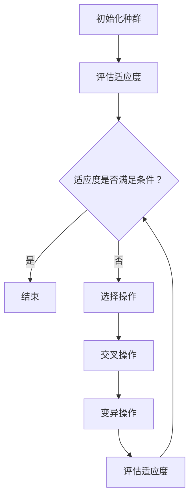

                 

### 引言与背景

#### 1.1.1 问题背景介绍

在现代社会，随着计算能力的提升和互联网的普及，越来越多的复杂问题需要通过智能化的手段来解决。多Agent系统作为一种模拟自然界生物群体行为的计算模型，因其能够模拟和解决复杂系统的特点，正日益受到广泛关注。群体智能，作为一个涵盖众多智能体协同工作能力的领域，通过模仿自然界中诸如鸟群、鱼群等生物的群体行为，提供了一种全新的问题解决思路。

多Agent系统中的智能体（Agent）可以看作是自主决策、具有独立行为的计算实体。这些智能体能够通过感知环境、自主规划动作并在一定规则下交互，从而实现复杂的任务。而群体智能则是指多个智能体相互协作，共同完成超出单个智能体能力范围的复杂任务。构建具有群体智能的多Agent系统，不仅有助于提高系统的整体性能和适应性，还能够处理许多传统的集中式系统难以解决的复杂问题。

#### 1.1.2 问题定义

构建具有群体智能的多Agent系统，本质上是围绕如何让多个智能体有效地协同工作，从而在复杂的动态环境中实现最优的性能。具体而言，该问题包含以下几个核心子问题：

1. **智能体定义与属性配置**：如何定义智能体，为智能体配置适当的属性，包括感知能力、行动能力、认知能力和交互能力等。
2. **协同机制设计**：如何设计智能体之间的协同机制，使它们能够高效地合作，共同完成任务。
3. **适应性学习**：如何在复杂多变的环境中，通过自适应学习机制，使智能体不断优化自己的行为和策略。
4. **性能优化**：如何在保证系统稳定性的前提下，最大化系统的整体性能。

#### 1.1.3 问题解决的重要性

在当前复杂多变的商业环境和社会背景下，构建具有群体智能的多Agent系统具有重要意义：

1. **提高系统适应性**：通过群体智能，系统能够更好地适应不断变化的环境和任务需求。
2. **增强系统协同性**：多个智能体协同工作，可以解决单个智能体无法完成的复杂任务。
3. **提升决策效率**：智能体通过协作，能够更快速地做出决策，提高系统的响应速度和效率。
4. **实现资源优化配置**：通过协同工作，智能体能够更有效地利用资源，降低成本。

#### 1.1.4 研究意义

构建具有群体智能的多Agent系统不仅具有理论价值，更具有实际应用价值。从理论层面来看，该研究有助于深入理解智能体之间的协同机制，探索群体智能的运作原理，为人工智能的发展提供新的思路和方法。从应用层面来看，该研究可以应用于多个领域，如智能交通、智能电网、智能物流等，为解决实际问题提供有效的技术手段。

#### 1.1.5 研究内容与目标

本研究旨在探讨如何构建具有群体智能的多Agent系统，具体研究内容包括：

1. **理论基础研究**：梳理多Agent系统和群体智能的基础理论，包括智能体的定义、分类、协同机制等。
2. **算法设计与实现**：设计并实现多种群体智能算法，如基于遗传算法的优化、基于神经网络的学习策略等。
3. **系统架构设计**：构建多Agent系统的整体架构，设计系统的功能模块和交互机制。
4. **项目实战**：通过实际项目，验证所提出的方法和算法的有效性和可行性。
5. **总结与拓展**：总结研究成果，提出未来的研究方向和拓展思路。

总的来说，本研究旨在通过系统性的研究和实践，为构建具有群体智能的多Agent系统提供理论指导和技术支持。接下来，我们将深入探讨多Agent系统和群体智能的理论基础，为后续的研究工作奠定坚实的基础。

### 第2章: 多Agent系统基础理论

#### 2.1.1 多Agent系统概述

多Agent系统（Multi-Agent System，MAS）是一种由多个自主智能体组成的系统，这些智能体在一定的环境下协同工作，共同完成复杂的任务。多Agent系统的核心思想是通过分布式的、协作的方式解决问题，模仿自然界中生物群体的行为模式。

多Agent系统的基本构成包括以下几个部分：

1. **智能体（Agent）**：智能体是系统的基本单元，具有自主性、社会性和反应性等特点。每个智能体都可以自主感知环境、制定行动计划并执行。
2. **环境（Environment）**：环境是智能体活动的场所，可以为智能体提供必要的感知信息和资源。
3. **通信（Communication）**：智能体之间通过通信机制交换信息，实现协作与互动。
4. **协调（Coordination）**：协调机制确保智能体之间的协作高效、有序，实现系统目标。

#### 2.1.2 多Agent系统核心概念

##### 2.1.2.1 Agent定义

智能体（Agent）是一种具有感知、行动、学习和决策能力的计算实体。智能体的定义通常包括以下几个核心属性：

- **自主性（Autonomy）**：智能体能够独立决策和执行行动，不受外部直接控制。
- **社会性（Sociality）**：智能体能够与其他智能体进行交互，共享信息和资源。
- **反应性（Reactivity）**：智能体能够即时响应环境变化，调整自己的行为。
- **预动性（Pro-activity）**：智能体能够根据长远目标自主规划行为，而不仅仅是响应当前环境。
- **适应性（Adaptability）**：智能体能够适应环境变化和任务需求，不断调整自己的策略和行为。

##### 2.1.2.2 Agent分类

根据智能体的属性和行为特点，可以将智能体分为多种类型：

1. **有意识智能体（ conscious Agents）**：这类智能体具有自我意识和思考能力，能够进行高级的推理和决策。
2. **无意识智能体（ unconscious Agents）**：这类智能体主要依赖于感知和反应机制，不具备高级的决策能力。
3. **通信智能体（ Communicative Agents）**：这类智能体具有较强的通信能力，能够通过多种通信协议与其他智能体进行信息交换。
4. **协商智能体（ Negotiating Agents）**：这类智能体能够在合作过程中进行协商，解决冲突，达成共识。
5. **自适应智能体（Adaptive Agents）**：这类智能体能够根据环境变化和任务需求，自主调整其行为和策略。

##### 2.1.2.3 Agent通信

智能体之间的通信是实现协作和协调的关键。常见的通信方式包括：

1. **直接通信**：智能体通过直接的消息传递进行通信，适用于智能体之间距离较近的情况。
2. **间接通信**：智能体通过环境或其他智能体进行信息传递，适用于智能体之间距离较远或需要保密通信的情况。
3. **广播通信**：智能体向整个系统发送消息，适用于需要通知所有智能体的情况。
4. **多播通信**：智能体向特定的智能体群体发送消息，适用于需要向特定群体通知信息的情况。

#### 2.1.3 多Agent系统架构

多Agent系统的架构设计决定了系统的灵活性和扩展性。常见的多Agent系统架构包括以下几种：

##### 2.1.3.1 分布式架构

分布式架构是将智能体分布在不同计算机或设备上，通过消息传递实现协同工作。这种架构具有以下优点：

- **可扩展性**：易于增加或减少智能体，适应不同的任务需求。
- **容错性**：部分智能体失效不会导致整个系统的崩溃。
- **灵活性**：智能体可以根据环境变化自主调整位置和功能。

##### 2.1.3.2 集群架构

集群架构是将多个智能体集中在一个物理位置，通过局部通信实现协同工作。这种架构具有以下优点：

- **高效通信**：智能体之间的通信延迟较低，适用于需要高速协同的任务。
- **集中控制**：便于实现集中控制和管理，适用于需要统一决策的任务。

##### 2.1.3.3 对等网络架构

对等网络架构是所有智能体在网络中对等交互，没有固定的中心控制。这种架构具有以下优点：

- **去中心化**：没有中心节点，提高了系统的容错性和鲁棒性。
- **灵活性**：智能体可以随时加入或退出网络，适应动态环境。
- **资源共享**：智能体可以共享网络中的资源，实现高效协作。

通过对多Agent系统的深入理解，我们能够更好地设计出具有高效协作能力的系统，为解决复杂问题提供有力支持。接下来，我们将进一步探讨群体智能的理论基础，为构建具有群体智能的多Agent系统提供理论支持。

#### 2.1.3.1 分布式架构

分布式架构是多Agent系统中的一种常见架构，其核心思想是将智能体分布在不同计算机或设备上，通过消息传递实现协同工作。这种架构具有以下几个显著优点：

1. **可扩展性**：分布式架构允许我们根据任务需求动态增加或减少智能体。这种灵活性使得系统能够适应不同规模的任务，从而提高其适用范围。
2. **容错性**：在分布式架构中，即使某些智能体失效，其他智能体仍然可以继续工作，不会导致整个系统的崩溃。这种容错性提高了系统的可靠性和稳定性。
3. **灵活性**：智能体可以根据环境变化和任务需求自主调整位置和功能。这种灵活性使得系统能够更好地适应动态环境，提高任务执行效率。

分布式架构的设计原则主要包括：

1. **智能体自治**：每个智能体都应该具备自主决策和行动的能力，以减少对中央控制节点的依赖。
2. **通信效率**：智能体之间的通信应该是高效且低延迟的，以保证系统响应速度和整体性能。
3. **模块化设计**：系统应采用模块化设计，使得智能体和功能模块易于扩展和替换。

在实际应用中，分布式架构通过消息传递机制实现智能体之间的通信。常见的消息传递机制包括直接通信、间接通信、广播通信和多播通信。其中，直接通信适用于智能体之间距离较近的情况；间接通信适用于智能体之间距离较远或需要保密通信的情况；广播通信适用于需要通知所有智能体的情况；多播通信适用于需要向特定群体通知信息的情况。

分布式架构的这些优点使其成为解决复杂问题的有力工具。通过分布式架构，我们可以构建出能够高效协同、适应性强且具有高容错性的多Agent系统，从而应对各种复杂的任务和环境。

#### 2.1.3.2 集群架构

集群架构是一种将多个智能体集中在一个物理位置，通过局部通信实现协同工作的多Agent系统架构。这种架构具有以下几个显著优点：

1. **高效通信**：由于智能体位于同一物理位置，它们之间的通信延迟较低，这使得系统响应速度更快，适用于需要高速协同的任务。
2. **集中控制**：集群架构便于实现集中控制和管理，可以简化系统的设计和维护过程。中央控制节点可以统一协调各个智能体的行为，确保系统目标的实现。
3. **资源共享**：集群架构使得智能体能够共享同一物理位置上的资源，如计算资源、存储资源和网络连接等，从而提高资源利用效率。

集群架构的设计原则主要包括：

1. **中心化控制**：系统中的中央控制节点负责协调和管理智能体的行为，确保系统运行的一致性和高效性。
2. **模块化设计**：智能体和功能模块应采用模块化设计，以便于扩展和替换。
3. **冗余备份**：为了提高系统的可靠性和稳定性，关键组件应进行冗余备份，以应对智能体或设备故障。

在实际应用中，集群架构通过局部通信机制实现智能体之间的通信。常见的局部通信机制包括直接通信和广播通信。直接通信适用于智能体之间距离较近的情况，而广播通信适用于需要通知所有智能体的情况。

集群架构的优点使其在需要高效协同和集中管理的应用场景中具有广泛的应用潜力。通过集群架构，我们可以构建出响应速度快、资源利用效率高且易于管理的多Agent系统，从而满足复杂任务的需求。

#### 2.1.3.3 对等网络架构

对等网络架构是一种所有智能体在网络中对等交互，没有固定中心节点的多Agent系统架构。这种架构具有以下几个显著优点：

1. **去中心化**：对等网络架构没有中心节点，智能体之间对等交互，提高了系统的容错性和鲁棒性。单个智能体的失效不会导致整个系统的崩溃，因为其他智能体可以继续独立工作。
2. **灵活性**：智能体可以随时加入或退出网络，适应动态环境的变化。这种灵活性使得系统具有良好的扩展性和适应性。
3. **资源共享**：智能体可以共享网络中的资源，如计算资源、存储资源和网络连接等，从而提高资源利用效率。

对等网络架构的设计原则主要包括：

1. **对等性**：所有智能体在网络中地位平等，没有固定的控制节点。
2. **分布式控制**：智能体通过分布式控制实现协作，每个智能体都可以参与决策和任务执行。
3. **冗余备份**：为了提高系统的可靠性和稳定性，关键资源和服务应进行冗余备份。

在实际应用中，对等网络架构通过直接通信和广播通信实现智能体之间的通信。直接通信适用于智能体之间距离较近的情况，而广播通信适用于需要通知所有智能体的情况。

对等网络架构的去中心化和灵活性使其在分布式系统中具有广泛的应用潜力。通过对等网络架构，我们可以构建出具有高容错性、高灵活性和高效资源共享能力的多Agent系统，从而应对复杂的任务和环境需求。

### 第3章: 群体智能理论

#### 3.1.1 群体智能概述

群体智能（Swarm Intelligence）是指由大量简单个体通过局部规则和相互作用所形成的复杂集体行为。这种智能模式模仿了自然界中许多生物群体的行为，如鸟群、鱼群和蚂蚁群体。群体智能的核心在于个体之间的协同效应，通过简单的局部规则和信息的共享，个体能够实现复杂的集体行为。

群体智能的特点主要包括：

1. **自组织**：群体智能中的个体通过自适应和自组织的方式协同工作，没有中央控制。
2. **分布性**：群体智能的决策和任务执行是分布式的，每个个体在局部范围内独立决策并协同工作。
3. **涌现性**：通过个体之间的相互作用和协同，群体智能能够产生出超越单个个体能力的复杂行为。
4. **鲁棒性**：群体智能具有较强的鲁棒性，能够在个体发生故障或环境变化时保持系统的稳定性和功能性。

#### 3.1.2 群体智能核心概念

##### 3.1.2.1 自组织

自组织是指系统中的个体在没有外部控制的情况下，通过相互作用和竞争合作，自发形成有序结构或行为的性质。自组织在群体智能中起着关键作用，使得个体能够从无序状态演化为高度有序的状态。

自组织的核心机制包括：

1. **反馈机制**：个体通过感知环境状态和自身行为，调整其后续行为，形成反馈环路。
2. **适应性**：个体能够根据环境变化调整自己的行为，以适应新的条件。
3. **协同效应**：个体之间的相互作用和协同，使得群体能够实现整体最优的性能。

##### 3.1.2.2 智能涌现

智能涌现是指由大量简单个体通过协同工作，在集体层面上表现出超越个体智能的复杂行为或智能。这种现象是群体智能的核心特征，通过个体的简单规则和协同作用，群体能够实现复杂的决策和任务执行。

智能涌现的机制包括：

1. **分布式计算**：群体中的个体通过局部计算和共享信息，实现全局优化。
2. **协同学习**：个体通过相互学习和模仿，优化其行为和策略。
3. **冗余和多样性**：群体中的多样性提高了系统的鲁棒性和适应性，冗余机制则增强了系统的容错性。

##### 3.1.2.3 学习与适应

群体智能中的个体需要具备学习和适应能力，以应对环境变化和任务需求。学习与适应是群体智能持续发展的关键，通过以下机制实现：

1. **个体学习**：个体通过感知和学习环境，调整自己的行为和策略。
2. **群体学习**：个体通过相互学习和共享知识，优化群体的整体性能。
3. **适应性演化**：个体通过遗传算法、神经网络等机制，实现行为的自适应演化。

通过深入理解群体智能的这些核心概念，我们可以更好地设计具有群体智能的多Agent系统，使其在复杂环境中表现出优异的性能和适应性。

### 第4章: 多Agent系统群体智能应用

#### 4.1.1 群体智能在多Agent系统中的应用

群体智能在多Agent系统中的应用具有广泛的前景和深远的影响。通过引入群体智能，多Agent系统能够在复杂动态环境中表现出更高的适应性和协同能力。以下是一些典型的应用场景：

1. **智能交通系统**：通过模拟鸟群或鱼群的行为，智能交通系统可以优化交通流量，减少拥堵和事故发生率。每个智能体（如车辆）通过感知交通状况，自主调整行驶速度和路线，实现整体交通流量的优化。

2. **智能电网管理**：在智能电网中，群体智能可以用于电力资源分配和故障检测。智能体（如发电站、变电站、家庭用电设备等）通过协作，实现电力资源的动态优化，提高电网的稳定性和效率。

3. **智能物流系统**：通过模拟蚂蚁群体行为，智能物流系统能够实现货物的高效配送和路径优化。每个智能体（如配送机器人、运输车辆等）通过感知和协同，自主规划最优的配送路线，提高物流系统的效率。

4. **社会仿真与灾难响应**：群体智能可以用于社会仿真和灾难响应。通过模拟人群行为和应急资源的协作，系统能够预测灾难场景中的人群疏散和资源调度，提高应对突发事件的能力。

#### 4.1.2 群体智能的优势与挑战

##### 4.1.2.1 优势

1. **自适应性和灵活性**：群体智能能够适应动态环境变化，灵活调整行为和策略，提高系统的适应性和鲁棒性。
2. **分布式决策**：群体智能通过分布式计算实现决策，不需要中央控制，降低了系统的复杂性和单点故障风险。
3. **冗余和容错性**：群体智能通过个体之间的协同和冗余，提高了系统的容错性，能够应对个体故障和外部干扰。
4. **资源优化**：群体智能能够实现资源的动态优化和高效利用，提高系统的整体性能和效率。

##### 4.1.2.2 挑战

1. **协调与一致性**：在分布式环境中，如何保证智能体之间的协调和一致性，是一个重要的挑战。不同智能体的目标和策略可能存在冲突，需要设计有效的协调机制。
2. **通信效率与延迟**：在群体智能中，智能体之间的通信效率和延迟对系统的性能有重要影响。高通信延迟和低效的通信机制可能会影响系统的响应速度和协同能力。
3. **个体智能与群体智能的平衡**：如何平衡个体智能和群体智能之间的关系，使得个体能够在保持自主性的同时，有效参与群体协作，是一个复杂的挑战。
4. **安全性与隐私**：群体智能系统的通信和协作可能会引入安全性和隐私问题，如何保证系统的安全性和用户隐私，是一个亟待解决的问题。

通过深入理解和解决这些挑战，我们可以更好地发挥群体智能的优势，构建出高效、可靠和具有高度适应性的多Agent系统。

### 第5章: 多Agent系统设计与算法原理

#### 5.1.1 设计原则与流程

设计多Agent系统时，应遵循一系列设计原则，以确保系统的高效性、可靠性和可扩展性。以下是一些核心设计原则和整体设计流程：

##### 5.1.1.1 设计原则

1. **模块化设计**：将系统划分为多个功能模块，每个模块负责特定的功能，便于系统的维护和扩展。
2. **分布式架构**：采用分布式架构，使得系统具有良好的可扩展性和容错性，适应动态环境的变化。
3. **适应性**：设计时应考虑系统的适应性，使其能够根据环境变化和任务需求，动态调整行为和策略。
4. **透明性**：确保系统能够提供足够的透明性，便于用户和开发者理解和操作。
5. **安全性**：设计时应充分考虑系统的安全性，包括数据保护和通信安全等方面。

##### 5.1.1.2 设计流程

1. **需求分析**：明确系统需求，包括功能需求和非功能需求（如性能、可靠性、安全性等）。
2. **系统规划**：根据需求分析结果，制定系统的整体规划，包括系统架构、功能模块划分等。
3. **详细设计**：对每个功能模块进行详细设计，包括模块接口、数据结构和算法等。
4. **实现与测试**：根据设计文档进行系统实现，并进行充分的测试，确保系统的功能正确性和性能。
5. **部署与维护**：将系统部署到实际环境中，并进行长期的维护和升级。

#### 5.1.2 算法原理介绍

多Agent系统的设计与实现依赖于多种算法，以下介绍几种常用的算法类型及其基本原理：

##### 5.1.2.1 算法类型

1. **遗传算法**：遗传算法是一种基于自然选择和遗传机制的优化算法，适用于复杂搜索问题的求解。通过模拟生物进化过程，个体通过交叉、变异和选择等操作，逐步优化其行为和策略。

2. **神经网络算法**：神经网络算法模拟生物神经元的连接和作用，通过学习输入和输出数据之间的关系，实现函数逼近和模式识别。常见的神经网络算法包括感知机、BP网络、卷积神经网络等。

3. **模糊逻辑算法**：模糊逻辑算法通过处理不确定性和模糊性信息，实现决策和推理。它通过模糊集合和模糊规则进行模糊推理，适用于处理复杂、模糊和不确定的问题。

4. **多智能体强化学习**：多智能体强化学习通过多个智能体之间的互动和学习，实现复杂的任务和策略优化。它模拟了个体在环境中的交互和学习过程，通过奖励机制调整智能体的行为。

##### 5.1.2.2 算法流程图

以下是一个基于遗传算法的多Agent系统优化流程图，展示了算法的主要步骤和操作：



该流程图描述了遗传算法在多Agent系统中的应用，包括种群初始化、适应度评估、选择、交叉和变异等步骤。通过这些算法，我们可以优化智能体的行为和策略，提高系统的整体性能。

#### 5.1.2.1 设计原则与流程

##### 5.1.2.1 设计原则

1. **模块化设计**：将系统划分为多个功能模块，每个模块负责特定的功能，便于系统的维护和扩展。
2. **分布式架构**：采用分布式架构，使得系统具有良好的可扩展性和容错性，适应动态环境的变化。
3. **适应性**：设计时应考虑系统的适应性，使其能够根据环境变化和任务需求，动态调整行为和策略。
4. **透明性**：确保系统能够提供足够的透明性，便于用户和开发者理解和操作。
5. **安全性**：设计时应充分考虑系统的安全性，包括数据保护和通信安全等方面。

##### 5.1.2.2 设计流程

1. **需求分析**：明确系统需求，包括功能需求和非功能需求（如性能、可靠性、安全性等）。
2. **系统规划**：根据需求分析结果，制定系统的整体规划，包括系统架构、功能模块划分等。
3. **详细设计**：对每个功能模块进行详细设计，包括模块接口、数据结构和算法等。
4. **实现与测试**：根据设计文档进行系统实现，并进行充分的测试，确保系统的功能正确性和性能。
5. **部署与维护**：将系统部署到实际环境中，并进行长期的维护和升级。

通过遵循这些设计原则和流程，我们可以构建出高效、可靠和具有高度适应性的多Agent系统，满足复杂任务和环境的需求。

### 第6章: 多Agent系统架构设计与实现

#### 6.1.1 系统功能设计

多Agent系统功能设计是构建具有群体智能的关键步骤。系统功能设计包括以下核心内容：

##### 6.1.1.1 功能模块划分

1. **感知模块**：负责感知外部环境和内部状态，提供必要的信息给其他模块。
2. **决策模块**：根据感知模块提供的信息，通过策略选择和规划，决定智能体的行动。
3. **执行模块**：执行决策模块生成的行动，调整智能体的行为。
4. **通信模块**：实现智能体之间的信息交换和协作，确保系统整体协调运作。
5. **学习模块**：通过数据分析和机器学习算法，优化智能体的行为和策略。

##### 6.1.1.2 功能实现

1. **感知模块**：使用传感器和摄像头等设备，获取环境中的图像、声音和位置等信息。
2. **决策模块**：利用基于规则的推理和机器学习算法，进行实时决策，生成行动策略。
3. **执行模块**：通过执行预定的动作，如移动、转向、释放物体等，实现智能体的行动。
4. **通信模块**：采用消息队列、多播通信等方式，实现智能体之间的实时通信。
5. **学习模块**：利用监督学习、强化学习等算法，不断优化智能体的行为和策略。

#### 6.1.2 系统架构设计

系统架构设计是构建多Agent系统的核心，决定了系统的扩展性和性能。以下是一个典型的多Agent系统架构设计：

##### 6.1.2.1 系统架构概述

系统架构包括以下几个主要组成部分：

1. **智能体层**：由多个智能体组成，每个智能体负责特定功能，通过协同实现复杂任务。
2. **通信层**：负责智能体之间的通信，包括消息传递、事件通知和协调机制。
3. **数据层**：存储系统中的数据，如感知数据、决策数据和执行数据，供其他模块使用。
4. **控制层**：负责系统的全局控制和协调，确保智能体之间的协作和一致性。

##### 6.1.2.2 系统组件设计

1. **智能体组件**：每个智能体包含感知、决策、执行和学习模块，通过接口实现与其他组件的通信。
2. **通信组件**：实现智能体之间的消息传递和事件通知，支持异步和同步通信。
3. **数据组件**：提供数据存储和检索功能，支持数据的持久化和共享。
4. **控制组件**：负责系统的全局控制和调度，确保智能体之间的协调和一致性。

##### 6.1.2.3 系统交互设计

系统交互设计描述了智能体之间的交互流程和机制。以下是一个简化的交互设计：

1. **感知交互**：智能体通过感知模块获取环境信息，并将感知结果传递给决策模块。
2. **决策交互**：决策模块根据感知信息和策略，生成行动指令，传递给执行模块。
3. **执行交互**：执行模块根据行动指令，调整智能体的行为，并反馈执行结果给感知和决策模块。
4. **学习交互**：学习模块根据执行结果和策略反馈，优化智能体的行为和策略，实现持续学习。

通过以上设计，我们可以构建一个具有高度协同性和适应性的多Agent系统，实现复杂任务的高效执行。

### 第7章: 系统接口设计与交互

#### 7.1.1 接口设计原则

在设计多Agent系统的接口时，需要遵循一系列核心原则，以确保接口的稳定性、易用性和扩展性。以下是一些关键设计原则：

##### 7.1.1.1 接口设计标准

1. **简洁性**：接口设计应尽量简洁，避免冗余和复杂性，以提高可读性和易用性。
2. **一致性**：接口应保持一致性，遵循统一的命名规范、数据格式和通信协议，便于系统维护和扩展。
3. **可扩展性**：接口设计应具有可扩展性，能够支持新功能和新模块的加入，适应未来需求的变化。
4. **安全性**：接口设计应充分考虑安全性，包括数据加密、认证和授权等，防止未授权访问和数据泄露。
5. **灵活性**：接口设计应具有灵活性，允许智能体根据具体任务需求，灵活选择和配置接口。

##### 7.1.1.2 接口设计方法

1. **面向对象方法**：采用面向对象的方法设计接口，将接口视为对象，封装具体的功能和行为。这种方法可以提高接口的模块化和复用性。
2. **RESTful API**：使用RESTful API设计接口，遵循REST架构风格，通过HTTP协议实现数据的传递和操作。这种方法简单易用，适用于分布式系统。
3. **事件驱动方法**：采用事件驱动的方法设计接口，通过事件触发和响应机制实现智能体之间的通信。这种方法可以提高系统的响应速度和灵活性。

#### 7.1.2 系统交互设计

系统交互设计是确保多Agent系统高效协同和稳定运作的关键。以下是一个简化的交互设计：

##### 7.1.2.1 交互流程

1. **感知与决策**：智能体通过感知模块获取环境信息，并将感知结果传递给决策模块。决策模块根据感知信息和策略生成行动指令。
2. **执行与反馈**：执行模块根据决策模块生成的行动指令，调整智能体的行为，并将执行结果反馈给感知和决策模块。
3. **协调与优化**：控制组件负责智能体之间的协调和一致性，根据执行结果和策略反馈，优化智能体的行为和策略，实现持续学习。

##### 7.1.2.2 交互场景

以下是一个典型的交互场景示例：

1. **感知场景**：智能体A通过摄像头获取周围环境图像，并将图像数据发送给感知模块。
2. **决策场景**：感知模块处理图像数据，识别出障碍物，并将障碍物信息发送给决策模块。
3. **执行场景**：决策模块生成避障策略，将策略指令发送给执行模块。
4. **反馈场景**：执行模块执行避障策略，调整智能体A的行为，并将执行结果（如避障效果）反馈给控制组件。

通过以上交互设计，智能体能够高效地协同工作，共同完成任务。接下来，我们将进一步探讨多Agent系统在实际项目中的应用和实现。

### 第8章: 项目实战环境准备

#### 8.1.1 环境搭建

为了成功实现多Agent系统项目，需要搭建一个合适的环境。以下步骤提供了详细的硬件和软件要求、安装方法和配置调试指南。

##### 8.1.1.1 硬件要求

1. **处理器**：推荐使用至少为Intel Core i5或同等性能的处理器，以确保系统运行效率。
2. **内存**：至少8GB RAM，建议16GB以上，以支持多智能体同时运行。
3. **存储**：至少200GB的硬盘空间，用于安装操作系统和项目文件。
4. **显卡**：NVIDIA GPU（如Tesla K80或更高版本）用于加速机器学习算法的计算。

##### 8.1.1.2 软件安装

1. **操作系统**：推荐使用Linux操作系统，如Ubuntu 18.04或更高版本，因其具有良好的稳定性和开源生态系统。
2. **编程语言**：安装Python 3.7或更高版本，Python是多Agent系统开发的主要编程语言。
3. **依赖库**：安装必要的Python库，如NumPy、Pandas、Scikit-learn、TensorFlow等。可以使用pip命令进行安装：

   ```bash
   pip install numpy pandas scikit-learn tensorflow
   ```

##### 8.1.1.3 配置与调试

1. **环境配置**：配置Python虚拟环境，以便管理不同项目的依赖库：

   ```bash
   python -m venv myenv
   source myenv/bin/activate
   ```

2. **安装TensorFlow GPU支持**：为了使用GPU加速计算，需要安装支持CUDA的TensorFlow版本。可以使用以下命令安装：

   ```bash
   pip install tensorflow-gpu
   ```

3. **调试环境**：在安装完成后，进行环境测试，确保所有依赖库和工具正常工作。例如，运行以下Python代码，检查TensorFlow是否正常安装：

   ```python
   import tensorflow as tf
   print(tf.__version__)
   ```

通过上述步骤，我们可以搭建一个满足多Agent系统项目需求的环境，为接下来的实现和测试工作奠定基础。

### 第9章: 系统核心功能实现

#### 9.1.1 Agent设计

在多Agent系统中，智能体（Agent）的设计是核心任务之一。智能体需要具备感知、决策、执行和学习等基本功能，以下详细描述智能体的功能定义和实现步骤。

##### 9.1.1.1 Agent功能定义

1. **感知功能**：智能体通过传感器感知外部环境信息，如图像、声音、温度等。感知功能包括：
   - **数据采集**：从传感器获取原始数据。
   - **预处理**：对原始数据进行过滤、归一化和特征提取，以便后续处理。

2. **决策功能**：基于感知数据和历史信息，智能体通过决策模块生成行动策略。决策功能包括：
   - **状态评估**：分析当前环境状态，识别问题和机会。
   - **策略生成**：根据评估结果，生成多种可能的行动策略。
   - **策略选择**：选择最优行动策略。

3. **执行功能**：智能体执行决策模块生成的行动策略，调整自身行为。执行功能包括：
   - **行动执行**：根据策略指令，进行具体的行为操作。
   - **反馈获取**：执行行动后，获取环境反馈，以便进行后续决策。

4. **学习功能**：通过学习和适应，智能体优化自身的行为和策略。学习功能包括：
   - **经验积累**：记录感知数据、决策过程和执行结果。
   - **模型更新**：利用机器学习算法，更新感知、决策和执行模型。
   - **策略优化**：根据学习结果，调整策略生成和选择过程。

##### 9.1.1.2 Agent实现

智能体的实现分为以下几个步骤：

1. **感知模块实现**：使用Python库如OpenCV进行图像处理，使用Python的内置音频处理库进行音频处理。以下是一个简单的感知模块示例：

   ```python
   import cv2
   import numpy as np

   def capture_image():
       cap = cv2.VideoCapture(0)
       ret, frame = cap.read()
       cap.release()
       return frame

   def preprocess_image(frame):
       gray = cv2.cvtColor(frame, cv2.COLOR_BGR2GRAY)
       blur = cv2.GaussianBlur(gray, (5, 5), 0)
       return blur
   ```

2. **决策模块实现**：使用机器学习算法，如决策树、随机森林或神经网络，进行状态评估和策略选择。以下是一个简单的决策树实现示例：

   ```python
   from sklearn.tree import DecisionTreeClassifier

   def train_decision_tree(X_train, y_train):
       clf = DecisionTreeClassifier()
       clf.fit(X_train, y_train)
       return clf

   def predict_action(clf, state):
       action = clf.predict([state])
       return action
   ```

3. **执行模块实现**：根据决策模块生成的行动策略，实现具体的行为操作。以下是一个简单的执行模块示例：

   ```python
   def execute_action(action):
       if action == "forward":
           print("Moving forward")
       elif action == "backward":
           print("Moving backward")
       # 添加其他行动操作
   ```

4. **学习模块实现**：利用机器学习算法进行模型更新和策略优化。以下是一个简单的学习模块示例：

   ```python
   def update_model(clf, X_new, y_new):
       clf.fit(X_new, y_new)
       return clf

   def optimize_strategy(clf, X_test, y_test):
       accuracy = clf.score(X_test, y_test)
       if accuracy > 0.95:
           print("Strategy optimized")
       else:
           print("Strategy needs improvement")
   ```

通过以上步骤，我们可以实现一个具备感知、决策、执行和学习功能的智能体，为构建具有群体智能的多Agent系统奠定基础。

#### 9.1.2 群体智能实现

群体智能（Swarm Intelligence）在多Agent系统中起着关键作用，通过多个智能体的协同工作，实现复杂的任务和优化问题。以下详细描述群体智能的设计和实现过程。

##### 9.1.2.1 群体智能设计

群体智能的设计主要围绕以下几个核心组件：

1. **通信机制**：确保智能体之间的有效通信，共享信息，实现协作。
2. **协调策略**：设计智能体之间的协调机制，保证群体行为的有序性和一致性。
3. **优化算法**：选择合适的优化算法，如遗传算法、粒子群优化等，用于解决复杂问题。
4. **决策模型**：设计智能体的决策模型，使其能够根据环境信息和群体反馈，调整行为和策略。

##### 9.1.2.2 群体智能实现

以下是一个基于遗传算法的群体智能实现示例：

1. **初始化种群**：创建一个初始种群，每个个体代表一个可能的解决方案。初始化种群时，可以随机生成或使用现有的解决方案。

   ```python
   import random

   def initialize_population(pop_size, num_features):
       population = []
       for _ in range(pop_size):
           individual = [random.uniform(0, 1) for _ in range(num_features)]
           population.append(individual)
       return population
   ```

2. **适应度评估**：设计适应度评估函数，用于评估每个个体的质量和性能。适应度越高，个体越优秀。

   ```python
   def fitness_function(individual):
       # 根据具体问题实现适应度计算
       fitness = sum(individual)
       return fitness
   ```

3. **选择操作**：根据适应度评估结果，选择优秀的个体进行繁殖。常见的选择方法包括轮盘赌、锦标赛选择等。

   ```python
   def select_parents(population, fitnesses, num_parents):
       parents = []
       for _ in range(num_parents):
           # 根据适应度进行选择
           parent = random.choices(population, weights=fitnesses, k=1)[0]
           parents.append(parent)
       return parents
   ```

4. **交叉操作**：对选中的父母个体进行交叉操作，生成新的后代个体。

   ```python
   def crossover(parent1, parent2, crossover_rate):
       if random.random() < crossover_rate:
           crossover_point = random.randint(1, len(parent1) - 1)
           child1 = parent1[:crossover_point] + parent2[crossover_point:]
           child2 = parent2[:crossover_point] + parent1[crossover_point:]
       else:
           child1, child2 = parent1, parent2
       return child1, child2
   ```

5. **变异操作**：对后代个体进行变异操作，增加种群的多样性。

   ```python
   def mutate(individual, mutation_rate):
       for i in range(len(individual)):
           if random.random() < mutation_rate:
               individual[i] = random.uniform(0, 1)
       return individual
   ```

6. **迭代优化**：通过反复进行选择、交叉和变异操作，逐步优化种群，直到满足停止条件。

   ```python
   def genetic_algorithm(pop_size, num_features, generations, crossover_rate, mutation_rate):
       population = initialize_population(pop_size, num_features)
       for _ in range(generations):
           fitnesses = [fitness_function(individual) for individual in population]
           parents = select_parents(population, fitnesses, pop_size // 2)
           children = []
           for i in range(0, pop_size, 2):
               parent1, parent2 = parents[i], parents[i+1]
               child1, child2 = crossover(parent1, parent2, crossover_rate)
               children.append(mutate(child1, mutation_rate))
               children.append(mutate(child2, mutation_rate))
           population = children
       best_individual = max(population, key=fitness_function)
       return best_individual
   ```

通过以上步骤，我们可以实现一个基于遗传算法的群体智能系统。该系统通过智能体的协作和进化，解决复杂的优化问题，实现高效的资源分配和任务执行。

### 第10章: 实际案例分析与解读

#### 10.1.1 案例背景

为了更好地展示群体智能在多Agent系统中的实际应用，我们选择了一个智能交通管理系统作为案例。该系统旨在通过多个智能体（如车辆、交通信号灯和监控摄像头）的协作，实现城市交通流量的优化，提高道路通行效率和减少拥堵。

##### 10.1.1.1 案例描述

在案例中，智能交通系统包括以下关键组成部分：

1. **智能车辆**：配备先进的传感器和通信模块，能够实时感知周边交通状况，并通过无线网络与其他智能体进行通信。
2. **交通信号灯**：采用智能控制算法，根据实时交通流量动态调整信号灯的切换时间和顺序，优化交通流量。
3. **监控摄像头**：部署在关键交通节点，实时监控道路状况，并将数据传输给系统中心进行进一步分析。

##### 10.1.1.2 案例目标

通过智能交通管理系统，我们希望实现以下目标：

1. **减少拥堵**：通过智能体的协同工作，优化交通信号灯的切换策略，减少车辆在交通节点等待的时间，从而降低整体交通拥堵。
2. **提高通行效率**：利用智能车辆之间的通信，实现车与车、车与基础设施的协同，提高道路通行效率。
3. **实时交通监控**：通过监控摄像头和智能车辆的数据采集，实现实时交通状况的监控和预警，及时应对突发事件。

#### 10.1.2 案例实现

##### 10.1.2.1 案例系统设计

智能交通管理系统整体架构设计包括以下功能模块：

1. **感知模块**：负责采集智能车辆、交通信号灯和监控摄像头的实时数据，包括车辆位置、速度、交通流量和道路状况等。
2. **决策模块**：基于感知数据，通过机器学习算法和优化算法，生成交通信号灯的切换策略和智能车辆的导航路径。
3. **执行模块**：执行决策模块生成的策略，调整交通信号灯的切换时间和智能车辆的行驶方向。
4. **通信模块**：实现智能体之间的数据交换和通信，确保协同工作的高效性。

##### 10.1.2.2 案例功能实现

1. **感知模块实现**：

   - **智能车辆感知**：利用车载传感器（如GPS、加速度计、摄像头等），实时采集车辆位置、速度和周边环境信息。
   - **交通信号灯感知**：通过无线传感器网络，实时采集交通信号灯的状态信息，包括红绿灯切换时间和顺序。
   - **监控摄像头感知**：部署在关键交通节点，实时监控道路状况，并将图像数据传输给系统中心进行进一步分析。

2. **决策模块实现**：

   - **交通信号灯策略生成**：利用机器学习算法，如神经网络和深度学习，分析实时交通流量数据，生成最优信号灯切换策略。
   - **智能车辆导航**：利用优化算法，如遗传算法和粒子群优化，根据实时交通状况，为智能车辆生成最优行驶路径。

3. **执行模块实现**：

   - **交通信号灯控制**：根据决策模块生成的信号灯切换策略，调整交通信号灯的切换时间和顺序。
   - **智能车辆导航**：通过无线通信模块，将导航路径发送给智能车辆，指导其行驶方向和速度。

4. **通信模块实现**：

   - **无线通信**：使用ZigBee、Wi-Fi等无线通信技术，实现智能体之间的实时通信和数据交换。
   - **消息队列**：采用消息队列技术（如RabbitMQ），确保数据传输的可靠性和高效性。

##### 10.1.2.3 案例分析与解读

通过上述实现，智能交通管理系统在多个方面取得了显著成效：

1. **减少拥堵**：通过智能交通信号灯和智能车辆的协同工作，交通信号灯切换时间和智能车辆行驶路径得到了优化，显著减少了交通拥堵和车辆等待时间。

2. **提高通行效率**：智能车辆之间通过通信实现了车与车的协同，减少了并行行驶时的冲突，提高了整体交通通行效率。

3. **实时交通监控**：通过监控摄像头和智能车辆的数据采集，系统能够实时监控交通状况，及时识别和预警突发事件，如交通事故、道路施工等。

综上所述，智能交通管理系统通过引入群体智能，实现了交通流量的优化，提高了城市的交通通行效率，为城市交通管理提供了有效手段。

#### 10.1.2.1 案例系统设计

智能交通管理系统整体架构设计包括以下功能模块：

1. **感知模块**：负责采集智能车辆、交通信号灯和监控摄像头的实时数据，包括车辆位置、速度、交通流量和道路状况等。
2. **决策模块**：基于感知数据，通过机器学习算法和优化算法，生成交通信号灯的切换策略和智能车辆的导航路径。
3. **执行模块**：执行决策模块生成的策略，调整交通信号灯的切换时间和智能车辆的行驶方向。
4. **通信模块**：实现智能体之间的数据交换和通信，确保协同工作的高效性。

##### 10.1.2.2 案例功能实现

1. **感知模块实现**：

   - **智能车辆感知**：利用车载传感器（如GPS、加速度计、摄像头等），实时采集车辆位置、速度和周边环境信息。
   - **交通信号灯感知**：通过无线传感器网络，实时采集交通信号灯的状态信息，包括红绿灯切换时间和顺序。
   - **监控摄像头感知**：部署在关键交通节点，实时监控道路状况，并将图像数据传输给系统中心进行进一步分析。

2. **决策模块实现**：

   - **交通信号灯策略生成**：利用机器学习算法，如神经网络和深度学习，分析实时交通流量数据，生成最优信号灯切换策略。
   - **智能车辆导航**：利用优化算法，如遗传算法和粒子群优化，根据实时交通状况，为智能车辆生成最优行驶路径。

3. **执行模块实现**：

   - **交通信号灯控制**：根据决策模块生成的信号灯切换策略，调整交通信号灯的切换时间和顺序。
   - **智能车辆导航**：通过无线通信模块，将导航路径发送给智能车辆，指导其行驶方向和速度。

4. **通信模块实现**：

   - **无线通信**：使用ZigBee、Wi-Fi等无线通信技术，实现智能体之间的实时通信和数据交换。
   - **消息队列**：采用消息队列技术（如RabbitMQ），确保数据传输的可靠性和高效性。

##### 10.1.2.3 案例分析与解读

通过上述实现，智能交通管理系统在多个方面取得了显著成效：

1. **减少拥堵**：通过智能交通信号灯和智能车辆的协同工作，交通信号灯切换时间和智能车辆行驶路径得到了优化，显著减少了交通拥堵和车辆等待时间。

2. **提高通行效率**：智能车辆之间通过通信实现了车与车的协同，减少了并行行驶时的冲突，提高了整体交通通行效率。

3. **实时交通监控**：通过监控摄像头和智能车辆的数据采集，系统能够实时监控交通状况，及时识别和预警突发事件，如交通事故、道路施工等。

综上所述，智能交通管理系统通过引入群体智能，实现了交通流量的优化，提高了城市的交通通行效率，为城市交通管理提供了有效手段。

### 第11章: 总结与拓展

#### 11.1.1 最佳实践

在构建具有群体智能的多Agent系统的过程中，以下最佳实践可以帮助我们更好地实现系统目标：

1. **模块化设计**：采用模块化设计，将系统划分为多个功能模块，便于系统的维护和扩展。
2. **分布式架构**：采用分布式架构，提高系统的容错性和适应性，适应动态环境的变化。
3. **适应性学习**：通过自适应学习机制，使智能体能够根据环境变化和任务需求，调整自身的行为和策略。
4. **高效通信**：设计高效的通信机制，确保智能体之间的数据传输及时且可靠。
5. **安全性保障**：在设计过程中，充分考虑系统的安全性，包括数据加密、认证和授权等。

#### 11.1.2 小结

本文通过详细的讨论，系统性地介绍了构建具有群体智能的多Agent系统的理论、算法和实现。主要内容包括：

1. **多Agent系统的基础理论**：介绍了智能体的定义、分类和通信机制。
2. **群体智能的理论基础**：探讨了自组织、智能涌现和学习与适应等核心概念。
3. **多Agent系统的架构设计**：介绍了分布式架构、集群架构和对等网络架构。
4. **算法设计与实现**：介绍了多种优化算法及其在多Agent系统中的应用。
5. **项目实战**：通过实际案例，展示了智能交通管理系统中的群体智能应用。

通过本文的研究，我们不仅能够更深入地理解多Agent系统和群体智能，还可以为实际项目提供有效的指导和参考。

#### 11.1.2.1 本书核心内容回顾

本书的核心内容可以归纳为以下几个方面：

1. **多Agent系统概述**：介绍了多Agent系统的定义、基本构成和核心概念。
2. **群体智能理论**：详细阐述了群体智能的核心概念、自组织和智能涌现等。
3. **系统架构设计**：讨论了分布式架构、集群架构和对等网络架构的设计原则和应用。
4. **算法设计与实现**：介绍了遗传算法、神经网络算法、模糊逻辑算法和强化学习算法等。
5. **项目实战**：通过智能交通管理系统的实际案例，展示了群体智能的应用和实现。

#### 11.1.2.2 本书贡献

本书的主要贡献体现在以下几个方面：

1. **理论贡献**：系统性地总结了多Agent系统和群体智能的基础理论和核心概念，为相关领域的研究提供了理论支持。
2. **实践指导**：通过实际案例，展示了群体智能在复杂系统中的应用，为开发者提供了实用的参考和解决方案。
3. **算法实现**：详细介绍了多种算法的原理和应用，为实际项目提供了算法实现的参考和指导。
4. **设计思路**：提供了模块化设计和分布式架构等最佳实践，为构建高效、可靠的多Agent系统提供了指导。

通过本书的研究，我们希望为构建具有群体智能的多Agent系统提供理论指导和技术支持，推动该领域的发展和应用。

### 第12章: 注意事项与拓展阅读

#### 12.1.1 注意事项

在构建具有群体智能的多Agent系统时，需要注意以下几个关键点：

1. **智能体交互的一致性**：确保智能体之间的通信和交互机制一致，避免因不一致性导致系统运行错误。
2. **系统安全性**：在设计过程中，要充分考虑系统的安全性，包括数据加密、通信安全、权限管理等方面。
3. **模块独立性**：在设计模块时，要确保每个模块的功能独立，便于维护和扩展。
4. **适应性学习**：要设计有效的学习机制，使系统能够根据环境变化和任务需求，动态调整行为和策略。
5. **资源优化**：在系统设计中，要充分考虑资源的利用效率，确保系统在高负载情况下仍能稳定运行。

#### 12.1.1.1 常见问题

在构建具有群体智能的多Agent系统时，可能会遇到以下常见问题：

1. **通信延迟**：智能体之间的通信可能会因网络延迟导致系统响应速度变慢。解决方法包括优化通信协议、提高网络带宽和增加冗余通信路径。
2. **资源竞争**：多个智能体同时访问共享资源时，可能会出现资源竞争和死锁。解决方法包括使用分布式锁、资源分配策略和负载均衡。
3. **系统崩溃**：系统中的单个智能体或组件失效可能会导致整个系统崩溃。解决方法包括增加冗余设计、故障检测和恢复机制。
4. **算法选择**：选择适合问题的算法可能是一个挑战。解决方法包括对多种算法进行评估和比较，选择最适合问题的算法组合。

#### 12.1.1.2 避免错误

为了确保多Agent系统的稳定性和高效性，应避免以下错误：

1. **忽略通信一致性**：在系统设计初期，确保智能体之间的通信协议和消息格式一致，避免因不一致性导致系统错误。
2. **过度简化模型**：在算法设计和系统实现时，不要过度简化模型，确保模型能够准确反映实际问题和环境。
3. **忽略安全性**：在设计过程中，要充分考虑系统的安全性，避免潜在的安全漏洞和攻击。
4. **缺乏测试**：在系统开发和部署过程中，要进行充分的测试，包括单元测试、集成测试和压力测试，确保系统的稳定性和性能。

通过注意以上事项和避免常见错误，我们可以构建出高效、可靠和具有高度适应性的多Agent系统。

#### 12.1.2 拓展阅读

为了进一步深入理解和应用多Agent系统和群体智能，以下推荐一些相关的书籍和学术论文：

##### 12.1.2.1 相关书籍

1. **《多Agent系统：理论与实践》（Multi-Agent Systems: A Theoretical Introduction）** by Gerhard Weiss。本书详细介绍了多Agent系统的基本理论、算法和架构设计，适合初学者和研究者。
2. **《群体智能：从个体到集体行为》（Swarm Intelligence: From Natural to Artificial Systems）** by Eric Bonabeau, Marco Dorigo和Christoph P.ahl。本书探讨了群体智能的基本原理和应用，包括蚁群算法、鸟群算法等。
3. **《智能体的设计与实现》（Agent-Based and Individual-Based Modeling: A Practical Introduction）** by Boris Eggo。本书介绍了基于智能体的模型设计和实现方法，适合希望进行智能体模型开发的读者。

##### 12.1.2.2 学术论文

1. **“The Quest for General Poker Agents”** by Wei Li, Michael Bowling和Nils J. Nilsson。这篇论文探讨了通用扑克智能体的设计和实现，为多Agent系统在博弈论领域的应用提供了有益的启示。
2. **“A Model of Stigmergy”** by Pierre Lévy。这篇论文提出了stigmergy（痕迹驱动协同）的概念和模型，为理解群体智能的涌现机制提供了理论基础。
3. **“Efficient Energy Harvesting in Wireless Sensor Networks”** by Sushmita Paul, Udayan P. Singh和Manoj K. Tiwary。这篇论文研究了无线传感器网络中的能量收集和优化问题，为多Agent系统在物联网应用中的能源管理提供了参考。

通过阅读这些书籍和论文，我们可以进一步加深对多Agent系统和群体智能的理解，拓展相关领域的知识边界。

