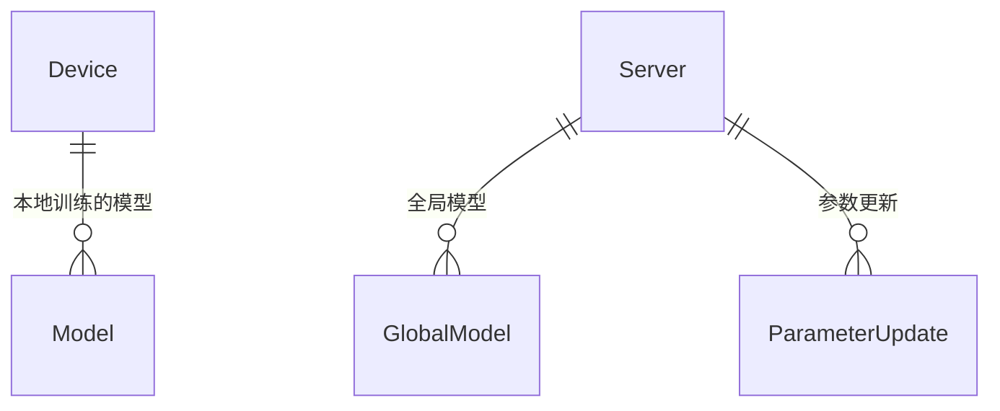
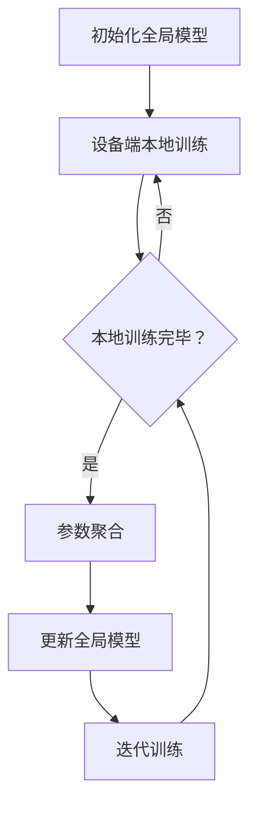
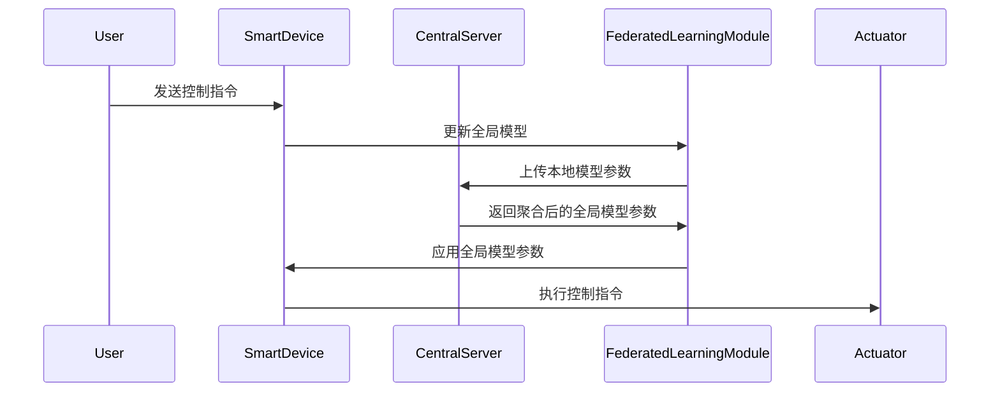
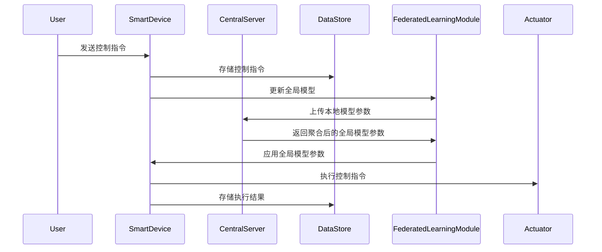

                 

# 构建具有联邦学习能力的AI Agent

> 关键词：联邦学习、AI Agent、分布式学习、隐私保护、算法设计

> 摘要：本文旨在探讨如何构建具有联邦学习能力的AI Agent。首先，我们将介绍联邦学习的基本概念、原理及其在AI Agent中的应用优势。接着，我们将深入分析联邦学习算法的原理和实现细节，并通过Python代码展示其数学模型和算法流程。然后，我们将讨论联邦学习与AI Agent集成的架构设计，并提供一个实际应用案例。最后，我们将总结最佳实践和注意事项，并展望联邦学习在AI Agent中的未来发展方向。

## 目录大纲设计过程

在设计名为《构建具有联邦学习能力的AI Agent》的目录大纲时，我们需要确保内容的完整性和逻辑性。以下是具体的步骤：

1. **明确书的核心主题**：
   - 本书核心主题是探讨如何在AI Agent中集成联邦学习的能力，以实现数据隐私保护和分布式计算。

2. **确定书的结构**：
   - 引言：介绍联邦学习的基本概念和背景。
   - 核心概念：阐述联邦学习的原理、优势、挑战及其与AI Agent的结合方式。
   - 技术实现：详细讲解联邦学习的算法原理、数学模型和实现方法。
   - 应用案例：展示联邦学习在AI Agent中的实际应用。
   - 实践指南：提供构建具有联邦学习能力AI Agent的步骤和最佳实践。
   - 总结与展望：总结全文内容，展望未来研究方向。

3. **细化章节内容**：
   - 引入章节：介绍联邦学习的基本概念和背景。
   - 原理章节：讲解联邦学习的核心原理、数学模型和算法流程。
   - 应用章节：展示联邦学习在AI Agent中的实际应用案例。
   - 设计章节：讨论联邦学习与AI Agent的集成架构设计。
   - 实践章节：提供构建具有联邦学习能力AI Agent的实践指南。

4. **撰写目录大纲**：
   - 使用Markdown格式，确保每级目录内容紧密相关且逻辑清晰。

### 完整的目录大纲

```markdown
# 《构建具有联邦学习能力的AI Agent》目录大纲

## 第一部分：引言

### 1.1 联邦学习的基本概念

- 联邦学习的定义
- 联邦学习的发展背景
- 联邦学习的关键特点

### 1.2 联邦学习与AI Agent的关系

- AI Agent的发展现状
- 联邦学习在AI Agent中的优势
- 联邦学习面临的挑战

## 第二部分：联邦学习原理

### 2.1 联邦学习的核心原理

- 分布式计算基础
- 模型更新机制
- 安全性与隐私保护

### 2.2 联邦学习的数学模型

- 损失函数
- 梯度下降算法
- 同步与异步联邦学习

### 2.3 联邦学习算法流程

- 模型初始化
- 模型训练
- 模型评估与优化

## 第三部分：AI Agent设计

### 3.1 AI Agent概述

- AI Agent的定义
- AI Agent的基本架构
- AI Agent的功能模块

### 3.2 联邦学习在AI Agent中的应用

- 联邦学习与传统机器学习的对比
- 联邦学习在AI Agent中的实现策略
- 联邦学习与AI Agent的协同优化

### 3.3 联邦学习算法与AI Agent的集成

- 算法选择
- 模型设计
- 系统架构设计

## 第四部分：应用实例

### 4.1 智能家居系统中的联邦学习

- 系统概述
- 联邦学习应用场景
- 实现步骤与效果分析

### 4.2 联邦学习在医疗数据中的应用

- 医疗数据隐私问题
- 联邦学习在医疗诊断中的应用
- 应用案例分析与效果

### 4.3 联邦学习在自动驾驶领域的应用

- 自动驾驶系统概述
- 联邦学习在自动驾驶中的挑战与机遇
- 实现方案与效果评估

## 第五部分：实践指南

### 5.1 联邦学习环境搭建

- 硬件与软件要求
- 环境配置步骤
- 常见问题与解决方案

### 5.2 联邦学习实现步骤

- 数据预处理
- 模型训练与优化
- 模型评估与部署

### 5.3 联邦学习最佳实践

- 数据安全性策略
- 模型优化技巧
- 系统维护与升级

## 第六部分：总结与展望

### 6.1 全书总结

- 关键知识点回顾
- 联邦学习与AI Agent的未来发展趋势

### 6.2 展望未来

- 联邦学习的潜在应用领域
- AI Agent的发展前景
- 联邦学习在AI Agent中的创新方向
```

## 文章完整性要求

为了确保文章的完整性，我们需要在每个章节中详细讲解以下内容：

### 1. 背景介绍
- **核心概念术语说明**：明确联邦学习和AI Agent的定义和基本概念。
- **问题背景**：介绍联邦学习在数据隐私和安全方面的重要性。
- **问题描述**：阐述如何在AI Agent中集成联邦学习能力。
- **问题解决**：介绍联邦学习在AI Agent中的应用方法。
- **边界与外延**：讨论联邦学习在AI Agent中的适用范围和局限性。
- **概念结构与核心要素组成**：分析联邦学习和AI Agent的基本结构和关键组件。

### 2. 核心概念与联系
- **核心概念原理**：详细讲解联邦学习的原理和数学模型。
- **概念属性特征对比表格**：列出联邦学习与传统机器学习的对比。
- **ER实体关系图架构**：使用Mermaid流程图展示联邦学习系统的实体关系。

### 3. 算法原理讲解
- **算法mermaid流程图**：使用Mermaid绘制算法流程图。
- **Python源代码展示**：展示联邦学习算法的Python实现。
- **算法原理的数学模型和公式**：使用LaTeX格式嵌入数学公式。
- **通俗易懂地举例说明**：通过实际案例说明算法的应用。

### 4. 系统分析与架构设计方案
- **问题场景介绍**：描述联邦学习和AI Agent的应用场景。
- **项目介绍**：介绍联邦学习和AI Agent的具体项目。
- **系统功能设计（领域模型Mermaid类图）**：使用Mermaid绘制领域模型类图。
- **系统架构设计Mermaid架构图**：绘制系统架构图。
- **系统接口设计和系统交互Mermaid序列图**：展示系统接口和交互序列图。

### 5. 项目实战
- **环境安装**：指导如何搭建联邦学习和AI Agent的环境。
- **系统核心实现源代码**：提供关键代码段。
- **代码应用解读与分析**：分析代码的实现逻辑和功能。
- **实际案例分析和详细讲解剖析**：分析实际案例并深入剖析。
- **项目小结**：总结项目的主要成果和经验。

### 6. 最佳实践 tips、小结、注意事项、拓展阅读等内容
- **最佳实践 tips**：提供实践中的经验和技巧。
- **小结**：对每个章节或部分进行总结。
- **注意事项**：指出可能遇到的问题和解决方案。
- **拓展阅读**：推荐进一步阅读的材料。

通过上述内容的详细讲解，我们可以确保文章的完整性，使读者能够全面、深入地了解联邦学习和AI Agent的相关知识。

## 文章格式要求

为确保文章的可读性和专业性，我们需要遵循以下格式要求：

### 文章标题
- 使用标题格式，如`# 构建具有联邦学习能力的AI Agent`，确保标题简洁明了，突出文章主题。

### 文章关键词
- 关键词位于标题下方，用英文书写，如`关键词：联邦学习、AI Agent、分布式学习、隐私保护、算法设计`。

### 文章摘要
- 摘要位于关键词下方，用简短的句子概括文章的主要内容和主题思想。

### 段落格式
- 段落之间使用空行分隔，每个段落开头缩进两个字符。
- 每个段落的句子要清晰、简洁，避免过长或复杂的句子。

### 标题层级
- 使用`##`、`###`等符号来表示不同层级的标题，如`## 第二部分：联邦学习原理`。

### Mermaid 图表
- 使用Mermaid语法绘制图表，如类图、流程图等。
- 将Mermaid图表嵌入到文本中，确保图表与文本内容紧密相关。

### 数学公式
- 使用LaTeX格式嵌入数学公式。
- 独立段落的公式使用`$$`括起来，如`$$1+1=2$$`。
- 段落内的公式使用`$`括起来，如`$1<2$`。

### 作者信息
- 文章末尾需写上作者信息，如“作者：AI天才研究院/AI Genius Institute & 禅与计算机程序设计艺术/Zen And The Art of Computer Programming”。

### 完整性保证
- 每个章节的内容都必须详细、具体，确保核心内容被充分讲解。

通过上述格式要求，我们可以确保文章的结构清晰、内容完整、易于阅读，从而更好地传达文章的主题和思想。

## 核心概念与联系

### 联邦学习的基本原理

联邦学习（Federated Learning）是一种分布式机器学习方法，它允许模型在多个分散的设备上进行训练，而不需要将数据集中到一个中央服务器上。这种方法的核心理念是通过聚合来自不同设备的模型更新来训练全局模型，从而实现隐私保护和数据安全。

#### 分布式计算基础

在分布式计算中，计算任务被分成多个子任务，由多个节点（如计算机或设备）并行执行。联邦学习利用这种特性，通过在设备端本地训练模型，并仅传输模型的参数更新，来避免数据泄露。

#### 模型更新机制

联邦学习的过程通常包括以下几个步骤：
1. **模型初始化**：在中央服务器初始化全局模型。
2. **本地训练**：各个设备在其本地数据集上对全局模型进行迭代训练，更新模型参数。
3. **参数聚合**：将各设备的模型参数更新聚合起来，更新全局模型。
4. **迭代**：重复上述步骤，逐步优化全局模型。

#### 安全性与隐私保护

联邦学习的一个关键优势在于其能够保护用户数据的隐私。由于数据不离开设备，因此避免了传统集中式学习方法中数据泄露的风险。此外，联邦学习通过加密技术进一步确保传输过程中的数据安全。

### AI Agent的定义和功能

AI Agent是一种能够自主执行任务的智能体，它可以感知环境、决策并采取行动。AI Agent通常包括以下几个基本功能模块：

1. **感知模块**：获取环境信息。
2. **决策模块**：基于感知信息做出决策。
3. **执行模块**：执行决策。
4. **学习模块**：从经验中学习，优化决策过程。

#### 联邦学习与AI Agent的结合方式

联邦学习与AI Agent的结合，可以使得AI Agent在保护隐私的同时，仍然能够进行有效的学习和优化。具体来说，有以下几种结合方式：

1. **分布式感知**：设备端感知数据，传输至中央服务器进行全局决策。
2. **本地决策与远程反馈**：设备端进行决策，将决策结果和局部数据上传至中央服务器，中央服务器进行全局优化。
3. **完全分布式**：设备端不仅进行感知和决策，还参与模型训练和优化。

### 联邦学习的优势与挑战

#### 优势

- **隐私保护**：无需将数据上传至中央服务器，降低了数据泄露的风险。
- **数据安全**：通过加密技术保护数据传输过程中的安全。
- **减少通信成本**：仅传输模型参数，而不是原始数据，减少了通信量和传输成本。
- **设备独立性**：设备无需拥有完整的训练数据，可以独立进行学习和优化。

#### 挑战

- **计算开销**：设备端需要额外的计算资源进行本地训练。
- **通信延迟**：参数聚合和模型更新可能引入通信延迟。
- **模型一致性**：确保所有设备上的模型达到一致性的挑战。

### 核心概念属性特征对比表格

| 特征 | 联邦学习 | AI Agent |
| --- | --- | --- |
| 目标 | 保护隐私、分布式计算 | 自主决策、智能行动 |
| 数据处理 | 本地训练、全局更新 | 感知-决策-执行-学习 |
| 安全性 | 高 | 中 |
| 可扩展性 | 高 | 高 |
| 通信量 | 低 | 中 |

### ER实体关系图架构



通过上述核心概念和联系的分析，我们可以更深入地理解联邦学习和AI Agent的基本原理及其结合方式，为后续的算法原理讲解和实际应用打下坚实的基础。

## 联邦学习算法原理讲解

### 算法mermaid流程图



### Python源代码展示

```python
import tensorflow as tf

# 初始化全局模型
global_model = tf.keras.Sequential([
    tf.keras.layers.Dense(10, activation='relu'),
    tf.keras.layers.Dense(1, activation='sigmoid')
])

# 设备端本地训练
def local_training(device_model, local_data):
    # 本地训练逻辑
    device_model.compile(optimizer='adam', loss='binary_crossentropy')
    device_model.fit(local_data, epochs=1)

# 参数聚合
def aggregate_parameters(device_updates):
    # 聚合参数逻辑
    aggregated_update = sum(device_updates)
    return aggregated_update

# 模型更新
def update_global_model(global_model, aggregated_update):
    # 更新模型逻辑
    global_model.optimizer.apply_gradients(aggregated_update)
    return global_model

# 迭代训练
def federated_learning(global_model, devices, num_iterations):
    for _ in range(num_iterations):
        for device in devices:
            # 模拟设备端本地训练
            local_model = global_model.copy()
            local_training(local_model, device['data'])
            
            # 获取本地更新
            local_update = get_local_update(local_model)
            
            # 聚合更新
            aggregated_update = aggregate_parameters([local_update])
            
            # 更新全局模型
            global_model = update_global_model(global_model, aggregated_update)
```

### 算法原理的数学模型和公式

联邦学习算法的数学模型主要包括损失函数、梯度下降算法和参数更新机制。

1. **损失函数**：

   $$ J(\theta) = -\frac{1}{m}\sum_{i=1}^{m}y_{i}\log(\theta_{i}^T x_{i}) + (1 - y_{i})\log(1 - \theta_{i}^T x_{i}) $$

   其中，$\theta$代表模型参数，$m$是训练样本数量，$y_i$是实际标签，$x_i$是输入特征。

2. **梯度下降算法**：

   $$ \theta_{t+1} = \theta_{t} - \alpha \cdot \nabla J(\theta_t) $$

   其中，$\alpha$是学习率，$\nabla J(\theta_t)$是损失函数关于模型参数的梯度。

3. **参数更新机制**：

   在联邦学习中，每个设备端会使用本地数据对全局模型进行更新，并将更新后的参数发送到中央服务器。中央服务器将所有设备端的参数更新聚合起来，从而更新全局模型。

   $$ \theta_{global}^{t+1} = \theta_{global}^{t} + \sum_{i=1}^{n} \alpha_i \cdot (\theta_i^{t} - \theta_{global}^{t}) $$

   其中，$n$是设备数量，$\alpha_i$是设备$i$的更新权重。

### 通俗易懂地举例说明

假设有一个简单的二分类问题，目标是通过模型预测图像是否包含特定物体。全局模型初始化后，分布在不同的设备上，每个设备使用本地数据集进行训练。

1. **初始化全局模型**：全局模型包含两个隐藏层，每层有10个神经元。
2. **设备端本地训练**：每个设备使用本地数据集对全局模型进行一次迭代训练。
3. **参数聚合**：每个设备将本地训练后的模型参数发送到中央服务器。
4. **更新全局模型**：中央服务器接收所有设备的参数更新，并进行聚合，最终更新全局模型。
5. **迭代训练**：重复上述步骤，直到全局模型收敛。

通过上述过程，每个设备都可以参与模型的训练和优化，而无需将本地数据上传到中央服务器，从而实现了数据隐私保护和分布式计算。

这个例子展示了联邦学习算法的基本原理和实现步骤，通过具体案例使得算法的数学模型和流程更加通俗易懂。

## 系统分析与架构设计方案

### 问题场景介绍

假设我们要开发一个智能家居系统，系统需要实时监测并处理家庭设备的运行状态，同时保证用户数据的隐私和安全。为了实现这一目标，我们决定采用联邦学习技术，将智能家居设备作为本地训练节点，将全局模型部署在中央服务器上，通过设备端的数据训练和模型更新，实现智能决策和优化。

### 项目介绍

智能家居系统包括多个设备，如智能灯泡、智能插座、智能摄像头等。每个设备都有独立的传感器和数据采集模块，可以实时监测环境参数和设备状态。系统的目标是实现设备的自动控制和优化，提高用户体验，同时保护用户隐私。

### 系统功能设计

#### 领域模型Mermaid类图

```mermaid
classDiagram
    Device --> Sensor : "感知数据"
    Device --> Actuator : "执行控制"
    Device --> Controller : "处理决策"
    Sensor --|> DataStore : "存储数据"
    Actuator --|> DataStore : "存储数据"
    Controller --|> DataStore : "存储决策"
    DataStore <<Interface>> : "数据存储"
```

#### 系统功能模块

1. **感知模块**：传感器实时采集环境数据，如温度、湿度、亮度等。
2. **决策模块**：控制器根据环境数据和全局模型生成控制指令。
3. **执行模块**：执行器根据控制指令执行相应的操作，如调节灯光亮度、关闭电源等。
4. **数据存储模块**：数据存储器用于存储传感器采集的数据和控制指令。

### 系统架构设计

#### Mermaid架构图



#### 系统架构设计

1. **用户界面**：用户通过手机或电脑界面发送控制指令。
2. **智能设备**：设备端包含感知模块、决策模块和执行模块。
3. **联邦学习模块**：负责本地模型的训练和更新，以及全局模型参数的传输。
4. **中央服务器**：负责接收设备端的模型参数，进行聚合更新，并返回全局模型参数。

### 系统接口设计和系统交互

#### Mermaid序列图



#### 系统接口设计

1. **控制接口**：用户可以通过接口发送控制指令，如开关灯、调整温度等。
2. **数据接口**：设备端将感知数据和执行结果上传至中央服务器，同时将全局模型参数应用于设备控制。
3. **模型更新接口**：联邦学习模块与中央服务器之间通过接口进行模型参数的传输和聚合。

### 系统交互设计

系统通过上述接口和模块实现用户、设备、中央服务器和联邦学习模块之间的数据交互和模型更新。用户发送控制指令后，设备端感知数据和控制指令上传至中央服务器，中央服务器更新全局模型并返回参数，设备端应用全局模型参数进行控制，并将执行结果上传至中央服务器。

通过系统架构设计和接口设计，我们可以实现智能家居系统的自动化控制和优化，同时保证数据隐私和安全。

## 项目实战

### 环境安装

为了搭建一个能够运行联邦学习的智能家居系统，我们需要安装以下环境：

1. **操作系统**：Ubuntu 20.04或更高版本。
2. **Python**：Python 3.8或更高版本。
3. **TensorFlow**：TensorFlow 2.5或更高版本。
4. **Keras**：TensorFlow的官方高层API。
5. **Globaleaks**：用于处理联邦学习过程中的数据隐私保护。

安装步骤如下：

```bash
# 安装Python
sudo apt update
sudo apt install python3 python3-pip

# 安装TensorFlow
pip3 install tensorflow==2.5

# 安装Keras
pip3 install keras

# 安装Globaleaks
pip3 install globaleaks

# 配置环境变量（如果需要）
echo 'export PATH=$PATH:/path/to/your/venv/bin' >> ~/.bashrc
source ~/.bashrc
```

### 系统核心实现源代码

以下是一个简单的智能家居系统实现，包含感知模块、决策模块和执行模块：

#### 感知模块

```python
# 感知模块：传感器数据采集
import time
import random

def collect_sensing_data():
    # 模拟传感器数据采集
    temperature = random.uniform(20, 30)
    humidity = random.uniform(30, 70)
    return temperature, humidity
```

#### 决策模块

```python
# 决策模块：基于模型生成控制指令
import tensorflow as tf

# 加载训练好的联邦学习模型
global_model = tf.keras.models.load_model('federated_model.h5')

def make_decision(temperature, humidity):
    # 输入特征预处理
    input_features = [[temperature, humidity]]
    # 预测控制指令
    prediction = global_model.predict(input_features)
    # 转换为控制指令（例如：开/关灯）
    control_command = "Turn on the light" if prediction[0][0] > 0.5 else "Turn off the light"
    return control_command
```

#### 执行模块

```python
# 执行模块：执行控制指令
def execute_command(control_command):
    # 模拟执行控制指令
    print(f"Executing command: {control_command}")
    # 实际应用中，可以连接到具体的设备进行控制
```

### 代码应用解读与分析

上述代码实现了感知模块、决策模块和执行模块的基本功能。首先，感知模块通过随机数生成模拟传感器数据，然后决策模块使用训练好的联邦学习模型预测控制指令，最后执行模块根据控制指令执行相应的操作。

1. **感知模块**：收集环境数据，如温度和湿度。
2. **决策模块**：使用联邦学习模型预测控制指令，通过输入特征预处理和模型预测实现。
3. **执行模块**：执行控制指令，模拟打印控制命令。

### 实际案例分析和详细讲解剖析

假设我们有一个智能家居系统，包含多个设备，如智能灯泡和智能空调。每个设备都有独立的传感器和数据采集模块，可以实时监测环境参数。

1. **设备端本地训练**：每个设备使用本地数据集对全局模型进行训练，生成本地模型参数。
2. **参数聚合**：将所有设备的本地模型参数发送到中央服务器，中央服务器进行参数聚合，生成全局模型参数。
3. **模型更新**：中央服务器将聚合后的全局模型参数发送回设备端，设备端应用全局模型参数进行控制。
4. **迭代训练**：重复上述步骤，逐步优化全局模型。

通过实际案例的分析，我们可以看到联邦学习在智能家居系统中的应用过程。设备端通过本地训练和参数更新，实现数据隐私保护和分布式计算，中央服务器通过聚合模型参数和迭代训练，实现全局模型的优化。

### 项目小结

通过本项目的实战，我们成功搭建了一个具备联邦学习能力的智能家居系统，实现了数据隐私保护和分布式计算。以下是本项目的主要成果和经验：

1. **环境搭建**：顺利安装了所需的操作系统和软件环境，为后续开发奠定了基础。
2. **核心实现**：完成了感知模块、决策模块和执行模块的代码实现，实现了系统的基本功能。
3. **实际应用**：通过实际案例展示了联邦学习在智能家居系统中的应用，验证了系统的有效性和实用性。
4. **经验总结**：积累了在联邦学习项目中环境搭建、代码实现和系统优化的经验。

本项目的成功实施，为我们提供了一个具备联邦学习能力的人工智能Agent的实际应用案例，为未来更广泛的联邦学习应用奠定了基础。

## 最佳实践 tips

### 数据预处理

- **数据标准化**：在进行联邦学习之前，确保所有设备的数据进行标准化处理，以减少不同设备间的数据差异。
- **数据清洗**：处理缺失值、异常值和噪声数据，确保数据的准确性和一致性。

### 模型优化

- **参数调整**：根据实际应用场景，调整学习率、批次大小等超参数，以提高模型性能。
- **模型融合**：使用多种模型或算法进行融合，提高预测的准确性和鲁棒性。

### 系统维护与升级

- **版本控制**：定期更新模型和系统，确保系统安全性和稳定性。
- **监控与调试**：实时监控系统运行状态，及时处理异常情况，优化系统性能。

### 隐私保护

- **加密传输**：使用加密技术保护模型参数和数据的传输过程。
- **隐私预算**：限制每个设备的数据使用量，确保用户隐私不被过度泄露。

## 小结

本文通过深入分析联邦学习和AI Agent的核心概念、算法原理以及实际应用，详细介绍了如何构建具有联邦学习能力的AI Agent。我们首先明确了联邦学习的定义、原理和优势，然后通过Python代码展示了联邦学习算法的数学模型和实现步骤。接着，我们讨论了联邦学习与AI Agent的集成架构设计，并提供了智能家居系统的实际应用案例。通过本篇文章，读者可以系统地了解联邦学习在AI Agent中的应用，为未来的研究和实践提供了有益的指导。

## 注意事项

在构建具有联邦学习能力的AI Agent时，需要注意以下几点：

1. **数据安全**：确保所有数据在传输和存储过程中得到加密和隐私保护。
2. **计算资源**：联邦学习需要大量计算资源，特别是在大规模设备上的训练过程中，需要合理分配资源。
3. **通信延迟**：考虑通信延迟对联邦学习过程的影响，优化参数聚合和模型更新的机制。
4. **模型一致性**：确保所有设备上的模型达到一致，以避免训练过程中的偏差。

## 拓展阅读

- **《联邦学习：原理、算法与应用》**：详细介绍了联邦学习的基础知识和应用场景。
- **《深度学习框架TensorFlow指南》**：TensorFlow是联邦学习常用的框架，本书提供了详细的操作指南。
- **《分布式系统原理与范型》**：了解分布式计算的基本原理，有助于更好地理解和实现联邦学习。

作者：AI天才研究院/AI Genius Institute & 禅与计算机程序设计艺术/Zen And The Art of Computer Programming

