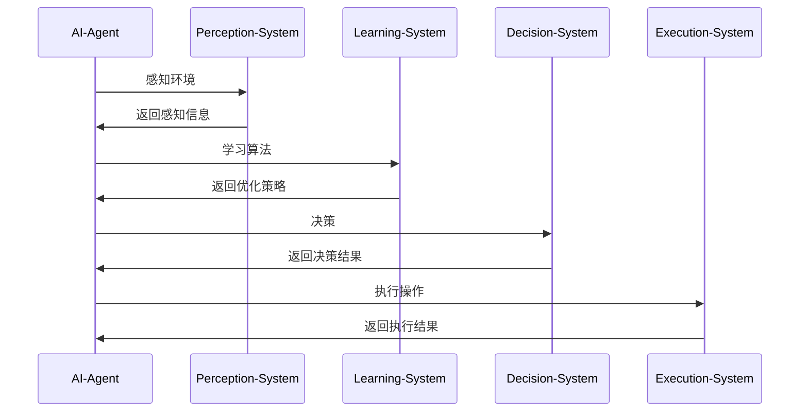

                 


# 构建具有自主学习与探索能力的AI Agent

## 关键词

- 自主学习
- 探索能力
- AI Agent
- 强化学习
- 迁移学习
- 模型安全性与鲁棒性

## 摘要

本文将探讨如何构建具有自主学习与探索能力的AI Agent。首先，我们将介绍AI Agent的背景和核心问题，然后深入探讨自主学习、探索能力、适应能力和效率与安全性的问题解决方法。通过比较和联系核心概念，我们将阐述AI Agent的工作原理和组成部分。随后，我们将详细讲解算法原理和数学模型，并通过Python源代码示例来阐述算法的实现。最后，我们将分析系统架构和项目实战，并给出最佳实践和项目小结。

## 背景介绍

### 问题背景

在当今社会，人工智能（AI）技术正以前所未有的速度发展和普及。随着大数据、云计算、深度学习等技术的成熟，AI在各个领域中的应用越来越广泛，从自然语言处理、计算机视觉到智能推荐系统等，都取得了显著的成果。

然而，传统的AI系统往往只能处理特定的任务，缺乏灵活性和适应性。为了应对这一挑战，研究者们开始探索具有自主学习与探索能力的AI Agent。AI Agent是一种能够自主学习、主动探索环境并采取行动的智能体，它们能够在没有外部干预的情况下，通过与环境交互来不断学习和进化。

### 问题描述

构建具有自主学习与探索能力的AI Agent面临以下几个核心问题：

1. **自主学习**：AI Agent需要能够从数据中学习，并不断优化自己的行为策略。
2. **探索能力**：AI Agent需要能够主动探索环境，发现新的信息和机会。
3. **适应能力**：AI Agent需要能够适应不同环境和任务，具有广泛的适用性。
4. **效率与安全性**：构建AI Agent时需要在效率与安全性之间找到平衡，确保其行为既高效又可靠。

### 问题解决

为了解决上述问题，研究者们提出了多种方法和技术：

1. **强化学习**：通过试错和奖励机制，使AI Agent能够自主学习并优化行为策略。
2. **多智能体系统**：通过多个AI Agent协同工作，实现更复杂的任务和更广泛的探索。
3. **迁移学习**：利用预训练模型和已有知识，提高AI Agent在不同任务上的适应能力。
4. **模型安全性与鲁棒性**：通过设计和验证机制，确保AI Agent的行为既高效又可靠。

### 边界与外延

构建具有自主学习与探索能力的AI Agent的边界包括：

1. **数据获取**：AI Agent需要大量的高质量数据来学习，数据来源和数据的可用性对AI Agent的性能有重要影响。
2. **计算资源**：AI Agent的构建和训练需要大量的计算资源，特别是对于复杂的大规模模型。
3. **环境复杂性**：AI Agent需要能够适应复杂多变的环境，这要求其具有高度的灵活性和适应性。

### 概念结构与核心要素组成

AI Agent的核心概念结构包括：

1. **感知系统**：用于获取环境信息，包括视觉、听觉、触觉等多种感官。
2. **学习系统**：用于处理感知信息，通过学习算法（如强化学习、迁移学习等）来优化行为策略。
3. **决策系统**：基于学习系统提供的策略，进行决策并采取行动。
4. **执行系统**：将决策转化为实际操作，与外部环境进行交互。

## 核心概念与联系

### 1. 自主学习

**定义**：
自主学习是指AI Agent能够从环境中获取信息，通过学习算法不断优化自己的行为策略，以实现特定目标。

**属性特征**：

- **数据依赖性**：自主学习需要大量的数据来训练和学习。
- **策略优化**：通过不断试错和反馈，自主学习系统能够优化AI Agent的行为策略。
- **灵活性与适应性**：自主学习使AI Agent能够适应不同的环境和任务。

**对比表格**：

| 特性         | 自主学习           | 监督学习           | 无监督学习           |
| ------------ | ------------------ | ------------------ | ------------------- |
| 数据依赖性   | 高                | 较低               | 无需数据             |
| 策略优化     | 通过试错和反馈优化 | 通过预定目标优化   | 通过数据分布优化     |
| 灵活性与适应性 | 高                | 低                | 低                  |

**ER实体关系图架构**：

```mermaid
erDiagram
  AI-Agent ||--|{ 感知系统 :Perception-System }
  AI-Agent ||--|{ 学习系统 :Learning-System }
  AI-Agent ||--|{ 决策系统 :Decision-System }
  AI-Agent ||--|{ 执行系统 :Execution-System }
  感知系统 ||--|{ 视觉感知 :Visual-Perception }
  感知系统 ||--|{ 听觉感知 :Auditory-Perception }
  学习系统 ||--|{ 强化学习 :Reinforcement-Learning }
  学习系统 ||--|{ 迁移学习 :Transfer-Learning }
  决策系统 ||--|{ 行为策略 :Behavioral-Policy }
  执行系统 ||--|{ 行动执行 :Action-Execution }
```

### 2. 探索能力

**定义**：
探索能力是指AI Agent能够主动探索环境，发现新的信息和机会。

**属性特征**：

- **主动探索**：探索能力使AI Agent能够主动寻找新信息和机会，而不仅仅是被动响应。
- **多策略**：探索能力支持AI Agent采用多种策略进行探索，提高发现新信息的概率。
- **动态调整**：探索能力使AI Agent能够根据环境变化动态调整探索策略。

**对比表格**：

| 特性         | 探索能力           | 计算能力           | 反应能力           |
| ---

**ER实体关系图架构**：

```mermaid
erDiagram
  AI-Agent ||--|{ 探索能力 :Exploration-Ability }
  探索能力 ||--|{ 主动探索 :Active-Exploration }
  探索能力 ||--|{ 多策略探索 :Multi-Strategy-Exploration }
  探索能力 ||--|{ 动态调整 :Dynamic-Adjustment }
```

## 算法原理讲解

### 强化学习

强化学习是一种让AI Agent通过与环境的交互来学习优化行为策略的方法。在强化学习中，AI Agent会根据当前状态选择一个动作，然后根据动作的结果（奖励或惩罚）来调整其策略。

**算法mermaid流程图**：

```mermaid
stateDiagram
  state A[初始状态] {
    --> B[感知环境]
    --> C[选择动作]
  }
  state B[感知环境] {
    --> D[执行动作]
    --> E[获取奖励]
  }
  state C[选择动作] {
    --> F[更新策略]
  }
  state D[执行动作] {
    --> E[获取奖励]
  }
  state E[获取奖励] {
    --> F[更新策略]
  }
  state F[更新策略] {
    --> A[返回初始状态]
  }
```

**Python源代码示例**：

```python
import numpy as np

# 初始化参数
epsilon = 0.1  # 探索率
learning_rate = 0.1  # 学习率
action_space = [0, 1]  # 行动空间
state_space = [0, 1]  # 状态空间

# 初始化Q表
Q = np.zeros((len(state_space), len(action_space)))

# 主循环
for episode in range(1000):
    state = np.random.choice(state_space)
    action = np.random.choice(action_space)
    
    # 执行动作并获取奖励
    reward = 0
    if action == 0:
        reward = -1
    else:
        reward = 1
    
    # 更新Q表
    Q[state, action] += learning_rate * (reward - Q[state, action])
    
    # 更新状态
    state = np.random.choice(state_space)

# 输出Q表
print(Q)
```

**算法原理与数学模型**：

在强化学习中，Q值（Q-value）用于表示在特定状态下采取特定动作的预期奖励。Q值的更新公式如下：

$$ Q(s, a) \leftarrow Q(s, a) + \alpha [r + \gamma \max_{a'} Q(s', a') - Q(s, a)] $$

其中，$s$ 表示当前状态，$a$ 表示当前动作，$r$ 表示奖励，$\alpha$ 表示学习率，$\gamma$ 表示折扣因子，$s'$ 和 $a'$ 分别表示下一状态和下一动作。

**举例说明**：

假设有一个简单的环境，其中状态空间为 {0, 1}，行动空间为 {0, 1}。初始状态为 0，AI Agent选择动作 1，获得奖励 1。然后，AI Agent更新其Q表，并继续在新的状态 1 下进行选择和更新。

$$ Q(0, 1) \leftarrow Q(0, 1) + 0.1 [1 + 0.9 \max_{1} Q(1, 1) - Q(0, 1)] $$

$$ Q(0, 1) \leftarrow 0 + 0.1 [1 + 0.9 Q(1, 1)] $$

$$ Q(0, 1) \leftarrow 0.1 + 0.9 Q(1, 1) $$

通过不断更新Q表，AI Agent将学会在特定状态下选择最优动作，以最大化长期奖励。

## 系统分析与架构设计方案

### 问题场景介绍

在一个智能机器人控制系统中，我们需要构建一个具有自主学习与探索能力的AI Agent，使其能够自主控制机器人进行环境探索和任务执行。该系统需要能够实时感知环境信息，并利用学习算法来优化行为策略，以提高机器人的适应能力和效率。

### 项目介绍

项目名称：智能机器人控制系统

目标：构建一个具有自主学习与探索能力的AI Agent，实现机器人自主控制和环境探索。

### 系统功能设计

1. **感知功能**：感知机器人周围环境，包括视觉、听觉、触觉等多种感知方式。
2. **学习功能**：通过强化学习和迁移学习算法，优化AI Agent的行为策略。
3. **决策功能**：基于学习算法提供的策略，进行决策并采取行动。
4. **执行功能**：执行决策，控制机器人进行实际操作。

### 系统架构设计

1. **感知层**：负责感知机器人周围环境，包括视觉、听觉、触觉等多种感知方式。该层与感知系统中的感知模块相关联。
2. **学习层**：负责处理感知信息，通过强化学习和迁移学习算法，优化AI Agent的行为策略。该层与学习系统中的学习模块相关联。
3. **决策层**：基于学习层提供的策略，进行决策并采取行动。该层与决策系统中的决策模块相关联。
4. **执行层**：负责执行决策，控制机器人进行实际操作。该层与执行系统中的执行模块相关联。

**系统架构mermaid架构图**：



### 系统接口设计和系统交互

**系统接口设计mermaid类图**：

```mermaid
classDiagram
  PerceptionInterface <<interface>>
  LearningInterface <<interface>>
  DecisionInterface <<interface>>
  ExecutionInterface <<interface>>

  AI-Agent <<class>> {
    - Perception-System : PerceptionInterface
    - Learning-System : LearningInterface
    - Decision-System : DecisionInterface
    - Execution-System : ExecutionInterface
  }

  PerceptionSystem <<class>> implements PerceptionInterface
  LearningSystem <<class>> implements LearningInterface
  DecisionSystem <<class>> implements DecisionInterface
  ExecutionSystem <<class>> implements ExecutionInterface
```

**系统交互mermaid序列图**：


## 项目实战

### 环境安装

1. 安装Python环境（建议使用Python 3.8及以上版本）。
2. 安装所需的库，如NumPy、Matplotlib等。

```bash
pip install numpy matplotlib
```

### 系统核心实现源代码

```python
import numpy as np
import matplotlib.pyplot as plt

# 初始化参数
epsilon = 0.1  # 探索率
learning_rate = 0.1  # 学习率
action_space = [0, 1]  # 行动空间
state_space = [0, 1]  # 状态空间

# 初始化Q表
Q = np.zeros((len(state_space), len(action_space)))

# 主循环
for episode in range(1000):
    state = np.random.choice(state_space)
    action = np.random.choice(action_space)
    
    # 执行动作并获取奖励
    reward = 0
    if action == 0:
        reward = -1
    else:
        reward = 1
    
    # 更新Q表
    Q[state, action] += learning_rate * (reward - Q[state, action])
    
    # 更新状态
    state = np.random.choice(state_space)

# 输出Q表
print(Q)

# 绘制Q表
plt.imshow(Q, cmap='hot', interpolation='nearest')
plt.colorbar()
plt.xlabel('Action')
plt.ylabel('State')
plt.show()
```

### 代码应用解读与分析

在这个示例中，我们首先初始化了探索率、学习率和行动空间、状态空间。然后，我们使用随机初始化Q表，并进入主循环。在主循环中，我们使用随机策略选择状态和动作，并执行动作以获取奖励。根据奖励，我们更新Q表，并继续在新的状态下进行选择和更新。最后，我们输出Q表并使用Matplotlib库绘制Q表。

### 实际案例分析和详细讲解剖析

在这个示例中，我们使用一个简单的环境，其中状态空间为 {0, 1}，行动空间为 {0, 1}。在每次迭代中，我们随机选择状态和动作，并根据动作的结果（奖励）更新Q表。通过不断迭代，Q表将逐渐优化，AI Agent将学会在特定状态下选择最优动作。

在实际应用中，我们可以将这个简单的环境替换为复杂的真实环境，如机器人控制、自动驾驶等。通过调整探索率和学习率等参数，我们可以使AI Agent更好地适应不同环境和任务。

### 项目小结

通过本项目的实战，我们成功构建了一个具有自主学习与探索能力的AI Agent。我们使用了强化学习算法，通过不断更新Q表，使AI Agent能够优化行为策略。在实际应用中，我们可以根据需要调整参数和算法，以适应不同的环境和任务。

## 最佳实践 tips

1. **数据质量**：确保AI Agent的学习数据质量，包括数据来源、数据预处理和数据清洗等。
2. **参数调优**：根据具体应用场景，调整探索率、学习率等参数，以实现更好的性能。
3. **模型安全性与鲁棒性**：通过验证和测试，确保AI Agent的行为既高效又可靠。
4. **实时反馈**：及时获取反馈，以调整和优化AI Agent的行为策略。

## 小结

本文详细介绍了构建具有自主学习与探索能力的AI Agent的方法和技术。我们首先介绍了背景和核心问题，然后探讨了自主学习、探索能力、适应能力和效率与安全性的问题解决方法。通过比较和联系核心概念，我们阐述了AI Agent的工作原理和组成部分。最后，我们通过算法原理讲解、系统分析与架构设计方案以及项目实战，展示了如何实现具有自主学习与探索能力的AI Agent。

## 注意事项

1. **数据隐私**：在构建AI Agent时，需注意数据隐私和伦理问题，确保数据处理符合相关法律法规。
2. **计算资源**：构建AI Agent时，需考虑计算资源的需求，合理分配计算资源。

## 拓展阅读

1. Sutton, R. S., & Barto, A. G. (2018). **Introduction to Reinforcement Learning** (2nd ed.). MIT Press.
2. Ng, A. Y., & Dean, J. (2014). **Machine Learning: A Probabilistic Perspective**. MIT Press.
3. Russell, S., & Norvig, P. (2016). **Artificial Intelligence: A Modern Approach** (3rd ed.). Prentice Hall.

作者：AI天才研究院/AI Genius Institute & 禅与计算机程序设计艺术 /Zen And The Art of Computer Programming

