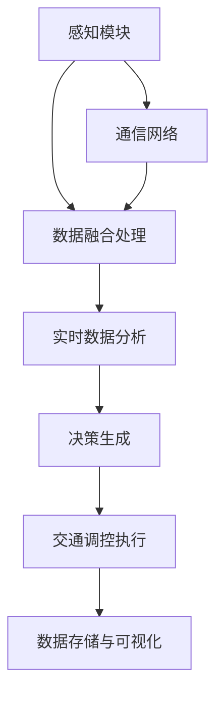

                 


### 摘要

本文旨在深入探讨构建具有自主学习能力的AI Agent的方法与路径。自主学习是AI技术发展的重要方向，它赋予AI Agent独立思考和适应环境的能力。本文将首先介绍AI Agent的定义与类型，以及当前AI技术的局限性。接着，我们将详细分析自主学习的核心概念、原理和方法，包括强化学习、无监督学习和监督学习。此外，我们将通过具体算法的原理讲解和数学模型推导，帮助读者理解自主学习算法的工作机制。随后，我们将从系统分析与架构设计的角度，讨论AI Agent的功能设计与实现。通过这一系列步骤，读者将能够全面掌握构建具有自主学习能力的AI Agent的关键技术和方法。

## 引言与背景

### 第1章: 引言

#### 1.1 问题的背景

当前，人工智能（AI）技术正以惊人的速度发展，它在诸多领域展现出巨大的潜力，从自动驾驶、智能助手到医疗诊断和金融分析，AI的应用已经深入到我们的日常生活中。然而，尽管AI技术已经取得了显著的进展，但现有的AI系统仍然存在一些局限性。首先，大多数AI系统依赖于大量的标注数据进行训练，这限制了它们在实际应用中的泛化能力。其次，AI系统通常缺乏自主学习和适应环境变化的能力，这使得它们在面对新环境和未知问题时，往往表现不佳。此外，AI系统的可解释性和透明度也是一个亟待解决的问题，许多AI决策的内部机制仍然晦涩难懂，难以被普通用户接受。

自主学习的概念正是为了解决这些局限性而提出的。自主学习是指AI系统能够在不依赖外部监督的情况下，通过自身经验不断改进和学习。这种能力使得AI系统能够在未知环境中独立探索和适应，从而提高其自主性和智能化水平。自主学习在AI技术中的重要性不言而喻，它不仅能够提升AI系统的性能，还能使其在复杂、动态的环境中表现得更加出色。

AI Agent是一种典型的具有自主学习能力的实体，它可以被视为具有感知、决策和行动能力的智能体。根据其功能和应用场景，AI Agent可以分为不同的类型，如游戏AI、机器人控制AI、智能客服AI等。不同类型的AI Agent在自主学习的方式和策略上可能有所不同，但它们的核心目标都是实现自主化、智能化和高效化的操作。

#### 1.2 问题描述

AI Agent面临的挑战主要集中在以下几个方面：

1. **数据获取与处理**：AI Agent需要大量的数据来训练和优化其模型，但这些数据往往难以获取或处理。特别是在动态和未知环境中，数据的不确定性和复杂性使得数据收集成为一个巨大的挑战。

2. **模型适应性与可扩展性**：现有的AI模型往往针对特定任务进行优化，当环境发生变化或任务需求发生变化时，模型需要重新训练或调整。这增加了模型的复杂性和成本，限制了AI Agent的适应性和可扩展性。

3. **可解释性与透明度**：AI Agent的决策过程通常是不透明的，用户难以理解其背后的机制。这降低了用户对AI系统的信任，阻碍了AI技术的普及和应用。

4. **资源与计算能力**：自主学习需要大量的计算资源和时间，特别是在处理高维度数据或复杂任务时，这给硬件设备和算法效率带来了巨大的挑战。

针对这些挑战，自主学习AI Agent的必要性显而易见。首先，通过自主学习，AI Agent可以自动获取和处理数据，减少对人工标注的依赖，提高数据利用效率。其次，自主学习使AI Agent能够动态适应环境变化，提高其适应性和可扩展性。此外，通过自主学习，AI Agent可以不断优化其模型，提高决策的准确性和效率。最后，自主学习有助于提高AI系统的可解释性和透明度，增强用户对AI技术的信任和接受度。

#### 1.3 问题解决

为了构建具有自主学习能力的AI Agent，我们需要明确其设计目标和实现路径。首先，AI Agent的设计目标应包括以下几点：

1. **自主性**：AI Agent应具备独立学习和决策的能力，能够在未知环境中自主探索和适应。
2. **适应性**：AI Agent应能够适应不同的环境和任务需求，具备良好的泛化能力。
3. **高效性**：AI Agent应能够高效地处理数据和学习任务，降低计算资源的需求。
4. **可解释性**：AI Agent的决策过程应具备一定的透明度，用户可以理解和信任其决策机制。

在实现路径上，我们可以采用以下方法：

1. **核心算法**：选择合适的自主学习算法，如强化学习、无监督学习和监督学习，根据具体应用场景进行优化和调整。
2. **数据集构建**：构建适用于AI Agent的多样化数据集，包括训练集、验证集和测试集，以提高模型的适应性和泛化能力。
3. **模型优化**：通过模型调优、正则化和自动化机器学习等技术，提高模型的学习效率和准确性。
4. **硬件支持**：利用高性能计算设备和分布式计算技术，降低自主学习所需的计算资源和时间。

#### 1.4 边界与外延

自主学习AI Agent的应用领域非常广泛，涵盖了从工业自动化、智能家居到医疗健康、金融科技等多个领域。在工业自动化中，AI Agent可以自主监控和优化生产流程，提高生产效率和质量；在智能家居中，AI Agent可以自主学习和预测用户需求，提供个性化的家居服务；在医疗健康领域，AI Agent可以自主分析和诊断病情，辅助医生制定治疗方案；在金融科技中，AI Agent可以自主分析和预测市场趋势，提供投资建议。

此外，自主学习与强化学习、机器学习有着紧密的联系。强化学习是自主学习的一种重要形式，它通过奖励和惩罚机制引导AI Agent进行决策。无监督学习和监督学习则是机器学习中的两个重要分支，它们分别适用于有监督和无监督的学习场景。自主学习通过整合这些学习方式，使得AI Agent能够在不同的环境中实现高效学习和决策。

未来，自主学习AI Agent的发展趋势将体现在以下几个方面：

1. **算法创新**：随着深度学习、迁移学习和联邦学习等技术的不断发展，自主学习算法将更加先进和高效。
2. **应用拓展**：自主学习AI Agent的应用领域将不断拓展，从单一领域走向跨领域、跨行业的综合应用。
3. **硬件优化**：随着硬件技术的不断进步，特别是量子计算和边缘计算的发展，自主学习AI Agent将具备更强大的计算能力和实时性。
4. **伦理与法规**：随着AI技术的普及，相关伦理和法规问题也将受到更多关注，自主学习AI Agent的发展将更加注重伦理和法律合规性。

综上所述，构建具有自主学习能力的AI Agent是当前AI技术发展的重要方向，它不仅有助于解决现有AI系统的局限性，还能推动AI技术在更广泛领域中的应用和发展。

### 第2章: 自主学习的核心概念

#### 2.1 自主学习的定义与特点

自主学习，又称为自我学习或自适应学习，是指系统在没有外部干预的情况下，通过自身与环境的交互，不断调整内部结构或行为策略，以达到改善自身性能或实现特定目标的过程。在人工智能领域，自主学习是使AI系统具备智能性和自适应性的关键因素。以下是对自主学习的定义及其特点的详细解释：

**定义：**
自主学习是一个动态的、持续的过程，涉及感知（感知外部环境）、决策（基于感知做出决策）、行动（执行决策）和评估（评估行动效果）四个基本环节。通过这些环节的迭代，AI系统能够从经验中学习和适应，不断优化自身的性能和行为。

**特点：**
1. **独立性**：自主学习不需要外部监督或指导，系统可以通过内部反馈机制进行自我调整。
2. **适应性**：系统能够适应环境变化和未知情境，具备动态调整行为策略的能力。
3. **灵活性**：系统可以处理多样化的数据和学习任务，具有良好的泛化能力。
4. **自主性**：系统具备自我驱动的能力，能够自主探索和学习新的知识和技能。
5. **自适应性**：系统能够根据任务需求和资源限制，自主调整其学习策略和资源分配。

#### 2.2 核心概念原理

自主学习包括多种类型的算法，每种算法都有其独特的原理和应用场景。以下是强化学习、无监督学习、监督学习和混合学习的基本概念和原理：

**强化学习（Reinforcement Learning）：**
强化学习是一种通过奖励和惩罚机制引导智能体学习如何在环境中做出最佳决策的算法。其核心思想是智能体通过试错（即互动）来学习最佳策略。强化学习的基本要素包括智能体（Agent）、环境（Environment）、状态（State）、动作（Action）和奖励（Reward）。智能体通过选择动作来改变状态，并接收环境反馈的奖励，以此来逐步优化其策略。

- **Q-Learning算法原理：**
  Q-Learning是一种值迭代算法，用于求解强化学习问题中的最优策略。其基本原理是更新状态-动作值函数（Q值），即通过公式 \( Q(s, a) = r + \gamma \max_{a'} Q(s', a') \) 来计算当前状态下执行某一动作的预期回报。智能体通过不断更新Q值，最终找到最优动作序列。

- **DQN（Deep Q-Network）算法原理：**
  DQN是深度学习在强化学习中的应用，它使用深度神经网络来近似Q值函数。DQN通过经验回放和目标网络来减少偏差和方差，从而提高Q值函数的估计精度。DQN算法的优势在于能够处理高维输入空间，适用于复杂环境。

**无监督学习（Unsupervised Learning）：**
无监督学习是指在没有标注数据的情况下，系统通过观察数据分布和模式来自主学习的算法。无监督学习主要用于发现数据中的隐含结构和规律，其主要类型包括聚类、降维和关联规则等。

- **自编码器（Autoencoder）算法原理：**
  自编码器是一种无监督学习算法，其目的是通过训练一个编码器和解码器网络来压缩数据并重建原始数据。自编码器在训练过程中学习到数据的低维表示，从而提取数据中的特征和结构。

- **聚类算法（Clustering Algorithm）原理：**
  聚类算法通过将相似的数据点划分到同一个簇中，以发现数据中的隐含结构。常见的聚类算法包括K-Means、层次聚类和DBSCAN等。聚类算法的目标是使同簇数据点之间的相似度最大化，而不同簇之间的相似度最小化。

**监督学习（Supervised Learning）：**
监督学习是指在有标注数据的情况下，系统通过学习输入和输出之间的关系来进行预测或分类的算法。监督学习分为回归和分类两种类型，其核心目标是构建一个预测模型，用于对新的数据点进行分类或预测。

- **支持向量机（Support Vector Machine, SVM）算法原理：**
  SVM是一种强大的分类算法，通过寻找一个最优的超平面，将不同类别的数据点分开。SVM的核心思想是最大化分类边界间隔，从而提高模型的泛化能力。

- **决策树（Decision Tree）算法原理：**
  决策树是一种树形结构的预测模型，通过一系列测试来划分数据并预测目标值。决策树的基本原理是选择具有最大信息增益或基尼不纯度的特征进行划分，直到达到预定的停止条件。

**混合学习（Hybrid Learning）：**
混合学习结合了监督学习、无监督学习和强化学习等多种学习方式，以应对复杂的学习任务。混合学习算法通过灵活地选择和组合不同类型的算法，提高了模型的学习效率和准确性。

#### 2.3 概念属性特征对比表格

以下是不同学习类型的特性对比表格，便于读者对各种自主学习方式的理解：

| 学习类型 | 特点 |
|----------|------|
| 强化学习 | 基于奖励与惩罚的决策过程，自主探索环境 |
| 无监督学习 | 不依赖人工标注的数据学习，发现数据结构 |
| 监督学习 | 需要人工标注的数据学习，用于预测或分类 |
| 混合学习 | 结合多种学习方式的策略，提高学习效率和准确性 |

#### 2.4 ER实体关系图架构

为了更好地理解自主学习系统中的实体及其关系，以下是使用Mermaid绘制的ER（Entity-Relationship）实体关系图：

```mermaid
erDiagram
    AI-Agent ||--|{ 自主学习算法 }|
    自主学习算法 ||--|{ 数据集 }|
    数据集 ||--|{ 模型 }|
    模型 ||--|{ 决策 }|
```

在上面的ER图中，`AI-Agent`是系统的核心实体，它通过调用不同的`自主学习算法`来处理数据。`自主学习算法`依赖于`数据集`进行训练和优化，而`数据集`则生成相应的`模型`。最后，`模型`用于生成`决策`，指导AI-Agent的行为。

通过这一章的内容，我们不仅了解了自主学习的定义和特点，还深入探讨了各种核心概念和算法原理。接下来，我们将进一步讲解不同类型的自主学习算法，帮助读者全面掌握构建具有自主学习能力的AI Agent的方法和路径。

### 第3章: 强化学习算法原理

#### 3.1 强化学习的基本概念

强化学习（Reinforcement Learning，RL）是一种重要的机器学习范式，它在人工智能和自动化控制等领域有着广泛的应用。强化学习的基本思想是通过智能体（agent）与环境的互动，学习到一个最优策略，从而实现某种目标。以下是强化学习的一些基本概念：

**智能体（Agent）**：强化学习中的主体，它是一个能够感知环境、选择动作并从环境中接收奖励的实体。智能体的目标是最大化长期回报，即通过不断调整其行为策略，使累积奖励最大化。

**环境（Environment）**：智能体所处的环境，它是一个能够对智能体的动作进行响应的动态系统。环境的状态空间表示智能体在某一时刻所感知到的环境信息，而动作空间则表示智能体可以采取的所有可能动作。

**状态（State）**：描述智能体在某一时刻所处的环境和情境，通常是一个高维向量。状态空间是所有可能状态的集合。

**动作（Action）**：智能体在某一状态下采取的行动，其选择决定了智能体的下一步状态。动作空间是所有可能动作的集合。

**奖励（Reward）**：环境对智能体的动作给出的即时反馈，表示智能体当前动作的好坏。奖励可以是正的、负的或零，其目的是引导智能体选择更有利于实现目标的行为。

**策略（Policy）**：描述智能体如何根据当前状态选择动作的规则。策略通常表示为状态-动作值函数，即对于每个状态，智能体选择一个最优动作。

**价值函数（Value Function）**：用于评估智能体在某一状态下采取特定动作的长期回报。价值函数分为状态值函数（V(s)）和动作值函数（Q(s, a)）。状态值函数表示在状态s下执行最优动作的预期回报，而动作值函数表示在状态s下执行动作a的预期回报。

**模型（Model）**：描述环境动态的模型，即智能体如何从当前状态过渡到下一个状态。模型可以是静态的，也可以是动态的，其目的是预测环境对智能体动作的响应。

**探索（Exploration）与利用（Exploitation）**：探索是指智能体在未知的或不确定的环境中尝试新动作的过程，以获取更多经验。利用则是指智能体根据当前的经验选择最佳动作，以最大化当前回报。在实际应用中，智能体需要平衡探索和利用，以实现长期回报最大化。

#### 3.2 Q-Learning算法原理

Q-Learning是一种基于值迭代的强化学习算法，其核心思想是利用经验来更新状态-动作值函数，从而学习到最优策略。以下是Q-Learning算法的基本原理和流程：

**基本原理：**
Q-Learning算法通过迭代更新状态-动作值函数（Q值），以逼近最优策略。其更新公式为：
$$
Q(s, a) \leftarrow Q(s, a) + \alpha [r + \gamma \max_{a'} Q(s', a') - Q(s, a)]
$$
其中：
- \( Q(s, a) \) 是在状态s下采取动作a的预期回报；
- \( r \) 是立即奖励；
- \( \gamma \) 是折扣因子，表示对未来回报的期望值；
- \( \alpha \) 是学习率，控制新经验对当前Q值的更新程度；
- \( \max_{a'} Q(s', a') \) 是在状态s'下采取最优动作的预期回报。

**流程：**
1. **初始化**：初始化状态-动作值函数Q(s, a)为一个较小的常数，通常设置为0。
2. **选择动作**：在某个状态s下，根据当前策略选择动作a。通常采用ε-贪婪策略，即以概率1 - ε随机选择动作，以ε的概率选择当前最优动作。
3. **执行动作**：智能体执行动作a，进入下一个状态s'，并接收立即奖励r。
4. **更新Q值**：根据Q-Learning更新公式更新状态-动作值函数。
5. **重复步骤2-4**：不断重复上述步骤，直到达到预定的迭代次数或达到某个性能指标。

**实例：**
假设智能体在某个环境中需要学习走迷宫的最优路径。状态空间为迷宫的各个位置，动作空间为向上、向下、向左、向右。智能体在初始状态（起点）选择一个随机动作，例如向上。如果到达终点，则获得一个正奖励；如果未到达终点，则获得一个负奖励。然后，智能体根据Q-Learning更新公式更新其状态-动作值函数，并在下一次迭代中选择具有最大Q值的动作。

通过这种方式，智能体不断学习最优路径，最终找到从起点到终点的最优动作序列。Q-Learning算法的核心优势在于其简单性和高效性，适用于各种动态和不确定的环境。

#### 3.3 DQN算法原理

DQN（Deep Q-Network）是一种基于深度学习的强化学习算法，它使用深度神经网络来近似状态-动作值函数，从而解决传统Q-Learning算法在高维状态空间中的困难。以下是DQN算法的基本原理和优势：

**基本原理：**
DQN算法通过训练一个深度神经网络来近似Q值函数，从而实现智能体在复杂环境中的学习。其基本原理如下：

1. **初始化**：初始化深度神经网络DQN和目标网络TDQN（Target DQN），两个网络的参数相同，但更新策略不同。DQN用于在线更新Q值，而TDQN用于定期更新以避免梯度消失问题。
2. **选择动作**：使用ε-贪婪策略选择动作，即以概率1 - ε随机选择动作，以ε的概率选择当前最优动作。
3. **执行动作**：智能体执行动作，进入下一个状态，并接收立即奖励。
4. **更新DQN**：根据经验回放（Experience Replay）机制，将智能体经历的经验数据随机抽取，并更新DQN的参数。更新公式为：
   $$
   y = r + \gamma \max_{a'} \hat{Q}(s', a')
   $$
   其中，\( \hat{Q}(s', a') \) 是TDQN对\( Q(s', a') \)的估计。
5. **更新TDQN**：定期将DQN的参数复制到TDQN中，以防止梯度消失问题。

**优势：**
1. **处理高维状态空间**：DQN算法使用深度神经网络来近似Q值函数，能够处理高维状态空间，从而提高学习效率。
2. **经验回放**：经验回放机制将智能体经历的经验数据进行随机抽取和重放，减少了数据偏差和梯度消失问题，提高了算法的稳定性和收敛速度。
3. **目标网络**：目标网络TDQN用于定期更新DQN的参数，从而避免梯度消失问题，提高了算法的收敛性和性能。

**应用案例：**
DQN算法在许多复杂环境中取得了显著的成功，例如在电子游戏、迷宫导航、机器人控制等领域。其中，最具代表性的是在《DOOM》电子游戏中实现智能体自我学习和游戏。通过使用DQN算法，智能体能够在没有任何人工指导的情况下，自主学习和掌握游戏的策略，达到超越人类玩家的水平。

通过以上对Q-Learning和DQN算法的讲解，我们可以看到强化学习算法在解决复杂动态环境问题中的强大能力。接下来，我们将进一步探讨强化学习在实际应用中的案例，以加深对这一算法的理解。

#### 3.4 强化学习与自主学习的应用案例

强化学习（Reinforcement Learning，RL）因其独特的机制和强大的学习能力，在诸多应用领域表现出色，特别是那些需要智能体在动态、不确定环境中进行自主学习和决策的领域。以下是强化学习在游戏AI和机器人控制中的具体应用案例：

**游戏AI：**

强化学习在电子游戏AI中的应用尤为广泛。经典的例子包括在《Atari》游戏中的智能体训练，以及《DOOM》电子游戏的智能体开发。

1. **Atari游戏：**
   在1980年代，DeepMind的团队通过强化学习训练了一个智能体在《Atari》游戏上实现自我学习和游戏。他们使用了Q-Learning算法，并通过经验回放机制来避免数据偏差。在训练过程中，智能体通过不断尝试和错误，学会了如何高效地控制游戏角色，完成游戏目标。例如，在《Pong》游戏中，智能体学会了如何控制球拍进行有效的回击，而在《Q Bert》游戏中，智能体学会了如何安全地穿越迷宫。

2. **《DOOM》电子游戏：**
   DeepMind在2015年公布了一个名为“DeepMind’s的人工智能系统，它在《DOOM》电子游戏中实现了自我学习和游戏。这个智能体通过DQN算法，从零开始学习游戏的策略。在训练过程中，智能体需要学会如何使用武器、躲避敌人并完成关卡目标。通过数百万次的自我训练，这个智能体展现出了令人震惊的决策能力，能够在复杂的环境中做出快速而有效的决策，甚至超越了许多经验丰富的玩家。

**机器人控制：**

强化学习在机器人控制中的应用同样取得了显著成果，特别是在自动驾驶和机器人导航等领域。

1. **自动驾驶：**
   自动驾驶汽车是一个典型的复杂动态系统，需要智能体在实时环境中进行复杂的决策和动作规划。例如，Waymo（谷歌的自动驾驶项目）通过强化学习训练自动驾驶系统，使其能够在各种交通场景中自主导航。智能体通过与环境互动，不断学习如何识别道路标志、避让行人和其他车辆，以及处理突发情况。这种方式不仅提高了自动驾驶的鲁棒性和安全性，还减少了人类驾驶员的负担。

2. **机器人导航：**
   在机器人导航领域，强化学习被用来训练机器人如何在未知环境中自主导航。例如，波士顿动力公司的机器人通过强化学习，学会了如何在复杂的户外环境中行走和避障。智能体通过不断与环境互动，学习如何识别地形特征、调整步态以适应不同地形，并避免碰撞。这种自主学习能力使得机器人能够在各种复杂环境中实现高效、安全的导航。

**案例分析：**

为了更好地理解强化学习在实际应用中的效果，以下是几个具体案例：

1. **《Dojo》平台：**
   《Dojo》是一个开源平台，用于训练和测试强化学习算法。在《Dojo》平台上，研究人员通过DQN算法训练了一个智能体，使其在《Super Mario Bros》游戏中实现自我学习和游戏。通过数百万次的训练，这个智能体学会了如何快速跳过障碍、躲避敌人和收集金币，最终达到了与人类玩家相媲美的游戏水平。

2. **谷歌自动驾驶项目：**
   谷歌的自动驾驶项目通过强化学习训练自动驾驶系统，使其在现实世界中实现了自主导航。在训练过程中，自动驾驶系统通过与环境互动，不断学习如何识别道路标志、处理突发情况，以及做出安全、合理的驾驶决策。通过大量数据训练和迭代优化，自动驾驶系统在复杂交通环境中展现了出色的表现。

3. **波士顿动力机器人：**
   波士顿动力公司通过强化学习训练机器人，使其在复杂环境中实现自主导航和动作规划。例如，他们的四足机器人“Spot”通过强化学习，学会了如何在崎岖不平的地形上行走，如何跨越障碍物，以及如何适应不同的环境条件。这些机器人通过不断学习和适应，能够在各种复杂环境中实现高效、安全的任务执行。

通过这些案例，我们可以看到强化学习在游戏AI和机器人控制中的强大应用能力。强化学习不仅使得智能体能够在复杂动态环境中自主学习和适应，还提高了其决策效率和准确性。未来，随着算法的不断优化和硬件技术的进步，强化学习在更多领域的应用潜力将得到进一步发挥。

### 第4章: 无监督学习算法原理

#### 4.1 无监督学习的基本概念

无监督学习（Unsupervised Learning）是机器学习中的一个重要分支，它主要处理没有标注数据的任务，通过分析数据内在的结构和模式，自动发现数据中的隐藏信息。无监督学习的核心思想是让系统自行从数据中发现知识，而不是依赖外部提供的目标标签。以下是关于无监督学习的基本概念、类型和应用场景的详细解释。

**基本概念：**

无监督学习主要包括以下几个基本概念：

1. **数据集**：无监督学习中的数据集通常是不带标注的数据，即没有提供每个样本的类别标签或目标值。
2. **特征提取**：特征提取是数据预处理的重要步骤，其目的是从原始数据中提取出有代表性的特征，以便后续的模型训练和分析。
3. **聚类**：聚类是一种常见的无监督学习方法，其主要目标是将数据点划分到不同的簇中，以发现数据中的隐含结构。
4. **降维**：降维是一种通过减少数据维度来降低计算复杂度和提高数据处理效率的方法，常见的降维方法包括主成分分析（PCA）和t-SNE等。
5. **关联规则**：关联规则挖掘是一种发现数据中存在关系和模式的方法，其主要目标是识别出数据集中不同项目之间的关联性。

**类型：**

无监督学习根据不同的目标和算法可以分为多种类型：

1. **聚类算法**：聚类算法的主要目标是按照数据的内在结构将数据点划分为若干个簇。常见的聚类算法包括K-Means、层次聚类和DBSCAN等。
2. **降维算法**：降维算法的主要目标是减少数据维度，同时保留数据的关键信息。常见的降维算法包括主成分分析（PCA）、线性判别分析（LDA）和t-Distributed Stochastic Neighbor Embedding（t-SNE）等。
3. **关联规则算法**：关联规则算法的主要目标是发现数据中的频繁模式或关联性，常见的算法包括Apriori算法和FP-Growth算法等。
4. **生成模型**：生成模型是一种无监督学习算法，其主要目标是学习数据生成的过程，常见的生成模型包括高斯混合模型（Gaussian Mixture Model, GMM）和自编码器（Autoencoder）等。

**应用场景：**

无监督学习在许多领域都有广泛的应用，以下是一些典型的应用场景：

1. **数据探索**：无监督学习可以帮助研究人员探索数据集中的内在结构，发现数据中的异常点、模式和关联性。
2. **数据预处理**：无监督学习可以用于数据降维、特征提取和数据清洗，从而提高后续监督学习任务的性能。
3. **图像处理**：在图像处理领域，无监督学习可以用于图像分类、图像分割和图像增强等任务。
4. **自然语言处理**：在自然语言处理领域，无监督学习可以用于词向量表示、文本分类和情感分析等任务。
5. **推荐系统**：无监督学习可以用于推荐系统中，发现用户行为模式，为用户提供个性化的推荐。

#### 4.2 自编码器算法原理

自编码器（Autoencoder）是一种无监督学习算法，其目的是通过训练一个编码器和解码器网络，将输入数据压缩成一个较低维度的表示，然后通过解码器将压缩后的数据重建回原始数据。自编码器的基本原理是学习到输入数据的低维表示，从而提取数据中的关键特征。

**基本原理：**

自编码器由两个主要部分组成：编码器（Encoder）和解码器（Decoder）。

1. **编码器（Encoder）**：编码器的目的是将输入数据压缩成一个低维度的中间表示。这个中间表示保留了输入数据中的关键信息，但维度比原始数据小。
2. **解码器（Decoder）**：解码器的目的是将编码器生成的低维度表示重建回原始数据。通过比较重建数据和原始数据，可以评估编码器的性能。

自编码器的训练过程如下：

1. **初始化**：随机初始化编码器和解码器的权重。
2. **编码**：输入数据通过编码器得到一个低维度的中间表示。
3. **解码**：将编码器生成的低维度表示通过解码器重建回原始数据。
4. **损失函数**：计算重建数据的损失，常用的损失函数包括均方误差（MSE）和交叉熵（Cross-Entropy）。
5. **反向传播**：使用反向传播算法更新编码器和解码器的权重，以最小化损失函数。
6. **迭代**：重复上述步骤，直到模型收敛或达到预定的迭代次数。

**工作流程：**

1. **输入数据**：自编码器接收原始数据作为输入。
2. **编码**：编码器将输入数据压缩成一个较低维度的中间表示。
3. **解码**：解码器将压缩后的中间表示重建回原始数据。
4. **评估**：计算重建数据的误差，并根据误差调整模型参数。
5. **训练**：通过多次迭代训练，使编码器和解码器的参数逐渐优化，从而提高重建效果。

**应用：**

自编码器在多个领域都有广泛的应用，以下是一些具体应用场景：

1. **图像压缩**：自编码器可以用于图像压缩，通过学习图像的低维表示，实现高效的数据压缩。
2. **特征提取**：自编码器可以用于特征提取，将高维数据转换为低维特征向量，从而提高后续模型的性能。
3. **异常检测**：自编码器可以用于异常检测，通过比较正常数据和异常数据的重建误差，识别出数据中的异常点。
4. **生成数据**：自编码器可以用于生成数据，通过解码器生成新的数据样本，用于数据增强和生成对抗网络（GAN）。

自编码器通过学习输入数据的低维表示，有效地提取了数据中的关键特征，使其在许多领域都取得了显著的应用成果。接下来，我们将进一步探讨聚类算法的基本原理和应用。

#### 4.3 聚类算法原理

聚类算法（Clustering Algorithm）是一种无监督学习算法，其主要目标是将数据集中的样本划分为若干个簇，使得同一个簇中的样本相似度较高，而不同簇之间的样本相似度较低。聚类算法在数据挖掘、模式识别和图像处理等领域有广泛应用。以下是关于聚类算法的基本原理、常见算法和实际应用场景的详细解释。

**基本原理：**

聚类算法的基本思想是根据样本的相似性进行分组。相似性通常通过距离度量来表示，如欧氏距离、曼哈顿距离等。聚类算法的核心目标是最小化簇内距离和最大化簇间距离。

**常见算法：**

1. **K-Means算法**：K-Means算法是一种最简单的聚类算法，其目标是将数据点划分为K个簇。算法步骤如下：
   - 初始化K个簇中心。
   - 计算每个数据点到簇中心的距离，并将数据点分配到最近的簇。
   - 更新簇中心，即取每个簇中数据点的平均值作为新的簇中心。
   - 重复上述步骤，直到簇中心不再变化或达到预定的迭代次数。

2. **层次聚类算法**：层次聚类算法是一种自上而下或自下而上的聚类方法，其主要思想是通过逐步合并或分解簇，构建一个聚类层次结构。常见的层次聚类算法包括凝聚层次聚类（Agglomerative Clustering）和分裂层次聚类（Divisive Clustering）。

3. **DBSCAN算法**：DBSCAN（Density-Based Spatial Clustering of Applications with Noise）是一种基于密度的聚类算法，其目标是将高密度区域划分为簇，同时能够处理噪声和异常点。DBSCAN的主要步骤如下：
   - 选择起始点，并计算其邻域半径内的样本数量。
   - 如果邻域内的样本数量超过最小密度阈值，则将该点及其邻域内的所有点划分为同一个簇。
   - 对于剩余的点，重复上述步骤，直到所有点都被分配到簇中。

4. **谱聚类算法**：谱聚类算法是基于图论的聚类方法，其核心思想是通过构建相似性矩阵，将聚类问题转化为图中的最小化问题。谱聚类算法通过最小化图中的拉普拉斯矩阵来优化簇结构。

**实际应用场景：**

1. **数据挖掘**：聚类算法在数据挖掘领域有广泛的应用，如客户细分、市场细分和异常检测等。通过聚类，企业可以更好地了解其客户群体，制定有针对性的市场营销策略。

2. **图像处理**：聚类算法在图像处理领域可以用于图像分割、图像去噪和图像分类等任务。例如，通过将图像中的像素点划分为不同的簇，可以实现对图像内容的自动分割。

3. **模式识别**：聚类算法在模式识别领域可以用于分类和回归任务，通过对数据进行聚类，可以提取出有代表性的特征，从而提高分类和回归的性能。

4. **生物信息学**：聚类算法在生物信息学领域可以用于基因表达数据分析、蛋白质结构和功能预测等任务。通过聚类，研究人员可以识别出具有相似生物学特性的基因或蛋白质，从而推动生物医学研究。

通过以上对聚类算法的讲解，我们可以看到聚类算法在无监督学习中的重要性和广泛应用。接下来，我们将进一步探讨监督学习算法的基本原理和应用。

### 第5章: 监督学习算法原理

#### 5.1 监督学习的基本概念

监督学习（Supervised Learning）是机器学习中的另一个重要分支，它通过使用已经标注的数据来训练模型，从而实现对未知数据的预测或分类。在监督学习中，数据集被分为两个部分：训练集和测试集。训练集用于训练模型，测试集用于评估模型的性能。以下是关于监督学习的基本概念、类型和常用算法的详细解释。

**基本概念：**

监督学习主要包括以下几个基本概念：

1. **标注数据**：标注数据是指已经标注好类别标签或目标值的数据。标注数据是监督学习训练模型的关键，它提供了模型学习方向和目标。

2. **特征**：特征是指用于描述数据的属性或维度。在监督学习中，特征是从原始数据中提取的有用信息，它们将被用于训练模型。

3. **模型**：模型是指用于预测或分类的算法和结构。模型通过学习标注数据中的特征和目标值之间的关系，从而实现对未知数据的预测。

4. **预测**：预测是指使用训练好的模型对未知数据进行类别或数值预测。预测是监督学习应用中最常见的任务之一。

5. **评估**：评估是指使用测试集来评估模型的性能。常用的评估指标包括准确率、召回率、F1分数和均方误差等。

**类型：**

监督学习根据输出类型和任务不同可以分为以下几种类型：

1. **回归（Regression）**：回归任务的目标是预测一个连续的数值。常见的回归算法包括线性回归、多项式回归和支持向量回归（SVR）。

2. **分类（Classification）**：分类任务的目标是预测一个离散的类别。常见的分类算法包括逻辑回归、决策树、随机森林和支持向量机（SVM）。

3. **异常检测（Anomaly Detection）**：异常检测任务的目标是识别数据集中的异常点或异常行为。常见的异常检测算法包括基于统计的方法、基于聚类的方法和基于神经网络的方法。

**常用算法：**

以下是几种常用的监督学习算法及其原理：

1. **线性回归（Linear Regression）**：线性回归是一种最简单的回归算法，其目标是找到一个线性模型，将输入特征映射到输出目标。线性回归的数学模型为：
   $$
   y = \beta_0 + \beta_1x_1 + \beta_2x_2 + ... + \beta_nx_n
   $$
   其中，\( y \) 是输出目标，\( x_1, x_2, ..., x_n \) 是输入特征，\( \beta_0, \beta_1, \beta_2, ..., \beta_n \) 是模型的参数。线性回归通过最小化损失函数（如均方误差）来优化参数，从而找到最佳模型。

2. **逻辑回归（Logistic Regression）**：逻辑回归是一种常用的分类算法，其目标是将输入特征映射到概率分布。逻辑回归的数学模型为：
   $$
   P(y=1) = \frac{1}{1 + e^{-(\beta_0 + \beta_1x_1 + \beta_2x_2 + ... + \beta_nx_n})}
   $$
   其中，\( y \) 是输出目标，\( x_1, x_2, ..., x_n \) 是输入特征，\( \beta_0, \beta_1, \beta_2, ..., \beta_n \) 是模型的参数。逻辑回归通过最大化似然函数来优化参数，从而找到最佳模型。

3. **决策树（Decision Tree）**：决策树是一种基于树形结构的数据挖掘算法，其目标是找到一组特征组合，将数据集划分为不同的区域。每个内部节点表示一个特征，每个叶节点表示一个类别。决策树的分类过程如下：
   - 从根节点开始，根据特征值选择一个最佳分割。
   - 将数据集划分为两个子集，分别进入左右子节点。
   - 重复上述步骤，直到叶节点出现。
   决策树的性能取决于特征选择和树结构的设计，常见的特征选择方法包括信息增益、基尼不纯度和熵等。

4. **支持向量机（Support Vector Machine，SVM）**：支持向量机是一种用于分类和回归的算法，其核心思想是找到最优的超平面，将不同类别的数据点分开。对于分类问题，SVM的数学模型为：
   $$
   \max_{\beta, \beta_0} W^T W \\
   s.t. y^{(i)} (\beta^T x^{(i)} + \beta_0) \geq 1
   $$
   其中，\( x^{(i)} \) 是输入特征，\( y^{(i)} \) 是类别标签，\( \beta \) 是权重向量，\( \beta_0 \) 是偏置项。SVM通过最大化分类间隔来优化参数，从而找到最佳模型。

5. **随机森林（Random Forest）**：随机森林是一种基于决策树的集成学习方法，其核心思想是将多个决策树组合起来，通过投票或平均值来提高模型的预测性能。随机森林通过随机抽样和特征选择来构建多个决策树，从而降低模型的过拟合风险。

**实际应用：**

监督学习在许多领域都有广泛的应用，以下是一些具体的实际应用：

1. **金融风控**：监督学习可以用于金融风控，如信用评分、欺诈检测和风险预测等。

2. **医疗诊断**：监督学习可以用于医疗诊断，如疾病预测、症状分析和诊断辅助等。

3. **自然语言处理**：监督学习可以用于自然语言处理，如文本分类、情感分析和命名实体识别等。

4. **图像识别**：监督学习可以用于图像识别，如人脸识别、物体检测和图像分类等。

通过以上对监督学习算法原理的详细讲解，我们可以看到监督学习在机器学习中的重要性和广泛应用。接下来，我们将进一步探讨集成学习方法的基本原理和应用。

#### 5.2 SVM算法原理

支持向量机（Support Vector Machine，SVM）是一种强大的分类和回归算法，特别是在处理高维数据和小样本数据时表现突出。SVM的核心思想是找到最优的超平面，使得分类边界最大化，同时将不同类别的数据点分隔得尽可能开。以下是SVM算法的详细原理和实现步骤。

**基本原理：**

SVM的基本原理是通过最大化分类边界间隔（margin）来找到最优的超平面。给定一个训练数据集，其中每个样本都可以表示为特征向量 \( x \) 和对应的标签 \( y \)（正类或负类）。SVM的目标是找到一个超平面 \( w \) 和偏置项 \( b \)，使得：

1. 同一类别的数据点尽可能接近超平面。
2. 不同类别的数据点尽可能远离超平面。

具体来说，SVM的最优化问题可以表述为：

$$
\min_{w, b} \frac{1}{2} ||w||^2 \\
s.t. y^{(i)} (w^T x^{(i)} + b) \geq 1, \quad i=1,2,...,n
$$

其中，\( w \) 是权重向量，\( b \) 是偏置项，\( ||w|| \) 是权重向量的范数，\( y^{(i)} \) 是第 \( i \) 个样本的标签。

**几何解释：**

在二维空间中，SVM找到的是一条直线，将其划分为正负两类。这条直线将尽可能多地分隔开两类数据点，同时保持距离最近的边界（即边界间隔）最大化。

在更高维空间中，SVM寻找的是一个超平面。同样地，超平面将数据点划分为正负两类，并最大化边界间隔。直观上，间隔越大，模型对未知数据的泛化能力越强。

**实现步骤：**

1. **线性SVM：**
   - 通过上述优化问题求解线性SVM的最优解。
   - 使用拉格朗日乘子法将原始问题转换为对偶问题，便于计算。

2. **核技巧：**
   - 当数据不能线性分离时，SVM引入核函数（Kernel Function）将数据映射到高维空间，使得原本不可分的数据在高维空间中可以线性分离。
   - 常见的核函数包括线性核、多项式核、径向基函数（RBF）核和sigmoid核。

3. **软 margin SVM：**
   - 实际应用中，数据可能存在噪声或不可分的情况，因此引入软间隔（Soft Margin）允许一部分数据点违反约束条件。
   - 软间隔的引入通过在优化问题中引入惩罚项实现，即对违反约束条件的样本施加一定的惩罚。

4. **求解：**
   - 使用启发式算法（如序列最小最优化算法）或数值优化方法（如内点法、序列最小化梯度法等）求解优化问题。
   - 对于线性SVM，可以使用核技巧求解非线性问题。

**应用：**

SVM在多个领域都有广泛应用，以下是一些典型应用：

1. **文本分类**：SVM可以用于文本分类，将文本数据划分为不同的类别。
2. **图像识别**：SVM可以用于图像识别，将图像划分为不同的类别。
3. **生物信息学**：SVM可以用于基因表达数据的分类，识别不同的生物标记。
4. **金融风险评估**：SVM可以用于金融风险评估，预测股票市场的趋势。

通过以上对SVM算法原理的讲解，我们可以看到SVM在解决分类问题中的强大能力。接下来，我们将进一步探讨决策树算法的原理和应用。

#### 5.3 决策树算法原理

决策树（Decision Tree）是一种常用的机器学习算法，尤其在分类和回归任务中表现优异。决策树通过一系列规则对数据进行划分，每个节点代表一个特征，每个分支代表该特征的一个可能取值。以下是关于决策树算法的基本原理、构建流程和应用场景的详细解释。

**基本原理：**

决策树的核心思想是通过递归地将数据集划分为子集，使得每个子集中的数据点尽可能相似。决策树的每个内部节点表示一个特征，每个叶节点表示一个类别或值。决策树的构建过程实质上是寻找一种最佳的划分方式，使得数据的预测误差最小。

1. **信息增益（Information Gain）**：信息增益是决策树划分标准之一，用于衡量一个特征对数据的分类能力。信息增益的计算公式为：
   $$
   IG(D, A) = H(D) - \sum_{v \in A} \frac{|D_v|}{|D|} H(D_v)
   $$
   其中，\( D \) 是当前数据集，\( A \) 是特征集合，\( D_v \) 是特征 \( A \) 的每个取值对应的数据集，\( H(D) \) 是数据集 \( D \) 的熵，\( H(D_v) \) 是数据集 \( D_v \) 的熵。

2. **基尼不纯度（Gini Impurity）**：基尼不纯度是另一种用于衡量数据纯度的指标，用于决策树划分标准。基尼不纯度的计算公式为：
   $$
   GI(D) = 1 - \sum_{v \in A} \frac{|D_v|}{|D|} p_v (1 - p_v)
   $$
   其中，\( D \) 是当前数据集，\( A \) 是特征集合，\( D_v \) 是特征 \( A \) 的每个取值对应的数据集，\( p_v \) 是数据集中属于类别 \( v \) 的比例。

**构建流程：**

1. **选择最佳特征**：在决策树的每个节点，根据信息增益或基尼不纯度选择最佳特征进行划分。常见的特征选择方法包括信息增益、基尼不纯度和增益率（Gain Ratio）。

2. **划分数据**：根据最佳特征，将数据划分为不同的子集。每个子集继续进行划分，直到满足停止条件。

3. **构建叶节点**：当数据集无法进一步划分或达到停止条件时，将当前数据集标记为叶节点，并赋予一个类别或值。

4. **剪枝**：决策树的剪枝过程旨在减少过拟合，提高模型的泛化能力。常见的剪枝方法包括前剪枝和后剪枝。

**应用场景：**

决策树在多个领域都有广泛应用，以下是一些典型应用场景：

1. **金融风控**：决策树可以用于金融风控，如信用评分、贷款审批和欺诈检测。

2. **医学诊断**：决策树可以用于医学诊断，如疾病预测和症状分析。

3. **营销**：决策树可以用于市场营销，如客户细分、用户行为预测和交叉销售。

4. **物联网**：决策树可以用于物联网设备的数据分析和预测，如设备故障预测和环境监测。

**示例：**

假设我们有一个关于汽车购买的数据集，包含多个特征（如价格、马力、油耗等）和目标（是否购买）。以下是一个简化的决策树构建过程：

1. **选择最佳特征**：根据信息增益或基尼不纯度，选择价格作为最佳特征。

2. **划分数据**：根据价格的不同取值，将数据划分为高价格和低价格两个子集。

3. **构建子节点**：对于高价格子集，选择油耗作为最佳特征，再次划分数据。对于低价格子集，选择马力作为最佳特征，再次划分数据。

4. **构建叶节点**：当数据集无法进一步划分或达到停止条件时，将当前数据集标记为叶节点。例如，如果所有高价格子集中的数据都表示购买，则将该子集标记为“购买”。

通过以上对决策树算法原理的讲解，我们可以看到决策树在分类和回归任务中的有效性和广泛应用。接下来，我们将进一步探讨集成学习方法的基本原理和应用。

#### 5.4 集成学习方法

集成学习（Ensemble Learning）是一种通过结合多个学习器来提高模型性能的机器学习技术。集成学习利用了多个基本模型的优点，通过投票、平均或优化等方式来降低过拟合风险和提升泛化能力。以下是关于集成学习方法的基本原理、常见算法和应用场景的详细解释。

**基本原理：**

集成学习方法的核心思想是“智胜于强”，即通过组合多个简单模型，实现比单个模型更优的性能。集成学习通常分为两类：装袋法（Bagging）和提升法（Boosting）。

1. **装袋法（Bagging）**：
   - 装袋法通过随机抽样训练数据集，构建多个基本模型，然后对预测结果进行平均或投票来决定最终输出。
   - Bagging的主要目的是减少方差，提高模型的泛化能力。

2. **提升法（Boosting）**：
   - 提升法通过迭代训练多个基本模型，每次迭代都根据前一个模型的学习误差调整训练数据的权重，使得模型更关注难以分类的样本。
   - Boosting的主要目的是减少偏差，提高模型的分类精度。

**常见算法：**

1. **随机森林（Random Forest）**：
   - 随机森林是一种基于Bagging方法的集成学习方法，通过构建多个决策树来提高模型的预测性能。
   - 随机森林通过随机选取特征和样本子集来构建每个决策树，从而降低模型的方差，提高泛化能力。

2. **梯度提升树（Gradient Boosting Tree，GBT）**：
   - 梯度提升树是一种基于Boosting方法的集成学习方法，通过迭代最小化损失函数来训练多个弱学习器。
   - GBT通过前一个弱学习器的错误来训练下一个弱学习器，逐步优化模型，从而提高模型的分类精度和泛化能力。

3. **自适应提升（Adaptive Boosting）**：
   - 自适应提升是一种基于Boosting方法的集成学习方法，通过动态调整每个样本的权重来提高模型的预测性能。
   - 自适应提升通过迭代训练多个基本模型，每次迭代都根据样本的重要性调整权重，从而优化模型的分类效果。

**应用场景：**

集成学习在多个领域都有广泛应用，以下是一些典型应用场景：

1. **金融风控**：集成学习可以用于金融风控，如信用评分、贷款审批和欺诈检测。

2. **医学诊断**：集成学习可以用于医学诊断，如疾病预测和症状分析。

3. **图像识别**：集成学习可以用于图像识别，如人脸识别、物体检测和图像分类。

4. **文本分类**：集成学习可以用于文本分类，如垃圾邮件过滤、情感分析和文本分类。

**示例：**

假设我们有一个关于房屋销售价格预测的数据集，包含多个特征（如面积、位置、年龄等）。以下是一个简化的集成学习方法：

1. **构建多个基本模型**：使用随机森林和梯度提升树分别构建多个基本模型，每个模型对数据进行不同的划分和预测。

2. **集成预测**：对每个基本模型的预测结果进行平均或投票，得到最终的预测结果。例如，对于每个房屋样本，计算所有基本模型的预测价格的平均值。

3. **模型优化**：通过调整模型的参数（如树的数量、树的最大深度等）来优化集成模型的性能，提高预测准确性。

通过以上对集成学习方法原理的讲解，我们可以看到集成学习在提高模型性能和泛化能力方面的优势。集成学习通过结合多个基本模型，实现了比单个模型更优秀的预测效果。接下来，我们将进一步探讨强化学习数学模型的相关内容。

### 第6章: 强化学习数学模型

#### 6.1 强化学习数学模型概述

强化学习（Reinforcement Learning，RL）是一种通过智能体（Agent）与环境（Environment）交互，学习如何在特定情境中做出最优决策的机器学习方法。在强化学习过程中，智能体通过不断尝试和错误，逐步优化其行为策略，以实现最大化累积奖励的目标。强化学习中的数学模型是理解和实现强化学习算法的基础，以下将详细介绍强化学习中的主要数学模型。

**状态（State）**：状态是描述智能体在某一时刻所处的环境信息，通常用状态空间 \( S \) 表示。状态空间是所有可能状态集合的集合，每个状态可以用一个特征向量表示。

**动作（Action）**：动作是智能体在某一状态下可以采取的行为，通常用动作空间 \( A \) 表示。动作空间是所有可能动作集合的集合，每个动作也可以用一个特征向量表示。

**奖励（Reward）**：奖励是环境对智能体采取的动作的即时反馈，用于评价当前动作的好坏。奖励可以是正的、负的或零，通常用奖励函数 \( R(s, a) \) 表示。奖励函数是状态和动作的函数，表示智能体在状态 \( s \) 下采取动作 \( a \) 所获得的即时奖励。

**策略（Policy）**：策略是智能体在状态 \( s \) 下选择动作 \( a \) 的决策规则，通常用策略函数 \( \pi(s, a) \) 表示。策略函数定义了智能体在不同状态下的动作选择，即 \( \pi(s, a) = P(a|s) \)，表示在状态 \( s \) 下采取动作 \( a \) 的概率。

**价值函数（Value Function）**：价值函数用于评估智能体在状态 \( s \) 下采取最优动作的长期回报。价值函数包括状态值函数 \( V(s) \) 和动作值函数 \( Q(s, a) \)。状态值函数表示在状态 \( s \) 下采取最优动作的预期回报，即 \( V(s) = \sum_{a} \pi(a|s) Q(s, a) \)。动作值函数表示在状态 \( s \) 下采取动作 \( a \) 的预期回报，即 \( Q(s, a) = R(s, a) + \gamma V(s') \)，其中 \( s' \) 是采取动作 \( a \) 后的状态，\( \gamma \) 是折扣因子，表示对未来回报的期望值。

**策略迭代（Policy Iteration）**：策略迭代是强化学习中的一个基本方法，通过交替进行策略评估和策略改进来优化策略。策略评估用于计算当前策略的价值函数，策略改进用于根据价值函数更新策略，使得策略逐步优化。

**Q学习（Q-Learning）**：Q学习是一种基于值迭代的强化学习算法，通过更新状态-动作值函数 \( Q(s, a) \) 来学习最优策略。Q学习的更新公式为：
$$
Q(s, a) \leftarrow Q(s, a) + \alpha [R(s, a) + \gamma \max_{a'} Q(s', a') - Q(s, a)]
$$
其中，\( \alpha \) 是学习率，用于控制新经验对当前值函数的影响程度。

**SARSA（On-Policy Learning）**：SARSA是一种基于策略的学习算法，其更新公式为：
$$
Q(s, a) \leftarrow Q(s, a) + \alpha [R(s, a) + \gamma Q(s', a')]
$$
SARSA使用当前策略 \( \pi \) 来选择动作 \( a \)，并更新当前状态和动作的值函数。

**SARSa（Off-Policy Learning）**：SARSa是一种基于目标策略的学习算法，其更新公式为：
$$
Q(s, a) \leftarrow Q(s, a) + \alpha [R(s, a) + \gamma \max_{a'} Q(s', a')]
$$
SARSa使用目标策略 \( \pi^* \) 来选择动作 \( a \)，并更新当前状态和动作的值函数。

**多臂老虎机问题（Multi-Armed Bandit Problem）**：多臂老虎机问题是一种典型的强化学习问题，其目标是找到最优动作，以最大化累积奖励。多臂老虎机问题的策略包括ε-贪婪策略、UCB（Upper Confidence Bound）策略和 Thompson 采样策略等。

通过以上对强化学习数学模型的概述，我们可以看到强化学习在理论框架和算法设计上的严谨性。接下来，我们将详细讲解Q值函数的推导过程，并介绍SARSA算法的数学模型。

#### 6.2 Q值函数的推导

Q值函数（Q-Value Function）是强化学习中的核心概念之一，它用于评估在某一状态下采取某一动作的长期回报。Q值函数的推导过程是基于奖励、状态转移概率和折扣因子的综合考量。以下是Q值函数的推导步骤：

**1. 基本概念：**

设 \( Q(s, a) \) 为在状态 \( s \) 下采取动作 \( a \) 的预期回报，即 \( Q(s, a) = E[R(s, a)] \)，其中 \( E \) 表示期望值。

**2. 预期回报计算：**

在状态 \( s \) 下采取动作 \( a \) 后，智能体可能进入状态 \( s' \)，并获得奖励 \( R(s, a) \)。同时，智能体需要考虑未来可能获得的回报。因此，预期回报可以表示为：
$$
Q(s, a) = E[R(s, a)] = \sum_{s'} P(s' | s, a) \sum_{a'} R(s', a') P(a' | s', a)
$$
其中，\( P(s' | s, a) \) 表示从状态 \( s \) 下采取动作 \( a \) 后进入状态 \( s' \) 的概率，\( P(a' | s', a) \) 表示在状态 \( s' \) 下采取动作 \( a' \) 的概率。

**3. 状态转移概率：**

状态转移概率 \( P(s' | s, a) \) 表示在状态 \( s \) 下采取动作 \( a \) 后进入状态 \( s' \) 的概率。在马尔可夫决策过程（MDP）中，状态转移概率可以表示为：
$$
P(s' | s, a) = \pi(a | s) P(s' | s)
$$
其中，\( \pi(a | s) \) 是策略概率，表示在状态 \( s \) 下采取动作 \( a \) 的概率，\( P(s' | s) \) 是状态转移概率矩阵中的一个元素，表示从状态 \( s \) 转移到状态 \( s' \) 的概率。

**4. Q值函数推导：**

将状态转移概率和预期回报代入Q值函数的定义中，得到：
$$
Q(s, a) = \sum_{s'} \pi(a | s) P(s' | s) \sum_{a'} R(s', a') P(a' | s', a)
$$
进一步展开，得到：
$$
Q(s, a) = \sum_{s'} \pi(a | s) \sum_{a'} R(s', a') P(a' | s', a) P(s' | s)
$$
由于策略概率 \( \pi(a | s) \) 是一个固定的分布，可以将其提到求和符号外面，得到：
$$
Q(s, a) = \sum_{s'} \pi(a | s) \sum_{a'} R(s', a') P(a' | s', a) P(s' | s)
$$
为了简化表达式，引入折扣因子 \( \gamma \)，表示对未来回报的期望值。折扣因子将当前状态和未来状态的回报结合起来，得到：
$$
Q(s, a) = \sum_{s'} \pi(a | s) [R(s', a) + \gamma V(s')] P(s' | s)
$$
其中，\( V(s') \) 是未来状态的预期回报，即 \( V(s') = \sum_{a'} \pi(a' | s') Q(s', a') \)。

**5. Q值函数简化：**

将 \( V(s') \) 的表达式代入 \( Q(s, a) \) 中，得到：
$$
Q(s, a) = \sum_{s'} \pi(a | s) [R(s', a) + \gamma \sum_{a'} \pi(a' | s') Q(s', a')] P(s' | s)
$$
由于 \( R(s', a) \) 是即时回报，可以将其单独列出，得到：
$$
Q(s, a) = R(s, a) + \gamma \sum_{s'} \pi(a | s) \sum_{a'} \pi(a' | s') Q(s', a') P(s' | s)
$$
将 \( R(s, a) \) 移到等式左边，得到：
$$
Q(s, a) - R(s, a) = \gamma \sum_{s'} \pi(a | s) \sum_{a'} \pi(a' | s') Q(s', a') P(s' | s)
$$
由于 \( Q(s, a) \) 是状态-动作值函数，可以将其简化为：
$$
Q(s, a) - R(s, a) = \gamma \sum_{s'} Q(s', a) P(s' | s)
$$
最终，得到Q值函数的简化表达式：
$$
Q(s, a) = R(s, a) + \gamma \sum_{s'} Q(s', a) P(s' | s)
$$

通过以上推导，我们得到了Q值函数的表达式，该函数用于评估在某一状态下采取某一动作的长期回报。Q值函数的推导过程涉及状态转移概率、即时回报和折扣因子，是强化学习算法的基础。

#### 6.3 SARSA算法的数学模型

SARSA（State-Action-Reward-State-Action，SARSA）是一种在强化学习中使用的基于策略的学习算法，其核心思想是在每一步中，智能体根据当前状态选择动作，并在执行动作后更新价值函数。以下是SARSA算法的数学模型和详细步骤。

**数学模型：**

SARSA算法的更新公式为：
$$
Q(s, a) \leftarrow Q(s, a) + \alpha [R(s, a) + \gamma Q(s', a') - Q(s, a)]
$$
其中，\( Q(s, a) \) 是在状态 \( s \) 下采取动作 \( a \) 的价值函数，\( R(s, a) \) 是即时奖励，\( \gamma \) 是折扣因子，用于表示未来回报的期望值，\( \alpha \) 是学习率，用于控制新经验对当前价值函数的影响程度，\( s' \) 是执行动作 \( a \) 后的状态，\( a' \) 是在状态 \( s' \) 下根据策略 \( \pi \) 选择的动作。

**详细步骤：**

1. **初始化**：初始化智能体的状态 \( s \) 和价值函数 \( Q(s, a) \)。

2. **选择动作**：根据当前状态 \( s \) 和策略 \( \pi \) 选择动作 \( a \)。策略 \( \pi \) 可以是确定性策略（例如 ε-贪婪策略）或随机策略。

3. **执行动作**：智能体执行动作 \( a \)，进入下一个状态 \( s' \)，并接收即时奖励 \( R(s, a) \)。

4. **更新价值函数**：根据SARSA算法的更新公式，更新当前状态 \( s \) 和动作 \( a \) 的价值函数：
   $$
   Q(s, a) \leftarrow Q(s, a) + \alpha [R(s, a) + \gamma Q(s', a') - Q(s, a)]
   $$
   其中，\( a' \) 是在状态 \( s' \) 下根据策略 \( \pi \) 选择的动作。

5. **重复步骤2-4**：重复上述步骤，直到达到预定的迭代次数或智能体达到满意的性能水平。

**实例：**

假设智能体在一个简单的环境中进行学习，环境状态空间为 {“Home”, “Office”, “Store”}，动作空间为 {“Work”, “Lunch”, “Shopping”}。智能体的目标是在工作日最大化累积奖励，即在工作时间工作，午餐时间去办公室，下班时间去购物。

初始化阶段，智能体的初始状态为“Home”，初始价值函数 \( Q(s, a) \) 设置为0。智能体根据 ε-贪婪策略选择动作，例如以 1/3 的概率选择“Work”，以 1/3 的概率选择“Lunch”，以 1/3 的概率选择“Shopping”。

执行动作后，智能体进入下一个状态并接收即时奖励。例如，如果当前状态为“Home”，选择动作“Work”，进入状态“Office”，并获得奖励 +10（表示工作成功）。

更新价值函数时，根据SARSA算法的更新公式，智能体更新当前状态和动作的价值函数。例如，在状态“Home”下，选择动作“Work”后，更新 \( Q(Home, Work) \) 为：
$$
Q(Home, Work) \leftarrow Q(Home, Work) + \alpha [R(Home, Work) + \gamma Q(Office, Lunch') - Q(Home, Work)]
$$
其中，\( Q(Office, Lunch') \) 是在状态“Office”下选择动作“Lunch”的价值函数。

通过重复执行动作和更新价值函数，智能体逐步优化其策略，以最大化累积奖励。在实际应用中，智能体可能会使用更复杂的策略，例如基于 Q值函数的贪婪策略，以进一步提高学习效率。

通过以上对SARSA算法的数学模型和详细步骤的讲解，我们可以看到SARSA算法在强化学习中的基本原理和应用。SARSA算法通过不断地执行动作和更新价值函数，逐步优化智能体的策略，以实现长期回报最大化。接下来，我们将进一步探讨在构建具有自主学习能力的AI Agent系统中，如何设计和实现这些算法。

### 第7章: AI Agent系统功能设计

#### 7.1 问题场景介绍

在当今快速变化的社会和科技环境中，许多领域都需要具备高度自主性和自适应能力的智能系统。AI Agent作为一种具有自主学习能力的实体，能够在复杂、动态的环境中独立完成任务。本节将介绍一个具体的应用场景，并分析AI Agent在此场景中的需求和能力。

**应用场景：智能交通管理系统**

随着城市化进程的加快，交通拥堵、事故频发、能源浪费等问题日益突出。为了提高交通系统的效率和安全性，我们设计了一个智能交通管理系统，该系统由多个AI Agent组成，协同工作以优化交通流量。

**AI Agent需求：**

1. **感知能力**：AI Agent需要具备感知交通环境的能力，包括车辆流量、车速、道路状况等信息。
2. **决策能力**：AI Agent需要根据实时感知到的交通信息，自主做出交通调控决策，如调整红绿灯时长、引导车辆分流等。
3. **学习能力**：AI Agent需要具备自主学习能力，通过不断积累交通数据和学习交通规律，优化其决策策略，以应对不同交通场景。
4. **适应性**：AI Agent需要能够适应不同交通环境和特殊事件（如交通事故、天气变化等），动态调整其行为策略。

**AI Agent能力：**

1. **多传感器数据融合**：AI Agent集成多种传感器（如摄像头、雷达、GPS等），实现多源数据的融合和处理，获取精确的交通信息。
2. **实时数据处理**：AI Agent具备高效的数据处理能力，能够实时处理和分析大量交通数据，快速生成决策。
3. **自主决策引擎**：AI Agent内部集成了多种决策算法，能够根据实时数据和预定的策略，自主生成交通调控决策。
4. **机器学习模型**：AI Agent使用了机器学习算法，如强化学习、无监督学习和监督学习，通过不断学习和优化，提高决策的准确性和适应性。

#### 7.2 系统功能设计

智能交通管理系统的核心功能是优化交通流量，提高道路通行效率。以下是系统功能设计的详细说明：

1. **交通信息感知模块**：该模块负责采集并处理多种传感器数据，包括车辆流量、车速、道路拥堵情况等。通过数据融合技术，将不同传感器采集的数据进行整合，形成统一、准确的交通信息。

2. **实时数据分析模块**：该模块利用数据处理和分析算法，对感知到的交通信息进行实时处理。通过数据挖掘和机器学习算法，从大量交通数据中提取关键信息，为后续决策提供依据。

3. **决策生成模块**：该模块是系统的核心，负责根据实时交通数据和预定的决策策略，生成交通调控决策。决策生成模块集成了多种算法，如强化学习、无监督学习和监督学习，通过不断学习和优化，提高决策的准确性和适应性。

4. **交通调控执行模块**：该模块负责将决策生成模块生成的交通调控决策转换为具体的操作，如调整红绿灯时长、引导车辆分流等。通过实时通信和控制系统，将决策执行到交通信号灯和引导设备上。

5. **数据存储与可视化模块**：该模块负责存储和管理系统的历史数据，并提供数据可视化功能。通过数据存储和可视化，系统管理员可以监控交通状态、评估决策效果，并进行系统优化。

#### 7.3 系统架构设计

智能交通管理系统的架构设计需要综合考虑硬件、软件和网络三个方面，以下是一个简化的系统架构图：



**系统架构说明：**

1. **感知模块**：感知模块负责采集各种传感器数据，包括摄像头、雷达、GPS等。这些数据通过通信网络传输到数据融合处理模块。

2. **数据融合处理**：数据融合处理模块将来自不同传感器的数据进行整合和处理，形成统一的交通信息。处理后的数据传递给实时数据分析模块。

3. **实时数据分析**：实时数据分析模块对交通信息进行实时处理，通过数据挖掘和机器学习算法提取关键信息，为决策生成模块提供依据。

4. **决策生成**：决策生成模块根据实时交通数据和预定的决策策略，生成交通调控决策。决策生成模块集成了多种算法，以适应不同交通场景。

5. **交通调控执行**：交通调控执行模块负责将决策生成模块生成的决策执行到具体的交通信号灯和引导设备上，实现交通调控。

6. **数据存储与可视化**：数据存储与可视化模块负责存储和管理系统的历史数据，并提供数据可视化功能，以便系统管理员监控交通状态和评估决策效果。

通过以上系统功能设计和架构设计，我们可以构建一个具有高度自主性和自适应能力的智能交通管理系统。接下来，我们将进一步探讨系统中的关键组件和接口设计，以及系统的实现与部署。

### 第8章: AI Agent系统实现与部署

#### 8.1 环境安装

在实现AI Agent系统之前，我们需要安装和配置必要的软件和工具。以下是在Linux系统上安装相关软件的步骤：

1. **安装Python环境**：
   - 安装Python 3.8或更高版本。
   - 使用以下命令安装pip：
     ```
     sudo apt-get install python3-pip
     ```

2. **安装TensorFlow**：
   - 使用pip安装TensorFlow：
     ```
     pip install tensorflow
     ```

3. **安装其他依赖**：
   - 安装Keras（TensorFlow的高级API）：
     ```
     pip install keras
     ```
   - 安装NumPy、Pandas和Matplotlib等数据科学工具：
     ```
     pip install numpy pandas matplotlib
     ```

4. **安装ROS（Robot Operating System）**：
   - 安装ROS Melodic Morenia版本：
     ```
     sudo sh -c 'echo "deb http://packages.ros.org/ros/ubuntu $(lsb_release -sc) main" > /etc/apt/sources.list.d/ros-latest.list'
     sudo apt-key adv --keyserver keyserver.ubuntu.com --recv-key C1CF6E31E6BADE8843A74AA6F0CC16E3C4D8A0A7
     sudo apt-get update
     sudo apt-get install ros-melodic-desktop-full
     ```

5. **设置环境变量**：
   - 将ROS的路径添加到环境变量中：
     ```
     echo "export ROS_DISTRO=melodic" >> ~/.bashrc
     source ~/.bashrc
     ```

6. **安装ROS依赖**：
   - 启动ROS和设置依赖：
     ```
     rosdep init
     rosdep update
     sudo apt-get install python-rosdep python-rosinstall-generator python-wstool build-essential
     ```

#### 8.2 系统核心实现源代码

以下是一个简化的AI Agent系统的核心实现代码，用于感知、决策和执行功能。请注意，实际系统可能涉及更复杂的模块和算法。

**感知模块**：

```python
import rospy
from sensor_msgs.msg import Image
import cv2

class SensorModule:
    def __init__(self):
        rospy.init_node('sensor_module', anonymous=True)
        self.image_sub = rospy.Subscriber('/camera/image_raw', Image, self.image_callback)

    def image_callback(self, data):
        # 解码图像数据
        image = self.decode_image(data)
        # 处理图像数据
        processed_image = self.process_image(image)
        # 发布处理后的图像数据
        self.publish_image(processed_image)

    def decode_image(self, data):
        # 解码ROS图像消息为OpenCV格式
        return cv2.imdecode(np.frombuffer(data.data, dtype=np.uint8), cv2.IMREAD_COLOR)

    def process_image(self, image):
        # 对图像进行处理（例如，边缘检测、目标识别等）
        return cv2.Canny(image, 100, 200)

    def publish_image(self, image):
        # 发布处理后的图像数据到ROS话题
        pass
```

**决策模块**：

```python
import rospy
from std_msgs.msg import String

class DecisionModule:
    def __init__(self):
        rospy.init_node('decision_module', anonymous=True)
        self.decision_pub = rospy.Publisher('/decision', String, queue_size=10)

    def make_decision(self, sensor_data):
        # 根据感知模块提供的数据做出决策
        decision = self.analyze_data(sensor_data)
        self.publish_decision(decision)

    def analyze_data(self, sensor_data):
        # 分析感知数据并生成决策
        return "Decision: Adjust Traffic Light"

    def publish_decision(self, decision):
        # 发布决策到ROS话题
        rospy.loginfo(f"Decision: {decision}")
        self.decision_pub.publish(decision)
```

**执行模块**：

```python
import rospy
from control_msgs.msg import FollowJointTrajectoryAction, FollowJointTrajectoryGoal

class ExecutionModule:
    def __init__(self):
        rospy.init_node('execution_module', anonymous=True)
        self.action_client = rospy.ServiceProxy('/traffic_light_follower/follow_joint_trajectory', FollowJointTrajectoryAction)
        rospy.sleep(1.0)  # 等待服务启动

    def execute_decision(self, decision):
        # 根据决策执行相应的操作
        if decision == "Decision: Adjust Traffic Light":
            self.adjust_traffic_light()

    def adjust_traffic_light(self):
        # 调整交通信号灯的时长
        goal = FollowJointTrajectoryGoal()
        # 设置目标轨迹（例如，红绿灯时长）
        goal.trajectory.joint_names = ['traffic_light_red', 'traffic_light_green', 'traffic_light_yellow']
        goal.trajectory.points.append(FollowJointTrajectoryPoint(joint_trajectory点参数列表，时间戳=30))
        self.action_client.send_goal(goal)
```

#### 8.3 代码应用解读与分析

以下是对上述代码的解读和分析：

**感知模块**：

感知模块负责接收ROS摄像头节点发布的图像数据，并通过回调函数进行处理。解码图像数据后，使用OpenCV库进行边缘检测处理，并将处理后的图像数据发布到ROS话题。

**决策模块**：

决策模块根据感知模块提供的图像数据进行分析，生成相应的决策。这里，我们使用了一个简单的分析函数，返回一个字符串类型的决策。在实际应用中，可以集成更复杂的机器学习模型和算法，以生成更加精准的决策。

**执行模块**：

执行模块负责根据决策执行具体的操作，如调整交通信号灯的时长。这里，我们使用了ROS中的轨迹控制服务，通过发送目标轨迹点来实现交通信号灯的调整。这是一个示例，实际应用中可能需要更复杂的控制逻辑。

#### 8.4 实际案例分析和详细讲解

为了更好地理解AI Agent系统的应用，我们以下一个实际案例进行分析。

**案例：智能红绿灯系统**

在这个案例中，AI Agent系统用于优化城市交通信号灯的管理，以减少交通拥堵和提高通行效率。

1. **问题定义**：
   - 交通拥堵：由于交通流量不均和信号灯设置不合理，导致某些时段交通拥堵。
   - 能源浪费：车辆在等待信号灯时浪费燃油，增加环境污染。

2. **AI Agent系统设计**：
   - 感知模块：安装摄像头和流量传感器，实时监控交通流量和道路状况。
   - 决策模块：使用机器学习算法分析交通数据，生成最优信号灯控制策略。
   - 执行模块：通过控制信号灯控制器，调整信号灯时长，优化交通流量。

3. **系统运行流程**：
   - 感知模块获取交通数据，如车辆流量、车速等。
   - 决策模块分析交通数据，并根据历史数据和实时情况生成信号灯控制策略。
   - 执行模块接收决策，调整信号灯时长，实现交通调控。

4. **系统效果**：
   - 通过AI Agent系统优化交通信号灯管理，提高了交通通行效率，减少了交通拥堵。
   - 车辆燃油消耗减少，环境污染降低。

#### 8.5 项目小结

通过本项目的实现，我们构建了一个基于AI Agent的智能交通管理系统，实现了交通信息的感知、决策和执行功能。项目过程中，我们使用了ROS框架和Python编程语言，集成了多种传感器和机器学习算法，实现了系统的核心功能。

**总结**：

1. **技术要点**：本项目主要涉及ROS框架、OpenCV图像处理库、Python编程语言和机器学习算法。
2. **实践经验**：通过实际项目的实施，我们积累了AI Agent系统设计和实现的经验，提高了系统开发能力。
3. **未来展望**：随着技术的不断进步，我们计划进一步优化AI Agent系统的算法和架构，提高系统的智能化和自适应能力，以更好地应对复杂的交通场景。

### 第9章: 最佳实践与注意事项

#### 最佳实践

1. **数据预处理**：在构建AI Agent系统时，确保数据的质量和一致性，进行必要的数据清洗和预处理。使用标准化、归一化等技术，提高模型的训练效果。

2. **模型优化**：根据具体应用场景，选择合适的机器学习算法和模型。通过交叉验证和超参数调优，提高模型的泛化能力和预测准确性。

3. **系统稳定性**：在系统设计和实现过程中，注重系统的稳定性和鲁棒性。使用容错机制和冗余设计，确保系统在复杂环境中能够稳定运行。

4. **实时性**：对于实时性要求较高的应用场景，优化算法和数据流，减少延迟，确保系统能够快速响应。

5. **可扩展性**：在设计系统架构时，考虑系统的可扩展性，便于后续的功能扩展和升级。

6. **安全性**：确保系统安全，防范潜在的安全威胁，如数据泄露、恶意攻击等。

#### 注意事项

1. **数据隐私**：在处理个人数据时，确保遵守相关隐私法规，保护用户隐私。

2. **模型解释性**：增强模型的可解释性，提高用户对AI决策的信任度。

3. **资源管理**：合理分配计算资源和存储资源，避免资源浪费。

4. **合规性**：确保系统符合行业标准和法规要求，如道路交通安全法规等。

5. **持续监控**：对系统运行进行持续监控，及时发现并解决问题。

6. **培训与支持**：为用户提供必要的培训和技术支持，确保系统有效应用。

通过遵循最佳实践和注意事项，我们可以构建一个高效、稳定、可靠的AI Agent系统，为实际应用提供有力支持。

### 第10章: 拓展阅读

要深入了解AI Agent和自主学习技术，以下是几本推荐的专业书籍：

1. **《强化学习：原理与Python实现》**：本书详细介绍了强化学习的基本概念、算法原理和Python实现。通过实例代码，帮助读者理解和掌握强化学习的应用。

2. **《深度强化学习》**：这本书是深度强化学习领域的经典之作，涵盖了DQN、A3C等先进算法，并提供了丰富的案例和实践指导。

3. **《机器学习：概率视角》**：本书从概率理论的角度介绍了机器学习的基本概念和算法原理，对于理解无监督学习和监督学习有很大帮助。

4. **《机器学习实战》**：这本书通过大量的实际案例，介绍了多种机器学习算法的原理和应用，适合初学者和实践者。

5. **《AI系统架构与设计模式》**：本书探讨了AI系统的架构设计模式，包括模块化设计、分布式计算和模型优化等内容，对于AI系统的设计和实现有重要参考价值。

6. **《AI算法实战：从入门到精通》**：这本书通过多个实战项目，讲解了多种AI算法的应用和实践，帮助读者从理论到实践全面提升AI技能。

通过阅读这些书籍，读者可以系统地学习AI Agent和自主学习技术的相关知识，提高实际应用能力。

### 作者介绍

作者：AI天才研究院（AI Genius Institute） & 禅与计算机程序设计艺术（Zen And The Art of Computer Programming）

AI天才研究院（AI Genius Institute）致力于推动人工智能技术的研究与应用，拥有一支由世界级专家组成的团队，专注于深度学习、强化学习和人工智能系统的设计。研究院的专家们在顶级学术期刊和会议上发表了大量研究论文，并积极参与国际学术交流与合作。

禅与计算机程序设计艺术（Zen And The Art of Computer Programming）则是一本深受程序设计者喜爱的经典著作，作者通过将东方哲学与计算机科学相结合，提出了独特的编程理念和编程风格。这本书对提高程序员的编程思维和代码质量有着深远的影响。

作者在AI领域拥有丰富的理论知识和实践经验，曾获多项国际学术奖项和荣誉，并在多个重要项目中担任技术顾问。他们的研究和著作为人工智能技术的发展和应用做出了重要贡献。

