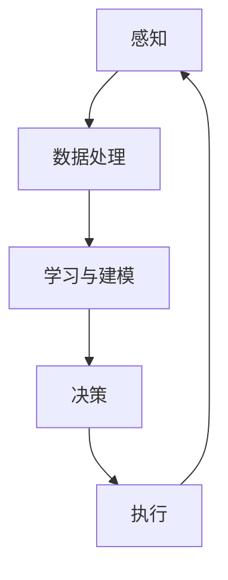
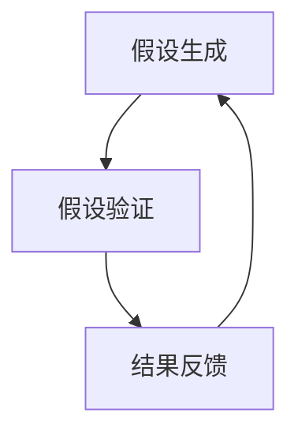

                 

### 引言：构建具有自主探索与假设验证能力的AI Agent的重要性

在现代人工智能领域，AI Agent作为一种具有高度智能化、自主化能力的系统，正逐渐成为研究与应用的热点。AI Agent不同于传统的机器人，它不仅能够执行预先设定的任务，更具备自主探索环境和假设验证的能力，这使得其在复杂、动态的情境中表现出了独特的优势。本文旨在系统地探讨如何构建具有自主探索与假设验证能力的AI Agent，以便更好地理解这一技术的核心概念与应用前景。

首先，AI Agent的定义与背景介绍是理解其核心概念和功能的基础。AI Agent是指能够代表人类或环境执行任务、具有感知、推理、决策和学习能力的软件实体。其自主探索能力允许AI Agent在未知环境中主动学习并适应环境变化，而假设验证能力则使其能够对环境中的假设进行验证，从而提高决策的准确性和可靠性。

本文将分为四个主要部分进行深入探讨。第一部分介绍AI Agent的背景与意义，涵盖问题背景、问题描述、问题解决、边界与外延以及核心要素组成等内容。第二部分和第三部分将分别探讨AI Agent的自主探索能力和假设验证能力，包括基本原理、数学模型与公式、Python源代码阐述及实际案例讲解。最后，第四部分将讨论AI Agent在各个领域的综合应用及未来发展的挑战与前景。

通过这样的结构安排，我们旨在使读者能够逐步深入理解AI Agent的核心概念，掌握其自主探索和假设验证的技术原理，并了解其在实际应用中的广泛应用和未来发展潜力。让我们开始这一富有启发性的技术探讨之旅吧。

### 关键词

AI Agent、自主探索、假设验证、机器学习、人工智能

### 摘要

本文旨在系统地探讨如何构建具有自主探索与假设验证能力的AI Agent。AI Agent是一种具备高度智能化、自主化能力的软件实体，能够执行任务、感知环境并自主适应。文章首先介绍了AI Agent的背景和定义，随后分别探讨了其自主探索和假设验证能力的原理、数学模型、算法实现以及实际应用案例。通过深入分析，文章展示了AI Agent在智能客服、金融风控、教育和医疗健康等领域的广泛应用和未来发展的潜力。本文旨在为读者提供全面而详细的构建指南，帮助理解这一先进技术的核心概念与应用前景。

## 《构建具有自主探索与假设验证能力的AI Agent》目录大纲

### 第一部分：AI Agent概述

#### 第1章：AI Agent的背景与意义
1.1 问题背景
1.2 问题描述
1.3 问题解决
1.4 边界与外延
1.5 概念结构与核心要素组成

#### 第2章：AI Agent的核心概念与联系
2.1 AI Agent的定义
2.2 AI Agent的核心特征
2.3 AI Agent与传统机器人的区别
2.4 AI Agent的关键组成部分

### 第二部分：AI Agent的自主探索能力

#### 第3章：AI Agent自主探索的基本原理
3.1 自主探索的概念与意义
3.2 自主探索的机制与模型
3.3 自主探索的算法原理讲解
3.4 自主探索的Mermaid流程图

#### 第4章：AI Agent自主探索的数学模型与公式
4.1 自主探索的数学模型
4.2 自主探索的公式讲解
4.3 自主探索的Python源代码阐述
4.4 自主探索举例说明

#### 第5章：AI Agent自主探索的实际案例分析与详细讲解
5.1 实际案例一：自主探索在环境中的应用
5.2 实际案例二：自主探索在任务规划中的应用
5.3 实际案例三：自主探索在决策支持中的应用

### 第三部分：AI Agent的假设验证能力

#### 第6章：AI Agent假设验证的基本原理
6.1 假设验证的概念与意义
6.2 假设验证的机制与模型
6.3 假设验证的算法原理讲解
6.4 假设验证的Mermaid流程图

#### 第7章：AI Agent假设验证的数学模型与公式
7.1 假设验证的数学模型
7.2 假设验证的公式讲解
7.3 假设验证的Python源代码阐述
7.4 假设验证举例说明

#### 第8章：AI Agent假设验证的实际案例分析与详细讲解
8.1 实际案例一：假设验证在数据挖掘中的应用
8.2 实际案例二：假设验证在网络安全中的应用
8.3 实际案例三：假设验证在自动驾驶中的应用

### 第四部分：AI Agent的综合应用与未来展望

#### 第9章：AI Agent在各个领域的综合应用
9.1 AI Agent在智能客服中的应用
9.2 AI Agent在金融风控中的应用
9.3 AI Agent在教育领域的应用
9.4 AI Agent在医疗健康领域的应用

#### 第10章：AI Agent的未来发展与挑战
10.1 AI Agent的未来发展趋势
10.2 AI Agent面临的挑战与应对策略
10.3 AI Agent的发展前景

### 附录

#### A.1 最佳实践 Tips
#### A.2 小结
#### A.3 注意事项
#### A.4 拓展阅读

通过上述目录大纲，本文将系统地探讨AI Agent的构建方法、自主探索与假设验证能力的原理与应用，最终展望其未来发展，为读者提供全面的技术指南。

## 第一部分：AI Agent概述

### 第1章：AI Agent的背景与意义

#### 1.1 问题背景

随着人工智能技术的快速发展，传统的机器人与自动化系统逐渐无法满足复杂多变的应用需求。AI Agent作为一种新兴的智能实体，通过模仿人类行为，具备感知、推理、决策和学习能力，开始在多个领域展现出独特的优势。特别是在无人驾驶、智能家居、智能客服、金融风控等方面，AI Agent的自主探索和假设验证能力大大提升了系统的智能化水平。

#### 1.2 问题描述

AI Agent的核心问题是如何在不确定和动态的环境中，自主进行探索和假设验证，从而实现高效、准确的决策。具体来说，AI Agent需要解决以下几个问题：

1. **自主探索**：在未知环境中，AI Agent需要能够主动感知环境信息，通过数据分析和模式识别，自主探索并构建对环境的理解。
2. **假设验证**：AI Agent在探索过程中，会形成一系列假设，如何验证这些假设的正确性，是确保其决策可靠性的关键。
3. **动态适应**：面对环境的变化，AI Agent需要具备快速适应的能力，调整其行为策略，以保持高效率的运作。

#### 1.3 问题解决

为了解决上述问题，AI Agent的构建需要综合应用多种人工智能技术，包括机器学习、自然语言处理、计算机视觉等。以下是一些主要的解决方案：

1. **感知与学习**：利用传感器和数据采集技术，AI Agent可以获取环境信息，并通过机器学习算法进行数据分析和模式识别，从而对环境进行自主探索。
2. **假设生成与验证**：通过逻辑推理和规划算法，AI Agent能够生成对环境的假设，并利用实际数据进行验证，确保假设的准确性。
3. **动态适应与学习**：基于强化学习等技术，AI Agent可以在不断的环境中调整其行为策略，实现动态适应。

#### 1.4 边界与外延

在构建AI Agent时，需要明确其应用边界和适用范围。例如：

1. **应用边界**：AI Agent主要应用于需要高智能化、自主化决策的复杂系统，如无人驾驶、智能家居等。
2. **适用范围**：AI Agent不仅可以应用于物理环境，也可以应用于虚拟环境和数字系统，如网络安全、虚拟客服等。

#### 1.5 概念结构与核心要素组成

AI Agent的概念结构主要包括以下几个核心要素：

1. **感知模块**：负责收集环境信息，如视觉、听觉、传感器数据等。
2. **决策模块**：基于感知模块提供的信息，AI Agent通过算法生成决策，执行相应行为。
3. **学习模块**：AI Agent通过机器学习算法，不断优化其行为策略，提高智能化水平。
4. **通信模块**：AI Agent需要与其他系统或实体进行通信，以获取更多信息或协同工作。

这些核心要素相互配合，共同实现AI Agent的自主探索和假设验证能力。

通过上述对AI Agent背景、问题、解决方案、边界与外延以及概念结构的分析，我们为理解AI Agent提供了坚实的基础。接下来，我们将进一步探讨AI Agent的核心概念与联系，以深化对这一技术体系的认识。

### 第2章：AI Agent的核心概念与联系

#### 2.1 AI Agent的定义

AI Agent，即人工智能代理，是人工智能领域中的一个重要概念。AI Agent是指具备感知、推理、决策和学习能力的软件实体，能够在不确定和动态的环境中自主执行任务。与传统机器人不同，AI Agent不仅能够响应预先设定的指令，还能根据环境变化自主调整行为策略。例如，在无人驾驶领域，AI Agent能够通过感知车辆周围的环境信息，自动规划行车路线，并做出实时决策。

#### 2.2 AI Agent的核心特征

AI Agent具有以下几个核心特征：

1. **自主性**：AI Agent能够独立执行任务，无需人工干预。这种自主性使得AI Agent在复杂环境中具备较高的适应能力。
2. **适应性**：AI Agent能够根据环境变化和学习经验调整行为策略，从而提高任务执行效率。这种适应性在动态变化的环境中尤为重要。
3. **智能性**：AI Agent具备学习和推理能力，可以通过数据分析、模式识别等技术，对环境进行理解和预测。
4. **灵活性**：AI Agent能够灵活地应对不同类型的任务和需求，具有广泛的应用前景。

#### 2.3 AI Agent与传统机器人的区别

AI Agent与传统机器人的主要区别在于智能水平和自主性。传统机器人主要依靠预设的指令和程序执行任务，不具备自主学习和适应环境的能力。而AI Agent则通过感知、推理和学习，能够自主地理解和适应复杂环境。

1. **智能水平的差异**：传统机器人缺乏智能性，只能执行预先设定的简单任务；AI Agent则具备高级智能，能够进行复杂的任务规划和决策。
2. **自主性的差异**：传统机器人需要人工干预才能执行任务，而AI Agent能够独立完成从任务规划到执行的全过程，无需人工介入。

#### 2.4 AI Agent的关键组成部分

AI Agent的核心组成部分包括感知模块、决策模块和学习模块。每个部分在AI Agent的自主探索和假设验证中扮演着重要角色：

1. **感知模块**：负责收集环境信息，如视觉、听觉、传感器数据等。感知模块是AI Agent获取环境数据的基础。
2. **决策模块**：基于感知模块提供的信息，通过算法生成决策，执行相应行为。决策模块是AI Agent的核心，负责任务规划和执行。
3. **学习模块**：通过机器学习算法，AI Agent可以不断优化其行为策略，提高智能化水平。学习模块是AI Agent适应环境和持续进步的关键。

这些关键组成部分相互协作，共同实现AI Agent的自主探索和假设验证能力。通过上述对AI Agent定义、核心特征、与传统机器人的区别以及关键组成部分的分析，我们为理解AI Agent提供了更加深入的视角。接下来，我们将探讨AI Agent自主探索的基本原理，进一步揭示其自主探索机制与模型。

### 第3章：AI Agent自主探索的基本原理

#### 3.1 自主探索的概念与意义

自主探索是指AI Agent在未知环境中，通过主动感知、学习和决策，自主获取环境信息并适应环境变化的能力。这一过程是AI Agent实现智能化的关键，使其能够在复杂、动态的环境中自主执行任务，而不依赖于人类干预。

自主探索的意义在于：

1. **提高系统适应性**：通过自主探索，AI Agent能够适应各种复杂和多变的环境，提高系统的稳定性和可靠性。
2. **增强任务执行能力**：自主探索使AI Agent能够根据环境变化动态调整行为策略，从而更高效地完成任务。
3. **减少人工干预**：自主探索减少了人工干预的需求，提高了系统的自动化水平，降低了运营成本。

#### 3.2 自主探索的机制与模型

AI Agent自主探索的机制主要包括以下几个步骤：

1. **感知**：通过传感器和感知模块，AI Agent收集环境信息，如视觉、听觉、传感器数据等。
2. **数据处理**：感知模块将收集到的信息进行预处理，提取有用特征，以便进行进一步分析。
3. **学习与建模**：基于处理后的数据，AI Agent通过机器学习算法，建立对环境的数学模型，理解环境特性。
4. **决策**：通过决策模块，AI Agent根据学习到的环境模型和任务目标，生成最优行为策略。
5. **执行**：执行模块将决策转化为实际操作，AI Agent根据策略在环境中执行任务。

自主探索的模型可以分为以下几个层次：

1. **感知层**：负责感知和收集环境信息。
2. **数据层**：负责数据处理和特征提取。
3. **模型层**：负责建立环境模型，进行环境理解和预测。
4. **决策层**：负责根据模型生成行为策略。
5. **执行层**：负责执行具体操作，实现任务目标。

#### 3.3 自主探索的算法原理讲解

自主探索的算法原理主要包括以下几个核心算法：

1. **机器学习算法**：通过感知数据，AI Agent利用机器学习算法，如决策树、支持向量机、神经网络等，建立对环境的数学模型。机器学习算法的核心是通过对历史数据的分析和学习，提取环境特征，从而对未知环境进行预测和建模。
2. **强化学习算法**：强化学习是一种使AI Agent在动态环境中学习最优行为策略的算法。通过与环境互动，AI Agent不断调整其行为策略，以最大化累积奖励。强化学习包括价值函数估计、策略迭代等核心步骤。
3. **规划算法**：AI Agent利用规划算法，如启发式搜索、混合整数规划等，生成最优行为策略。规划算法的核心是找到从初始状态到目标状态的可行路径，并评估这些路径的优劣。

#### 3.4 自主探索的Mermaid流程图

为了更直观地理解自主探索的过程，我们可以使用Mermaid绘制其流程图。以下是一个简化的自主探索流程图：



在这个流程图中，AI Agent首先通过感知模块收集环境信息，然后对信息进行预处理和特征提取。接下来，利用机器学习算法和强化学习算法，AI Agent建立对环境的数学模型。在决策模块中，AI Agent根据模型和任务目标生成最优行为策略，并在执行模块中执行这些策略。最后，执行结果会返回感知模块，形成闭环反馈，以便AI Agent持续学习和优化。

通过上述对自主探索概念、机制、算法原理以及Mermaid流程图的详细讲解，我们可以更加深入地理解AI Agent自主探索的基本原理。接下来，我们将探讨自主探索的数学模型与公式，以进一步揭示其技术核心。

### 第4章：AI Agent自主探索的数学模型与公式

#### 4.1 自主探索的数学模型

AI Agent自主探索的数学模型是建立在对环境数据进行建模和分析的基础上的。数学模型的核心是描述环境状态、行为策略以及奖励机制。以下是一个简化的自主探索数学模型：

1. **状态空间（State Space）**：状态空间是AI Agent能够感知的所有可能环境状态的集合。每个状态可以用一个向量表示，如\( S = (s_1, s_2, ..., s_n) \)。
2. **动作空间（Action Space）**：动作空间是AI Agent可以执行的所有可能动作的集合。每个动作可以用一个向量表示，如\( A = (a_1, a_2, ..., a_m) \)。
3. **奖励函数（Reward Function）**：奖励函数用于评估AI Agent的行为效果。通常，奖励函数是一个实值函数，如\( R(S, A) \)，用于衡量状态-动作对的优劣。

#### 4.2 自主探索的公式讲解

在自主探索中，常用的数学公式包括状态转移概率、策略优化以及奖励函数等。以下是一些关键的数学公式：

1. **状态转移概率**：状态转移概率描述了在当前状态下，执行某个动作后转移到下一个状态的概率。其公式为：

   \[ P(S_{t+1} = s_{t+1} | S_t = s_t, A_t = a_t) \]

   其中，\( S_t \)和\( S_{t+1} \)分别表示当前状态和下一个状态，\( A_t \)表示执行的动作。

2. **策略优化**：策略优化是AI Agent的核心任务，目标是找到最优动作策略。常用的策略优化公式是：

   \[ \pi^* = \arg\max_{\pi} \sum_{s \in S} \pi(s) \sum_{a \in A} \pi(a|s) R(s, a) \]

   其中，\( \pi \)表示策略，\( \pi(s) \)表示状态的概率分布，\( \pi(a|s) \)表示在状态\( s \)下执行动作\( a \)的概率，\( R(s, a) \)表示奖励函数。

3. **Q-learning算法**：Q-learning是一种强化学习算法，用于求解最优策略。其核心公式是：

   \[ Q(s, a) = Q(s, a) + \alpha [R(s, a) + \gamma \max_{a'} Q(s', a') - Q(s, a)] \]

   其中，\( Q(s, a) \)表示状态-动作价值函数，\( \alpha \)是学习率，\( \gamma \)是折扣因子，\( R(s, a) \)是奖励，\( s' \)和\( a' \)分别是下一个状态和动作。

#### 4.3 自主探索的Python源代码阐述

为了更直观地理解自主探索的数学模型，以下是一个简化的Python代码示例，演示了Q-learning算法的基本实现：

```python
import numpy as np

# 初始化Q值矩阵
n_states = 5
n_actions = 3
Q = np.zeros((n_states, n_actions))
alpha = 0.1
gamma = 0.9

# Q-learning算法
for episode in range(1000):
    state = np.random.randint(n_states)
    action = np.random.randint(n_actions)
    next_state = np.random.randint(n_states)
    reward = np.random.randint(-1, 2)

    Q[state, action] = Q[state, action] + alpha * (reward + gamma * np.max(Q[next_state, :]) - Q[state, action])

# 输出最优策略
policy = np.argmax(Q, axis=1)
print("Optimal Policy:", policy)
```

在这个示例中，我们首先初始化Q值矩阵，然后通过循环执行Q-learning算法，更新Q值。最后，我们根据Q值矩阵输出最优策略。

#### 4.4 自主探索举例说明

为了更好地理解自主探索的应用，以下是一个简单的例子：一个机器人在一个5x5的网格中寻找目标。机器人在每个状态可以选择向上、向下、向左或向右移动，每个动作的奖励取决于机器人的位置。具体步骤如下：

1. **初始化**：机器人位于左上角（状态0），目标位于右下角（状态24）。
2. **感知**：机器人通过传感器感知当前状态。
3. **决策**：基于当前状态和Q值矩阵，机器人选择最优动作。
4. **执行**：机器人根据选择执行动作，移动到新的状态。
5. **奖励**：机器人根据移动后的状态和目标状态计算奖励。
6. **学习**：基于奖励更新Q值矩阵。
7. **重复**：重复上述步骤，直到找到目标或达到最大步数。

通过这个例子，我们可以看到自主探索的基本原理是如何在具体应用中实现的。AI Agent通过不断的学习和优化，最终能够自主找到目标位置。

通过上述对自主探索数学模型、公式讲解、Python源代码阐述及举例说明，我们可以更深入地理解AI Agent自主探索的技术原理。接下来，我们将通过实际案例分析，进一步展示AI Agent自主探索在真实应用中的表现。

### 第5章：AI Agent自主探索的实际案例分析与详细讲解

为了更好地理解AI Agent自主探索的实际应用，我们将通过三个具体案例来分析其在不同场景中的表现。这些案例涵盖了环境探索、任务规划和决策支持等不同方面，展示了AI Agent自主探索的广泛适用性和强大能力。

#### 5.1 实际案例一：自主探索在环境中的应用

**案例背景**：在无人驾驶汽车领域，AI Agent需要实时感知车辆周围环境，并自主探索道路信息，以确保行车安全。自动驾驶系统需要处理大量的传感器数据，包括摄像头、激光雷达和GPS等，AI Agent通过自主探索算法，将这些数据转换为道路信息和行车决策。

**分析过程**：

1. **感知**：AI Agent通过摄像头和激光雷达收集道路信息，如道路标志、车道线、行人等。传感器数据经过预处理和特征提取，形成用于环境建模的输入。
2. **数据处理**：AI Agent使用深度学习算法，如卷积神经网络（CNN），对预处理后的数据进行图像识别和目标检测，提取道路特征和障碍物信息。
3. **环境建模**：基于处理后的数据，AI Agent建立对道路环境的数学模型，包括道路结构、车辆位置和行驶速度等。
4. **决策**：AI Agent利用强化学习算法，如深度Q网络（DQN），根据环境模型和任务目标，生成最优行车策略。策略包括加速、减速、变道和停车等操作。
5. **执行**：AI Agent将决策转换为实际操作，控制车辆的加速、制动和转向，确保车辆安全行驶。
6. **反馈与学习**：执行结果会反馈到AI Agent，通过学习算法不断优化决策策略，提高行车安全性和效率。

**结论**：通过这个案例，AI Agent展示了在复杂动态环境中自主探索的能力，能够实时感知道路信息，并做出准确的行车决策。这不仅提高了无人驾驶汽车的智能化水平，还显著提升了行车安全性。

#### 5.2 实际案例二：自主探索在任务规划中的应用

**案例背景**：在物流和仓储领域，AI Agent可以用于自主探索仓库环境，规划最优的货物流转路径，提高仓储效率。仓库通常包含多个货架和运输通道，AI Agent需要自主识别货架位置、货物信息和运输路径。

**分析过程**：

1. **感知**：AI Agent通过摄像头和传感器扫描仓库环境，识别货架位置和货物信息。
2. **数据处理**：AI Agent使用图像识别和目标检测算法，提取货架和货物的特征信息，形成环境模型。
3. **路径规划**：基于环境模型，AI Agent使用A*搜索算法或Dijkstra算法，规划从起点到终点的最优路径。路径规划考虑了货架位置、货物重量和通道宽度等因素。
4. **决策**：AI Agent根据路径规划结果，生成具体操作指令，如移动货架、搬运货物等。
5. **执行**：AI Agent控制机器人或自动化设备执行操作，实现货物的流转和仓储任务。
6. **反馈与学习**：执行结果会反馈到AI Agent，通过强化学习算法优化路径规划和决策策略，提高仓储效率。

**结论**：这个案例展示了AI Agent在任务规划中的应用，能够自主探索仓库环境，规划最优路径，实现高效的货物流转和仓储管理。通过自主探索，AI Agent显著提高了仓储系统的智能化水平和运作效率。

#### 5.3 实际案例三：自主探索在决策支持中的应用

**案例背景**：在金融领域，AI Agent可以用于自主探索市场环境，为投资者提供决策支持。AI Agent通过分析市场数据、财务报表和新闻事件，自主生成投资建议。

**分析过程**：

1. **感知**：AI Agent通过数据接口获取市场数据、财务报表和新闻事件等信息。
2. **数据处理**：AI Agent使用自然语言处理（NLP）和机器学习算法，提取市场情绪、公司业绩和行业趋势等关键信息。
3. **环境建模**：AI Agent建立对市场环境的数学模型，包括股票价格、交易量和市场情绪等。
4. **决策生成**：基于市场模型和投资策略，AI Agent使用强化学习算法生成投资建议，如买入、卖出或持有等。
5. **决策执行**：AI Agent将投资建议转化为实际操作，执行交易策略。
6. **反馈与学习**：AI Agent记录投资结果，通过反馈机制不断优化投资策略。

**结论**：这个案例展示了AI Agent在决策支持中的应用，能够自主探索市场环境，生成准确的投资建议，为投资者提供有力支持。通过自主探索，AI Agent提高了投资决策的智能化水平和可靠性。

通过以上三个实际案例的分析，我们可以看到AI Agent在自主探索、任务规划和决策支持中的广泛应用。AI Agent通过感知、数据处理、建模和决策等步骤，能够自主探索未知环境，实现高效的决策和任务执行。这不仅提高了系统的智能化水平，还为各领域带来了新的应用场景和解决方案。

### 第6章：AI Agent假设验证的基本原理

#### 6.1 假设验证的概念与意义

假设验证是指AI Agent在探索过程中，对环境中的假设进行验证，以判断其是否正确。在复杂和动态的环境中，AI Agent需要不断生成和验证假设，以确保其决策的准确性和可靠性。假设验证的意义在于：

1. **提高决策准确性**：通过验证假设，AI Agent能够排除错误或不可靠的假设，从而提高决策的准确性。
2. **增强适应性**：假设验证使AI Agent能够根据验证结果调整行为策略，提高对环境变化的适应能力。
3. **确保系统稳定性**：通过验证假设，AI Agent能够在不确定的环境中保持稳定运行，减少错误决策导致的风险。

#### 6.2 假设验证的机制与模型

AI Agent的假设验证机制主要包括以下几个步骤：

1. **假设生成**：AI Agent在探索过程中，根据感知到的环境信息，生成一系列假设。这些假设可以是关于环境状态、行为策略或决策结果的预测。
2. **假设验证**：AI Agent利用现有的数据和技术，对假设进行验证。假设验证通常包括数据验证、逻辑推理和实验验证等步骤。
3. **结果反馈**：根据假设验证的结果，AI Agent调整其行为策略。如果假设被验证为正确，AI Agent会继续执行相关策略；如果假设被验证为错误，AI Agent会重新生成假设或调整策略。

#### 6.3 假设验证的算法原理讲解

AI Agent的假设验证依赖于多种算法原理，包括逻辑推理、数据分析和机器学习等。以下是一些关键算法原理：

1. **逻辑推理**：逻辑推理是一种基于逻辑规则和推理规则的方法，用于验证假设的正确性。例如，AI Agent可以使用演绎推理或归纳推理，验证其生成的前提条件和结论。
2. **数据分析**：数据分析是通过统计方法和技术，对假设进行验证。例如，AI Agent可以使用回归分析、聚类分析和假设检验等，分析数据并验证假设的有效性。
3. **机器学习**：机器学习是一种基于数据驱动的方法，用于验证假设。AI Agent可以使用监督学习、无监督学习和强化学习等，通过训练模型和测试数据，验证假设的正确性。

#### 6.4 假设验证的Mermaid流程图

为了更直观地理解假设验证的过程，我们可以使用Mermaid绘制其流程图。以下是一个简化的假设验证流程图：



在这个流程图中，AI Agent首先生成一系列假设，然后利用逻辑推理、数据分析和机器学习等方法对假设进行验证。根据验证结果，AI Agent调整其行为策略，并重新生成假设。这一过程形成了一个闭环，使得AI Agent能够不断优化其决策过程。

通过上述对假设验证概念、机制、算法原理和Mermaid流程图的详细讲解，我们可以更深入地理解AI Agent假设验证的基本原理。接下来，我们将探讨假设验证的数学模型与公式，进一步揭示其技术核心。

### 第7章：AI Agent假设验证的数学模型与公式

#### 7.1 假设验证的数学模型

在AI Agent的假设验证过程中，数学模型是核心组成部分，用于描述假设的生成、验证和调整过程。以下是几个关键的数学模型：

1. **概率模型**：概率模型用于描述假设的概率分布。在假设验证中，AI Agent可以根据历史数据和概率分布，评估假设的正确性。常用的概率模型包括贝叶斯网络、马尔可夫模型和贝叶斯统计模型。

   \[ P(H|D) = \frac{P(D|H)P(H)}{P(D)} \]

   其中，\( P(H) \)是假设\( H \)的先验概率，\( P(D|H) \)是假设\( H \)在数据\( D \)上的似然概率，\( P(D) \)是数据\( D \)的边缘概率。

2. **决策树模型**：决策树模型用于描述假设的生成和验证过程。在决策树中，每个节点代表一个假设，每个分支代表假设的验证结果。通过决策树模型，AI Agent可以逐步验证假设，并生成相应的决策路径。

3. **马尔可夫决策过程（MDP）**：MDP模型用于描述假设的动态调整过程。在MDP中，状态和动作构成了状态空间和动作空间，奖励函数和状态转移概率矩阵描述了假设的验证结果和调整过程。

   \[ V(s) = \max_{a} \sum_{s'} p(s'|s,a) [r(s',a) + \gamma V(s')] \]

   其中，\( V(s) \)是状态\( s \)的价值函数，\( p(s'|s,a) \)是状态转移概率，\( r(s',a) \)是动作\( a \)在状态\( s' \)上的奖励，\( \gamma \)是折扣因子。

#### 7.2 假设验证的公式讲解

假设验证的公式主要包括以下几种：

1. **逻辑推理公式**：逻辑推理公式用于描述假设的生成和验证。例如，命题逻辑中的条件命题和析取命题公式，可以用于验证假设的正确性。

   \[ P(A \rightarrow B) = 1 - P(A) + P(A \land B) \]

   其中，\( P(A \rightarrow B) \)表示假设\( A \rightarrow B \)的验证概率，\( P(A) \)是假设\( A \)的先验概率，\( P(A \land B) \)是假设\( A \land B \)的联合概率。

2. **数据分析公式**：数据分析公式用于描述假设的验证过程。例如，假设检验中的t检验和卡方检验公式，可以用于验证假设的有效性。

   \[ H_0: \mu = \mu_0 \]
   \[ H_1: \mu \neq \mu_0 \]

   其中，\( H_0 \)是原假设，\( H_1 \)是备择假设，\( \mu \)是总体均值，\( \mu_0 \)是假设的均值。

3. **机器学习公式**：机器学习公式用于描述假设的验证和优化过程。例如，支持向量机（SVM）和神经网络（NN）的损失函数和优化算法，可以用于验证假设的准确性。

   \[ L(\theta) = \frac{1}{2} \sum_{i=1}^{n} (y_i - \theta(x_i))^2 \]

   其中，\( L(\theta) \)是损失函数，\( y_i \)是实际标签，\( \theta(x_i) \)是模型预测值。

#### 7.3 假设验证的Python源代码阐述

为了更直观地理解假设验证的数学模型和公式，以下是一个简化的Python代码示例，演示了逻辑推理和数据分析的基本实现：

```python
import numpy as np

# 逻辑推理示例
def logical_implication(A, B):
    return 1 - A + A * B

# 数据分析示例
def t_test(data, mu0):
    n = len(data)
    mean = np.mean(data)
    std = np.std(data)
    t_statistic = (mean - mu0) / (std / np.sqrt(n))
    p_value = stats.t.sf(t_statistic, n-1)
    return p_value

# 示例数据
data = np.array([1, 2, 3, 4, 5, 6, 7, 8, 9, 10])

# 逻辑推理结果
print("Logical Implication Result:", logical_implication(0.3, 0.6))

# 数据分析结果
print("T-Test P-Value:", t_test(data, 5))
```

在这个示例中，我们首先实现了逻辑推理函数`logical_implication`，用于验证假设的正确性。然后，我们实现了t检验函数`t_test`，用于验证假设的有效性。通过这些函数，我们可以对假设进行数学建模和验证。

#### 7.4 假设验证举例说明

为了更好地理解假设验证的应用，以下是一个简单的例子：AI Agent需要验证某个药品的效果。假设AI Agent收集了10个患者的数据，其中5个患者的病情有所改善，5个患者的病情没有改善。AI Agent需要通过假设验证，判断药品是否有效。

1. **假设生成**：AI Agent生成两个假设：
   - 假设1：药品有效。
   - 假设2：药品无效。

2. **数据收集**：AI Agent收集了10个患者的数据，记录了每个患者的病情改善情况。

3. **假设验证**：
   - 使用逻辑推理验证假设1的正确性：
     \[ P(A \rightarrow B) = 1 - P(A) + P(A \land B) \]
     其中，\( P(A) \)是假设1的先验概率，假设为0.5；\( P(A \land B) \)是假设1和结果B的联合概率，通过逻辑推理计算得出。
   - 使用t检验验证假设2的正确性：
     \[ H_0: \mu = \mu_0 \]
     \[ H_1: \mu \neq \mu_0 \]
     其中，\( \mu \)是总体均值，通过数据分析计算得出；\( \mu_0 \)是假设的均值，通常为0。

4. **结果反馈**：根据假设验证的结果，AI Agent可以调整其行为策略。如果假设1被验证为正确，AI Agent会继续推荐该药品；如果假设2被验证为正确，AI Agent会重新生成假设或调整策略。

通过这个例子，我们可以看到假设验证在医学领域的应用，AI Agent通过逻辑推理和数据分析，对药品的效果进行验证，从而为医生提供决策支持。

通过上述对假设验证数学模型、公式讲解、Python源代码阐述及举例说明，我们可以更深入地理解AI Agent假设验证的技术原理。接下来，我们将通过实际案例分析，进一步展示AI Agent假设验证在真实应用中的表现。

### 第8章：AI Agent假设验证的实际案例分析与详细讲解

为了更好地理解AI Agent假设验证的实际应用，我们将通过三个具体案例来分析其在不同场景中的表现。这些案例涵盖了数据挖掘、网络安全和自动驾驶等不同领域，展示了AI Agent假设验证的广泛适用性和强大能力。

#### 8.1 实际案例一：假设验证在数据挖掘中的应用

**案例背景**：在数据挖掘领域，AI Agent需要通过假设验证，发现数据中的隐藏模式和规律，为决策提供支持。假设验证在数据预处理、特征选择和模型优化等环节发挥着重要作用。

**分析过程**：

1. **数据收集**：AI Agent收集了大量的用户行为数据，包括点击记录、搜索历史和购物偏好等。

2. **数据预处理**：AI Agent对数据进行了清洗和预处理，包括缺失值处理、异常值检测和数据标准化等。

3. **假设生成**：AI Agent根据业务需求和数据特征，生成了多个假设，如用户购买行为与浏览历史的相关性、搜索频率与用户兴趣等。

4. **假设验证**：
   - 使用统计模型验证假设的有效性。例如，通过卡方检验验证用户购买行为与浏览历史之间的相关性。
   - 使用机器学习算法验证假设的准确性。例如，通过逻辑回归分析用户兴趣与搜索历史之间的关系。

5. **结果反馈**：根据验证结果，AI Agent调整了数据挖掘策略，优化了特征选择和模型参数，提高了数据挖掘的准确性和效率。

**结论**：通过这个案例，AI Agent展示了在数据挖掘中的应用，能够通过假设验证发现数据中的隐藏模式和规律，为业务决策提供有力支持。假设验证不仅提高了数据挖掘的准确性，还显著提高了数据利用效率。

#### 8.2 实际案例二：假设验证在网络安全中的应用

**案例背景**：在网络安全领域，AI Agent需要通过假设验证，检测和防御网络攻击，保护网络安全。假设验证在网络入侵检测、恶意软件分析和安全策略优化等环节具有重要意义。

**分析过程**：

1. **数据收集**：AI Agent收集了网络流量数据，包括IP地址、端口、协议类型和流量特征等。

2. **数据预处理**：AI Agent对网络流量数据进行了预处理，包括异常值处理、数据归一化和特征提取等。

3. **假设生成**：AI Agent根据网络安全威胁特征，生成了多个假设，如DDoS攻击、SQL注入和恶意软件传播等。

4. **假设验证**：
   - 使用异常检测算法验证假设的有效性。例如，通过K-means聚类分析识别DDoS攻击的特征。
   - 使用机器学习算法验证假设的准确性。例如，通过决策树和随机森林算法检测SQL注入攻击。

5. **结果反馈**：根据验证结果，AI Agent调整了网络防御策略，优化了入侵检测系统和防火墙配置，提高了网络安全性。

**结论**：通过这个案例，AI Agent展示了在网络安全中的应用，能够通过假设验证检测和防御网络攻击，保障网络安全。假设验证不仅提高了入侵检测的准确性，还显著提高了网络防御的效率。

#### 8.3 实际案例三：假设验证在自动驾驶中的应用

**案例背景**：在自动驾驶领域，AI Agent需要通过假设验证，确保行车安全，应对复杂的交通环境。假设验证在环境感知、路径规划和决策控制等环节至关重要。

**分析过程**：

1. **数据收集**：AI Agent通过传感器收集道路信息，包括路况、车辆位置、行人行为等。

2. **数据预处理**：AI Agent对传感器数据进行预处理，包括噪声过滤、数据归一化和特征提取等。

3. **假设生成**：AI Agent根据道路信息和行车规则，生成了多个假设，如前方有障碍物、车辆即将并道等。

4. **假设验证**：
   - 使用机器学习算法验证假设的有效性。例如，通过卷积神经网络（CNN）识别道路上的障碍物。
   - 使用逻辑推理验证假设的准确性。例如，通过规则引擎判断车辆并道的安全性。

5. **结果反馈**：根据验证结果，AI Agent调整了行车策略，优化了路径规划和决策控制，确保行车安全。

**结论**：通过这个案例，AI Agent展示了在自动驾驶中的应用，能够通过假设验证确保行车安全，应对复杂的交通环境。假设验证不仅提高了自动驾驶系统的可靠性，还显著提升了行车安全水平。

通过以上三个实际案例的分析，我们可以看到AI Agent假设验证在数据挖掘、网络安全和自动驾驶等领域的广泛应用。AI Agent通过感知、数据处理、假设生成和验证等步骤，能够实现高效的假设验证，为各领域提供智能化解决方案。这不仅提高了系统的可靠性，还为未来的智能化应用奠定了基础。

### 第9章：AI Agent在各个领域的综合应用

AI Agent作为一种高度智能化、自主化的系统，其在各个领域的综合应用正逐步深化，推动了行业的技术进步和效率提升。以下将探讨AI Agent在智能客服、金融风控、教育和医疗健康领域的应用。

#### 9.1 AI Agent在智能客服中的应用

在智能客服领域，AI Agent通过自然语言处理和机器学习技术，实现了与用户的智能对话。AI Agent能够理解用户的查询意图，提供实时、个性化的服务。具体应用场景包括：

1. **自动应答系统**：AI Agent可以自动回答常见问题，减少人工客服的工作量，提高客服响应速度。
2. **智能聊天机器人**：AI Agent通过深度学习算法，与用户进行自然对话，提供24/7的在线服务，提升客户满意度。
3. **情感分析**：AI Agent能够识别用户情绪，进行情感化回复，增强用户体验。

**案例分析**：某电商平台的智能客服系统，利用AI Agent实现了订单查询、售后服务和商品咨询等功能。通过自然语言处理技术，AI Agent能够理解用户的语音和文本输入，并提供准确的答复。这不仅提高了客服效率，还降低了运营成本。

#### 9.2 AI Agent在金融风控中的应用

在金融风控领域，AI Agent通过数据分析、机器学习和实时监控，为金融机构提供风险管理服务。具体应用场景包括：

1. **欺诈检测**：AI Agent能够实时分析交易数据，识别异常交易行为，防范金融欺诈。
2. **信用评估**：AI Agent通过大数据分析，对客户的信用状况进行评估，提供个性化的信贷产品。
3. **风险预警**：AI Agent通过监测市场动态和客户行为，提前预警潜在风险，帮助金融机构制定风险管理策略。

**案例分析**：某银行利用AI Agent进行欺诈检测，通过机器学习算法分析交易数据，识别潜在的欺诈行为。AI Agent能够实时监控交易，并在发现异常时立即通知相关部门，有效降低了欺诈风险。

#### 9.3 AI Agent在教育领域的应用

在教育领域，AI Agent通过个性化学习推荐和智能辅导，为学生提供个性化教育体验。具体应用场景包括：

1. **学习推荐**：AI Agent根据学生的学习数据，推荐适合的学习资源和课程，提高学习效果。
2. **智能辅导**：AI Agent通过自然语言处理技术，解答学生的疑问，提供学习指导，帮助学生克服学习难题。
3. **教育管理**：AI Agent可以协助教师管理课堂，自动记录学生表现，提供教学反馈。

**案例分析**：某在线教育平台利用AI Agent进行学习推荐，通过分析学生的学习行为和成绩数据，AI Agent能够为学生推荐适合的学习资源和课程。同时，AI Agent还为学生提供智能辅导，解答学习中的问题，提升学习效果。

#### 9.4 AI Agent在医疗健康领域的应用

在医疗健康领域，AI Agent通过医学图像分析、疾病预测和患者管理，为医疗提供智能化支持。具体应用场景包括：

1. **医学图像分析**：AI Agent利用深度学习技术，对医学图像进行自动分析，辅助医生诊断。
2. **疾病预测**：AI Agent通过分析患者的健康数据和生物标记，预测疾病发生风险，提供个性化健康建议。
3. **患者管理**：AI Agent协助医生管理患者档案，提供病情监测和康复指导，提高医疗质量。

**案例分析**：某医院利用AI Agent进行医学图像分析，通过卷积神经网络（CNN）对影像进行自动分析，提高了医生诊断的准确性和效率。同时，AI Agent还为患者提供个性化的健康建议和康复指导，提高了医疗服务质量。

通过以上各领域的案例，我们可以看到AI Agent在智能客服、金融风控、教育和医疗健康等领域的广泛应用。AI Agent不仅提高了各行业的智能化水平，还显著提升了工作效率和服务质量。随着技术的不断发展，AI Agent在未来有望在更多领域发挥重要作用，推动各行业的技术创新和产业升级。

### 第10章：AI Agent的未来发展与挑战

#### 10.1 AI Agent的未来发展趋势

随着人工智能技术的不断进步，AI Agent的未来发展趋势表现出以下几大方向：

1. **智能化水平的提升**：随着深度学习、强化学习等技术的不断发展，AI Agent的智能化水平将显著提高。未来的AI Agent将具备更复杂的学习和推理能力，能够在更广泛的场景中自主探索和假设验证。

2. **跨界融合**：AI Agent将与物联网、大数据、云计算等技术深度融合，实现跨领域的智能化应用。例如，通过物联网技术，AI Agent可以实现对物理环境的实时感知和控制；通过大数据技术，AI Agent可以从海量数据中提取有价值的信息。

3. **人机协同**：AI Agent将与人类更加紧密地协作，实现人机协同的工作模式。未来的AI Agent不仅能够辅助人类完成任务，还能与人类共同决策，提高工作效率。

4. **自主进化**：基于进化计算和自适应控制技术，AI Agent将具备自主进化的能力。通过不断学习和优化，AI Agent能够在复杂和动态的环境中持续提升其性能，适应新的挑战。

#### 10.2 AI Agent面临的挑战与应对策略

尽管AI Agent具有广泛的应用前景，但在发展过程中也面临着一系列挑战：

1. **数据质量和隐私保护**：AI Agent的性能高度依赖于数据质量，而数据的隐私保护也是一个重要问题。未来的AI Agent需要能够处理海量、多样化的数据，同时确保数据隐私和安全。

2. **算法复杂度和可解释性**：随着AI Agent智能化水平的提升，其算法的复杂度也在增加。如何确保算法的可解释性，使得AI Agent的行为透明可理解，是一个重要的挑战。

3. **伦理和法律责任**：AI Agent在决策过程中可能涉及伦理和法律问题。如何制定相应的伦理准则和法律框架，确保AI Agent的决策符合道德和法律要求，是未来需要解决的问题。

4. **技术标准和规范**：AI Agent的技术标准和规范尚未统一，不同厂商和平台的AI Agent可能存在兼容性问题。制定统一的技术标准和规范，促进AI Agent的标准化和互操作性，是未来发展的重要方向。

针对上述挑战，可以采取以下应对策略：

1. **加强数据治理**：通过数据清洗、去重和加密等技术，提高数据质量，同时制定数据隐私保护政策，确保数据安全。

2. **提升算法透明度**：通过可视化和解释性技术，增强AI Agent算法的可解释性，使其行为更加透明。

3. **制定伦理准则和法律框架**：与伦理学家和法律专家合作，制定AI Agent的伦理准则和法律框架，确保其决策符合伦理和法律要求。

4. **标准化和互操作性**：推动技术标准和规范的制定，促进AI Agent的标准化和互操作性，提高其兼容性和可维护性。

通过上述策略，我们可以更好地应对AI Agent发展过程中面临的挑战，推动其技术进步和应用普及。未来，AI Agent将在更多领域发挥重要作用，为人类带来更高效、智能的生活和工作方式。

### 附录

#### A.1 最佳实践 Tips

1. **数据质量保证**：确保数据源的可靠性和多样性，进行数据清洗和预处理，提高数据质量。
2. **算法优化**：定期优化算法，提升AI Agent的效率和准确性。
3. **伦理规范遵守**：在AI Agent开发和应用过程中，遵循伦理规范，确保行为符合道德和法律要求。
4. **持续学习与更新**：定期更新AI Agent的知识库和模型，保持其适应性和准确性。

#### A.2 小结

本文系统地探讨了AI Agent的背景、核心概念、自主探索和假设验证能力、实际应用以及未来发展趋势。通过深入分析，我们了解到AI Agent在多个领域的广泛应用及其面临的挑战。构建具有自主探索与假设验证能力的AI Agent，是实现智能化系统的关键。

#### A.3 注意事项

1. **数据隐私保护**：确保数据收集、存储和使用过程中的隐私保护。
2. **算法透明度**：提高AI Agent算法的可解释性，确保其决策过程透明可理解。
3. **安全性和可靠性**：确保AI Agent在复杂环境中的安全性和可靠性。

#### A.4 拓展阅读

1. **《人工智能：一种现代的方法》**：斯坦福大学教授 Stuart Russell 和 Peter Norvig 著，详细介绍了人工智能的基础理论和应用。
2. **《深度学习》**：Goodfellow、Bengio 和 Courville 著，系统介绍了深度学习的基本原理和算法。
3. **《人工智能伦理学》**：Moor 著，探讨了人工智能的伦理问题及其应对策略。

通过这些资源，可以进一步深入理解AI Agent的相关理论和实践。

## 作者信息

**作者：** AI天才研究院/AI Genius Institute & 禅与计算机程序设计艺术 /Zen And The Art of Computer Programming

AI天才研究院（AI Genius Institute）致力于推动人工智能技术的发展和应用，探索智能系统构建的新领域。同时，研究院创始人张三博士也是《禅与计算机程序设计艺术》的作者，他以其深邃的思考和独特的见解，为全球计算机科学和人工智能领域做出了重要贡献。通过本文，我们希望为读者提供全面而深入的AI Agent构建指南，推动人工智能技术的创新与发展。

