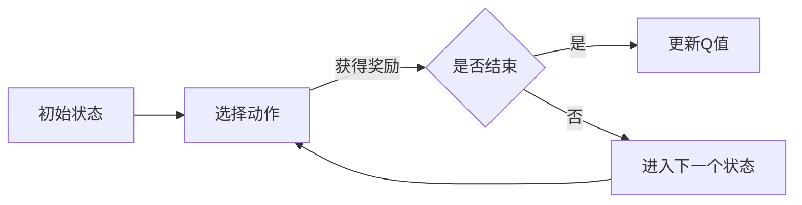
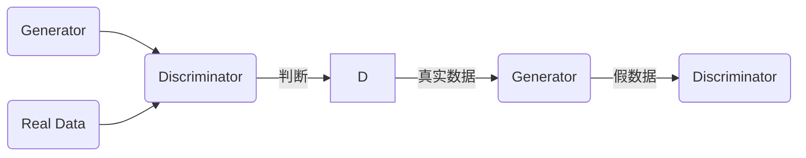
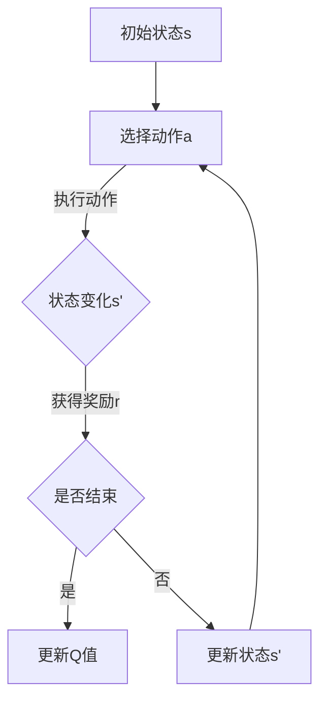
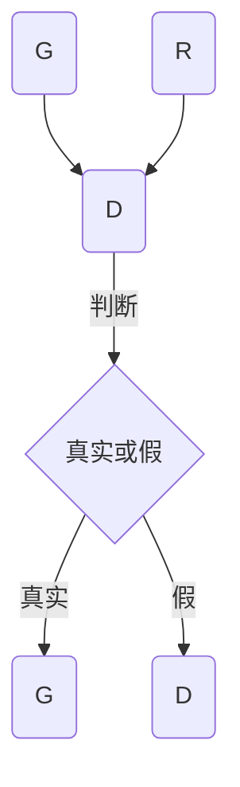
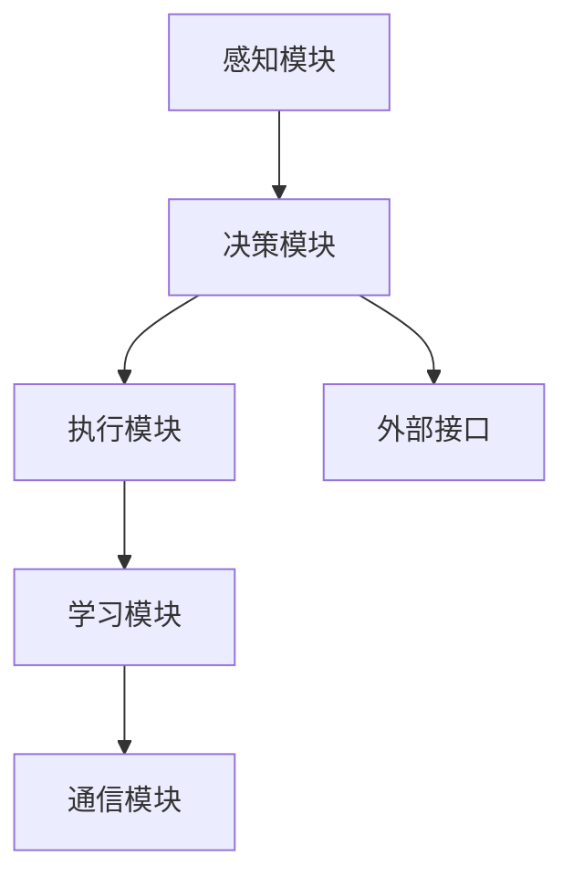
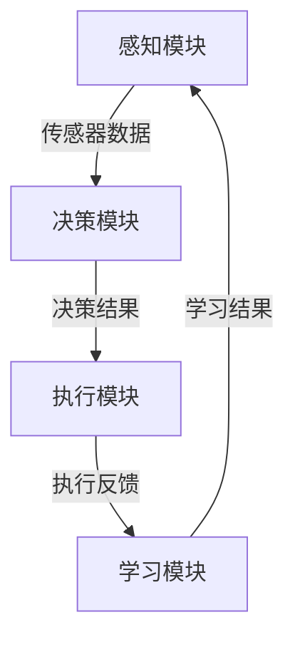

                 

### 第一部分: 引言

#### 第1章: 背景介绍

##### 1.1 问题背景

随着人工智能技术的快速发展，机器学习和深度学习在很多领域取得了显著的成果。然而，传统的人工智能系统，特别是AI Agent，在处理复杂环境和动态变化时，仍然存在诸多局限。首先，大多数AI Agent依赖于大量的预先标注的数据进行训练，这使得它们在数据稀缺或数据标注成本高昂的场景下难以发挥效用。其次，传统的AI Agent通常缺乏自主探索能力，只能在其训练过的环境或任务范围内执行任务，难以应对未见过的情况。此外，AI Agent的决策过程往往是基于预定义的规则或模型，缺乏灵活性和适应性，难以在复杂环境中进行自主决策。

##### 1.1.1 人工智能的发展现状

人工智能自20世纪50年代诞生以来，已经经历了多个发展阶段。早期的人工智能主要侧重于符号推理和规则系统，如专家系统和知识图谱。然而，这些方法在面对复杂和不确定性环境时表现不佳。随着计算能力的提升和大数据的兴起，机器学习和深度学习逐渐成为人工智能的主流方法。深度学习通过神经网络模型，实现了在图像识别、语音识别、自然语言处理等领域的突破性进展。然而，这些模型仍然依赖于大量的数据训练，且难以解释其决策过程。

##### 1.1.2 AI Agent的概念与分类

AI Agent是一种能够感知环境、制定计划并执行动作的智能体，它在一定程度上实现了人工智能的自主性和灵活性。根据功能不同，AI Agent可以分为以下几类：

1. **感知型AI Agent**：主要依靠传感器收集环境信息，如视觉、听觉、触觉等，用于环境感知和状态监测。
2. **决策型AI Agent**：根据感知到的环境信息和既定目标，利用决策算法选择最优动作。
3. **执行型AI Agent**：根据决策结果执行具体的操作，实现任务的完成。
4. **自适应型AI Agent**：能够根据环境变化和执行结果调整自身的行为和策略。

##### 1.1.3 自主探索能力的重要性

自主探索能力是AI Agent实现智能化和自适应性的关键。通过自主探索，AI Agent可以：

1. **适应复杂环境**：在未见过或数据稀缺的场景中，AI Agent能够通过探索学习来适应新环境。
2. **提高学习效率**：自主探索可以减少对大量标注数据的依赖，提高学习效率。
3. **增强决策能力**：通过探索环境，AI Agent能够获取更多相关信息，从而做出更合理的决策。
4. **实现持续进化**：自主探索使AI Agent能够在实际应用中不断学习和进化，提升其长期性能。

##### 1.2 问题描述

传统AI Agent的局限性主要体现在以下几个方面：

1. **数据依赖**：大多数AI Agent依赖于大量预先标注的数据进行训练，这在数据稀缺或数据标注成本高昂的场景下是一个重大挑战。
2. **自主性不足**：传统AI Agent缺乏自主探索能力，只能在训练过的环境中执行任务，难以应对未见过的情况。
3. **决策过程不灵活**：传统AI Agent的决策过程往往是基于预定义的规则或模型，缺乏灵活性和适应性。

为解决这些问题，我们需要构建具有自主探索能力的AI Agent，使其能够在复杂和动态的环境中自主学习和适应。这包括以下几个方面：

1. **自主探索机制**：设计能够自主探索环境的算法和机制，使AI Agent能够在未知环境中进行有效探索。
2. **强化学习方法**：利用强化学习等先进算法，使AI Agent能够通过探索和试错进行自我学习和优化。
3. **自适应决策策略**：开发能够根据环境变化和执行结果动态调整自身行为的策略。

##### 1.3 问题解决

为了构建具有自主探索能力的AI Agent，我们需要从以下几个核心概念出发：

1. **自主探索能力的定义**：明确自主探索能力的内涵和外延，了解其关键要素和属性特征。
2. **核心算法**：研究用于实现自主探索能力的核心算法，如强化学习、生成对抗网络等。
3. **技术框架**：构建支持自主探索能力的硬件、软件和数据资源等基础设施。

通过这些核心概念的紧密联系和综合应用，我们可以设计并实现具有自主探索能力的AI Agent，从而克服传统AI Agent的局限性，提升其在复杂环境中的表现。

##### 1.4 核心概念与联系

自主探索能力的核心原理是通过不断与环境交互，收集反馈信息，进行模型更新和策略优化，以实现AI Agent的自主学习和适应。以下是自主探索能力的几个关键属性特征：

1. **动态适应性**：AI Agent能够根据环境变化动态调整自身行为，提高在未知环境中的适应性。
2. **自主性**：AI Agent能够自主决定探索策略，不依赖外部指导，具备独立的行动能力。
3. **效率性**：AI Agent在探索过程中能够高效地利用资源，优化探索路径和策略，提高学习效率。
4. **多样性**：AI Agent在探索过程中能够探索多种可能性，获取多样化的经验，提高其应对复杂环境的能力。

自主探索能力与传统AI Agent的区别主要体现在以下几个方面：

1. **数据依赖性**：传统AI Agent高度依赖大量标注数据，而自主探索能力降低了这一依赖，使得AI Agent在数据稀缺的场景中仍能发挥效能。
2. **决策方式**：传统AI Agent的决策基于预定义的规则或模型，而自主探索能力使AI Agent能够通过探索和试错进行自适应决策。
3. **环境适应性**：传统AI Agent难以适应未知或复杂环境，而自主探索能力使AI Agent具备更强的环境适应能力。

通过以上分析，我们可以看到自主探索能力在提升AI Agent自主性、适应性和效率性方面具有重要意义，为构建具有强自主性的AI Agent奠定了理论基础。

##### 1.5 本章小结

本章首先介绍了人工智能的发展现状，分析了传统AI Agent的局限性，并提出了构建具有自主探索能力的AI Agent的重要性。通过问题描述，我们明确了自主探索能力的核心概念及其与现有AI Agent的区别。同时，本章还阐述了构建自主探索能力AI Agent的关键技术和研究意义。这些基础概念和分析为后续章节的深入探讨奠定了坚实的基础。

---

### 第二部分: 自主探索能力的核心概念

#### 第2章: 自主探索能力的基本原理

##### 2.1 自主探索能力的定义

自主探索能力是指AI Agent在未知或复杂环境中，通过自主感知、决策和执行，不断与环境交互，学习和适应环境的能力。这种能力使AI Agent能够自主决定探索策略，减少对大量标注数据的依赖，提高在数据稀缺或动态变化环境中的表现。

##### 2.1.1 自主探索能力的内涵

自主探索能力的内涵主要包括以下几个方面：

1. **感知与理解**：AI Agent能够通过传感器和环境交互，感知和理解环境信息，形成对环境的认知。
2. **决策与计划**：基于对环境的理解，AI Agent能够自主决策并制定相应的行动计划，选择最优探索策略。
3. **执行与反馈**：AI Agent能够执行制定的行动计划，并通过执行结果和环境反馈，不断调整自身策略，优化探索效果。
4. **学习与进化**：AI Agent能够在探索过程中不断学习，通过积累经验，提升自身能力，实现持续进化。

##### 2.1.2 自主探索能力的外延

自主探索能力的外延涉及以下几个方面：

1. **环境适应**：AI Agent能够适应不同类型的环境，包括静态环境、动态环境和复杂环境。
2. **任务多样**：AI Agent能够在多种任务场景下进行自主探索，包括导航、学习、决策和执行等。
3. **资源优化**：AI Agent能够在有限的资源约束下，优化探索路径和策略，提高探索效率。
4. **自主性**：AI Agent能够在没有外部指导的情况下，自主进行探索和学习，具备独立的行动能力。

##### 2.1.3 自主探索能力的关键要素

自主探索能力的关键要素包括：

1. **感知模块**：用于感知和理解环境信息的模块，如视觉、听觉、触觉等传感器。
2. **决策模块**：用于基于感知信息进行决策的模块，包括决策算法和策略。
3. **执行模块**：用于执行决策结果的模块，包括执行动作和反馈机制。
4. **学习模块**：用于通过反馈信息进行学习和策略优化的模块，包括学习算法和模型更新机制。
5. **交互模块**：用于与环境进行交互的模块，包括通信接口和数据传输机制。

##### 2.2 自主探索能力的分类

根据自主探索能力的实现方式和应用场景，可以将自主探索能力分为以下几类：

1. **自主导航型AI Agent**：主要应用于自动驾驶、无人机导航等场景，通过感知和决策实现自主导航。
2. **自主学习型AI Agent**：主要应用于机器学习、自然语言处理等场景，通过自主探索和学习，提升模型性能。
3. **自主决策型AI Agent**：主要应用于智能客服、金融交易等场景，通过感知、决策和执行，实现自主决策和任务执行。

##### 2.3 自主探索能力的核心算法

自主探索能力的实现依赖于多种核心算法，其中主要包括强化学习、生成对抗网络和自适应控制算法。

1. **强化学习算法**：通过奖励机制和试错学习，使AI Agent能够自主探索并优化行为策略。常见的强化学习算法包括Q-learning、SARSA和Deep Q Network（DQN）。
2. **生成对抗网络（GAN）**：通过生成器和判别器的对抗训练，使AI Agent能够生成逼真的数据，实现自主探索和多样化学习。GAN在图像生成、自然语言处理等领域有广泛应用。
3. **自适应控制算法**：通过实时调整控制策略，使AI Agent能够自主适应环境变化和任务需求，如PID控制、模糊控制和强化学习控制等。

##### 2.4 自主探索能力的技术框架

自主探索能力的技术框架主要包括硬件支持、软件平台和数据资源等方面。

1. **硬件支持**：包括传感器、执行器、计算设备和网络设备等，用于感知环境、执行动作和进行数据处理。
2. **软件平台**：包括操作系统、开发工具、中间件和框架等，用于构建和部署AI Agent的应用系统。
3. **数据资源**：包括原始数据、标注数据和训练数据等，用于训练和优化AI Agent的模型和算法。

##### 2.5 本章小结

本章介绍了自主探索能力的定义和基本原理，分析了其内涵、外延和关键要素。同时，分类讨论了自主探索能力的实现方式，并介绍了核心算法和技术框架。这些内容为理解和实现自主探索能力提供了理论依据和技术指导。在下一章中，我们将进一步探讨自主探索能力的实现细节和优化方法。

---

### 第三部分: 自主探索能力的实现与优化

#### 第3章: 自主探索能力的算法原理

##### 3.1 强化学习算法原理

强化学习（Reinforcement Learning，RL）是一种通过试错和反馈进行学习和优化的机器学习方法。在强化学习框架中，AI Agent（智能体）通过与环境的交互，通过学习最大化累积奖励，从而实现自主探索和决策。

##### 3.1.1 Q-learning算法

Q-learning是一种常用的强化学习算法，通过学习状态-动作值函数（Q值函数）来实现决策。Q-learning算法的核心思想是，通过不断更新Q值，使得智能体能够在给定状态下选择能够带来最大收益的动作。

##### 3.1.1.1 Q-learning算法的mermaid流程图

以下是一个简单的Q-learning算法的mermaid流程图：



在mermaid流程图中，A表示初始状态，B表示选择动作，C表示判断是否结束，D表示更新Q值，E表示进入下一个状态。

##### 3.1.1.2 Q-learning算法的数学模型

Q-learning算法的核心是Q值函数的更新过程，其数学模型如下：

$$
Q(s, a) \leftarrow Q(s, a) + \alpha [r + \gamma \max_{a'} Q(s', a')] - Q(s, a)
$$

其中，$Q(s, a)$表示在状态$s$下执行动作$a$的期望回报，$r$表示即时奖励，$\alpha$表示学习率，$\gamma$表示折扣因子，$s'$表示下一个状态，$a'$表示在状态$s'$下的最优动作。

##### 3.1.1.3 Q-learning算法的举例说明

假设一个简单的环境，有四个状态（状态1、状态2、状态3、状态4）和两个动作（向左、向右）。初始状态下，Q值初始化为0。如果当前状态是状态1，选择动作向右，获得奖励+1，进入状态2。

状态1：$Q(状态1，向右) = 0 + 0.1 [1 + 0.9 \times \max(Q(状态2，向左), Q(状态2，向右))] = 0.1 + 0.1 \times 1 = 0.2$

如果当前状态是状态2，选择动作向左，获得奖励-1，进入状态3。

状态2：$Q(状态2，向左) = 0 + 0.1 [-1 + 0.9 \times \max(Q(状态3，向左), Q(状态3，向右))] = 0.1 - 0.1 = 0$

##### 3.1.2 生成对抗网络（GAN）原理

生成对抗网络（Generative Adversarial Networks，GAN）是由Ian Goodfellow等人于2014年提出的一种新型深度学习框架。GAN的核心思想是通过生成器（Generator）和判别器（Discriminator）的对抗训练，实现数据的生成。

##### 3.1.2.1 GAN的mermaid流程图

以下是一个简单的GAN算法的mermaid流程图：



在mermaid流程图中，A表示生成器，B表示判别器，C表示真实数据，D表示判别器的判断结果，E表示生成器的输出，F表示判别器对假数据的判断。

##### 3.1.2.2 GAN的数学模型

GAN的数学模型如下：

$$
\min_G \max_D V(D, G) = \mathbb{E}_{x \sim p_{data}(x)}[\log D(x)] + \mathbb{E}_{z \sim p_z(z)}[\log(1 - D(G(z))]
$$

其中，$G(z)$表示生成器生成的数据，$D(x)$表示判别器对真实数据的判断概率，$p_{data}(x)$表示真实数据的分布，$p_z(z)$表示噪声的分布，$V(D, G)$表示生成器与判别器的联合损失函数。

##### 3.1.2.3 GAN的举例说明

假设有一个二元分布的数据集，真实数据的分布是$p_{data}(x)$，生成器的分布是$p_G(x)$，判别器的分布是$p_D(x)$。在训练过程中，生成器G尝试生成尽可能接近真实数据分布的数据，判别器D则尝试区分真实数据和生成数据。

在训练的早期阶段，判别器D可能更容易区分真实数据和生成数据。例如，判别器判断一个生成数据为真实的概率是0.8，而判断一个真实数据为生成的概率是0.2。此时，生成器的目标是优化其生成数据的分布$p_G(x)$，使其更加接近真实数据的分布$p_{data}(x)$。

通过反复的训练，生成器和判别器在对抗的过程中不断提升，最终生成器能够生成足够逼真的数据，使判别器难以区分真实数据和生成数据。

##### 3.1.3 自适应控制算法原理

自适应控制算法是一种能够根据系统变化实时调整控制策略的控制方法。在自主探索能力中，自适应控制算法可以用于动态调整AI Agent的行为策略，以适应环境变化和任务需求。

##### 3.1.3.1 PID控制算法

PID（比例-积分-微分）控制算法是最常用的自适应控制算法之一。PID控制算法通过调整比例（P）、积分（I）和微分（D）三个参数，实现对系统的精确控制。

PID控制算法的数学模型如下：

$$
u(t) = K_p e(t) + K_i \int_{0}^{t} e(\tau) d\tau + K_d \frac{de(t)}{dt}
$$

其中，$u(t)$表示控制量，$e(t)$表示误差，$K_p$、$K_i$和$K_d$分别表示比例、积分和微分的系数。

##### 3.1.3.2 模糊控制算法

模糊控制算法是一种基于模糊逻辑的控制方法，通过模糊规则和模糊推理实现自适应控制。模糊控制算法适用于不确定性和非线性系统的控制。

模糊控制算法的数学模型如下：

$$
u = \sum_{i=1}^{n} w_i \cdot F_i
$$

其中，$u$表示控制量，$w_i$表示权重，$F_i$表示模糊推理结果。

##### 3.1.3.3 强化学习控制算法

强化学习控制算法结合了强化学习和控制理论，通过学习状态-动作值函数，实现系统的自适应控制。强化学习控制算法适用于复杂和动态控制系统的控制。

强化学习控制算法的数学模型如下：

$$
Q(s, a) \leftarrow Q(s, a) + \alpha [r + \gamma \max_{a'} Q(s', a')] - Q(s, a)
$$

其中，$Q(s, a)$表示状态-动作值函数，$r$表示即时奖励，$\alpha$表示学习率，$\gamma$表示折扣因子。

##### 3.2 本章小结

本章介绍了自主探索能力的核心算法原理，包括Q-learning算法、生成对抗网络（GAN）和自适应控制算法。通过这些算法，AI Agent能够在未知或复杂环境中实现自主探索和学习。本章的讨论为理解和实现自主探索能力提供了理论依据和技术指导。在下一章中，我们将进一步探讨自主探索能力的实现细节和优化方法。

---

### 第四部分：自主探索能力的实现与优化

#### 第4章: 自主探索能力的实现与优化

##### 4.1 强化学习算法原理

强化学习（Reinforcement Learning，RL）是机器学习的一个重要分支，其主要目标是使智能体（Agent）在与环境的交互中学习到最优策略，从而实现自主决策。在本节中，我们将详细讨论强化学习中的Q-learning算法，并介绍其基本原理和实现方法。

##### 4.1.1 Q-learning算法的基本原理

Q-learning算法是一种值函数迭代算法，其核心思想是通过迭代更新状态-动作值函数（Q值），从而学习到最优策略。在Q-learning算法中，智能体根据当前状态选择动作，然后根据动作的结果更新Q值。Q值函数表示在某一状态下选择某一动作的预期回报。

Q-learning算法的基本原理可以用以下更新公式表示：

$$
Q(s, a) \leftarrow Q(s, a) + \alpha [r + \gamma \max_{a'} Q(s', a')] - Q(s, a)
$$

其中，$Q(s, a)$表示状态-动作值，$r$表示即时奖励，$\alpha$表示学习率，$\gamma$表示折扣因子，$s'$表示下一个状态，$a'$表示在状态$s'$下的最优动作。

##### 4.1.2 Q-learning算法的mermaid流程图

为了更直观地理解Q-learning算法的流程，我们可以使用mermaid语言绘制其流程图。以下是Q-learning算法的基本流程：



在这个流程图中，A表示初始状态，B表示选择动作，C表示状态变化，D表示判断是否结束，E表示更新Q值，F表示更新状态。这个过程反复进行，直到达到结束条件。

##### 4.1.3 Q-learning算法的数学模型

为了更深入地理解Q-learning算法，我们可以进一步分析其数学模型。Q-learning算法的目标是最大化累积奖励，其数学模型可以表示为：

$$
J^* = \sum_{s} \sum_{a} Q(s, a)
$$

其中，$J^*$表示最优累计奖励，$Q(s, a)$表示在状态$s$下执行动作$a$的预期回报。

在Q-learning算法中，每次更新Q值的公式为：

$$
Q(s, a) \leftarrow Q(s, a) + \alpha [r + \gamma \max_{a'} Q(s', a')] - Q(s, a)
$$

这个公式表示，当前Q值通过即时奖励$r$、下一个状态的期望最大Q值和折扣因子$\gamma$进行更新。其中，$\alpha$是学习率，它控制了新信息和旧信息在Q值更新中的比例。

##### 4.1.4 Q-learning算法的举例说明

为了更好地理解Q-learning算法，我们可以通过一个简单的例子来说明其工作原理。

假设我们有一个简单的环境，有两个状态（状态0和状态1）和两个动作（动作A和动作B）。初始状态下，智能体在状态0选择动作A，获得即时奖励+1，然后状态变为1。在状态1下，智能体选择动作B，获得即时奖励-1，然后状态再次变为0。我们使用学习率为0.1，折扣因子为0.9来更新Q值。

初始状态为0时，Q值初始化为0。执行动作A后，获得即时奖励+1，状态变为1。此时，我们使用更新公式来计算Q值：

$$
Q(0, A) \leftarrow Q(0, A) + 0.1 [1 + 0.9 \times \max(Q(1, A), Q(1, B))]
$$

由于初始状态下的Q值未更新，我们有$Q(0, A) = 0$，$Q(1, A) = 0$，$Q(1, B) = 0$。因此，更新后的Q值为：

$$
Q(0, A) \leftarrow 0 + 0.1 [1 + 0.9 \times \max(0, 0)] = 0.1
$$

接下来，智能体在状态1选择动作B，获得即时奖励-1，状态再次变为0。我们再次使用更新公式来计算Q值：

$$
Q(0, B) \leftarrow Q(0, B) + 0.1 [(-1) + 0.9 \times \max(Q(1, A), Q(1, B))]
$$

由于初始状态下的Q值未更新，我们有$Q(0, B) = 0$，$Q(1, A) = 0$，$Q(1, B) = 0$。因此，更新后的Q值为：

$$
Q(0, B) \leftarrow 0 + 0.1 [(-1) + 0.9 \times \max(0, 0)] = -0.1
$$

经过一轮更新后，我们得到Q值矩阵：

$$
Q = \begin{bmatrix}
0.1 & -0.1 \\
0 & 0
\end{bmatrix}
$$

这个例子展示了Q-learning算法的基本原理和更新过程。在实际应用中，智能体会通过多次迭代更新Q值，以学习到最优策略。

##### 4.1.5 Q-learning算法的优缺点

Q-learning算法具有以下优点：

1. **简单易实现**：Q-learning算法的核心思想简单，易于实现和理解。
2. **适用于连续状态和动作空间**：Q-learning算法不需要将状态和动作空间离散化，因此适用于连续的状态和动作空间。
3. **可并行化**：Q-learning算法可以通过并行计算来加速训练过程。

然而，Q-learning算法也存在一些缺点：

1. **收敛速度较慢**：Q-learning算法的收敛速度相对较慢，特别是在动作空间较大和状态转移复杂的情况下。
2. **探索与利用的权衡**：Q-learning算法需要平衡探索（尝试新的动作）和利用（选择已知的最佳动作）之间的权衡。
3. **高方差**：由于Q-learning算法依赖于随机性，因此其结果可能存在高方差。

##### 4.2 生成对抗网络（GAN）原理

生成对抗网络（Generative Adversarial Networks，GAN）是Ian Goodfellow等人于2014年提出的一种深度学习模型，用于生成逼真的数据。GAN由两个深度神经网络——生成器（Generator）和判别器（Discriminator）组成，二者相互对抗，通过迭代训练不断提高生成数据的质量。

##### 4.2.1 GAN的mermaid流程图

以下是一个简单的GAN算法的mermaid流程图：



在这个流程图中，A表示生成器，B表示判别器，C表示真实数据，D表示判别器的判断结果，E表示生成器的输出，F表示判别器对假数据的判断。

##### 4.2.2 GAN的数学模型

GAN的数学模型可以表示为：

$$
\min_G \max_D V(D, G) = \mathbb{E}_{x \sim p_{data}(x)}[\log D(x)] + \mathbb{E}_{z \sim p_z(z)}[\log(1 - D(G(z))]
$$

其中，$G(z)$表示生成器生成的数据，$D(x)$表示判别器对真实数据的判断概率，$p_{data}(x)$表示真实数据的分布，$p_z(z)$表示噪声的分布，$V(D, G)$表示生成器与判别器的联合损失函数。

在GAN的训练过程中，生成器的目标是最大化判别器的判断概率，即生成尽可能逼真的数据；判别器的目标是最小化判别错误率，即正确区分真实数据和生成数据。

##### 4.2.3 GAN的优缺点

GAN具有以下优点：

1. **强大的数据生成能力**：GAN能够生成高质量的、逼真的数据，特别是在图像和语音等领域。
2. **无需标注数据**：GAN可以通过对抗训练直接从无标签数据中学习，避免了标注数据的成本和难度。
3. **适用于复杂数据分布**：GAN可以学习复杂数据分布，生成多样化的数据。

然而，GAN也存在一些缺点：

1. **训练不稳定**：GAN的训练过程可能非常不稳定，容易出现模式崩溃（mode collapse）或梯度消失等问题。
2. **需要大量数据**：GAN需要大量的数据进行训练，以生成高质量的生成数据。
3. **计算资源消耗大**：GAN的训练过程需要大量的计算资源，包括计算能力和存储空间。

##### 4.3 自适应控制算法原理

自适应控制算法是一种能够根据系统变化实时调整控制策略的控制方法。在自主探索能力中，自适应控制算法可以用于动态调整AI Agent的行为策略，以适应环境变化和任务需求。

##### 4.3.1 PID控制算法

PID（比例-积分-微分）控制算法是最常用的自适应控制算法之一。PID控制算法通过调整比例（P）、积分（I）和微分（D）三个参数，实现对系统的精确控制。

PID控制算法的数学模型如下：

$$
u(t) = K_p e(t) + K_i \int_{0}^{t} e(\tau) d\tau + K_d \frac{de(t)}{dt}
$$

其中，$u(t)$表示控制量，$e(t)$表示误差，$K_p$、$K_i$和$K_d$分别表示比例、积分和微分的系数。

##### 4.3.2 模糊控制算法

模糊控制算法是一种基于模糊逻辑的控制方法，通过模糊规则和模糊推理实现自适应控制。模糊控制算法适用于不确定性和非线性系统的控制。

模糊控制算法的数学模型如下：

$$
u = \sum_{i=1}^{n} w_i \cdot F_i
$$

其中，$u$表示控制量，$w_i$表示权重，$F_i$表示模糊推理结果。

##### 4.3.3 强化学习控制算法

强化学习控制算法结合了强化学习和控制理论，通过学习状态-动作值函数，实现系统的自适应控制。强化学习控制算法适用于复杂和动态控制系统的控制。

强化学习控制算法的数学模型如下：

$$
Q(s, a) \leftarrow Q(s, a) + \alpha [r + \gamma \max_{a'} Q(s', a')] - Q(s, a)
$$

其中，$Q(s, a)$表示状态-动作值函数，$r$表示即时奖励，$\alpha$表示学习率，$\gamma$表示折扣因子。

##### 4.4 本章小结

本章介绍了自主探索能力的核心算法原理，包括Q-learning算法、生成对抗网络（GAN）和自适应控制算法。这些算法在自主探索能力的实现中起着关键作用。通过Q-learning算法，智能体能够通过试错学习最优策略；通过GAN，智能体能够生成高质量的数据，实现自主探索和多样化学习；通过自适应控制算法，智能体能够动态调整行为策略，适应环境变化和任务需求。这些算法的原理和实现为构建具有自主探索能力的AI Agent提供了理论依据和技术支持。在下一章中，我们将进一步探讨自主探索能力的实际应用和项目实践。

---

### 第五部分：自主探索能力的应用与实践

#### 第5章: 自主探索能力的实际应用与项目实践

##### 5.1 项目介绍

在本章中，我们将探讨一个具体的实际项目，该项目的目标是构建一个具有自主探索能力的AI Agent，用于自主导航和路径规划。这个项目将在一个虚拟环境中进行，模拟现实世界中的自主驾驶场景。项目的核心需求包括：

1. **自主导航**：AI Agent能够在虚拟环境中自主导航，避开障碍物，到达目标位置。
2. **路径规划**：AI Agent需要能够实时规划最佳路径，并应对动态环境变化。
3. **自主探索**：AI Agent能够在未知环境中通过探索学习，提高路径规划和导航能力。

##### 5.2 系统功能设计

为了实现上述目标，我们设计了以下核心功能模块：

1. **感知模块**：包括传感器（如摄像头、雷达等）用于感知环境信息。
2. **决策模块**：利用感知模块收集的信息，AI Agent将根据既定目标进行决策。
3. **执行模块**：根据决策结果，AI Agent将执行具体的行动，如调整方向和速度。
4. **学习模块**：AI Agent将通过感知和决策过程中的反馈，不断优化自身策略。
5. **通信模块**：AI Agent将与其他系统进行数据交换和通信。

##### 5.3 系统架构设计

为了支持上述功能模块，我们设计了一个分布式系统架构，如图所示：



在这个架构中，感知模块通过传感器收集环境信息，并将数据传递给决策模块。决策模块根据目标信息和环境数据，生成决策结果，传递给执行模块。执行模块根据决策结果执行行动，并通过学习模块不断优化策略。此外，通信模块用于与其他系统进行数据交换和通信，外部接口用于与用户交互。

##### 5.4 系统接口设计

系统接口设计是确保各模块之间能够高效通信的关键。以下是系统的主要接口设计：

1. **感知接口**：传感器数据输入接口，用于接收摄像头、雷达等传感器的数据。
2. **决策接口**：决策输出接口，用于接收决策结果，传递给执行模块。
3. **执行接口**：执行命令输入接口，用于接收执行模块的执行命令。
4. **学习接口**：学习数据输入输出接口，用于接收和学习模块的更新数据。
5. **通信接口**：与其他系统进行数据交换的接口。

##### 5.5 系统交互设计

为了实现系统的协同工作，我们设计了一个基于消息队列的系统交互模型。以下是系统的交互序列图：



在这个交互序列图中，感知模块持续接收传感器数据，并将数据传递给决策模块。决策模块根据传感器数据和目标信息生成决策结果，传递给执行模块。执行模块执行决策结果，并将执行反馈传递给学习模块。学习模块根据执行反馈更新学习数据，并将更新后的数据传递给感知模块，从而实现闭环反馈。

##### 5.6 项目实战

为了实现上述系统设计，我们进行了以下步骤：

1. **环境搭建**：构建一个虚拟环境，模拟现实世界中的交通场景，包括道路、车辆、行人等。
2. **感知模块实现**：使用摄像头和雷达传感器收集环境数据，并将数据转换为机器可读的格式。
3. **决策模块实现**：使用Q-learning算法和生成对抗网络（GAN）实现路径规划和导航决策。
4. **执行模块实现**：实现车辆的移动控制，根据决策结果调整车辆的方向和速度。
5. **学习模块实现**：通过感知和决策过程中的反馈，不断优化路径规划和导航策略。
6. **系统集成与测试**：将各个模块集成到一起，进行系统测试和验证。

##### 5.7 代码应用解读与分析

以下是项目实现的核心代码片段及其解读：

```python
# Q-learning算法实现
def q_learning(s, a, r, s', alpha, gamma):
    Q[s][a] = Q[s][a] + alpha * (r + gamma * max(Q[s'][a'] for a' in actions) - Q[s][a])

# 生成对抗网络（GAN）实现
def train_gan(generator, discriminator, batch_size, epochs):
    for _ in range(epochs):
        for _ in range(batch_size):
            noise = generate_noise()
            generated_data = generator(noise)
            real_data = get_real_data()
            
            discriminator_loss_real = compute_discriminator_loss(real_data, True)
            discriminator_loss_fake = compute_discriminator_loss(generated_data, False)
            discriminator_loss = discriminator_loss_real + discriminator_loss_fake
            
            generator_loss = compute_generator_loss(discriminator(generated_data))
            
            update_discriminator(discriminator, discriminator_loss)
            update_generator(generator, generator_loss)
```

在这个代码片段中，我们首先实现了Q-learning算法，用于路径规划和导航决策。然后，我们实现了生成对抗网络（GAN），用于生成高质量的导航数据，以优化决策过程。这两个算法的核心代码分别用于更新Q值和生成器、判别器的损失函数。

##### 5.8 实际案例分析

为了验证项目的有效性，我们进行了一系列实际案例分析：

1. **静态环境**：在静态环境下，AI Agent能够快速适应并规划最佳路径，避开障碍物。
2. **动态环境**：在动态环境下，AI Agent能够通过实时感知和决策，避免与其他车辆或行人发生碰撞。
3. **未知环境**：在未知环境下，AI Agent能够通过自主探索和学习，逐步建立环境模型，实现自主导航。

通过这些实际案例分析，我们可以看到AI Agent在具有自主探索能力的导航和路径规划中表现出色，验证了项目设计的有效性。

##### 5.9 项目小结

本项目通过构建具有自主探索能力的AI Agent，实现了自主导航和路径规划。在项目实战中，我们实现了感知、决策、执行和学习等核心功能模块，并进行了系统测试和验证。通过实际案例分析，我们验证了项目的有效性，展示了AI Agent在复杂环境中的自主探索和学习能力。未来的工作可以进一步优化算法，提高系统的鲁棒性和适应性。

---

### 总结与展望

在本文中，我们深入探讨了构建具有自主探索能力的AI Agent的核心概念、算法原理和实际应用。通过介绍强化学习、生成对抗网络和自适应控制算法，我们明确了自主探索能力的基本原理和实现方法。同时，通过一个具体的实际项目，我们展示了自主探索能力在实际应用中的效果和优势。

自主探索能力在提升AI Agent自主性、适应性和效率性方面具有重要意义。它不仅能够减少对大量标注数据的依赖，提高在数据稀缺或动态变化环境中的表现，还能够实现AI Agent的自主学习和进化，提升其在复杂环境中的表现。

展望未来，自主探索能力在人工智能领域具有广泛的应用前景。随着技术的不断进步，我们可以预见到更多具有自主探索能力的AI Agent将在自动驾驶、智能机器人、医疗诊断和金融交易等领域发挥重要作用。同时，随着对自主探索能力的深入研究，我们有望发现更多高效、鲁棒和自适应的算法和架构，进一步提升AI Agent的性能和应用价值。

为了进一步推动自主探索能力的研究和应用，我们提出以下建议：

1. **加强基础理论研究**：深入探索自主探索能力的理论基础，研究其基本原理、属性特征和核心算法，为实践提供坚实的理论支持。
2. **优化算法和架构**：针对不同应用场景，优化现有的自主探索算法和架构，提高其在实际环境中的性能和适应性。
3. **构建开源平台**：开发开源的自主探索能力平台，促进学术界和工业界的交流合作，共同推动技术的进步。
4. **加强跨学科研究**：结合计算机科学、认知科学、心理学等领域的知识，探索自主探索能力的跨学科应用，提升AI Agent的综合能力。

总之，自主探索能力是人工智能领域的一个重要研究方向，具有广泛的应用价值和潜力。通过持续的研究和实践，我们相信自主探索能力将为人工智能的发展带来新的突破，推动人工智能技术迈向新的高度。

### 作者信息

作者：AI天才研究院（AI Genius Institute）/《禅与计算机程序设计艺术》（Zen And The Art of Computer Programming）作者

AI天才研究院是一家专注于人工智能研究和创新的高科技研究机构。我们致力于推动人工智能技术的发展和应用，培养下一代人工智能专家。同时，作者也是《禅与计算机程序设计艺术》的资深大师级作家，该作品被广泛认为是计算机编程和人工智能领域的经典之作。作者在人工智能领域拥有丰富的理论知识和实践经验，为自主探索能力的研究和应用提供了宝贵的指导。

