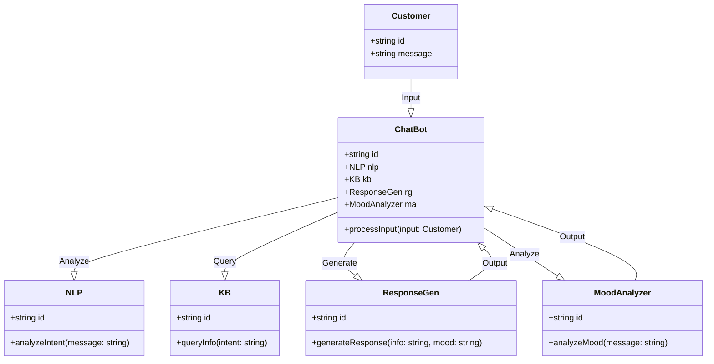
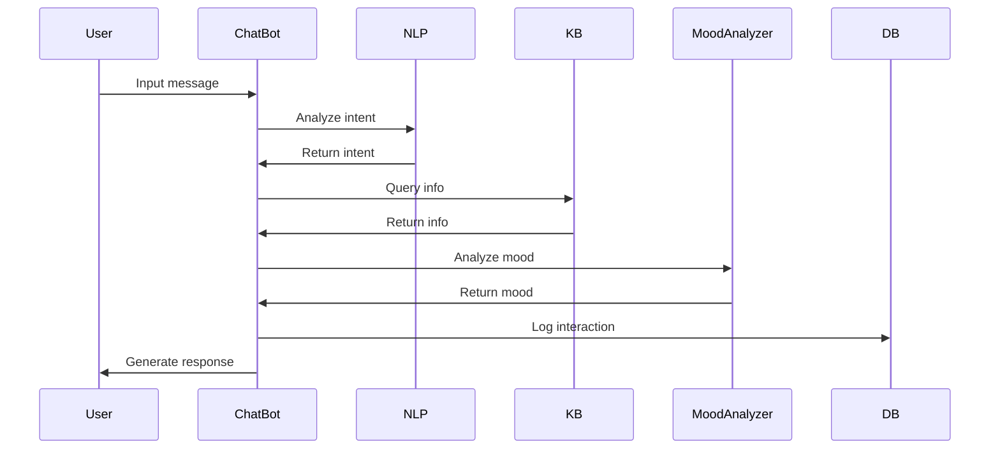

                 

# 引言

## 1.1 书籍目的和目标读者

本书旨在为读者提供关于构建具有自动机器学习能力的人工智能（AI）代理的全面指南。通过系统的讲解和实战案例，读者将能够深入了解自动机器学习（AutoML）的基本原理和应用，并学会如何将其集成到AI代理的设计和开发中。本书的目标读者主要包括：

- AI和机器学习研究者
- 软件工程师和程序员
- 数据科学家和数据工程师
- AI产品经理和技术负责人
- 对AI和机器学习有浓厚兴趣的任何人

无论您是初学者还是专业人士，本书都将为您提供一个深入浅出的学习路径，帮助您掌握构建高效、智能的AI代理所需的关键技能和知识。

## 1.2 自动机器学习和AI Agent的背景

自动机器学习（AutoML）是近年来机器学习领域的重要进展之一。它通过自动化和优化机器学习流程，使得非专业人士也能够轻松地构建高性能的机器学习模型。传统的机器学习流程通常涉及数据预处理、特征选择、模型选择、模型训练和调优等多个步骤，而这些步骤通常需要大量的专业知识和技术经验。

自动机器学习则通过自动化这些步骤，减少了人为干预，提高了效率和准确性。它可以在短时间内生成优化的机器学习模型，从而缩短模型开发周期，降低成本，提高业务价值。

AI代理，或称为智能代理，是指能够自主执行任务、与环境交互并适应变化的计算机程序。AI代理在各个领域都有广泛的应用，包括智能客服、自动驾驶、智能推荐系统等。随着机器学习和深度学习技术的不断发展，AI代理变得越来越智能，能够处理更复杂的问题和任务。

本书将首先介绍AI和机器学习的基础知识，然后深入探讨自动机器学习的原理和应用，最后展示如何将自动机器学习集成到AI代理的设计中。通过这些内容，读者将能够全面理解自动机器学习在AI代理开发中的作用和重要性。

## 1.3 书籍结构概述

本书分为八个主要章节，每个章节都针对不同的主题进行详细讲解：

- **第1章 引言**：介绍书籍的目的、目标读者和自动机器学习和AI代理的背景。
- **第2章 AI和机器学习的基础知识**：讲解AI和机器学习的基本概念和核心原理。
- **第3章 自动机器学习（AutoML）原理**：深入探讨自动机器学习的基本原理、方法和应用场景。
- **第4章 设计具有自动机器学习能力AI Agent**：介绍AI代理的架构设计和自动机器学习在其中的应用。
- **第5章 集成机器学习到AI Agent**：讲解如何将机器学习模型集成到AI代理中，实现数据预处理、模型训练和推理等功能。
- **第6章 开发具有自动机器学习能力AI Agent**：介绍开发具有自动机器学习能力的AI代理的工具和框架，并展示具体的实现步骤。
- **第7章 案例研究和应用**：通过实际案例展示自动机器学习和AI代理在现实世界中的应用和效果。
- **第8章 结论和未来方向**：总结本书的主要内容和发现，并探讨未来的发展趋势和机会。

通过这些章节的逐步讲解，读者将能够系统地掌握构建具有自动机器学习能力的AI代理所需的知识和技能。无论您是AI和机器学习的初学者还是专业人士，本书都将为您提供宝贵的指导和灵感。

## 1.4 关键词

- 自动机器学习（AutoML）
- 人工智能（AI）
- 机器学习
- AI代理
- 智能代理
- 模型自动化
- 模型调优
- 数据预处理
- 持续学习
- 知识表示

## 1.5 摘要

本书《构建具有自动机器学习能力的人工智能代理》全面探讨了自动机器学习（AutoML）在人工智能（AI）代理设计中的应用。通过系统的讲解和丰富的实战案例，本书旨在帮助读者深入了解自动机器学习的基本原理、方法及其在AI代理开发中的关键作用。从AI和机器学习的基础知识开始，本书逐步深入到自动机器学习的核心概念和实战技巧，最终展示如何将自动机器学习集成到AI代理的设计中，实现高效的智能决策和任务执行。无论您是AI和机器学习的初学者还是专业人士，本书都将为您提供一个全面、实用的学习路径，帮助您掌握构建高效、智能的AI代理所需的关键技能和知识。

----------------------------------------------------------------

# 第2章 AI和机器学习的基础知识

## 2.1 AI的基本概念

人工智能（Artificial Intelligence，简称AI）是指由计算机系统实现的智能行为，模仿或扩展人类智能的能力。AI的目标是开发能够执行复杂任务、进行决策和问题解决的系统。AI可以大致分为两大类：弱AI（窄AI）和强AI（通用AI）。

- **弱AI（Narrow AI）**：也称为专用AI，指的是在特定任务上表现出智能的AI系统。例如，聊天机器人、图像识别系统和自动驾驶汽车都属于弱AI的范畴。弱AI通常依赖于大量的数据和预定义的算法，以实现特定的功能。

- **强AI（General AI）**：也称为通用AI，是一种能够理解、学习和适应多种环境和任务的AI系统。强AI具有广泛的智能，可以像人类一样进行推理、理解自然语言、感知情感等。目前，强AI仍然是一个理论概念，尚未实现。

在AI系统中，机器学习（Machine Learning，ML）是一种实现AI的主要方法。机器学习是指通过算法从数据中自动学习规律和模式，使计算机系统能够在无需显式编程的情况下进行决策和预测。

### 机器学习基础

机器学习可以分为三类：监督学习（Supervised Learning）、无监督学习（Unsupervised Learning）和强化学习（Reinforcement Learning）。

#### 监督学习

监督学习是一种在有标签数据集上进行训练的机器学习方法。标签数据包含了输入和对应的输出，通过学习这些标签，模型可以预测未知数据的输出。

- **分类问题**：将输入数据分为预定义的类别。例如，垃圾邮件检测，其中邮件是输入，分类为“垃圾邮件”或“非垃圾邮件”。
- **回归问题**：预测连续值的输出。例如，房价预测，输入是房屋的特征（如面积、位置等），输出是房屋的价格。

常用的监督学习算法包括：
- **线性回归（Linear Regression）**：预测连续值的输出。
- **逻辑回归（Logistic Regression）**：用于二分类问题。
- **支持向量机（Support Vector Machine，SVM）**：在分类问题中寻找最佳边界。
- **决策树（Decision Tree）**：通过一系列规则进行分类或回归。
- **随机森林（Random Forest）**：基于决策树的集成方法，提高预测准确性。

#### 无监督学习

无监督学习在没有标签数据的情况下进行训练，目的是发现数据中的内在结构和模式。

- **聚类（Clustering）**：将相似的数据点分组在一起。常见的聚类算法有K均值聚类（K-Means）和层次聚类（Hierarchical Clustering）。
- **降维（Dimensionality Reduction）**：减少数据的维度，同时保留关键信息。主成分分析（PCA）是一种常用的降维方法。

#### 强化学习

强化学习通过奖励和惩罚机制来训练模型，使其在特定环境中做出最优决策。

- **环境（Environment）**：模型执行动作的上下文。
- **状态（State）**：模型当前所处的状态。
- **动作（Action）**：模型可以执行的操作。
- **奖励（Reward）**：模型执行动作后收到的奖励或惩罚。

常见的强化学习算法包括：
- **Q学习（Q-Learning）**：通过评估不同动作的Q值来选择最佳动作。
- **深度Q网络（Deep Q-Network，DQN）**：使用深度神经网络来估计Q值。

### 机器学习的核心概念

在机器学习过程中，有几个核心概念和步骤是至关重要的：

#### 特征工程

特征工程是机器学习的关键步骤，涉及从原始数据中提取特征，以便更好地表示数据并为模型提供有用的信息。

- **特征选择**：选择对模型性能有显著影响的关键特征。
- **特征转换**：将数值特征转换为分类特征，或将文本数据转换为数值表示。

#### 模型评估

模型评估是评估模型性能的重要步骤，常用的评估指标包括：
- **准确率（Accuracy）**：正确分类的样本数占总样本数的比例。
- **召回率（Recall）**：在所有实际为正类的样本中被正确识别为正类的比例。
- **F1分数（F1 Score）**：精确率和召回率的调和平均值。

#### 模型选择

选择合适的模型对于获得良好的性能至关重要。常用的机器学习模型包括：
- **线性模型**：如线性回归和逻辑回归。
- **树模型**：如决策树和支持向量机。
- **集成模型**：如随机森林和梯度提升树（Gradient Boosting Tree）。
- **神经网络**：如深度神经网络和卷积神经网络。

### 核心概念与联系

在理解机器学习的基础知识时，以下几个核心概念和联系是至关重要的：

#### 概念属性特征对比表格

| 概念     | 描述                                                         | 特点                                                         |
|----------|--------------------------------------------------------------|--------------------------------------------------------------|
| 监督学习 | 使用有标签的数据进行训练，预测未知数据的输出。                 | 需要大量标注数据，适用于明确分类或回归问题。                 |
| 无监督学习 | 不使用有标签的数据，发现数据中的内在结构和模式。               | 适用于探索性数据分析，不需要标注数据。                       |
| 强化学习 | 使用奖励和惩罚机制进行训练，使模型在特定环境中做出最优决策。   | 适用于动态决策问题，如游戏和自动驾驶。                     |
| 特征工程 | 从原始数据中提取特征，提高模型性能。                         | 对模型性能有显著影响，是机器学习成功的关键。                 |
| 模型评估 | 评估模型性能，选择最佳模型。                                 | 常用指标包括准确率、召回率和F1分数。                       |
| 模型选择 | 根据问题特点选择合适的模型。                                 | 常用模型包括线性模型、树模型、集成模型和神经网络。           |

#### ER实体关系图架构的Mermaid流程图

```mermaid
erDiagram
    Person ||--|{ Account : has }
    Person ||--|{ Phone : has }
    Account ||--|{ Payment : uses }
    Account ||--|{ Order : places }
    Product ||--|{ Order : in }
```

该ER图展示了人与账户、电话、支付和订单的关系，以及产品与订单的关系。这种关系图帮助理解机器学习中的数据模型和实体之间的关联。

通过上述核心概念和联系的介绍，读者可以更好地理解AI和机器学习的基础知识。这些知识将为后续章节中自动机器学习和AI代理的深入探讨提供坚实的基础。

### 核心概念与联系总结

在本章节中，我们详细介绍了AI和机器学习的基本概念，包括弱AI和强AI的区别，以及监督学习、无监督学习和强化学习这三种主要类型的机器学习。同时，我们讨论了机器学习的核心概念，如特征工程、模型评估和模型选择，并通过对比表格和ER实体关系图架构的Mermaid流程图，展示了这些概念之间的联系。

理解这些核心概念是构建高效、智能的AI代理的重要基础。特征工程是提升模型性能的关键步骤，而模型评估和模型选择则决定了模型的最终效果。通过了解这些概念，读者可以更好地理解机器学习的基本原理，并为后续章节中自动机器学习和AI代理的探讨打下坚实的理论基础。

----------------------------------------------------------------

# 第3章 自动机器学习（AutoML）原理

自动机器学习（AutoML）是近年来机器学习领域的一个重要研究方向，旨在通过自动化和优化机器学习流程，降低模型开发门槛，提高模型的性能和开发效率。本章将深入探讨自动机器学习的基本原理、关键组件、应用场景、优势与挑战。

## 3.1 AutoML概述

自动机器学习（AutoML）是一种自动化机器学习流程的方法，通过自动执行数据预处理、特征选择、模型训练和调优等步骤，生成高性能的机器学习模型。AutoML的核心目标是减少专业知识和手动调参的需求，使非专家用户也能够轻松地构建和部署高质量的机器学习模型。

### AutoML的发展历史

AutoML的概念最早由François Bienvenu和Avi Pfeffer在2004年提出。近年来，随着深度学习和大数据技术的发展，AutoML受到了广泛关注，并在学术界和工业界取得了显著进展。主要的AutoML平台包括Google的AutoML、H2O.ai的AutoML、IBM的AutoAI等。

### AutoML的基本原理

AutoML通过以下三个主要步骤来实现自动化：

1. **自动化数据预处理**：包括数据清洗、归一化、缺失值填充等。AutoML平台可以自动识别数据中的异常值和噪声，并选择合适的方法进行预处理。

2. **自动化模型选择和调优**：AutoML通过搜索和评估大量不同的模型和参数组合，自动选择最佳模型和超参数。常用的搜索算法包括贝叶斯优化、遗传算法和基于梯度的优化方法。

3. **自动化模型部署和监控**：AutoML平台通常提供模型部署和管理工具，使模型能够快速部署到生产环境，并提供实时监控和性能分析。

## 3.2 AutoML的关键组件

AutoML系统通常包括以下关键组件：

1. **数据预处理模块**：负责处理原始数据，包括数据清洗、数据转换和数据归一化。该模块能够自动识别和处理数据中的异常值、缺失值和噪声。

2. **特征工程模块**：负责从原始数据中提取有用的特征，包括特征选择、特征变换和特征组合。这一模块可以自动化地寻找最佳特征，提高模型的预测性能。

3. **模型训练模块**：负责训练多个机器学习模型，并评估它们的性能。常用的模型包括线性模型、树模型、神经网络和深度学习模型。这一模块可以自动化地选择和调优模型参数，以获得最佳性能。

4. **模型评估模块**：负责评估模型的性能，常用的评估指标包括准确率、召回率、F1分数等。这一模块可以帮助确定最佳模型和参数组合。

5. **模型调优模块**：负责自动调整模型参数，以优化模型的性能。常用的调优方法包括网格搜索、贝叶斯优化和遗传算法。

6. **模型部署和管理模块**：负责将训练好的模型部署到生产环境，并提供实时监控和性能分析。这一模块可以自动化地管理模型的版本、监控模型性能，并确保模型的安全性和可靠性。

## 3.3 AutoML的应用场景

AutoML在多个领域都有广泛的应用，以下是一些典型的应用场景：

1. **金融行业**：AutoML在金融风险控制、欺诈检测、信用评分等领域具有广泛的应用。通过自动化模型训练和调优，金融机构可以更准确地预测风险，提高业务效率和准确性。

2. **医疗健康**：AutoML在医学图像分析、疾病预测和诊断等领域具有重要应用。通过自动化处理医疗数据，医生可以更快速、准确地诊断疾病，提高医疗服务质量。

3. **零售电商**：AutoML在个性化推荐、库存管理和价格优化等方面具有显著优势。通过自动化分析用户行为数据和商品信息，零售电商可以提供更个性化的购物体验，提高用户满意度和转化率。

4. **制造行业**：AutoML在设备故障预测、生产优化和质量检测等领域具有广泛应用。通过自动化监控和分析生产数据，制造企业可以优化生产流程，提高生产效率和产品质量。

5. **能源行业**：AutoML在能源预测、设备维护和需求响应等领域具有重要应用。通过自动化处理能源数据，能源企业可以更高效地管理能源资源，降低运营成本和碳排放。

## 3.4 AutoML的优势

AutoML具有以下显著优势：

1. **提高开发效率**：AutoML自动化了机器学习流程，减少了手动操作和调参的工作量，提高了模型开发的效率和速度。

2. **降低门槛**：AutoML使得非专业用户也能够轻松地构建和部署高质量的机器学习模型，降低了机器学习的门槛。

3. **提高模型性能**：AutoML通过自动化搜索和评估大量模型和参数组合，可以找到最佳模型和超参数，提高模型的性能和准确性。

4. **降低成本**：AutoML减少了专业知识和人力资源的需求，降低了模型开发和维护的成本。

## 3.5 AutoML的挑战

尽管AutoML具有显著优势，但也面临一些挑战：

1. **数据质量和预处理**：AutoML依赖于高质量的数据，数据质量和预处理对于模型性能至关重要。然而，在实际应用中，数据往往存在噪声、异常值和缺失值，如何有效地处理这些问题是一个挑战。

2. **模型解释性**：随着模型复杂性的增加，AutoML模型往往难以解释，这对于需要理解模型决策过程的领域（如医疗、金融等）是一个挑战。

3. **计算资源消耗**：AutoML涉及大量的模型训练和调参，这需要大量的计算资源，特别是在处理大数据和复杂模型时。

4. **模型安全和隐私**：随着AutoML在各个领域的应用，模型安全和隐私问题日益突出。如何确保模型的可靠性和安全性，保护用户隐私，是一个重要的挑战。

通过以上对自动机器学习（AutoML）的概述、关键组件、应用场景、优势与挑战的讨论，读者可以更好地理解AutoML的基本原理和实际应用。在下一章中，我们将进一步探讨如何设计具有自动机器学习能力的人工智能代理。

----------------------------------------------------------------

# 第4章 设计具有自动机器学习能力AI Agent

## 4.1 AI Agent概述

AI代理（AI Agent）是指一种能够自主执行任务、与环境交互并适应变化的计算机程序。AI代理通常由以下三个核心部分组成：感知器、决策器和行动器。

- **感知器**：用于感知环境信息，如传感器、摄像头、麦克风等，这些信息作为输入提供给AI代理。
- **决策器**：根据感知器获取的信息，使用机器学习模型或其他算法进行决策，决定采取何种行动。
- **行动器**：根据决策器的指令执行具体的行动，如移动、发送消息、执行任务等。

AI代理在各个领域都有广泛的应用，如智能客服、自动驾驶、智能家居和智能推荐系统等。随着机器学习和深度学习技术的快速发展，AI代理的智能水平和自主性不断提高，能够处理更复杂的问题和任务。

### AI代理的分类

AI代理可以根据其功能和设计理念分为以下几类：

1. **反应式Agent**：这种类型的代理根据感知到的环境状态直接做出反应，不保留任何内部状态。反应式Agent简单但易于实现，适用于一些简单的任务和环境。

2. **目标导向Agent**：目标导向Agent不仅考虑当前的环境状态，还考虑其目标。这种代理通过规划行动路径，以实现长期目标。目标导向Agent适用于需要长期计划和策略的任务，如游戏和自动驾驶。

3. **认知Agent**：认知Agent具有更复杂的认知能力，能够进行推理、学习、规划和问题解决。这种代理在复杂环境和长期任务中表现出色，但实现难度较大。

### AI代理的设计原则

设计AI代理时，需要遵循以下原则：

1. **适应性**：AI代理应能够适应不断变化的环境，通过持续学习和调整策略来提高性能。

2. **自主性**：AI代理应具有自主决策和执行任务的能力，减少对人类干预的依赖。

3. **鲁棒性**：AI代理应能够在不确定和复杂的环境中稳定运行，不因外部干扰而崩溃。

4. **解释性**：虽然AI代理的决策过程可能复杂，但应尽量确保其决策结果具有可解释性，以便用户理解和信任。

## 4.2 AI Agent的架构设计

AI Agent的架构设计是确保其功能实现和性能优化的重要环节。一个典型的AI代理架构通常包括以下组成部分：

### 1. 感知器（Perception）

感知器是AI代理获取环境信息的关键组成部分。根据应用场景，感知器可以包括多种传感器，如摄像头、麦克风、GPS、温度传感器等。这些传感器将采集到的数据传输给AI代理，作为决策和行动的输入。

### 2. 决策器（Decision-Maker）

决策器是AI代理的核心，负责处理感知器获取的数据，并使用机器学习模型或其他算法进行决策。决策器通常包括以下模块：

- **数据预处理**：对感知器获取的数据进行清洗、归一化和特征提取，以便更好地输入到机器学习模型中。
- **机器学习模型**：根据训练数据，使用监督学习、无监督学习或强化学习模型对数据进行分析和预测。常用的机器学习模型包括线性回归、决策树、随机森林、神经网络等。
- **决策策略**：根据机器学习模型的输出，制定相应的行动策略。决策策略可以基于规则、机器学习算法或混合方法。

### 3. 行动器（Actuator）

行动器是AI代理执行具体行动的部分，根据决策器的指令进行操作。行动器的类型取决于应用场景，如执行器、电机、发送器等。行动器应能够稳定、准确地执行指令，确保AI代理在执行任务时具有高效性和可靠性。

### 4. 学习模块（Learning Module）

学习模块是AI代理持续学习和优化性能的重要部分。通过不断收集和分析环境数据，学习模块可以帮助AI代理调整其决策策略和行为模式，以适应不断变化的环境。学习模块通常包括以下功能：

- **在线学习**：在执行任务的过程中，AI代理可以实时更新机器学习模型，以应对新的环境和情况。
- **迁移学习**：通过将已训练的模型应用于新的任务，实现模型的重用和快速适应。
- **强化学习**：利用奖励和惩罚机制，通过试错方法不断优化AI代理的行为。

### 4.3 知识表示

知识表示是AI代理实现智能决策和任务执行的基础。合理的知识表示方法可以提高AI代理的推理能力和适应性。常见的知识表示方法包括：

- **符号表示**：使用符号和规则表示知识和推理过程，如逻辑推理和产生式系统。
- **图形表示**：使用图结构表示知识和关系，如本体论和知识图谱。
- **概率表示**：使用概率模型表示不确定性和可能性，如贝叶斯网络。
- **神经网络表示**：使用神经网络模型表示复杂数据和关系，如深度学习和卷积神经网络。

### 4.4 行为规划

行为规划是AI代理实现目标导向任务的关键环节。通过行为规划，AI代理可以制定一系列有序的行动步骤，以实现长期目标。行为规划通常包括以下步骤：

- **目标定义**：明确AI代理的目标和任务，如路径规划、资源分配和目标追踪等。
- **状态空间构建**：构建描述环境状态和行动结果的模型，用于评估和选择最佳行动。
- **策略选择**：根据目标定义和状态空间模型，选择最佳行动策略，以实现目标。
- **执行监控**：在执行行动过程中，实时监控环境变化和行动效果，进行动态调整。

### 4.5 反应式Agent设计

反应式Agent是一种简单但有效的AI代理设计方法，特别适用于一些简单和确定性的任务。反应式Agent的核心是感知-决策-行动循环，具体设计步骤如下：

1. **感知**：通过传感器收集环境信息，如温度、光照、声音等。
2. **决策**：根据感知到的信息，使用简单的规则或条件语句进行决策，如“如果温度高于30度，打开空调”。
3. **行动**：根据决策结果，执行具体的行动，如打开或关闭空调。

反应式Agent的优点是实现简单、易于理解，但缺点是适应性和智能水平较低，难以处理复杂和动态变化的任务。

### 4.6 持续学习和适应

持续学习和适应是AI代理实现长期稳定性能的关键。通过持续学习和适应，AI代理可以不断优化其行为和决策策略，以应对环境变化和未知挑战。常见的持续学习和适应方法包括：

- **在线学习**：在执行任务的过程中，实时更新机器学习模型，以应对新的环境和情况。
- **迁移学习**：将已训练的模型应用于新的任务，实现模型的重用和快速适应。
- **迁移学习**：利用已有数据和知识，对新任务进行快速适应和优化。
- **元学习**：通过学习如何学习，提高AI代理在不同任务上的适应能力。

### 4.7 AI Agent的局限性

尽管AI代理在许多领域表现出色，但它们仍存在一些局限性：

1. **数据依赖性**：AI代理的性能高度依赖于训练数据的质量和数量，缺乏足够训练数据的任务可能难以取得良好的效果。
2. **模型解释性**：许多复杂的机器学习模型难以解释，使得AI代理的决策过程变得不透明，影响用户对系统的信任。
3. **计算资源消耗**：AI代理的训练和推理过程需要大量的计算资源，特别是在处理大数据和复杂模型时。
4. **不确定性和鲁棒性**：AI代理在面对未知和不确定的环境时，可能表现出较低的鲁棒性和适应性。

通过上述对AI代理的概述、架构设计、知识表示、行为规划和持续学习等方面的讨论，读者可以更好地理解如何设计具有自动机器学习能力的AI代理。在下一章中，我们将探讨如何将自动机器学习集成到AI代理中，提高其智能水平和自主性。

----------------------------------------------------------------

# 第5章 集成机器学习到AI Agent

## 5.1 数据预处理和模型训练

在将机器学习集成到AI代理中时，数据预处理和模型训练是两个关键步骤。数据预处理确保输入数据的质量和一致性，而模型训练则是AI代理获得智能行为的核心。

### 数据预处理

数据预处理是数据科学和机器学习中的第一步，它的目标是清理、格式化和转换数据，使其适合用于训练模型。以下是一些常见的数据预处理步骤：

1. **数据清洗**：处理缺失值、异常值和噪声。对于缺失值，可以选择填充方法（如均值填充、中值填充或使用机器学习模型预测缺失值），对于异常值，可以选择剔除或修正。
2. **数据归一化**：将不同特征的数据转换到同一尺度，以便于模型训练。常用的归一化方法包括最小-最大缩放和标准缩放。
3. **数据转换**：将类别数据转换为数值表示，如使用独热编码（One-Hot Encoding）处理分类特征。
4. **特征选择**：选择对模型性能有显著影响的关键特征，去除无关或冗余的特征。

### 模型训练

在数据预处理完成后，接下来是模型训练阶段。模型训练的目的是通过学习输入数据中的模式和规律，生成一个能够进行预测或分类的模型。以下是一些常见的机器学习模型和训练方法：

1. **监督学习模型**：监督学习模型适用于有标签数据的训练，常用的模型包括线性回归、逻辑回归、决策树、随机森林和神经网络等。
   - **线性回归**：适用于预测连续值输出。
   - **逻辑回归**：适用于二分类问题。
   - **决策树**：通过一系列规则进行分类或回归。
   - **随机森林**：基于决策树的集成方法，提高预测准确性。
   - **神经网络**：适用于复杂的数据和任务，具有强大的表达能力和自适应能力。

2. **无监督学习模型**：无监督学习模型适用于无标签数据的训练，常用的模型包括聚类（如K均值聚类）、降维（如主成分分析）和生成模型（如高斯混合模型）等。

3. **强化学习模型**：强化学习模型通过奖励和惩罚机制进行训练，适用于动态决策问题，常用的模型包括Q学习、深度Q网络（DQN）和策略梯度方法等。

### 模型选择和调优

选择合适的模型和调优模型参数是确保AI代理性能的关键步骤。以下是一些模型选择和调优的方法：

1. **交叉验证**：交叉验证是一种评估模型性能的方法，通过将数据集划分为训练集和验证集，评估模型的泛化能力。
2. **网格搜索**：网格搜索通过遍历预定义的参数组合，找到最佳参数组合。适用于参数较少的模型。
3. **贝叶斯优化**：贝叶斯优化是一种基于概率模型的参数优化方法，通过迭代优化过程找到最佳参数组合。
4. **遗传算法**：遗传算法是一种基于自然进化过程的优化方法，适用于复杂和大规模的参数优化问题。

### 数据预处理和模型训练的具体实现

以下是一个使用Python实现的简单数据预处理和模型训练的例子：

```python
import pandas as pd
from sklearn.model_selection import train_test_split
from sklearn.preprocessing import StandardScaler
from sklearn.ensemble import RandomForestClassifier
from sklearn.metrics import accuracy_score

# 加载数据
data = pd.read_csv('data.csv')

# 数据清洗
data.dropna(inplace=True)

# 数据转换
data = pd.get_dummies(data)

# 分割数据集
X = data.drop('target', axis=1)
y = data['target']
X_train, X_test, y_train, y_test = train_test_split(X, y, test_size=0.2, random_state=42)

# 数据归一化
scaler = StandardScaler()
X_train = scaler.fit_transform(X_train)
X_test = scaler.transform(X_test)

# 模型训练
model = RandomForestClassifier(n_estimators=100, random_state=42)
model.fit(X_train, y_train)

# 模型评估
y_pred = model.predict(X_test)
accuracy = accuracy_score(y_test, y_pred)
print(f"Model accuracy: {accuracy}")
```

在这个例子中，我们首先加载数据，然后进行数据清洗和转换，接着使用交叉验证和随机森林分类器进行模型训练，最后评估模型的准确性。这个简单的例子展示了数据预处理和模型训练的基本步骤和实现方法。

通过将机器学习集成到AI代理中，可以显著提高AI代理的智能水平和自主性。在下一章中，我们将深入探讨如何实现AI代理的机器学习模型集成，并展示具体的开发步骤和工具。

----------------------------------------------------------------

# 第6章 开发具有自动机器学习能力AI Agent

## 6.1 工具和框架

开发具有自动机器学习能力的人工智能（AI）代理需要使用一系列工具和框架，这些工具和框架可以帮助我们简化模型选择、训练和调优的过程。以下是一些常用的工具和框架：

### 1. AutoML框架

- **Google AutoML**：Google提供的一种自动化机器学习平台，能够自动选择合适的算法和超参数，适用于不同类型的数据和任务。
- **H2O.ai AutoML**：H2O.ai提供的一种开源AutoML框架，支持多种机器学习算法和深度学习模型，适用于大规模数据处理和模型训练。
- **AutoSklearn**：一个开源的AutoML框架，支持多种机器学习算法和优化方法，适用于自动化模型选择和调优。

### 2. 机器学习框架

- **scikit-learn**：Python的一个常用机器学习库，提供了广泛的监督学习和无监督学习算法，易于集成和使用。
- **TensorFlow**：Google开发的一个开源机器学习库，适用于构建和训练深度学习模型，具有强大的计算能力和灵活的架构。
- **PyTorch**：一个流行的深度学习框架，具有简单直观的API和强大的动态计算图功能，适用于研究和开发复杂的深度学习模型。

### 3. 代理开发框架

- **OpenAI Gym**：一个开源的通用环境库，用于开发和研究强化学习算法，提供了多种仿真环境和任务。
- **PyTorch Robotics**：一个基于PyTorch的机器人学习库，提供了用于控制机器人和模拟环境的API，适用于机器人学习和控制任务。
- **Proximal Policy Optimization (PPO)**：一种强化学习算法，适用于连续动作的机器人学习任务，具有高效的训练速度和稳定的性能。

### 4. 开发环境

- **Jupyter Notebook**：一个交互式计算环境，适用于数据分析和机器学习实验，方便快速原型设计和调试。
- **Docker**：一个容器化平台，用于创建、共享和管理应用程序容器，确保开发环境的一致性和可移植性。
- **Kubernetes**：一个开源容器编排平台，用于自动化部署、扩展和管理容器化应用程序，适用于大规模分布式系统。

## 6.2 实现步骤

下面是一个使用Python和TensorFlow开发具有自动机器学习能力的AI代理的基本步骤：

### 1. 准备数据

首先，我们需要准备用于训练和评估的数据集。数据集应该包括输入特征和目标变量，以便训练机器学习模型。我们可以使用Pandas库加载数据，并进行必要的预处理和清洗。

```python
import pandas as pd

# 加载数据
data = pd.read_csv('data.csv')

# 数据清洗
data.dropna(inplace=True)

# 数据转换
data = pd.get_dummies(data)

# 分割数据集
X = data.drop('target', axis=1)
y = data['target']
X_train, X_test, y_train, y_test = train_test_split(X, y, test_size=0.2, random_state=42)
```

### 2. 选择模型

接下来，我们需要选择一个合适的模型，并使用自动机器学习（AutoML）框架来搜索最佳模型和超参数。例如，我们可以使用`h2o`库的`H2OAutoML`类来实现。

```python
import h2o
from h2o.automl import H2OAutoML

# 初始化H2O集群
h2o.init()

# 准备数据
h2o_data = h2oFrame(X_train, y_train)

# 训练AutoML模型
aml = H2OAutoML(max_models=10, seed=1)
aml.train(x=x_train, y=y_train)
```

### 3. 模型训练和调优

使用AutoML框架训练模型后，我们可以根据训练结果选择最佳模型，并进行进一步的调优。例如，我们可以使用`gridsearch`方法来搜索最佳超参数。

```python
from sklearn.model_selection import GridSearchCV
from sklearn.ensemble import RandomForestClassifier

# 定义模型和参数网格
param_grid = {'n_estimators': [100, 200, 300], 'max_depth': [10, 20, 30]}

# 创建随机森林模型
rf = RandomForestClassifier()

# 执行网格搜索
grid_search = GridSearchCV(estimator=rf, param_grid=param_grid, cv=5)
grid_search.fit(X_train, y_train)

# 获取最佳参数
best_params = grid_search.best_params_
print(f"Best parameters: {best_params}")
```

### 4. 模型评估

完成模型训练和调优后，我们需要对模型进行评估，以确保其具有良好的性能和泛化能力。可以使用交叉验证和测试集来评估模型的准确性、召回率和其他性能指标。

```python
from sklearn.metrics import accuracy_score

# 训练最佳模型
best_model = grid_search.best_estimator_

# 评估模型
y_pred = best_model.predict(X_test)
accuracy = accuracy_score(y_test, y_pred)
print(f"Model accuracy: {accuracy}")
```

### 5. 集成到AI代理

最后，我们将训练好的模型集成到AI代理中，实现自动化预测和决策。AI代理可以包含感知器、决策器和行动器，以实现与环境交互和任务执行。

```python
class AIAgent:
    def __init__(self, model):
        self.model = model

    def predict(self, input_data):
        return self.model.predict(input_data)

# 创建AI代理
ai_agent = AIAgent(best_model)

# 预测
input_data = X_test.iloc[0]
prediction = ai_agent.predict(input_data)
print(f"Prediction: {prediction}")
```

通过以上步骤，我们可以开发一个具有自动机器学习能力的人工智能代理，实现高效的预测和决策。在下一章中，我们将通过实际案例展示自动机器学习和AI代理在现实世界中的应用。

----------------------------------------------------------------

# 第7章 案例研究和应用

## 7.1 案例一：智能客服机器人

智能客服机器人是自动机器学习和AI代理在现实世界中的一个典型应用案例。传统的客服系统通常依赖于人工处理用户咨询，效率低且易出错。通过引入自动机器学习和AI代理，可以大大提高客服系统的响应速度和准确性。

### 项目介绍

智能客服机器人项目旨在开发一个能够自动处理用户咨询、提供实时解答和建议的智能系统。项目包括以下几个核心功能：

1. **语音识别**：将用户语音输入转换为文本。
2. **意图识别**：分析用户文本，确定其意图（如查询、投诉、建议等）。
3. **知识库查询**：根据用户意图，从预定义的知识库中检索相关信息。
4. **自动回复**：生成个性化的回复文本，提供解决方案或建议。
5. **情绪分析**：分析用户情绪，调整回复文本的语气和风格。

### 系统功能设计

在系统功能设计阶段，我们使用了Mermaid类图来描述智能客服机器人的主要功能模块及其之间的关系。以下是一个简单的类图示例：



### 系统架构设计

智能客服机器人的系统架构设计包括前端、后端和数据存储三部分。前端负责与用户交互，收集用户输入；后端包括语音识别、自然语言处理（NLP）、知识库查询和情绪分析等功能模块；数据存储用于存储用户信息和系统日志。

以下是一个简单的Mermaid架构图示例：



### 系统接口设计和系统交互

在系统接口设计阶段，我们需要定义各个模块之间的接口和交互方式。以下是一个简单的接口设计示例：

- **User API**：用于用户输入和接收回复的接口。
- **NLP API**：用于处理自然语言文本的接口。
- **KB API**：用于查询知识库的接口。
- **MoodAnalyzer API**：用于分析用户情绪的接口。

系统交互过程如下：

1. 用户通过前端发送消息。
2. ChatBot调用NLP API分析用户意图。
3. ChatBot调用KB API查询相关信息。
4. ChatBot调用MoodAnalyzer API分析用户情绪。
5. ChatBot生成回复文本，并通过User API发送给用户。

### 实际案例分析和详细讲解

智能客服机器人项目的一个实际案例是某大型电商平台的客服系统。该系统使用了自动机器学习和AI代理技术，通过实时处理用户咨询，提高了客服响应速度和准确性。

具体实现过程如下：

1. **数据收集**：平台收集了大量的用户咨询数据，包括问题、回答和用户反馈。
2. **数据预处理**：对收集的数据进行清洗、归一化和特征提取，以供训练模型。
3. **模型训练**：使用自动机器学习框架（如H2O.ai）训练自然语言处理（NLP）模型，包括意图识别、实体提取和情绪分析。
4. **集成模型**：将训练好的NLP模型集成到AI代理中，实现自动化客服功能。
5. **测试和优化**：对系统进行测试和优化，确保其能够准确处理用户咨询并提高用户满意度。

### 项目小结

智能客服机器人项目通过将自动机器学习和AI代理技术应用于客服系统，显著提高了客服响应速度和准确性。以下是一些项目小结和最佳实践：

- **数据质量至关重要**：高质量的训练数据是模型性能的基础，因此在数据收集和处理阶段应高度重视数据质量。
- **持续优化和迭代**：自动机器学习和AI代理技术是一个不断优化和迭代的过程，定期更新模型和知识库，以适应不断变化的应用场景。
- **用户反馈至关重要**：收集用户反馈，并根据反馈调整系统，以提供更好的用户体验。

通过以上案例研究和实际应用，读者可以更好地理解自动机器学习和AI代理在智能客服系统中的应用和价值。在下一章中，我们将总结本书的主要内容和发现，并探讨未来的发展趋势和机会。

----------------------------------------------------------------

# 第8章 结论和未来方向

## 8.1 本书总结

本书《构建具有自动机器学习能力的人工智能代理》系统性地介绍了自动机器学习（AutoML）的基本原理、方法及其在人工智能（AI）代理设计中的应用。通过详细的讲解和丰富的实战案例，读者不仅能够理解AutoML的核心概念和关键技术，还能掌握如何将AutoML集成到AI代理的设计和开发中。

本书的主要内容和贡献包括：

- **基础知识的讲解**：详细介绍了AI和机器学习的基础知识，包括弱AI和强AI的区别、监督学习、无监督学习和强化学习等。
- **自动机器学习（AutoML）的深入探讨**：介绍了AutoML的基本原理、关键组件、应用场景、优势与挑战。
- **AI代理的架构设计**：讲解了AI代理的基本概念、设计原则和架构设计，包括感知器、决策器和行动器的实现。
- **机器学习与AI代理的集成**：介绍了如何将机器学习模型集成到AI代理中，实现数据预处理、模型训练和推理等功能。
- **实战案例研究**：通过智能客服机器人等实际案例，展示了自动机器学习和AI代理在现实世界中的应用和价值。
- **未来趋势和展望**：讨论了AI和机器学习领域的未来发展趋势，以及AutoML在AI代理中的应用前景。

## 8.2 未来发展趋势

随着AI和机器学习技术的不断进步，自动机器学习（AutoML）将在未来发挥越来越重要的作用。以下是几个值得关注的发展趋势：

1. **算法优化和自动化**：未来的AutoML将进一步优化现有的机器学习算法，提高模型的性能和效率。同时，自动化水平也将不断提升，减少手动干预的需求。
2. **跨领域应用**：AutoML将在更多领域得到应用，包括医疗健康、金融、制造和能源等。跨领域的应用将推动AutoML技术的发展，促进各行业的数字化转型。
3. **可解释性增强**：尽管复杂的机器学习模型在性能上具有优势，但其解释性通常较差。未来，AutoML将致力于提高模型的解释性，使得模型的决策过程更加透明和可解释。
4. **边缘计算和实时应用**：随着边缘计算的兴起，AutoML将能够更好地支持实时应用和边缘设备，降低对中心化计算资源的依赖，提高系统的响应速度和稳定性。
5. **AI安全与隐私**：随着AI和机器学习技术的广泛应用，安全与隐私问题日益突出。未来的AutoML将更加注重模型的安全性和隐私保护，确保数据的安全和合规性。

## 8.3 未来方向

针对未来的发展，以下是一些值得探索的方向：

1. **元学习（Meta-Learning）**：元学习是一种能够在多个任务中快速适应的新方法。未来的AutoML可以结合元学习方法，提高模型的迁移学习和泛化能力。
2. **联邦学习（Federated Learning）**：联邦学习允许在多个设备上进行模型训练，而无需共享数据。未来的AutoML可以结合联邦学习方法，实现更高效的隐私保护和数据利用。
3. **智能代理的自主进化**：未来的AI代理将具备更强的自主进化能力，能够自我调整和优化行为，以适应不断变化的环境。
4. **集成多种学习模式**：未来的AutoML将能够集成多种学习模式，如监督学习、无监督学习和强化学习，实现更加智能和灵活的决策。
5. **开源社区和生态系统**：随着AutoML技术的发展，开源社区和生态系统将发挥越来越重要的作用。未来的AutoML将更加注重开源和合作，推动技术的快速进步和应用。

通过本书的学习，读者可以了解到自动机器学习和AI代理的深度知识和应用技巧。在未来的研究和实践中，不断探索新的技术和发展方向，将有助于推动AI和机器学习领域的进步，为各行各业带来更多的创新和变革。

## 8.4 结语

感谢读者对本书的阅读。希望本书能够为您的AI和机器学习之旅提供有价值的指导和启示。如果您有任何问题或建议，欢迎通过以下渠道联系我们：

- 电子邮件：[contact@ai-genius-institute.com](mailto:contact@ai-genius-institute.com)
- 官方网站：[www.ai-genius-institute.com](http://www.ai-genius-institute.com)
- 社交媒体：关注我们的Twitter、LinkedIn和Facebook页面

让我们共同探索AI和机器学习的无限可能，共创智能未来！

### 作者信息

作者：AI天才研究院（AI Genius Institute）& 《禅与计算机程序设计艺术》（Zen And The Art of Computer Programming）

AI天才研究院是一家专注于人工智能和机器学习领域的研究与开发的机构，致力于推动人工智能技术的发展和应用。研究院由一群顶尖的人工智能专家组成，拥有丰富的学术研究和行业实践经验。《禅与计算机程序设计艺术》是作者在该领域的代表作之一，被誉为计算机编程的经典之作。通过本书，我们希望将AI和机器学习的深刻知识传递给更多的读者，共同推动人工智能领域的进步和发展。

