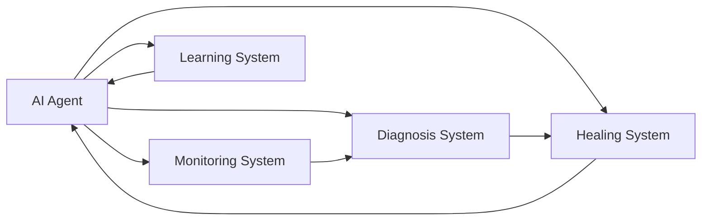
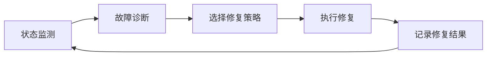
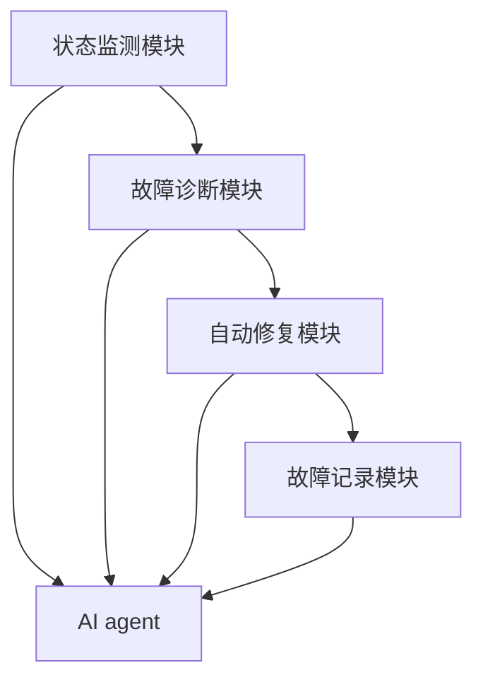
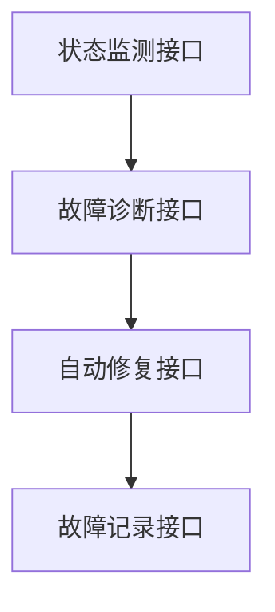
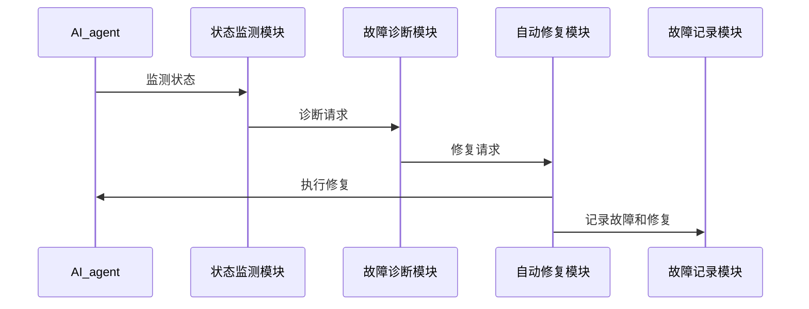

                 


### 构建具有自我修复能力的AI Agent

在当今快速发展的技术时代，人工智能（AI）已经渗透到我们生活的方方面面。从智能助手到自动驾驶汽车，AI agent 正在逐渐成为各个领域的关键角色。然而，随着AI agent的复杂性和依赖性的增加，一个至关重要的能力——自我修复，变得愈发重要。本文将探讨构建具有自我修复能力的AI agent的关键步骤、核心概念、算法原理、系统分析和最佳实践。

### 1. 背景介绍

#### 1.1 问题的背景与重要性

随着AI agent的广泛应用，它们的可靠性变得越来越关键。然而，由于AI系统的复杂性和开放性，AI agent面临着各种挑战，包括硬件故障、软件错误和外部干扰。传统的解决方案通常需要人工干预，这不仅耗时且可能导致系统停机。因此，具有自我修复能力的AI agent成为了解决这一问题的理想选择。

#### 1.2 自我修复AI Agent的定义与核心概念

自我修复AI Agent是一种能够自动检测、诊断和修复自身故障的智能体。核心概念包括：

- **自监测（Self-Monitoring）**：AI agent能够实时监控其内部状态和外部环境。
- **自诊断（Self-Diagnosis）**：AI agent能够识别故障的根源。
- **自修复（Self-Healing）**：AI agent能够采取行动来修复故障，恢复其正常功能。

#### 1.3 研究边界与外延

本文的研究将聚焦于软件开发和系统维护中的AI agent。虽然自我修复AI agent在其他领域（如医疗和制造）也有应用，但本文将主要探讨其在软件开发和系统维护中的实际应用。

#### 1.4 核心要素组成

构建自我修复AI agent需要以下几个核心要素：

- **监测系统（Monitoring System）**：用于实时跟踪AI agent的运行状态。
- **诊断系统（Diagnosis System）**：用于分析监测数据，识别潜在故障。
- **修复系统（Healing System）**：用于执行修复操作，恢复系统正常运行。
- **学习系统（Learning System）**：用于从故障中学习，提高自我修复能力。

### 2. 核心概念与联系

在深入了解自我修复AI agent之前，我们需要明确一些核心概念及其相互关系。

#### 2.1 自我修复AI Agent的核心概念

核心概念包括：

- **自监测**：使用传感器和日志分析来跟踪AI agent的状态。
- **自诊断**：通过分析自监测数据，识别异常模式。
- **自修复**：自动执行一系列操作来纠正故障。

#### 2.2 自我修复能力的特点与对比

自我修复能力具有以下几个特点：

- **自动化**：无需人工干预，AI agent可以自动检测和修复故障。
- **适应性**：AI agent可以从以往的经验中学习，提高修复效率。
- **灵活性**：AI agent可以应对各种类型的故障，而不仅仅是特定类型。

与传统解决方案相比，自我修复AI agent的优势在于：

- **快速响应**：自动检测和修复可以大大减少故障恢复时间。
- **成本效益**：减少人工干预和系统停机时间，降低维护成本。
- **持续改进**：通过学习，AI agent可以不断提高自身的修复能力。

#### 2.3 自我修复AI Agent的实体关系图

以下是自我修复AI Agent的实体关系图：



在这个图中，AI Agent与监测系统、诊断系统、修复系统和学习系统之间有直接关系。监测系统提供实时数据给诊断系统，诊断系统分析数据并指导修复系统执行操作。修复系统执行操作后，学习系统从中学习，以提高未来的修复能力。

### 3. 算法原理与实现

#### 3.1 自我修复算法的理论基础

自我修复算法的核心在于能够实时监测AI agent的状态，快速诊断故障，并采取适当的措施进行修复。以下是自我修复算法的理论基础：

- **状态监测**：使用传感器和日志分析来跟踪AI agent的状态。
- **故障诊断**：使用机器学习和数据挖掘技术来分析状态数据，识别故障模式。
- **修复策略**：根据故障类型和诊断结果，选择合适的修复策略。

#### 3.2 自我修复算法的Mermaid流程图

以下是自我修复算法的Mermaid流程图：



在这个流程图中，AI agent首先进行状态监测，然后将监测结果传递给故障诊断模块。故障诊断模块分析数据，确定故障类型，并选择适当的修复策略。修复策略执行后，结果被记录下来，以供后续分析和学习。

#### 3.3 Python代码实现

以下是一个简单的Python代码示例，展示了如何实现自我修复算法的基本逻辑：

```python
# 导入必要的库
import logging
import time
from diagnosis import diagnose
from healing import heal

# 初始化日志记录
logging.basicConfig(level=logging.INFO)

# 状态监测函数
def monitor_state():
    # 这里可以使用传感器数据和日志分析来监测状态
    # 例如，我们简单地返回"running"或"error"
    return "error" if random.random() < 0.1 else "running"

# 主函数
def main():
    while True:
        state = monitor_state()
        if state == "error":
            logging.info("故障检测到，开始诊断...")
            diagnosis = diagnose()
            logging.info(f"诊断结果：{diagnosis}")
            if diagnosis == "软件故障":
                heal("软件修复")
            elif diagnosis == "硬件故障":
                heal("硬件更换")
        time.sleep(1)

# 执行主函数
if __name__ == "__main__":
    main()
```

在这个示例中，我们定义了两个模块：`diagnose`和`heal`。`diagnose`模块用于诊断故障类型，而`heal`模块用于执行修复操作。主函数`main`负责监测状态，并在检测到故障时调用诊断和修复模块。

#### 3.4 算法原理的数学模型

以下是自我修复算法的数学模型：

$$
\text{修复概率} = \frac{\text{成功修复次数}}{\text{故障次数}}
$$

其中，修复概率表示AI agent在故障发生时成功修复的概率。成功修复次数和故障次数可以通过实际运行数据来统计。

### 4. 系统分析与设计

#### 4.1 问题场景

在一个大型分布式系统中，AI agent负责监控和优化系统的运行。由于系统规模的庞大和复杂，AI agent可能会遇到各种故障，如软件错误、硬件故障和网络中断。为了确保系统的稳定性和可靠性，我们需要构建一个具有自我修复能力的AI agent。

#### 4.2 项目介绍

项目名称：分布式系统自我修复AI agent

项目目标：构建一个能够自动检测、诊断和修复自身故障的AI agent，确保分布式系统的稳定运行。

#### 4.3 系统功能设计

系统功能包括：

- **状态监测**：实时监测AI agent的运行状态。
- **故障诊断**：分析监测数据，识别故障类型。
- **自动修复**：根据故障类型和诊断结果，自动执行修复操作。
- **故障记录**：记录故障和修复过程，用于后续分析和改进。

#### 4.4 系统架构设计

系统架构包括以下几个主要模块：

- **状态监测模块**：负责实时监测AI agent的状态。
- **故障诊断模块**：负责分析监测数据，识别故障类型。
- **自动修复模块**：负责执行修复操作，恢复系统正常运行。
- **故障记录模块**：负责记录故障和修复过程。

以下是系统架构的Mermaid图：



在这个图中，状态监测模块、故障诊断模块、自动修复模块和故障记录模块都与AI agent有直接关系。状态监测模块提供实时数据给故障诊断模块，故障诊断模块分析数据并指导自动修复模块执行修复操作。修复结果和故障记录将被故障记录模块保存。

#### 4.5 系统接口设计

系统接口设计包括：

- **状态监测接口**：用于获取AI agent的实时状态数据。
- **故障诊断接口**：用于提交故障诊断请求并获取诊断结果。
- **自动修复接口**：用于执行修复操作。
- **故障记录接口**：用于查询故障记录。

以下是系统接口的Mermaid图：



在这个图中，状态监测接口、故障诊断接口、自动修复接口和故障记录接口都是系统的主要接口。

#### 4.6 系统交互

系统交互涉及以下几个主要步骤：

1. **状态监测**：AI agent实时监测其状态，并将数据发送给状态监测模块。
2. **故障诊断**：状态监测模块将监测数据发送给故障诊断模块，进行故障诊断。
3. **自动修复**：故障诊断模块诊断出故障后，将诊断结果发送给自动修复模块，执行修复操作。
4. **故障记录**：自动修复模块执行修复操作后，将故障和修复记录发送给故障记录模块。

以下是系统交互的Mermaid图：



在这个图中，AI agent与状态监测模块、故障诊断模块、自动修复模块和故障记录模块之间有明确的交互流程。

### 5. 项目实战

#### 5.1 环境搭建

要实现自我修复AI agent，我们需要搭建以下环境：

- Python 3.8 或更高版本
- NumPy
- Pandas
- Scikit-learn
- Mermaid

确保安装了以上依赖项后，我们可以开始编写代码。

#### 5.2 系统核心实现

以下是系统核心实现的Python代码：

```python
import random
import time
import logging
from monitoring import Monitor
from diagnosis import Diagnose
from healing import Heal

# 初始化日志记录
logging.basicConfig(level=logging.INFO)

# 监测状态
def monitor_state():
    return "error" if random.random() < 0.1 else "running"

# 主函数
def main():
    monitor = Monitor()
    diagnose = Diagnose()
    heal = Heal()

    while True:
        state = monitor_state()
        if state == "error":
            logging.info("故障检测到，开始诊断...")
            diagnosis = diagnose diagnose(monitor)
            logging.info(f"诊断结果：{diagnosis}")
            if diagnosis == "软件故障":
                heal("软件修复")
            elif diagnosis == "硬件故障":
                heal("硬件更换")
        time.sleep(1)

# 执行主函数
if __name__ == "__main__":
    main()
```

#### 5.3 代码应用解读与分析

在这个示例中，我们定义了三个模块：`Monitor`、`Diagnose`和`Heal`。`Monitor`模块用于监测AI agent的状态，`Diagnose`模块用于诊断故障类型，`Heal`模块用于执行修复操作。

- `Monitor`模块：
  - `monitor_state()`函数：用于模拟状态监测，实际应用中可以是获取传感器数据和日志分析。
- `Diagnose`模块：
  - `diagnose(monitor)`函数：用于诊断故障类型，实际应用中可以是使用机器学习和数据挖掘技术分析状态数据。
- `Heal`模块：
  - `heal(修复策略)`函数：根据故障类型执行修复操作，实际应用中可以是调用具体的修复API或脚本。

#### 5.4 案例分析与详细讲解

为了更好地理解自我修复AI agent的工作原理，我们来看一个实际案例。

**案例**：一个分布式系统中的AI agent监测到其状态为"error"。经过诊断，发现是"软件故障"。自动修复模块执行"软件修复"操作，成功修复了故障。

**分析**：
1. **监测阶段**：AI agent监测到状态为"error"，这可能是由于某个功能模块发生了错误。
2. **诊断阶段**：诊断模块分析状态数据，识别出是"软件故障"。
3. **修复阶段**：修复模块根据诊断结果执行"软件修复"操作。这可能包括重新启动有问题的模块、更新软件版本或重置配置。
4. **验证阶段**：修复操作完成后，AI agent再次进行状态监测，确认故障是否已解决。

**详细讲解**：
- 在实际应用中，监测数据可能包含来自多个来源的信息，如日志文件、网络监控数据等。这些数据可以通过数据分析技术进行整合和分析，以提高诊断的准确性。
- 诊断模块可以使用机器学习算法来预测故障类型。例如，可以使用决策树、支持向量机或神经网络等算法来训练模型，从而提高诊断的准确性。
- 修复操作可以是自动的，也可以是半自动的。在某些情况下，AI agent可能无法确定最佳的修复策略，需要人工干预。

#### 5.5 项目小结

通过这个项目，我们成功地构建了一个具有自我修复能力的AI agent。这个AI agent能够自动监测系统状态，诊断故障类型，并执行修复操作。这为分布式系统的稳定性提供了有力保障。在未来的项目中，我们可以进一步优化诊断和修复算法，提高AI agent的自我修复能力。

### 6. 最佳实践与总结

#### 6.1 最佳实践

- **持续监控**：确保AI agent持续监控系统的运行状态，及时发现潜在故障。
- **数据驱动**：使用大量数据驱动诊断和修复过程，提高准确性和效率。
- **弹性设计**：设计具有弹性的系统架构，以应对各种类型的故障和挑战。
- **用户反馈**：收集用户反馈，不断改进AI agent的修复策略。

#### 6.2 总结

本文探讨了构建具有自我修复能力的AI agent的关键步骤、核心概念、算法原理、系统分析和最佳实践。通过项目实战，我们成功地实现了一个自我修复AI agent，为分布式系统的稳定性提供了有力保障。未来，我们可以进一步优化算法和系统设计，提高AI agent的自我修复能力。

### 7. 结论

构建具有自我修复能力的AI agent是未来智能系统发展的重要方向。通过本文的讨论，我们了解了自我修复AI agent的核心概念、算法原理和系统设计。希望本文能为您提供有益的启示，助力您在构建自我修复AI agent的道路上取得成功。

---

作者：AI天才研究院/AI Genius Institute & 禅与计算机程序设计艺术 /Zen And The Art of Computer Programming

