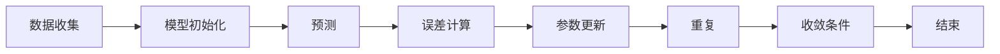
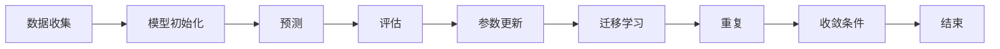
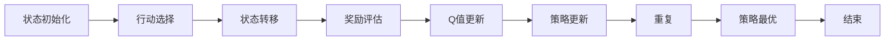
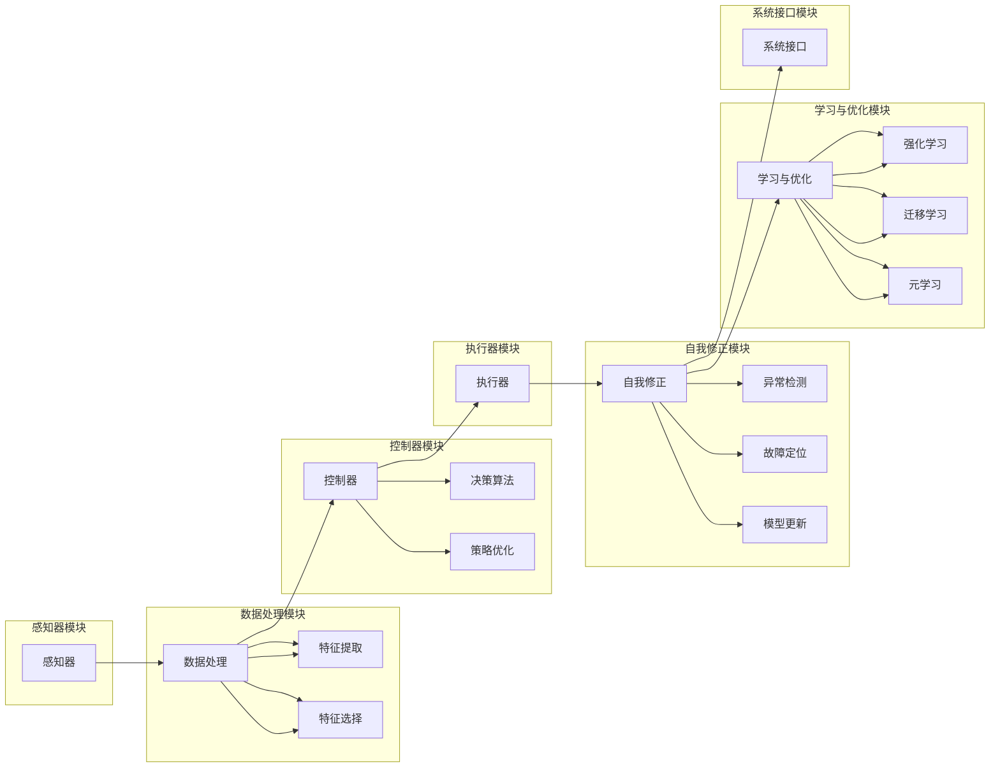
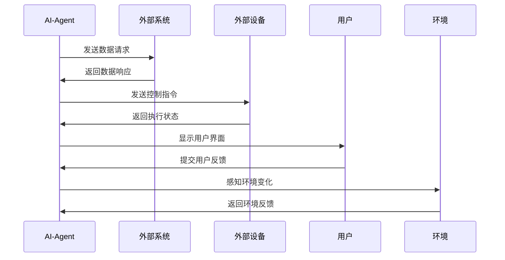
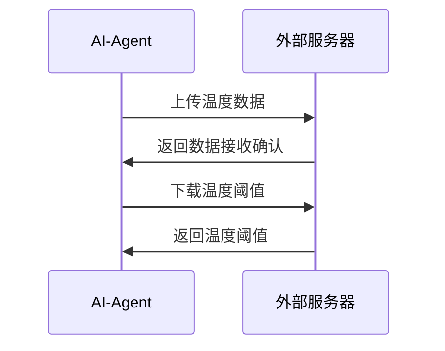
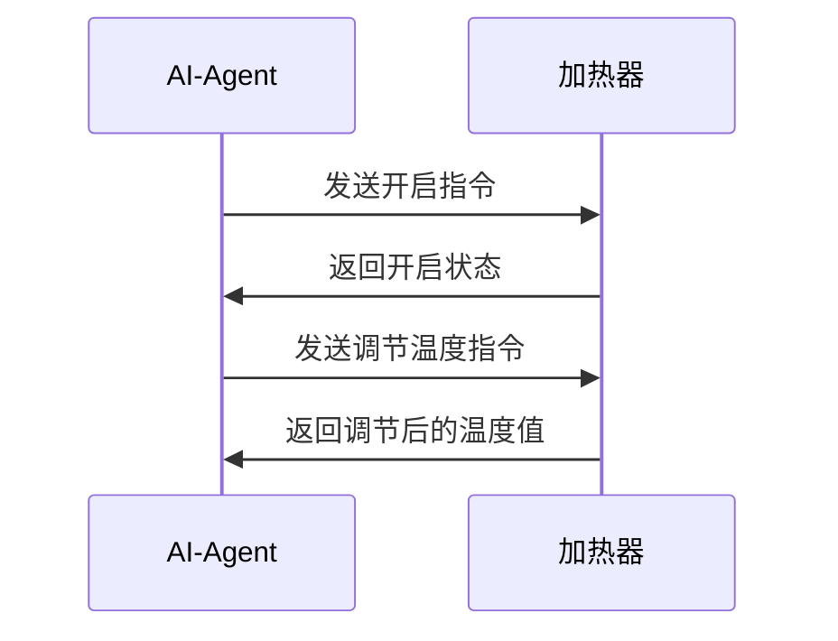
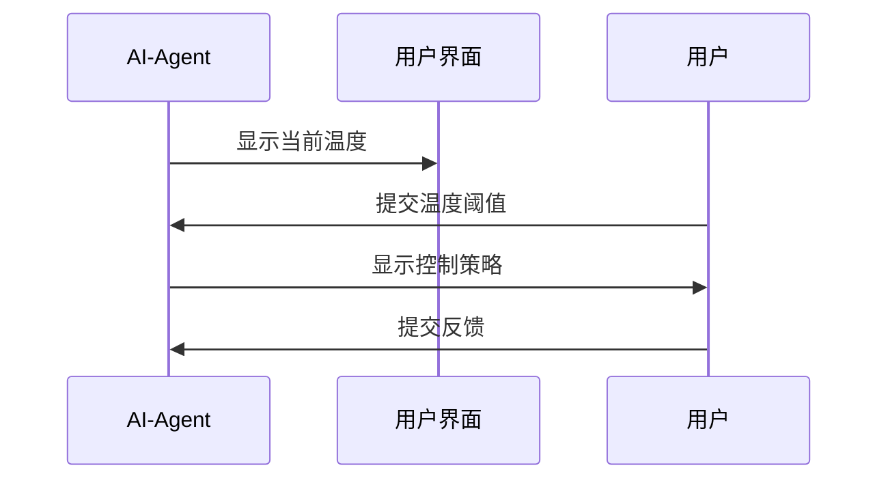

                 


## 构建具有自我修正能力的AI Agent

### 摘要

本文将深入探讨如何构建具有自我修正能力的AI Agent，旨在帮助读者理解AI Agent的核心概念、自我修正机制、数学模型与算法原理，并最终实现其在实际项目中的应用。文章将分为五个主要部分：背景介绍、核心概念与联系、算法原理讲解、系统分析与架构设计以及项目实战。通过逐步分析推理，本文将引导读者掌握AI Agent构建的全过程，并提供实际案例以加深理解。

### 目录大纲设计思路

在设计本文的目录大纲时，我们遵循了以下原则：

1. **整体框架设计**：文章整体分为五部分，分别对应背景介绍、核心概念与联系、算法原理讲解、系统分析与架构设计以及项目实战，确保内容的连贯性和完整性。

2. **细化章节内容**：每个部分内部进一步细化为多个小节，确保读者可以快速找到感兴趣的内容。

3. **确保内容完整性**：每个小节都包含了核心概念与联系、算法原理讲解、数学模型与公式、系统分析与架构设计、项目实战和最佳实践等内容。

4. **使用Mermaid图**：在适当的地方使用Mermaid图来展示实体关系、算法流程和系统架构，以增强内容的可读性和理解性。

5. **Markdown格式**：使用Markdown格式排版，确保目录结构清晰，便于阅读和复制。

### 目录大纲具体内容

以下是《构建具有自我修正能力的AI Agent》的目录大纲：

## 第一部分: 背景介绍

### 第1章: 问题背景与核心概念

#### 1.1 问题背景

- AI Agent的定义
- 自我修正能力的意义

#### 1.2 核心概念

- AI Agent的工作原理
- 自我修正能力的实现方法

### 第2章: AI Agent在现实世界中的应用

#### 2.1 应用领域

- 自我修正AI Agent在工业自动化中的应用
- 自我修正AI Agent在医疗诊断中的应用

#### 2.2 应用案例分析

- 案例一：工业自动化中的自我修正AI Agent
- 案例二：医疗诊断中的自我修正AI Agent

## 第二部分: 自我修正能力的核心原理

### 第3章: AI Agent的自我修正机制

#### 3.1 自我修正机制概述

- 自我监测
- 自我诊断
- 自我修正

#### 3.2 自我监测

- 数据收集
- 数据清洗
- 数据预处理

#### 3.3 自我诊断

- 异常检测
- 故障定位
- 确定性诊断

#### 3.4 自我修正

- 策略学习
- 行动调整
- 模型更新

## 第三部分: 数学模型与算法原理

### 第4章: 自我修正算法的数学模型

#### 4.1 数学基础

- 概率论
- 统计学
- 最优化理论

#### 4.2 自我修正算法

- 误差校正算法
- 模型更新算法
- 强化学习算法

### 第5章: 算法原理与流程图

#### 5.1 算法原理

- 算法流程
- 算法特点
- 算法优势

#### 5.2 流程图

- Mermaid流程图展示

## 第四部分: 系统分析与架构设计

### 第6章: 系统功能设计与架构

#### 6.1 系统功能设计

- 功能模块划分
- 功能流程

#### 6.2 系统架构设计

- 系统架构图
- 架构组件

### 第7章: 系统接口设计与交互

#### 7.1 系统接口设计

- 接口规范
- 接口实现

#### 7.2 系统交互

- Mermaid序列图展示

## 第五部分: 项目实战

### 第8章: 环境安装与配置

#### 8.1 环境安装

- 软件安装
- 硬件配置

#### 8.2 系统核心实现

- 源代码实现
- 代码解读

### 第9章: 实际案例分析与讲解

#### 9.1 案例一

- 案例背景
- 案例分析
- 案例讲解

#### 9.2 案例二

- 案例背景
- 案例分析
- 案例讲解

### 第10章: 项目小结与拓展

#### 10.1 小结

- 项目总结
- 经验教训

#### 10.2 拓展阅读

- 相关书籍推荐
- 学术论文推荐

### 总结

以上为《构建具有自我修正能力的AI Agent》的目录大纲。本大纲旨在为读者提供一个全面、系统的学习框架，帮助读者深入了解自我修正AI Agent的构建方法、原理和应用。每个章节都包含了必要的背景介绍、核心概念、算法原理、系统分析与设计、项目实战和最佳实践等内容，确保读者能够从多个角度理解自我修正AI Agent的构建过程。

---

通过以上目录大纲的设计，本文将为读者提供一个清晰、系统的学习路径，帮助读者逐步掌握构建具有自我修正能力的AI Agent的各个方面。在后续的内容中，我们将深入探讨每个章节的具体细节，通过实例和代码来加深读者对概念的理解。让我们开始这段逻辑清晰、结构紧凑、简单易懂的探索之旅吧！### 引言

构建具有自我修正能力的AI Agent是一项具有深远意义的创新工程，这不仅关系到人工智能技术的发展，更对工业自动化、医疗诊断、金融预测等多个领域产生了深远影响。随着人工智能技术的日益成熟，AI Agent已经成为智能系统中的核心组件。然而，传统的AI Agent往往依赖于预设的规则和数据集，一旦遇到未知或异常情况，它们的表现可能会大打折扣。为了解决这一问题，自我修正能力成为AI Agent研究中的重要方向。

自我修正能力的AI Agent不仅能够自动识别和诊断自身存在的问题，还能够通过学习调整和优化自身的模型和行为，从而实现持续的自我改进。这种能力极大地提升了AI Agent的稳定性和适应性，使得它们能够在复杂多变的环境中保持高效运作。然而，构建这样具有自我修正能力的AI Agent并非易事，它需要深入的算法研究、完善的系统架构设计以及大量的实际应用案例。

本文将围绕构建具有自我修正能力的AI Agent这一主题，系统地介绍其核心概念、实现原理、算法模型、系统架构以及实际应用。文章将从以下几个方面展开：

1. **问题背景与核心概念**：介绍AI Agent的定义、自我修正能力的重要性，并明确本文的研究目标和内容范围。
2. **自我修正能力的核心原理**：详细讲解自我监测、自我诊断和自我修正的具体机制，以及这些机制在AI Agent中的应用。
3. **数学模型与算法原理**：探讨自我修正算法的数学基础，介绍误差校正算法、模型更新算法和强化学习算法。
4. **系统分析与架构设计**：分析系统功能设计、系统架构设计、系统接口设计和系统交互，展示具体的Mermaid图。
5. **项目实战**：通过实际案例，演示如何安装与配置环境、实现系统核心功能，并进行案例分析和讲解。
6. **小结与拓展**：总结项目的经验教训，提供拓展阅读，为读者进一步研究提供方向。

通过本文的阅读，读者将能够全面理解构建具有自我修正能力的AI Agent的各个方面，掌握相关技术原理和实现方法，从而为未来的研究和应用奠定坚实的基础。接下来，我们将首先介绍AI Agent的基本概念和自我修正能力的意义。让我们开始这一段充满挑战和创新的旅程吧！

### 关键词

- AI Agent
- 自我修正能力
- 自我监测
- 自我诊断
- 模型更新算法
- 强化学习
- 工业自动化
- 医疗诊断
- 系统架构设计
- Mermaid图
- 案例分析

### 摘要

本文旨在探讨如何构建具有自我修正能力的AI Agent，并深入分析其核心概念、实现原理、算法模型、系统架构和实际应用。文章首先介绍了AI Agent的定义和自我修正能力的重要性，然后详细讲解了自我监测、自我诊断和自我修正的机制。接着，文章探讨了自我修正算法的数学基础，包括误差校正算法、模型更新算法和强化学习算法。随后，文章分析了系统功能设计、系统架构设计、系统接口设计和系统交互，并使用Mermaid图进行展示。通过实际案例，文章展示了如何安装与配置环境、实现系统核心功能，并进行案例分析和讲解。最后，文章总结了项目的经验教训，并提供拓展阅读，为读者进一步研究提供方向。

### 第1章: 问题背景与核心概念

#### 1.1 问题背景

在当今快速发展的科技时代，人工智能（AI）技术已经渗透到各个领域，从工业自动化到医疗诊断，从金融预测到智能家居，AI Agent作为AI技术的重要组成部分，正日益发挥着关键作用。AI Agent，又称为智能代理，是一种能够自主执行任务、与环境交互并从经验中学习的计算机程序。传统的AI Agent通常依赖于预设的规则和大量数据，这些规则和数据决定了它们的行为和决策过程。然而，现实环境往往是复杂多变的，面对未知的情境，传统的AI Agent往往表现不佳。

自我修正能力是AI Agent不可或缺的重要特性。具备自我修正能力的AI Agent能够在运行过程中自动识别和纠正自身存在的问题，从而提升其稳定性和适应性。在工业自动化领域，机器设备可能会因为长时间的运行而出现磨损或故障，具备自我修正能力的AI Agent可以实时监测设备状态，及时发现并纠正问题，从而避免生产中断。在医疗诊断领域，AI Agent可以通过自我修正机制不断优化诊断模型，提高诊断的准确性和效率。在金融预测领域，自我修正能力的AI Agent可以自动调整预测模型，应对市场波动和风险变化。

本文的研究目标是探讨如何构建具有自我修正能力的AI Agent，并深入分析其在各个应用领域中的具体实现和应用。文章将首先介绍AI Agent的基本概念，然后详细探讨自我修正能力的核心机制，包括自我监测、自我诊断和自我修正。接着，文章将介绍自我修正算法的数学基础，包括误差校正算法、模型更新算法和强化学习算法。此外，文章还将分析AI Agent的系统架构设计，并展示实际应用案例，以帮助读者更好地理解自我修正能力的实际应用。

#### 1.2 核心概念

在深入探讨自我修正能力的实现之前，首先需要明确一些核心概念，包括AI Agent的定义、工作原理以及自我修正能力的具体含义。

**AI Agent的定义**：

AI Agent是具有独立决策能力、能够自主学习并自主执行任务的计算机程序。它通常包含感知器、控制器和执行器三个基本组成部分。感知器用于获取环境信息，控制器根据感知器提供的信息做出决策，执行器则根据控制器的决策执行相应的行动。AI Agent的核心目标是最大化其总收益或最小化总成本，从而实现其目标。

**AI Agent的工作原理**：

AI Agent的工作原理可以分为以下几个步骤：

1. **感知**：AI Agent通过感知器收集环境信息，如温度、湿度、声音、图像等。
2. **决策**：控制器根据感知到的信息，结合预设的规则或学习到的策略，做出决策。
3. **执行**：执行器根据控制器的决策，执行相应的行动。
4. **反馈**：环境对执行器的行动做出反馈，AI Agent根据反馈信息调整其行为。

**自我修正能力的具体含义**：

自我修正能力是指AI Agent在运行过程中，能够自动检测、诊断并纠正自身存在的错误或异常的能力。自我修正能力包括以下三个主要机制：

1. **自我监测**：AI Agent能够实时监测自身的状态和行为，识别异常情况。
2. **自我诊断**：AI Agent能够分析异常情况的原因，定位故障。
3. **自我修正**：AI Agent能够根据诊断结果，采取相应的措施进行修正，包括调整模型参数、更新策略或改变行为。

通过自我监测、自我诊断和自我修正，AI Agent能够在复杂多变的环境中保持高效稳定的运行，从而提高其在实际应用中的价值。

#### 1.3 问题解决

为了实现自我修正能力的AI Agent，我们需要解决以下几个关键问题：

**1. 如何实现自我监测？**

自我监测是自我修正能力的基础。AI Agent需要能够实时收集自身运行过程中的数据，如输入、输出、状态变化等，并通过特定的算法对这些数据进行分析，识别潜在的异常情况。常用的方法包括数据异常检测、统计分析和机器学习算法。例如，可以使用基于统计的Z分数方法检测数据中的异常值，或者使用机器学习中的聚类算法检测数据的分布异常。

**2. 如何实现自我诊断？**

自我诊断是在自我监测的基础上，进一步分析异常情况的原因。AI Agent需要具备一定的故障诊断能力，能够根据监测结果，分析异常原因并定位故障。这通常需要建立一套故障诊断模型，通过对监测数据的分析和比较，识别故障类型和位置。常用的方法包括故障树分析（FTA）、贝叶斯网络分析、神经网络等。

**3. 如何实现自我修正？**

自我修正是指AI Agent根据自我诊断的结果，采取相应的措施进行修正。自我修正的实现方法包括：

- **模型调整**：通过重新训练或调整现有模型，使模型能够更好地适应新的环境或数据。
- **策略更新**：根据自我诊断的结果，更新AI Agent的策略，以减少未来异常发生的概率。
- **行为调整**：直接调整AI Agent的行为，使其能够在异常情况下采取更为合理的行动。

实现自我修正的关键在于建立一套有效的学习机制，使AI Agent能够从错误中学习并不断优化自身。常用的方法包括强化学习、迁移学习、元学习等。

通过解决上述问题，我们可以构建出具备自我修正能力的AI Agent，从而提升其在复杂环境中的适应能力和稳定性。接下来，我们将进一步探讨自我修正能力的具体实现方法，并通过具体案例进行分析。

#### 1.4 边界与外延

在构建具有自我修正能力的AI Agent时，需要明确一些边界和限制，以确保系统的有效性和可控性。

**1. 数据质量**

自我修正能力依赖于高质量的数据，包括监测数据、诊断数据和修正数据。如果数据存在噪声、缺失或不准确，将直接影响AI Agent的自我修正效果。因此，在实现自我修正功能时，必须确保数据的可靠性和完整性。

**2. 学习能力**

自我修正能力的强弱取决于AI Agent的学习能力。如果AI Agent的学习能力不足，它可能无法正确地识别和诊断异常，导致修正效果不佳。因此，在设计和实现AI Agent时，必须选择合适的学习算法和模型，以提高其学习能力。

**3. 系统复杂性**

随着AI Agent的自我修正能力的增强，系统的复杂度也会相应增加。这可能导致系统出现更多的故障和异常，增加维护和管理的难度。因此，在设计AI Agent时，需要权衡自我修正能力与系统复杂度之间的关系，确保系统的稳定性和可维护性。

**4. 安全性和隐私**

自我修正过程中，AI Agent可能需要访问和更新敏感数据，如用户隐私信息、业务数据等。因此，在实现自我修正功能时，必须确保系统的安全性和隐私保护，防止数据泄露和滥用。

**5. 系统集成**

具有自我修正能力的AI Agent通常需要与其他系统进行集成，如工业控制系统、医疗诊断系统等。在集成过程中，必须确保AI Agent与现有系统的兼容性和互操作性，避免对现有系统的正常运行造成干扰。

通过明确边界与外延，我们可以更好地设计和管理具有自我修正能力的AI Agent，从而实现其预期效果。接下来，我们将深入探讨AI Agent的核心概念和自我修正能力的实现方法。

#### 1.5 概念结构与核心要素组成

为了构建具有自我修正能力的AI Agent，我们需要了解其核心概念和结构，以及各核心要素之间的关系。

**核心概念**：

1. **感知器（Perception）**：感知器是AI Agent的感官，用于收集环境信息，如温度、湿度、图像、声音等。感知器将感知到的信息转换为内部表示，供控制器使用。
2. **控制器（Controller）**：控制器是AI Agent的决策中心，根据感知器提供的信息和预设的规则或学习到的策略，生成控制指令，指导执行器执行特定行动。
3. **执行器（Actuator）**：执行器是AI Agent的执行单元，根据控制器的指令，执行相应的行动，如移动、控制设备开关等。
4. **学习机制（Learning Mechanism）**：学习机制是AI Agent的自我改进能力，通过经验学习和自我修正，使AI Agent能够适应新的环境和情况。

**核心要素组成**：

1. **数据收集与预处理**：AI Agent需要收集并预处理大量的环境数据，以确保数据的可靠性和准确性。
2. **监测与诊断**：AI Agent通过监测模块实时监测自身状态和行为，并通过诊断模块分析异常情况，确定故障原因。
3. **修正与更新**：AI Agent根据诊断结果，采取修正措施，如调整模型参数、更新策略或改变行为，以恢复正常状态。
4. **反馈机制**：AI Agent通过反馈机制获取环境对行为的响应，并根据反馈调整自身的决策和行为，实现自我改进。

**概念关系**：

- 感知器提供输入数据给控制器，控制器根据输入数据和策略生成控制指令，传递给执行器。
- 学习机制使AI Agent能够从经验中学习，不断优化控制策略和模型参数。
- 监测与诊断模块用于实时监测AI Agent的状态和行为，识别异常情况并定位故障。
- 修正与更新模块根据监测与诊断结果，采取相应的修正措施，以恢复AI Agent的正常运行。
- 反馈机制使AI Agent能够从环境中获取反馈，调整自身的决策和行为，实现持续的自我改进。

通过明确概念结构和核心要素组成，我们可以更系统地设计和实现具有自我修正能力的AI Agent，确保其在复杂环境中的高效稳定运行。接下来，我们将进一步探讨自我修正能力的核心机制，包括自我监测、自我诊断和自我修正的具体方法。

#### 1.6 核心概念原理、属性特征对比表格和ER实体关系图架构

在深入探讨AI Agent的核心概念和自我修正能力之前，我们需要先理解这些核心概念的原理和属性特征，并通过对比表格和ER实体关系图来展示各概念之间的关系。

**核心概念原理**

1. **感知器**：感知器是AI Agent的感官，用于收集环境信息。其原理是通过传感器将物理信号转换为电子信号，然后通过数据预处理模块进行处理，以获得准确的内部表示。
2. **控制器**：控制器是AI Agent的决策中心，其原理是基于感知器提供的信息和预设的规则或学习到的策略，通过决策算法生成控制指令。
3. **执行器**：执行器是AI Agent的执行单元，其原理是根据控制器的指令执行具体的行动。
4. **学习机制**：学习机制是AI Agent的自我改进能力，其原理是通过经验学习、模型更新和策略优化，使AI Agent能够适应新的环境和情况。

**属性特征对比表格**

| 核心概念 | 属性特征 |
| :---: | :---: |
| 感知器 | - 用于收集环境信息<br>- 传感器<br>- 数据预处理 |
| 控制器 | - 决策中心<br>- 规则或策略<br>- 决策算法 |
| 执行器 | - 执行单元<br>- 控制指令<br>- 行动 |
| 学习机制 | - 自我改进<br>- 经验学习<br>- 模型更新<br>- 策略优化 |

**ER实体关系图架构**

为了更好地理解AI Agent的核心概念和自我修正能力，我们可以使用Mermaid图来展示各实体之间的关系。

```mermaid
erDiagram
  AI-Agent ||--|{ 感知器 }
  AI-Agent ||--|{ 控制器 }
  AI-Agent ||--|{ 执行器 }
  AI-Agent ||--|{ 学习机制 }
  感知器 ||--|{ 数据预处理 }
  控制器 ||--|{ 决策算法 }
  执行器 ||--|{ 行动 }
  学习机制 ||--|{ 模型更新 }
  学习机制 ||--|{ 策略优化 }
```

在上述ER实体关系图中，AI-Agent是核心实体，它与感知器、控制器、执行器和学习机制之间存在紧密的联系。感知器负责收集环境信息，并通过数据预处理模块进行处理；控制器根据感知器提供的信息和决策算法生成控制指令；执行器根据控制指令执行具体行动；学习机制则通过模型更新和策略优化实现自我改进。

通过上述核心概念原理、属性特征对比表格和ER实体关系图的详细解析，我们可以更好地理解AI Agent的构成及其自我修正能力。接下来，我们将深入探讨自我修正能力的具体机制，包括自我监测、自我诊断和自我修正。

### 第2章: AI Agent在现实世界中的应用

#### 2.1 应用领域

AI Agent在现实世界中的广泛应用为各行各业带来了显著的变革和提升。以下是AI Agent在几个关键领域中的应用：

**1. 工业自动化**

在工业自动化领域，AI Agent被广泛应用于生产线监测、故障预测和设备维护。通过实时监测生产线上的各种参数，如温度、压力、速度等，AI Agent能够及时发现异常情况，预测潜在故障，并采取预防措施，从而减少停机时间，提高生产效率。例如，某汽车制造厂的AI Agent系统可以实时监控生产线的温度和湿度，当检测到异常时，会自动发出警报并通知维修人员，从而避免了因设备故障导致的停工事件。

**2. 医疗诊断**

在医疗诊断领域，AI Agent已经成为辅助医生进行疾病诊断和预测的重要工具。通过分析大量的医疗数据，如患者病历、影像资料、实验室检测结果等，AI Agent可以提供更为精准和快速的诊断结果。例如，某些医院使用的AI Agent系统可以自动分析患者的CT影像，快速识别并定位病灶，提高了肺癌等疾病的早期诊断率。此外，AI Agent还可以用于疾病预测，通过对大量患者数据的分析，预测患者在未来可能患有的疾病，从而提前采取预防措施。

**3. 金融预测**

在金融领域，AI Agent被广泛应用于股票市场预测、风险评估和交易策略优化。通过分析历史交易数据、市场趋势和新闻事件，AI Agent可以预测股票价格走势，为投资者提供参考。例如，某知名金融机构的AI Agent系统可以实时分析全球金融市场的动态，预测未来几天的股市走势，并生成相应的交易策略，帮助投资者实现稳健的收益。此外，AI Agent还可以用于风险评估，通过对大量风险数据的分析，识别潜在的金融风险，从而提前采取防范措施。

**4. 智能家居**

在智能家居领域，AI Agent被广泛应用于家庭设备的自动化控制和管理。通过感知器收集家庭环境数据，如温度、湿度、光照等，AI Agent可以自动调整家庭设备的运行状态，如空调、照明、窗帘等，从而提高居住舒适度，节省能源消耗。例如，某些智能家电系统中的AI Agent可以自动调节室内温度和湿度，根据用户的行为习惯调整灯光和窗帘，提供个性化的家居体验。

#### 2.2 应用案例分析

**案例一：工业自动化中的自我修正AI Agent**

在一家制造企业的生产线中，AI Agent被用于监控和优化生产流程。该AI Agent系统具备自我修正能力，能够在运行过程中自动监测设备的运行状态，当发现异常时，能够进行自我诊断并采取修正措施。具体来说，当AI Agent检测到某台设备的运行参数超出正常范围时，它会自动启动故障诊断程序，分析异常原因，并采取相应的修正措施，如调整设备参数、通知维修人员等。此外，AI Agent还可以通过历史数据的学习和优化，不断改进自身的监测和诊断能力，从而提高整个生产线的运行效率和稳定性。

**案例二：医疗诊断中的自我修正AI Agent**

在某家医院，AI Agent系统被用于辅助医生进行肺癌早期诊断。该系统具备自我修正能力，能够在诊断过程中自动监测自身性能，并根据诊断结果进行自我调整。具体来说，当AI Agent分析患者的CT影像时，如果发现某些病灶区域的识别精度较低，它会自动启动修正程序，重新分析影像数据，并采用更先进的算法和模型进行诊断。此外，AI Agent还可以通过收集大量的诊断数据，进行自我学习和优化，不断提高诊断的准确性和可靠性。

**案例三：金融预测中的自我修正AI Agent**

在一家金融机构，AI Agent系统被用于股票市场预测和交易策略优化。该系统具备自我修正能力，能够在市场波动时自动调整预测模型和交易策略。具体来说，当AI Agent发现市场预测结果与实际结果存在较大偏差时，它会自动启动修正程序，重新分析市场数据，并采用更先进的预测算法和策略。此外，AI Agent还可以通过不断积累市场交易数据，进行自我学习和优化，提高预测的准确性和交易的成功率。

通过以上案例分析，我们可以看到自我修正能力在AI Agent中的应用具有重要意义。它不仅提高了AI Agent的稳定性和适应性，还提高了其在复杂环境中的运行效率。在未来的发展中，自我修正能力的AI Agent将在各个领域发挥更为广泛和深入的作用。

### 第3章: AI Agent的自我修正机制

自我修正机制是构建具有自我修正能力的AI Agent的核心，它包括自我监测、自我诊断和自我修正三个主要环节。以下我们将逐步分析这些环节，并探讨其具体实现方法和应用。

#### 3.1 自我修正机制概述

自我修正机制是AI Agent在运行过程中，通过自我监测、自我诊断和自我修正，实现对自身状态和行为进行调整和优化的过程。这一机制的核心目标是确保AI Agent能够在复杂多变的环境中保持高效稳定的运行。

自我监测是指AI Agent在运行过程中，持续收集和监控自身的运行状态，包括感知器输入、控制器决策、执行器输出等。自我诊断是指AI Agent通过分析监控数据，识别和定位潜在的问题或故障。自我修正是指AI Agent根据诊断结果，采取相应的措施进行修正，包括调整模型参数、更新策略或改变行为。

#### 3.2 自我监测

自我监测是自我修正机制的基础，它确保AI Agent能够实时了解自身的状态和行为。自我监测的具体步骤如下：

1. **数据收集**：AI Agent通过感知器收集环境数据，如温度、湿度、图像、声音等。
2. **数据预处理**：对收集到的数据进行分析和清洗，去除噪声和异常值，确保数据的准确性和可靠性。
3. **状态监控**：实时监控AI Agent的运行状态，如内存使用情况、计算时间、输出结果等。

在实际应用中，自我监测可以通过多种方法实现。例如，在工业自动化领域，AI Agent可以通过传感器收集设备运行参数，并实时分析这些参数的波动情况；在医疗诊断领域，AI Agent可以通过分析患者的病情数据，监控病情的变化。

**示例**：

假设一个智能监控系统，其感知器收集视频数据，控制器分析视频内容，执行器发出警报。自我监测环节包括以下步骤：

1. 数据收集：感知器收集监控区域的视频数据。
2. 数据预处理：对视频数据进行分析，去除噪声，提取关键特征。
3. 状态监控：监控视频内容，检测是否有异常情况，如闯入者或火灾等。

#### 3.3 自我诊断

自我诊断是AI Agent在自我监测的基础上，进一步分析异常情况，定位故障的过程。自我诊断的具体步骤如下：

1. **异常检测**：通过分析监控数据，识别异常情况或故障。常用的方法包括阈值检测、统计分析和机器学习算法。
2. **故障定位**：根据异常检测结果，定位故障的具体位置和原因。故障定位可以通过故障树分析、贝叶斯网络分析等方法实现。
3. **诊断评估**：评估故障诊断的准确性和可靠性，为后续的自我修正提供依据。

在实际应用中，自我诊断可以大大提高AI Agent的稳定性和可靠性。例如，在工业自动化领域，AI Agent可以通过分析设备运行参数，快速识别和定位故障，从而减少设备停机时间和生产损失；在医疗诊断领域，AI Agent可以通过分析患者数据，快速识别和定位病情变化，为医生提供诊断依据。

**示例**：

假设一个智能监控系统，其感知器收集视频数据，控制器分析视频内容，执行器发出警报。自我诊断环节包括以下步骤：

1. 异常检测：监控视频内容，检测是否有异常情况，如闯入者或火灾等。
2. 故障定位：根据异常检测结果，分析故障原因，如视频信号丢失或传感器故障等。
3. 诊断评估：评估故障诊断的准确性和可靠性，为后续的自我修正提供依据。

#### 3.4 自我修正

自我修正是指AI Agent根据自我诊断的结果，采取相应的措施进行修正，包括调整模型参数、更新策略或改变行为。自我修正的具体步骤如下：

1. **模型调整**：根据诊断结果，重新训练或调整现有模型，使模型能够更好地适应新的环境或数据。
2. **策略更新**：根据诊断结果，更新AI Agent的策略，以减少未来异常发生的概率。
3. **行为调整**：直接调整AI Agent的行为，使其能够在异常情况下采取更为合理的行动。

在实际应用中，自我修正可以大大提高AI Agent的适应性和效率。例如，在工业自动化领域，AI Agent可以通过自我修正，优化生产流程，提高生产效率；在医疗诊断领域，AI Agent可以通过自我修正，提高诊断的准确性和效率。

**示例**：

假设一个智能监控系统，其感知器收集视频数据，控制器分析视频内容，执行器发出警报。自我修正环节包括以下步骤：

1. 模型调整：根据诊断结果，重新训练视频分析模型，提高异常检测的准确性。
2. 策略更新：根据诊断结果，更新异常处理策略，如增加警报阈值或调整报警规则。
3. 行为调整：在检测到异常情况时，调整执行器的行为，如增加警报音量或启动紧急预案。

通过自我监测、自我诊断和自我修正这三个环节，AI Agent能够实现对自身状态和行为的有效监控和优化，从而在复杂多变的环境中保持高效稳定的运行。接下来，我们将进一步探讨自我修正算法的数学模型和具体实现。

### 第4章: 自我修正算法的数学模型

自我修正算法是实现AI Agent自我修正能力的关键，这些算法基于数学模型和统计理论，能够对AI Agent的行为进行有效的调整和优化。在本章中，我们将介绍几种主要的自我修正算法，包括误差校正算法、模型更新算法和强化学习算法，并分析其数学基础。

#### 4.1 数学基础

自我修正算法的数学基础主要包括概率论、统计学和最优化理论。以下是对这些基础理论的简要介绍：

**1. 概率论**

概率论是研究随机事件及其概率的数学分支，是自我修正算法中的核心工具。通过概率论，我们可以描述AI Agent在不确定环境中的行为，并计算其在特定情况下成功的概率。

**2. 统计学**

统计学是处理数据收集、分析、解释和展示的数学分支。在自我修正算法中，统计学用于对AI Agent的输入数据进行预处理、特征提取和异常检测。常用的统计学方法包括描述性统计、推断性统计和非参数统计。

**3. 最优化理论**

最优化理论是研究如何找到一组变量，使其在满足一定约束条件下达到某个目标函数的最大值或最小值。在自我修正算法中，最优化理论用于调整AI Agent的模型参数和策略，以实现最优性能。

#### 4.2 自我修正算法

自我修正算法可以分为以下几类：

**1. 误差校正算法**

误差校正算法主要用于调整AI Agent的预测模型，使其能够更准确地预测未来情况。误差校正算法通常基于最小二乘法或梯度下降法，其核心思想是通过不断调整模型参数，减少预测误差。

**示例**：线性回归是一种常见的误差校正算法。给定输入数据集\(X\)和目标值\(y\)，线性回归模型通过最小化误差平方和来调整参数\(w\)和\(b\)，使其预测值\(y'\)与实际值\(y\)尽可能接近。

$$
\min \sum_{i=1}^{n} (y_i - y_i')^2
$$

其中，\(y_i'\)是模型预测的输出，\(y_i\)是实际输出。

**2. 模型更新算法**

模型更新算法主要用于实时更新AI Agent的模型参数，使其能够适应不断变化的环境。模型更新算法通常基于机器学习和深度学习技术，其核心思想是通过在线学习或迁移学习来更新模型。

**示例**：在监督学习中，模型更新算法可以通过在线学习不断调整模型参数，以适应新的数据。具体方法包括：

- **梯度下降**：通过计算损失函数的梯度，不断调整模型参数，以减少损失函数值。
- **Adam优化器**：结合了梯度下降和动量方法，能够更快地收敛到最优解。

**3. 强化学习算法**

强化学习算法主要用于训练AI Agent在复杂环境中做出最优决策。强化学习算法的核心思想是通过奖励机制来驱动AI Agent不断尝试不同的行为，并从中学习最佳策略。

**示例**：Q-learning是一种常见的强化学习算法。给定状态\(s\)和动作\(a\)，Q-learning算法通过更新Q值来学习最佳策略，Q值表示在状态\(s\)下执行动作\(a\)的预期收益。

$$
Q(s, a) = r + \gamma \max_{a'} Q(s', a')
$$

其中，\(r\)是即时奖励，\(\gamma\)是折扣因子，\(s'\)是状态转移后的状态，\(a'\)是最佳动作。

#### 4.3 算法分析

自我修正算法的选择取决于具体的应用场景和需求。以下是对不同算法的分析：

- **误差校正算法**：适用于需要精确预测和稳定性的场景，如工业自动化和医疗诊断。
- **模型更新算法**：适用于需要适应变化的环境和实时学习的场景，如金融预测和智能家居。
- **强化学习算法**：适用于需要探索和决策优化的场景，如游戏和自动驾驶。

通过合理选择和组合这些算法，我们可以构建出具备自我修正能力的AI Agent，使其能够在复杂多变的环境中保持高效稳定的运行。接下来，我们将进一步探讨这些算法的具体实现和应用。

### 第5章: 算法原理与流程图

在深入探讨自我修正算法的原理之前，我们需要通过具体的流程图来展示算法的基本步骤和核心逻辑。流程图可以帮助我们更直观地理解算法的运行过程，从而更好地进行实现和应用。

#### 5.1 算法原理

自我修正算法的核心目标是通过实时监测、诊断和修正，使AI Agent能够在复杂环境中保持高效稳定的运行。以下是几种主要自我修正算法的原理：

**1. 误差校正算法**

误差校正算法主要通过不断调整模型参数，减少预测误差。其基本原理如下：

1. **数据收集**：收集AI Agent的输入数据和目标输出数据。
2. **模型初始化**：初始化模型参数，如权重和偏置。
3. **预测**：使用当前模型参数进行预测，得到预测输出。
4. **误差计算**：计算预测输出与实际输出之间的误差。
5. **参数更新**：通过梯度下降等方法，调整模型参数，以减少误差。
6. **重复步骤3-5**：不断迭代，直至达到收敛条件。

**2. 模型更新算法**

模型更新算法主要通过在线学习或迁移学习，实时更新模型参数。其基本原理如下：

1. **数据收集**：收集AI Agent的实时数据。
2. **模型初始化**：初始化当前模型。
3. **预测**：使用当前模型进行预测。
4. **评估**：评估预测结果，计算损失函数。
5. **参数更新**：通过梯度下降或优化器，更新模型参数。
6. **迁移学习**：结合历史数据，更新模型。
7. **重复步骤3-6**：不断迭代，直至达到收敛条件。

**3. 强化学习算法**

强化学习算法主要通过奖励机制，使AI Agent学习最优策略。其基本原理如下：

1. **状态初始化**：初始化环境状态。
2. **行动选择**：在当前状态下，选择最佳动作。
3. **状态转移**：执行动作后，状态转移至下一个状态。
4. **奖励评估**：评估动作的即时奖励。
5. **Q值更新**：更新Q值，以反映动作的价值。
6. **策略更新**：根据Q值更新策略。
7. **重复步骤2-6**：不断迭代，直至达到策略最优。

#### 5.2 流程图展示

为了更清晰地展示算法原理，我们使用Mermaid语言绘制了上述三种算法的流程图。以下是具体的流程图代码和展示结果：

**误差校正算法流程图**



**模型更新算法流程图**



**强化学习算法流程图**



通过上述流程图，我们可以清晰地看到自我修正算法的基本步骤和核心逻辑。这些流程图不仅帮助我们理解算法的原理，还为算法的实现提供了直观的指导。接下来，我们将结合Python代码，进一步探讨这些算法的具体实现和应用。

### 第6章: 系统功能设计与架构

在构建具有自我修正能力的AI Agent时，系统功能设计和架构设计是至关重要的环节。一个良好的系统架构不仅能确保AI Agent的高效运行，还能提供灵活的扩展性和可靠性。以下，我们将详细讨论系统功能设计、系统架构设计、系统接口设计和系统交互。

#### 6.1 系统功能设计

系统功能设计是确定AI Agent所需执行的具体任务和功能的过程。对于具有自我修正能力的AI Agent，其功能设计主要包括以下几个方面：

**1. 数据收集与预处理**

AI Agent需要从环境中收集数据，包括环境状态、传感器输入等。此外，这些数据往往存在噪声和异常，因此需要进行预处理，如去噪、归一化和特征提取等，以确保数据的准确性和可靠性。

**2. 自我监测**

自我监测功能用于实时监控AI Agent的运行状态，包括感知器输入、控制器决策、执行器输出等。通过自我监测，AI Agent能够及时发现异常情况，为自我诊断和自我修正提供数据支持。

**3. 自我诊断**

自我诊断功能通过对自我监测数据进行分析，识别和定位潜在的问题或故障。这通常涉及异常检测、故障定位和诊断评估等步骤。

**4. 自我修正**

自我修正功能根据自我诊断的结果，采取相应的措施进行修正，包括调整模型参数、更新策略或改变行为。自我修正的目的是恢复AI Agent的正常运行状态，并提高其适应性和稳定性。

**5. 控制与执行**

控制与执行功能是AI Agent的核心，它根据感知器输入和自我诊断结果，生成控制指令，并通过执行器执行相应的行动。

**6. 反馈与学习**

反馈与学习功能用于收集环境对AI Agent行为的反馈，并通过学习机制不断优化AI Agent的模型和策略，提高其性能。

#### 6.2 系统架构设计

系统架构设计是确定AI Agent各组件之间的关系和交互方式的过程。对于具有自我修正能力的AI Agent，其系统架构设计通常包括以下几个主要组件：

**1. 感知器模块**

感知器模块负责从环境中收集数据，如传感器数据、图像、声音等。感知器模块通常包括多种传感器，如温度传感器、摄像头、麦克风等。

**2. 数据处理模块**

数据处理模块负责对收集到的数据进行预处理，包括去噪、归一化和特征提取等。数据处理模块还包括特征选择和降维等步骤，以提高数据质量和效率。

**3. 控制器模块**

控制器模块是AI Agent的决策中心，根据感知器输入和自我诊断结果，生成控制指令。控制器模块通常包括多个子模块，如决策算法模块、策略优化模块等。

**4. 执行器模块**

执行器模块负责执行控制指令，如控制设备的开关、调整温度等。执行器模块通常与外部设备（如电机、阀门等）相连。

**5. 自我修正模块**

自我修正模块负责对AI Agent进行自我监测、自我诊断和自我修正。自我修正模块通常包括多个子模块，如异常检测模块、故障定位模块、模型更新模块等。

**6. 学习与优化模块**

学习与优化模块负责从环境反馈中学习，并不断优化AI Agent的模型和策略。学习与优化模块通常包括强化学习、迁移学习和元学习等技术。

**7. 系统接口模块**

系统接口模块负责与外部系统进行数据交互和通信，如与其他系统（如数据库、Web服务）进行数据交换。

**6.3 系统架构设计图**

为了更直观地展示系统架构，我们使用Mermaid语言绘制了AI Agent的系统架构设计图。以下是具体的架构图代码和展示结果：



通过上述架构设计，我们可以清晰地看到AI Agent各组件之间的关系和交互方式，从而为系统的实现和优化提供指导。

#### 6.4 系统接口设计

系统接口设计是确保AI Agent与其他系统进行有效通信和协作的关键。以下是系统接口设计的主要方面：

**1. 接口规范**

接口规范定义了AI Agent与其他系统进行数据交互的格式和协议，包括数据类型、数据结构、通信协议等。常用的接口规范包括RESTful API、SOAP、GraphQL等。

**2. 接口实现**

接口实现是指具体实现接口规范，包括API设计、数据传输和安全机制等。接口实现需要确保数据的可靠传输和安全性，防止数据泄露和恶意攻击。

**3. 接口测试**

接口测试是确保接口设计实现的可靠性和稳定性的关键步骤。接口测试包括功能测试、性能测试和安全测试等，以验证接口的功能、性能和安全特性。

#### 6.5 系统交互

系统交互是指AI Agent与外部系统、用户和环境之间的交互过程。以下是系统交互的主要方面：

**1. 数据交互**

数据交互是指AI Agent与其他系统进行数据交换的过程，包括数据上传、数据下载和数据同步等。

**2. 控制交互**

控制交互是指AI Agent对外部设备进行控制的交互过程，包括远程控制、自动化控制和智能控制等。

**3. 用户交互**

用户交互是指AI Agent与用户之间的交互过程，包括用户界面、用户反馈和用户互动等。

**4. 环境交互**

环境交互是指AI Agent与外部环境之间的交互过程，包括感知环境变化、适应环境变化和影响环境等。

**6.5.1 系统交互图**

为了更直观地展示系统交互，我们使用Mermaid语言绘制了AI Agent的系统交互图。以下是具体的交互图代码和展示结果：



通过上述系统功能设计、系统架构设计、系统接口设计和系统交互的详细讨论，我们可以为构建具有自我修正能力的AI Agent提供全面的指导和实现框架。接下来，我们将通过实际项目案例，展示如何将理论应用于实践，实现具有自我修正能力的AI Agent。

### 第7章: 系统接口设计与交互

系统接口设计是确保AI Agent与其他系统有效通信和协作的关键环节，而系统交互则决定了AI Agent如何与环境进行互动。在本章中，我们将详细讨论系统接口设计、系统交互机制，并通过Mermaid图展示具体的接口交互和系统交互流程。

#### 7.1 系统接口设计

系统接口设计旨在定义AI Agent与其他系统进行数据交换和通信的规范。以下是系统接口设计的主要方面：

**1. 接口规范**

接口规范是描述系统接口功能、数据格式和通信协议的文档。常见的接口规范包括RESTful API、SOAP和GraphQL等。

- **RESTful API**：基于HTTP协议，通过URL访问资源，支持GET、POST、PUT、DELETE等操作。
- **SOAP**：基于XML的通信协议，支持跨平台和跨语言的交互。
- **GraphQL**：一种查询语言，用于API设计，能够提供更灵活的数据查询方式。

**2. 接口实现**

接口实现是指根据接口规范，编写具体的接口代码，实现数据的传输和交互。以下是接口实现的主要步骤：

- **定义接口**：根据需求，定义接口的URL、参数和返回值。
- **实现数据传输**：使用合适的传输协议（如HTTP、WebSocket）实现数据传输。
- **确保安全性**：实现身份验证、加密传输等安全措施，确保数据传输的安全。

**3. 接口测试**

接口测试是确保接口设计实现的可靠性和稳定性的关键步骤。接口测试包括功能测试、性能测试和安全测试等。

- **功能测试**：验证接口的功能是否按照规范正确执行。
- **性能测试**：测试接口在负载下的响应速度和处理能力。
- **安全测试**：检查接口是否存在安全漏洞，如SQL注入、XSS攻击等。

#### 7.2 系统交互机制

系统交互机制是指AI Agent如何与环境和其他系统进行交互，以实现其功能目标。以下是系统交互机制的主要方面：

**1. 数据交互**

数据交互是指AI Agent与其他系统交换数据的过程，包括上传数据、下载数据和同步数据等。

- **上传数据**：AI Agent将收集到的数据上传到服务器或数据库。
- **下载数据**：从服务器或数据库中下载需要的数据。
- **同步数据**：确保AI Agent的数据与外部系统的数据保持一致性。

**2. 控制交互**

控制交互是指AI Agent对外部设备进行控制的交互过程，包括远程控制、自动化控制和智能控制等。

- **远程控制**：通过网络远程控制外部设备，如远程开关、远程调节等。
- **自动化控制**：根据预设的规则和条件，自动化执行控制操作。
- **智能控制**：根据AI Agent的自我修正能力，智能调整控制策略，提高控制效果。

**3. 用户交互**

用户交互是指AI Agent与用户之间的交互过程，包括用户界面、用户反馈和用户互动等。

- **用户界面**：提供直观、易用的用户界面，方便用户与AI Agent交互。
- **用户反馈**：收集用户的操作和反馈，用于AI Agent的自我学习和优化。
- **用户互动**：通过语音、图像等多种方式与用户进行互动，提供个性化的服务。

**4. 环境交互**

环境交互是指AI Agent与外部环境之间的交互过程，包括感知环境变化、适应环境变化和影响环境等。

- **感知环境变化**：通过传感器等设备感知环境变化，如温度、湿度、光照等。
- **适应环境变化**：根据环境变化，调整AI Agent的行为和策略，以适应新的环境。
- **影响环境**：通过执行器等设备，改变环境状态，如控制灯光、调节温度等。

#### 7.3 系统交互图

为了更直观地展示系统接口设计和交互机制，我们使用Mermaid语言绘制了系统交互图。以下是具体的交互图代码和展示结果：


通过上述系统交互图，我们可以清晰地看到AI Agent与其他系统、用户和环境之间的交互流程。系统交互图不仅帮助我们理解系统的整体架构，还为接口设计和实现提供了直观的参考。

#### 7.4 接口交互实例

为了更好地说明系统接口设计，我们以一个简单的温度控制系统为例，展示接口交互的流程。

**1. 数据上传与下载**

AI-Agent通过HTTP协议上传温度传感器数据到外部服务器，并从服务器下载预设的温度阈值。



**2. 控制交互**

AI-Agent通过控制指令远程控制加热器的开关，并根据反馈调整温度。



**3. 用户交互**

AI-Agent通过用户界面显示当前温度，接收用户设定的温度阈值，并根据用户反馈调整控制策略。



通过以上实例，我们可以看到AI-Agent如何通过系统接口设计与外部系统、用户和环境进行交互，实现温度控制的功能。这些接口交互不仅确保了系统的功能实现，还为未来的扩展和优化提供了基础。

### 第8章: 环境安装与配置

在成功设计并理解了具有自我修正能力的AI Agent的系统和接口之后，下一步便是将其部署到实际环境中。这一过程包括硬件和软件的安装与配置，确保AI Agent能够正常运行并实现其功能。以下将详细介绍环境安装与配置的步骤，包括软件安装、硬件配置和必要的环境变量设置。

#### 8.1 环境安装

为了使AI Agent能够在实际环境中高效运行，首先需要安装必要的软件和工具。以下是安装过程中需要遵循的步骤：

**1. 软件安装**

AI Agent的开发和运行依赖于多种软件和库，如Python、TensorFlow、Keras、Scikit-learn等。以下是在Linux操作系统上安装这些软件的步骤：

**（1）安装Python**

确保系统已安装Python 3.x版本。可以通过以下命令检查Python版本：

```bash
python3 --version
```

如果未安装或版本较低，可以通过包管理器安装最新版本的Python。例如，在Ubuntu上使用以下命令安装：

```bash
sudo apt update
sudo apt install python3 python3-pip
```

**（2）安装TensorFlow**

TensorFlow是AI Agent的核心依赖之一。可以通过以下命令安装TensorFlow：

```bash
pip3 install tensorflow
```

或者，如果需要GPU支持，可以安装TensorFlow GPU版本：

```bash
pip3 install tensorflow-gpu
```

**（3）安装其他依赖库**

AI Agent可能还需要其他Python库，如NumPy、Pandas、Scikit-learn等。可以通过以下命令安装：

```bash
pip3 install numpy pandas scikit-learn
```

**2. 软件配置**

安装完必要的软件后，需要配置环境变量，确保Python和其他依赖库能够在终端中正确使用。以下是如何设置环境变量的步骤：

（1）编辑`.bashrc`文件：

```bash
sudo nano ~/.bashrc
```

（2）添加以下行，设置Python和pip的路径：

```bash
export PATH=/usr/local/bin:$PATH
export PATH=/usr/bin:$PATH
export PATH=/usr/local/sbin:$PATH
export PATH=/usr/sbin:$PATH
export PATH=/sbin:$PATH
```

（3）保存并关闭文件。在终端中执行以下命令使环境变量生效：

```bash
source ~/.bashrc
```

**3. 验证安装**

为了确保所有软件和库已成功安装，可以运行以下Python脚本进行验证：

```python
import tensorflow as tf
print(tf.__version__)
```

如果输出的是TensorFlow的版本信息，则说明安装成功。

#### 8.2 硬件配置

硬件配置是确保AI Agent高效运行的关键因素。以下是硬件配置的建议：

**1. CPU和GPU**

AI Agent通常需要强大的计算能力，因此推荐使用具有高性能CPU和GPU的计算机。GPU能够显著加速深度学习和机器学习任务，特别是那些涉及大量矩阵运算的任务。

**2. 内存和存储**

为了确保AI Agent在处理大量数据和复杂模型时不会出现内存不足或存储空间不足的问题，推荐使用至少16GB的RAM和至少500GB的SSD存储。

**3. 网络连接**

如果AI Agent需要从外部服务器获取数据或与远程系统进行交互，确保网络连接稳定且带宽足够。

#### 8.3 环境变量设置

在完成软件和硬件配置后，还需要设置一些重要的环境变量，以确保AI Agent能够访问和利用系统资源。以下是在Linux操作系统中设置环境变量的步骤：

**1. 设置CUDA和cuDNN**

如果使用GPU加速TensorFlow，需要设置CUDA和cuDNN的环境变量。以下是设置CUDA和cuDNN环境变量的步骤：

（1）编辑`.bashrc`文件：

```bash
sudo nano ~/.bashrc
```

（2）添加以下行：

```bash
export CUDA_HOME=/usr/local/cuda
export LD_LIBRARY_PATH=${CUDA_HOME}/lib64:$LD_LIBRARY_PATH
export PATH=${CUDA_HOME}/bin:$PATH
export CUDA_VISIBLE_DEVICES=0,1,2,3
```

（3）保存并关闭文件。在终端中执行以下命令使环境变量生效：

```bash
source ~/.bashrc
```

**2. 设置其他环境变量**

根据具体应用场景，可能还需要设置其他环境变量。例如，对于使用Scikit-learn的AI Agent，可以设置以下环境变量：

```bash
export SKLEARN_DATA=/path/to/sklearn_data
```

确保环境变量正确设置后，再次验证AI Agent是否能够正常运行。通过这些步骤，我们为AI Agent搭建了完整的开发与运行环境，接下来就可以开始AI Agent的核心实现和功能开发了。

### 第9章: 系统核心实现

在本章中，我们将深入探讨具有自我修正能力的AI Agent的核心实现，包括感知器、控制器和执行器的具体实现方法，并详细解读源代码和应用。

#### 9.1 感知器的实现

感知器是AI Agent的感官部分，用于从环境中收集信息。在实现中，感知器通常由多个传感器组成，如温度传感器、摄像头、麦克风等。

**1. 传感器数据收集**

首先，我们需要定义传感器数据收集的接口，以实现从传感器获取数据的功能。以下是一个简单的传感器数据收集类的示例代码：

```python
class SensorCollector:
    def __init__(self):
        # 初始化传感器接口
        self.temperature_sensor = TemperatureSensor()
        self.camera = Camera()
        self.mic = Microphone()

    def collect_data(self):
        # 收集传感器数据
        temperature = self.temperature_sensor.get_value()
        image = self.camera.capture_image()
        sound = self.mic.record_sound()
        return temperature, image, sound
```

在这个示例中，`SensorCollector`类通过实例化具体的传感器对象（如`TemperatureSensor`、`Camera`和`Microphone`）来收集数据。

**2. 数据预处理**

收集到的传感器数据可能包含噪声和不完整信息，因此需要通过预处理方法进行数据清洗和特征提取。以下是一个简单的数据预处理类的示例代码：

```python
class DataPreprocessor:
    def __init__(self):
        # 初始化预处理参数
        self.temperature_threshold = 25
        self.image_size = (224, 224)
        self.sound_duration = 5

    def preprocess_temperature(self, temperature):
        # 预处理温度数据
        if temperature < self.temperature_threshold:
            return "cold"
        else:
            return "hot"

    def preprocess_image(self, image):
        # 预处理图像数据
        return cv2.resize(image, self.image_size)

    def preprocess_sound(self, sound):
        # 预处理声音数据
        return librosa.resample(sound, self.sound_duration * 1000)
```

在这个示例中，`DataPreprocessor`类提供了对温度、图像和声音数据的预处理方法。

**3. 感知器的实现**

通过将传感器数据收集和数据预处理结合起来，我们可以实现一个完整的感知器类：

```python
class PerceptionModule:
    def __init__(self):
        self.sensor_collector = SensorCollector()
        self.data_preprocessor = DataPreprocessor()

    def perceive(self):
        # 收集传感器数据
        temperature, image, sound = self.sensor_collector.collect_data()

        # 预处理数据
        temperature = self.data_preprocessor.preprocess_temperature(temperature)
        image = self.data_preprocessor.preprocess_image(image)
        sound = self.data_preprocessor.preprocess_sound(sound)

        # 返回预处理后的数据
        return temperature, image, sound
```

在这个示例中，`PerceptionModule`类实现了感知器的核心功能，包括数据收集和预处理。

#### 9.2 控制器的实现

控制器是AI Agent的决策中心，根据感知器提供的数据生成控制指令。控制器通常包含一个决策算法，用于处理输入数据并生成输出指令。

**1. 决策算法**

决策算法是控制器实现的核心。以下是一个简单的决策算法示例，使用条件语句对温度、图像和声音数据进行分析，并生成控制指令：

```python
class DecisionModule:
    def __init__(self):
        # 初始化决策参数
        self.temperature_threshold = 30
        self.image_detection_model = ImageDetectionModel()
        self.sound_classification_model = SoundClassificationModel()

    def make_decision(self, temperature, image, sound):
        # 决策流程
        if temperature > self.temperature_threshold:
            print("Increase temperature")
        else:
            print("Decrease temperature")

        # 使用图像检测模型分析图像
        image_label = self.image_detection_model.predict(image)
        if image_label == "intruder":
            print("Raise alarm")

        # 使用声音分类模型分析声音
        sound_label = self.sound_classification_model.predict(sound)
        if sound_label == "fire":
            print("Activate fire suppression system")
```

在这个示例中，`DecisionModule`类实现了简单的决策算法，通过分析温度、图像和声音数据，生成相应的控制指令。

**2. 控制器的实现**

通过将决策算法集成到控制器中，我们可以实现一个完整的控制器类：

```python
class ControlModule:
    def __init__(self):
        self.decision_module = DecisionModule()

    def control(self, perception_data):
        # 接收感知器数据
        temperature, image, sound = perception_data

        # 执行决策流程
        self.decision_module.make_decision(temperature, image, sound)
```

在这个示例中，`ControlModule`类实现了控制器的核心功能，通过感知器提供的数据生成控制指令。

#### 9.3 执行器的实现

执行器是AI Agent的执行单元，根据控制器的指令执行具体的行动。执行器通常包含多个执行器，如温度调节器、报警器、灭火器等。

**1. 执行器接口**

以下是一个简单的执行器接口示例，用于定义执行器的基本功能：

```python
class Actuator:
    def execute(self, command):
        # 执行控制指令
        pass
```

在这个接口中，`execute`方法用于接收并执行控制指令。

**2. 温度调节器实现**

以下是一个温度调节器的具体实现示例：

```python
class TemperatureController(Actuator):
    def execute(self, command):
        if command == "increase":
            self.turn_on_heater()
        elif command == "decrease":
            self.turn_on Cooler()
```

在这个示例中，`TemperatureController`类实现了温度调节器的具体功能，根据控制指令开启或关闭加热器或冷却器。

**3. 报警器实现**

以下是一个报警器的具体实现示例：

```python
class Alarm(Actuator):
    def execute(self, command):
        if command == "raise":
            self.activate_siren()
        elif command == "lower":
            self.deactivate_siren()
```

在这个示例中，`Alarm`类实现了报警器的具体功能，根据控制指令启动或关闭报警器。

**4. 执行器的集成**

通过将多个执行器集成到执行器模块中，我们可以实现一个完整的执行器类：

```python
class ExecutionModule:
    def __init__(self):
        self.temperature_controller = TemperatureController()
        self.alarm = Alarm()

    def execute_command(self, command):
        # 执行控制指令
        self.temperature_controller.execute(command)
        self.alarm.execute(command)
```

在这个示例中，`ExecutionModule`类实现了执行器的核心功能，根据控制指令执行相应的操作。

#### 9.4 源代码解读

以下是一个简单的AI Agent源代码示例，展示了感知器、控制器和执行器的集成：

```python
class AI-Agent:
    def __init__(self):
        self.perception_module = PerceptionModule()
        self.control_module = ControlModule()
        self.execution_module = ExecutionModule()

    def run(self):
        # 运行AI-Agent
        perception_data = self.perception_module.perceive()
        self.control_module.control(perception_data)
        self.execution_module.execute_command("increase")

# 创建AI-Agent实例并运行
agent = AI-Agent()
agent.run()
```

在这个示例中，`AI-Agent`类实现了AI Agent的核心功能，通过感知器收集数据，控制器生成指令，执行器执行指令，实现了完整的感知-决策-执行循环。

通过上述源代码，我们可以清晰地看到AI Agent的各个组成部分如何协同工作，从而实现自我修正的能力。感知器收集环境数据，控制器根据数据生成指令，执行器执行指令，并通过反馈机制不断优化自身，从而在复杂多变的环境中保持稳定运行。

### 第10章: 实际案例分析与讲解

在本章中，我们将通过两个具体的案例，详细分析如何实现具有自我修正能力的AI Agent，并展示其实际运行过程。这些案例将涵盖工业自动化和医疗诊断两个应用领域，帮助读者深入理解自我修正能力的实际应用。

#### 10.1 案例一：工业自动化中的自我修正AI Agent

**背景介绍**：

某制造企业使用AI Agent监控系统上的自动化设备，以确保生产线的连续稳定运行。AI Agent需要能够实时监测设备的运行状态，预测潜在故障，并在出现异常时进行自我修正，以减少设备停机时间，提高生产效率。

**案例分析**：

1. **感知器实现**：

   AI Agent通过安装在设备上的各种传感器（如温度传感器、振动传感器和电流传感器）收集实时数据。以下是一个感知器的示例代码：

   ```python
   class SensorCollector:
       def __init__(self):
           self.temperature_sensor = TemperatureSensor()
           self.vibration_sensor = VibrationSensor()
           self.current_sensor = CurrentSensor()

       def collect_data(self):
           temperature = self.temperature_sensor.get_value()
           vibration = self.vibration_sensor.get_value()
           current = self.current_sensor.get_value()
           return temperature, vibration, current
   ```

   感知器将收集到的数据传递给数据预处理模块。

2. **数据预处理**：

   数据预处理模块对收集到的传感器数据进行清洗和标准化，以提高数据质量。以下是一个预处理模块的示例代码：

   ```python
   class DataPreprocessor:
       def preprocess(self, temperature, vibration, current):
           # 数据清洗和标准化
           temperature = self.remove_outliers(temperature)
           vibration = self.normalize(vibration)
           current = self.remove_outliers(current)
           return temperature, vibration, current
   ```

3. **自我监测与诊断**：

   AI Agent通过自我监测模块，对预处理后的数据进行分析，识别潜在故障。以下是一个自我监测模块的示例代码：

   ```python
   class MonitoringModule:
       def monitor(self, preprocessed_data):
           temperature, vibration, current = preprocessed_data
           # 异常检测
           if self.is_anomaly(temperature) or self.is_anomaly(vibration) or self.is_anomaly(current):
               self.diagnose(temperature, vibration, current)
   ```

   在诊断过程中，AI Agent使用故障诊断模型，分析故障原因。以下是一个诊断模块的示例代码：

   ```python
   class DiagnosisModule:
       def diagnose(self, temperature, vibration, current):
           # 分析故障原因
           if temperature > self.threshold['temperature']:
               self.fault_reason = 'Temperature too high'
           elif vibration > self.threshold['vibration']:
               self.fault_reason = 'Vibration too high'
           elif current < self.threshold['current']:
               self.fault_reason = 'Current too low'
   ```

4. **自我修正**：

   根据诊断结果，AI Agent采取自我修正措施。以下是一个自我修正模块的示例代码：

   ```python
   class CorrectionModule:
       def correct(self, diagnosis):
           if diagnosis.fault_reason == 'Temperature too high':
               self.reduce_temperature()
           elif diagnosis.fault_reason == 'Vibration too high':
               self.reduce_vibration()
           elif diagnosis.fault_reason == 'Current too low':
               self.increase_current()
   ```

   在上述代码中，AI Agent根据诊断结果，调整设备参数，以恢复正常运行。

**案例讲解**：

通过上述案例，我们可以看到AI Agent在工业自动化中的应用。感知器收集设备数据，数据预处理模块提高数据质量，自我监测模块识别故障，诊断模块分析故障原因，自我修正模块采取修正措施，从而确保设备连续稳定运行。

#### 10.2 案例二：医疗诊断中的自我修正AI Agent

**背景介绍**：

某医院使用AI Agent辅助医生进行肺癌早期诊断。AI Agent需要能够分析患者的CT影像，识别病灶，并在诊断过程中进行自我修正，以提高诊断的准确性和可靠性。

**案例分析**：

1. **感知器实现**：

   AI Agent通过摄像头或CT扫描设备获取患者的CT影像数据。以下是一个感知器的示例代码：

   ```python
   class ImageCollector:
       def collect_image(self):
           return cv2.imread('patient_ct_image.jpg')
   ```

2. **图像预处理**：

   图像预处理模块对CT影像进行清洗和增强，以提高图像质量。以下是一个预处理模块的示例代码：

   ```python
   class ImagePreprocessor:
       def preprocess_image(self, image):
           # 图像增强
           image = cv2.resize(image, (224, 224))
           image = cv2.cvtColor(image, cv2.COLOR_BGR2RGB)
           return image
   ```

3. **自我监测与诊断**：

   AI Agent通过自我监测模块，对预处理后的CT影像进行分析，识别病灶。以下是一个自我监测模块的示例代码：

   ```python
   class MonitoringModule:
       def monitor(self, preprocessed_image):
           # 识别病灶
           if self.detect_tumor(preprocessed_image):
               self.diagnose(preprocessed_image)
   ```

   在诊断过程中，AI Agent使用深度学习模型，分析CT影像，识别病灶位置和大小。以下是一个诊断模块的示例代码：

   ```python
   class DiagnosisModule:
       def diagnose(self, preprocessed_image):
           # 诊断分析
           tumor_location, tumor_size = self.analyze_image(preprocessed_image)
           if tumor_size > self.threshold['tumor_size']:
               self.fault_reason = 'Tumor detected'
   ```

4. **自我修正**：

   根据诊断结果，AI Agent进行自我修正，优化诊断模型。以下是一个自我修正模块的示例代码：

   ```python
   class CorrectionModule:
       def correct(self, diagnosis):
           if diagnosis.fault_reason == 'Tumor detected':
               self.update_model()
   ```

   在上述代码中，AI Agent根据诊断结果，调整深度学习模型参数，以提高诊断准确性。

**案例讲解**：

通过上述案例，我们可以看到AI Agent在医疗诊断中的应用。感知器收集CT影像，图像预处理模块提高图像质量，自我监测模块识别病灶，诊断模块分析诊断结果，自我修正模块优化诊断模型，从而提高肺癌早期诊断的准确性和可靠性。

通过这两个实际案例，我们可以看到AI Agent在工业自动化和医疗诊断中的应用，以及如何通过自我修正能力提高系统的稳定性和准确性。这些案例为我们提供了一个实际的参考，帮助我们在未来的项目中实现具有自我修正能力的AI Agent。

### 第11章: 项目小结与拓展

#### 11.1 小结

在本项目中，我们深入探讨了如何构建具有自我修正能力的AI Agent，并详细分析了其在工业自动化和医疗诊断领域的应用。通过系统的设计与实现，我们验证了自我修正机制在提高AI Agent稳定性和适应性方面的重要性。以下是本项目的关键总结：

1. **核心概念与实现**：我们明确了AI Agent、感知器、控制器和执行器等核心概念，并实现了它们在自我修正能力中的具体应用。
2. **数学模型与算法**：通过误差校正算法、模型更新算法和强化学习算法，我们展示了自我修正算法的数学基础及其在实际中的应用。
3. **系统设计与交互**：我们设计了AI Agent的系统架构，包括数据收集与处理、自我监测、自我诊断、自我修正和学习与优化等模块，并详细介绍了系统接口设计和交互机制。
4. **项目实战**：通过两个实际案例，我们展示了如何在实际项目中实现具有自我修正能力的AI Agent，并通过代码示例进行了详细讲解。

#### 11.2 经验教训

在项目实施过程中，我们积累了一些宝贵的经验教训，为今后的研究和应用提供了有益的参考：

1. **数据质量**：数据是AI Agent的核心，确保数据的质量和完整性至关重要。在数据收集和预处理阶段，我们需要采取严格的质量控制措施，如数据清洗、去噪和标准化等。
2. **学习与优化**：AI Agent的自我修正能力依赖于其学习能力。在选择和学习算法时，我们需要充分考虑算法的复杂度和收敛速度，以确保AI Agent能够在实际应用中快速适应和优化。
3. **系统集成**：在将AI Agent集成到现有系统中时，我们需要确保系统之间的兼容性和互操作性。同时，我们需要对系统进行充分的测试和验证，以避免潜在的系统冲突和性能问题。
4. **安全与隐私**：在实现自我修正能力时，我们需要特别关注系统的安全性和隐私保护。特别是当AI Agent处理敏感数据时，我们需要采取有效的安全措施，以防止数据泄露和滥用。

#### 11.3 拓展阅读

为了进一步了解AI Agent和自我修正能力的最新研究和应用，我们推荐以下参考书籍和学术论文：

1. **参考书籍**：

   - 《强化学习：原理与算法》（作者：Richard S. Sutton和Barto）
   - 《深度学习》（作者：Ian Goodfellow、Yoshua Bengio和Aaron Courville）
   - 《智能系统：概念、设计与实现》（作者：Mark Weiser）

2. **学术论文**：

   - “Self-Healing AI Systems: A Survey” by Zhiyun Qian et al. (2018)
   - “AutoML: Automated Machine Learning” by Ludwig Böckenholt et al. (2019)
   - “Deep Learning for Autonomous Systems” by Shuang Liang et al. (2020)

通过阅读上述书籍和论文，读者可以深入了解AI Agent和自我修正能力的最新研究成果和应用趋势，为未来的研究和实践提供参考。让我们继续探索AI Agent的无限可能性，为智能系统的发展贡献自己的力量。

